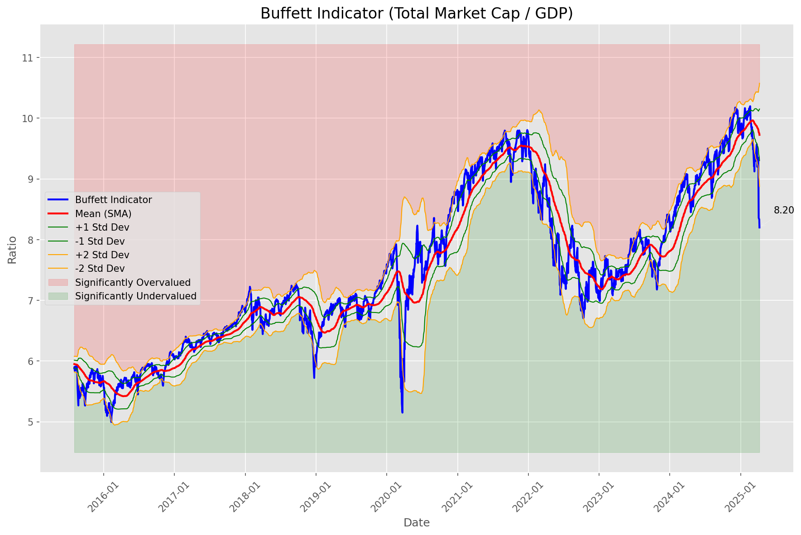
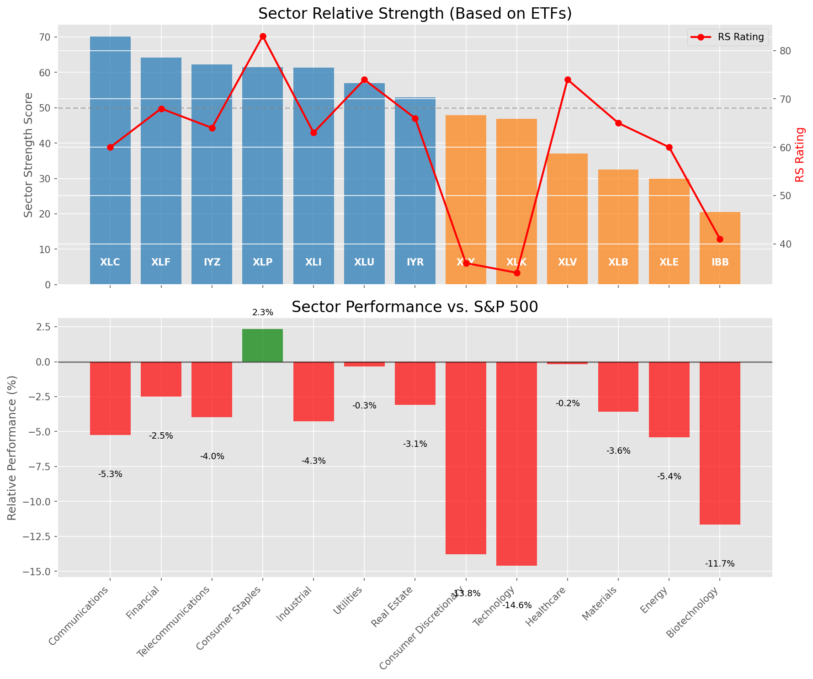

# Daily Relative Strength Report

**Date:** 2025-04-09

## Market Valuation (Buffett Indicator)

| Metric | Value |
|--------|-------|
| **Market Valuation** | **Significantly Undervalued** |
| **Current Ratio** | 9.03 |
| **Historical Mean** | 9.73 |
| **Standard Deviation** | 0.43 |
| **Z-Score (StdDev from Mean)** | -3.59 |
| **Total Market Cap** | $268.48 trillion |
| **GDP** | $29.72 trillion |

## Market Insights

### Market is Significantly Undervalued

The market has reached valuations significantly below historical norms, suggesting excessive pessimism. These levels have historically offered exceptional long-term buying opportunities. Investors should consider:

- Increasing equity exposure gradually
- Looking for quality companies with strong balance sheets trading at discounted valuations
- Watching for signs of market bottoming (capitulation, investor sentiment extremes)
- Developing a watchlist of fundamentally strong stocks building bases

While short-term volatility may continue, historical data suggests excellent long-term returns from these levels.

### Buffett Indicator Overview

The Buffett Indicator (Total Market Cap / GDP) is a measure of the stock market's valuation relative to the size of the economy. It is named after Warren Buffett, who described it as "probably the best single measure of where valuations stand at any given moment."

- **Values above +2 standard deviations:** Market significantly overvalued
- **Values above +1 standard deviation:** Market overvalued
- **Values between -1 and +1 standard deviations:** Market fairly valued
- **Values below -1 standard deviation:** Market undervalued
- **Values below -2 standard deviations:** Market significantly undervalued

**Based on William O'Neil's Relative Strength Methodology**

## Sector Relative Strength

| ETF | Strength | RS Rating | Performance | Above Key MAs | Trend | Sector |
|-----|----------|-----------|-------------|--------------|-------|--------|
| [XLC](https://www.tradingview.com/chart/?symbol=XLC) | 70.1 | 60.0 | -5.26% | 10d ✓, 50d ✗, 200d ✓ | ↗️ | Communications |
| [XLF](https://www.tradingview.com/chart/?symbol=XLF) | 64.2 | 68.0 | -2.50% | 10d ✗, 50d ✗, 200d ✓ | ↗️ | Financial |
| [IYZ](https://www.tradingview.com/chart/?symbol=IYZ) | 62.2 | 64.0 | -3.98% | 10d ✗, 50d ✗, 200d ✓ | ↗️ | Telecommunications |
| [XLP](https://www.tradingview.com/chart/?symbol=XLP) | 61.5 | 83.0 | 2.32% | 10d ✗, 50d ✗, 200d ✗ | ↗️ | Consumer Staples |
| [XLI](https://www.tradingview.com/chart/?symbol=XLI) | 61.4 | 63.0 | -4.28% | 10d ✓, 50d ✗, 200d ✗ | ↗️ | Industrial |
| [XLU](https://www.tradingview.com/chart/?symbol=XLU) | 57.0 | 74.0 | -0.33% | 10d ✗, 50d ✗, 200d ✗ | ↗️ | Utilities |
| [IYR](https://www.tradingview.com/chart/?symbol=IYR) | 53.0 | 66.0 | -3.09% | 10d ✗, 50d ✗, 200d ✗ | ↗️ | Real Estate |
| [XLY](https://www.tradingview.com/chart/?symbol=XLY) | 47.9 | 36.0 | -13.77% | 10d ✓, 50d ✗, 200d ✗ | ↗️ | Consumer Discretionary |
| [XLK](https://www.tradingview.com/chart/?symbol=XLK) | 46.9 | 34.0 | -14.61% | 10d ✓, 50d ✗, 200d ✗ | ↗️ | Technology |
| [XLV](https://www.tradingview.com/chart/?symbol=XLV) | 37.0 | 74.0 | -0.19% | 10d ✗, 50d ✗, 200d ✗ | ↘️ | Healthcare |
| [XLB](https://www.tradingview.com/chart/?symbol=XLB) | 32.5 | 65.0 | -3.57% | 10d ✗, 50d ✗, 200d ✗ | ↘️ | Materials |
| [XLE](https://www.tradingview.com/chart/?symbol=XLE) | 30.0 | 60.0 | -5.41% | 10d ✗, 50d ✗, 200d ✗ | ↘️ | Energy |
| [IBB](https://www.tradingview.com/chart/?symbol=IBB) | 20.5 | 41.0 | -11.66% | 10d ✗, 50d ✗, 200d ✗ | ↘️ | Biotechnology |

### Sector ETF Performance Interpretation

This table shows the relative strength metrics for different market sectors based on their representative ETFs:

- **ETF**: The ETF used to measure sector performance (click for chart)
- **Strength**: Overall sector strength score (0-100) combining multiple factors
- **RS Rating**: O'Neil RS rating of the sector ETF
- **Performance**: Performance of the sector ETF relative to SPY
- **Above Key MAs**: Whether the ETF is trading above its 10, 50, and 200-day moving averages
- **Trend**: Whether the sector is in an uptrend (↗️) or downtrend (↘️)

### Current Sector Leadership

The current market leadership is coming from the following sectors: **Communications, Financial, Telecommunications**.

The **Communications** sector (represented by **XLC**) is showing particularly strong relative strength with an RS rating of 60.0 and performance of -5.26% vs. the S&P 500. This sector is trading above its 10-day, 200-day moving average(s). Investors should consider focusing on high RS stocks within these leading sectors for potential outperformance.

## Buy Recommendations

The following 45 stocks show exceptional relative strength:

| RS Rating | Buy Score | Current Price | Chart | Name | Ticker |
|-----------|-----------|---------------|-------|------|--------|
| 97 | 100 | $29.51 | [Chart](https://www.tradingview.com/chart/?symbol=SGOL) | abrdn Physical Gold Shares ETF | SGOL |
| 94 | 100 | $103.20 | [Chart](https://www.tradingview.com/chart/?symbol=EHC) | Encompass Health Corporation Common Stock | EHC |
| 99 | 100 | $105.80 | [Chart](https://www.tradingview.com/chart/?symbol=AEM) | Agnico Eagle Mines Ltd. | AEM |
| 98 | 100 | $92.01 | [Chart](https://www.tradingview.com/chart/?symbol=PLTR) | Palantir Technologies Inc. Class A Common Stock | PLTR |
| 97 | 100 | $58.38 | [Chart](https://www.tradingview.com/chart/?symbol=IAU) | iShares Gold Trust | IAU |
| 98 | 100 | $39.97 | [Chart](https://www.tradingview.com/chart/?symbol=MRX) | Marex Group plc Ordinary Shares | MRX |
| 99 | 100 | $18.49 | [Chart](https://www.tradingview.com/chart/?symbol=SWI) | SolarWinds Corporation Common Stock | SWI |
| 97 | 100 | $61.26 | [Chart](https://www.tradingview.com/chart/?symbol=GLDM) | SPDR Gold MiniShares | GLDM |
| 100 | 100 | $26.54 | [Chart](https://www.tradingview.com/chart/?symbol=AGI) | Alamos Gold Inc. Class A Common Shares | AGI |
| 93 | 100 | $208.13 | [Chart](https://www.tradingview.com/chart/?symbol=TTWO) | Take-Two Interactive Software Inc | TTWO |
| 96 | 100 | $275.46 | [Chart](https://www.tradingview.com/chart/?symbol=PEN) | Penumbra, Inc. | PEN |
| 91 | 100 | $47.62 | [Chart](https://www.tradingview.com/chart/?symbol=GFL) | GFL Environmental Inc. Subordinate Voting Shares | GFL |
| 99 | 100 | $124.69 | [Chart](https://www.tradingview.com/chart/?symbol=UGL) | ProShares Ultra Gold | UGL |
| 97 | 100 | $285.38 | [Chart](https://www.tradingview.com/chart/?symbol=GLD) | SPDR Gold Trust, SPDR Gold Shares | GLD |
| 93 | 100 | $439.74 | [Chart](https://www.tradingview.com/chart/?symbol=CASY) | Casey's General Stores Inc | CASY |
| 90 | 100 | $31.83 | [Chart](https://www.tradingview.com/chart/?symbol=KTOS) | Kratos Defense & Security Solutions, Inc. | KTOS |
| 97 | 100 | $239.26 | [Chart](https://www.tradingview.com/chart/?symbol=RSG) | Republic Services Inc. | RSG |
| 97 | 100 | $30.84 | [Chart](https://www.tradingview.com/chart/?symbol=IAUM) | iShares Gold Trust Micro | IAUM |
| 99 | 100 | $30.74 | [Chart](https://www.tradingview.com/chart/?symbol=LTH) | Life Time Group Holdings, Inc. | LTH |
| 94 | 100 | $106.48 | [Chart](https://www.tradingview.com/chart/?symbol=ATGE) | Adtalem Global Education Inc. Common Shares | ATGE |
| 97 | 100 | $30.53 | [Chart](https://www.tradingview.com/chart/?symbol=BAR) | GraniteShares Gold Shares | BAR |
| 97 | 100 | $29.84 | [Chart](https://www.tradingview.com/chart/?symbol=OUNZ) | VanEck Merk Gold ETF | OUNZ |
| 99 | 100 | $55.80 | [Chart](https://www.tradingview.com/chart/?symbol=GDXJ) | VanEck Junior Gold Miners ETF | GDXJ |
| 100 | 100 | $143.13 | [Chart](https://www.tradingview.com/chart/?symbol=PLMR) | Palomar Holdings, Inc. Common stock | PLMR |
| 94 | 100 | $192.90 | [Chart](https://www.tradingview.com/chart/?symbol=WCN) | Waste Connections, Inc. | WCN |
| 92 | 100 | $153.66 | [Chart](https://www.tradingview.com/chart/?symbol=SFM) | Sprouts Farmers Market, Inc. | SFM |
| 89 | 100 | $27.53 | [Chart](https://www.tradingview.com/chart/?symbol=UTI) | Universal Technical Institute, Inc. | UTI |
| 100 | 100 | $128.86 | [Chart](https://www.tradingview.com/chart/?symbol=ROOT) | Root, Inc. Class A Common Stock | ROOT |
| 98 | 100 | $164.54 | [Chart](https://www.tradingview.com/chart/?symbol=RGLD) | Royal Gold Inc | RGLD |
| 96 | 100 | $521.41 | [Chart](https://www.tradingview.com/chart/?symbol=BRK.B) | BERKSHIRE HATHAWAY Class B | BRK.B |
| 96 | 100 | $220.44 | [Chart](https://www.tradingview.com/chart/?symbol=CVNA) | Carvana Co. | CVNA |
| 98 | 100 | $22.45 | [Chart](https://www.tradingview.com/chart/?symbol=SRAD) | Sportradar Group AG Class A Ordinary Shares | SRAD |
| 86 | 98 | $44.61 | [Chart](https://www.tradingview.com/chart/?symbol=MRCY) | Mercury Systems Inc. | MRCY |
| 87 | 98 | $111.14 | [Chart](https://www.tradingview.com/chart/?symbol=CWST) | Casella Waste Systems Inc | CWST |
| 83 | 97 | $207.07 | [Chart](https://www.tradingview.com/chart/?symbol=IDCC) | InterDigital, Inc. | IDCC |
| 88 | 97 | $76.47 | [Chart](https://www.tradingview.com/chart/?symbol=FAST) | Fastenal Co | FAST |
| 85 | 97 | $34.26 | [Chart](https://www.tradingview.com/chart/?symbol=DRS) | Leonardo DRS, Inc. Common Stock | DRS |
| 87 | 96 | $218.50 | [Chart](https://www.tradingview.com/chart/?symbol=PAYC) | PAYCOM SOFTWARE, INC. | PAYC |
| 86 | 96 | $126.05 | [Chart](https://www.tradingview.com/chart/?symbol=TJX) | TJX Companies, Inc. (The) | TJX |
| 83 | 96 | $17.90 | [Chart](https://www.tradingview.com/chart/?symbol=GRND) | Grindr Inc. | GRND |
| 83 | 95 | $22.49 | [Chart](https://www.tradingview.com/chart/?symbol=ATSG) | Air Transport Services Group, Inc. | ATSG |
| 83 | 94 | $74.71 | [Chart](https://www.tradingview.com/chart/?symbol=BRBR) | BellRing Brands, Inc. | BRBR |
| 80 | 93 | $111.60 | [Chart](https://www.tradingview.com/chart/?symbol=BOXX) | Alpha Architect 1-3 Month Box ETF | BOXX |
| 80 | 92 | $53.35 | [Chart](https://www.tradingview.com/chart/?symbol=ACIW) | ACI Worldwide, Inc. | ACIW |
| 82 | 92 | $60.23 | [Chart](https://www.tradingview.com/chart/?symbol=RYTM) | Rhythm Pharmaceuticals, Inc. Common Stock | RYTM |

## Sell Recommendations

The following 32 stocks show deteriorating relative strength:

| RS Rating | Sell Score | Current Price | Chart | Name | Ticker |
|-----------|------------|---------------|-------|------|--------|
| 5 | 100 | $13.01 | [Chart](https://www.tradingview.com/chart/?symbol=GCT) | GigaCloud Technology Inc Class A Ordinary Shares | GCT |
| 4 | 100 | $12.31 | [Chart](https://www.tradingview.com/chart/?symbol=MARA) | MARA Holdings, Inc. Common Stock | MARA |
| 10 | 100 | $42.93 | [Chart](https://www.tradingview.com/chart/?symbol=EDU) | New Oriental Education and Technology Group, Inc. American Depositary Shares (each representing ten (10) Common Shares) | EDU |
| 5 | 100 | $10.10 | [Chart](https://www.tradingview.com/chart/?symbol=CGEM) | Cullinan Therapeutics, Inc. Common Stock | CGEM |
| 12 | 100 | $28.25 | [Chart](https://www.tradingview.com/chart/?symbol=SRDX) | Surmodics, Inc. Common Stock | SRDX |
| 3 | 98 | $20.27 | [Chart](https://www.tradingview.com/chart/?symbol=DJT) | Trump Media & Technology Group Corp. Common Stock | DJT |
| 12 | 96 | $11.78 | [Chart](https://www.tradingview.com/chart/?symbol=AEYE) | AudioEye, Inc. Common Stock | AEYE |
| 10 | 96 | $17.90 | [Chart](https://www.tradingview.com/chart/?symbol=INFA) | Informatica Inc. | INFA |
| 16 | 95 | $54.13 | [Chart](https://www.tradingview.com/chart/?symbol=ENPH) | Enphase Energy, Inc. | ENPH |
| 20 | 94 | $10.03 | [Chart](https://www.tradingview.com/chart/?symbol=MTAL) | MAC Copper Limited | MTAL |
| 13 | 93 | $10.24 | [Chart](https://www.tradingview.com/chart/?symbol=EXPI) | eXp World Holdings, Inc. Common Stock | EXPI |
| 12 | 92 | $10.77 | [Chart](https://www.tradingview.com/chart/?symbol=SONO) | Sonos, Inc. Common Stock | SONO |
| 18 | 92 | $10.49 | [Chart](https://www.tradingview.com/chart/?symbol=PEB) | Pebblebrook Hotel Trust | PEB |
| 13 | 92 | $10.28 | [Chart](https://www.tradingview.com/chart/?symbol=CMP) | Compass Minerals International, Inc. | CMP |
| 15 | 90 | $11.77 | [Chart](https://www.tradingview.com/chart/?symbol=RIVN) | Rivian Automotive, Inc. Class A Common Stock | RIVN |
| 16 | 90 | $10.15 | [Chart](https://www.tradingview.com/chart/?symbol=HLIT) | Harmonic Inc | HLIT |
| 20 | 89 | $27.97 | [Chart](https://www.tradingview.com/chart/?symbol=TAN) | Invesco Solar ETF | TAN |
| 17 | 88 | $11.34 | [Chart](https://www.tradingview.com/chart/?symbol=HPK) | HighPeak Energy, Inc. Common Stock | HPK |
| 14 | 88 | $20.69 | [Chart](https://www.tradingview.com/chart/?symbol=HZO) | MarineMax, Inc. | HZO |
| 24 | 88 | $10.11 | [Chart](https://www.tradingview.com/chart/?symbol=CELC) | Celcuity Inc. Common Stock | CELC |
| 21 | 87 | $23.68 | [Chart](https://www.tradingview.com/chart/?symbol=HOG) | Harley-Davidson, Inc. | HOG |
| 26 | 84 | $10.71 | [Chart](https://www.tradingview.com/chart/?symbol=DBRG) | DigitalBridge Group, Inc. | DBRG |
| 34 | 83 | $14.36 | [Chart](https://www.tradingview.com/chart/?symbol=FXN) | First Trust Energy AlphaDEX Fund | FXN |
| 32 | 82 | $10.30 | [Chart](https://www.tradingview.com/chart/?symbol=CSTM) | Constellium SE Class A Ordinary shares | CSTM |
| 28 | 81 | $56.78 | [Chart](https://www.tradingview.com/chart/?symbol=CNMD) | CONMED Corporation | CNMD |
| 21 | 81 | $13.38 | [Chart](https://www.tradingview.com/chart/?symbol=MANU) | MANCHESTER UNITED PLC | MANU |
| 28 | 80 | $11.00 | [Chart](https://www.tradingview.com/chart/?symbol=LBTYK) | Liberty Global Ltd. Class C Common Shares | LBTYK |
| 38 | 80 | $11.82 | [Chart](https://www.tradingview.com/chart/?symbol=DAWN) | Day One Biopharmaceuticals, Inc. Common Stock | DAWN |
| 29 | 76 | $10.34 | [Chart](https://www.tradingview.com/chart/?symbol=CMRE) | Costamare Inc. | CMRE |
| 29 | 75 | $53.26 | [Chart](https://www.tradingview.com/chart/?symbol=HXL) | Hexcel Corporation | HXL |
| 36 | 66 | $50.93 | [Chart](https://www.tradingview.com/chart/?symbol=CMG) | Chipotle Mexican Grill, Inc. | CMG |
| 38 | 63 | $35.01 | [Chart](https://www.tradingview.com/chart/?symbol=LIT) | Global X Lithium & Battery Tech ETF | LIT |

## Methodology

This report uses William O'Neil's relative strength methodology from Investors Business Daily:

* **RS Rating**: Percentile rank of stock's performance vs. S&P 500 over the past 63 trading days (1-99 scale)
* **Buy Criteria**: RS Rating >= 80, price above 50-day MA, strong uptrend, increasing volume
* **Sell Criteria**: RS Rating < 40, price below 50-day MA, downtrend, decreasing volume

### O'Neil's Key Principles

1. **Focus on relative performance** - stocks outperforming the market
2. **Price trend confirmation** - stock must be in an uptrend
3. **Volume confirmation** - strong volume supports price moves
4. **Moving average validation** - price above key moving averages
5. **Market leaders only** - concentrate on top-performing stocks

*Report generated automatically after market close*