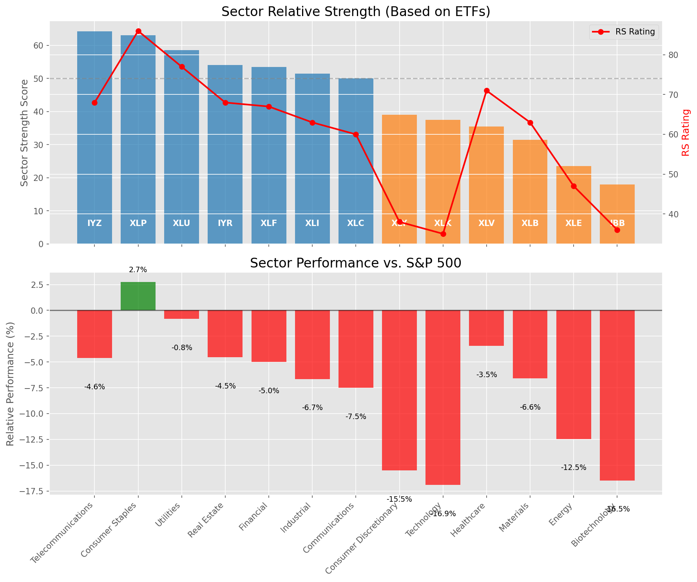

# Daily Relative Strength Report

**Date:** 2025-04-10

## Market Valuation (Buffett Indicator)

| Metric | Value |
|--------|-------|
| **Market Valuation** | **Undervalued** |
| **Current Ratio** | 8.66 |
| **Historical Mean** | 9.71 |
| **Standard Deviation** | 0.43 |
| **Z-Score (StdDev from Mean)** | -1.58 |
| **Total Market Cap** | $257.38 trillion |
| **GDP** | $29.72 trillion |

## Market Insights

### Market is Undervalued

The market is trading below historical average valuations, suggesting potential opportunity. These conditions have historically preceded periods of above-average returns. Investors should:

- Look for stocks breaking out of consolidation patterns on increasing volume
- Focus on sectors showing relative strength
- Consider increasing equity exposure, particularly in quality names
- Be mindful of overall market direction and avoid fighting the trend

History suggests patient investors are often rewarded when investing during periods of undervaluation.

### Buffett Indicator Overview

The Buffett Indicator (Total Market Cap / GDP) is a measure of the stock market's valuation relative to the size of the economy. It is named after Warren Buffett, who described it as "probably the best single measure of where valuations stand at any given moment."

- **Values above +2 standard deviations:** Market significantly overvalued
- **Values above +1 standard deviation:** Market overvalued
- **Values between -1 and +1 standard deviations:** Market fairly valued
- **Values below -1 standard deviation:** Market undervalued
- **Values below -2 standard deviations:** Market significantly undervalued

**Based on William O'Neil's Relative Strength Methodology**

## Sector Relative Strength

| ETF | Strength | RS Rating | Performance | Above Key MAs | Trend | Sector |
|-----|----------|-----------|-------------|--------------|-------|--------|
| [IYZ](https://www.tradingview.com/chart/?symbol=IYZ) | 63.7 | 67.0 | -4.70% | 10d ✗, 50d ✗, 200d ✓ | ↗️ | Telecommunications |
| [XLP](https://www.tradingview.com/chart/?symbol=XLP) | 63.0 | 86.0 | 2.96% | 10d ✗, 50d ✗, 200d ✗ | ↗️ | Consumer Staples |
| [XLU](https://www.tradingview.com/chart/?symbol=XLU) | 58.5 | 77.0 | -0.43% | 10d ✗, 50d ✗, 200d ✗ | ↗️ | Utilities |
| [IYR](https://www.tradingview.com/chart/?symbol=IYR) | 54.0 | 68.0 | -4.43% | 10d ✗, 50d ✗, 200d ✗ | ↗️ | Real Estate |
| [XLF](https://www.tradingview.com/chart/?symbol=XLF) | 53.0 | 66.0 | -5.14% | 10d ✗, 50d ✗, 200d ✗ | ↗️ | Financial |
| [XLI](https://www.tradingview.com/chart/?symbol=XLI) | 51.5 | 63.0 | -6.59% | 10d ✗, 50d ✗, 200d ✗ | ↗️ | Industrial |
| [XLC](https://www.tradingview.com/chart/?symbol=XLC) | 50.0 | 60.0 | -7.48% | 10d ✗, 50d ✗, 200d ✗ | ↗️ | Communications |
| [XLY](https://www.tradingview.com/chart/?symbol=XLY) | 39.5 | 39.0 | -15.51% | 10d ✗, 50d ✗, 200d ✗ | ↗️ | Consumer Discretionary |
| [XLK](https://www.tradingview.com/chart/?symbol=XLK) | 38.0 | 36.0 | -17.03% | 10d ✗, 50d ✗, 200d ✗ | ↗️ | Technology |
| [XLV](https://www.tradingview.com/chart/?symbol=XLV) | 35.5 | 71.0 | -3.16% | 10d ✗, 50d ✗, 200d ✗ | ↘️ | Healthcare |
| [XLB](https://www.tradingview.com/chart/?symbol=XLB) | 31.5 | 63.0 | -6.32% | 10d ✗, 50d ✗, 200d ✗ | ↘️ | Materials |
| [XLE](https://www.tradingview.com/chart/?symbol=XLE) | 23.0 | 46.0 | -12.66% | 10d ✗, 50d ✗, 200d ✗ | ↘️ | Energy |
| [IBB](https://www.tradingview.com/chart/?symbol=IBB) | 19.0 | 38.0 | -16.22% | 10d ✗, 50d ✗, 200d ✗ | ↘️ | Biotechnology |

### Sector ETF Performance Interpretation

This table shows the relative strength metrics for different market sectors based on their representative ETFs:

- **ETF**: The ETF used to measure sector performance (click for chart)
- **Strength**: Overall sector strength score (0-100) combining multiple factors
- **RS Rating**: O'Neil RS rating of the sector ETF
- **Performance**: Performance of the sector ETF relative to SPY
- **Above Key MAs**: Whether the ETF is trading above its 10, 50, and 200-day moving averages
- **Trend**: Whether the sector is in an uptrend (↗️) or downtrend (↘️)

### Current Sector Leadership

The current market leadership is coming from the following sectors: **Telecommunications, Consumer Staples, Utilities**.

The **Telecommunications** sector (represented by **IYZ**) is showing particularly strong relative strength with an RS rating of 67.0 and performance of -4.70% vs. the S&P 500. This sector is trading above its 200-day moving average(s). Investors should consider focusing on high RS stocks within these leading sectors for potential outperformance.

## Buy Recommendations

The following 46 stocks show exceptional relative strength:

| RS Rating | Buy Score | Current Price | Chart | Name | Ticker |
|-----------|-----------|---------------|-------|------|--------|
| 99 | 100 | $117.56 | [Chart](https://www.tradingview.com/chart/?symbol=BJ) | BJs Wholesale Club Holdings, Inc. Common Stock | BJ |
| 99 | 100 | $18.48 | [Chart](https://www.tradingview.com/chart/?symbol=SWI) | SolarWinds Corporation Common Stock | SWI |
| 99 | 100 | $77.74 | [Chart](https://www.tradingview.com/chart/?symbol=WPM) | Wheaton Precious Metals Corp. Common Stock | WPM |
| 93 | 100 | $40.74 | [Chart](https://www.tradingview.com/chart/?symbol=BTI) | British American Tobacco p.l.c. American Depositary Shares, American Depositary Shares, each representing one Ordinary Share | BTI |
| 95 | 100 | $67.67 | [Chart](https://www.tradingview.com/chart/?symbol=KR) | The Kroger Co. | KR |
| 97 | 100 | $59.81 | [Chart](https://www.tradingview.com/chart/?symbol=IAU) | iShares Gold Trust | IAU |
| 93 | 100 | $153.97 | [Chart](https://www.tradingview.com/chart/?symbol=SFM) | Sprouts Farmers Market, Inc. | SFM |
| 88 | 100 | $33.84 | [Chart](https://www.tradingview.com/chart/?symbol=DRS) | Leonardo DRS, Inc. Common Stock | DRS |
| 94 | 100 | $102.59 | [Chart](https://www.tradingview.com/chart/?symbol=EHC) | Encompass Health Corporation Common Stock | EHC |
| 100 | 100 | $112.34 | [Chart](https://www.tradingview.com/chart/?symbol=AEM) | Agnico Eagle Mines Ltd. | AEM |
| 90 | 100 | $116.06 | [Chart](https://www.tradingview.com/chart/?symbol=IDA) | IDACORP, Inc. | IDA |
| 97 | 100 | $30.26 | [Chart](https://www.tradingview.com/chart/?symbol=SGOL) | abrdn Physical Gold Shares ETF | SGOL |
| 93 | 100 | $31.69 | [Chart](https://www.tradingview.com/chart/?symbol=KTOS) | Kratos Defense & Security Solutions, Inc. | KTOS |
| 99 | 100 | $143.28 | [Chart](https://www.tradingview.com/chart/?symbol=PLMR) | Palomar Holdings, Inc. Common stock | PLMR |
| 97 | 100 | $24.31 | [Chart](https://www.tradingview.com/chart/?symbol=PHYS) | Sprott Physical Gold Trust | PHYS |
| 97 | 100 | $239.30 | [Chart](https://www.tradingview.com/chart/?symbol=RSG) | Republic Services Inc. | RSG |
| 100 | 100 | $28.20 | [Chart](https://www.tradingview.com/chart/?symbol=AGI) | Alamos Gold Inc. Class A Common Shares | AGI |
| 97 | 100 | $292.42 | [Chart](https://www.tradingview.com/chart/?symbol=GLD) | SPDR Gold Trust, SPDR Gold Shares | GLD |
| 99 | 100 | $58.37 | [Chart](https://www.tradingview.com/chart/?symbol=GDXJ) | VanEck Junior Gold Miners ETF | GDXJ |
| 99 | 100 | $130.99 | [Chart](https://www.tradingview.com/chart/?symbol=UGL) | ProShares Ultra Gold | UGL |
| 95 | 100 | $52.37 | [Chart](https://www.tradingview.com/chart/?symbol=SKWD) | Skyward Specialty Insurance Group, Inc. Common Stock | SKWD |
| 99 | 100 | $15.44 | [Chart](https://www.tradingview.com/chart/?symbol=EZPW) | Ezcorp Inc | EZPW |
| 93 | 100 | $113.68 | [Chart](https://www.tradingview.com/chart/?symbol=OLLI) | Ollie's Bargain Outlet Holdings, Inc. Common Stock | OLLI |
| 92 | 100 | $47.62 | [Chart](https://www.tradingview.com/chart/?symbol=GFL) | GFL Environmental Inc. Subordinate Voting Shares | GFL |
| 97 | 100 | $31.28 | [Chart](https://www.tradingview.com/chart/?symbol=BAR) | GraniteShares Gold Shares | BAR |
| 97 | 100 | $36.33 | [Chart](https://www.tradingview.com/chart/?symbol=CNP) | CenterPoint Energy, Inc. | CNP |
| 97 | 100 | $31.63 | [Chart](https://www.tradingview.com/chart/?symbol=IAUM) | iShares Gold Trust Micro | IAUM |
| 95 | 100 | $27.98 | [Chart](https://www.tradingview.com/chart/?symbol=CEF) | Sprott Physical Gold and Silver Trust | CEF |
| 93 | 100 | $103.87 | [Chart](https://www.tradingview.com/chart/?symbol=ATGE) | Adtalem Global Education Inc. Common Shares | ATGE |
| 88 | 100 | $44.42 | [Chart](https://www.tradingview.com/chart/?symbol=MRCY) | Mercury Systems Inc. | MRCY |
| 96 | 100 | $21.77 | [Chart](https://www.tradingview.com/chart/?symbol=OR) | Osisko Gold Royalties Ltd | OR |
| 97 | 100 | $30.58 | [Chart](https://www.tradingview.com/chart/?symbol=OUNZ) | VanEck Merk Gold ETF | OUNZ |
| 91 | 100 | $113.72 | [Chart](https://www.tradingview.com/chart/?symbol=CWST) | Casella Waste Systems Inc | CWST |
| 94 | 100 | $273.36 | [Chart](https://www.tradingview.com/chart/?symbol=PGR) | Progressive Corporation | PGR |
| 97 | 100 | $62.81 | [Chart](https://www.tradingview.com/chart/?symbol=GLDM) | SPDR Gold MiniShares | GLDM |
| 99 | 100 | $171.69 | [Chart](https://www.tradingview.com/chart/?symbol=RGLD) | Royal Gold Inc | RGLD |
| 90 | 100 | $127.53 | [Chart](https://www.tradingview.com/chart/?symbol=TJX) | TJX Companies, Inc. (The) | TJX |
| 94 | 100 | $438.89 | [Chart](https://www.tradingview.com/chart/?symbol=CASY) | Casey's General Stores Inc | CASY |
| 96 | 100 | $37.42 | [Chart](https://www.tradingview.com/chart/?symbol=MRX) | Marex Group plc Ordinary Shares | MRX |
| 98 | 100 | $21.81 | [Chart](https://www.tradingview.com/chart/?symbol=SRAD) | Sportradar Group AG Class A Ordinary Shares | SRAD |
| 86 | 97 | $74.79 | [Chart](https://www.tradingview.com/chart/?symbol=BRBR) | BellRing Brands, Inc. | BRBR |
| 85 | 97 | $22.48 | [Chart](https://www.tradingview.com/chart/?symbol=ATSG) | Air Transport Services Group, Inc. | ATSG |
| 85 | 96 | $35.87 | [Chart](https://www.tradingview.com/chart/?symbol=FYBR) | Frontier Communications Parent, Inc. Common Stock | FYBR |
| 83 | 96 | $111.59 | [Chart](https://www.tradingview.com/chart/?symbol=BOXX) | Alpha Architect 1-3 Month Box ETF | BOXX |
| 84 | 94 | $22.46 | [Chart](https://www.tradingview.com/chart/?symbol=PYCR) | Paycor HCM, Inc. Common Stock | PYCR |
| 80 | 90 | $20.69 | [Chart](https://www.tradingview.com/chart/?symbol=BSCP) | Invesco BulletShares 2025 Corporate Bond ETF | BSCP |

## Sell Recommendations

The following 42 stocks show deteriorating relative strength:

| RS Rating | Sell Score | Current Price | Chart | Name | Ticker |
|-----------|------------|---------------|-------|------|--------|
| 12 | 100 | $43.24 | [Chart](https://www.tradingview.com/chart/?symbol=EDU) | New Oriental Education and Technology Group, Inc. American Depositary Shares (each representing ten (10) Common Shares) | EDU |
| 5 | 100 | $11.76 | [Chart](https://www.tradingview.com/chart/?symbol=GCT) | GigaCloud Technology Inc Class A Ordinary Shares | GCT |
| 1 | 100 | $66.04 | [Chart](https://www.tradingview.com/chart/?symbol=PI) | Impinj, Inc. Common Stock | PI |
| 8 | 100 | $10.10 | [Chart](https://www.tradingview.com/chart/?symbol=CGEM) | Cullinan Therapeutics, Inc. Common Stock | CGEM |
| 15 | 100 | $28.25 | [Chart](https://www.tradingview.com/chart/?symbol=SRDX) | Surmodics, Inc. Common Stock | SRDX |
| 3 | 99 | $18.91 | [Chart](https://www.tradingview.com/chart/?symbol=DJT) | Trump Media & Technology Group Corp. Common Stock | DJT |
| 6 | 99 | $35.43 | [Chart](https://www.tradingview.com/chart/?symbol=HELE) | Helen Of Troy Ltd | HELE |
| 12 | 99 | $49.37 | [Chart](https://www.tradingview.com/chart/?symbol=ENPH) | Enphase Energy, Inc. | ENPH |
| 7 | 95 | $11.65 | [Chart](https://www.tradingview.com/chart/?symbol=MARA) | MARA Holdings, Inc. Common Stock | MARA |
| 15 | 94 | $11.78 | [Chart](https://www.tradingview.com/chart/?symbol=AEYE) | AudioEye, Inc. Common Stock | AEYE |
| 15 | 93 | $20.91 | [Chart](https://www.tradingview.com/chart/?symbol=HOG) | Harley-Davidson, Inc. | HOG |
| 24 | 92 | $13.16 | [Chart](https://www.tradingview.com/chart/?symbol=FXN) | First Trust Energy AlphaDEX Fund | FXN |
| 13 | 92 | $19.10 | [Chart](https://www.tradingview.com/chart/?symbol=HZO) | MarineMax, Inc. | HZO |
| 26 | 91 | $10.03 | [Chart](https://www.tradingview.com/chart/?symbol=MTAL) | MAC Copper Limited | MTAL |
| 17 | 90 | $26.57 | [Chart](https://www.tradingview.com/chart/?symbol=TAN) | Invesco Solar ETF | TAN |
| 14 | 89 | $48.37 | [Chart](https://www.tradingview.com/chart/?symbol=RHI) | Robert Half Inc. | RHI |
| 17 | 89 | $10.24 | [Chart](https://www.tradingview.com/chart/?symbol=EXPI) | eXp World Holdings, Inc. Common Stock | EXPI |
| 16 | 88 | $10.77 | [Chart](https://www.tradingview.com/chart/?symbol=SONO) | Sonos, Inc. Common Stock | SONO |
| 19 | 87 | $10.06 | [Chart](https://www.tradingview.com/chart/?symbol=CMP) | Compass Minerals International, Inc. | CMP |
| 23 | 87 | $52.59 | [Chart](https://www.tradingview.com/chart/?symbol=CNMD) | CONMED Corporation | CNMD |
| 24 | 85 | $10.49 | [Chart](https://www.tradingview.com/chart/?symbol=PEB) | Pebblebrook Hotel Trust | PEB |
| 17 | 84 | $111.25 | [Chart](https://www.tradingview.com/chart/?symbol=MYRG) | MYR Group, Inc. | MYRG |
| 28 | 83 | $13.09 | [Chart](https://www.tradingview.com/chart/?symbol=MED) | Medifast, Inc. | MED |
| 22 | 83 | $10.15 | [Chart](https://www.tradingview.com/chart/?symbol=HLIT) | Harmonic Inc | HLIT |
| 22 | 83 | $11.36 | [Chart](https://www.tradingview.com/chart/?symbol=RIVN) | Rivian Automotive, Inc. Class A Common Stock | RIVN |
| 23 | 82 | $11.34 | [Chart](https://www.tradingview.com/chart/?symbol=HPK) | HighPeak Energy, Inc. Common Stock | HPK |
| 31 | 81 | $10.11 | [Chart](https://www.tradingview.com/chart/?symbol=CELC) | Celcuity Inc. Common Stock | CELC |
| 21 | 79 | $347.85 | [Chart](https://www.tradingview.com/chart/?symbol=SAIA) | Saia, Inc. | SAIA |
| 26 | 79 | $10.04 | [Chart](https://www.tradingview.com/chart/?symbol=HTLD) | Heartland Express Inc | HTLD |
| 27 | 79 | $51.12 | [Chart](https://www.tradingview.com/chart/?symbol=HXL) | Hexcel Corporation | HXL |
| 27 | 78 | $17.55 | [Chart](https://www.tradingview.com/chart/?symbol=IART) | Integra LifeSciences Holdings | IART |
| 33 | 78 | $10.71 | [Chart](https://www.tradingview.com/chart/?symbol=DBRG) | DigitalBridge Group, Inc. | DBRG |
| 31 | 74 | $22.18 | [Chart](https://www.tradingview.com/chart/?symbol=AMRK) | A-Mark Precious Metals, Inc. | AMRK |
| 39 | 73 | $10.30 | [Chart](https://www.tradingview.com/chart/?symbol=CSTM) | Constellium SE Class A Ordinary shares | CSTM |
| 29 | 73 | $13.42 | [Chart](https://www.tradingview.com/chart/?symbol=MANU) | MANCHESTER UNITED PLC | MANU |
| 37 | 71 | $10.94 | [Chart](https://www.tradingview.com/chart/?symbol=LBTYK) | Liberty Global Ltd. Class C Common Shares | LBTYK |
| 35 | 71 | $16.62 | [Chart](https://www.tradingview.com/chart/?symbol=CTRI) | Centuri Holdings, Inc. | CTRI |
| 38 | 70 | $11.25 | [Chart](https://www.tradingview.com/chart/?symbol=NAVI) | Navient Corporation | NAVI |
| 36 | 69 | $10.34 | [Chart](https://www.tradingview.com/chart/?symbol=CMRE) | Costamare Inc. | CMRE |
| 36 | 69 | $56.46 | [Chart](https://www.tradingview.com/chart/?symbol=BMRN) | BioMarin Pharmaceuticals Inc | BMRN |
| 35 | 65 | $24.77 | [Chart](https://www.tradingview.com/chart/?symbol=RAMP) | LiveRamp Holdings, Inc. Common Stock | RAMP |
| 37 | 63 | $105.88 | [Chart](https://www.tradingview.com/chart/?symbol=MHO) | M/I Homes, Inc. | MHO |

## Methodology

This report uses William O'Neil's relative strength methodology from Investors Business Daily:

* **RS Rating**: Percentile rank of stock's performance vs. S&P 500 over the past 63 trading days (1-99 scale)
* **Buy Criteria**: RS Rating >= 80, price above 50-day MA, strong uptrend, increasing volume
* **Sell Criteria**: RS Rating < 40, price below 50-day MA, downtrend, decreasing volume

### O'Neil's Key Principles

1. **Focus on relative performance** - stocks outperforming the market
2. **Price trend confirmation** - stock must be in an uptrend
3. **Volume confirmation** - strong volume supports price moves
4. **Moving average validation** - price above key moving averages
5. **Market leaders only** - concentrate on top-performing stocks

*Report generated automatically after market close*