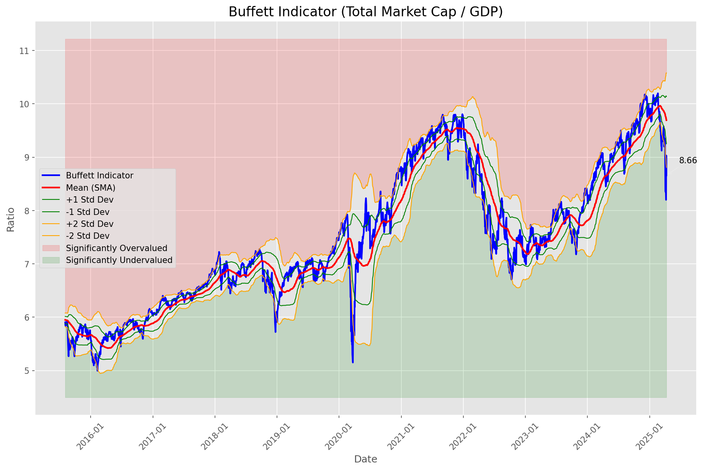
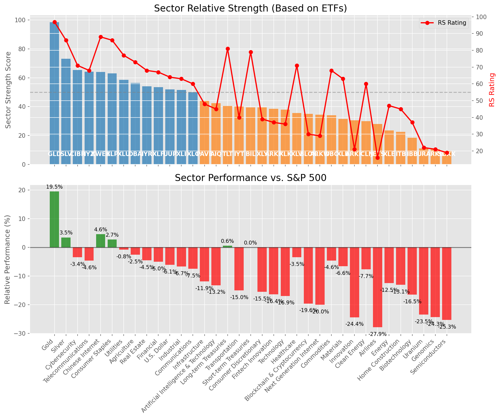

# **Daily Relative Strength Report**

**Date:** 2025-04-11

## **Market Valuation (Buffett Indicator)**

| Metric | Value |
|--------|-------|
| **Market Valuation** | **Undervalued** |
| **Current Ratio** | 8.66 |
| **Historical Mean** | 9.71 |
| **Standard Deviation** | 0.43 |
| **Z-Score (StdDev from Mean)** | -1.58 |
| **Total Market Cap** | $257.43 trillion |
| **GDP** | $29.72 trillion |

## **Market Insights**

### **Market is Undervalued**

The market is trading below historical average valuations, suggesting potential opportunity. These conditions have historically preceded periods of above-average returns. Investors should:

- Look for stocks breaking out of consolidation patterns on increasing volume
- Focus on sectors showing relative strength
- Consider increasing equity exposure, particularly in quality names
- Be mindful of overall market direction and avoid fighting the trend

History suggests patient investors are often rewarded when investing during periods of undervaluation.

### **Buffett Indicator Overview**

The Buffett Indicator (Total Market Cap / GDP) is a measure of the stock market's valuation relative to the size of the economy. It is named after Warren Buffett, who described it as "probably the best single measure of where valuations stand at any given moment."

- **Values above +2 standard deviations:** Market significantly overvalued
- **Values above +1 standard deviation:** Market overvalued
- **Values between -1 and +1 standard deviations:** Market fairly valued
- **Values below -1 standard deviation:** Market undervalued
- **Values below -2 standard deviations:** Market significantly undervalued

---

## **Sector Relative Strength**

Based on William O'Neil's Relative Strength Methodology

| ETF | Strength | RS Rating | Performance | Above Key MAs | Trend | Sector |
|-----|----------|-----------|-------------|--------------|-------|--------|
| [GLD](https://www.tradingview.com/chart/?symbol=GLD) | 98.5 | 97.0 | 19.54% | 10d ✓, 50d ✓, 200d ✓ | ↗️ | Gold |
| [SLV](https://www.tradingview.com/chart/?symbol=SLV) | 73.2 | 86.0 | 3.48% | 10d ✗, 50d ✗, 200d ✓ | ↗️ | Silver |
| [CIBR](https://www.tradingview.com/chart/?symbol=CIBR) | 65.4 | 71.0 | -3.45% | 10d ✓, 50d ✗, 200d ✗ | ↗️ | Cybersecurity |
| [IYZ](https://www.tradingview.com/chart/?symbol=IYZ) | 64.2 | 68.0 | -4.62% | 10d ✗, 50d ✗, 200d ✓ | ↗️ | Telecommunications |
| [KWEB](https://www.tradingview.com/chart/?symbol=KWEB) | 64.0 | 88.0 | 4.59% | 10d ✗, 50d ✗, 200d ✗ | ↗️ | Chinese Internet |
| [XLP](https://www.tradingview.com/chart/?symbol=XLP) | 63.0 | 86.0 | 2.73% | 10d ✗, 50d ✗, 200d ✗ | ↗️ | Consumer Staples |
| [XLU](https://www.tradingview.com/chart/?symbol=XLU) | 58.5 | 77.0 | -0.83% | 10d ✗, 50d ✗, 200d ✗ | ↗️ | Utilities |
| [DBA](https://www.tradingview.com/chart/?symbol=DBA) | 56.5 | 73.0 | -2.53% | 10d ✗, 50d ✗, 200d ✗ | ↗️ | Agriculture |
| [IYR](https://www.tradingview.com/chart/?symbol=IYR) | 54.0 | 68.0 | -4.55% | 10d ✗, 50d ✗, 200d ✗ | ↗️ | Real Estate |
| [XLF](https://www.tradingview.com/chart/?symbol=XLF) | 53.5 | 67.0 | -5.01% | 10d ✗, 50d ✗, 200d ✗ | ↗️ | Financial |
| [UUP](https://www.tradingview.com/chart/?symbol=UUP) | 52.0 | 64.0 | -6.10% | 10d ✗, 50d ✗, 200d ✗ | ↗️ | U.S. Dollar |
| [XLI](https://www.tradingview.com/chart/?symbol=XLI) | 51.5 | 63.0 | -6.66% | 10d ✗, 50d ✗, 200d ✗ | ↗️ | Industrial |
| [XLC](https://www.tradingview.com/chart/?symbol=XLC) | 50.0 | 60.0 | -7.50% | 10d ✗, 50d ✗, 200d ✗ | ↗️ | Communications |
| [PAVE](https://www.tradingview.com/chart/?symbol=PAVE) | 44.0 | 48.0 | -11.87% | 10d ✗, 50d ✗, 200d ✗ | ↗️ | Infrastructure |
| [AIQ](https://www.tradingview.com/chart/?symbol=AIQ) | 42.5 | 45.0 | -13.22% | 10d ✗, 50d ✗, 200d ✗ | ↗️ | Artificial Intelligence & Technology |
| [TLT](https://www.tradingview.com/chart/?symbol=TLT) | 40.5 | 81.0 | 0.58% | 10d ✗, 50d ✗, 200d ✗ | ↘️ | Long-term Treasuries |
| [IYT](https://www.tradingview.com/chart/?symbol=IYT) | 40.0 | 40.0 | -15.05% | 10d ✗, 50d ✗, 200d ✗ | ↗️ | Transportation |
| [BIL](https://www.tradingview.com/chart/?symbol=BIL) | 39.5 | 79.0 | 0.03% | 10d ✗, 50d ✗, 200d ✗ | ↘️ | Short-term Treasuries |
| [XLY](https://www.tradingview.com/chart/?symbol=XLY) | 39.5 | 39.0 | -15.50% | 10d ✗, 50d ✗, 200d ✗ | ↗️ | Consumer Discretionary |
| [ARKF](https://www.tradingview.com/chart/?symbol=ARKF) | 38.5 | 37.0 | -16.38% | 10d ✗, 50d ✗, 200d ✗ | ↗️ | Fintech Innovation |
| [XLK](https://www.tradingview.com/chart/?symbol=XLK) | 38.0 | 36.0 | -16.92% | 10d ✗, 50d ✗, 200d ✗ | ↗️ | Technology |
| [XLV](https://www.tradingview.com/chart/?symbol=XLV) | 35.5 | 71.0 | -3.45% | 10d ✗, 50d ✗, 200d ✗ | ↘️ | Healthcare |
| [BLOK](https://www.tradingview.com/chart/?symbol=BLOK) | 35.0 | 30.0 | -19.59% | 10d ✗, 50d ✗, 200d ✗ | ↗️ | Blockchain & Cryptocurrency |
| [ARKW](https://www.tradingview.com/chart/?symbol=ARKW) | 34.5 | 29.0 | -20.02% | 10d ✗, 50d ✗, 200d ✗ | ↗️ | Next Generation Internet |
| [DBC](https://www.tradingview.com/chart/?symbol=DBC) | 34.0 | 68.0 | -4.58% | 10d ✗, 50d ✗, 200d ✗ | ↘️ | Commodities |
| [XLB](https://www.tradingview.com/chart/?symbol=XLB) | 31.5 | 63.0 | -6.59% | 10d ✗, 50d ✗, 200d ✗ | ↘️ | Materials |
| [ARKK](https://www.tradingview.com/chart/?symbol=ARKK) | 30.5 | 21.0 | -24.40% | 10d ✗, 50d ✗, 200d ✗ | ↗️ | Innovation |
| [ICLN](https://www.tradingview.com/chart/?symbol=ICLN) | 30.0 | 60.0 | -7.70% | 10d ✗, 50d ✗, 200d ✗ | ↘️ | Clean Energy |
| [JETS](https://www.tradingview.com/chart/?symbol=JETS) | 28.0 | 16.0 | -27.86% | 10d ✗, 50d ✗, 200d ✗ | ↗️ | Airlines |
| [XLE](https://www.tradingview.com/chart/?symbol=XLE) | 23.5 | 47.0 | -12.46% | 10d ✗, 50d ✗, 200d ✗ | ↘️ | Energy |
| [ITB](https://www.tradingview.com/chart/?symbol=ITB) | 22.5 | 45.0 | -13.08% | 10d ✗, 50d ✗, 200d ✗ | ↘️ | Home Construction |
| [IBB](https://www.tradingview.com/chart/?symbol=IBB) | 18.5 | 37.0 | -16.48% | 10d ✗, 50d ✗, 200d ✗ | ↘️ | Biotechnology |
| [URA](https://www.tradingview.com/chart/?symbol=URA) | 11.0 | 22.0 | -23.47% | 10d ✗, 50d ✗, 200d ✗ | ↘️ | Uranium |
| [ARKG](https://www.tradingview.com/chart/?symbol=ARKG) | 10.5 | 21.0 | -24.35% | 10d ✗, 50d ✗, 200d ✗ | ↘️ | Genomics |
| [SOXX](https://www.tradingview.com/chart/?symbol=SOXX) | 9.5 | 19.0 | -25.32% | 10d ✗, 50d ✗, 200d ✗ | ↘️ | Semiconductors |

### **Sector ETF Performance Interpretation**

This table shows the relative strength metrics for different market sectors based on their representative ETFs:

- **ETF**: The ETF used to measure sector performance (click for chart)
- **Strength**: Overall sector strength score (0-100) combining multiple factors
- **RS Rating**: O'Neil RS rating of the sector ETF
- **Performance**: Performance of the sector ETF relative to SPY
- **Above Key MAs**: Whether the ETF is trading above its 10, 50, and 200-day moving averages
- **Trend**: Whether the sector is in an uptrend (↗️) or downtrend (↘️)

### **Current Sector Leadership**

The current market leadership is coming from the following sectors: **Gold, Silver, Cybersecurity**.

The **Gold** sector (represented by **GLD**) is showing particularly strong relative strength with an RS rating of 97.0 and performance of 19.54% vs. the S&P 500. This sector is trading above its 10-day, 50-day, 200-day moving average(s). Investors should consider focusing on high RS stocks within these leading sectors for potential outperformance.

---

## **Buy Recommendations**

The following 44 stocks show exceptional relative strength:

| RS Rating | Buy Score | Current Price | Chart | Name | Ticker |
|-----------|-----------|---------------|-------|------|--------|
| 100 | 100 | $27.97 | [Chart](https://www.tradingview.com/chart/?symbol=AGI) | Alamos Gold Inc. Class A Common Shares | AGI |
| 100 | 100 | $111.55 | [Chart](https://www.tradingview.com/chart/?symbol=AEM) | Agnico Eagle Mines Ltd. | AEM |
| 100 | 100 | $131.04 | [Chart](https://www.tradingview.com/chart/?symbol=UGL) | ProShares Ultra Gold | UGL |
| 99 | 100 | $117.30 | [Chart](https://www.tradingview.com/chart/?symbol=BJ) | BJs Wholesale Club Holdings, Inc. Common Stock | BJ |
| 99 | 100 | $77.90 | [Chart](https://www.tradingview.com/chart/?symbol=WPM) | Wheaton Precious Metals Corp. Common Stock | WPM |
| 99 | 100 | $142.99 | [Chart](https://www.tradingview.com/chart/?symbol=PLMR) | Palomar Holdings, Inc. Common stock | PLMR |
| 99 | 100 | $58.23 | [Chart](https://www.tradingview.com/chart/?symbol=GDXJ) | VanEck Junior Gold Miners ETF | GDXJ |
| 99 | 100 | $170.97 | [Chart](https://www.tradingview.com/chart/?symbol=RGLD) | Royal Gold Inc | RGLD |
| 99 | 100 | $18.49 | [Chart](https://www.tradingview.com/chart/?symbol=SWI) | SolarWinds Corporation Common Stock | SWI |
| 99 | 100 | $15.49 | [Chart](https://www.tradingview.com/chart/?symbol=EZPW) | Ezcorp Inc | EZPW |
| 98 | 100 | $22.02 | [Chart](https://www.tradingview.com/chart/?symbol=SRAD) | Sportradar Group AG Class A Ordinary Shares | SRAD |
| 97 | 100 | $24.32 | [Chart](https://www.tradingview.com/chart/?symbol=PHYS) | Sprott Physical Gold Trust | PHYS |
| 97 | 100 | $31.63 | [Chart](https://www.tradingview.com/chart/?symbol=IAUM) | iShares Gold Trust Micro | IAUM |
| 97 | 100 | $30.55 | [Chart](https://www.tradingview.com/chart/?symbol=OUNZ) | VanEck Merk Gold ETF | OUNZ |
| 97 | 100 | $292.35 | [Chart](https://www.tradingview.com/chart/?symbol=GLD) | SPDR Gold Trust, SPDR Gold Shares | GLD |
| 97 | 100 | $31.32 | [Chart](https://www.tradingview.com/chart/?symbol=AAAU) | Goldman Sachs Physical Gold ETF Shares | AAAU |
| 97 | 100 | $59.81 | [Chart](https://www.tradingview.com/chart/?symbol=IAU) | iShares Gold Trust | IAU |
| 97 | 100 | $30.26 | [Chart](https://www.tradingview.com/chart/?symbol=SGOL) | abrdn Physical Gold Shares ETF | SGOL |
| 97 | 100 | $62.80 | [Chart](https://www.tradingview.com/chart/?symbol=GLDM) | SPDR Gold MiniShares | GLDM |
| 97 | 100 | $31.26 | [Chart](https://www.tradingview.com/chart/?symbol=BAR) | GraniteShares Gold Shares | BAR |
| 97 | 100 | $21.81 | [Chart](https://www.tradingview.com/chart/?symbol=OR) | Osisko Gold Royalties Ltd | OR |
| 97 | 100 | $240.23 | [Chart](https://www.tradingview.com/chart/?symbol=RSG) | Republic Services Inc. | RSG |
| 96 | 100 | $37.48 | [Chart](https://www.tradingview.com/chart/?symbol=MRX) | Marex Group plc Ordinary Shares | MRX |
| 95 | 100 | $52.15 | [Chart](https://www.tradingview.com/chart/?symbol=SKWD) | Skyward Specialty Insurance Group, Inc. Common Stock | SKWD |
| 95 | 100 | $27.97 | [Chart](https://www.tradingview.com/chart/?symbol=CEF) | Sprott Physical Gold and Silver Trust | CEF |
| 95 | 100 | $67.90 | [Chart](https://www.tradingview.com/chart/?symbol=KR) | The Kroger Co. | KR |
| 94 | 100 | $102.13 | [Chart](https://www.tradingview.com/chart/?symbol=EHC) | Encompass Health Corporation Common Stock | EHC |
| 94 | 100 | $438.01 | [Chart](https://www.tradingview.com/chart/?symbol=CASY) | Casey's General Stores Inc | CASY |
| 94 | 100 | $273.18 | [Chart](https://www.tradingview.com/chart/?symbol=PGR) | Progressive Corporation | PGR |
| 93 | 100 | $153.92 | [Chart](https://www.tradingview.com/chart/?symbol=SFM) | Sprouts Farmers Market, Inc. | SFM |
| 93 | 100 | $31.71 | [Chart](https://www.tradingview.com/chart/?symbol=KTOS) | Kratos Defense & Security Solutions, Inc. | KTOS |
| 93 | 100 | $102.78 | [Chart](https://www.tradingview.com/chart/?symbol=ATGE) | Adtalem Global Education Inc. Common Shares | ATGE |
| 93 | 100 | $40.55 | [Chart](https://www.tradingview.com/chart/?symbol=BTI) | British American Tobacco p.l.c. American Depositary Shares, American Depositary Shares, each representing one Ordinary Share | BTI |
| 92 | 100 | $113.25 | [Chart](https://www.tradingview.com/chart/?symbol=OLLI) | Ollie's Bargain Outlet Holdings, Inc. Common Stock | OLLI |
| 92 | 100 | $47.50 | [Chart](https://www.tradingview.com/chart/?symbol=GFL) | GFL Environmental Inc. Subordinate Voting Shares | GFL |
| 91 | 100 | $114.00 | [Chart](https://www.tradingview.com/chart/?symbol=CWST) | Casella Waste Systems Inc | CWST |
| 90 | 100 | $127.47 | [Chart](https://www.tradingview.com/chart/?symbol=TJX) | TJX Companies, Inc. (The) | TJX |
| 89 | 100 | $33.96 | [Chart](https://www.tradingview.com/chart/?symbol=DRS) | Leonardo DRS, Inc. Common Stock | DRS |
| 89 | 100 | $44.75 | [Chart](https://www.tradingview.com/chart/?symbol=MRCY) | Mercury Systems Inc. | MRCY |
| 88 | 97 | $75.79 | [Chart](https://www.tradingview.com/chart/?symbol=FAST) | Fastenal Co | FAST |
| 85 | 97 | $22.48 | [Chart](https://www.tradingview.com/chart/?symbol=ATSG) | Air Transport Services Group, Inc. | ATSG |
| 85 | 96 | $74.01 | [Chart](https://www.tradingview.com/chart/?symbol=BRBR) | BellRing Brands, Inc. | BRBR |
| 85 | 96 | $35.94 | [Chart](https://www.tradingview.com/chart/?symbol=FYBR) | Frontier Communications Parent, Inc. Common Stock | FYBR |
| 83 | 96 | $111.60 | [Chart](https://www.tradingview.com/chart/?symbol=BOXX) | Alpha Architect 1-3 Month Box ETF | BOXX |

---

## **Sell Recommendations**

The following 36 stocks show deteriorating relative strength:

| RS Rating | Sell Score | Current Price | Chart | Name | Ticker |
|-----------|------------|---------------|-------|------|--------|
| 1 | 100 | $65.92 | [Chart](https://www.tradingview.com/chart/?symbol=PI) | Impinj, Inc. Common Stock | PI |
| 3 | 100 | $18.79 | [Chart](https://www.tradingview.com/chart/?symbol=DJT) | Trump Media & Technology Group Corp. Common Stock | DJT |
| 5 | 100 | $11.58 | [Chart](https://www.tradingview.com/chart/?symbol=GCT) | GigaCloud Technology Inc Class A Ordinary Shares | GCT |
| 7 | 100 | $10.10 | [Chart](https://www.tradingview.com/chart/?symbol=CGEM) | Cullinan Therapeutics, Inc. Common Stock | CGEM |
| 11 | 100 | $42.57 | [Chart](https://www.tradingview.com/chart/?symbol=EDU) | New Oriental Education and Technology Group, Inc. American Depositary Shares (each representing ten (10) Common Shares) | EDU |
| 13 | 100 | $27.24 | [Chart](https://www.tradingview.com/chart/?symbol=SRDX) | Surmodics, Inc. Common Stock | SRDX |
| 12 | 97 | $49.56 | [Chart](https://www.tradingview.com/chart/?symbol=ENPH) | Enphase Energy, Inc. | ENPH |
| 15 | 94 | $11.78 | [Chart](https://www.tradingview.com/chart/?symbol=AEYE) | AudioEye, Inc. Common Stock | AEYE |
| 14 | 91 | $19.42 | [Chart](https://www.tradingview.com/chart/?symbol=HZO) | MarineMax, Inc. | HZO |
| 26 | 91 | $10.03 | [Chart](https://www.tradingview.com/chart/?symbol=MTAL) | MAC Copper Limited | MTAL |
| 25 | 90 | $13.22 | [Chart](https://www.tradingview.com/chart/?symbol=FXN) | First Trust Energy AlphaDEX Fund | FXN |
| 12 | 89 | $10.01 | [Chart](https://www.tradingview.com/chart/?symbol=VYX) | NCR Voyix Corporation | VYX |
| 14 | 89 | $48.50 | [Chart](https://www.tradingview.com/chart/?symbol=RHI) | Robert Half Inc. | RHI |
| 17 | 89 | $10.24 | [Chart](https://www.tradingview.com/chart/?symbol=EXPI) | eXp World Holdings, Inc. Common Stock | EXPI |
| 29 | 89 | $13.14 | [Chart](https://www.tradingview.com/chart/?symbol=MED) | Medifast, Inc. | MED |
| 22 | 88 | $52.29 | [Chart](https://www.tradingview.com/chart/?symbol=CNMD) | CONMED Corporation | CNMD |
| 15 | 86 | $10.31 | [Chart](https://www.tradingview.com/chart/?symbol=VREX) | Varex Imaging Corporation Common Stock | VREX |
| 20 | 84 | $10.26 | [Chart](https://www.tradingview.com/chart/?symbol=CMP) | Compass Minerals International, Inc. | CMP |
| 23 | 84 | $10.49 | [Chart](https://www.tradingview.com/chart/?symbol=PEB) | Pebblebrook Hotel Trust | PEB |
| 17 | 83 | $111.89 | [Chart](https://www.tradingview.com/chart/?symbol=MYRG) | MYR Group, Inc. | MYRG |
| 22 | 83 | $11.34 | [Chart](https://www.tradingview.com/chart/?symbol=HPK) | HighPeak Energy, Inc. Common Stock | HPK |
| 21 | 82 | $10.15 | [Chart](https://www.tradingview.com/chart/?symbol=HLIT) | Harmonic Inc | HLIT |
| 23 | 82 | $11.46 | [Chart](https://www.tradingview.com/chart/?symbol=RIVN) | Rivian Automotive, Inc. Class A Common Stock | RIVN |
| 30 | 82 | $10.11 | [Chart](https://www.tradingview.com/chart/?symbol=CELC) | Celcuity Inc. Common Stock | CELC |
| 26 | 81 | $10.04 | [Chart](https://www.tradingview.com/chart/?symbol=HTLD) | Heartland Express Inc | HTLD |
| 23 | 79 | $351.45 | [Chart](https://www.tradingview.com/chart/?symbol=SAIA) | Saia, Inc. | SAIA |
| 30 | 79 | $76.33 | [Chart](https://www.tradingview.com/chart/?symbol=LEA) | Lear Corporation | LEA |
| 26 | 77 | $10.26 | [Chart](https://www.tradingview.com/chart/?symbol=PACS) | PACS Group, Inc. | PACS |
| 33 | 77 | $10.71 | [Chart](https://www.tradingview.com/chart/?symbol=DBRG) | DigitalBridge Group, Inc. | DBRG |
| 26 | 76 | $17.42 | [Chart](https://www.tradingview.com/chart/?symbol=IART) | Integra LifeSciences Holdings | IART |
| 30 | 76 | $22.11 | [Chart](https://www.tradingview.com/chart/?symbol=AMRK) | A-Mark Precious Metals, Inc. | AMRK |
| 39 | 72 | $10.30 | [Chart](https://www.tradingview.com/chart/?symbol=CSTM) | Constellium SE Class A Ordinary shares | CSTM |
| 36 | 70 | $10.90 | [Chart](https://www.tradingview.com/chart/?symbol=LBTYK) | Liberty Global Ltd. Class C Common Shares | LBTYK |
| 36 | 69 | $16.74 | [Chart](https://www.tradingview.com/chart/?symbol=CTRI) | Centuri Holdings, Inc. | CTRI |
| 36 | 69 | $10.34 | [Chart](https://www.tradingview.com/chart/?symbol=CMRE) | Costamare Inc. | CMRE |
| 38 | 63 | $34.28 | [Chart](https://www.tradingview.com/chart/?symbol=LIT) | Global X Lithium & Battery Tech ETF | LIT |

## **Methodology**

This report uses William O'Neil's relative strength methodology from Investors Business Daily:

* **RS Rating**: Percentile rank of stock's performance vs. S&P 500 over the past 63 trading days (1-99 scale)
* **Buy Criteria**: RS Rating >= 80, price above 50-day MA, strong uptrend, increasing volume
* **Sell Criteria**: RS Rating < 40, price below 50-day MA, downtrend, decreasing volume

### **O'Neil's Key Principles**

1. **Focus on relative performance** - stocks outperforming the market
2. **Price trend confirmation** - stock must be in an uptrend
3. **Volume confirmation** - strong volume supports price moves
4. **Moving average validation** - price above key moving averages
5. **Market leaders only** - concentrate on top-performing stocks

*Report generated automatically after market close*