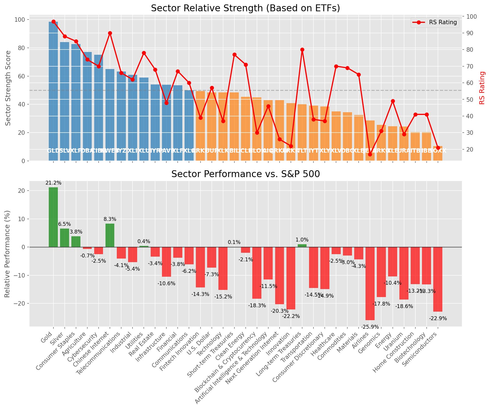

# **Daily Relative Strength Report**

**Date:** 2025-04-11

## **Market Valuation (Buffett Indicator)**

| Metric | Value |
|--------|-------|
| **Market Valuation** | **Significantly Undervalued** |
| **Current Ratio** | 8.67 |
| **Historical Mean** | 9.69 |
| **Standard Deviation** | 0.44 |
| **Z-Score (StdDev from Mean)** | -2.33 |
| **Total Market Cap** | $257.68 trillion |
| **GDP** | $29.72 trillion |

## **Market Insights**

### **Market is Significantly Undervalued**

The market has reached valuations significantly below historical norms, suggesting excessive pessimism. These levels have historically offered exceptional long-term buying opportunities. Investors should consider:

- Increasing equity exposure gradually
- Looking for quality companies with strong balance sheets trading at discounted valuations
- Watching for signs of market bottoming (capitulation, investor sentiment extremes)
- Developing a watchlist of fundamentally strong stocks building bases

While short-term volatility may continue, historical data suggests excellent long-term returns from these levels.

### **Buffett Indicator Overview**

The Buffett Indicator (Total Market Cap / GDP) is a measure of the stock market's valuation relative to the size of the economy. It is named after Warren Buffett, who described it as "probably the best single measure of where valuations stand at any given moment."

- **Values above +2 standard deviations:** Market significantly overvalued
- **Values above +1 standard deviation:** Market overvalued
- **Values between -1 and +1 standard deviations:** Market fairly valued
- **Values below -1 standard deviation:** Market undervalued
- **Values below -2 standard deviations:** Market significantly undervalued

---

## **Sector Relative Strength**

Based on William O'Neil's Relative Strength Methodology

| ETF | Strength | RS Rating | Performance | Above Key MAs | Trend | Sector |
|-----|----------|-----------|-------------|--------------|-------|--------|
| [GLD](https://www.tradingview.com/chart/?symbol=GLD) | 99.0 | 98.0 | 21.27% | 10d ✓, 50d ✓, 200d ✓ | ↗️ | Gold |
| [SLV](https://www.tradingview.com/chart/?symbol=SLV) | 84.1 | 88.0 | 5.42% | 10d ✓, 50d ✗, 200d ✓ | ↗️ | Silver |
| [XLP](https://www.tradingview.com/chart/?symbol=XLP) | 72.9 | 86.0 | 3.11% | 10d ✓, 50d ✗, 200d ✗ | ↗️ | Consumer Staples |
| [KWEB](https://www.tradingview.com/chart/?symbol=KWEB) | 65.0 | 90.0 | 6.33% | 10d ✗, 50d ✗, 200d ✗ | ↗️ | Chinese Internet |
| [CIBR](https://www.tradingview.com/chart/?symbol=CIBR) | 64.9 | 70.0 | -3.45% | 10d ✓, 50d ✗, 200d ✗ | ↗️ | Cybersecurity |
| [IYZ](https://www.tradingview.com/chart/?symbol=IYZ) | 63.7 | 67.0 | -4.59% | 10d ✗, 50d ✗, 200d ✓ | ↗️ | Telecommunications |
| [XLU](https://www.tradingview.com/chart/?symbol=XLU) | 58.0 | 76.0 | -0.86% | 10d ✗, 50d ✗, 200d ✗ | ↗️ | Utilities |
| [DBA](https://www.tradingview.com/chart/?symbol=DBA) | 56.0 | 72.0 | -2.53% | 10d ✗, 50d ✗, 200d ✗ | ↗️ | Agriculture |
| [XLF](https://www.tradingview.com/chart/?symbol=XLF) | 53.5 | 67.0 | -4.95% | 10d ✗, 50d ✗, 200d ✗ | ↗️ | Financial |
| [IYR](https://www.tradingview.com/chart/?symbol=IYR) | 53.0 | 66.0 | -5.09% | 10d ✗, 50d ✗, 200d ✗ | ↗️ | Real Estate |
| [XLC](https://www.tradingview.com/chart/?symbol=XLC) | 51.5 | 63.0 | -6.66% | 10d ✗, 50d ✗, 200d ✗ | ↗️ | Communications |
| [XLI](https://www.tradingview.com/chart/?symbol=XLI) | 51.0 | 62.0 | -6.84% | 10d ✗, 50d ✗, 200d ✗ | ↗️ | Industrial |
| [UUP](https://www.tradingview.com/chart/?symbol=UUP) | 50.0 | 60.0 | -7.60% | 10d ✗, 50d ✗, 200d ✗ | ↗️ | U.S. Dollar |
| [BIL](https://www.tradingview.com/chart/?symbol=BIL) | 49.4 | 79.0 | 0.04% | 10d ✓, 50d ✗, 200d ✗ | ↘️ | Short-term Treasuries |
| [PAVE](https://www.tradingview.com/chart/?symbol=PAVE) | 44.0 | 48.0 | -11.97% | 10d ✗, 50d ✗, 200d ✗ | ↗️ | Infrastructure |
| [AIQ](https://www.tradingview.com/chart/?symbol=AIQ) | 42.0 | 44.0 | -13.22% | 10d ✗, 50d ✗, 200d ✗ | ↗️ | Artificial Intelligence & Technology |
| [IYT](https://www.tradingview.com/chart/?symbol=IYT) | 40.0 | 40.0 | -15.05% | 10d ✗, 50d ✗, 200d ✗ | ↗️ | Transportation |
| [XLY](https://www.tradingview.com/chart/?symbol=XLY) | 39.0 | 38.0 | -15.95% | 10d ✗, 50d ✗, 200d ✗ | ↗️ | Consumer Discretionary |
| [TLT](https://www.tradingview.com/chart/?symbol=TLT) | 39.0 | 78.0 | -0.18% | 10d ✗, 50d ✗, 200d ✗ | ↘️ | Long-term Treasuries |
| [XLK](https://www.tradingview.com/chart/?symbol=XLK) | 38.5 | 37.0 | -16.45% | 10d ✗, 50d ✗, 200d ✗ | ↗️ | Technology |
| [ARKF](https://www.tradingview.com/chart/?symbol=ARKF) | 38.5 | 37.0 | -16.38% | 10d ✗, 50d ✗, 200d ✗ | ↗️ | Fintech Innovation |
| [XLV](https://www.tradingview.com/chart/?symbol=XLV) | 35.0 | 70.0 | -3.48% | 10d ✗, 50d ✗, 200d ✗ | ↘️ | Healthcare |
| [BLOK](https://www.tradingview.com/chart/?symbol=BLOK) | 35.0 | 30.0 | -19.59% | 10d ✗, 50d ✗, 200d ✗ | ↗️ | Blockchain & Cryptocurrency |
| [ICLN](https://www.tradingview.com/chart/?symbol=ICLN) | 35.0 | 70.0 | -3.60% | 10d ✗, 50d ✗, 200d ✗ | ↘️ | Clean Energy |
| [ARKW](https://www.tradingview.com/chart/?symbol=ARKW) | 34.5 | 29.0 | -20.02% | 10d ✗, 50d ✗, 200d ✗ | ↗️ | Next Generation Internet |
| [DBC](https://www.tradingview.com/chart/?symbol=DBC) | 34.5 | 69.0 | -4.01% | 10d ✗, 50d ✗, 200d ✗ | ↘️ | Commodities |
| [XLB](https://www.tradingview.com/chart/?symbol=XLB) | 32.5 | 65.0 | -5.80% | 10d ✗, 50d ✗, 200d ✗ | ↘️ | Materials |
| [ARKK](https://www.tradingview.com/chart/?symbol=ARKK) | 30.5 | 21.0 | -23.80% | 10d ✗, 50d ✗, 200d ✗ | ↗️ | Innovation |
| [JETS](https://www.tradingview.com/chart/?symbol=JETS) | 28.0 | 16.0 | -27.80% | 10d ✗, 50d ✗, 200d ✗ | ↗️ | Airlines |
| [URA](https://www.tradingview.com/chart/?symbol=URA) | 24.4 | 29.0 | -19.65% | 10d ✓, 50d ✗, 200d ✗ | ↘️ | Uranium |
| [XLE](https://www.tradingview.com/chart/?symbol=XLE) | 23.0 | 46.0 | -12.44% | 10d ✗, 50d ✗, 200d ✗ | ↘️ | Energy |
| [ARKG](https://www.tradingview.com/chart/?symbol=ARKG) | 22.4 | 25.0 | -21.43% | 10d ✓, 50d ✗, 200d ✗ | ↘️ | Genomics |
| [ITB](https://www.tradingview.com/chart/?symbol=ITB) | 20.5 | 41.0 | -14.68% | 10d ✗, 50d ✗, 200d ✗ | ↘️ | Home Construction |
| [IBB](https://www.tradingview.com/chart/?symbol=IBB) | 19.5 | 39.0 | -15.17% | 10d ✗, 50d ✗, 200d ✗ | ↘️ | Biotechnology |
| [SOXX](https://www.tradingview.com/chart/?symbol=SOXX) | 10.5 | 21.0 | -24.38% | 10d ✗, 50d ✗, 200d ✗ | ↘️ | Semiconductors |

### **Sector ETF Performance Interpretation**

This table shows the relative strength metrics for different market sectors based on their representative ETFs:

- **ETF**: The ETF used to measure sector performance (click for chart)
- **Strength**: Overall sector strength score (0-100) combining multiple factors
- **RS Rating**: O'Neil RS rating of the sector ETF
- **Performance**: Performance of the sector ETF relative to SPY
- **Above Key MAs**: Whether the ETF is trading above its 10, 50, and 200-day moving averages
- **Trend**: Whether the sector is in an uptrend (↗️) or downtrend (↘️)

### **Current Sector Leadership**

The current market leadership is coming from the following sectors: **Gold, Silver, Consumer Staples**.

The **Gold** sector (represented by **GLD**) is showing particularly strong relative strength with an RS rating of 98.0 and performance of 21.27% vs. the S&P 500. This sector is trading above its 10-day, 50-day, 200-day moving average(s). Investors should consider focusing on high RS stocks within these leading sectors for potential outperformance.

---

## **Buy Recommendations**

The following 52 stocks show exceptional relative strength:

| RS Rating | Buy Score | Current Price | Chart | Name | Ticker |
|-----------|-----------|---------------|-------|------|--------|
| 100 | 100 | $117.51 | [Chart](https://www.tradingview.com/chart/?symbol=AEM) | Agnico Eagle Mines Ltd. | AEM |
| 100 | 100 | $136.10 | [Chart](https://www.tradingview.com/chart/?symbol=UGL) | ProShares Ultra Gold | UGL |
| 100 | 100 | $81.97 | [Chart](https://www.tradingview.com/chart/?symbol=WPM) | Wheaton Precious Metals Corp. Common Stock | WPM |
| 100 | 100 | $29.43 | [Chart](https://www.tradingview.com/chart/?symbol=AGI) | Alamos Gold Inc. Class A Common Shares | AGI |
| 99 | 100 | $142.99 | [Chart](https://www.tradingview.com/chart/?symbol=PLMR) | Palomar Holdings, Inc. Common stock | PLMR |
| 99 | 100 | $61.05 | [Chart](https://www.tradingview.com/chart/?symbol=GDXJ) | VanEck Junior Gold Miners ETF | GDXJ |
| 99 | 100 | $178.06 | [Chart](https://www.tradingview.com/chart/?symbol=RGLD) | Royal Gold Inc | RGLD |
| 99 | 100 | $18.48 | [Chart](https://www.tradingview.com/chart/?symbol=SWI) | SolarWinds Corporation Common Stock | SWI |
| 99 | 100 | $15.46 | [Chart](https://www.tradingview.com/chart/?symbol=EZPW) | Ezcorp Inc | EZPW |
| 98 | 100 | $61.00 | [Chart](https://www.tradingview.com/chart/?symbol=IAU) | iShares Gold Trust | IAU |
| 98 | 100 | $154.41 | [Chart](https://www.tradingview.com/chart/?symbol=PM) | Philip Morris International Inc. | PM |
| 98 | 100 | $24.83 | [Chart](https://www.tradingview.com/chart/?symbol=PHYS) | Sprott Physical Gold Trust | PHYS |
| 98 | 100 | $31.90 | [Chart](https://www.tradingview.com/chart/?symbol=BAR) | GraniteShares Gold Shares | BAR |
| 98 | 100 | $32.25 | [Chart](https://www.tradingview.com/chart/?symbol=IAUM) | iShares Gold Trust Micro | IAUM |
| 98 | 100 | $30.85 | [Chart](https://www.tradingview.com/chart/?symbol=SGOL) | abrdn Physical Gold Shares ETF | SGOL |
| 98 | 100 | $115.38 | [Chart](https://www.tradingview.com/chart/?symbol=BJ) | BJs Wholesale Club Holdings, Inc. Common Stock | BJ |
| 98 | 100 | $31.18 | [Chart](https://www.tradingview.com/chart/?symbol=OUNZ) | VanEck Merk Gold ETF | OUNZ |
| 98 | 100 | $298.15 | [Chart](https://www.tradingview.com/chart/?symbol=GLD) | SPDR Gold Trust, SPDR Gold Shares | GLD |
| 98 | 100 | $64.05 | [Chart](https://www.tradingview.com/chart/?symbol=GLDM) | SPDR Gold MiniShares | GLDM |
| 97 | 100 | $22.33 | [Chart](https://www.tradingview.com/chart/?symbol=OR) | Osisko Gold Royalties Ltd | OR |
| 97 | 100 | $45.48 | [Chart](https://www.tradingview.com/chart/?symbol=EXC) | Exelon Corporation | EXC |
| 97 | 100 | $123.00 | [Chart](https://www.tradingview.com/chart/?symbol=BECN) | Beacon Roofing Supply, Inc. | BECN |
| 97 | 100 | $22.29 | [Chart](https://www.tradingview.com/chart/?symbol=SRAD) | Sportradar Group AG Class A Ordinary Shares | SRAD |
| 96 | 100 | $241.70 | [Chart](https://www.tradingview.com/chart/?symbol=RSG) | Republic Services Inc. | RSG |
| 96 | 100 | $28.55 | [Chart](https://www.tradingview.com/chart/?symbol=CEF) | Sprott Physical Gold and Silver Trust | CEF |
| 96 | 100 | $37.50 | [Chart](https://www.tradingview.com/chart/?symbol=MRX) | Marex Group plc Ordinary Shares | MRX |
| 95 | 100 | $86.65 | [Chart](https://www.tradingview.com/chart/?symbol=CCEP) | Coca-Cola Europacific Partners plc Ordinary Shares | CCEP |
| 95 | 100 | $52.15 | [Chart](https://www.tradingview.com/chart/?symbol=SKWD) | Skyward Specialty Insurance Group, Inc. Common Stock | SKWD |
| 95 | 100 | $263.64 | [Chart](https://www.tradingview.com/chart/?symbol=CME) | CME Group Inc. | CME |
| 95 | 100 | $67.61 | [Chart](https://www.tradingview.com/chart/?symbol=KR) | The Kroger Co. | KR |
| 95 | 100 | $518.36 | [Chart](https://www.tradingview.com/chart/?symbol=BRK.B) | BERKSHIRE HATHAWAY Class B | BRK.B |
| 94 | 100 | $41.38 | [Chart](https://www.tradingview.com/chart/?symbol=BTI) | British American Tobacco p.l.c. American Depositary Shares, American Depositary Shares, each representing one Ordinary Share | BTI |
| 94 | 100 | $102.13 | [Chart](https://www.tradingview.com/chart/?symbol=EHC) | Encompass Health Corporation Common Stock | EHC |
| 94 | 100 | $272.66 | [Chart](https://www.tradingview.com/chart/?symbol=PGR) | Progressive Corporation | PGR |
| 94 | 100 | $438.01 | [Chart](https://www.tradingview.com/chart/?symbol=CASY) | Casey's General Stores Inc | CASY |
| 93 | 100 | $102.78 | [Chart](https://www.tradingview.com/chart/?symbol=ATGE) | Adtalem Global Education Inc. Common Shares | ATGE |
| 93 | 100 | $31.90 | [Chart](https://www.tradingview.com/chart/?symbol=KTOS) | Kratos Defense & Security Solutions, Inc. | KTOS |
| 93 | 100 | $193.42 | [Chart](https://www.tradingview.com/chart/?symbol=WCN) | Waste Connections, Inc. | WCN |
| 93 | 100 | $155.56 | [Chart](https://www.tradingview.com/chart/?symbol=SFM) | Sprouts Farmers Market, Inc. | SFM |
| 91 | 100 | $78.93 | [Chart](https://www.tradingview.com/chart/?symbol=FAST) | Fastenal Co | FAST |
| 91 | 100 | $48.20 | [Chart](https://www.tradingview.com/chart/?symbol=GFL) | GFL Environmental Inc. Subordinate Voting Shares | GFL |
| 91 | 100 | $307.69 | [Chart](https://www.tradingview.com/chart/?symbol=MCD) | McDonald's Corporation | MCD |
| 91 | 100 | $114.00 | [Chart](https://www.tradingview.com/chart/?symbol=CWST) | Casella Waste Systems Inc | CWST |
| 89 | 100 | $33.96 | [Chart](https://www.tradingview.com/chart/?symbol=DRS) | Leonardo DRS, Inc. Common Stock | DRS |
| 88 | 100 | $44.75 | [Chart](https://www.tradingview.com/chart/?symbol=MRCY) | Mercury Systems Inc. | MRCY |
| 86 | 99 | $17.90 | [Chart](https://www.tradingview.com/chart/?symbol=GRND) | Grindr Inc. | GRND |
| 88 | 98 | $127.51 | [Chart](https://www.tradingview.com/chart/?symbol=TJX) | TJX Companies, Inc. (The) | TJX |
| 84 | 96 | $22.48 | [Chart](https://www.tradingview.com/chart/?symbol=ATSG) | Air Transport Services Group, Inc. | ATSG |
| 83 | 96 | $111.65 | [Chart](https://www.tradingview.com/chart/?symbol=BOXX) | Alpha Architect 1-3 Month Box ETF | BOXX |
| 84 | 95 | $74.01 | [Chart](https://www.tradingview.com/chart/?symbol=BRBR) | BellRing Brands, Inc. | BRBR |
| 83 | 94 | $35.91 | [Chart](https://www.tradingview.com/chart/?symbol=FYBR) | Frontier Communications Parent, Inc. Common Stock | FYBR |
| 83 | 93 | $22.48 | [Chart](https://www.tradingview.com/chart/?symbol=PYCR) | Paycor HCM, Inc. Common Stock | PYCR |

---

## **Sell Recommendations**

The following 41 stocks show deteriorating relative strength:

| RS Rating | Sell Score | Current Price | Chart | Name | Ticker |
|-----------|------------|---------------|-------|------|--------|
| 1 | 100 | $66.19 | [Chart](https://www.tradingview.com/chart/?symbol=PI) | Impinj, Inc. Common Stock | PI |
| 4 | 100 | $19.00 | [Chart](https://www.tradingview.com/chart/?symbol=DJT) | Trump Media & Technology Group Corp. Common Stock | DJT |
| 6 | 100 | $11.56 | [Chart](https://www.tradingview.com/chart/?symbol=GCT) | GigaCloud Technology Inc Class A Ordinary Shares | GCT |
| 7 | 100 | $10.10 | [Chart](https://www.tradingview.com/chart/?symbol=CGEM) | Cullinan Therapeutics, Inc. Common Stock | CGEM |
| 12 | 100 | $43.70 | [Chart](https://www.tradingview.com/chart/?symbol=EDU) | New Oriental Education and Technology Group, Inc. American Depositary Shares (each representing ten (10) Common Shares) | EDU |
| 13 | 100 | $27.24 | [Chart](https://www.tradingview.com/chart/?symbol=SRDX) | Surmodics, Inc. Common Stock | SRDX |
| 13 | 99 | $19.31 | [Chart](https://www.tradingview.com/chart/?symbol=ST) | Sensata Technologies Holding plc | ST |
| 15 | 97 | $49.65 | [Chart](https://www.tradingview.com/chart/?symbol=ENPH) | Enphase Energy, Inc. | ENPH |
| 8 | 94 | $12.51 | [Chart](https://www.tradingview.com/chart/?symbol=DV) | DoubleVerify Holdings, Inc. | DV |
| 15 | 94 | $11.78 | [Chart](https://www.tradingview.com/chart/?symbol=AEYE) | AudioEye, Inc. Common Stock | AEYE |
| 11 | 92 | $12.28 | [Chart](https://www.tradingview.com/chart/?symbol=MARA) | MARA Holdings, Inc. Common Stock | MARA |
| 15 | 92 | $48.20 | [Chart](https://www.tradingview.com/chart/?symbol=RHI) | Robert Half Inc. | RHI |
| 14 | 91 | $19.42 | [Chart](https://www.tradingview.com/chart/?symbol=HZO) | MarineMax, Inc. | HZO |
| 24 | 91 | $13.22 | [Chart](https://www.tradingview.com/chart/?symbol=FXN) | First Trust Energy AlphaDEX Fund | FXN |
| 26 | 91 | $10.03 | [Chart](https://www.tradingview.com/chart/?symbol=MTAL) | MAC Copper Limited | MTAL |
| 12 | 89 | $10.01 | [Chart](https://www.tradingview.com/chart/?symbol=VYX) | NCR Voyix Corporation | VYX |
| 17 | 89 | $10.24 | [Chart](https://www.tradingview.com/chart/?symbol=EXPI) | eXp World Holdings, Inc. Common Stock | EXPI |
| 21 | 89 | $52.29 | [Chart](https://www.tradingview.com/chart/?symbol=CNMD) | CONMED Corporation | CNMD |
| 29 | 89 | $13.14 | [Chart](https://www.tradingview.com/chart/?symbol=MED) | Medifast, Inc. | MED |
| 22 | 87 | $22.16 | [Chart](https://www.tradingview.com/chart/?symbol=HOG) | Harley-Davidson, Inc. | HOG |
| 15 | 86 | $10.31 | [Chart](https://www.tradingview.com/chart/?symbol=VREX) | Varex Imaging Corporation Common Stock | VREX |
| 20 | 84 | $10.26 | [Chart](https://www.tradingview.com/chart/?symbol=CMP) | Compass Minerals International, Inc. | CMP |
| 23 | 84 | $10.49 | [Chart](https://www.tradingview.com/chart/?symbol=PEB) | Pebblebrook Hotel Trust | PEB |
| 17 | 83 | $111.89 | [Chart](https://www.tradingview.com/chart/?symbol=MYRG) | MYR Group, Inc. | MYRG |
| 22 | 83 | $11.34 | [Chart](https://www.tradingview.com/chart/?symbol=HPK) | HighPeak Energy, Inc. Common Stock | HPK |
| 21 | 82 | $10.15 | [Chart](https://www.tradingview.com/chart/?symbol=HLIT) | Harmonic Inc | HLIT |
| 25 | 82 | $11.12 | [Chart](https://www.tradingview.com/chart/?symbol=RIVN) | Rivian Automotive, Inc. Class A Common Stock | RIVN |
| 26 | 81 | $10.04 | [Chart](https://www.tradingview.com/chart/?symbol=HTLD) | Heartland Express Inc | HTLD |
| 31 | 81 | $10.11 | [Chart](https://www.tradingview.com/chart/?symbol=CELC) | Celcuity Inc. Common Stock | CELC |
| 22 | 80 | $351.45 | [Chart](https://www.tradingview.com/chart/?symbol=SAIA) | Saia, Inc. | SAIA |
| 30 | 79 | $76.33 | [Chart](https://www.tradingview.com/chart/?symbol=LEA) | Lear Corporation | LEA |
| 26 | 77 | $10.26 | [Chart](https://www.tradingview.com/chart/?symbol=PACS) | PACS Group, Inc. | PACS |
| 33 | 77 | $10.71 | [Chart](https://www.tradingview.com/chart/?symbol=DBRG) | DigitalBridge Group, Inc. | DBRG |
| 26 | 76 | $17.42 | [Chart](https://www.tradingview.com/chart/?symbol=IART) | Integra LifeSciences Holdings | IART |
| 30 | 76 | $22.11 | [Chart](https://www.tradingview.com/chart/?symbol=AMRK) | A-Mark Precious Metals, Inc. | AMRK |
| 39 | 72 | $10.30 | [Chart](https://www.tradingview.com/chart/?symbol=CSTM) | Constellium SE Class A Ordinary shares | CSTM |
| 36 | 69 | $10.34 | [Chart](https://www.tradingview.com/chart/?symbol=CMRE) | Costamare Inc. | CMRE |
| 36 | 69 | $16.74 | [Chart](https://www.tradingview.com/chart/?symbol=CTRI) | Centuri Holdings, Inc. | CTRI |
| 36 | 69 | $149.62 | [Chart](https://www.tradingview.com/chart/?symbol=ODFL) | Old Dominion Freight Line | ODFL |
| 38 | 66 | $10.55 | [Chart](https://www.tradingview.com/chart/?symbol=LBTYA) | Liberty Global Ltd. Class A Common Shares | LBTYA |
| 38 | 63 | $34.28 | [Chart](https://www.tradingview.com/chart/?symbol=LIT) | Global X Lithium & Battery Tech ETF | LIT |

## **Methodology**

This report uses William O'Neil's relative strength methodology from Investors Business Daily:

* **RS Rating**: Percentile rank of stock's performance vs. S&P 500 over the past 63 trading days (1-99 scale)
* **Buy Criteria**: RS Rating >= 80, price above 50-day MA, strong uptrend, increasing volume
* **Sell Criteria**: RS Rating < 40, price below 50-day MA, downtrend, decreasing volume

### **O'Neil's Key Principles**

1. **Focus on relative performance** - stocks outperforming the market
2. **Price trend confirmation** - stock must be in an uptrend
3. **Volume confirmation** - strong volume supports price moves
4. **Moving average validation** - price above key moving averages
5. **Market leaders only** - concentrate on top-performing stocks

*Report generated automatically after market close*