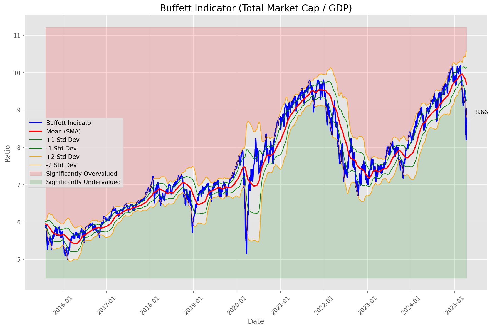
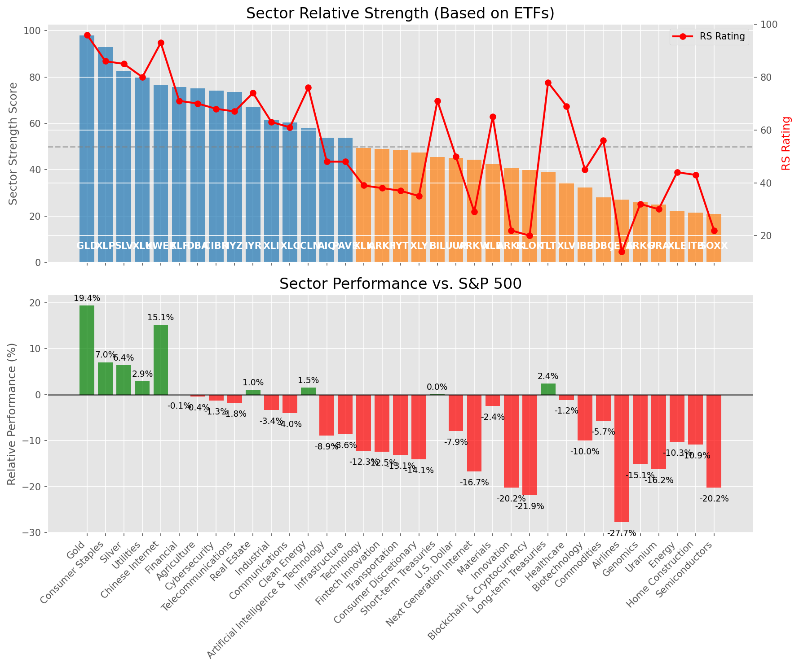

# **Daily Relative Strength Report**

**Date:** 2025-04-14

## **Market Valuation (Buffett Indicator)**

| Metric | Value |
|--------|-------|
| **Market Valuation** | **Undervalued** |
| **Current Ratio** | 8.84 |
| **Historical Mean** | 9.68 |
| **Standard Deviation** | 0.45 |
| **Z-Score (StdDev from Mean)** | -1.93 |
| **Total Market Cap** | $262.89 trillion |
| **GDP** | $29.72 trillion |

## **Market Insights**

### **Market is Undervalued**

The market is trading below historical average valuations, suggesting potential opportunity. These conditions have historically preceded periods of above-average returns. Investors should:

- Look for stocks breaking out of consolidation patterns on increasing volume
- Focus on sectors showing relative strength
- Consider increasing equity exposure, particularly in quality names
- Be mindful of overall market direction and avoid fighting the trend

History suggests patient investors are often rewarded when investing during periods of undervaluation.

### **Buffett Indicator Overview**

The Buffett Indicator (Total Market Cap / GDP) is a measure of the stock market's valuation relative to the size of the economy. It is named after Warren Buffett, who described it as "probably the best single measure of where valuations stand at any given moment."

- **Values above +2 standard deviations:** Market significantly overvalued
- **Values above +1 standard deviation:** Market overvalued
- **Values between -1 and +1 standard deviations:** Market fairly valued
- **Values below -1 standard deviation:** Market undervalued
- **Values below -2 standard deviations:** Market significantly undervalued

---

## **Sector Relative Strength**

Based on William O'Neil's Relative Strength Methodology

| ETF | Strength | RS Rating | Performance | Above Key MAs | Trend | Sector |
|-----|----------|-----------|-------------|--------------|-------|--------|
| [GLD](https://www.tradingview.com/chart/?symbol=GLD) | 98.0 | 96.0 | 19.23% | 10d ✓, 50d ✓, 200d ✓ | ↗️ | Gold |
| [XLP](https://www.tradingview.com/chart/?symbol=XLP) | 93.0 | 86.0 | 6.54% | 10d ✓, 50d ✓, 200d ✓ | ↗️ | Consumer Staples |
| [SLV](https://www.tradingview.com/chart/?symbol=SLV) | 82.1 | 84.0 | 5.80% | 10d ✓, 50d ✗, 200d ✓ | ↗️ | Silver |
| [XLU](https://www.tradingview.com/chart/?symbol=XLU) | 79.6 | 79.0 | 2.36% | 10d ✓, 50d ✗, 200d ✓ | ↗️ | Utilities |
| [KWEB](https://www.tradingview.com/chart/?symbol=KWEB) | 76.7 | 93.0 | 15.10% | 10d ✗, 50d ✗, 200d ✓ | ↗️ | Chinese Internet |
| [DBA](https://www.tradingview.com/chart/?symbol=DBA) | 75.6 | 71.0 | -0.44% | 10d ✓, 50d ✗, 200d ✓ | ↗️ | Agriculture |
| [CIBR](https://www.tradingview.com/chart/?symbol=CIBR) | 74.1 | 68.0 | -1.79% | 10d ✓, 50d ✗, 200d ✓ | ↗️ | Cybersecurity |
| [IYZ](https://www.tradingview.com/chart/?symbol=IYZ) | 73.6 | 67.0 | -2.11% | 10d ✓, 50d ✗, 200d ✓ | ↗️ | Telecommunications |
| [XLF](https://www.tradingview.com/chart/?symbol=XLF) | 64.9 | 70.0 | -0.54% | 10d ✓, 50d ✗, 200d ✗ | ↗️ | Financial |
| [XLI](https://www.tradingview.com/chart/?symbol=XLI) | 61.4 | 63.0 | -3.74% | 10d ✓, 50d ✗, 200d ✗ | ↗️ | Industrial |
| [XLC](https://www.tradingview.com/chart/?symbol=XLC) | 60.4 | 61.0 | -4.49% | 10d ✓, 50d ✗, 200d ✗ | ↗️ | Communications |
| [IYR](https://www.tradingview.com/chart/?symbol=IYR) | 57.0 | 74.0 | 0.56% | 10d ✗, 50d ✗, 200d ✗ | ↗️ | Real Estate |
| [PAVE](https://www.tradingview.com/chart/?symbol=PAVE) | 53.9 | 48.0 | -9.04% | 10d ✓, 50d ✗, 200d ✗ | ↗️ | Infrastructure |
| [AIQ](https://www.tradingview.com/chart/?symbol=AIQ) | 53.4 | 47.0 | -9.61% | 10d ✓, 50d ✗, 200d ✗ | ↗️ | Artificial Intelligence & Technology |
| [XLK](https://www.tradingview.com/chart/?symbol=XLK) | 49.4 | 39.0 | -12.89% | 10d ✓, 50d ✗, 200d ✗ | ↗️ | Technology |
| [ARKF](https://www.tradingview.com/chart/?symbol=ARKF) | 48.9 | 38.0 | -13.08% | 10d ✓, 50d ✗, 200d ✗ | ↗️ | Fintech Innovation |
| [ICLN](https://www.tradingview.com/chart/?symbol=ICLN) | 47.9 | 76.0 | 1.16% | 10d ✓, 50d ✗, 200d ✗ | ↘️ | Clean Energy |
| [UUP](https://www.tradingview.com/chart/?symbol=UUP) | 46.0 | 52.0 | -7.93% | 10d ✗, 50d ✗, 200d ✗ | ↗️ | U.S. Dollar |
| [BIL](https://www.tradingview.com/chart/?symbol=BIL) | 45.9 | 72.0 | 0.02% | 10d ✓, 50d ✗, 200d ✗ | ↘️ | Short-term Treasuries |
| [ARKW](https://www.tradingview.com/chart/?symbol=ARKW) | 44.4 | 29.0 | -17.23% | 10d ✓, 50d ✗, 200d ✗ | ↗️ | Next Generation Internet |
| [XLB](https://www.tradingview.com/chart/?symbol=XLB) | 42.4 | 65.0 | -2.82% | 10d ✓, 50d ✗, 200d ✗ | ↘️ | Materials |
| [ARKK](https://www.tradingview.com/chart/?symbol=ARKK) | 40.9 | 22.0 | -20.69% | 10d ✓, 50d ✗, 200d ✗ | ↗️ | Innovation |
| [BLOK](https://www.tradingview.com/chart/?symbol=BLOK) | 39.9 | 20.0 | -22.22% | 10d ✓, 50d ✗, 200d ✗ | ↗️ | Blockchain & Cryptocurrency |
| [TLT](https://www.tradingview.com/chart/?symbol=TLT) | 39.0 | 78.0 | 1.94% | 10d ✗, 50d ✗, 200d ✗ | ↘️ | Long-term Treasuries |
| [IYT](https://www.tradingview.com/chart/?symbol=IYT) | 37.5 | 35.0 | -14.51% | 10d ✗, 50d ✗, 200d ✗ | ↗️ | Transportation |
| [XLY](https://www.tradingview.com/chart/?symbol=XLY) | 37.0 | 34.0 | -14.61% | 10d ✗, 50d ✗, 200d ✗ | ↗️ | Consumer Discretionary |
| [XLV](https://www.tradingview.com/chart/?symbol=XLV) | 34.0 | 68.0 | -1.58% | 10d ✗, 50d ✗, 200d ✗ | ↘️ | Healthcare |
| [DBC](https://www.tradingview.com/chart/?symbol=DBC) | 28.5 | 57.0 | -5.91% | 10d ✗, 50d ✗, 200d ✗ | ↘️ | Commodities |
| [JETS](https://www.tradingview.com/chart/?symbol=JETS) | 27.0 | 14.0 | -28.07% | 10d ✗, 50d ✗, 200d ✗ | ↗️ | Airlines |
| [ARKG](https://www.tradingview.com/chart/?symbol=ARKG) | 26.4 | 33.0 | -15.40% | 10d ✓, 50d ✗, 200d ✗ | ↘️ | Genomics |
| [URA](https://www.tradingview.com/chart/?symbol=URA) | 24.9 | 30.0 | -16.54% | 10d ✓, 50d ✗, 200d ✗ | ↘️ | Uranium |
| [XLE](https://www.tradingview.com/chart/?symbol=XLE) | 22.5 | 45.0 | -10.51% | 10d ✗, 50d ✗, 200d ✗ | ↘️ | Energy |
| [IBB](https://www.tradingview.com/chart/?symbol=IBB) | 22.0 | 44.0 | -10.62% | 10d ✗, 50d ✗, 200d ✗ | ↘️ | Biotechnology |
| [ITB](https://www.tradingview.com/chart/?symbol=ITB) | 21.0 | 42.0 | -11.35% | 10d ✗, 50d ✗, 200d ✗ | ↘️ | Home Construction |
| [SOXX](https://www.tradingview.com/chart/?symbol=SOXX) | 20.9 | 22.0 | -20.98% | 10d ✓, 50d ✗, 200d ✗ | ↘️ | Semiconductors |

### **Sector ETF Performance Interpretation**

This table shows the relative strength metrics for different market sectors based on their representative ETFs:

- **ETF**: The ETF used to measure sector performance (click for chart)
- **Strength**: Overall sector strength score (0-100) combining multiple factors
- **RS Rating**: O'Neil RS rating of the sector ETF
- **Performance**: Performance of the sector ETF relative to SPY
- **Above Key MAs**: Whether the ETF is trading above its 10, 50, and 200-day moving averages
- **Trend**: Whether the sector is in an uptrend (↗️) or downtrend (↘️)

### **Current Sector Leadership**

The current market leadership is coming from the following sectors: **Gold, Consumer Staples, Silver**.

The **Gold** sector (represented by **GLD**) is showing particularly strong relative strength with an RS rating of 96.0 and performance of 19.23% vs. the S&P 500. This sector is trading above its 10-day, 50-day, 200-day moving average(s). Investors should consider focusing on high RS stocks within these leading sectors for potential outperformance.

---

## **Buy Recommendations**

The following 96 stocks show exceptional relative strength:

| RS Rating | Buy Score | Current Price | Chart | Name | Ticker |
|-----------|-----------|---------------|-------|------|--------|
| 100 | 100 | $82.38 | [Chart](https://www.tradingview.com/chart/?symbol=WPM) | Wheaton Precious Metals Corp. Common Stock | WPM |
| 100 | 100 | $29.25 | [Chart](https://www.tradingview.com/chart/?symbol=AGI) | Alamos Gold Inc. Class A Common Shares | AGI |
| 99 | 100 | $134.07 | [Chart](https://www.tradingview.com/chart/?symbol=UGL) | ProShares Ultra Gold | UGL |
| 99 | 100 | $157.38 | [Chart](https://www.tradingview.com/chart/?symbol=PM) | Philip Morris International Inc. | PM |
| 99 | 100 | $180.97 | [Chart](https://www.tradingview.com/chart/?symbol=RGLD) | Royal Gold Inc | RGLD |
| 99 | 100 | $31.34 | [Chart](https://www.tradingview.com/chart/?symbol=LTH) | Life Time Group Holdings, Inc. | LTH |
| 99 | 100 | $117.61 | [Chart](https://www.tradingview.com/chart/?symbol=AEM) | Agnico Eagle Mines Ltd. | AEM |
| 99 | 100 | $23.11 | [Chart](https://www.tradingview.com/chart/?symbol=DB) | Deutsche Bank Aktiengesellschaft | DB |
| 99 | 100 | $18.50 | [Chart](https://www.tradingview.com/chart/?symbol=SWI) | SolarWinds Corporation Common Stock | SWI |
| 99 | 100 | $27.12 | [Chart](https://www.tradingview.com/chart/?symbol=MP) | MP Materials Corp. | MP |
| 99 | 100 | $147.18 | [Chart](https://www.tradingview.com/chart/?symbol=PLMR) | Palomar Holdings, Inc. Common stock | PLMR |
| 99 | 100 | $15.69 | [Chart](https://www.tradingview.com/chart/?symbol=EZPW) | Ezcorp Inc | EZPW |
| 98 | 100 | $261.17 | [Chart](https://www.tradingview.com/chart/?symbol=TMUS) | T-Mobile US, Inc. | TMUS |
| 98 | 100 | $77.54 | [Chart](https://www.tradingview.com/chart/?symbol=NFG) | National Fuel Gas Co. | NFG |
| 98 | 100 | $53.60 | [Chart](https://www.tradingview.com/chart/?symbol=SKWD) | Skyward Specialty Insurance Group, Inc. Common Stock | SKWD |
| 98 | 100 | $46.63 | [Chart](https://www.tradingview.com/chart/?symbol=EXC) | Exelon Corporation | EXC |
| 98 | 100 | $23.25 | [Chart](https://www.tradingview.com/chart/?symbol=OR) | Osisko Gold Royalties Ltd | OR |
| 97 | 100 | $118.64 | [Chart](https://www.tradingview.com/chart/?symbol=BJ) | BJs Wholesale Club Holdings, Inc. Common Stock | BJ |
| 97 | 100 | $123.37 | [Chart](https://www.tradingview.com/chart/?symbol=BECN) | Beacon Roofing Supply, Inc. | BECN |
| 97 | 100 | $69.39 | [Chart](https://www.tradingview.com/chart/?symbol=WRB) | W.R. Berkley Corporation | WRB |
| 97 | 100 | $38.45 | [Chart](https://www.tradingview.com/chart/?symbol=MRX) | Marex Group plc Ordinary Shares | MRX |
| 97 | 100 | $44.86 | [Chart](https://www.tradingview.com/chart/?symbol=GH) | Guardant Health, Inc. Common Stock | GH |
| 96 | 100 | $30.62 | [Chart](https://www.tradingview.com/chart/?symbol=SGOL) | abrdn Physical Gold Shares ETF | SGOL |
| 96 | 100 | $37.03 | [Chart](https://www.tradingview.com/chart/?symbol=CNP) | CenterPoint Energy, Inc. | CNP |
| 96 | 100 | $30.96 | [Chart](https://www.tradingview.com/chart/?symbol=OUNZ) | VanEck Merk Gold ETF | OUNZ |
| 96 | 100 | $32.02 | [Chart](https://www.tradingview.com/chart/?symbol=IAUM) | iShares Gold Trust Micro | IAUM |
| 96 | 100 | $295.94 | [Chart](https://www.tradingview.com/chart/?symbol=GLD) | SPDR Gold Trust, SPDR Gold Shares | GLD |
| 96 | 100 | $60.55 | [Chart](https://www.tradingview.com/chart/?symbol=IAU) | iShares Gold Trust | IAU |
| 96 | 100 | $24.68 | [Chart](https://www.tradingview.com/chart/?symbol=PHYS) | Sprott Physical Gold Trust | PHYS |
| 96 | 100 | $342.21 | [Chart](https://www.tradingview.com/chart/?symbol=AJG) | Arthur J. Gallagher & Co. | AJG |
| 96 | 100 | $78.25 | [Chart](https://www.tradingview.com/chart/?symbol=SNEX) | StoneX Group Inc. Common Stock | SNEX |
| 96 | 100 | $245.26 | [Chart](https://www.tradingview.com/chart/?symbol=RSG) | Republic Services Inc. | RSG |
| 96 | 100 | $527.95 | [Chart](https://www.tradingview.com/chart/?symbol=BRK.B) | BERKSHIRE HATHAWAY Class B | BRK.B |
| 95 | 100 | $120.65 | [Chart](https://www.tradingview.com/chart/?symbol=BRO) | Brown & Brown, Inc. | BRO |
| 95 | 100 | $211.40 | [Chart](https://www.tradingview.com/chart/?symbol=TTWO) | Take-Two Interactive Software Inc | TTWO |
| 95 | 100 | $63.58 | [Chart](https://www.tradingview.com/chart/?symbol=GLDM) | SPDR Gold MiniShares | GLDM |
| 95 | 100 | $27.66 | [Chart](https://www.tradingview.com/chart/?symbol=EUFN) | iShares MSCI Europe Financials ETF | EUFN |
| 95 | 100 | $67.27 | [Chart](https://www.tradingview.com/chart/?symbol=VTR) | Ventas, Inc. | VTR |
| 95 | 100 | $451.96 | [Chart](https://www.tradingview.com/chart/?symbol=CASY) | Casey's General Stores Inc | CASY |
| 95 | 100 | $1403.44 | [Chart](https://www.tradingview.com/chart/?symbol=ORLY) | O'Reilly Automotive, Inc. | ORLY |
| 95 | 100 | $87.35 | [Chart](https://www.tradingview.com/chart/?symbol=CCEP) | Coca-Cola Europacific Partners plc Ordinary Shares | CCEP |
| 95 | 100 | $278.38 | [Chart](https://www.tradingview.com/chart/?symbol=PGR) | Progressive Corporation | PGR |
| 95 | 100 | $22.48 | [Chart](https://www.tradingview.com/chart/?symbol=SRAD) | Sportradar Group AG Class A Ordinary Shares | SRAD |
| 94 | 100 | $41.84 | [Chart](https://www.tradingview.com/chart/?symbol=BTI) | British American Tobacco p.l.c. American Depositary Shares, American Depositary Shares, each representing one Ordinary Share | BTI |
| 94 | 100 | $68.94 | [Chart](https://www.tradingview.com/chart/?symbol=KR) | The Kroger Co. | KR |
| 94 | 100 | $264.18 | [Chart](https://www.tradingview.com/chart/?symbol=CME) | CME Group Inc. | CME |
| 94 | 100 | $23.91 | [Chart](https://www.tradingview.com/chart/?symbol=PRVA) | Privia Health Group, Inc. Common Stock | PRVA |
| 93 | 100 | $120.47 | [Chart](https://www.tradingview.com/chart/?symbol=DUK) | Duke Energy Corporation | DUK |
| 93 | 100 | $93.42 | [Chart](https://www.tradingview.com/chart/?symbol=PNW) | Pinnacle West Capital Corporation | PNW |
| 93 | 100 | $61.72 | [Chart](https://www.tradingview.com/chart/?symbol=FNF) | Fidelity National Financial, Inc. | FNF |
| 93 | 100 | $52.23 | [Chart](https://www.tradingview.com/chart/?symbol=PPC) | Pilgrims Pride Corporation | PPC |
| 93 | 100 | $56.61 | [Chart](https://www.tradingview.com/chart/?symbol=ULS) | UL Solutions Inc. | ULS |
| 93 | 100 | $28.48 | [Chart](https://www.tradingview.com/chart/?symbol=CEF) | Sprott Physical Gold and Silver Trust | CEF |
| 93 | 100 | $106.17 | [Chart](https://www.tradingview.com/chart/?symbol=AEP) | American Electric Power Company, Inc. | AEP |
| 93 | 100 | $237.42 | [Chart](https://www.tradingview.com/chart/?symbol=MMC) | Marsh & McLennan Companies, Inc. | MMC |
| 92 | 100 | $153.97 | [Chart](https://www.tradingview.com/chart/?symbol=ATO) | Atmos Energy Corporation | ATO |
| 92 | 100 | $67.38 | [Chart](https://www.tradingview.com/chart/?symbol=EVRG) | Evergy, Inc. | EVRG |
| 92 | 100 | $102.71 | [Chart](https://www.tradingview.com/chart/?symbol=EHC) | Encompass Health Corporation Common Stock | EHC |
| 92 | 100 | $103.09 | [Chart](https://www.tradingview.com/chart/?symbol=ATGE) | Adtalem Global Education Inc. Common Shares | ATGE |
| 92 | 100 | $216.27 | [Chart](https://www.tradingview.com/chart/?symbol=CBOE) | Cboe Global Markets, Inc. | CBOE |
| 92 | 100 | $73.31 | [Chart](https://www.tradingview.com/chart/?symbol=CMS) | CMS Energy Corporation | CMS |
| 92 | 100 | $98.76 | [Chart](https://www.tradingview.com/chart/?symbol=AEE) | Ameren Corporation | AEE |
| 92 | 100 | $81.11 | [Chart](https://www.tradingview.com/chart/?symbol=FAST) | Fastenal Co | FAST |
| 92 | 100 | $57.13 | [Chart](https://www.tradingview.com/chart/?symbol=MO) | Altria Group, Inc. | MO |
| 92 | 100 | $37.59 | [Chart](https://www.tradingview.com/chart/?symbol=ORI) | Old Republic International Corporation | ORI |
| 91 | 100 | $194.38 | [Chart](https://www.tradingview.com/chart/?symbol=WCN) | Waste Connections, Inc. | WCN |
| 91 | 100 | $132.82 | [Chart](https://www.tradingview.com/chart/?symbol=DTE) | DTE Energy Company | DTE |
| 91 | 100 | $35.35 | [Chart](https://www.tradingview.com/chart/?symbol=PPL) | PPL Corporation | PPL |
| 91 | 100 | $76.55 | [Chart](https://www.tradingview.com/chart/?symbol=ADC) | Agree Realty Corporation | ADC |
| 91 | 100 | $44.43 | [Chart](https://www.tradingview.com/chart/?symbol=OGE) | OGE Energy Corp. | OGE |
| 91 | 100 | $118.94 | [Chart](https://www.tradingview.com/chart/?symbol=IDA) | IDACORP, Inc. | IDA |
| 91 | 100 | $315.88 | [Chart](https://www.tradingview.com/chart/?symbol=MCD) | McDonald's Corporation | MCD |
| 91 | 100 | $46.70 | [Chart](https://www.tradingview.com/chart/?symbol=MRCY) | Mercury Systems Inc. | MRCY |
| 90 | 100 | $75.41 | [Chart](https://www.tradingview.com/chart/?symbol=OGS) | ONE GAS, INC. | OGS |
| 90 | 100 | $32.60 | [Chart](https://www.tradingview.com/chart/?symbol=KTOS) | Kratos Defense & Security Solutions, Inc. | KTOS |
| 89 | 100 | $197.67 | [Chart](https://www.tradingview.com/chart/?symbol=DRI) | Darden Restaurants, Inc. | DRI |
| 89 | 100 | $293.49 | [Chart](https://www.tradingview.com/chart/?symbol=VRSK) | Verisk Analytics, Inc. Common Stock | VRSK |
| 89 | 100 | $132.64 | [Chart](https://www.tradingview.com/chart/?symbol=CAH) | Cardinal Health, Inc. | CAH |
| 89 | 100 | $48.55 | [Chart](https://www.tradingview.com/chart/?symbol=GFL) | GFL Environmental Inc. Subordinate Voting Shares | GFL |
| 89 | 100 | $29.72 | [Chart](https://www.tradingview.com/chart/?symbol=AHR) | American Healthcare REIT, Inc. | AHR |
| 88 | 100 | $18.07 | [Chart](https://www.tradingview.com/chart/?symbol=GRND) | Grindr Inc. | GRND |
| 89 | 99 | $24.59 | [Chart](https://www.tradingview.com/chart/?symbol=FMS) | Fresenius Medical Care AG | FMS |
| 88 | 99 | $115.43 | [Chart](https://www.tradingview.com/chart/?symbol=CWST) | Casella Waste Systems Inc | CWST |
| 87 | 98 | $114.22 | [Chart](https://www.tradingview.com/chart/?symbol=OLLI) | Ollie's Bargain Outlet Holdings, Inc. Common Stock | OLLI |
| 86 | 98 | $86.53 | [Chart](https://www.tradingview.com/chart/?symbol=L) | Loews Corporation | L |
| 87 | 97 | $108.48 | [Chart](https://www.tradingview.com/chart/?symbol=AFL) | Aflac Inc. | AFL |
| 87 | 97 | $128.99 | [Chart](https://www.tradingview.com/chart/?symbol=TJX) | TJX Companies, Inc. (The) | TJX |
| 86 | 97 | $49.64 | [Chart](https://www.tradingview.com/chart/?symbol=RELX) | RELX PLC | RELX |
| 85 | 97 | $35.08 | [Chart](https://www.tradingview.com/chart/?symbol=DRS) | Leonardo DRS, Inc. Common Stock | DRS |
| 83 | 97 | $328.54 | [Chart](https://www.tradingview.com/chart/?symbol=WTW) | Willis Towers Watson Public Limited Company Ordinary Shares | WTW |
| 86 | 96 | $48.32 | [Chart](https://www.tradingview.com/chart/?symbol=NJR) | New Jersey Resources Corp | NJR |
| 85 | 96 | $37.65 | [Chart](https://www.tradingview.com/chart/?symbol=AB) | AllianceBernstein Holding, L.P. | AB |
| 85 | 95 | $59.68 | [Chart](https://www.tradingview.com/chart/?symbol=RYTM) | Rhythm Pharmaceuticals, Inc. Common Stock | RYTM |
| 83 | 94 | $74.46 | [Chart](https://www.tradingview.com/chart/?symbol=BRBR) | BellRing Brands, Inc. | BRBR |
| 82 | 92 | $54.28 | [Chart](https://www.tradingview.com/chart/?symbol=IGF) | iShares Global Infrastructure ETF | IGF |
| 80 | 91 | $48.03 | [Chart](https://www.tradingview.com/chart/?symbol=TRP) | TC Energy Corporation | TRP |

---

## **Sell Recommendations**

The following 68 stocks show deteriorating relative strength:

| RS Rating | Sell Score | Current Price | Chart | Name | Ticker |
|-----------|------------|---------------|-------|------|--------|
| 1 | 100 | $65.87 | [Chart](https://www.tradingview.com/chart/?symbol=PI) | Impinj, Inc. Common Stock | PI |
| 2 | 100 | $18.69 | [Chart](https://www.tradingview.com/chart/?symbol=DJT) | Trump Media & Technology Group Corp. Common Stock | DJT |
| 5 | 100 | $10.20 | [Chart](https://www.tradingview.com/chart/?symbol=ARCT) | Arcturus Therapeutics Holdings Inc. Common Stock | ARCT |
| 6 | 100 | $12.03 | [Chart](https://www.tradingview.com/chart/?symbol=GCT) | GigaCloud Technology Inc Class A Ordinary Shares | GCT |
| 6 | 100 | $10.10 | [Chart](https://www.tradingview.com/chart/?symbol=CGEM) | Cullinan Therapeutics, Inc. Common Stock | CGEM |
| 11 | 100 | $27.24 | [Chart](https://www.tradingview.com/chart/?symbol=SRDX) | Surmodics, Inc. Common Stock | SRDX |
| 13 | 100 | $44.09 | [Chart](https://www.tradingview.com/chart/?symbol=EDU) | New Oriental Education and Technology Group, Inc. American Depositary Shares (each representing ten (10) Common Shares) | EDU |
| 14 | 100 | $19.77 | [Chart](https://www.tradingview.com/chart/?symbol=ST) | Sensata Technologies Holding plc | ST |
| 8 | 99 | $17.16 | [Chart](https://www.tradingview.com/chart/?symbol=HZO) | MarineMax, Inc. | HZO |
| 21 | 96 | $10.03 | [Chart](https://www.tradingview.com/chart/?symbol=MTAL) | MAC Copper Limited | MTAL |
| 12 | 94 | $60.02 | [Chart](https://www.tradingview.com/chart/?symbol=ASGN) | ASGN Incorporated | ASGN |
| 15 | 94 | $50.70 | [Chart](https://www.tradingview.com/chart/?symbol=CNMD) | CONMED Corporation | CNMD |
| 26 | 94 | $12.85 | [Chart](https://www.tradingview.com/chart/?symbol=MED) | Medifast, Inc. | MED |
| 13 | 93 | $11.78 | [Chart](https://www.tradingview.com/chart/?symbol=AEYE) | AudioEye, Inc. Common Stock | AEYE |
| 23 | 93 | $13.66 | [Chart](https://www.tradingview.com/chart/?symbol=FXN) | First Trust Energy AlphaDEX Fund | FXN |
| 14 | 92 | $10.24 | [Chart](https://www.tradingview.com/chart/?symbol=EXPI) | eXp World Holdings, Inc. Common Stock | EXPI |
| 17 | 91 | $49.51 | [Chart](https://www.tradingview.com/chart/?symbol=RHI) | Robert Half Inc. | RHI |
| 17 | 91 | $337.42 | [Chart](https://www.tradingview.com/chart/?symbol=SAIA) | Saia, Inc. | SAIA |
| 11 | 90 | $10.01 | [Chart](https://www.tradingview.com/chart/?symbol=VYX) | NCR Voyix Corporation | VYX |
| 17 | 90 | $34.78 | [Chart](https://www.tradingview.com/chart/?symbol=LIVN) | LivaNova PLC Ordinary Shares | LIVN |
| 13 | 89 | $10.77 | [Chart](https://www.tradingview.com/chart/?symbol=SONO) | Sonos, Inc. Common Stock | SONO |
| 13 | 88 | $10.31 | [Chart](https://www.tradingview.com/chart/?symbol=VREX) | Varex Imaging Corporation Common Stock | VREX |
| 14 | 88 | $12.85 | [Chart](https://www.tradingview.com/chart/?symbol=MARA) | MARA Holdings, Inc. Common Stock | MARA |
| 17 | 87 | $16.24 | [Chart](https://www.tradingview.com/chart/?symbol=IART) | Integra LifeSciences Holdings | IART |
| 27 | 87 | $10.71 | [Chart](https://www.tradingview.com/chart/?symbol=DBRG) | DigitalBridge Group, Inc. | DBRG |
| 19 | 86 | $11.34 | [Chart](https://www.tradingview.com/chart/?symbol=HPK) | HighPeak Energy, Inc. Common Stock | HPK |
| 21 | 86 | $10.04 | [Chart](https://www.tradingview.com/chart/?symbol=HTLD) | Heartland Express Inc | HTLD |
| 18 | 85 | $10.15 | [Chart](https://www.tradingview.com/chart/?symbol=HLIT) | Harmonic Inc | HLIT |
| 23 | 85 | $35.08 | [Chart](https://www.tradingview.com/chart/?symbol=TEX) | Terex Corporation | TEX |
| 17 | 84 | $111.86 | [Chart](https://www.tradingview.com/chart/?symbol=MYRG) | MYR Group, Inc. | MYRG |
| 20 | 84 | $10.49 | [Chart](https://www.tradingview.com/chart/?symbol=PEB) | Pebblebrook Hotel Trust | PEB |
| 24 | 84 | $29.28 | [Chart](https://www.tradingview.com/chart/?symbol=DAR) | DARLING INGREDIENTS INC. | DAR |
| 24 | 84 | $22.32 | [Chart](https://www.tradingview.com/chart/?symbol=HOG) | Harley-Davidson, Inc. | HOG |
| 21 | 83 | $10.26 | [Chart](https://www.tradingview.com/chart/?symbol=PACS) | PACS Group, Inc. | PACS |
| 23 | 83 | $18.36 | [Chart](https://www.tradingview.com/chart/?symbol=BITO) | ProShares Bitcoin ETF | BITO |
| 23 | 82 | $101.37 | [Chart](https://www.tradingview.com/chart/?symbol=CHDN) | Churchill Downs Inc | CHDN |
| 25 | 82 | $52.20 | [Chart](https://www.tradingview.com/chart/?symbol=HXL) | Hexcel Corporation | HXL |
| 25 | 82 | $10.11 | [Chart](https://www.tradingview.com/chart/?symbol=CELC) | Celcuity Inc. Common Stock | CELC |
| 23 | 80 | $145.21 | [Chart](https://www.tradingview.com/chart/?symbol=PTC) | PTC, INC | PTC |
| 23 | 80 | $25.02 | [Chart](https://www.tradingview.com/chart/?symbol=CZR) | Caesars Entertainment, Inc. Common Stock | CZR |
| 37 | 80 | $78.50 | [Chart](https://www.tradingview.com/chart/?symbol=LEA) | Lear Corporation | LEA |
| 29 | 79 | $13.78 | [Chart](https://www.tradingview.com/chart/?symbol=MANU) | MANCHESTER UNITED PLC | MANU |
| 31 | 78 | $25.72 | [Chart](https://www.tradingview.com/chart/?symbol=PINS) | Pinterest, Inc. Class A Common Stock | PINS |
| 30 | 77 | $10.34 | [Chart](https://www.tradingview.com/chart/?symbol=CMRE) | Costamare Inc. | CMRE |
| 38 | 77 | $65.73 | [Chart](https://www.tradingview.com/chart/?symbol=TXT) | Textron, Inc. | TXT |
| 39 | 77 | $11.82 | [Chart](https://www.tradingview.com/chart/?symbol=DAWN) | Day One Biopharmaceuticals, Inc. Common Stock | DAWN |
| 24 | 76 | $84.89 | [Chart](https://www.tradingview.com/chart/?symbol=GPN) | Global Payments, Inc. | GPN |
| 32 | 75 | $231.85 | [Chart](https://www.tradingview.com/chart/?symbol=WING) | Wingstop Inc | WING |
| 37 | 74 | $58.26 | [Chart](https://www.tradingview.com/chart/?symbol=BMRN) | BioMarin Pharmaceuticals Inc | BMRN |
| 39 | 74 | $78.29 | [Chart](https://www.tradingview.com/chart/?symbol=TNET) | TRINET GROUP, INC. | TNET |
| 30 | 73 | $22.68 | [Chart](https://www.tradingview.com/chart/?symbol=URA) | Global X Uranium ETF | URA |
| 31 | 73 | $10.96 | [Chart](https://www.tradingview.com/chart/?symbol=CMP) | Compass Minerals International, Inc. | CMP |
| 35 | 73 | $49.91 | [Chart](https://www.tradingview.com/chart/?symbol=KBR) | KBR, Inc. | KBR |
| 35 | 73 | $23.82 | [Chart](https://www.tradingview.com/chart/?symbol=AMRK) | A-Mark Precious Metals, Inc. | AMRK |
| 30 | 72 | $41.01 | [Chart](https://www.tradingview.com/chart/?symbol=CCJ) | Cameco Corporation | CCJ |
| 33 | 72 | $29.07 | [Chart](https://www.tradingview.com/chart/?symbol=TPH) | Tri Pointe Homes, Inc. | TPH |
| 35 | 72 | $11.09 | [Chart](https://www.tradingview.com/chart/?symbol=NAVI) | Navient Corporation | NAVI |
| 36 | 72 | $11.87 | [Chart](https://www.tradingview.com/chart/?symbol=RIVN) | Rivian Automotive, Inc. Class A Common Stock | RIVN |
| 37 | 71 | $13.19 | [Chart](https://www.tradingview.com/chart/?symbol=MRTN) | Marten Transport Ltd | MRTN |
| 30 | 70 | $106.52 | [Chart](https://www.tradingview.com/chart/?symbol=MHO) | M/I Homes, Inc. | MHO |
| 33 | 70 | $31.38 | [Chart](https://www.tradingview.com/chart/?symbol=MBIN) | Merchants Bancorp Common Stock | MBIN |
| 36 | 70 | $47.22 | [Chart](https://www.tradingview.com/chart/?symbol=ATI) | ATI Inc. | ATI |
| 31 | 69 | $89.46 | [Chart](https://www.tradingview.com/chart/?symbol=PCAR) | Paccar Inc | PCAR |
| 37 | 68 | $48.88 | [Chart](https://www.tradingview.com/chart/?symbol=CMG) | Chipotle Mexican Grill, Inc. | CMG |
| 35 | 67 | $25.10 | [Chart](https://www.tradingview.com/chart/?symbol=RAMP) | LiveRamp Holdings, Inc. Common Stock | RAMP |
| 36 | 66 | $63.48 | [Chart](https://www.tradingview.com/chart/?symbol=MTH) | Meritage Homes Corporation | MTH |
| 39 | 64 | $153.72 | [Chart](https://www.tradingview.com/chart/?symbol=ODFL) | Old Dominion Freight Line | ODFL |
| 38 | 62 | $35.49 | [Chart](https://www.tradingview.com/chart/?symbol=LIT) | Global X Lithium & Battery Tech ETF | LIT |

## **Methodology**

This report uses William O'Neil's relative strength methodology from Investors Business Daily:

* **RS Rating**: Percentile rank of stock's performance vs. S&P 500 over the past 63 trading days (1-99 scale)
* **Buy Criteria**: RS Rating >= 80, price above 50-day MA, strong uptrend, increasing volume
* **Sell Criteria**: RS Rating < 40, price below 50-day MA, downtrend, decreasing volume

### **O'Neil's Key Principles**

1. **Focus on relative performance** - stocks outperforming the market
2. **Price trend confirmation** - stock must be in an uptrend
3. **Volume confirmation** - strong volume supports price moves
4. **Moving average validation** - price above key moving averages
5. **Market leaders only** - concentrate on top-performing stocks

*Report generated automatically after market close*