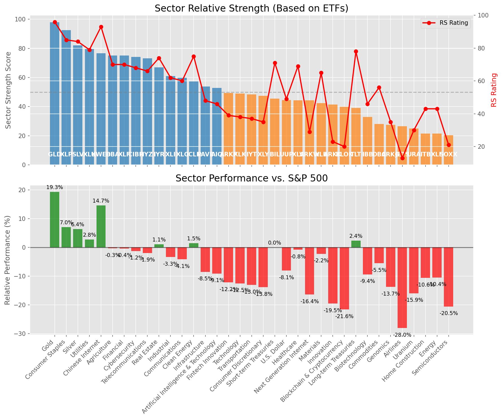

# **Daily Relative Strength Report**

**Date:** 2025-04-14

## **Market Valuation (Buffett Indicator)**

| Metric | Value |
|--------|-------|
| **Market Valuation** | **Undervalued** |
| **Current Ratio** | 8.90 |
| **Historical Mean** | 9.68 |
| **Standard Deviation** | 0.45 |
| **Z-Score (StdDev from Mean)** | -1.93 |
| **Total Market Cap** | $264.65 trillion |
| **GDP** | $29.72 trillion |

## **Market Insights**

### **Market is Undervalued**

The market is trading below historical average valuations, suggesting potential opportunity. These conditions have historically preceded periods of above-average returns. Investors should:

- Look for stocks breaking out of consolidation patterns on increasing volume
- Focus on sectors showing relative strength
- Consider increasing equity exposure, particularly in quality names
- Be mindful of overall market direction and avoid fighting the trend

History suggests patient investors are often rewarded when investing during periods of undervaluation.

### **Buffett Indicator Overview**

The Buffett Indicator (Total Market Cap / GDP) is a measure of the stock market's valuation relative to the size of the economy. It is named after Warren Buffett, who described it as "probably the best single measure of where valuations stand at any given moment."

- **Values above +2 standard deviations:** Market significantly overvalued
- **Values above +1 standard deviation:** Market overvalued
- **Values between -1 and +1 standard deviations:** Market fairly valued
- **Values below -1 standard deviation:** Market undervalued
- **Values below -2 standard deviations:** Market significantly undervalued

---

## **Sector Relative Strength**

Based on William O'Neil's Relative Strength Methodology

| ETF | Strength | RS Rating | Performance | Above Key MAs | Trend | Sector |
|-----|----------|-----------|-------------|--------------|-------|--------|
| [GLD](https://www.tradingview.com/chart/?symbol=GLD) | 98.0 | 96.0 | 19.15% | 10d ✓, 50d ✓, 200d ✓ | ↗️ | Gold |
| [XLP](https://www.tradingview.com/chart/?symbol=XLP) | 93.0 | 86.0 | 6.93% | 10d ✓, 50d ✓, 200d ✓ | ↗️ | Consumer Staples |
| [KWEB](https://www.tradingview.com/chart/?symbol=KWEB) | 87.1 | 94.0 | 16.43% | 10d ✓, 50d ✗, 200d ✓ | ↗️ | Chinese Internet |
| [SLV](https://www.tradingview.com/chart/?symbol=SLV) | 82.1 | 84.0 | 5.96% | 10d ✓, 50d ✗, 200d ✓ | ↗️ | Silver |
| [XLU](https://www.tradingview.com/chart/?symbol=XLU) | 80.1 | 80.0 | 2.63% | 10d ✓, 50d ✗, 200d ✓ | ↗️ | Utilities |
| [XLF](https://www.tradingview.com/chart/?symbol=XLF) | 76.1 | 72.0 | -0.10% | 10d ✓, 50d ✗, 200d ✓ | ↗️ | Financial |
| [DBA](https://www.tradingview.com/chart/?symbol=DBA) | 75.6 | 71.0 | -0.28% | 10d ✓, 50d ✗, 200d ✓ | ↗️ | Agriculture |
| [CIBR](https://www.tradingview.com/chart/?symbol=CIBR) | 75.1 | 70.0 | -0.72% | 10d ✓, 50d ✗, 200d ✓ | ↗️ | Cybersecurity |
| [IYR](https://www.tradingview.com/chart/?symbol=IYR) | 67.9 | 76.0 | 0.95% | 10d ✓, 50d ✗, 200d ✗ | ↗️ | Real Estate |
| [XLI](https://www.tradingview.com/chart/?symbol=XLI) | 61.9 | 64.0 | -3.06% | 10d ✓, 50d ✗, 200d ✗ | ↗️ | Industrial |
| [XLC](https://www.tradingview.com/chart/?symbol=XLC) | 61.4 | 63.0 | -3.56% | 10d ✓, 50d ✗, 200d ✗ | ↗️ | Communications |
| [IYZ](https://www.tradingview.com/chart/?symbol=IYZ) | 61.2 | 62.0 | -4.12% | 10d ✗, 50d ✗, 200d ✓ | ↗️ | Telecommunications |
| [ICLN](https://www.tradingview.com/chart/?symbol=ICLN) | 58.3 | 77.0 | 1.69% | 10d ✓, 50d ✓, 200d ✗ | ↘️ | Clean Energy |
| [PAVE](https://www.tradingview.com/chart/?symbol=PAVE) | 54.9 | 50.0 | -8.36% | 10d ✓, 50d ✗, 200d ✗ | ↗️ | Infrastructure |
| [AIQ](https://www.tradingview.com/chart/?symbol=AIQ) | 54.9 | 50.0 | -8.48% | 10d ✓, 50d ✗, 200d ✗ | ↗️ | Artificial Intelligence & Technology |
| [XLK](https://www.tradingview.com/chart/?symbol=XLK) | 50.4 | 41.0 | -11.86% | 10d ✓, 50d ✗, 200d ✗ | ↗️ | Technology |
| [ARKF](https://www.tradingview.com/chart/?symbol=ARKF) | 50.4 | 41.0 | -11.78% | 10d ✓, 50d ✗, 200d ✗ | ↗️ | Fintech Innovation |
| [XLY](https://www.tradingview.com/chart/?symbol=XLY) | 47.9 | 36.0 | -13.72% | 10d ✓, 50d ✗, 200d ✗ | ↗️ | Consumer Discretionary |
| [BIL](https://www.tradingview.com/chart/?symbol=BIL) | 46.4 | 73.0 | 0.02% | 10d ✓, 50d ✗, 200d ✗ | ↘️ | Short-term Treasuries |
| [UUP](https://www.tradingview.com/chart/?symbol=UUP) | 45.5 | 51.0 | -8.05% | 10d ✗, 50d ✗, 200d ✗ | ↗️ | U.S. Dollar |
| [XLV](https://www.tradingview.com/chart/?symbol=XLV) | 44.9 | 70.0 | -0.87% | 10d ✓, 50d ✗, 200d ✗ | ↘️ | Healthcare |
| [XLB](https://www.tradingview.com/chart/?symbol=XLB) | 43.4 | 67.0 | -2.28% | 10d ✓, 50d ✗, 200d ✗ | ↘️ | Materials |
| [BLOK](https://www.tradingview.com/chart/?symbol=BLOK) | 42.9 | 26.0 | -18.28% | 10d ✓, 50d ✗, 200d ✗ | ↗️ | Blockchain & Cryptocurrency |
| [ARKK](https://www.tradingview.com/chart/?symbol=ARKK) | 42.4 | 25.0 | -19.14% | 10d ✓, 50d ✗, 200d ✗ | ↗️ | Innovation |
| [ARKW](https://www.tradingview.com/chart/?symbol=ARKW) | 41.4 | 23.0 | -20.30% | 10d ✓, 50d ✗, 200d ✗ | ↗️ | Next Generation Internet |
| [TLT](https://www.tradingview.com/chart/?symbol=TLT) | 39.0 | 78.0 | 2.08% | 10d ✗, 50d ✗, 200d ✗ | ↘️ | Long-term Treasuries |
| [IYT](https://www.tradingview.com/chart/?symbol=IYT) | 37.5 | 35.0 | -14.51% | 10d ✗, 50d ✗, 200d ✗ | ↗️ | Transportation |
| [IBB](https://www.tradingview.com/chart/?symbol=IBB) | 32.9 | 46.0 | -9.79% | 10d ✓, 50d ✗, 200d ✗ | ↘️ | Biotechnology |
| [DBC](https://www.tradingview.com/chart/?symbol=DBC) | 29.0 | 58.0 | -5.62% | 10d ✗, 50d ✗, 200d ✗ | ↘️ | Commodities |
| [ARKG](https://www.tradingview.com/chart/?symbol=ARKG) | 28.4 | 37.0 | -13.18% | 10d ✓, 50d ✗, 200d ✗ | ↘️ | Genomics |
| [JETS](https://www.tradingview.com/chart/?symbol=JETS) | 27.0 | 14.0 | -27.29% | 10d ✗, 50d ✗, 200d ✗ | ↗️ | Airlines |
| [URA](https://www.tradingview.com/chart/?symbol=URA) | 25.4 | 31.0 | -15.81% | 10d ✓, 50d ✗, 200d ✗ | ↘️ | Uranium |
| [XLE](https://www.tradingview.com/chart/?symbol=XLE) | 22.5 | 45.0 | -10.23% | 10d ✗, 50d ✗, 200d ✗ | ↘️ | Energy |
| [ITB](https://www.tradingview.com/chart/?symbol=ITB) | 22.0 | 44.0 | -10.80% | 10d ✗, 50d ✗, 200d ✗ | ↘️ | Home Construction |
| [SOXX](https://www.tradingview.com/chart/?symbol=SOXX) | 21.4 | 23.0 | -19.81% | 10d ✓, 50d ✗, 200d ✗ | ↘️ | Semiconductors |

### **Sector ETF Performance Interpretation**

This table shows the relative strength metrics for different market sectors based on their representative ETFs:

- **ETF**: The ETF used to measure sector performance (click for chart)
- **Strength**: Overall sector strength score (0-100) combining multiple factors
- **RS Rating**: O'Neil RS rating of the sector ETF
- **Performance**: Performance of the sector ETF relative to SPY
- **Above Key MAs**: Whether the ETF is trading above its 10, 50, and 200-day moving averages
- **Trend**: Whether the sector is in an uptrend (↗️) or downtrend (↘️)

### **Current Sector Leadership**

The current market leadership is coming from the following sectors: **Gold, Consumer Staples, Chinese Internet**.

The **Gold** sector (represented by **GLD**) is showing particularly strong relative strength with an RS rating of 96.0 and performance of 19.15% vs. the S&P 500. This sector is trading above its 10-day, 50-day, 200-day moving average(s). Investors should consider focusing on high RS stocks within these leading sectors for potential outperformance.

---

## **Buy Recommendations**

The following 98 stocks show exceptional relative strength:

| RS Rating | Buy Score | Current Price | Chart | Name | Ticker |
|-----------|-----------|---------------|-------|------|--------|
| 100 | 100 | $83.23 | [Chart](https://www.tradingview.com/chart/?symbol=WPM) | Wheaton Precious Metals Corp. Common Stock | WPM |
| 100 | 100 | $29.50 | [Chart](https://www.tradingview.com/chart/?symbol=AGI) | Alamos Gold Inc. Class A Common Shares | AGI |
| 100 | 100 | $28.21 | [Chart](https://www.tradingview.com/chart/?symbol=MP) | MP Materials Corp. | MP |
| 100 | 100 | $147.88 | [Chart](https://www.tradingview.com/chart/?symbol=PLMR) | Palomar Holdings, Inc. Common stock | PLMR |
| 99 | 100 | $23.15 | [Chart](https://www.tradingview.com/chart/?symbol=DB) | Deutsche Bank Aktiengesellschaft | DB |
| 99 | 100 | $18.50 | [Chart](https://www.tradingview.com/chart/?symbol=SWI) | SolarWinds Corporation Common Stock | SWI |
| 99 | 100 | $181.39 | [Chart](https://www.tradingview.com/chart/?symbol=RGLD) | Royal Gold Inc | RGLD |
| 99 | 100 | $118.06 | [Chart](https://www.tradingview.com/chart/?symbol=AEM) | Agnico Eagle Mines Ltd. | AEM |
| 99 | 100 | $31.63 | [Chart](https://www.tradingview.com/chart/?symbol=LTH) | Life Time Group Holdings, Inc. | LTH |
| 99 | 100 | $133.92 | [Chart](https://www.tradingview.com/chart/?symbol=UGL) | ProShares Ultra Gold | UGL |
| 99 | 100 | $15.82 | [Chart](https://www.tradingview.com/chart/?symbol=EZPW) | Ezcorp Inc | EZPW |
| 99 | 100 | $156.93 | [Chart](https://www.tradingview.com/chart/?symbol=PM) | Philip Morris International Inc. | PM |
| 99 | 100 | $94.17 | [Chart](https://www.tradingview.com/chart/?symbol=PLTR) | Palantir Technologies Inc. Class A Common Stock | PLTR |
| 98 | 100 | $119.76 | [Chart](https://www.tradingview.com/chart/?symbol=BJ) | BJs Wholesale Club Holdings, Inc. Common Stock | BJ |
| 98 | 100 | $263.56 | [Chart](https://www.tradingview.com/chart/?symbol=TMUS) | T-Mobile US, Inc. | TMUS |
| 98 | 100 | $46.69 | [Chart](https://www.tradingview.com/chart/?symbol=EXC) | Exelon Corporation | EXC |
| 98 | 100 | $23.46 | [Chart](https://www.tradingview.com/chart/?symbol=OR) | Osisko Gold Royalties Ltd | OR |
| 98 | 100 | $45.64 | [Chart](https://www.tradingview.com/chart/?symbol=GH) | Guardant Health, Inc. Common Stock | GH |
| 98 | 100 | $38.74 | [Chart](https://www.tradingview.com/chart/?symbol=MRX) | Marex Group plc Ordinary Shares | MRX |
| 97 | 100 | $222.18 | [Chart](https://www.tradingview.com/chart/?symbol=CHKP) | Check Point Software Technologies Ltd | CHKP |
| 97 | 100 | $79.94 | [Chart](https://www.tradingview.com/chart/?symbol=SNEX) | StoneX Group Inc. Common Stock | SNEX |
| 97 | 100 | $76.46 | [Chart](https://www.tradingview.com/chart/?symbol=NFG) | National Fuel Gas Co. | NFG |
| 97 | 100 | $123.37 | [Chart](https://www.tradingview.com/chart/?symbol=BECN) | Beacon Roofing Supply, Inc. | BECN |
| 97 | 100 | $69.55 | [Chart](https://www.tradingview.com/chart/?symbol=WRB) | W.R. Berkley Corporation | WRB |
| 97 | 100 | $532.55 | [Chart](https://www.tradingview.com/chart/?symbol=BRK.B) | BERKSHIRE HATHAWAY Class B | BRK.B |
| 96 | 100 | $88.02 | [Chart](https://www.tradingview.com/chart/?symbol=CCEP) | Coca-Cola Europacific Partners plc Ordinary Shares | CCEP |
| 96 | 100 | $60.50 | [Chart](https://www.tradingview.com/chart/?symbol=IAU) | iShares Gold Trust | IAU |
| 96 | 100 | $343.20 | [Chart](https://www.tradingview.com/chart/?symbol=AJG) | Arthur J. Gallagher & Co. | AJG |
| 96 | 100 | $213.45 | [Chart](https://www.tradingview.com/chart/?symbol=TTWO) | Take-Two Interactive Software Inc | TTWO |
| 96 | 100 | $295.75 | [Chart](https://www.tradingview.com/chart/?symbol=GLD) | SPDR Gold Trust, SPDR Gold Shares | GLD |
| 96 | 100 | $30.61 | [Chart](https://www.tradingview.com/chart/?symbol=SGOL) | abrdn Physical Gold Shares ETF | SGOL |
| 96 | 100 | $32.00 | [Chart](https://www.tradingview.com/chart/?symbol=IAUM) | iShares Gold Trust Micro | IAUM |
| 96 | 100 | $27.84 | [Chart](https://www.tradingview.com/chart/?symbol=EUFN) | iShares MSCI Europe Financials ETF | EUFN |
| 96 | 100 | $245.74 | [Chart](https://www.tradingview.com/chart/?symbol=RSG) | Republic Services Inc. | RSG |
| 96 | 100 | $22.76 | [Chart](https://www.tradingview.com/chart/?symbol=SRAD) | Sportradar Group AG Class A Ordinary Shares | SRAD |
| 95 | 100 | $24.65 | [Chart](https://www.tradingview.com/chart/?symbol=PHYS) | Sprott Physical Gold Trust | PHYS |
| 95 | 100 | $121.12 | [Chart](https://www.tradingview.com/chart/?symbol=BRO) | Brown & Brown, Inc. | BRO |
| 95 | 100 | $24.02 | [Chart](https://www.tradingview.com/chart/?symbol=PRVA) | Privia Health Group, Inc. Common Stock | PRVA |
| 95 | 100 | $452.13 | [Chart](https://www.tradingview.com/chart/?symbol=CASY) | Casey's General Stores Inc | CASY |
| 95 | 100 | $67.58 | [Chart](https://www.tradingview.com/chart/?symbol=VTR) | Ventas, Inc. | VTR |
| 95 | 100 | $63.54 | [Chart](https://www.tradingview.com/chart/?symbol=GLDM) | SPDR Gold MiniShares | GLDM |
| 95 | 100 | $69.26 | [Chart](https://www.tradingview.com/chart/?symbol=KR) | The Kroger Co. | KR |
| 95 | 100 | $37.01 | [Chart](https://www.tradingview.com/chart/?symbol=CNP) | CenterPoint Energy, Inc. | CNP |
| 95 | 100 | $279.44 | [Chart](https://www.tradingview.com/chart/?symbol=PGR) | Progressive Corporation | PGR |
| 94 | 100 | $41.66 | [Chart](https://www.tradingview.com/chart/?symbol=BTI) | British American Tobacco p.l.c. American Depositary Shares, American Depositary Shares, each representing one Ordinary Share | BTI |
| 94 | 100 | $57.02 | [Chart](https://www.tradingview.com/chart/?symbol=ULS) | UL Solutions Inc. | ULS |
| 93 | 100 | $93.74 | [Chart](https://www.tradingview.com/chart/?symbol=PNW) | Pinnacle West Capital Corporation | PNW |
| 93 | 100 | $217.29 | [Chart](https://www.tradingview.com/chart/?symbol=CBOE) | Cboe Global Markets, Inc. | CBOE |
| 93 | 100 | $61.97 | [Chart](https://www.tradingview.com/chart/?symbol=FNF) | Fidelity National Financial, Inc. | FNF |
| 93 | 100 | $1389.79 | [Chart](https://www.tradingview.com/chart/?symbol=ORLY) | O'Reilly Automotive, Inc. | ORLY |
| 93 | 100 | $264.87 | [Chart](https://www.tradingview.com/chart/?symbol=CME) | CME Group Inc. | CME |
| 93 | 100 | $28.50 | [Chart](https://www.tradingview.com/chart/?symbol=CEF) | Sprott Physical Gold and Silver Trust | CEF |
| 93 | 100 | $52.95 | [Chart](https://www.tradingview.com/chart/?symbol=PPC) | Pilgrims Pride Corporation | PPC |
| 93 | 100 | $36.90 | [Chart](https://www.tradingview.com/chart/?symbol=EWG) | iShares MSCI Germany ETF | EWG |
| 93 | 100 | $238.17 | [Chart](https://www.tradingview.com/chart/?symbol=MMC) | Marsh & McLennan Companies, Inc. | MMC |
| 93 | 100 | $81.53 | [Chart](https://www.tradingview.com/chart/?symbol=FAST) | Fastenal Co | FAST |
| 93 | 100 | $52.53 | [Chart](https://www.tradingview.com/chart/?symbol=SKWD) | Skyward Specialty Insurance Group, Inc. Common Stock | SKWD |
| 92 | 100 | $99.06 | [Chart](https://www.tradingview.com/chart/?symbol=AEE) | Ameren Corporation | AEE |
| 92 | 100 | $106.29 | [Chart](https://www.tradingview.com/chart/?symbol=AEP) | American Electric Power Company, Inc. | AEP |
| 92 | 100 | $133.44 | [Chart](https://www.tradingview.com/chart/?symbol=DTE) | DTE Energy Company | DTE |
| 92 | 100 | $44.84 | [Chart](https://www.tradingview.com/chart/?symbol=OGE) | OGE Energy Corp. | OGE |
| 92 | 100 | $103.52 | [Chart](https://www.tradingview.com/chart/?symbol=EHC) | Encompass Health Corporation Common Stock | EHC |
| 92 | 100 | $73.36 | [Chart](https://www.tradingview.com/chart/?symbol=CMS) | CMS Energy Corporation | CMS |
| 92 | 100 | $37.77 | [Chart](https://www.tradingview.com/chart/?symbol=ORI) | Old Republic International Corporation | ORI |
| 92 | 100 | $120.34 | [Chart](https://www.tradingview.com/chart/?symbol=DUK) | Duke Energy Corporation | DUK |
| 92 | 100 | $32.96 | [Chart](https://www.tradingview.com/chart/?symbol=KTOS) | Kratos Defense & Security Solutions, Inc. | KTOS |
| 92 | 100 | $67.56 | [Chart](https://www.tradingview.com/chart/?symbol=EVRG) | Evergy, Inc. | EVRG |
| 91 | 100 | $56.98 | [Chart](https://www.tradingview.com/chart/?symbol=MO) | Altria Group, Inc. | MO |
| 91 | 100 | $35.44 | [Chart](https://www.tradingview.com/chart/?symbol=PPL) | PPL Corporation | PPL |
| 91 | 100 | $76.51 | [Chart](https://www.tradingview.com/chart/?symbol=ADC) | Agree Realty Corporation | ADC |
| 91 | 100 | $195.00 | [Chart](https://www.tradingview.com/chart/?symbol=WCN) | Waste Connections, Inc. | WCN |
| 91 | 100 | $314.81 | [Chart](https://www.tradingview.com/chart/?symbol=MCD) | McDonald's Corporation | MCD |
| 90 | 100 | $97.95 | [Chart](https://www.tradingview.com/chart/?symbol=RBA) | RB Global, Inc. | RBA |
| 90 | 100 | $24.76 | [Chart](https://www.tradingview.com/chart/?symbol=FMS) | Fresenius Medical Care AG | FMS |
| 90 | 100 | $198.49 | [Chart](https://www.tradingview.com/chart/?symbol=DRI) | Darden Restaurants, Inc. | DRI |
| 90 | 100 | $48.72 | [Chart](https://www.tradingview.com/chart/?symbol=GFL) | GFL Environmental Inc. Subordinate Voting Shares | GFL |
| 90 | 100 | $295.80 | [Chart](https://www.tradingview.com/chart/?symbol=VRSK) | Verisk Analytics, Inc. Common Stock | VRSK |
| 90 | 100 | $18.46 | [Chart](https://www.tradingview.com/chart/?symbol=GRND) | Grindr Inc. | GRND |
| 89 | 100 | $29.75 | [Chart](https://www.tradingview.com/chart/?symbol=AHR) | American Healthcare REIT, Inc. | AHR |
| 89 | 100 | $103.78 | [Chart](https://www.tradingview.com/chart/?symbol=ATGE) | Adtalem Global Education Inc. Common Shares | ATGE |
| 89 | 100 | $133.44 | [Chart](https://www.tradingview.com/chart/?symbol=CAH) | Cardinal Health, Inc. | CAH |
| 88 | 100 | $151.48 | [Chart](https://www.tradingview.com/chart/?symbol=ATO) | Atmos Energy Corporation | ATO |
| 89 | 99 | $75.00 | [Chart](https://www.tradingview.com/chart/?symbol=OGS) | ONE GAS, INC. | OGS |
| 87 | 99 | $35.63 | [Chart](https://www.tradingview.com/chart/?symbol=DRS) | Leonardo DRS, Inc. Common Stock | DRS |
| 86 | 99 | $148.90 | [Chart](https://www.tradingview.com/chart/?symbol=PAYX) | Paychex Inc | PAYX |
| 88 | 98 | $109.45 | [Chart](https://www.tradingview.com/chart/?symbol=AFL) | Aflac Inc. | AFL |
| 88 | 98 | $130.46 | [Chart](https://www.tradingview.com/chart/?symbol=TJX) | TJX Companies, Inc. (The) | TJX |
| 87 | 98 | $114.11 | [Chart](https://www.tradingview.com/chart/?symbol=OLLI) | Ollie's Bargain Outlet Holdings, Inc. Common Stock | OLLI |
| 87 | 98 | $115.08 | [Chart](https://www.tradingview.com/chart/?symbol=CWST) | Casella Waste Systems Inc | CWST |
| 87 | 98 | $49.88 | [Chart](https://www.tradingview.com/chart/?symbol=RELX) | RELX PLC | RELX |
| 86 | 98 | $86.76 | [Chart](https://www.tradingview.com/chart/?symbol=L) | Loews Corporation | L |
| 85 | 97 | $117.38 | [Chart](https://www.tradingview.com/chart/?symbol=IDA) | IDACORP, Inc. | IDA |
| 84 | 97 | $303.22 | [Chart](https://www.tradingview.com/chart/?symbol=ADP) | Automatic Data Processing | ADP |
| 85 | 96 | $75.36 | [Chart](https://www.tradingview.com/chart/?symbol=BRBR) | BellRing Brands, Inc. | BRBR |
| 84 | 96 | $46.18 | [Chart](https://www.tradingview.com/chart/?symbol=MRCY) | Mercury Systems Inc. | MRCY |
| 81 | 94 | $57.30 | [Chart](https://www.tradingview.com/chart/?symbol=WMB) | Williams Companies Inc. | WMB |
| 83 | 93 | $54.51 | [Chart](https://www.tradingview.com/chart/?symbol=IGF) | iShares Global Infrastructure ETF | IGF |
| 81 | 91 | $59.55 | [Chart](https://www.tradingview.com/chart/?symbol=RYTM) | Rhythm Pharmaceuticals, Inc. Common Stock | RYTM |

---

## **Sell Recommendations**

The following 65 stocks show deteriorating relative strength:

| RS Rating | Sell Score | Current Price | Chart | Name | Ticker |
|-----------|------------|---------------|-------|------|--------|
| 1 | 100 | $66.77 | [Chart](https://www.tradingview.com/chart/?symbol=PI) | Impinj, Inc. Common Stock | PI |
| 2 | 100 | $18.99 | [Chart](https://www.tradingview.com/chart/?symbol=DJT) | Trump Media & Technology Group Corp. Common Stock | DJT |
| 4 | 100 | $10.20 | [Chart](https://www.tradingview.com/chart/?symbol=ARCT) | Arcturus Therapeutics Holdings Inc. Common Stock | ARCT |
| 5 | 100 | $10.10 | [Chart](https://www.tradingview.com/chart/?symbol=CGEM) | Cullinan Therapeutics, Inc. Common Stock | CGEM |
| 7 | 100 | $12.18 | [Chart](https://www.tradingview.com/chart/?symbol=GCT) | GigaCloud Technology Inc Class A Ordinary Shares | GCT |
| 8 | 100 | $17.48 | [Chart](https://www.tradingview.com/chart/?symbol=HZO) | MarineMax, Inc. | HZO |
| 11 | 100 | $27.24 | [Chart](https://www.tradingview.com/chart/?symbol=SRDX) | Surmodics, Inc. Common Stock | SRDX |
| 13 | 100 | $19.55 | [Chart](https://www.tradingview.com/chart/?symbol=ST) | Sensata Technologies Holding plc | ST |
| 14 | 100 | $44.90 | [Chart](https://www.tradingview.com/chart/?symbol=EDU) | New Oriental Education and Technology Group, Inc. American Depositary Shares (each representing ten (10) Common Shares) | EDU |
| 4 | 97 | $17.93 | [Chart](https://www.tradingview.com/chart/?symbol=DAVA) | Endava plc American Depositary Shares (each representing one Class A Ordinary Share) | DAVA |
| 21 | 96 | $10.03 | [Chart](https://www.tradingview.com/chart/?symbol=MTAL) | MAC Copper Limited | MTAL |
| 16 | 94 | $51.40 | [Chart](https://www.tradingview.com/chart/?symbol=CNMD) | CONMED Corporation | CNMD |
| 25 | 94 | $12.71 | [Chart](https://www.tradingview.com/chart/?symbol=MED) | Medifast, Inc. | MED |
| 13 | 93 | $11.78 | [Chart](https://www.tradingview.com/chart/?symbol=AEYE) | AudioEye, Inc. Common Stock | AEYE |
| 15 | 93 | $19.59 | [Chart](https://www.tradingview.com/chart/?symbol=AMN) | AMN Healthcare Services | AMN |
| 23 | 93 | $13.69 | [Chart](https://www.tradingview.com/chart/?symbol=FXN) | First Trust Energy AlphaDEX Fund | FXN |
| 14 | 92 | $10.24 | [Chart](https://www.tradingview.com/chart/?symbol=EXPI) | eXp World Holdings, Inc. Common Stock | EXPI |
| 10 | 91 | $10.01 | [Chart](https://www.tradingview.com/chart/?symbol=VYX) | NCR Voyix Corporation | VYX |
| 15 | 90 | $49.41 | [Chart](https://www.tradingview.com/chart/?symbol=RHI) | Robert Half Inc. | RHI |
| 15 | 90 | $330.37 | [Chart](https://www.tradingview.com/chart/?symbol=SAIA) | Saia, Inc. | SAIA |
| 13 | 89 | $10.77 | [Chart](https://www.tradingview.com/chart/?symbol=SONO) | Sonos, Inc. Common Stock | SONO |
| 13 | 88 | $10.31 | [Chart](https://www.tradingview.com/chart/?symbol=VREX) | Varex Imaging Corporation Common Stock | VREX |
| 15 | 88 | $13.05 | [Chart](https://www.tradingview.com/chart/?symbol=MARA) | MARA Holdings, Inc. Common Stock | MARA |
| 18 | 87 | $11.34 | [Chart](https://www.tradingview.com/chart/?symbol=HPK) | HighPeak Energy, Inc. Common Stock | HPK |
| 27 | 87 | $10.71 | [Chart](https://www.tradingview.com/chart/?symbol=DBRG) | DigitalBridge Group, Inc. | DBRG |
| 21 | 86 | $10.04 | [Chart](https://www.tradingview.com/chart/?symbol=HTLD) | Heartland Express Inc | HTLD |
| 18 | 85 | $10.15 | [Chart](https://www.tradingview.com/chart/?symbol=HLIT) | Harmonic Inc | HLIT |
| 19 | 85 | $10.49 | [Chart](https://www.tradingview.com/chart/?symbol=PEB) | Pebblebrook Hotel Trust | PEB |
| 23 | 85 | $22.24 | [Chart](https://www.tradingview.com/chart/?symbol=HOG) | Harley-Davidson, Inc. | HOG |
| 24 | 85 | $29.31 | [Chart](https://www.tradingview.com/chart/?symbol=DAR) | DARLING INGREDIENTS INC. | DAR |
| 24 | 85 | $35.48 | [Chart](https://www.tradingview.com/chart/?symbol=TEX) | Terex Corporation | TEX |
| 17 | 84 | $111.86 | [Chart](https://www.tradingview.com/chart/?symbol=MYRG) | MYR Group, Inc. | MYRG |
| 30 | 84 | $77.37 | [Chart](https://www.tradingview.com/chart/?symbol=LEA) | Lear Corporation | LEA |
| 21 | 83 | $10.26 | [Chart](https://www.tradingview.com/chart/?symbol=PACS) | PACS Group, Inc. | PACS |
| 23 | 83 | $18.40 | [Chart](https://www.tradingview.com/chart/?symbol=BITO) | ProShares Bitcoin ETF | BITO |
| 24 | 83 | $10.11 | [Chart](https://www.tradingview.com/chart/?symbol=CELC) | Celcuity Inc. Common Stock | CELC |
| 25 | 83 | $52.34 | [Chart](https://www.tradingview.com/chart/?symbol=HXL) | Hexcel Corporation | HXL |
| 24 | 81 | $13.68 | [Chart](https://www.tradingview.com/chart/?symbol=MANU) | MANCHESTER UNITED PLC | MANU |
| 23 | 80 | $25.09 | [Chart](https://www.tradingview.com/chart/?symbol=CZR) | Caesars Entertainment, Inc. Common Stock | CZR |
| 24 | 79 | $146.79 | [Chart](https://www.tradingview.com/chart/?symbol=PTC) | PTC, INC | PTC |
| 29 | 78 | $10.34 | [Chart](https://www.tradingview.com/chart/?symbol=CMRE) | Costamare Inc. | CMRE |
| 31 | 77 | $28.70 | [Chart](https://www.tradingview.com/chart/?symbol=TAN) | Invesco Solar ETF | TAN |
| 38 | 77 | $65.92 | [Chart](https://www.tradingview.com/chart/?symbol=TXT) | Textron, Inc. | TXT |
| 39 | 77 | $11.82 | [Chart](https://www.tradingview.com/chart/?symbol=DAWN) | Day One Biopharmaceuticals, Inc. Common Stock | DAWN |
| 32 | 76 | $232.59 | [Chart](https://www.tradingview.com/chart/?symbol=WING) | Wingstop Inc | WING |
| 34 | 76 | $26.14 | [Chart](https://www.tradingview.com/chart/?symbol=PINS) | Pinterest, Inc. Class A Common Stock | PINS |
| 25 | 75 | $85.52 | [Chart](https://www.tradingview.com/chart/?symbol=GPN) | Global Payments, Inc. | GPN |
| 33 | 75 | $11.77 | [Chart](https://www.tradingview.com/chart/?symbol=RIVN) | Rivian Automotive, Inc. Class A Common Stock | RIVN |
| 31 | 74 | $10.96 | [Chart](https://www.tradingview.com/chart/?symbol=CMP) | Compass Minerals International, Inc. | CMP |
| 30 | 73 | $41.25 | [Chart](https://www.tradingview.com/chart/?symbol=CCJ) | Cameco Corporation | CCJ |
| 35 | 73 | $23.82 | [Chart](https://www.tradingview.com/chart/?symbol=AMRK) | A-Mark Precious Metals, Inc. | AMRK |
| 31 | 72 | $22.88 | [Chart](https://www.tradingview.com/chart/?symbol=URA) | Global X Uranium ETF | URA |
| 36 | 72 | $50.23 | [Chart](https://www.tradingview.com/chart/?symbol=KBR) | KBR, Inc. | KBR |
| 38 | 72 | $78.63 | [Chart](https://www.tradingview.com/chart/?symbol=TNET) | TRINET GROUP, INC. | TNET |
| 39 | 72 | $58.85 | [Chart](https://www.tradingview.com/chart/?symbol=BMRN) | BioMarin Pharmaceuticals Inc | BMRN |
| 29 | 71 | $106.52 | [Chart](https://www.tradingview.com/chart/?symbol=MHO) | M/I Homes, Inc. | MHO |
| 35 | 71 | $29.38 | [Chart](https://www.tradingview.com/chart/?symbol=TPH) | Tri Pointe Homes, Inc. | TPH |
| 33 | 70 | $31.38 | [Chart](https://www.tradingview.com/chart/?symbol=MBIN) | Merchants Bancorp Common Stock | MBIN |
| 37 | 69 | $80.81 | [Chart](https://www.tradingview.com/chart/?symbol=ALV) | Autoliv, Inc. | ALV |
| 32 | 68 | $90.24 | [Chart](https://www.tradingview.com/chart/?symbol=PCAR) | Paccar Inc | PCAR |
| 35 | 68 | $25.05 | [Chart](https://www.tradingview.com/chart/?symbol=RAMP) | LiveRamp Holdings, Inc. Common Stock | RAMP |
| 38 | 68 | $48.05 | [Chart](https://www.tradingview.com/chart/?symbol=ATI) | ATI Inc. | ATI |
| 38 | 68 | $49.13 | [Chart](https://www.tradingview.com/chart/?symbol=CMG) | Chipotle Mexican Grill, Inc. | CMG |
| 39 | 64 | $154.49 | [Chart](https://www.tradingview.com/chart/?symbol=ODFL) | Old Dominion Freight Line | ODFL |
| 37 | 63 | $35.49 | [Chart](https://www.tradingview.com/chart/?symbol=LIT) | Global X Lithium & Battery Tech ETF | LIT |

## **Methodology**

This report uses William O'Neil's relative strength methodology from Investors Business Daily:

* **RS Rating**: Percentile rank of stock's performance vs. S&P 500 over the past 63 trading days (1-99 scale)
* **Buy Criteria**: RS Rating >= 80, price above 50-day MA, strong uptrend, increasing volume
* **Sell Criteria**: RS Rating < 40, price below 50-day MA, downtrend, decreasing volume

### **O'Neil's Key Principles**

1. **Focus on relative performance** - stocks outperforming the market
2. **Price trend confirmation** - stock must be in an uptrend
3. **Volume confirmation** - strong volume supports price moves
4. **Moving average validation** - price above key moving averages
5. **Market leaders only** - concentrate on top-performing stocks

*Report generated automatically after market close*