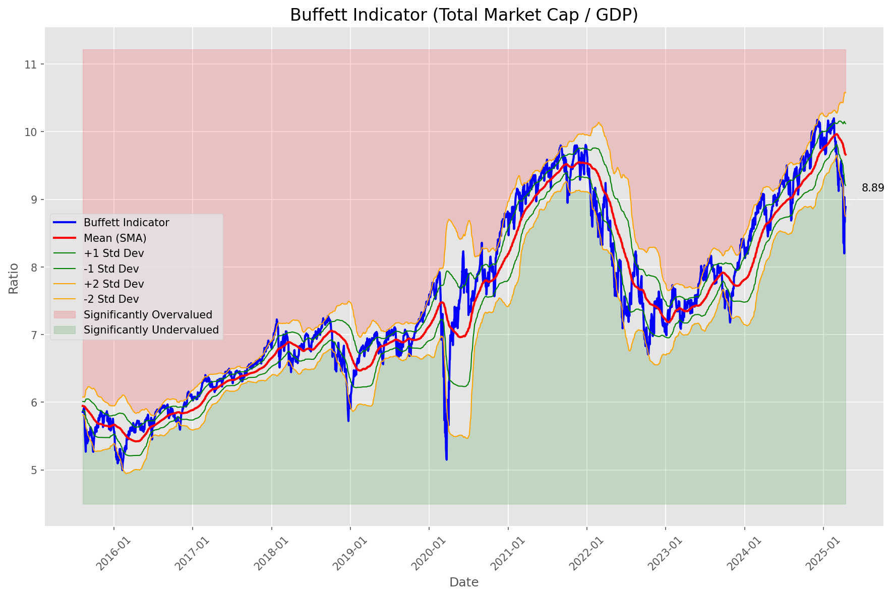
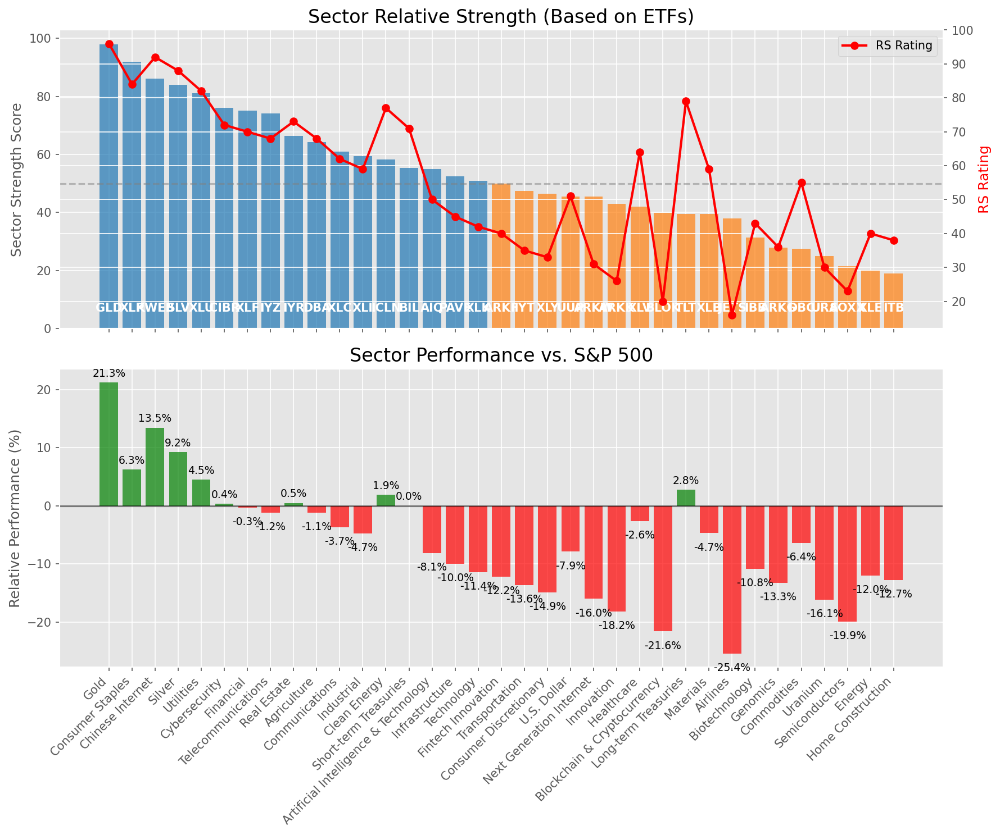

# **Daily Relative Strength Report**

**Date:** 2025-04-15

## **Market Valuation (Buffett Indicator)**

| Metric | Value |
|--------|-------|
| **Market Valuation** | **Undervalued** |
| **Current Ratio** | 8.93 |
| **Historical Mean** | 9.66 |
| **Standard Deviation** | 0.46 |
| **Z-Score (StdDev from Mean)** | -1.70 |
| **Total Market Cap** | $265.53 trillion |
| **GDP** | $29.72 trillion |

## **Market Insights**

### **Market is Undervalued**

The market is trading below historical average valuations, suggesting potential opportunity. These conditions have historically preceded periods of above-average returns. Investors should:

- Look for stocks breaking out of consolidation patterns on increasing volume
- Focus on sectors showing relative strength
- Consider increasing equity exposure, particularly in quality names
- Be mindful of overall market direction and avoid fighting the trend

History suggests patient investors are often rewarded when investing during periods of undervaluation.

### **Buffett Indicator Overview**

The Buffett Indicator (Total Market Cap / GDP) is a measure of the stock market's valuation relative to the size of the economy. It is named after Warren Buffett, who described it as "probably the best single measure of where valuations stand at any given moment."

- **Values above +2 standard deviations:** Market significantly overvalued
- **Values above +1 standard deviation:** Market overvalued
- **Values between -1 and +1 standard deviations:** Market fairly valued
- **Values below -1 standard deviation:** Market undervalued
- **Values below -2 standard deviations:** Market significantly undervalued

---

## **Sector Relative Strength**

Based on William O'Neil's Relative Strength Methodology

| ETF | Strength | RS Rating | Performance | Above Key MAs | Trend | Sector |
|-----|----------|-----------|-------------|--------------|-------|--------|
| [GLD](https://www.tradingview.com/chart/?symbol=GLD) | 98.0 | 96.0 | 20.73% | 10d ✓, 50d ✓, 200d ✓ | ↗️ | Gold |
| [XLP](https://www.tradingview.com/chart/?symbol=XLP) | 92.0 | 84.0 | 6.76% | 10d ✓, 50d ✓, 200d ✓ | ↗️ | Consumer Staples |
| [XLU](https://www.tradingview.com/chart/?symbol=XLU) | 91.0 | 82.0 | 4.62% | 10d ✓, 50d ✓, 200d ✓ | ↗️ | Utilities |
| [KWEB](https://www.tradingview.com/chart/?symbol=KWEB) | 86.1 | 92.0 | 13.47% | 10d ✓, 50d ✗, 200d ✓ | ↗️ | Chinese Internet |
| [SLV](https://www.tradingview.com/chart/?symbol=SLV) | 83.6 | 87.0 | 8.49% | 10d ✓, 50d ✗, 200d ✓ | ↗️ | Silver |
| [CIBR](https://www.tradingview.com/chart/?symbol=CIBR) | 76.6 | 73.0 | 0.63% | 10d ✓, 50d ✗, 200d ✓ | ↗️ | Cybersecurity |
| [XLF](https://www.tradingview.com/chart/?symbol=XLF) | 76.1 | 72.0 | 0.20% | 10d ✓, 50d ✗, 200d ✓ | ↗️ | Financial |
| [DBA](https://www.tradingview.com/chart/?symbol=DBA) | 74.6 | 69.0 | -0.30% | 10d ✓, 50d ✗, 200d ✓ | ↗️ | Agriculture |
| [IYZ](https://www.tradingview.com/chart/?symbol=IYZ) | 73.1 | 66.0 | -1.92% | 10d ✓, 50d ✗, 200d ✓ | ↗️ | Telecommunications |
| [IYR](https://www.tradingview.com/chart/?symbol=IYR) | 66.4 | 73.0 | 0.67% | 10d ✓, 50d ✗, 200d ✗ | ↗️ | Real Estate |
| [XLC](https://www.tradingview.com/chart/?symbol=XLC) | 60.9 | 62.0 | -3.21% | 10d ✓, 50d ✗, 200d ✗ | ↗️ | Communications |
| [XLI](https://www.tradingview.com/chart/?symbol=XLI) | 59.9 | 60.0 | -4.10% | 10d ✓, 50d ✗, 200d ✗ | ↗️ | Industrial |
| [ICLN](https://www.tradingview.com/chart/?symbol=ICLN) | 58.3 | 77.0 | 2.27% | 10d ✓, 50d ✓, 200d ✗ | ↘️ | Clean Energy |
| [BIL](https://www.tradingview.com/chart/?symbol=BIL) | 55.3 | 71.0 | 0.03% | 10d ✓, 50d ✓, 200d ✗ | ↘️ | Short-term Treasuries |
| [PAVE](https://www.tradingview.com/chart/?symbol=PAVE) | 52.9 | 46.0 | -9.24% | 10d ✓, 50d ✗, 200d ✗ | ↗️ | Infrastructure |
| [AIQ](https://www.tradingview.com/chart/?symbol=AIQ) | 52.9 | 46.0 | -9.08% | 10d ✓, 50d ✗, 200d ✗ | ↗️ | Artificial Intelligence & Technology |
| [XLK](https://www.tradingview.com/chart/?symbol=XLK) | 50.4 | 41.0 | -11.20% | 10d ✓, 50d ✗, 200d ✗ | ↗️ | Technology |
| [ARKF](https://www.tradingview.com/chart/?symbol=ARKF) | 49.4 | 39.0 | -12.15% | 10d ✓, 50d ✗, 200d ✗ | ↗️ | Fintech Innovation |
| [IYT](https://www.tradingview.com/chart/?symbol=IYT) | 47.9 | 36.0 | -13.01% | 10d ✓, 50d ✗, 200d ✗ | ↗️ | Transportation |
| [XLY](https://www.tradingview.com/chart/?symbol=XLY) | 46.4 | 33.0 | -14.29% | 10d ✓, 50d ✗, 200d ✗ | ↗️ | Consumer Discretionary |
| [UUP](https://www.tradingview.com/chart/?symbol=UUP) | 44.5 | 49.0 | -8.11% | 10d ✗, 50d ✗, 200d ✗ | ↗️ | U.S. Dollar |
| [ARKW](https://www.tradingview.com/chart/?symbol=ARKW) | 44.4 | 29.0 | -16.37% | 10d ✓, 50d ✗, 200d ✗ | ↗️ | Next Generation Internet |
| [ARKK](https://www.tradingview.com/chart/?symbol=ARKK) | 43.4 | 27.0 | -17.60% | 10d ✓, 50d ✗, 200d ✗ | ↗️ | Innovation |
| [XLV](https://www.tradingview.com/chart/?symbol=XLV) | 42.4 | 65.0 | -2.15% | 10d ✓, 50d ✗, 200d ✗ | ↘️ | Healthcare |
| [XLB](https://www.tradingview.com/chart/?symbol=XLB) | 39.9 | 60.0 | -4.18% | 10d ✓, 50d ✗, 200d ✗ | ↘️ | Materials |
| [BLOK](https://www.tradingview.com/chart/?symbol=BLOK) | 39.9 | 20.0 | -21.60% | 10d ✓, 50d ✗, 200d ✗ | ↗️ | Blockchain & Cryptocurrency |
| [TLT](https://www.tradingview.com/chart/?symbol=TLT) | 39.0 | 78.0 | 2.56% | 10d ✗, 50d ✗, 200d ✗ | ↘️ | Long-term Treasuries |
| [JETS](https://www.tradingview.com/chart/?symbol=JETS) | 37.9 | 16.0 | -24.81% | 10d ✓, 50d ✗, 200d ✗ | ↗️ | Airlines |
| [IBB](https://www.tradingview.com/chart/?symbol=IBB) | 31.4 | 43.0 | -10.35% | 10d ✓, 50d ✗, 200d ✗ | ↘️ | Biotechnology |
| [ARKG](https://www.tradingview.com/chart/?symbol=ARKG) | 29.4 | 39.0 | -12.10% | 10d ✓, 50d ✗, 200d ✗ | ↘️ | Genomics |
| [DBC](https://www.tradingview.com/chart/?symbol=DBC) | 27.0 | 54.0 | -6.52% | 10d ✗, 50d ✗, 200d ✗ | ↘️ | Commodities |
| [URA](https://www.tradingview.com/chart/?symbol=URA) | 25.4 | 31.0 | -15.24% | 10d ✓, 50d ✗, 200d ✗ | ↘️ | Uranium |
| [SOXX](https://www.tradingview.com/chart/?symbol=SOXX) | 21.4 | 23.0 | -19.60% | 10d ✓, 50d ✗, 200d ✗ | ↘️ | Semiconductors |
| [XLE](https://www.tradingview.com/chart/?symbol=XLE) | 20.0 | 40.0 | -11.61% | 10d ✗, 50d ✗, 200d ✗ | ↘️ | Energy |
| [ITB](https://www.tradingview.com/chart/?symbol=ITB) | 19.5 | 39.0 | -11.97% | 10d ✗, 50d ✗, 200d ✗ | ↘️ | Home Construction |

### **Sector ETF Performance Interpretation**

This table shows the relative strength metrics for different market sectors based on their representative ETFs:

- **ETF**: The ETF used to measure sector performance (click for chart)
- **Strength**: Overall sector strength score (0-100) combining multiple factors
- **RS Rating**: O'Neil RS rating of the sector ETF
- **Performance**: Performance of the sector ETF relative to SPY
- **Above Key MAs**: Whether the ETF is trading above its 10, 50, and 200-day moving averages
- **Trend**: Whether the sector is in an uptrend (↗️) or downtrend (↘️)

### **Current Sector Leadership**

The current market leadership is coming from the following sectors: **Gold, Consumer Staples, Utilities**.

The **Gold** sector (represented by **GLD**) is showing particularly strong relative strength with an RS rating of 96.0 and performance of 20.73% vs. the S&P 500. This sector is trading above its 10-day, 50-day, 200-day moving average(s). Investors should consider focusing on high RS stocks within these leading sectors for potential outperformance.

---

## **Buy Recommendations**

The following 115 stocks show exceptional relative strength:

| RS Rating | Buy Score | Current Price | Chart | Name | Ticker |
|-----------|-----------|---------------|-------|------|--------|
| 100 | 100 | $119.52 | [Chart](https://www.tradingview.com/chart/?symbol=AEM) | Agnico Eagle Mines Ltd. | AEM |
| 100 | 100 | $82.63 | [Chart](https://www.tradingview.com/chart/?symbol=WPM) | Wheaton Precious Metals Corp. Common Stock | WPM |
| 100 | 100 | $134.85 | [Chart](https://www.tradingview.com/chart/?symbol=UGL) | ProShares Ultra Gold | UGL |
| 100 | 100 | $62.87 | [Chart](https://www.tradingview.com/chart/?symbol=GDXJ) | VanEck Junior Gold Miners ETF | GDXJ |
| 100 | 100 | $29.63 | [Chart](https://www.tradingview.com/chart/?symbol=AGI) | Alamos Gold Inc. Class A Common Shares | AGI |
| 100 | 100 | $150.54 | [Chart](https://www.tradingview.com/chart/?symbol=PLMR) | Palomar Holdings, Inc. Common stock | PLMR |
| 100 | 100 | $27.52 | [Chart](https://www.tradingview.com/chart/?symbol=MP) | MP Materials Corp. | MP |
| 100 | 100 | $96.74 | [Chart](https://www.tradingview.com/chart/?symbol=PLTR) | Palantir Technologies Inc. Class A Common Stock | PLTR |
| 99 | 100 | $18.49 | [Chart](https://www.tradingview.com/chart/?symbol=SWI) | SolarWinds Corporation Common Stock | SWI |
| 99 | 100 | $23.56 | [Chart](https://www.tradingview.com/chart/?symbol=DB) | Deutsche Bank Aktiengesellschaft | DB |
| 99 | 100 | $31.92 | [Chart](https://www.tradingview.com/chart/?symbol=LTH) | Life Time Group Holdings, Inc. | LTH |
| 99 | 100 | $159.12 | [Chart](https://www.tradingview.com/chart/?symbol=PM) | Philip Morris International Inc. | PM |
| 99 | 100 | $182.87 | [Chart](https://www.tradingview.com/chart/?symbol=RGLD) | Royal Gold Inc | RGLD |
| 98 | 100 | $15.79 | [Chart](https://www.tradingview.com/chart/?symbol=EZPW) | Ezcorp Inc | EZPW |
| 98 | 100 | $267.37 | [Chart](https://www.tradingview.com/chart/?symbol=TMUS) | T-Mobile US, Inc. | TMUS |
| 98 | 100 | $39.37 | [Chart](https://www.tradingview.com/chart/?symbol=MRX) | Marex Group plc Ordinary Shares | MRX |
| 98 | 100 | $23.25 | [Chart](https://www.tradingview.com/chart/?symbol=OR) | Osisko Gold Royalties Ltd | OR |
| 98 | 100 | $53.93 | [Chart](https://www.tradingview.com/chart/?symbol=SKWD) | Skyward Specialty Insurance Group, Inc. Common Stock | SKWD |
| 98 | 100 | $27.54 | [Chart](https://www.tradingview.com/chart/?symbol=T) | AT&T Inc. | T |
| 98 | 100 | $23.50 | [Chart](https://www.tradingview.com/chart/?symbol=SRAD) | Sportradar Group AG Class A Ordinary Shares | SRAD |
| 97 | 100 | $119.71 | [Chart](https://www.tradingview.com/chart/?symbol=BJ) | BJs Wholesale Club Holdings, Inc. Common Stock | BJ |
| 97 | 100 | $46.61 | [Chart](https://www.tradingview.com/chart/?symbol=GH) | Guardant Health, Inc. Common Stock | GH |
| 97 | 100 | $77.57 | [Chart](https://www.tradingview.com/chart/?symbol=NFG) | National Fuel Gas Co. | NFG |
| 97 | 100 | $28.36 | [Chart](https://www.tradingview.com/chart/?symbol=EUFN) | iShares MSCI Europe Financials ETF | EUFN |
| 97 | 100 | $226.11 | [Chart](https://www.tradingview.com/chart/?symbol=CHKP) | Check Point Software Technologies Ltd | CHKP |
| 97 | 100 | $46.84 | [Chart](https://www.tradingview.com/chart/?symbol=EXC) | Exelon Corporation | EXC |
| 96 | 100 | $79.10 | [Chart](https://www.tradingview.com/chart/?symbol=SNEX) | StoneX Group Inc. Common Stock | SNEX |
| 96 | 100 | $215.01 | [Chart](https://www.tradingview.com/chart/?symbol=TTWO) | Take-Two Interactive Software Inc | TTWO |
| 96 | 100 | $31.04 | [Chart](https://www.tradingview.com/chart/?symbol=OUNZ) | VanEck Merk Gold ETF | OUNZ |
| 96 | 100 | $284.92 | [Chart](https://www.tradingview.com/chart/?symbol=COR) | Cencora, Inc. | COR |
| 96 | 100 | $30.71 | [Chart](https://www.tradingview.com/chart/?symbol=SGOL) | abrdn Physical Gold Shares ETF | SGOL |
| 96 | 100 | $60.70 | [Chart](https://www.tradingview.com/chart/?symbol=IAU) | iShares Gold Trust | IAU |
| 96 | 100 | $69.38 | [Chart](https://www.tradingview.com/chart/?symbol=WRB) | W.R. Berkley Corporation | WRB |
| 96 | 100 | $24.75 | [Chart](https://www.tradingview.com/chart/?symbol=PHYS) | Sprott Physical Gold Trust | PHYS |
| 96 | 100 | $296.67 | [Chart](https://www.tradingview.com/chart/?symbol=GLD) | SPDR Gold Trust, SPDR Gold Shares | GLD |
| 96 | 100 | $63.75 | [Chart](https://www.tradingview.com/chart/?symbol=GLDM) | SPDR Gold MiniShares | GLDM |
| 96 | 100 | $32.09 | [Chart](https://www.tradingview.com/chart/?symbol=IAUM) | iShares Gold Trust Micro | IAUM |
| 96 | 100 | $42.48 | [Chart](https://www.tradingview.com/chart/?symbol=BTI) | British American Tobacco p.l.c. American Depositary Shares, American Depositary Shares, each representing one Ordinary Share | BTI |
| 96 | 100 | $88.60 | [Chart](https://www.tradingview.com/chart/?symbol=CCEP) | Coca-Cola Europacific Partners plc Ordinary Shares | CCEP |
| 96 | 100 | $534.75 | [Chart](https://www.tradingview.com/chart/?symbol=BRK.B) | BERKSHIRE HATHAWAY Class B | BRK.B |
| 95 | 100 | $341.30 | [Chart](https://www.tradingview.com/chart/?symbol=AJG) | Arthur J. Gallagher & Co. | AJG |
| 95 | 100 | $121.16 | [Chart](https://www.tradingview.com/chart/?symbol=BRO) | Brown & Brown, Inc. | BRO |
| 95 | 100 | $279.82 | [Chart](https://www.tradingview.com/chart/?symbol=PGR) | Progressive Corporation | PGR |
| 95 | 100 | $1414.20 | [Chart](https://www.tradingview.com/chart/?symbol=ORLY) | O'Reilly Automotive, Inc. | ORLY |
| 95 | 100 | $246.10 | [Chart](https://www.tradingview.com/chart/?symbol=RSG) | Republic Services Inc. | RSG |
| 95 | 100 | $53.66 | [Chart](https://www.tradingview.com/chart/?symbol=PPC) | Pilgrims Pride Corporation | PPC |
| 95 | 100 | $460.78 | [Chart](https://www.tradingview.com/chart/?symbol=CASY) | Casey's General Stores Inc | CASY |
| 95 | 100 | $37.45 | [Chart](https://www.tradingview.com/chart/?symbol=CNP) | CenterPoint Energy, Inc. | CNP |
| 94 | 100 | $67.90 | [Chart](https://www.tradingview.com/chart/?symbol=VTR) | Ventas, Inc. | VTR |
| 94 | 100 | $983.47 | [Chart](https://www.tradingview.com/chart/?symbol=NFLX) | NetFlix Inc | NFLX |
| 94 | 100 | $63.20 | [Chart](https://www.tradingview.com/chart/?symbol=FNF) | Fidelity National Financial, Inc. | FNF |
| 94 | 100 | $123.19 | [Chart](https://www.tradingview.com/chart/?symbol=BECN) | Beacon Roofing Supply, Inc. | BECN |
| 94 | 100 | $37.23 | [Chart](https://www.tradingview.com/chart/?symbol=EWG) | iShares MSCI Germany ETF | EWG |
| 94 | 100 | $24.05 | [Chart](https://www.tradingview.com/chart/?symbol=PRVA) | Privia Health Group, Inc. Common Stock | PRVA |
| 94 | 100 | $76.30 | [Chart](https://www.tradingview.com/chart/?symbol=SR) | Spire Inc. | SR |
| 93 | 100 | $94.79 | [Chart](https://www.tradingview.com/chart/?symbol=PNW) | Pinnacle West Capital Corporation | PNW |
| 93 | 100 | $16.43 | [Chart](https://www.tradingview.com/chart/?symbol=SPNT) | SiriusPoint Ltd. | SPNT |
| 93 | 100 | $121.42 | [Chart](https://www.tradingview.com/chart/?symbol=DUK) | Duke Energy Corporation | DUK |
| 93 | 100 | $115.75 | [Chart](https://www.tradingview.com/chart/?symbol=OLLI) | Ollie's Bargain Outlet Holdings, Inc. Common Stock | OLLI |
| 93 | 100 | $28.55 | [Chart](https://www.tradingview.com/chart/?symbol=CEF) | Sprott Physical Gold and Silver Trust | CEF |
| 93 | 100 | $104.66 | [Chart](https://www.tradingview.com/chart/?symbol=ATGE) | Adtalem Global Education Inc. Common Shares | ATGE |
| 93 | 100 | $57.03 | [Chart](https://www.tradingview.com/chart/?symbol=ULS) | UL Solutions Inc. | ULS |
| 93 | 100 | $264.61 | [Chart](https://www.tradingview.com/chart/?symbol=CME) | CME Group Inc. | CME |
| 93 | 100 | $68.70 | [Chart](https://www.tradingview.com/chart/?symbol=KR) | The Kroger Co. | KR |
| 92 | 100 | $133.90 | [Chart](https://www.tradingview.com/chart/?symbol=DTE) | DTE Energy Company | DTE |
| 92 | 100 | $107.23 | [Chart](https://www.tradingview.com/chart/?symbol=AEP) | American Electric Power Company, Inc. | AEP |
| 92 | 100 | $154.98 | [Chart](https://www.tradingview.com/chart/?symbol=ATO) | Atmos Energy Corporation | ATO |
| 92 | 100 | $73.42 | [Chart](https://www.tradingview.com/chart/?symbol=CMS) | CMS Energy Corporation | CMS |
| 92 | 100 | $57.73 | [Chart](https://www.tradingview.com/chart/?symbol=MO) | Altria Group, Inc. | MO |
| 92 | 100 | $82.22 | [Chart](https://www.tradingview.com/chart/?symbol=FAST) | Fastenal Co | FAST |
| 92 | 100 | $18.52 | [Chart](https://www.tradingview.com/chart/?symbol=GRND) | Grindr Inc. | GRND |
| 91 | 100 | $67.94 | [Chart](https://www.tradingview.com/chart/?symbol=EVRG) | Evergy, Inc. | EVRG |
| 91 | 100 | $237.52 | [Chart](https://www.tradingview.com/chart/?symbol=MMC) | Marsh & McLennan Companies, Inc. | MMC |
| 91 | 100 | $61.47 | [Chart](https://www.tradingview.com/chart/?symbol=RYTM) | Rhythm Pharmaceuticals, Inc. Common Stock | RYTM |
| 91 | 100 | $38.00 | [Chart](https://www.tradingview.com/chart/?symbol=ORI) | Old Republic International Corporation | ORI |
| 91 | 100 | $35.61 | [Chart](https://www.tradingview.com/chart/?symbol=PPL) | PPL Corporation | PPL |
| 91 | 100 | $216.85 | [Chart](https://www.tradingview.com/chart/?symbol=CBOE) | Cboe Global Markets, Inc. | CBOE |
| 91 | 100 | $119.28 | [Chart](https://www.tradingview.com/chart/?symbol=IDA) | IDACORP, Inc. | IDA |
| 91 | 100 | $76.11 | [Chart](https://www.tradingview.com/chart/?symbol=OGS) | ONE GAS, INC. | OGS |
| 91 | 100 | $51.49 | [Chart](https://www.tradingview.com/chart/?symbol=RELX) | RELX PLC | RELX |
| 91 | 100 | $45.08 | [Chart](https://www.tradingview.com/chart/?symbol=OGE) | OGE Energy Corp. | OGE |
| 91 | 100 | $99.86 | [Chart](https://www.tradingview.com/chart/?symbol=AEE) | Ameren Corporation | AEE |
| 91 | 100 | $47.16 | [Chart](https://www.tradingview.com/chart/?symbol=MRCY) | Mercury Systems Inc. | MRCY |
| 90 | 100 | $103.40 | [Chart](https://www.tradingview.com/chart/?symbol=EHC) | Encompass Health Corporation Common Stock | EHC |
| 90 | 100 | $134.55 | [Chart](https://www.tradingview.com/chart/?symbol=CAH) | Cardinal Health, Inc. | CAH |
| 90 | 100 | $49.42 | [Chart](https://www.tradingview.com/chart/?symbol=GFL) | GFL Environmental Inc. Subordinate Voting Shares | GFL |
| 90 | 100 | $196.53 | [Chart](https://www.tradingview.com/chart/?symbol=WCN) | Waste Connections, Inc. | WCN |
| 90 | 100 | $77.67 | [Chart](https://www.tradingview.com/chart/?symbol=ADC) | Agree Realty Corporation | ADC |
| 90 | 100 | $30.29 | [Chart](https://www.tradingview.com/chart/?symbol=AHR) | American Healthcare REIT, Inc. | AHR |
| 89 | 100 | $98.34 | [Chart](https://www.tradingview.com/chart/?symbol=RBA) | RB Global, Inc. | RBA |
| 89 | 100 | $27.41 | [Chart](https://www.tradingview.com/chart/?symbol=UTI) | Universal Technical Institute, Inc. | UTI |
| 89 | 100 | $314.05 | [Chart](https://www.tradingview.com/chart/?symbol=MCD) | McDonald's Corporation | MCD |
| 87 | 100 | $84.05 | [Chart](https://www.tradingview.com/chart/?symbol=ETR) | Entergy Corporation | ETR |
| 87 | 100 | $39.65 | [Chart](https://www.tradingview.com/chart/?symbol=NI) | NiSource Inc. | NI |
| 88 | 99 | $117.23 | [Chart](https://www.tradingview.com/chart/?symbol=CWST) | Casella Waste Systems Inc | CWST |
| 88 | 98 | $24.67 | [Chart](https://www.tradingview.com/chart/?symbol=FMS) | Fresenius Medical Care AG | FMS |
| 88 | 98 | $42.01 | [Chart](https://www.tradingview.com/chart/?symbol=NWN) | Northwest Natural Holding Company | NWN |
| 86 | 98 | $36.56 | [Chart](https://www.tradingview.com/chart/?symbol=DRS) | Leonardo DRS, Inc. Common Stock | DRS |
| 87 | 97 | $130.26 | [Chart](https://www.tradingview.com/chart/?symbol=TJX) | TJX Companies, Inc. (The) | TJX |
| 84 | 97 | $236.53 | [Chart](https://www.tradingview.com/chart/?symbol=BR) | Broadridge Financial Solutions Inc | BR |
| 83 | 97 | $328.61 | [Chart](https://www.tradingview.com/chart/?symbol=WTW) | Willis Towers Watson Public Limited Company Ordinary Shares | WTW |
| 85 | 96 | $33.27 | [Chart](https://www.tradingview.com/chart/?symbol=KTOS) | Kratos Defense & Security Solutions, Inc. | KTOS |
| 84 | 96 | $985.58 | [Chart](https://www.tradingview.com/chart/?symbol=COST) | Costco Wholesale Corp | COST |
| 84 | 96 | $86.32 | [Chart](https://www.tradingview.com/chart/?symbol=L) | Loews Corporation | L |
| 83 | 96 | $148.78 | [Chart](https://www.tradingview.com/chart/?symbol=PAYX) | Paychex Inc | PAYX |
| 85 | 95 | $48.70 | [Chart](https://www.tradingview.com/chart/?symbol=NJR) | New Jersey Resources Corp | NJR |
| 82 | 95 | $58.81 | [Chart](https://www.tradingview.com/chart/?symbol=WMB) | Williams Companies Inc. | WMB |
| 82 | 95 | $95.68 | [Chart](https://www.tradingview.com/chart/?symbol=WMT) | Walmart Inc. | WMT |
| 84 | 94 | $108.91 | [Chart](https://www.tradingview.com/chart/?symbol=AFL) | Aflac Inc. | AFL |
| 83 | 94 | $48.74 | [Chart](https://www.tradingview.com/chart/?symbol=TRP) | TC Energy Corporation | TRP |
| 82 | 93 | $37.62 | [Chart](https://www.tradingview.com/chart/?symbol=AB) | AllianceBernstein Holding, L.P. | AB |
| 81 | 93 | $23.06 | [Chart](https://www.tradingview.com/chart/?symbol=CPRX) | Catalyst Pharmaceutical  Inc. | CPRX |
| 82 | 92 | $78.15 | [Chart](https://www.tradingview.com/chart/?symbol=XLU) | Utilities Select Sector SPDR Fund | XLU |
| 82 | 92 | $54.52 | [Chart](https://www.tradingview.com/chart/?symbol=IGF) | iShares Global Infrastructure ETF | IGF |
| 80 | 92 | $67.43 | [Chart](https://www.tradingview.com/chart/?symbol=USM) | United States Cellular Corporation | USM |

---

## **Sell Recommendations**

The following 84 stocks show deteriorating relative strength:

| RS Rating | Sell Score | Current Price | Chart | Name | Ticker |
|-----------|------------|---------------|-------|------|--------|
| 1 | 100 | $20.05 | [Chart](https://www.tradingview.com/chart/?symbol=DJT) | Trump Media & Technology Group Corp. Common Stock | DJT |
| 1 | 100 | $10.64 | [Chart](https://www.tradingview.com/chart/?symbol=XNCR) | Xencor, Inc. | XNCR |
| 2 | 100 | $10.40 | [Chart](https://www.tradingview.com/chart/?symbol=BCYC) | Bicycle Therapeutics plc American Depositary Shares | BCYC |
| 4 | 100 | $26.24 | [Chart](https://www.tradingview.com/chart/?symbol=XPEL) | XPEL, Inc. Common Stock | XPEL |
| 5 | 100 | $10.10 | [Chart](https://www.tradingview.com/chart/?symbol=CGEM) | Cullinan Therapeutics, Inc. Common Stock | CGEM |
| 6 | 100 | $10.56 | [Chart](https://www.tradingview.com/chart/?symbol=ARCT) | Arcturus Therapeutics Holdings Inc. Common Stock | ARCT |
| 7 | 100 | $12.10 | [Chart](https://www.tradingview.com/chart/?symbol=GCT) | GigaCloud Technology Inc Class A Ordinary Shares | GCT |
| 9 | 100 | $19.34 | [Chart](https://www.tradingview.com/chart/?symbol=APLS) | Apellis Pharmaceuticals, Inc. Common Stock | APLS |
| 10 | 100 | $27.24 | [Chart](https://www.tradingview.com/chart/?symbol=SRDX) | Surmodics, Inc. Common Stock | SRDX |
| 13 | 100 | $19.76 | [Chart](https://www.tradingview.com/chart/?symbol=ST) | Sensata Technologies Holding plc | ST |
| 11 | 99 | $19.18 | [Chart](https://www.tradingview.com/chart/?symbol=AMN) | AMN Healthcare Services | AMN |
| 12 | 97 | $113.97 | [Chart](https://www.tradingview.com/chart/?symbol=GNRC) | GENERAC HOLDINGS INC | GNRC |
| 12 | 97 | $11.75 | [Chart](https://www.tradingview.com/chart/?symbol=ASPN) | Aspen Aerogels, Inc. | ASPN |
| 13 | 97 | $48.37 | [Chart](https://www.tradingview.com/chart/?symbol=RHI) | Robert Half Inc. | RHI |
| 18 | 97 | $45.39 | [Chart](https://www.tradingview.com/chart/?symbol=EDU) | New Oriental Education and Technology Group, Inc. American Depositary Shares (each representing ten (10) Common Shares) | EDU |
| 20 | 97 | $10.03 | [Chart](https://www.tradingview.com/chart/?symbol=MTAL) | MAC Copper Limited | MTAL |
| 21 | 97 | $13.75 | [Chart](https://www.tradingview.com/chart/?symbol=FXN) | First Trust Energy AlphaDEX Fund | FXN |
| 11 | 96 | $10.39 | [Chart](https://www.tradingview.com/chart/?symbol=TXG) | 10x Genomics, Inc. Class A Common Stock | TXG |
| 13 | 96 | $19.58 | [Chart](https://www.tradingview.com/chart/?symbol=FOXF) | Fox Factory Holding Corp. Common Stock | FOXF |
| 9 | 95 | $20.61 | [Chart](https://www.tradingview.com/chart/?symbol=TDC) | TERADATA CORPORATION | TDC |
| 12 | 94 | $11.78 | [Chart](https://www.tradingview.com/chart/?symbol=AEYE) | AudioEye, Inc. Common Stock | AEYE |
| 26 | 94 | $12.92 | [Chart](https://www.tradingview.com/chart/?symbol=MED) | Medifast, Inc. | MED |
| 13 | 93 | $10.24 | [Chart](https://www.tradingview.com/chart/?symbol=EXPI) | eXp World Holdings, Inc. Common Stock | EXPI |
| 11 | 92 | $10.40 | [Chart](https://www.tradingview.com/chart/?symbol=NEOG) | Neogen Corp | NEOG |
| 17 | 92 | $11.60 | [Chart](https://www.tradingview.com/chart/?symbol=CVE) | Cenovus Energy Inc. | CVE |
| 10 | 91 | $10.01 | [Chart](https://www.tradingview.com/chart/?symbol=VYX) | NCR Voyix Corporation | VYX |
| 12 | 91 | $10.77 | [Chart](https://www.tradingview.com/chart/?symbol=SONO) | Sonos, Inc. Common Stock | SONO |
| 17 | 91 | $35.46 | [Chart](https://www.tradingview.com/chart/?symbol=LIVN) | LivaNova PLC Ordinary Shares | LIVN |
| 24 | 91 | $43.35 | [Chart](https://www.tradingview.com/chart/?symbol=ETSY) | Etsy, Inc. | ETSY |
| 12 | 90 | $10.31 | [Chart](https://www.tradingview.com/chart/?symbol=VREX) | Varex Imaging Corporation Common Stock | VREX |
| 17 | 90 | $340.64 | [Chart](https://www.tradingview.com/chart/?symbol=SAIA) | Saia, Inc. | SAIA |
| 21 | 90 | $35.51 | [Chart](https://www.tradingview.com/chart/?symbol=TEX) | Terex Corporation | TEX |
| 13 | 89 | $18.45 | [Chart](https://www.tradingview.com/chart/?symbol=BZH) | Beazer Homes USA, Inc. New | BZH |
| 14 | 89 | $12.60 | [Chart](https://www.tradingview.com/chart/?symbol=MARA) | MARA Holdings, Inc. Common Stock | MARA |
| 17 | 88 | $27.04 | [Chart](https://www.tradingview.com/chart/?symbol=MBUU) | Malibu Boats, Inc. Class A | MBUU |
| 20 | 87 | $10.04 | [Chart](https://www.tradingview.com/chart/?symbol=HTLD) | Heartland Express Inc | HTLD |
| 24 | 87 | $22.75 | [Chart](https://www.tradingview.com/chart/?symbol=AMRK) | A-Mark Precious Metals, Inc. | AMRK |
| 17 | 86 | $10.15 | [Chart](https://www.tradingview.com/chart/?symbol=HLIT) | Harmonic Inc | HLIT |
| 18 | 86 | $11.34 | [Chart](https://www.tradingview.com/chart/?symbol=HPK) | HighPeak Energy, Inc. Common Stock | HPK |
| 20 | 86 | $28.92 | [Chart](https://www.tradingview.com/chart/?symbol=DAR) | DARLING INGREDIENTS INC. | DAR |
| 26 | 86 | $10.71 | [Chart](https://www.tradingview.com/chart/?symbol=DBRG) | DigitalBridge Group, Inc. | DBRG |
| 22 | 85 | $52.46 | [Chart](https://www.tradingview.com/chart/?symbol=HXL) | Hexcel Corporation | HXL |
| 22 | 85 | $25.51 | [Chart](https://www.tradingview.com/chart/?symbol=CZR) | Caesars Entertainment, Inc. Common Stock | CZR |
| 20 | 84 | $26.51 | [Chart](https://www.tradingview.com/chart/?symbol=SEE) | Sealed Air Corp. | SEE |
| 20 | 83 | $113.01 | [Chart](https://www.tradingview.com/chart/?symbol=MYRG) | MYR Group, Inc. | MYRG |
| 21 | 83 | $10.26 | [Chart](https://www.tradingview.com/chart/?symbol=PACS) | PACS Group, Inc. | PACS |
| 23 | 83 | $85.86 | [Chart](https://www.tradingview.com/chart/?symbol=GPN) | Global Payments, Inc. | GPN |
| 25 | 83 | $18.57 | [Chart](https://www.tradingview.com/chart/?symbol=BITO) | ProShares Bitcoin ETF | BITO |
| 25 | 83 | $95.85 | [Chart](https://www.tradingview.com/chart/?symbol=AMD) | Advanced Micro Devices | AMD |
| 27 | 83 | $228.29 | [Chart](https://www.tradingview.com/chart/?symbol=WING) | Wingstop Inc | WING |
| 23 | 82 | $33.48 | [Chart](https://www.tradingview.com/chart/?symbol=IAC) | IAC Inc. Common Stock | IAC |
| 25 | 82 | $12.10 | [Chart](https://www.tradingview.com/chart/?symbol=NOV) | NOV Inc. | NOV |
| 23 | 80 | $146.54 | [Chart](https://www.tradingview.com/chart/?symbol=PTC) | PTC, INC | PTC |
| 27 | 80 | $26.06 | [Chart](https://www.tradingview.com/chart/?symbol=BWA) | BorgWarner Inc. | BWA |
| 28 | 80 | $10.16 | [Chart](https://www.tradingview.com/chart/?symbol=MAX) | MediaAlpha, Inc. | MAX |
| 35 | 80 | $78.60 | [Chart](https://www.tradingview.com/chart/?symbol=LEA) | Lear Corporation | LEA |
| 28 | 79 | $10.34 | [Chart](https://www.tradingview.com/chart/?symbol=CMRE) | Costamare Inc. | CMRE |
| 29 | 79 | $13.87 | [Chart](https://www.tradingview.com/chart/?symbol=MANU) | MANCHESTER UNITED PLC | MANU |
| 33 | 78 | $25.99 | [Chart](https://www.tradingview.com/chart/?symbol=PINS) | Pinterest, Inc. Class A Common Stock | PINS |
| 31 | 77 | $28.45 | [Chart](https://www.tradingview.com/chart/?symbol=TAN) | Invesco Solar ETF | TAN |
| 31 | 77 | $22.97 | [Chart](https://www.tradingview.com/chart/?symbol=URA) | Global X Uranium ETF | URA |
| 31 | 76 | $124.03 | [Chart](https://www.tradingview.com/chart/?symbol=MPC) | MARATHON PETROLEUM CORPORATION | MPC |
| 32 | 76 | $32.82 | [Chart](https://www.tradingview.com/chart/?symbol=TENB) | Tenable Holdings, Inc. | TENB |
| 34 | 76 | $66.23 | [Chart](https://www.tradingview.com/chart/?symbol=TXT) | Textron, Inc. | TXT |
| 38 | 76 | $11.82 | [Chart](https://www.tradingview.com/chart/?symbol=DAWN) | Day One Biopharmaceuticals, Inc. Common Stock | DAWN |
| 25 | 75 | $27.94 | [Chart](https://www.tradingview.com/chart/?symbol=AGIO) | Agios Pharmaceuticals, Inc. | AGIO |
| 27 | 75 | $89.36 | [Chart](https://www.tradingview.com/chart/?symbol=PCAR) | Paccar Inc | PCAR |
| 29 | 75 | $29.40 | [Chart](https://www.tradingview.com/chart/?symbol=TPH) | Tri Pointe Homes, Inc. | TPH |
| 27 | 73 | $54.50 | [Chart](https://www.tradingview.com/chart/?symbol=BOIL) | ProShares Ultra Bloomberg Natural Gas | BOIL |
| 32 | 73 | $41.60 | [Chart](https://www.tradingview.com/chart/?symbol=CCJ) | Cameco Corporation | CCJ |
| 36 | 73 | $47.78 | [Chart](https://www.tradingview.com/chart/?symbol=ATI) | ATI Inc. | ATI |
| 37 | 73 | $45.55 | [Chart](https://www.tradingview.com/chart/?symbol=ADM) | Archer Daniels Midland Company | ADM |
| 38 | 73 | $17.91 | [Chart](https://www.tradingview.com/chart/?symbol=CVI) | CVR ENERGY, INC. | CVI |
| 29 | 72 | $31.74 | [Chart](https://www.tradingview.com/chart/?symbol=NGVT) | Ingevity Corporation | NGVT |
| 31 | 72 | $11.06 | [Chart](https://www.tradingview.com/chart/?symbol=CMP) | Compass Minerals International, Inc. | CMP |
| 32 | 71 | $153.97 | [Chart](https://www.tradingview.com/chart/?symbol=ODFL) | Old Dominion Freight Line | ODFL |
| 36 | 71 | $50.58 | [Chart](https://www.tradingview.com/chart/?symbol=KBR) | KBR, Inc. | KBR |
| 35 | 70 | $135.96 | [Chart](https://www.tradingview.com/chart/?symbol=NSIT) | Insight Enterprises Inc | NSIT |
| 37 | 70 | $17.14 | [Chart](https://www.tradingview.com/chart/?symbol=CTRI) | Centuri Holdings, Inc. | CTRI |
| 38 | 69 | $31.91 | [Chart](https://www.tradingview.com/chart/?symbol=MBIN) | Merchants Bancorp Common Stock | MBIN |
| 37 | 68 | $35.89 | [Chart](https://www.tradingview.com/chart/?symbol=LIT) | Global X Lithium & Battery Tech ETF | LIT |
| 35 | 67 | $107.17 | [Chart](https://www.tradingview.com/chart/?symbol=MHO) | M/I Homes, Inc. | MHO |
| 34 | 66 | $58.06 | [Chart](https://www.tradingview.com/chart/?symbol=VOYA) | VOYA FINANCIAL, INC. | VOYA |
| 39 | 62 | $42.23 | [Chart](https://www.tradingview.com/chart/?symbol=IYE) | iShares U.S. Energy ETF | IYE |

## **Methodology**

This report uses William O'Neil's relative strength methodology from Investors Business Daily:

* **RS Rating**: Percentile rank of stock's performance vs. S&P 500 over the past 63 trading days (1-99 scale)
* **Buy Criteria**: RS Rating >= 80, price above 50-day MA, strong uptrend, increasing volume
* **Sell Criteria**: RS Rating < 40, price below 50-day MA, downtrend, decreasing volume

### **O'Neil's Key Principles**

1. **Focus on relative performance** - stocks outperforming the market
2. **Price trend confirmation** - stock must be in an uptrend
3. **Volume confirmation** - strong volume supports price moves
4. **Moving average validation** - price above key moving averages
5. **Market leaders only** - concentrate on top-performing stocks

*Report generated automatically after market close*