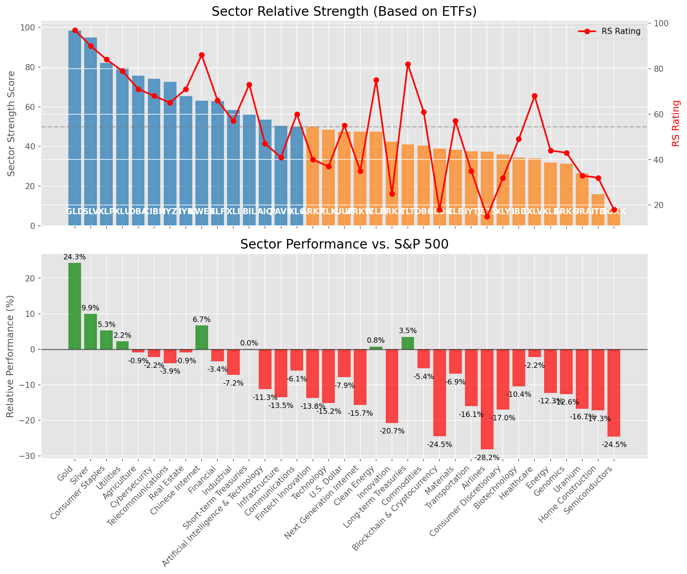

# **Daily Relative Strength Report**

**Date:** 2025-04-16

## **Market Valuation (Buffett Indicator)**

| Metric | Value |
|--------|-------|
| **Market Valuation** | **Undervalued** |
| **Current Ratio** | 8.62 |
| **Historical Mean** | 9.65 |
| **Standard Deviation** | 0.46 |
| **Z-Score (StdDev from Mean)** | -1.68 |
| **Total Market Cap** | $256.15 trillion |
| **GDP** | $29.72 trillion |

## **Market Insights**

### **Market is Undervalued**

The market is trading below historical average valuations, suggesting potential opportunity. These conditions have historically preceded periods of above-average returns. Investors should:

- Look for stocks breaking out of consolidation patterns on increasing volume
- Focus on sectors showing relative strength
- Consider increasing equity exposure, particularly in quality names
- Be mindful of overall market direction and avoid fighting the trend

History suggests patient investors are often rewarded when investing during periods of undervaluation.

### **Buffett Indicator Overview**

The Buffett Indicator (Total Market Cap / GDP) is a measure of the stock market's valuation relative to the size of the economy. It is named after Warren Buffett, who described it as "probably the best single measure of where valuations stand at any given moment."

- **Values above +2 standard deviations:** Market significantly overvalued
- **Values above +1 standard deviation:** Market overvalued
- **Values between -1 and +1 standard deviations:** Market fairly valued
- **Values below -1 standard deviation:** Market undervalued
- **Values below -2 standard deviations:** Market significantly undervalued

---

## **Sector Relative Strength**

Based on William O'Neil's Relative Strength Methodology

| ETF | Strength | RS Rating | Performance | Above Key MAs | Trend | Sector |
|-----|----------|-----------|-------------|--------------|-------|--------|
| [GLD](https://www.tradingview.com/chart/?symbol=GLD) | 98.5 | 97.0 | 24.56% | 10d ✓, 50d ✓, 200d ✓ | ↗️ | Gold |
| [SLV](https://www.tradingview.com/chart/?symbol=SLV) | 95.0 | 90.0 | 9.78% | 10d ✓, 50d ✓, 200d ✓ | ↗️ | Silver |
| [XLU](https://www.tradingview.com/chart/?symbol=XLU) | 79.6 | 79.0 | 1.97% | 10d ✓, 50d ✗, 200d ✓ | ↗️ | Utilities |
| [DBA](https://www.tradingview.com/chart/?symbol=DBA) | 75.6 | 71.0 | -0.97% | 10d ✓, 50d ✗, 200d ✓ | ↗️ | Agriculture |
| [XLP](https://www.tradingview.com/chart/?symbol=XLP) | 71.9 | 84.0 | 4.80% | 10d ✓, 50d ✗, 200d ✗ | ↗️ | Consumer Staples |
| [IYR](https://www.tradingview.com/chart/?symbol=IYR) | 65.4 | 71.0 | -1.20% | 10d ✓, 50d ✗, 200d ✗ | ↗️ | Real Estate |
| [CIBR](https://www.tradingview.com/chart/?symbol=CIBR) | 63.4 | 67.0 | -3.00% | 10d ✓, 50d ✗, 200d ✗ | ↗️ | Cybersecurity |
| [KWEB](https://www.tradingview.com/chart/?symbol=KWEB) | 63.0 | 86.0 | 6.36% | 10d ✗, 50d ✗, 200d ✗ | ↗️ | Chinese Internet |
| [XLF](https://www.tradingview.com/chart/?symbol=XLF) | 62.9 | 66.0 | -3.93% | 10d ✓, 50d ✗, 200d ✗ | ↗️ | Financial |
| [XLI](https://www.tradingview.com/chart/?symbol=XLI) | 58.4 | 57.0 | -7.72% | 10d ✓, 50d ✗, 200d ✗ | ↗️ | Industrial |
| [BIL](https://www.tradingview.com/chart/?symbol=BIL) | 56.8 | 74.0 | 0.02% | 10d ✓, 50d ✓, 200d ✗ | ↘️ | Short-term Treasuries |
| [IYZ](https://www.tradingview.com/chart/?symbol=IYZ) | 52.0 | 64.0 | -4.45% | 10d ✗, 50d ✗, 200d ✗ | ↗️ | Telecommunications |
| [PAVE](https://www.tradingview.com/chart/?symbol=PAVE) | 50.4 | 41.0 | -13.85% | 10d ✓, 50d ✗, 200d ✗ | ↗️ | Infrastructure |
| [XLC](https://www.tradingview.com/chart/?symbol=XLC) | 49.5 | 59.0 | -6.57% | 10d ✗, 50d ✗, 200d ✗ | ↗️ | Communications |
| [ARKF](https://www.tradingview.com/chart/?symbol=ARKF) | 49.4 | 39.0 | -14.54% | 10d ✓, 50d ✗, 200d ✗ | ↗️ | Fintech Innovation |
| [UUP](https://www.tradingview.com/chart/?symbol=UUP) | 48.0 | 56.0 | -8.06% | 10d ✗, 50d ✗, 200d ✗ | ↗️ | U.S. Dollar |
| [ARKW](https://www.tradingview.com/chart/?symbol=ARKW) | 47.9 | 36.0 | -15.69% | 10d ✓, 50d ✗, 200d ✗ | ↗️ | Next Generation Internet |
| [ICLN](https://www.tradingview.com/chart/?symbol=ICLN) | 47.4 | 75.0 | 0.31% | 10d ✓, 50d ✗, 200d ✗ | ↘️ | Clean Energy |
| [AIQ](https://www.tradingview.com/chart/?symbol=AIQ) | 43.0 | 46.0 | -11.95% | 10d ✗, 50d ✗, 200d ✗ | ↗️ | Artificial Intelligence & Technology |
| [DBC](https://www.tradingview.com/chart/?symbol=DBC) | 41.4 | 63.0 | -5.12% | 10d ✓, 50d ✗, 200d ✗ | ↘️ | Commodities |
| [TLT](https://www.tradingview.com/chart/?symbol=TLT) | 41.0 | 82.0 | 3.64% | 10d ✗, 50d ✗, 200d ✗ | ↘️ | Long-term Treasuries |
| [BLOK](https://www.tradingview.com/chart/?symbol=BLOK) | 39.4 | 19.0 | -24.50% | 10d ✓, 50d ✗, 200d ✗ | ↗️ | Blockchain & Cryptocurrency |
| [XLB](https://www.tradingview.com/chart/?symbol=XLB) | 38.9 | 58.0 | -7.34% | 10d ✓, 50d ✗, 200d ✗ | ↘️ | Materials |
| [XLK](https://www.tradingview.com/chart/?symbol=XLK) | 38.0 | 36.0 | -15.92% | 10d ✗, 50d ✗, 200d ✗ | ↗️ | Technology |
| [IYT](https://www.tradingview.com/chart/?symbol=IYT) | 37.0 | 34.0 | -16.70% | 10d ✗, 50d ✗, 200d ✗ | ↗️ | Transportation |
| [XLY](https://www.tradingview.com/chart/?symbol=XLY) | 36.0 | 32.0 | -17.61% | 10d ✗, 50d ✗, 200d ✗ | ↗️ | Consumer Discretionary |
| [XLV](https://www.tradingview.com/chart/?symbol=XLV) | 34.0 | 68.0 | -2.79% | 10d ✗, 50d ✗, 200d ✗ | ↘️ | Healthcare |
| [ARKK](https://www.tradingview.com/chart/?symbol=ARKK) | 32.5 | 25.0 | -21.45% | 10d ✗, 50d ✗, 200d ✗ | ↗️ | Innovation |
| [XLE](https://www.tradingview.com/chart/?symbol=XLE) | 32.4 | 45.0 | -12.55% | 10d ✓, 50d ✗, 200d ✗ | ↘️ | Energy |
| [ARKG](https://www.tradingview.com/chart/?symbol=ARKG) | 30.9 | 42.0 | -13.49% | 10d ✓, 50d ✗, 200d ✗ | ↘️ | Genomics |
| [JETS](https://www.tradingview.com/chart/?symbol=JETS) | 27.5 | 15.0 | -28.64% | 10d ✗, 50d ✗, 200d ✗ | ↗️ | Airlines |
| [URA](https://www.tradingview.com/chart/?symbol=URA) | 26.9 | 34.0 | -16.82% | 10d ✓, 50d ✗, 200d ✗ | ↘️ | Uranium |
| [IBB](https://www.tradingview.com/chart/?symbol=IBB) | 24.5 | 49.0 | -11.08% | 10d ✗, 50d ✗, 200d ✗ | ↘️ | Biotechnology |
| [ITB](https://www.tradingview.com/chart/?symbol=ITB) | 16.0 | 32.0 | -17.49% | 10d ✗, 50d ✗, 200d ✗ | ↘️ | Home Construction |
| [SOXX](https://www.tradingview.com/chart/?symbol=SOXX) | 9.0 | 18.0 | -25.63% | 10d ✗, 50d ✗, 200d ✗ | ↘️ | Semiconductors |

### **Sector ETF Performance Interpretation**

This table shows the relative strength metrics for different market sectors based on their representative ETFs:

- **ETF**: The ETF used to measure sector performance (click for chart)
- **Strength**: Overall sector strength score (0-100) combining multiple factors
- **RS Rating**: O'Neil RS rating of the sector ETF
- **Performance**: Performance of the sector ETF relative to SPY
- **Above Key MAs**: Whether the ETF is trading above its 10, 50, and 200-day moving averages
- **Trend**: Whether the sector is in an uptrend (↗️) or downtrend (↘️)

### **Current Sector Leadership**

The current market leadership is coming from the following sectors: **Gold, Silver, Utilities**.

The **Gold** sector (represented by **GLD**) is showing particularly strong relative strength with an RS rating of 97.0 and performance of 24.56% vs. the S&P 500. This sector is trading above its 10-day, 50-day, 200-day moving average(s). Investors should consider focusing on high RS stocks within these leading sectors for potential outperformance.

---

## **Buy Recommendations**

The following 77 stocks show exceptional relative strength:

| RS Rating | Buy Score | Current Price | Chart | Name | Ticker |
|-----------|-----------|---------------|-------|------|--------|
| 100 | 100 | $30.14 | [Chart](https://www.tradingview.com/chart/?symbol=AGI) | Alamos Gold Inc. Class A Common Shares | AGI |
| 100 | 100 | $122.09 | [Chart](https://www.tradingview.com/chart/?symbol=AEM) | Agnico Eagle Mines Ltd. | AEM |
| 100 | 100 | $144.76 | [Chart](https://www.tradingview.com/chart/?symbol=UGL) | ProShares Ultra Gold | UGL |
| 100 | 100 | $84.42 | [Chart](https://www.tradingview.com/chart/?symbol=WPM) | Wheaton Precious Metals Corp. Common Stock | WPM |
| 99 | 100 | $18.49 | [Chart](https://www.tradingview.com/chart/?symbol=SWI) | SolarWinds Corporation Common Stock | SWI |
| 99 | 100 | $27.44 | [Chart](https://www.tradingview.com/chart/?symbol=MP) | MP Materials Corp. | MP |
| 99 | 100 | $186.09 | [Chart](https://www.tradingview.com/chart/?symbol=RGLD) | Royal Gold Inc | RGLD |
| 99 | 100 | $15.87 | [Chart](https://www.tradingview.com/chart/?symbol=EZPW) | Ezcorp Inc | EZPW |
| 99 | 100 | $149.56 | [Chart](https://www.tradingview.com/chart/?symbol=PLMR) | Palomar Holdings, Inc. Common stock | PLMR |
| 99 | 100 | $159.72 | [Chart](https://www.tradingview.com/chart/?symbol=PM) | Philip Morris International Inc. | PM |
| 98 | 100 | $31.85 | [Chart](https://www.tradingview.com/chart/?symbol=SGOL) | abrdn Physical Gold Shares ETF | SGOL |
| 98 | 100 | $23.24 | [Chart](https://www.tradingview.com/chart/?symbol=DB) | Deutsche Bank Aktiengesellschaft | DB |
| 98 | 100 | $23.70 | [Chart](https://www.tradingview.com/chart/?symbol=OR) | Osisko Gold Royalties Ltd | OR |
| 98 | 100 | $62.97 | [Chart](https://www.tradingview.com/chart/?symbol=IAU) | iShares Gold Trust | IAU |
| 98 | 100 | $31.03 | [Chart](https://www.tradingview.com/chart/?symbol=LTH) | Life Time Group Holdings, Inc. | LTH |
| 98 | 100 | $33.30 | [Chart](https://www.tradingview.com/chart/?symbol=IAUM) | iShares Gold Trust Micro | IAUM |
| 97 | 100 | $116.33 | [Chart](https://www.tradingview.com/chart/?symbol=BJ) | BJs Wholesale Club Holdings, Inc. Common Stock | BJ |
| 97 | 100 | $307.70 | [Chart](https://www.tradingview.com/chart/?symbol=GLD) | SPDR Gold Trust, SPDR Gold Shares | GLD |
| 97 | 100 | $260.99 | [Chart](https://www.tradingview.com/chart/?symbol=TMUS) | T-Mobile US, Inc. | TMUS |
| 97 | 100 | $25.60 | [Chart](https://www.tradingview.com/chart/?symbol=PHYS) | Sprott Physical Gold Trust | PHYS |
| 97 | 100 | $27.09 | [Chart](https://www.tradingview.com/chart/?symbol=T) | AT&T Inc. | T |
| 97 | 100 | $46.66 | [Chart](https://www.tradingview.com/chart/?symbol=EXC) | Exelon Corporation | EXC |
| 97 | 100 | $23.55 | [Chart](https://www.tradingview.com/chart/?symbol=SRAD) | Sportradar Group AG Class A Ordinary Shares | SRAD |
| 96 | 100 | $243.51 | [Chart](https://www.tradingview.com/chart/?symbol=RSG) | Republic Services Inc. | RSG |
| 96 | 100 | $29.55 | [Chart](https://www.tradingview.com/chart/?symbol=CEF) | Sprott Physical Gold and Silver Trust | CEF |
| 96 | 100 | $44.71 | [Chart](https://www.tradingview.com/chart/?symbol=GH) | Guardant Health, Inc. Common Stock | GH |
| 96 | 100 | $28.23 | [Chart](https://www.tradingview.com/chart/?symbol=EUFN) | iShares MSCI Europe Financials ETF | EUFN |
| 95 | 100 | $53.41 | [Chart](https://www.tradingview.com/chart/?symbol=PPC) | Pilgrims Pride Corporation | PPC |
| 95 | 100 | $87.75 | [Chart](https://www.tradingview.com/chart/?symbol=CCEP) | Coca-Cola Europacific Partners plc Ordinary Shares | CCEP |
| 95 | 100 | $210.11 | [Chart](https://www.tradingview.com/chart/?symbol=TTWO) | Take-Two Interactive Software Inc | TTWO |
| 95 | 100 | $41.91 | [Chart](https://www.tradingview.com/chart/?symbol=BTI) | British American Tobacco p.l.c. American Depositary Shares, American Depositary Shares, each representing one Ordinary Share | BTI |
| 95 | 100 | $67.55 | [Chart](https://www.tradingview.com/chart/?symbol=VTR) | Ventas, Inc. | VTR |
| 95 | 100 | $37.95 | [Chart](https://www.tradingview.com/chart/?symbol=MRX) | Marex Group plc Ordinary Shares | MRX |
| 94 | 100 | $78.23 | [Chart](https://www.tradingview.com/chart/?symbol=SNEX) | StoneX Group Inc. Common Stock | SNEX |
| 94 | 100 | $276.54 | [Chart](https://www.tradingview.com/chart/?symbol=PGR) | Progressive Corporation | PGR |
| 94 | 100 | $514.60 | [Chart](https://www.tradingview.com/chart/?symbol=BRK.B) | BERKSHIRE HATHAWAY Class B | BRK.B |
| 94 | 100 | $332.39 | [Chart](https://www.tradingview.com/chart/?symbol=AJG) | Arthur J. Gallagher & Co. | AJG |
| 94 | 100 | $77.45 | [Chart](https://www.tradingview.com/chart/?symbol=SR) | Spire Inc. | SR |
| 94 | 100 | $119.06 | [Chart](https://www.tradingview.com/chart/?symbol=BRO) | Brown & Brown, Inc. | BRO |
| 94 | 100 | $454.77 | [Chart](https://www.tradingview.com/chart/?symbol=CASY) | Casey's General Stores Inc | CASY |
| 94 | 100 | $36.79 | [Chart](https://www.tradingview.com/chart/?symbol=CNP) | CenterPoint Energy, Inc. | CNP |
| 94 | 100 | $37.15 | [Chart](https://www.tradingview.com/chart/?symbol=EWG) | iShares MSCI Germany ETF | EWG |
| 94 | 100 | $69.12 | [Chart](https://www.tradingview.com/chart/?symbol=KR) | The Kroger Co. | KR |
| 93 | 100 | $16.31 | [Chart](https://www.tradingview.com/chart/?symbol=SPNT) | SiriusPoint Ltd. | SPNT |
| 93 | 100 | $120.96 | [Chart](https://www.tradingview.com/chart/?symbol=DUK) | Duke Energy Corporation | DUK |
| 93 | 100 | $218.41 | [Chart](https://www.tradingview.com/chart/?symbol=CBOE) | Cboe Global Markets, Inc. | CBOE |
| 93 | 100 | $106.55 | [Chart](https://www.tradingview.com/chart/?symbol=AEP) | American Electric Power Company, Inc. | AEP |
| 93 | 100 | $123.12 | [Chart](https://www.tradingview.com/chart/?symbol=BECN) | Beacon Roofing Supply, Inc. | BECN |
| 93 | 100 | $261.98 | [Chart](https://www.tradingview.com/chart/?symbol=CME) | CME Group Inc. | CME |
| 92 | 100 | $106.25 | [Chart](https://www.tradingview.com/chart/?symbol=ATGE) | Adtalem Global Education Inc. Common Shares | ATGE |
| 92 | 100 | $196.41 | [Chart](https://www.tradingview.com/chart/?symbol=WCN) | Waste Connections, Inc. | WCN |
| 92 | 100 | $93.64 | [Chart](https://www.tradingview.com/chart/?symbol=PNW) | Pinnacle West Capital Corporation | PNW |
| 92 | 100 | $57.42 | [Chart](https://www.tradingview.com/chart/?symbol=MO) | Altria Group, Inc. | MO |
| 92 | 100 | $18.64 | [Chart](https://www.tradingview.com/chart/?symbol=GRND) | Grindr Inc. | GRND |
| 91 | 100 | $67.83 | [Chart](https://www.tradingview.com/chart/?symbol=EVRG) | Evergy, Inc. | EVRG |
| 91 | 100 | $102.84 | [Chart](https://www.tradingview.com/chart/?symbol=EHC) | Encompass Health Corporation Common Stock | EHC |
| 91 | 100 | $132.16 | [Chart](https://www.tradingview.com/chart/?symbol=DTE) | DTE Energy Company | DTE |
| 91 | 100 | $51.06 | [Chart](https://www.tradingview.com/chart/?symbol=RELX) | RELX PLC | RELX |
| 91 | 100 | $77.94 | [Chart](https://www.tradingview.com/chart/?symbol=ADC) | Agree Realty Corporation | ADC |
| 91 | 100 | $35.34 | [Chart](https://www.tradingview.com/chart/?symbol=PPL) | PPL Corporation | PPL |
| 91 | 100 | $155.90 | [Chart](https://www.tradingview.com/chart/?symbol=ATO) | Atmos Energy Corporation | ATO |
| 90 | 100 | $77.01 | [Chart](https://www.tradingview.com/chart/?symbol=OGS) | ONE GAS, INC. | OGS |
| 90 | 100 | $44.79 | [Chart](https://www.tradingview.com/chart/?symbol=OGE) | OGE Energy Corp. | OGE |
| 90 | 100 | $30.09 | [Chart](https://www.tradingview.com/chart/?symbol=AHR) | American Healthcare REIT, Inc. | AHR |
| 90 | 100 | $176.84 | [Chart](https://www.tradingview.com/chart/?symbol=LOPE) | Grand Canyon Education, Inc | LOPE |
| 89 | 100 | $47.07 | [Chart](https://www.tradingview.com/chart/?symbol=MRCY) | Mercury Systems Inc. | MRCY |
| 89 | 100 | $17.64 | [Chart](https://www.tradingview.com/chart/?symbol=KT) | KT Corp. | KT |
| 89 | 99 | $24.73 | [Chart](https://www.tradingview.com/chart/?symbol=FMS) | Fresenius Medical Care AG | FMS |
| 89 | 98 | $80.06 | [Chart](https://www.tradingview.com/chart/?symbol=FAST) | Fastenal Co | FAST |
| 88 | 98 | $49.69 | [Chart](https://www.tradingview.com/chart/?symbol=NJR) | New Jersey Resources Corp | NJR |
| 87 | 98 | $253.44 | [Chart](https://www.tradingview.com/chart/?symbol=TRV) | The Travelers Companies, Inc. | TRV |
| 85 | 96 | $117.23 | [Chart](https://www.tradingview.com/chart/?symbol=CWST) | Casella Waste Systems Inc | CWST |
| 85 | 95 | $126.22 | [Chart](https://www.tradingview.com/chart/?symbol=TJX) | TJX Companies, Inc. (The) | TJX |
| 84 | 95 | $48.69 | [Chart](https://www.tradingview.com/chart/?symbol=TRP) | TC Energy Corporation | TRP |
| 83 | 93 | $54.81 | [Chart](https://www.tradingview.com/chart/?symbol=IGF) | iShares Global Infrastructure ETF | IGF |
| 83 | 93 | $107.54 | [Chart](https://www.tradingview.com/chart/?symbol=AFL) | Aflac Inc. | AFL |
| 81 | 93 | $35.53 | [Chart](https://www.tradingview.com/chart/?symbol=DRS) | Leonardo DRS, Inc. Common Stock | DRS |

---

## **Sell Recommendations**

The following 157 stocks show deteriorating relative strength:

| RS Rating | Sell Score | Current Price | Chart | Name | Ticker |
|-----------|------------|---------------|-------|------|--------|
| 1 | 100 | $10.64 | [Chart](https://www.tradingview.com/chart/?symbol=XNCR) | Xencor, Inc. | XNCR |
| 2 | 100 | $14.93 | [Chart](https://www.tradingview.com/chart/?symbol=SSTK) | SHUTTERSTOCK, INC. | SSTK |
| 2 | 100 | $42.30 | [Chart](https://www.tradingview.com/chart/?symbol=TECL) | Direxion Daily Technology Bull 3x Shares | TECL |
| 2 | 100 | $16.94 | [Chart](https://www.tradingview.com/chart/?symbol=TNDM) | Tandem Diabetes Care, Inc. | TNDM |
| 2 | 100 | $19.32 | [Chart](https://www.tradingview.com/chart/?symbol=DJT) | Trump Media & Technology Group Corp. Common Stock | DJT |
| 3 | 100 | $10.40 | [Chart](https://www.tradingview.com/chart/?symbol=BCYC) | Bicycle Therapeutics plc American Depositary Shares | BCYC |
| 4 | 100 | $17.35 | [Chart](https://www.tradingview.com/chart/?symbol=DAVA) | Endava plc American Depositary Shares (each representing one Class A Ordinary Share) | DAVA |
| 4 | 100 | $57.87 | [Chart](https://www.tradingview.com/chart/?symbol=ARCB) | ArcBest Corporation | ARCB |
| 5 | 100 | $24.76 | [Chart](https://www.tradingview.com/chart/?symbol=W) | Wayfair Inc. | W |
| 5 | 100 | $22.27 | [Chart](https://www.tradingview.com/chart/?symbol=FIVN) | FIVE9, INC. | FIVN |
| 5 | 100 | $54.30 | [Chart](https://www.tradingview.com/chart/?symbol=SWKS) | Skyworks Solutions Inc | SWKS |
| 5 | 100 | $25.26 | [Chart](https://www.tradingview.com/chart/?symbol=FORM) | FormFactor Inc. | FORM |
| 6 | 100 | $10.17 | [Chart](https://www.tradingview.com/chart/?symbol=ARCT) | Arcturus Therapeutics Holdings Inc. Common Stock | ARCT |
| 6 | 100 | $26.00 | [Chart](https://www.tradingview.com/chart/?symbol=XPEL) | XPEL, Inc. Common Stock | XPEL |
| 7 | 100 | $20.06 | [Chart](https://www.tradingview.com/chart/?symbol=HI) | Hillenbrand, Inc. | HI |
| 7 | 100 | $53.55 | [Chart](https://www.tradingview.com/chart/?symbol=LGIH) | LGI Homes, Inc. | LGIH |
| 7 | 100 | $19.11 | [Chart](https://www.tradingview.com/chart/?symbol=SPT) | Sprout Social, Inc Class A Common Stock | SPT |
| 7 | 100 | $19.68 | [Chart](https://www.tradingview.com/chart/?symbol=CECO) | Ceco Environmental Corp | CECO |
| 7 | 100 | $43.53 | [Chart](https://www.tradingview.com/chart/?symbol=ACLS) | Axcelis Technologies Inc | ACLS |
| 7 | 100 | $11.87 | [Chart](https://www.tradingview.com/chart/?symbol=GCT) | GigaCloud Technology Inc Class A Ordinary Shares | GCT |
| 9 | 100 | $17.72 | [Chart](https://www.tradingview.com/chart/?symbol=BZH) | Beazer Homes USA, Inc. New | BZH |
| 9 | 100 | $18.12 | [Chart](https://www.tradingview.com/chart/?symbol=APLS) | Apellis Pharmaceuticals, Inc. Common Stock | APLS |
| 11 | 100 | $18.82 | [Chart](https://www.tradingview.com/chart/?symbol=FOXF) | Fox Factory Holding Corp. Common Stock | FOXF |
| 11 | 100 | $18.95 | [Chart](https://www.tradingview.com/chart/?symbol=ST) | Sensata Technologies Holding plc | ST |
| 12 | 100 | $27.24 | [Chart](https://www.tradingview.com/chart/?symbol=SRDX) | Surmodics, Inc. Common Stock | SRDX |
| 16 | 100 | $34.78 | [Chart](https://www.tradingview.com/chart/?symbol=LIVN) | LivaNova PLC Ordinary Shares | LIVN |
| 12 | 99 | $56.88 | [Chart](https://www.tradingview.com/chart/?symbol=ATKR) | Atkore Inc. | ATKR |
| 12 | 99 | $109.91 | [Chart](https://www.tradingview.com/chart/?symbol=GNRC) | GENERAC HOLDINGS INC | GNRC |
| 12 | 99 | $11.57 | [Chart](https://www.tradingview.com/chart/?symbol=AEYE) | AudioEye, Inc. Common Stock | AEYE |
| 6 | 98 | $20.72 | [Chart](https://www.tradingview.com/chart/?symbol=VERA) | Vera Therapeutics, Inc. Class A Common Stock | VERA |
| 10 | 98 | $58.95 | [Chart](https://www.tradingview.com/chart/?symbol=ASGN) | ASGN Incorporated | ASGN |
| 13 | 98 | $12.55 | [Chart](https://www.tradingview.com/chart/?symbol=XRAY) | DENTSPLY SIRONA Inc. | XRAY |
| 17 | 98 | $44.11 | [Chart](https://www.tradingview.com/chart/?symbol=EDU) | New Oriental Education and Technology Group, Inc. American Depositary Shares (each representing ten (10) Common Shares) | EDU |
| 8 | 97 | $28.93 | [Chart](https://www.tradingview.com/chart/?symbol=KLIC) | Kulicke & Soffa Industries Inc | KLIC |
| 14 | 97 | $52.16 | [Chart](https://www.tradingview.com/chart/?symbol=EL) | The Estee Lauder Companies Inc. Class A | EL |
| 5 | 96 | $19.54 | [Chart](https://www.tradingview.com/chart/?symbol=SG) | Sweetgreen, Inc. | SG |
| 9 | 96 | $20.08 | [Chart](https://www.tradingview.com/chart/?symbol=TDC) | TERADATA CORPORATION | TDC |
| 12 | 96 | $20.11 | [Chart](https://www.tradingview.com/chart/?symbol=UPBD) | Upbound Group, Inc. Common Stock | UPBD |
| 12 | 96 | $50.25 | [Chart](https://www.tradingview.com/chart/?symbol=IPGP) | IPG Photonics Corporation | IPGP |
| 13 | 96 | $18.22 | [Chart](https://www.tradingview.com/chart/?symbol=AMN) | AMN Healthcare Services | AMN |
| 13 | 96 | $47.79 | [Chart](https://www.tradingview.com/chart/?symbol=RHI) | Robert Half Inc. | RHI |
| 15 | 96 | $11.75 | [Chart](https://www.tradingview.com/chart/?symbol=ASPN) | Aspen Aerogels, Inc. | ASPN |
| 25 | 96 | $12.01 | [Chart](https://www.tradingview.com/chart/?symbol=MED) | Medifast, Inc. | MED |
| 10 | 95 | $312.49 | [Chart](https://www.tradingview.com/chart/?symbol=SAIA) | Saia, Inc. | SAIA |
| 13 | 95 | $10.39 | [Chart](https://www.tradingview.com/chart/?symbol=TXG) | 10x Genomics, Inc. Class A Common Stock | TXG |
| 23 | 95 | $32.29 | [Chart](https://www.tradingview.com/chart/?symbol=IAC) | IAC Inc. Common Stock | IAC |
| 24 | 95 | $13.79 | [Chart](https://www.tradingview.com/chart/?symbol=FXN) | First Trust Energy AlphaDEX Fund | FXN |
| 9 | 94 | $17.13 | [Chart](https://www.tradingview.com/chart/?symbol=OII) | Oceaneering International Inc. | OII |
| 15 | 94 | $14.34 | [Chart](https://www.tradingview.com/chart/?symbol=PBW) | Invesco WilderHill Clean Energy ETF | PBW |
| 10 | 93 | $49.93 | [Chart](https://www.tradingview.com/chart/?symbol=TECH) | Bio-Techne Corp. | TECH |
| 12 | 93 | $37.02 | [Chart](https://www.tradingview.com/chart/?symbol=FMC) | FMC Corporation | FMC |
| 15 | 93 | $29.76 | [Chart](https://www.tradingview.com/chart/?symbol=TTEK) | Tetra Tech Inc | TTEK |
| 15 | 93 | $10.31 | [Chart](https://www.tradingview.com/chart/?symbol=VREX) | Varex Imaging Corporation Common Stock | VREX |
| 17 | 93 | $24.38 | [Chart](https://www.tradingview.com/chart/?symbol=CZR) | Caesars Entertainment, Inc. Common Stock | CZR |
| 18 | 93 | $86.08 | [Chart](https://www.tradingview.com/chart/?symbol=AMD) | Advanced Micro Devices | AMD |
| 16 | 92 | $45.99 | [Chart](https://www.tradingview.com/chart/?symbol=ERX) | Direxion Daily Energy Bull 2X Shares | ERX |
| 12 | 91 | $56.66 | [Chart](https://www.tradingview.com/chart/?symbol=SWK) | Stanley Black & Decker, Inc. | SWK |
| 13 | 91 | $12.17 | [Chart](https://www.tradingview.com/chart/?symbol=MARA) | MARA Holdings, Inc. Common Stock | MARA |
| 14 | 91 | $49.16 | [Chart](https://www.tradingview.com/chart/?symbol=NVT) | nVent Electric plc Ordinary Shares | NVT |
| 15 | 91 | $15.63 | [Chart](https://www.tradingview.com/chart/?symbol=IART) | Integra LifeSciences Holdings | IART |
| 17 | 91 | $33.60 | [Chart](https://www.tradingview.com/chart/?symbol=TEX) | Terex Corporation | TEX |
| 19 | 91 | $31.09 | [Chart](https://www.tradingview.com/chart/?symbol=URNM) | Sprott Uranium Miners ETF | URNM |
| 20 | 91 | $25.91 | [Chart](https://www.tradingview.com/chart/?symbol=MBUU) | Malibu Boats, Inc. Class A | MBUU |
| 26 | 91 | $42.17 | [Chart](https://www.tradingview.com/chart/?symbol=ETSY) | Etsy, Inc. | ETSY |
| 10 | 90 | $24.63 | [Chart](https://www.tradingview.com/chart/?symbol=AA) | Alcoa Corporation | AA |
| 13 | 90 | $10.40 | [Chart](https://www.tradingview.com/chart/?symbol=NEOG) | Neogen Corp | NEOG |
| 14 | 90 | $47.62 | [Chart](https://www.tradingview.com/chart/?symbol=CNMD) | CONMED Corporation | CNMD |
| 15 | 90 | $26.75 | [Chart](https://www.tradingview.com/chart/?symbol=YETI) | YETI Holdings, Inc. Common Stock | YETI |
| 16 | 90 | $10.24 | [Chart](https://www.tradingview.com/chart/?symbol=EXPI) | eXp World Holdings, Inc. Common Stock | EXPI |
| 18 | 90 | $19.24 | [Chart](https://www.tradingview.com/chart/?symbol=FOR) | Forestar Group Inc. | FOR |
| 19 | 90 | $55.02 | [Chart](https://www.tradingview.com/chart/?symbol=QRVO) | Qorvo, Inc. | QRVO |
| 19 | 90 | $25.67 | [Chart](https://www.tradingview.com/chart/?symbol=SEE) | Sealed Air Corp. | SEE |
| 19 | 90 | $38.67 | [Chart](https://www.tradingview.com/chart/?symbol=FEPI) | REX FANG & Innovation Equity Premium Income ETF | FEPI |
| 25 | 90 | $10.03 | [Chart](https://www.tradingview.com/chart/?symbol=MTAL) | MAC Copper Limited | MTAL |
| 11 | 89 | $10.01 | [Chart](https://www.tradingview.com/chart/?symbol=VYX) | NCR Voyix Corporation | VYX |
| 20 | 89 | $141.84 | [Chart](https://www.tradingview.com/chart/?symbol=PTC) | PTC, INC | PTC |
| 20 | 89 | $50.50 | [Chart](https://www.tradingview.com/chart/?symbol=IIPR) | Innovative Industrial Properties, Inc. Common stock | IIPR |
| 23 | 89 | $11.59 | [Chart](https://www.tradingview.com/chart/?symbol=CVE) | Cenovus Energy Inc. | CVE |
| 22 | 88 | $63.08 | [Chart](https://www.tradingview.com/chart/?symbol=AIN) | Albany International Corp Class A | AIN |
| 24 | 88 | $51.16 | [Chart](https://www.tradingview.com/chart/?symbol=ENPH) | Enphase Energy, Inc. | ENPH |
| 14 | 87 | $31.72 | [Chart](https://www.tradingview.com/chart/?symbol=LVS) | Las Vegas Sands Corp. | LVS |
| 15 | 87 | $10.77 | [Chart](https://www.tradingview.com/chart/?symbol=SONO) | Sonos, Inc. Common Stock | SONO |
| 16 | 87 | $14.45 | [Chart](https://www.tradingview.com/chart/?symbol=DXC) | DXC Technology Company | DXC |
| 18 | 87 | $91.85 | [Chart](https://www.tradingview.com/chart/?symbol=BCC) | Boise Cascade Company | BCC |
| 24 | 87 | $18.34 | [Chart](https://www.tradingview.com/chart/?symbol=BITO) | ProShares Bitcoin ETF | BITO |
| 19 | 86 | $52.32 | [Chart](https://www.tradingview.com/chart/?symbol=AIR) | AAR Corp. | AIR |
| 20 | 86 | $27.20 | [Chart](https://www.tradingview.com/chart/?symbol=WERN) | Werner Enterprises Inc | WERN |
| 20 | 86 | $108.71 | [Chart](https://www.tradingview.com/chart/?symbol=XOP) | SPDR S&P Oil & Gas Exploration & Production ETF | XOP |
| 23 | 86 | $83.92 | [Chart](https://www.tradingview.com/chart/?symbol=GPN) | Global Payments, Inc. | GPN |
| 16 | 85 | $49.66 | [Chart](https://www.tradingview.com/chart/?symbol=SMG) | The Scotts Miracle-Gro Company | SMG |
| 23 | 85 | $11.60 | [Chart](https://www.tradingview.com/chart/?symbol=OEC) | Orion S.A. | OEC |
| 23 | 85 | $100.18 | [Chart](https://www.tradingview.com/chart/?symbol=CHDN) | Churchill Downs Inc | CHDN |
| 23 | 85 | $51.76 | [Chart](https://www.tradingview.com/chart/?symbol=HXL) | Hexcel Corporation | HXL |
| 24 | 85 | $39.31 | [Chart](https://www.tradingview.com/chart/?symbol=SIMO) | Silicon Motion Technology Corporation | SIMO |
| 27 | 85 | $217.18 | [Chart](https://www.tradingview.com/chart/?symbol=WING) | Wingstop Inc | WING |
| 32 | 85 | $76.96 | [Chart](https://www.tradingview.com/chart/?symbol=LEA) | Lear Corporation | LEA |
| 19 | 84 | $10.15 | [Chart](https://www.tradingview.com/chart/?symbol=HLIT) | Harmonic Inc | HLIT |
| 25 | 84 | $31.83 | [Chart](https://www.tradingview.com/chart/?symbol=MGA) | Magna International | MGA |
| 21 | 83 | $42.03 | [Chart](https://www.tradingview.com/chart/?symbol=PRKS) | United Parks & Resorts Inc. | PRKS |
| 22 | 83 | $55.60 | [Chart](https://www.tradingview.com/chart/?symbol=MTX) | Minerals Technologies Inc | MTX |
| 23 | 83 | $103.38 | [Chart](https://www.tradingview.com/chart/?symbol=MHO) | M/I Homes, Inc. | MHO |
| 30 | 83 | $27.54 | [Chart](https://www.tradingview.com/chart/?symbol=TAN) | Invesco Solar ETF | TAN |
| 23 | 82 | $113.46 | [Chart](https://www.tradingview.com/chart/?symbol=MYRG) | MYR Group, Inc. | MYRG |
| 25 | 82 | $10.04 | [Chart](https://www.tradingview.com/chart/?symbol=HTLD) | Heartland Express Inc | HTLD |
| 26 | 82 | $60.67 | [Chart](https://www.tradingview.com/chart/?symbol=TKR) | The Timken Company | TKR |
| 28 | 82 | $45.11 | [Chart](https://www.tradingview.com/chart/?symbol=ATI) | ATI Inc. | ATI |
| 29 | 82 | $131.91 | [Chart](https://www.tradingview.com/chart/?symbol=NSIT) | Insight Enterprises Inc | NSIT |
| 30 | 82 | $25.84 | [Chart](https://www.tradingview.com/chart/?symbol=BWA) | BorgWarner Inc. | BWA |
| 25 | 81 | $86.71 | [Chart](https://www.tradingview.com/chart/?symbol=PCAR) | Paccar Inc | PCAR |
| 31 | 81 | $10.71 | [Chart](https://www.tradingview.com/chart/?symbol=DBRG) | DigitalBridge Group, Inc. | DBRG |
| 29 | 80 | $10.11 | [Chart](https://www.tradingview.com/chart/?symbol=CELC) | Celcuity Inc. Common Stock | CELC |
| 30 | 80 | $31.82 | [Chart](https://www.tradingview.com/chart/?symbol=TENB) | Tenable Holdings, Inc. | TENB |
| 26 | 79 | $10.26 | [Chart](https://www.tradingview.com/chart/?symbol=PACS) | PACS Group, Inc. | PACS |
| 32 | 79 | $11.02 | [Chart](https://www.tradingview.com/chart/?symbol=NAVI) | Navient Corporation | NAVI |
| 24 | 78 | $16.57 | [Chart](https://www.tradingview.com/chart/?symbol=CODI) | Compass Diversified | CODI |
| 27 | 78 | $71.00 | [Chart](https://www.tradingview.com/chart/?symbol=IR) | Ingersoll Rand Inc. Common Stock | IR |
| 33 | 78 | $276.53 | [Chart](https://www.tradingview.com/chart/?symbol=BLD) | TopBuild Corp. Common Stock | BLD |
| 34 | 78 | $10.16 | [Chart](https://www.tradingview.com/chart/?symbol=MAX) | MediaAlpha, Inc. | MAX |
| 37 | 78 | $77.77 | [Chart](https://www.tradingview.com/chart/?symbol=TNET) | TRINET GROUP, INC. | TNET |
| 24 | 77 | $335.44 | [Chart](https://www.tradingview.com/chart/?symbol=HUBB) | Hubbell Incorporated | HUBB |
| 27 | 77 | $108.80 | [Chart](https://www.tradingview.com/chart/?symbol=SITE) | SiteOne Landscape Supply, Inc. | SITE |
| 28 | 77 | $31.79 | [Chart](https://www.tradingview.com/chart/?symbol=NGVT) | Ingevity Corporation | NGVT |
| 33 | 77 | $64.81 | [Chart](https://www.tradingview.com/chart/?symbol=TXT) | Textron, Inc. | TXT |
| 34 | 77 | $132.73 | [Chart](https://www.tradingview.com/chart/?symbol=QCOM) | Qualcomm Inc | QCOM |
| 36 | 77 | $25.09 | [Chart](https://www.tradingview.com/chart/?symbol=PINS) | Pinterest, Inc. Class A Common Stock | PINS |
| 37 | 77 | $49.95 | [Chart](https://www.tradingview.com/chart/?symbol=KBR) | KBR, Inc. | KBR |
| 24 | 76 | $265.72 | [Chart](https://www.tradingview.com/chart/?symbol=ETN) | Eaton Corporation, plc Ordinary Shares | ETN |
| 25 | 76 | $17.05 | [Chart](https://www.tradingview.com/chart/?symbol=ELVN) | Enliven Therapeutics, Inc. Common Stock | ELVN |
| 27 | 76 | $28.86 | [Chart](https://www.tradingview.com/chart/?symbol=TPH) | Tri Pointe Homes, Inc. | TPH |
| 38 | 76 | $13.81 | [Chart](https://www.tradingview.com/chart/?symbol=MANU) | MANCHESTER UNITED PLC | MANU |
| 25 | 75 | $36.56 | [Chart](https://www.tradingview.com/chart/?symbol=MLTX) | MoonLake Immunotherapeutics Class A Ordinary Shares | MLTX |
| 27 | 75 | $146.40 | [Chart](https://www.tradingview.com/chart/?symbol=ODFL) | Old Dominion Freight Line | ODFL |
| 30 | 75 | $27.14 | [Chart](https://www.tradingview.com/chart/?symbol=AGIO) | Agios Pharmaceuticals, Inc. | AGIO |
| 31 | 75 | $79.64 | [Chart](https://www.tradingview.com/chart/?symbol=AGCO) | AGCO Corporation | AGCO |
| 31 | 75 | $29.39 | [Chart](https://www.tradingview.com/chart/?symbol=DAR) | DARLING INGREDIENTS INC. | DAR |
| 34 | 75 | $124.16 | [Chart](https://www.tradingview.com/chart/?symbol=MPC) | MARATHON PETROLEUM CORPORATION | MPC |
| 38 | 75 | $23.60 | [Chart](https://www.tradingview.com/chart/?symbol=AMRK) | A-Mark Precious Metals, Inc. | AMRK |
| 29 | 74 | $10.74 | [Chart](https://www.tradingview.com/chart/?symbol=ABR) | Arbor Realty Trust, Inc. | ABR |
| 32 | 74 | $50.51 | [Chart](https://www.tradingview.com/chart/?symbol=APTV) | Aptiv PLC | APTV |
| 33 | 74 | $88.58 | [Chart](https://www.tradingview.com/chart/?symbol=XHB) | SPDR S&P Homebuilders ETF | XHB |
| 37 | 73 | $11.29 | [Chart](https://www.tradingview.com/chart/?symbol=RIVN) | Rivian Automotive, Inc. Class A Common Stock | RIVN |
| 32 | 72 | $181.23 | [Chart](https://www.tradingview.com/chart/?symbol=RGA) | Reinsurance Group of America, Incorporated | RGA |
| 34 | 72 | $22.62 | [Chart](https://www.tradingview.com/chart/?symbol=URA) | Global X Uranium ETF | URA |
| 34 | 72 | $22.02 | [Chart](https://www.tradingview.com/chart/?symbol=PFE) | Pfizer Inc. | PFE |
| 35 | 72 | $40.97 | [Chart](https://www.tradingview.com/chart/?symbol=CCJ) | Cameco Corporation | CCJ |
| 34 | 71 | $10.34 | [Chart](https://www.tradingview.com/chart/?symbol=CMRE) | Costamare Inc. | CMRE |
| 32 | 70 | $56.12 | [Chart](https://www.tradingview.com/chart/?symbol=VOYA) | VOYA FINANCIAL, INC. | VOYA |
| 33 | 70 | $10.78 | [Chart](https://www.tradingview.com/chart/?symbol=LYFT) | Lyft, Inc. Class A Common Stock | LYFT |
| 33 | 70 | $50.25 | [Chart](https://www.tradingview.com/chart/?symbol=ALRM) | Alarm.com Holdings, Inc. | ALRM |
| 38 | 69 | $24.60 | [Chart](https://www.tradingview.com/chart/?symbol=CLW) | Clearwater Paper Corporation | CLW |
| 33 | 68 | $67.75 | [Chart](https://www.tradingview.com/chart/?symbol=USO) | United States Oil Fund, LP | USO |
| 39 | 68 | $28.23 | [Chart](https://www.tradingview.com/chart/?symbol=MGM) | MGM RESORTS INTERNATIONAL | MGM |
| 33 | 67 | $24.72 | [Chart](https://www.tradingview.com/chart/?symbol=RAMP) | LiveRamp Holdings, Inc. Common Stock | RAMP |
| 37 | 67 | $56.30 | [Chart](https://www.tradingview.com/chart/?symbol=BOIL) | ProShares Ultra Bloomberg Natural Gas | BOIL |
| 37 | 66 | $199.82 | [Chart](https://www.tradingview.com/chart/?symbol=BDX) | Becton, Dickinson and Co. | BDX |
| 38 | 66 | $70.99 | [Chart](https://www.tradingview.com/chart/?symbol=IFF) | International Flavors & Fragrances Inc. | IFF |
| 38 | 65 | $47.89 | [Chart](https://www.tradingview.com/chart/?symbol=CMG) | Chipotle Mexican Grill, Inc. | CMG |

## **Methodology**

This report uses William O'Neil's relative strength methodology from Investors Business Daily:

* **RS Rating**: Percentile rank of stock's performance vs. S&P 500 over the past 63 trading days (1-99 scale)
* **Buy Criteria**: RS Rating >= 80, price above 50-day MA, strong uptrend, increasing volume
* **Sell Criteria**: RS Rating < 40, price below 50-day MA, downtrend, decreasing volume

### **O'Neil's Key Principles**

1. **Focus on relative performance** - stocks outperforming the market
2. **Price trend confirmation** - stock must be in an uptrend
3. **Volume confirmation** - strong volume supports price moves
4. **Moving average validation** - price above key moving averages
5. **Market leaders only** - concentrate on top-performing stocks

*Report generated automatically after market close*