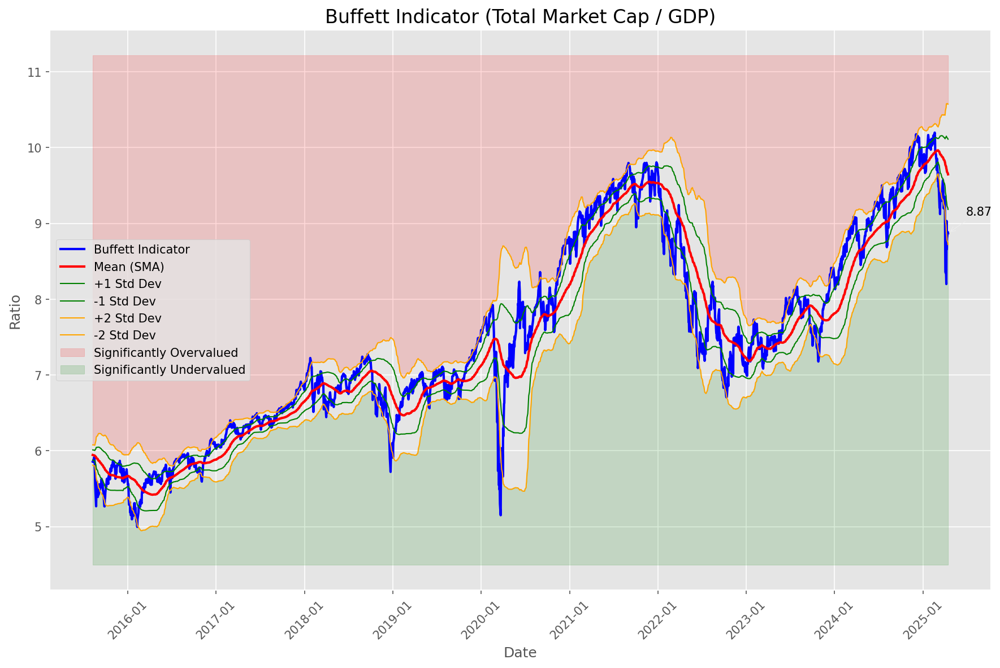

# **Daily Relative Strength Report**

**Date:** 2025-04-16

## **Market Valuation (Buffett Indicator)**

| Metric | Value |
|--------|-------|
| **Market Valuation** | **Undervalued** |
| **Current Ratio** | 8.67 |
| **Historical Mean** | 9.65 |
| **Standard Deviation** | 0.46 |
| **Z-Score (StdDev from Mean)** | -1.68 |
| **Total Market Cap** | $257.62 trillion |
| **GDP** | $29.72 trillion |

## **Market Insights**

### **Market is Undervalued**

The market is trading below historical average valuations, suggesting potential opportunity. These conditions have historically preceded periods of above-average returns. Investors should:

- Look for stocks breaking out of consolidation patterns on increasing volume
- Focus on sectors showing relative strength
- Consider increasing equity exposure, particularly in quality names
- Be mindful of overall market direction and avoid fighting the trend

History suggests patient investors are often rewarded when investing during periods of undervaluation.

### **Buffett Indicator Overview**

The Buffett Indicator (Total Market Cap / GDP) is a measure of the stock market's valuation relative to the size of the economy. It is named after Warren Buffett, who described it as "probably the best single measure of where valuations stand at any given moment."

- **Values above +2 standard deviations:** Market significantly overvalued
- **Values above +1 standard deviation:** Market overvalued
- **Values between -1 and +1 standard deviations:** Market fairly valued
- **Values below -1 standard deviation:** Market undervalued
- **Values below -2 standard deviations:** Market significantly undervalued

---

## **Sector Relative Strength**

Based on William O'Neil's Relative Strength Methodology

| ETF | Strength | RS Rating | Performance | Above Key MAs | Trend | Sector |
|-----|----------|-----------|-------------|--------------|-------|--------|
| [GLD](https://www.tradingview.com/chart/?symbol=GLD) | 98.5 | 97.0 | 24.30% | 10d ✓, 50d ✓, 200d ✓ | ↗️ | Gold |
| [SLV](https://www.tradingview.com/chart/?symbol=SLV) | 95.0 | 90.0 | 9.95% | 10d ✓, 50d ✓, 200d ✓ | ↗️ | Silver |
| [XLP](https://www.tradingview.com/chart/?symbol=XLP) | 82.1 | 84.0 | 5.30% | 10d ✓, 50d ✗, 200d ✓ | ↗️ | Consumer Staples |
| [XLU](https://www.tradingview.com/chart/?symbol=XLU) | 79.6 | 79.0 | 2.21% | 10d ✓, 50d ✗, 200d ✓ | ↗️ | Utilities |
| [DBA](https://www.tradingview.com/chart/?symbol=DBA) | 75.6 | 71.0 | -0.90% | 10d ✓, 50d ✗, 200d ✓ | ↗️ | Agriculture |
| [CIBR](https://www.tradingview.com/chart/?symbol=CIBR) | 74.1 | 68.0 | -2.20% | 10d ✓, 50d ✗, 200d ✓ | ↗️ | Cybersecurity |
| [IYZ](https://www.tradingview.com/chart/?symbol=IYZ) | 72.6 | 65.0 | -3.93% | 10d ✓, 50d ✗, 200d ✓ | ↗️ | Telecommunications |
| [IYR](https://www.tradingview.com/chart/?symbol=IYR) | 65.4 | 71.0 | -0.94% | 10d ✓, 50d ✗, 200d ✗ | ↗️ | Real Estate |
| [KWEB](https://www.tradingview.com/chart/?symbol=KWEB) | 63.0 | 86.0 | 6.66% | 10d ✗, 50d ✗, 200d ✗ | ↗️ | Chinese Internet |
| [XLF](https://www.tradingview.com/chart/?symbol=XLF) | 62.9 | 66.0 | -3.38% | 10d ✓, 50d ✗, 200d ✗ | ↗️ | Financial |
| [XLI](https://www.tradingview.com/chart/?symbol=XLI) | 58.4 | 57.0 | -7.24% | 10d ✓, 50d ✗, 200d ✗ | ↗️ | Industrial |
| [BIL](https://www.tradingview.com/chart/?symbol=BIL) | 56.3 | 73.0 | 0.01% | 10d ✓, 50d ✓, 200d ✗ | ↘️ | Short-term Treasuries |
| [AIQ](https://www.tradingview.com/chart/?symbol=AIQ) | 53.4 | 47.0 | -11.26% | 10d ✓, 50d ✗, 200d ✗ | ↗️ | Artificial Intelligence & Technology |
| [PAVE](https://www.tradingview.com/chart/?symbol=PAVE) | 50.4 | 41.0 | -13.53% | 10d ✓, 50d ✗, 200d ✗ | ↗️ | Infrastructure |
| [XLC](https://www.tradingview.com/chart/?symbol=XLC) | 50.0 | 60.0 | -6.06% | 10d ✗, 50d ✗, 200d ✗ | ↗️ | Communications |
| [ARKF](https://www.tradingview.com/chart/?symbol=ARKF) | 49.9 | 40.0 | -13.76% | 10d ✓, 50d ✗, 200d ✗ | ↗️ | Fintech Innovation |
| [XLK](https://www.tradingview.com/chart/?symbol=XLK) | 48.4 | 37.0 | -15.16% | 10d ✓, 50d ✗, 200d ✗ | ↗️ | Technology |
| [UUP](https://www.tradingview.com/chart/?symbol=UUP) | 47.5 | 55.0 | -7.86% | 10d ✗, 50d ✗, 200d ✗ | ↗️ | U.S. Dollar |
| [ARKW](https://www.tradingview.com/chart/?symbol=ARKW) | 47.4 | 35.0 | -15.69% | 10d ✓, 50d ✗, 200d ✗ | ↗️ | Next Generation Internet |
| [ICLN](https://www.tradingview.com/chart/?symbol=ICLN) | 47.4 | 75.0 | 0.76% | 10d ✓, 50d ✗, 200d ✗ | ↘️ | Clean Energy |
| [ARKK](https://www.tradingview.com/chart/?symbol=ARKK) | 42.4 | 25.0 | -20.74% | 10d ✓, 50d ✗, 200d ✗ | ↗️ | Innovation |
| [TLT](https://www.tradingview.com/chart/?symbol=TLT) | 41.0 | 82.0 | 3.48% | 10d ✗, 50d ✗, 200d ✗ | ↘️ | Long-term Treasuries |
| [DBC](https://www.tradingview.com/chart/?symbol=DBC) | 40.4 | 61.0 | -5.36% | 10d ✓, 50d ✗, 200d ✗ | ↘️ | Commodities |
| [BLOK](https://www.tradingview.com/chart/?symbol=BLOK) | 38.9 | 18.0 | -24.50% | 10d ✓, 50d ✗, 200d ✗ | ↗️ | Blockchain & Cryptocurrency |
| [XLB](https://www.tradingview.com/chart/?symbol=XLB) | 38.4 | 57.0 | -6.92% | 10d ✓, 50d ✗, 200d ✗ | ↘️ | Materials |
| [IYT](https://www.tradingview.com/chart/?symbol=IYT) | 37.5 | 35.0 | -16.05% | 10d ✗, 50d ✗, 200d ✗ | ↗️ | Transportation |
| [JETS](https://www.tradingview.com/chart/?symbol=JETS) | 37.4 | 15.0 | -28.18% | 10d ✓, 50d ✗, 200d ✗ | ↗️ | Airlines |
| [XLY](https://www.tradingview.com/chart/?symbol=XLY) | 36.0 | 32.0 | -16.99% | 10d ✗, 50d ✗, 200d ✗ | ↗️ | Consumer Discretionary |
| [IBB](https://www.tradingview.com/chart/?symbol=IBB) | 34.4 | 49.0 | -10.42% | 10d ✓, 50d ✗, 200d ✗ | ↘️ | Biotechnology |
| [XLV](https://www.tradingview.com/chart/?symbol=XLV) | 34.0 | 68.0 | -2.24% | 10d ✗, 50d ✗, 200d ✗ | ↘️ | Healthcare |
| [XLE](https://www.tradingview.com/chart/?symbol=XLE) | 31.9 | 44.0 | -12.27% | 10d ✓, 50d ✗, 200d ✗ | ↘️ | Energy |
| [ARKG](https://www.tradingview.com/chart/?symbol=ARKG) | 31.4 | 43.0 | -12.62% | 10d ✓, 50d ✗, 200d ✗ | ↘️ | Genomics |
| [URA](https://www.tradingview.com/chart/?symbol=URA) | 26.4 | 33.0 | -16.75% | 10d ✓, 50d ✗, 200d ✗ | ↘️ | Uranium |
| [ITB](https://www.tradingview.com/chart/?symbol=ITB) | 16.0 | 32.0 | -17.26% | 10d ✗, 50d ✗, 200d ✗ | ↘️ | Home Construction |
| [SOXX](https://www.tradingview.com/chart/?symbol=SOXX) | 9.0 | 18.0 | -24.55% | 10d ✗, 50d ✗, 200d ✗ | ↘️ | Semiconductors |

### **Sector ETF Performance Interpretation**

This table shows the relative strength metrics for different market sectors based on their representative ETFs:

- **ETF**: The ETF used to measure sector performance (click for chart)
- **Strength**: Overall sector strength score (0-100) combining multiple factors
- **RS Rating**: O'Neil RS rating of the sector ETF
- **Performance**: Performance of the sector ETF relative to SPY
- **Above Key MAs**: Whether the ETF is trading above its 10, 50, and 200-day moving averages
- **Trend**: Whether the sector is in an uptrend (↗️) or downtrend (↘️)

### **Current Sector Leadership**

The current market leadership is coming from the following sectors: **Gold, Silver, Consumer Staples**.

The **Gold** sector (represented by **GLD**) is showing particularly strong relative strength with an RS rating of 97.0 and performance of 24.30% vs. the S&P 500. This sector is trading above its 10-day, 50-day, 200-day moving average(s). Investors should consider focusing on high RS stocks within these leading sectors for potential outperformance.

---

## **Buy Recommendations**

The following 77 stocks show exceptional relative strength:

| RS Rating | Buy Score | Current Price | Chart | Name | Ticker |
|-----------|-----------|---------------|-------|------|--------|
| 100 | 100 | $30.06 | [Chart](https://www.tradingview.com/chart/?symbol=AGI) | Alamos Gold Inc. Class A Common Shares | AGI |
| 100 | 100 | $84.25 | [Chart](https://www.tradingview.com/chart/?symbol=WPM) | Wheaton Precious Metals Corp. Common Stock | WPM |
| 100 | 100 | $121.96 | [Chart](https://www.tradingview.com/chart/?symbol=AEM) | Agnico Eagle Mines Ltd. | AEM |
| 100 | 100 | $144.23 | [Chart](https://www.tradingview.com/chart/?symbol=UGL) | ProShares Ultra Gold | UGL |
| 99 | 100 | $149.04 | [Chart](https://www.tradingview.com/chart/?symbol=PLMR) | Palomar Holdings, Inc. Common stock | PLMR |
| 99 | 100 | $186.68 | [Chart](https://www.tradingview.com/chart/?symbol=RGLD) | Royal Gold Inc | RGLD |
| 99 | 100 | $27.73 | [Chart](https://www.tradingview.com/chart/?symbol=MP) | MP Materials Corp. | MP |
| 99 | 100 | $18.49 | [Chart](https://www.tradingview.com/chart/?symbol=SWI) | SolarWinds Corporation Common Stock | SWI |
| 99 | 100 | $160.12 | [Chart](https://www.tradingview.com/chart/?symbol=PM) | Philip Morris International Inc. | PM |
| 99 | 100 | $15.77 | [Chart](https://www.tradingview.com/chart/?symbol=EZPW) | Ezcorp Inc | EZPW |
| 98 | 100 | $27.26 | [Chart](https://www.tradingview.com/chart/?symbol=T) | AT&T Inc. | T |
| 98 | 100 | $117.03 | [Chart](https://www.tradingview.com/chart/?symbol=BJ) | BJs Wholesale Club Holdings, Inc. Common Stock | BJ |
| 98 | 100 | $33.23 | [Chart](https://www.tradingview.com/chart/?symbol=IAUM) | iShares Gold Trust Micro | IAUM |
| 98 | 100 | $23.38 | [Chart](https://www.tradingview.com/chart/?symbol=DB) | Deutsche Bank Aktiengesellschaft | DB |
| 98 | 100 | $31.77 | [Chart](https://www.tradingview.com/chart/?symbol=SGOL) | abrdn Physical Gold Shares ETF | SGOL |
| 98 | 100 | $31.02 | [Chart](https://www.tradingview.com/chart/?symbol=LTH) | Life Time Group Holdings, Inc. | LTH |
| 98 | 100 | $23.68 | [Chart](https://www.tradingview.com/chart/?symbol=OR) | Osisko Gold Royalties Ltd | OR |
| 97 | 100 | $25.53 | [Chart](https://www.tradingview.com/chart/?symbol=PHYS) | Sprott Physical Gold Trust | PHYS |
| 97 | 100 | $46.78 | [Chart](https://www.tradingview.com/chart/?symbol=EXC) | Exelon Corporation | EXC |
| 97 | 100 | $307.07 | [Chart](https://www.tradingview.com/chart/?symbol=GLD) | SPDR Gold Trust, SPDR Gold Shares | GLD |
| 97 | 100 | $62.83 | [Chart](https://www.tradingview.com/chart/?symbol=IAU) | iShares Gold Trust | IAU |
| 97 | 100 | $262.22 | [Chart](https://www.tradingview.com/chart/?symbol=TMUS) | T-Mobile US, Inc. | TMUS |
| 97 | 100 | $45.15 | [Chart](https://www.tradingview.com/chart/?symbol=GH) | Guardant Health, Inc. Common Stock | GH |
| 96 | 100 | $29.52 | [Chart](https://www.tradingview.com/chart/?symbol=CEF) | Sprott Physical Gold and Silver Trust | CEF |
| 96 | 100 | $243.87 | [Chart](https://www.tradingview.com/chart/?symbol=RSG) | Republic Services Inc. | RSG |
| 96 | 100 | $28.32 | [Chart](https://www.tradingview.com/chart/?symbol=EUFN) | iShares MSCI Europe Financials ETF | EUFN |
| 96 | 100 | $23.46 | [Chart](https://www.tradingview.com/chart/?symbol=SRAD) | Sportradar Group AG Class A Ordinary Shares | SRAD |
| 95 | 100 | $53.48 | [Chart](https://www.tradingview.com/chart/?symbol=PPC) | Pilgrims Pride Corporation | PPC |
| 95 | 100 | $37.81 | [Chart](https://www.tradingview.com/chart/?symbol=MRX) | Marex Group plc Ordinary Shares | MRX |
| 95 | 100 | $88.36 | [Chart](https://www.tradingview.com/chart/?symbol=CCEP) | Coca-Cola Europacific Partners plc Ordinary Shares | CCEP |
| 95 | 100 | $211.11 | [Chart](https://www.tradingview.com/chart/?symbol=TTWO) | Take-Two Interactive Software Inc | TTWO |
| 95 | 100 | $67.64 | [Chart](https://www.tradingview.com/chart/?symbol=VTR) | Ventas, Inc. | VTR |
| 95 | 100 | $42.05 | [Chart](https://www.tradingview.com/chart/?symbol=BTI) | British American Tobacco p.l.c. American Depositary Shares, American Depositary Shares, each representing one Ordinary Share | BTI |
| 94 | 100 | $960.26 | [Chart](https://www.tradingview.com/chart/?symbol=NFLX) | NetFlix Inc | NFLX |
| 94 | 100 | $36.91 | [Chart](https://www.tradingview.com/chart/?symbol=CNP) | CenterPoint Energy, Inc. | CNP |
| 94 | 100 | $119.36 | [Chart](https://www.tradingview.com/chart/?symbol=BRO) | Brown & Brown, Inc. | BRO |
| 94 | 100 | $77.53 | [Chart](https://www.tradingview.com/chart/?symbol=SR) | Spire Inc. | SR |
| 94 | 100 | $37.20 | [Chart](https://www.tradingview.com/chart/?symbol=EWG) | iShares MSCI Germany ETF | EWG |
| 94 | 100 | $333.31 | [Chart](https://www.tradingview.com/chart/?symbol=AJG) | Arthur J. Gallagher & Co. | AJG |
| 94 | 100 | $455.00 | [Chart](https://www.tradingview.com/chart/?symbol=CASY) | Casey's General Stores Inc | CASY |
| 94 | 100 | $517.10 | [Chart](https://www.tradingview.com/chart/?symbol=BRK.B) | BERKSHIRE HATHAWAY Class B | BRK.B |
| 94 | 100 | $69.20 | [Chart](https://www.tradingview.com/chart/?symbol=KR) | The Kroger Co. | KR |
| 94 | 100 | $276.66 | [Chart](https://www.tradingview.com/chart/?symbol=PGR) | Progressive Corporation | PGR |
| 94 | 100 | $130.77 | [Chart](https://www.tradingview.com/chart/?symbol=ABT) | Abbott Laboratories | ABT |
| 93 | 100 | $78.06 | [Chart](https://www.tradingview.com/chart/?symbol=SNEX) | StoneX Group Inc. Common Stock | SNEX |
| 93 | 100 | $218.88 | [Chart](https://www.tradingview.com/chart/?symbol=CBOE) | Cboe Global Markets, Inc. | CBOE |
| 93 | 100 | $123.08 | [Chart](https://www.tradingview.com/chart/?symbol=BECN) | Beacon Roofing Supply, Inc. | BECN |
| 93 | 100 | $121.16 | [Chart](https://www.tradingview.com/chart/?symbol=DUK) | Duke Energy Corporation | DUK |
| 93 | 100 | $262.91 | [Chart](https://www.tradingview.com/chart/?symbol=CME) | CME Group Inc. | CME |
| 92 | 100 | $16.32 | [Chart](https://www.tradingview.com/chart/?symbol=SPNT) | SiriusPoint Ltd. | SPNT |
| 92 | 100 | $106.52 | [Chart](https://www.tradingview.com/chart/?symbol=AEP) | American Electric Power Company, Inc. | AEP |
| 92 | 100 | $197.01 | [Chart](https://www.tradingview.com/chart/?symbol=WCN) | Waste Connections, Inc. | WCN |
| 92 | 100 | $106.55 | [Chart](https://www.tradingview.com/chart/?symbol=ATGE) | Adtalem Global Education Inc. Common Shares | ATGE |
| 92 | 100 | $57.76 | [Chart](https://www.tradingview.com/chart/?symbol=MO) | Altria Group, Inc. | MO |
| 92 | 100 | $18.65 | [Chart](https://www.tradingview.com/chart/?symbol=GRND) | Grindr Inc. | GRND |
| 91 | 100 | $132.42 | [Chart](https://www.tradingview.com/chart/?symbol=DTE) | DTE Energy Company | DTE |
| 91 | 100 | $156.27 | [Chart](https://www.tradingview.com/chart/?symbol=ATO) | Atmos Energy Corporation | ATO |
| 91 | 100 | $67.80 | [Chart](https://www.tradingview.com/chart/?symbol=EVRG) | Evergy, Inc. | EVRG |
| 91 | 100 | $51.16 | [Chart](https://www.tradingview.com/chart/?symbol=RELX) | RELX PLC | RELX |
| 90 | 100 | $102.78 | [Chart](https://www.tradingview.com/chart/?symbol=EHC) | Encompass Health Corporation Common Stock | EHC |
| 90 | 100 | $44.87 | [Chart](https://www.tradingview.com/chart/?symbol=OGE) | OGE Energy Corp. | OGE |
| 90 | 100 | $77.93 | [Chart](https://www.tradingview.com/chart/?symbol=ADC) | Agree Realty Corporation | ADC |
| 90 | 100 | $35.32 | [Chart](https://www.tradingview.com/chart/?symbol=PPL) | PPL Corporation | PPL |
| 90 | 100 | $77.03 | [Chart](https://www.tradingview.com/chart/?symbol=OGS) | ONE GAS, INC. | OGS |
| 89 | 100 | $46.98 | [Chart](https://www.tradingview.com/chart/?symbol=MRCY) | Mercury Systems Inc. | MRCY |
| 89 | 100 | $29.93 | [Chart](https://www.tradingview.com/chart/?symbol=AHR) | American Healthcare REIT, Inc. | AHR |
| 89 | 100 | $17.64 | [Chart](https://www.tradingview.com/chart/?symbol=KT) | KT Corp. | KT |
| 89 | 99 | $42.43 | [Chart](https://www.tradingview.com/chart/?symbol=NWN) | Northwest Natural Holding Company | NWN |
| 89 | 98 | $80.53 | [Chart](https://www.tradingview.com/chart/?symbol=FAST) | Fastenal Co | FAST |
| 87 | 98 | $254.41 | [Chart](https://www.tradingview.com/chart/?symbol=TRV) | The Travelers Companies, Inc. | TRV |
| 86 | 96 | $41.61 | [Chart](https://www.tradingview.com/chart/?symbol=SEZL) | Sezzle Inc. Common Stock | SEZL |
| 85 | 96 | $117.60 | [Chart](https://www.tradingview.com/chart/?symbol=CWST) | Casella Waste Systems Inc | CWST |
| 85 | 95 | $126.78 | [Chart](https://www.tradingview.com/chart/?symbol=TJX) | TJX Companies, Inc. (The) | TJX |
| 84 | 95 | $48.91 | [Chart](https://www.tradingview.com/chart/?symbol=TRP) | TC Energy Corporation | TRP |
| 83 | 93 | $107.99 | [Chart](https://www.tradingview.com/chart/?symbol=AFL) | Aflac Inc. | AFL |
| 83 | 93 | $54.90 | [Chart](https://www.tradingview.com/chart/?symbol=IGF) | iShares Global Infrastructure ETF | IGF |
| 81 | 93 | $35.51 | [Chart](https://www.tradingview.com/chart/?symbol=DRS) | Leonardo DRS, Inc. Common Stock | DRS |

---

## **Sell Recommendations**

The following 158 stocks show deteriorating relative strength:

| RS Rating | Sell Score | Current Price | Chart | Name | Ticker |
|-----------|------------|---------------|-------|------|--------|
| 1 | 100 | $10.64 | [Chart](https://www.tradingview.com/chart/?symbol=XNCR) | Xencor, Inc. | XNCR |
| 2 | 100 | $43.58 | [Chart](https://www.tradingview.com/chart/?symbol=TECL) | Direxion Daily Technology Bull 3x Shares | TECL |
| 2 | 100 | $19.89 | [Chart](https://www.tradingview.com/chart/?symbol=DJT) | Trump Media & Technology Group Corp. Common Stock | DJT |
| 2 | 100 | $17.02 | [Chart](https://www.tradingview.com/chart/?symbol=TNDM) | Tandem Diabetes Care, Inc. | TNDM |
| 3 | 100 | $10.40 | [Chart](https://www.tradingview.com/chart/?symbol=BCYC) | Bicycle Therapeutics plc American Depositary Shares | BCYC |
| 4 | 100 | $58.14 | [Chart](https://www.tradingview.com/chart/?symbol=ARCB) | ArcBest Corporation | ARCB |
| 4 | 100 | $17.49 | [Chart](https://www.tradingview.com/chart/?symbol=DAVA) | Endava plc American Depositary Shares (each representing one Class A Ordinary Share) | DAVA |
| 4 | 100 | $24.93 | [Chart](https://www.tradingview.com/chart/?symbol=W) | Wayfair Inc. | W |
| 5 | 100 | $26.00 | [Chart](https://www.tradingview.com/chart/?symbol=XPEL) | XPEL, Inc. Common Stock | XPEL |
| 5 | 100 | $22.37 | [Chart](https://www.tradingview.com/chart/?symbol=FIVN) | FIVE9, INC. | FIVN |
| 5 | 100 | $25.53 | [Chart](https://www.tradingview.com/chart/?symbol=FORM) | FormFactor Inc. | FORM |
| 6 | 100 | $55.37 | [Chart](https://www.tradingview.com/chart/?symbol=SWKS) | Skyworks Solutions Inc | SWKS |
| 6 | 100 | $10.46 | [Chart](https://www.tradingview.com/chart/?symbol=ARCT) | Arcturus Therapeutics Holdings Inc. Common Stock | ARCT |
| 7 | 100 | $19.27 | [Chart](https://www.tradingview.com/chart/?symbol=SPT) | Sprout Social, Inc Class A Common Stock | SPT |
| 7 | 100 | $20.12 | [Chart](https://www.tradingview.com/chart/?symbol=HI) | Hillenbrand, Inc. | HI |
| 7 | 100 | $11.89 | [Chart](https://www.tradingview.com/chart/?symbol=GCT) | GigaCloud Technology Inc Class A Ordinary Shares | GCT |
| 7 | 100 | $19.70 | [Chart](https://www.tradingview.com/chart/?symbol=CECO) | Ceco Environmental Corp | CECO |
| 8 | 100 | $44.33 | [Chart](https://www.tradingview.com/chart/?symbol=ACLS) | Axcelis Technologies Inc | ACLS |
| 9 | 100 | $17.84 | [Chart](https://www.tradingview.com/chart/?symbol=BZH) | Beazer Homes USA, Inc. New | BZH |
| 11 | 100 | $18.91 | [Chart](https://www.tradingview.com/chart/?symbol=FOXF) | Fox Factory Holding Corp. Common Stock | FOXF |
| 11 | 100 | $11.57 | [Chart](https://www.tradingview.com/chart/?symbol=AEYE) | AudioEye, Inc. Common Stock | AEYE |
| 11 | 100 | $109.78 | [Chart](https://www.tradingview.com/chart/?symbol=GNRC) | GENERAC HOLDINGS INC | GNRC |
| 11 | 100 | $27.24 | [Chart](https://www.tradingview.com/chart/?symbol=SRDX) | Surmodics, Inc. Common Stock | SRDX |
| 12 | 100 | $19.15 | [Chart](https://www.tradingview.com/chart/?symbol=ST) | Sensata Technologies Holding plc | ST |
| 16 | 100 | $34.86 | [Chart](https://www.tradingview.com/chart/?symbol=LIVN) | LivaNova PLC Ordinary Shares | LIVN |
| 6 | 99 | $20.90 | [Chart](https://www.tradingview.com/chart/?symbol=VERA) | Vera Therapeutics, Inc. Class A Common Stock | VERA |
| 10 | 99 | $18.43 | [Chart](https://www.tradingview.com/chart/?symbol=APLS) | Apellis Pharmaceuticals, Inc. Common Stock | APLS |
| 12 | 99 | $12.54 | [Chart](https://www.tradingview.com/chart/?symbol=XRAY) | DENTSPLY SIRONA Inc. | XRAY |
| 12 | 99 | $57.11 | [Chart](https://www.tradingview.com/chart/?symbol=ATKR) | Atkore Inc. | ATKR |
| 8 | 98 | $29.12 | [Chart](https://www.tradingview.com/chart/?symbol=KLIC) | Kulicke & Soffa Industries Inc | KLIC |
| 10 | 98 | $58.70 | [Chart](https://www.tradingview.com/chart/?symbol=ASGN) | ASGN Incorporated | ASGN |
| 14 | 98 | $52.73 | [Chart](https://www.tradingview.com/chart/?symbol=EL) | The Estee Lauder Companies Inc. Class A | EL |
| 17 | 98 | $44.28 | [Chart](https://www.tradingview.com/chart/?symbol=EDU) | New Oriental Education and Technology Group, Inc. American Depositary Shares (each representing ten (10) Common Shares) | EDU |
| 23 | 98 | $11.92 | [Chart](https://www.tradingview.com/chart/?symbol=MED) | Medifast, Inc. | MED |
| 12 | 97 | $47.75 | [Chart](https://www.tradingview.com/chart/?symbol=RHI) | Robert Half Inc. | RHI |
| 13 | 97 | $18.20 | [Chart](https://www.tradingview.com/chart/?symbol=AMN) | AMN Healthcare Services | AMN |
| 14 | 97 | $11.75 | [Chart](https://www.tradingview.com/chart/?symbol=ASPN) | Aspen Aerogels, Inc. | ASPN |
| 9 | 96 | $20.20 | [Chart](https://www.tradingview.com/chart/?symbol=TDC) | TERADATA CORPORATION | TDC |
| 12 | 96 | $10.39 | [Chart](https://www.tradingview.com/chart/?symbol=TXG) | 10x Genomics, Inc. Class A Common Stock | TXG |
| 13 | 96 | $50.84 | [Chart](https://www.tradingview.com/chart/?symbol=IPGP) | IPG Photonics Corporation | IPGP |
| 13 | 96 | $20.20 | [Chart](https://www.tradingview.com/chart/?symbol=UPBD) | Upbound Group, Inc. Common Stock | UPBD |
| 23 | 96 | $32.59 | [Chart](https://www.tradingview.com/chart/?symbol=IAC) | IAC Inc. Common Stock | IAC |
| 24 | 96 | $13.83 | [Chart](https://www.tradingview.com/chart/?symbol=FXN) | First Trust Energy AlphaDEX Fund | FXN |
| 6 | 95 | $19.81 | [Chart](https://www.tradingview.com/chart/?symbol=SG) | Sweetgreen, Inc. | SG |
| 9 | 95 | $17.20 | [Chart](https://www.tradingview.com/chart/?symbol=OII) | Oceaneering International Inc. | OII |
| 9 | 95 | $23.26 | [Chart](https://www.tradingview.com/chart/?symbol=WSC) | WillScot Holdings Corporation Class A Common Stock | WSC |
| 10 | 95 | $314.59 | [Chart](https://www.tradingview.com/chart/?symbol=SAIA) | Saia, Inc. | SAIA |
| 15 | 95 | $14.47 | [Chart](https://www.tradingview.com/chart/?symbol=PBW) | Invesco WilderHill Clean Energy ETF | PBW |
| 7 | 94 | $28.64 | [Chart](https://www.tradingview.com/chart/?symbol=JANX) | Janux Therapeutics, Inc. Common Stock | JANX |
| 14 | 94 | $29.67 | [Chart](https://www.tradingview.com/chart/?symbol=TTEK) | Tetra Tech Inc | TTEK |
| 24 | 94 | $42.05 | [Chart](https://www.tradingview.com/chart/?symbol=ETSY) | Etsy, Inc. | ETSY |
| 10 | 93 | $50.19 | [Chart](https://www.tradingview.com/chart/?symbol=TECH) | Bio-Techne Corp. | TECH |
| 12 | 93 | $37.22 | [Chart](https://www.tradingview.com/chart/?symbol=FMC) | FMC Corporation | FMC |
| 15 | 93 | $10.31 | [Chart](https://www.tradingview.com/chart/?symbol=VREX) | Varex Imaging Corporation Common Stock | VREX |
| 16 | 93 | $33.67 | [Chart](https://www.tradingview.com/chart/?symbol=TEX) | Terex Corporation | TEX |
| 17 | 93 | $24.63 | [Chart](https://www.tradingview.com/chart/?symbol=CZR) | Caesars Entertainment, Inc. Common Stock | CZR |
| 18 | 93 | $87.43 | [Chart](https://www.tradingview.com/chart/?symbol=AMD) | Advanced Micro Devices | AMD |
| 8 | 92 | $40.69 | [Chart](https://www.tradingview.com/chart/?symbol=PSTG) | Pure Storage, Inc. Class A | PSTG |
| 13 | 92 | $12.23 | [Chart](https://www.tradingview.com/chart/?symbol=MARA) | MARA Holdings, Inc. Common Stock | MARA |
| 14 | 92 | $49.50 | [Chart](https://www.tradingview.com/chart/?symbol=NVT) | nVent Electric plc Ordinary Shares | NVT |
| 15 | 92 | $15.79 | [Chart](https://www.tradingview.com/chart/?symbol=IART) | Integra LifeSciences Holdings | IART |
| 19 | 92 | $31.18 | [Chart](https://www.tradingview.com/chart/?symbol=URNM) | Sprott Uranium Miners ETF | URNM |
| 10 | 91 | $24.54 | [Chart](https://www.tradingview.com/chart/?symbol=AA) | Alcoa Corporation | AA |
| 12 | 91 | $57.21 | [Chart](https://www.tradingview.com/chart/?symbol=SWK) | Stanley Black & Decker, Inc. | SWK |
| 15 | 91 | $26.89 | [Chart](https://www.tradingview.com/chart/?symbol=YETI) | YETI Holdings, Inc. Common Stock | YETI |
| 17 | 91 | $19.24 | [Chart](https://www.tradingview.com/chart/?symbol=FOR) | Forestar Group Inc. | FOR |
| 17 | 91 | $46.35 | [Chart](https://www.tradingview.com/chart/?symbol=ERX) | Direxion Daily Energy Bull 2X Shares | ERX |
| 19 | 91 | $39.01 | [Chart](https://www.tradingview.com/chart/?symbol=FEPI) | REX FANG & Innovation Equity Premium Income ETF | FEPI |
| 24 | 91 | $10.03 | [Chart](https://www.tradingview.com/chart/?symbol=MTAL) | MAC Copper Limited | MTAL |
| 13 | 90 | $10.40 | [Chart](https://www.tradingview.com/chart/?symbol=NEOG) | Neogen Corp | NEOG |
| 14 | 90 | $47.98 | [Chart](https://www.tradingview.com/chart/?symbol=CNMD) | CONMED Corporation | CNMD |
| 16 | 90 | $10.24 | [Chart](https://www.tradingview.com/chart/?symbol=EXPI) | eXp World Holdings, Inc. Common Stock | EXPI |
| 19 | 90 | $26.64 | [Chart](https://www.tradingview.com/chart/?symbol=MBUU) | Malibu Boats, Inc. Class A | MBUU |
| 19 | 90 | $25.86 | [Chart](https://www.tradingview.com/chart/?symbol=SEE) | Sealed Air Corp. | SEE |
| 11 | 89 | $10.01 | [Chart](https://www.tradingview.com/chart/?symbol=VYX) | NCR Voyix Corporation | VYX |
| 20 | 89 | $55.80 | [Chart](https://www.tradingview.com/chart/?symbol=QRVO) | Qorvo, Inc. | QRVO |
| 20 | 89 | $50.69 | [Chart](https://www.tradingview.com/chart/?symbol=IIPR) | Innovative Industrial Properties, Inc. Common stock | IIPR |
| 21 | 89 | $142.90 | [Chart](https://www.tradingview.com/chart/?symbol=PTC) | PTC, INC | PTC |
| 23 | 89 | $11.63 | [Chart](https://www.tradingview.com/chart/?symbol=CVE) | Cenovus Energy Inc. | CVE |
| 22 | 88 | $84.19 | [Chart](https://www.tradingview.com/chart/?symbol=GPN) | Global Payments, Inc. | GPN |
| 23 | 88 | $18.32 | [Chart](https://www.tradingview.com/chart/?symbol=BITO) | ProShares Bitcoin ETF | BITO |
| 14 | 87 | $32.01 | [Chart](https://www.tradingview.com/chart/?symbol=LVS) | Las Vegas Sands Corp. | LVS |
| 15 | 87 | $10.77 | [Chart](https://www.tradingview.com/chart/?symbol=SONO) | Sonos, Inc. Common Stock | SONO |
| 16 | 87 | $14.41 | [Chart](https://www.tradingview.com/chart/?symbol=DXC) | DXC Technology Company | DXC |
| 19 | 87 | $108.90 | [Chart](https://www.tradingview.com/chart/?symbol=XOP) | SPDR S&P Oil & Gas Exploration & Production ETF | XOP |
| 20 | 87 | $27.29 | [Chart](https://www.tradingview.com/chart/?symbol=WERN) | Werner Enterprises Inc | WERN |
| 22 | 87 | $51.80 | [Chart](https://www.tradingview.com/chart/?symbol=HXL) | Hexcel Corporation | HXL |
| 26 | 86 | $51.98 | [Chart](https://www.tradingview.com/chart/?symbol=ENPH) | Enphase Energy, Inc. | ENPH |
| 27 | 86 | $218.52 | [Chart](https://www.tradingview.com/chart/?symbol=WING) | Wingstop Inc | WING |
| 31 | 86 | $77.03 | [Chart](https://www.tradingview.com/chart/?symbol=LEA) | Lear Corporation | LEA |
| 23 | 85 | $100.55 | [Chart](https://www.tradingview.com/chart/?symbol=CHDN) | Churchill Downs Inc | CHDN |
| 24 | 85 | $11.75 | [Chart](https://www.tradingview.com/chart/?symbol=OEC) | Orion S.A. | OEC |
| 17 | 84 | $50.35 | [Chart](https://www.tradingview.com/chart/?symbol=SMG) | The Scotts Miracle-Gro Company | SMG |
| 19 | 84 | $33.78 | [Chart](https://www.tradingview.com/chart/?symbol=CALF) | Pacer US Small Cap Cash Cows ETF | CALF |
| 19 | 84 | $10.15 | [Chart](https://www.tradingview.com/chart/?symbol=HLIT) | Harmonic Inc | HLIT |
| 22 | 84 | $103.32 | [Chart](https://www.tradingview.com/chart/?symbol=MHO) | M/I Homes, Inc. | MHO |
| 25 | 84 | $39.93 | [Chart](https://www.tradingview.com/chart/?symbol=SIMO) | Silicon Motion Technology Corporation | SIMO |
| 25 | 84 | $31.95 | [Chart](https://www.tradingview.com/chart/?symbol=MGA) | Magna International | MGA |
| 26 | 84 | $10.01 | [Chart](https://www.tradingview.com/chart/?symbol=CELC) | Celcuity Inc. Common Stock | CELC |
| 22 | 83 | $42.56 | [Chart](https://www.tradingview.com/chart/?symbol=PRKS) | United Parks & Resorts Inc. | PRKS |
| 24 | 83 | $10.04 | [Chart](https://www.tradingview.com/chart/?symbol=HTLD) | Heartland Express Inc | HTLD |
| 28 | 83 | $45.45 | [Chart](https://www.tradingview.com/chart/?symbol=ATI) | ATI Inc. | ATI |
| 29 | 83 | $25.92 | [Chart](https://www.tradingview.com/chart/?symbol=BWA) | BorgWarner Inc. | BWA |
| 30 | 83 | $27.75 | [Chart](https://www.tradingview.com/chart/?symbol=TAN) | Invesco Solar ETF | TAN |
| 23 | 82 | $113.46 | [Chart](https://www.tradingview.com/chart/?symbol=MYRG) | MYR Group, Inc. | MYRG |
| 26 | 82 | $60.77 | [Chart](https://www.tradingview.com/chart/?symbol=TKR) | The Timken Company | TKR |
| 29 | 82 | $132.09 | [Chart](https://www.tradingview.com/chart/?symbol=NSIT) | Insight Enterprises Inc | NSIT |
| 30 | 82 | $10.71 | [Chart](https://www.tradingview.com/chart/?symbol=DBRG) | DigitalBridge Group, Inc. | DBRG |
| 29 | 81 | $31.76 | [Chart](https://www.tradingview.com/chart/?symbol=TENB) | Tenable Holdings, Inc. | TENB |
| 25 | 80 | $10.26 | [Chart](https://www.tradingview.com/chart/?symbol=PACS) | PACS Group, Inc. | PACS |
| 26 | 80 | $87.49 | [Chart](https://www.tradingview.com/chart/?symbol=PCAR) | Paccar Inc | PCAR |
| 31 | 80 | $11.05 | [Chart](https://www.tradingview.com/chart/?symbol=NAVI) | Navient Corporation | NAVI |
| 32 | 80 | $276.55 | [Chart](https://www.tradingview.com/chart/?symbol=BLD) | TopBuild Corp. Common Stock | BLD |
| 23 | 79 | $16.64 | [Chart](https://www.tradingview.com/chart/?symbol=CODI) | Compass Diversified | CODI |
| 26 | 79 | $71.30 | [Chart](https://www.tradingview.com/chart/?symbol=IR) | Ingersoll Rand Inc. Common Stock | IR |
| 33 | 79 | $10.16 | [Chart](https://www.tradingview.com/chart/?symbol=MAX) | MediaAlpha, Inc. | MAX |
| 24 | 78 | $337.39 | [Chart](https://www.tradingview.com/chart/?symbol=HUBB) | Hubbell Incorporated | HUBB |
| 27 | 78 | $109.43 | [Chart](https://www.tradingview.com/chart/?symbol=SITE) | SiteOne Landscape Supply, Inc. | SITE |
| 27 | 78 | $31.79 | [Chart](https://www.tradingview.com/chart/?symbol=NGVT) | Ingevity Corporation | NGVT |
| 28 | 78 | $65.08 | [Chart](https://www.tradingview.com/chart/?symbol=AIN) | Albany International Corp Class A | AIN |
| 32 | 78 | $64.81 | [Chart](https://www.tradingview.com/chart/?symbol=TXT) | Textron, Inc. | TXT |
| 36 | 78 | $50.06 | [Chart](https://www.tradingview.com/chart/?symbol=KBR) | KBR, Inc. | KBR |
| 37 | 78 | $78.03 | [Chart](https://www.tradingview.com/chart/?symbol=TNET) | TRINET GROUP, INC. | TNET |
| 24 | 77 | $17.05 | [Chart](https://www.tradingview.com/chart/?symbol=ELVN) | Enliven Therapeutics, Inc. Common Stock | ELVN |
| 24 | 77 | $268.01 | [Chart](https://www.tradingview.com/chart/?symbol=ETN) | Eaton Corporation, plc Ordinary Shares | ETN |
| 26 | 77 | $28.82 | [Chart](https://www.tradingview.com/chart/?symbol=TPH) | Tri Pointe Homes, Inc. | TPH |
| 25 | 76 | $59.36 | [Chart](https://www.tradingview.com/chart/?symbol=DD) | DuPont de Nemours, Inc. Common Stock | DD |
| 30 | 76 | $29.43 | [Chart](https://www.tradingview.com/chart/?symbol=DAR) | DARLING INGREDIENTS INC. | DAR |
| 34 | 76 | $125.15 | [Chart](https://www.tradingview.com/chart/?symbol=MPC) | MARATHON PETROLEUM CORPORATION | MPC |
| 35 | 76 | $134.29 | [Chart](https://www.tradingview.com/chart/?symbol=QCOM) | Qualcomm Inc | QCOM |
| 25 | 75 | $36.78 | [Chart](https://www.tradingview.com/chart/?symbol=MLTX) | MoonLake Immunotherapeutics Class A Ordinary Shares | MLTX |
| 28 | 75 | $147.40 | [Chart](https://www.tradingview.com/chart/?symbol=ODFL) | Old Dominion Freight Line | ODFL |
| 30 | 75 | $27.23 | [Chart](https://www.tradingview.com/chart/?symbol=AGIO) | Agios Pharmaceuticals, Inc. | AGIO |
| 32 | 75 | $88.80 | [Chart](https://www.tradingview.com/chart/?symbol=XHB) | SPDR S&P Homebuilders ETF | XHB |
| 38 | 75 | $25.48 | [Chart](https://www.tradingview.com/chart/?symbol=PINS) | Pinterest, Inc. Class A Common Stock | PINS |
| 29 | 74 | $10.77 | [Chart](https://www.tradingview.com/chart/?symbol=ABR) | Arbor Realty Trust, Inc. | ABR |
| 32 | 74 | $80.26 | [Chart](https://www.tradingview.com/chart/?symbol=AGCO) | AGCO Corporation | AGCO |
| 32 | 74 | $50.92 | [Chart](https://www.tradingview.com/chart/?symbol=APTV) | Aptiv PLC | APTV |
| 33 | 74 | $22.64 | [Chart](https://www.tradingview.com/chart/?symbol=URA) | Global X Uranium ETF | URA |
| 39 | 74 | $23.84 | [Chart](https://www.tradingview.com/chart/?symbol=AMRK) | A-Mark Precious Metals, Inc. | AMRK |
| 30 | 73 | $14.98 | [Chart](https://www.tradingview.com/chart/?symbol=PD) | PagerDuty, Inc. | PD |
| 34 | 73 | $41.06 | [Chart](https://www.tradingview.com/chart/?symbol=CCJ) | Cameco Corporation | CCJ |
| 31 | 72 | $67.32 | [Chart](https://www.tradingview.com/chart/?symbol=USO) | United States Oil Fund, LP | USO |
| 33 | 72 | $10.34 | [Chart](https://www.tradingview.com/chart/?symbol=CMRE) | Costamare Inc. | CMRE |
| 33 | 71 | $182.75 | [Chart](https://www.tradingview.com/chart/?symbol=RGA) | Reinsurance Group of America, Incorporated | RGA |
| 35 | 71 | $22.19 | [Chart](https://www.tradingview.com/chart/?symbol=PFE) | Pfizer Inc. | PFE |
| 32 | 70 | $56.42 | [Chart](https://www.tradingview.com/chart/?symbol=VOYA) | VOYA FINANCIAL, INC. | VOYA |
| 37 | 70 | $24.60 | [Chart](https://www.tradingview.com/chart/?symbol=CLW) | Clearwater Paper Corporation | CLW |
| 39 | 70 | $12.62 | [Chart](https://www.tradingview.com/chart/?symbol=DBO) | Invesco DB Oil Fund | DBO |
| 32 | 69 | $24.78 | [Chart](https://www.tradingview.com/chart/?symbol=RAMP) | LiveRamp Holdings, Inc. Common Stock | RAMP |
| 35 | 69 | $10.90 | [Chart](https://www.tradingview.com/chart/?symbol=LYFT) | Lyft, Inc. Class A Common Stock | LYFT |
| 39 | 69 | $17.24 | [Chart](https://www.tradingview.com/chart/?symbol=CTRI) | Centuri Holdings, Inc. | CTRI |
| 32 | 68 | $87.13 | [Chart](https://www.tradingview.com/chart/?symbol=ITB) | iShares U.S. Home Construction ETF | ITB |
| 36 | 68 | $56.27 | [Chart](https://www.tradingview.com/chart/?symbol=BOIL) | ProShares Ultra Bloomberg Natural Gas | BOIL |
| 37 | 67 | $71.28 | [Chart](https://www.tradingview.com/chart/?symbol=IFF) | International Flavors & Fragrances Inc. | IFF |
| 37 | 66 | $200.47 | [Chart](https://www.tradingview.com/chart/?symbol=BDX) | Becton, Dickinson and Co. | BDX |
| 38 | 66 | $48.20 | [Chart](https://www.tradingview.com/chart/?symbol=CMG) | Chipotle Mexican Grill, Inc. | CMG |
| 39 | 61 | $11.01 | [Chart](https://www.tradingview.com/chart/?symbol=CMP) | Compass Minerals International, Inc. | CMP |

## **Methodology**

This report uses William O'Neil's relative strength methodology from Investors Business Daily:

* **RS Rating**: Percentile rank of stock's performance vs. S&P 500 over the past 63 trading days (1-99 scale)
* **Buy Criteria**: RS Rating >= 80, price above 50-day MA, strong uptrend, increasing volume
* **Sell Criteria**: RS Rating < 40, price below 50-day MA, downtrend, decreasing volume

### **O'Neil's Key Principles**

1. **Focus on relative performance** - stocks outperforming the market
2. **Price trend confirmation** - stock must be in an uptrend
3. **Volume confirmation** - strong volume supports price moves
4. **Moving average validation** - price above key moving averages
5. **Market leaders only** - concentrate on top-performing stocks

*Report generated automatically after market close*