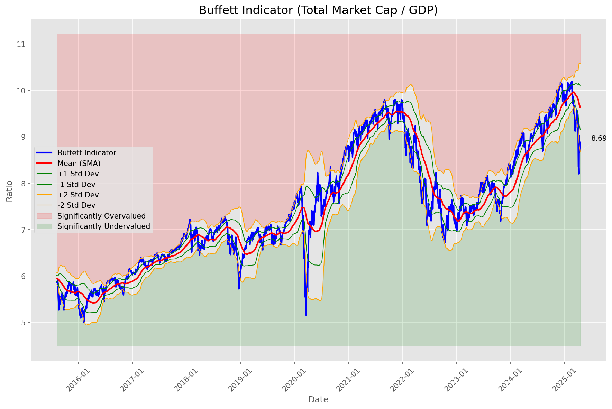
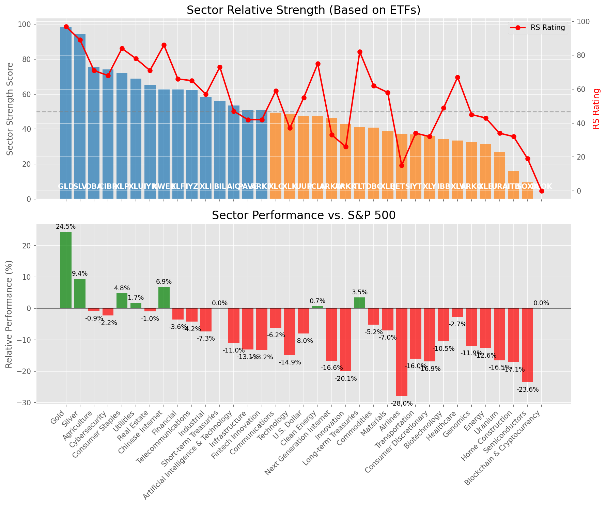

# **Daily Relative Strength Report**

**Date:** 2025-04-17

## **Market Valuation (Buffett Indicator)**

| Metric | Value |
|--------|-------|
| **Market Valuation** | **Undervalued** |
| **Current Ratio** | 8.72 |
| **Historical Mean** | 9.63 |
| **Standard Deviation** | 0.48 |
| **Z-Score (StdDev from Mean)** | -1.99 |
| **Total Market Cap** | $259.12 trillion |
| **GDP** | $29.72 trillion |

## **Market Insights**

### **Market is Undervalued**

The market is trading below historical average valuations, suggesting potential opportunity. These conditions have historically preceded periods of above-average returns. Investors should:

- Look for stocks breaking out of consolidation patterns on increasing volume
- Focus on sectors showing relative strength
- Consider increasing equity exposure, particularly in quality names
- Be mindful of overall market direction and avoid fighting the trend

History suggests patient investors are often rewarded when investing during periods of undervaluation.

### **Buffett Indicator Overview**

The Buffett Indicator (Total Market Cap / GDP) is a measure of the stock market's valuation relative to the size of the economy. It is named after Warren Buffett, who described it as "probably the best single measure of where valuations stand at any given moment."

- **Values above +2 standard deviations:** Market significantly overvalued
- **Values above +1 standard deviation:** Market overvalued
- **Values between -1 and +1 standard deviations:** Market fairly valued
- **Values below -1 standard deviation:** Market undervalued
- **Values below -2 standard deviations:** Market significantly undervalued

---

## **Sector Relative Strength**

Based on William O'Neil's Relative Strength Methodology

| ETF | Strength | RS Rating | Performance | Above Key MAs | Trend | Sector |
|-----|----------|-----------|-------------|--------------|-------|--------|
| [GLD](https://www.tradingview.com/chart/?symbol=GLD) | 98.5 | 97.0 | 22.79% | 10d ✓, 50d ✓, 200d ✓ | ↗️ | Gold |
| [XLP](https://www.tradingview.com/chart/?symbol=XLP) | 94.0 | 88.0 | 7.42% | 10d ✓, 50d ✓, 200d ✓ | ↗️ | Consumer Staples |
| [XLU](https://www.tradingview.com/chart/?symbol=XLU) | 89.5 | 79.0 | 1.78% | 10d ✓, 50d ✓, 200d ✓ | ↗️ | Utilities |
| [SLV](https://www.tradingview.com/chart/?symbol=SLV) | 82.6 | 85.0 | 5.38% | 10d ✓, 50d ✗, 200d ✓ | ↗️ | Silver |
| [DBA](https://www.tradingview.com/chart/?symbol=DBA) | 77.1 | 74.0 | -0.06% | 10d ✓, 50d ✗, 200d ✓ | ↗️ | Agriculture |
| [KWEB](https://www.tradingview.com/chart/?symbol=KWEB) | 72.9 | 86.0 | 6.31% | 10d ✓, 50d ✗, 200d ✗ | ↗️ | Chinese Internet |
| [IYZ](https://www.tradingview.com/chart/?symbol=IYZ) | 72.1 | 64.0 | -4.41% | 10d ✓, 50d ✗, 200d ✓ | ↗️ | Telecommunications |
| [BIL](https://www.tradingview.com/chart/?symbol=BIL) | 67.0 | 74.0 | 0.05% | 10d ✓, 50d ✓, 200d ✓ | ↘️ | Short-term Treasuries |
| [IYR](https://www.tradingview.com/chart/?symbol=IYR) | 66.9 | 74.0 | 0.13% | 10d ✓, 50d ✗, 200d ✗ | ↗️ | Real Estate |
| [CIBR](https://www.tradingview.com/chart/?symbol=CIBR) | 61.9 | 64.0 | -4.32% | 10d ✓, 50d ✗, 200d ✗ | ↗️ | Cybersecurity |
| [XLF](https://www.tradingview.com/chart/?symbol=XLF) | 60.9 | 62.0 | -5.28% | 10d ✓, 50d ✗, 200d ✗ | ↗️ | Financial |
| [ICLN](https://www.tradingview.com/chart/?symbol=ICLN) | 58.8 | 78.0 | 1.23% | 10d ✓, 50d ✓, 200d ✗ | ↘️ | Clean Energy |
| [XLI](https://www.tradingview.com/chart/?symbol=XLI) | 58.4 | 57.0 | -7.16% | 10d ✓, 50d ✗, 200d ✗ | ↗️ | Industrial |
| [XLC](https://www.tradingview.com/chart/?symbol=XLC) | 58.4 | 57.0 | -7.02% | 10d ✓, 50d ✗, 200d ✗ | ↗️ | Communications |
| [AIQ](https://www.tradingview.com/chart/?symbol=AIQ) | 51.9 | 44.0 | -12.80% | 10d ✓, 50d ✗, 200d ✗ | ↗️ | Artificial Intelligence & Technology |
| [PAVE](https://www.tradingview.com/chart/?symbol=PAVE) | 50.4 | 41.0 | -13.85% | 10d ✓, 50d ✗, 200d ✗ | ↗️ | Infrastructure |
| [IYT](https://www.tradingview.com/chart/?symbol=IYT) | 48.9 | 38.0 | -15.21% | 10d ✓, 50d ✗, 200d ✗ | ↗️ | Transportation |
| [ARKW](https://www.tradingview.com/chart/?symbol=ARKW) | 48.4 | 37.0 | -15.52% | 10d ✓, 50d ✗, 200d ✗ | ↗️ | Next Generation Internet |
| [UUP](https://www.tradingview.com/chart/?symbol=UUP) | 48.0 | 56.0 | -7.80% | 10d ✗, 50d ✗, 200d ✗ | ↗️ | U.S. Dollar |
| [ARKF](https://www.tradingview.com/chart/?symbol=ARKF) | 47.9 | 36.0 | -15.69% | 10d ✓, 50d ✗, 200d ✗ | ↗️ | Fintech Innovation |
| [XLK](https://www.tradingview.com/chart/?symbol=XLK) | 46.9 | 34.0 | -16.88% | 10d ✓, 50d ✗, 200d ✗ | ↗️ | Technology |
| [BLOK](https://www.tradingview.com/chart/?symbol=BLOK) | 42.4 | 25.0 | -21.14% | 10d ✓, 50d ✗, 200d ✗ | ↗️ | Blockchain & Cryptocurrency |
| [ARKK](https://www.tradingview.com/chart/?symbol=ARKK) | 40.4 | 21.0 | -23.21% | 10d ✓, 50d ✗, 200d ✗ | ↗️ | Innovation |
| [DBC](https://www.tradingview.com/chart/?symbol=DBC) | 40.4 | 61.0 | -5.71% | 10d ✓, 50d ✗, 200d ✗ | ↘️ | Commodities |
| [XLB](https://www.tradingview.com/chart/?symbol=XLB) | 38.4 | 57.0 | -7.11% | 10d ✓, 50d ✗, 200d ✗ | ↘️ | Materials |
| [TLT](https://www.tradingview.com/chart/?symbol=TLT) | 38.0 | 76.0 | 0.70% | 10d ✗, 50d ✗, 200d ✗ | ↘️ | Long-term Treasuries |
| [JETS](https://www.tradingview.com/chart/?symbol=JETS) | 37.9 | 16.0 | -27.47% | 10d ✓, 50d ✗, 200d ✗ | ↗️ | Airlines |
| [XLY](https://www.tradingview.com/chart/?symbol=XLY) | 35.5 | 31.0 | -18.44% | 10d ✗, 50d ✗, 200d ✗ | ↗️ | Consumer Discretionary |
| [IBB](https://www.tradingview.com/chart/?symbol=IBB) | 33.9 | 48.0 | -11.54% | 10d ✓, 50d ✗, 200d ✗ | ↘️ | Biotechnology |
| [XLE](https://www.tradingview.com/chart/?symbol=XLE) | 33.9 | 48.0 | -11.52% | 10d ✓, 50d ✗, 200d ✗ | ↘️ | Energy |
| [XLV](https://www.tradingview.com/chart/?symbol=XLV) | 33.0 | 66.0 | -3.49% | 10d ✗, 50d ✗, 200d ✗ | ↘️ | Healthcare |
| [ARKG](https://www.tradingview.com/chart/?symbol=ARKG) | 28.4 | 37.0 | -15.51% | 10d ✓, 50d ✗, 200d ✗ | ↘️ | Genomics |
| [URA](https://www.tradingview.com/chart/?symbol=URA) | 26.9 | 34.0 | -16.64% | 10d ✓, 50d ✗, 200d ✗ | ↘️ | Uranium |
| [ITB](https://www.tradingview.com/chart/?symbol=ITB) | 16.0 | 32.0 | -17.71% | 10d ✗, 50d ✗, 200d ✗ | ↘️ | Home Construction |
| [SOXX](https://www.tradingview.com/chart/?symbol=SOXX) | 8.5 | 17.0 | -25.53% | 10d ✗, 50d ✗, 200d ✗ | ↘️ | Semiconductors |

### **Sector ETF Performance Interpretation**

This table shows the relative strength metrics for different market sectors based on their representative ETFs:

- **ETF**: The ETF used to measure sector performance (click for chart)
- **Strength**: Overall sector strength score (0-100) combining multiple factors
- **RS Rating**: O'Neil RS rating of the sector ETF
- **Performance**: Performance of the sector ETF relative to SPY
- **Above Key MAs**: Whether the ETF is trading above its 10, 50, and 200-day moving averages
- **Trend**: Whether the sector is in an uptrend (↗️) or downtrend (↘️)

### **Current Sector Leadership**

The current market leadership is coming from the following sectors: **Gold, Consumer Staples, Utilities**.

The **Gold** sector (represented by **GLD**) is showing particularly strong relative strength with an RS rating of 97.0 and performance of 22.79% vs. the S&P 500. This sector is trading above its 10-day, 50-day, 200-day moving average(s). Investors should consider focusing on high RS stocks within these leading sectors for potential outperformance.

---

## **Buy Recommendations**

The following 92 stocks show exceptional relative strength:

| RS Rating | Buy Score | Current Price | Chart | Name | Ticker |
|-----------|-----------|---------------|-------|------|--------|
| 100 | 100 | $84.20 | [Chart](https://www.tradingview.com/chart/?symbol=WPM) | Wheaton Precious Metals Corp. Common Stock | WPM |
| 100 | 100 | $29.62 | [Chart](https://www.tradingview.com/chart/?symbol=AGI) | Alamos Gold Inc. Class A Common Shares | AGI |
| 100 | 100 | $121.62 | [Chart](https://www.tradingview.com/chart/?symbol=AEM) | Agnico Eagle Mines Ltd. | AEM |
| 100 | 100 | $142.71 | [Chart](https://www.tradingview.com/chart/?symbol=UGL) | ProShares Ultra Gold | UGL |
| 99 | 100 | $93.43 | [Chart](https://www.tradingview.com/chart/?symbol=PLTR) | Palantir Technologies Inc. Class A Common Stock | PLTR |
| 99 | 100 | $163.85 | [Chart](https://www.tradingview.com/chart/?symbol=PM) | Philip Morris International Inc. | PM |
| 99 | 100 | $150.06 | [Chart](https://www.tradingview.com/chart/?symbol=PLMR) | Palomar Holdings, Inc. Common stock | PLMR |
| 99 | 100 | $18.49 | [Chart](https://www.tradingview.com/chart/?symbol=SWI) | SolarWinds Corporation Common Stock | SWI |
| 99 | 100 | $185.48 | [Chart](https://www.tradingview.com/chart/?symbol=RGLD) | Royal Gold Inc | RGLD |
| 99 | 100 | $15.96 | [Chart](https://www.tradingview.com/chart/?symbol=EZPW) | Ezcorp Inc | EZPW |
| 98 | 100 | $118.69 | [Chart](https://www.tradingview.com/chart/?symbol=BJ) | BJs Wholesale Club Holdings, Inc. Common Stock | BJ |
| 98 | 100 | $23.50 | [Chart](https://www.tradingview.com/chart/?symbol=DB) | Deutsche Bank Aktiengesellschaft | DB |
| 98 | 100 | $26.48 | [Chart](https://www.tradingview.com/chart/?symbol=MP) | MP Materials Corp. | MP |
| 98 | 100 | $23.46 | [Chart](https://www.tradingview.com/chart/?symbol=OR) | Osisko Gold Royalties Ltd | OR |
| 98 | 100 | $31.25 | [Chart](https://www.tradingview.com/chart/?symbol=LTH) | Life Time Group Holdings, Inc. | LTH |
| 98 | 100 | $47.53 | [Chart](https://www.tradingview.com/chart/?symbol=EXC) | Exelon Corporation | EXC |
| 98 | 100 | $27.25 | [Chart](https://www.tradingview.com/chart/?symbol=T) | AT&T Inc. | T |
| 97 | 100 | $264.08 | [Chart](https://www.tradingview.com/chart/?symbol=TMUS) | T-Mobile US, Inc. | TMUS |
| 97 | 100 | $31.62 | [Chart](https://www.tradingview.com/chart/?symbol=SGOL) | abrdn Physical Gold Shares ETF | SGOL |
| 97 | 100 | $62.53 | [Chart](https://www.tradingview.com/chart/?symbol=IAU) | iShares Gold Trust | IAU |
| 97 | 100 | $33.06 | [Chart](https://www.tradingview.com/chart/?symbol=IAUM) | iShares Gold Trust Micro | IAUM |
| 97 | 100 | $25.48 | [Chart](https://www.tradingview.com/chart/?symbol=PHYS) | Sprott Physical Gold Trust | PHYS |
| 97 | 100 | $305.59 | [Chart](https://www.tradingview.com/chart/?symbol=GLD) | SPDR Gold Trust, SPDR Gold Shares | GLD |
| 97 | 100 | $71.40 | [Chart](https://www.tradingview.com/chart/?symbol=KR) | The Kroger Co. | KR |
| 96 | 100 | $54.05 | [Chart](https://www.tradingview.com/chart/?symbol=PPC) | Pilgrims Pride Corporation | PPC |
| 96 | 100 | $42.42 | [Chart](https://www.tradingview.com/chart/?symbol=BTI) | British American Tobacco p.l.c. American Depositary Shares, American Depositary Shares, each representing one Ordinary Share | BTI |
| 96 | 100 | $89.46 | [Chart](https://www.tradingview.com/chart/?symbol=CCEP) | Coca-Cola Europacific Partners plc Ordinary Shares | CCEP |
| 96 | 100 | $213.26 | [Chart](https://www.tradingview.com/chart/?symbol=TTWO) | Take-Two Interactive Software Inc | TTWO |
| 96 | 100 | $28.61 | [Chart](https://www.tradingview.com/chart/?symbol=EUFN) | iShares MSCI Europe Financials ETF | EUFN |
| 96 | 100 | $44.57 | [Chart](https://www.tradingview.com/chart/?symbol=GH) | Guardant Health, Inc. Common Stock | GH |
| 96 | 100 | $79.34 | [Chart](https://www.tradingview.com/chart/?symbol=NFG) | National Fuel Gas Co. | NFG |
| 96 | 100 | $131.27 | [Chart](https://www.tradingview.com/chart/?symbol=ABT) | Abbott Laboratories | ABT |
| 96 | 100 | $23.85 | [Chart](https://www.tradingview.com/chart/?symbol=SRAD) | Sportradar Group AG Class A Ordinary Shares | SRAD |
| 95 | 100 | $243.50 | [Chart](https://www.tradingview.com/chart/?symbol=RSG) | Republic Services Inc. | RSG |
| 95 | 100 | $37.33 | [Chart](https://www.tradingview.com/chart/?symbol=CNP) | CenterPoint Energy, Inc. | CNP |
| 95 | 100 | $459.58 | [Chart](https://www.tradingview.com/chart/?symbol=CASY) | Casey's General Stores Inc | CASY |
| 95 | 100 | $29.32 | [Chart](https://www.tradingview.com/chart/?symbol=CEF) | Sprott Physical Gold and Silver Trust | CEF |
| 95 | 100 | $24.09 | [Chart](https://www.tradingview.com/chart/?symbol=SONY) | Sony Group Corporation American Depositary Shares (Each Representing One Share of Dollar Validated Common Stock) | SONY |
| 95 | 100 | $67.83 | [Chart](https://www.tradingview.com/chart/?symbol=VTR) | Ventas, Inc. | VTR |
| 94 | 100 | $970.77 | [Chart](https://www.tradingview.com/chart/?symbol=NFLX) | NetFlix Inc | NFLX |
| 94 | 100 | $37.88 | [Chart](https://www.tradingview.com/chart/?symbol=MRX) | Marex Group plc Ordinary Shares | MRX |
| 94 | 100 | $80.16 | [Chart](https://www.tradingview.com/chart/?symbol=SNEX) | StoneX Group Inc. Common Stock | SNEX |
| 94 | 100 | $112.31 | [Chart](https://www.tradingview.com/chart/?symbol=OLLI) | Ollie's Bargain Outlet Holdings, Inc. Common Stock | OLLI |
| 94 | 100 | $78.13 | [Chart](https://www.tradingview.com/chart/?symbol=SR) | Spire Inc. | SR |
| 94 | 100 | $19.52 | [Chart](https://www.tradingview.com/chart/?symbol=GRND) | Grindr Inc. | GRND |
| 94 | 100 | $264.03 | [Chart](https://www.tradingview.com/chart/?symbol=CME) | CME Group Inc. | CME |
| 93 | 100 | $117.66 | [Chart](https://www.tradingview.com/chart/?symbol=BRO) | Brown & Brown, Inc. | BRO |
| 93 | 100 | $330.67 | [Chart](https://www.tradingview.com/chart/?symbol=AJG) | Arthur J. Gallagher & Co. | AJG |
| 93 | 100 | $108.39 | [Chart](https://www.tradingview.com/chart/?symbol=AEP) | American Electric Power Company, Inc. | AEP |
| 93 | 100 | $37.45 | [Chart](https://www.tradingview.com/chart/?symbol=EWG) | iShares MSCI Germany ETF | EWG |
| 93 | 100 | $520.58 | [Chart](https://www.tradingview.com/chart/?symbol=BRK.B) | BERKSHIRE HATHAWAY Class B | BRK.B |
| 93 | 100 | $58.27 | [Chart](https://www.tradingview.com/chart/?symbol=MO) | Altria Group, Inc. | MO |
| 92 | 100 | $16.62 | [Chart](https://www.tradingview.com/chart/?symbol=SPNT) | SiriusPoint Ltd. | SPNT |
| 92 | 100 | $197.99 | [Chart](https://www.tradingview.com/chart/?symbol=WCN) | Waste Connections, Inc. | WCN |
| 92 | 100 | $158.18 | [Chart](https://www.tradingview.com/chart/?symbol=ATO) | Atmos Energy Corporation | ATO |
| 92 | 100 | $35.94 | [Chart](https://www.tradingview.com/chart/?symbol=PPL) | PPL Corporation | PPL |
| 92 | 100 | $78.95 | [Chart](https://www.tradingview.com/chart/?symbol=ADC) | Agree Realty Corporation | ADC |
| 92 | 100 | $95.13 | [Chart](https://www.tradingview.com/chart/?symbol=PNW) | Pinnacle West Capital Corporation | PNW |
| 91 | 100 | $178.67 | [Chart](https://www.tradingview.com/chart/?symbol=LOPE) | Grand Canyon Education, Inc | LOPE |
| 91 | 100 | $68.72 | [Chart](https://www.tradingview.com/chart/?symbol=EVRG) | Evergy, Inc. | EVRG |
| 91 | 100 | $52.26 | [Chart](https://www.tradingview.com/chart/?symbol=RELX) | RELX PLC | RELX |
| 91 | 100 | $134.57 | [Chart](https://www.tradingview.com/chart/?symbol=DTE) | DTE Energy Company | DTE |
| 91 | 100 | $48.15 | [Chart](https://www.tradingview.com/chart/?symbol=MRCY) | Mercury Systems Inc. | MRCY |
| 90 | 100 | $103.10 | [Chart](https://www.tradingview.com/chart/?symbol=EHC) | Encompass Health Corporation Common Stock | EHC |
| 90 | 100 | $77.99 | [Chart](https://www.tradingview.com/chart/?symbol=OGS) | ONE GAS, INC. | OGS |
| 90 | 100 | $18.00 | [Chart](https://www.tradingview.com/chart/?symbol=KT) | KT Corp. | KT |
| 90 | 100 | $45.30 | [Chart](https://www.tradingview.com/chart/?symbol=OGE) | OGE Energy Corp. | OGE |
| 90 | 100 | $61.92 | [Chart](https://www.tradingview.com/chart/?symbol=FNF) | Fidelity National Financial, Inc. | FNF |
| 89 | 100 | $99.09 | [Chart](https://www.tradingview.com/chart/?symbol=AEE) | Ameren Corporation | AEE |
| 89 | 100 | $106.27 | [Chart](https://www.tradingview.com/chart/?symbol=ATGE) | Adtalem Global Education Inc. Common Shares | ATGE |
| 89 | 100 | $30.48 | [Chart](https://www.tradingview.com/chart/?symbol=AHR) | American Healthcare REIT, Inc. | AHR |
| 88 | 100 | $994.65 | [Chart](https://www.tradingview.com/chart/?symbol=COST) | Costco Wholesale Corp | COST |
| 87 | 100 | $39.55 | [Chart](https://www.tradingview.com/chart/?symbol=NI) | NiSource Inc. | NI |
| 87 | 100 | $153.98 | [Chart](https://www.tradingview.com/chart/?symbol=EAT) | Brinker International, Inc. | EAT |
| 86 | 100 | $83.76 | [Chart](https://www.tradingview.com/chart/?symbol=ETR) | Entergy Corporation | ETR |
| 90 | 99 | $81.61 | [Chart](https://www.tradingview.com/chart/?symbol=FAST) | Fastenal Co | FAST |
| 88 | 98 | $50.03 | [Chart](https://www.tradingview.com/chart/?symbol=NJR) | New Jersey Resources Corp | NJR |
| 86 | 97 | $49.75 | [Chart](https://www.tradingview.com/chart/?symbol=TRP) | TC Energy Corporation | TRP |
| 86 | 97 | $256.26 | [Chart](https://www.tradingview.com/chart/?symbol=TRV) | The Travelers Companies, Inc. | TRV |
| 85 | 96 | $118.20 | [Chart](https://www.tradingview.com/chart/?symbol=CWST) | Casella Waste Systems Inc | CWST |
| 83 | 96 | $236.70 | [Chart](https://www.tradingview.com/chart/?symbol=BR) | Broadridge Financial Solutions Inc | BR |
| 85 | 94 | $123.56 | [Chart](https://www.tradingview.com/chart/?symbol=BECN) | Beacon Roofing Supply, Inc. | BECN |
| 82 | 94 | $36.34 | [Chart](https://www.tradingview.com/chart/?symbol=DRS) | Leonardo DRS, Inc. Common Stock | DRS |
| 83 | 93 | $44.92 | [Chart](https://www.tradingview.com/chart/?symbol=SEZL) | Sezzle Inc. Common Stock | SEZL |
| 83 | 93 | $55.61 | [Chart](https://www.tradingview.com/chart/?symbol=IGF) | iShares Global Infrastructure ETF | IGF |
| 82 | 93 | $37.23 | [Chart](https://www.tradingview.com/chart/?symbol=AB) | AllianceBernstein Holding, L.P. | AB |
| 80 | 93 | $59.05 | [Chart](https://www.tradingview.com/chart/?symbol=WMB) | Williams Companies Inc. | WMB |
| 80 | 93 | $93.25 | [Chart](https://www.tradingview.com/chart/?symbol=WMT) | Walmart Inc. | WMT |
| 82 | 92 | $108.18 | [Chart](https://www.tradingview.com/chart/?symbol=AFL) | Aflac Inc. | AFL |
| 80 | 92 | $66.56 | [Chart](https://www.tradingview.com/chart/?symbol=EBAY) | eBay Inc | EBAY |
| 81 | 91 | $49.85 | [Chart](https://www.tradingview.com/chart/?symbol=VTIP) | Vanguard Short-Term Inflation-Protected Securities Index Fund | VTIP |
| 81 | 90 | $32.18 | [Chart](https://www.tradingview.com/chart/?symbol=FDP) | Fresh Del Monte Produce Inc. | FDP |

---

## **Sell Recommendations**

The following 200 stocks show deteriorating relative strength:

| RS Rating | Sell Score | Current Price | Chart | Name | Ticker |
|-----------|------------|---------------|-------|------|--------|
| 1 | 100 | $10.64 | [Chart](https://www.tradingview.com/chart/?symbol=XNCR) | Xencor, Inc. | XNCR |
| 2 | 100 | $43.47 | [Chart](https://www.tradingview.com/chart/?symbol=TECL) | Direxion Daily Technology Bull 3x Shares | TECL |
| 2 | 100 | $15.43 | [Chart](https://www.tradingview.com/chart/?symbol=SSTK) | SHUTTERSTOCK, INC. | SSTK |
| 2 | 100 | $16.83 | [Chart](https://www.tradingview.com/chart/?symbol=TNDM) | Tandem Diabetes Care, Inc. | TNDM |
| 3 | 100 | $10.40 | [Chart](https://www.tradingview.com/chart/?symbol=BCYC) | Bicycle Therapeutics plc American Depositary Shares | BCYC |
| 3 | 100 | $46.27 | [Chart](https://www.tradingview.com/chart/?symbol=LABU) | Direxion Daily S&P Biotech Bull 3X Shares | LABU |
| 3 | 100 | $22.36 | [Chart](https://www.tradingview.com/chart/?symbol=DJT) | Trump Media & Technology Group Corp. Common Stock | DJT |
| 3 | 100 | $17.13 | [Chart](https://www.tradingview.com/chart/?symbol=DAVA) | Endava plc American Depositary Shares (each representing one Class A Ordinary Share) | DAVA |
| 5 | 100 | $60.41 | [Chart](https://www.tradingview.com/chart/?symbol=ARCB) | ArcBest Corporation | ARCB |
| 5 | 100 | $25.59 | [Chart](https://www.tradingview.com/chart/?symbol=FORM) | FormFactor Inc. | FORM |
| 5 | 100 | $22.25 | [Chart](https://www.tradingview.com/chart/?symbol=FIVN) | FIVE9, INC. | FIVN |
| 6 | 100 | $19.55 | [Chart](https://www.tradingview.com/chart/?symbol=SPT) | Sprout Social, Inc Class A Common Stock | SPT |
| 6 | 100 | $19.29 | [Chart](https://www.tradingview.com/chart/?symbol=CECO) | Ceco Environmental Corp | CECO |
| 6 | 100 | $34.43 | [Chart](https://www.tradingview.com/chart/?symbol=TDW) | Tidewater, Inc. | TDW |
| 6 | 100 | $55.92 | [Chart](https://www.tradingview.com/chart/?symbol=LGIH) | LGI Homes, Inc. | LGIH |
| 6 | 100 | $20.47 | [Chart](https://www.tradingview.com/chart/?symbol=HI) | Hillenbrand, Inc. | HI |
| 6 | 100 | $10.53 | [Chart](https://www.tradingview.com/chart/?symbol=ARCT) | Arcturus Therapeutics Holdings Inc. Common Stock | ARCT |
| 6 | 100 | $55.65 | [Chart](https://www.tradingview.com/chart/?symbol=SWKS) | Skyworks Solutions Inc | SWKS |
| 6 | 100 | $26.39 | [Chart](https://www.tradingview.com/chart/?symbol=W) | Wayfair Inc. | W |
| 7 | 100 | $21.65 | [Chart](https://www.tradingview.com/chart/?symbol=NSSC) | Napco Security Technologies, Inc | NSSC |
| 7 | 100 | $26.01 | [Chart](https://www.tradingview.com/chart/?symbol=XPEL) | XPEL, Inc. Common Stock | XPEL |
| 7 | 100 | $18.25 | [Chart](https://www.tradingview.com/chart/?symbol=APLS) | Apellis Pharmaceuticals, Inc. Common Stock | APLS |
| 7 | 100 | $44.60 | [Chart](https://www.tradingview.com/chart/?symbol=ACLS) | Axcelis Technologies Inc | ACLS |
| 8 | 100 | $12.96 | [Chart](https://www.tradingview.com/chart/?symbol=DK) | Delek US Holdings, Inc. | DK |
| 8 | 100 | $60.03 | [Chart](https://www.tradingview.com/chart/?symbol=CAMT) | Camtek Ltd | CAMT |
| 8 | 100 | $12.71 | [Chart](https://www.tradingview.com/chart/?symbol=GCT) | GigaCloud Technology Inc Class A Ordinary Shares | GCT |
| 9 | 100 | $18.41 | [Chart](https://www.tradingview.com/chart/?symbol=BZH) | Beazer Homes USA, Inc. New | BZH |
| 9 | 100 | $11.40 | [Chart](https://www.tradingview.com/chart/?symbol=ADNT) | Adient plc Ordinary Shares | ADNT |
| 10 | 100 | $11.54 | [Chart](https://www.tradingview.com/chart/?symbol=AEYE) | AudioEye, Inc. Common Stock | AEYE |
| 11 | 100 | $19.34 | [Chart](https://www.tradingview.com/chart/?symbol=ST) | Sensata Technologies Holding plc | ST |
| 11 | 100 | $27.24 | [Chart](https://www.tradingview.com/chart/?symbol=SRDX) | Surmodics, Inc. Common Stock | SRDX |
| 12 | 100 | $19.60 | [Chart](https://www.tradingview.com/chart/?symbol=FOXF) | Fox Factory Holding Corp. Common Stock | FOXF |
| 13 | 100 | $12.80 | [Chart](https://www.tradingview.com/chart/?symbol=XRAY) | DENTSPLY SIRONA Inc. | XRAY |
| 13 | 100 | $15.69 | [Chart](https://www.tradingview.com/chart/?symbol=IART) | Integra LifeSciences Holdings | IART |
| 7 | 99 | $29.10 | [Chart](https://www.tradingview.com/chart/?symbol=KLIC) | Kulicke & Soffa Industries Inc | KLIC |
| 7 | 99 | $21.09 | [Chart](https://www.tradingview.com/chart/?symbol=VERA) | Vera Therapeutics, Inc. Class A Common Stock | VERA |
| 9 | 99 | $20.36 | [Chart](https://www.tradingview.com/chart/?symbol=TDC) | TERADATA CORPORATION | TDC |
| 10 | 99 | $28.52 | [Chart](https://www.tradingview.com/chart/?symbol=UWM) | ProShares Ultra Russell2000 | UWM |
| 13 | 99 | $58.54 | [Chart](https://www.tradingview.com/chart/?symbol=ATKR) | Atkore Inc. | ATKR |
| 13 | 99 | $112.02 | [Chart](https://www.tradingview.com/chart/?symbol=GNRC) | GENERAC HOLDINGS INC | GNRC |
| 17 | 99 | $35.42 | [Chart](https://www.tradingview.com/chart/?symbol=LIVN) | LivaNova PLC Ordinary Shares | LIVN |
| 9 | 98 | $57.95 | [Chart](https://www.tradingview.com/chart/?symbol=ASGN) | ASGN Incorporated | ASGN |
| 14 | 98 | $11.75 | [Chart](https://www.tradingview.com/chart/?symbol=ASPN) | Aspen Aerogels, Inc. | ASPN |
| 12 | 97 | $12.55 | [Chart](https://www.tradingview.com/chart/?symbol=MARA) | MARA Holdings, Inc. Common Stock | MARA |
| 12 | 96 | $10.39 | [Chart](https://www.tradingview.com/chart/?symbol=TXG) | 10x Genomics, Inc. Class A Common Stock | TXG |
| 16 | 96 | $87.11 | [Chart](https://www.tradingview.com/chart/?symbol=AMD) | Advanced Micro Devices | AMD |
| 16 | 96 | $14.64 | [Chart](https://www.tradingview.com/chart/?symbol=PBW) | Invesco WilderHill Clean Energy ETF | PBW |
| 16 | 96 | $54.28 | [Chart](https://www.tradingview.com/chart/?symbol=EL) | The Estee Lauder Companies Inc. Class A | EL |
| 20 | 96 | $44.94 | [Chart](https://www.tradingview.com/chart/?symbol=EDU) | New Oriental Education and Technology Group, Inc. American Depositary Shares (each representing ten (10) Common Shares) | EDU |
| 20 | 96 | $31.65 | [Chart](https://www.tradingview.com/chart/?symbol=URNM) | Sprott Uranium Miners ETF | URNM |
| 23 | 96 | $33.06 | [Chart](https://www.tradingview.com/chart/?symbol=IAC) | IAC Inc. Common Stock | IAC |
| 9 | 95 | $23.29 | [Chart](https://www.tradingview.com/chart/?symbol=WSC) | WillScot Holdings Corporation Class A Common Stock | WSC |
| 12 | 95 | $57.47 | [Chart](https://www.tradingview.com/chart/?symbol=SWK) | Stanley Black & Decker, Inc. | SWK |
| 13 | 95 | $20.47 | [Chart](https://www.tradingview.com/chart/?symbol=UPBD) | Upbound Group, Inc. Common Stock | UPBD |
| 14 | 95 | $22.22 | [Chart](https://www.tradingview.com/chart/?symbol=UCO) | ProShares Ultra Bloomberg Crude Oil | UCO |
| 15 | 95 | $10.31 | [Chart](https://www.tradingview.com/chart/?symbol=VREX) | Varex Imaging Corporation Common Stock | VREX |
| 8 | 94 | $14.52 | [Chart](https://www.tradingview.com/chart/?symbol=DLX) | Deluxe Corporation | DLX |
| 9 | 94 | $45.55 | [Chart](https://www.tradingview.com/chart/?symbol=RHI) | Robert Half Inc. | RHI |
| 11 | 94 | $127.72 | [Chart](https://www.tradingview.com/chart/?symbol=FSLR) | First Solar, Inc. | FSLR |
| 12 | 94 | $14.34 | [Chart](https://www.tradingview.com/chart/?symbol=DXC) | DXC Technology Company | DXC |
| 14 | 94 | $37.73 | [Chart](https://www.tradingview.com/chart/?symbol=FMC) | FMC Corporation | FMC |
| 14 | 94 | $49.96 | [Chart](https://www.tradingview.com/chart/?symbol=NVT) | nVent Electric plc Ordinary Shares | NVT |
| 15 | 94 | $18.45 | [Chart](https://www.tradingview.com/chart/?symbol=AMN) | AMN Healthcare Services | AMN |
| 16 | 94 | $18.73 | [Chart](https://www.tradingview.com/chart/?symbol=FOR) | Forestar Group Inc. | FOR |
| 16 | 94 | $94.16 | [Chart](https://www.tradingview.com/chart/?symbol=CHRD) | Chord Energy Corporation Common Stock | CHRD |
| 10 | 93 | $17.95 | [Chart](https://www.tradingview.com/chart/?symbol=OII) | Oceaneering International Inc. | OII |
| 10 | 93 | $29.48 | [Chart](https://www.tradingview.com/chart/?symbol=JANX) | Janux Therapeutics, Inc. Common Stock | JANX |
| 11 | 93 | $100.89 | [Chart](https://www.tradingview.com/chart/?symbol=ARM) | Arm Holdings plc American Depositary Shares | ARM |
| 11 | 93 | $331.50 | [Chart](https://www.tradingview.com/chart/?symbol=SAIA) | Saia, Inc. | SAIA |
| 11 | 93 | $128.81 | [Chart](https://www.tradingview.com/chart/?symbol=SPSC) | SPS Commerce, Inc. | SPSC |
| 15 | 93 | $53.18 | [Chart](https://www.tradingview.com/chart/?symbol=IPGP) | IPG Photonics Corporation | IPGP |
| 17 | 93 | $34.62 | [Chart](https://www.tradingview.com/chart/?symbol=TEX) | Terex Corporation | TEX |
| 20 | 93 | $18.51 | [Chart](https://www.tradingview.com/chart/?symbol=BITO) | ProShares Bitcoin ETF | BITO |
| 27 | 93 | $14.26 | [Chart](https://www.tradingview.com/chart/?symbol=FXN) | First Trust Energy AlphaDEX Fund | FXN |
| 27 | 93 | $12.15 | [Chart](https://www.tradingview.com/chart/?symbol=MED) | Medifast, Inc. | MED |
| 12 | 92 | $20.54 | [Chart](https://www.tradingview.com/chart/?symbol=CGON) | CG Oncology, Inc. Common stock | CGON |
| 13 | 92 | $31.82 | [Chart](https://www.tradingview.com/chart/?symbol=ENOV) | Enovis Corporation | ENOV |
| 16 | 92 | $93.37 | [Chart](https://www.tradingview.com/chart/?symbol=BCC) | Boise Cascade Company | BCC |
| 18 | 92 | $48.51 | [Chart](https://www.tradingview.com/chart/?symbol=ERX) | Direxion Daily Energy Bull 2X Shares | ERX |
| 9 | 91 | $41.83 | [Chart](https://www.tradingview.com/chart/?symbol=PSTG) | Pure Storage, Inc. Class A | PSTG |
| 15 | 91 | $10.77 | [Chart](https://www.tradingview.com/chart/?symbol=SONO) | Sonos, Inc. Common Stock | SONO |
| 15 | 91 | $44.98 | [Chart](https://www.tradingview.com/chart/?symbol=POWI) | Power Integrations Inc | POWI |
| 16 | 91 | $129.03 | [Chart](https://www.tradingview.com/chart/?symbol=TFX) | Teleflex Incorporated | TFX |
| 20 | 91 | $25.37 | [Chart](https://www.tradingview.com/chart/?symbol=CZR) | Caesars Entertainment, Inc. Common Stock | CZR |
| 20 | 91 | $26.31 | [Chart](https://www.tradingview.com/chart/?symbol=SEE) | Sealed Air Corp. | SEE |
| 25 | 91 | $10.03 | [Chart](https://www.tradingview.com/chart/?symbol=MTAL) | MAC Copper Limited | MTAL |
| 19 | 90 | $31.55 | [Chart](https://www.tradingview.com/chart/?symbol=NGVT) | Ingevity Corporation | NGVT |
| 21 | 90 | $20.70 | [Chart](https://www.tradingview.com/chart/?symbol=LPG) | DORIAN LPG LTD | LPG |
| 22 | 90 | $39.10 | [Chart](https://www.tradingview.com/chart/?symbol=SIMO) | Silicon Motion Technology Corporation | SIMO |
| 11 | 89 | $10.01 | [Chart](https://www.tradingview.com/chart/?symbol=VYX) | NCR Voyix Corporation | VYX |
| 13 | 89 | $10.40 | [Chart](https://www.tradingview.com/chart/?symbol=NEOG) | Neogen Corp | NEOG |
| 16 | 89 | $16.07 | [Chart](https://www.tradingview.com/chart/?symbol=ELVN) | Enliven Therapeutics, Inc. Common Stock | ELVN |
| 21 | 89 | $39.21 | [Chart](https://www.tradingview.com/chart/?symbol=FEPI) | REX FANG & Innovation Equity Premium Income ETF | FEPI |
| 12 | 88 | $33.93 | [Chart](https://www.tradingview.com/chart/?symbol=FLR) | Fluor Corporation | FLR |
| 21 | 88 | $20.49 | [Chart](https://www.tradingview.com/chart/?symbol=SYM) | Symbotic Inc. Class A Common Stock | SYM |
| 22 | 88 | $57.27 | [Chart](https://www.tradingview.com/chart/?symbol=QRVO) | Qorvo, Inc. | QRVO |
| 22 | 88 | $112.22 | [Chart](https://www.tradingview.com/chart/?symbol=XOP) | SPDR S&P Oil & Gas Exploration & Production ETF | XOP |
| 22 | 88 | $51.20 | [Chart](https://www.tradingview.com/chart/?symbol=IIPR) | Innovative Industrial Properties, Inc. Common stock | IIPR |
| 23 | 88 | $31.47 | [Chart](https://www.tradingview.com/chart/?symbol=TENB) | Tenable Holdings, Inc. | TENB |
| 26 | 88 | $52.12 | [Chart](https://www.tradingview.com/chart/?symbol=ENPH) | Enphase Energy, Inc. | ENPH |
| 21 | 87 | $28.25 | [Chart](https://www.tradingview.com/chart/?symbol=WERN) | Werner Enterprises Inc | WERN |
| 22 | 87 | $52.23 | [Chart](https://www.tradingview.com/chart/?symbol=HXL) | Hexcel Corporation | HXL |
| 25 | 87 | $11.89 | [Chart](https://www.tradingview.com/chart/?symbol=OEC) | Orion S.A. | OEC |
| 25 | 87 | $32.24 | [Chart](https://www.tradingview.com/chart/?symbol=MGA) | Magna International | MGA |
| 26 | 87 | $17.17 | [Chart](https://www.tradingview.com/chart/?symbol=CTRI) | Centuri Holdings, Inc. | CTRI |
| 16 | 86 | $10.24 | [Chart](https://www.tradingview.com/chart/?symbol=EXPI) | eXp World Holdings, Inc. Common Stock | EXPI |
| 18 | 86 | $27.73 | [Chart](https://www.tradingview.com/chart/?symbol=YETI) | YETI Holdings, Inc. Common Stock | YETI |
| 20 | 86 | $53.08 | [Chart](https://www.tradingview.com/chart/?symbol=AIR) | AAR Corp. | AIR |
| 23 | 86 | $143.89 | [Chart](https://www.tradingview.com/chart/?symbol=PTC) | PTC, INC | PTC |
| 24 | 86 | $12.03 | [Chart](https://www.tradingview.com/chart/?symbol=OSCR) | Oscar Health, Inc. | OSCR |
| 25 | 86 | $26.83 | [Chart](https://www.tradingview.com/chart/?symbol=MBUU) | Malibu Boats, Inc. Class A | MBUU |
| 27 | 86 | $217.62 | [Chart](https://www.tradingview.com/chart/?symbol=WING) | Wingstop Inc | WING |
| 33 | 86 | $44.17 | [Chart](https://www.tradingview.com/chart/?symbol=ETSY) | Etsy, Inc. | ETSY |
| 16 | 85 | $52.05 | [Chart](https://www.tradingview.com/chart/?symbol=SMG) | The Scotts Miracle-Gro Company | SMG |
| 20 | 85 | $34.34 | [Chart](https://www.tradingview.com/chart/?symbol=CALF) | Pacer US Small Cap Cash Cows ETF | CALF |
| 17 | 84 | $32.80 | [Chart](https://www.tradingview.com/chart/?symbol=LVS) | Las Vegas Sands Corp. | LVS |
| 19 | 84 | $10.15 | [Chart](https://www.tradingview.com/chart/?symbol=HLIT) | Harmonic Inc | HLIT |
| 21 | 84 | $105.14 | [Chart](https://www.tradingview.com/chart/?symbol=MHO) | M/I Homes, Inc. | MHO |
| 27 | 84 | $72.39 | [Chart](https://www.tradingview.com/chart/?symbol=IR) | Ingersoll Rand Inc. Common Stock | IR |
| 28 | 84 | $12.15 | [Chart](https://www.tradingview.com/chart/?symbol=CVE) | Cenovus Energy Inc. | CVE |
| 31 | 84 | $11.21 | [Chart](https://www.tradingview.com/chart/?symbol=NAVI) | Navient Corporation | NAVI |
| 17 | 83 | $62.17 | [Chart](https://www.tradingview.com/chart/?symbol=GEHC) | GE HealthCare Technologies Inc. Common Stock | GEHC |
| 25 | 83 | $91.70 | [Chart](https://www.tradingview.com/chart/?symbol=WLK) | Westlake Corporation | WLK |
| 31 | 83 | $26.45 | [Chart](https://www.tradingview.com/chart/?symbol=BWA) | BorgWarner Inc. | BWA |
| 21 | 82 | $11.71 | [Chart](https://www.tradingview.com/chart/?symbol=TRIP) | TripAdvisor, Inc. | TRIP |
| 22 | 82 | $56.66 | [Chart](https://www.tradingview.com/chart/?symbol=MTX) | Minerals Technologies Inc | MTX |
| 28 | 82 | $45.70 | [Chart](https://www.tradingview.com/chart/?symbol=ATI) | ATI Inc. | ATI |
| 31 | 82 | $28.15 | [Chart](https://www.tradingview.com/chart/?symbol=TAN) | Invesco Solar ETF | TAN |
| 32 | 82 | $25.20 | [Chart](https://www.tradingview.com/chart/?symbol=PINS) | Pinterest, Inc. Class A Common Stock | PINS |
| 21 | 81 | $16.55 | [Chart](https://www.tradingview.com/chart/?symbol=CODI) | Compass Diversified | CODI |
| 24 | 81 | $59.25 | [Chart](https://www.tradingview.com/chart/?symbol=CCS) | CENTURY COMMUNITIES, INC. | CCS |
| 31 | 81 | $10.71 | [Chart](https://www.tradingview.com/chart/?symbol=DBRG) | DigitalBridge Group, Inc. | DBRG |
| 32 | 81 | $76.31 | [Chart](https://www.tradingview.com/chart/?symbol=TNET) | TRINET GROUP, INC. | TNET |
| 33 | 81 | $284.06 | [Chart](https://www.tradingview.com/chart/?symbol=BLD) | TopBuild Corp. Common Stock | BLD |
| 24 | 80 | $56.55 | [Chart](https://www.tradingview.com/chart/?symbol=BOIL) | ProShares Ultra Bloomberg Natural Gas | BOIL |
| 29 | 80 | $36.80 | [Chart](https://www.tradingview.com/chart/?symbol=TWST) | Twist Bioscience Corporation Common Stock | TWST |
| 29 | 80 | $61.32 | [Chart](https://www.tradingview.com/chart/?symbol=TKR) | The Timken Company | TKR |
| 29 | 80 | $10.11 | [Chart](https://www.tradingview.com/chart/?symbol=CELC) | Celcuity Inc. Common Stock | CELC |
| 30 | 80 | $63.73 | [Chart](https://www.tradingview.com/chart/?symbol=AIN) | Albany International Corp Class A | AIN |
| 37 | 80 | $79.61 | [Chart](https://www.tradingview.com/chart/?symbol=LEA) | Lear Corporation | LEA |
| 24 | 79 | $12.14 | [Chart](https://www.tradingview.com/chart/?symbol=BAND) | Bandwidth Inc. Class A Common Stock | BAND |
| 27 | 79 | $113.91 | [Chart](https://www.tradingview.com/chart/?symbol=MYRG) | MYR Group, Inc. | MYRG |
| 29 | 79 | $102.16 | [Chart](https://www.tradingview.com/chart/?symbol=CHDN) | Churchill Downs Inc | CHDN |
| 29 | 79 | $151.66 | [Chart](https://www.tradingview.com/chart/?symbol=CDW) | CDW Corporation | CDW |
| 29 | 78 | $11.04 | [Chart](https://www.tradingview.com/chart/?symbol=ABR) | Arbor Realty Trust, Inc. | ABR |
| 31 | 78 | $133.32 | [Chart](https://www.tradingview.com/chart/?symbol=NSIT) | Insight Enterprises Inc | NSIT |
| 34 | 78 | $136.45 | [Chart](https://www.tradingview.com/chart/?symbol=QCOM) | Qualcomm Inc | QCOM |
| 34 | 78 | $10.16 | [Chart](https://www.tradingview.com/chart/?symbol=MAX) | MediaAlpha, Inc. | MAX |
| 37 | 78 | $50.48 | [Chart](https://www.tradingview.com/chart/?symbol=KBR) | KBR, Inc. | KBR |
| 24 | 77 | $75.26 | [Chart](https://www.tradingview.com/chart/?symbol=FSS) | Federal Signal Corp. | FSS |
| 24 | 77 | $268.90 | [Chart](https://www.tradingview.com/chart/?symbol=ETN) | Eaton Corporation, plc Ordinary Shares | ETN |
| 25 | 77 | $10.04 | [Chart](https://www.tradingview.com/chart/?symbol=HTLD) | Heartland Express Inc | HTLD |
| 26 | 77 | $338.62 | [Chart](https://www.tradingview.com/chart/?symbol=HUBB) | Hubbell Incorporated | HUBB |
| 28 | 77 | $64.78 | [Chart](https://www.tradingview.com/chart/?symbol=MTH) | Meritage Homes Corporation | MTH |
| 29 | 77 | $88.30 | [Chart](https://www.tradingview.com/chart/?symbol=PCAR) | Paccar Inc | PCAR |
| 33 | 77 | $11.53 | [Chart](https://www.tradingview.com/chart/?symbol=RIVN) | Rivian Automotive, Inc. Class A Common Stock | RIVN |
| 25 | 75 | $183.84 | [Chart](https://www.tradingview.com/chart/?symbol=FN) | Fabrinet | FN |
| 26 | 75 | $102.72 | [Chart](https://www.tradingview.com/chart/?symbol=MHK) | Mohawk Industries, Inc. | MHK |
| 26 | 75 | $60.57 | [Chart](https://www.tradingview.com/chart/?symbol=DD) | DuPont de Nemours, Inc. Common Stock | DD |
| 28 | 75 | $14.74 | [Chart](https://www.tradingview.com/chart/?symbol=PD) | PagerDuty, Inc. | PD |
| 28 | 75 | $84.27 | [Chart](https://www.tradingview.com/chart/?symbol=BPMC) | Blueprint Medicines Corporation | BPMC |
| 30 | 75 | $111.99 | [Chart](https://www.tradingview.com/chart/?symbol=SITE) | SiteOne Landscape Supply, Inc. | SITE |
| 33 | 75 | $41.11 | [Chart](https://www.tradingview.com/chart/?symbol=CCJ) | Cameco Corporation | CCJ |
| 36 | 75 | $127.93 | [Chart](https://www.tradingview.com/chart/?symbol=MPC) | MARATHON PETROLEUM CORPORATION | MPC |
| 38 | 75 | $13.80 | [Chart](https://www.tradingview.com/chart/?symbol=MANU) | MANCHESTER UNITED PLC | MANU |
| 27 | 74 | $14.41 | [Chart](https://www.tradingview.com/chart/?symbol=PSFE) | Paysafe Limited | PSFE |
| 28 | 74 | $21.25 | [Chart](https://www.tradingview.com/chart/?symbol=MGY) | Magnolia Oil & Gas Corporation Class A Common Stock | MGY |
| 28 | 74 | $30.27 | [Chart](https://www.tradingview.com/chart/?symbol=CRTO) | Criteo S.A. | CRTO |
| 33 | 74 | $44.13 | [Chart](https://www.tradingview.com/chart/?symbol=PRKS) | United Parks & Resorts Inc. | PRKS |
| 33 | 74 | $90.64 | [Chart](https://www.tradingview.com/chart/?symbol=XHB) | SPDR S&P Homebuilders ETF | XHB |
| 38 | 74 | $23.67 | [Chart](https://www.tradingview.com/chart/?symbol=AMRK) | A-Mark Precious Metals, Inc. | AMRK |
| 32 | 73 | $56.84 | [Chart](https://www.tradingview.com/chart/?symbol=VOYA) | VOYA FINANCIAL, INC. | VOYA |
| 33 | 73 | $27.50 | [Chart](https://www.tradingview.com/chart/?symbol=AGIO) | Agios Pharmaceuticals, Inc. | AGIO |
| 33 | 73 | $184.46 | [Chart](https://www.tradingview.com/chart/?symbol=RGA) | Reinsurance Group of America, Incorporated | RGA |
| 35 | 73 | $81.28 | [Chart](https://www.tradingview.com/chart/?symbol=AGCO) | AGCO Corporation | AGCO |
| 31 | 72 | $153.40 | [Chart](https://www.tradingview.com/chart/?symbol=ODFL) | Old Dominion Freight Line | ODFL |
| 33 | 72 | $69.58 | [Chart](https://www.tradingview.com/chart/?symbol=USO) | United States Oil Fund, LP | USO |
| 35 | 72 | $99.33 | [Chart](https://www.tradingview.com/chart/?symbol=PSX) | PHILLIPS 66 | PSX |
| 35 | 72 | $24.61 | [Chart](https://www.tradingview.com/chart/?symbol=CLW) | Clearwater Paper Corporation | CLW |
| 37 | 72 | $16.30 | [Chart](https://www.tradingview.com/chart/?symbol=SEM) | SELECT MEDICAL HOLDINGS CORP | SEM |
| 30 | 71 | $111.43 | [Chart](https://www.tradingview.com/chart/?symbol=EOG) | EOG Resources, Inc. | EOG |
| 31 | 71 | $73.93 | [Chart](https://www.tradingview.com/chart/?symbol=AKAM) | Akamai Technologies Inc | AKAM |
| 31 | 71 | $30.10 | [Chart](https://www.tradingview.com/chart/?symbol=VNT) | Vontier Corporation | VNT |
| 33 | 71 | $50.46 | [Chart](https://www.tradingview.com/chart/?symbol=ALRM) | Alarm.com Holdings, Inc. | ALRM |
| 34 | 71 | $30.84 | [Chart](https://www.tradingview.com/chart/?symbol=DAR) | DARLING INGREDIENTS INC. | DAR |
| 34 | 71 | $10.34 | [Chart](https://www.tradingview.com/chart/?symbol=CMRE) | Costamare Inc. | CMRE |
| 34 | 71 | $23.05 | [Chart](https://www.tradingview.com/chart/?symbol=URA) | Global X Uranium ETF | URA |
| 37 | 71 | $22.21 | [Chart](https://www.tradingview.com/chart/?symbol=PFE) | Pfizer Inc. | PFE |
| 37 | 71 | $66.36 | [Chart](https://www.tradingview.com/chart/?symbol=TXT) | Textron, Inc. | TXT |
| 39 | 71 | $52.01 | [Chart](https://www.tradingview.com/chart/?symbol=APTV) | Aptiv PLC | APTV |
| 32 | 70 | $61.67 | [Chart](https://www.tradingview.com/chart/?symbol=BLKB) | Blackbaud, Inc. | BLKB |
| 31 | 69 | $85.17 | [Chart](https://www.tradingview.com/chart/?symbol=RHP) | Ryman Hospitality Properties, Inc | RHP |
| 39 | 69 | $104.38 | [Chart](https://www.tradingview.com/chart/?symbol=WMS) | ADVANCED DRAINAGE SYSTEMS, INC. | WMS |
| 36 | 68 | $48.23 | [Chart](https://www.tradingview.com/chart/?symbol=CMG) | Chipotle Mexican Grill, Inc. | CMG |
| 39 | 68 | $100.13 | [Chart](https://www.tradingview.com/chart/?symbol=PPG) | PPG Industries, Inc. | PPG |
| 34 | 67 | $100.01 | [Chart](https://www.tradingview.com/chart/?symbol=PRU) | Prudential Financial, Inc. | PRU |
| 37 | 67 | $20.64 | [Chart](https://www.tradingview.com/chart/?symbol=ARKG) | ARK Genomic Revolution ETF | ARKG |
| 38 | 67 | $21.35 | [Chart](https://www.tradingview.com/chart/?symbol=VRRM) | Verra Mobility Corporation Class A Common Stock | VRRM |
| 39 | 66 | $78.17 | [Chart](https://www.tradingview.com/chart/?symbol=EXPO) | Exponent Inc | EXPO |
| 38 | 62 | $79.38 | [Chart](https://www.tradingview.com/chart/?symbol=IJK) | iShares S&P Mid-Cap 400 Growth ETF | IJK |

## **Methodology**

This report uses William O'Neil's relative strength methodology from Investors Business Daily:

* **RS Rating**: Percentile rank of stock's performance vs. S&P 500 over the past 63 trading days (1-99 scale)
* **Buy Criteria**: RS Rating >= 80, price above 50-day MA, strong uptrend, increasing volume
* **Sell Criteria**: RS Rating < 40, price below 50-day MA, downtrend, decreasing volume

### **O'Neil's Key Principles**

1. **Focus on relative performance** - stocks outperforming the market
2. **Price trend confirmation** - stock must be in an uptrend
3. **Volume confirmation** - strong volume supports price moves
4. **Moving average validation** - price above key moving averages
5. **Market leaders only** - concentrate on top-performing stocks

*Report generated automatically after market close*