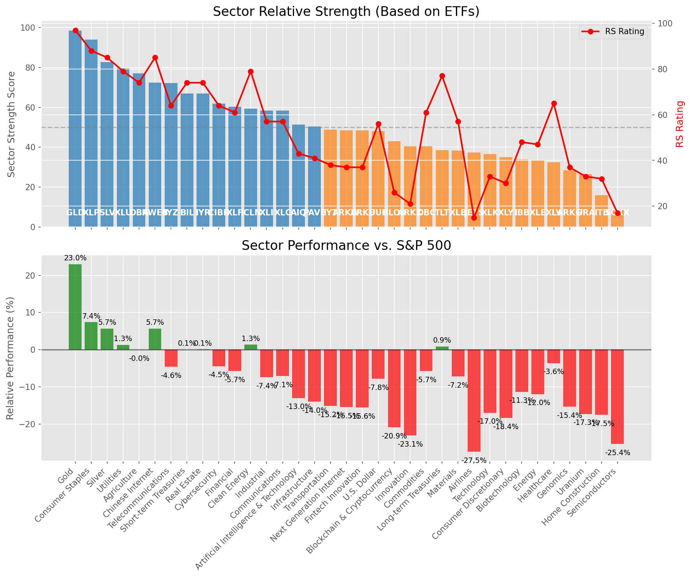

# **Daily Relative Strength Report**

**Date:** 2025-04-17

## **Market Valuation (Buffett Indicator)**

| Metric | Value |
|--------|-------|
| **Market Valuation** | **Undervalued** |
| **Current Ratio** | 8.71 |
| **Historical Mean** | 9.63 |
| **Standard Deviation** | 0.48 |
| **Z-Score (StdDev from Mean)** | -1.99 |
| **Total Market Cap** | $258.79 trillion |
| **GDP** | $29.72 trillion |

## **Market Insights**

### **Market is Undervalued**

The market is trading below historical average valuations, suggesting potential opportunity. These conditions have historically preceded periods of above-average returns. Investors should:

- Look for stocks breaking out of consolidation patterns on increasing volume
- Focus on sectors showing relative strength
- Consider increasing equity exposure, particularly in quality names
- Be mindful of overall market direction and avoid fighting the trend

History suggests patient investors are often rewarded when investing during periods of undervaluation.

### **Buffett Indicator Overview**

The Buffett Indicator (Total Market Cap / GDP) is a measure of the stock market's valuation relative to the size of the economy. It is named after Warren Buffett, who described it as "probably the best single measure of where valuations stand at any given moment."

- **Values above +2 standard deviations:** Market significantly overvalued
- **Values above +1 standard deviation:** Market overvalued
- **Values between -1 and +1 standard deviations:** Market fairly valued
- **Values below -1 standard deviation:** Market undervalued
- **Values below -2 standard deviations:** Market significantly undervalued

---

## **Sector Relative Strength**

Based on William O'Neil's Relative Strength Methodology

| ETF | Strength | RS Rating | Performance | Above Key MAs | Trend | Sector |
|-----|----------|-----------|-------------|--------------|-------|--------|
| [GLD](https://www.tradingview.com/chart/?symbol=GLD) | 98.5 | 97.0 | 22.66% | 10d ✓, 50d ✓, 200d ✓ | ↗️ | Gold |
| [XLP](https://www.tradingview.com/chart/?symbol=XLP) | 93.0 | 86.0 | 6.66% | 10d ✓, 50d ✓, 200d ✓ | ↗️ | Consumer Staples |
| [XLU](https://www.tradingview.com/chart/?symbol=XLU) | 89.5 | 79.0 | 1.86% | 10d ✓, 50d ✓, 200d ✓ | ↗️ | Utilities |
| [SLV](https://www.tradingview.com/chart/?symbol=SLV) | 82.6 | 85.0 | 5.54% | 10d ✓, 50d ✗, 200d ✓ | ↗️ | Silver |
| [DBA](https://www.tradingview.com/chart/?symbol=DBA) | 76.1 | 72.0 | -0.86% | 10d ✓, 50d ✗, 200d ✓ | ↗️ | Agriculture |
| [KWEB](https://www.tradingview.com/chart/?symbol=KWEB) | 73.4 | 87.0 | 6.89% | 10d ✓, 50d ✗, 200d ✗ | ↗️ | Chinese Internet |
| [CIBR](https://www.tradingview.com/chart/?symbol=CIBR) | 72.6 | 65.0 | -4.25% | 10d ✓, 50d ✗, 200d ✓ | ↗️ | Cybersecurity |
| [IYR](https://www.tradingview.com/chart/?symbol=IYR) | 67.4 | 75.0 | 0.19% | 10d ✓, 50d ✗, 200d ✗ | ↗️ | Real Estate |
| [BIL](https://www.tradingview.com/chart/?symbol=BIL) | 67.0 | 74.0 | 0.05% | 10d ✓, 50d ✓, 200d ✓ | ↘️ | Short-term Treasuries |
| [IYZ](https://www.tradingview.com/chart/?symbol=IYZ) | 62.4 | 65.0 | -4.19% | 10d ✓, 50d ✗, 200d ✗ | ↗️ | Telecommunications |
| [XLF](https://www.tradingview.com/chart/?symbol=XLF) | 60.9 | 62.0 | -5.50% | 10d ✓, 50d ✗, 200d ✗ | ↗️ | Financial |
| [XLI](https://www.tradingview.com/chart/?symbol=XLI) | 58.4 | 57.0 | -7.37% | 10d ✓, 50d ✗, 200d ✗ | ↗️ | Industrial |
| [XLC](https://www.tradingview.com/chart/?symbol=XLC) | 58.4 | 57.0 | -7.08% | 10d ✓, 50d ✗, 200d ✗ | ↗️ | Communications |
| [ICLN](https://www.tradingview.com/chart/?symbol=ICLN) | 57.3 | 75.0 | 0.40% | 10d ✓, 50d ✓, 200d ✗ | ↘️ | Clean Energy |
| [AIQ](https://www.tradingview.com/chart/?symbol=AIQ) | 53.9 | 48.0 | -11.02% | 10d ✓, 50d ✗, 200d ✗ | ↗️ | Artificial Intelligence & Technology |
| [ARKF](https://www.tradingview.com/chart/?symbol=ARKF) | 50.9 | 42.0 | -13.22% | 10d ✓, 50d ✗, 200d ✗ | ↗️ | Fintech Innovation |
| [PAVE](https://www.tradingview.com/chart/?symbol=PAVE) | 49.9 | 40.0 | -14.09% | 10d ✓, 50d ✗, 200d ✗ | ↗️ | Infrastructure |
| [UUP](https://www.tradingview.com/chart/?symbol=UUP) | 48.0 | 56.0 | -7.77% | 10d ✗, 50d ✗, 200d ✗ | ↗️ | U.S. Dollar |
| [XLK](https://www.tradingview.com/chart/?symbol=XLK) | 46.9 | 34.0 | -16.64% | 10d ✓, 50d ✗, 200d ✗ | ↗️ | Technology |
| [ARKW](https://www.tradingview.com/chart/?symbol=ARKW) | 46.9 | 34.0 | -16.64% | 10d ✓, 50d ✗, 200d ✗ | ↗️ | Next Generation Internet |
| [ARKK](https://www.tradingview.com/chart/?symbol=ARKK) | 40.4 | 21.0 | -23.20% | 10d ✓, 50d ✗, 200d ✗ | ↗️ | Innovation |
| [DBC](https://www.tradingview.com/chart/?symbol=DBC) | 39.9 | 60.0 | -6.10% | 10d ✓, 50d ✗, 200d ✗ | ↘️ | Commodities |
| [XLB](https://www.tradingview.com/chart/?symbol=XLB) | 38.9 | 58.0 | -7.07% | 10d ✓, 50d ✗, 200d ✗ | ↘️ | Materials |
| [TLT](https://www.tradingview.com/chart/?symbol=TLT) | 38.5 | 77.0 | 1.34% | 10d ✗, 50d ✗, 200d ✗ | ↘️ | Long-term Treasuries |
| [IYT](https://www.tradingview.com/chart/?symbol=IYT) | 37.5 | 35.0 | -16.02% | 10d ✗, 50d ✗, 200d ✗ | ↗️ | Transportation |
| [JETS](https://www.tradingview.com/chart/?symbol=JETS) | 37.4 | 15.0 | -27.56% | 10d ✓, 50d ✗, 200d ✗ | ↗️ | Airlines |
| [XLY](https://www.tradingview.com/chart/?symbol=XLY) | 35.0 | 30.0 | -18.58% | 10d ✗, 50d ✗, 200d ✗ | ↗️ | Consumer Discretionary |
| [XLV](https://www.tradingview.com/chart/?symbol=XLV) | 33.0 | 66.0 | -3.51% | 10d ✗, 50d ✗, 200d ✗ | ↘️ | Healthcare |
| [IBB](https://www.tradingview.com/chart/?symbol=IBB) | 32.9 | 46.0 | -11.71% | 10d ✓, 50d ✗, 200d ✗ | ↘️ | Biotechnology |
| [XLE](https://www.tradingview.com/chart/?symbol=XLE) | 32.9 | 46.0 | -11.76% | 10d ✓, 50d ✗, 200d ✗ | ↘️ | Energy |
| [ARKG](https://www.tradingview.com/chart/?symbol=ARKG) | 27.9 | 36.0 | -15.76% | 10d ✓, 50d ✗, 200d ✗ | ↘️ | Genomics |
| [URA](https://www.tradingview.com/chart/?symbol=URA) | 26.9 | 34.0 | -16.67% | 10d ✓, 50d ✗, 200d ✗ | ↘️ | Uranium |
| [ITB](https://www.tradingview.com/chart/?symbol=ITB) | 15.0 | 30.0 | -18.17% | 10d ✗, 50d ✗, 200d ✗ | ↘️ | Home Construction |
| [SOXX](https://www.tradingview.com/chart/?symbol=SOXX) | 9.0 | 18.0 | -25.18% | 10d ✗, 50d ✗, 200d ✗ | ↘️ | Semiconductors |
| [BLOK](https://www.tradingview.com/chart/?symbol=BLOK) | 0.0 | 0.0 | 0.00% | 10d ✗, 50d ✗, 200d ✗ | ↘️ | Blockchain & Cryptocurrency |

### **Sector ETF Performance Interpretation**

This table shows the relative strength metrics for different market sectors based on their representative ETFs:

- **ETF**: The ETF used to measure sector performance (click for chart)
- **Strength**: Overall sector strength score (0-100) combining multiple factors
- **RS Rating**: O'Neil RS rating of the sector ETF
- **Performance**: Performance of the sector ETF relative to SPY
- **Above Key MAs**: Whether the ETF is trading above its 10, 50, and 200-day moving averages
- **Trend**: Whether the sector is in an uptrend (↗️) or downtrend (↘️)

### **Current Sector Leadership**

The current market leadership is coming from the following sectors: **Gold, Consumer Staples, Utilities**.

The **Gold** sector (represented by **GLD**) is showing particularly strong relative strength with an RS rating of 97.0 and performance of 22.66% vs. the S&P 500. This sector is trading above its 10-day, 50-day, 200-day moving average(s). Investors should consider focusing on high RS stocks within these leading sectors for potential outperformance.

---

## **Buy Recommendations**

The following 79 stocks show exceptional relative strength:

| RS Rating | Buy Score | Current Price | Chart | Name | Ticker |
|-----------|-----------|---------------|-------|------|--------|
| 100 | 100 | $142.34 | [Chart](https://www.tradingview.com/chart/?symbol=UGL) | ProShares Ultra Gold | UGL |
| 100 | 100 | $121.12 | [Chart](https://www.tradingview.com/chart/?symbol=AEM) | Agnico Eagle Mines Ltd. | AEM |
| 100 | 100 | $83.83 | [Chart](https://www.tradingview.com/chart/?symbol=WPM) | Wheaton Precious Metals Corp. Common Stock | WPM |
| 100 | 100 | $29.97 | [Chart](https://www.tradingview.com/chart/?symbol=AGI) | Alamos Gold Inc. Class A Common Shares | AGI |
| 99 | 100 | $163.05 | [Chart](https://www.tradingview.com/chart/?symbol=PM) | Philip Morris International Inc. | PM |
| 99 | 100 | $186.45 | [Chart](https://www.tradingview.com/chart/?symbol=RGLD) | Royal Gold Inc | RGLD |
| 99 | 100 | $18.49 | [Chart](https://www.tradingview.com/chart/?symbol=SWI) | SolarWinds Corporation Common Stock | SWI |
| 99 | 100 | $27.09 | [Chart](https://www.tradingview.com/chart/?symbol=MP) | MP Materials Corp. | MP |
| 99 | 100 | $150.44 | [Chart](https://www.tradingview.com/chart/?symbol=PLMR) | Palomar Holdings, Inc. Common stock | PLMR |
| 99 | 100 | $94.02 | [Chart](https://www.tradingview.com/chart/?symbol=PLTR) | Palantir Technologies Inc. Class A Common Stock | PLTR |
| 99 | 100 | $15.95 | [Chart](https://www.tradingview.com/chart/?symbol=EZPW) | Ezcorp Inc | EZPW |
| 98 | 100 | $31.44 | [Chart](https://www.tradingview.com/chart/?symbol=LTH) | Life Time Group Holdings, Inc. | LTH |
| 98 | 100 | $23.55 | [Chart](https://www.tradingview.com/chart/?symbol=DB) | Deutsche Bank Aktiengesellschaft | DB |
| 98 | 100 | $47.47 | [Chart](https://www.tradingview.com/chart/?symbol=EXC) | Exelon Corporation | EXC |
| 98 | 100 | $27.39 | [Chart](https://www.tradingview.com/chart/?symbol=T) | AT&T Inc. | T |
| 98 | 100 | $23.53 | [Chart](https://www.tradingview.com/chart/?symbol=OR) | Osisko Gold Royalties Ltd | OR |
| 97 | 100 | $264.01 | [Chart](https://www.tradingview.com/chart/?symbol=TMUS) | T-Mobile US, Inc. | TMUS |
| 97 | 100 | $78.73 | [Chart](https://www.tradingview.com/chart/?symbol=NFG) | National Fuel Gas Co. | NFG |
| 97 | 100 | $33.02 | [Chart](https://www.tradingview.com/chart/?symbol=IAUM) | iShares Gold Trust Micro | IAUM |
| 97 | 100 | $305.28 | [Chart](https://www.tradingview.com/chart/?symbol=GLD) | SPDR Gold Trust, SPDR Gold Shares | GLD |
| 97 | 100 | $25.39 | [Chart](https://www.tradingview.com/chart/?symbol=PHYS) | Sprott Physical Gold Trust | PHYS |
| 96 | 100 | $28.55 | [Chart](https://www.tradingview.com/chart/?symbol=EUFN) | iShares MSCI Europe Financials ETF | EUFN |
| 96 | 100 | $24.16 | [Chart](https://www.tradingview.com/chart/?symbol=SONY) | Sony Group Corporation American Depositary Shares (Each Representing One Share of Dollar Validated Common Stock) | SONY |
| 96 | 100 | $70.26 | [Chart](https://www.tradingview.com/chart/?symbol=KR) | The Kroger Co. | KR |
| 96 | 100 | $89.11 | [Chart](https://www.tradingview.com/chart/?symbol=CCEP) | Coca-Cola Europacific Partners plc Ordinary Shares | CCEP |
| 96 | 100 | $44.45 | [Chart](https://www.tradingview.com/chart/?symbol=GH) | Guardant Health, Inc. Common Stock | GH |
| 96 | 100 | $23.68 | [Chart](https://www.tradingview.com/chart/?symbol=SRAD) | Sportradar Group AG Class A Ordinary Shares | SRAD |
| 95 | 100 | $37.28 | [Chart](https://www.tradingview.com/chart/?symbol=CNP) | CenterPoint Energy, Inc. | CNP |
| 95 | 100 | $53.34 | [Chart](https://www.tradingview.com/chart/?symbol=PPC) | Pilgrims Pride Corporation | PPC |
| 95 | 100 | $68.12 | [Chart](https://www.tradingview.com/chart/?symbol=VTR) | Ventas, Inc. | VTR |
| 95 | 100 | $29.29 | [Chart](https://www.tradingview.com/chart/?symbol=CEF) | Sprott Physical Gold and Silver Trust | CEF |
| 95 | 100 | $42.10 | [Chart](https://www.tradingview.com/chart/?symbol=BTI) | British American Tobacco p.l.c. American Depositary Shares, American Depositary Shares, each representing one Ordinary Share | BTI |
| 95 | 100 | $79.26 | [Chart](https://www.tradingview.com/chart/?symbol=SNEX) | StoneX Group Inc. Common Stock | SNEX |
| 95 | 100 | $243.61 | [Chart](https://www.tradingview.com/chart/?symbol=RSG) | Republic Services Inc. | RSG |
| 94 | 100 | $263.82 | [Chart](https://www.tradingview.com/chart/?symbol=CME) | CME Group Inc. | CME |
| 94 | 100 | $457.33 | [Chart](https://www.tradingview.com/chart/?symbol=CASY) | Casey's General Stores Inc | CASY |
| 94 | 100 | $77.52 | [Chart](https://www.tradingview.com/chart/?symbol=SR) | Spire Inc. | SR |
| 93 | 100 | $95.88 | [Chart](https://www.tradingview.com/chart/?symbol=PNW) | Pinnacle West Capital Corporation | PNW |
| 93 | 100 | $117.80 | [Chart](https://www.tradingview.com/chart/?symbol=BRO) | Brown & Brown, Inc. | BRO |
| 93 | 100 | $970.06 | [Chart](https://www.tradingview.com/chart/?symbol=NFLX) | NetFlix Inc | NFLX |
| 93 | 100 | $108.42 | [Chart](https://www.tradingview.com/chart/?symbol=AEP) | American Electric Power Company, Inc. | AEP |
| 93 | 100 | $37.45 | [Chart](https://www.tradingview.com/chart/?symbol=EWG) | iShares MSCI Germany ETF | EWG |
| 93 | 100 | $58.22 | [Chart](https://www.tradingview.com/chart/?symbol=MO) | Altria Group, Inc. | MO |
| 93 | 100 | $519.35 | [Chart](https://www.tradingview.com/chart/?symbol=BRK.B) | BERKSHIRE HATHAWAY Class B | BRK.B |
| 93 | 100 | $18.92 | [Chart](https://www.tradingview.com/chart/?symbol=GRND) | Grindr Inc. | GRND |
| 92 | 100 | $196.57 | [Chart](https://www.tradingview.com/chart/?symbol=WCN) | Waste Connections, Inc. | WCN |
| 92 | 100 | $134.40 | [Chart](https://www.tradingview.com/chart/?symbol=DTE) | DTE Energy Company | DTE |
| 92 | 100 | $35.85 | [Chart](https://www.tradingview.com/chart/?symbol=PPL) | PPL Corporation | PPL |
| 92 | 100 | $106.70 | [Chart](https://www.tradingview.com/chart/?symbol=ATGE) | Adtalem Global Education Inc. Common Shares | ATGE |
| 92 | 100 | $217.97 | [Chart](https://www.tradingview.com/chart/?symbol=CBOE) | Cboe Global Markets, Inc. | CBOE |
| 92 | 100 | $16.36 | [Chart](https://www.tradingview.com/chart/?symbol=SPNT) | SiriusPoint Ltd. | SPNT |
| 91 | 100 | $156.31 | [Chart](https://www.tradingview.com/chart/?symbol=ATO) | Atmos Energy Corporation | ATO |
| 91 | 100 | $68.57 | [Chart](https://www.tradingview.com/chart/?symbol=EVRG) | Evergy, Inc. | EVRG |
| 91 | 100 | $103.00 | [Chart](https://www.tradingview.com/chart/?symbol=EHC) | Encompass Health Corporation Common Stock | EHC |
| 91 | 100 | $52.12 | [Chart](https://www.tradingview.com/chart/?symbol=RELX) | RELX PLC | RELX |
| 91 | 100 | $47.71 | [Chart](https://www.tradingview.com/chart/?symbol=MRCY) | Mercury Systems Inc. | MRCY |
| 91 | 100 | $178.67 | [Chart](https://www.tradingview.com/chart/?symbol=LOPE) | Grand Canyon Education, Inc | LOPE |
| 90 | 100 | $277.79 | [Chart](https://www.tradingview.com/chart/?symbol=PEN) | Penumbra, Inc. | PEN |
| 90 | 100 | $77.96 | [Chart](https://www.tradingview.com/chart/?symbol=ADC) | Agree Realty Corporation | ADC |
| 90 | 100 | $44.70 | [Chart](https://www.tradingview.com/chart/?symbol=OGE) | OGE Energy Corp. | OGE |
| 90 | 100 | $117.98 | [Chart](https://www.tradingview.com/chart/?symbol=IDA) | IDACORP, Inc. | IDA |
| 90 | 100 | $76.92 | [Chart](https://www.tradingview.com/chart/?symbol=OGS) | ONE GAS, INC. | OGS |
| 90 | 100 | $18.04 | [Chart](https://www.tradingview.com/chart/?symbol=KT) | KT Corp. | KT |
| 90 | 100 | $30.68 | [Chart](https://www.tradingview.com/chart/?symbol=AHR) | American Healthcare REIT, Inc. | AHR |
| 90 | 100 | $42.74 | [Chart](https://www.tradingview.com/chart/?symbol=SEZL) | Sezzle Inc. Common Stock | SEZL |
| 89 | 100 | $99.14 | [Chart](https://www.tradingview.com/chart/?symbol=AEE) | Ameren Corporation | AEE |
| 88 | 100 | $39.78 | [Chart](https://www.tradingview.com/chart/?symbol=NI) | NiSource Inc. | NI |
| 89 | 98 | $81.19 | [Chart](https://www.tradingview.com/chart/?symbol=FAST) | Fastenal Co | FAST |
| 88 | 98 | $49.70 | [Chart](https://www.tradingview.com/chart/?symbol=NJR) | New Jersey Resources Corp | NJR |
| 86 | 98 | $982.36 | [Chart](https://www.tradingview.com/chart/?symbol=COST) | Costco Wholesale Corp | COST |
| 86 | 97 | $117.96 | [Chart](https://www.tradingview.com/chart/?symbol=CWST) | Casella Waste Systems Inc | CWST |
| 86 | 97 | $255.51 | [Chart](https://www.tradingview.com/chart/?symbol=TRV) | The Travelers Companies, Inc. | TRV |
| 85 | 96 | $49.43 | [Chart](https://www.tradingview.com/chart/?symbol=TRP) | TC Energy Corporation | TRP |
| 83 | 95 | $35.91 | [Chart](https://www.tradingview.com/chart/?symbol=DRS) | Leonardo DRS, Inc. Common Stock | DRS |
| 85 | 94 | $123.65 | [Chart](https://www.tradingview.com/chart/?symbol=BECN) | Beacon Roofing Supply, Inc. | BECN |
| 81 | 94 | $59.48 | [Chart](https://www.tradingview.com/chart/?symbol=WMB) | Williams Companies Inc. | WMB |
| 83 | 93 | $54.84 | [Chart](https://www.tradingview.com/chart/?symbol=IGF) | iShares Global Infrastructure ETF | IGF |
| 82 | 92 | $108.36 | [Chart](https://www.tradingview.com/chart/?symbol=AFL) | Aflac Inc. | AFL |
| 80 | 92 | $134.52 | [Chart](https://www.tradingview.com/chart/?symbol=TW) | Tradeweb Markets Inc. Class A Common Stock | TW |

---

## **Sell Recommendations**

The following 185 stocks show deteriorating relative strength:

| RS Rating | Sell Score | Current Price | Chart | Name | Ticker |
|-----------|------------|---------------|-------|------|--------|
| 1 | 100 | $10.64 | [Chart](https://www.tradingview.com/chart/?symbol=XNCR) | Xencor, Inc. | XNCR |
| 2 | 100 | $43.81 | [Chart](https://www.tradingview.com/chart/?symbol=TECL) | Direxion Daily Technology Bull 3x Shares | TECL |
| 2 | 100 | $14.98 | [Chart](https://www.tradingview.com/chart/?symbol=SSTK) | SHUTTERSTOCK, INC. | SSTK |
| 2 | 100 | $20.51 | [Chart](https://www.tradingview.com/chart/?symbol=DJT) | Trump Media & Technology Group Corp. Common Stock | DJT |
| 2 | 100 | $17.26 | [Chart](https://www.tradingview.com/chart/?symbol=TNDM) | Tandem Diabetes Care, Inc. | TNDM |
| 3 | 100 | $46.08 | [Chart](https://www.tradingview.com/chart/?symbol=LABU) | Direxion Daily S&P Biotech Bull 3X Shares | LABU |
| 3 | 100 | $22.98 | [Chart](https://www.tradingview.com/chart/?symbol=SM) | SM Energy Company | SM |
| 3 | 100 | $35.71 | [Chart](https://www.tradingview.com/chart/?symbol=WDC) | Western Digital Corp. | WDC |
| 3 | 100 | $10.40 | [Chart](https://www.tradingview.com/chart/?symbol=BCYC) | Bicycle Therapeutics plc American Depositary Shares | BCYC |
| 4 | 100 | $17.40 | [Chart](https://www.tradingview.com/chart/?symbol=DAVA) | Endava plc American Depositary Shares (each representing one Class A Ordinary Share) | DAVA |
| 4 | 100 | $53.02 | [Chart](https://www.tradingview.com/chart/?symbol=ALB) | Albemarle Corporation | ALB |
| 4 | 100 | $23.81 | [Chart](https://www.tradingview.com/chart/?symbol=NOG) | Northern Oil and Gas, Inc. | NOG |
| 5 | 100 | $33.76 | [Chart](https://www.tradingview.com/chart/?symbol=TDW) | Tidewater, Inc. | TDW |
| 5 | 100 | $58.61 | [Chart](https://www.tradingview.com/chart/?symbol=ARCB) | ArcBest Corporation | ARCB |
| 5 | 100 | $24.98 | [Chart](https://www.tradingview.com/chart/?symbol=W) | Wayfair Inc. | W |
| 5 | 100 | $22.33 | [Chart](https://www.tradingview.com/chart/?symbol=FIVN) | FIVE9, INC. | FIVN |
| 5 | 100 | $25.93 | [Chart](https://www.tradingview.com/chart/?symbol=FORM) | FormFactor Inc. | FORM |
| 6 | 100 | $56.23 | [Chart](https://www.tradingview.com/chart/?symbol=SWKS) | Skyworks Solutions Inc | SWKS |
| 6 | 100 | $10.30 | [Chart](https://www.tradingview.com/chart/?symbol=ARCT) | Arcturus Therapeutics Holdings Inc. Common Stock | ARCT |
| 6 | 100 | $25.86 | [Chart](https://www.tradingview.com/chart/?symbol=XPEL) | XPEL, Inc. Common Stock | XPEL |
| 7 | 100 | $12.77 | [Chart](https://www.tradingview.com/chart/?symbol=DK) | Delek US Holdings, Inc. | DK |
| 7 | 100 | $15.97 | [Chart](https://www.tradingview.com/chart/?symbol=APA) | APA Corporation Common Stock | APA |
| 7 | 100 | $20.39 | [Chart](https://www.tradingview.com/chart/?symbol=HI) | Hillenbrand, Inc. | HI |
| 7 | 100 | $19.70 | [Chart](https://www.tradingview.com/chart/?symbol=CECO) | Ceco Environmental Corp | CECO |
| 7 | 100 | $54.15 | [Chart](https://www.tradingview.com/chart/?symbol=LGIH) | LGI Homes, Inc. | LGIH |
| 7 | 100 | $19.36 | [Chart](https://www.tradingview.com/chart/?symbol=SPT) | Sprout Social, Inc Class A Common Stock | SPT |
| 8 | 100 | $12.05 | [Chart](https://www.tradingview.com/chart/?symbol=GCT) | GigaCloud Technology Inc Class A Ordinary Shares | GCT |
| 8 | 100 | $44.62 | [Chart](https://www.tradingview.com/chart/?symbol=ACLS) | Axcelis Technologies Inc | ACLS |
| 10 | 100 | $12.23 | [Chart](https://www.tradingview.com/chart/?symbol=MARA) | MARA Holdings, Inc. Common Stock | MARA |
| 10 | 100 | $11.54 | [Chart](https://www.tradingview.com/chart/?symbol=AEYE) | AudioEye, Inc. Common Stock | AEYE |
| 11 | 100 | $19.05 | [Chart](https://www.tradingview.com/chart/?symbol=FOXF) | Fox Factory Holding Corp. Common Stock | FOXF |
| 11 | 100 | $27.24 | [Chart](https://www.tradingview.com/chart/?symbol=SRDX) | Surmodics, Inc. Common Stock | SRDX |
| 12 | 100 | $19.17 | [Chart](https://www.tradingview.com/chart/?symbol=ST) | Sensata Technologies Holding plc | ST |
| 13 | 100 | $12.72 | [Chart](https://www.tradingview.com/chart/?symbol=XRAY) | DENTSPLY SIRONA Inc. | XRAY |
| 15 | 100 | $53.44 | [Chart](https://www.tradingview.com/chart/?symbol=EL) | The Estee Lauder Companies Inc. Class A | EL |
| 4 | 99 | $18.86 | [Chart](https://www.tradingview.com/chart/?symbol=SG) | Sweetgreen, Inc. | SG |
| 9 | 99 | $18.16 | [Chart](https://www.tradingview.com/chart/?symbol=APLS) | Apellis Pharmaceuticals, Inc. Common Stock | APLS |
| 10 | 99 | $17.94 | [Chart](https://www.tradingview.com/chart/?symbol=BZH) | Beazer Homes USA, Inc. New | BZH |
| 12 | 99 | $21.69 | [Chart](https://www.tradingview.com/chart/?symbol=UCO) | ProShares Ultra Bloomberg Crude Oil | UCO |
| 15 | 99 | $15.75 | [Chart](https://www.tradingview.com/chart/?symbol=IART) | Integra LifeSciences Holdings | IART |
| 9 | 98 | $45.85 | [Chart](https://www.tradingview.com/chart/?symbol=RHI) | Robert Half Inc. | RHI |
| 11 | 98 | $28.09 | [Chart](https://www.tradingview.com/chart/?symbol=UWM) | ProShares Ultra Russell2000 | UWM |
| 12 | 98 | $110.65 | [Chart](https://www.tradingview.com/chart/?symbol=GNRC) | GENERAC HOLDINGS INC | GNRC |
| 14 | 98 | $29.86 | [Chart](https://www.tradingview.com/chart/?symbol=TTEK) | Tetra Tech Inc | TTEK |
| 14 | 98 | $11.75 | [Chart](https://www.tradingview.com/chart/?symbol=ASPN) | Aspen Aerogels, Inc. | ASPN |
| 16 | 98 | $88.08 | [Chart](https://www.tradingview.com/chart/?symbol=AMD) | Advanced Micro Devices | AMD |
| 17 | 98 | $35.07 | [Chart](https://www.tradingview.com/chart/?symbol=LIVN) | LivaNova PLC Ordinary Shares | LIVN |
| 3 | 97 | $22.24 | [Chart](https://www.tradingview.com/chart/?symbol=TNA) | Direxion Daily Small Cap Bull 3x Shares | TNA |
| 3 | 97 | $71.73 | [Chart](https://www.tradingview.com/chart/?symbol=ILMN) | Illumina Inc | ILMN |
| 6 | 97 | $21.24 | [Chart](https://www.tradingview.com/chart/?symbol=VERA) | Vera Therapeutics, Inc. Class A Common Stock | VERA |
| 9 | 97 | $48.59 | [Chart](https://www.tradingview.com/chart/?symbol=TECH) | Bio-Techne Corp. | TECH |
| 9 | 97 | $23.32 | [Chart](https://www.tradingview.com/chart/?symbol=WSC) | WillScot Holdings Corporation Class A Common Stock | WSC |
| 9 | 97 | $70.52 | [Chart](https://www.tradingview.com/chart/?symbol=GPN) | Global Payments, Inc. | GPN |
| 10 | 97 | $125.47 | [Chart](https://www.tradingview.com/chart/?symbol=FSLR) | First Solar, Inc. | FSLR |
| 13 | 97 | $57.74 | [Chart](https://www.tradingview.com/chart/?symbol=ATKR) | Atkore Inc. | ATKR |
| 15 | 97 | $14.54 | [Chart](https://www.tradingview.com/chart/?symbol=PBW) | Invesco WilderHill Clean Energy ETF | PBW |
| 17 | 97 | $44.19 | [Chart](https://www.tradingview.com/chart/?symbol=EDU) | New Oriental Education and Technology Group, Inc. American Depositary Shares (each representing ten (10) Common Shares) | EDU |
| 12 | 96 | $57.32 | [Chart](https://www.tradingview.com/chart/?symbol=SWK) | Stanley Black & Decker, Inc. | SWK |
| 12 | 96 | $10.39 | [Chart](https://www.tradingview.com/chart/?symbol=TXG) | 10x Genomics, Inc. Class A Common Stock | TXG |
| 14 | 96 | $49.62 | [Chart](https://www.tradingview.com/chart/?symbol=NVT) | nVent Electric plc Ordinary Shares | NVT |
| 6 | 95 | $23.61 | [Chart](https://www.tradingview.com/chart/?symbol=AA) | Alcoa Corporation | AA |
| 8 | 95 | $41.16 | [Chart](https://www.tradingview.com/chart/?symbol=PSTG) | Pure Storage, Inc. Class A | PSTG |
| 8 | 95 | $29.30 | [Chart](https://www.tradingview.com/chart/?symbol=KLIC) | Kulicke & Soffa Industries Inc | KLIC |
| 9 | 95 | $57.95 | [Chart](https://www.tradingview.com/chart/?symbol=CAMT) | Camtek Ltd | CAMT |
| 10 | 95 | $20.27 | [Chart](https://www.tradingview.com/chart/?symbol=TDC) | TERADATA CORPORATION | TDC |
| 11 | 95 | $100.32 | [Chart](https://www.tradingview.com/chart/?symbol=ARM) | Arm Holdings plc American Depositary Shares | ARM |
| 12 | 95 | $10.89 | [Chart](https://www.tradingview.com/chart/?symbol=OGN) | Organon & Co. | OGN |
| 15 | 95 | $10.31 | [Chart](https://www.tradingview.com/chart/?symbol=VREX) | Varex Imaging Corporation Common Stock | VREX |
| 17 | 95 | $24.88 | [Chart](https://www.tradingview.com/chart/?symbol=CZR) | Caesars Entertainment, Inc. Common Stock | CZR |
| 19 | 95 | $18.33 | [Chart](https://www.tradingview.com/chart/?symbol=BITO) | ProShares Bitcoin ETF | BITO |
| 24 | 95 | $13.82 | [Chart](https://www.tradingview.com/chart/?symbol=FXN) | First Trust Energy AlphaDEX Fund | FXN |
| 24 | 94 | $32.75 | [Chart](https://www.tradingview.com/chart/?symbol=IAC) | IAC Inc. Common Stock | IAC |
| 26 | 94 | $12.15 | [Chart](https://www.tradingview.com/chart/?symbol=MED) | Medifast, Inc. | MED |
| 13 | 93 | $20.37 | [Chart](https://www.tradingview.com/chart/?symbol=UPBD) | Upbound Group, Inc. Common Stock | UPBD |
| 14 | 92 | $51.83 | [Chart](https://www.tradingview.com/chart/?symbol=IPGP) | IPG Photonics Corporation | IPGP |
| 16 | 92 | $45.92 | [Chart](https://www.tradingview.com/chart/?symbol=ERX) | Direxion Daily Energy Bull 2X Shares | ERX |
| 19 | 92 | $19.04 | [Chart](https://www.tradingview.com/chart/?symbol=FOR) | Forestar Group Inc. | FOR |
| 20 | 92 | $31.26 | [Chart](https://www.tradingview.com/chart/?symbol=URNM) | Sprott Uranium Miners ETF | URNM |
| 9 | 91 | $17.27 | [Chart](https://www.tradingview.com/chart/?symbol=OII) | Oceaneering International Inc. | OII |
| 11 | 91 | $33.52 | [Chart](https://www.tradingview.com/chart/?symbol=FLR) | Fluor Corporation | FLR |
| 15 | 91 | $10.77 | [Chart](https://www.tradingview.com/chart/?symbol=SONO) | Sonos, Inc. Common Stock | SONO |
| 20 | 91 | $26.11 | [Chart](https://www.tradingview.com/chart/?symbol=MBUU) | Malibu Boats, Inc. Class A | MBUU |
| 21 | 91 | $111.74 | [Chart](https://www.tradingview.com/chart/?symbol=XOP) | SPDR S&P Oil & Gas Exploration & Production ETF | XOP |
| 24 | 91 | $51.79 | [Chart](https://www.tradingview.com/chart/?symbol=ENPH) | Enphase Energy, Inc. | ENPH |
| 25 | 91 | $10.03 | [Chart](https://www.tradingview.com/chart/?symbol=MTAL) | MAC Copper Limited | MTAL |
| 11 | 90 | $318.50 | [Chart](https://www.tradingview.com/chart/?symbol=SAIA) | Saia, Inc. | SAIA |
| 29 | 90 | $43.30 | [Chart](https://www.tradingview.com/chart/?symbol=ETSY) | Etsy, Inc. | ETSY |
| 11 | 89 | $10.01 | [Chart](https://www.tradingview.com/chart/?symbol=VYX) | NCR Voyix Corporation | VYX |
| 13 | 89 | $10.40 | [Chart](https://www.tradingview.com/chart/?symbol=NEOG) | Neogen Corp | NEOG |
| 16 | 89 | $16.07 | [Chart](https://www.tradingview.com/chart/?symbol=ELVN) | Enliven Therapeutics, Inc. Common Stock | ELVN |
| 19 | 89 | $25.87 | [Chart](https://www.tradingview.com/chart/?symbol=SEE) | Sealed Air Corp. | SEE |
| 21 | 89 | $39.21 | [Chart](https://www.tradingview.com/chart/?symbol=FEPI) | REX FANG & Innovation Equity Premium Income ETF | FEPI |
| 15 | 88 | $51.12 | [Chart](https://www.tradingview.com/chart/?symbol=SMG) | The Scotts Miracle-Gro Company | SMG |
| 18 | 88 | $27.68 | [Chart](https://www.tradingview.com/chart/?symbol=YETI) | YETI Holdings, Inc. Common Stock | YETI |
| 19 | 88 | $34.09 | [Chart](https://www.tradingview.com/chart/?symbol=CALF) | Pacer US Small Cap Cash Cows ETF | CALF |
| 23 | 88 | $12.04 | [Chart](https://www.tradingview.com/chart/?symbol=OSCR) | Oscar Health, Inc. | OSCR |
| 26 | 88 | $11.98 | [Chart](https://www.tradingview.com/chart/?symbol=CVE) | Cenovus Energy Inc. | CVE |
| 16 | 87 | $32.42 | [Chart](https://www.tradingview.com/chart/?symbol=LVS) | Las Vegas Sands Corp. | LVS |
| 18 | 87 | $92.69 | [Chart](https://www.tradingview.com/chart/?symbol=BCC) | Boise Cascade Company | BCC |
| 15 | 86 | $40.92 | [Chart](https://www.tradingview.com/chart/?symbol=LSCC) | Lattice Semiconductor Corp | LSCC |
| 16 | 86 | $14.64 | [Chart](https://www.tradingview.com/chart/?symbol=DXC) | DXC Technology Company | DXC |
| 16 | 86 | $10.24 | [Chart](https://www.tradingview.com/chart/?symbol=EXPI) | eXp World Holdings, Inc. Common Stock | EXPI |
| 20 | 86 | $27.36 | [Chart](https://www.tradingview.com/chart/?symbol=WERN) | Werner Enterprises Inc | WERN |
| 25 | 86 | $39.84 | [Chart](https://www.tradingview.com/chart/?symbol=SIMO) | Silicon Motion Technology Corporation | SIMO |
| 26 | 86 | $72.07 | [Chart](https://www.tradingview.com/chart/?symbol=IR) | Ingersoll Rand Inc. Common Stock | IR |
| 17 | 85 | $62.03 | [Chart](https://www.tradingview.com/chart/?symbol=GEHC) | GE HealthCare Technologies Inc. Common Stock | GEHC |
| 22 | 85 | $31.07 | [Chart](https://www.tradingview.com/chart/?symbol=NGVT) | Ingevity Corporation | NGVT |
| 22 | 85 | $143.98 | [Chart](https://www.tradingview.com/chart/?symbol=PTC) | PTC, INC | PTC |
| 23 | 85 | $52.11 | [Chart](https://www.tradingview.com/chart/?symbol=HXL) | Hexcel Corporation | HXL |
| 24 | 85 | $11.72 | [Chart](https://www.tradingview.com/chart/?symbol=OEC) | Orion S.A. | OEC |
| 26 | 85 | $217.83 | [Chart](https://www.tradingview.com/chart/?symbol=WING) | Wingstop Inc | WING |
| 19 | 84 | $10.15 | [Chart](https://www.tradingview.com/chart/?symbol=HLIT) | Harmonic Inc | HLIT |
| 23 | 84 | $56.82 | [Chart](https://www.tradingview.com/chart/?symbol=QRVO) | Qorvo, Inc. | QRVO |
| 24 | 84 | $63.99 | [Chart](https://www.tradingview.com/chart/?symbol=AIN) | Albany International Corp Class A | AIN |
| 26 | 84 | $32.15 | [Chart](https://www.tradingview.com/chart/?symbol=MGA) | Magna International | MGA |
| 19 | 83 | $52.76 | [Chart](https://www.tradingview.com/chart/?symbol=AIR) | AAR Corp. | AIR |
| 25 | 83 | $168.47 | [Chart](https://www.tradingview.com/chart/?symbol=NXPI) | NXP Semiconductors N.V. | NXPI |
| 27 | 83 | $149.85 | [Chart](https://www.tradingview.com/chart/?symbol=CDW) | CDW Corporation | CDW |
| 32 | 83 | $25.24 | [Chart](https://www.tradingview.com/chart/?symbol=PINS) | Pinterest, Inc. Class A Common Stock | PINS |
| 24 | 82 | $56.90 | [Chart](https://www.tradingview.com/chart/?symbol=BOIL) | ProShares Ultra Bloomberg Natural Gas | BOIL |
| 24 | 82 | $100.99 | [Chart](https://www.tradingview.com/chart/?symbol=CHDN) | Churchill Downs Inc | CHDN |
| 33 | 82 | $77.51 | [Chart](https://www.tradingview.com/chart/?symbol=LEA) | Lear Corporation | LEA |
| 23 | 81 | $104.14 | [Chart](https://www.tradingview.com/chart/?symbol=MHO) | M/I Homes, Inc. | MHO |
| 24 | 81 | $42.97 | [Chart](https://www.tradingview.com/chart/?symbol=PRKS) | United Parks & Resorts Inc. | PRKS |
| 26 | 81 | $109.78 | [Chart](https://www.tradingview.com/chart/?symbol=VLO) | Valero Energy Corporation | VLO |
| 28 | 81 | $10.11 | [Chart](https://www.tradingview.com/chart/?symbol=CELC) | Celcuity Inc. Common Stock | CELC |
| 30 | 81 | $26.02 | [Chart](https://www.tradingview.com/chart/?symbol=BWA) | BorgWarner Inc. | BWA |
| 31 | 81 | $10.71 | [Chart](https://www.tradingview.com/chart/?symbol=DBRG) | DigitalBridge Group, Inc. | DBRG |
| 31 | 81 | $27.83 | [Chart](https://www.tradingview.com/chart/?symbol=TAN) | Invesco Solar ETF | TAN |
| 23 | 80 | $267.96 | [Chart](https://www.tradingview.com/chart/?symbol=ETN) | Eaton Corporation, plc Ordinary Shares | ETN |
| 23 | 80 | $12.14 | [Chart](https://www.tradingview.com/chart/?symbol=BAND) | Bandwidth Inc. Class A Common Stock | BAND |
| 26 | 80 | $113.91 | [Chart](https://www.tradingview.com/chart/?symbol=MYRG) | MYR Group, Inc. | MYRG |
| 27 | 80 | $87.37 | [Chart](https://www.tradingview.com/chart/?symbol=PCAR) | Paccar Inc | PCAR |
| 27 | 80 | $64.25 | [Chart](https://www.tradingview.com/chart/?symbol=MTH) | Meritage Homes Corporation | MTH |
| 28 | 80 | $10.96 | [Chart](https://www.tradingview.com/chart/?symbol=ABR) | Arbor Realty Trust, Inc. | ABR |
| 29 | 80 | $45.72 | [Chart](https://www.tradingview.com/chart/?symbol=ATI) | ATI Inc. | ATI |
| 30 | 80 | $79.59 | [Chart](https://www.tradingview.com/chart/?symbol=AGCO) | AGCO Corporation | AGCO |
| 26 | 79 | $60.97 | [Chart](https://www.tradingview.com/chart/?symbol=TKR) | The Timken Company | TKR |
| 30 | 79 | $133.32 | [Chart](https://www.tradingview.com/chart/?symbol=NSIT) | Insight Enterprises Inc | NSIT |
| 30 | 79 | $31.97 | [Chart](https://www.tradingview.com/chart/?symbol=TENB) | Tenable Holdings, Inc. | TENB |
| 32 | 79 | $11.51 | [Chart](https://www.tradingview.com/chart/?symbol=RIVN) | Rivian Automotive, Inc. Class A Common Stock | RIVN |
| 33 | 79 | $10.16 | [Chart](https://www.tradingview.com/chart/?symbol=MAX) | MediaAlpha, Inc. | MAX |
| 34 | 79 | $136.75 | [Chart](https://www.tradingview.com/chart/?symbol=QCOM) | Qualcomm Inc | QCOM |
| 24 | 78 | $29.34 | [Chart](https://www.tradingview.com/chart/?symbol=TPH) | Tri Pointe Homes, Inc. | TPH |
| 24 | 78 | $10.04 | [Chart](https://www.tradingview.com/chart/?symbol=HTLD) | Heartland Express Inc | HTLD |
| 28 | 78 | $20.25 | [Chart](https://www.tradingview.com/chart/?symbol=SYM) | Symbotic Inc. Class A Common Stock | SYM |
| 32 | 78 | $11.07 | [Chart](https://www.tradingview.com/chart/?symbol=NAVI) | Navient Corporation | NAVI |
| 35 | 78 | $127.12 | [Chart](https://www.tradingview.com/chart/?symbol=MPC) | MARATHON PETROLEUM CORPORATION | MPC |
| 24 | 77 | $42.07 | [Chart](https://www.tradingview.com/chart/?symbol=EXAS) | Exact Sciences Corp | EXAS |
| 24 | 77 | $29.20 | [Chart](https://www.tradingview.com/chart/?symbol=CRTO) | Criteo S.A. | CRTO |
| 26 | 77 | $60.38 | [Chart](https://www.tradingview.com/chart/?symbol=DD) | DuPont de Nemours, Inc. Common Stock | DD |
| 30 | 77 | $68.63 | [Chart](https://www.tradingview.com/chart/?symbol=USO) | United States Oil Fund, LP | USO |
| 31 | 77 | $90.00 | [Chart](https://www.tradingview.com/chart/?symbol=XHB) | SPDR S&P Homebuilders ETF | XHB |
| 35 | 77 | $279.29 | [Chart](https://www.tradingview.com/chart/?symbol=BLD) | TopBuild Corp. Common Stock | BLD |
| 27 | 76 | $21.19 | [Chart](https://www.tradingview.com/chart/?symbol=MGY) | Magnolia Oil & Gas Corporation Class A Common Stock | MGY |
| 31 | 76 | $30.30 | [Chart](https://www.tradingview.com/chart/?symbol=DAR) | DARLING INGREDIENTS INC. | DAR |
| 33 | 76 | $41.30 | [Chart](https://www.tradingview.com/chart/?symbol=CCJ) | Cameco Corporation | CCJ |
| 37 | 76 | $13.80 | [Chart](https://www.tradingview.com/chart/?symbol=MANU) | MANCHESTER UNITED PLC | MANU |
| 25 | 75 | $338.78 | [Chart](https://www.tradingview.com/chart/?symbol=HUBB) | Hubbell Incorporated | HUBB |
| 29 | 75 | $151.84 | [Chart](https://www.tradingview.com/chart/?symbol=ODFL) | Old Dominion Freight Line | ODFL |
| 32 | 75 | $33.05 | [Chart](https://www.tradingview.com/chart/?symbol=FCX) | Freeport-McMoran Inc. | FCX |
| 34 | 75 | $99.37 | [Chart](https://www.tradingview.com/chart/?symbol=PSX) | PHILLIPS 66 | PSX |
| 35 | 75 | $65.83 | [Chart](https://www.tradingview.com/chart/?symbol=TXT) | Textron, Inc. | TXT |
| 28 | 74 | $109.99 | [Chart](https://www.tradingview.com/chart/?symbol=SITE) | SiteOne Landscape Supply, Inc. | SITE |
| 29 | 74 | $110.72 | [Chart](https://www.tradingview.com/chart/?symbol=EOG) | EOG Resources, Inc. | EOG |
| 37 | 74 | $51.57 | [Chart](https://www.tradingview.com/chart/?symbol=APTV) | Aptiv PLC | APTV |
| 38 | 74 | $50.30 | [Chart](https://www.tradingview.com/chart/?symbol=KBR) | KBR, Inc. | KBR |
| 30 | 73 | $27.14 | [Chart](https://www.tradingview.com/chart/?symbol=AGIO) | Agios Pharmaceuticals, Inc. | AGIO |
| 33 | 73 | $47.63 | [Chart](https://www.tradingview.com/chart/?symbol=CMG) | Chipotle Mexican Grill, Inc. | CMG |
| 34 | 73 | $23.04 | [Chart](https://www.tradingview.com/chart/?symbol=URA) | Global X Uranium ETF | URA |
| 37 | 72 | $99.92 | [Chart](https://www.tradingview.com/chart/?symbol=PPG) | PPG Industries, Inc. | PPG |
| 39 | 72 | $17.40 | [Chart](https://www.tradingview.com/chart/?symbol=CTRI) | Centuri Holdings, Inc. | CTRI |
| 30 | 71 | $88.36 | [Chart](https://www.tradingview.com/chart/?symbol=ITB) | iShares U.S. Home Construction ETF | ITB |
| 33 | 71 | $182.61 | [Chart](https://www.tradingview.com/chart/?symbol=RGA) | Reinsurance Group of America, Incorporated | RGA |
| 34 | 71 | $10.34 | [Chart](https://www.tradingview.com/chart/?symbol=CMRE) | Costamare Inc. | CMRE |
| 36 | 71 | $88.97 | [Chart](https://www.tradingview.com/chart/?symbol=COP) | ConocoPhillips | COP |
| 39 | 71 | $22.41 | [Chart](https://www.tradingview.com/chart/?symbol=PFE) | Pfizer Inc. | PFE |
| 30 | 70 | $10.61 | [Chart](https://www.tradingview.com/chart/?symbol=MRC) | MRC GLOBAL INC. | MRC |
| 36 | 70 | $20.58 | [Chart](https://www.tradingview.com/chart/?symbol=ARKG) | ARK Genomic Revolution ETF | ARKG |
| 34 | 69 | $100.28 | [Chart](https://www.tradingview.com/chart/?symbol=PRU) | Prudential Financial, Inc. | PRU |
| 35 | 69 | $12.65 | [Chart](https://www.tradingview.com/chart/?symbol=WEN) | The Wendy's Company | WEN |
| 38 | 69 | $11.04 | [Chart](https://www.tradingview.com/chart/?symbol=LYFT) | Lyft, Inc. Class A Common Stock | LYFT |
| 33 | 68 | $56.47 | [Chart](https://www.tradingview.com/chart/?symbol=VOYA) | VOYA FINANCIAL, INC. | VOYA |
| 36 | 65 | $27.56 | [Chart](https://www.tradingview.com/chart/?symbol=BNO) | United States Brent Oil Fund, LP | BNO |
| 38 | 65 | $75.49 | [Chart](https://www.tradingview.com/chart/?symbol=XBI) | SPDR S&P Biotech ETF | XBI |

## **Methodology**

This report uses William O'Neil's relative strength methodology from Investors Business Daily:

* **RS Rating**: Percentile rank of stock's performance vs. S&P 500 over the past 63 trading days (1-99 scale)
* **Buy Criteria**: RS Rating >= 80, price above 50-day MA, strong uptrend, increasing volume
* **Sell Criteria**: RS Rating < 40, price below 50-day MA, downtrend, decreasing volume

### **O'Neil's Key Principles**

1. **Focus on relative performance** - stocks outperforming the market
2. **Price trend confirmation** - stock must be in an uptrend
3. **Volume confirmation** - strong volume supports price moves
4. **Moving average validation** - price above key moving averages
5. **Market leaders only** - concentrate on top-performing stocks

*Report generated automatically after market close*