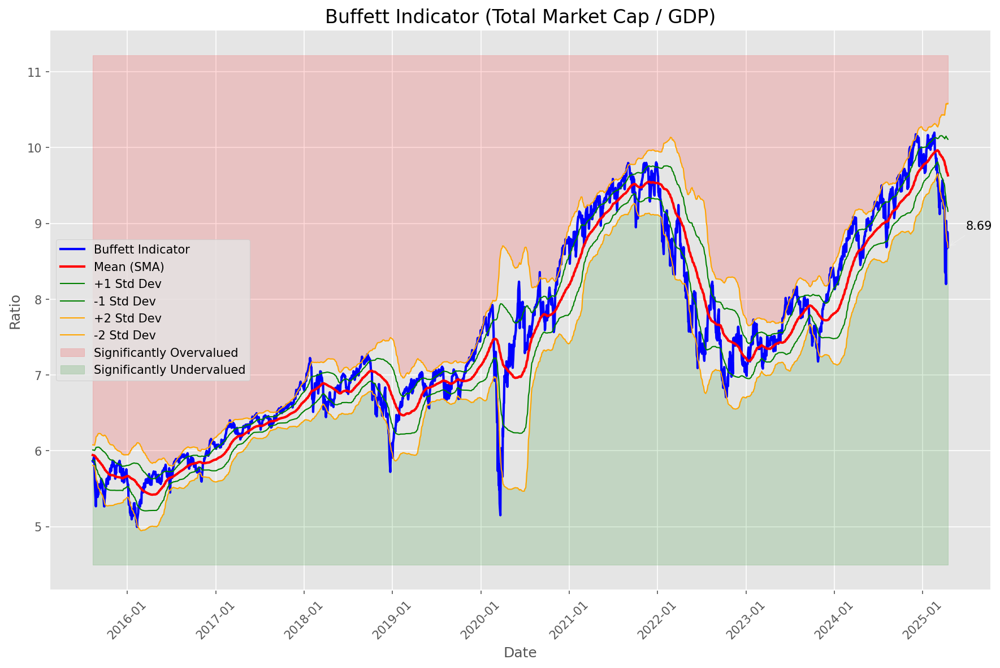
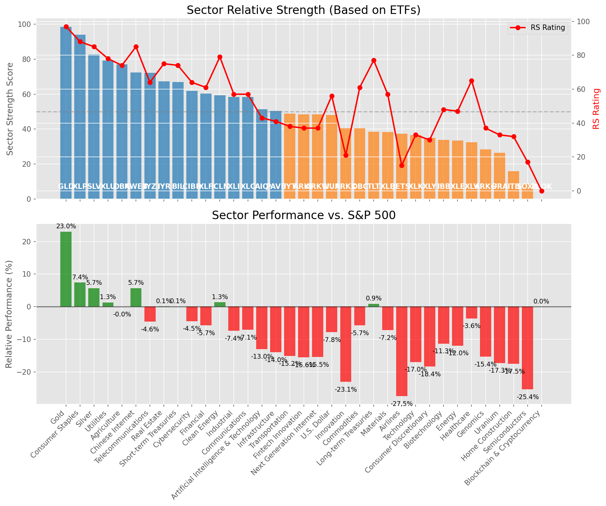

# **Daily Relative Strength Report**

**Date:** 2025-04-18

## **Market Valuation (Buffett Indicator)**

| Metric | Value |
|--------|-------|
| **Market Valuation** | **Undervalued** |
| **Current Ratio** | 8.71 |
| **Historical Mean** | 9.63 |
| **Standard Deviation** | 0.48 |
| **Z-Score (StdDev from Mean)** | -1.99 |
| **Total Market Cap** | $258.75 trillion |
| **GDP** | $29.72 trillion |

## **Market Insights**

### **Market is Undervalued**

The market is trading below historical average valuations, suggesting potential opportunity. These conditions have historically preceded periods of above-average returns. Investors should:

- Look for stocks breaking out of consolidation patterns on increasing volume
- Focus on sectors showing relative strength
- Consider increasing equity exposure, particularly in quality names
- Be mindful of overall market direction and avoid fighting the trend

History suggests patient investors are often rewarded when investing during periods of undervaluation.

### **Buffett Indicator Overview**

The Buffett Indicator (Total Market Cap / GDP) is a measure of the stock market's valuation relative to the size of the economy. It is named after Warren Buffett, who described it as "probably the best single measure of where valuations stand at any given moment."

- **Values above +2 standard deviations:** Market significantly overvalued
- **Values above +1 standard deviation:** Market overvalued
- **Values between -1 and +1 standard deviations:** Market fairly valued
- **Values below -1 standard deviation:** Market undervalued
- **Values below -2 standard deviations:** Market significantly undervalued

---

## **Sector Relative Strength**

Based on William O'Neil's Relative Strength Methodology

| ETF | Strength | RS Rating | Performance | Above Key MAs | Trend | Sector |
|-----|----------|-----------|-------------|--------------|-------|--------|
| [GLD](https://www.tradingview.com/chart/?symbol=GLD) | 98.5 | 97.0 | 23.00% | 10d ✓, 50d ✓, 200d ✓ | ↗️ | Gold |
| [XLP](https://www.tradingview.com/chart/?symbol=XLP) | 94.0 | 88.0 | 7.40% | 10d ✓, 50d ✓, 200d ✓ | ↗️ | Consumer Staples |
| [SLV](https://www.tradingview.com/chart/?symbol=SLV) | 82.6 | 85.0 | 5.69% | 10d ✓, 50d ✗, 200d ✓ | ↗️ | Silver |
| [XLU](https://www.tradingview.com/chart/?symbol=XLU) | 79.1 | 78.0 | 1.28% | 10d ✓, 50d ✗, 200d ✓ | ↗️ | Utilities |
| [DBA](https://www.tradingview.com/chart/?symbol=DBA) | 77.1 | 74.0 | -0.04% | 10d ✓, 50d ✗, 200d ✓ | ↗️ | Agriculture |
| [KWEB](https://www.tradingview.com/chart/?symbol=KWEB) | 72.4 | 85.0 | 5.67% | 10d ✓, 50d ✗, 200d ✗ | ↗️ | Chinese Internet |
| [IYZ](https://www.tradingview.com/chart/?symbol=IYZ) | 72.1 | 64.0 | -4.63% | 10d ✓, 50d ✗, 200d ✓ | ↗️ | Telecommunications |
| [IYR](https://www.tradingview.com/chart/?symbol=IYR) | 67.4 | 75.0 | 0.10% | 10d ✓, 50d ✗, 200d ✗ | ↗️ | Real Estate |
| [BIL](https://www.tradingview.com/chart/?symbol=BIL) | 67.0 | 74.0 | 0.05% | 10d ✓, 50d ✓, 200d ✓ | ↘️ | Short-term Treasuries |
| [CIBR](https://www.tradingview.com/chart/?symbol=CIBR) | 61.9 | 64.0 | -4.45% | 10d ✓, 50d ✗, 200d ✗ | ↗️ | Cybersecurity |
| [XLF](https://www.tradingview.com/chart/?symbol=XLF) | 60.4 | 61.0 | -5.72% | 10d ✓, 50d ✗, 200d ✗ | ↗️ | Financial |
| [ICLN](https://www.tradingview.com/chart/?symbol=ICLN) | 59.3 | 79.0 | 1.32% | 10d ✓, 50d ✓, 200d ✗ | ↘️ | Clean Energy |
| [XLC](https://www.tradingview.com/chart/?symbol=XLC) | 58.4 | 57.0 | -7.10% | 10d ✓, 50d ✗, 200d ✗ | ↗️ | Communications |
| [XLI](https://www.tradingview.com/chart/?symbol=XLI) | 58.4 | 57.0 | -7.38% | 10d ✓, 50d ✗, 200d ✗ | ↗️ | Industrial |
| [AIQ](https://www.tradingview.com/chart/?symbol=AIQ) | 51.4 | 43.0 | -13.01% | 10d ✓, 50d ✗, 200d ✗ | ↗️ | Artificial Intelligence & Technology |
| [PAVE](https://www.tradingview.com/chart/?symbol=PAVE) | 50.4 | 41.0 | -13.99% | 10d ✓, 50d ✗, 200d ✗ | ↗️ | Infrastructure |
| [IYT](https://www.tradingview.com/chart/?symbol=IYT) | 48.9 | 38.0 | -15.15% | 10d ✓, 50d ✗, 200d ✗ | ↗️ | Transportation |
| [ARKW](https://www.tradingview.com/chart/?symbol=ARKW) | 48.4 | 37.0 | -15.46% | 10d ✓, 50d ✗, 200d ✗ | ↗️ | Next Generation Internet |
| [ARKF](https://www.tradingview.com/chart/?symbol=ARKF) | 48.4 | 37.0 | -15.58% | 10d ✓, 50d ✗, 200d ✗ | ↗️ | Fintech Innovation |
| [UUP](https://www.tradingview.com/chart/?symbol=UUP) | 48.0 | 56.0 | -7.80% | 10d ✗, 50d ✗, 200d ✗ | ↗️ | U.S. Dollar |
| [DBC](https://www.tradingview.com/chart/?symbol=DBC) | 40.4 | 61.0 | -5.73% | 10d ✓, 50d ✗, 200d ✗ | ↘️ | Commodities |
| [ARKK](https://www.tradingview.com/chart/?symbol=ARKK) | 40.4 | 21.0 | -23.10% | 10d ✓, 50d ✗, 200d ✗ | ↗️ | Innovation |
| [TLT](https://www.tradingview.com/chart/?symbol=TLT) | 38.5 | 77.0 | 0.89% | 10d ✗, 50d ✗, 200d ✗ | ↘️ | Long-term Treasuries |
| [XLB](https://www.tradingview.com/chart/?symbol=XLB) | 38.4 | 57.0 | -7.23% | 10d ✓, 50d ✗, 200d ✗ | ↘️ | Materials |
| [JETS](https://www.tradingview.com/chart/?symbol=JETS) | 37.4 | 15.0 | -27.47% | 10d ✓, 50d ✗, 200d ✗ | ↗️ | Airlines |
| [XLK](https://www.tradingview.com/chart/?symbol=XLK) | 36.5 | 33.0 | -16.97% | 10d ✗, 50d ✗, 200d ✗ | ↗️ | Technology |
| [XLY](https://www.tradingview.com/chart/?symbol=XLY) | 35.0 | 30.0 | -18.43% | 10d ✗, 50d ✗, 200d ✗ | ↗️ | Consumer Discretionary |
| [IBB](https://www.tradingview.com/chart/?symbol=IBB) | 33.9 | 48.0 | -11.34% | 10d ✓, 50d ✗, 200d ✗ | ↘️ | Biotechnology |
| [XLE](https://www.tradingview.com/chart/?symbol=XLE) | 33.4 | 47.0 | -11.96% | 10d ✓, 50d ✗, 200d ✗ | ↘️ | Energy |
| [XLV](https://www.tradingview.com/chart/?symbol=XLV) | 32.5 | 65.0 | -3.61% | 10d ✗, 50d ✗, 200d ✗ | ↘️ | Healthcare |
| [ARKG](https://www.tradingview.com/chart/?symbol=ARKG) | 28.4 | 37.0 | -15.39% | 10d ✓, 50d ✗, 200d ✗ | ↘️ | Genomics |
| [URA](https://www.tradingview.com/chart/?symbol=URA) | 26.4 | 33.0 | -17.29% | 10d ✓, 50d ✗, 200d ✗ | ↘️ | Uranium |
| [ITB](https://www.tradingview.com/chart/?symbol=ITB) | 16.0 | 32.0 | -17.51% | 10d ✗, 50d ✗, 200d ✗ | ↘️ | Home Construction |
| [SOXX](https://www.tradingview.com/chart/?symbol=SOXX) | 8.5 | 17.0 | -25.38% | 10d ✗, 50d ✗, 200d ✗ | ↘️ | Semiconductors |
| [BLOK](https://www.tradingview.com/chart/?symbol=BLOK) | 0.0 | 0.0 | 0.00% | 10d ✗, 50d ✗, 200d ✗ | ↘️ | Blockchain & Cryptocurrency |

### **Sector ETF Performance Interpretation**

This table shows the relative strength metrics for different market sectors based on their representative ETFs:

- **ETF**: The ETF used to measure sector performance (click for chart)
- **Strength**: Overall sector strength score (0-100) combining multiple factors
- **RS Rating**: O'Neil RS rating of the sector ETF
- **Performance**: Performance of the sector ETF relative to SPY
- **Above Key MAs**: Whether the ETF is trading above its 10, 50, and 200-day moving averages
- **Trend**: Whether the sector is in an uptrend (↗️) or downtrend (↘️)

### **Current Sector Leadership**

The current market leadership is coming from the following sectors: **Gold, Consumer Staples, Silver**.

The **Gold** sector (represented by **GLD**) is showing particularly strong relative strength with an RS rating of 97.0 and performance of 23.00% vs. the S&P 500. This sector is trading above its 10-day, 50-day, 200-day moving average(s). Investors should consider focusing on high RS stocks within these leading sectors for potential outperformance.

---

## **Buy Recommendations**

The following 93 stocks show exceptional relative strength:

| RS Rating | Buy Score | Current Price | Chart | Name | Ticker |
|-----------|-----------|---------------|-------|------|--------|
| 100 | 100 | $84.01 | [Chart](https://www.tradingview.com/chart/?symbol=WPM) | Wheaton Precious Metals Corp. Common Stock | WPM |
| 100 | 100 | $29.58 | [Chart](https://www.tradingview.com/chart/?symbol=AGI) | Alamos Gold Inc. Class A Common Shares | AGI |
| 100 | 100 | $121.53 | [Chart](https://www.tradingview.com/chart/?symbol=AEM) | Agnico Eagle Mines Ltd. | AEM |
| 100 | 100 | $143.14 | [Chart](https://www.tradingview.com/chart/?symbol=UGL) | ProShares Ultra Gold | UGL |
| 99 | 100 | $93.78 | [Chart](https://www.tradingview.com/chart/?symbol=PLTR) | Palantir Technologies Inc. Class A Common Stock | PLTR |
| 99 | 100 | $163.21 | [Chart](https://www.tradingview.com/chart/?symbol=PM) | Philip Morris International Inc. | PM |
| 99 | 100 | $149.79 | [Chart](https://www.tradingview.com/chart/?symbol=PLMR) | Palomar Holdings, Inc. Common stock | PLMR |
| 99 | 100 | $64.12 | [Chart](https://www.tradingview.com/chart/?symbol=GDXJ) | VanEck Junior Gold Miners ETF | GDXJ |
| 99 | 100 | $184.90 | [Chart](https://www.tradingview.com/chart/?symbol=RGLD) | Royal Gold Inc | RGLD |
| 98 | 100 | $118.45 | [Chart](https://www.tradingview.com/chart/?symbol=BJ) | BJs Wholesale Club Holdings, Inc. Common Stock | BJ |
| 98 | 100 | $23.47 | [Chart](https://www.tradingview.com/chart/?symbol=DB) | Deutsche Bank Aktiengesellschaft | DB |
| 98 | 100 | $26.35 | [Chart](https://www.tradingview.com/chart/?symbol=MP) | MP Materials Corp. | MP |
| 98 | 100 | $23.33 | [Chart](https://www.tradingview.com/chart/?symbol=OR) | Osisko Gold Royalties Ltd | OR |
| 98 | 100 | $31.31 | [Chart](https://www.tradingview.com/chart/?symbol=LTH) | Life Time Group Holdings, Inc. | LTH |
| 98 | 100 | $15.93 | [Chart](https://www.tradingview.com/chart/?symbol=EZPW) | Ezcorp Inc | EZPW |
| 98 | 100 | $47.26 | [Chart](https://www.tradingview.com/chart/?symbol=EXC) | Exelon Corporation | EXC |
| 97 | 100 | $262.04 | [Chart](https://www.tradingview.com/chart/?symbol=TMUS) | T-Mobile US, Inc. | TMUS |
| 97 | 100 | $31.68 | [Chart](https://www.tradingview.com/chart/?symbol=SGOL) | abrdn Physical Gold Shares ETF | SGOL |
| 97 | 100 | $62.63 | [Chart](https://www.tradingview.com/chart/?symbol=IAU) | iShares Gold Trust | IAU |
| 97 | 100 | $33.13 | [Chart](https://www.tradingview.com/chart/?symbol=IAUM) | iShares Gold Trust Micro | IAUM |
| 97 | 100 | $25.51 | [Chart](https://www.tradingview.com/chart/?symbol=PHYS) | Sprott Physical Gold Trust | PHYS |
| 97 | 100 | $65.78 | [Chart](https://www.tradingview.com/chart/?symbol=GLDM) | SPDR Gold MiniShares | GLDM |
| 97 | 100 | $306.12 | [Chart](https://www.tradingview.com/chart/?symbol=GLD) | SPDR Gold Trust, SPDR Gold Shares | GLD |
| 97 | 100 | $71.22 | [Chart](https://www.tradingview.com/chart/?symbol=KR) | The Kroger Co. | KR |
| 97 | 100 | $27.15 | [Chart](https://www.tradingview.com/chart/?symbol=T) | AT&T Inc. | T |
| 96 | 100 | $54.02 | [Chart](https://www.tradingview.com/chart/?symbol=PPC) | Pilgrims Pride Corporation | PPC |
| 96 | 100 | $38.61 | [Chart](https://www.tradingview.com/chart/?symbol=MRX) | Marex Group plc Ordinary Shares | MRX |
| 96 | 100 | $42.37 | [Chart](https://www.tradingview.com/chart/?symbol=BTI) | British American Tobacco p.l.c. American Depositary Shares, American Depositary Shares, each representing one Ordinary Share | BTI |
| 96 | 100 | $89.31 | [Chart](https://www.tradingview.com/chart/?symbol=CCEP) | Coca-Cola Europacific Partners plc Ordinary Shares | CCEP |
| 96 | 100 | $460.07 | [Chart](https://www.tradingview.com/chart/?symbol=CASY) | Casey's General Stores Inc | CASY |
| 96 | 100 | $28.54 | [Chart](https://www.tradingview.com/chart/?symbol=EUFN) | iShares MSCI Europe Financials ETF | EUFN |
| 96 | 100 | $44.97 | [Chart](https://www.tradingview.com/chart/?symbol=GH) | Guardant Health, Inc. Common Stock | GH |
| 96 | 100 | $78.95 | [Chart](https://www.tradingview.com/chart/?symbol=NFG) | National Fuel Gas Co. | NFG |
| 96 | 100 | $130.98 | [Chart](https://www.tradingview.com/chart/?symbol=ABT) | Abbott Laboratories | ABT |
| 96 | 100 | $23.96 | [Chart](https://www.tradingview.com/chart/?symbol=SRAD) | Sportradar Group AG Class A Ordinary Shares | SRAD |
| 95 | 100 | $243.28 | [Chart](https://www.tradingview.com/chart/?symbol=RSG) | Republic Services Inc. | RSG |
| 95 | 100 | $37.16 | [Chart](https://www.tradingview.com/chart/?symbol=CNP) | CenterPoint Energy, Inc. | CNP |
| 95 | 100 | $212.77 | [Chart](https://www.tradingview.com/chart/?symbol=TTWO) | Take-Two Interactive Software Inc | TTWO |
| 95 | 100 | $29.35 | [Chart](https://www.tradingview.com/chart/?symbol=CEF) | Sprott Physical Gold and Silver Trust | CEF |
| 95 | 100 | $24.01 | [Chart](https://www.tradingview.com/chart/?symbol=SONY) | Sony Group Corporation American Depositary Shares (Each Representing One Share of Dollar Validated Common Stock) | SONY |
| 95 | 100 | $67.93 | [Chart](https://www.tradingview.com/chart/?symbol=VTR) | Ventas, Inc. | VTR |
| 94 | 100 | $973.03 | [Chart](https://www.tradingview.com/chart/?symbol=NFLX) | NetFlix Inc | NFLX |
| 94 | 100 | $80.29 | [Chart](https://www.tradingview.com/chart/?symbol=SNEX) | StoneX Group Inc. Common Stock | SNEX |
| 94 | 100 | $68.80 | [Chart](https://www.tradingview.com/chart/?symbol=WRB) | W.R. Berkley Corporation | WRB |
| 94 | 100 | $111.95 | [Chart](https://www.tradingview.com/chart/?symbol=OLLI) | Ollie's Bargain Outlet Holdings, Inc. Common Stock | OLLI |
| 94 | 100 | $77.60 | [Chart](https://www.tradingview.com/chart/?symbol=SR) | Spire Inc. | SR |
| 94 | 100 | $19.58 | [Chart](https://www.tradingview.com/chart/?symbol=GRND) | Grindr Inc. | GRND |
| 94 | 100 | $262.53 | [Chart](https://www.tradingview.com/chart/?symbol=CME) | CME Group Inc. | CME |
| 93 | 100 | $117.22 | [Chart](https://www.tradingview.com/chart/?symbol=BRO) | Brown & Brown, Inc. | BRO |
| 93 | 100 | $107.71 | [Chart](https://www.tradingview.com/chart/?symbol=AEP) | American Electric Power Company, Inc. | AEP |
| 93 | 100 | $37.40 | [Chart](https://www.tradingview.com/chart/?symbol=EWG) | iShares MSCI Germany ETF | EWG |
| 93 | 100 | $58.16 | [Chart](https://www.tradingview.com/chart/?symbol=MO) | Altria Group, Inc. | MO |
| 92 | 100 | $16.70 | [Chart](https://www.tradingview.com/chart/?symbol=SPNT) | SiriusPoint Ltd. | SPNT |
| 92 | 100 | $157.54 | [Chart](https://www.tradingview.com/chart/?symbol=ATO) | Atmos Energy Corporation | ATO |
| 92 | 100 | $79.05 | [Chart](https://www.tradingview.com/chart/?symbol=ADC) | Agree Realty Corporation | ADC |
| 92 | 100 | $518.21 | [Chart](https://www.tradingview.com/chart/?symbol=BRK.B) | BERKSHIRE HATHAWAY Class B | BRK.B |
| 92 | 100 | $94.45 | [Chart](https://www.tradingview.com/chart/?symbol=PNW) | Pinnacle West Capital Corporation | PNW |
| 91 | 100 | $311.30 | [Chart](https://www.tradingview.com/chart/?symbol=MCD) | McDonald's Corporation | MCD |
| 91 | 100 | $103.35 | [Chart](https://www.tradingview.com/chart/?symbol=EHC) | Encompass Health Corporation Common Stock | EHC |
| 91 | 100 | $68.37 | [Chart](https://www.tradingview.com/chart/?symbol=EVRG) | Evergy, Inc. | EVRG |
| 91 | 100 | $52.20 | [Chart](https://www.tradingview.com/chart/?symbol=RELX) | RELX PLC | RELX |
| 91 | 100 | $133.55 | [Chart](https://www.tradingview.com/chart/?symbol=DTE) | DTE Energy Company | DTE |
| 91 | 100 | $35.72 | [Chart](https://www.tradingview.com/chart/?symbol=PPL) | PPL Corporation | PPL |
| 91 | 100 | $47.96 | [Chart](https://www.tradingview.com/chart/?symbol=MRCY) | Mercury Systems Inc. | MRCY |
| 90 | 100 | $72.91 | [Chart](https://www.tradingview.com/chart/?symbol=CMS) | CMS Energy Corporation | CMS |
| 90 | 100 | $77.49 | [Chart](https://www.tradingview.com/chart/?symbol=OGS) | ONE GAS, INC. | OGS |
| 90 | 100 | $18.01 | [Chart](https://www.tradingview.com/chart/?symbol=KT) | KT Corp. | KT |
| 90 | 100 | $45.10 | [Chart](https://www.tradingview.com/chart/?symbol=OGE) | OGE Energy Corp. | OGE |
| 90 | 100 | $30.61 | [Chart](https://www.tradingview.com/chart/?symbol=AHR) | American Healthcare REIT, Inc. | AHR |
| 90 | 100 | $61.81 | [Chart](https://www.tradingview.com/chart/?symbol=FNF) | Fidelity National Financial, Inc. | FNF |
| 89 | 100 | $98.65 | [Chart](https://www.tradingview.com/chart/?symbol=AEE) | Ameren Corporation | AEE |
| 89 | 100 | $106.04 | [Chart](https://www.tradingview.com/chart/?symbol=ATGE) | Adtalem Global Education Inc. Common Shares | ATGE |
| 89 | 100 | $55.68 | [Chart](https://www.tradingview.com/chart/?symbol=ULS) | UL Solutions Inc. | ULS |
| 87 | 100 | $38.46 | [Chart](https://www.tradingview.com/chart/?symbol=VIRT) | Virtu Financial, Inc. Class A | VIRT |
| 87 | 100 | $153.45 | [Chart](https://www.tradingview.com/chart/?symbol=EAT) | Brinker International, Inc. | EAT |
| 86 | 100 | $39.29 | [Chart](https://www.tradingview.com/chart/?symbol=NI) | NiSource Inc. | NI |
| 90 | 99 | $81.58 | [Chart](https://www.tradingview.com/chart/?symbol=FAST) | Fastenal Co | FAST |
| 88 | 99 | $994.50 | [Chart](https://www.tradingview.com/chart/?symbol=COST) | Costco Wholesale Corp | COST |
| 87 | 97 | $49.74 | [Chart](https://www.tradingview.com/chart/?symbol=NJR) | New Jersey Resources Corp | NJR |
| 87 | 97 | $127.62 | [Chart](https://www.tradingview.com/chart/?symbol=TJX) | TJX Companies, Inc. (The) | TJX |
| 86 | 97 | $17.18 | [Chart](https://www.tradingview.com/chart/?symbol=AM) | Antero Midstream Corporation Common Stock | AM |
| 86 | 97 | $255.86 | [Chart](https://www.tradingview.com/chart/?symbol=TRV) | The Travelers Companies, Inc. | TRV |
| 85 | 96 | $49.42 | [Chart](https://www.tradingview.com/chart/?symbol=TRP) | TC Energy Corporation | TRP |
| 85 | 96 | $118.30 | [Chart](https://www.tradingview.com/chart/?symbol=CWST) | Casella Waste Systems Inc | CWST |
| 83 | 95 | $36.46 | [Chart](https://www.tradingview.com/chart/?symbol=DRS) | Leonardo DRS, Inc. Common Stock | DRS |
| 85 | 94 | $123.85 | [Chart](https://www.tradingview.com/chart/?symbol=BECN) | Beacon Roofing Supply, Inc. | BECN |
| 83 | 93 | $44.80 | [Chart](https://www.tradingview.com/chart/?symbol=SEZL) | Sezzle Inc. Common Stock | SEZL |
| 83 | 93 | $55.43 | [Chart](https://www.tradingview.com/chart/?symbol=IGF) | iShares Global Infrastructure ETF | IGF |
| 80 | 93 | $102.84 | [Chart](https://www.tradingview.com/chart/?symbol=STIP) | iShares 0-5 Year TIPS Bond ETF | STIP |
| 80 | 93 | $93.22 | [Chart](https://www.tradingview.com/chart/?symbol=WMT) | Walmart Inc. | WMT |
| 82 | 91 | $32.42 | [Chart](https://www.tradingview.com/chart/?symbol=FDP) | Fresh Del Monte Produce Inc. | FDP |
| 81 | 91 | $107.44 | [Chart](https://www.tradingview.com/chart/?symbol=AFL) | Aflac Inc. | AFL |
| 81 | 91 | $49.86 | [Chart](https://www.tradingview.com/chart/?symbol=VTIP) | Vanguard Short-Term Inflation-Protected Securities Index Fund | VTIP |

---

## **Sell Recommendations**

The following 157 stocks show deteriorating relative strength:

| RS Rating | Sell Score | Current Price | Chart | Name | Ticker |
|-----------|------------|---------------|-------|------|--------|
| 1 | 100 | $10.64 | [Chart](https://www.tradingview.com/chart/?symbol=XNCR) | Xencor, Inc. | XNCR |
| 2 | 100 | $43.34 | [Chart](https://www.tradingview.com/chart/?symbol=TECL) | Direxion Daily Technology Bull 3x Shares | TECL |
| 2 | 100 | $15.31 | [Chart](https://www.tradingview.com/chart/?symbol=SSTK) | SHUTTERSTOCK, INC. | SSTK |
| 2 | 100 | $16.86 | [Chart](https://www.tradingview.com/chart/?symbol=TNDM) | Tandem Diabetes Care, Inc. | TNDM |
| 3 | 100 | $10.40 | [Chart](https://www.tradingview.com/chart/?symbol=BCYC) | Bicycle Therapeutics plc American Depositary Shares | BCYC |
| 3 | 100 | $17.10 | [Chart](https://www.tradingview.com/chart/?symbol=DAVA) | Endava plc American Depositary Shares (each representing one Class A Ordinary Share) | DAVA |
| 4 | 100 | $47.00 | [Chart](https://www.tradingview.com/chart/?symbol=LABU) | Direxion Daily S&P Biotech Bull 3X Shares | LABU |
| 5 | 100 | $60.99 | [Chart](https://www.tradingview.com/chart/?symbol=ARCB) | ArcBest Corporation | ARCB |
| 5 | 100 | $25.19 | [Chart](https://www.tradingview.com/chart/?symbol=FORM) | FormFactor Inc. | FORM |
| 5 | 100 | $22.32 | [Chart](https://www.tradingview.com/chart/?symbol=FIVN) | FIVE9, INC. | FIVN |
| 6 | 100 | $19.36 | [Chart](https://www.tradingview.com/chart/?symbol=CECO) | Ceco Environmental Corp | CECO |
| 6 | 100 | $34.27 | [Chart](https://www.tradingview.com/chart/?symbol=TDW) | Tidewater, Inc. | TDW |
| 6 | 100 | $25.84 | [Chart](https://www.tradingview.com/chart/?symbol=XPEL) | XPEL, Inc. Common Stock | XPEL |
| 6 | 100 | $20.58 | [Chart](https://www.tradingview.com/chart/?symbol=HI) | Hillenbrand, Inc. | HI |
| 6 | 100 | $10.53 | [Chart](https://www.tradingview.com/chart/?symbol=ARCT) | Arcturus Therapeutics Holdings Inc. Common Stock | ARCT |
| 6 | 100 | $55.98 | [Chart](https://www.tradingview.com/chart/?symbol=SWKS) | Skyworks Solutions Inc | SWKS |
| 6 | 100 | $26.61 | [Chart](https://www.tradingview.com/chart/?symbol=W) | Wayfair Inc. | W |
| 7 | 100 | $21.69 | [Chart](https://www.tradingview.com/chart/?symbol=NSSC) | Napco Security Technologies, Inc | NSSC |
| 7 | 100 | $19.64 | [Chart](https://www.tradingview.com/chart/?symbol=SPT) | Sprout Social, Inc Class A Common Stock | SPT |
| 7 | 100 | $18.20 | [Chart](https://www.tradingview.com/chart/?symbol=APLS) | Apellis Pharmaceuticals, Inc. Common Stock | APLS |
| 7 | 100 | $44.78 | [Chart](https://www.tradingview.com/chart/?symbol=ACLS) | Axcelis Technologies Inc | ACLS |
| 8 | 100 | $12.89 | [Chart](https://www.tradingview.com/chart/?symbol=DK) | Delek US Holdings, Inc. | DK |
| 8 | 100 | $12.73 | [Chart](https://www.tradingview.com/chart/?symbol=GCT) | GigaCloud Technology Inc Class A Ordinary Shares | GCT |
| 9 | 100 | $60.37 | [Chart](https://www.tradingview.com/chart/?symbol=CAMT) | Camtek Ltd | CAMT |
| 9 | 100 | $18.59 | [Chart](https://www.tradingview.com/chart/?symbol=BZH) | Beazer Homes USA, Inc. New | BZH |
| 9 | 100 | $20.35 | [Chart](https://www.tradingview.com/chart/?symbol=TDC) | TERADATA CORPORATION | TDC |
| 9 | 100 | $11.43 | [Chart](https://www.tradingview.com/chart/?symbol=ADNT) | Adient plc Ordinary Shares | ADNT |
| 10 | 100 | $11.54 | [Chart](https://www.tradingview.com/chart/?symbol=AEYE) | AudioEye, Inc. Common Stock | AEYE |
| 11 | 100 | $27.24 | [Chart](https://www.tradingview.com/chart/?symbol=SRDX) | Surmodics, Inc. Common Stock | SRDX |
| 12 | 100 | $19.47 | [Chart](https://www.tradingview.com/chart/?symbol=ST) | Sensata Technologies Holding plc | ST |
| 13 | 100 | $58.50 | [Chart](https://www.tradingview.com/chart/?symbol=ATKR) | Atkore Inc. | ATKR |
| 13 | 100 | $12.83 | [Chart](https://www.tradingview.com/chart/?symbol=XRAY) | DENTSPLY SIRONA Inc. | XRAY |
| 14 | 100 | $15.83 | [Chart](https://www.tradingview.com/chart/?symbol=IART) | Integra LifeSciences Holdings | IART |
| 2 | 99 | $77.57 | [Chart](https://www.tradingview.com/chart/?symbol=FRPT) | Freshpet, Inc. | FRPT |
| 10 | 99 | $28.61 | [Chart](https://www.tradingview.com/chart/?symbol=UWM) | ProShares Ultra Russell2000 | UWM |
| 12 | 99 | $19.66 | [Chart](https://www.tradingview.com/chart/?symbol=FOXF) | Fox Factory Holding Corp. Common Stock | FOXF |
| 14 | 99 | $37.84 | [Chart](https://www.tradingview.com/chart/?symbol=FMC) | FMC Corporation | FMC |
| 5 | 98 | $12.37 | [Chart](https://www.tradingview.com/chart/?symbol=IMXI) | International Money Express, Inc. | IMXI |
| 6 | 98 | $56.28 | [Chart](https://www.tradingview.com/chart/?symbol=LGIH) | LGI Homes, Inc. | LGIH |
| 7 | 98 | $21.29 | [Chart](https://www.tradingview.com/chart/?symbol=VERA) | Vera Therapeutics, Inc. Class A Common Stock | VERA |
| 13 | 98 | $111.72 | [Chart](https://www.tradingview.com/chart/?symbol=GNRC) | GENERAC HOLDINGS INC | GNRC |
| 13 | 97 | $22.13 | [Chart](https://www.tradingview.com/chart/?symbol=UCO) | ProShares Ultra Bloomberg Crude Oil | UCO |
| 13 | 97 | $12.66 | [Chart](https://www.tradingview.com/chart/?symbol=MARA) | MARA Holdings, Inc. Common Stock | MARA |
| 16 | 97 | $14.64 | [Chart](https://www.tradingview.com/chart/?symbol=PBW) | Invesco WilderHill Clean Energy ETF | PBW |
| 18 | 97 | $35.58 | [Chart](https://www.tradingview.com/chart/?symbol=LIVN) | LivaNova PLC Ordinary Shares | LIVN |
| 22 | 97 | $33.02 | [Chart](https://www.tradingview.com/chart/?symbol=IAC) | IAC Inc. Common Stock | IAC |
| 6 | 96 | $53.18 | [Chart](https://www.tradingview.com/chart/?symbol=VAC) | MARRIOTT VACATIONS WORLDWIDE CORPORATION | VAC |
| 14 | 96 | $10.31 | [Chart](https://www.tradingview.com/chart/?symbol=VREX) | Varex Imaging Corporation Common Stock | VREX |
| 20 | 96 | $31.68 | [Chart](https://www.tradingview.com/chart/?symbol=URNM) | Sprott Uranium Miners ETF | URNM |
| 9 | 95 | $23.32 | [Chart](https://www.tradingview.com/chart/?symbol=WSC) | WillScot Holdings Corporation Class A Common Stock | WSC |
| 11 | 95 | $100.73 | [Chart](https://www.tradingview.com/chart/?symbol=ARM) | Arm Holdings plc American Depositary Shares | ARM |
| 12 | 95 | $10.39 | [Chart](https://www.tradingview.com/chart/?symbol=TXG) | 10x Genomics, Inc. Class A Common Stock | TXG |
| 16 | 95 | $54.47 | [Chart](https://www.tradingview.com/chart/?symbol=EL) | The Estee Lauder Companies Inc. Class A | EL |
| 23 | 95 | $11.92 | [Chart](https://www.tradingview.com/chart/?symbol=MED) | Medifast, Inc. | MED |
| 11 | 94 | $57.21 | [Chart](https://www.tradingview.com/chart/?symbol=SWK) | Stanley Black & Decker, Inc. | SWK |
| 16 | 94 | $93.47 | [Chart](https://www.tradingview.com/chart/?symbol=BCC) | Boise Cascade Company | BCC |
| 16 | 94 | $87.50 | [Chart](https://www.tradingview.com/chart/?symbol=AMD) | Advanced Micro Devices | AMD |
| 18 | 94 | $11.82 | [Chart](https://www.tradingview.com/chart/?symbol=BAND) | Bandwidth Inc. Class A Common Stock | BAND |
| 20 | 94 | $20.41 | [Chart](https://www.tradingview.com/chart/?symbol=SYM) | Symbotic Inc. Class A Common Stock | SYM |
| 13 | 93 | $20.55 | [Chart](https://www.tradingview.com/chart/?symbol=UPBD) | Upbound Group, Inc. Common Stock | UPBD |
| 27 | 93 | $14.23 | [Chart](https://www.tradingview.com/chart/?symbol=FXN) | First Trust Energy AlphaDEX Fund | FXN |
| 10 | 92 | $29.69 | [Chart](https://www.tradingview.com/chart/?symbol=JANX) | Janux Therapeutics, Inc. Common Stock | JANX |
| 13 | 92 | $31.96 | [Chart](https://www.tradingview.com/chart/?symbol=ENOV) | Enovis Corporation | ENOV |
| 14 | 92 | $49.84 | [Chart](https://www.tradingview.com/chart/?symbol=NVT) | nVent Electric plc Ordinary Shares | NVT |
| 15 | 92 | $10.77 | [Chart](https://www.tradingview.com/chart/?symbol=SONO) | Sonos, Inc. Common Stock | SONO |
| 15 | 92 | $116.94 | [Chart](https://www.tradingview.com/chart/?symbol=BLDR) | Builders FirstSource, Inc. | BLDR |
| 16 | 92 | $18.93 | [Chart](https://www.tradingview.com/chart/?symbol=FOR) | Forestar Group Inc. | FOR |
| 17 | 92 | $47.97 | [Chart](https://www.tradingview.com/chart/?symbol=ERX) | Direxion Daily Energy Bull 2X Shares | ERX |
| 20 | 92 | $18.51 | [Chart](https://www.tradingview.com/chart/?symbol=BITO) | ProShares Bitcoin ETF | BITO |
| 20 | 92 | $44.82 | [Chart](https://www.tradingview.com/chart/?symbol=EDU) | New Oriental Education and Technology Group, Inc. American Depositary Shares (each representing ten (10) Common Shares) | EDU |
| 13 | 91 | $10.40 | [Chart](https://www.tradingview.com/chart/?symbol=NEOG) | Neogen Corp | NEOG |
| 16 | 91 | $34.50 | [Chart](https://www.tradingview.com/chart/?symbol=TEX) | Terex Corporation | TEX |
| 10 | 90 | $17.90 | [Chart](https://www.tradingview.com/chart/?symbol=OII) | Oceaneering International Inc. | OII |
| 12 | 90 | $14.36 | [Chart](https://www.tradingview.com/chart/?symbol=DXC) | DXC Technology Company | DXC |
| 21 | 90 | $26.40 | [Chart](https://www.tradingview.com/chart/?symbol=SEE) | Sealed Air Corp. | SEE |
| 22 | 90 | $39.22 | [Chart](https://www.tradingview.com/chart/?symbol=SIMO) | Silicon Motion Technology Corporation | SIMO |
| 12 | 89 | $334.55 | [Chart](https://www.tradingview.com/chart/?symbol=SAIA) | Saia, Inc. | SAIA |
| 16 | 89 | $129.48 | [Chart](https://www.tradingview.com/chart/?symbol=TFX) | Teleflex Incorporated | TFX |
| 19 | 89 | $31.58 | [Chart](https://www.tradingview.com/chart/?symbol=NGVT) | Ingevity Corporation | NGVT |
| 21 | 89 | $20.73 | [Chart](https://www.tradingview.com/chart/?symbol=LPG) | DORIAN LPG LTD | LPG |
| 25 | 89 | $11.91 | [Chart](https://www.tradingview.com/chart/?symbol=OEC) | Orion S.A. | OEC |
| 12 | 88 | $33.96 | [Chart](https://www.tradingview.com/chart/?symbol=FLR) | Fluor Corporation | FLR |
| 19 | 88 | $31.70 | [Chart](https://www.tradingview.com/chart/?symbol=GFS) | GlobalFoundries Inc. Ordinary Shares | GFS |
| 20 | 88 | $25.51 | [Chart](https://www.tradingview.com/chart/?symbol=CZR) | Caesars Entertainment, Inc. Common Stock | CZR |
| 24 | 88 | $12.03 | [Chart](https://www.tradingview.com/chart/?symbol=OSCR) | Oscar Health, Inc. | OSCR |
| 14 | 87 | $10.54 | [Chart](https://www.tradingview.com/chart/?symbol=XHR) | Xenia Hotels & Resorts, Inc. | XHR |
| 21 | 86 | $28.30 | [Chart](https://www.tradingview.com/chart/?symbol=WERN) | Werner Enterprises Inc | WERN |
| 22 | 86 | $31.44 | [Chart](https://www.tradingview.com/chart/?symbol=TENB) | Tenable Holdings, Inc. | TENB |
| 23 | 86 | $57.63 | [Chart](https://www.tradingview.com/chart/?symbol=QRVO) | Qorvo, Inc. | QRVO |
| 25 | 86 | $10.03 | [Chart](https://www.tradingview.com/chart/?symbol=MTAL) | MAC Copper Limited | MTAL |
| 25 | 86 | $32.25 | [Chart](https://www.tradingview.com/chart/?symbol=MGA) | Magna International | MGA |
| 19 | 85 | $52.81 | [Chart](https://www.tradingview.com/chart/?symbol=AIR) | AAR Corp. | AIR |
| 20 | 85 | $34.37 | [Chart](https://www.tradingview.com/chart/?symbol=CALF) | Pacer US Small Cap Cash Cows ETF | CALF |
| 21 | 85 | $11.72 | [Chart](https://www.tradingview.com/chart/?symbol=TRIP) | TripAdvisor, Inc. | TRIP |
| 22 | 85 | $143.56 | [Chart](https://www.tradingview.com/chart/?symbol=PTC) | PTC, INC | PTC |
| 26 | 85 | $17.18 | [Chart](https://www.tradingview.com/chart/?symbol=CTRI) | Centuri Holdings, Inc. | CTRI |
| 26 | 85 | $27.01 | [Chart](https://www.tradingview.com/chart/?symbol=MBUU) | Malibu Boats, Inc. Class A | MBUU |
| 27 | 85 | $52.54 | [Chart](https://www.tradingview.com/chart/?symbol=ENPH) | Enphase Energy, Inc. | ENPH |
| 33 | 85 | $44.15 | [Chart](https://www.tradingview.com/chart/?symbol=ETSY) | Etsy, Inc. | ETSY |
| 19 | 84 | $27.86 | [Chart](https://www.tradingview.com/chart/?symbol=YETI) | YETI Holdings, Inc. Common Stock | YETI |
| 19 | 84 | $10.15 | [Chart](https://www.tradingview.com/chart/?symbol=HLIT) | Harmonic Inc | HLIT |
| 21 | 84 | $111.93 | [Chart](https://www.tradingview.com/chart/?symbol=XOP) | SPDR S&P Oil & Gas Exploration & Production ETF | XOP |
| 22 | 84 | $52.10 | [Chart](https://www.tradingview.com/chart/?symbol=HXL) | Hexcel Corporation | HXL |
| 27 | 83 | $72.04 | [Chart](https://www.tradingview.com/chart/?symbol=IR) | Ingersoll Rand Inc. Common Stock | IR |
| 31 | 83 | $26.45 | [Chart](https://www.tradingview.com/chart/?symbol=BWA) | BorgWarner Inc. | BWA |
| 30 | 82 | $11.21 | [Chart](https://www.tradingview.com/chart/?symbol=NAVI) | Navient Corporation | NAVI |
| 33 | 82 | $285.39 | [Chart](https://www.tradingview.com/chart/?symbol=BLD) | TopBuild Corp. Common Stock | BLD |
| 28 | 81 | $218.84 | [Chart](https://www.tradingview.com/chart/?symbol=WING) | Wingstop Inc | WING |
| 29 | 81 | $65.13 | [Chart](https://www.tradingview.com/chart/?symbol=MTH) | Meritage Homes Corporation | MTH |
| 29 | 81 | $133.35 | [Chart](https://www.tradingview.com/chart/?symbol=NSIT) | Insight Enterprises Inc | NSIT |
| 31 | 81 | $10.71 | [Chart](https://www.tradingview.com/chart/?symbol=DBRG) | DigitalBridge Group, Inc. | DBRG |
| 32 | 81 | $25.26 | [Chart](https://www.tradingview.com/chart/?symbol=PINS) | Pinterest, Inc. Class A Common Stock | PINS |
| 22 | 80 | $106.19 | [Chart](https://www.tradingview.com/chart/?symbol=MHO) | M/I Homes, Inc. | MHO |
| 27 | 80 | $101.36 | [Chart](https://www.tradingview.com/chart/?symbol=CHDN) | Churchill Downs Inc | CHDN |
| 29 | 80 | $36.80 | [Chart](https://www.tradingview.com/chart/?symbol=TWST) | Twist Bioscience Corporation Common Stock | TWST |
| 23 | 79 | $56.41 | [Chart](https://www.tradingview.com/chart/?symbol=BOIL) | ProShares Ultra Bloomberg Natural Gas | BOIL |
| 30 | 79 | $10.24 | [Chart](https://www.tradingview.com/chart/?symbol=CELC) | Celcuity Inc. Common Stock | CELC |
| 31 | 79 | $28.16 | [Chart](https://www.tradingview.com/chart/?symbol=TAN) | Invesco Solar ETF | TAN |
| 24 | 78 | $183.66 | [Chart](https://www.tradingview.com/chart/?symbol=FN) | Fabrinet | FN |
| 29 | 78 | $16.53 | [Chart](https://www.tradingview.com/chart/?symbol=ELVN) | Enliven Therapeutics, Inc. Common Stock | ELVN |
| 29 | 77 | $63.42 | [Chart](https://www.tradingview.com/chart/?symbol=AIN) | Albany International Corp Class A | AIN |
| 29 | 77 | $11.03 | [Chart](https://www.tradingview.com/chart/?symbol=ABR) | Arbor Realty Trust, Inc. | ABR |
| 34 | 77 | $136.66 | [Chart](https://www.tradingview.com/chart/?symbol=QCOM) | Qualcomm Inc | QCOM |
| 34 | 77 | $10.16 | [Chart](https://www.tradingview.com/chart/?symbol=MAX) | MediaAlpha, Inc. | MAX |
| 24 | 76 | $10.04 | [Chart](https://www.tradingview.com/chart/?symbol=HTLD) | Heartland Express Inc | HTLD |
| 26 | 76 | $21.09 | [Chart](https://www.tradingview.com/chart/?symbol=MGY) | Magnolia Oil & Gas Corporation Class A Common Stock | MGY |
| 32 | 76 | $76.43 | [Chart](https://www.tradingview.com/chart/?symbol=TNET) | TRINET GROUP, INC. | TNET |
| 33 | 76 | $44.38 | [Chart](https://www.tradingview.com/chart/?symbol=PRKS) | United Parks & Resorts Inc. | PRKS |
| 34 | 76 | $11.60 | [Chart](https://www.tradingview.com/chart/?symbol=RIVN) | Rivian Automotive, Inc. Class A Common Stock | RIVN |
| 25 | 75 | $29.90 | [Chart](https://www.tradingview.com/chart/?symbol=CRTO) | Criteo S.A. | CRTO |
| 27 | 75 | $45.50 | [Chart](https://www.tradingview.com/chart/?symbol=ATI) | ATI Inc. | ATI |
| 37 | 75 | $79.42 | [Chart](https://www.tradingview.com/chart/?symbol=LEA) | Lear Corporation | LEA |
| 38 | 75 | $50.51 | [Chart](https://www.tradingview.com/chart/?symbol=KBR) | KBR, Inc. | KBR |
| 26 | 74 | $14.38 | [Chart](https://www.tradingview.com/chart/?symbol=PSFE) | Paysafe Limited | PSFE |
| 29 | 74 | $84.69 | [Chart](https://www.tradingview.com/chart/?symbol=BPMC) | Blueprint Medicines Corporation | BPMC |
| 30 | 74 | $112.18 | [Chart](https://www.tradingview.com/chart/?symbol=SITE) | SiteOne Landscape Supply, Inc. | SITE |
| 31 | 74 | $56.76 | [Chart](https://www.tradingview.com/chart/?symbol=VOYA) | VOYA FINANCIAL, INC. | VOYA |
| 37 | 74 | $23.57 | [Chart](https://www.tradingview.com/chart/?symbol=AMRK) | A-Mark Precious Metals, Inc. | AMRK |
| 28 | 73 | $88.17 | [Chart](https://www.tradingview.com/chart/?symbol=PCAR) | Paccar Inc | PCAR |
| 30 | 73 | $30.04 | [Chart](https://www.tradingview.com/chart/?symbol=VNT) | Vontier Corporation | VNT |
| 33 | 73 | $184.71 | [Chart](https://www.tradingview.com/chart/?symbol=RGA) | Reinsurance Group of America, Incorporated | RGA |
| 33 | 73 | $41.18 | [Chart](https://www.tradingview.com/chart/?symbol=CCJ) | Cameco Corporation | CCJ |
| 34 | 73 | $80.96 | [Chart](https://www.tradingview.com/chart/?symbol=AGCO) | AGCO Corporation | AGCO |
| 32 | 72 | $69.48 | [Chart](https://www.tradingview.com/chart/?symbol=USO) | United States Oil Fund, LP | USO |
| 34 | 72 | $90.85 | [Chart](https://www.tradingview.com/chart/?symbol=XHB) | SPDR S&P Homebuilders ETF | XHB |
| 37 | 72 | $22.14 | [Chart](https://www.tradingview.com/chart/?symbol=PFE) | Pfizer Inc. | PFE |
| 31 | 71 | $114.70 | [Chart](https://www.tradingview.com/chart/?symbol=MYRG) | MYR Group, Inc. | MYRG |
| 33 | 71 | $22.87 | [Chart](https://www.tradingview.com/chart/?symbol=URA) | Global X Uranium ETF | URA |
| 34 | 71 | $45.54 | [Chart](https://www.tradingview.com/chart/?symbol=APOG) | Apogee Enterprises Inc | APOG |
| 34 | 71 | $27.66 | [Chart](https://www.tradingview.com/chart/?symbol=AGIO) | Agios Pharmaceuticals, Inc. | AGIO |
| 34 | 71 | $10.34 | [Chart](https://www.tradingview.com/chart/?symbol=CMRE) | Costamare Inc. | CMRE |
| 38 | 71 | $51.71 | [Chart](https://www.tradingview.com/chart/?symbol=APTV) | Aptiv PLC | APTV |
| 32 | 70 | $153.75 | [Chart](https://www.tradingview.com/chart/?symbol=ODFL) | Old Dominion Freight Line | ODFL |
| 38 | 70 | $16.36 | [Chart](https://www.tradingview.com/chart/?symbol=SEM) | SELECT MEDICAL HOLDINGS CORP | SEM |
| 32 | 68 | $85.65 | [Chart](https://www.tradingview.com/chart/?symbol=RHP) | Ryman Hospitality Properties, Inc | RHP |
| 37 | 66 | $20.67 | [Chart](https://www.tradingview.com/chart/?symbol=ARKG) | ARK Genomic Revolution ETF | ARKG |
| 38 | 66 | $21.31 | [Chart](https://www.tradingview.com/chart/?symbol=VRRM) | Verra Mobility Corporation Class A Common Stock | VRRM |

## **Methodology**

This report uses William O'Neil's relative strength methodology from Investors Business Daily:

* **RS Rating**: Percentile rank of stock's performance vs. S&P 500 over the past 63 trading days (1-99 scale)
* **Buy Criteria**: RS Rating >= 80, price above 50-day MA, strong uptrend, increasing volume
* **Sell Criteria**: RS Rating < 40, price below 50-day MA, downtrend, decreasing volume

### **O'Neil's Key Principles**

1. **Focus on relative performance** - stocks outperforming the market
2. **Price trend confirmation** - stock must be in an uptrend
3. **Volume confirmation** - strong volume supports price moves
4. **Moving average validation** - price above key moving averages
5. **Market leaders only** - concentrate on top-performing stocks

*Report generated automatically after market close*