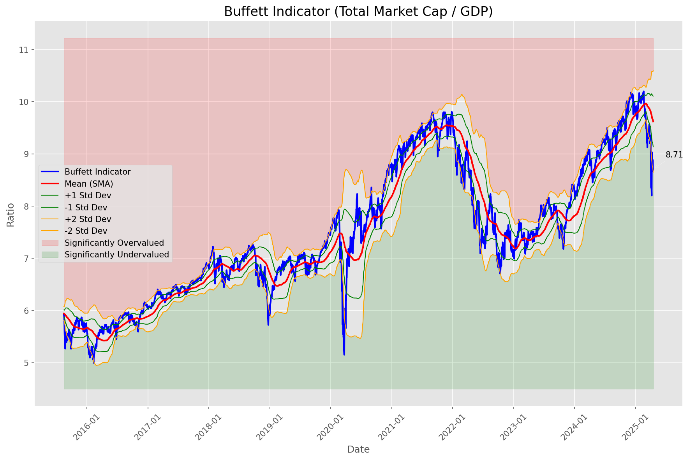
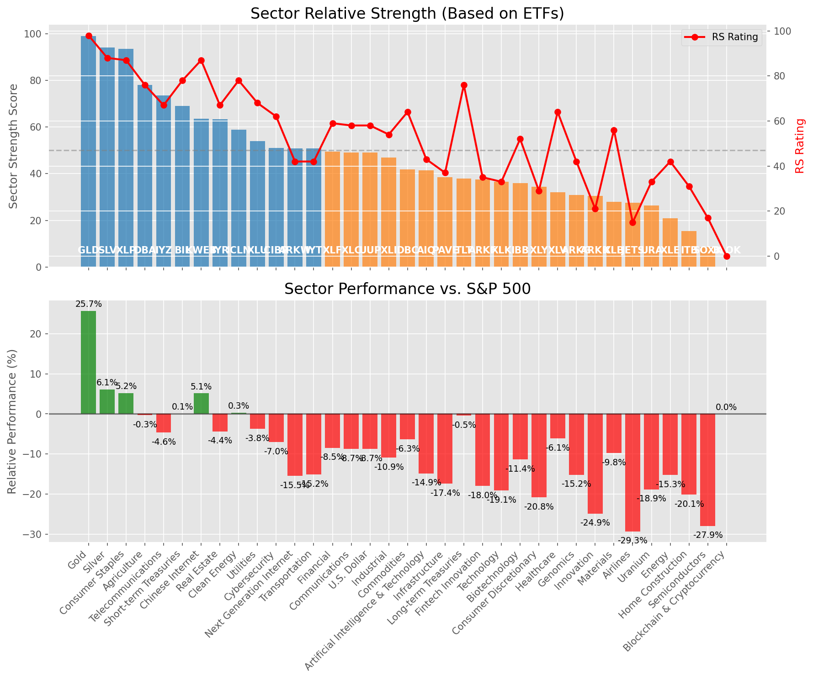

# **Daily Relative Strength Report**

**Date:** 2025-04-21

## **Market Valuation (Buffett Indicator)**

| Metric | Value |
|--------|-------|
| **Market Valuation** | **Undervalued** |
| **Current Ratio** | 8.47 |
| **Historical Mean** | 9.62 |
| **Standard Deviation** | 0.49 |
| **Z-Score (StdDev from Mean)** | -1.88 |
| **Total Market Cap** | $251.68 trillion |
| **GDP** | $29.72 trillion |

## **Market Insights**

### **Market is Undervalued**

The market is trading below historical average valuations, suggesting potential opportunity. These conditions have historically preceded periods of above-average returns. Investors should:

- Look for stocks breaking out of consolidation patterns on increasing volume
- Focus on sectors showing relative strength
- Consider increasing equity exposure, particularly in quality names
- Be mindful of overall market direction and avoid fighting the trend

History suggests patient investors are often rewarded when investing during periods of undervaluation.

### **Buffett Indicator Overview**

The Buffett Indicator (Total Market Cap / GDP) is a measure of the stock market's valuation relative to the size of the economy. It is named after Warren Buffett, who described it as "probably the best single measure of where valuations stand at any given moment."

- **Values above +2 standard deviations:** Market significantly overvalued
- **Values above +1 standard deviation:** Market overvalued
- **Values between -1 and +1 standard deviations:** Market fairly valued
- **Values below -1 standard deviation:** Market undervalued
- **Values below -2 standard deviations:** Market significantly undervalued

---

## **Sector Relative Strength**

Based on William O'Neil's Relative Strength Methodology

| ETF | Strength | RS Rating | Performance | Above Key MAs | Trend | Sector |
|-----|----------|-----------|-------------|--------------|-------|--------|
| [GLD](https://www.tradingview.com/chart/?symbol=GLD) | 99.0 | 98.0 | 25.69% | 10d ✓, 50d ✓, 200d ✓ | ↗️ | Gold |
| [SLV](https://www.tradingview.com/chart/?symbol=SLV) | 94.0 | 88.0 | 6.08% | 10d ✓, 50d ✓, 200d ✓ | ↗️ | Silver |
| [XLP](https://www.tradingview.com/chart/?symbol=XLP) | 93.5 | 87.0 | 5.16% | 10d ✓, 50d ✓, 200d ✓ | ↗️ | Consumer Staples |
| [DBA](https://www.tradingview.com/chart/?symbol=DBA) | 78.1 | 76.0 | -0.34% | 10d ✓, 50d ✗, 200d ✓ | ↗️ | Agriculture |
| [IYZ](https://www.tradingview.com/chart/?symbol=IYZ) | 73.6 | 67.0 | -4.63% | 10d ✓, 50d ✗, 200d ✓ | ↗️ | Telecommunications |
| [BIL](https://www.tradingview.com/chart/?symbol=BIL) | 69.0 | 78.0 | 0.06% | 10d ✓, 50d ✓, 200d ✓ | ↘️ | Short-term Treasuries |
| [KWEB](https://www.tradingview.com/chart/?symbol=KWEB) | 63.5 | 87.0 | 5.14% | 10d ✗, 50d ✗, 200d ✗ | ↗️ | Chinese Internet |
| [IYR](https://www.tradingview.com/chart/?symbol=IYR) | 63.4 | 67.0 | -4.37% | 10d ✓, 50d ✗, 200d ✗ | ↗️ | Real Estate |
| [ICLN](https://www.tradingview.com/chart/?symbol=ICLN) | 58.8 | 78.0 | 0.31% | 10d ✓, 50d ✓, 200d ✗ | ↘️ | Clean Energy |
| [XLU](https://www.tradingview.com/chart/?symbol=XLU) | 54.0 | 68.0 | -3.76% | 10d ✗, 50d ✗, 200d ✗ | ↗️ | Utilities |
| [CIBR](https://www.tradingview.com/chart/?symbol=CIBR) | 51.0 | 62.0 | -7.03% | 10d ✗, 50d ✗, 200d ✗ | ↗️ | Cybersecurity |
| [ARKW](https://www.tradingview.com/chart/?symbol=ARKW) | 50.9 | 42.0 | -15.46% | 10d ✓, 50d ✗, 200d ✗ | ↗️ | Next Generation Internet |
| [IYT](https://www.tradingview.com/chart/?symbol=IYT) | 50.9 | 42.0 | -15.15% | 10d ✓, 50d ✗, 200d ✗ | ↗️ | Transportation |
| [XLF](https://www.tradingview.com/chart/?symbol=XLF) | 49.5 | 59.0 | -8.46% | 10d ✗, 50d ✗, 200d ✗ | ↗️ | Financial |
| [XLC](https://www.tradingview.com/chart/?symbol=XLC) | 49.0 | 58.0 | -8.75% | 10d ✗, 50d ✗, 200d ✗ | ↗️ | Communications |
| [UUP](https://www.tradingview.com/chart/?symbol=UUP) | 49.0 | 58.0 | -8.73% | 10d ✗, 50d ✗, 200d ✗ | ↗️ | U.S. Dollar |
| [XLI](https://www.tradingview.com/chart/?symbol=XLI) | 47.0 | 54.0 | -10.93% | 10d ✗, 50d ✗, 200d ✗ | ↗️ | Industrial |
| [DBC](https://www.tradingview.com/chart/?symbol=DBC) | 41.9 | 64.0 | -6.34% | 10d ✓, 50d ✗, 200d ✗ | ↘️ | Commodities |
| [AIQ](https://www.tradingview.com/chart/?symbol=AIQ) | 41.5 | 43.0 | -14.87% | 10d ✗, 50d ✗, 200d ✗ | ↗️ | Artificial Intelligence & Technology |
| [PAVE](https://www.tradingview.com/chart/?symbol=PAVE) | 38.5 | 37.0 | -17.42% | 10d ✗, 50d ✗, 200d ✗ | ↗️ | Infrastructure |
| [TLT](https://www.tradingview.com/chart/?symbol=TLT) | 38.0 | 76.0 | -0.45% | 10d ✗, 50d ✗, 200d ✗ | ↘️ | Long-term Treasuries |
| [ARKF](https://www.tradingview.com/chart/?symbol=ARKF) | 37.5 | 35.0 | -18.00% | 10d ✗, 50d ✗, 200d ✗ | ↗️ | Fintech Innovation |
| [XLK](https://www.tradingview.com/chart/?symbol=XLK) | 36.5 | 33.0 | -19.10% | 10d ✗, 50d ✗, 200d ✗ | ↗️ | Technology |
| [IBB](https://www.tradingview.com/chart/?symbol=IBB) | 35.9 | 52.0 | -11.39% | 10d ✓, 50d ✗, 200d ✗ | ↘️ | Biotechnology |
| [XLY](https://www.tradingview.com/chart/?symbol=XLY) | 34.5 | 29.0 | -20.81% | 10d ✗, 50d ✗, 200d ✗ | ↗️ | Consumer Discretionary |
| [XLV](https://www.tradingview.com/chart/?symbol=XLV) | 32.0 | 64.0 | -6.11% | 10d ✗, 50d ✗, 200d ✗ | ↘️ | Healthcare |
| [ARKG](https://www.tradingview.com/chart/?symbol=ARKG) | 30.9 | 42.0 | -15.18% | 10d ✓, 50d ✗, 200d ✗ | ↘️ | Genomics |
| [ARKK](https://www.tradingview.com/chart/?symbol=ARKK) | 30.5 | 21.0 | -24.86% | 10d ✗, 50d ✗, 200d ✗ | ↗️ | Innovation |
| [XLB](https://www.tradingview.com/chart/?symbol=XLB) | 28.0 | 56.0 | -9.79% | 10d ✗, 50d ✗, 200d ✗ | ↘️ | Materials |
| [JETS](https://www.tradingview.com/chart/?symbol=JETS) | 27.5 | 15.0 | -29.33% | 10d ✗, 50d ✗, 200d ✗ | ↗️ | Airlines |
| [URA](https://www.tradingview.com/chart/?symbol=URA) | 26.4 | 33.0 | -18.86% | 10d ✓, 50d ✗, 200d ✗ | ↘️ | Uranium |
| [XLE](https://www.tradingview.com/chart/?symbol=XLE) | 21.0 | 42.0 | -15.25% | 10d ✗, 50d ✗, 200d ✗ | ↘️ | Energy |
| [ITB](https://www.tradingview.com/chart/?symbol=ITB) | 15.5 | 31.0 | -20.15% | 10d ✗, 50d ✗, 200d ✗ | ↘️ | Home Construction |
| [SOXX](https://www.tradingview.com/chart/?symbol=SOXX) | 8.5 | 17.0 | -27.93% | 10d ✗, 50d ✗, 200d ✗ | ↘️ | Semiconductors |
| [BLOK](https://www.tradingview.com/chart/?symbol=BLOK) | 0.0 | 0.0 | 0.00% | 10d ✗, 50d ✗, 200d ✗ | ↘️ | Blockchain & Cryptocurrency |

### **Sector ETF Performance Interpretation**

This table shows the relative strength metrics for different market sectors based on their representative ETFs:

- **ETF**: The ETF used to measure sector performance (click for chart)
- **Strength**: Overall sector strength score (0-100) combining multiple factors
- **RS Rating**: O'Neil RS rating of the sector ETF
- **Performance**: Performance of the sector ETF relative to SPY
- **Above Key MAs**: Whether the ETF is trading above its 10, 50, and 200-day moving averages
- **Trend**: Whether the sector is in an uptrend (↗️) or downtrend (↘️)

### **Current Sector Leadership**

The current market leadership is coming from the following sectors: **Gold, Silver, Consumer Staples**.

The **Gold** sector (represented by **GLD**) is showing particularly strong relative strength with an RS rating of 98.0 and performance of 25.69% vs. the S&P 500. This sector is trading above its 10-day, 50-day, 200-day moving average(s). Investors should consider focusing on high RS stocks within these leading sectors for potential outperformance.

---

## **Buy Recommendations**

The following 51 stocks show exceptional relative strength:

| RS Rating | Buy Score | Current Price | Chart | Name | Ticker |
|-----------|-----------|---------------|-------|------|--------|
| 100 | 100 | $122.73 | [Chart](https://www.tradingview.com/chart/?symbol=AEM) | Agnico Eagle Mines Ltd. | AEM |
| 100 | 100 | $151.08 | [Chart](https://www.tradingview.com/chart/?symbol=UGL) | ProShares Ultra Gold | UGL |
| 100 | 100 | $29.23 | [Chart](https://www.tradingview.com/chart/?symbol=AGI) | Alamos Gold Inc. Class A Common Shares | AGI |
| 100 | 100 | $85.02 | [Chart](https://www.tradingview.com/chart/?symbol=WPM) | Wheaton Precious Metals Corp. Common Stock | WPM |
| 99 | 100 | $161.17 | [Chart](https://www.tradingview.com/chart/?symbol=PM) | Philip Morris International Inc. | PM |
| 99 | 100 | $185.76 | [Chart](https://www.tradingview.com/chart/?symbol=RGLD) | Royal Gold Inc | RGLD |
| 99 | 100 | $149.79 | [Chart](https://www.tradingview.com/chart/?symbol=PLMR) | Palomar Holdings, Inc. Common stock | PLMR |
| 99 | 100 | $64.59 | [Chart](https://www.tradingview.com/chart/?symbol=GDXJ) | VanEck Junior Gold Miners ETF | GDXJ |
| 98 | 100 | $34.07 | [Chart](https://www.tradingview.com/chart/?symbol=IAUM) | iShares Gold Trust Micro | IAUM |
| 98 | 100 | $67.68 | [Chart](https://www.tradingview.com/chart/?symbol=GLDM) | SPDR Gold MiniShares | GLDM |
| 98 | 100 | $32.60 | [Chart](https://www.tradingview.com/chart/?symbol=SGOL) | abrdn Physical Gold Shares ETF | SGOL |
| 98 | 100 | $314.99 | [Chart](https://www.tradingview.com/chart/?symbol=GLD) | SPDR Gold Trust, SPDR Gold Shares | GLD |
| 98 | 100 | $32.94 | [Chart](https://www.tradingview.com/chart/?symbol=OUNZ) | VanEck Merk Gold ETF | OUNZ |
| 98 | 100 | $64.45 | [Chart](https://www.tradingview.com/chart/?symbol=IAU) | iShares Gold Trust | IAU |
| 98 | 100 | $15.84 | [Chart](https://www.tradingview.com/chart/?symbol=EZPW) | Ezcorp Inc | EZPW |
| 97 | 100 | $26.15 | [Chart](https://www.tradingview.com/chart/?symbol=PHYS) | Sprott Physical Gold Trust | PHYS |
| 97 | 100 | $30.01 | [Chart](https://www.tradingview.com/chart/?symbol=CEF) | Sprott Physical Gold and Silver Trust | CEF |
| 97 | 100 | $23.16 | [Chart](https://www.tradingview.com/chart/?symbol=DB) | Deutsche Bank Aktiengesellschaft | DB |
| 97 | 100 | $23.26 | [Chart](https://www.tradingview.com/chart/?symbol=OR) | Osisko Gold Royalties Ltd | OR |
| 97 | 100 | $71.64 | [Chart](https://www.tradingview.com/chart/?symbol=KR) | The Kroger Co. | KR |
| 96 | 100 | $88.47 | [Chart](https://www.tradingview.com/chart/?symbol=CCEP) | Coca-Cola Europacific Partners plc Ordinary Shares | CCEP |
| 96 | 100 | $53.48 | [Chart](https://www.tradingview.com/chart/?symbol=PPC) | Pilgrims Pride Corporation | PPC |
| 96 | 100 | $994.25 | [Chart](https://www.tradingview.com/chart/?symbol=NFLX) | NetFlix Inc | NFLX |
| 96 | 100 | $246.67 | [Chart](https://www.tradingview.com/chart/?symbol=VRSN) | VeriSign Inc | VRSN |
| 96 | 100 | $28.27 | [Chart](https://www.tradingview.com/chart/?symbol=EUFN) | iShares MSCI Europe Financials ETF | EUFN |
| 96 | 100 | $42.39 | [Chart](https://www.tradingview.com/chart/?symbol=BTI) | British American Tobacco p.l.c. American Depositary Shares, American Depositary Shares, each representing one Ordinary Share | BTI |
| 96 | 100 | $460.07 | [Chart](https://www.tradingview.com/chart/?symbol=CASY) | Casey's General Stores Inc | CASY |
| 96 | 100 | $23.19 | [Chart](https://www.tradingview.com/chart/?symbol=SRAD) | Sportradar Group AG Class A Ordinary Shares | SRAD |
| 95 | 100 | $80.29 | [Chart](https://www.tradingview.com/chart/?symbol=SNEX) | StoneX Group Inc. Common Stock | SNEX |
| 95 | 100 | $77.60 | [Chart](https://www.tradingview.com/chart/?symbol=SR) | Spire Inc. | SR |
| 95 | 100 | $1390.90 | [Chart](https://www.tradingview.com/chart/?symbol=ORLY) | O'Reilly Automotive, Inc. | ORLY |
| 94 | 100 | $19.07 | [Chart](https://www.tradingview.com/chart/?symbol=GRND) | Grindr Inc. | GRND |
| 92 | 100 | $77.49 | [Chart](https://www.tradingview.com/chart/?symbol=OGS) | ONE GAS, INC. | OGS |
| 91 | 100 | $78.40 | [Chart](https://www.tradingview.com/chart/?symbol=ADC) | Agree Realty Corporation | ADC |
| 91 | 100 | $52.25 | [Chart](https://www.tradingview.com/chart/?symbol=RELX) | RELX PLC | RELX |
| 91 | 100 | $17.98 | [Chart](https://www.tradingview.com/chart/?symbol=KT) | KT Corp. | KT |
| 90 | 100 | $123.60 | [Chart](https://www.tradingview.com/chart/?symbol=BECN) | Beacon Roofing Supply, Inc. | BECN |
| 90 | 100 | $93.27 | [Chart](https://www.tradingview.com/chart/?symbol=PNW) | Pinnacle West Capital Corporation | PNW |
| 89 | 100 | $154.97 | [Chart](https://www.tradingview.com/chart/?symbol=ATO) | Atmos Energy Corporation | ATO |
| 89 | 100 | $72.29 | [Chart](https://www.tradingview.com/chart/?symbol=CMS) | CMS Energy Corporation | CMS |
| 87 | 100 | $34.91 | [Chart](https://www.tradingview.com/chart/?symbol=PPL) | PPL Corporation | PPL |
| 89 | 99 | $49.74 | [Chart](https://www.tradingview.com/chart/?symbol=NJR) | New Jersey Resources Corp | NJR |
| 88 | 99 | $48.73 | [Chart](https://www.tradingview.com/chart/?symbol=TRP) | TC Energy Corporation | TRP |
| 88 | 99 | $118.30 | [Chart](https://www.tradingview.com/chart/?symbol=CWST) | Casella Waste Systems Inc | CWST |
| 86 | 99 | $29.79 | [Chart](https://www.tradingview.com/chart/?symbol=AHR) | American Healthcare REIT, Inc. | AHR |
| 86 | 97 | $252.86 | [Chart](https://www.tradingview.com/chart/?symbol=TRV) | The Travelers Companies, Inc. | TRV |
| 87 | 96 | $33.21 | [Chart](https://www.tradingview.com/chart/?symbol=FDP) | Fresh Del Monte Produce Inc. | FDP |
| 84 | 94 | $49.85 | [Chart](https://www.tradingview.com/chart/?symbol=VTIP) | Vanguard Short-Term Inflation-Protected Securities Index Fund | VTIP |
| 81 | 94 | $111.78 | [Chart](https://www.tradingview.com/chart/?symbol=BOXX) | Alpha Architect 1-3 Month Box ETF | BOXX |
| 82 | 92 | $54.56 | [Chart](https://www.tradingview.com/chart/?symbol=IGF) | iShares Global Infrastructure ETF | IGF |
| 82 | 92 | $72.05 | [Chart](https://www.tradingview.com/chart/?symbol=BBCA) | JPMorgan BetaBuilders Canada ETF | BBCA |

---

## **Sell Recommendations**

The following 198 stocks show deteriorating relative strength:

| RS Rating | Sell Score | Current Price | Chart | Name | Ticker |
|-----------|------------|---------------|-------|------|--------|
| 1 | 100 | $16.16 | [Chart](https://www.tradingview.com/chart/?symbol=TNDM) | Tandem Diabetes Care, Inc. | TNDM |
| 1 | 100 | $39.00 | [Chart](https://www.tradingview.com/chart/?symbol=TECL) | Direxion Daily Technology Bull 3x Shares | TECL |
| 2 | 100 | $10.03 | [Chart](https://www.tradingview.com/chart/?symbol=FLYW) | Flywire Corporation Voting Common Stock | FLYW |
| 2 | 100 | $74.69 | [Chart](https://www.tradingview.com/chart/?symbol=FRPT) | Freshpet, Inc. | FRPT |
| 2 | 100 | $15.31 | [Chart](https://www.tradingview.com/chart/?symbol=SSTK) | SHUTTERSTOCK, INC. | SSTK |
| 3 | 100 | $70.50 | [Chart](https://www.tradingview.com/chart/?symbol=ILMN) | Illumina Inc | ILMN |
| 3 | 100 | $22.14 | [Chart](https://www.tradingview.com/chart/?symbol=SM) | SM Energy Company | SM |
| 4 | 100 | $17.03 | [Chart](https://www.tradingview.com/chart/?symbol=DAVA) | Endava plc American Depositary Shares (each representing one Class A Ordinary Share) | DAVA |
| 4 | 100 | $21.93 | [Chart](https://www.tradingview.com/chart/?symbol=RPD) | Rapid7, Inc. Common Stock | RPD |
| 4 | 100 | $10.40 | [Chart](https://www.tradingview.com/chart/?symbol=BCYC) | Bicycle Therapeutics plc American Depositary Shares | BCYC |
| 5 | 100 | $18.79 | [Chart](https://www.tradingview.com/chart/?symbol=SPT) | Sprout Social, Inc Class A Common Stock | SPT |
| 5 | 100 | $32.34 | [Chart](https://www.tradingview.com/chart/?symbol=TDW) | Tidewater, Inc. | TDW |
| 5 | 100 | $21.39 | [Chart](https://www.tradingview.com/chart/?symbol=FIVN) | FIVE9, INC. | FIVN |
| 5 | 100 | $25.29 | [Chart](https://www.tradingview.com/chart/?symbol=W) | Wayfair Inc. | W |
| 5 | 100 | $48.15 | [Chart](https://www.tradingview.com/chart/?symbol=LABU) | Direxion Daily S&P Biotech Bull 3X Shares | LABU |
| 5 | 100 | $17.32 | [Chart](https://www.tradingview.com/chart/?symbol=ICHR) | Ichor Holdings | ICHR |
| 5 | 100 | $24.80 | [Chart](https://www.tradingview.com/chart/?symbol=FORM) | FormFactor Inc. | FORM |
| 6 | 100 | $19.31 | [Chart](https://www.tradingview.com/chart/?symbol=SYM) | Symbotic Inc. Class A Common Stock | SYM |
| 6 | 100 | $12.37 | [Chart](https://www.tradingview.com/chart/?symbol=IMXI) | International Money Express, Inc. | IMXI |
| 6 | 100 | $60.99 | [Chart](https://www.tradingview.com/chart/?symbol=ARCB) | ArcBest Corporation | ARCB |
| 6 | 100 | $58.09 | [Chart](https://www.tradingview.com/chart/?symbol=CAMT) | Camtek Ltd | CAMT |
| 7 | 100 | $25.84 | [Chart](https://www.tradingview.com/chart/?symbol=XPEL) | XPEL, Inc. Common Stock | XPEL |
| 7 | 100 | $44.19 | [Chart](https://www.tradingview.com/chart/?symbol=ACLS) | Axcelis Technologies Inc | ACLS |
| 7 | 100 | $18.35 | [Chart](https://www.tradingview.com/chart/?symbol=APLS) | Apellis Pharmaceuticals, Inc. Common Stock | APLS |
| 8 | 100 | $21.70 | [Chart](https://www.tradingview.com/chart/?symbol=THS) | Treehouse Foods, Inc. | THS |
| 8 | 100 | $21.69 | [Chart](https://www.tradingview.com/chart/?symbol=NSSC) | Napco Security Technologies, Inc | NSSC |
| 8 | 100 | $34.24 | [Chart](https://www.tradingview.com/chart/?symbol=STNG) | Scorpio Tankers Inc. | STNG |
| 8 | 100 | $20.58 | [Chart](https://www.tradingview.com/chart/?symbol=HI) | Hillenbrand, Inc. | HI |
| 8 | 100 | $11.22 | [Chart](https://www.tradingview.com/chart/?symbol=ARCT) | Arcturus Therapeutics Holdings Inc. Common Stock | ARCT |
| 8 | 100 | $12.49 | [Chart](https://www.tradingview.com/chart/?symbol=DK) | Delek US Holdings, Inc. | DK |
| 8 | 100 | $12.15 | [Chart](https://www.tradingview.com/chart/?symbol=DV) | DoubleVerify Holdings, Inc. | DV |
| 8 | 100 | $12.14 | [Chart](https://www.tradingview.com/chart/?symbol=GCT) | GigaCloud Technology Inc Class A Ordinary Shares | GCT |
| 9 | 100 | $19.90 | [Chart](https://www.tradingview.com/chart/?symbol=TDC) | TERADATA CORPORATION | TDC |
| 9 | 100 | $14.74 | [Chart](https://www.tradingview.com/chart/?symbol=IART) | Integra LifeSciences Holdings | IART |
| 10 | 100 | $18.59 | [Chart](https://www.tradingview.com/chart/?symbol=BZH) | Beazer Homes USA, Inc. New | BZH |
| 10 | 100 | $11.20 | [Chart](https://www.tradingview.com/chart/?symbol=ADNT) | Adient plc Ordinary Shares | ADNT |
| 10 | 100 | $96.52 | [Chart](https://www.tradingview.com/chart/?symbol=ARM) | Arm Holdings plc American Depositary Shares | ARM |
| 10 | 100 | $17.46 | [Chart](https://www.tradingview.com/chart/?symbol=VECO) | Veeco Instruments Inc | VECO |
| 11 | 100 | $11.54 | [Chart](https://www.tradingview.com/chart/?symbol=AEYE) | AudioEye, Inc. Common Stock | AEYE |
| 11 | 100 | $18.68 | [Chart](https://www.tradingview.com/chart/?symbol=ST) | Sensata Technologies Holding plc | ST |
| 11 | 100 | $19.03 | [Chart](https://www.tradingview.com/chart/?symbol=FOXF) | Fox Factory Holding Corp. Common Stock | FOXF |
| 13 | 100 | $12.59 | [Chart](https://www.tradingview.com/chart/?symbol=XRAY) | DENTSPLY SIRONA Inc. | XRAY |
| 13 | 100 | $27.24 | [Chart](https://www.tradingview.com/chart/?symbol=SRDX) | Surmodics, Inc. Common Stock | SRDX |
| 14 | 100 | $58.50 | [Chart](https://www.tradingview.com/chart/?symbol=ATKR) | Atkore Inc. | ATKR |
| 15 | 100 | $37.57 | [Chart](https://www.tradingview.com/chart/?symbol=FMC) | FMC Corporation | FMC |
| 17 | 100 | $11.31 | [Chart](https://www.tradingview.com/chart/?symbol=TRIP) | TripAdvisor, Inc. | TRIP |
| 5 | 99 | $10.79 | [Chart](https://www.tradingview.com/chart/?symbol=ZETA) | Zeta Global Holdings Corp. | ZETA |
| 7 | 99 | $19.36 | [Chart](https://www.tradingview.com/chart/?symbol=CECO) | Ceco Environmental Corp | CECO |
| 12 | 99 | $48.46 | [Chart](https://www.tradingview.com/chart/?symbol=NVT) | nVent Electric plc Ordinary Shares | NVT |
| 13 | 99 | $14.13 | [Chart](https://www.tradingview.com/chart/?symbol=PBW) | Invesco WilderHill Clean Energy ETF | PBW |
| 18 | 99 | $30.14 | [Chart](https://www.tradingview.com/chart/?symbol=URNM) | Sprott Uranium Miners ETF | URNM |
| 7 | 98 | $22.22 | [Chart](https://www.tradingview.com/chart/?symbol=WSC) | WillScot Holdings Corporation Class A Common Stock | WSC |
| 7 | 98 | $53.18 | [Chart](https://www.tradingview.com/chart/?symbol=VAC) | MARRIOTT VACATIONS WORLDWIDE CORPORATION | VAC |
| 9 | 98 | $122.10 | [Chart](https://www.tradingview.com/chart/?symbol=FSLR) | First Solar, Inc. | FSLR |
| 11 | 98 | $21.47 | [Chart](https://www.tradingview.com/chart/?symbol=VERA) | Vera Therapeutics, Inc. Class A Common Stock | VERA |
| 11 | 98 | $10.70 | [Chart](https://www.tradingview.com/chart/?symbol=OGN) | Organon & Co. | OGN |
| 14 | 98 | $21.10 | [Chart](https://www.tradingview.com/chart/?symbol=UCO) | ProShares Ultra Bloomberg Crude Oil | UCO |
| 16 | 98 | $34.41 | [Chart](https://www.tradingview.com/chart/?symbol=LIVN) | LivaNova PLC Ordinary Shares | LIVN |
| 9 | 97 | $27.32 | [Chart](https://www.tradingview.com/chart/?symbol=UWM) | ProShares Ultra Russell2000 | UWM |
| 11 | 97 | $106.04 | [Chart](https://www.tradingview.com/chart/?symbol=GNRC) | GENERAC HOLDINGS INC | GNRC |
| 13 | 97 | $45.06 | [Chart](https://www.tradingview.com/chart/?symbol=ERX) | Direxion Daily Energy Bull 2X Shares | ERX |
| 15 | 97 | $12.90 | [Chart](https://www.tradingview.com/chart/?symbol=MARA) | MARA Holdings, Inc. Common Stock | MARA |
| 19 | 97 | $15.42 | [Chart](https://www.tradingview.com/chart/?symbol=TRMD) | TORM plc Class A Common Stock | TRMD |
| 23 | 97 | $32.69 | [Chart](https://www.tradingview.com/chart/?symbol=IAC) | IAC Inc. Common Stock | IAC |
| 23 | 97 | $13.75 | [Chart](https://www.tradingview.com/chart/?symbol=FXN) | First Trust Energy AlphaDEX Fund | FXN |
| 11 | 96 | $55.87 | [Chart](https://www.tradingview.com/chart/?symbol=SWK) | Stanley Black & Decker, Inc. | SWK |
| 12 | 96 | $17.70 | [Chart](https://www.tradingview.com/chart/?symbol=AMN) | AMN Healthcare Services | AMN |
| 13 | 96 | $30.89 | [Chart](https://www.tradingview.com/chart/?symbol=ENOV) | Enovis Corporation | ENOV |
| 15 | 96 | $113.71 | [Chart](https://www.tradingview.com/chart/?symbol=BLDR) | Builders FirstSource, Inc. | BLDR |
| 16 | 96 | $12.21 | [Chart](https://www.tradingview.com/chart/?symbol=ZVZZT) | SUPER Montage TEST SYMBOL | ZVZZT |
| 9 | 95 | $31.74 | [Chart](https://www.tradingview.com/chart/?symbol=SCSC) | Scansource Inc | SCSC |
| 9 | 95 | $34.16 | [Chart](https://www.tradingview.com/chart/?symbol=CRC) | California Resources Corporation | CRC |
| 11 | 95 | $32.67 | [Chart](https://www.tradingview.com/chart/?symbol=FLR) | Fluor Corporation | FLR |
| 15 | 95 | $33.43 | [Chart](https://www.tradingview.com/chart/?symbol=TEX) | Terex Corporation | TEX |
| 21 | 95 | $44.52 | [Chart](https://www.tradingview.com/chart/?symbol=EDU) | New Oriental Education and Technology Group, Inc. American Depositary Shares (each representing ten (10) Common Shares) | EDU |
| 12 | 94 | $19.92 | [Chart](https://www.tradingview.com/chart/?symbol=UPBD) | Upbound Group, Inc. Common Stock | UPBD |
| 16 | 94 | $10.31 | [Chart](https://www.tradingview.com/chart/?symbol=VREX) | Varex Imaging Corporation Common Stock | VREX |
| 16 | 94 | $84.41 | [Chart](https://www.tradingview.com/chart/?symbol=AMD) | Advanced Micro Devices | AMD |
| 16 | 94 | $10.77 | [Chart](https://www.tradingview.com/chart/?symbol=SONO) | Sonos, Inc. Common Stock | SONO |
| 19 | 94 | $25.76 | [Chart](https://www.tradingview.com/chart/?symbol=SEE) | Sealed Air Corp. | SEE |
| 22 | 94 | $11.35 | [Chart](https://www.tradingview.com/chart/?symbol=OSCR) | Oscar Health, Inc. | OSCR |
| 8 | 93 | $13.55 | [Chart](https://www.tradingview.com/chart/?symbol=DNLI) | Denali Therapeutics Inc. Common Stock | DNLI |
| 12 | 93 | $13.87 | [Chart](https://www.tradingview.com/chart/?symbol=DXC) | DXC Technology Company | DXC |
| 16 | 93 | $30.51 | [Chart](https://www.tradingview.com/chart/?symbol=TENB) | Tenable Holdings, Inc. | TENB |
| 17 | 93 | $26.84 | [Chart](https://www.tradingview.com/chart/?symbol=YETI) | YETI Holdings, Inc. Common Stock | YETI |
| 17 | 93 | $45.41 | [Chart](https://www.tradingview.com/chart/?symbol=POWI) | Power Integrations Inc | POWI |
| 18 | 93 | $93.47 | [Chart](https://www.tradingview.com/chart/?symbol=BCC) | Boise Cascade Company | BCC |
| 18 | 93 | $91.66 | [Chart](https://www.tradingview.com/chart/?symbol=CHRD) | Chord Energy Corporation Common Stock | CHRD |
| 11 | 92 | $17.37 | [Chart](https://www.tradingview.com/chart/?symbol=OII) | Oceaneering International Inc. | OII |
| 12 | 92 | $81.10 | [Chart](https://www.tradingview.com/chart/?symbol=NTAP) | NetApp, Inc | NTAP |
| 12 | 92 | $29.69 | [Chart](https://www.tradingview.com/chart/?symbol=JANX) | Janux Therapeutics, Inc. Common Stock | JANX |
| 12 | 92 | $41.69 | [Chart](https://www.tradingview.com/chart/?symbol=DFIN) | Donnelley Financial Solutions, Inc. | DFIN |
| 15 | 92 | $32.52 | [Chart](https://www.tradingview.com/chart/?symbol=OVV) | Ovintiv Inc. | OVV |
| 17 | 92 | $21.00 | [Chart](https://www.tradingview.com/chart/?symbol=CGON) | CG Oncology, Inc. Common stock | CGON |
| 21 | 92 | $11.82 | [Chart](https://www.tradingview.com/chart/?symbol=BAND) | Bandwidth Inc. Class A Common Stock | BAND |
| 10 | 91 | $51.38 | [Chart](https://www.tradingview.com/chart/?symbol=BOIL) | ProShares Ultra Bloomberg Natural Gas | BOIL |
| 11 | 91 | $22.14 | [Chart](https://www.tradingview.com/chart/?symbol=RNG) | RINGCENTRAL, INC. | RNG |
| 14 | 91 | $14.65 | [Chart](https://www.tradingview.com/chart/?symbol=SVOL) | Simplify Volatility Premium ETF | SVOL |
| 23 | 91 | $69.38 | [Chart](https://www.tradingview.com/chart/?symbol=IR) | Ingersoll Rand Inc. Common Stock | IR |
| 14 | 90 | $10.40 | [Chart](https://www.tradingview.com/chart/?symbol=NEOG) | Neogen Corp | NEOG |
| 18 | 90 | $132.46 | [Chart](https://www.tradingview.com/chart/?symbol=MTN) | Vail Resorts, Inc. | MTN |
| 18 | 90 | $12.76 | [Chart](https://www.tradingview.com/chart/?symbol=HUN) | Huntsman Corporation | HUN |
| 26 | 90 | $11.92 | [Chart](https://www.tradingview.com/chart/?symbol=MED) | Medifast, Inc. | MED |
| 17 | 89 | $15.34 | [Chart](https://www.tradingview.com/chart/?symbol=MLKN) | MillerKnoll, Inc. Common Stock | MLKN |
| 19 | 89 | $18.93 | [Chart](https://www.tradingview.com/chart/?symbol=FOR) | Forestar Group Inc. | FOR |
| 21 | 89 | $34.34 | [Chart](https://www.tradingview.com/chart/?symbol=TWST) | Twist Bioscience Corporation Common Stock | TWST |
| 22 | 89 | $30.92 | [Chart](https://www.tradingview.com/chart/?symbol=GFS) | GlobalFoundries Inc. Ordinary Shares | GFS |
| 22 | 89 | $10.96 | [Chart](https://www.tradingview.com/chart/?symbol=RIVN) | Rivian Automotive, Inc. Class A Common Stock | RIVN |
| 18 | 88 | $172.22 | [Chart](https://www.tradingview.com/chart/?symbol=FN) | Fabrinet | FN |
| 19 | 88 | $10.45 | [Chart](https://www.tradingview.com/chart/?symbol=JAMF) | Jamf Holding Corp. Common Stock | JAMF |
| 20 | 88 | $33.56 | [Chart](https://www.tradingview.com/chart/?symbol=CALF) | Pacer US Small Cap Cash Cows ETF | CALF |
| 24 | 88 | $20.73 | [Chart](https://www.tradingview.com/chart/?symbol=LPG) | DORIAN LPG LTD | LPG |
| 13 | 87 | $91.25 | [Chart](https://www.tradingview.com/chart/?symbol=TOL) | Toll Brothers, Inc. | TOL |
| 19 | 87 | $21.87 | [Chart](https://www.tradingview.com/chart/?symbol=HOG) | Harley-Davidson, Inc. | HOG |
| 20 | 87 | $139.34 | [Chart](https://www.tradingview.com/chart/?symbol=PTC) | PTC, INC | PTC |
| 28 | 87 | $11.91 | [Chart](https://www.tradingview.com/chart/?symbol=OEC) | Orion S.A. | OEC |
| 14 | 86 | $334.55 | [Chart](https://www.tradingview.com/chart/?symbol=SAIA) | Saia, Inc. | SAIA |
| 19 | 86 | $108.17 | [Chart](https://www.tradingview.com/chart/?symbol=XOP) | SPDR S&P Oil & Gas Exploration & Production ETF | XOP |
| 19 | 86 | $27.58 | [Chart](https://www.tradingview.com/chart/?symbol=WERN) | Werner Enterprises Inc | WERN |
| 26 | 86 | $39.22 | [Chart](https://www.tradingview.com/chart/?symbol=SIMO) | Silicon Motion Technology Corporation | SIMO |
| 16 | 85 | $10.54 | [Chart](https://www.tradingview.com/chart/?symbol=XHR) | Xenia Hotels & Resorts, Inc. | XHR |
| 18 | 85 | $202.01 | [Chart](https://www.tradingview.com/chart/?symbol=FDX) | FedEx Corporation | FDX |
| 20 | 85 | $50.80 | [Chart](https://www.tradingview.com/chart/?symbol=KBH) | KB Home | KBH |
| 20 | 85 | $24.88 | [Chart](https://www.tradingview.com/chart/?symbol=CZR) | Caesars Entertainment, Inc. Common Stock | CZR |
| 21 | 85 | $31.58 | [Chart](https://www.tradingview.com/chart/?symbol=NGVT) | Ingevity Corporation | NGVT |
| 21 | 85 | $50.00 | [Chart](https://www.tradingview.com/chart/?symbol=HXL) | Hexcel Corporation | HXL |
| 23 | 85 | $20.29 | [Chart](https://www.tradingview.com/chart/?symbol=MGY) | Magnolia Oil & Gas Corporation Class A Common Stock | MGY |
| 25 | 85 | $56.96 | [Chart](https://www.tradingview.com/chart/?symbol=QRVO) | Qorvo, Inc. | QRVO |
| 20 | 83 | $18.20 | [Chart](https://www.tradingview.com/chart/?symbol=KMT) | Kennametal Inc. | KMT |
| 23 | 83 | $32.36 | [Chart](https://www.tradingview.com/chart/?symbol=TECK) | Teck Resources Limited | TECK |
| 28 | 83 | $27.36 | [Chart](https://www.tradingview.com/chart/?symbol=TAN) | Invesco Solar ETF | TAN |
| 28 | 82 | $23.97 | [Chart](https://www.tradingview.com/chart/?symbol=PINS) | Pinterest, Inc. Class A Common Stock | PINS |
| 29 | 82 | $17.18 | [Chart](https://www.tradingview.com/chart/?symbol=CTRI) | Centuri Holdings, Inc. | CTRI |
| 33 | 82 | $51.32 | [Chart](https://www.tradingview.com/chart/?symbol=ENPH) | Enphase Energy, Inc. | ENPH |
| 34 | 82 | $26.06 | [Chart](https://www.tradingview.com/chart/?symbol=BWA) | BorgWarner Inc. | BWA |
| 19 | 81 | $32.42 | [Chart](https://www.tradingview.com/chart/?symbol=LVS) | Las Vegas Sands Corp. | LVS |
| 22 | 81 | $10.15 | [Chart](https://www.tradingview.com/chart/?symbol=HLIT) | Harmonic Inc | HLIT |
| 28 | 81 | $19.23 | [Chart](https://www.tradingview.com/chart/?symbol=BITO) | ProShares Bitcoin ETF | BITO |
| 29 | 81 | $27.01 | [Chart](https://www.tradingview.com/chart/?symbol=MBUU) | Malibu Boats, Inc. Class A | MBUU |
| 30 | 81 | $15.28 | [Chart](https://www.tradingview.com/chart/?symbol=SEM) | SELECT MEDICAL HOLDINGS CORP | SEM |
| 22 | 80 | $52.81 | [Chart](https://www.tradingview.com/chart/?symbol=AIR) | AAR Corp. | AIR |
| 25 | 80 | $14.41 | [Chart](https://www.tradingview.com/chart/?symbol=PD) | PagerDuty, Inc. | PD |
| 28 | 80 | $10.03 | [Chart](https://www.tradingview.com/chart/?symbol=MTAL) | MAC Copper Limited | MTAL |
| 28 | 80 | $10.71 | [Chart](https://www.tradingview.com/chart/?symbol=ABR) | Arbor Realty Trust, Inc. | ABR |
| 30 | 80 | $10.66 | [Chart](https://www.tradingview.com/chart/?symbol=LYFT) | Lyft, Inc. Class A Common Stock | LYFT |
| 26 | 79 | $45.48 | [Chart](https://www.tradingview.com/chart/?symbol=CMG) | Chipotle Mexican Grill, Inc. | CMG |
| 38 | 79 | $10.16 | [Chart](https://www.tradingview.com/chart/?symbol=MAX) | MediaAlpha, Inc. | MAX |
| 25 | 78 | $44.54 | [Chart](https://www.tradingview.com/chart/?symbol=ATI) | ATI Inc. | ATI |
| 27 | 78 | $148.18 | [Chart](https://www.tradingview.com/chart/?symbol=ODFL) | Old Dominion Freight Line | ODFL |
| 29 | 78 | $39.11 | [Chart](https://www.tradingview.com/chart/?symbol=CCJ) | Cameco Corporation | CCJ |
| 29 | 78 | $71.56 | [Chart](https://www.tradingview.com/chart/?symbol=AKAM) | Akamai Technologies Inc | AKAM |
| 30 | 78 | $79.48 | [Chart](https://www.tradingview.com/chart/?symbol=AGCO) | AGCO Corporation | AGCO |
| 33 | 78 | $65.13 | [Chart](https://www.tradingview.com/chart/?symbol=MTH) | Meritage Homes Corporation | MTH |
| 34 | 78 | $11.21 | [Chart](https://www.tradingview.com/chart/?symbol=NAVI) | Navient Corporation | NAVI |
| 38 | 78 | $285.39 | [Chart](https://www.tradingview.com/chart/?symbol=BLD) | TopBuild Corp. Common Stock | BLD |
| 28 | 77 | $29.24 | [Chart](https://www.tradingview.com/chart/?symbol=VNT) | Vontier Corporation | VNT |
| 32 | 77 | $16.53 | [Chart](https://www.tradingview.com/chart/?symbol=ELVN) | Enliven Therapeutics, Inc. Common Stock | ELVN |
| 32 | 77 | $96.06 | [Chart](https://www.tradingview.com/chart/?symbol=PSX) | PHILLIPS 66 | PSX |
| 38 | 77 | $49.73 | [Chart](https://www.tradingview.com/chart/?symbol=KBR) | KBR, Inc. | KBR |
| 25 | 76 | $99.67 | [Chart](https://www.tradingview.com/chart/?symbol=MHK) | Mohawk Industries, Inc. | MHK |
| 28 | 76 | $13.42 | [Chart](https://www.tradingview.com/chart/?symbol=HST) | Host Hotels & Resorts, Inc. | HST |
| 31 | 76 | $99.59 | [Chart](https://www.tradingview.com/chart/?symbol=CHDN) | Churchill Downs Inc | CHDN |
| 37 | 76 | $133.84 | [Chart](https://www.tradingview.com/chart/?symbol=QCOM) | Qualcomm Inc | QCOM |
| 38 | 76 | $32.66 | [Chart](https://www.tradingview.com/chart/?symbol=INSW) | International Seaways, Inc. Common Stock | INSW |
| 27 | 75 | $85.43 | [Chart](https://www.tradingview.com/chart/?symbol=PCAR) | Paccar Inc | PCAR |
| 27 | 75 | $12.98 | [Chart](https://www.tradingview.com/chart/?symbol=ZIM) | ZIM Integrated Shipping Services Ltd. | ZIM |
| 29 | 75 | $55.20 | [Chart](https://www.tradingview.com/chart/?symbol=VOYA) | VOYA FINANCIAL, INC. | VOYA |
| 31 | 75 | $88.39 | [Chart](https://www.tradingview.com/chart/?symbol=XHB) | SPDR S&P Homebuilders ETF | XHB |
| 34 | 75 | $10.24 | [Chart](https://www.tradingview.com/chart/?symbol=CELC) | Celcuity Inc. Common Stock | CELC |
| 36 | 75 | $50.30 | [Chart](https://www.tradingview.com/chart/?symbol=APTV) | Aptiv PLC | APTV |
| 27 | 74 | $108.36 | [Chart](https://www.tradingview.com/chart/?symbol=EOG) | EOG Resources, Inc. | EOG |
| 28 | 74 | $70.22 | [Chart](https://www.tradingview.com/chart/?symbol=SPHB) | Invesco S&P 500 High Beta ETF | SPHB |
| 30 | 74 | $10.60 | [Chart](https://www.tradingview.com/chart/?symbol=MRC) | MRC GLOBAL INC. | MRC |
| 33 | 74 | $32.35 | [Chart](https://www.tradingview.com/chart/?symbol=FCX) | Freeport-McMoran Inc. | FCX |
| 34 | 74 | $64.10 | [Chart](https://www.tradingview.com/chart/?symbol=TXT) | Textron, Inc. | TXT |
| 38 | 74 | $43.41 | [Chart](https://www.tradingview.com/chart/?symbol=PRKS) | United Parks & Resorts Inc. | PRKS |
| 33 | 73 | $133.35 | [Chart](https://www.tradingview.com/chart/?symbol=NSIT) | Insight Enterprises Inc | NSIT |
| 34 | 73 | $84.81 | [Chart](https://www.tradingview.com/chart/?symbol=BPMC) | Blueprint Medicines Corporation | BPMC |
| 33 | 72 | $22.20 | [Chart](https://www.tradingview.com/chart/?symbol=URA) | Global X Uranium ETF | URA |
| 35 | 71 | $10.71 | [Chart](https://www.tradingview.com/chart/?symbol=DBRG) | DigitalBridge Group, Inc. | DBRG |
| 36 | 71 | $27.52 | [Chart](https://www.tradingview.com/chart/?symbol=BNO) | United States Brent Oil Fund, LP | BNO |
| 37 | 71 | $20.86 | [Chart](https://www.tradingview.com/chart/?symbol=VRRM) | Verra Mobility Corporation Class A Common Stock | VRRM |
| 38 | 71 | $21.98 | [Chart](https://www.tradingview.com/chart/?symbol=PFE) | Pfizer Inc. | PFE |
| 35 | 70 | $67.80 | [Chart](https://www.tradingview.com/chart/?symbol=USO) | United States Oil Fund, LP | USO |
| 32 | 69 | $25.56 | [Chart](https://www.tradingview.com/chart/?symbol=GDEN) | Golden Entertainment, Inc. Common Stock | GDEN |
| 34 | 69 | $41.44 | [Chart](https://www.tradingview.com/chart/?symbol=CMC) | Commercial Metals Company | CMC |
| 35 | 69 | $84.37 | [Chart](https://www.tradingview.com/chart/?symbol=RHP) | Ryman Hospitality Properties, Inc | RHP |
| 36 | 69 | $24.64 | [Chart](https://www.tradingview.com/chart/?symbol=WY) | Weyerhaeuser Company | WY |
| 37 | 69 | $184.71 | [Chart](https://www.tradingview.com/chart/?symbol=RGA) | Reinsurance Group of America, Incorporated | RGA |
| 37 | 68 | $17.11 | [Chart](https://www.tradingview.com/chart/?symbol=HTGC) | Hercules Capital, Inc. | HTGC |
| 34 | 67 | $96.59 | [Chart](https://www.tradingview.com/chart/?symbol=PRU) | Prudential Financial, Inc. | PRU |
| 37 | 67 | $23.33 | [Chart](https://www.tradingview.com/chart/?symbol=HASI) | HA Sustainable Infrastructure Capital, Inc. | HASI |
| 36 | 66 | $114.70 | [Chart](https://www.tradingview.com/chart/?symbol=MYRG) | MYR Group, Inc. | MYRG |
| 38 | 66 | $30.46 | [Chart](https://www.tradingview.com/chart/?symbol=PZZA) | Papa John's International Inc | PZZA |
| 39 | 65 | $110.28 | [Chart](https://www.tradingview.com/chart/?symbol=ABNB) | Airbnb, Inc. Class A Common Stock | ABNB |
| 37 | 63 | $90.15 | [Chart](https://www.tradingview.com/chart/?symbol=SPGP) | Invesco S&P 500 GARP ETF | SPGP |
| 39 | 63 | $45.54 | [Chart](https://www.tradingview.com/chart/?symbol=APOG) | Apogee Enterprises Inc | APOG |
| 39 | 62 | $133.06 | [Chart](https://www.tradingview.com/chart/?symbol=CVX) | Chevron Corporation | CVX |

## **Methodology**

This report uses William O'Neil's relative strength methodology from Investors Business Daily:

* **RS Rating**: Percentile rank of stock's performance vs. S&P 500 over the past 63 trading days (1-99 scale)
* **Buy Criteria**: RS Rating >= 80, price above 50-day MA, strong uptrend, increasing volume
* **Sell Criteria**: RS Rating < 40, price below 50-day MA, downtrend, decreasing volume

### **O'Neil's Key Principles**

1. **Focus on relative performance** - stocks outperforming the market
2. **Price trend confirmation** - stock must be in an uptrend
3. **Volume confirmation** - strong volume supports price moves
4. **Moving average validation** - price above key moving averages
5. **Market leaders only** - concentrate on top-performing stocks

*Report generated automatically after market close*