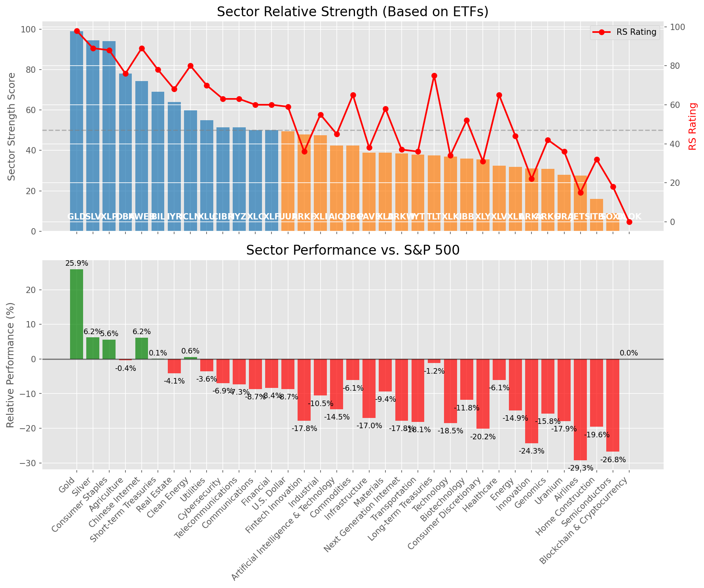

# **Daily Relative Strength Report**

**Date:** 2025-04-21

## **Market Valuation (Buffett Indicator)**

| Metric | Value |
|--------|-------|
| **Market Valuation** | **Undervalued** |
| **Current Ratio** | 8.43 |
| **Historical Mean** | 9.62 |
| **Standard Deviation** | 0.49 |
| **Z-Score (StdDev from Mean)** | -1.88 |
| **Total Market Cap** | $250.59 trillion |
| **GDP** | $29.72 trillion |

## **Market Insights**

### **Market is Undervalued**

The market is trading below historical average valuations, suggesting potential opportunity. These conditions have historically preceded periods of above-average returns. Investors should:

- Look for stocks breaking out of consolidation patterns on increasing volume
- Focus on sectors showing relative strength
- Consider increasing equity exposure, particularly in quality names
- Be mindful of overall market direction and avoid fighting the trend

History suggests patient investors are often rewarded when investing during periods of undervaluation.

### **Buffett Indicator Overview**

The Buffett Indicator (Total Market Cap / GDP) is a measure of the stock market's valuation relative to the size of the economy. It is named after Warren Buffett, who described it as "probably the best single measure of where valuations stand at any given moment."

- **Values above +2 standard deviations:** Market significantly overvalued
- **Values above +1 standard deviation:** Market overvalued
- **Values between -1 and +1 standard deviations:** Market fairly valued
- **Values below -1 standard deviation:** Market undervalued
- **Values below -2 standard deviations:** Market significantly undervalued

---

## **Sector Relative Strength**

Based on William O'Neil's Relative Strength Methodology

| ETF | Strength | RS Rating | Performance | Above Key MAs | Trend | Sector |
|-----|----------|-----------|-------------|--------------|-------|--------|
| [GLD](https://www.tradingview.com/chart/?symbol=GLD) | 99.0 | 98.0 | 25.45% | 10d ✓, 50d ✓, 200d ✓ | ↗️ | Gold |
| [SLV](https://www.tradingview.com/chart/?symbol=SLV) | 94.0 | 88.0 | 5.46% | 10d ✓, 50d ✓, 200d ✓ | ↗️ | Silver |
| [XLP](https://www.tradingview.com/chart/?symbol=XLP) | 83.6 | 87.0 | 4.75% | 10d ✓, 50d ✗, 200d ✓ | ↗️ | Consumer Staples |
| [DBA](https://www.tradingview.com/chart/?symbol=DBA) | 78.1 | 76.0 | -0.47% | 10d ✓, 50d ✗, 200d ✓ | ↗️ | Agriculture |
| [IYZ](https://www.tradingview.com/chart/?symbol=IYZ) | 73.6 | 67.0 | -4.63% | 10d ✓, 50d ✗, 200d ✓ | ↗️ | Telecommunications |
| [BIL](https://www.tradingview.com/chart/?symbol=BIL) | 69.0 | 78.0 | 0.06% | 10d ✓, 50d ✓, 200d ✓ | ↘️ | Short-term Treasuries |
| [KWEB](https://www.tradingview.com/chart/?symbol=KWEB) | 64.0 | 88.0 | 5.10% | 10d ✗, 50d ✗, 200d ✗ | ↗️ | Chinese Internet |
| [IYR](https://www.tradingview.com/chart/?symbol=IYR) | 63.4 | 67.0 | -4.90% | 10d ✓, 50d ✗, 200d ✗ | ↗️ | Real Estate |
| [ICLN](https://www.tradingview.com/chart/?symbol=ICLN) | 59.3 | 79.0 | 0.13% | 10d ✓, 50d ✓, 200d ✗ | ↘️ | Clean Energy |
| [XLU](https://www.tradingview.com/chart/?symbol=XLU) | 54.0 | 68.0 | -4.29% | 10d ✗, 50d ✗, 200d ✗ | ↗️ | Utilities |
| [ARKW](https://www.tradingview.com/chart/?symbol=ARKW) | 51.4 | 43.0 | -15.46% | 10d ✓, 50d ✗, 200d ✗ | ↗️ | Next Generation Internet |
| [CIBR](https://www.tradingview.com/chart/?symbol=CIBR) | 51.0 | 62.0 | -7.46% | 10d ✗, 50d ✗, 200d ✗ | ↗️ | Cybersecurity |
| [UUP](https://www.tradingview.com/chart/?symbol=UUP) | 50.0 | 60.0 | -8.60% | 10d ✗, 50d ✗, 200d ✗ | ↗️ | U.S. Dollar |
| [XLF](https://www.tradingview.com/chart/?symbol=XLF) | 49.5 | 59.0 | -8.96% | 10d ✗, 50d ✗, 200d ✗ | ↗️ | Financial |
| [XLC](https://www.tradingview.com/chart/?symbol=XLC) | 49.0 | 58.0 | -9.23% | 10d ✗, 50d ✗, 200d ✗ | ↗️ | Communications |
| [XLI](https://www.tradingview.com/chart/?symbol=XLI) | 47.0 | 54.0 | -11.31% | 10d ✗, 50d ✗, 200d ✗ | ↗️ | Industrial |
| [DBC](https://www.tradingview.com/chart/?symbol=DBC) | 41.9 | 64.0 | -6.38% | 10d ✓, 50d ✗, 200d ✗ | ↘️ | Commodities |
| [AIQ](https://www.tradingview.com/chart/?symbol=AIQ) | 41.5 | 43.0 | -15.30% | 10d ✗, 50d ✗, 200d ✗ | ↗️ | Artificial Intelligence & Technology |
| [PAVE](https://www.tradingview.com/chart/?symbol=PAVE) | 38.5 | 37.0 | -17.76% | 10d ✗, 50d ✗, 200d ✗ | ↗️ | Infrastructure |
| [ARKF](https://www.tradingview.com/chart/?symbol=ARKF) | 37.5 | 35.0 | -18.64% | 10d ✗, 50d ✗, 200d ✗ | ↗️ | Fintech Innovation |
| [TLT](https://www.tradingview.com/chart/?symbol=TLT) | 37.5 | 75.0 | -0.96% | 10d ✗, 50d ✗, 200d ✗ | ↘️ | Long-term Treasuries |
| [IYT](https://www.tradingview.com/chart/?symbol=IYT) | 37.0 | 34.0 | -18.92% | 10d ✗, 50d ✗, 200d ✗ | ↗️ | Transportation |
| [XLK](https://www.tradingview.com/chart/?symbol=XLK) | 36.5 | 33.0 | -19.40% | 10d ✗, 50d ✗, 200d ✗ | ↗️ | Technology |
| [IBB](https://www.tradingview.com/chart/?symbol=IBB) | 36.4 | 53.0 | -11.76% | 10d ✓, 50d ✗, 200d ✗ | ↘️ | Biotechnology |
| [XLY](https://www.tradingview.com/chart/?symbol=XLY) | 34.5 | 29.0 | -21.19% | 10d ✗, 50d ✗, 200d ✗ | ↗️ | Consumer Discretionary |
| [XLV](https://www.tradingview.com/chart/?symbol=XLV) | 32.0 | 64.0 | -6.32% | 10d ✗, 50d ✗, 200d ✗ | ↘️ | Healthcare |
| [ARKK](https://www.tradingview.com/chart/?symbol=ARKK) | 30.5 | 21.0 | -25.37% | 10d ✗, 50d ✗, 200d ✗ | ↗️ | Innovation |
| [ARKG](https://www.tradingview.com/chart/?symbol=ARKG) | 30.4 | 41.0 | -15.98% | 10d ✓, 50d ✗, 200d ✗ | ↘️ | Genomics |
| [XLB](https://www.tradingview.com/chart/?symbol=XLB) | 28.0 | 56.0 | -10.14% | 10d ✗, 50d ✗, 200d ✗ | ↘️ | Materials |
| [JETS](https://www.tradingview.com/chart/?symbol=JETS) | 27.5 | 15.0 | -29.76% | 10d ✗, 50d ✗, 200d ✗ | ↗️ | Airlines |
| [URA](https://www.tradingview.com/chart/?symbol=URA) | 26.4 | 33.0 | -19.10% | 10d ✓, 50d ✗, 200d ✗ | ↘️ | Uranium |
| [XLE](https://www.tradingview.com/chart/?symbol=XLE) | 21.0 | 42.0 | -15.66% | 10d ✗, 50d ✗, 200d ✗ | ↘️ | Energy |
| [ITB](https://www.tradingview.com/chart/?symbol=ITB) | 15.5 | 31.0 | -20.37% | 10d ✗, 50d ✗, 200d ✗ | ↘️ | Home Construction |
| [SOXX](https://www.tradingview.com/chart/?symbol=SOXX) | 8.5 | 17.0 | -28.08% | 10d ✗, 50d ✗, 200d ✗ | ↘️ | Semiconductors |
| [BLOK](https://www.tradingview.com/chart/?symbol=BLOK) | 0.0 | 0.0 | 0.00% | 10d ✗, 50d ✗, 200d ✗ | ↘️ | Blockchain & Cryptocurrency |

### **Sector ETF Performance Interpretation**

This table shows the relative strength metrics for different market sectors based on their representative ETFs:

- **ETF**: The ETF used to measure sector performance (click for chart)
- **Strength**: Overall sector strength score (0-100) combining multiple factors
- **RS Rating**: O'Neil RS rating of the sector ETF
- **Performance**: Performance of the sector ETF relative to SPY
- **Above Key MAs**: Whether the ETF is trading above its 10, 50, and 200-day moving averages
- **Trend**: Whether the sector is in an uptrend (↗️) or downtrend (↘️)

### **Current Sector Leadership**

The current market leadership is coming from the following sectors: **Gold, Silver, Consumer Staples**.

The **Gold** sector (represented by **GLD**) is showing particularly strong relative strength with an RS rating of 98.0 and performance of 25.45% vs. the S&P 500. This sector is trading above its 10-day, 50-day, 200-day moving average(s). Investors should consider focusing on high RS stocks within these leading sectors for potential outperformance.

---

## **Buy Recommendations**

The following 47 stocks show exceptional relative strength:

| RS Rating | Buy Score | Current Price | Chart | Name | Ticker |
|-----------|-----------|---------------|-------|------|--------|
| 100 | 100 | $84.67 | [Chart](https://www.tradingview.com/chart/?symbol=WPM) | Wheaton Precious Metals Corp. Common Stock | WPM |
| 100 | 100 | $150.49 | [Chart](https://www.tradingview.com/chart/?symbol=UGL) | ProShares Ultra Gold | UGL |
| 100 | 100 | $29.26 | [Chart](https://www.tradingview.com/chart/?symbol=AGI) | Alamos Gold Inc. Class A Common Shares | AGI |
| 99 | 100 | $64.12 | [Chart](https://www.tradingview.com/chart/?symbol=GDXJ) | VanEck Junior Gold Miners ETF | GDXJ |
| 99 | 100 | $121.48 | [Chart](https://www.tradingview.com/chart/?symbol=AEM) | Agnico Eagle Mines Ltd. | AEM |
| 99 | 100 | $183.79 | [Chart](https://www.tradingview.com/chart/?symbol=RGLD) | Royal Gold Inc | RGLD |
| 99 | 100 | $160.22 | [Chart](https://www.tradingview.com/chart/?symbol=PM) | Philip Morris International Inc. | PM |
| 99 | 100 | $149.79 | [Chart](https://www.tradingview.com/chart/?symbol=PLMR) | Palomar Holdings, Inc. Common stock | PLMR |
| 98 | 100 | $32.53 | [Chart](https://www.tradingview.com/chart/?symbol=SGOL) | abrdn Physical Gold Shares ETF | SGOL |
| 98 | 100 | $67.54 | [Chart](https://www.tradingview.com/chart/?symbol=GLDM) | SPDR Gold MiniShares | GLDM |
| 98 | 100 | $32.88 | [Chart](https://www.tradingview.com/chart/?symbol=OUNZ) | VanEck Merk Gold ETF | OUNZ |
| 98 | 100 | $34.01 | [Chart](https://www.tradingview.com/chart/?symbol=IAUM) | iShares Gold Trust Micro | IAUM |
| 98 | 100 | $33.62 | [Chart](https://www.tradingview.com/chart/?symbol=BAR) | GraniteShares Gold Shares | BAR |
| 98 | 100 | $64.33 | [Chart](https://www.tradingview.com/chart/?symbol=IAU) | iShares Gold Trust | IAU |
| 98 | 100 | $314.37 | [Chart](https://www.tradingview.com/chart/?symbol=GLD) | SPDR Gold Trust, SPDR Gold Shares | GLD |
| 98 | 100 | $15.82 | [Chart](https://www.tradingview.com/chart/?symbol=EZPW) | Ezcorp Inc | EZPW |
| 97 | 100 | $23.03 | [Chart](https://www.tradingview.com/chart/?symbol=DB) | Deutsche Bank Aktiengesellschaft | DB |
| 97 | 100 | $29.90 | [Chart](https://www.tradingview.com/chart/?symbol=CEF) | Sprott Physical Gold and Silver Trust | CEF |
| 97 | 100 | $23.18 | [Chart](https://www.tradingview.com/chart/?symbol=OR) | Osisko Gold Royalties Ltd | OR |
| 97 | 100 | $26.09 | [Chart](https://www.tradingview.com/chart/?symbol=PHYS) | Sprott Physical Gold Trust | PHYS |
| 97 | 100 | $42.22 | [Chart](https://www.tradingview.com/chart/?symbol=BTI) | British American Tobacco p.l.c. American Depositary Shares, American Depositary Shares, each representing one Ordinary Share | BTI |
| 97 | 100 | $71.52 | [Chart](https://www.tradingview.com/chart/?symbol=KR) | The Kroger Co. | KR |
| 96 | 100 | $53.17 | [Chart](https://www.tradingview.com/chart/?symbol=PPC) | Pilgrims Pride Corporation | PPC |
| 96 | 100 | $87.89 | [Chart](https://www.tradingview.com/chart/?symbol=CCEP) | Coca-Cola Europacific Partners plc Ordinary Shares | CCEP |
| 96 | 100 | $978.07 | [Chart](https://www.tradingview.com/chart/?symbol=NFLX) | NetFlix Inc | NFLX |
| 96 | 100 | $80.29 | [Chart](https://www.tradingview.com/chart/?symbol=SNEX) | StoneX Group Inc. Common Stock | SNEX |
| 96 | 100 | $28.18 | [Chart](https://www.tradingview.com/chart/?symbol=EUFN) | iShares MSCI Europe Financials ETF | EUFN |
| 95 | 100 | $77.60 | [Chart](https://www.tradingview.com/chart/?symbol=SR) | Spire Inc. | SR |
| 95 | 100 | $448.57 | [Chart](https://www.tradingview.com/chart/?symbol=CASY) | Casey's General Stores Inc | CASY |
| 95 | 100 | $22.86 | [Chart](https://www.tradingview.com/chart/?symbol=SRAD) | Sportradar Group AG Class A Ordinary Shares | SRAD |
| 94 | 100 | $19.01 | [Chart](https://www.tradingview.com/chart/?symbol=GRND) | Grindr Inc. | GRND |
| 91 | 100 | $51.98 | [Chart](https://www.tradingview.com/chart/?symbol=RELX) | RELX PLC | RELX |
| 91 | 100 | $78.00 | [Chart](https://www.tradingview.com/chart/?symbol=ADC) | Agree Realty Corporation | ADC |
| 91 | 100 | $123.48 | [Chart](https://www.tradingview.com/chart/?symbol=BECN) | Beacon Roofing Supply, Inc. | BECN |
| 91 | 100 | $17.95 | [Chart](https://www.tradingview.com/chart/?symbol=KT) | KT Corp. | KT |
| 90 | 100 | $155.03 | [Chart](https://www.tradingview.com/chart/?symbol=ATO) | Atmos Energy Corporation | ATO |
| 90 | 100 | $92.82 | [Chart](https://www.tradingview.com/chart/?symbol=PNW) | Pinnacle West Capital Corporation | PNW |
| 90 | 100 | $49.74 | [Chart](https://www.tradingview.com/chart/?symbol=NJR) | New Jersey Resources Corp | NJR |
| 88 | 100 | $34.96 | [Chart](https://www.tradingview.com/chart/?symbol=PPL) | PPL Corporation | PPL |
| 87 | 98 | $48.43 | [Chart](https://www.tradingview.com/chart/?symbol=TRP) | TC Energy Corporation | TRP |
| 85 | 98 | $29.45 | [Chart](https://www.tradingview.com/chart/?symbol=AHR) | American Healthcare REIT, Inc. | AHR |
| 87 | 96 | $33.09 | [Chart](https://www.tradingview.com/chart/?symbol=FDP) | Fresh Del Monte Produce Inc. | FDP |
| 84 | 95 | $114.55 | [Chart](https://www.tradingview.com/chart/?symbol=CWST) | Casella Waste Systems Inc | CWST |
| 82 | 95 | $111.77 | [Chart](https://www.tradingview.com/chart/?symbol=BOXX) | Alpha Architect 1-3 Month Box ETF | BOXX |
| 84 | 94 | $49.85 | [Chart](https://www.tradingview.com/chart/?symbol=VTIP) | Vanguard Short-Term Inflation-Protected Securities Index Fund | VTIP |
| 83 | 93 | $72.05 | [Chart](https://www.tradingview.com/chart/?symbol=BBCA) | JPMorgan BetaBuilders Canada ETF | BBCA |
| 81 | 91 | $54.31 | [Chart](https://www.tradingview.com/chart/?symbol=IGF) | iShares Global Infrastructure ETF | IGF |

---

## **Sell Recommendations**

The following 202 stocks show deteriorating relative strength:

| RS Rating | Sell Score | Current Price | Chart | Name | Ticker |
|-----------|------------|---------------|-------|------|--------|
| 1 | 100 | $16.30 | [Chart](https://www.tradingview.com/chart/?symbol=TNDM) | Tandem Diabetes Care, Inc. | TNDM |
| 1 | 100 | $38.52 | [Chart](https://www.tradingview.com/chart/?symbol=TECL) | Direxion Daily Technology Bull 3x Shares | TECL |
| 2 | 100 | $10.03 | [Chart](https://www.tradingview.com/chart/?symbol=FLYW) | Flywire Corporation Voting Common Stock | FLYW |
| 2 | 100 | $15.31 | [Chart](https://www.tradingview.com/chart/?symbol=SSTK) | SHUTTERSTOCK, INC. | SSTK |
| 2 | 100 | $74.28 | [Chart](https://www.tradingview.com/chart/?symbol=FRPT) | Freshpet, Inc. | FRPT |
| 3 | 100 | $70.77 | [Chart](https://www.tradingview.com/chart/?symbol=ILMN) | Illumina Inc | ILMN |
| 3 | 100 | $22.04 | [Chart](https://www.tradingview.com/chart/?symbol=SM) | SM Energy Company | SM |
| 3 | 100 | $16.45 | [Chart](https://www.tradingview.com/chart/?symbol=ICHR) | Ichor Holdings | ICHR |
| 4 | 100 | $17.05 | [Chart](https://www.tradingview.com/chart/?symbol=DAVA) | Endava plc American Depositary Shares (each representing one Class A Ordinary Share) | DAVA |
| 4 | 100 | $21.91 | [Chart](https://www.tradingview.com/chart/?symbol=RPD) | Rapid7, Inc. Common Stock | RPD |
| 4 | 100 | $10.40 | [Chart](https://www.tradingview.com/chart/?symbol=BCYC) | Bicycle Therapeutics plc American Depositary Shares | BCYC |
| 5 | 100 | $47.02 | [Chart](https://www.tradingview.com/chart/?symbol=LABU) | Direxion Daily S&P Biotech Bull 3X Shares | LABU |
| 5 | 100 | $57.97 | [Chart](https://www.tradingview.com/chart/?symbol=CAMT) | Camtek Ltd | CAMT |
| 5 | 100 | $24.52 | [Chart](https://www.tradingview.com/chart/?symbol=FORM) | FormFactor Inc. | FORM |
| 5 | 100 | $25.11 | [Chart](https://www.tradingview.com/chart/?symbol=W) | Wayfair Inc. | W |
| 5 | 100 | $21.37 | [Chart](https://www.tradingview.com/chart/?symbol=FIVN) | FIVE9, INC. | FIVN |
| 6 | 100 | $60.99 | [Chart](https://www.tradingview.com/chart/?symbol=ARCB) | ArcBest Corporation | ARCB |
| 6 | 100 | $18.96 | [Chart](https://www.tradingview.com/chart/?symbol=SPT) | Sprout Social, Inc Class A Common Stock | SPT |
| 6 | 100 | $12.37 | [Chart](https://www.tradingview.com/chart/?symbol=IMXI) | International Money Express, Inc. | IMXI |
| 6 | 100 | $32.46 | [Chart](https://www.tradingview.com/chart/?symbol=TDW) | Tidewater, Inc. | TDW |
| 7 | 100 | $19.27 | [Chart](https://www.tradingview.com/chart/?symbol=SYM) | Symbotic Inc. Class A Common Stock | SYM |
| 7 | 100 | $52.54 | [Chart](https://www.tradingview.com/chart/?symbol=VAC) | MARRIOTT VACATIONS WORLDWIDE CORPORATION | VAC |
| 7 | 100 | $44.23 | [Chart](https://www.tradingview.com/chart/?symbol=ACLS) | Axcelis Technologies Inc | ACLS |
| 7 | 100 | $12.06 | [Chart](https://www.tradingview.com/chart/?symbol=GCT) | GigaCloud Technology Inc Class A Ordinary Shares | GCT |
| 7 | 100 | $18.20 | [Chart](https://www.tradingview.com/chart/?symbol=APLS) | Apellis Pharmaceuticals, Inc. Common Stock | APLS |
| 8 | 100 | $25.84 | [Chart](https://www.tradingview.com/chart/?symbol=XPEL) | XPEL, Inc. Common Stock | XPEL |
| 8 | 100 | $21.69 | [Chart](https://www.tradingview.com/chart/?symbol=NSSC) | Napco Security Technologies, Inc | NSSC |
| 8 | 100 | $17.84 | [Chart](https://www.tradingview.com/chart/?symbol=BZH) | Beazer Homes USA, Inc. New | BZH |
| 8 | 100 | $20.58 | [Chart](https://www.tradingview.com/chart/?symbol=HI) | Hillenbrand, Inc. | HI |
| 8 | 100 | $12.50 | [Chart](https://www.tradingview.com/chart/?symbol=DK) | Delek US Holdings, Inc. | DK |
| 8 | 100 | $21.68 | [Chart](https://www.tradingview.com/chart/?symbol=THS) | Treehouse Foods, Inc. | THS |
| 8 | 100 | $11.17 | [Chart](https://www.tradingview.com/chart/?symbol=ARCT) | Arcturus Therapeutics Holdings Inc. Common Stock | ARCT |
| 8 | 100 | $12.13 | [Chart](https://www.tradingview.com/chart/?symbol=DV) | DoubleVerify Holdings, Inc. | DV |
| 9 | 100 | $34.26 | [Chart](https://www.tradingview.com/chart/?symbol=STNG) | Scorpio Tankers Inc. | STNG |
| 9 | 100 | $14.17 | [Chart](https://www.tradingview.com/chart/?symbol=MEG) | Montrose Environmental Group, Inc. | MEG |
| 9 | 100 | $14.69 | [Chart](https://www.tradingview.com/chart/?symbol=IART) | Integra LifeSciences Holdings | IART |
| 10 | 100 | $20.00 | [Chart](https://www.tradingview.com/chart/?symbol=TDC) | TERADATA CORPORATION | TDC |
| 10 | 100 | $17.41 | [Chart](https://www.tradingview.com/chart/?symbol=VECO) | Veeco Instruments Inc | VECO |
| 10 | 100 | $95.89 | [Chart](https://www.tradingview.com/chart/?symbol=ARM) | Arm Holdings plc American Depositary Shares | ARM |
| 11 | 100 | $11.54 | [Chart](https://www.tradingview.com/chart/?symbol=AEYE) | AudioEye, Inc. Common Stock | AEYE |
| 11 | 100 | $11.31 | [Chart](https://www.tradingview.com/chart/?symbol=ADNT) | Adient plc Ordinary Shares | ADNT |
| 11 | 100 | $18.73 | [Chart](https://www.tradingview.com/chart/?symbol=ST) | Sensata Technologies Holding plc | ST |
| 12 | 100 | $19.21 | [Chart](https://www.tradingview.com/chart/?symbol=FOXF) | Fox Factory Holding Corp. Common Stock | FOXF |
| 13 | 100 | $27.24 | [Chart](https://www.tradingview.com/chart/?symbol=SRDX) | Surmodics, Inc. Common Stock | SRDX |
| 14 | 100 | $12.71 | [Chart](https://www.tradingview.com/chart/?symbol=XRAY) | DENTSPLY SIRONA Inc. | XRAY |
| 15 | 100 | $37.73 | [Chart](https://www.tradingview.com/chart/?symbol=FMC) | FMC Corporation | FMC |
| 15 | 100 | $58.50 | [Chart](https://www.tradingview.com/chart/?symbol=ATKR) | Atkore Inc. | ATKR |
| 17 | 100 | $11.30 | [Chart](https://www.tradingview.com/chart/?symbol=TRIP) | TripAdvisor, Inc. | TRIP |
| 7 | 99 | $19.36 | [Chart](https://www.tradingview.com/chart/?symbol=CECO) | Ceco Environmental Corp | CECO |
| 12 | 99 | $12.28 | [Chart](https://www.tradingview.com/chart/?symbol=MARA) | MARA Holdings, Inc. Common Stock | MARA |
| 18 | 99 | $30.10 | [Chart](https://www.tradingview.com/chart/?symbol=URNM) | Sprott Uranium Miners ETF | URNM |
| 5 | 98 | $10.82 | [Chart](https://www.tradingview.com/chart/?symbol=ZETA) | Zeta Global Holdings Corp. | ZETA |
| 7 | 98 | $22.27 | [Chart](https://www.tradingview.com/chart/?symbol=WSC) | WillScot Holdings Corporation Class A Common Stock | WSC |
| 8 | 98 | $27.00 | [Chart](https://www.tradingview.com/chart/?symbol=UWM) | ProShares Ultra Russell2000 | UWM |
| 9 | 98 | $121.46 | [Chart](https://www.tradingview.com/chart/?symbol=FSLR) | First Solar, Inc. | FSLR |
| 10 | 98 | $10.50 | [Chart](https://www.tradingview.com/chart/?symbol=OGN) | Organon & Co. | OGN |
| 12 | 98 | $48.06 | [Chart](https://www.tradingview.com/chart/?symbol=NVT) | nVent Electric plc Ordinary Shares | NVT |
| 14 | 98 | $21.22 | [Chart](https://www.tradingview.com/chart/?symbol=UCO) | ProShares Ultra Bloomberg Crude Oil | UCO |
| 11 | 97 | $105.41 | [Chart](https://www.tradingview.com/chart/?symbol=GNRC) | GENERAC HOLDINGS INC | GNRC |
| 11 | 97 | $21.50 | [Chart](https://www.tradingview.com/chart/?symbol=VERA) | Vera Therapeutics, Inc. Class A Common Stock | VERA |
| 13 | 97 | $44.59 | [Chart](https://www.tradingview.com/chart/?symbol=ERX) | Direxion Daily Energy Bull 2X Shares | ERX |
| 14 | 97 | $14.09 | [Chart](https://www.tradingview.com/chart/?symbol=PBW) | Invesco WilderHill Clean Energy ETF | PBW |
| 15 | 97 | $29.86 | [Chart](https://www.tradingview.com/chart/?symbol=TTEK) | Tetra Tech Inc | TTEK |
| 17 | 97 | $34.59 | [Chart](https://www.tradingview.com/chart/?symbol=LIVN) | LivaNova PLC Ordinary Shares | LIVN |
| 19 | 97 | $15.46 | [Chart](https://www.tradingview.com/chart/?symbol=TRMD) | TORM plc Class A Common Stock | TRMD |
| 23 | 97 | $13.66 | [Chart](https://www.tradingview.com/chart/?symbol=FXN) | First Trust Energy AlphaDEX Fund | FXN |
| 23 | 97 | $32.56 | [Chart](https://www.tradingview.com/chart/?symbol=IAC) | IAC Inc. Common Stock | IAC |
| 13 | 96 | $31.07 | [Chart](https://www.tradingview.com/chart/?symbol=ENOV) | Enovis Corporation | ENOV |
| 16 | 96 | $12.21 | [Chart](https://www.tradingview.com/chart/?symbol=ZVZZT) | SUPER Montage TEST SYMBOL | ZVZZT |
| 9 | 95 | $33.96 | [Chart](https://www.tradingview.com/chart/?symbol=CRC) | California Resources Corporation | CRC |
| 9 | 95 | $31.74 | [Chart](https://www.tradingview.com/chart/?symbol=SCSC) | Scansource Inc | SCSC |
| 10 | 95 | $320.07 | [Chart](https://www.tradingview.com/chart/?symbol=SAIA) | Saia, Inc. | SAIA |
| 13 | 95 | $17.76 | [Chart](https://www.tradingview.com/chart/?symbol=AMN) | AMN Healthcare Services | AMN |
| 16 | 95 | $113.61 | [Chart](https://www.tradingview.com/chart/?symbol=BLDR) | Builders FirstSource, Inc. | BLDR |
| 21 | 95 | $44.10 | [Chart](https://www.tradingview.com/chart/?symbol=EDU) | New Oriental Education and Technology Group, Inc. American Depositary Shares (each representing ten (10) Common Shares) | EDU |
| 11 | 94 | $32.54 | [Chart](https://www.tradingview.com/chart/?symbol=FLR) | Fluor Corporation | FLR |
| 12 | 94 | $56.09 | [Chart](https://www.tradingview.com/chart/?symbol=SWK) | Stanley Black & Decker, Inc. | SWK |
| 15 | 94 | $33.30 | [Chart](https://www.tradingview.com/chart/?symbol=TEX) | Terex Corporation | TEX |
| 16 | 94 | $18.19 | [Chart](https://www.tradingview.com/chart/?symbol=FOR) | Forestar Group Inc. | FOR |
| 17 | 94 | $91.18 | [Chart](https://www.tradingview.com/chart/?symbol=CHRD) | Chord Energy Corporation Common Stock | CHRD |
| 20 | 94 | $38.02 | [Chart](https://www.tradingview.com/chart/?symbol=SIMO) | Silicon Motion Technology Corporation | SIMO |
| 8 | 93 | $13.54 | [Chart](https://www.tradingview.com/chart/?symbol=DNLI) | Denali Therapeutics Inc. Common Stock | DNLI |
| 12 | 93 | $19.79 | [Chart](https://www.tradingview.com/chart/?symbol=UPBD) | Upbound Group, Inc. Common Stock | UPBD |
| 12 | 93 | $13.84 | [Chart](https://www.tradingview.com/chart/?symbol=DXC) | DXC Technology Company | DXC |
| 16 | 93 | $83.97 | [Chart](https://www.tradingview.com/chart/?symbol=AMD) | Advanced Micro Devices | AMD |
| 16 | 93 | $30.29 | [Chart](https://www.tradingview.com/chart/?symbol=TENB) | Tenable Holdings, Inc. | TENB |
| 17 | 93 | $10.31 | [Chart](https://www.tradingview.com/chart/?symbol=VREX) | Varex Imaging Corporation Common Stock | VREX |
| 17 | 93 | $10.77 | [Chart](https://www.tradingview.com/chart/?symbol=SONO) | Sonos, Inc. Common Stock | SONO |
| 22 | 93 | $11.22 | [Chart](https://www.tradingview.com/chart/?symbol=OSCR) | Oscar Health, Inc. | OSCR |
| 11 | 92 | $17.35 | [Chart](https://www.tradingview.com/chart/?symbol=OII) | Oceaneering International Inc. | OII |
| 12 | 92 | $80.73 | [Chart](https://www.tradingview.com/chart/?symbol=NTAP) | NetApp, Inc | NTAP |
| 12 | 92 | $41.51 | [Chart](https://www.tradingview.com/chart/?symbol=DFIN) | Donnelley Financial Solutions, Inc. | DFIN |
| 15 | 92 | $127.65 | [Chart](https://www.tradingview.com/chart/?symbol=TFX) | Teleflex Incorporated | TFX |
| 15 | 92 | $32.27 | [Chart](https://www.tradingview.com/chart/?symbol=OVV) | Ovintiv Inc. | OVV |
| 18 | 92 | $27.08 | [Chart](https://www.tradingview.com/chart/?symbol=YETI) | YETI Holdings, Inc. Common Stock | YETI |
| 19 | 92 | $93.47 | [Chart](https://www.tradingview.com/chart/?symbol=BCC) | Boise Cascade Company | BCC |
| 19 | 92 | $29.92 | [Chart](https://www.tradingview.com/chart/?symbol=JANX) | Janux Therapeutics, Inc. Common Stock | JANX |
| 20 | 92 | $16.26 | [Chart](https://www.tradingview.com/chart/?symbol=STAA) | Staar Surgical Co | STAA |
| 21 | 92 | $11.82 | [Chart](https://www.tradingview.com/chart/?symbol=BAND) | Bandwidth Inc. Class A Common Stock | BAND |
| 21 | 92 | $45.35 | [Chart](https://www.tradingview.com/chart/?symbol=POWI) | Power Integrations Inc | POWI |
| 9 | 91 | $50.03 | [Chart](https://www.tradingview.com/chart/?symbol=BOIL) | ProShares Ultra Bloomberg Natural Gas | BOIL |
| 11 | 91 | $22.21 | [Chart](https://www.tradingview.com/chart/?symbol=RNG) | RINGCENTRAL, INC. | RNG |
| 21 | 91 | $25.82 | [Chart](https://www.tradingview.com/chart/?symbol=SEE) | Sealed Air Corp. | SEE |
| 17 | 90 | $21.02 | [Chart](https://www.tradingview.com/chart/?symbol=CGON) | CG Oncology, Inc. Common stock | CGON |
| 20 | 90 | $34.00 | [Chart](https://www.tradingview.com/chart/?symbol=TWST) | Twist Bioscience Corporation Common Stock | TWST |
| 24 | 90 | $69.35 | [Chart](https://www.tradingview.com/chart/?symbol=IR) | Ingersoll Rand Inc. Common Stock | IR |
| 15 | 89 | $10.40 | [Chart](https://www.tradingview.com/chart/?symbol=NEOG) | Neogen Corp | NEOG |
| 17 | 89 | $15.38 | [Chart](https://www.tradingview.com/chart/?symbol=MLKN) | MillerKnoll, Inc. Common Stock | MLKN |
| 27 | 89 | $11.92 | [Chart](https://www.tradingview.com/chart/?symbol=MED) | Medifast, Inc. | MED |
| 16 | 88 | $15.47 | [Chart](https://www.tradingview.com/chart/?symbol=PRO) | Pros Holdings, Inc. | PRO |
| 17 | 88 | $169.12 | [Chart](https://www.tradingview.com/chart/?symbol=FN) | Fabrinet | FN |
| 19 | 88 | $132.29 | [Chart](https://www.tradingview.com/chart/?symbol=MTN) | Vail Resorts, Inc. | MTN |
| 23 | 88 | $10.93 | [Chart](https://www.tradingview.com/chart/?symbol=RIVN) | Rivian Automotive, Inc. Class A Common Stock | RIVN |
| 23 | 88 | $30.99 | [Chart](https://www.tradingview.com/chart/?symbol=GFS) | GlobalFoundries Inc. Ordinary Shares | GFS |
| 13 | 87 | $91.12 | [Chart](https://www.tradingview.com/chart/?symbol=TOL) | Toll Brothers, Inc. | TOL |
| 19 | 87 | $10.46 | [Chart](https://www.tradingview.com/chart/?symbol=JAMF) | Jamf Holding Corp. Common Stock | JAMF |
| 19 | 87 | $21.91 | [Chart](https://www.tradingview.com/chart/?symbol=HOG) | Harley-Davidson, Inc. | HOG |
| 20 | 87 | $138.99 | [Chart](https://www.tradingview.com/chart/?symbol=PTC) | PTC, INC | PTC |
| 21 | 87 | $33.46 | [Chart](https://www.tradingview.com/chart/?symbol=CALF) | Pacer US Small Cap Cash Cows ETF | CALF |
| 22 | 86 | $20.08 | [Chart](https://www.tradingview.com/chart/?symbol=MGY) | Magnolia Oil & Gas Corporation Class A Common Stock | MGY |
| 16 | 85 | $10.54 | [Chart](https://www.tradingview.com/chart/?symbol=XHR) | Xenia Hotels & Resorts, Inc. | XHR |
| 18 | 85 | $202.13 | [Chart](https://www.tradingview.com/chart/?symbol=FDX) | FedEx Corporation | FDX |
| 20 | 85 | $27.75 | [Chart](https://www.tradingview.com/chart/?symbol=WERN) | Werner Enterprises Inc | WERN |
| 20 | 85 | $24.75 | [Chart](https://www.tradingview.com/chart/?symbol=CZR) | Caesars Entertainment, Inc. Common Stock | CZR |
| 20 | 85 | $50.59 | [Chart](https://www.tradingview.com/chart/?symbol=KBH) | KB Home | KBH |
| 29 | 85 | $63.61 | [Chart](https://www.tradingview.com/chart/?symbol=MTH) | Meritage Homes Corporation | MTH |
| 32 | 85 | $20.31 | [Chart](https://www.tradingview.com/chart/?symbol=LPG) | DORIAN LPG LTD | LPG |
| 32 | 85 | $11.79 | [Chart](https://www.tradingview.com/chart/?symbol=OEC) | Orion S.A. | OEC |
| 22 | 84 | $31.58 | [Chart](https://www.tradingview.com/chart/?symbol=NGVT) | Ingevity Corporation | NGVT |
| 22 | 84 | $50.16 | [Chart](https://www.tradingview.com/chart/?symbol=HXL) | Hexcel Corporation | HXL |
| 25 | 84 | $90.31 | [Chart](https://www.tradingview.com/chart/?symbol=WLK) | Westlake Corporation | WLK |
| 26 | 84 | $57.16 | [Chart](https://www.tradingview.com/chart/?symbol=QRVO) | Qorvo, Inc. | QRVO |
| 30 | 84 | $10.96 | [Chart](https://www.tradingview.com/chart/?symbol=NAVI) | Navient Corporation | NAVI |
| 23 | 83 | $32.21 | [Chart](https://www.tradingview.com/chart/?symbol=TECK) | Teck Resources Limited | TECK |
| 25 | 83 | $56.38 | [Chart](https://www.tradingview.com/chart/?symbol=HAE) | Haemonetics Corporation | HAE |
| 26 | 83 | $18.89 | [Chart](https://www.tradingview.com/chart/?symbol=BITO) | ProShares Bitcoin ETF | BITO |
| 28 | 82 | $23.81 | [Chart](https://www.tradingview.com/chart/?symbol=PINS) | Pinterest, Inc. Class A Common Stock | PINS |
| 21 | 81 | $18.25 | [Chart](https://www.tradingview.com/chart/?symbol=KMT) | Kennametal Inc. | KMT |
| 28 | 81 | $10.84 | [Chart](https://www.tradingview.com/chart/?symbol=KELYA) | Kelly Services Inc | KELYA |
| 29 | 81 | $27.34 | [Chart](https://www.tradingview.com/chart/?symbol=TAN) | Invesco Solar ETF | TAN |
| 30 | 81 | $15.23 | [Chart](https://www.tradingview.com/chart/?symbol=SEM) | SELECT MEDICAL HOLDINGS CORP | SEM |
| 30 | 81 | $17.18 | [Chart](https://www.tradingview.com/chart/?symbol=CTRI) | Centuri Holdings, Inc. | CTRI |
| 33 | 81 | $51.08 | [Chart](https://www.tradingview.com/chart/?symbol=ENPH) | Enphase Energy, Inc. | ENPH |
| 23 | 80 | $10.15 | [Chart](https://www.tradingview.com/chart/?symbol=HLIT) | Harmonic Inc | HLIT |
| 25 | 80 | $14.35 | [Chart](https://www.tradingview.com/chart/?symbol=PD) | PagerDuty, Inc. | PD |
| 30 | 80 | $27.01 | [Chart](https://www.tradingview.com/chart/?symbol=MBUU) | Malibu Boats, Inc. Class A | MBUU |
| 36 | 80 | $26.16 | [Chart](https://www.tradingview.com/chart/?symbol=BWA) | BorgWarner Inc. | BWA |
| 23 | 79 | $52.81 | [Chart](https://www.tradingview.com/chart/?symbol=AIR) | AAR Corp. | AIR |
| 28 | 79 | $10.63 | [Chart](https://www.tradingview.com/chart/?symbol=ABR) | Arbor Realty Trust, Inc. | ABR |
| 29 | 79 | $10.03 | [Chart](https://www.tradingview.com/chart/?symbol=MTAL) | MAC Copper Limited | MTAL |
| 31 | 79 | $10.65 | [Chart](https://www.tradingview.com/chart/?symbol=LYFT) | Lyft, Inc. Class A Common Stock | LYFT |
| 29 | 78 | $78.95 | [Chart](https://www.tradingview.com/chart/?symbol=AGCO) | AGCO Corporation | AGCO |
| 39 | 78 | $10.16 | [Chart](https://www.tradingview.com/chart/?symbol=MAX) | MediaAlpha, Inc. | MAX |
| 25 | 77 | $44.23 | [Chart](https://www.tradingview.com/chart/?symbol=ATI) | ATI Inc. | ATI |
| 27 | 77 | $28.98 | [Chart](https://www.tradingview.com/chart/?symbol=VNT) | Vontier Corporation | VNT |
| 30 | 77 | $39.17 | [Chart](https://www.tradingview.com/chart/?symbol=CCJ) | Cameco Corporation | CCJ |
| 38 | 77 | $49.50 | [Chart](https://www.tradingview.com/chart/?symbol=KBR) | KBR, Inc. | KBR |
| 39 | 77 | $285.39 | [Chart](https://www.tradingview.com/chart/?symbol=BLD) | TopBuild Corp. Common Stock | BLD |
| 25 | 76 | $98.64 | [Chart](https://www.tradingview.com/chart/?symbol=MHK) | Mohawk Industries, Inc. | MHK |
| 28 | 76 | $148.53 | [Chart](https://www.tradingview.com/chart/?symbol=ODFL) | Old Dominion Freight Line | ODFL |
| 28 | 76 | $54.82 | [Chart](https://www.tradingview.com/chart/?symbol=VOYA) | VOYA FINANCIAL, INC. | VOYA |
| 28 | 76 | $13.38 | [Chart](https://www.tradingview.com/chart/?symbol=HST) | Host Hotels & Resorts, Inc. | HST |
| 28 | 76 | $45.69 | [Chart](https://www.tradingview.com/chart/?symbol=CMG) | Chipotle Mexican Grill, Inc. | CMG |
| 30 | 76 | $71.69 | [Chart](https://www.tradingview.com/chart/?symbol=AKAM) | Akamai Technologies Inc | AKAM |
| 33 | 76 | $16.53 | [Chart](https://www.tradingview.com/chart/?symbol=ELVN) | Enliven Therapeutics, Inc. Common Stock | ELVN |
| 36 | 76 | $42.84 | [Chart](https://www.tradingview.com/chart/?symbol=PRKS) | United Parks & Resorts Inc. | PRKS |
| 26 | 75 | $12.89 | [Chart](https://www.tradingview.com/chart/?symbol=ZIM) | ZIM Integrated Shipping Services Ltd. | ZIM |
| 33 | 75 | $96.59 | [Chart](https://www.tradingview.com/chart/?symbol=PSX) | PHILLIPS 66 | PSX |
| 36 | 75 | $50.28 | [Chart](https://www.tradingview.com/chart/?symbol=APTV) | Aptiv PLC | APTV |
| 38 | 75 | $114.38 | [Chart](https://www.tradingview.com/chart/?symbol=J) | Jacobs Solutions Inc. | J |
| 28 | 74 | $69.92 | [Chart](https://www.tradingview.com/chart/?symbol=SPHB) | Invesco S&P 500 High Beta ETF | SPHB |
| 28 | 74 | $85.53 | [Chart](https://www.tradingview.com/chart/?symbol=PCAR) | Paccar Inc | PCAR |
| 30 | 74 | $10.56 | [Chart](https://www.tradingview.com/chart/?symbol=MRC) | MRC GLOBAL INC. | MRC |
| 32 | 74 | $88.07 | [Chart](https://www.tradingview.com/chart/?symbol=XHB) | SPDR S&P Homebuilders ETF | XHB |
| 32 | 74 | $99.56 | [Chart](https://www.tradingview.com/chart/?symbol=CHDN) | Churchill Downs Inc | CHDN |
| 33 | 74 | $32.21 | [Chart](https://www.tradingview.com/chart/?symbol=FCX) | Freeport-McMoran Inc. | FCX |
| 34 | 74 | $63.91 | [Chart](https://www.tradingview.com/chart/?symbol=TXT) | Textron, Inc. | TXT |
| 35 | 74 | $10.24 | [Chart](https://www.tradingview.com/chart/?symbol=CELC) | Celcuity Inc. Common Stock | CELC |
| 39 | 74 | $32.64 | [Chart](https://www.tradingview.com/chart/?symbol=INSW) | International Seaways, Inc. Common Stock | INSW |
| 39 | 74 | $133.90 | [Chart](https://www.tradingview.com/chart/?symbol=QCOM) | Qualcomm Inc | QCOM |
| 28 | 73 | $107.81 | [Chart](https://www.tradingview.com/chart/?symbol=EOG) | EOG Resources, Inc. | EOG |
| 28 | 73 | $29.42 | [Chart](https://www.tradingview.com/chart/?symbol=CRTO) | Criteo S.A. | CRTO |
| 33 | 72 | $22.14 | [Chart](https://www.tradingview.com/chart/?symbol=URA) | Global X Uranium ETF | URA |
| 34 | 72 | $133.35 | [Chart](https://www.tradingview.com/chart/?symbol=NSIT) | Insight Enterprises Inc | NSIT |
| 37 | 72 | $77.58 | [Chart](https://www.tradingview.com/chart/?symbol=LEA) | Lear Corporation | LEA |
| 36 | 70 | $10.71 | [Chart](https://www.tradingview.com/chart/?symbol=DBRG) | DigitalBridge Group, Inc. | DBRG |
| 36 | 70 | $85.22 | [Chart](https://www.tradingview.com/chart/?symbol=BPMC) | Blueprint Medicines Corporation | BPMC |
| 38 | 70 | $20.82 | [Chart](https://www.tradingview.com/chart/?symbol=VRRM) | Verra Mobility Corporation Class A Common Stock | VRRM |
| 34 | 69 | $83.61 | [Chart](https://www.tradingview.com/chart/?symbol=RHP) | Ryman Hospitality Properties, Inc | RHP |
| 38 | 69 | $27.58 | [Chart](https://www.tradingview.com/chart/?symbol=BNO) | United States Brent Oil Fund, LP | BNO |
| 39 | 69 | $21.94 | [Chart](https://www.tradingview.com/chart/?symbol=PFE) | Pfizer Inc. | PFE |
| 33 | 68 | $25.56 | [Chart](https://www.tradingview.com/chart/?symbol=GDEN) | Golden Entertainment, Inc. Common Stock | GDEN |
| 36 | 68 | $24.54 | [Chart](https://www.tradingview.com/chart/?symbol=WY) | Weyerhaeuser Company | WY |
| 34 | 67 | $96.03 | [Chart](https://www.tradingview.com/chart/?symbol=PRU) | Prudential Financial, Inc. | PRU |
| 36 | 67 | $41.59 | [Chart](https://www.tradingview.com/chart/?symbol=CMC) | Commercial Metals Company | CMC |
| 37 | 67 | $68.06 | [Chart](https://www.tradingview.com/chart/?symbol=USO) | United States Oil Fund, LP | USO |
| 38 | 67 | $17.05 | [Chart](https://www.tradingview.com/chart/?symbol=HTGC) | Hercules Capital, Inc. | HTGC |
| 39 | 67 | $184.71 | [Chart](https://www.tradingview.com/chart/?symbol=RGA) | Reinsurance Group of America, Incorporated | RGA |
| 36 | 66 | $10.27 | [Chart](https://www.tradingview.com/chart/?symbol=SHC) | Sotera Health Company Common Stock | SHC |
| 37 | 66 | $23.18 | [Chart](https://www.tradingview.com/chart/?symbol=HASI) | HA Sustainable Infrastructure Capital, Inc. | HASI |
| 37 | 65 | $114.70 | [Chart](https://www.tradingview.com/chart/?symbol=MYRG) | MYR Group, Inc. | MYRG |
| 37 | 63 | $89.74 | [Chart](https://www.tradingview.com/chart/?symbol=SPGP) | Invesco S&P 500 GARP ETF | SPGP |

## **Methodology**

This report uses William O'Neil's relative strength methodology from Investors Business Daily:

* **RS Rating**: Percentile rank of stock's performance vs. S&P 500 over the past 63 trading days (1-99 scale)
* **Buy Criteria**: RS Rating >= 80, price above 50-day MA, strong uptrend, increasing volume
* **Sell Criteria**: RS Rating < 40, price below 50-day MA, downtrend, decreasing volume

### **O'Neil's Key Principles**

1. **Focus on relative performance** - stocks outperforming the market
2. **Price trend confirmation** - stock must be in an uptrend
3. **Volume confirmation** - strong volume supports price moves
4. **Moving average validation** - price above key moving averages
5. **Market leaders only** - concentrate on top-performing stocks

*Report generated automatically after market close*