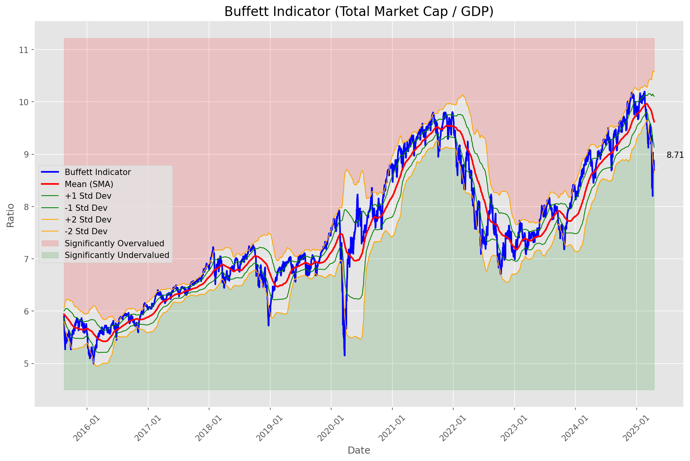
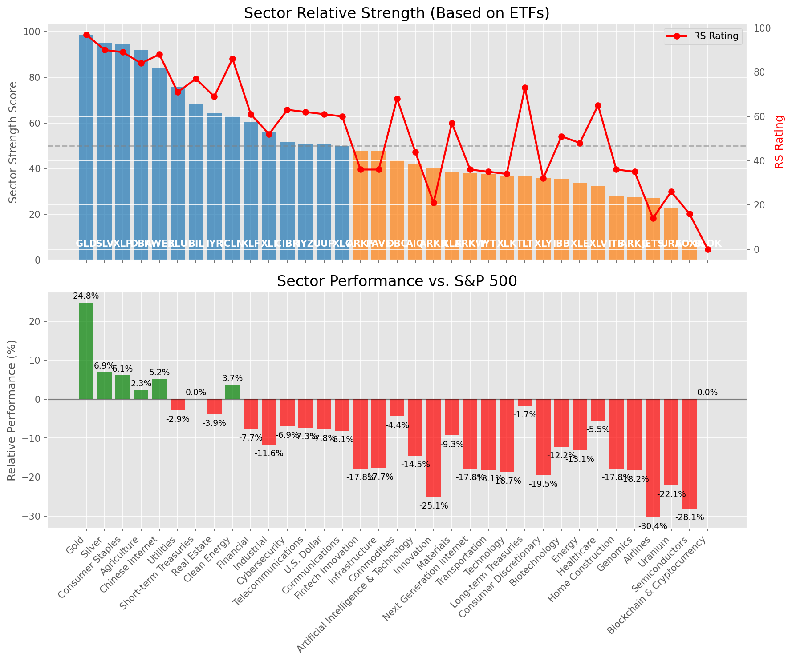

# **Daily Relative Strength Report**

**Date:** 2025-04-22

## **Market Valuation (Buffett Indicator)**

| Metric | Value |
|--------|-------|
| **Market Valuation** | **Undervalued** |
| **Current Ratio** | 8.50 |
| **Historical Mean** | 9.62 |
| **Standard Deviation** | 0.49 |
| **Z-Score (StdDev from Mean)** | -1.88 |
| **Total Market Cap** | $252.60 trillion |
| **GDP** | $29.72 trillion |

## **Market Insights**

### **Market is Undervalued**

The market is trading below historical average valuations, suggesting potential opportunity. These conditions have historically preceded periods of above-average returns. Investors should:

- Look for stocks breaking out of consolidation patterns on increasing volume
- Focus on sectors showing relative strength
- Consider increasing equity exposure, particularly in quality names
- Be mindful of overall market direction and avoid fighting the trend

History suggests patient investors are often rewarded when investing during periods of undervaluation.

### **Buffett Indicator Overview**

The Buffett Indicator (Total Market Cap / GDP) is a measure of the stock market's valuation relative to the size of the economy. It is named after Warren Buffett, who described it as "probably the best single measure of where valuations stand at any given moment."

- **Values above +2 standard deviations:** Market significantly overvalued
- **Values above +1 standard deviation:** Market overvalued
- **Values between -1 and +1 standard deviations:** Market fairly valued
- **Values below -1 standard deviation:** Market undervalued
- **Values below -2 standard deviations:** Market significantly undervalued

---

## **Sector Relative Strength**

Based on William O'Neil's Relative Strength Methodology

| ETF | Strength | RS Rating | Performance | Above Key MAs | Trend | Sector |
|-----|----------|-----------|-------------|--------------|-------|--------|
| [GLD](https://www.tradingview.com/chart/?symbol=GLD) | 99.0 | 98.0 | 25.93% | 10d ✓, 50d ✓, 200d ✓ | ↗️ | Gold |
| [SLV](https://www.tradingview.com/chart/?symbol=SLV) | 94.5 | 89.0 | 6.24% | 10d ✓, 50d ✓, 200d ✓ | ↗️ | Silver |
| [XLP](https://www.tradingview.com/chart/?symbol=XLP) | 94.0 | 88.0 | 5.59% | 10d ✓, 50d ✓, 200d ✓ | ↗️ | Consumer Staples |
| [DBA](https://www.tradingview.com/chart/?symbol=DBA) | 78.1 | 76.0 | -0.37% | 10d ✓, 50d ✗, 200d ✓ | ↗️ | Agriculture |
| [KWEB](https://www.tradingview.com/chart/?symbol=KWEB) | 74.4 | 89.0 | 6.17% | 10d ✓, 50d ✗, 200d ✗ | ↗️ | Chinese Internet |
| [BIL](https://www.tradingview.com/chart/?symbol=BIL) | 69.0 | 78.0 | 0.07% | 10d ✓, 50d ✓, 200d ✓ | ↘️ | Short-term Treasuries |
| [IYR](https://www.tradingview.com/chart/?symbol=IYR) | 63.9 | 68.0 | -4.14% | 10d ✓, 50d ✗, 200d ✗ | ↗️ | Real Estate |
| [ICLN](https://www.tradingview.com/chart/?symbol=ICLN) | 59.8 | 80.0 | 0.61% | 10d ✓, 50d ✓, 200d ✗ | ↘️ | Clean Energy |
| [XLU](https://www.tradingview.com/chart/?symbol=XLU) | 55.0 | 70.0 | -3.56% | 10d ✗, 50d ✗, 200d ✗ | ↗️ | Utilities |
| [IYZ](https://www.tradingview.com/chart/?symbol=IYZ) | 51.5 | 63.0 | -7.32% | 10d ✗, 50d ✗, 200d ✗ | ↗️ | Telecommunications |
| [CIBR](https://www.tradingview.com/chart/?symbol=CIBR) | 51.5 | 63.0 | -6.94% | 10d ✗, 50d ✗, 200d ✗ | ↗️ | Cybersecurity |
| [UUP](https://www.tradingview.com/chart/?symbol=UUP) | 50.0 | 60.0 | -8.68% | 10d ✗, 50d ✗, 200d ✗ | ↗️ | U.S. Dollar |
| [XLC](https://www.tradingview.com/chart/?symbol=XLC) | 50.0 | 60.0 | -8.67% | 10d ✗, 50d ✗, 200d ✗ | ↗️ | Communications |
| [XLF](https://www.tradingview.com/chart/?symbol=XLF) | 50.0 | 60.0 | -8.35% | 10d ✗, 50d ✗, 200d ✗ | ↗️ | Financial |
| [ARKF](https://www.tradingview.com/chart/?symbol=ARKF) | 47.9 | 36.0 | -17.82% | 10d ✓, 50d ✗, 200d ✗ | ↗️ | Fintech Innovation |
| [XLI](https://www.tradingview.com/chart/?symbol=XLI) | 47.5 | 55.0 | -10.55% | 10d ✗, 50d ✗, 200d ✗ | ↗️ | Industrial |
| [AIQ](https://www.tradingview.com/chart/?symbol=AIQ) | 42.5 | 45.0 | -14.53% | 10d ✗, 50d ✗, 200d ✗ | ↗️ | Artificial Intelligence & Technology |
| [DBC](https://www.tradingview.com/chart/?symbol=DBC) | 42.4 | 65.0 | -6.11% | 10d ✓, 50d ✗, 200d ✗ | ↘️ | Commodities |
| [PAVE](https://www.tradingview.com/chart/?symbol=PAVE) | 39.0 | 38.0 | -17.02% | 10d ✗, 50d ✗, 200d ✗ | ↗️ | Infrastructure |
| [XLB](https://www.tradingview.com/chart/?symbol=XLB) | 38.9 | 58.0 | -9.39% | 10d ✓, 50d ✗, 200d ✗ | ↘️ | Materials |
| [ARKW](https://www.tradingview.com/chart/?symbol=ARKW) | 38.5 | 37.0 | -17.79% | 10d ✗, 50d ✗, 200d ✗ | ↗️ | Next Generation Internet |
| [IYT](https://www.tradingview.com/chart/?symbol=IYT) | 38.0 | 36.0 | -18.12% | 10d ✗, 50d ✗, 200d ✗ | ↗️ | Transportation |
| [TLT](https://www.tradingview.com/chart/?symbol=TLT) | 37.5 | 75.0 | -1.19% | 10d ✗, 50d ✗, 200d ✗ | ↘️ | Long-term Treasuries |
| [XLK](https://www.tradingview.com/chart/?symbol=XLK) | 37.0 | 34.0 | -18.49% | 10d ✗, 50d ✗, 200d ✗ | ↗️ | Technology |
| [IBB](https://www.tradingview.com/chart/?symbol=IBB) | 35.9 | 52.0 | -11.82% | 10d ✓, 50d ✗, 200d ✗ | ↘️ | Biotechnology |
| [XLY](https://www.tradingview.com/chart/?symbol=XLY) | 35.0 | 30.0 | -20.17% | 10d ✗, 50d ✗, 200d ✗ | ↗️ | Consumer Discretionary |
| [XLV](https://www.tradingview.com/chart/?symbol=XLV) | 32.5 | 65.0 | -6.07% | 10d ✗, 50d ✗, 200d ✗ | ↘️ | Healthcare |
| [XLE](https://www.tradingview.com/chart/?symbol=XLE) | 31.9 | 44.0 | -14.88% | 10d ✓, 50d ✗, 200d ✗ | ↘️ | Energy |
| [ARKK](https://www.tradingview.com/chart/?symbol=ARKK) | 31.0 | 22.0 | -24.34% | 10d ✗, 50d ✗, 200d ✗ | ↗️ | Innovation |
| [ARKG](https://www.tradingview.com/chart/?symbol=ARKG) | 30.9 | 42.0 | -15.75% | 10d ✓, 50d ✗, 200d ✗ | ↘️ | Genomics |
| [URA](https://www.tradingview.com/chart/?symbol=URA) | 27.9 | 36.0 | -17.95% | 10d ✓, 50d ✗, 200d ✗ | ↘️ | Uranium |
| [JETS](https://www.tradingview.com/chart/?symbol=JETS) | 27.5 | 15.0 | -29.26% | 10d ✗, 50d ✗, 200d ✗ | ↗️ | Airlines |
| [ITB](https://www.tradingview.com/chart/?symbol=ITB) | 16.0 | 32.0 | -19.60% | 10d ✗, 50d ✗, 200d ✗ | ↘️ | Home Construction |
| [SOXX](https://www.tradingview.com/chart/?symbol=SOXX) | 9.0 | 18.0 | -26.80% | 10d ✗, 50d ✗, 200d ✗ | ↘️ | Semiconductors |
| [BLOK](https://www.tradingview.com/chart/?symbol=BLOK) | 0.0 | 0.0 | 0.00% | 10d ✗, 50d ✗, 200d ✗ | ↘️ | Blockchain & Cryptocurrency |

### **Sector ETF Performance Interpretation**

This table shows the relative strength metrics for different market sectors based on their representative ETFs:

- **ETF**: The ETF used to measure sector performance (click for chart)
- **Strength**: Overall sector strength score (0-100) combining multiple factors
- **RS Rating**: O'Neil RS rating of the sector ETF
- **Performance**: Performance of the sector ETF relative to SPY
- **Above Key MAs**: Whether the ETF is trading above its 10, 50, and 200-day moving averages
- **Trend**: Whether the sector is in an uptrend (↗️) or downtrend (↘️)

### **Current Sector Leadership**

The current market leadership is coming from the following sectors: **Gold, Silver, Consumer Staples**.

The **Gold** sector (represented by **GLD**) is showing particularly strong relative strength with an RS rating of 98.0 and performance of 25.93% vs. the S&P 500. This sector is trading above its 10-day, 50-day, 200-day moving average(s). Investors should consider focusing on high RS stocks within these leading sectors for potential outperformance.

---

## **Buy Recommendations**

The following 59 stocks show exceptional relative strength:

| RS Rating | Buy Score | Current Price | Chart | Name | Ticker |
|-----------|-----------|---------------|-------|------|--------|
| 100 | 100 | $85.14 | [Chart](https://www.tradingview.com/chart/?symbol=WPM) | Wheaton Precious Metals Corp. Common Stock | WPM |
| 100 | 100 | $123.47 | [Chart](https://www.tradingview.com/chart/?symbol=AEM) | Agnico Eagle Mines Ltd. | AEM |
| 100 | 100 | $151.78 | [Chart](https://www.tradingview.com/chart/?symbol=UGL) | ProShares Ultra Gold | UGL |
| 100 | 100 | $29.75 | [Chart](https://www.tradingview.com/chart/?symbol=AGI) | Alamos Gold Inc. Class A Common Shares | AGI |
| 99 | 100 | $162.18 | [Chart](https://www.tradingview.com/chart/?symbol=PM) | Philip Morris International Inc. | PM |
| 99 | 100 | $65.11 | [Chart](https://www.tradingview.com/chart/?symbol=GDXJ) | VanEck Junior Gold Miners ETF | GDXJ |
| 99 | 100 | $185.92 | [Chart](https://www.tradingview.com/chart/?symbol=RGLD) | Royal Gold Inc | RGLD |
| 98 | 100 | $33.00 | [Chart](https://www.tradingview.com/chart/?symbol=OUNZ) | VanEck Merk Gold ETF | OUNZ |
| 98 | 100 | $15.76 | [Chart](https://www.tradingview.com/chart/?symbol=EZPW) | Ezcorp Inc | EZPW |
| 98 | 100 | $32.66 | [Chart](https://www.tradingview.com/chart/?symbol=SGOL) | abrdn Physical Gold Shares ETF | SGOL |
| 98 | 100 | $64.59 | [Chart](https://www.tradingview.com/chart/?symbol=IAU) | iShares Gold Trust | IAU |
| 98 | 100 | $67.82 | [Chart](https://www.tradingview.com/chart/?symbol=GLDM) | SPDR Gold MiniShares | GLDM |
| 98 | 100 | $34.15 | [Chart](https://www.tradingview.com/chart/?symbol=IAUM) | iShares Gold Trust Micro | IAUM |
| 98 | 100 | $315.59 | [Chart](https://www.tradingview.com/chart/?symbol=GLD) | SPDR Gold Trust, SPDR Gold Shares | GLD |
| 98 | 100 | $33.78 | [Chart](https://www.tradingview.com/chart/?symbol=BAR) | GraniteShares Gold Shares | BAR |
| 97 | 100 | $42.55 | [Chart](https://www.tradingview.com/chart/?symbol=BTI) | British American Tobacco p.l.c. American Depositary Shares, American Depositary Shares, each representing one Ordinary Share | BTI |
| 97 | 100 | $30.02 | [Chart](https://www.tradingview.com/chart/?symbol=CEF) | Sprott Physical Gold and Silver Trust | CEF |
| 97 | 100 | $23.27 | [Chart](https://www.tradingview.com/chart/?symbol=DB) | Deutsche Bank Aktiengesellschaft | DB |
| 97 | 100 | $53.64 | [Chart](https://www.tradingview.com/chart/?symbol=PPC) | Pilgrims Pride Corporation | PPC |
| 97 | 100 | $26.20 | [Chart](https://www.tradingview.com/chart/?symbol=PHYS) | Sprott Physical Gold Trust | PHYS |
| 97 | 100 | $23.51 | [Chart](https://www.tradingview.com/chart/?symbol=OR) | Osisko Gold Royalties Ltd | OR |
| 97 | 100 | $72.31 | [Chart](https://www.tradingview.com/chart/?symbol=KR) | The Kroger Co. | KR |
| 96 | 100 | $451.70 | [Chart](https://www.tradingview.com/chart/?symbol=CASY) | Casey's General Stores Inc | CASY |
| 96 | 100 | $46.23 | [Chart](https://www.tradingview.com/chart/?symbol=EXC) | Exelon Corporation | EXC |
| 96 | 100 | $987.91 | [Chart](https://www.tradingview.com/chart/?symbol=NFLX) | NetFlix Inc | NFLX |
| 96 | 100 | $88.47 | [Chart](https://www.tradingview.com/chart/?symbol=CCEP) | Coca-Cola Europacific Partners plc Ordinary Shares | CCEP |
| 96 | 100 | $28.35 | [Chart](https://www.tradingview.com/chart/?symbol=EUFN) | iShares MSCI Europe Financials ETF | EUFN |
| 95 | 100 | $23.01 | [Chart](https://www.tradingview.com/chart/?symbol=SRAD) | Sportradar Group AG Class A Ordinary Shares | SRAD |
| 95 | 100 | $77.31 | [Chart](https://www.tradingview.com/chart/?symbol=NFG) | National Fuel Gas Co. | NFG |
| 95 | 100 | $66.81 | [Chart](https://www.tradingview.com/chart/?symbol=VTR) | Ventas, Inc. | VTR |
| 95 | 100 | $19.30 | [Chart](https://www.tradingview.com/chart/?symbol=GRND) | Grindr Inc. | GRND |
| 94 | 100 | $37.03 | [Chart](https://www.tradingview.com/chart/?symbol=EWG) | iShares MSCI Germany ETF | EWG |
| 94 | 100 | $260.33 | [Chart](https://www.tradingview.com/chart/?symbol=CME) | CME Group Inc. | CME |
| 94 | 100 | $78.34 | [Chart](https://www.tradingview.com/chart/?symbol=SNEX) | StoneX Group Inc. Common Stock | SNEX |
| 93 | 100 | $36.49 | [Chart](https://www.tradingview.com/chart/?symbol=CNP) | CenterPoint Energy, Inc. | CNP |
| 93 | 100 | $76.70 | [Chart](https://www.tradingview.com/chart/?symbol=SR) | Spire Inc. | SR |
| 93 | 100 | $308.72 | [Chart](https://www.tradingview.com/chart/?symbol=MCD) | McDonald's Corporation | MCD |
| 92 | 100 | $78.72 | [Chart](https://www.tradingview.com/chart/?symbol=ADC) | Agree Realty Corporation | ADC |
| 92 | 100 | $18.10 | [Chart](https://www.tradingview.com/chart/?symbol=KT) | KT Corp. | KT |
| 92 | 100 | $194.57 | [Chart](https://www.tradingview.com/chart/?symbol=WCN) | Waste Connections, Inc. | WCN |
| 92 | 100 | $105.53 | [Chart](https://www.tradingview.com/chart/?symbol=AEP) | American Electric Power Company, Inc. | AEP |
| 91 | 100 | $123.65 | [Chart](https://www.tradingview.com/chart/?symbol=BECN) | Beacon Roofing Supply, Inc. | BECN |
| 91 | 100 | $93.24 | [Chart](https://www.tradingview.com/chart/?symbol=PNW) | Pinnacle West Capital Corporation | PNW |
| 91 | 100 | $156.54 | [Chart](https://www.tradingview.com/chart/?symbol=ATO) | Atmos Energy Corporation | ATO |
| 91 | 100 | $52.07 | [Chart](https://www.tradingview.com/chart/?symbol=RELX) | RELX PLC | RELX |
| 90 | 100 | $43.16 | [Chart](https://www.tradingview.com/chart/?symbol=NWN) | Northwest Natural Holding Company | NWN |
| 89 | 100 | $35.31 | [Chart](https://www.tradingview.com/chart/?symbol=PPL) | PPL Corporation | PPL |
| 85 | 99 | $131.17 | [Chart](https://www.tradingview.com/chart/?symbol=CAH) | Cardinal Health, Inc. | CAH |
| 88 | 98 | $76.81 | [Chart](https://www.tradingview.com/chart/?symbol=OGS) | ONE GAS, INC. | OGS |
| 85 | 98 | $29.58 | [Chart](https://www.tradingview.com/chart/?symbol=AHR) | American Healthcare REIT, Inc. | AHR |
| 88 | 97 | $33.31 | [Chart](https://www.tradingview.com/chart/?symbol=FDP) | Fresh Del Monte Produce Inc. | FDP |
| 84 | 95 | $114.67 | [Chart](https://www.tradingview.com/chart/?symbol=CWST) | Casella Waste Systems Inc | CWST |
| 82 | 95 | $111.74 | [Chart](https://www.tradingview.com/chart/?symbol=BOXX) | Alpha Architect 1-3 Month Box ETF | BOXX |
| 82 | 95 | $92.41 | [Chart](https://www.tradingview.com/chart/?symbol=WMT) | Walmart Inc. | WMT |
| 84 | 94 | $49.79 | [Chart](https://www.tradingview.com/chart/?symbol=VTIP) | Vanguard Short-Term Inflation-Protected Securities Index Fund | VTIP |
| 83 | 94 | $36.05 | [Chart](https://www.tradingview.com/chart/?symbol=FYBR) | Frontier Communications Parent, Inc. Common Stock | FYBR |
| 83 | 93 | $54.66 | [Chart](https://www.tradingview.com/chart/?symbol=IGF) | iShares Global Infrastructure ETF | IGF |
| 83 | 93 | $12.06 | [Chart](https://www.tradingview.com/chart/?symbol=AGS) | PlayAGS, Inc. | AGS |
| 80 | 93 | $37.16 | [Chart](https://www.tradingview.com/chart/?symbol=VIRT) | Virtu Financial, Inc. Class A | VIRT |

---

## **Sell Recommendations**

The following 151 stocks show deteriorating relative strength:

| RS Rating | Sell Score | Current Price | Chart | Name | Ticker |
|-----------|------------|---------------|-------|------|--------|
| 1 | 100 | $16.39 | [Chart](https://www.tradingview.com/chart/?symbol=TNDM) | Tandem Diabetes Care, Inc. | TNDM |
| 2 | 100 | $73.26 | [Chart](https://www.tradingview.com/chart/?symbol=FRPT) | Freshpet, Inc. | FRPT |
| 2 | 100 | $10.03 | [Chart](https://www.tradingview.com/chart/?symbol=FLYW) | Flywire Corporation Voting Common Stock | FLYW |
| 3 | 100 | $72.00 | [Chart](https://www.tradingview.com/chart/?symbol=ILMN) | Illumina Inc | ILMN |
| 3 | 100 | $16.07 | [Chart](https://www.tradingview.com/chart/?symbol=SSTK) | SHUTTERSTOCK, INC. | SSTK |
| 4 | 100 | $46.10 | [Chart](https://www.tradingview.com/chart/?symbol=LABU) | Direxion Daily S&P Biotech Bull 3X Shares | LABU |
| 4 | 100 | $17.01 | [Chart](https://www.tradingview.com/chart/?symbol=DAVA) | Endava plc American Depositary Shares (each representing one Class A Ordinary Share) | DAVA |
| 4 | 100 | $17.97 | [Chart](https://www.tradingview.com/chart/?symbol=CECO) | Ceco Environmental Corp | CECO |
| 4 | 100 | $17.21 | [Chart](https://www.tradingview.com/chart/?symbol=ICHR) | Ichor Holdings | ICHR |
| 4 | 100 | $21.90 | [Chart](https://www.tradingview.com/chart/?symbol=RPD) | Rapid7, Inc. Common Stock | RPD |
| 5 | 100 | $59.36 | [Chart](https://www.tradingview.com/chart/?symbol=ARCB) | ArcBest Corporation | ARCB |
| 5 | 100 | $12.10 | [Chart](https://www.tradingview.com/chart/?symbol=IMXI) | International Money Express, Inc. | IMXI |
| 5 | 100 | $18.88 | [Chart](https://www.tradingview.com/chart/?symbol=SPT) | Sprout Social, Inc Class A Common Stock | SPT |
| 6 | 100 | $18.03 | [Chart](https://www.tradingview.com/chart/?symbol=APLS) | Apellis Pharmaceuticals, Inc. Common Stock | APLS |
| 6 | 100 | $33.24 | [Chart](https://www.tradingview.com/chart/?symbol=TDW) | Tidewater, Inc. | TDW |
| 6 | 100 | $21.59 | [Chart](https://www.tradingview.com/chart/?symbol=FIVN) | FIVE9, INC. | FIVN |
| 6 | 100 | $58.62 | [Chart](https://www.tradingview.com/chart/?symbol=CAMT) | Camtek Ltd | CAMT |
| 6 | 100 | $25.81 | [Chart](https://www.tradingview.com/chart/?symbol=W) | Wayfair Inc. | W |
| 7 | 100 | $19.62 | [Chart](https://www.tradingview.com/chart/?symbol=SYM) | Symbotic Inc. Class A Common Stock | SYM |
| 7 | 100 | $12.03 | [Chart](https://www.tradingview.com/chart/?symbol=GCT) | GigaCloud Technology Inc Class A Ordinary Shares | GCT |
| 7 | 100 | $11.00 | [Chart](https://www.tradingview.com/chart/?symbol=ARCT) | Arcturus Therapeutics Holdings Inc. Common Stock | ARCT |
| 7 | 100 | $21.41 | [Chart](https://www.tradingview.com/chart/?symbol=NSSC) | Napco Security Technologies, Inc | NSSC |
| 8 | 100 | $14.09 | [Chart](https://www.tradingview.com/chart/?symbol=MEG) | Montrose Environmental Group, Inc. | MEG |
| 8 | 100 | $12.21 | [Chart](https://www.tradingview.com/chart/?symbol=DV) | DoubleVerify Holdings, Inc. | DV |
| 8 | 100 | $18.05 | [Chart](https://www.tradingview.com/chart/?symbol=BZH) | Beazer Homes USA, Inc. New | BZH |
| 8 | 100 | $12.64 | [Chart](https://www.tradingview.com/chart/?symbol=DK) | Delek US Holdings, Inc. | DK |
| 8 | 100 | $34.15 | [Chart](https://www.tradingview.com/chart/?symbol=STNG) | Scorpio Tankers Inc. | STNG |
| 9 | 100 | $25.97 | [Chart](https://www.tradingview.com/chart/?symbol=XPEL) | XPEL, Inc. Common Stock | XPEL |
| 10 | 100 | $15.19 | [Chart](https://www.tradingview.com/chart/?symbol=IART) | Integra LifeSciences Holdings | IART |
| 10 | 100 | $96.83 | [Chart](https://www.tradingview.com/chart/?symbol=ARM) | Arm Holdings plc American Depositary Shares | ARM |
| 10 | 100 | $19.95 | [Chart](https://www.tradingview.com/chart/?symbol=TDC) | TERADATA CORPORATION | TDC |
| 11 | 100 | $18.87 | [Chart](https://www.tradingview.com/chart/?symbol=ST) | Sensata Technologies Holding plc | ST |
| 11 | 100 | $11.54 | [Chart](https://www.tradingview.com/chart/?symbol=AEYE) | AudioEye, Inc. Common Stock | AEYE |
| 12 | 100 | $56.73 | [Chart](https://www.tradingview.com/chart/?symbol=ATKR) | Atkore Inc. | ATKR |
| 14 | 100 | $12.82 | [Chart](https://www.tradingview.com/chart/?symbol=XRAY) | DENTSPLY SIRONA Inc. | XRAY |
| 17 | 100 | $28.55 | [Chart](https://www.tradingview.com/chart/?symbol=SRDX) | Surmodics, Inc. Common Stock | SRDX |
| 18 | 100 | $11.42 | [Chart](https://www.tradingview.com/chart/?symbol=TRIP) | TripAdvisor, Inc. | TRIP |
| 2 | 99 | $104.13 | [Chart](https://www.tradingview.com/chart/?symbol=GLOB) | GLOBANT S.A. | GLOB |
| 7 | 99 | $52.80 | [Chart](https://www.tradingview.com/chart/?symbol=VAC) | MARRIOTT VACATIONS WORLDWIDE CORPORATION | VAC |
| 12 | 99 | $12.29 | [Chart](https://www.tradingview.com/chart/?symbol=MARA) | MARA Holdings, Inc. Common Stock | MARA |
| 13 | 99 | $19.59 | [Chart](https://www.tradingview.com/chart/?symbol=FOXF) | Fox Factory Holding Corp. Common Stock | FOXF |
| 8 | 98 | $31.22 | [Chart](https://www.tradingview.com/chart/?symbol=SCSC) | Scansource Inc | SCSC |
| 16 | 98 | $38.05 | [Chart](https://www.tradingview.com/chart/?symbol=FMC) | FMC Corporation | FMC |
| 5 | 97 | $11.02 | [Chart](https://www.tradingview.com/chart/?symbol=ZETA) | Zeta Global Holdings Corp. | ZETA |
| 12 | 97 | $48.33 | [Chart](https://www.tradingview.com/chart/?symbol=NVT) | nVent Electric plc Ordinary Shares | NVT |
| 15 | 97 | $90.80 | [Chart](https://www.tradingview.com/chart/?symbol=BCC) | Boise Cascade Company | BCC |
| 15 | 97 | $12.21 | [Chart](https://www.tradingview.com/chart/?symbol=ZVZZT) | SUPER Montage TEST SYMBOL | ZVZZT |
| 15 | 96 | $21.51 | [Chart](https://www.tradingview.com/chart/?symbol=UCO) | ProShares Ultra Bloomberg Crude Oil | UCO |
| 15 | 96 | $114.08 | [Chart](https://www.tradingview.com/chart/?symbol=BLDR) | Builders FirstSource, Inc. | BLDR |
| 16 | 96 | $10.77 | [Chart](https://www.tradingview.com/chart/?symbol=SONO) | Sonos, Inc. Common Stock | SONO |
| 18 | 96 | $11.45 | [Chart](https://www.tradingview.com/chart/?symbol=BAND) | Bandwidth Inc. Class A Common Stock | BAND |
| 20 | 96 | $15.54 | [Chart](https://www.tradingview.com/chart/?symbol=TRMD) | TORM plc Class A Common Stock | TRMD |
| 24 | 96 | $13.79 | [Chart](https://www.tradingview.com/chart/?symbol=FXN) | First Trust Energy AlphaDEX Fund | FXN |
| 13 | 95 | $58.96 | [Chart](https://www.tradingview.com/chart/?symbol=SPB) | Spectrum Brands Holdings, Inc. | SPB |
| 14 | 95 | $45.43 | [Chart](https://www.tradingview.com/chart/?symbol=ERX) | Direxion Daily Energy Bull 2X Shares | ERX |
| 24 | 95 | $32.90 | [Chart](https://www.tradingview.com/chart/?symbol=IAC) | IAC Inc. Common Stock | IAC |
| 9 | 94 | $27.33 | [Chart](https://www.tradingview.com/chart/?symbol=UWM) | ProShares Ultra Russell2000 | UWM |
| 10 | 94 | $21.11 | [Chart](https://www.tradingview.com/chart/?symbol=VERA) | Vera Therapeutics, Inc. Class A Common Stock | VERA |
| 14 | 94 | $14.28 | [Chart](https://www.tradingview.com/chart/?symbol=PBW) | Invesco WilderHill Clean Energy ETF | PBW |
| 16 | 94 | $16.22 | [Chart](https://www.tradingview.com/chart/?symbol=ELVN) | Enliven Therapeutics, Inc. Common Stock | ELVN |
| 17 | 94 | $29.30 | [Chart](https://www.tradingview.com/chart/?symbol=JANX) | Janux Therapeutics, Inc. Common Stock | JANX |
| 9 | 93 | $34.32 | [Chart](https://www.tradingview.com/chart/?symbol=CRC) | California Resources Corporation | CRC |
| 16 | 93 | $10.31 | [Chart](https://www.tradingview.com/chart/?symbol=VREX) | Varex Imaging Corporation Common Stock | VREX |
| 20 | 93 | $30.50 | [Chart](https://www.tradingview.com/chart/?symbol=URNM) | Sprott Uranium Miners ETF | URNM |
| 11 | 92 | $106.58 | [Chart](https://www.tradingview.com/chart/?symbol=GNRC) | GENERAC HOLDINGS INC | GNRC |
| 19 | 92 | $27.49 | [Chart](https://www.tradingview.com/chart/?symbol=YETI) | YETI Holdings, Inc. Common Stock | YETI |
| 21 | 92 | $44.47 | [Chart](https://www.tradingview.com/chart/?symbol=EDU) | New Oriental Education and Technology Group, Inc. American Depositary Shares (each representing ten (10) Common Shares) | EDU |
| 11 | 91 | $22.12 | [Chart](https://www.tradingview.com/chart/?symbol=RNG) | RINGCENTRAL, INC. | RNG |
| 11 | 91 | $326.66 | [Chart](https://www.tradingview.com/chart/?symbol=SAIA) | Saia, Inc. | SAIA |
| 17 | 91 | $34.61 | [Chart](https://www.tradingview.com/chart/?symbol=LIVN) | LivaNova PLC Ordinary Shares | LIVN |
| 24 | 91 | $12.00 | [Chart](https://www.tradingview.com/chart/?symbol=MED) | Medifast, Inc. | MED |
| 11 | 90 | $33.01 | [Chart](https://www.tradingview.com/chart/?symbol=FLR) | Fluor Corporation | FLR |
| 13 | 90 | $81.68 | [Chart](https://www.tradingview.com/chart/?symbol=NTAP) | NetApp, Inc | NTAP |
| 15 | 90 | $20.41 | [Chart](https://www.tradingview.com/chart/?symbol=CGON) | CG Oncology, Inc. Common stock | CGON |
| 16 | 90 | $32.65 | [Chart](https://www.tradingview.com/chart/?symbol=OVV) | Ovintiv Inc. | OVV |
| 22 | 90 | $16.53 | [Chart](https://www.tradingview.com/chart/?symbol=STAA) | Staar Surgical Co | STAA |
| 13 | 89 | $10.01 | [Chart](https://www.tradingview.com/chart/?symbol=VYX) | NCR Voyix Corporation | VYX |
| 20 | 89 | $22.04 | [Chart](https://www.tradingview.com/chart/?symbol=HOG) | Harley-Davidson, Inc. | HOG |
| 22 | 89 | $46.26 | [Chart](https://www.tradingview.com/chart/?symbol=POWI) | Power Integrations Inc | POWI |
| 26 | 89 | $11.64 | [Chart](https://www.tradingview.com/chart/?symbol=OSCR) | Oscar Health, Inc. | OSCR |
| 12 | 88 | $14.03 | [Chart](https://www.tradingview.com/chart/?symbol=DXC) | DXC Technology Company | DXC |
| 24 | 88 | $69.72 | [Chart](https://www.tradingview.com/chart/?symbol=IR) | Ingersoll Rand Inc. Common Stock | IR |
| 13 | 87 | $92.13 | [Chart](https://www.tradingview.com/chart/?symbol=TOL) | Toll Brothers, Inc. | TOL |
| 23 | 87 | $38.95 | [Chart](https://www.tradingview.com/chart/?symbol=SIMO) | Silicon Motion Technology Corporation | SIMO |
| 20 | 86 | $133.53 | [Chart](https://www.tradingview.com/chart/?symbol=MTN) | Vail Resorts, Inc. | MTN |
| 21 | 86 | $26.02 | [Chart](https://www.tradingview.com/chart/?symbol=SEE) | Sealed Air Corp. | SEE |
| 22 | 86 | $34.56 | [Chart](https://www.tradingview.com/chart/?symbol=TWST) | Twist Bioscience Corporation Common Stock | TWST |
| 23 | 86 | $20.37 | [Chart](https://www.tradingview.com/chart/?symbol=DIN) | Dine Brands Global, Inc. | DIN |
| 24 | 86 | $11.34 | [Chart](https://www.tradingview.com/chart/?symbol=HPK) | HighPeak Energy, Inc. Common Stock | HPK |
| 31 | 86 | $276.57 | [Chart](https://www.tradingview.com/chart/?symbol=BLD) | TopBuild Corp. Common Stock | BLD |
| 17 | 85 | $51.02 | [Chart](https://www.tradingview.com/chart/?symbol=AIR) | AAR Corp. | AIR |
| 18 | 85 | $15.78 | [Chart](https://www.tradingview.com/chart/?symbol=PRO) | Pros Holdings, Inc. | PRO |
| 25 | 85 | $11.15 | [Chart](https://www.tradingview.com/chart/?symbol=RIVN) | Rivian Automotive, Inc. Class A Common Stock | RIVN |
| 26 | 85 | $10.15 | [Chart](https://www.tradingview.com/chart/?symbol=CSIQ) | Canadian Solar Inc. Common Shares (ON) | CSIQ |
| 18 | 84 | $172.50 | [Chart](https://www.tradingview.com/chart/?symbol=FN) | Fabrinet | FN |
| 21 | 84 | $33.75 | [Chart](https://www.tradingview.com/chart/?symbol=CALF) | Pacer US Small Cap Cash Cows ETF | CALF |
| 22 | 84 | $20.19 | [Chart](https://www.tradingview.com/chart/?symbol=MGY) | Magnolia Oil & Gas Corporation Class A Common Stock | MGY |
| 23 | 84 | $16.61 | [Chart](https://www.tradingview.com/chart/?symbol=CTRI) | Centuri Holdings, Inc. | CTRI |
| 24 | 84 | $31.36 | [Chart](https://www.tradingview.com/chart/?symbol=GFS) | GlobalFoundries Inc. Ordinary Shares | GFS |
| 21 | 83 | $51.07 | [Chart](https://www.tradingview.com/chart/?symbol=KBH) | KB Home | KBH |
| 25 | 83 | $57.00 | [Chart](https://www.tradingview.com/chart/?symbol=HAE) | Haemonetics Corporation | HAE |
| 30 | 83 | $33.71 | [Chart](https://www.tradingview.com/chart/?symbol=BLBD) | Blue Bird Corporation Common Stock | BLBD |
| 23 | 82 | $51.21 | [Chart](https://www.tradingview.com/chart/?symbol=IIPR) | Innovative Industrial Properties, Inc. Common stock | IIPR |
| 28 | 82 | $10.03 | [Chart](https://www.tradingview.com/chart/?symbol=MTAL) | MAC Copper Limited | MTAL |
| 30 | 82 | $11.00 | [Chart](https://www.tradingview.com/chart/?symbol=NAVI) | Navient Corporation | NAVI |
| 33 | 82 | $20.53 | [Chart](https://www.tradingview.com/chart/?symbol=LPG) | DORIAN LPG LTD | LPG |
| 27 | 81 | $19.04 | [Chart](https://www.tradingview.com/chart/?symbol=BITO) | ProShares Bitcoin ETF | BITO |
| 31 | 81 | $64.52 | [Chart](https://www.tradingview.com/chart/?symbol=MTH) | Meritage Homes Corporation | MTH |
| 32 | 81 | $11.89 | [Chart](https://www.tradingview.com/chart/?symbol=OEC) | Orion S.A. | OEC |
| 20 | 80 | $139.62 | [Chart](https://www.tradingview.com/chart/?symbol=PTC) | PTC, INC | PTC |
| 23 | 80 | $10.15 | [Chart](https://www.tradingview.com/chart/?symbol=HLIT) | Harmonic Inc | HLIT |
| 30 | 80 | $10.84 | [Chart](https://www.tradingview.com/chart/?symbol=ABR) | Arbor Realty Trust, Inc. | ABR |
| 24 | 79 | $13.80 | [Chart](https://www.tradingview.com/chart/?symbol=PSFE) | Paysafe Limited | PSFE |
| 25 | 79 | $154.21 | [Chart](https://www.tradingview.com/chart/?symbol=IBP) | INSTALLED BUILDING PRODUCTS, INC. | IBP |
| 28 | 79 | $25.42 | [Chart](https://www.tradingview.com/chart/?symbol=GDEN) | Golden Entertainment, Inc. Common Stock | GDEN |
| 28 | 79 | $27.12 | [Chart](https://www.tradingview.com/chart/?symbol=MBUU) | Malibu Boats, Inc. Class A | MBUU |
| 29 | 79 | $71.92 | [Chart](https://www.tradingview.com/chart/?symbol=AKAM) | Akamai Technologies Inc | AKAM |
| 23 | 78 | $18.58 | [Chart](https://www.tradingview.com/chart/?symbol=KMT) | Kennametal Inc. | KMT |
| 26 | 78 | $12.95 | [Chart](https://www.tradingview.com/chart/?symbol=ZIM) | ZIM Integrated Shipping Services Ltd. | ZIM |
| 30 | 78 | $27.61 | [Chart](https://www.tradingview.com/chart/?symbol=TAN) | Invesco Solar ETF | TAN |
| 34 | 78 | $51.62 | [Chart](https://www.tradingview.com/chart/?symbol=ENPH) | Enphase Energy, Inc. | ENPH |
| 39 | 78 | $10.16 | [Chart](https://www.tradingview.com/chart/?symbol=MAX) | MediaAlpha, Inc. | MAX |
| 32 | 77 | $15.46 | [Chart](https://www.tradingview.com/chart/?symbol=SEM) | SELECT MEDICAL HOLDINGS CORP | SEM |
| 36 | 77 | $26.26 | [Chart](https://www.tradingview.com/chart/?symbol=BWA) | BorgWarner Inc. | BWA |
| 26 | 76 | $16.47 | [Chart](https://www.tradingview.com/chart/?symbol=PRAA) | PRA Group, Inc. | PRAA |
| 37 | 76 | $32.51 | [Chart](https://www.tradingview.com/chart/?symbol=INSW) | International Seaways, Inc. Common Stock | INSW |
| 30 | 75 | $24.21 | [Chart](https://www.tradingview.com/chart/?symbol=PINS) | Pinterest, Inc. Class A Common Stock | PINS |
| 28 | 74 | $149.87 | [Chart](https://www.tradingview.com/chart/?symbol=ODFL) | Old Dominion Freight Line | ODFL |
| 31 | 74 | $39.61 | [Chart](https://www.tradingview.com/chart/?symbol=CCJ) | Cameco Corporation | CCJ |
| 33 | 74 | $181.28 | [Chart](https://www.tradingview.com/chart/?symbol=RGA) | Reinsurance Group of America, Incorporated | RGA |
| 35 | 74 | $10.94 | [Chart](https://www.tradingview.com/chart/?symbol=LYFT) | Lyft, Inc. Class A Common Stock | LYFT |
| 37 | 74 | $43.10 | [Chart](https://www.tradingview.com/chart/?symbol=PRKS) | United Parks & Resorts Inc. | PRKS |
| 28 | 73 | $54.99 | [Chart](https://www.tradingview.com/chart/?symbol=VOYA) | VOYA FINANCIAL, INC. | VOYA |
| 31 | 73 | $10.68 | [Chart](https://www.tradingview.com/chart/?symbol=MRC) | MRC GLOBAL INC. | MRC |
| 33 | 73 | $29.14 | [Chart](https://www.tradingview.com/chart/?symbol=CDRE) | Cadre Holdings, Inc. | CDRE |
| 32 | 71 | $88.81 | [Chart](https://www.tradingview.com/chart/?symbol=XHB) | SPDR S&P Homebuilders ETF | XHB |
| 32 | 71 | $49.34 | [Chart](https://www.tradingview.com/chart/?symbol=ALRM) | Alarm.com Holdings, Inc. | ALRM |
| 36 | 70 | $10.32 | [Chart](https://www.tradingview.com/chart/?symbol=SHC) | Sotera Health Company Common Stock | SHC |
| 37 | 70 | $30.15 | [Chart](https://www.tradingview.com/chart/?symbol=CRNX) | Crinetics Pharmaceuticals, Inc. | CRNX |
| 39 | 69 | $10.34 | [Chart](https://www.tradingview.com/chart/?symbol=CMRE) | Costamare Inc. | CMRE |
| 36 | 68 | $10.71 | [Chart](https://www.tradingview.com/chart/?symbol=DBRG) | DigitalBridge Group, Inc. | DBRG |
| 39 | 68 | $22.04 | [Chart](https://www.tradingview.com/chart/?symbol=PFE) | Pfizer Inc. | PFE |
| 39 | 68 | $23.46 | [Chart](https://www.tradingview.com/chart/?symbol=HASI) | HA Sustainable Infrastructure Capital, Inc. | HASI |
| 39 | 67 | $20.99 | [Chart](https://www.tradingview.com/chart/?symbol=VRRM) | Verra Mobility Corporation Class A Common Stock | VRRM |
| 38 | 66 | $17.15 | [Chart](https://www.tradingview.com/chart/?symbol=HTGC) | Hercules Capital, Inc. | HTGC |
| 39 | 65 | $92.87 | [Chart](https://www.tradingview.com/chart/?symbol=KEX) | Kirby Corporation | KEX |
| 39 | 65 | $209.90 | [Chart](https://www.tradingview.com/chart/?symbol=APPF) | AppFolio, Inc. Class A | APPF |
| 37 | 63 | $24.69 | [Chart](https://www.tradingview.com/chart/?symbol=WY) | Weyerhaeuser Company | WY |
| 37 | 63 | $15.92 | [Chart](https://www.tradingview.com/chart/?symbol=MLNK) | MeridianLink, Inc. | MLNK |
| 38 | 63 | $68.62 | [Chart](https://www.tradingview.com/chart/?symbol=USO) | United States Oil Fund, LP | USO |
| 39 | 62 | $110.41 | [Chart](https://www.tradingview.com/chart/?symbol=THC) | Tenet Healthcare Corporation New | THC |

## **Methodology**

This report uses William O'Neil's relative strength methodology from Investors Business Daily:

* **RS Rating**: Percentile rank of stock's performance vs. S&P 500 over the past 63 trading days (1-99 scale)
* **Buy Criteria**: RS Rating >= 80, price above 50-day MA, strong uptrend, increasing volume
* **Sell Criteria**: RS Rating < 40, price below 50-day MA, downtrend, decreasing volume

### **O'Neil's Key Principles**

1. **Focus on relative performance** - stocks outperforming the market
2. **Price trend confirmation** - stock must be in an uptrend
3. **Volume confirmation** - strong volume supports price moves
4. **Moving average validation** - price above key moving averages
5. **Market leaders only** - concentrate on top-performing stocks

*Report generated automatically after market close*