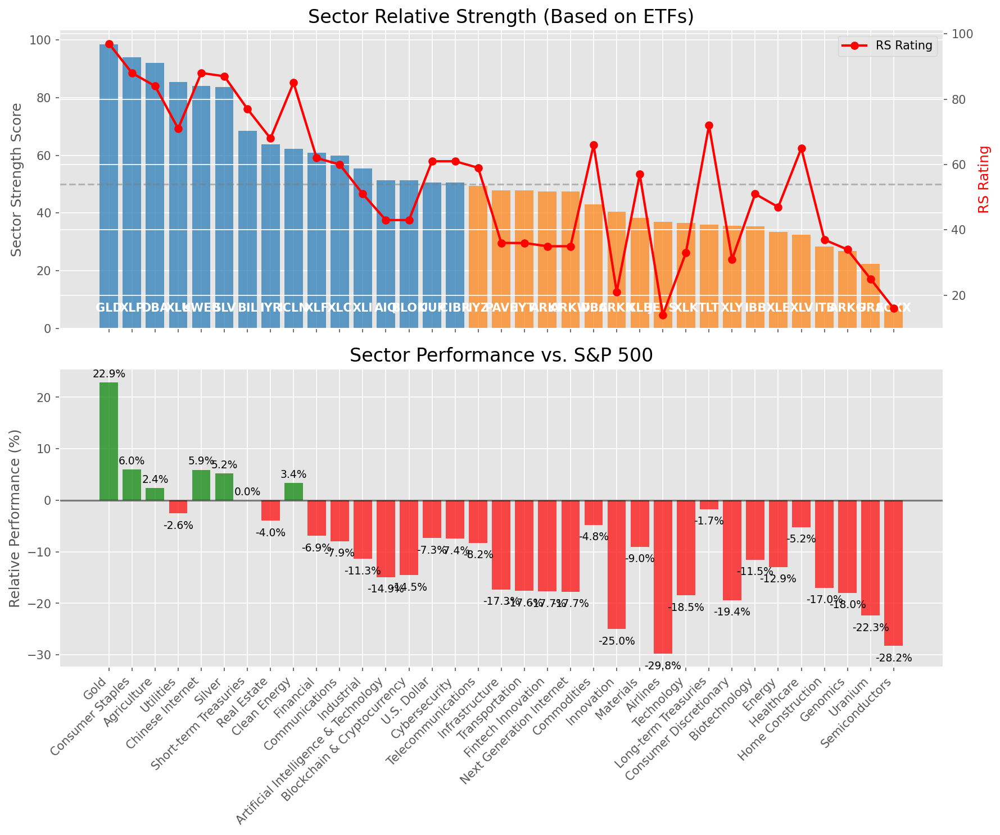

# **Daily Relative Strength Report**

**Date:** 2025-04-22

## **Market Valuation (Buffett Indicator)**

| Metric | Value |
|--------|-------|
| **Market Valuation** | **Significantly Undervalued** |
| **Current Ratio** | 8.71 |
| **Historical Mean** | 9.60 |
| **Standard Deviation** | 0.50 |
| **Z-Score (StdDev from Mean)** | -2.21 |
| **Total Market Cap** | $259.03 trillion |
| **GDP** | $29.72 trillion |

## **Market Insights**

### **Market is Significantly Undervalued**

The market has reached valuations significantly below historical norms, suggesting excessive pessimism. These levels have historically offered exceptional long-term buying opportunities. Investors should consider:

- Increasing equity exposure gradually
- Looking for quality companies with strong balance sheets trading at discounted valuations
- Watching for signs of market bottoming (capitulation, investor sentiment extremes)
- Developing a watchlist of fundamentally strong stocks building bases

While short-term volatility may continue, historical data suggests excellent long-term returns from these levels.

### **Buffett Indicator Overview**

The Buffett Indicator (Total Market Cap / GDP) is a measure of the stock market's valuation relative to the size of the economy. It is named after Warren Buffett, who described it as "probably the best single measure of where valuations stand at any given moment."

- **Values above +2 standard deviations:** Market significantly overvalued
- **Values above +1 standard deviation:** Market overvalued
- **Values between -1 and +1 standard deviations:** Market fairly valued
- **Values below -1 standard deviation:** Market undervalued
- **Values below -2 standard deviations:** Market significantly undervalued

---

## **Sector Relative Strength**

Based on William O'Neil's Relative Strength Methodology

| ETF | Strength | RS Rating | Performance | Above Key MAs | Trend | Sector |
|-----|----------|-----------|-------------|--------------|-------|--------|
| [GLD](https://www.tradingview.com/chart/?symbol=GLD) | 98.5 | 97.0 | 22.91% | 10d ✓, 50d ✓, 200d ✓ | ↗️ | Gold |
| [XLP](https://www.tradingview.com/chart/?symbol=XLP) | 94.0 | 88.0 | 5.98% | 10d ✓, 50d ✓, 200d ✓ | ↗️ | Consumer Staples |
| [DBA](https://www.tradingview.com/chart/?symbol=DBA) | 92.0 | 84.0 | 2.43% | 10d ✓, 50d ✓, 200d ✓ | ↗️ | Agriculture |
| [XLU](https://www.tradingview.com/chart/?symbol=XLU) | 85.5 | 71.0 | -2.56% | 10d ✓, 50d ✓, 200d ✓ | ↗️ | Utilities |
| [KWEB](https://www.tradingview.com/chart/?symbol=KWEB) | 84.1 | 88.0 | 5.93% | 10d ✓, 50d ✗, 200d ✓ | ↗️ | Chinese Internet |
| [SLV](https://www.tradingview.com/chart/?symbol=SLV) | 83.6 | 87.0 | 5.21% | 10d ✓, 50d ✗, 200d ✓ | ↗️ | Silver |
| [BIL](https://www.tradingview.com/chart/?symbol=BIL) | 68.5 | 77.0 | 0.01% | 10d ✓, 50d ✓, 200d ✓ | ↘️ | Short-term Treasuries |
| [IYR](https://www.tradingview.com/chart/?symbol=IYR) | 63.9 | 68.0 | -3.95% | 10d ✓, 50d ✗, 200d ✗ | ↗️ | Real Estate |
| [ICLN](https://www.tradingview.com/chart/?symbol=ICLN) | 62.3 | 85.0 | 3.35% | 10d ✓, 50d ✓, 200d ✗ | ↘️ | Clean Energy |
| [XLF](https://www.tradingview.com/chart/?symbol=XLF) | 60.9 | 62.0 | -6.89% | 10d ✓, 50d ✗, 200d ✗ | ↗️ | Financial |
| [XLC](https://www.tradingview.com/chart/?symbol=XLC) | 59.9 | 60.0 | -7.93% | 10d ✓, 50d ✗, 200d ✗ | ↗️ | Communications |
| [XLI](https://www.tradingview.com/chart/?symbol=XLI) | 55.4 | 51.0 | -11.35% | 10d ✓, 50d ✗, 200d ✗ | ↗️ | Industrial |
| [BLOK](https://www.tradingview.com/chart/?symbol=BLOK) | 51.4 | 43.0 | -14.53% | 10d ✓, 50d ✗, 200d ✗ | ↗️ | Blockchain & Cryptocurrency |
| [AIQ](https://www.tradingview.com/chart/?symbol=AIQ) | 51.4 | 43.0 | -14.90% | 10d ✓, 50d ✗, 200d ✗ | ↗️ | Artificial Intelligence & Technology |
| [CIBR](https://www.tradingview.com/chart/?symbol=CIBR) | 50.5 | 61.0 | -7.41% | 10d ✗, 50d ✗, 200d ✗ | ↗️ | Cybersecurity |
| [UUP](https://www.tradingview.com/chart/?symbol=UUP) | 50.5 | 61.0 | -7.33% | 10d ✗, 50d ✗, 200d ✗ | ↗️ | U.S. Dollar |
| [IYZ](https://www.tradingview.com/chart/?symbol=IYZ) | 49.5 | 59.0 | -8.24% | 10d ✗, 50d ✗, 200d ✗ | ↗️ | Telecommunications |
| [PAVE](https://www.tradingview.com/chart/?symbol=PAVE) | 47.9 | 36.0 | -17.32% | 10d ✓, 50d ✗, 200d ✗ | ↗️ | Infrastructure |
| [IYT](https://www.tradingview.com/chart/?symbol=IYT) | 47.9 | 36.0 | -17.59% | 10d ✓, 50d ✗, 200d ✗ | ↗️ | Transportation |
| [ARKW](https://www.tradingview.com/chart/?symbol=ARKW) | 47.4 | 35.0 | -17.72% | 10d ✓, 50d ✗, 200d ✗ | ↗️ | Next Generation Internet |
| [ARKF](https://www.tradingview.com/chart/?symbol=ARKF) | 47.4 | 35.0 | -17.70% | 10d ✓, 50d ✗, 200d ✗ | ↗️ | Fintech Innovation |
| [DBC](https://www.tradingview.com/chart/?symbol=DBC) | 42.9 | 66.0 | -4.79% | 10d ✓, 50d ✗, 200d ✗ | ↘️ | Commodities |
| [ARKK](https://www.tradingview.com/chart/?symbol=ARKK) | 40.4 | 21.0 | -25.01% | 10d ✓, 50d ✗, 200d ✗ | ↗️ | Innovation |
| [XLB](https://www.tradingview.com/chart/?symbol=XLB) | 38.4 | 57.0 | -9.03% | 10d ✓, 50d ✗, 200d ✗ | ↘️ | Materials |
| [JETS](https://www.tradingview.com/chart/?symbol=JETS) | 36.9 | 14.0 | -29.77% | 10d ✓, 50d ✗, 200d ✗ | ↗️ | Airlines |
| [XLK](https://www.tradingview.com/chart/?symbol=XLK) | 36.5 | 33.0 | -18.47% | 10d ✗, 50d ✗, 200d ✗ | ↗️ | Technology |
| [TLT](https://www.tradingview.com/chart/?symbol=TLT) | 36.0 | 72.0 | -1.69% | 10d ✗, 50d ✗, 200d ✗ | ↘️ | Long-term Treasuries |
| [XLY](https://www.tradingview.com/chart/?symbol=XLY) | 35.5 | 31.0 | -19.38% | 10d ✗, 50d ✗, 200d ✗ | ↗️ | Consumer Discretionary |
| [IBB](https://www.tradingview.com/chart/?symbol=IBB) | 35.4 | 51.0 | -11.51% | 10d ✓, 50d ✗, 200d ✗ | ↘️ | Biotechnology |
| [XLE](https://www.tradingview.com/chart/?symbol=XLE) | 33.4 | 47.0 | -12.93% | 10d ✓, 50d ✗, 200d ✗ | ↘️ | Energy |
| [XLV](https://www.tradingview.com/chart/?symbol=XLV) | 32.5 | 65.0 | -5.22% | 10d ✗, 50d ✗, 200d ✗ | ↘️ | Healthcare |
| [ITB](https://www.tradingview.com/chart/?symbol=ITB) | 28.4 | 37.0 | -17.00% | 10d ✓, 50d ✗, 200d ✗ | ↘️ | Home Construction |
| [ARKG](https://www.tradingview.com/chart/?symbol=ARKG) | 26.9 | 34.0 | -17.95% | 10d ✓, 50d ✗, 200d ✗ | ↘️ | Genomics |
| [URA](https://www.tradingview.com/chart/?symbol=URA) | 22.4 | 25.0 | -22.34% | 10d ✓, 50d ✗, 200d ✗ | ↘️ | Uranium |
| [SOXX](https://www.tradingview.com/chart/?symbol=SOXX) | 8.0 | 16.0 | -28.23% | 10d ✗, 50d ✗, 200d ✗ | ↘️ | Semiconductors |

### **Sector ETF Performance Interpretation**

This table shows the relative strength metrics for different market sectors based on their representative ETFs:

- **ETF**: The ETF used to measure sector performance (click for chart)
- **Strength**: Overall sector strength score (0-100) combining multiple factors
- **RS Rating**: O'Neil RS rating of the sector ETF
- **Performance**: Performance of the sector ETF relative to SPY
- **Above Key MAs**: Whether the ETF is trading above its 10, 50, and 200-day moving averages
- **Trend**: Whether the sector is in an uptrend (↗️) or downtrend (↘️)

### **Current Sector Leadership**

The current market leadership is coming from the following sectors: **Gold, Consumer Staples, Agriculture**.

The **Gold** sector (represented by **GLD**) is showing particularly strong relative strength with an RS rating of 97.0 and performance of 22.91% vs. the S&P 500. This sector is trading above its 10-day, 50-day, 200-day moving average(s). Investors should consider focusing on high RS stocks within these leading sectors for potential outperformance.

---

## **Buy Recommendations**

The following 86 stocks show exceptional relative strength:

| RS Rating | Buy Score | Current Price | Chart | Name | Ticker |
|-----------|-----------|---------------|-------|------|--------|
| 100 | 100 | $147.58 | [Chart](https://www.tradingview.com/chart/?symbol=UGL) | ProShares Ultra Gold | UGL |
| 100 | 100 | $28.85 | [Chart](https://www.tradingview.com/chart/?symbol=AGI) | Alamos Gold Inc. Class A Common Shares | AGI |
| 100 | 100 | $147.96 | [Chart](https://www.tradingview.com/chart/?symbol=PLMR) | Palomar Holdings, Inc. Common stock | PLMR |
| 99 | 100 | $121.10 | [Chart](https://www.tradingview.com/chart/?symbol=AEM) | Agnico Eagle Mines Ltd. | AEM |
| 99 | 100 | $83.46 | [Chart](https://www.tradingview.com/chart/?symbol=WPM) | Wheaton Precious Metals Corp. Common Stock | WPM |
| 99 | 100 | $62.63 | [Chart](https://www.tradingview.com/chart/?symbol=GDXJ) | VanEck Junior Gold Miners ETF | GDXJ |
| 99 | 100 | $164.11 | [Chart](https://www.tradingview.com/chart/?symbol=PM) | Philip Morris International Inc. | PM |
| 99 | 100 | $96.89 | [Chart](https://www.tradingview.com/chart/?symbol=WGS) | GeneDx Holdings Corp. Class A Common Stock | WGS |
| 98 | 100 | $24.33 | [Chart](https://www.tradingview.com/chart/?symbol=DB) | Deutsche Bank Aktiengesellschaft | DB |
| 98 | 100 | $16.05 | [Chart](https://www.tradingview.com/chart/?symbol=EZPW) | Ezcorp Inc | EZPW |
| 98 | 100 | $181.35 | [Chart](https://www.tradingview.com/chart/?symbol=RGLD) | Royal Gold Inc | RGLD |
| 98 | 100 | $72.98 | [Chart](https://www.tradingview.com/chart/?symbol=KR) | The Kroger Co. | KR |
| 97 | 100 | $32.54 | [Chart](https://www.tradingview.com/chart/?symbol=OUNZ) | VanEck Merk Gold ETF | OUNZ |
| 97 | 100 | $32.20 | [Chart](https://www.tradingview.com/chart/?symbol=SGOL) | abrdn Physical Gold Shares ETF | SGOL |
| 97 | 100 | $63.66 | [Chart](https://www.tradingview.com/chart/?symbol=IAU) | iShares Gold Trust | IAU |
| 97 | 100 | $25.75 | [Chart](https://www.tradingview.com/chart/?symbol=PHYS) | Sprott Physical Gold Trust | PHYS |
| 97 | 100 | $54.52 | [Chart](https://www.tradingview.com/chart/?symbol=PPC) | Pilgrims Pride Corporation | PPC |
| 97 | 100 | $23.02 | [Chart](https://www.tradingview.com/chart/?symbol=OR) | Osisko Gold Royalties Ltd | OR |
| 97 | 100 | $33.30 | [Chart](https://www.tradingview.com/chart/?symbol=BAR) | GraniteShares Gold Shares | BAR |
| 97 | 100 | $311.11 | [Chart](https://www.tradingview.com/chart/?symbol=GLD) | SPDR Gold Trust, SPDR Gold Shares | GLD |
| 97 | 100 | $66.85 | [Chart](https://www.tradingview.com/chart/?symbol=GLDM) | SPDR Gold MiniShares | GLDM |
| 97 | 100 | $33.66 | [Chart](https://www.tradingview.com/chart/?symbol=IAUM) | iShares Gold Trust Micro | IAUM |
| 97 | 100 | $26.96 | [Chart](https://www.tradingview.com/chart/?symbol=T) | AT&T Inc. | T |
| 97 | 100 | $590.39 | [Chart](https://www.tradingview.com/chart/?symbol=SPOT) | Spotify Technology S.A. | SPOT |
| 97 | 100 | $25.04 | [Chart](https://www.tradingview.com/chart/?symbol=SRAD) | Sportradar Group AG Class A Ordinary Shares | SRAD |
| 96 | 100 | $1040.34 | [Chart](https://www.tradingview.com/chart/?symbol=NFLX) | NetFlix Inc | NFLX |
| 96 | 100 | $248.08 | [Chart](https://www.tradingview.com/chart/?symbol=VRSN) | VeriSign Inc | VRSN |
| 96 | 100 | $29.53 | [Chart](https://www.tradingview.com/chart/?symbol=CEF) | Sprott Physical Gold and Silver Trust | CEF |
| 96 | 100 | $70.85 | [Chart](https://www.tradingview.com/chart/?symbol=WRB) | W.R. Berkley Corporation | WRB |
| 96 | 100 | $29.18 | [Chart](https://www.tradingview.com/chart/?symbol=EUFN) | iShares MSCI Europe Financials ETF | EUFN |
| 96 | 100 | $47.37 | [Chart](https://www.tradingview.com/chart/?symbol=EXC) | Exelon Corporation | EXC |
| 96 | 100 | $90.71 | [Chart](https://www.tradingview.com/chart/?symbol=CCEP) | Coca-Cola Europacific Partners plc Ordinary Shares | CCEP |
| 95 | 100 | $458.89 | [Chart](https://www.tradingview.com/chart/?symbol=CASY) | Casey's General Stores Inc | CASY |
| 95 | 100 | $42.80 | [Chart](https://www.tradingview.com/chart/?symbol=BTI) | British American Tobacco p.l.c. American Depositary Shares, American Depositary Shares, each representing one Ordinary Share | BTI |
| 95 | 100 | $265.56 | [Chart](https://www.tradingview.com/chart/?symbol=CME) | CME Group Inc. | CME |
| 95 | 100 | $19.95 | [Chart](https://www.tradingview.com/chart/?symbol=GRND) | Grindr Inc. | GRND |
| 94 | 100 | $81.97 | [Chart](https://www.tradingview.com/chart/?symbol=SNEX) | StoneX Group Inc. Common Stock | SNEX |
| 94 | 100 | $68.29 | [Chart](https://www.tradingview.com/chart/?symbol=VTR) | Ventas, Inc. | VTR |
| 94 | 100 | $209.97 | [Chart](https://www.tradingview.com/chart/?symbol=TTWO) | Take-Two Interactive Software Inc | TTWO |
| 94 | 100 | $1393.54 | [Chart](https://www.tradingview.com/chart/?symbol=ORLY) | O'Reilly Automotive, Inc. | ORLY |
| 94 | 100 | $242.57 | [Chart](https://www.tradingview.com/chart/?symbol=RSG) | Republic Services Inc. | RSG |
| 94 | 100 | $172.84 | [Chart](https://www.tradingview.com/chart/?symbol=DGX) | Quest Diagnostics Inc. | DGX |
| 94 | 100 | $78.20 | [Chart](https://www.tradingview.com/chart/?symbol=NFG) | National Fuel Gas Co. | NFG |
| 94 | 100 | $38.03 | [Chart](https://www.tradingview.com/chart/?symbol=EWG) | iShares MSCI Germany ETF | EWG |
| 94 | 100 | $319.08 | [Chart](https://www.tradingview.com/chart/?symbol=MCD) | McDonald's Corporation | MCD |
| 94 | 100 | $37.26 | [Chart](https://www.tradingview.com/chart/?symbol=CNP) | CenterPoint Energy, Inc. | CNP |
| 94 | 100 | $131.73 | [Chart](https://www.tradingview.com/chart/?symbol=ABT) | Abbott Laboratories | ABT |
| 93 | 100 | $330.75 | [Chart](https://www.tradingview.com/chart/?symbol=AJG) | Arthur J. Gallagher & Co. | AJG |
| 93 | 100 | $117.56 | [Chart](https://www.tradingview.com/chart/?symbol=BRO) | Brown & Brown, Inc. | BRO |
| 93 | 100 | $108.15 | [Chart](https://www.tradingview.com/chart/?symbol=AEP) | American Electric Power Company, Inc. | AEP |
| 93 | 100 | $197.90 | [Chart](https://www.tradingview.com/chart/?symbol=WCN) | Waste Connections, Inc. | WCN |
| 93 | 100 | $38.41 | [Chart](https://www.tradingview.com/chart/?symbol=MRX) | Marex Group plc Ordinary Shares | MRX |
| 93 | 100 | $520.79 | [Chart](https://www.tradingview.com/chart/?symbol=BRK.B) | BERKSHIRE HATHAWAY Class B | BRK.B |
| 92 | 100 | $135.80 | [Chart](https://www.tradingview.com/chart/?symbol=DTE) | DTE Energy Company | DTE |
| 92 | 100 | $160.11 | [Chart](https://www.tradingview.com/chart/?symbol=ATO) | Atmos Energy Corporation | ATO |
| 92 | 100 | $261.31 | [Chart](https://www.tradingview.com/chart/?symbol=TRV) | The Travelers Companies, Inc. | TRV |
| 91 | 100 | $79.12 | [Chart](https://www.tradingview.com/chart/?symbol=ADC) | Agree Realty Corporation | ADC |
| 91 | 100 | $18.45 | [Chart](https://www.tradingview.com/chart/?symbol=KT) | KT Corp. | KT |
| 91 | 100 | $30.17 | [Chart](https://www.tradingview.com/chart/?symbol=AHR) | American Healthcare REIT, Inc. | AHR |
| 90 | 100 | $68.36 | [Chart](https://www.tradingview.com/chart/?symbol=EVRG) | Evergy, Inc. | EVRG |
| 90 | 100 | $95.01 | [Chart](https://www.tradingview.com/chart/?symbol=PNW) | Pinnacle West Capital Corporation | PNW |
| 90 | 100 | $16.39 | [Chart](https://www.tradingview.com/chart/?symbol=SPNT) | SiriusPoint Ltd. | SPNT |
| 90 | 100 | $73.70 | [Chart](https://www.tradingview.com/chart/?symbol=CMS) | CMS Energy Corporation | CMS |
| 90 | 100 | $36.21 | [Chart](https://www.tradingview.com/chart/?symbol=PPL) | PPL Corporation | PPL |
| 90 | 100 | $53.10 | [Chart](https://www.tradingview.com/chart/?symbol=RELX) | RELX PLC | RELX |
| 90 | 100 | $77.88 | [Chart](https://www.tradingview.com/chart/?symbol=SR) | Spire Inc. | SR |
| 88 | 100 | $23.52 | [Chart](https://www.tradingview.com/chart/?symbol=EWS) | iShares MSCI Singapore ETF | EWS |
| 86 | 100 | $133.69 | [Chart](https://www.tradingview.com/chart/?symbol=CAH) | Cardinal Health, Inc. | CAH |
| 89 | 99 | $123.94 | [Chart](https://www.tradingview.com/chart/?symbol=BECN) | Beacon Roofing Supply, Inc. | BECN |
| 89 | 99 | $44.11 | [Chart](https://www.tradingview.com/chart/?symbol=NWN) | Northwest Natural Holding Company | NWN |
| 89 | 99 | $33.78 | [Chart](https://www.tradingview.com/chart/?symbol=FDP) | Fresh Del Monte Produce Inc. | FDP |
| 86 | 99 | $45.27 | [Chart](https://www.tradingview.com/chart/?symbol=OGE) | OGE Energy Corp. | OGE |
| 85 | 99 | $99.15 | [Chart](https://www.tradingview.com/chart/?symbol=AEE) | Ameren Corporation | AEE |
| 85 | 98 | $38.59 | [Chart](https://www.tradingview.com/chart/?symbol=VIRT) | Virtu Financial, Inc. Class A | VIRT |
| 86 | 97 | $55.51 | [Chart](https://www.tradingview.com/chart/?symbol=ULS) | UL Solutions Inc. | ULS |
| 85 | 97 | $67.05 | [Chart](https://www.tradingview.com/chart/?symbol=EBAY) | eBay Inc | EBAY |
| 85 | 96 | $979.23 | [Chart](https://www.tradingview.com/chart/?symbol=COST) | Costco Wholesale Corp | COST |
| 85 | 96 | $49.01 | [Chart](https://www.tradingview.com/chart/?symbol=TRP) | TC Energy Corporation | TRP |
| 83 | 96 | $15.23 | [Chart](https://www.tradingview.com/chart/?symbol=BCS) | Barclays PLC | BCS |
| 83 | 96 | $156.89 | [Chart](https://www.tradingview.com/chart/?symbol=EAT) | Brinker International, Inc. | EAT |
| 83 | 96 | $94.85 | [Chart](https://www.tradingview.com/chart/?symbol=WMT) | Walmart Inc. | WMT |
| 84 | 94 | $49.87 | [Chart](https://www.tradingview.com/chart/?symbol=VTIP) | Vanguard Short-Term Inflation-Protected Securities Index Fund | VTIP |
| 81 | 94 | $111.78 | [Chart](https://www.tradingview.com/chart/?symbol=BOXX) | Alpha Architect 1-3 Month Box ETF | BOXX |
| 82 | 92 | $55.66 | [Chart](https://www.tradingview.com/chart/?symbol=IGF) | iShares Global Infrastructure ETF | IGF |
| 82 | 92 | $12.07 | [Chart](https://www.tradingview.com/chart/?symbol=AGS) | PlayAGS, Inc. | AGS |
| 81 | 92 | $36.12 | [Chart](https://www.tradingview.com/chart/?symbol=FYBR) | Frontier Communications Parent, Inc. Common Stock | FYBR |

---

## **Sell Recommendations**

The following 147 stocks show deteriorating relative strength:

| RS Rating | Sell Score | Current Price | Chart | Name | Ticker |
|-----------|------------|---------------|-------|------|--------|
| 2 | 100 | $16.35 | [Chart](https://www.tradingview.com/chart/?symbol=TNDM) | Tandem Diabetes Care, Inc. | TNDM |
| 2 | 100 | $104.93 | [Chart](https://www.tradingview.com/chart/?symbol=GLOB) | GLOBANT S.A. | GLOB |
| 2 | 100 | $10.03 | [Chart](https://www.tradingview.com/chart/?symbol=FLYW) | Flywire Corporation Voting Common Stock | FLYW |
| 2 | 100 | $72.34 | [Chart](https://www.tradingview.com/chart/?symbol=FRPT) | Freshpet, Inc. | FRPT |
| 3 | 100 | $16.33 | [Chart](https://www.tradingview.com/chart/?symbol=SSTK) | SHUTTERSTOCK, INC. | SSTK |
| 3 | 100 | $74.35 | [Chart](https://www.tradingview.com/chart/?symbol=ILMN) | Illumina Inc | ILMN |
| 4 | 100 | $50.08 | [Chart](https://www.tradingview.com/chart/?symbol=LABU) | Direxion Daily S&P Biotech Bull 3X Shares | LABU |
| 4 | 100 | $17.08 | [Chart](https://www.tradingview.com/chart/?symbol=DAVA) | Endava plc American Depositary Shares (each representing one Class A Ordinary Share) | DAVA |
| 4 | 100 | $60.19 | [Chart](https://www.tradingview.com/chart/?symbol=CAMT) | Camtek Ltd | CAMT |
| 4 | 100 | $27.44 | [Chart](https://www.tradingview.com/chart/?symbol=W) | Wayfair Inc. | W |
| 4 | 100 | $22.25 | [Chart](https://www.tradingview.com/chart/?symbol=FIVN) | FIVE9, INC. | FIVN |
| 5 | 100 | $50.38 | [Chart](https://www.tradingview.com/chart/?symbol=SYNA) | Synaptics Inc | SYNA |
| 5 | 100 | $19.31 | [Chart](https://www.tradingview.com/chart/?symbol=SPT) | Sprout Social, Inc Class A Common Stock | SPT |
| 5 | 100 | $17.37 | [Chart](https://www.tradingview.com/chart/?symbol=APLS) | Apellis Pharmaceuticals, Inc. Common Stock | APLS |
| 5 | 100 | $17.62 | [Chart](https://www.tradingview.com/chart/?symbol=ICHR) | Ichor Holdings | ICHR |
| 5 | 100 | $22.91 | [Chart](https://www.tradingview.com/chart/?symbol=RPD) | Rapid7, Inc. Common Stock | RPD |
| 6 | 100 | $20.28 | [Chart](https://www.tradingview.com/chart/?symbol=SYM) | Symbotic Inc. Class A Common Stock | SYM |
| 6 | 100 | $33.83 | [Chart](https://www.tradingview.com/chart/?symbol=TDW) | Tidewater, Inc. | TDW |
| 6 | 100 | $14.44 | [Chart](https://www.tradingview.com/chart/?symbol=MEG) | Montrose Environmental Group, Inc. | MEG |
| 6 | 100 | $12.37 | [Chart](https://www.tradingview.com/chart/?symbol=IMXI) | International Money Express, Inc. | IMXI |
| 7 | 100 | $12.65 | [Chart](https://www.tradingview.com/chart/?symbol=GCT) | GigaCloud Technology Inc Class A Ordinary Shares | GCT |
| 7 | 100 | $15.67 | [Chart](https://www.tradingview.com/chart/?symbol=IART) | Integra LifeSciences Holdings | IART |
| 7 | 100 | $61.38 | [Chart](https://www.tradingview.com/chart/?symbol=ARCB) | ArcBest Corporation | ARCB |
| 7 | 100 | $17.16 | [Chart](https://www.tradingview.com/chart/?symbol=PDFS) | PDF Solutions Inc | PDFS |
| 7 | 100 | $31.49 | [Chart](https://www.tradingview.com/chart/?symbol=SCSC) | Scansource Inc | SCSC |
| 7 | 100 | $21.77 | [Chart](https://www.tradingview.com/chart/?symbol=NSSC) | Napco Security Technologies, Inc | NSSC |
| 8 | 100 | $12.48 | [Chart](https://www.tradingview.com/chart/?symbol=DV) | DoubleVerify Holdings, Inc. | DV |
| 8 | 100 | $12.17 | [Chart](https://www.tradingview.com/chart/?symbol=ARCT) | Arcturus Therapeutics Holdings Inc. Common Stock | ARCT |
| 9 | 100 | $100.55 | [Chart](https://www.tradingview.com/chart/?symbol=ARM) | Arm Holdings plc American Depositary Shares | ARM |
| 9 | 100 | $20.19 | [Chart](https://www.tradingview.com/chart/?symbol=TDC) | TERADATA CORPORATION | TDC |
| 10 | 100 | $26.00 | [Chart](https://www.tradingview.com/chart/?symbol=XPEL) | XPEL, Inc. Common Stock | XPEL |
| 12 | 100 | $10.92 | [Chart](https://www.tradingview.com/chart/?symbol=AEYE) | AudioEye, Inc. Common Stock | AEYE |
| 12 | 100 | $13.03 | [Chart](https://www.tradingview.com/chart/?symbol=DK) | Delek US Holdings, Inc. | DK |
| 12 | 100 | $19.58 | [Chart](https://www.tradingview.com/chart/?symbol=ST) | Sensata Technologies Holding plc | ST |
| 13 | 100 | $13.02 | [Chart](https://www.tradingview.com/chart/?symbol=XRAY) | DENTSPLY SIRONA Inc. | XRAY |
| 13 | 100 | $20.33 | [Chart](https://www.tradingview.com/chart/?symbol=FOXF) | Fox Factory Holding Corp. Common Stock | FOXF |
| 17 | 100 | $28.55 | [Chart](https://www.tradingview.com/chart/?symbol=SRDX) | Surmodics, Inc. Common Stock | SRDX |
| 2 | 99 | $42.72 | [Chart](https://www.tradingview.com/chart/?symbol=TECL) | Direxion Daily Technology Bull 3x Shares | TECL |
| 11 | 99 | $50.25 | [Chart](https://www.tradingview.com/chart/?symbol=NVT) | nVent Electric plc Ordinary Shares | NVT |
| 16 | 99 | $30.57 | [Chart](https://www.tradingview.com/chart/?symbol=URNM) | Sprott Uranium Miners ETF | URNM |
| 7 | 98 | $18.77 | [Chart](https://www.tradingview.com/chart/?symbol=CECO) | Ceco Environmental Corp | CECO |
| 14 | 98 | $116.10 | [Chart](https://www.tradingview.com/chart/?symbol=BLDR) | Builders FirstSource, Inc. | BLDR |
| 20 | 98 | $11.89 | [Chart](https://www.tradingview.com/chart/?symbol=TRIP) | TripAdvisor, Inc. | TRIP |
| 7 | 97 | $53.05 | [Chart](https://www.tradingview.com/chart/?symbol=VAC) | MARRIOTT VACATIONS WORLDWIDE CORPORATION | VAC |
| 13 | 97 | $12.01 | [Chart](https://www.tradingview.com/chart/?symbol=ADNT) | Adient plc Ordinary Shares | ADNT |
| 15 | 97 | $12.21 | [Chart](https://www.tradingview.com/chart/?symbol=ZVZZT) | SUPER Montage TEST SYMBOL | ZVZZT |
| 6 | 96 | $11.31 | [Chart](https://www.tradingview.com/chart/?symbol=ZETA) | Zeta Global Holdings Corp. | ZETA |
| 9 | 96 | $28.81 | [Chart](https://www.tradingview.com/chart/?symbol=UWM) | ProShares Ultra Russell2000 | UWM |
| 16 | 96 | $10.77 | [Chart](https://www.tradingview.com/chart/?symbol=SONO) | Sonos, Inc. Common Stock | SONO |
| 18 | 96 | $11.78 | [Chart](https://www.tradingview.com/chart/?symbol=BAND) | Bandwidth Inc. Class A Common Stock | BAND |
| 8 | 95 | $21.39 | [Chart](https://www.tradingview.com/chart/?symbol=VERA) | Vera Therapeutics, Inc. Class A Common Stock | VERA |
| 11 | 95 | $22.90 | [Chart](https://www.tradingview.com/chart/?symbol=RNG) | RINGCENTRAL, INC. | RNG |
| 16 | 95 | $14.78 | [Chart](https://www.tradingview.com/chart/?symbol=PBW) | Invesco WilderHill Clean Energy ETF | PBW |
| 17 | 95 | $93.03 | [Chart](https://www.tradingview.com/chart/?symbol=BCC) | Boise Cascade Company | BCC |
| 17 | 95 | $34.45 | [Chart](https://www.tradingview.com/chart/?symbol=STNG) | Scorpio Tankers Inc. | STNG |
| 19 | 95 | $11.60 | [Chart](https://www.tradingview.com/chart/?symbol=OSCR) | Oscar Health, Inc. | OSCR |
| 11 | 94 | $82.45 | [Chart](https://www.tradingview.com/chart/?symbol=NTAP) | NetApp, Inc | NTAP |
| 12 | 94 | $19.06 | [Chart](https://www.tradingview.com/chart/?symbol=BZH) | Beazer Homes USA, Inc. New | BZH |
| 14 | 94 | $60.45 | [Chart](https://www.tradingview.com/chart/?symbol=SPB) | Spectrum Brands Holdings, Inc. | SPB |
| 18 | 94 | $46.24 | [Chart](https://www.tradingview.com/chart/?symbol=POWI) | Power Integrations Inc | POWI |
| 18 | 94 | $30.01 | [Chart](https://www.tradingview.com/chart/?symbol=JANX) | Janux Therapeutics, Inc. Common Stock | JANX |
| 9 | 93 | $34.99 | [Chart](https://www.tradingview.com/chart/?symbol=CRC) | California Resources Corporation | CRC |
| 10 | 93 | $331.28 | [Chart](https://www.tradingview.com/chart/?symbol=SAIA) | Saia, Inc. | SAIA |
| 12 | 93 | $20.48 | [Chart](https://www.tradingview.com/chart/?symbol=CGON) | CG Oncology, Inc. Common stock | CGON |
| 16 | 93 | $10.31 | [Chart](https://www.tradingview.com/chart/?symbol=VREX) | Varex Imaging Corporation Common Stock | VREX |
| 17 | 93 | $47.72 | [Chart](https://www.tradingview.com/chart/?symbol=ERX) | Direxion Daily Energy Bull 2X Shares | ERX |
| 17 | 93 | $35.46 | [Chart](https://www.tradingview.com/chart/?symbol=LIVN) | LivaNova PLC Ordinary Shares | LIVN |
| 18 | 93 | $21.91 | [Chart](https://www.tradingview.com/chart/?symbol=UCO) | ProShares Ultra Bloomberg Crude Oil | UCO |
| 12 | 92 | $110.67 | [Chart](https://www.tradingview.com/chart/?symbol=GNRC) | GENERAC HOLDINGS INC | GNRC |
| 15 | 92 | $86.26 | [Chart](https://www.tradingview.com/chart/?symbol=AMD) | Advanced Micro Devices | AMD |
| 16 | 92 | $20.89 | [Chart](https://www.tradingview.com/chart/?symbol=DIN) | Dine Brands Global, Inc. | DIN |
| 18 | 92 | $36.94 | [Chart](https://www.tradingview.com/chart/?symbol=TWST) | Twist Bioscience Corporation Common Stock | TWST |
| 20 | 92 | $17.17 | [Chart](https://www.tradingview.com/chart/?symbol=STAA) | Staar Surgical Co | STAA |
| 28 | 92 | $14.17 | [Chart](https://www.tradingview.com/chart/?symbol=FXN) | First Trust Energy AlphaDEX Fund | FXN |
| 20 | 91 | $28.05 | [Chart](https://www.tradingview.com/chart/?symbol=YETI) | YETI Holdings, Inc. Common Stock | YETI |
| 25 | 91 | $12.26 | [Chart](https://www.tradingview.com/chart/?symbol=MED) | Medifast, Inc. | MED |
| 28 | 91 | $33.55 | [Chart](https://www.tradingview.com/chart/?symbol=IAC) | IAC Inc. Common Stock | IAC |
| 12 | 90 | $10.01 | [Chart](https://www.tradingview.com/chart/?symbol=VYX) | NCR Voyix Corporation | VYX |
| 20 | 90 | $39.40 | [Chart](https://www.tradingview.com/chart/?symbol=SIMO) | Silicon Motion Technology Corporation | SIMO |
| 28 | 90 | $15.38 | [Chart](https://www.tradingview.com/chart/?symbol=TRMD) | TORM plc Class A Common Stock | TRMD |
| 13 | 89 | $16.31 | [Chart](https://www.tradingview.com/chart/?symbol=PRO) | Pros Holdings, Inc. | PRO |
| 14 | 89 | $177.14 | [Chart](https://www.tradingview.com/chart/?symbol=FN) | Fabrinet | FN |
| 16 | 89 | $15.34 | [Chart](https://www.tradingview.com/chart/?symbol=SVOL) | Simplify Volatility Premium ETF | SVOL |
| 19 | 89 | $33.58 | [Chart](https://www.tradingview.com/chart/?symbol=OVV) | Ovintiv Inc. | OVV |
| 19 | 89 | $16.72 | [Chart](https://www.tradingview.com/chart/?symbol=CTRI) | Centuri Holdings, Inc. | CTRI |
| 21 | 88 | $26.73 | [Chart](https://www.tradingview.com/chart/?symbol=SEE) | Sealed Air Corp. | SEE |
| 22 | 88 | $94.29 | [Chart](https://www.tradingview.com/chart/?symbol=CHRD) | Chord Energy Corporation Common Stock | CHRD |
| 23 | 88 | $72.25 | [Chart](https://www.tradingview.com/chart/?symbol=IR) | Ingersoll Rand Inc. Common Stock | IR |
| 14 | 87 | $14.53 | [Chart](https://www.tradingview.com/chart/?symbol=DXC) | DXC Technology Company | DXC |
| 19 | 87 | $10.69 | [Chart](https://www.tradingview.com/chart/?symbol=JAMF) | Jamf Holding Corp. Common Stock | JAMF |
| 20 | 87 | $31.71 | [Chart](https://www.tradingview.com/chart/?symbol=GFS) | GlobalFoundries Inc. Ordinary Shares | GFS |
| 23 | 87 | $11.34 | [Chart](https://www.tradingview.com/chart/?symbol=HPK) | HighPeak Energy, Inc. Common Stock | HPK |
| 21 | 86 | $29.37 | [Chart](https://www.tradingview.com/chart/?symbol=CDRE) | Cadre Holdings, Inc. | CDRE |
| 25 | 86 | $10.15 | [Chart](https://www.tradingview.com/chart/?symbol=CSIQ) | Canadian Solar Inc. Common Shares (ON) | CSIQ |
| 21 | 85 | $40.18 | [Chart](https://www.tradingview.com/chart/?symbol=CCJ) | Cameco Corporation | CCJ |
| 21 | 85 | $34.47 | [Chart](https://www.tradingview.com/chart/?symbol=CALF) | Pacer US Small Cap Cash Cows ETF | CALF |
| 21 | 85 | $52.35 | [Chart](https://www.tradingview.com/chart/?symbol=IIPR) | Innovative Industrial Properties, Inc. Common stock | IIPR |
| 16 | 84 | $97.47 | [Chart](https://www.tradingview.com/chart/?symbol=TOL) | Toll Brothers, Inc. | TOL |
| 25 | 84 | $12.42 | [Chart](https://www.tradingview.com/chart/?symbol=KRP) | Kimbell Royalty Partners, LP Common Units representing Limited Partner Interests | KRP |
| 22 | 83 | $135.71 | [Chart](https://www.tradingview.com/chart/?symbol=MTN) | Vail Resorts, Inc. | MTN |
| 27 | 83 | $10.03 | [Chart](https://www.tradingview.com/chart/?symbol=MTAL) | MAC Copper Limited | MTAL |
| 29 | 83 | $12.19 | [Chart](https://www.tradingview.com/chart/?symbol=OEC) | Orion S.A. | OEC |
| 35 | 83 | $288.25 | [Chart](https://www.tradingview.com/chart/?symbol=BLD) | TopBuild Corp. Common Stock | BLD |
| 25 | 82 | $73.67 | [Chart](https://www.tradingview.com/chart/?symbol=AKAM) | Akamai Technologies Inc | AKAM |
| 26 | 82 | $59.15 | [Chart](https://www.tradingview.com/chart/?symbol=HAE) | Haemonetics Corporation | HAE |
| 27 | 82 | $22.73 | [Chart](https://www.tradingview.com/chart/?symbol=HOG) | Harley-Davidson, Inc. | HOG |
| 20 | 81 | $32.11 | [Chart](https://www.tradingview.com/chart/?symbol=AVNT) | Avient Corporation | AVNT |
| 22 | 81 | $10.15 | [Chart](https://www.tradingview.com/chart/?symbol=HLIT) | Harmonic Inc | HLIT |
| 30 | 81 | $11.45 | [Chart](https://www.tradingview.com/chart/?symbol=NAVI) | Navient Corporation | NAVI |
| 23 | 80 | $24.68 | [Chart](https://www.tradingview.com/chart/?symbol=PINS) | Pinterest, Inc. Class A Common Stock | PINS |
| 35 | 80 | $26.90 | [Chart](https://www.tradingview.com/chart/?symbol=BWA) | BorgWarner Inc. | BWA |
| 37 | 80 | $10.16 | [Chart](https://www.tradingview.com/chart/?symbol=MAX) | MediaAlpha, Inc. | MAX |
| 23 | 79 | $143.81 | [Chart](https://www.tradingview.com/chart/?symbol=PTC) | PTC, INC | PTC |
| 24 | 79 | $19.02 | [Chart](https://www.tradingview.com/chart/?symbol=KMT) | Kennametal Inc. | KMT |
| 28 | 79 | $27.92 | [Chart](https://www.tradingview.com/chart/?symbol=MBUU) | Malibu Boats, Inc. Class A | MBUU |
| 37 | 79 | $20.76 | [Chart](https://www.tradingview.com/chart/?symbol=KIDS) | OrthoPediatrics Corp. Common Stock | KIDS |
| 25 | 78 | $14.23 | [Chart](https://www.tradingview.com/chart/?symbol=PSFE) | Paysafe Limited | PSFE |
| 28 | 78 | $20.83 | [Chart](https://www.tradingview.com/chart/?symbol=MGY) | Magnolia Oil & Gas Corporation Class A Common Stock | MGY |
| 31 | 77 | $31.27 | [Chart](https://www.tradingview.com/chart/?symbol=CRNX) | Crinetics Pharmaceuticals, Inc. | CRNX |
| 31 | 77 | $11.00 | [Chart](https://www.tradingview.com/chart/?symbol=LYFT) | Lyft, Inc. Class A Common Stock | LYFT |
| 35 | 77 | $15.88 | [Chart](https://www.tradingview.com/chart/?symbol=SEM) | SELECT MEDICAL HOLDINGS CORP | SEM |
| 27 | 76 | $10.89 | [Chart](https://www.tradingview.com/chart/?symbol=MRC) | MRC GLOBAL INC. | MRC |
| 26 | 75 | $26.68 | [Chart](https://www.tradingview.com/chart/?symbol=BOTZ) | Global X Funds Global X Robotics & Artificial Intelligence ETF | BOTZ |
| 29 | 75 | $53.66 | [Chart](https://www.tradingview.com/chart/?symbol=KBH) | KB Home | KBH |
| 30 | 75 | $13.02 | [Chart](https://www.tradingview.com/chart/?symbol=ZIM) | ZIM Integrated Shipping Services Ltd. | ZIM |
| 33 | 75 | $17.97 | [Chart](https://www.tradingview.com/chart/?symbol=ELVN) | Enliven Therapeutics, Inc. Common Stock | ELVN |
| 36 | 75 | $11.22 | [Chart](https://www.tradingview.com/chart/?symbol=ABR) | Arbor Realty Trust, Inc. | ABR |
| 31 | 74 | $162.40 | [Chart](https://www.tradingview.com/chart/?symbol=IBP) | INSTALLED BUILDING PRODUCTS, INC. | IBP |
| 39 | 74 | $118.39 | [Chart](https://www.tradingview.com/chart/?symbol=J) | Jacobs Solutions Inc. | J |
| 33 | 73 | $44.15 | [Chart](https://www.tradingview.com/chart/?symbol=EXAS) | Exact Sciences Corp | EXAS |
| 36 | 73 | $26.36 | [Chart](https://www.tradingview.com/chart/?symbol=GDEN) | Golden Entertainment, Inc. Common Stock | GDEN |
| 30 | 72 | $17.21 | [Chart](https://www.tradingview.com/chart/?symbol=PRAA) | PRA Group, Inc. | PRAA |
| 35 | 72 | $126.63 | [Chart](https://www.tradingview.com/chart/?symbol=SPXC) | SPX Technologies, Inc. | SPXC |
| 29 | 71 | $152.07 | [Chart](https://www.tradingview.com/chart/?symbol=ODFL) | Old Dominion Freight Line | ODFL |
| 34 | 70 | $10.71 | [Chart](https://www.tradingview.com/chart/?symbol=DBRG) | DigitalBridge Group, Inc. | DBRG |
| 38 | 70 | $10.34 | [Chart](https://www.tradingview.com/chart/?symbol=CMRE) | Costamare Inc. | CMRE |
| 38 | 70 | $186.83 | [Chart](https://www.tradingview.com/chart/?symbol=RGA) | Reinsurance Group of America, Incorporated | RGA |
| 34 | 69 | $57.28 | [Chart](https://www.tradingview.com/chart/?symbol=VOYA) | VOYA FINANCIAL, INC. | VOYA |
| 36 | 69 | $92.19 | [Chart](https://www.tradingview.com/chart/?symbol=XHB) | SPDR S&P Homebuilders ETF | XHB |
| 39 | 69 | $80.85 | [Chart](https://www.tradingview.com/chart/?symbol=LEA) | Lear Corporation | LEA |
| 33 | 68 | $16.10 | [Chart](https://www.tradingview.com/chart/?symbol=MLNK) | MeridianLink, Inc. | MLNK |
| 34 | 68 | $21.30 | [Chart](https://www.tradingview.com/chart/?symbol=ARKG) | ARK Genomic Revolution ETF | ARKG |
| 39 | 68 | $10.64 | [Chart](https://www.tradingview.com/chart/?symbol=SHC) | Sotera Health Company Common Stock | SHC |
| 39 | 67 | $21.89 | [Chart](https://www.tradingview.com/chart/?symbol=VRRM) | Verra Mobility Corporation Class A Common Stock | VRRM |
| 34 | 66 | $85.85 | [Chart](https://www.tradingview.com/chart/?symbol=RHP) | Ryman Hospitality Properties, Inc | RHP |
| 38 | 66 | $17.41 | [Chart](https://www.tradingview.com/chart/?symbol=HTGC) | Hercules Capital, Inc. | HTGC |
| 35 | 65 | $72.79 | [Chart](https://www.tradingview.com/chart/?symbol=SPHB) | Invesco S&P 500 High Beta ETF | SPHB |

## **Methodology**

This report uses William O'Neil's relative strength methodology from Investors Business Daily:

* **RS Rating**: Percentile rank of stock's performance vs. S&P 500 over the past 63 trading days (1-99 scale)
* **Buy Criteria**: RS Rating >= 80, price above 50-day MA, strong uptrend, increasing volume
* **Sell Criteria**: RS Rating < 40, price below 50-day MA, downtrend, decreasing volume

### **O'Neil's Key Principles**

1. **Focus on relative performance** - stocks outperforming the market
2. **Price trend confirmation** - stock must be in an uptrend
3. **Volume confirmation** - strong volume supports price moves
4. **Moving average validation** - price above key moving averages
5. **Market leaders only** - concentrate on top-performing stocks

*Report generated automatically after market close*