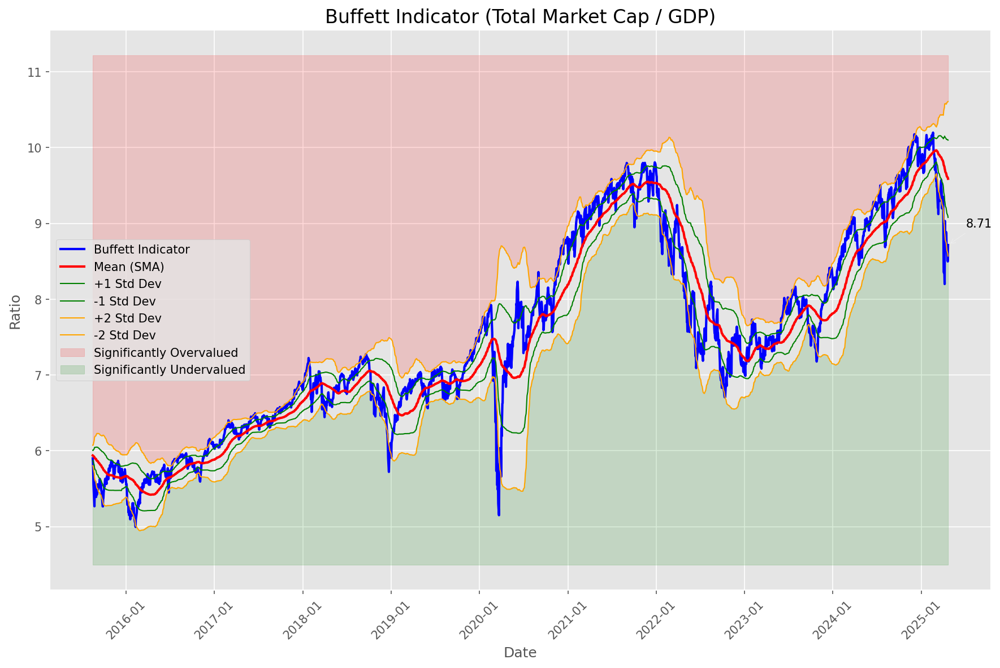
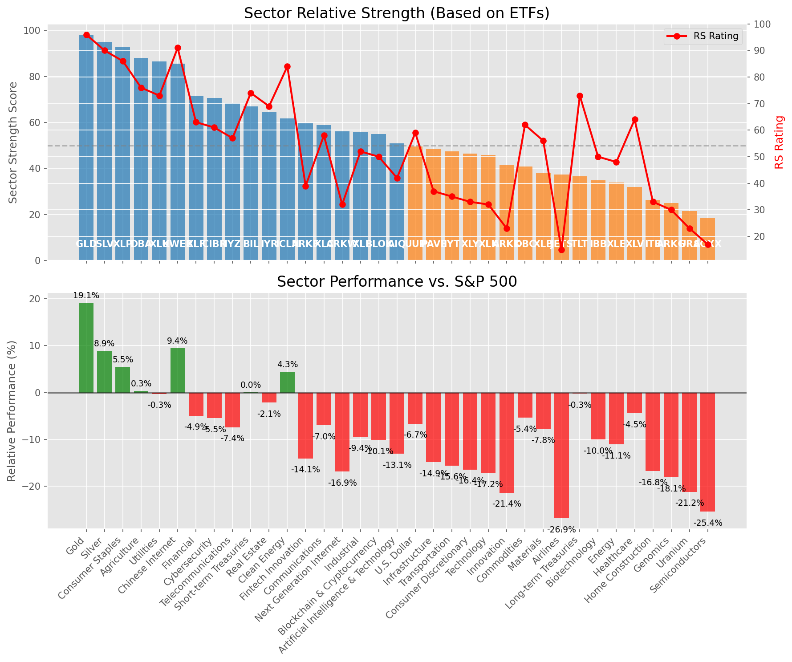

# **Daily Relative Strength Report**

**Date:** 2025-04-23

## **Market Valuation (Buffett Indicator)**

| Metric | Value |
|--------|-------|
| **Market Valuation** | **Undervalued** |
| **Current Ratio** | 8.93 |
| **Historical Mean** | 9.59 |
| **Standard Deviation** | 0.51 |
| **Z-Score (StdDev from Mean)** | -1.72 |
| **Total Market Cap** | $265.31 trillion |
| **GDP** | $29.72 trillion |

## **Market Insights**

### **Market is Undervalued**

The market is trading below historical average valuations, suggesting potential opportunity. These conditions have historically preceded periods of above-average returns. Investors should:

- Look for stocks breaking out of consolidation patterns on increasing volume
- Focus on sectors showing relative strength
- Consider increasing equity exposure, particularly in quality names
- Be mindful of overall market direction and avoid fighting the trend

History suggests patient investors are often rewarded when investing during periods of undervaluation.

### **Buffett Indicator Overview**

The Buffett Indicator (Total Market Cap / GDP) is a measure of the stock market's valuation relative to the size of the economy. It is named after Warren Buffett, who described it as "probably the best single measure of where valuations stand at any given moment."

- **Values above +2 standard deviations:** Market significantly overvalued
- **Values above +1 standard deviation:** Market overvalued
- **Values between -1 and +1 standard deviations:** Market fairly valued
- **Values below -1 standard deviation:** Market undervalued
- **Values below -2 standard deviations:** Market significantly undervalued

---

## **Sector Relative Strength**

Based on William O'Neil's Relative Strength Methodology

| ETF | Strength | RS Rating | Performance | Above Key MAs | Trend | Sector |
|-----|----------|-----------|-------------|--------------|-------|--------|
| [GLD](https://www.tradingview.com/chart/?symbol=GLD) | 98.0 | 96.0 | 19.07% | 10d ✓, 50d ✓, 200d ✓ | ↗️ | Gold |
| [SLV](https://www.tradingview.com/chart/?symbol=SLV) | 95.0 | 90.0 | 8.77% | 10d ✓, 50d ✓, 200d ✓ | ↗️ | Silver |
| [XLP](https://www.tradingview.com/chart/?symbol=XLP) | 93.5 | 87.0 | 5.68% | 10d ✓, 50d ✓, 200d ✓ | ↗️ | Consumer Staples |
| [DBA](https://www.tradingview.com/chart/?symbol=DBA) | 88.0 | 76.0 | 0.41% | 10d ✓, 50d ✓, 200d ✓ | ↗️ | Agriculture |
| [XLU](https://www.tradingview.com/chart/?symbol=XLU) | 87.0 | 74.0 | -0.04% | 10d ✓, 50d ✓, 200d ✓ | ↗️ | Utilities |
| [KWEB](https://www.tradingview.com/chart/?symbol=KWEB) | 85.6 | 91.0 | 9.37% | 10d ✓, 50d ✗, 200d ✓ | ↗️ | Chinese Internet |
| [XLF](https://www.tradingview.com/chart/?symbol=XLF) | 71.6 | 63.0 | -4.75% | 10d ✓, 50d ✗, 200d ✓ | ↗️ | Financial |
| [CIBR](https://www.tradingview.com/chart/?symbol=CIBR) | 70.6 | 61.0 | -5.62% | 10d ✓, 50d ✗, 200d ✓ | ↗️ | Cybersecurity |
| [IYZ](https://www.tradingview.com/chart/?symbol=IYZ) | 68.6 | 57.0 | -7.31% | 10d ✓, 50d ✗, 200d ✓ | ↗️ | Telecommunications |
| [BIL](https://www.tradingview.com/chart/?symbol=BIL) | 67.0 | 74.0 | 0.01% | 10d ✓, 50d ✓, 200d ✓ | ↘️ | Short-term Treasuries |
| [IYR](https://www.tradingview.com/chart/?symbol=IYR) | 64.4 | 69.0 | -1.78% | 10d ✓, 50d ✗, 200d ✗ | ↗️ | Real Estate |
| [ICLN](https://www.tradingview.com/chart/?symbol=ICLN) | 61.8 | 84.0 | 4.39% | 10d ✓, 50d ✓, 200d ✗ | ↘️ | Clean Energy |
| [ARKF](https://www.tradingview.com/chart/?symbol=ARKF) | 59.6 | 39.0 | -14.17% | 10d ✓, 50d ✗, 200d ✓ | ↗️ | Fintech Innovation |
| [XLC](https://www.tradingview.com/chart/?symbol=XLC) | 58.4 | 57.0 | -7.01% | 10d ✓, 50d ✗, 200d ✗ | ↗️ | Communications |
| [ARKW](https://www.tradingview.com/chart/?symbol=ARKW) | 56.6 | 33.0 | -16.78% | 10d ✓, 50d ✗, 200d ✓ | ↗️ | Next Generation Internet |
| [XLI](https://www.tradingview.com/chart/?symbol=XLI) | 55.9 | 52.0 | -9.32% | 10d ✓, 50d ✗, 200d ✗ | ↗️ | Industrial |
| [BLOK](https://www.tradingview.com/chart/?symbol=BLOK) | 54.9 | 50.0 | -10.25% | 10d ✓, 50d ✗, 200d ✗ | ↗️ | Blockchain & Cryptocurrency |
| [AIQ](https://www.tradingview.com/chart/?symbol=AIQ) | 50.9 | 42.0 | -13.12% | 10d ✓, 50d ✗, 200d ✗ | ↗️ | Artificial Intelligence & Technology |
| [UUP](https://www.tradingview.com/chart/?symbol=UUP) | 49.5 | 59.0 | -6.67% | 10d ✗, 50d ✗, 200d ✗ | ↗️ | U.S. Dollar |
| [PAVE](https://www.tradingview.com/chart/?symbol=PAVE) | 48.9 | 38.0 | -14.66% | 10d ✓, 50d ✗, 200d ✗ | ↗️ | Infrastructure |
| [IYT](https://www.tradingview.com/chart/?symbol=IYT) | 47.4 | 35.0 | -15.74% | 10d ✓, 50d ✗, 200d ✗ | ↗️ | Transportation |
| [TLT](https://www.tradingview.com/chart/?symbol=TLT) | 46.9 | 74.0 | 0.02% | 10d ✓, 50d ✗, 200d ✗ | ↘️ | Long-term Treasuries |
| [XLY](https://www.tradingview.com/chart/?symbol=XLY) | 46.4 | 33.0 | -16.47% | 10d ✓, 50d ✗, 200d ✗ | ↗️ | Consumer Discretionary |
| [XLK](https://www.tradingview.com/chart/?symbol=XLK) | 45.9 | 32.0 | -17.20% | 10d ✓, 50d ✗, 200d ✗ | ↗️ | Technology |
| [ARKK](https://www.tradingview.com/chart/?symbol=ARKK) | 41.4 | 23.0 | -21.51% | 10d ✓, 50d ✗, 200d ✗ | ↗️ | Innovation |
| [DBC](https://www.tradingview.com/chart/?symbol=DBC) | 40.4 | 61.0 | -5.51% | 10d ✓, 50d ✗, 200d ✗ | ↘️ | Commodities |
| [JETS](https://www.tradingview.com/chart/?symbol=JETS) | 37.9 | 16.0 | -26.66% | 10d ✓, 50d ✗, 200d ✗ | ↗️ | Airlines |
| [XLB](https://www.tradingview.com/chart/?symbol=XLB) | 37.4 | 55.0 | -7.74% | 10d ✓, 50d ✗, 200d ✗ | ↘️ | Materials |
| [IBB](https://www.tradingview.com/chart/?symbol=IBB) | 34.9 | 50.0 | -9.90% | 10d ✓, 50d ✗, 200d ✗ | ↘️ | Biotechnology |
| [XLE](https://www.tradingview.com/chart/?symbol=XLE) | 33.9 | 48.0 | -10.96% | 10d ✓, 50d ✗, 200d ✗ | ↘️ | Energy |
| [XLV](https://www.tradingview.com/chart/?symbol=XLV) | 32.0 | 64.0 | -4.21% | 10d ✗, 50d ✗, 200d ✗ | ↘️ | Healthcare |
| [ITB](https://www.tradingview.com/chart/?symbol=ITB) | 26.4 | 33.0 | -16.61% | 10d ✓, 50d ✗, 200d ✗ | ↘️ | Home Construction |
| [ARKG](https://www.tradingview.com/chart/?symbol=ARKG) | 24.9 | 30.0 | -18.14% | 10d ✓, 50d ✗, 200d ✗ | ↘️ | Genomics |
| [URA](https://www.tradingview.com/chart/?symbol=URA) | 21.9 | 24.0 | -21.10% | 10d ✓, 50d ✗, 200d ✗ | ↘️ | Uranium |
| [SOXX](https://www.tradingview.com/chart/?symbol=SOXX) | 18.4 | 17.0 | -25.48% | 10d ✓, 50d ✗, 200d ✗ | ↘️ | Semiconductors |

### **Sector ETF Performance Interpretation**

This table shows the relative strength metrics for different market sectors based on their representative ETFs:

- **ETF**: The ETF used to measure sector performance (click for chart)
- **Strength**: Overall sector strength score (0-100) combining multiple factors
- **RS Rating**: O'Neil RS rating of the sector ETF
- **Performance**: Performance of the sector ETF relative to SPY
- **Above Key MAs**: Whether the ETF is trading above its 10, 50, and 200-day moving averages
- **Trend**: Whether the sector is in an uptrend (↗️) or downtrend (↘️)

### **Current Sector Leadership**

The current market leadership is coming from the following sectors: **Gold, Silver, Consumer Staples**.

The **Gold** sector (represented by **GLD**) is showing particularly strong relative strength with an RS rating of 96.0 and performance of 19.07% vs. the S&P 500. This sector is trading above its 10-day, 50-day, 200-day moving average(s). Investors should consider focusing on high RS stocks within these leading sectors for potential outperformance.

---

## **Buy Recommendations**

The following 80 stocks show exceptional relative strength:

| RS Rating | Buy Score | Current Price | Chart | Name | Ticker |
|-----------|-----------|---------------|-------|------|--------|
| 100 | 100 | $151.05 | [Chart](https://www.tradingview.com/chart/?symbol=PLMR) | Palomar Holdings, Inc. Common stock | PLMR |
| 99 | 100 | $167.93 | [Chart](https://www.tradingview.com/chart/?symbol=PM) | Philip Morris International Inc. | PM |
| 99 | 100 | $118.44 | [Chart](https://www.tradingview.com/chart/?symbol=AEM) | Agnico Eagle Mines Ltd. | AEM |
| 99 | 100 | $16.07 | [Chart](https://www.tradingview.com/chart/?symbol=EZPW) | Ezcorp Inc | EZPW |
| 99 | 100 | $139.75 | [Chart](https://www.tradingview.com/chart/?symbol=UGL) | ProShares Ultra Gold | UGL |
| 99 | 100 | $180.61 | [Chart](https://www.tradingview.com/chart/?symbol=RGLD) | Royal Gold Inc | RGLD |
| 99 | 100 | $104.36 | [Chart](https://www.tradingview.com/chart/?symbol=WGS) | GeneDx Holdings Corp. Class A Common Stock | WGS |
| 98 | 100 | $24.93 | [Chart](https://www.tradingview.com/chart/?symbol=DB) | Deutsche Bank Aktiengesellschaft | DB |
| 98 | 100 | $20.78 | [Chart](https://www.tradingview.com/chart/?symbol=GRND) | Grindr Inc. | GRND |
| 97 | 100 | $31.34 | [Chart](https://www.tradingview.com/chart/?symbol=SGOL) | abrdn Physical Gold Shares ETF | SGOL |
| 97 | 100 | $54.71 | [Chart](https://www.tradingview.com/chart/?symbol=PPC) | Pilgrims Pride Corporation | PPC |
| 97 | 100 | $27.18 | [Chart](https://www.tradingview.com/chart/?symbol=T) | AT&T Inc. | T |
| 97 | 100 | $32.77 | [Chart](https://www.tradingview.com/chart/?symbol=IAUM) | iShares Gold Trust Micro | IAUM |
| 97 | 100 | $71.24 | [Chart](https://www.tradingview.com/chart/?symbol=WRB) | W.R. Berkley Corporation | WRB |
| 97 | 100 | $31.68 | [Chart](https://www.tradingview.com/chart/?symbol=OUNZ) | VanEck Merk Gold ETF | OUNZ |
| 97 | 100 | $65.08 | [Chart](https://www.tradingview.com/chart/?symbol=GLDM) | SPDR Gold MiniShares | GLDM |
| 97 | 100 | $22.88 | [Chart](https://www.tradingview.com/chart/?symbol=OR) | Osisko Gold Royalties Ltd | OR |
| 97 | 100 | $71.55 | [Chart](https://www.tradingview.com/chart/?symbol=KR) | The Kroger Co. | KR |
| 97 | 100 | $599.72 | [Chart](https://www.tradingview.com/chart/?symbol=SPOT) | Spotify Technology S.A. | SPOT |
| 96 | 100 | $85.50 | [Chart](https://www.tradingview.com/chart/?symbol=SNEX) | StoneX Group Inc. Common Stock | SNEX |
| 96 | 100 | $61.97 | [Chart](https://www.tradingview.com/chart/?symbol=IAU) | iShares Gold Trust | IAU |
| 96 | 100 | $68.66 | [Chart](https://www.tradingview.com/chart/?symbol=VTR) | Ventas, Inc. | VTR |
| 96 | 100 | $69.59 | [Chart](https://www.tradingview.com/chart/?symbol=CORT) | Corcept Therapeutics Inc. | CORT |
| 96 | 100 | $29.46 | [Chart](https://www.tradingview.com/chart/?symbol=EUFN) | iShares MSCI Europe Financials ETF | EUFN |
| 96 | 100 | $32.46 | [Chart](https://www.tradingview.com/chart/?symbol=AAAU) | Goldman Sachs Physical Gold ETF Shares | AAAU |
| 96 | 100 | $32.41 | [Chart](https://www.tradingview.com/chart/?symbol=BAR) | GraniteShares Gold Shares | BAR |
| 96 | 100 | $302.95 | [Chart](https://www.tradingview.com/chart/?symbol=GLD) | SPDR Gold Trust, SPDR Gold Shares | GLD |
| 95 | 100 | $88.59 | [Chart](https://www.tradingview.com/chart/?symbol=CCEP) | Coca-Cola Europacific Partners plc Ordinary Shares | CCEP |
| 95 | 100 | $23.50 | [Chart](https://www.tradingview.com/chart/?symbol=SRAD) | Sportradar Group AG Class A Ordinary Shares | SRAD |
| 95 | 100 | $63.68 | [Chart](https://www.tradingview.com/chart/?symbol=VRNA) | Verona Pharma plc | VRNA |
| 95 | 100 | $39.85 | [Chart](https://www.tradingview.com/chart/?symbol=MRX) | Marex Group plc Ordinary Shares | MRX |
| 95 | 100 | $283.43 | [Chart](https://www.tradingview.com/chart/?symbol=COR) | Cencora, Inc. | COR |
| 95 | 100 | $29.25 | [Chart](https://www.tradingview.com/chart/?symbol=CEF) | Sprott Physical Gold and Silver Trust | CEF |
| 95 | 100 | $528.02 | [Chart](https://www.tradingview.com/chart/?symbol=BRK.B) | BERKSHIRE HATHAWAY Class B | BRK.B |
| 95 | 100 | $42.26 | [Chart](https://www.tradingview.com/chart/?symbol=BTI) | British American Tobacco p.l.c. American Depositary Shares, American Depositary Shares, each representing one Ordinary Share | BTI |
| 94 | 100 | $333.06 | [Chart](https://www.tradingview.com/chart/?symbol=AJG) | Arthur J. Gallagher & Co. | AJG |
| 94 | 100 | $16.60 | [Chart](https://www.tradingview.com/chart/?symbol=SPNT) | SiriusPoint Ltd. | SPNT |
| 94 | 100 | $38.53 | [Chart](https://www.tradingview.com/chart/?symbol=EWG) | iShares MSCI Germany ETF | EWG |
| 94 | 100 | $172.81 | [Chart](https://www.tradingview.com/chart/?symbol=DGX) | Quest Diagnostics Inc. | DGX |
| 94 | 100 | $165.63 | [Chart](https://www.tradingview.com/chart/?symbol=SFM) | Sprouts Farmers Market, Inc. | SFM |
| 94 | 100 | $214.22 | [Chart](https://www.tradingview.com/chart/?symbol=TTWO) | Take-Two Interactive Software Inc | TTWO |
| 94 | 100 | $43.44 | [Chart](https://www.tradingview.com/chart/?symbol=SEZL) | Sezzle Inc. Common Stock | SEZL |
| 94 | 100 | $77.89 | [Chart](https://www.tradingview.com/chart/?symbol=NFG) | National Fuel Gas Co. | NFG |
| 93 | 100 | $118.62 | [Chart](https://www.tradingview.com/chart/?symbol=BRO) | Brown & Brown, Inc. | BRO |
| 93 | 100 | $135.02 | [Chart](https://www.tradingview.com/chart/?symbol=DTE) | DTE Energy Company | DTE |
| 93 | 100 | $1388.24 | [Chart](https://www.tradingview.com/chart/?symbol=ORLY) | O'Reilly Automotive, Inc. | ORLY |
| 93 | 100 | $34.14 | [Chart](https://www.tradingview.com/chart/?symbol=FDP) | Fresh Del Monte Produce Inc. | FDP |
| 92 | 100 | $56.22 | [Chart](https://www.tradingview.com/chart/?symbol=HSBC) | HSBC Holdings PLC | HSBC |
| 92 | 100 | $36.15 | [Chart](https://www.tradingview.com/chart/?symbol=PPL) | PPL Corporation | PPL |
| 91 | 100 | $1050.23 | [Chart](https://www.tradingview.com/chart/?symbol=NFLX) | NetFlix Inc | NFLX |
| 91 | 100 | $94.10 | [Chart](https://www.tradingview.com/chart/?symbol=PNW) | Pinnacle West Capital Corporation | PNW |
| 91 | 100 | $72.85 | [Chart](https://www.tradingview.com/chart/?symbol=CMS) | CMS Energy Corporation | CMS |
| 91 | 100 | $31.20 | [Chart](https://www.tradingview.com/chart/?symbol=LTH) | Life Time Group Holdings, Inc. | LTH |
| 91 | 100 | $195.53 | [Chart](https://www.tradingview.com/chart/?symbol=WCN) | Waste Connections, Inc. | WCN |
| 90 | 100 | $67.89 | [Chart](https://www.tradingview.com/chart/?symbol=EVRG) | Evergy, Inc. | EVRG |
| 90 | 100 | $77.19 | [Chart](https://www.tradingview.com/chart/?symbol=ADC) | Agree Realty Corporation | ADC |
| 90 | 100 | $15.66 | [Chart](https://www.tradingview.com/chart/?symbol=BCS) | Barclays PLC | BCS |
| 90 | 100 | $18.51 | [Chart](https://www.tradingview.com/chart/?symbol=KT) | KT Corp. | KT |
| 90 | 100 | $43.27 | [Chart](https://www.tradingview.com/chart/?symbol=NWN) | Northwest Natural Holding Company | NWN |
| 89 | 100 | $101.68 | [Chart](https://www.tradingview.com/chart/?symbol=EHC) | Encompass Health Corporation Common Stock | EHC |
| 89 | 100 | $107.31 | [Chart](https://www.tradingview.com/chart/?symbol=ATGE) | Adtalem Global Education Inc. Common Shares | ATGE |
| 89 | 100 | $77.88 | [Chart](https://www.tradingview.com/chart/?symbol=SR) | Spire Inc. | SR |
| 89 | 100 | $30.43 | [Chart](https://www.tradingview.com/chart/?symbol=AHR) | American Healthcare REIT, Inc. | AHR |
| 88 | 100 | $23.69 | [Chart](https://www.tradingview.com/chart/?symbol=EWS) | iShares MSCI Singapore ETF | EWS |
| 88 | 100 | $39.86 | [Chart](https://www.tradingview.com/chart/?symbol=VIRT) | Virtu Financial, Inc. Class A | VIRT |
| 88 | 100 | $195.62 | [Chart](https://www.tradingview.com/chart/?symbol=GWRE) | GUIDEWIRE SOFTWARE, INC. | GWRE |
| 87 | 100 | $45.05 | [Chart](https://www.tradingview.com/chart/?symbol=OGE) | OGE Energy Corp. | OGE |
| 88 | 99 | $52.54 | [Chart](https://www.tradingview.com/chart/?symbol=RELX) | RELX PLC | RELX |
| 85 | 99 | $134.83 | [Chart](https://www.tradingview.com/chart/?symbol=CAH) | Cardinal Health, Inc. | CAH |
| 88 | 98 | $124.00 | [Chart](https://www.tradingview.com/chart/?symbol=BECN) | Beacon Roofing Supply, Inc. | BECN |
| 85 | 98 | $160.01 | [Chart](https://www.tradingview.com/chart/?symbol=EAT) | Brinker International, Inc. | EAT |
| 85 | 98 | $79.08 | [Chart](https://www.tradingview.com/chart/?symbol=UNM) | Unum Group | UNM |
| 88 | 97 | $62.41 | [Chart](https://www.tradingview.com/chart/?symbol=FNF) | Fidelity National Financial, Inc. | FNF |
| 86 | 97 | $260.26 | [Chart](https://www.tradingview.com/chart/?symbol=TRV) | The Travelers Companies, Inc. | TRV |
| 85 | 96 | $56.09 | [Chart](https://www.tradingview.com/chart/?symbol=ULS) | UL Solutions Inc. | ULS |
| 84 | 96 | $66.77 | [Chart](https://www.tradingview.com/chart/?symbol=EBAY) | eBay Inc | EBAY |
| 81 | 95 | $84.28 | [Chart](https://www.tradingview.com/chart/?symbol=ETR) | Entergy Corporation | ETR |
| 83 | 94 | $977.51 | [Chart](https://www.tradingview.com/chart/?symbol=COST) | Costco Wholesale Corp | COST |
| 80 | 93 | $95.08 | [Chart](https://www.tradingview.com/chart/?symbol=WMT) | Walmart Inc. | WMT |
| 81 | 91 | $49.85 | [Chart](https://www.tradingview.com/chart/?symbol=VTIP) | Vanguard Short-Term Inflation-Protected Securities Index Fund | VTIP |

---

## **Sell Recommendations**

The following 166 stocks show deteriorating relative strength:

| RS Rating | Sell Score | Current Price | Chart | Name | Ticker |
|-----------|------------|---------------|-------|------|--------|
| 1 | 100 | $14.46 | [Chart](https://www.tradingview.com/chart/?symbol=RXST) | RxSight, Inc. Common Stock | RXST |
| 2 | 100 | $10.03 | [Chart](https://www.tradingview.com/chart/?symbol=FLYW) | Flywire Corporation Voting Common Stock | FLYW |
| 2 | 100 | $74.82 | [Chart](https://www.tradingview.com/chart/?symbol=FRPT) | Freshpet, Inc. | FRPT |
| 2 | 100 | $16.57 | [Chart](https://www.tradingview.com/chart/?symbol=TNDM) | Tandem Diabetes Care, Inc. | TNDM |
| 2 | 100 | $16.38 | [Chart](https://www.tradingview.com/chart/?symbol=SSTK) | SHUTTERSTOCK, INC. | SSTK |
| 3 | 100 | $12.59 | [Chart](https://www.tradingview.com/chart/?symbol=ODP) | The ODP Corporation Common Stock | ODP |
| 3 | 100 | $112.05 | [Chart](https://www.tradingview.com/chart/?symbol=GLOB) | GLOBANT S.A. | GLOB |
| 3 | 100 | $76.08 | [Chart](https://www.tradingview.com/chart/?symbol=ILMN) | Illumina Inc | ILMN |
| 4 | 100 | $53.88 | [Chart](https://www.tradingview.com/chart/?symbol=LABU) | Direxion Daily S&P Biotech Bull 3X Shares | LABU |
| 4 | 100 | $17.61 | [Chart](https://www.tradingview.com/chart/?symbol=APLS) | Apellis Pharmaceuticals, Inc. Common Stock | APLS |
| 4 | 100 | $106.44 | [Chart](https://www.tradingview.com/chart/?symbol=ARM) | Arm Holdings plc American Depositary Shares | ARM |
| 4 | 100 | $18.22 | [Chart](https://www.tradingview.com/chart/?symbol=DAVA) | Endava plc American Depositary Shares (each representing one Class A Ordinary Share) | DAVA |
| 5 | 100 | $23.74 | [Chart](https://www.tradingview.com/chart/?symbol=RPD) | Rapid7, Inc. Common Stock | RPD |
| 5 | 100 | $23.67 | [Chart](https://www.tradingview.com/chart/?symbol=WSC) | WillScot Holdings Corporation Class A Common Stock | WSC |
| 5 | 100 | $19.63 | [Chart](https://www.tradingview.com/chart/?symbol=SPT) | Sprout Social, Inc Class A Common Stock | SPT |
| 5 | 100 | $64.65 | [Chart](https://www.tradingview.com/chart/?symbol=CAMT) | Camtek Ltd | CAMT |
| 5 | 100 | $31.49 | [Chart](https://www.tradingview.com/chart/?symbol=SCSC) | Scansource Inc | SCSC |
| 6 | 100 | $29.27 | [Chart](https://www.tradingview.com/chart/?symbol=W) | Wayfair Inc. | W |
| 6 | 100 | $14.65 | [Chart](https://www.tradingview.com/chart/?symbol=MEG) | Montrose Environmental Group, Inc. | MEG |
| 6 | 100 | $17.16 | [Chart](https://www.tradingview.com/chart/?symbol=PDFS) | PDF Solutions Inc | PDFS |
| 6 | 100 | $12.96 | [Chart](https://www.tradingview.com/chart/?symbol=ARCT) | Arcturus Therapeutics Holdings Inc. Common Stock | ARCT |
| 6 | 100 | $22.25 | [Chart](https://www.tradingview.com/chart/?symbol=NSSC) | Napco Security Technologies, Inc | NSSC |
| 6 | 100 | $33.85 | [Chart](https://www.tradingview.com/chart/?symbol=TDW) | Tidewater, Inc. | TDW |
| 6 | 100 | $12.38 | [Chart](https://www.tradingview.com/chart/?symbol=IMXI) | International Money Express, Inc. | IMXI |
| 7 | 100 | $62.64 | [Chart](https://www.tradingview.com/chart/?symbol=ARCB) | ArcBest Corporation | ARCB |
| 7 | 100 | $53.05 | [Chart](https://www.tradingview.com/chart/?symbol=SYNA) | Synaptics Inc | SYNA |
| 7 | 100 | $21.36 | [Chart](https://www.tradingview.com/chart/?symbol=SYM) | Symbotic Inc. Class A Common Stock | SYM |
| 7 | 100 | $13.48 | [Chart](https://www.tradingview.com/chart/?symbol=GCT) | GigaCloud Technology Inc Class A Ordinary Shares | GCT |
| 7 | 100 | $12.77 | [Chart](https://www.tradingview.com/chart/?symbol=DV) | DoubleVerify Holdings, Inc. | DV |
| 8 | 100 | $20.79 | [Chart](https://www.tradingview.com/chart/?symbol=TDC) | TERADATA CORPORATION | TDC |
| 8 | 100 | $19.54 | [Chart](https://www.tradingview.com/chart/?symbol=ICHR) | Ichor Holdings | ICHR |
| 9 | 100 | $16.50 | [Chart](https://www.tradingview.com/chart/?symbol=IART) | Integra LifeSciences Holdings | IART |
| 9 | 100 | $26.01 | [Chart](https://www.tradingview.com/chart/?symbol=XPEL) | XPEL, Inc. Common Stock | XPEL |
| 10 | 100 | $18.33 | [Chart](https://www.tradingview.com/chart/?symbol=VECO) | Veeco Instruments Inc | VECO |
| 10 | 100 | $10.92 | [Chart](https://www.tradingview.com/chart/?symbol=AEYE) | AudioEye, Inc. Common Stock | AEYE |
| 11 | 100 | $13.40 | [Chart](https://www.tradingview.com/chart/?symbol=XRAY) | DENTSPLY SIRONA Inc. | XRAY |
| 13 | 100 | $20.37 | [Chart](https://www.tradingview.com/chart/?symbol=ST) | Sensata Technologies Holding plc | ST |
| 14 | 100 | $13.17 | [Chart](https://www.tradingview.com/chart/?symbol=DK) | Delek US Holdings, Inc. | DK |
| 14 | 100 | $20.61 | [Chart](https://www.tradingview.com/chart/?symbol=FOXF) | Fox Factory Holding Corp. Common Stock | FOXF |
| 15 | 100 | $28.55 | [Chart](https://www.tradingview.com/chart/?symbol=SRDX) | Surmodics, Inc. Common Stock | SRDX |
| 16 | 100 | $35.13 | [Chart](https://www.tradingview.com/chart/?symbol=STNG) | Scorpio Tankers Inc. | STNG |
| 6 | 99 | $25.70 | [Chart](https://www.tradingview.com/chart/?symbol=SPHR) | Sphere Entertainment Co. | SPHR |
| 7 | 99 | $34.88 | [Chart](https://www.tradingview.com/chart/?symbol=CRC) | California Resources Corporation | CRC |
| 11 | 99 | $18.44 | [Chart](https://www.tradingview.com/chart/?symbol=AMN) | AMN Healthcare Services | AMN |
| 13 | 99 | $12.21 | [Chart](https://www.tradingview.com/chart/?symbol=ZVZZT) | SUPER Montage TEST SYMBOL | ZVZZT |
| 14 | 99 | $119.71 | [Chart](https://www.tradingview.com/chart/?symbol=BLDR) | Builders FirstSource, Inc. | BLDR |
| 5 | 98 | $23.54 | [Chart](https://www.tradingview.com/chart/?symbol=FIVN) | FIVE9, INC. | FIVN |
| 14 | 98 | $10.77 | [Chart](https://www.tradingview.com/chart/?symbol=SONO) | Sonos, Inc. Common Stock | SONO |
| 17 | 98 | $12.14 | [Chart](https://www.tradingview.com/chart/?symbol=OSCR) | Oscar Health, Inc. | OSCR |
| 7 | 97 | $18.26 | [Chart](https://www.tradingview.com/chart/?symbol=SG) | Sweetgreen, Inc. | SG |
| 9 | 97 | $22.38 | [Chart](https://www.tradingview.com/chart/?symbol=THS) | Treehouse Foods, Inc. | THS |
| 10 | 97 | $85.62 | [Chart](https://www.tradingview.com/chart/?symbol=NTAP) | NetApp, Inc | NTAP |
| 11 | 97 | $23.67 | [Chart](https://www.tradingview.com/chart/?symbol=RNG) | RINGCENTRAL, INC. | RNG |
| 12 | 97 | $21.09 | [Chart](https://www.tradingview.com/chart/?symbol=DIN) | Dine Brands Global, Inc. | DIN |
| 12 | 97 | $53.27 | [Chart](https://www.tradingview.com/chart/?symbol=NVT) | nVent Electric plc Ordinary Shares | NVT |
| 14 | 97 | $93.03 | [Chart](https://www.tradingview.com/chart/?symbol=BCC) | Boise Cascade Company | BCC |
| 18 | 97 | $12.26 | [Chart](https://www.tradingview.com/chart/?symbol=BAND) | Bandwidth Inc. Class A Common Stock | BAND |
| 6 | 96 | $53.44 | [Chart](https://www.tradingview.com/chart/?symbol=VAC) | MARRIOTT VACATIONS WORLDWIDE CORPORATION | VAC |
| 8 | 96 | $12.29 | [Chart](https://www.tradingview.com/chart/?symbol=ZETA) | Zeta Global Holdings Corp. | ZETA |
| 10 | 96 | $19.11 | [Chart](https://www.tradingview.com/chart/?symbol=BZH) | Beazer Homes USA, Inc. New | BZH |
| 23 | 96 | $12.38 | [Chart](https://www.tradingview.com/chart/?symbol=TRIP) | TripAdvisor, Inc. | TRIP |
| 5 | 95 | $43.26 | [Chart](https://www.tradingview.com/chart/?symbol=PSTG) | Pure Storage, Inc. Class A | PSTG |
| 8 | 95 | $19.22 | [Chart](https://www.tradingview.com/chart/?symbol=CECO) | Ceco Environmental Corp | CECO |
| 16 | 95 | $32.92 | [Chart](https://www.tradingview.com/chart/?symbol=URNM) | Sprott Uranium Miners ETF | URNM |
| 19 | 95 | $47.89 | [Chart](https://www.tradingview.com/chart/?symbol=POWI) | Power Integrations Inc | POWI |
| 9 | 94 | $43.38 | [Chart](https://www.tradingview.com/chart/?symbol=DFIN) | Donnelley Financial Solutions, Inc. | DFIN |
| 13 | 94 | $21.14 | [Chart](https://www.tradingview.com/chart/?symbol=UCO) | ProShares Ultra Bloomberg Crude Oil | UCO |
| 14 | 94 | $35.01 | [Chart](https://www.tradingview.com/chart/?symbol=TEX) | Terex Corporation | TEX |
| 16 | 94 | $62.65 | [Chart](https://www.tradingview.com/chart/?symbol=SPB) | Spectrum Brands Holdings, Inc. | SPB |
| 16 | 94 | $12.41 | [Chart](https://www.tradingview.com/chart/?symbol=ADNT) | Adient plc Ordinary Shares | ADNT |
| 19 | 94 | $28.64 | [Chart](https://www.tradingview.com/chart/?symbol=YETI) | YETI Holdings, Inc. Common Stock | YETI |
| 26 | 94 | $15.74 | [Chart](https://www.tradingview.com/chart/?symbol=TRMD) | TORM plc Class A Common Stock | TRMD |
| 10 | 93 | $22.88 | [Chart](https://www.tradingview.com/chart/?symbol=VERA) | Vera Therapeutics, Inc. Class A Common Stock | VERA |
| 11 | 93 | $10.01 | [Chart](https://www.tradingview.com/chart/?symbol=VYX) | NCR Voyix Corporation | VYX |
| 17 | 93 | $33.72 | [Chart](https://www.tradingview.com/chart/?symbol=OVV) | Ovintiv Inc. | OVV |
| 22 | 93 | $12.26 | [Chart](https://www.tradingview.com/chart/?symbol=MED) | Medifast, Inc. | MED |
| 27 | 93 | $14.20 | [Chart](https://www.tradingview.com/chart/?symbol=FXN) | First Trust Energy AlphaDEX Fund | FXN |
| 9 | 92 | $15.32 | [Chart](https://www.tradingview.com/chart/?symbol=DNLI) | Denali Therapeutics Inc. Common Stock | DNLI |
| 14 | 92 | $10.31 | [Chart](https://www.tradingview.com/chart/?symbol=VREX) | Varex Imaging Corporation Common Stock | VREX |
| 16 | 92 | $15.04 | [Chart](https://www.tradingview.com/chart/?symbol=PBW) | Invesco WilderHill Clean Energy ETF | PBW |
| 20 | 92 | $11.34 | [Chart](https://www.tradingview.com/chart/?symbol=HPK) | HighPeak Energy, Inc. Common Stock | HPK |
| 22 | 92 | $10.15 | [Chart](https://www.tradingview.com/chart/?symbol=CSIQ) | Canadian Solar Inc. Common Shares (ON) | CSIQ |
| 10 | 91 | $11.56 | [Chart](https://www.tradingview.com/chart/?symbol=MBC) | MasterBrand, Inc. | MBC |
| 12 | 91 | $188.44 | [Chart](https://www.tradingview.com/chart/?symbol=FN) | Fabrinet | FN |
| 11 | 90 | $343.76 | [Chart](https://www.tradingview.com/chart/?symbol=SAIA) | Saia, Inc. | SAIA |
| 13 | 90 | $16.94 | [Chart](https://www.tradingview.com/chart/?symbol=PRO) | Pros Holdings, Inc. | PRO |
| 16 | 90 | $38.45 | [Chart](https://www.tradingview.com/chart/?symbol=TWST) | Twist Bioscience Corporation Common Stock | TWST |
| 17 | 90 | $10.96 | [Chart](https://www.tradingview.com/chart/?symbol=JAMF) | Jamf Holding Corp. Common Stock | JAMF |
| 18 | 90 | $36.68 | [Chart](https://www.tradingview.com/chart/?symbol=LIVN) | LivaNova PLC Ordinary Shares | LIVN |
| 18 | 90 | $29.37 | [Chart](https://www.tradingview.com/chart/?symbol=CDRE) | Cadre Holdings, Inc. | CDRE |
| 20 | 90 | $93.63 | [Chart](https://www.tradingview.com/chart/?symbol=CHRD) | Chord Energy Corporation Common Stock | CHRD |
| 22 | 90 | $12.40 | [Chart](https://www.tradingview.com/chart/?symbol=KRP) | Kimbell Royalty Partners, LP Common Units representing Limited Partner Interests | KRP |
| 13 | 89 | $112.55 | [Chart](https://www.tradingview.com/chart/?symbol=GNRC) | GENERAC HOLDINGS INC | GNRC |
| 17 | 89 | $16.72 | [Chart](https://www.tradingview.com/chart/?symbol=CTRI) | Centuri Holdings, Inc. | CTRI |
| 20 | 89 | $26.86 | [Chart](https://www.tradingview.com/chart/?symbol=SEE) | Sealed Air Corp. | SEE |
| 18 | 88 | $42.44 | [Chart](https://www.tradingview.com/chart/?symbol=CCJ) | Cameco Corporation | CCJ |
| 19 | 88 | $48.15 | [Chart](https://www.tradingview.com/chart/?symbol=ERX) | Direxion Daily Energy Bull 2X Shares | ERX |
| 22 | 88 | $11.30 | [Chart](https://www.tradingview.com/chart/?symbol=KELYA) | Kelly Services Inc | KELYA |
| 26 | 88 | $75.80 | [Chart](https://www.tradingview.com/chart/?symbol=AKAM) | Akamai Technologies Inc | AKAM |
| 16 | 87 | $15.20 | [Chart](https://www.tradingview.com/chart/?symbol=DXC) | DXC Technology Company | DXC |
| 18 | 87 | $52.35 | [Chart](https://www.tradingview.com/chart/?symbol=IIPR) | Innovative Industrial Properties, Inc. Common stock | IIPR |
| 24 | 87 | $10.03 | [Chart](https://www.tradingview.com/chart/?symbol=MTAL) | MAC Copper Limited | MTAL |
| 16 | 85 | $10.43 | [Chart](https://www.tradingview.com/chart/?symbol=SEMR) | SEMrush Holdings, Inc. | SEMR |
| 21 | 85 | $35.09 | [Chart](https://www.tradingview.com/chart/?symbol=CALF) | Pacer US Small Cap Cash Cows ETF | CALF |
| 22 | 85 | $42.28 | [Chart](https://www.tradingview.com/chart/?symbol=SIMO) | Silicon Motion Technology Corporation | SIMO |
| 24 | 85 | $74.47 | [Chart](https://www.tradingview.com/chart/?symbol=IR) | Ingersoll Rand Inc. Common Stock | IR |
| 32 | 85 | $10.16 | [Chart](https://www.tradingview.com/chart/?symbol=MAX) | MediaAlpha, Inc. | MAX |
| 19 | 84 | $10.15 | [Chart](https://www.tradingview.com/chart/?symbol=HLIT) | Harmonic Inc | HLIT |
| 25 | 84 | $93.56 | [Chart](https://www.tradingview.com/chart/?symbol=WLK) | Westlake Corporation | WLK |
| 28 | 84 | $11.60 | [Chart](https://www.tradingview.com/chart/?symbol=NAVI) | Navient Corporation | NAVI |
| 30 | 84 | $12.29 | [Chart](https://www.tradingview.com/chart/?symbol=OEC) | Orion S.A. | OEC |
| 30 | 84 | $26.77 | [Chart](https://www.tradingview.com/chart/?symbol=COLL) | Collegium Pharmaceutical, Inc. Common Stock | COLL |
| 32 | 83 | $20.76 | [Chart](https://www.tradingview.com/chart/?symbol=KIDS) | OrthoPediatrics Corp. Common Stock | KIDS |
| 23 | 82 | $33.22 | [Chart](https://www.tradingview.com/chart/?symbol=AVNT) | Avient Corporation | AVNT |
| 25 | 82 | $20.66 | [Chart](https://www.tradingview.com/chart/?symbol=MGY) | Magnolia Oil & Gas Corporation Class A Common Stock | MGY |
| 25 | 82 | $33.65 | [Chart](https://www.tradingview.com/chart/?symbol=GFS) | GlobalFoundries Inc. Ordinary Shares | GFS |
| 25 | 82 | $19.20 | [Chart](https://www.tradingview.com/chart/?symbol=KMT) | Kennametal Inc. | KMT |
| 30 | 82 | $34.13 | [Chart](https://www.tradingview.com/chart/?symbol=IAC) | IAC Inc. Common Stock | IAC |
| 31 | 82 | $23.34 | [Chart](https://www.tradingview.com/chart/?symbol=HOG) | Harley-Davidson, Inc. | HOG |
| 25 | 81 | $57.47 | [Chart](https://www.tradingview.com/chart/?symbol=TREX) | Trex Company, Inc. | TREX |
| 26 | 81 | $11.14 | [Chart](https://www.tradingview.com/chart/?symbol=MRC) | MRC GLOBAL INC. | MRC |
| 26 | 81 | $28.47 | [Chart](https://www.tradingview.com/chart/?symbol=MBUU) | Malibu Boats, Inc. Class A | MBUU |
| 33 | 81 | $10.34 | [Chart](https://www.tradingview.com/chart/?symbol=CMRE) | Costamare Inc. | CMRE |
| 35 | 81 | $298.28 | [Chart](https://www.tradingview.com/chart/?symbol=BLD) | TopBuild Corp. Common Stock | BLD |
| 21 | 80 | $14.23 | [Chart](https://www.tradingview.com/chart/?symbol=PSFE) | Paysafe Limited | PSFE |
| 23 | 80 | $35.35 | [Chart](https://www.tradingview.com/chart/?symbol=GXO) | GXO Logistics, Inc. | GXO |
| 28 | 80 | $137.78 | [Chart](https://www.tradingview.com/chart/?symbol=MTN) | Vail Resorts, Inc. | MTN |
| 29 | 80 | $44.73 | [Chart](https://www.tradingview.com/chart/?symbol=EXAS) | Exact Sciences Corp | EXAS |
| 31 | 80 | $60.43 | [Chart](https://www.tradingview.com/chart/?symbol=HAE) | Haemonetics Corporation | HAE |
| 27 | 79 | $67.75 | [Chart](https://www.tradingview.com/chart/?symbol=TTC) | Toro Company (The) | TTC |
| 27 | 79 | $162.40 | [Chart](https://www.tradingview.com/chart/?symbol=IBP) | INSTALLED BUILDING PRODUCTS, INC. | IBP |
| 31 | 79 | $12.90 | [Chart](https://www.tradingview.com/chart/?symbol=WDS) | Woodside Energy Group Limited American Depositary Shares, each representing one Ordinary Share | WDS |
| 35 | 79 | $119.64 | [Chart](https://www.tradingview.com/chart/?symbol=J) | Jacobs Solutions Inc. | J |
| 23 | 78 | $211.94 | [Chart](https://www.tradingview.com/chart/?symbol=FDX) | FedEx Corporation | FDX |
| 31 | 78 | $26.36 | [Chart](https://www.tradingview.com/chart/?symbol=GDEN) | Golden Entertainment, Inc. Common Stock | GDEN |
| 32 | 78 | $13.71 | [Chart](https://www.tradingview.com/chart/?symbol=ZIM) | ZIM Integrated Shipping Services Ltd. | ZIM |
| 35 | 78 | $30.52 | [Chart](https://www.tradingview.com/chart/?symbol=MSGE) | Madison Square Garden Entertainment Corp. | MSGE |
| 38 | 78 | $20.40 | [Chart](https://www.tradingview.com/chart/?symbol=LPG) | DORIAN LPG LTD | LPG |
| 27 | 77 | $17.21 | [Chart](https://www.tradingview.com/chart/?symbol=PRAA) | PRA Group, Inc. | PRAA |
| 29 | 77 | $17.97 | [Chart](https://www.tradingview.com/chart/?symbol=ELVN) | Enliven Therapeutics, Inc. Common Stock | ELVN |
| 31 | 77 | $10.96 | [Chart](https://www.tradingview.com/chart/?symbol=SHC) | Sotera Health Company Common Stock | SHC |
| 26 | 76 | $54.20 | [Chart](https://www.tradingview.com/chart/?symbol=KBH) | KB Home | KBH |
| 28 | 76 | $13.98 | [Chart](https://www.tradingview.com/chart/?symbol=HST) | Host Hotels & Resorts, Inc. | HST |
| 29 | 76 | $25.84 | [Chart](https://www.tradingview.com/chart/?symbol=PINS) | Pinterest, Inc. Class A Common Stock | PINS |
| 35 | 76 | $69.17 | [Chart](https://www.tradingview.com/chart/?symbol=MTH) | Meritage Homes Corporation | MTH |
| 25 | 75 | $12.03 | [Chart](https://www.tradingview.com/chart/?symbol=APLE) | Apple Hospitality REIT, Inc. | APLE |
| 37 | 75 | $11.33 | [Chart](https://www.tradingview.com/chart/?symbol=ABR) | Arbor Realty Trust, Inc. | ABR |
| 33 | 74 | $28.44 | [Chart](https://www.tradingview.com/chart/?symbol=AGIO) | Agios Pharmaceuticals, Inc. | AGIO |
| 34 | 74 | $11.49 | [Chart](https://www.tradingview.com/chart/?symbol=LYFT) | Lyft, Inc. Class A Common Stock | LYFT |
| 35 | 74 | $32.54 | [Chart](https://www.tradingview.com/chart/?symbol=CRNX) | Crinetics Pharmaceuticals, Inc. | CRNX |
| 29 | 73 | $11.67 | [Chart](https://www.tradingview.com/chart/?symbol=CIM) | Chimera Investment Corp. | CIM |
| 29 | 73 | $16.10 | [Chart](https://www.tradingview.com/chart/?symbol=MLNK) | MeridianLink, Inc. | MLNK |
| 30 | 73 | $10.71 | [Chart](https://www.tradingview.com/chart/?symbol=DBRG) | DigitalBridge Group, Inc. | DBRG |
| 30 | 73 | $126.63 | [Chart](https://www.tradingview.com/chart/?symbol=SPXC) | SPX Technologies, Inc. | SPXC |
| 37 | 73 | $16.39 | [Chart](https://www.tradingview.com/chart/?symbol=SEM) | SELECT MEDICAL HOLDINGS CORP | SEM |
| 29 | 72 | $106.67 | [Chart](https://www.tradingview.com/chart/?symbol=MHK) | Mohawk Industries, Inc. | MHK |
| 33 | 72 | $58.06 | [Chart](https://www.tradingview.com/chart/?symbol=VOYA) | VOYA FINANCIAL, INC. | VOYA |
| 39 | 72 | $44.54 | [Chart](https://www.tradingview.com/chart/?symbol=PRKS) | United Parks & Resorts Inc. | PRKS |
| 33 | 71 | $51.59 | [Chart](https://www.tradingview.com/chart/?symbol=ALRM) | Alarm.com Holdings, Inc. | ALRM |
| 37 | 71 | $191.00 | [Chart](https://www.tradingview.com/chart/?symbol=RGA) | Reinsurance Group of America, Incorporated | RGA |
| 36 | 70 | $17.62 | [Chart](https://www.tradingview.com/chart/?symbol=HTGC) | Hercules Capital, Inc. | HTGC |
| 33 | 69 | $93.21 | [Chart](https://www.tradingview.com/chart/?symbol=XHB) | SPDR S&P Homebuilders ETF | XHB |
| 34 | 67 | $10.69 | [Chart](https://www.tradingview.com/chart/?symbol=NEWT) | NewtekOne, Inc. Common Stock | NEWT |
| 37 | 67 | $23.57 | [Chart](https://www.tradingview.com/chart/?symbol=REYN) | Reynolds Consumer Products Inc. Common Stock | REYN |
| 38 | 63 | $94.83 | [Chart](https://www.tradingview.com/chart/?symbol=SPGP) | Invesco S&P 500 GARP ETF | SPGP |
| 39 | 61 | $25.54 | [Chart](https://www.tradingview.com/chart/?symbol=WY) | Weyerhaeuser Company | WY |

## **Methodology**

This report uses William O'Neil's relative strength methodology from Investors Business Daily:

* **RS Rating**: Percentile rank of stock's performance vs. S&P 500 over the past 63 trading days (1-99 scale)
* **Buy Criteria**: RS Rating >= 80, price above 50-day MA, strong uptrend, increasing volume
* **Sell Criteria**: RS Rating < 40, price below 50-day MA, downtrend, decreasing volume

### **O'Neil's Key Principles**

1. **Focus on relative performance** - stocks outperforming the market
2. **Price trend confirmation** - stock must be in an uptrend
3. **Volume confirmation** - strong volume supports price moves
4. **Moving average validation** - price above key moving averages
5. **Market leaders only** - concentrate on top-performing stocks

*Report generated automatically after market close*