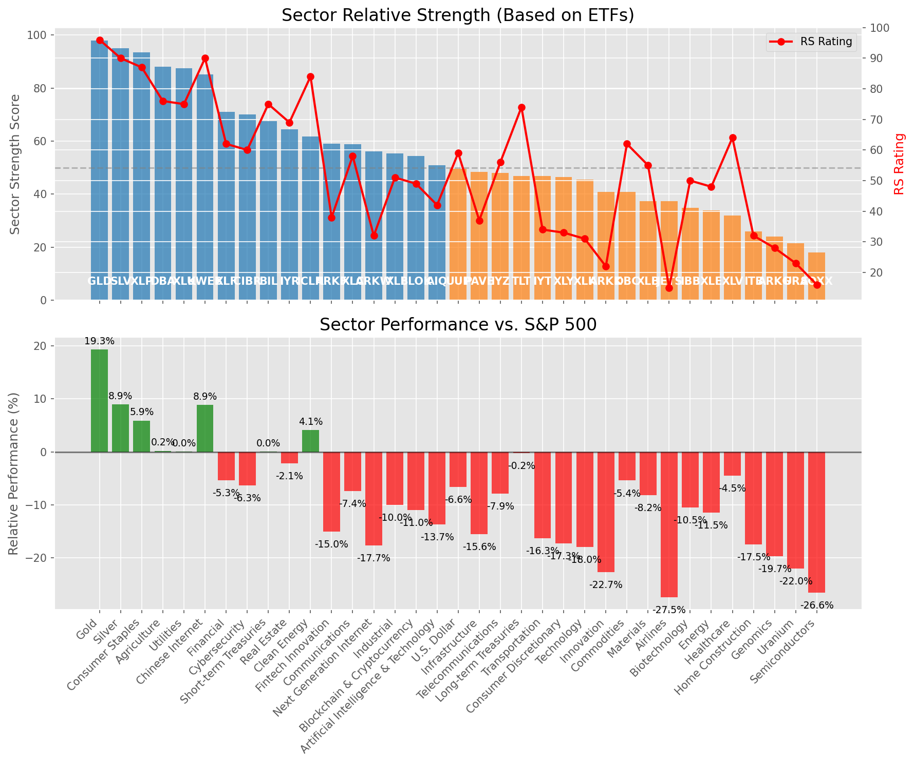

# **Daily Relative Strength Report**

**Date:** 2025-04-23

## **Market Valuation (Buffett Indicator)**

| Metric | Value |
|--------|-------|
| **Market Valuation** | **Undervalued** |
| **Current Ratio** | 8.96 |
| **Historical Mean** | 9.59 |
| **Standard Deviation** | 0.51 |
| **Z-Score (StdDev from Mean)** | -1.72 |
| **Total Market Cap** | $266.40 trillion |
| **GDP** | $29.72 trillion |

## **Market Insights**

### **Market is Undervalued**

The market is trading below historical average valuations, suggesting potential opportunity. These conditions have historically preceded periods of above-average returns. Investors should:

- Look for stocks breaking out of consolidation patterns on increasing volume
- Focus on sectors showing relative strength
- Consider increasing equity exposure, particularly in quality names
- Be mindful of overall market direction and avoid fighting the trend

History suggests patient investors are often rewarded when investing during periods of undervaluation.

### **Buffett Indicator Overview**

The Buffett Indicator (Total Market Cap / GDP) is a measure of the stock market's valuation relative to the size of the economy. It is named after Warren Buffett, who described it as "probably the best single measure of where valuations stand at any given moment."

- **Values above +2 standard deviations:** Market significantly overvalued
- **Values above +1 standard deviation:** Market overvalued
- **Values between -1 and +1 standard deviations:** Market fairly valued
- **Values below -1 standard deviation:** Market undervalued
- **Values below -2 standard deviations:** Market significantly undervalued

---

## **Sector Relative Strength**

Based on William O'Neil's Relative Strength Methodology

| ETF | Strength | RS Rating | Performance | Above Key MAs | Trend | Sector |
|-----|----------|-----------|-------------|--------------|-------|--------|
| [GLD](https://www.tradingview.com/chart/?symbol=GLD) | 98.0 | 96.0 | 18.68% | 10d ✓, 50d ✓, 200d ✓ | ↗️ | Gold |
| [SLV](https://www.tradingview.com/chart/?symbol=SLV) | 94.5 | 89.0 | 7.04% | 10d ✓, 50d ✓, 200d ✓ | ↗️ | Silver |
| [XLP](https://www.tradingview.com/chart/?symbol=XLP) | 94.0 | 88.0 | 6.62% | 10d ✓, 50d ✓, 200d ✓ | ↗️ | Consumer Staples |
| [DBA](https://www.tradingview.com/chart/?symbol=DBA) | 91.0 | 82.0 | 2.43% | 10d ✓, 50d ✓, 200d ✓ | ↗️ | Agriculture |
| [XLU](https://www.tradingview.com/chart/?symbol=XLU) | 88.5 | 77.0 | 0.57% | 10d ✓, 50d ✓, 200d ✓ | ↗️ | Utilities |
| [KWEB](https://www.tradingview.com/chart/?symbol=KWEB) | 86.1 | 92.0 | 10.24% | 10d ✓, 50d ✗, 200d ✓ | ↗️ | Chinese Internet |
| [XLF](https://www.tradingview.com/chart/?symbol=XLF) | 72.6 | 65.0 | -3.95% | 10d ✓, 50d ✗, 200d ✓ | ↗️ | Financial |
| [CIBR](https://www.tradingview.com/chart/?symbol=CIBR) | 71.1 | 62.0 | -5.27% | 10d ✓, 50d ✗, 200d ✓ | ↗️ | Cybersecurity |
| [BIL](https://www.tradingview.com/chart/?symbol=BIL) | 67.0 | 74.0 | 0.01% | 10d ✓, 50d ✓, 200d ✓ | ↘️ | Short-term Treasuries |
| [IYR](https://www.tradingview.com/chart/?symbol=IYR) | 65.9 | 72.0 | -0.78% | 10d ✓, 50d ✗, 200d ✗ | ↗️ | Real Estate |
| [ICLN](https://www.tradingview.com/chart/?symbol=ICLN) | 62.8 | 86.0 | 5.25% | 10d ✓, 50d ✓, 200d ✗ | ↘️ | Clean Energy |
| [XLC](https://www.tradingview.com/chart/?symbol=XLC) | 59.9 | 60.0 | -6.27% | 10d ✓, 50d ✗, 200d ✗ | ↗️ | Communications |
| [XLI](https://www.tradingview.com/chart/?symbol=XLI) | 56.9 | 54.0 | -8.55% | 10d ✓, 50d ✗, 200d ✗ | ↗️ | Industrial |
| [PAVE](https://www.tradingview.com/chart/?symbol=PAVE) | 50.4 | 41.0 | -13.62% | 10d ✓, 50d ✗, 200d ✗ | ↗️ | Infrastructure |
| [IYT](https://www.tradingview.com/chart/?symbol=IYT) | 49.9 | 40.0 | -14.14% | 10d ✓, 50d ✗, 200d ✗ | ↗️ | Transportation |
| [BLOK](https://www.tradingview.com/chart/?symbol=BLOK) | 49.4 | 39.0 | -14.53% | 10d ✓, 50d ✗, 200d ✗ | ↗️ | Blockchain & Cryptocurrency |
| [UUP](https://www.tradingview.com/chart/?symbol=UUP) | 49.0 | 58.0 | -7.01% | 10d ✗, 50d ✗, 200d ✗ | ↗️ | U.S. Dollar |
| [AIQ](https://www.tradingview.com/chart/?symbol=AIQ) | 48.9 | 38.0 | -14.90% | 10d ✓, 50d ✗, 200d ✗ | ↗️ | Artificial Intelligence & Technology |
| [TLT](https://www.tradingview.com/chart/?symbol=TLT) | 48.9 | 78.0 | 0.89% | 10d ✓, 50d ✗, 200d ✗ | ↘️ | Long-term Treasuries |
| [IYZ](https://www.tradingview.com/chart/?symbol=IYZ) | 47.5 | 55.0 | -8.24% | 10d ✗, 50d ✗, 200d ✗ | ↗️ | Telecommunications |
| [XLY](https://www.tradingview.com/chart/?symbol=XLY) | 47.4 | 35.0 | -15.99% | 10d ✓, 50d ✗, 200d ✗ | ↗️ | Consumer Discretionary |
| [XLK](https://www.tradingview.com/chart/?symbol=XLK) | 46.4 | 33.0 | -16.87% | 10d ✓, 50d ✗, 200d ✗ | ↗️ | Technology |
| [ARKW](https://www.tradingview.com/chart/?symbol=ARKW) | 45.4 | 31.0 | -17.72% | 10d ✓, 50d ✗, 200d ✗ | ↗️ | Next Generation Internet |
| [ARKF](https://www.tradingview.com/chart/?symbol=ARKF) | 45.4 | 31.0 | -17.70% | 10d ✓, 50d ✗, 200d ✗ | ↗️ | Fintech Innovation |
| [XLV](https://www.tradingview.com/chart/?symbol=XLV) | 42.9 | 66.0 | -3.50% | 10d ✓, 50d ✗, 200d ✗ | ↘️ | Healthcare |
| [ARKK](https://www.tradingview.com/chart/?symbol=ARKK) | 41.9 | 24.0 | -21.06% | 10d ✓, 50d ✗, 200d ✗ | ↗️ | Innovation |
| [DBC](https://www.tradingview.com/chart/?symbol=DBC) | 40.4 | 61.0 | -5.82% | 10d ✓, 50d ✗, 200d ✗ | ↘️ | Commodities |
| [XLB](https://www.tradingview.com/chart/?symbol=XLB) | 39.4 | 59.0 | -6.68% | 10d ✓, 50d ✗, 200d ✗ | ↘️ | Materials |
| [JETS](https://www.tradingview.com/chart/?symbol=JETS) | 38.4 | 17.0 | -25.42% | 10d ✓, 50d ✗, 200d ✗ | ↗️ | Airlines |
| [IBB](https://www.tradingview.com/chart/?symbol=IBB) | 36.4 | 53.0 | -8.98% | 10d ✓, 50d ✗, 200d ✗ | ↘️ | Biotechnology |
| [XLE](https://www.tradingview.com/chart/?symbol=XLE) | 33.9 | 48.0 | -11.11% | 10d ✓, 50d ✗, 200d ✗ | ↘️ | Energy |
| [ITB](https://www.tradingview.com/chart/?symbol=ITB) | 28.9 | 38.0 | -14.89% | 10d ✓, 50d ✗, 200d ✗ | ↘️ | Home Construction |
| [ARKG](https://www.tradingview.com/chart/?symbol=ARKG) | 26.9 | 34.0 | -16.48% | 10d ✓, 50d ✗, 200d ✗ | ↘️ | Genomics |
| [URA](https://www.tradingview.com/chart/?symbol=URA) | 20.9 | 22.0 | -22.34% | 10d ✓, 50d ✗, 200d ✗ | ↘️ | Uranium |
| [SOXX](https://www.tradingview.com/chart/?symbol=SOXX) | 18.9 | 18.0 | -25.33% | 10d ✓, 50d ✗, 200d ✗ | ↘️ | Semiconductors |

### **Sector ETF Performance Interpretation**

This table shows the relative strength metrics for different market sectors based on their representative ETFs:

- **ETF**: The ETF used to measure sector performance (click for chart)
- **Strength**: Overall sector strength score (0-100) combining multiple factors
- **RS Rating**: O'Neil RS rating of the sector ETF
- **Performance**: Performance of the sector ETF relative to SPY
- **Above Key MAs**: Whether the ETF is trading above its 10, 50, and 200-day moving averages
- **Trend**: Whether the sector is in an uptrend (↗️) or downtrend (↘️)

### **Current Sector Leadership**

The current market leadership is coming from the following sectors: **Gold, Silver, Consumer Staples**.

The **Gold** sector (represented by **GLD**) is showing particularly strong relative strength with an RS rating of 96.0 and performance of 18.68% vs. the S&P 500. This sector is trading above its 10-day, 50-day, 200-day moving average(s). Investors should consider focusing on high RS stocks within these leading sectors for potential outperformance.

---

## **Buy Recommendations**

The following 79 stocks show exceptional relative strength:

| RS Rating | Buy Score | Current Price | Chart | Name | Ticker |
|-----------|-----------|---------------|-------|------|--------|
| 100 | 100 | $147.96 | [Chart](https://www.tradingview.com/chart/?symbol=PLMR) | Palomar Holdings, Inc. Common stock | PLMR |
| 99 | 100 | $16.03 | [Chart](https://www.tradingview.com/chart/?symbol=EZPW) | Ezcorp Inc | EZPW |
| 99 | 100 | $138.76 | [Chart](https://www.tradingview.com/chart/?symbol=UGL) | ProShares Ultra Gold | UGL |
| 99 | 100 | $169.59 | [Chart](https://www.tradingview.com/chart/?symbol=PM) | Philip Morris International Inc. | PM |
| 98 | 100 | $24.95 | [Chart](https://www.tradingview.com/chart/?symbol=DB) | Deutsche Bank Aktiengesellschaft | DB |
| 98 | 100 | $72.22 | [Chart](https://www.tradingview.com/chart/?symbol=KR) | The Kroger Co. | KR |
| 98 | 100 | $20.59 | [Chart](https://www.tradingview.com/chart/?symbol=GRND) | Grindr Inc. | GRND |
| 97 | 100 | $26.91 | [Chart](https://www.tradingview.com/chart/?symbol=T) | AT&T Inc. | T |
| 97 | 100 | $594.34 | [Chart](https://www.tradingview.com/chart/?symbol=SPOT) | Spotify Technology S.A. | SPOT |
| 97 | 100 | $70.49 | [Chart](https://www.tradingview.com/chart/?symbol=WRB) | W.R. Berkley Corporation | WRB |
| 97 | 100 | $32.66 | [Chart](https://www.tradingview.com/chart/?symbol=IAUM) | iShares Gold Trust Micro | IAUM |
| 97 | 100 | $54.27 | [Chart](https://www.tradingview.com/chart/?symbol=PPC) | Pilgrims Pride Corporation | PPC |
| 97 | 100 | $29.47 | [Chart](https://www.tradingview.com/chart/?symbol=EUFN) | iShares MSCI Europe Financials ETF | EUFN |
| 96 | 100 | $31.24 | [Chart](https://www.tradingview.com/chart/?symbol=SGOL) | abrdn Physical Gold Shares ETF | SGOL |
| 96 | 100 | $68.73 | [Chart](https://www.tradingview.com/chart/?symbol=VTR) | Ventas, Inc. | VTR |
| 96 | 100 | $61.76 | [Chart](https://www.tradingview.com/chart/?symbol=IAU) | iShares Gold Trust | IAU |
| 96 | 100 | $64.86 | [Chart](https://www.tradingview.com/chart/?symbol=GLDM) | SPDR Gold MiniShares | GLDM |
| 96 | 100 | $301.96 | [Chart](https://www.tradingview.com/chart/?symbol=GLD) | SPDR Gold Trust, SPDR Gold Shares | GLD |
| 96 | 100 | $248.08 | [Chart](https://www.tradingview.com/chart/?symbol=VRSN) | VeriSign Inc | VRSN |
| 96 | 100 | $32.30 | [Chart](https://www.tradingview.com/chart/?symbol=BAR) | GraniteShares Gold Shares | BAR |
| 96 | 100 | $31.57 | [Chart](https://www.tradingview.com/chart/?symbol=OUNZ) | VanEck Merk Gold ETF | OUNZ |
| 96 | 100 | $32.35 | [Chart](https://www.tradingview.com/chart/?symbol=AAAU) | Goldman Sachs Physical Gold ETF Shares | AAAU |
| 95 | 100 | $39.55 | [Chart](https://www.tradingview.com/chart/?symbol=MRX) | Marex Group plc Ordinary Shares | MRX |
| 95 | 100 | $63.70 | [Chart](https://www.tradingview.com/chart/?symbol=VRNA) | Verona Pharma plc | VRNA |
| 95 | 100 | $29.03 | [Chart](https://www.tradingview.com/chart/?symbol=CEF) | Sprott Physical Gold and Silver Trust | CEF |
| 95 | 100 | $42.28 | [Chart](https://www.tradingview.com/chart/?symbol=BTI) | British American Tobacco p.l.c. American Depositary Shares, American Depositary Shares, each representing one Ordinary Share | BTI |
| 95 | 100 | $58.58 | [Chart](https://www.tradingview.com/chart/?symbol=MO) | Altria Group, Inc. | MO |
| 95 | 100 | $529.87 | [Chart](https://www.tradingview.com/chart/?symbol=BRK.B) | BERKSHIRE HATHAWAY Class B | BRK.B |
| 95 | 100 | $89.25 | [Chart](https://www.tradingview.com/chart/?symbol=CCEP) | Coca-Cola Europacific Partners plc Ordinary Shares | CCEP |
| 95 | 100 | $23.52 | [Chart](https://www.tradingview.com/chart/?symbol=SRAD) | Sportradar Group AG Class A Ordinary Shares | SRAD |
| 95 | 100 | $44.21 | [Chart](https://www.tradingview.com/chart/?symbol=SEZL) | Sezzle Inc. Common Stock | SEZL |
| 94 | 100 | $172.31 | [Chart](https://www.tradingview.com/chart/?symbol=DGX) | Quest Diagnostics Inc. | DGX |
| 94 | 100 | $81.97 | [Chart](https://www.tradingview.com/chart/?symbol=SNEX) | StoneX Group Inc. Common Stock | SNEX |
| 94 | 100 | $213.33 | [Chart](https://www.tradingview.com/chart/?symbol=TTWO) | Take-Two Interactive Software Inc | TTWO |
| 94 | 100 | $161.00 | [Chart](https://www.tradingview.com/chart/?symbol=ATO) | Atmos Energy Corporation | ATO |
| 94 | 100 | $458.89 | [Chart](https://www.tradingview.com/chart/?symbol=CASY) | Casey's General Stores Inc | CASY |
| 94 | 100 | $38.56 | [Chart](https://www.tradingview.com/chart/?symbol=EWG) | iShares MSCI Germany ETF | EWG |
| 94 | 100 | $334.66 | [Chart](https://www.tradingview.com/chart/?symbol=AJG) | Arthur J. Gallagher & Co. | AJG |
| 94 | 100 | $117.07 | [Chart](https://www.tradingview.com/chart/?symbol=COOP) | Mr. Cooper Group Inc. Common Stock | COOP |
| 93 | 100 | $78.20 | [Chart](https://www.tradingview.com/chart/?symbol=NFG) | National Fuel Gas Co. | NFG |
| 93 | 100 | $1393.54 | [Chart](https://www.tradingview.com/chart/?symbol=ORLY) | O'Reilly Automotive, Inc. | ORLY |
| 93 | 100 | $118.39 | [Chart](https://www.tradingview.com/chart/?symbol=BRO) | Brown & Brown, Inc. | BRO |
| 93 | 100 | $36.50 | [Chart](https://www.tradingview.com/chart/?symbol=PPL) | PPL Corporation | PPL |
| 92 | 100 | $1054.02 | [Chart](https://www.tradingview.com/chart/?symbol=NFLX) | NetFlix Inc | NFLX |
| 92 | 100 | $73.28 | [Chart](https://www.tradingview.com/chart/?symbol=CMS) | CMS Energy Corporation | CMS |
| 91 | 100 | $78.20 | [Chart](https://www.tradingview.com/chart/?symbol=ADC) | Agree Realty Corporation | ADC |
| 91 | 100 | $32.99 | [Chart](https://www.tradingview.com/chart/?symbol=UGI) | UGI Corporation | UGI |
| 91 | 100 | $15.76 | [Chart](https://www.tradingview.com/chart/?symbol=BCS) | Barclays PLC | BCS |
| 91 | 100 | $135.80 | [Chart](https://www.tradingview.com/chart/?symbol=DTE) | DTE Energy Company | DTE |
| 91 | 100 | $31.05 | [Chart](https://www.tradingview.com/chart/?symbol=LTH) | Life Time Group Holdings, Inc. | LTH |
| 90 | 100 | $95.01 | [Chart](https://www.tradingview.com/chart/?symbol=PNW) | Pinnacle West Capital Corporation | PNW |
| 90 | 100 | $68.34 | [Chart](https://www.tradingview.com/chart/?symbol=EVRG) | Evergy, Inc. | EVRG |
| 90 | 100 | $30.17 | [Chart](https://www.tradingview.com/chart/?symbol=AHR) | American Healthcare REIT, Inc. | AHR |
| 90 | 100 | $18.39 | [Chart](https://www.tradingview.com/chart/?symbol=KT) | KT Corp. | KT |
| 90 | 100 | $40.60 | [Chart](https://www.tradingview.com/chart/?symbol=VIRT) | Virtu Financial, Inc. Class A | VIRT |
| 89 | 100 | $23.77 | [Chart](https://www.tradingview.com/chart/?symbol=EWS) | iShares MSCI Singapore ETF | EWS |
| 89 | 100 | $77.88 | [Chart](https://www.tradingview.com/chart/?symbol=SR) | Spire Inc. | SR |
| 89 | 100 | $16.39 | [Chart](https://www.tradingview.com/chart/?symbol=SPNT) | SiriusPoint Ltd. | SPNT |
| 88 | 100 | $45.35 | [Chart](https://www.tradingview.com/chart/?symbol=OGE) | OGE Energy Corp. | OGE |
| 88 | 100 | $162.96 | [Chart](https://www.tradingview.com/chart/?symbol=EAT) | Brinker International, Inc. | EAT |
| 87 | 100 | $99.03 | [Chart](https://www.tradingview.com/chart/?symbol=AEE) | Ameren Corporation | AEE |
| 85 | 100 | $39.55 | [Chart](https://www.tradingview.com/chart/?symbol=NI) | NiSource Inc. | NI |
| 89 | 99 | $44.11 | [Chart](https://www.tradingview.com/chart/?symbol=NWN) | Northwest Natural Holding Company | NWN |
| 88 | 99 | $52.51 | [Chart](https://www.tradingview.com/chart/?symbol=RELX) | RELX PLC | RELX |
| 86 | 99 | $79.61 | [Chart](https://www.tradingview.com/chart/?symbol=UNM) | Unum Group | UNM |
| 85 | 99 | $134.86 | [Chart](https://www.tradingview.com/chart/?symbol=CAH) | Cardinal Health, Inc. | CAH |
| 88 | 98 | $124.02 | [Chart](https://www.tradingview.com/chart/?symbol=BECN) | Beacon Roofing Supply, Inc. | BECN |
| 88 | 98 | $33.78 | [Chart](https://www.tradingview.com/chart/?symbol=FDP) | Fresh Del Monte Produce Inc. | FDP |
| 87 | 98 | $262.09 | [Chart](https://www.tradingview.com/chart/?symbol=TRV) | The Travelers Companies, Inc. | TRV |
| 85 | 98 | $220.00 | [Chart](https://www.tradingview.com/chart/?symbol=FI) | Fiserv, Inc. | FI |
| 84 | 96 | $66.75 | [Chart](https://www.tradingview.com/chart/?symbol=EBAY) | eBay Inc | EBAY |
| 84 | 95 | $981.06 | [Chart](https://www.tradingview.com/chart/?symbol=COST) | Costco Wholesale Corp | COST |
| 84 | 95 | $55.51 | [Chart](https://www.tradingview.com/chart/?symbol=ULS) | UL Solutions Inc. | ULS |
| 82 | 95 | $95.92 | [Chart](https://www.tradingview.com/chart/?symbol=WMT) | Walmart Inc. | WMT |
| 81 | 95 | $84.39 | [Chart](https://www.tradingview.com/chart/?symbol=ETR) | Entergy Corporation | ETR |
| 81 | 93 | $539.44 | [Chart](https://www.tradingview.com/chart/?symbol=MA) | Mastercard Incorporated | MA |
| 82 | 92 | $49.90 | [Chart](https://www.tradingview.com/chart/?symbol=VTIP) | Vanguard Short-Term Inflation-Protected Securities Index Fund | VTIP |
| 81 | 91 | $113.71 | [Chart](https://www.tradingview.com/chart/?symbol=OLLI) | Ollie's Bargain Outlet Holdings, Inc. Common Stock | OLLI |
| 80 | 90 | $12.07 | [Chart](https://www.tradingview.com/chart/?symbol=AGS) | PlayAGS, Inc. | AGS |

---

## **Sell Recommendations**

The following 165 stocks show deteriorating relative strength:

| RS Rating | Sell Score | Current Price | Chart | Name | Ticker |
|-----------|------------|---------------|-------|------|--------|
| 1 | 100 | $14.99 | [Chart](https://www.tradingview.com/chart/?symbol=RXST) | RxSight, Inc. Common Stock | RXST |
| 2 | 100 | $26.89 | [Chart](https://www.tradingview.com/chart/?symbol=AZTA) | Azenta, Inc. | AZTA |
| 2 | 100 | $17.17 | [Chart](https://www.tradingview.com/chart/?symbol=TNDM) | Tandem Diabetes Care, Inc. | TNDM |
| 2 | 100 | $16.33 | [Chart](https://www.tradingview.com/chart/?symbol=SSTK) | SHUTTERSTOCK, INC. | SSTK |
| 2 | 100 | $76.38 | [Chart](https://www.tradingview.com/chart/?symbol=FRPT) | Freshpet, Inc. | FRPT |
| 2 | 100 | $10.03 | [Chart](https://www.tradingview.com/chart/?symbol=FLYW) | Flywire Corporation Voting Common Stock | FLYW |
| 3 | 100 | $111.86 | [Chart](https://www.tradingview.com/chart/?symbol=GLOB) | GLOBANT S.A. | GLOB |
| 3 | 100 | $78.08 | [Chart](https://www.tradingview.com/chart/?symbol=ILMN) | Illumina Inc | ILMN |
| 4 | 100 | $50.38 | [Chart](https://www.tradingview.com/chart/?symbol=SYNA) | Synaptics Inc | SYNA |
| 4 | 100 | $19.31 | [Chart](https://www.tradingview.com/chart/?symbol=SPT) | Sprout Social, Inc Class A Common Stock | SPT |
| 4 | 100 | $17.62 | [Chart](https://www.tradingview.com/chart/?symbol=ICHR) | Ichor Holdings | ICHR |
| 4 | 100 | $18.32 | [Chart](https://www.tradingview.com/chart/?symbol=DAVA) | Endava plc American Depositary Shares (each representing one Class A Ordinary Share) | DAVA |
| 5 | 100 | $107.78 | [Chart](https://www.tradingview.com/chart/?symbol=ARM) | Arm Holdings plc American Depositary Shares | ARM |
| 5 | 100 | $12.37 | [Chart](https://www.tradingview.com/chart/?symbol=IMXI) | International Money Express, Inc. | IMXI |
| 5 | 100 | $14.44 | [Chart](https://www.tradingview.com/chart/?symbol=MEG) | Montrose Environmental Group, Inc. | MEG |
| 5 | 100 | $23.77 | [Chart](https://www.tradingview.com/chart/?symbol=FIVN) | FIVE9, INC. | FIVN |
| 5 | 100 | $18.23 | [Chart](https://www.tradingview.com/chart/?symbol=APLS) | Apellis Pharmaceuticals, Inc. Common Stock | APLS |
| 5 | 100 | $31.49 | [Chart](https://www.tradingview.com/chart/?symbol=SCSC) | Scansource Inc | SCSC |
| 5 | 100 | $55.47 | [Chart](https://www.tradingview.com/chart/?symbol=LABU) | Direxion Daily S&P Biotech Bull 3X Shares | LABU |
| 6 | 100 | $15.67 | [Chart](https://www.tradingview.com/chart/?symbol=IART) | Integra LifeSciences Holdings | IART |
| 6 | 100 | $29.88 | [Chart](https://www.tradingview.com/chart/?symbol=W) | Wayfair Inc. | W |
| 6 | 100 | $34.59 | [Chart](https://www.tradingview.com/chart/?symbol=TDW) | Tidewater, Inc. | TDW |
| 6 | 100 | $65.17 | [Chart](https://www.tradingview.com/chart/?symbol=CAMT) | Camtek Ltd | CAMT |
| 6 | 100 | $17.16 | [Chart](https://www.tradingview.com/chart/?symbol=PDFS) | PDF Solutions Inc | PDFS |
| 6 | 100 | $21.77 | [Chart](https://www.tradingview.com/chart/?symbol=NSSC) | Napco Security Technologies, Inc | NSSC |
| 6 | 100 | $24.12 | [Chart](https://www.tradingview.com/chart/?symbol=WSC) | WillScot Holdings Corporation Class A Common Stock | WSC |
| 6 | 100 | $24.53 | [Chart](https://www.tradingview.com/chart/?symbol=RPD) | Rapid7, Inc. Common Stock | RPD |
| 6 | 100 | $61.38 | [Chart](https://www.tradingview.com/chart/?symbol=ARCB) | ArcBest Corporation | ARCB |
| 7 | 100 | $13.54 | [Chart](https://www.tradingview.com/chart/?symbol=GCT) | GigaCloud Technology Inc Class A Ordinary Shares | GCT |
| 7 | 100 | $26.43 | [Chart](https://www.tradingview.com/chart/?symbol=SPHR) | Sphere Entertainment Co. | SPHR |
| 8 | 100 | $17.81 | [Chart](https://www.tradingview.com/chart/?symbol=VECO) | Veeco Instruments Inc | VECO |
| 8 | 100 | $21.50 | [Chart](https://www.tradingview.com/chart/?symbol=SYM) | Symbotic Inc. Class A Common Stock | SYM |
| 8 | 100 | $12.98 | [Chart](https://www.tradingview.com/chart/?symbol=DV) | DoubleVerify Holdings, Inc. | DV |
| 8 | 100 | $20.96 | [Chart](https://www.tradingview.com/chart/?symbol=TDC) | TERADATA CORPORATION | TDC |
| 8 | 100 | $26.00 | [Chart](https://www.tradingview.com/chart/?symbol=XPEL) | XPEL, Inc. Common Stock | XPEL |
| 10 | 100 | $10.92 | [Chart](https://www.tradingview.com/chart/?symbol=AEYE) | AudioEye, Inc. Common Stock | AEYE |
| 10 | 100 | $13.03 | [Chart](https://www.tradingview.com/chart/?symbol=DK) | Delek US Holdings, Inc. | DK |
| 11 | 100 | $20.33 | [Chart](https://www.tradingview.com/chart/?symbol=FOXF) | Fox Factory Holding Corp. Common Stock | FOXF |
| 13 | 100 | $13.66 | [Chart](https://www.tradingview.com/chart/?symbol=XRAY) | DENTSPLY SIRONA Inc. | XRAY |
| 14 | 100 | $32.25 | [Chart](https://www.tradingview.com/chart/?symbol=URNM) | Sprott Uranium Miners ETF | URNM |
| 14 | 100 | $34.45 | [Chart](https://www.tradingview.com/chart/?symbol=STNG) | Scorpio Tankers Inc. | STNG |
| 15 | 100 | $20.87 | [Chart](https://www.tradingview.com/chart/?symbol=ST) | Sensata Technologies Holding plc | ST |
| 15 | 100 | $28.55 | [Chart](https://www.tradingview.com/chart/?symbol=SRDX) | Surmodics, Inc. Common Stock | SRDX |
| 13 | 99 | $12.21 | [Chart](https://www.tradingview.com/chart/?symbol=ZVZZT) | SUPER Montage TEST SYMBOL | ZVZZT |
| 2 | 98 | $110.04 | [Chart](https://www.tradingview.com/chart/?symbol=DECK) | Deckers Outdoor Corp | DECK |
| 4 | 98 | $43.06 | [Chart](https://www.tradingview.com/chart/?symbol=PSTG) | Pure Storage, Inc. Class A | PSTG |
| 7 | 98 | $18.42 | [Chart](https://www.tradingview.com/chart/?symbol=SG) | Sweetgreen, Inc. | SG |
| 7 | 98 | $54.80 | [Chart](https://www.tradingview.com/chart/?symbol=VAC) | MARRIOTT VACATIONS WORLDWIDE CORPORATION | VAC |
| 12 | 98 | $21.01 | [Chart](https://www.tradingview.com/chart/?symbol=UCO) | ProShares Ultra Bloomberg Crude Oil | UCO |
| 14 | 98 | $10.77 | [Chart](https://www.tradingview.com/chart/?symbol=SONO) | Sonos, Inc. Common Stock | SONO |
| 16 | 98 | $11.78 | [Chart](https://www.tradingview.com/chart/?symbol=BAND) | Bandwidth Inc. Class A Common Stock | BAND |
| 5 | 97 | $18.77 | [Chart](https://www.tradingview.com/chart/?symbol=CECO) | Ceco Environmental Corp | CECO |
| 8 | 97 | $12.29 | [Chart](https://www.tradingview.com/chart/?symbol=ZETA) | Zeta Global Holdings Corp. | ZETA |
| 11 | 97 | $86.16 | [Chart](https://www.tradingview.com/chart/?symbol=NTAP) | NetApp, Inc | NTAP |
| 12 | 97 | $23.97 | [Chart](https://www.tradingview.com/chart/?symbol=RNG) | RINGCENTRAL, INC. | RNG |
| 13 | 97 | $53.59 | [Chart](https://www.tradingview.com/chart/?symbol=NVT) | nVent Electric plc Ordinary Shares | NVT |
| 14 | 97 | $93.03 | [Chart](https://www.tradingview.com/chart/?symbol=BCC) | Boise Cascade Company | BCC |
| 15 | 97 | $46.24 | [Chart](https://www.tradingview.com/chart/?symbol=POWI) | Power Integrations Inc | POWI |
| 16 | 97 | $121.92 | [Chart](https://www.tradingview.com/chart/?symbol=BLDR) | Builders FirstSource, Inc. | BLDR |
| 19 | 97 | $12.30 | [Chart](https://www.tradingview.com/chart/?symbol=OSCR) | Oscar Health, Inc. | OSCR |
| 8 | 96 | $22.67 | [Chart](https://www.tradingview.com/chart/?symbol=THS) | Treehouse Foods, Inc. | THS |
| 8 | 96 | $34.99 | [Chart](https://www.tradingview.com/chart/?symbol=CRC) | California Resources Corporation | CRC |
| 15 | 96 | $19.41 | [Chart](https://www.tradingview.com/chart/?symbol=AMN) | AMN Healthcare Services | AMN |
| 16 | 96 | $30.01 | [Chart](https://www.tradingview.com/chart/?symbol=JANX) | Janux Therapeutics, Inc. Common Stock | JANX |
| 24 | 96 | $14.17 | [Chart](https://www.tradingview.com/chart/?symbol=FXN) | First Trust Energy AlphaDEX Fund | FXN |
| 10 | 95 | $22.56 | [Chart](https://www.tradingview.com/chart/?symbol=VERA) | Vera Therapeutics, Inc. Class A Common Stock | VERA |
| 10 | 95 | $19.06 | [Chart](https://www.tradingview.com/chart/?symbol=BZH) | Beazer Homes USA, Inc. New | BZH |
| 26 | 95 | $15.70 | [Chart](https://www.tradingview.com/chart/?symbol=TRMD) | TORM plc Class A Common Stock | TRMD |
| 18 | 94 | $64.02 | [Chart](https://www.tradingview.com/chart/?symbol=SPB) | Spectrum Brands Holdings, Inc. | SPB |
| 18 | 94 | $17.17 | [Chart](https://www.tradingview.com/chart/?symbol=STAA) | Staar Surgical Co | STAA |
| 9 | 93 | $15.33 | [Chart](https://www.tradingview.com/chart/?symbol=DNLI) | Denali Therapeutics Inc. Common Stock | DNLI |
| 11 | 93 | $10.01 | [Chart](https://www.tradingview.com/chart/?symbol=VYX) | NCR Voyix Corporation | VYX |
| 14 | 93 | $20.89 | [Chart](https://www.tradingview.com/chart/?symbol=DIN) | Dine Brands Global, Inc. | DIN |
| 18 | 93 | $12.57 | [Chart](https://www.tradingview.com/chart/?symbol=ADNT) | Adient plc Ordinary Shares | ADNT |
| 18 | 93 | $33.95 | [Chart](https://www.tradingview.com/chart/?symbol=OVV) | Ovintiv Inc. | OVV |
| 22 | 93 | $12.26 | [Chart](https://www.tradingview.com/chart/?symbol=MED) | Medifast, Inc. | MED |
| 8 | 92 | $331.28 | [Chart](https://www.tradingview.com/chart/?symbol=SAIA) | Saia, Inc. | SAIA |
| 14 | 92 | $14.78 | [Chart](https://www.tradingview.com/chart/?symbol=PBW) | Invesco WilderHill Clean Energy ETF | PBW |
| 14 | 92 | $35.46 | [Chart](https://www.tradingview.com/chart/?symbol=LIVN) | LivaNova PLC Ordinary Shares | LIVN |
| 14 | 92 | $10.31 | [Chart](https://www.tradingview.com/chart/?symbol=VREX) | Varex Imaging Corporation Common Stock | VREX |
| 20 | 92 | $11.34 | [Chart](https://www.tradingview.com/chart/?symbol=HPK) | HighPeak Energy, Inc. Common Stock | HPK |
| 22 | 92 | $10.15 | [Chart](https://www.tradingview.com/chart/?symbol=CSIQ) | Canadian Solar Inc. Common Shares (ON) | CSIQ |
| 14 | 91 | $191.30 | [Chart](https://www.tradingview.com/chart/?symbol=FN) | Fabrinet | FN |
| 17 | 91 | $41.56 | [Chart](https://www.tradingview.com/chart/?symbol=CCJ) | Cameco Corporation | CCJ |
| 23 | 91 | $29.63 | [Chart](https://www.tradingview.com/chart/?symbol=YETI) | YETI Holdings, Inc. Common Stock | YETI |
| 28 | 91 | $12.72 | [Chart](https://www.tradingview.com/chart/?symbol=TRIP) | TripAdvisor, Inc. | TRIP |
| 11 | 90 | $30.87 | [Chart](https://www.tradingview.com/chart/?symbol=UWM) | ProShares Ultra Russell2000 | UWM |
| 18 | 90 | $29.37 | [Chart](https://www.tradingview.com/chart/?symbol=CDRE) | Cadre Holdings, Inc. | CDRE |
| 19 | 90 | $94.29 | [Chart](https://www.tradingview.com/chart/?symbol=CHRD) | Chord Energy Corporation Common Stock | CHRD |
| 19 | 90 | $48.00 | [Chart](https://www.tradingview.com/chart/?symbol=ERX) | Direxion Daily Energy Bull 2X Shares | ERX |
| 12 | 89 | $14.53 | [Chart](https://www.tradingview.com/chart/?symbol=DXC) | DXC Technology Company | DXC |
| 14 | 89 | $113.77 | [Chart](https://www.tradingview.com/chart/?symbol=GNRC) | GENERAC HOLDINGS INC | GNRC |
| 17 | 89 | $16.72 | [Chart](https://www.tradingview.com/chart/?symbol=CTRI) | Centuri Holdings, Inc. | CTRI |
| 18 | 89 | $92.95 | [Chart](https://www.tradingview.com/chart/?symbol=AMD) | Advanced Micro Devices | AMD |
| 26 | 89 | $76.12 | [Chart](https://www.tradingview.com/chart/?symbol=AKAM) | Akamai Technologies Inc | AKAM |
| 22 | 88 | $12.42 | [Chart](https://www.tradingview.com/chart/?symbol=KRP) | Kimbell Royalty Partners, LP Common Units representing Limited Partner Interests | KRP |
| 22 | 88 | $11.30 | [Chart](https://www.tradingview.com/chart/?symbol=KELYA) | Kelly Services Inc | KELYA |
| 23 | 88 | $10.03 | [Chart](https://www.tradingview.com/chart/?symbol=MTAL) | MAC Copper Limited | MTAL |
| 23 | 88 | $27.57 | [Chart](https://www.tradingview.com/chart/?symbol=SEE) | Sealed Air Corp. | SEE |
| 18 | 87 | $52.35 | [Chart](https://www.tradingview.com/chart/?symbol=IIPR) | Innovative Industrial Properties, Inc. Common stock | IIPR |
| 19 | 87 | $135.71 | [Chart](https://www.tradingview.com/chart/?symbol=MTN) | Vail Resorts, Inc. | MTN |
| 20 | 87 | $40.07 | [Chart](https://www.tradingview.com/chart/?symbol=TWST) | Twist Bioscience Corporation Common Stock | TWST |
| 23 | 86 | $59.15 | [Chart](https://www.tradingview.com/chart/?symbol=HAE) | Haemonetics Corporation | HAE |
| 16 | 85 | $10.43 | [Chart](https://www.tradingview.com/chart/?symbol=SEMR) | SEMrush Holdings, Inc. | SEMR |
| 20 | 85 | $16.47 | [Chart](https://www.tradingview.com/chart/?symbol=SVOL) | Simplify Volatility Premium ETF | SVOL |
| 25 | 85 | $33.55 | [Chart](https://www.tradingview.com/chart/?symbol=IAC) | IAC Inc. Common Stock | IAC |
| 26 | 85 | $12.19 | [Chart](https://www.tradingview.com/chart/?symbol=OEC) | Orion S.A. | OEC |
| 28 | 85 | $26.89 | [Chart](https://www.tradingview.com/chart/?symbol=COLL) | Collegium Pharmaceutical, Inc. Common Stock | COLL |
| 31 | 85 | $288.25 | [Chart](https://www.tradingview.com/chart/?symbol=BLD) | TopBuild Corp. Common Stock | BLD |
| 17 | 84 | $32.11 | [Chart](https://www.tradingview.com/chart/?symbol=AVNT) | Avient Corporation | AVNT |
| 19 | 84 | $10.15 | [Chart](https://www.tradingview.com/chart/?symbol=HLIT) | Harmonic Inc | HLIT |
| 23 | 84 | $35.62 | [Chart](https://www.tradingview.com/chart/?symbol=CALF) | Pacer US Small Cap Cash Cows ETF | CALF |
| 23 | 84 | $12.80 | [Chart](https://www.tradingview.com/chart/?symbol=WDS) | Woodside Energy Group Limited American Depositary Shares, each representing one Ordinary Share | WDS |
| 26 | 84 | $11.45 | [Chart](https://www.tradingview.com/chart/?symbol=NAVI) | Navient Corporation | NAVI |
| 33 | 84 | $10.16 | [Chart](https://www.tradingview.com/chart/?symbol=MAX) | MediaAlpha, Inc. | MAX |
| 17 | 83 | $101.59 | [Chart](https://www.tradingview.com/chart/?symbol=TOL) | Toll Brothers, Inc. | TOL |
| 27 | 83 | $75.84 | [Chart](https://www.tradingview.com/chart/?symbol=IR) | Ingersoll Rand Inc. Common Stock | IR |
| 32 | 83 | $20.76 | [Chart](https://www.tradingview.com/chart/?symbol=KIDS) | OrthoPediatrics Corp. Common Stock | KIDS |
| 24 | 82 | $10.89 | [Chart](https://www.tradingview.com/chart/?symbol=MRC) | MRC GLOBAL INC. | MRC |
| 27 | 82 | $31.27 | [Chart](https://www.tradingview.com/chart/?symbol=CRNX) | Crinetics Pharmaceuticals, Inc. | CRNX |
| 21 | 81 | $19.02 | [Chart](https://www.tradingview.com/chart/?symbol=KMT) | Kennametal Inc. | KMT |
| 22 | 81 | $23.57 | [Chart](https://www.tradingview.com/chart/?symbol=URA) | Global X Uranium ETF | URA |
| 26 | 81 | $58.08 | [Chart](https://www.tradingview.com/chart/?symbol=TREX) | Trex Company, Inc. | TREX |
| 27 | 81 | $20.84 | [Chart](https://www.tradingview.com/chart/?symbol=MGY) | Magnolia Oil & Gas Corporation Class A Common Stock | MGY |
| 27 | 81 | $34.15 | [Chart](https://www.tradingview.com/chart/?symbol=GFS) | GlobalFoundries Inc. Ordinary Shares | GFS |
| 33 | 81 | $10.34 | [Chart](https://www.tradingview.com/chart/?symbol=CMRE) | Costamare Inc. | CMRE |
| 21 | 80 | $14.23 | [Chart](https://www.tradingview.com/chart/?symbol=PSFE) | Paysafe Limited | PSFE |
| 25 | 80 | $27.92 | [Chart](https://www.tradingview.com/chart/?symbol=MBUU) | Malibu Boats, Inc. Class A | MBUU |
| 27 | 79 | $162.40 | [Chart](https://www.tradingview.com/chart/?symbol=IBP) | INSTALLED BUILDING PRODUCTS, INC. | IBP |
| 38 | 79 | $20.39 | [Chart](https://www.tradingview.com/chart/?symbol=LPG) | DORIAN LPG LTD | LPG |
| 31 | 78 | $26.36 | [Chart](https://www.tradingview.com/chart/?symbol=GDEN) | Golden Entertainment, Inc. Common Stock | GDEN |
| 34 | 78 | $118.39 | [Chart](https://www.tradingview.com/chart/?symbol=J) | Jacobs Solutions Inc. | J |
| 35 | 78 | $30.52 | [Chart](https://www.tradingview.com/chart/?symbol=MSGE) | Madison Square Garden Entertainment Corp. | MSGE |
| 27 | 77 | $17.21 | [Chart](https://www.tradingview.com/chart/?symbol=PRAA) | PRA Group, Inc. | PRAA |
| 33 | 77 | $45.56 | [Chart](https://www.tradingview.com/chart/?symbol=EXAS) | Exact Sciences Corp | EXAS |
| 37 | 77 | $24.02 | [Chart](https://www.tradingview.com/chart/?symbol=HOG) | Harley-Davidson, Inc. | HOG |
| 26 | 76 | $215.49 | [Chart](https://www.tradingview.com/chart/?symbol=FDX) | FedEx Corporation | FDX |
| 30 | 76 | $15.88 | [Chart](https://www.tradingview.com/chart/?symbol=SEM) | SELECT MEDICAL HOLDINGS CORP | SEM |
| 30 | 76 | $17.97 | [Chart](https://www.tradingview.com/chart/?symbol=ELVN) | Enliven Therapeutics, Inc. Common Stock | ELVN |
| 34 | 75 | $80.85 | [Chart](https://www.tradingview.com/chart/?symbol=LEA) | Lear Corporation | LEA |
| 29 | 74 | $50.57 | [Chart](https://www.tradingview.com/chart/?symbol=ALRM) | Alarm.com Holdings, Inc. | ALRM |
| 32 | 74 | $35.53 | [Chart](https://www.tradingview.com/chart/?symbol=TECK) | Teck Resources Limited | TECK |
| 35 | 74 | $11.17 | [Chart](https://www.tradingview.com/chart/?symbol=SHC) | Sotera Health Company Common Stock | SHC |
| 27 | 73 | $11.66 | [Chart](https://www.tradingview.com/chart/?symbol=CIM) | Chimera Investment Corp. | CIM |
| 28 | 73 | $12.31 | [Chart](https://www.tradingview.com/chart/?symbol=APLE) | Apple Hospitality REIT, Inc. | APLE |
| 29 | 73 | $16.10 | [Chart](https://www.tradingview.com/chart/?symbol=MLNK) | MeridianLink, Inc. | MLNK |
| 30 | 73 | $10.71 | [Chart](https://www.tradingview.com/chart/?symbol=DBRG) | DigitalBridge Group, Inc. | DBRG |
| 30 | 73 | $55.38 | [Chart](https://www.tradingview.com/chart/?symbol=KBH) | KB Home | KBH |
| 32 | 73 | $14.29 | [Chart](https://www.tradingview.com/chart/?symbol=HST) | Host Hotels & Resorts, Inc. | HST |
| 33 | 73 | $186.83 | [Chart](https://www.tradingview.com/chart/?symbol=RGA) | Reinsurance Group of America, Incorporated | RGA |
| 36 | 73 | $11.57 | [Chart](https://www.tradingview.com/chart/?symbol=LYFT) | Lyft, Inc. Class A Common Stock | LYFT |
| 38 | 73 | $14.06 | [Chart](https://www.tradingview.com/chart/?symbol=ZIM) | ZIM Integrated Shipping Services Ltd. | ZIM |
| 39 | 73 | $119.50 | [Chart](https://www.tradingview.com/chart/?symbol=QLYS) | Qualys, Inc. Common Stock | QLYS |
| 29 | 72 | $27.97 | [Chart](https://www.tradingview.com/chart/?symbol=BOTZ) | Global X Funds Global X Robotics & Artificial Intelligence ETF | BOTZ |
| 30 | 72 | $57.28 | [Chart](https://www.tradingview.com/chart/?symbol=VOYA) | VOYA FINANCIAL, INC. | VOYA |
| 31 | 72 | $126.63 | [Chart](https://www.tradingview.com/chart/?symbol=SPXC) | SPX Technologies, Inc. | SPXC |
| 38 | 72 | $45.01 | [Chart](https://www.tradingview.com/chart/?symbol=PRKS) | United Parks & Resorts Inc. | PRKS |
| 35 | 71 | $26.59 | [Chart](https://www.tradingview.com/chart/?symbol=PINS) | Pinterest, Inc. Class A Common Stock | PINS |
| 38 | 71 | $30.18 | [Chart](https://www.tradingview.com/chart/?symbol=DINO) | HF Sinclair Corporation | DINO |
| 35 | 70 | $28.00 | [Chart](https://www.tradingview.com/chart/?symbol=AGIO) | Agios Pharmaceuticals, Inc. | AGIO |
| 32 | 68 | $90.69 | [Chart](https://www.tradingview.com/chart/?symbol=PCAR) | Paccar Inc | PCAR |
| 34 | 68 | $71.00 | [Chart](https://www.tradingview.com/chart/?symbol=IXN) | iShares Global Tech ETF | IXN |
| 39 | 68 | $17.79 | [Chart](https://www.tradingview.com/chart/?symbol=HTGC) | Hercules Capital, Inc. | HTGC |
| 38 | 66 | $27.37 | [Chart](https://www.tradingview.com/chart/?symbol=BNO) | United States Brent Oil Fund, LP | BNO |
| 39 | 65 | $95.23 | [Chart](https://www.tradingview.com/chart/?symbol=XHB) | SPDR S&P Homebuilders ETF | XHB |

## **Methodology**

This report uses William O'Neil's relative strength methodology from Investors Business Daily:

* **RS Rating**: Percentile rank of stock's performance vs. S&P 500 over the past 63 trading days (1-99 scale)
* **Buy Criteria**: RS Rating >= 80, price above 50-day MA, strong uptrend, increasing volume
* **Sell Criteria**: RS Rating < 40, price below 50-day MA, downtrend, decreasing volume

### **O'Neil's Key Principles**

1. **Focus on relative performance** - stocks outperforming the market
2. **Price trend confirmation** - stock must be in an uptrend
3. **Volume confirmation** - strong volume supports price moves
4. **Moving average validation** - price above key moving averages
5. **Market leaders only** - concentrate on top-performing stocks

*Report generated automatically after market close*