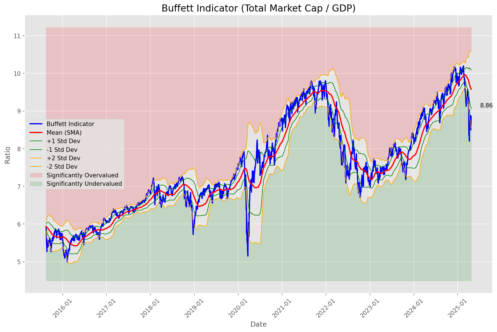
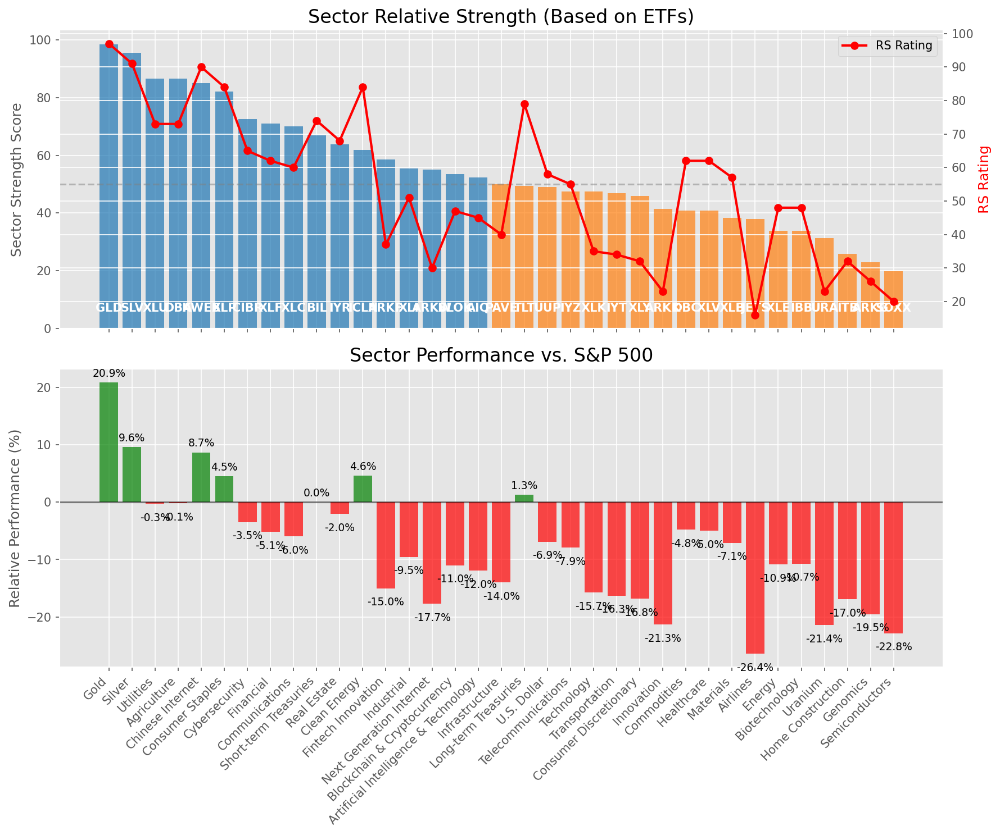

# **Daily Relative Strength Report**

**Date:** 2025-04-24

## **Market Valuation (Buffett Indicator)**

| Metric | Value |
|--------|-------|
| **Market Valuation** | **Undervalued** |
| **Current Ratio** | 9.03 |
| **Historical Mean** | 9.58 |
| **Standard Deviation** | 0.51 |
| **Z-Score (StdDev from Mean)** | -1.39 |
| **Total Market Cap** | $268.39 trillion |
| **GDP** | $29.72 trillion |

## **Market Insights**

### **Market is Undervalued**

The market is trading below historical average valuations, suggesting potential opportunity. These conditions have historically preceded periods of above-average returns. Investors should:

- Look for stocks breaking out of consolidation patterns on increasing volume
- Focus on sectors showing relative strength
- Consider increasing equity exposure, particularly in quality names
- Be mindful of overall market direction and avoid fighting the trend

History suggests patient investors are often rewarded when investing during periods of undervaluation.

### **Buffett Indicator Overview**

The Buffett Indicator (Total Market Cap / GDP) is a measure of the stock market's valuation relative to the size of the economy. It is named after Warren Buffett, who described it as "probably the best single measure of where valuations stand at any given moment."

- **Values above +2 standard deviations:** Market significantly overvalued
- **Values above +1 standard deviation:** Market overvalued
- **Values between -1 and +1 standard deviations:** Market fairly valued
- **Values below -1 standard deviation:** Market undervalued
- **Values below -2 standard deviations:** Market significantly undervalued

---

## **Sector Relative Strength**

Based on William O'Neil's Relative Strength Methodology

| ETF | Strength | RS Rating | Performance | Above Key MAs | Trend | Sector |
|-----|----------|-----------|-------------|--------------|-------|--------|
| [GLD](https://www.tradingview.com/chart/?symbol=GLD) | 98.5 | 97.0 | 21.02% | 10d ✓, 50d ✓, 200d ✓ | ↗️ | Gold |
| [SLV](https://www.tradingview.com/chart/?symbol=SLV) | 95.5 | 91.0 | 9.74% | 10d ✓, 50d ✓, 200d ✓ | ↗️ | Silver |
| [DBA](https://www.tradingview.com/chart/?symbol=DBA) | 87.0 | 74.0 | 0.28% | 10d ✓, 50d ✓, 200d ✓ | ↗️ | Agriculture |
| [XLU](https://www.tradingview.com/chart/?symbol=XLU) | 86.0 | 72.0 | -0.34% | 10d ✓, 50d ✓, 200d ✓ | ↗️ | Utilities |
| [KWEB](https://www.tradingview.com/chart/?symbol=KWEB) | 85.1 | 90.0 | 8.97% | 10d ✓, 50d ✗, 200d ✓ | ↗️ | Chinese Internet |
| [XLP](https://www.tradingview.com/chart/?symbol=XLP) | 82.1 | 84.0 | 4.52% | 10d ✗, 50d ✓, 200d ✓ | ↗️ | Consumer Staples |
| [CIBR](https://www.tradingview.com/chart/?symbol=CIBR) | 72.6 | 65.0 | -3.18% | 10d ✓, 50d ✗, 200d ✓ | ↗️ | Cybersecurity |
| [XLF](https://www.tradingview.com/chart/?symbol=XLF) | 70.6 | 61.0 | -4.97% | 10d ✓, 50d ✗, 200d ✓ | ↗️ | Financial |
| [XLC](https://www.tradingview.com/chart/?symbol=XLC) | 69.6 | 59.0 | -6.01% | 10d ✓, 50d ✗, 200d ✓ | ↗️ | Communications |
| [IYZ](https://www.tradingview.com/chart/?symbol=IYZ) | 67.6 | 55.0 | -7.72% | 10d ✓, 50d ✗, 200d ✓ | ↗️ | Telecommunications |
| [BIL](https://www.tradingview.com/chart/?symbol=BIL) | 66.5 | 73.0 | 0.02% | 10d ✓, 50d ✓, 200d ✓ | ↘️ | Short-term Treasuries |
| [IYR](https://www.tradingview.com/chart/?symbol=IYR) | 63.4 | 67.0 | -2.48% | 10d ✓, 50d ✗, 200d ✗ | ↗️ | Real Estate |
| [ICLN](https://www.tradingview.com/chart/?symbol=ICLN) | 61.8 | 84.0 | 4.65% | 10d ✓, 50d ✓, 200d ✗ | ↘️ | Clean Energy |
| [ARKF](https://www.tradingview.com/chart/?symbol=ARKF) | 60.1 | 40.0 | -13.28% | 10d ✓, 50d ✗, 200d ✓ | ↗️ | Fintech Innovation |
| [ARKW](https://www.tradingview.com/chart/?symbol=ARKW) | 57.6 | 35.0 | -15.27% | 10d ✓, 50d ✗, 200d ✓ | ↗️ | Next Generation Internet |
| [XLI](https://www.tradingview.com/chart/?symbol=XLI) | 55.4 | 51.0 | -9.11% | 10d ✓, 50d ✗, 200d ✗ | ↗️ | Industrial |
| [BLOK](https://www.tradingview.com/chart/?symbol=BLOK) | 52.9 | 46.0 | -11.13% | 10d ✓, 50d ✗, 200d ✗ | ↗️ | Blockchain & Cryptocurrency |
| [AIQ](https://www.tradingview.com/chart/?symbol=AIQ) | 51.9 | 44.0 | -11.57% | 10d ✓, 50d ✗, 200d ✗ | ↗️ | Artificial Intelligence & Technology |
| [PAVE](https://www.tradingview.com/chart/?symbol=PAVE) | 49.9 | 40.0 | -13.41% | 10d ✓, 50d ✗, 200d ✗ | ↗️ | Infrastructure |
| [TLT](https://www.tradingview.com/chart/?symbol=TLT) | 49.4 | 79.0 | 1.62% | 10d ✓, 50d ✗, 200d ✗ | ↘️ | Long-term Treasuries |
| [UUP](https://www.tradingview.com/chart/?symbol=UUP) | 48.5 | 57.0 | -7.03% | 10d ✗, 50d ✗, 200d ✗ | ↗️ | U.S. Dollar |
| [XLK](https://www.tradingview.com/chart/?symbol=XLK) | 46.9 | 34.0 | -15.34% | 10d ✓, 50d ✗, 200d ✗ | ↗️ | Technology |
| [IYT](https://www.tradingview.com/chart/?symbol=IYT) | 46.4 | 33.0 | -15.74% | 10d ✓, 50d ✗, 200d ✗ | ↗️ | Transportation |
| [XLY](https://www.tradingview.com/chart/?symbol=XLY) | 45.4 | 31.0 | -16.52% | 10d ✓, 50d ✗, 200d ✗ | ↗️ | Consumer Discretionary |
| [ARKK](https://www.tradingview.com/chart/?symbol=ARKK) | 41.4 | 23.0 | -20.99% | 10d ✓, 50d ✗, 200d ✗ | ↗️ | Innovation |
| [DBC](https://www.tradingview.com/chart/?symbol=DBC) | 41.4 | 63.0 | -4.38% | 10d ✓, 50d ✗, 200d ✗ | ↘️ | Commodities |
| [XLV](https://www.tradingview.com/chart/?symbol=XLV) | 40.9 | 62.0 | -4.88% | 10d ✓, 50d ✗, 200d ✗ | ↘️ | Healthcare |
| [XLB](https://www.tradingview.com/chart/?symbol=XLB) | 38.4 | 57.0 | -6.98% | 10d ✓, 50d ✗, 200d ✗ | ↘️ | Materials |
| [JETS](https://www.tradingview.com/chart/?symbol=JETS) | 37.9 | 16.0 | -25.81% | 10d ✓, 50d ✗, 200d ✗ | ↗️ | Airlines |
| [IBB](https://www.tradingview.com/chart/?symbol=IBB) | 33.4 | 47.0 | -10.60% | 10d ✓, 50d ✗, 200d ✗ | ↘️ | Biotechnology |
| [XLE](https://www.tradingview.com/chart/?symbol=XLE) | 33.4 | 47.0 | -10.75% | 10d ✓, 50d ✗, 200d ✗ | ↘️ | Energy |
| [URA](https://www.tradingview.com/chart/?symbol=URA) | 31.3 | 23.0 | -20.92% | 10d ✓, 50d ✓, 200d ✗ | ↘️ | Uranium |
| [ITB](https://www.tradingview.com/chart/?symbol=ITB) | 25.9 | 32.0 | -16.36% | 10d ✓, 50d ✗, 200d ✗ | ↘️ | Home Construction |
| [ARKG](https://www.tradingview.com/chart/?symbol=ARKG) | 22.9 | 26.0 | -19.15% | 10d ✓, 50d ✗, 200d ✗ | ↘️ | Genomics |
| [SOXX](https://www.tradingview.com/chart/?symbol=SOXX) | 19.9 | 20.0 | -22.70% | 10d ✓, 50d ✗, 200d ✗ | ↘️ | Semiconductors |

### **Sector ETF Performance Interpretation**

This table shows the relative strength metrics for different market sectors based on their representative ETFs:

- **ETF**: The ETF used to measure sector performance (click for chart)
- **Strength**: Overall sector strength score (0-100) combining multiple factors
- **RS Rating**: O'Neil RS rating of the sector ETF
- **Performance**: Performance of the sector ETF relative to SPY
- **Above Key MAs**: Whether the ETF is trading above its 10, 50, and 200-day moving averages
- **Trend**: Whether the sector is in an uptrend (↗️) or downtrend (↘️)

### **Current Sector Leadership**

The current market leadership is coming from the following sectors: **Gold, Silver, Agriculture**.

The **Gold** sector (represented by **GLD**) is showing particularly strong relative strength with an RS rating of 97.0 and performance of 21.02% vs. the S&P 500. This sector is trading above its 10-day, 50-day, 200-day moving average(s). Investors should consider focusing on high RS stocks within these leading sectors for potential outperformance.

---

## **Buy Recommendations**

The following 87 stocks show exceptional relative strength:

| RS Rating | Buy Score | Current Price | Chart | Name | Ticker |
|-----------|-----------|---------------|-------|------|--------|
| 100 | 100 | $143.98 | [Chart](https://www.tradingview.com/chart/?symbol=UGL) | ProShares Ultra Gold | UGL |
| 100 | 100 | $151.31 | [Chart](https://www.tradingview.com/chart/?symbol=PLMR) | Palomar Holdings, Inc. Common stock | PLMR |
| 99 | 100 | $169.72 | [Chart](https://www.tradingview.com/chart/?symbol=PM) | Philip Morris International Inc. | PM |
| 99 | 100 | $25.23 | [Chart](https://www.tradingview.com/chart/?symbol=TGI) | Triumph Group, Inc. | TGI |
| 99 | 100 | $182.65 | [Chart](https://www.tradingview.com/chart/?symbol=RGLD) | Royal Gold Inc | RGLD |
| 99 | 100 | $108.14 | [Chart](https://www.tradingview.com/chart/?symbol=WGS) | GeneDx Holdings Corp. Class A Common Stock | WGS |
| 99 | 100 | $16.39 | [Chart](https://www.tradingview.com/chart/?symbol=EZPW) | Ezcorp Inc | EZPW |
| 99 | 100 | $106.68 | [Chart](https://www.tradingview.com/chart/?symbol=PLTR) | Palantir Technologies Inc. Class A Common Stock | PLTR |
| 98 | 100 | $253.72 | [Chart](https://www.tradingview.com/chart/?symbol=VRSN) | VeriSign Inc | VRSN |
| 98 | 100 | $25.15 | [Chart](https://www.tradingview.com/chart/?symbol=DB) | Deutsche Bank Aktiengesellschaft | DB |
| 98 | 100 | $23.36 | [Chart](https://www.tradingview.com/chart/?symbol=OR) | Osisko Gold Royalties Ltd | OR |
| 98 | 100 | $71.70 | [Chart](https://www.tradingview.com/chart/?symbol=WRB) | W.R. Berkley Corporation | WRB |
| 98 | 100 | $20.81 | [Chart](https://www.tradingview.com/chart/?symbol=GRND) | Grindr Inc. | GRND |
| 97 | 100 | $261.77 | [Chart](https://www.tradingview.com/chart/?symbol=TMUS) | T-Mobile US, Inc. | TMUS |
| 97 | 100 | $62.92 | [Chart](https://www.tradingview.com/chart/?symbol=IAU) | iShares Gold Trust | IAU |
| 97 | 100 | $71.23 | [Chart](https://www.tradingview.com/chart/?symbol=KR) | The Kroger Co. | KR |
| 97 | 100 | $74.73 | [Chart](https://www.tradingview.com/chart/?symbol=CORT) | Corcept Therapeutics Inc. | CORT |
| 97 | 100 | $31.83 | [Chart](https://www.tradingview.com/chart/?symbol=SGOL) | abrdn Physical Gold Shares ETF | SGOL |
| 97 | 100 | $66.06 | [Chart](https://www.tradingview.com/chart/?symbol=GLDM) | SPDR Gold MiniShares | GLDM |
| 97 | 100 | $32.90 | [Chart](https://www.tradingview.com/chart/?symbol=BAR) | GraniteShares Gold Shares | BAR |
| 97 | 100 | $33.25 | [Chart](https://www.tradingview.com/chart/?symbol=IAUM) | iShares Gold Trust Micro | IAUM |
| 97 | 100 | $32.16 | [Chart](https://www.tradingview.com/chart/?symbol=OUNZ) | VanEck Merk Gold ETF | OUNZ |
| 97 | 100 | $223.12 | [Chart](https://www.tradingview.com/chart/?symbol=TTWO) | Take-Two Interactive Software Inc | TTWO |
| 97 | 100 | $32.95 | [Chart](https://www.tradingview.com/chart/?symbol=AAAU) | Goldman Sachs Physical Gold ETF Shares | AAAU |
| 97 | 100 | $605.32 | [Chart](https://www.tradingview.com/chart/?symbol=SPOT) | Spotify Technology S.A. | SPOT |
| 97 | 100 | $65.74 | [Chart](https://www.tradingview.com/chart/?symbol=VRNA) | Verona Pharma plc | VRNA |
| 97 | 100 | $307.48 | [Chart](https://www.tradingview.com/chart/?symbol=GLD) | SPDR Gold Trust, SPDR Gold Shares | GLD |
| 97 | 100 | $25.81 | [Chart](https://www.tradingview.com/chart/?symbol=MP) | MP Materials Corp. | MP |
| 97 | 100 | $27.52 | [Chart](https://www.tradingview.com/chart/?symbol=T) | AT&T Inc. | T |
| 96 | 100 | $85.66 | [Chart](https://www.tradingview.com/chart/?symbol=SNEX) | StoneX Group Inc. Common Stock | SNEX |
| 96 | 100 | $25.41 | [Chart](https://www.tradingview.com/chart/?symbol=PHYS) | Sprott Physical Gold Trust | PHYS |
| 96 | 100 | $29.54 | [Chart](https://www.tradingview.com/chart/?symbol=EUFN) | iShares MSCI Europe Financials ETF | EUFN |
| 96 | 100 | $46.70 | [Chart](https://www.tradingview.com/chart/?symbol=SEZL) | Sezzle Inc. Common Stock | SEZL |
| 95 | 100 | $54.06 | [Chart](https://www.tradingview.com/chart/?symbol=PPC) | Pilgrims Pride Corporation | PPC |
| 95 | 100 | $29.52 | [Chart](https://www.tradingview.com/chart/?symbol=CEF) | Sprott Physical Gold and Silver Trust | CEF |
| 95 | 100 | $68.53 | [Chart](https://www.tradingview.com/chart/?symbol=VTR) | Ventas, Inc. | VTR |
| 95 | 100 | $16.61 | [Chart](https://www.tradingview.com/chart/?symbol=SPNT) | SiriusPoint Ltd. | SPNT |
| 95 | 100 | $174.98 | [Chart](https://www.tradingview.com/chart/?symbol=DGX) | Quest Diagnostics Inc. | DGX |
| 95 | 100 | $40.52 | [Chart](https://www.tradingview.com/chart/?symbol=MRX) | Marex Group plc Ordinary Shares | MRX |
| 95 | 100 | $88.13 | [Chart](https://www.tradingview.com/chart/?symbol=CCEP) | Coca-Cola Europacific Partners plc Ordinary Shares | CCEP |
| 95 | 100 | $531.00 | [Chart](https://www.tradingview.com/chart/?symbol=BRK.B) | BERKSHIRE HATHAWAY Class B | BRK.B |
| 94 | 100 | $137.15 | [Chart](https://www.tradingview.com/chart/?symbol=DTE) | DTE Energy Company | DTE |
| 94 | 100 | $117.94 | [Chart](https://www.tradingview.com/chart/?symbol=COOP) | Mr. Cooper Group Inc. Common Stock | COOP |
| 94 | 100 | $166.25 | [Chart](https://www.tradingview.com/chart/?symbol=SFM) | Sprouts Farmers Market, Inc. | SFM |
| 94 | 100 | $58.57 | [Chart](https://www.tradingview.com/chart/?symbol=MO) | Altria Group, Inc. | MO |
| 94 | 100 | $42.42 | [Chart](https://www.tradingview.com/chart/?symbol=BTI) | British American Tobacco p.l.c. American Depositary Shares, American Depositary Shares, each representing one Ordinary Share | BTI |
| 93 | 100 | $77.70 | [Chart](https://www.tradingview.com/chart/?symbol=SR) | Spire Inc. | SR |
| 93 | 100 | $74.58 | [Chart](https://www.tradingview.com/chart/?symbol=CMS) | CMS Energy Corporation | CMS |
| 93 | 100 | $38.95 | [Chart](https://www.tradingview.com/chart/?symbol=EWG) | iShares MSCI Germany ETF | EWG |
| 93 | 100 | $77.72 | [Chart](https://www.tradingview.com/chart/?symbol=NFG) | National Fuel Gas Co. | NFG |
| 93 | 100 | $263.84 | [Chart](https://www.tradingview.com/chart/?symbol=CME) | CME Group Inc. | CME |
| 92 | 100 | $1095.86 | [Chart](https://www.tradingview.com/chart/?symbol=NFLX) | NetFlix Inc | NFLX |
| 92 | 100 | $94.86 | [Chart](https://www.tradingview.com/chart/?symbol=PNW) | Pinnacle West Capital Corporation | PNW |
| 92 | 100 | $36.36 | [Chart](https://www.tradingview.com/chart/?symbol=PPL) | PPL Corporation | PPL |
| 92 | 100 | $34.52 | [Chart](https://www.tradingview.com/chart/?symbol=FDP) | Fresh Del Monte Produce Inc. | FDP |
| 91 | 100 | $106.86 | [Chart](https://www.tradingview.com/chart/?symbol=AEP) | American Electric Power Company, Inc. | AEP |
| 91 | 100 | $63.33 | [Chart](https://www.tradingview.com/chart/?symbol=FNF) | Fidelity National Financial, Inc. | FNF |
| 91 | 100 | $196.41 | [Chart](https://www.tradingview.com/chart/?symbol=WCN) | Waste Connections, Inc. | WCN |
| 91 | 100 | $43.78 | [Chart](https://www.tradingview.com/chart/?symbol=NWN) | Northwest Natural Holding Company | NWN |
| 90 | 100 | $298.95 | [Chart](https://www.tradingview.com/chart/?symbol=PEN) | Penumbra, Inc. | PEN |
| 90 | 100 | $31.11 | [Chart](https://www.tradingview.com/chart/?symbol=AHR) | American Healthcare REIT, Inc. | AHR |
| 89 | 100 | $57.72 | [Chart](https://www.tradingview.com/chart/?symbol=ULS) | UL Solutions Inc. | ULS |
| 89 | 100 | $30.92 | [Chart](https://www.tradingview.com/chart/?symbol=LTH) | Life Time Group Holdings, Inc. | LTH |
| 89 | 100 | $68.29 | [Chart](https://www.tradingview.com/chart/?symbol=EVRG) | Evergy, Inc. | EVRG |
| 89 | 100 | $260.33 | [Chart](https://www.tradingview.com/chart/?symbol=TRV) | The Travelers Companies, Inc. | TRV |
| 88 | 100 | $23.93 | [Chart](https://www.tradingview.com/chart/?symbol=EWS) | iShares MSCI Singapore ETF | EWS |
| 88 | 100 | $18.71 | [Chart](https://www.tradingview.com/chart/?symbol=KT) | KT Corp. | KT |
| 87 | 100 | $99.00 | [Chart](https://www.tradingview.com/chart/?symbol=AEE) | Ameren Corporation | AEE |
| 87 | 100 | $70.34 | [Chart](https://www.tradingview.com/chart/?symbol=XEL) | Xcel Energy, Inc. | XEL |
| 85 | 100 | $39.63 | [Chart](https://www.tradingview.com/chart/?symbol=NI) | NiSource Inc. | NI |
| 88 | 99 | $53.09 | [Chart](https://www.tradingview.com/chart/?symbol=RELX) | RELX PLC | RELX |
| 87 | 99 | $101.56 | [Chart](https://www.tradingview.com/chart/?symbol=EHC) | Encompass Health Corporation Common Stock | EHC |
| 86 | 99 | $15.64 | [Chart](https://www.tradingview.com/chart/?symbol=BCS) | Barclays PLC | BCS |
| 85 | 99 | $135.75 | [Chart](https://www.tradingview.com/chart/?symbol=CAH) | Cardinal Health, Inc. | CAH |
| 88 | 98 | $62.87 | [Chart](https://www.tradingview.com/chart/?symbol=RYTM) | Rhythm Pharmaceuticals, Inc. Common Stock | RYTM |
| 85 | 98 | $45.23 | [Chart](https://www.tradingview.com/chart/?symbol=OGE) | OGE Energy Corp. | OGE |
| 85 | 98 | $79.62 | [Chart](https://www.tradingview.com/chart/?symbol=UNM) | Unum Group | UNM |
| 87 | 97 | $124.06 | [Chart](https://www.tradingview.com/chart/?symbol=BECN) | Beacon Roofing Supply, Inc. | BECN |
| 83 | 97 | $84.85 | [Chart](https://www.tradingview.com/chart/?symbol=ETR) | Entergy Corporation | ETR |
| 85 | 96 | $49.48 | [Chart](https://www.tradingview.com/chart/?symbol=TRP) | TC Energy Corporation | TRP |
| 83 | 96 | $104.41 | [Chart](https://www.tradingview.com/chart/?symbol=ATGE) | Adtalem Global Education Inc. Common Shares | ATGE |
| 83 | 95 | $67.16 | [Chart](https://www.tradingview.com/chart/?symbol=EBAY) | eBay Inc | EBAY |
| 81 | 94 | $158.08 | [Chart](https://www.tradingview.com/chart/?symbol=EAT) | Brinker International, Inc. | EAT |
| 80 | 93 | $95.73 | [Chart](https://www.tradingview.com/chart/?symbol=WMT) | Walmart Inc. | WMT |
| 81 | 91 | $79.39 | [Chart](https://www.tradingview.com/chart/?symbol=CASH) | Pathward Financial, Inc. Common Stock | CASH |
| 81 | 91 | $49.99 | [Chart](https://www.tradingview.com/chart/?symbol=VTIP) | Vanguard Short-Term Inflation-Protected Securities Index Fund | VTIP |
| 80 | 89 | $227.44 | [Chart](https://www.tradingview.com/chart/?symbol=VEEV) | Veeva Systems Inc. | VEEV |

---

## **Sell Recommendations**

The following 149 stocks show deteriorating relative strength:

| RS Rating | Sell Score | Current Price | Chart | Name | Ticker |
|-----------|------------|---------------|-------|------|--------|
| 1 | 100 | $10.19 | [Chart](https://www.tradingview.com/chart/?symbol=AMRC) | Ameresco, Inc. | AMRC |
| 1 | 100 | $10.03 | [Chart](https://www.tradingview.com/chart/?symbol=FLYW) | Flywire Corporation Voting Common Stock | FLYW |
| 2 | 100 | $17.38 | [Chart](https://www.tradingview.com/chart/?symbol=TNDM) | Tandem Diabetes Care, Inc. | TNDM |
| 3 | 100 | $55.46 | [Chart](https://www.tradingview.com/chart/?symbol=LABU) | Direxion Daily S&P Biotech Bull 3X Shares | LABU |
| 3 | 100 | $12.91 | [Chart](https://www.tradingview.com/chart/?symbol=ODP) | The ODP Corporation Common Stock | ODP |
| 3 | 100 | $77.69 | [Chart](https://www.tradingview.com/chart/?symbol=ILMN) | Illumina Inc | ILMN |
| 3 | 100 | $124.70 | [Chart](https://www.tradingview.com/chart/?symbol=ONTO) | Onto Innovation Inc. | ONTO |
| 3 | 100 | $17.50 | [Chart](https://www.tradingview.com/chart/?symbol=APLS) | Apellis Pharmaceuticals, Inc. Common Stock | APLS |
| 4 | 100 | $18.84 | [Chart](https://www.tradingview.com/chart/?symbol=DAVA) | Endava plc American Depositary Shares (each representing one Class A Ordinary Share) | DAVA |
| 5 | 100 | $23.91 | [Chart](https://www.tradingview.com/chart/?symbol=RPD) | Rapid7, Inc. Common Stock | RPD |
| 5 | 100 | $29.66 | [Chart](https://www.tradingview.com/chart/?symbol=W) | Wayfair Inc. | W |
| 5 | 100 | $20.77 | [Chart](https://www.tradingview.com/chart/?symbol=SPT) | Sprout Social, Inc Class A Common Stock | SPT |
| 5 | 100 | $26.20 | [Chart](https://www.tradingview.com/chart/?symbol=SPHR) | Sphere Entertainment Co. | SPHR |
| 5 | 100 | $22.62 | [Chart](https://www.tradingview.com/chart/?symbol=NSSC) | Napco Security Technologies, Inc | NSSC |
| 6 | 100 | $24.68 | [Chart](https://www.tradingview.com/chart/?symbol=WSC) | WillScot Holdings Corporation Class A Common Stock | WSC |
| 6 | 100 | $31.88 | [Chart](https://www.tradingview.com/chart/?symbol=SCSC) | Scansource Inc | SCSC |
| 6 | 100 | $19.02 | [Chart](https://www.tradingview.com/chart/?symbol=SG) | Sweetgreen, Inc. | SG |
| 6 | 100 | $66.75 | [Chart](https://www.tradingview.com/chart/?symbol=CAMT) | Camtek Ltd | CAMT |
| 6 | 100 | $12.38 | [Chart](https://www.tradingview.com/chart/?symbol=IMXI) | International Money Express, Inc. | IMXI |
| 6 | 100 | $13.36 | [Chart](https://www.tradingview.com/chart/?symbol=GCT) | GigaCloud Technology Inc Class A Ordinary Shares | GCT |
| 7 | 100 | $18.53 | [Chart](https://www.tradingview.com/chart/?symbol=PDFS) | PDF Solutions Inc | PDFS |
| 7 | 100 | $35.73 | [Chart](https://www.tradingview.com/chart/?symbol=TDW) | Tidewater, Inc. | TDW |
| 7 | 100 | $16.68 | [Chart](https://www.tradingview.com/chart/?symbol=IART) | Integra LifeSciences Holdings | IART |
| 7 | 100 | $55.53 | [Chart](https://www.tradingview.com/chart/?symbol=SYNA) | Synaptics Inc | SYNA |
| 7 | 100 | $64.58 | [Chart](https://www.tradingview.com/chart/?symbol=ARCB) | ArcBest Corporation | ARCB |
| 8 | 100 | $18.38 | [Chart](https://www.tradingview.com/chart/?symbol=AMN) | AMN Healthcare Services | AMN |
| 8 | 100 | $22.00 | [Chart](https://www.tradingview.com/chart/?symbol=SYM) | Symbotic Inc. Class A Common Stock | SYM |
| 8 | 100 | $21.42 | [Chart](https://www.tradingview.com/chart/?symbol=TDC) | TERADATA CORPORATION | TDC |
| 8 | 100 | $13.12 | [Chart](https://www.tradingview.com/chart/?symbol=DV) | DoubleVerify Holdings, Inc. | DV |
| 9 | 100 | $111.31 | [Chart](https://www.tradingview.com/chart/?symbol=ARM) | Arm Holdings plc American Depositary Shares | ARM |
| 9 | 100 | $15.01 | [Chart](https://www.tradingview.com/chart/?symbol=MEG) | Montrose Environmental Group, Inc. | MEG |
| 9 | 100 | $12.79 | [Chart](https://www.tradingview.com/chart/?symbol=ARCT) | Arcturus Therapeutics Holdings Inc. Common Stock | ARCT |
| 12 | 100 | $13.08 | [Chart](https://www.tradingview.com/chart/?symbol=DK) | Delek US Holdings, Inc. | DK |
| 12 | 100 | $12.64 | [Chart](https://www.tradingview.com/chart/?symbol=TRIP) | TripAdvisor, Inc. | TRIP |
| 12 | 100 | $13.66 | [Chart](https://www.tradingview.com/chart/?symbol=XRAY) | DENTSPLY SIRONA Inc. | XRAY |
| 13 | 100 | $120.25 | [Chart](https://www.tradingview.com/chart/?symbol=BLDR) | Builders FirstSource, Inc. | BLDR |
| 14 | 100 | $28.55 | [Chart](https://www.tradingview.com/chart/?symbol=SRDX) | Surmodics, Inc. Common Stock | SRDX |
| 15 | 100 | $21.40 | [Chart](https://www.tradingview.com/chart/?symbol=ST) | Sensata Technologies Holding plc | ST |
| 15 | 100 | $21.09 | [Chart](https://www.tradingview.com/chart/?symbol=FOXF) | Fox Factory Holding Corp. Common Stock | FOXF |
| 8 | 99 | $35.15 | [Chart](https://www.tradingview.com/chart/?symbol=CRC) | California Resources Corporation | CRC |
| 9 | 99 | $10.92 | [Chart](https://www.tradingview.com/chart/?symbol=AEYE) | AudioEye, Inc. Common Stock | AEYE |
| 13 | 99 | $10.77 | [Chart](https://www.tradingview.com/chart/?symbol=SONO) | Sonos, Inc. Common Stock | SONO |
| 14 | 99 | $11.92 | [Chart](https://www.tradingview.com/chart/?symbol=OSCR) | Oscar Health, Inc. | OSCR |
| 4 | 98 | $100.94 | [Chart](https://www.tradingview.com/chart/?symbol=BOOT) | Boot Barn Holdings, Inc. | BOOT |
| 9 | 98 | $10.01 | [Chart](https://www.tradingview.com/chart/?symbol=MYGN) | Myriad Genetics Inc | MYGN |
| 17 | 98 | $35.88 | [Chart](https://www.tradingview.com/chart/?symbol=STNG) | Scorpio Tankers Inc. | STNG |
| 3 | 97 | $118.16 | [Chart](https://www.tradingview.com/chart/?symbol=GLOB) | GLOBANT S.A. | GLOB |
| 12 | 97 | $99.20 | [Chart](https://www.tradingview.com/chart/?symbol=DDOG) | Datadog, Inc. Class A Common Stock | DDOG |
| 16 | 97 | $12.10 | [Chart](https://www.tradingview.com/chart/?symbol=BAND) | Bandwidth Inc. Class A Common Stock | BAND |
| 9 | 96 | $11.80 | [Chart](https://www.tradingview.com/chart/?symbol=MBC) | MasterBrand, Inc. | MBC |
| 9 | 96 | $12.54 | [Chart](https://www.tradingview.com/chart/?symbol=ZETA) | Zeta Global Holdings Corp. | ZETA |
| 10 | 96 | $19.03 | [Chart](https://www.tradingview.com/chart/?symbol=BZH) | Beazer Homes USA, Inc. New | BZH |
| 14 | 96 | $93.33 | [Chart](https://www.tradingview.com/chart/?symbol=BCC) | Boise Cascade Company | BCC |
| 14 | 96 | $62.09 | [Chart](https://www.tradingview.com/chart/?symbol=SPB) | Spectrum Brands Holdings, Inc. | SPB |
| 18 | 96 | $28.86 | [Chart](https://www.tradingview.com/chart/?symbol=YETI) | YETI Holdings, Inc. Common Stock | YETI |
| 10 | 95 | $10.01 | [Chart](https://www.tradingview.com/chart/?symbol=VYX) | NCR Voyix Corporation | VYX |
| 14 | 95 | $24.94 | [Chart](https://www.tradingview.com/chart/?symbol=RNG) | RINGCENTRAL, INC. | RNG |
| 26 | 95 | $14.32 | [Chart](https://www.tradingview.com/chart/?symbol=FXN) | First Trust Energy AlphaDEX Fund | FXN |
| 14 | 94 | $19.13 | [Chart](https://www.tradingview.com/chart/?symbol=VECO) | Veeco Instruments Inc | VECO |
| 18 | 94 | $11.34 | [Chart](https://www.tradingview.com/chart/?symbol=HPK) | HighPeak Energy, Inc. Common Stock | HPK |
| 20 | 94 | $10.15 | [Chart](https://www.tradingview.com/chart/?symbol=CSIQ) | Canadian Solar Inc. Common Shares (ON) | CSIQ |
| 23 | 94 | $12.12 | [Chart](https://www.tradingview.com/chart/?symbol=MED) | Medifast, Inc. | MED |
| 10 | 93 | $30.68 | [Chart](https://www.tradingview.com/chart/?symbol=UWM) | ProShares Ultra Russell2000 | UWM |
| 11 | 93 | $87.82 | [Chart](https://www.tradingview.com/chart/?symbol=NTAP) | NetApp, Inc | NTAP |
| 12 | 93 | $45.92 | [Chart](https://www.tradingview.com/chart/?symbol=CXT) | Crane NXT, Co. | CXT |
| 27 | 93 | $15.98 | [Chart](https://www.tradingview.com/chart/?symbol=TRMD) | TORM plc Class A Common Stock | TRMD |
| 17 | 92 | $34.33 | [Chart](https://www.tradingview.com/chart/?symbol=OVV) | Ovintiv Inc. | OVV |
| 18 | 92 | $12.24 | [Chart](https://www.tradingview.com/chart/?symbol=KRP) | Kimbell Royalty Partners, LP Common Units representing Limited Partner Interests | KRP |
| 22 | 92 | $49.54 | [Chart](https://www.tradingview.com/chart/?symbol=POWI) | Power Integrations Inc | POWI |
| 14 | 91 | $54.54 | [Chart](https://www.tradingview.com/chart/?symbol=NVT) | nVent Electric plc Ordinary Shares | NVT |
| 13 | 90 | $17.49 | [Chart](https://www.tradingview.com/chart/?symbol=PRO) | Pros Holdings, Inc. | PRO |
| 13 | 90 | $10.31 | [Chart](https://www.tradingview.com/chart/?symbol=VREX) | Varex Imaging Corporation Common Stock | VREX |
| 18 | 90 | $17.02 | [Chart](https://www.tradingview.com/chart/?symbol=CTRI) | Centuri Holdings, Inc. | CTRI |
| 20 | 90 | $29.97 | [Chart](https://www.tradingview.com/chart/?symbol=CDRE) | Cadre Holdings, Inc. | CDRE |
| 20 | 90 | $12.14 | [Chart](https://www.tradingview.com/chart/?symbol=PR) | Permian Resources Corporation | PR |
| 21 | 90 | $25.98 | [Chart](https://www.tradingview.com/chart/?symbol=GDEN) | Golden Entertainment, Inc. Common Stock | GDEN |
| 23 | 90 | $11.32 | [Chart](https://www.tradingview.com/chart/?symbol=KELYA) | Kelly Services Inc | KELYA |
| 13 | 89 | $15.25 | [Chart](https://www.tradingview.com/chart/?symbol=DXC) | DXC Technology Company | DXC |
| 14 | 89 | $10.21 | [Chart](https://www.tradingview.com/chart/?symbol=SEMR) | SEMrush Holdings, Inc. | SEMR |
| 17 | 89 | $39.99 | [Chart](https://www.tradingview.com/chart/?symbol=TWST) | Twist Bioscience Corporation Common Stock | TWST |
| 20 | 89 | $94.05 | [Chart](https://www.tradingview.com/chart/?symbol=CHRD) | Chord Energy Corporation Common Stock | CHRD |
| 18 | 88 | $37.16 | [Chart](https://www.tradingview.com/chart/?symbol=LIVN) | LivaNova PLC Ordinary Shares | LIVN |
| 14 | 87 | $113.77 | [Chart](https://www.tradingview.com/chart/?symbol=GNRC) | GENERAC HOLDINGS INC | GNRC |
| 14 | 86 | $10.24 | [Chart](https://www.tradingview.com/chart/?symbol=EXPI) | eXp World Holdings, Inc. Common Stock | EXPI |
| 18 | 86 | $48.77 | [Chart](https://www.tradingview.com/chart/?symbol=ERX) | Direxion Daily Energy Bull 2X Shares | ERX |
| 22 | 86 | $52.87 | [Chart](https://www.tradingview.com/chart/?symbol=IIPR) | Innovative Industrial Properties, Inc. Common stock | IIPR |
| 28 | 86 | $78.59 | [Chart](https://www.tradingview.com/chart/?symbol=AKAM) | Akamai Technologies Inc | AKAM |
| 18 | 85 | $10.15 | [Chart](https://www.tradingview.com/chart/?symbol=HLIT) | Harmonic Inc | HLIT |
| 24 | 85 | $19.48 | [Chart](https://www.tradingview.com/chart/?symbol=CLDX) | Celldex Therapeutics, Inc | CLDX |
| 27 | 85 | $12.09 | [Chart](https://www.tradingview.com/chart/?symbol=OEC) | Orion S.A. | OEC |
| 28 | 85 | $23.51 | [Chart](https://www.tradingview.com/chart/?symbol=HOG) | Harley-Davidson, Inc. | HOG |
| 31 | 85 | $10.16 | [Chart](https://www.tradingview.com/chart/?symbol=MAX) | MediaAlpha, Inc. | MAX |
| 20 | 84 | $33.38 | [Chart](https://www.tradingview.com/chart/?symbol=AVNT) | Avient Corporation | AVNT |
| 21 | 84 | $27.58 | [Chart](https://www.tradingview.com/chart/?symbol=SEE) | Sealed Air Corp. | SEE |
| 23 | 84 | $68.30 | [Chart](https://www.tradingview.com/chart/?symbol=TTC) | Toro Company (The) | TTC |
| 26 | 84 | $12.80 | [Chart](https://www.tradingview.com/chart/?symbol=WDS) | Woodside Energy Group Limited American Depositary Shares, each representing one Ordinary Share | WDS |
| 29 | 84 | $32.91 | [Chart](https://www.tradingview.com/chart/?symbol=PZZA) | Papa John's International Inc | PZZA |
| 18 | 83 | $195.41 | [Chart](https://www.tradingview.com/chart/?symbol=NVMI) | Nova Ltd. Ordinary Shares | NVMI |
| 21 | 83 | $25.64 | [Chart](https://www.tradingview.com/chart/?symbol=PINS) | Pinterest, Inc. Class A Common Stock | PINS |
| 22 | 83 | $14.72 | [Chart](https://www.tradingview.com/chart/?symbol=PSFE) | Paysafe Limited | PSFE |
| 27 | 83 | $43.64 | [Chart](https://www.tradingview.com/chart/?symbol=PRKS) | United Parks & Resorts Inc. | PRKS |
| 28 | 83 | $168.28 | [Chart](https://www.tradingview.com/chart/?symbol=IBP) | INSTALLED BUILDING PRODUCTS, INC. | IBP |
| 31 | 83 | $10.34 | [Chart](https://www.tradingview.com/chart/?symbol=CMRE) | Costamare Inc. | CMRE |
| 32 | 83 | $26.66 | [Chart](https://www.tradingview.com/chart/?symbol=COLL) | Collegium Pharmaceutical, Inc. Common Stock | COLL |
| 25 | 82 | $75.58 | [Chart](https://www.tradingview.com/chart/?symbol=IR) | Ingersoll Rand Inc. Common Stock | IR |
| 28 | 82 | $11.89 | [Chart](https://www.tradingview.com/chart/?symbol=NAVI) | Navient Corporation | NAVI |
| 28 | 82 | $45.28 | [Chart](https://www.tradingview.com/chart/?symbol=EXAS) | Exact Sciences Corp | EXAS |
| 20 | 81 | $11.89 | [Chart](https://www.tradingview.com/chart/?symbol=APLE) | Apple Hospitality REIT, Inc. | APLE |
| 22 | 81 | $51.12 | [Chart](https://www.tradingview.com/chart/?symbol=RDNT) | RadNet, Inc. Common Stock | RDNT |
| 23 | 81 | $28.14 | [Chart](https://www.tradingview.com/chart/?symbol=MBUU) | Malibu Boats, Inc. Class A | MBUU |
| 23 | 81 | $213.87 | [Chart](https://www.tradingview.com/chart/?symbol=FDX) | FedEx Corporation | FDX |
| 24 | 81 | $13.89 | [Chart](https://www.tradingview.com/chart/?symbol=HST) | Host Hotels & Resorts, Inc. | HST |
| 26 | 81 | $17.77 | [Chart](https://www.tradingview.com/chart/?symbol=ELVN) | Enliven Therapeutics, Inc. Common Stock | ELVN |
| 29 | 81 | $14.05 | [Chart](https://www.tradingview.com/chart/?symbol=ZIM) | ZIM Integrated Shipping Services Ltd. | ZIM |
| 32 | 81 | $11.15 | [Chart](https://www.tradingview.com/chart/?symbol=ABR) | Arbor Realty Trust, Inc. | ABR |
| 34 | 81 | $299.70 | [Chart](https://www.tradingview.com/chart/?symbol=BLD) | TopBuild Corp. Common Stock | BLD |
| 27 | 80 | $11.56 | [Chart](https://www.tradingview.com/chart/?symbol=MRC) | MRC GLOBAL INC. | MRC |
| 28 | 79 | $29.00 | [Chart](https://www.tradingview.com/chart/?symbol=AGIO) | Agios Pharmaceuticals, Inc. | AGIO |
| 29 | 79 | $11.19 | [Chart](https://www.tradingview.com/chart/?symbol=SHC) | Sotera Health Company Common Stock | SHC |
| 31 | 79 | $34.93 | [Chart](https://www.tradingview.com/chart/?symbol=IAC) | IAC Inc. Common Stock | IAC |
| 25 | 78 | $36.24 | [Chart](https://www.tradingview.com/chart/?symbol=GXO) | GXO Logistics, Inc. | GXO |
| 26 | 78 | $22.27 | [Chart](https://www.tradingview.com/chart/?symbol=ARKG) | ARK Genomic Revolution ETF | ARKG |
| 28 | 78 | $11.70 | [Chart](https://www.tradingview.com/chart/?symbol=CIM) | Chimera Investment Corp. | CIM |
| 33 | 78 | $40.20 | [Chart](https://www.tradingview.com/chart/?symbol=CYTK) | Cytokinetics Inc. | CYTK |
| 28 | 77 | $19.64 | [Chart](https://www.tradingview.com/chart/?symbol=KMT) | Kennametal Inc. | KMT |
| 35 | 77 | $61.76 | [Chart](https://www.tradingview.com/chart/?symbol=HAE) | Haemonetics Corporation | HAE |
| 36 | 77 | $18.17 | [Chart](https://www.tradingview.com/chart/?symbol=CVI) | CVR ENERGY, INC. | CVI |
| 29 | 76 | $139.00 | [Chart](https://www.tradingview.com/chart/?symbol=MTN) | Vail Resorts, Inc. | MTN |
| 29 | 76 | $21.32 | [Chart](https://www.tradingview.com/chart/?symbol=MGY) | Magnolia Oil & Gas Corporation Class A Common Stock | MGY |
| 28 | 75 | $16.40 | [Chart](https://www.tradingview.com/chart/?symbol=MLNK) | MeridianLink, Inc. | MLNK |
| 28 | 75 | $10.71 | [Chart](https://www.tradingview.com/chart/?symbol=DBRG) | DigitalBridge Group, Inc. | DBRG |
| 31 | 74 | $18.14 | [Chart](https://www.tradingview.com/chart/?symbol=PRAA) | PRA Group, Inc. | PRAA |
| 28 | 73 | $10.53 | [Chart](https://www.tradingview.com/chart/?symbol=AVO) | Mission Produce, Inc. Common Stock | AVO |
| 32 | 73 | $71.36 | [Chart](https://www.tradingview.com/chart/?symbol=GMS) | GMS Inc. | GMS |
| 36 | 73 | $29.30 | [Chart](https://www.tradingview.com/chart/?symbol=IONS) | Ionis Pharmaceuticals, Inc. Common Stock | IONS |
| 32 | 72 | $68.66 | [Chart](https://www.tradingview.com/chart/?symbol=MTH) | Meritage Homes Corporation | MTH |
| 34 | 72 | $22.32 | [Chart](https://www.tradingview.com/chart/?symbol=VRRM) | Verra Mobility Corporation Class A Common Stock | VRRM |
| 36 | 71 | $17.88 | [Chart](https://www.tradingview.com/chart/?symbol=HTGC) | Hercules Capital, Inc. | HTGC |
| 32 | 70 | $93.87 | [Chart](https://www.tradingview.com/chart/?symbol=XHB) | SPDR S&P Homebuilders ETF | XHB |
| 37 | 69 | $22.68 | [Chart](https://www.tradingview.com/chart/?symbol=PFE) | Pfizer Inc. | PFE |
| 34 | 68 | $52.49 | [Chart](https://www.tradingview.com/chart/?symbol=ALRM) | Alarm.com Holdings, Inc. | ALRM |
| 38 | 68 | $11.66 | [Chart](https://www.tradingview.com/chart/?symbol=SEDG) | SolarEdge Technologies, Inc. | SEDG |
| 39 | 68 | $52.35 | [Chart](https://www.tradingview.com/chart/?symbol=LW) | Lamb Weston Holdings, Inc. | LW |
| 38 | 67 | $144.56 | [Chart](https://www.tradingview.com/chart/?symbol=IWN) | iShares Russell 2000 Value ETF | IWN |
| 39 | 67 | $16.63 | [Chart](https://www.tradingview.com/chart/?symbol=SEM) | SELECT MEDICAL HOLDINGS CORP | SEM |
| 36 | 66 | $25.56 | [Chart](https://www.tradingview.com/chart/?symbol=WY) | Weyerhaeuser Company | WY |
| 36 | 66 | $68.35 | [Chart](https://www.tradingview.com/chart/?symbol=XRT) | SPDR S&P Retail ETF | XRT |
| 36 | 65 | $59.53 | [Chart](https://www.tradingview.com/chart/?symbol=VOYA) | VOYA FINANCIAL, INC. | VOYA |
| 39 | 63 | $133.13 | [Chart](https://www.tradingview.com/chart/?symbol=SPXC) | SPX Technologies, Inc. | SPXC |

## **Methodology**

This report uses William O'Neil's relative strength methodology from Investors Business Daily:

* **RS Rating**: Percentile rank of stock's performance vs. S&P 500 over the past 63 trading days (1-99 scale)
* **Buy Criteria**: RS Rating >= 80, price above 50-day MA, strong uptrend, increasing volume
* **Sell Criteria**: RS Rating < 40, price below 50-day MA, downtrend, decreasing volume

### **O'Neil's Key Principles**

1. **Focus on relative performance** - stocks outperforming the market
2. **Price trend confirmation** - stock must be in an uptrend
3. **Volume confirmation** - strong volume supports price moves
4. **Moving average validation** - price above key moving averages
5. **Market leaders only** - concentrate on top-performing stocks

*Report generated automatically after market close*