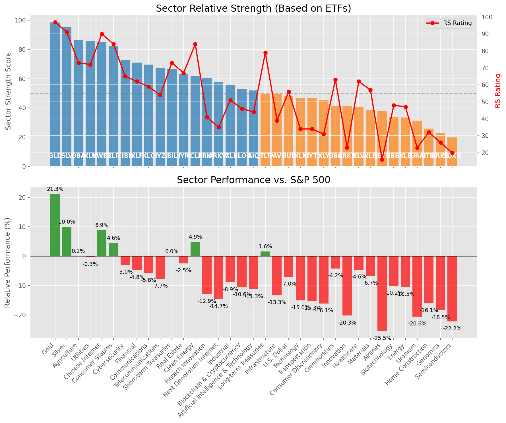

# **Daily Relative Strength Report**

**Date:** 2025-04-24

## **Market Valuation (Buffett Indicator)**

| Metric | Value |
|--------|-------|
| **Market Valuation** | **Undervalued** |
| **Current Ratio** | 8.93 |
| **Historical Mean** | 9.58 |
| **Standard Deviation** | 0.51 |
| **Z-Score (StdDev from Mean)** | -1.39 |
| **Total Market Cap** | $265.51 trillion |
| **GDP** | $29.72 trillion |

## **Market Insights**

### **Market is Undervalued**

The market is trading below historical average valuations, suggesting potential opportunity. These conditions have historically preceded periods of above-average returns. Investors should:

- Look for stocks breaking out of consolidation patterns on increasing volume
- Focus on sectors showing relative strength
- Consider increasing equity exposure, particularly in quality names
- Be mindful of overall market direction and avoid fighting the trend

History suggests patient investors are often rewarded when investing during periods of undervaluation.

### **Buffett Indicator Overview**

The Buffett Indicator (Total Market Cap / GDP) is a measure of the stock market's valuation relative to the size of the economy. It is named after Warren Buffett, who described it as "probably the best single measure of where valuations stand at any given moment."

- **Values above +2 standard deviations:** Market significantly overvalued
- **Values above +1 standard deviation:** Market overvalued
- **Values between -1 and +1 standard deviations:** Market fairly valued
- **Values below -1 standard deviation:** Market undervalued
- **Values below -2 standard deviations:** Market significantly undervalued

---

## **Sector Relative Strength**

Based on William O'Neil's Relative Strength Methodology

| ETF | Strength | RS Rating | Performance | Above Key MAs | Trend | Sector |
|-----|----------|-----------|-------------|--------------|-------|--------|
| [GLD](https://www.tradingview.com/chart/?symbol=GLD) | 98.5 | 97.0 | 20.15% | 10d ✓, 50d ✓, 200d ✓ | ↗️ | Gold |
| [SLV](https://www.tradingview.com/chart/?symbol=SLV) | 95.0 | 90.0 | 9.15% | 10d ✓, 50d ✓, 200d ✓ | ↗️ | Silver |
| [DBA](https://www.tradingview.com/chart/?symbol=DBA) | 88.0 | 76.0 | 0.19% | 10d ✓, 50d ✓, 200d ✓ | ↗️ | Agriculture |
| [KWEB](https://www.tradingview.com/chart/?symbol=KWEB) | 85.1 | 90.0 | 8.17% | 10d ✓, 50d ✗, 200d ✓ | ↗️ | Chinese Internet |
| [XLP](https://www.tradingview.com/chart/?symbol=XLP) | 82.6 | 85.0 | 4.52% | 10d ✗, 50d ✓, 200d ✓ | ↗️ | Consumer Staples |
| [XLU](https://www.tradingview.com/chart/?symbol=XLU) | 75.6 | 71.0 | -1.13% | 10d ✓, 50d ✗, 200d ✓ | ↗️ | Utilities |
| [XLF](https://www.tradingview.com/chart/?symbol=XLF) | 70.6 | 61.0 | -6.00% | 10d ✓, 50d ✗, 200d ✓ | ↗️ | Financial |
| [CIBR](https://www.tradingview.com/chart/?symbol=CIBR) | 70.1 | 60.0 | -6.35% | 10d ✓, 50d ✗, 200d ✓ | ↗️ | Cybersecurity |
| [BIL](https://www.tradingview.com/chart/?symbol=BIL) | 67.5 | 75.0 | 0.02% | 10d ✓, 50d ✓, 200d ✓ | ↘️ | Short-term Treasuries |
| [IYR](https://www.tradingview.com/chart/?symbol=IYR) | 63.4 | 67.0 | -2.97% | 10d ✓, 50d ✗, 200d ✗ | ↗️ | Real Estate |
| [ICLN](https://www.tradingview.com/chart/?symbol=ICLN) | 61.8 | 84.0 | 4.08% | 10d ✓, 50d ✓, 200d ✗ | ↘️ | Clean Energy |
| [XLC](https://www.tradingview.com/chart/?symbol=XLC) | 59.9 | 60.0 | -6.56% | 10d ✓, 50d ✗, 200d ✗ | ↗️ | Communications |
| [ARKF](https://www.tradingview.com/chart/?symbol=ARKF) | 59.1 | 38.0 | -15.01% | 10d ✓, 50d ✗, 200d ✓ | ↗️ | Fintech Innovation |
| [ARKW](https://www.tradingview.com/chart/?symbol=ARKW) | 56.1 | 32.0 | -17.67% | 10d ✓, 50d ✗, 200d ✓ | ↗️ | Next Generation Internet |
| [XLI](https://www.tradingview.com/chart/?symbol=XLI) | 54.9 | 50.0 | -10.45% | 10d ✓, 50d ✗, 200d ✗ | ↗️ | Industrial |
| [BLOK](https://www.tradingview.com/chart/?symbol=BLOK) | 54.4 | 49.0 | -11.00% | 10d ✓, 50d ✗, 200d ✗ | ↗️ | Blockchain & Cryptocurrency |
| [AIQ](https://www.tradingview.com/chart/?symbol=AIQ) | 50.4 | 41.0 | -13.66% | 10d ✓, 50d ✗, 200d ✗ | ↗️ | Artificial Intelligence & Technology |
| [UUP](https://www.tradingview.com/chart/?symbol=UUP) | 49.5 | 59.0 | -7.05% | 10d ✗, 50d ✗, 200d ✗ | ↗️ | U.S. Dollar |
| [TLT](https://www.tradingview.com/chart/?symbol=TLT) | 49.4 | 79.0 | 1.31% | 10d ✓, 50d ✗, 200d ✗ | ↘️ | Long-term Treasuries |
| [PAVE](https://www.tradingview.com/chart/?symbol=PAVE) | 48.9 | 38.0 | -15.09% | 10d ✓, 50d ✗, 200d ✗ | ↗️ | Infrastructure |
| [IYZ](https://www.tradingview.com/chart/?symbol=IYZ) | 48.0 | 56.0 | -7.92% | 10d ✗, 50d ✗, 200d ✗ | ↗️ | Telecommunications |
| [XLK](https://www.tradingview.com/chart/?symbol=XLK) | 47.4 | 35.0 | -16.18% | 10d ✓, 50d ✗, 200d ✗ | ↗️ | Technology |
| [IYT](https://www.tradingview.com/chart/?symbol=IYT) | 46.4 | 33.0 | -17.22% | 10d ✓, 50d ✗, 200d ✗ | ↗️ | Transportation |
| [XLY](https://www.tradingview.com/chart/?symbol=XLY) | 46.4 | 33.0 | -17.21% | 10d ✓, 50d ✗, 200d ✗ | ↗️ | Consumer Discretionary |
| [ARKK](https://www.tradingview.com/chart/?symbol=ARKK) | 41.4 | 23.0 | -21.74% | 10d ✓, 50d ✗, 200d ✗ | ↗️ | Innovation |
| [DBC](https://www.tradingview.com/chart/?symbol=DBC) | 41.4 | 63.0 | -4.81% | 10d ✓, 50d ✗, 200d ✗ | ↘️ | Commodities |
| [XLB](https://www.tradingview.com/chart/?symbol=XLB) | 37.4 | 55.0 | -8.13% | 10d ✓, 50d ✗, 200d ✗ | ↘️ | Materials |
| [JETS](https://www.tradingview.com/chart/?symbol=JETS) | 37.4 | 15.0 | -27.18% | 10d ✓, 50d ✗, 200d ✗ | ↗️ | Airlines |
| [IBB](https://www.tradingview.com/chart/?symbol=IBB) | 33.9 | 48.0 | -11.22% | 10d ✓, 50d ✗, 200d ✗ | ↘️ | Biotechnology |
| [XLE](https://www.tradingview.com/chart/?symbol=XLE) | 33.4 | 47.0 | -11.71% | 10d ✓, 50d ✗, 200d ✗ | ↘️ | Energy |
| [XLV](https://www.tradingview.com/chart/?symbol=XLV) | 31.0 | 62.0 | -5.70% | 10d ✗, 50d ✗, 200d ✗ | ↘️ | Healthcare |
| [ITB](https://www.tradingview.com/chart/?symbol=ITB) | 25.9 | 32.0 | -17.40% | 10d ✓, 50d ✗, 200d ✗ | ↘️ | Home Construction |
| [ARKG](https://www.tradingview.com/chart/?symbol=ARKG) | 23.4 | 27.0 | -20.01% | 10d ✓, 50d ✗, 200d ✗ | ↘️ | Genomics |
| [URA](https://www.tradingview.com/chart/?symbol=URA) | 21.4 | 23.0 | -22.00% | 10d ✓, 50d ✗, 200d ✗ | ↘️ | Uranium |
| [SOXX](https://www.tradingview.com/chart/?symbol=SOXX) | 19.9 | 20.0 | -23.47% | 10d ✓, 50d ✗, 200d ✗ | ↘️ | Semiconductors |

### **Sector ETF Performance Interpretation**

This table shows the relative strength metrics for different market sectors based on their representative ETFs:

- **ETF**: The ETF used to measure sector performance (click for chart)
- **Strength**: Overall sector strength score (0-100) combining multiple factors
- **RS Rating**: O'Neil RS rating of the sector ETF
- **Performance**: Performance of the sector ETF relative to SPY
- **Above Key MAs**: Whether the ETF is trading above its 10, 50, and 200-day moving averages
- **Trend**: Whether the sector is in an uptrend (↗️) or downtrend (↘️)

### **Current Sector Leadership**

The current market leadership is coming from the following sectors: **Gold, Silver, Agriculture**.

The **Gold** sector (represented by **GLD**) is showing particularly strong relative strength with an RS rating of 97.0 and performance of 20.15% vs. the S&P 500. This sector is trading above its 10-day, 50-day, 200-day moving average(s). Investors should consider focusing on high RS stocks within these leading sectors for potential outperformance.

---

## **Buy Recommendations**

The following 75 stocks show exceptional relative strength:

| RS Rating | Buy Score | Current Price | Chart | Name | Ticker |
|-----------|-----------|---------------|-------|------|--------|
| 100 | 100 | $141.88 | [Chart](https://www.tradingview.com/chart/?symbol=UGL) | ProShares Ultra Gold | UGL |
| 100 | 100 | $152.00 | [Chart](https://www.tradingview.com/chart/?symbol=PLMR) | Palomar Holdings, Inc. Common stock | PLMR |
| 99 | 100 | $168.00 | [Chart](https://www.tradingview.com/chart/?symbol=PM) | Philip Morris International Inc. | PM |
| 99 | 100 | $180.57 | [Chart](https://www.tradingview.com/chart/?symbol=RGLD) | Royal Gold Inc | RGLD |
| 99 | 100 | $16.32 | [Chart](https://www.tradingview.com/chart/?symbol=EZPW) | Ezcorp Inc | EZPW |
| 99 | 100 | $104.81 | [Chart](https://www.tradingview.com/chart/?symbol=PLTR) | Palantir Technologies Inc. Class A Common Stock | PLTR |
| 98 | 100 | $71.75 | [Chart](https://www.tradingview.com/chart/?symbol=KR) | The Kroger Co. | KR |
| 98 | 100 | $25.02 | [Chart](https://www.tradingview.com/chart/?symbol=DB) | Deutsche Bank Aktiengesellschaft | DB |
| 98 | 100 | $70.75 | [Chart](https://www.tradingview.com/chart/?symbol=WRB) | W.R. Berkley Corporation | WRB |
| 98 | 100 | $27.59 | [Chart](https://www.tradingview.com/chart/?symbol=T) | AT&T Inc. | T |
| 98 | 100 | $20.88 | [Chart](https://www.tradingview.com/chart/?symbol=GRND) | Grindr Inc. | GRND |
| 97 | 100 | $62.46 | [Chart](https://www.tradingview.com/chart/?symbol=IAU) | iShares Gold Trust | IAU |
| 97 | 100 | $31.59 | [Chart](https://www.tradingview.com/chart/?symbol=SGOL) | abrdn Physical Gold Shares ETF | SGOL |
| 97 | 100 | $251.36 | [Chart](https://www.tradingview.com/chart/?symbol=VRSN) | VeriSign Inc | VRSN |
| 97 | 100 | $54.58 | [Chart](https://www.tradingview.com/chart/?symbol=PPC) | Pilgrims Pride Corporation | PPC |
| 97 | 100 | $65.58 | [Chart](https://www.tradingview.com/chart/?symbol=GLDM) | SPDR Gold MiniShares | GLDM |
| 97 | 100 | $32.66 | [Chart](https://www.tradingview.com/chart/?symbol=BAR) | GraniteShares Gold Shares | BAR |
| 97 | 100 | $33.03 | [Chart](https://www.tradingview.com/chart/?symbol=IAUM) | iShares Gold Trust Micro | IAUM |
| 97 | 100 | $22.90 | [Chart](https://www.tradingview.com/chart/?symbol=OR) | Osisko Gold Royalties Ltd | OR |
| 97 | 100 | $31.93 | [Chart](https://www.tradingview.com/chart/?symbol=OUNZ) | VanEck Merk Gold ETF | OUNZ |
| 97 | 100 | $219.94 | [Chart](https://www.tradingview.com/chart/?symbol=TTWO) | Take-Two Interactive Software Inc | TTWO |
| 97 | 100 | $32.72 | [Chart](https://www.tradingview.com/chart/?symbol=AAAU) | Goldman Sachs Physical Gold ETF Shares | AAAU |
| 97 | 100 | $601.23 | [Chart](https://www.tradingview.com/chart/?symbol=SPOT) | Spotify Technology S.A. | SPOT |
| 97 | 100 | $305.26 | [Chart](https://www.tradingview.com/chart/?symbol=GLD) | SPDR Gold Trust, SPDR Gold Shares | GLD |
| 96 | 100 | $68.64 | [Chart](https://www.tradingview.com/chart/?symbol=VTR) | Ventas, Inc. | VTR |
| 95 | 100 | $83.79 | [Chart](https://www.tradingview.com/chart/?symbol=SNEX) | StoneX Group Inc. Common Stock | SNEX |
| 95 | 100 | $29.36 | [Chart](https://www.tradingview.com/chart/?symbol=EUFN) | iShares MSCI Europe Financials ETF | EUFN |
| 95 | 100 | $29.35 | [Chart](https://www.tradingview.com/chart/?symbol=CEF) | Sprott Physical Gold and Silver Trust | CEF |
| 95 | 100 | $63.31 | [Chart](https://www.tradingview.com/chart/?symbol=VRNA) | Verona Pharma plc | VRNA |
| 95 | 100 | $173.57 | [Chart](https://www.tradingview.com/chart/?symbol=DGX) | Quest Diagnostics Inc. | DGX |
| 95 | 100 | $88.87 | [Chart](https://www.tradingview.com/chart/?symbol=CCEP) | Coca-Cola Europacific Partners plc Ordinary Shares | CCEP |
| 95 | 100 | $526.93 | [Chart](https://www.tradingview.com/chart/?symbol=BRK.B) | BERKSHIRE HATHAWAY Class B | BRK.B |
| 94 | 100 | $136.16 | [Chart](https://www.tradingview.com/chart/?symbol=DTE) | DTE Energy Company | DTE |
| 94 | 100 | $331.79 | [Chart](https://www.tradingview.com/chart/?symbol=AJG) | Arthur J. Gallagher & Co. | AJG |
| 94 | 100 | $16.56 | [Chart](https://www.tradingview.com/chart/?symbol=SPNT) | SiriusPoint Ltd. | SPNT |
| 94 | 100 | $77.75 | [Chart](https://www.tradingview.com/chart/?symbol=NFG) | National Fuel Gas Co. | NFG |
| 94 | 100 | $263.61 | [Chart](https://www.tradingview.com/chart/?symbol=CME) | CME Group Inc. | CME |
| 94 | 100 | $40.33 | [Chart](https://www.tradingview.com/chart/?symbol=MRX) | Marex Group plc Ordinary Shares | MRX |
| 94 | 100 | $455.39 | [Chart](https://www.tradingview.com/chart/?symbol=CASY) | Casey's General Stores Inc | CASY |
| 94 | 100 | $42.44 | [Chart](https://www.tradingview.com/chart/?symbol=BTI) | British American Tobacco p.l.c. American Depositary Shares, American Depositary Shares, each representing one Ordinary Share | BTI |
| 94 | 100 | $44.98 | [Chart](https://www.tradingview.com/chart/?symbol=SEZL) | Sezzle Inc. Common Stock | SEZL |
| 93 | 100 | $77.51 | [Chart](https://www.tradingview.com/chart/?symbol=SR) | Spire Inc. | SR |
| 93 | 100 | $164.13 | [Chart](https://www.tradingview.com/chart/?symbol=SFM) | Sprouts Farmers Market, Inc. | SFM |
| 93 | 100 | $73.91 | [Chart](https://www.tradingview.com/chart/?symbol=CMS) | CMS Energy Corporation | CMS |
| 93 | 100 | $78.59 | [Chart](https://www.tradingview.com/chart/?symbol=OGS) | ONE GAS, INC. | OGS |
| 93 | 100 | $38.76 | [Chart](https://www.tradingview.com/chart/?symbol=EWG) | iShares MSCI Germany ETF | EWG |
| 93 | 100 | $34.28 | [Chart](https://www.tradingview.com/chart/?symbol=FDP) | Fresh Del Monte Produce Inc. | FDP |
| 91 | 100 | $1076.20 | [Chart](https://www.tradingview.com/chart/?symbol=NFLX) | NetFlix Inc | NFLX |
| 91 | 100 | $94.36 | [Chart](https://www.tradingview.com/chart/?symbol=PNW) | Pinnacle West Capital Corporation | PNW |
| 91 | 100 | $36.06 | [Chart](https://www.tradingview.com/chart/?symbol=PPL) | PPL Corporation | PPL |
| 91 | 100 | $43.61 | [Chart](https://www.tradingview.com/chart/?symbol=NWN) | Northwest Natural Holding Company | NWN |
| 90 | 100 | $18.84 | [Chart](https://www.tradingview.com/chart/?symbol=KT) | KT Corp. | KT |
| 90 | 100 | $32.75 | [Chart](https://www.tradingview.com/chart/?symbol=UGI) | UGI Corporation | UGI |
| 89 | 100 | $52.70 | [Chart](https://www.tradingview.com/chart/?symbol=RELX) | RELX PLC | RELX |
| 89 | 100 | $67.70 | [Chart](https://www.tradingview.com/chart/?symbol=EVRG) | Evergy, Inc. | EVRG |
| 89 | 100 | $30.41 | [Chart](https://www.tradingview.com/chart/?symbol=AHR) | American Healthcare REIT, Inc. | AHR |
| 88 | 100 | $23.55 | [Chart](https://www.tradingview.com/chart/?symbol=EWS) | iShares MSCI Singapore ETF | EWS |
| 88 | 100 | $45.04 | [Chart](https://www.tradingview.com/chart/?symbol=OGE) | OGE Energy Corp. | OGE |
| 87 | 100 | $98.63 | [Chart](https://www.tradingview.com/chart/?symbol=AEE) | Ameren Corporation | AEE |
| 87 | 100 | $105.08 | [Chart](https://www.tradingview.com/chart/?symbol=ATGE) | Adtalem Global Education Inc. Common Shares | ATGE |
| 90 | 99 | $62.60 | [Chart](https://www.tradingview.com/chart/?symbol=FNF) | Fidelity National Financial, Inc. | FNF |
| 88 | 99 | $257.04 | [Chart](https://www.tradingview.com/chart/?symbol=TRV) | The Travelers Companies, Inc. | TRV |
| 87 | 99 | $193.89 | [Chart](https://www.tradingview.com/chart/?symbol=GWRE) | GUIDEWIRE SOFTWARE, INC. | GWRE |
| 86 | 99 | $15.46 | [Chart](https://www.tradingview.com/chart/?symbol=BCS) | Barclays PLC | BCS |
| 85 | 99 | $134.43 | [Chart](https://www.tradingview.com/chart/?symbol=CAH) | Cardinal Health, Inc. | CAH |
| 88 | 98 | $124.03 | [Chart](https://www.tradingview.com/chart/?symbol=BECN) | Beacon Roofing Supply, Inc. | BECN |
| 87 | 98 | $56.35 | [Chart](https://www.tradingview.com/chart/?symbol=ULS) | UL Solutions Inc. | ULS |
| 85 | 98 | $39.11 | [Chart](https://www.tradingview.com/chart/?symbol=VIRT) | Virtu Financial, Inc. Class A | VIRT |
| 85 | 98 | $78.70 | [Chart](https://www.tradingview.com/chart/?symbol=UNM) | Unum Group | UNM |
| 87 | 97 | $49.31 | [Chart](https://www.tradingview.com/chart/?symbol=NJR) | New Jersey Resources Corp | NJR |
| 81 | 95 | $83.70 | [Chart](https://www.tradingview.com/chart/?symbol=ETR) | Entergy Corporation | ETR |
| 80 | 93 | $156.91 | [Chart](https://www.tradingview.com/chart/?symbol=EAT) | Brinker International, Inc. | EAT |
| 80 | 93 | $279.10 | [Chart](https://www.tradingview.com/chart/?symbol=PEN) | Penumbra, Inc. | PEN |
| 83 | 92 | $23.29 | [Chart](https://www.tradingview.com/chart/?symbol=HAFC) | Hanmi Financial Corp | HAFC |
| 82 | 92 | $49.92 | [Chart](https://www.tradingview.com/chart/?symbol=VTIP) | Vanguard Short-Term Inflation-Protected Securities Index Fund | VTIP |

---

## **Sell Recommendations**

The following 152 stocks show deteriorating relative strength:

| RS Rating | Sell Score | Current Price | Chart | Name | Ticker |
|-----------|------------|---------------|-------|------|--------|
| 1 | 100 | $10.19 | [Chart](https://www.tradingview.com/chart/?symbol=AMRC) | Ameresco, Inc. | AMRC |
| 2 | 100 | $108.89 | [Chart](https://www.tradingview.com/chart/?symbol=DECK) | Deckers Outdoor Corp | DECK |
| 2 | 100 | $16.88 | [Chart](https://www.tradingview.com/chart/?symbol=TNDM) | Tandem Diabetes Care, Inc. | TNDM |
| 2 | 100 | $10.03 | [Chart](https://www.tradingview.com/chart/?symbol=FLYW) | Flywire Corporation Voting Common Stock | FLYW |
| 3 | 100 | $53.69 | [Chart](https://www.tradingview.com/chart/?symbol=LABU) | Direxion Daily S&P Biotech Bull 3X Shares | LABU |
| 3 | 100 | $12.43 | [Chart](https://www.tradingview.com/chart/?symbol=ODP) | The ODP Corporation Common Stock | ODP |
| 4 | 100 | $17.98 | [Chart](https://www.tradingview.com/chart/?symbol=DAVA) | Endava plc American Depositary Shares (each representing one Class A Ordinary Share) | DAVA |
| 4 | 100 | $76.75 | [Chart](https://www.tradingview.com/chart/?symbol=ILMN) | Illumina Inc | ILMN |
| 4 | 100 | $117.29 | [Chart](https://www.tradingview.com/chart/?symbol=GLOB) | GLOBANT S.A. | GLOB |
| 5 | 100 | $28.62 | [Chart](https://www.tradingview.com/chart/?symbol=W) | Wayfair Inc. | W |
| 5 | 100 | $63.97 | [Chart](https://www.tradingview.com/chart/?symbol=CAMT) | Camtek Ltd | CAMT |
| 5 | 100 | $19.53 | [Chart](https://www.tradingview.com/chart/?symbol=SPT) | Sprout Social, Inc Class A Common Stock | SPT |
| 6 | 100 | $23.73 | [Chart](https://www.tradingview.com/chart/?symbol=RPD) | Rapid7, Inc. Common Stock | RPD |
| 6 | 100 | $23.75 | [Chart](https://www.tradingview.com/chart/?symbol=WSC) | WillScot Holdings Corporation Class A Common Stock | WSC |
| 6 | 100 | $17.71 | [Chart](https://www.tradingview.com/chart/?symbol=PDFS) | PDF Solutions Inc | PDFS |
| 6 | 100 | $31.88 | [Chart](https://www.tradingview.com/chart/?symbol=SCSC) | Scansource Inc | SCSC |
| 6 | 100 | $14.51 | [Chart](https://www.tradingview.com/chart/?symbol=MEG) | Montrose Environmental Group, Inc. | MEG |
| 6 | 100 | $18.59 | [Chart](https://www.tradingview.com/chart/?symbol=SG) | Sweetgreen, Inc. | SG |
| 6 | 100 | $12.28 | [Chart](https://www.tradingview.com/chart/?symbol=IMXI) | International Money Express, Inc. | IMXI |
| 6 | 100 | $13.02 | [Chart](https://www.tradingview.com/chart/?symbol=GCT) | GigaCloud Technology Inc Class A Ordinary Shares | GCT |
| 6 | 100 | $12.65 | [Chart](https://www.tradingview.com/chart/?symbol=ARCT) | Arcturus Therapeutics Holdings Inc. Common Stock | ARCT |
| 6 | 100 | $21.99 | [Chart](https://www.tradingview.com/chart/?symbol=NSSC) | Napco Security Technologies, Inc | NSSC |
| 7 | 100 | $12.69 | [Chart](https://www.tradingview.com/chart/?symbol=DV) | DoubleVerify Holdings, Inc. | DV |
| 7 | 100 | $53.02 | [Chart](https://www.tradingview.com/chart/?symbol=SYNA) | Synaptics Inc | SYNA |
| 8 | 100 | $21.56 | [Chart](https://www.tradingview.com/chart/?symbol=SYM) | Symbotic Inc. Class A Common Stock | SYM |
| 8 | 100 | $20.77 | [Chart](https://www.tradingview.com/chart/?symbol=TDC) | TERADATA CORPORATION | TDC |
| 8 | 100 | $16.26 | [Chart](https://www.tradingview.com/chart/?symbol=IART) | Integra LifeSciences Holdings | IART |
| 9 | 100 | $110.11 | [Chart](https://www.tradingview.com/chart/?symbol=ARM) | Arm Holdings plc American Depositary Shares | ARM |
| 10 | 100 | $18.17 | [Chart](https://www.tradingview.com/chart/?symbol=AMN) | AMN Healthcare Services | AMN |
| 12 | 100 | $12.41 | [Chart](https://www.tradingview.com/chart/?symbol=TRIP) | TripAdvisor, Inc. | TRIP |
| 12 | 100 | $20.12 | [Chart](https://www.tradingview.com/chart/?symbol=ST) | Sensata Technologies Holding plc | ST |
| 12 | 100 | $13.45 | [Chart](https://www.tradingview.com/chart/?symbol=XRAY) | DENTSPLY SIRONA Inc. | XRAY |
| 13 | 100 | $20.35 | [Chart](https://www.tradingview.com/chart/?symbol=FOXF) | Fox Factory Holding Corp. Common Stock | FOXF |
| 13 | 100 | $62.00 | [Chart](https://www.tradingview.com/chart/?symbol=ATKR) | Atkore Inc. | ATKR |
| 15 | 100 | $11.90 | [Chart](https://www.tradingview.com/chart/?symbol=OSCR) | Oscar Health, Inc. | OSCR |
| 15 | 100 | $28.55 | [Chart](https://www.tradingview.com/chart/?symbol=SRDX) | Surmodics, Inc. Common Stock | SRDX |
| 6 | 99 | $25.30 | [Chart](https://www.tradingview.com/chart/?symbol=SPHR) | Sphere Entertainment Co. | SPHR |
| 8 | 99 | $34.87 | [Chart](https://www.tradingview.com/chart/?symbol=CRC) | California Resources Corporation | CRC |
| 10 | 99 | $18.20 | [Chart](https://www.tradingview.com/chart/?symbol=VECO) | Veeco Instruments Inc | VECO |
| 13 | 99 | $117.26 | [Chart](https://www.tradingview.com/chart/?symbol=BLDR) | Builders FirstSource, Inc. | BLDR |
| 14 | 99 | $13.13 | [Chart](https://www.tradingview.com/chart/?symbol=DK) | Delek US Holdings, Inc. | DK |
| 10 | 98 | $10.92 | [Chart](https://www.tradingview.com/chart/?symbol=AEYE) | AudioEye, Inc. Common Stock | AEYE |
| 12 | 98 | $97.90 | [Chart](https://www.tradingview.com/chart/?symbol=DDOG) | Datadog, Inc. Class A Common Stock | DDOG |
| 14 | 98 | $10.77 | [Chart](https://www.tradingview.com/chart/?symbol=SONO) | Sonos, Inc. Common Stock | SONO |
| 9 | 97 | $25.95 | [Chart](https://www.tradingview.com/chart/?symbol=XPEL) | XPEL, Inc. Common Stock | XPEL |
| 10 | 97 | $10.01 | [Chart](https://www.tradingview.com/chart/?symbol=MYGN) | Myriad Genetics Inc | MYGN |
| 17 | 97 | $35.21 | [Chart](https://www.tradingview.com/chart/?symbol=STNG) | Scorpio Tankers Inc. | STNG |
| 10 | 96 | $12.48 | [Chart](https://www.tradingview.com/chart/?symbol=ZETA) | Zeta Global Holdings Corp. | ZETA |
| 14 | 96 | $24.60 | [Chart](https://www.tradingview.com/chart/?symbol=RNG) | RINGCENTRAL, INC. | RNG |
| 17 | 96 | $12.10 | [Chart](https://www.tradingview.com/chart/?symbol=BAND) | Bandwidth Inc. Class A Common Stock | BAND |
| 11 | 95 | $86.69 | [Chart](https://www.tradingview.com/chart/?symbol=NTAP) | NetApp, Inc | NTAP |
| 16 | 95 | $33.70 | [Chart](https://www.tradingview.com/chart/?symbol=OVV) | Ovintiv Inc. | OVV |
| 18 | 95 | $47.16 | [Chart](https://www.tradingview.com/chart/?symbol=POWI) | Power Integrations Inc | POWI |
| 6 | 94 | $44.00 | [Chart](https://www.tradingview.com/chart/?symbol=PSTG) | Pure Storage, Inc. Class A | PSTG |
| 8 | 94 | $15.08 | [Chart](https://www.tradingview.com/chart/?symbol=DNLI) | Denali Therapeutics Inc. Common Stock | DNLI |
| 11 | 94 | $10.01 | [Chart](https://www.tradingview.com/chart/?symbol=VYX) | NCR Voyix Corporation | VYX |
| 13 | 94 | $53.56 | [Chart](https://www.tradingview.com/chart/?symbol=NVT) | nVent Electric plc Ordinary Shares | NVT |
| 15 | 94 | $62.22 | [Chart](https://www.tradingview.com/chart/?symbol=SPB) | Spectrum Brands Holdings, Inc. | SPB |
| 16 | 94 | $93.33 | [Chart](https://www.tradingview.com/chart/?symbol=BCC) | Boise Cascade Company | BCC |
| 20 | 94 | $28.87 | [Chart](https://www.tradingview.com/chart/?symbol=YETI) | YETI Holdings, Inc. Common Stock | YETI |
| 10 | 93 | $18.89 | [Chart](https://www.tradingview.com/chart/?symbol=BZH) | Beazer Homes USA, Inc. New | BZH |
| 27 | 93 | $15.73 | [Chart](https://www.tradingview.com/chart/?symbol=TRMD) | TORM plc Class A Common Stock | TRMD |
| 27 | 93 | $14.09 | [Chart](https://www.tradingview.com/chart/?symbol=FXN) | First Trust Energy AlphaDEX Fund | FXN |
| 20 | 92 | $11.34 | [Chart](https://www.tradingview.com/chart/?symbol=HPK) | HighPeak Energy, Inc. Common Stock | HPK |
| 22 | 92 | $10.15 | [Chart](https://www.tradingview.com/chart/?symbol=CSIQ) | Canadian Solar Inc. Common Shares (ON) | CSIQ |
| 25 | 92 | $12.12 | [Chart](https://www.tradingview.com/chart/?symbol=MED) | Medifast, Inc. | MED |
| 9 | 91 | $10.18 | [Chart](https://www.tradingview.com/chart/?symbol=LSPD) | Lightspeed Commerce Inc. | LSPD |
| 10 | 91 | $29.63 | [Chart](https://www.tradingview.com/chart/?symbol=UWM) | ProShares Ultra Russell2000 | UWM |
| 11 | 91 | $44.55 | [Chart](https://www.tradingview.com/chart/?symbol=CXT) | Crane NXT, Co. | CXT |
| 18 | 91 | $29.39 | [Chart](https://www.tradingview.com/chart/?symbol=CDRE) | Cadre Holdings, Inc. | CDRE |
| 12 | 90 | $16.70 | [Chart](https://www.tradingview.com/chart/?symbol=PRO) | Pros Holdings, Inc. | PRO |
| 16 | 90 | $21.51 | [Chart](https://www.tradingview.com/chart/?symbol=UCO) | ProShares Ultra Bloomberg Crude Oil | UCO |
| 16 | 90 | $15.97 | [Chart](https://www.tradingview.com/chart/?symbol=SVOL) | Simplify Volatility Premium ETF | SVOL |
| 18 | 90 | $92.53 | [Chart](https://www.tradingview.com/chart/?symbol=AMD) | Advanced Micro Devices | AMD |
| 21 | 90 | $11.97 | [Chart](https://www.tradingview.com/chart/?symbol=PR) | Permian Resources Corporation | PR |
| 14 | 89 | $37.62 | [Chart](https://www.tradingview.com/chart/?symbol=TWST) | Twist Bioscience Corporation Common Stock | TWST |
| 14 | 89 | $10.31 | [Chart](https://www.tradingview.com/chart/?symbol=VREX) | Varex Imaging Corporation Common Stock | VREX |
| 17 | 88 | $47.71 | [Chart](https://www.tradingview.com/chart/?symbol=ERX) | Direxion Daily Energy Bull 2X Shares | ERX |
| 18 | 88 | $42.47 | [Chart](https://www.tradingview.com/chart/?symbol=CCJ) | Cameco Corporation | CCJ |
| 20 | 88 | $17.02 | [Chart](https://www.tradingview.com/chart/?symbol=CTRI) | Centuri Holdings, Inc. | CTRI |
| 23 | 88 | $25.98 | [Chart](https://www.tradingview.com/chart/?symbol=GDEN) | Golden Entertainment, Inc. Common Stock | GDEN |
| 26 | 88 | $25.99 | [Chart](https://www.tradingview.com/chart/?symbol=COLL) | Collegium Pharmaceutical, Inc. Common Stock | COLL |
| 27 | 88 | $77.13 | [Chart](https://www.tradingview.com/chart/?symbol=AKAM) | Akamai Technologies Inc | AKAM |
| 13 | 87 | $181.86 | [Chart](https://www.tradingview.com/chart/?symbol=NVMI) | Nova Ltd. Ordinary Shares | NVMI |
| 21 | 87 | $27.21 | [Chart](https://www.tradingview.com/chart/?symbol=SEE) | Sealed Air Corp. | SEE |
| 22 | 87 | $12.35 | [Chart](https://www.tradingview.com/chart/?symbol=KRP) | Kimbell Royalty Partners, LP Common Units representing Limited Partner Interests | KRP |
| 24 | 87 | $11.34 | [Chart](https://www.tradingview.com/chart/?symbol=KELYA) | Kelly Services Inc | KELYA |
| 15 | 85 | $10.24 | [Chart](https://www.tradingview.com/chart/?symbol=EXPI) | eXp World Holdings, Inc. Common Stock | EXPI |
| 24 | 85 | $74.03 | [Chart](https://www.tradingview.com/chart/?symbol=IR) | Ingersoll Rand Inc. Common Stock | IR |
| 16 | 84 | $10.43 | [Chart](https://www.tradingview.com/chart/?symbol=SEMR) | SEMrush Holdings, Inc. | SEMR |
| 16 | 84 | $15.16 | [Chart](https://www.tradingview.com/chart/?symbol=DXC) | DXC Technology Company | DXC |
| 19 | 84 | $10.15 | [Chart](https://www.tradingview.com/chart/?symbol=HLIT) | Harmonic Inc | HLIT |
| 21 | 84 | $35.15 | [Chart](https://www.tradingview.com/chart/?symbol=CALF) | Pacer US Small Cap Cash Cows ETF | CALF |
| 22 | 84 | $51.78 | [Chart](https://www.tradingview.com/chart/?symbol=IIPR) | Innovative Industrial Properties, Inc. Common stock | IIPR |
| 23 | 84 | $24.16 | [Chart](https://www.tradingview.com/chart/?symbol=URA) | Global X Uranium ETF | URA |
| 30 | 84 | $23.45 | [Chart](https://www.tradingview.com/chart/?symbol=HOG) | Harley-Davidson, Inc. | HOG |
| 24 | 83 | $13.76 | [Chart](https://www.tradingview.com/chart/?symbol=HST) | Host Hotels & Resorts, Inc. | HST |
| 28 | 83 | $13.78 | [Chart](https://www.tradingview.com/chart/?symbol=ZIM) | ZIM Integrated Shipping Services Ltd. | ZIM |
| 21 | 82 | $11.79 | [Chart](https://www.tradingview.com/chart/?symbol=APLE) | Apple Hospitality REIT, Inc. | APLE |
| 23 | 82 | $56.67 | [Chart](https://www.tradingview.com/chart/?symbol=TREX) | Trex Company, Inc. | TREX |
| 24 | 82 | $25.85 | [Chart](https://www.tradingview.com/chart/?symbol=PINS) | Pinterest, Inc. Class A Common Stock | PINS |
| 31 | 82 | $39.28 | [Chart](https://www.tradingview.com/chart/?symbol=CYTK) | Cytokinetics Inc. | CYTK |
| 34 | 82 | $10.16 | [Chart](https://www.tradingview.com/chart/?symbol=MAX) | MediaAlpha, Inc. | MAX |
| 21 | 81 | $32.67 | [Chart](https://www.tradingview.com/chart/?symbol=AVNT) | Avient Corporation | AVNT |
| 24 | 81 | $14.72 | [Chart](https://www.tradingview.com/chart/?symbol=PSFE) | Paysafe Limited | PSFE |
| 27 | 81 | $164.26 | [Chart](https://www.tradingview.com/chart/?symbol=IBP) | INSTALLED BUILDING PRODUCTS, INC. | IBP |
| 29 | 81 | $11.59 | [Chart](https://www.tradingview.com/chart/?symbol=NAVI) | Navient Corporation | NAVI |
| 24 | 80 | $19.07 | [Chart](https://www.tradingview.com/chart/?symbol=KMT) | Kennametal Inc. | KMT |
| 28 | 80 | $44.09 | [Chart](https://www.tradingview.com/chart/?symbol=EXAS) | Exact Sciences Corp | EXAS |
| 30 | 80 | $30.18 | [Chart](https://www.tradingview.com/chart/?symbol=DINO) | HF Sinclair Corporation | DINO |
| 30 | 80 | $12.23 | [Chart](https://www.tradingview.com/chart/?symbol=OEC) | Orion S.A. | OEC |
| 34 | 80 | $10.34 | [Chart](https://www.tradingview.com/chart/?symbol=CMRE) | Costamare Inc. | CMRE |
| 34 | 80 | $295.89 | [Chart](https://www.tradingview.com/chart/?symbol=BLD) | TopBuild Corp. Common Stock | BLD |
| 23 | 79 | $211.04 | [Chart](https://www.tradingview.com/chart/?symbol=FDX) | FedEx Corporation | FDX |
| 25 | 79 | $28.14 | [Chart](https://www.tradingview.com/chart/?symbol=MBUU) | Malibu Boats, Inc. Class A | MBUU |
| 27 | 79 | $11.14 | [Chart](https://www.tradingview.com/chart/?symbol=MRC) | MRC GLOBAL INC. | MRC |
| 28 | 79 | $17.77 | [Chart](https://www.tradingview.com/chart/?symbol=ELVN) | Enliven Therapeutics, Inc. Common Stock | ELVN |
| 30 | 79 | $12.82 | [Chart](https://www.tradingview.com/chart/?symbol=WDS) | Woodside Energy Group Limited American Depositary Shares, each representing one Ordinary Share | WDS |
| 24 | 78 | $149.19 | [Chart](https://www.tradingview.com/chart/?symbol=PTC) | PTC, INC | PTC |
| 27 | 78 | $22.03 | [Chart](https://www.tradingview.com/chart/?symbol=ARKG) | ARK Genomic Revolution ETF | ARKG |
| 29 | 78 | $20.98 | [Chart](https://www.tradingview.com/chart/?symbol=MGY) | Magnolia Oil & Gas Corporation Class A Common Stock | MGY |
| 30 | 78 | $67.19 | [Chart](https://www.tradingview.com/chart/?symbol=MTH) | Meritage Homes Corporation | MTH |
| 36 | 78 | $11.20 | [Chart](https://www.tradingview.com/chart/?symbol=ABR) | Arbor Realty Trust, Inc. | ABR |
| 30 | 77 | $10.87 | [Chart](https://www.tradingview.com/chart/?symbol=SHC) | Sotera Health Company Common Stock | SHC |
| 32 | 77 | $60.34 | [Chart](https://www.tradingview.com/chart/?symbol=HAE) | Haemonetics Corporation | HAE |
| 29 | 76 | $11.58 | [Chart](https://www.tradingview.com/chart/?symbol=CIM) | Chimera Investment Corp. | CIM |
| 31 | 76 | $138.35 | [Chart](https://www.tradingview.com/chart/?symbol=MTN) | Vail Resorts, Inc. | MTN |
| 32 | 76 | $34.17 | [Chart](https://www.tradingview.com/chart/?symbol=IAC) | IAC Inc. Common Stock | IAC |
| 25 | 75 | $157.32 | [Chart](https://www.tradingview.com/chart/?symbol=GOOGL) | Alphabet Inc. Class A Common Stock | GOOGL |
| 36 | 75 | $119.20 | [Chart](https://www.tradingview.com/chart/?symbol=J) | Jacobs Solutions Inc. | J |
| 31 | 74 | $29.58 | [Chart](https://www.tradingview.com/chart/?symbol=DAR) | DARLING INGREDIENTS INC. | DAR |
| 35 | 74 | $32.37 | [Chart](https://www.tradingview.com/chart/?symbol=CRNX) | Crinetics Pharmaceuticals, Inc. | CRNX |
| 33 | 73 | $34.54 | [Chart](https://www.tradingview.com/chart/?symbol=GFS) | GlobalFoundries Inc. Ordinary Shares | GFS |
| 39 | 73 | $20.42 | [Chart](https://www.tradingview.com/chart/?symbol=LPG) | DORIAN LPG LTD | LPG |
| 28 | 72 | $10.65 | [Chart](https://www.tradingview.com/chart/?symbol=AVO) | Mission Produce, Inc. Common Stock | AVO |
| 31 | 72 | $17.45 | [Chart](https://www.tradingview.com/chart/?symbol=PRAA) | PRA Group, Inc. | PRAA |
| 31 | 72 | $16.40 | [Chart](https://www.tradingview.com/chart/?symbol=MLNK) | MeridianLink, Inc. | MLNK |
| 31 | 72 | $10.71 | [Chart](https://www.tradingview.com/chart/?symbol=DBRG) | DigitalBridge Group, Inc. | DBRG |
| 32 | 71 | $90.68 | [Chart](https://www.tradingview.com/chart/?symbol=ITB) | iShares U.S. Home Construction ETF | ITB |
| 32 | 71 | $92.58 | [Chart](https://www.tradingview.com/chart/?symbol=XHB) | SPDR S&P Homebuilders ETF | XHB |
| 34 | 71 | $28.37 | [Chart](https://www.tradingview.com/chart/?symbol=AGIO) | Agios Pharmaceuticals, Inc. | AGIO |
| 35 | 70 | $71.36 | [Chart](https://www.tradingview.com/chart/?symbol=GMS) | GMS Inc. | GMS |
| 38 | 70 | $22.47 | [Chart](https://www.tradingview.com/chart/?symbol=PFE) | Pfizer Inc. | PFE |
| 39 | 70 | $44.26 | [Chart](https://www.tradingview.com/chart/?symbol=PRKS) | United Parks & Resorts Inc. | PRKS |
| 36 | 68 | $67.45 | [Chart](https://www.tradingview.com/chart/?symbol=XRT) | SPDR S&P Retail ETF | XRT |
| 37 | 68 | $17.62 | [Chart](https://www.tradingview.com/chart/?symbol=HTGC) | Hercules Capital, Inc. | HTGC |
| 37 | 68 | $25.30 | [Chart](https://www.tradingview.com/chart/?symbol=WY) | Weyerhaeuser Company | WY |
| 37 | 68 | $189.13 | [Chart](https://www.tradingview.com/chart/?symbol=RGA) | Reinsurance Group of America, Incorporated | RGA |
| 39 | 68 | $54.43 | [Chart](https://www.tradingview.com/chart/?symbol=APTV) | Aptiv PLC | APTV |
| 33 | 67 | $91.15 | [Chart](https://www.tradingview.com/chart/?symbol=PCAR) | Paccar Inc | PCAR |
| 34 | 66 | $111.90 | [Chart](https://www.tradingview.com/chart/?symbol=EOG) | EOG Resources, Inc. | EOG |
| 38 | 62 | $142.69 | [Chart](https://www.tradingview.com/chart/?symbol=IWN) | iShares Russell 2000 Value ETF | IWN |

## **Methodology**

This report uses William O'Neil's relative strength methodology from Investors Business Daily:

* **RS Rating**: Percentile rank of stock's performance vs. S&P 500 over the past 63 trading days (1-99 scale)
* **Buy Criteria**: RS Rating >= 80, price above 50-day MA, strong uptrend, increasing volume
* **Sell Criteria**: RS Rating < 40, price below 50-day MA, downtrend, decreasing volume

### **O'Neil's Key Principles**

1. **Focus on relative performance** - stocks outperforming the market
2. **Price trend confirmation** - stock must be in an uptrend
3. **Volume confirmation** - strong volume supports price moves
4. **Moving average validation** - price above key moving averages
5. **Market leaders only** - concentrate on top-performing stocks

*Report generated automatically after market close*