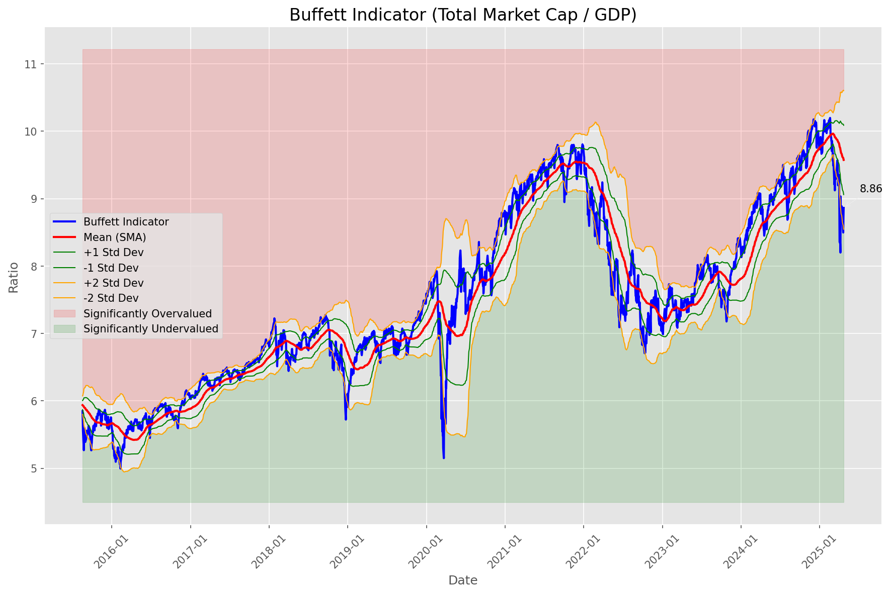
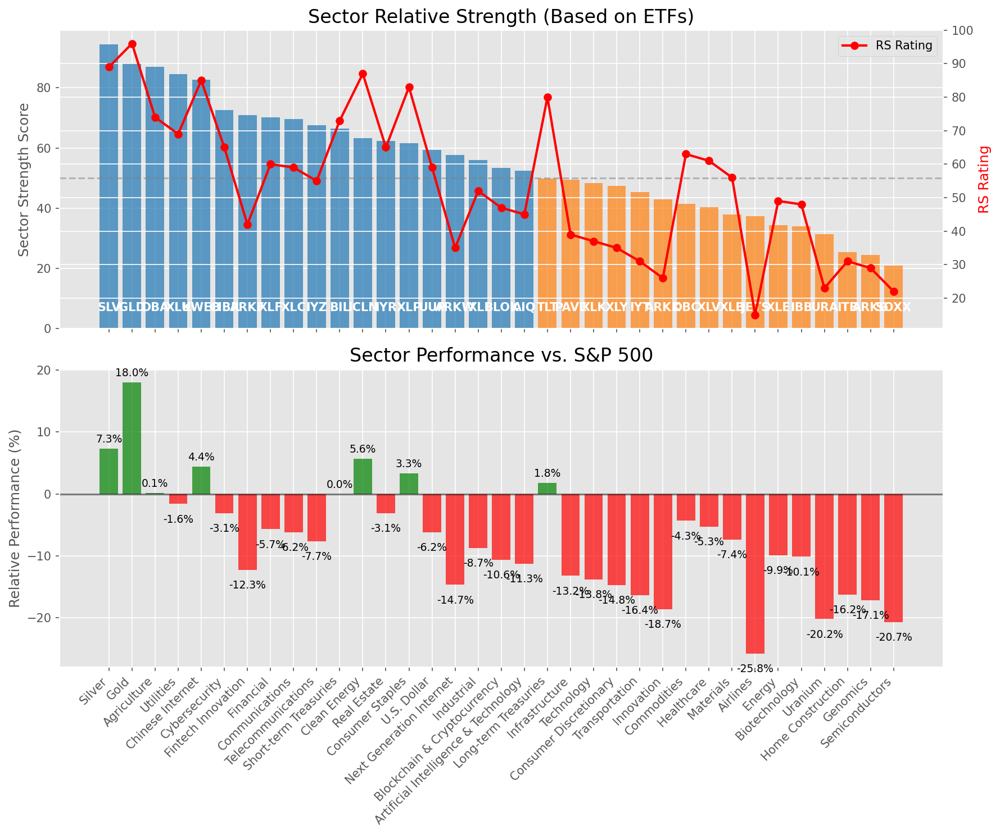

# **Daily Relative Strength Report**

**Date:** 2025-04-25

## **Market Valuation (Buffett Indicator)**

| Metric | Value |
|--------|-------|
| **Market Valuation** | **Fair Valued** |
| **Current Ratio** | 9.06 |
| **Historical Mean** | 9.56 |
| **Standard Deviation** | 0.52 |
| **Z-Score (StdDev from Mean)** | -1.00 |
| **Total Market Cap** | $269.34 trillion |
| **GDP** | $29.72 trillion |

## **Market Insights**

### **Market is Fairly Valued**

The market appears to be trading within a reasonable range of historical valuations. This suggests a balanced approach to equity investing is appropriate. Investors should:

- Focus on individual stock selection based on fundamentals and technicals
- Maintain normal equity allocations aligned with long-term goals
- Pay attention to sector rotation and relative strength
- Watch for changes in market leadership

Fair valuation typically suggests normal market returns can be expected, with stock selection becoming increasingly important.

### **Buffett Indicator Overview**

The Buffett Indicator (Total Market Cap / GDP) is a measure of the stock market's valuation relative to the size of the economy. It is named after Warren Buffett, who described it as "probably the best single measure of where valuations stand at any given moment."

- **Values above +2 standard deviations:** Market significantly overvalued
- **Values above +1 standard deviation:** Market overvalued
- **Values between -1 and +1 standard deviations:** Market fairly valued
- **Values below -1 standard deviation:** Market undervalued
- **Values below -2 standard deviations:** Market significantly undervalued

---

## **Sector Relative Strength**

Based on William O'Neil's Relative Strength Methodology

| ETF | Strength | RS Rating | Performance | Above Key MAs | Trend | Sector |
|-----|----------|-----------|-------------|--------------|-------|--------|
| [SLV](https://www.tradingview.com/chart/?symbol=SLV) | 94.5 | 89.0 | 7.43% | 10d ✓, 50d ✓, 200d ✓ | ↗️ | Silver |
| [GLD](https://www.tradingview.com/chart/?symbol=GLD) | 88.6 | 97.0 | 18.34% | 10d ✗, 50d ✓, 200d ✓ | ↗️ | Gold |
| [DBA](https://www.tradingview.com/chart/?symbol=DBA) | 87.0 | 74.0 | 0.11% | 10d ✓, 50d ✓, 200d ✓ | ↗️ | Agriculture |
| [XLU](https://www.tradingview.com/chart/?symbol=XLU) | 84.5 | 69.0 | -1.66% | 10d ✓, 50d ✓, 200d ✓ | ↗️ | Utilities |
| [KWEB](https://www.tradingview.com/chart/?symbol=KWEB) | 82.6 | 85.0 | 4.49% | 10d ✓, 50d ✗, 200d ✓ | ↗️ | Chinese Internet |
| [CIBR](https://www.tradingview.com/chart/?symbol=CIBR) | 73.1 | 66.0 | -3.01% | 10d ✓, 50d ✗, 200d ✓ | ↗️ | Cybersecurity |
| [XLF](https://www.tradingview.com/chart/?symbol=XLF) | 70.1 | 60.0 | -5.69% | 10d ✓, 50d ✗, 200d ✓ | ↗️ | Financial |
| [XLC](https://www.tradingview.com/chart/?symbol=XLC) | 69.6 | 59.0 | -6.10% | 10d ✓, 50d ✗, 200d ✓ | ↗️ | Communications |
| [IYZ](https://www.tradingview.com/chart/?symbol=IYZ) | 67.6 | 55.0 | -7.68% | 10d ✓, 50d ✗, 200d ✓ | ↗️ | Telecommunications |
| [BIL](https://www.tradingview.com/chart/?symbol=BIL) | 66.5 | 73.0 | 0.01% | 10d ✓, 50d ✓, 200d ✓ | ↘️ | Short-term Treasuries |
| [ICLN](https://www.tradingview.com/chart/?symbol=ICLN) | 62.8 | 86.0 | 5.15% | 10d ✓, 50d ✓, 200d ✗ | ↘️ | Clean Energy |
| [IYR](https://www.tradingview.com/chart/?symbol=IYR) | 62.4 | 65.0 | -3.07% | 10d ✓, 50d ✗, 200d ✗ | ↗️ | Real Estate |
| [XLP](https://www.tradingview.com/chart/?symbol=XLP) | 61.5 | 83.0 | 3.31% | 10d ✗, 50d ✗, 200d ✗ | ↗️ | Consumer Staples |
| [ARKF](https://www.tradingview.com/chart/?symbol=ARKF) | 60.1 | 40.0 | -12.92% | 10d ✓, 50d ✗, 200d ✓ | ↗️ | Fintech Innovation |
| [UUP](https://www.tradingview.com/chart/?symbol=UUP) | 59.4 | 59.0 | -6.18% | 10d ✓, 50d ✗, 200d ✗ | ↗️ | U.S. Dollar |
| [ARKW](https://www.tradingview.com/chart/?symbol=ARKW) | 57.6 | 35.0 | -14.67% | 10d ✓, 50d ✗, 200d ✓ | ↗️ | Next Generation Internet |
| [XLI](https://www.tradingview.com/chart/?symbol=XLI) | 55.9 | 52.0 | -8.53% | 10d ✓, 50d ✗, 200d ✗ | ↗️ | Industrial |
| [BLOK](https://www.tradingview.com/chart/?symbol=BLOK) | 52.9 | 46.0 | -10.64% | 10d ✓, 50d ✗, 200d ✗ | ↗️ | Blockchain & Cryptocurrency |
| [AIQ](https://www.tradingview.com/chart/?symbol=AIQ) | 52.4 | 45.0 | -11.30% | 10d ✓, 50d ✗, 200d ✗ | ↗️ | Artificial Intelligence & Technology |
| [TLT](https://www.tradingview.com/chart/?symbol=TLT) | 49.9 | 80.0 | 1.73% | 10d ✓, 50d ✗, 200d ✗ | ↘️ | Long-term Treasuries |
| [PAVE](https://www.tradingview.com/chart/?symbol=PAVE) | 49.4 | 39.0 | -13.28% | 10d ✓, 50d ✗, 200d ✗ | ↗️ | Infrastructure |
| [XLK](https://www.tradingview.com/chart/?symbol=XLK) | 48.9 | 38.0 | -13.81% | 10d ✓, 50d ✗, 200d ✗ | ↗️ | Technology |
| [IYT](https://www.tradingview.com/chart/?symbol=IYT) | 46.9 | 34.0 | -15.29% | 10d ✓, 50d ✗, 200d ✗ | ↗️ | Transportation |
| [XLY](https://www.tradingview.com/chart/?symbol=XLY) | 46.9 | 34.0 | -15.05% | 10d ✓, 50d ✗, 200d ✗ | ↗️ | Consumer Discretionary |
| [ARKK](https://www.tradingview.com/chart/?symbol=ARKK) | 42.4 | 25.0 | -18.87% | 10d ✓, 50d ✗, 200d ✗ | ↗️ | Innovation |
| [DBC](https://www.tradingview.com/chart/?symbol=DBC) | 41.4 | 63.0 | -4.22% | 10d ✓, 50d ✗, 200d ✗ | ↘️ | Commodities |
| [XLV](https://www.tradingview.com/chart/?symbol=XLV) | 40.4 | 61.0 | -5.38% | 10d ✓, 50d ✗, 200d ✗ | ↘️ | Healthcare |
| [XLB](https://www.tradingview.com/chart/?symbol=XLB) | 37.9 | 56.0 | -7.19% | 10d ✓, 50d ✗, 200d ✗ | ↘️ | Materials |
| [JETS](https://www.tradingview.com/chart/?symbol=JETS) | 37.4 | 15.0 | -25.79% | 10d ✓, 50d ✗, 200d ✗ | ↗️ | Airlines |
| [XLE](https://www.tradingview.com/chart/?symbol=XLE) | 33.9 | 48.0 | -10.01% | 10d ✓, 50d ✗, 200d ✗ | ↘️ | Energy |
| [IBB](https://www.tradingview.com/chart/?symbol=IBB) | 33.4 | 47.0 | -10.56% | 10d ✓, 50d ✗, 200d ✗ | ↘️ | Biotechnology |
| [URA](https://www.tradingview.com/chart/?symbol=URA) | 31.3 | 23.0 | -20.11% | 10d ✓, 50d ✓, 200d ✗ | ↘️ | Uranium |
| [ITB](https://www.tradingview.com/chart/?symbol=ITB) | 25.9 | 32.0 | -16.01% | 10d ✓, 50d ✗, 200d ✗ | ↘️ | Home Construction |
| [ARKG](https://www.tradingview.com/chart/?symbol=ARKG) | 24.4 | 29.0 | -17.37% | 10d ✓, 50d ✗, 200d ✗ | ↘️ | Genomics |
| [SOXX](https://www.tradingview.com/chart/?symbol=SOXX) | 20.9 | 22.0 | -20.74% | 10d ✓, 50d ✗, 200d ✗ | ↘️ | Semiconductors |

### **Sector ETF Performance Interpretation**

This table shows the relative strength metrics for different market sectors based on their representative ETFs:

- **ETF**: The ETF used to measure sector performance (click for chart)
- **Strength**: Overall sector strength score (0-100) combining multiple factors
- **RS Rating**: O'Neil RS rating of the sector ETF
- **Performance**: Performance of the sector ETF relative to SPY
- **Above Key MAs**: Whether the ETF is trading above its 10, 50, and 200-day moving averages
- **Trend**: Whether the sector is in an uptrend (↗️) or downtrend (↘️)

### **Current Sector Leadership**

The current market leadership is coming from the following sectors: **Silver, Gold, Agriculture**.

The **Silver** sector (represented by **SLV**) is showing particularly strong relative strength with an RS rating of 89.0 and performance of 7.43% vs. the S&P 500. This sector is trading above its 10-day, 50-day, 200-day moving average(s). Investors should consider focusing on high RS stocks within these leading sectors for potential outperformance.

---

## **Buy Recommendations**

The following 75 stocks show exceptional relative strength:

| RS Rating | Buy Score | Current Price | Chart | Name | Ticker |
|-----------|-----------|---------------|-------|------|--------|
| 100 | 100 | $153.15 | [Chart](https://www.tradingview.com/chart/?symbol=PLMR) | Palomar Holdings, Inc. Common stock | PLMR |
| 100 | 100 | $109.50 | [Chart](https://www.tradingview.com/chart/?symbol=PLTR) | Palantir Technologies Inc. Class A Common Stock | PLTR |
| 100 | 100 | $109.39 | [Chart](https://www.tradingview.com/chart/?symbol=WGS) | GeneDx Holdings Corp. Class A Common Stock | WGS |
| 99 | 100 | $183.60 | [Chart](https://www.tradingview.com/chart/?symbol=RGLD) | Royal Gold Inc | RGLD |
| 99 | 100 | $170.09 | [Chart](https://www.tradingview.com/chart/?symbol=PM) | Philip Morris International Inc. | PM |
| 99 | 100 | $273.44 | [Chart](https://www.tradingview.com/chart/?symbol=VRSN) | VeriSign Inc | VRSN |
| 99 | 100 | $25.30 | [Chart](https://www.tradingview.com/chart/?symbol=TGI) | Triumph Group, Inc. | TGI |
| 99 | 100 | $16.46 | [Chart](https://www.tradingview.com/chart/?symbol=EZPW) | Ezcorp Inc | EZPW |
| 98 | 100 | $25.55 | [Chart](https://www.tradingview.com/chart/?symbol=DB) | Deutsche Bank Aktiengesellschaft | DB |
| 98 | 100 | $223.98 | [Chart](https://www.tradingview.com/chart/?symbol=TTWO) | Take-Two Interactive Software Inc | TTWO |
| 98 | 100 | $23.32 | [Chart](https://www.tradingview.com/chart/?symbol=OR) | Osisko Gold Royalties Ltd | OR |
| 98 | 100 | $32.96 | [Chart](https://www.tradingview.com/chart/?symbol=BAR) | GraniteShares Gold Shares | BAR |
| 98 | 100 | $70.24 | [Chart](https://www.tradingview.com/chart/?symbol=WRB) | W.R. Berkley Corporation | WRB |
| 97 | 100 | $85.99 | [Chart](https://www.tradingview.com/chart/?symbol=SNEX) | StoneX Group Inc. Common Stock | SNEX |
| 97 | 100 | $27.25 | [Chart](https://www.tradingview.com/chart/?symbol=T) | AT&T Inc. | T |
| 97 | 100 | $606.03 | [Chart](https://www.tradingview.com/chart/?symbol=SPOT) | Spotify Technology S.A. | SPOT |
| 97 | 100 | $64.78 | [Chart](https://www.tradingview.com/chart/?symbol=VRNA) | Verona Pharma plc | VRNA |
| 97 | 100 | $70.65 | [Chart](https://www.tradingview.com/chart/?symbol=KR) | The Kroger Co. | KR |
| 97 | 100 | $47.42 | [Chart](https://www.tradingview.com/chart/?symbol=SEZL) | Sezzle Inc. Common Stock | SEZL |
| 96 | 100 | $24.98 | [Chart](https://www.tradingview.com/chart/?symbol=MP) | MP Materials Corp. | MP |
| 96 | 100 | $110.86 | [Chart](https://www.tradingview.com/chart/?symbol=EHC) | Encompass Health Corporation Common Stock | EHC |
| 96 | 100 | $175.87 | [Chart](https://www.tradingview.com/chart/?symbol=DGX) | Quest Diagnostics Inc. | DGX |
| 96 | 100 | $139.59 | [Chart](https://www.tradingview.com/chart/?symbol=LRN) | Stride, Inc. | LRN |
| 96 | 100 | $41.94 | [Chart](https://www.tradingview.com/chart/?symbol=MRX) | Marex Group plc Ordinary Shares | MRX |
| 96 | 100 | $70.20 | [Chart](https://www.tradingview.com/chart/?symbol=CORT) | Corcept Therapeutics Inc. | CORT |
| 96 | 100 | $21.14 | [Chart](https://www.tradingview.com/chart/?symbol=GRND) | Grindr Inc. | GRND |
| 96 | 100 | $29.62 | [Chart](https://www.tradingview.com/chart/?symbol=EUFN) | iShares MSCI Europe Financials ETF | EUFN |
| 95 | 100 | $16.60 | [Chart](https://www.tradingview.com/chart/?symbol=SPNT) | SiriusPoint Ltd. | SPNT |
| 95 | 100 | $53.97 | [Chart](https://www.tradingview.com/chart/?symbol=PPC) | Pilgrims Pride Corporation | PPC |
| 95 | 100 | $136.98 | [Chart](https://www.tradingview.com/chart/?symbol=DTE) | DTE Energy Company | DTE |
| 95 | 100 | $529.53 | [Chart](https://www.tradingview.com/chart/?symbol=BRK.B) | BERKSHIRE HATHAWAY Class B | BRK.B |
| 94 | 100 | $78.51 | [Chart](https://www.tradingview.com/chart/?symbol=OGS) | ONE GAS, INC. | OGS |
| 94 | 100 | $39.17 | [Chart](https://www.tradingview.com/chart/?symbol=EWG) | iShares MSCI Germany ETF | EWG |
| 94 | 100 | $116.43 | [Chart](https://www.tradingview.com/chart/?symbol=COOP) | Mr. Cooper Group Inc. Common Stock | COOP |
| 94 | 100 | $167.41 | [Chart](https://www.tradingview.com/chart/?symbol=SFM) | Sprouts Farmers Market, Inc. | SFM |
| 93 | 100 | $34.68 | [Chart](https://www.tradingview.com/chart/?symbol=FDP) | Fresh Del Monte Produce Inc. | FDP |
| 93 | 100 | $77.96 | [Chart](https://www.tradingview.com/chart/?symbol=NFG) | National Fuel Gas Co. | NFG |
| 93 | 100 | $73.18 | [Chart](https://www.tradingview.com/chart/?symbol=CMS) | CMS Energy Corporation | CMS |
| 93 | 100 | $1098.88 | [Chart](https://www.tradingview.com/chart/?symbol=NFLX) | NetFlix Inc | NFLX |
| 93 | 100 | $77.96 | [Chart](https://www.tradingview.com/chart/?symbol=SR) | Spire Inc. | SR |
| 93 | 100 | $262.85 | [Chart](https://www.tradingview.com/chart/?symbol=CME) | CME Group Inc. | CME |
| 93 | 100 | $68.26 | [Chart](https://www.tradingview.com/chart/?symbol=VTR) | Ventas, Inc. | VTR |
| 93 | 100 | $58.34 | [Chart](https://www.tradingview.com/chart/?symbol=MO) | Altria Group, Inc. | MO |
| 92 | 100 | $94.48 | [Chart](https://www.tradingview.com/chart/?symbol=PNW) | Pinnacle West Capital Corporation | PNW |
| 92 | 100 | $300.95 | [Chart](https://www.tradingview.com/chart/?symbol=PEN) | Penumbra, Inc. | PEN |
| 92 | 100 | $43.97 | [Chart](https://www.tradingview.com/chart/?symbol=NWN) | Northwest Natural Holding Company | NWN |
| 92 | 100 | $36.19 | [Chart](https://www.tradingview.com/chart/?symbol=PPL) | PPL Corporation | PPL |
| 91 | 100 | $63.21 | [Chart](https://www.tradingview.com/chart/?symbol=FNF) | Fidelity National Financial, Inc. | FNF |
| 91 | 100 | $53.28 | [Chart](https://www.tradingview.com/chart/?symbol=RELX) | RELX PLC | RELX |
| 90 | 100 | $31.08 | [Chart](https://www.tradingview.com/chart/?symbol=AHR) | American Healthcare REIT, Inc. | AHR |
| 90 | 100 | $32.88 | [Chart](https://www.tradingview.com/chart/?symbol=UGI) | UGI Corporation | UGI |
| 90 | 100 | $57.88 | [Chart](https://www.tradingview.com/chart/?symbol=ULS) | UL Solutions Inc. | ULS |
| 88 | 100 | $67.95 | [Chart](https://www.tradingview.com/chart/?symbol=EVRG) | Evergy, Inc. | EVRG |
| 88 | 100 | $15.68 | [Chart](https://www.tradingview.com/chart/?symbol=BCS) | Barclays PLC | BCS |
| 87 | 100 | $98.92 | [Chart](https://www.tradingview.com/chart/?symbol=AEE) | Ameren Corporation | AEE |
| 87 | 100 | $158.75 | [Chart](https://www.tradingview.com/chart/?symbol=EAT) | Brinker International, Inc. | EAT |
| 87 | 100 | $18.66 | [Chart](https://www.tradingview.com/chart/?symbol=KT) | KT Corp. | KT |
| 85 | 100 | $39.44 | [Chart](https://www.tradingview.com/chart/?symbol=NI) | NiSource Inc. | NI |
| 89 | 99 | $62.97 | [Chart](https://www.tradingview.com/chart/?symbol=RYTM) | Rhythm Pharmaceuticals, Inc. Common Stock | RYTM |
| 88 | 99 | $257.52 | [Chart](https://www.tradingview.com/chart/?symbol=TRV) | The Travelers Companies, Inc. | TRV |
| 89 | 98 | $81.41 | [Chart](https://www.tradingview.com/chart/?symbol=FAST) | Fastenal Co | FAST |
| 85 | 98 | $45.09 | [Chart](https://www.tradingview.com/chart/?symbol=OGE) | OGE Energy Corp. | OGE |
| 87 | 97 | $49.38 | [Chart](https://www.tradingview.com/chart/?symbol=NJR) | New Jersey Resources Corp | NJR |
| 84 | 97 | $104.45 | [Chart](https://www.tradingview.com/chart/?symbol=ATGE) | Adtalem Global Education Inc. Common Shares | ATGE |
| 84 | 97 | $78.17 | [Chart](https://www.tradingview.com/chart/?symbol=UNM) | Unum Group | UNM |
| 84 | 96 | $67.45 | [Chart](https://www.tradingview.com/chart/?symbol=EBAY) | eBay Inc | EBAY |
| 85 | 95 | $124.10 | [Chart](https://www.tradingview.com/chart/?symbol=BECN) | Beacon Roofing Supply, Inc. | BECN |
| 84 | 95 | $49.49 | [Chart](https://www.tradingview.com/chart/?symbol=TRP) | TC Energy Corporation | TRP |
| 81 | 95 | $84.50 | [Chart](https://www.tradingview.com/chart/?symbol=ETR) | Entergy Corporation | ETR |
| 83 | 93 | $365.00 | [Chart](https://www.tradingview.com/chart/?symbol=MSTR) | MicroStrategy Inc | MSTR |
| 83 | 92 | $22.00 | [Chart](https://www.tradingview.com/chart/?symbol=CXW) | CoreCivic, Inc. | CXW |
| 82 | 92 | $50.01 | [Chart](https://www.tradingview.com/chart/?symbol=VTIP) | Vanguard Short-Term Inflation-Protected Securities Index Fund | VTIP |
| 81 | 91 | $79.32 | [Chart](https://www.tradingview.com/chart/?symbol=CASH) | Pathward Financial, Inc. Common Stock | CASH |
| 80 | 90 | $69.79 | [Chart](https://www.tradingview.com/chart/?symbol=BERY) | Berry Global Group, Inc. | BERY |
| 80 | 89 | $227.71 | [Chart](https://www.tradingview.com/chart/?symbol=VEEV) | Veeva Systems Inc. | VEEV |

---

## **Sell Recommendations**

The following 144 stocks show deteriorating relative strength:

| RS Rating | Sell Score | Current Price | Chart | Name | Ticker |
|-----------|------------|---------------|-------|------|--------|
| 1 | 100 | $10.03 | [Chart](https://www.tradingview.com/chart/?symbol=FLYW) | Flywire Corporation Voting Common Stock | FLYW |
| 1 | 100 | $10.06 | [Chart](https://www.tradingview.com/chart/?symbol=AMRC) | Ameresco, Inc. | AMRC |
| 1 | 100 | $10.05 | [Chart](https://www.tradingview.com/chart/?symbol=FTRE) | Fortrea Holdings Inc. Common Stock | FTRE |
| 2 | 100 | $17.67 | [Chart](https://www.tradingview.com/chart/?symbol=TNDM) | Tandem Diabetes Care, Inc. | TNDM |
| 3 | 100 | $54.50 | [Chart](https://www.tradingview.com/chart/?symbol=LABU) | Direxion Daily S&P Biotech Bull 3X Shares | LABU |
| 3 | 100 | $11.71 | [Chart](https://www.tradingview.com/chart/?symbol=FL) | Foot Locker, Inc. | FL |
| 3 | 100 | $16.89 | [Chart](https://www.tradingview.com/chart/?symbol=SSTK) | SHUTTERSTOCK, INC. | SSTK |
| 3 | 100 | $76.26 | [Chart](https://www.tradingview.com/chart/?symbol=ILMN) | Illumina Inc | ILMN |
| 3 | 100 | $13.05 | [Chart](https://www.tradingview.com/chart/?symbol=ODP) | The ODP Corporation Common Stock | ODP |
| 4 | 100 | $18.89 | [Chart](https://www.tradingview.com/chart/?symbol=DAVA) | Endava plc American Depositary Shares (each representing one Class A Ordinary Share) | DAVA |
| 4 | 100 | $28.95 | [Chart](https://www.tradingview.com/chart/?symbol=W) | Wayfair Inc. | W |
| 5 | 100 | $22.77 | [Chart](https://www.tradingview.com/chart/?symbol=NSSC) | Napco Security Technologies, Inc | NSSC |
| 5 | 100 | $13.20 | [Chart](https://www.tradingview.com/chart/?symbol=ARWR) | Arrowhead Research Corporation | ARWR |
| 5 | 100 | $23.78 | [Chart](https://www.tradingview.com/chart/?symbol=RPD) | Rapid7, Inc. Common Stock | RPD |
| 6 | 100 | $32.61 | [Chart](https://www.tradingview.com/chart/?symbol=SCSC) | Scansource Inc | SCSC |
| 6 | 100 | $66.94 | [Chart](https://www.tradingview.com/chart/?symbol=CAMT) | Camtek Ltd | CAMT |
| 6 | 100 | $20.99 | [Chart](https://www.tradingview.com/chart/?symbol=SPT) | Sprout Social, Inc Class A Common Stock | SPT |
| 6 | 100 | $13.42 | [Chart](https://www.tradingview.com/chart/?symbol=GCT) | GigaCloud Technology Inc Class A Ordinary Shares | GCT |
| 6 | 100 | $12.49 | [Chart](https://www.tradingview.com/chart/?symbol=IMXI) | International Money Express, Inc. | IMXI |
| 6 | 100 | $19.01 | [Chart](https://www.tradingview.com/chart/?symbol=SG) | Sweetgreen, Inc. | SG |
| 7 | 100 | $16.70 | [Chart](https://www.tradingview.com/chart/?symbol=IART) | Integra LifeSciences Holdings | IART |
| 7 | 100 | $18.56 | [Chart](https://www.tradingview.com/chart/?symbol=PDFS) | PDF Solutions Inc | PDFS |
| 8 | 100 | $35.36 | [Chart](https://www.tradingview.com/chart/?symbol=CRC) | California Resources Corporation | CRC |
| 8 | 100 | $18.59 | [Chart](https://www.tradingview.com/chart/?symbol=AMN) | AMN Healthcare Services | AMN |
| 8 | 100 | $13.17 | [Chart](https://www.tradingview.com/chart/?symbol=DV) | DoubleVerify Holdings, Inc. | DV |
| 9 | 100 | $15.16 | [Chart](https://www.tradingview.com/chart/?symbol=MEG) | Montrose Environmental Group, Inc. | MEG |
| 9 | 100 | $12.89 | [Chart](https://www.tradingview.com/chart/?symbol=ARCT) | Arcturus Therapeutics Holdings Inc. Common Stock | ARCT |
| 9 | 100 | $14.64 | [Chart](https://www.tradingview.com/chart/?symbol=TEVA) | Teva Pharmaceutical Industries Limited American Depositary Shares | TEVA |
| 10 | 100 | $111.91 | [Chart](https://www.tradingview.com/chart/?symbol=ARM) | Arm Holdings plc American Depositary Shares | ARM |
| 11 | 100 | $21.94 | [Chart](https://www.tradingview.com/chart/?symbol=SYM) | Symbotic Inc. Class A Common Stock | SYM |
| 11 | 100 | $13.72 | [Chart](https://www.tradingview.com/chart/?symbol=XRAY) | DENTSPLY SIRONA Inc. | XRAY |
| 13 | 100 | $28.55 | [Chart](https://www.tradingview.com/chart/?symbol=SRDX) | Surmodics, Inc. Common Stock | SRDX |
| 14 | 100 | $12.86 | [Chart](https://www.tradingview.com/chart/?symbol=TRIP) | TripAdvisor, Inc. | TRIP |
| 15 | 100 | $21.16 | [Chart](https://www.tradingview.com/chart/?symbol=FOXF) | Fox Factory Holding Corp. Common Stock | FOXF |
| 15 | 100 | $21.64 | [Chart](https://www.tradingview.com/chart/?symbol=ST) | Sensata Technologies Holding plc | ST |
| 2 | 99 | $109.53 | [Chart](https://www.tradingview.com/chart/?symbol=DECK) | Deckers Outdoor Corp | DECK |
| 4 | 99 | $102.18 | [Chart](https://www.tradingview.com/chart/?symbol=BOOT) | Boot Barn Holdings, Inc. | BOOT |
| 8 | 99 | $28.41 | [Chart](https://www.tradingview.com/chart/?symbol=SPHR) | Sphere Entertainment Co. | SPHR |
| 8 | 99 | $56.13 | [Chart](https://www.tradingview.com/chart/?symbol=SYNA) | Synaptics Inc | SYNA |
| 9 | 99 | $10.01 | [Chart](https://www.tradingview.com/chart/?symbol=MYGN) | Myriad Genetics Inc | MYGN |
| 20 | 99 | $12.17 | [Chart](https://www.tradingview.com/chart/?symbol=MED) | Medifast, Inc. | MED |
| 6 | 98 | $45.07 | [Chart](https://www.tradingview.com/chart/?symbol=PSTG) | Pure Storage, Inc. Class A | PSTG |
| 11 | 98 | $87.59 | [Chart](https://www.tradingview.com/chart/?symbol=NTAP) | NetApp, Inc | NTAP |
| 12 | 98 | $12.87 | [Chart](https://www.tradingview.com/chart/?symbol=DK) | Delek US Holdings, Inc. | DK |
| 13 | 98 | $120.91 | [Chart](https://www.tradingview.com/chart/?symbol=BLDR) | Builders FirstSource, Inc. | BLDR |
| 13 | 98 | $10.77 | [Chart](https://www.tradingview.com/chart/?symbol=SONO) | Sonos, Inc. Common Stock | SONO |
| 8 | 97 | $21.51 | [Chart](https://www.tradingview.com/chart/?symbol=TDC) | TERADATA CORPORATION | TDC |
| 9 | 97 | $10.92 | [Chart](https://www.tradingview.com/chart/?symbol=AEYE) | AudioEye, Inc. Common Stock | AEYE |
| 9 | 97 | $10.34 | [Chart](https://www.tradingview.com/chart/?symbol=LSPD) | Lightspeed Commerce Inc. | LSPD |
| 13 | 97 | $25.03 | [Chart](https://www.tradingview.com/chart/?symbol=RNG) | RINGCENTRAL, INC. | RNG |
| 13 | 97 | $12.02 | [Chart](https://www.tradingview.com/chart/?symbol=OSCR) | Oscar Health, Inc. | OSCR |
| 14 | 97 | $62.28 | [Chart](https://www.tradingview.com/chart/?symbol=SPB) | Spectrum Brands Holdings, Inc. | SPB |
| 18 | 97 | $28.80 | [Chart](https://www.tradingview.com/chart/?symbol=YETI) | YETI Holdings, Inc. Common Stock | YETI |
| 10 | 95 | $30.40 | [Chart](https://www.tradingview.com/chart/?symbol=UWM) | ProShares Ultra Russell2000 | UWM |
| 10 | 95 | $10.01 | [Chart](https://www.tradingview.com/chart/?symbol=VYX) | NCR Voyix Corporation | VYX |
| 12 | 95 | $19.45 | [Chart](https://www.tradingview.com/chart/?symbol=PLAY) | Dave & Buster's Entertainment, Inc. | PLAY |
| 20 | 95 | $11.53 | [Chart](https://www.tradingview.com/chart/?symbol=JAMF) | Jamf Holding Corp. Common Stock | JAMF |
| 6 | 94 | $27.94 | [Chart](https://www.tradingview.com/chart/?symbol=QDEL) | QuidelOrtho Corporation Common Stock | QDEL |
| 9 | 94 | $11.85 | [Chart](https://www.tradingview.com/chart/?symbol=MBC) | MasterBrand, Inc. | MBC |
| 18 | 94 | $11.34 | [Chart](https://www.tradingview.com/chart/?symbol=HPK) | HighPeak Energy, Inc. Common Stock | HPK |
| 26 | 94 | $14.38 | [Chart](https://www.tradingview.com/chart/?symbol=FXN) | First Trust Energy AlphaDEX Fund | FXN |
| 18 | 93 | $34.48 | [Chart](https://www.tradingview.com/chart/?symbol=OVV) | Ovintiv Inc. | OVV |
| 20 | 92 | $25.86 | [Chart](https://www.tradingview.com/chart/?symbol=GDEN) | Golden Entertainment, Inc. Common Stock | GDEN |
| 15 | 91 | $55.20 | [Chart](https://www.tradingview.com/chart/?symbol=NVT) | nVent Electric plc Ordinary Shares | NVT |
| 16 | 91 | $96.09 | [Chart](https://www.tradingview.com/chart/?symbol=BCC) | Boise Cascade Company | BCC |
| 24 | 91 | $37.24 | [Chart](https://www.tradingview.com/chart/?symbol=STNG) | Scorpio Tankers Inc. | STNG |
| 24 | 91 | $12.21 | [Chart](https://www.tradingview.com/chart/?symbol=PR) | Permian Resources Corporation | PR |
| 10 | 90 | $12.70 | [Chart](https://www.tradingview.com/chart/?symbol=ZETA) | Zeta Global Holdings Corp. | ZETA |
| 12 | 90 | $46.47 | [Chart](https://www.tradingview.com/chart/?symbol=CXT) | Crane NXT, Co. | CXT |
| 12 | 90 | $100.21 | [Chart](https://www.tradingview.com/chart/?symbol=DDOG) | Datadog, Inc. Class A Common Stock | DDOG |
| 15 | 90 | $21.54 | [Chart](https://www.tradingview.com/chart/?symbol=UCO) | ProShares Ultra Bloomberg Crude Oil | UCO |
| 18 | 90 | $94.69 | [Chart](https://www.tradingview.com/chart/?symbol=AMD) | Advanced Micro Devices | AMD |
| 20 | 90 | $30.08 | [Chart](https://www.tradingview.com/chart/?symbol=CDRE) | Cadre Holdings, Inc. | CDRE |
| 12 | 89 | $10.31 | [Chart](https://www.tradingview.com/chart/?symbol=VREX) | Varex Imaging Corporation Common Stock | VREX |
| 18 | 89 | $210.82 | [Chart](https://www.tradingview.com/chart/?symbol=FDX) | FedEx Corporation | FDX |
| 26 | 89 | $79.68 | [Chart](https://www.tradingview.com/chart/?symbol=AKAM) | Akamai Technologies Inc | AKAM |
| 17 | 88 | $40.17 | [Chart](https://www.tradingview.com/chart/?symbol=TWST) | Twist Bioscience Corporation Common Stock | TWST |
| 19 | 88 | $48.75 | [Chart](https://www.tradingview.com/chart/?symbol=ERX) | Direxion Daily Energy Bull 2X Shares | ERX |
| 20 | 88 | $12.61 | [Chart](https://www.tradingview.com/chart/?symbol=BAND) | Bandwidth Inc. Class A Common Stock | BAND |
| 23 | 88 | $11.41 | [Chart](https://www.tradingview.com/chart/?symbol=KELYA) | Kelly Services Inc | KELYA |
| 14 | 87 | $15.36 | [Chart](https://www.tradingview.com/chart/?symbol=DXC) | DXC Technology Company | DXC |
| 20 | 87 | $27.62 | [Chart](https://www.tradingview.com/chart/?symbol=SEE) | Sealed Air Corp. | SEE |
| 22 | 87 | $53.38 | [Chart](https://www.tradingview.com/chart/?symbol=IIPR) | Innovative Industrial Properties, Inc. Common stock | IIPR |
| 23 | 87 | $50.19 | [Chart](https://www.tradingview.com/chart/?symbol=POWI) | Power Integrations Inc | POWI |
| 26 | 87 | $45.58 | [Chart](https://www.tradingview.com/chart/?symbol=EXAS) | Exact Sciences Corp | EXAS |
| 30 | 87 | $10.16 | [Chart](https://www.tradingview.com/chart/?symbol=MAX) | MediaAlpha, Inc. | MAX |
| 30 | 87 | $11.16 | [Chart](https://www.tradingview.com/chart/?symbol=ABR) | Arbor Realty Trust, Inc. | ABR |
| 14 | 86 | $10.24 | [Chart](https://www.tradingview.com/chart/?symbol=EXPI) | eXp World Holdings, Inc. Common Stock | EXPI |
| 18 | 86 | $25.26 | [Chart](https://www.tradingview.com/chart/?symbol=HPQ) | HP Inc. | HPQ |
| 20 | 86 | $11.86 | [Chart](https://www.tradingview.com/chart/?symbol=APLE) | Apple Hospitality REIT, Inc. | APLE |
| 30 | 86 | $10.34 | [Chart](https://www.tradingview.com/chart/?symbol=CMRE) | Costamare Inc. | CMRE |
| 17 | 85 | $10.15 | [Chart](https://www.tradingview.com/chart/?symbol=HLIT) | Harmonic Inc | HLIT |
| 23 | 85 | $68.89 | [Chart](https://www.tradingview.com/chart/?symbol=TTC) | Toro Company (The) | TTC |
| 36 | 85 | $16.41 | [Chart](https://www.tradingview.com/chart/?symbol=TRMD) | TORM plc Class A Common Stock | TRMD |
| 16 | 84 | $305.54 | [Chart](https://www.tradingview.com/chart/?symbol=CAT) | Caterpillar Inc. | CAT |
| 19 | 84 | $62.55 | [Chart](https://www.tradingview.com/chart/?symbol=PLUS) | ePlus Inc | PLUS |
| 19 | 84 | $28.67 | [Chart](https://www.tradingview.com/chart/?symbol=MBUU) | Malibu Boats, Inc. Class A | MBUU |
| 21 | 84 | $35.52 | [Chart](https://www.tradingview.com/chart/?symbol=CALF) | Pacer US Small Cap Cash Cows ETF | CALF |
| 25 | 84 | $11.10 | [Chart](https://www.tradingview.com/chart/?symbol=SHC) | Sotera Health Company Common Stock | SHC |
| 25 | 84 | $75.40 | [Chart](https://www.tradingview.com/chart/?symbol=IR) | Ingersoll Rand Inc. Common Stock | IR |
| 26 | 84 | $12.89 | [Chart](https://www.tradingview.com/chart/?symbol=WDS) | Woodside Energy Group Limited American Depositary Shares, each representing one Ordinary Share | WDS |
| 28 | 84 | $23.69 | [Chart](https://www.tradingview.com/chart/?symbol=HOG) | Harley-Davidson, Inc. | HOG |
| 18 | 83 | $73.64 | [Chart](https://www.tradingview.com/chart/?symbol=AGYS) | Agilysys, Inc. Common Stock (DE) | AGYS |
| 32 | 83 | $26.78 | [Chart](https://www.tradingview.com/chart/?symbol=COLL) | Collegium Pharmaceutical, Inc. Common Stock | COLL |
| 19 | 82 | $50.45 | [Chart](https://www.tradingview.com/chart/?symbol=RDNT) | RadNet, Inc. Common Stock | RDNT |
| 23 | 82 | $112.45 | [Chart](https://www.tradingview.com/chart/?symbol=XOP) | SPDR S&P Oil & Gas Exploration & Production ETF | XOP |
| 30 | 82 | $33.19 | [Chart](https://www.tradingview.com/chart/?symbol=PZZA) | Papa John's International Inc | PZZA |
| 23 | 81 | $26.19 | [Chart](https://www.tradingview.com/chart/?symbol=PINS) | Pinterest, Inc. Class A Common Stock | PINS |
| 26 | 81 | $13.80 | [Chart](https://www.tradingview.com/chart/?symbol=HST) | Host Hotels & Resorts, Inc. | HST |
| 27 | 80 | $12.00 | [Chart](https://www.tradingview.com/chart/?symbol=SEDG) | SolarEdge Technologies, Inc. | SEDG |
| 29 | 80 | $22.38 | [Chart](https://www.tradingview.com/chart/?symbol=ARKG) | ARK Genomic Revolution ETF | ARKG |
| 32 | 80 | $15.24 | [Chart](https://www.tradingview.com/chart/?symbol=PSFE) | Paysafe Limited | PSFE |
| 35 | 80 | $10.61 | [Chart](https://www.tradingview.com/chart/?symbol=CSIQ) | Canadian Solar Inc. Common Shares (ON) | CSIQ |
| 24 | 79 | $76.69 | [Chart](https://www.tradingview.com/chart/?symbol=WD) | Walker & Dunlop, Inc. | WD |
| 25 | 79 | $19.39 | [Chart](https://www.tradingview.com/chart/?symbol=KMT) | Kennametal Inc. | KMT |
| 28 | 79 | $11.91 | [Chart](https://www.tradingview.com/chart/?symbol=NAVI) | Navient Corporation | NAVI |
| 33 | 79 | $40.33 | [Chart](https://www.tradingview.com/chart/?symbol=CYTK) | Cytokinetics Inc. | CYTK |
| 27 | 78 | $11.72 | [Chart](https://www.tradingview.com/chart/?symbol=CIM) | Chimera Investment Corp. | CIM |
| 27 | 78 | $10.71 | [Chart](https://www.tradingview.com/chart/?symbol=DBRG) | DigitalBridge Group, Inc. | DBRG |
| 27 | 78 | $11.65 | [Chart](https://www.tradingview.com/chart/?symbol=MRC) | MRC GLOBAL INC. | MRC |
| 29 | 78 | $170.27 | [Chart](https://www.tradingview.com/chart/?symbol=IBP) | INSTALLED BUILDING PRODUCTS, INC. | IBP |
| 35 | 77 | $302.42 | [Chart](https://www.tradingview.com/chart/?symbol=BLD) | TopBuild Corp. Common Stock | BLD |
| 39 | 77 | $13.95 | [Chart](https://www.tradingview.com/chart/?symbol=MANU) | MANCHESTER UNITED PLC | MANU |
| 39 | 77 | $10.89 | [Chart](https://www.tradingview.com/chart/?symbol=GSBD) | Goldman Sachs BDC, Inc. | GSBD |
| 27 | 76 | $43.67 | [Chart](https://www.tradingview.com/chart/?symbol=PRKS) | United Parks & Resorts Inc. | PRKS |
| 29 | 76 | $29.26 | [Chart](https://www.tradingview.com/chart/?symbol=AGIO) | Agios Pharmaceuticals, Inc. | AGIO |
| 29 | 76 | $18.30 | [Chart](https://www.tradingview.com/chart/?symbol=ELVN) | Enliven Therapeutics, Inc. Common Stock | ELVN |
| 34 | 76 | $68.14 | [Chart](https://www.tradingview.com/chart/?symbol=XRT) | SPDR S&P Retail ETF | XRT |
| 35 | 76 | $14.35 | [Chart](https://www.tradingview.com/chart/?symbol=ZIM) | ZIM Integrated Shipping Services Ltd. | ZIM |
| 28 | 75 | $16.62 | [Chart](https://www.tradingview.com/chart/?symbol=MLNK) | MeridianLink, Inc. | MLNK |
| 32 | 75 | $35.17 | [Chart](https://www.tradingview.com/chart/?symbol=IAC) | IAC Inc. Common Stock | IAC |
| 31 | 74 | $21.20 | [Chart](https://www.tradingview.com/chart/?symbol=MGY) | Magnolia Oil & Gas Corporation Class A Common Stock | MGY |
| 36 | 74 | $51.97 | [Chart](https://www.tradingview.com/chart/?symbol=LW) | Lamb Weston Holdings, Inc. | LW |
| 37 | 74 | $18.30 | [Chart](https://www.tradingview.com/chart/?symbol=CVI) | CVR ENERGY, INC. | CVI |
| 31 | 73 | $25.07 | [Chart](https://www.tradingview.com/chart/?symbol=WY) | Weyerhaeuser Company | WY |
| 35 | 73 | $61.92 | [Chart](https://www.tradingview.com/chart/?symbol=HAE) | Haemonetics Corporation | HAE |
| 32 | 72 | $365.23 | [Chart](https://www.tradingview.com/chart/?symbol=ADBE) | Adobe Inc. | ADBE |
| 32 | 72 | $91.35 | [Chart](https://www.tradingview.com/chart/?symbol=ITB) | iShares U.S. Home Construction ETF | ITB |
| 38 | 71 | $29.00 | [Chart](https://www.tradingview.com/chart/?symbol=TAN) | Invesco Solar ETF | TAN |
| 35 | 70 | $143.59 | [Chart](https://www.tradingview.com/chart/?symbol=IWN) | iShares Russell 2000 Value ETF | IWN |
| 36 | 70 | $17.93 | [Chart](https://www.tradingview.com/chart/?symbol=HTGC) | Hercules Capital, Inc. | HTGC |
| 36 | 68 | $113.12 | [Chart](https://www.tradingview.com/chart/?symbol=EOG) | EOG Resources, Inc. | EOG |
| 38 | 68 | $122.33 | [Chart](https://www.tradingview.com/chart/?symbol=J) | Jacobs Solutions Inc. | J |
| 39 | 62 | $14.42 | [Chart](https://www.tradingview.com/chart/?symbol=RYLD) | Global X Russell 2000 Covered Call ETF | RYLD |

## **Methodology**

This report uses William O'Neil's relative strength methodology from Investors Business Daily:

* **RS Rating**: Percentile rank of stock's performance vs. S&P 500 over the past 63 trading days (1-99 scale)
* **Buy Criteria**: RS Rating >= 80, price above 50-day MA, strong uptrend, increasing volume
* **Sell Criteria**: RS Rating < 40, price below 50-day MA, downtrend, decreasing volume

### **O'Neil's Key Principles**

1. **Focus on relative performance** - stocks outperforming the market
2. **Price trend confirmation** - stock must be in an uptrend
3. **Volume confirmation** - strong volume supports price moves
4. **Moving average validation** - price above key moving averages
5. **Market leaders only** - concentrate on top-performing stocks

*Report generated automatically after market close*