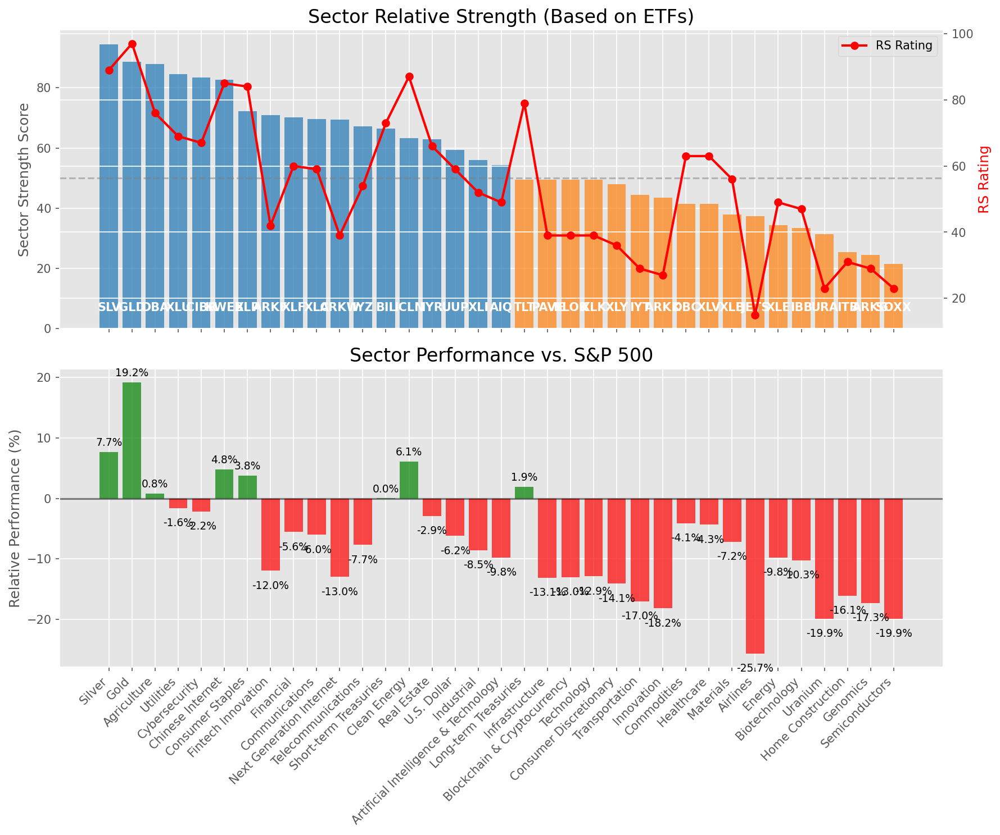

# **Daily Relative Strength Report**

**Date:** 2025-04-25

## **Market Valuation (Buffett Indicator)**

| Metric | Value |
|--------|-------|
| **Market Valuation** | **Fair Valued** |
| **Current Ratio** | 9.08 |
| **Historical Mean** | 9.56 |
| **Standard Deviation** | 0.52 |
| **Z-Score (StdDev from Mean)** | -1.00 |
| **Total Market Cap** | $270.01 trillion |
| **GDP** | $29.72 trillion |

## **Market Insights**

### **Market is Fairly Valued**

The market appears to be trading within a reasonable range of historical valuations. This suggests a balanced approach to equity investing is appropriate. Investors should:

- Focus on individual stock selection based on fundamentals and technicals
- Maintain normal equity allocations aligned with long-term goals
- Pay attention to sector rotation and relative strength
- Watch for changes in market leadership

Fair valuation typically suggests normal market returns can be expected, with stock selection becoming increasingly important.

### **Buffett Indicator Overview**

The Buffett Indicator (Total Market Cap / GDP) is a measure of the stock market's valuation relative to the size of the economy. It is named after Warren Buffett, who described it as "probably the best single measure of where valuations stand at any given moment."

- **Values above +2 standard deviations:** Market significantly overvalued
- **Values above +1 standard deviation:** Market overvalued
- **Values between -1 and +1 standard deviations:** Market fairly valued
- **Values below -1 standard deviation:** Market undervalued
- **Values below -2 standard deviations:** Market significantly undervalued

---

## **Sector Relative Strength**

Based on William O'Neil's Relative Strength Methodology

| ETF | Strength | RS Rating | Performance | Above Key MAs | Trend | Sector |
|-----|----------|-----------|-------------|--------------|-------|--------|
| [SLV](https://www.tradingview.com/chart/?symbol=SLV) | 94.5 | 89.0 | 7.53% | 10d ✓, 50d ✓, 200d ✓ | ↗️ | Silver |
| [GLD](https://www.tradingview.com/chart/?symbol=GLD) | 88.6 | 97.0 | 18.75% | 10d ✗, 50d ✓, 200d ✓ | ↗️ | Gold |
| [DBA](https://www.tradingview.com/chart/?symbol=DBA) | 88.0 | 76.0 | 0.72% | 10d ✓, 50d ✓, 200d ✓ | ↗️ | Agriculture |
| [XLU](https://www.tradingview.com/chart/?symbol=XLU) | 84.5 | 69.0 | -1.64% | 10d ✓, 50d ✓, 200d ✓ | ↗️ | Utilities |
| [CIBR](https://www.tradingview.com/chart/?symbol=CIBR) | 83.0 | 66.0 | -2.58% | 10d ✓, 50d ✓, 200d ✓ | ↗️ | Cybersecurity |
| [KWEB](https://www.tradingview.com/chart/?symbol=KWEB) | 82.6 | 85.0 | 4.34% | 10d ✓, 50d ✗, 200d ✓ | ↗️ | Chinese Internet |
| [XLP](https://www.tradingview.com/chart/?symbol=XLP) | 72.2 | 84.0 | 3.52% | 10d ✗, 50d ✗, 200d ✓ | ↗️ | Consumer Staples |
| [ARKF](https://www.tradingview.com/chart/?symbol=ARKF) | 71.0 | 42.0 | -12.16% | 10d ✓, 50d ✓, 200d ✓ | ↗️ | Fintech Innovation |
| [XLF](https://www.tradingview.com/chart/?symbol=XLF) | 70.6 | 61.0 | -5.67% | 10d ✓, 50d ✗, 200d ✓ | ↗️ | Financial |
| [XLC](https://www.tradingview.com/chart/?symbol=XLC) | 69.6 | 59.0 | -6.30% | 10d ✓, 50d ✗, 200d ✓ | ↗️ | Communications |
| [IYZ](https://www.tradingview.com/chart/?symbol=IYZ) | 67.1 | 54.0 | -7.94% | 10d ✓, 50d ✗, 200d ✓ | ↗️ | Telecommunications |
| [BIL](https://www.tradingview.com/chart/?symbol=BIL) | 66.5 | 73.0 | 0.01% | 10d ✓, 50d ✓, 200d ✓ | ↘️ | Short-term Treasuries |
| [ICLN](https://www.tradingview.com/chart/?symbol=ICLN) | 63.3 | 87.0 | 5.88% | 10d ✓, 50d ✓, 200d ✗ | ↘️ | Clean Energy |
| [IYR](https://www.tradingview.com/chart/?symbol=IYR) | 62.9 | 66.0 | -2.80% | 10d ✓, 50d ✗, 200d ✗ | ↗️ | Real Estate |
| [XLI](https://www.tradingview.com/chart/?symbol=XLI) | 55.9 | 52.0 | -8.80% | 10d ✓, 50d ✗, 200d ✗ | ↗️ | Industrial |
| [AIQ](https://www.tradingview.com/chart/?symbol=AIQ) | 53.9 | 48.0 | -10.23% | 10d ✓, 50d ✗, 200d ✗ | ↗️ | Artificial Intelligence & Technology |
| [TLT](https://www.tradingview.com/chart/?symbol=TLT) | 49.9 | 80.0 | 1.83% | 10d ✓, 50d ✗, 200d ✗ | ↘️ | Long-term Treasuries |
| [PAVE](https://www.tradingview.com/chart/?symbol=PAVE) | 48.9 | 38.0 | -13.44% | 10d ✓, 50d ✗, 200d ✗ | ↗️ | Infrastructure |
| [XLY](https://www.tradingview.com/chart/?symbol=XLY) | 47.9 | 36.0 | -14.45% | 10d ✓, 50d ✗, 200d ✗ | ↗️ | Consumer Discretionary |
| [IYT](https://www.tradingview.com/chart/?symbol=IYT) | 44.4 | 29.0 | -17.37% | 10d ✓, 50d ✗, 200d ✗ | ↗️ | Transportation |
| [ARKK](https://www.tradingview.com/chart/?symbol=ARKK) | 43.4 | 27.0 | -18.43% | 10d ✓, 50d ✗, 200d ✗ | ↗️ | Innovation |
| [DBC](https://www.tradingview.com/chart/?symbol=DBC) | 41.4 | 63.0 | -4.31% | 10d ✓, 50d ✗, 200d ✗ | ↘️ | Commodities |
| [XLV](https://www.tradingview.com/chart/?symbol=XLV) | 41.4 | 63.0 | -4.56% | 10d ✓, 50d ✗, 200d ✗ | ↘️ | Healthcare |
| [UUP](https://www.tradingview.com/chart/?symbol=UUP) | 39.4 | 59.0 | -6.27% | 10d ✓, 50d ✗, 200d ✗ | ↘️ | U.S. Dollar |
| [JETS](https://www.tradingview.com/chart/?symbol=JETS) | 37.4 | 15.0 | -25.92% | 10d ✓, 50d ✗, 200d ✗ | ↗️ | Airlines |
| [XLB](https://www.tradingview.com/chart/?symbol=XLB) | 37.4 | 55.0 | -7.67% | 10d ✓, 50d ✗, 200d ✗ | ↘️ | Materials |
| [XLE](https://www.tradingview.com/chart/?symbol=XLE) | 33.9 | 48.0 | -10.15% | 10d ✓, 50d ✗, 200d ✗ | ↘️ | Energy |
| [IBB](https://www.tradingview.com/chart/?symbol=IBB) | 33.4 | 47.0 | -10.49% | 10d ✓, 50d ✗, 200d ✗ | ↘️ | Biotechnology |
| [URA](https://www.tradingview.com/chart/?symbol=URA) | 31.3 | 23.0 | -20.14% | 10d ✓, 50d ✓, 200d ✗ | ↘️ | Uranium |
| [XLK](https://www.tradingview.com/chart/?symbol=XLK) | 29.4 | 39.0 | -13.28% | 10d ✓, 50d ✗, 200d ✗ | ↘️ | Technology |
| [ITB](https://www.tradingview.com/chart/?symbol=ITB) | 25.4 | 31.0 | -16.50% | 10d ✓, 50d ✗, 200d ✗ | ↘️ | Home Construction |
| [ARKG](https://www.tradingview.com/chart/?symbol=ARKG) | 23.9 | 28.0 | -17.71% | 10d ✓, 50d ✗, 200d ✗ | ↘️ | Genomics |
| [SOXX](https://www.tradingview.com/chart/?symbol=SOXX) | 21.4 | 23.0 | -20.17% | 10d ✓, 50d ✗, 200d ✗ | ↘️ | Semiconductors |
| [BLOK](https://www.tradingview.com/chart/?symbol=BLOK) | 0.0 | 0.0 | 0.00% | 10d ✗, 50d ✗, 200d ✗ | ↘️ | Blockchain & Cryptocurrency |
| [ARKW](https://www.tradingview.com/chart/?symbol=ARKW) | 0.0 | 0.0 | 0.00% | 10d ✗, 50d ✗, 200d ✗ | ↘️ | Next Generation Internet |

### **Sector ETF Performance Interpretation**

This table shows the relative strength metrics for different market sectors based on their representative ETFs:

- **ETF**: The ETF used to measure sector performance (click for chart)
- **Strength**: Overall sector strength score (0-100) combining multiple factors
- **RS Rating**: O'Neil RS rating of the sector ETF
- **Performance**: Performance of the sector ETF relative to SPY
- **Above Key MAs**: Whether the ETF is trading above its 10, 50, and 200-day moving averages
- **Trend**: Whether the sector is in an uptrend (↗️) or downtrend (↘️)

### **Current Sector Leadership**

The current market leadership is coming from the following sectors: **Silver, Gold, Agriculture**.

The **Silver** sector (represented by **SLV**) is showing particularly strong relative strength with an RS rating of 89.0 and performance of 7.53% vs. the S&P 500. This sector is trading above its 10-day, 50-day, 200-day moving average(s). Investors should consider focusing on high RS stocks within these leading sectors for potential outperformance.

---

## **Buy Recommendations**

The following 63 stocks show exceptional relative strength:

| RS Rating | Buy Score | Current Price | Chart | Name | Ticker |
|-----------|-----------|---------------|-------|------|--------|
| 100 | 100 | $110.88 | [Chart](https://www.tradingview.com/chart/?symbol=PLTR) | Palantir Technologies Inc. Class A Common Stock | PLTR |
| 99 | 100 | $274.65 | [Chart](https://www.tradingview.com/chart/?symbol=VRSN) | VeriSign Inc | VRSN |
| 99 | 100 | $25.64 | [Chart](https://www.tradingview.com/chart/?symbol=DB) | Deutsche Bank Aktiengesellschaft | DB |
| 99 | 100 | $16.34 | [Chart](https://www.tradingview.com/chart/?symbol=EZPW) | Ezcorp Inc | EZPW |
| 99 | 100 | $170.04 | [Chart](https://www.tradingview.com/chart/?symbol=PM) | Philip Morris International Inc. | PM |
| 99 | 100 | $40.87 | [Chart](https://www.tradingview.com/chart/?symbol=TGTX) | TG Therapeutics, Inc. | TGTX |
| 99 | 100 | $25.27 | [Chart](https://www.tradingview.com/chart/?symbol=TGI) | Triumph Group, Inc. | TGI |
| 98 | 100 | $87.15 | [Chart](https://www.tradingview.com/chart/?symbol=SNEX) | StoneX Group Inc. Common Stock | SNEX |
| 98 | 100 | $224.49 | [Chart](https://www.tradingview.com/chart/?symbol=TTWO) | Take-Two Interactive Software Inc | TTWO |
| 98 | 100 | $70.37 | [Chart](https://www.tradingview.com/chart/?symbol=WRB) | W.R. Berkley Corporation | WRB |
| 98 | 100 | $23.49 | [Chart](https://www.tradingview.com/chart/?symbol=OR) | Osisko Gold Royalties Ltd | OR |
| 98 | 100 | $616.95 | [Chart](https://www.tradingview.com/chart/?symbol=SPOT) | Spotify Technology S.A. | SPOT |
| 97 | 100 | $70.92 | [Chart](https://www.tradingview.com/chart/?symbol=CORT) | Corcept Therapeutics Inc. | CORT |
| 97 | 100 | $113.67 | [Chart](https://www.tradingview.com/chart/?symbol=EHC) | Encompass Health Corporation Common Stock | EHC |
| 97 | 100 | $42.80 | [Chart](https://www.tradingview.com/chart/?symbol=MRX) | Marex Group plc Ordinary Shares | MRX |
| 97 | 100 | $65.66 | [Chart](https://www.tradingview.com/chart/?symbol=VRNA) | Verona Pharma plc | VRNA |
| 96 | 100 | $29.70 | [Chart](https://www.tradingview.com/chart/?symbol=EUFN) | iShares MSCI Europe Financials ETF | EUFN |
| 96 | 100 | $25.00 | [Chart](https://www.tradingview.com/chart/?symbol=MP) | MP Materials Corp. | MP |
| 96 | 100 | $48.67 | [Chart](https://www.tradingview.com/chart/?symbol=GFL) | GFL Environmental Inc. Subordinate Voting Shares | GFL |
| 95 | 100 | $167.25 | [Chart](https://www.tradingview.com/chart/?symbol=SFM) | Sprouts Farmers Market, Inc. | SFM |
| 95 | 100 | $529.13 | [Chart](https://www.tradingview.com/chart/?symbol=BRK.B) | BERKSHIRE HATHAWAY Class B | BRK.B |
| 94 | 100 | $39.30 | [Chart](https://www.tradingview.com/chart/?symbol=EWG) | iShares MSCI Germany ETF | EWG |
| 94 | 100 | $16.49 | [Chart](https://www.tradingview.com/chart/?symbol=SPNT) | SiriusPoint Ltd. | SPNT |
| 94 | 100 | $1100.42 | [Chart](https://www.tradingview.com/chart/?symbol=NFLX) | NetFlix Inc | NFLX |
| 94 | 100 | $265.93 | [Chart](https://www.tradingview.com/chart/?symbol=CME) | CME Group Inc. | CME |
| 94 | 100 | $134.80 | [Chart](https://www.tradingview.com/chart/?symbol=DTE) | DTE Energy Company | DTE |
| 94 | 100 | $78.13 | [Chart](https://www.tradingview.com/chart/?symbol=OGS) | ONE GAS, INC. | OGS |
| 94 | 100 | $117.44 | [Chart](https://www.tradingview.com/chart/?symbol=COOP) | Mr. Cooper Group Inc. Common Stock | COOP |
| 94 | 100 | $78.03 | [Chart](https://www.tradingview.com/chart/?symbol=NFG) | National Fuel Gas Co. | NFG |
| 94 | 100 | $68.33 | [Chart](https://www.tradingview.com/chart/?symbol=VTR) | Ventas, Inc. | VTR |
| 93 | 100 | $77.28 | [Chart](https://www.tradingview.com/chart/?symbol=SR) | Spire Inc. | SR |
| 93 | 100 | $173.42 | [Chart](https://www.tradingview.com/chart/?symbol=DGX) | Quest Diagnostics Inc. | DGX |
| 92 | 100 | $44.00 | [Chart](https://www.tradingview.com/chart/?symbol=NWN) | Northwest Natural Holding Company | NWN |
| 92 | 100 | $36.05 | [Chart](https://www.tradingview.com/chart/?symbol=PPL) | PPL Corporation | PPL |
| 92 | 100 | $34.34 | [Chart](https://www.tradingview.com/chart/?symbol=FDP) | Fresh Del Monte Produce Inc. | FDP |
| 92 | 100 | $63.71 | [Chart](https://www.tradingview.com/chart/?symbol=RYTM) | Rhythm Pharmaceuticals, Inc. Common Stock | RYTM |
| 91 | 100 | $55.99 | [Chart](https://www.tradingview.com/chart/?symbol=HSBC) | HSBC Holdings PLC | HSBC |
| 91 | 100 | $299.22 | [Chart](https://www.tradingview.com/chart/?symbol=PEN) | Penumbra, Inc. | PEN |
| 91 | 100 | $31.11 | [Chart](https://www.tradingview.com/chart/?symbol=LTH) | Life Time Group Holdings, Inc. | LTH |
| 91 | 100 | $53.30 | [Chart](https://www.tradingview.com/chart/?symbol=RELX) | RELX PLC | RELX |
| 90 | 100 | $32.78 | [Chart](https://www.tradingview.com/chart/?symbol=UGI) | UGI Corporation | UGI |
| 89 | 100 | $57.07 | [Chart](https://www.tradingview.com/chart/?symbol=ULS) | UL Solutions Inc. | ULS |
| 89 | 100 | $67.96 | [Chart](https://www.tradingview.com/chart/?symbol=EVRG) | Evergy, Inc. | EVRG |
| 89 | 100 | $31.06 | [Chart](https://www.tradingview.com/chart/?symbol=AHR) | American Healthcare REIT, Inc. | AHR |
| 89 | 100 | $15.73 | [Chart](https://www.tradingview.com/chart/?symbol=BCS) | Barclays PLC | BCS |
| 89 | 100 | $258.82 | [Chart](https://www.tradingview.com/chart/?symbol=TRV) | The Travelers Companies, Inc. | TRV |
| 88 | 100 | $137.22 | [Chart](https://www.tradingview.com/chart/?symbol=CAH) | Cardinal Health, Inc. | CAH |
| 87 | 100 | $18.64 | [Chart](https://www.tradingview.com/chart/?symbol=KT) | KT Corp. | KT |
| 85 | 100 | $39.42 | [Chart](https://www.tradingview.com/chart/?symbol=NI) | NiSource Inc. | NI |
| 87 | 98 | $174.95 | [Chart](https://www.tradingview.com/chart/?symbol=LOPE) | Grand Canyon Education, Inc | LOPE |
| 85 | 98 | $44.97 | [Chart](https://www.tradingview.com/chart/?symbol=OGE) | OGE Energy Corp. | OGE |
| 85 | 98 | $78.44 | [Chart](https://www.tradingview.com/chart/?symbol=UNM) | Unum Group | UNM |
| 86 | 96 | $124.11 | [Chart](https://www.tradingview.com/chart/?symbol=BECN) | Beacon Roofing Supply, Inc. | BECN |
| 86 | 96 | $49.25 | [Chart](https://www.tradingview.com/chart/?symbol=NJR) | New Jersey Resources Corp | NJR |
| 84 | 96 | $67.09 | [Chart](https://www.tradingview.com/chart/?symbol=EBAY) | eBay Inc | EBAY |
| 82 | 96 | $84.72 | [Chart](https://www.tradingview.com/chart/?symbol=ETR) | Entergy Corporation | ETR |
| 85 | 95 | $368.13 | [Chart](https://www.tradingview.com/chart/?symbol=MSTR) | MicroStrategy Inc | MSTR |
| 83 | 94 | $92.80 | [Chart](https://www.tradingview.com/chart/?symbol=DAVE) | Dave Inc. Class A Common Stock | DAVE |
| 84 | 93 | $22.07 | [Chart](https://www.tradingview.com/chart/?symbol=CXW) | CoreCivic, Inc. | CXW |
| 82 | 93 | $50.02 | [Chart](https://www.tradingview.com/chart/?symbol=VTIP) | Vanguard Short-Term Inflation-Protected Securities Index Fund | VTIP |
| 80 | 93 | $36.54 | [Chart](https://www.tradingview.com/chart/?symbol=TDS) | Telephone and Data Systems Inc. | TDS |
| 82 | 92 | $39.73 | [Chart](https://www.tradingview.com/chart/?symbol=FHI) | Federated Hermes, Inc. | FHI |
| 82 | 92 | $164.49 | [Chart](https://www.tradingview.com/chart/?symbol=CVLT) | Commault Systems, Inc. | CVLT |

---

## **Sell Recommendations**

The following 143 stocks show deteriorating relative strength:

| RS Rating | Sell Score | Current Price | Chart | Name | Ticker |
|-----------|------------|---------------|-------|------|--------|
| 1 | 100 | $10.85 | [Chart](https://www.tradingview.com/chart/?symbol=AMRC) | Ameresco, Inc. | AMRC |
| 1 | 100 | $15.66 | [Chart](https://www.tradingview.com/chart/?symbol=VTLE) | Vital Energy, Inc. | VTLE |
| 1 | 100 | $10.03 | [Chart](https://www.tradingview.com/chart/?symbol=FLYW) | Flywire Corporation Voting Common Stock | FLYW |
| 2 | 100 | $17.77 | [Chart](https://www.tradingview.com/chart/?symbol=TNDM) | Tandem Diabetes Care, Inc. | TNDM |
| 2 | 100 | $26.66 | [Chart](https://www.tradingview.com/chart/?symbol=AZTA) | Azenta, Inc. | AZTA |
| 3 | 100 | $76.72 | [Chart](https://www.tradingview.com/chart/?symbol=ILMN) | Illumina Inc | ILMN |
| 3 | 100 | $16.89 | [Chart](https://www.tradingview.com/chart/?symbol=SSTK) | SHUTTERSTOCK, INC. | SSTK |
| 3 | 100 | $13.04 | [Chart](https://www.tradingview.com/chart/?symbol=ODP) | The ODP Corporation Common Stock | ODP |
| 3 | 100 | $54.66 | [Chart](https://www.tradingview.com/chart/?symbol=LABU) | Direxion Daily S&P Biotech Bull 3X Shares | LABU |
| 3 | 100 | $18.45 | [Chart](https://www.tradingview.com/chart/?symbol=DAVA) | Endava plc American Depositary Shares (each representing one Class A Ordinary Share) | DAVA |
| 4 | 100 | $102.43 | [Chart](https://www.tradingview.com/chart/?symbol=BOOT) | Boot Barn Holdings, Inc. | BOOT |
| 4 | 100 | $29.15 | [Chart](https://www.tradingview.com/chart/?symbol=W) | Wayfair Inc. | W |
| 5 | 100 | $13.25 | [Chart](https://www.tradingview.com/chart/?symbol=ARWR) | Arrowhead Research Corporation | ARWR |
| 5 | 100 | $13.18 | [Chart](https://www.tradingview.com/chart/?symbol=GCT) | GigaCloud Technology Inc Class A Ordinary Shares | GCT |
| 5 | 100 | $22.74 | [Chart](https://www.tradingview.com/chart/?symbol=NSSC) | Napco Security Technologies, Inc | NSSC |
| 5 | 100 | $23.87 | [Chart](https://www.tradingview.com/chart/?symbol=RPD) | Rapid7, Inc. Common Stock | RPD |
| 6 | 100 | $16.52 | [Chart](https://www.tradingview.com/chart/?symbol=IART) | Integra LifeSciences Holdings | IART |
| 6 | 100 | $14.91 | [Chart](https://www.tradingview.com/chart/?symbol=MEG) | Montrose Environmental Group, Inc. | MEG |
| 6 | 100 | $73.96 | [Chart](https://www.tradingview.com/chart/?symbol=MKSI) | MKS Instruments Inc | MKSI |
| 6 | 100 | $12.49 | [Chart](https://www.tradingview.com/chart/?symbol=IMXI) | International Money Express, Inc. | IMXI |
| 6 | 100 | $21.29 | [Chart](https://www.tradingview.com/chart/?symbol=SPT) | Sprout Social, Inc Class A Common Stock | SPT |
| 6 | 100 | $32.61 | [Chart](https://www.tradingview.com/chart/?symbol=SCSC) | Scansource Inc | SCSC |
| 6 | 100 | $19.14 | [Chart](https://www.tradingview.com/chart/?symbol=SG) | Sweetgreen, Inc. | SG |
| 8 | 100 | $13.26 | [Chart](https://www.tradingview.com/chart/?symbol=DV) | DoubleVerify Holdings, Inc. | DV |
| 9 | 100 | $18.83 | [Chart](https://www.tradingview.com/chart/?symbol=AMN) | AMN Healthcare Services | AMN |
| 9 | 100 | $14.76 | [Chart](https://www.tradingview.com/chart/?symbol=TEVA) | Teva Pharmaceutical Industries Limited American Depositary Shares | TEVA |
| 10 | 100 | $113.01 | [Chart](https://www.tradingview.com/chart/?symbol=ARM) | Arm Holdings plc American Depositary Shares | ARM |
| 11 | 100 | $21.97 | [Chart](https://www.tradingview.com/chart/?symbol=SYM) | Symbotic Inc. Class A Common Stock | SYM |
| 11 | 100 | $13.68 | [Chart](https://www.tradingview.com/chart/?symbol=XRAY) | DENTSPLY SIRONA Inc. | XRAY |
| 12 | 100 | $10.77 | [Chart](https://www.tradingview.com/chart/?symbol=SONO) | Sonos, Inc. Common Stock | SONO |
| 12 | 100 | $20.91 | [Chart](https://www.tradingview.com/chart/?symbol=FOXF) | Fox Factory Holding Corp. Common Stock | FOXF |
| 12 | 100 | $12.81 | [Chart](https://www.tradingview.com/chart/?symbol=ARCT) | Arcturus Therapeutics Holdings Inc. Common Stock | ARCT |
| 12 | 100 | $12.69 | [Chart](https://www.tradingview.com/chart/?symbol=TRIP) | TripAdvisor, Inc. | TRIP |
| 13 | 100 | $120.42 | [Chart](https://www.tradingview.com/chart/?symbol=BLDR) | Builders FirstSource, Inc. | BLDR |
| 15 | 100 | $21.16 | [Chart](https://www.tradingview.com/chart/?symbol=ST) | Sensata Technologies Holding plc | ST |
| 9 | 99 | $56.44 | [Chart](https://www.tradingview.com/chart/?symbol=SYNA) | Synaptics Inc | SYNA |
| 9 | 99 | $21.59 | [Chart](https://www.tradingview.com/chart/?symbol=TDC) | TERADATA CORPORATION | TDC |
| 9 | 99 | $35.50 | [Chart](https://www.tradingview.com/chart/?symbol=CRC) | California Resources Corporation | CRC |
| 20 | 99 | $12.17 | [Chart](https://www.tradingview.com/chart/?symbol=MED) | Medifast, Inc. | MED |
| 2 | 98 | $108.93 | [Chart](https://www.tradingview.com/chart/?symbol=DECK) | Deckers Outdoor Corp | DECK |
| 14 | 98 | $16.98 | [Chart](https://www.tradingview.com/chart/?symbol=MNSO) | MINISO Group Holding Limited American Depositary Shares, each representing four Ordinary Shares | MNSO |
| 6 | 97 | $45.55 | [Chart](https://www.tradingview.com/chart/?symbol=PSTG) | Pure Storage, Inc. Class A | PSTG |
| 9 | 97 | $11.79 | [Chart](https://www.tradingview.com/chart/?symbol=MBC) | MasterBrand, Inc. | MBC |
| 11 | 97 | $87.94 | [Chart](https://www.tradingview.com/chart/?symbol=NTAP) | NetApp, Inc | NTAP |
| 13 | 97 | $25.14 | [Chart](https://www.tradingview.com/chart/?symbol=RNG) | RINGCENTRAL, INC. | RNG |
| 15 | 97 | $62.15 | [Chart](https://www.tradingview.com/chart/?symbol=SPB) | Spectrum Brands Holdings, Inc. | SPB |
| 18 | 97 | $28.79 | [Chart](https://www.tradingview.com/chart/?symbol=YETI) | YETI Holdings, Inc. Common Stock | YETI |
| 8 | 96 | $10.24 | [Chart](https://www.tradingview.com/chart/?symbol=LSPD) | Lightspeed Commerce Inc. | LSPD |
| 20 | 96 | $11.54 | [Chart](https://www.tradingview.com/chart/?symbol=JAMF) | Jamf Holding Corp. Common Stock | JAMF |
| 9 | 95 | $30.55 | [Chart](https://www.tradingview.com/chart/?symbol=UWM) | ProShares Ultra Russell2000 | UWM |
| 10 | 95 | $22.54 | [Chart](https://www.tradingview.com/chart/?symbol=AI) | C3.ai, Inc. | AI |
| 13 | 95 | $13.03 | [Chart](https://www.tradingview.com/chart/?symbol=DK) | Delek US Holdings, Inc. | DK |
| 17 | 95 | $30.58 | [Chart](https://www.tradingview.com/chart/?symbol=DOCN) | DigitalOcean Holdings, Inc. | DOCN |
| 6 | 94 | $24.95 | [Chart](https://www.tradingview.com/chart/?symbol=TRN) | Trinity Industries, Inc. | TRN |
| 15 | 94 | $12.27 | [Chart](https://www.tradingview.com/chart/?symbol=OSCR) | Oscar Health, Inc. | OSCR |
| 18 | 94 | $11.34 | [Chart](https://www.tradingview.com/chart/?symbol=HPK) | HighPeak Energy, Inc. Common Stock | HPK |
| 28 | 93 | $14.35 | [Chart](https://www.tradingview.com/chart/?symbol=FXN) | First Trust Energy AlphaDEX Fund | FXN |
| 10 | 92 | $29.51 | [Chart](https://www.tradingview.com/chart/?symbol=SPHR) | Sphere Entertainment Co. | SPHR |
| 14 | 92 | $54.88 | [Chart](https://www.tradingview.com/chart/?symbol=NVT) | nVent Electric plc Ordinary Shares | NVT |
| 16 | 92 | $96.09 | [Chart](https://www.tradingview.com/chart/?symbol=BCC) | Boise Cascade Company | BCC |
| 18 | 92 | $34.59 | [Chart](https://www.tradingview.com/chart/?symbol=OVV) | Ovintiv Inc. | OVV |
| 20 | 92 | $25.86 | [Chart](https://www.tradingview.com/chart/?symbol=GDEN) | Golden Entertainment, Inc. Common Stock | GDEN |
| 23 | 92 | $12.19 | [Chart](https://www.tradingview.com/chart/?symbol=PR) | Permian Resources Corporation | PR |
| 15 | 91 | $40.09 | [Chart](https://www.tradingview.com/chart/?symbol=TWST) | Twist Bioscience Corporation Common Stock | TWST |
| 22 | 91 | $40.45 | [Chart](https://www.tradingview.com/chart/?symbol=CYTK) | Cytokinetics Inc. | CYTK |
| 12 | 90 | $10.31 | [Chart](https://www.tradingview.com/chart/?symbol=VREX) | Varex Imaging Corporation Common Stock | VREX |
| 13 | 90 | $15.28 | [Chart](https://www.tradingview.com/chart/?symbol=DXC) | DXC Technology Company | DXC |
| 14 | 90 | $46.51 | [Chart](https://www.tradingview.com/chart/?symbol=CXT) | Crane NXT, Co. | CXT |
| 20 | 90 | $30.08 | [Chart](https://www.tradingview.com/chart/?symbol=CDRE) | Cadre Holdings, Inc. | CDRE |
| 21 | 90 | $58.08 | [Chart](https://www.tradingview.com/chart/?symbol=TREX) | Trex Company, Inc. | TREX |
| 23 | 90 | $37.25 | [Chart](https://www.tradingview.com/chart/?symbol=STNG) | Scorpio Tankers Inc. | STNG |
| 12 | 89 | $112.87 | [Chart](https://www.tradingview.com/chart/?symbol=GNRC) | GENERAC HOLDINGS INC | GNRC |
| 12 | 89 | $100.93 | [Chart](https://www.tradingview.com/chart/?symbol=DDOG) | Datadog, Inc. Class A Common Stock | DDOG |
| 20 | 89 | $12.61 | [Chart](https://www.tradingview.com/chart/?symbol=BAND) | Bandwidth Inc. Class A Common Stock | BAND |
| 21 | 89 | $68.12 | [Chart](https://www.tradingview.com/chart/?symbol=TTC) | Toro Company (The) | TTC |
| 22 | 89 | $11.41 | [Chart](https://www.tradingview.com/chart/?symbol=KELYA) | Kelly Services Inc | KELYA |
| 26 | 89 | $79.41 | [Chart](https://www.tradingview.com/chart/?symbol=AKAM) | Akamai Technologies Inc | AKAM |
| 18 | 88 | $48.45 | [Chart](https://www.tradingview.com/chart/?symbol=ERX) | Direxion Daily Energy Bull 2X Shares | ERX |
| 18 | 88 | $12.21 | [Chart](https://www.tradingview.com/chart/?symbol=KRP) | Kimbell Royalty Partners, LP Common Units representing Limited Partner Interests | KRP |
| 18 | 88 | $210.22 | [Chart](https://www.tradingview.com/chart/?symbol=FDX) | FedEx Corporation | FDX |
| 22 | 88 | $53.38 | [Chart](https://www.tradingview.com/chart/?symbol=IIPR) | Innovative Industrial Properties, Inc. Common stock | IIPR |
| 25 | 88 | $50.07 | [Chart](https://www.tradingview.com/chart/?symbol=POWI) | Power Integrations Inc | POWI |
| 19 | 87 | $11.82 | [Chart](https://www.tradingview.com/chart/?symbol=APLE) | Apple Hospitality REIT, Inc. | APLE |
| 21 | 87 | $11.69 | [Chart](https://www.tradingview.com/chart/?symbol=MRC) | MRC GLOBAL INC. | MRC |
| 28 | 87 | $23.36 | [Chart](https://www.tradingview.com/chart/?symbol=HOG) | Harley-Davidson, Inc. | HOG |
| 19 | 86 | $27.47 | [Chart](https://www.tradingview.com/chart/?symbol=SEE) | Sealed Air Corp. | SEE |
| 24 | 86 | $94.41 | [Chart](https://www.tradingview.com/chart/?symbol=CHRD) | Chord Energy Corporation Common Stock | CHRD |
| 26 | 86 | $45.42 | [Chart](https://www.tradingview.com/chart/?symbol=EXAS) | Exact Sciences Corp | EXAS |
| 30 | 86 | $10.34 | [Chart](https://www.tradingview.com/chart/?symbol=CMRE) | Costamare Inc. | CMRE |
| 18 | 85 | $25.26 | [Chart](https://www.tradingview.com/chart/?symbol=HPQ) | HP Inc. | HPQ |
| 25 | 85 | $11.79 | [Chart](https://www.tradingview.com/chart/?symbol=NAVI) | Navient Corporation | NAVI |
| 19 | 84 | $28.67 | [Chart](https://www.tradingview.com/chart/?symbol=MBUU) | Malibu Boats, Inc. Class A | MBUU |
| 19 | 84 | $62.55 | [Chart](https://www.tradingview.com/chart/?symbol=PLUS) | ePlus Inc | PLUS |
| 20 | 84 | $50.18 | [Chart](https://www.tradingview.com/chart/?symbol=RDNT) | RadNet, Inc. Common Stock | RDNT |
| 27 | 84 | $167.44 | [Chart](https://www.tradingview.com/chart/?symbol=IBP) | INSTALLED BUILDING PRODUCTS, INC. | IBP |
| 33 | 84 | $11.30 | [Chart](https://www.tradingview.com/chart/?symbol=ABR) | Arbor Realty Trust, Inc. | ABR |
| 37 | 84 | $16.52 | [Chart](https://www.tradingview.com/chart/?symbol=TRMD) | TORM plc Class A Common Stock | TRMD |
| 18 | 83 | $73.64 | [Chart](https://www.tradingview.com/chart/?symbol=AGYS) | Agilysys, Inc. Common Stock (DE) | AGYS |
| 19 | 83 | $33.06 | [Chart](https://www.tradingview.com/chart/?symbol=AVNT) | Avient Corporation | AVNT |
| 24 | 83 | $74.84 | [Chart](https://www.tradingview.com/chart/?symbol=IR) | Ingersoll Rand Inc. Common Stock | IR |
| 25 | 83 | $11.80 | [Chart](https://www.tradingview.com/chart/?symbol=OEC) | Orion S.A. | OEC |
| 30 | 83 | $12.91 | [Chart](https://www.tradingview.com/chart/?symbol=WDS) | Woodside Energy Group Limited American Depositary Shares, each representing one Ordinary Share | WDS |
| 32 | 83 | $26.78 | [Chart](https://www.tradingview.com/chart/?symbol=COLL) | Collegium Pharmaceutical, Inc. Common Stock | COLL |
| 23 | 82 | $53.49 | [Chart](https://www.tradingview.com/chart/?symbol=KBH) | KB Home | KBH |
| 26 | 82 | $11.13 | [Chart](https://www.tradingview.com/chart/?symbol=SHC) | Sotera Health Company Common Stock | SHC |
| 30 | 81 | $35.35 | [Chart](https://www.tradingview.com/chart/?symbol=IAC) | IAC Inc. Common Stock | IAC |
| 26 | 80 | $160.96 | [Chart](https://www.tradingview.com/chart/?symbol=WCC) | Wesco International Inc. | WCC |
| 27 | 80 | $13.81 | [Chart](https://www.tradingview.com/chart/?symbol=HST) | Host Hotels & Resorts, Inc. | HST |
| 28 | 80 | $22.29 | [Chart](https://www.tradingview.com/chart/?symbol=ARKG) | ARK Genomic Revolution ETF | ARKG |
| 30 | 80 | $15.04 | [Chart](https://www.tradingview.com/chart/?symbol=DQ) | Daqo New Energy Corp. American Depositary Shares (each representing 5 Ordinary Shares) | DQ |
| 32 | 80 | $15.24 | [Chart](https://www.tradingview.com/chart/?symbol=PSFE) | Paysafe Limited | PSFE |
| 34 | 80 | $33.10 | [Chart](https://www.tradingview.com/chart/?symbol=PZZA) | Papa John's International Inc | PZZA |
| 24 | 79 | $76.69 | [Chart](https://www.tradingview.com/chart/?symbol=WD) | Walker & Dunlop, Inc. | WD |
| 29 | 79 | $11.87 | [Chart](https://www.tradingview.com/chart/?symbol=CIM) | Chimera Investment Corp. | CIM |
| 25 | 78 | $19.36 | [Chart](https://www.tradingview.com/chart/?symbol=KMT) | Kennametal Inc. | KMT |
| 31 | 78 | $12.77 | [Chart](https://www.tradingview.com/chart/?symbol=MTUS) | Metallus Inc. | MTUS |
| 33 | 77 | $14.22 | [Chart](https://www.tradingview.com/chart/?symbol=ZIM) | ZIM Integrated Shipping Services Ltd. | ZIM |
| 35 | 77 | $302.42 | [Chart](https://www.tradingview.com/chart/?symbol=BLD) | TopBuild Corp. Common Stock | BLD |
| 32 | 76 | $32.58 | [Chart](https://www.tradingview.com/chart/?symbol=CRNX) | Crinetics Pharmaceuticals, Inc. | CRNX |
| 33 | 76 | $68.02 | [Chart](https://www.tradingview.com/chart/?symbol=XRT) | SPDR S&P Retail ETF | XRT |
| 39 | 76 | $10.90 | [Chart](https://www.tradingview.com/chart/?symbol=GSBD) | Goldman Sachs BDC, Inc. | GSBD |
| 28 | 75 | $16.62 | [Chart](https://www.tradingview.com/chart/?symbol=MLNK) | MeridianLink, Inc. | MLNK |
| 30 | 75 | $18.30 | [Chart](https://www.tradingview.com/chart/?symbol=ELVN) | Enliven Therapeutics, Inc. Common Stock | ELVN |
| 31 | 75 | $188.09 | [Chart](https://www.tradingview.com/chart/?symbol=RGA) | Reinsurance Group of America, Incorporated | RGA |
| 34 | 75 | $61.92 | [Chart](https://www.tradingview.com/chart/?symbol=HAE) | Haemonetics Corporation | HAE |
| 35 | 75 | $51.67 | [Chart](https://www.tradingview.com/chart/?symbol=LW) | Lamb Weston Holdings, Inc. | LW |
| 31 | 74 | $21.14 | [Chart](https://www.tradingview.com/chart/?symbol=MGY) | Magnolia Oil & Gas Corporation Class A Common Stock | MGY |
| 31 | 73 | $90.81 | [Chart](https://www.tradingview.com/chart/?symbol=ITB) | iShares U.S. Home Construction ETF | ITB |
| 34 | 73 | $17.90 | [Chart](https://www.tradingview.com/chart/?symbol=HTGC) | Hercules Capital, Inc. | HTGC |
| 38 | 73 | $28.21 | [Chart](https://www.tradingview.com/chart/?symbol=BWA) | BorgWarner Inc. | BWA |
| 34 | 72 | $29.43 | [Chart](https://www.tradingview.com/chart/?symbol=IONS) | Ionis Pharmaceuticals, Inc. Common Stock | IONS |
| 37 | 72 | $121.56 | [Chart](https://www.tradingview.com/chart/?symbol=J) | Jacobs Solutions Inc. | J |
| 29 | 71 | $28.49 | [Chart](https://www.tradingview.com/chart/?symbol=BOTZ) | Global X Funds Global X Robotics & Artificial Intelligence ETF | BOTZ |
| 30 | 71 | $24.95 | [Chart](https://www.tradingview.com/chart/?symbol=WY) | Weyerhaeuser Company | WY |
| 32 | 71 | $93.23 | [Chart](https://www.tradingview.com/chart/?symbol=XHB) | SPDR S&P Homebuilders ETF | XHB |
| 33 | 71 | $43.77 | [Chart](https://www.tradingview.com/chart/?symbol=PRKS) | United Parks & Resorts Inc. | PRKS |
| 38 | 71 | $29.74 | [Chart](https://www.tradingview.com/chart/?symbol=AGIO) | Agios Pharmaceuticals, Inc. | AGIO |
| 36 | 69 | $143.84 | [Chart](https://www.tradingview.com/chart/?symbol=IWN) | iShares Russell 2000 Value ETF | IWN |
| 37 | 69 | $187.93 | [Chart](https://www.tradingview.com/chart/?symbol=NDSN) | Nordson Corp | NDSN |
| 35 | 68 | $112.53 | [Chart](https://www.tradingview.com/chart/?symbol=EOG) | EOG Resources, Inc. | EOG |
| 37 | 68 | $248.30 | [Chart](https://www.tradingview.com/chart/?symbol=ROK) | Rockwell Automation, Inc. | ROK |
| 37 | 65 | $52.78 | [Chart](https://www.tradingview.com/chart/?symbol=ALRM) | Alarm.com Holdings, Inc. | ALRM |
| 39 | 64 | $31.83 | [Chart](https://www.tradingview.com/chart/?symbol=AXTA) | Axalta Coating Systems Ltd. | AXTA |

## **Methodology**

This report uses William O'Neil's relative strength methodology from Investors Business Daily:

* **RS Rating**: Percentile rank of stock's performance vs. S&P 500 over the past 63 trading days (1-99 scale)
* **Buy Criteria**: RS Rating >= 80, price above 50-day MA, strong uptrend, increasing volume
* **Sell Criteria**: RS Rating < 40, price below 50-day MA, downtrend, decreasing volume

### **O'Neil's Key Principles**

1. **Focus on relative performance** - stocks outperforming the market
2. **Price trend confirmation** - stock must be in an uptrend
3. **Volume confirmation** - strong volume supports price moves
4. **Moving average validation** - price above key moving averages
5. **Market leaders only** - concentrate on top-performing stocks

*Report generated automatically after market close*