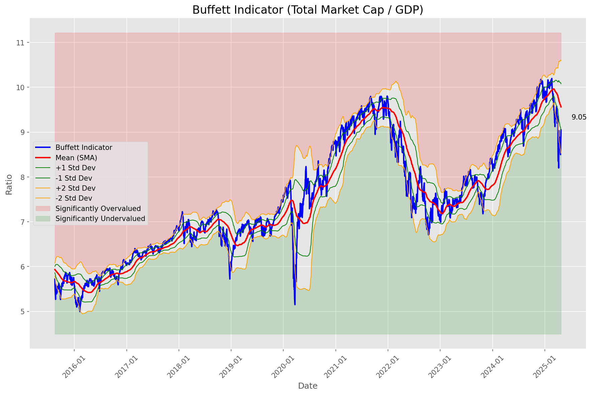
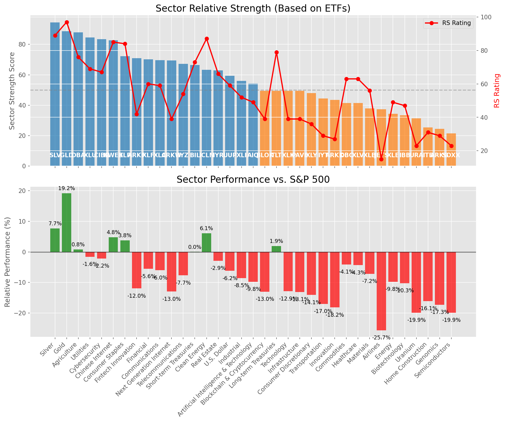

# **Daily Relative Strength Report**

**Date:** 2025-04-26

## **Market Valuation (Buffett Indicator)**

| Metric | Value |
|--------|-------|
| **Market Valuation** | **Fair Valued** |
| **Current Ratio** | 9.11 |
| **Historical Mean** | 9.56 |
| **Standard Deviation** | 0.52 |
| **Z-Score (StdDev from Mean)** | -1.00 |
| **Total Market Cap** | $270.64 trillion |
| **GDP** | $29.72 trillion |

## **Market Insights**

### **Market is Fairly Valued**

The market appears to be trading within a reasonable range of historical valuations. This suggests a balanced approach to equity investing is appropriate. Investors should:

- Focus on individual stock selection based on fundamentals and technicals
- Maintain normal equity allocations aligned with long-term goals
- Pay attention to sector rotation and relative strength
- Watch for changes in market leadership

Fair valuation typically suggests normal market returns can be expected, with stock selection becoming increasingly important.

### **Buffett Indicator Overview**

The Buffett Indicator (Total Market Cap / GDP) is a measure of the stock market's valuation relative to the size of the economy. It is named after Warren Buffett, who described it as "probably the best single measure of where valuations stand at any given moment."

- **Values above +2 standard deviations:** Market significantly overvalued
- **Values above +1 standard deviation:** Market overvalued
- **Values between -1 and +1 standard deviations:** Market fairly valued
- **Values below -1 standard deviation:** Market undervalued
- **Values below -2 standard deviations:** Market significantly undervalued

---

## **Sector Relative Strength**

Based on William O'Neil's Relative Strength Methodology

| ETF | Strength | RS Rating | Performance | Above Key MAs | Trend | Sector |
|-----|----------|-----------|-------------|--------------|-------|--------|
| [SLV](https://www.tradingview.com/chart/?symbol=SLV) | 94.5 | 89.0 | 7.67% | 10d ✓, 50d ✓, 200d ✓ | ↗️ | Silver |
| [GLD](https://www.tradingview.com/chart/?symbol=GLD) | 88.6 | 97.0 | 19.20% | 10d ✗, 50d ✓, 200d ✓ | ↗️ | Gold |
| [DBA](https://www.tradingview.com/chart/?symbol=DBA) | 88.0 | 76.0 | 0.81% | 10d ✓, 50d ✓, 200d ✓ | ↗️ | Agriculture |
| [XLU](https://www.tradingview.com/chart/?symbol=XLU) | 84.5 | 69.0 | -1.61% | 10d ✓, 50d ✓, 200d ✓ | ↗️ | Utilities |
| [CIBR](https://www.tradingview.com/chart/?symbol=CIBR) | 83.5 | 67.0 | -2.19% | 10d ✓, 50d ✓, 200d ✓ | ↗️ | Cybersecurity |
| [KWEB](https://www.tradingview.com/chart/?symbol=KWEB) | 82.6 | 85.0 | 4.81% | 10d ✓, 50d ✗, 200d ✓ | ↗️ | Chinese Internet |
| [XLP](https://www.tradingview.com/chart/?symbol=XLP) | 72.2 | 84.0 | 3.77% | 10d ✗, 50d ✗, 200d ✓ | ↗️ | Consumer Staples |
| [ARKF](https://www.tradingview.com/chart/?symbol=ARKF) | 71.0 | 42.0 | -11.95% | 10d ✓, 50d ✓, 200d ✓ | ↗️ | Fintech Innovation |
| [XLF](https://www.tradingview.com/chart/?symbol=XLF) | 70.1 | 60.0 | -5.57% | 10d ✓, 50d ✗, 200d ✓ | ↗️ | Financial |
| [XLC](https://www.tradingview.com/chart/?symbol=XLC) | 69.6 | 59.0 | -6.03% | 10d ✓, 50d ✗, 200d ✓ | ↗️ | Communications |
| [ARKW](https://www.tradingview.com/chart/?symbol=ARKW) | 69.5 | 39.0 | -12.98% | 10d ✓, 50d ✓, 200d ✓ | ↗️ | Next Generation Internet |
| [IYZ](https://www.tradingview.com/chart/?symbol=IYZ) | 67.1 | 54.0 | -7.67% | 10d ✓, 50d ✗, 200d ✓ | ↗️ | Telecommunications |
| [BIL](https://www.tradingview.com/chart/?symbol=BIL) | 66.5 | 73.0 | 0.01% | 10d ✓, 50d ✓, 200d ✓ | ↘️ | Short-term Treasuries |
| [ICLN](https://www.tradingview.com/chart/?symbol=ICLN) | 63.3 | 87.0 | 6.09% | 10d ✓, 50d ✓, 200d ✗ | ↘️ | Clean Energy |
| [IYR](https://www.tradingview.com/chart/?symbol=IYR) | 62.9 | 66.0 | -2.93% | 10d ✓, 50d ✗, 200d ✗ | ↗️ | Real Estate |
| [UUP](https://www.tradingview.com/chart/?symbol=UUP) | 59.4 | 59.0 | -6.20% | 10d ✓, 50d ✗, 200d ✗ | ↗️ | U.S. Dollar |
| [XLI](https://www.tradingview.com/chart/?symbol=XLI) | 55.9 | 52.0 | -8.55% | 10d ✓, 50d ✗, 200d ✗ | ↗️ | Industrial |
| [AIQ](https://www.tradingview.com/chart/?symbol=AIQ) | 54.4 | 49.0 | -9.79% | 10d ✓, 50d ✗, 200d ✗ | ↗️ | Artificial Intelligence & Technology |
| [BLOK](https://www.tradingview.com/chart/?symbol=BLOK) | 49.4 | 39.0 | -13.04% | 10d ✓, 50d ✗, 200d ✗ | ↗️ | Blockchain & Cryptocurrency |
| [TLT](https://www.tradingview.com/chart/?symbol=TLT) | 49.4 | 79.0 | 1.91% | 10d ✓, 50d ✗, 200d ✗ | ↘️ | Long-term Treasuries |
| [XLK](https://www.tradingview.com/chart/?symbol=XLK) | 49.4 | 39.0 | -12.88% | 10d ✓, 50d ✗, 200d ✗ | ↗️ | Technology |
| [PAVE](https://www.tradingview.com/chart/?symbol=PAVE) | 49.4 | 39.0 | -13.14% | 10d ✓, 50d ✗, 200d ✗ | ↗️ | Infrastructure |
| [XLY](https://www.tradingview.com/chart/?symbol=XLY) | 47.9 | 36.0 | -14.09% | 10d ✓, 50d ✗, 200d ✗ | ↗️ | Consumer Discretionary |
| [IYT](https://www.tradingview.com/chart/?symbol=IYT) | 44.4 | 29.0 | -17.03% | 10d ✓, 50d ✗, 200d ✗ | ↗️ | Transportation |
| [ARKK](https://www.tradingview.com/chart/?symbol=ARKK) | 43.4 | 27.0 | -18.18% | 10d ✓, 50d ✗, 200d ✗ | ↗️ | Innovation |
| [DBC](https://www.tradingview.com/chart/?symbol=DBC) | 41.4 | 63.0 | -4.13% | 10d ✓, 50d ✗, 200d ✗ | ↘️ | Commodities |
| [XLV](https://www.tradingview.com/chart/?symbol=XLV) | 41.4 | 63.0 | -4.34% | 10d ✓, 50d ✗, 200d ✗ | ↘️ | Healthcare |
| [XLB](https://www.tradingview.com/chart/?symbol=XLB) | 37.9 | 56.0 | -7.17% | 10d ✓, 50d ✗, 200d ✗ | ↘️ | Materials |
| [JETS](https://www.tradingview.com/chart/?symbol=JETS) | 37.4 | 15.0 | -25.68% | 10d ✓, 50d ✗, 200d ✗ | ↗️ | Airlines |
| [XLE](https://www.tradingview.com/chart/?symbol=XLE) | 34.4 | 49.0 | -9.77% | 10d ✓, 50d ✗, 200d ✗ | ↘️ | Energy |
| [IBB](https://www.tradingview.com/chart/?symbol=IBB) | 33.4 | 47.0 | -10.25% | 10d ✓, 50d ✗, 200d ✗ | ↘️ | Biotechnology |
| [URA](https://www.tradingview.com/chart/?symbol=URA) | 31.3 | 23.0 | -19.91% | 10d ✓, 50d ✓, 200d ✗ | ↘️ | Uranium |
| [ITB](https://www.tradingview.com/chart/?symbol=ITB) | 25.4 | 31.0 | -16.09% | 10d ✓, 50d ✗, 200d ✗ | ↘️ | Home Construction |
| [ARKG](https://www.tradingview.com/chart/?symbol=ARKG) | 24.4 | 29.0 | -17.28% | 10d ✓, 50d ✗, 200d ✗ | ↘️ | Genomics |
| [SOXX](https://www.tradingview.com/chart/?symbol=SOXX) | 21.4 | 23.0 | -19.87% | 10d ✓, 50d ✗, 200d ✗ | ↘️ | Semiconductors |

### **Sector ETF Performance Interpretation**

This table shows the relative strength metrics for different market sectors based on their representative ETFs:

- **ETF**: The ETF used to measure sector performance (click for chart)
- **Strength**: Overall sector strength score (0-100) combining multiple factors
- **RS Rating**: O'Neil RS rating of the sector ETF
- **Performance**: Performance of the sector ETF relative to SPY
- **Above Key MAs**: Whether the ETF is trading above its 10, 50, and 200-day moving averages
- **Trend**: Whether the sector is in an uptrend (↗️) or downtrend (↘️)

### **Current Sector Leadership**

The current market leadership is coming from the following sectors: **Silver, Gold, Agriculture**.

The **Silver** sector (represented by **SLV**) is showing particularly strong relative strength with an RS rating of 89.0 and performance of 7.67% vs. the S&P 500. This sector is trading above its 10-day, 50-day, 200-day moving average(s). Investors should consider focusing on high RS stocks within these leading sectors for potential outperformance.

---

## **Buy Recommendations**

The following 73 stocks show exceptional relative strength:

| RS Rating | Buy Score | Current Price | Chart | Name | Ticker |
|-----------|-----------|---------------|-------|------|--------|
| 100 | 100 | $112.78 | [Chart](https://www.tradingview.com/chart/?symbol=PLTR) | Palantir Technologies Inc. Class A Common Stock | PLTR |
| 100 | 100 | $111.01 | [Chart](https://www.tradingview.com/chart/?symbol=WGS) | GeneDx Holdings Corp. Class A Common Stock | WGS |
| 99 | 100 | $272.79 | [Chart](https://www.tradingview.com/chart/?symbol=VRSN) | VeriSign Inc | VRSN |
| 99 | 100 | $16.32 | [Chart](https://www.tradingview.com/chart/?symbol=EZPW) | Ezcorp Inc | EZPW |
| 99 | 100 | $25.69 | [Chart](https://www.tradingview.com/chart/?symbol=DB) | Deutsche Bank Aktiengesellschaft | DB |
| 99 | 100 | $170.24 | [Chart](https://www.tradingview.com/chart/?symbol=PM) | Philip Morris International Inc. | PM |
| 99 | 100 | $25.30 | [Chart](https://www.tradingview.com/chart/?symbol=TGI) | Triumph Group, Inc. | TGI |
| 98 | 100 | $47.97 | [Chart](https://www.tradingview.com/chart/?symbol=SEZL) | Sezzle Inc. Common Stock | SEZL |
| 98 | 100 | $225.38 | [Chart](https://www.tradingview.com/chart/?symbol=TTWO) | Take-Two Interactive Software Inc | TTWO |
| 98 | 100 | $23.35 | [Chart](https://www.tradingview.com/chart/?symbol=OR) | Osisko Gold Royalties Ltd | OR |
| 98 | 100 | $620.72 | [Chart](https://www.tradingview.com/chart/?symbol=SPOT) | Spotify Technology S.A. | SPOT |
| 98 | 100 | $70.48 | [Chart](https://www.tradingview.com/chart/?symbol=WRB) | W.R. Berkley Corporation | WRB |
| 97 | 100 | $113.37 | [Chart](https://www.tradingview.com/chart/?symbol=EHC) | Encompass Health Corporation Common Stock | EHC |
| 97 | 100 | $87.61 | [Chart](https://www.tradingview.com/chart/?symbol=SNEX) | StoneX Group Inc. Common Stock | SNEX |
| 97 | 100 | $71.71 | [Chart](https://www.tradingview.com/chart/?symbol=CORT) | Corcept Therapeutics Inc. | CORT |
| 97 | 100 | $65.46 | [Chart](https://www.tradingview.com/chart/?symbol=VRNA) | Verona Pharma plc | VRNA |
| 97 | 100 | $42.74 | [Chart](https://www.tradingview.com/chart/?symbol=MRX) | Marex Group plc Ordinary Shares | MRX |
| 96 | 100 | $140.99 | [Chart](https://www.tradingview.com/chart/?symbol=LRN) | Stride, Inc. | LRN |
| 96 | 100 | $29.76 | [Chart](https://www.tradingview.com/chart/?symbol=EUFN) | iShares MSCI Europe Financials ETF | EUFN |
| 96 | 100 | $21.07 | [Chart](https://www.tradingview.com/chart/?symbol=GRND) | Grindr Inc. | GRND |
| 95 | 100 | $37.43 | [Chart](https://www.tradingview.com/chart/?symbol=EXEL) | Exelixis Inc | EXEL |
| 95 | 100 | $168.03 | [Chart](https://www.tradingview.com/chart/?symbol=SFM) | Sprouts Farmers Market, Inc. | SFM |
| 95 | 100 | $285.90 | [Chart](https://www.tradingview.com/chart/?symbol=COR) | Cencora, Inc. | COR |
| 95 | 100 | $530.96 | [Chart](https://www.tradingview.com/chart/?symbol=BRK.B) | BERKSHIRE HATHAWAY Class B | BRK.B |
| 95 | 100 | $243.56 | [Chart](https://www.tradingview.com/chart/?symbol=RSG) | Republic Services Inc. | RSG |
| 95 | 100 | $48.99 | [Chart](https://www.tradingview.com/chart/?symbol=GFL) | GFL Environmental Inc. Subordinate Voting Shares | GFL |
| 94 | 100 | $266.30 | [Chart](https://www.tradingview.com/chart/?symbol=CME) | CME Group Inc. | CME |
| 94 | 100 | $16.54 | [Chart](https://www.tradingview.com/chart/?symbol=SPNT) | SiriusPoint Ltd. | SPNT |
| 94 | 100 | $1101.53 | [Chart](https://www.tradingview.com/chart/?symbol=NFLX) | NetFlix Inc | NFLX |
| 94 | 100 | $134.76 | [Chart](https://www.tradingview.com/chart/?symbol=DTE) | DTE Energy Company | DTE |
| 94 | 100 | $77.84 | [Chart](https://www.tradingview.com/chart/?symbol=OGS) | ONE GAS, INC. | OGS |
| 94 | 100 | $39.36 | [Chart](https://www.tradingview.com/chart/?symbol=EWG) | iShares MSCI Germany ETF | EWG |
| 93 | 100 | $116.72 | [Chart](https://www.tradingview.com/chart/?symbol=COOP) | Mr. Cooper Group Inc. Common Stock | COOP |
| 93 | 100 | $77.90 | [Chart](https://www.tradingview.com/chart/?symbol=NFG) | National Fuel Gas Co. | NFG |
| 93 | 100 | $58.26 | [Chart](https://www.tradingview.com/chart/?symbol=MO) | Altria Group, Inc. | MO |
| 93 | 100 | $173.76 | [Chart](https://www.tradingview.com/chart/?symbol=DGX) | Quest Diagnostics Inc. | DGX |
| 93 | 100 | $68.16 | [Chart](https://www.tradingview.com/chart/?symbol=VTR) | Ventas, Inc. | VTR |
| 92 | 100 | $63.76 | [Chart](https://www.tradingview.com/chart/?symbol=RYTM) | Rhythm Pharmaceuticals, Inc. Common Stock | RYTM |
| 92 | 100 | $43.95 | [Chart](https://www.tradingview.com/chart/?symbol=NWN) | Northwest Natural Holding Company | NWN |
| 92 | 100 | $34.43 | [Chart](https://www.tradingview.com/chart/?symbol=FDP) | Fresh Del Monte Produce Inc. | FDP |
| 91 | 100 | $299.78 | [Chart](https://www.tradingview.com/chart/?symbol=PEN) | Penumbra, Inc. | PEN |
| 91 | 100 | $55.99 | [Chart](https://www.tradingview.com/chart/?symbol=HSBC) | HSBC Holdings PLC | HSBC |
| 91 | 100 | $53.55 | [Chart](https://www.tradingview.com/chart/?symbol=RELX) | RELX PLC | RELX |
| 91 | 100 | $35.93 | [Chart](https://www.tradingview.com/chart/?symbol=PPL) | PPL Corporation | PPL |
| 90 | 100 | $15.82 | [Chart](https://www.tradingview.com/chart/?symbol=BCS) | Barclays PLC | BCS |
| 90 | 100 | $106.74 | [Chart](https://www.tradingview.com/chart/?symbol=AEP) | American Electric Power Company, Inc. | AEP |
| 90 | 100 | $31.16 | [Chart](https://www.tradingview.com/chart/?symbol=LTH) | Life Time Group Holdings, Inc. | LTH |
| 90 | 100 | $57.65 | [Chart](https://www.tradingview.com/chart/?symbol=ULS) | UL Solutions Inc. | ULS |
| 89 | 100 | $259.16 | [Chart](https://www.tradingview.com/chart/?symbol=TRV) | The Travelers Companies, Inc. | TRV |
| 89 | 100 | $31.11 | [Chart](https://www.tradingview.com/chart/?symbol=AHR) | American Healthcare REIT, Inc. | AHR |
| 88 | 100 | $137.56 | [Chart](https://www.tradingview.com/chart/?symbol=CAH) | Cardinal Health, Inc. | CAH |
| 88 | 100 | $159.65 | [Chart](https://www.tradingview.com/chart/?symbol=EAT) | Brinker International, Inc. | EAT |
| 88 | 100 | $67.88 | [Chart](https://www.tradingview.com/chart/?symbol=EVRG) | Evergy, Inc. | EVRG |
| 87 | 100 | $18.68 | [Chart](https://www.tradingview.com/chart/?symbol=KT) | KT Corp. | KT |
| 87 | 100 | $105.41 | [Chart](https://www.tradingview.com/chart/?symbol=ATGE) | Adtalem Global Education Inc. Common Shares | ATGE |
| 85 | 100 | $39.45 | [Chart](https://www.tradingview.com/chart/?symbol=NI) | NiSource Inc. | NI |
| 88 | 98 | $118.76 | [Chart](https://www.tradingview.com/chart/?symbol=HIG) | The Hartford Insurance Group, Inc. | HIG |
| 85 | 98 | $78.47 | [Chart](https://www.tradingview.com/chart/?symbol=UNM) | Unum Group | UNM |
| 85 | 97 | $67.83 | [Chart](https://www.tradingview.com/chart/?symbol=EBAY) | eBay Inc | EBAY |
| 84 | 97 | $44.85 | [Chart](https://www.tradingview.com/chart/?symbol=OGE) | OGE Energy Corp. | OGE |
| 85 | 95 | $124.19 | [Chart](https://www.tradingview.com/chart/?symbol=BECN) | Beacon Roofing Supply, Inc. | BECN |
| 84 | 95 | $49.60 | [Chart](https://www.tradingview.com/chart/?symbol=TRP) | TC Energy Corporation | TRP |
| 84 | 95 | $977.16 | [Chart](https://www.tradingview.com/chart/?symbol=COST) | Costco Wholesale Corp | COST |
| 81 | 95 | $84.61 | [Chart](https://www.tradingview.com/chart/?symbol=ETR) | Entergy Corporation | ETR |
| 85 | 94 | $22.25 | [Chart](https://www.tradingview.com/chart/?symbol=CXW) | CoreCivic, Inc. | CXW |
| 84 | 94 | $368.71 | [Chart](https://www.tradingview.com/chart/?symbol=MSTR) | MicroStrategy Inc | MSTR |
| 84 | 94 | $40.10 | [Chart](https://www.tradingview.com/chart/?symbol=FHI) | Federated Hermes, Inc. | FHI |
| 83 | 94 | $165.51 | [Chart](https://www.tradingview.com/chart/?symbol=CVLT) | Commault Systems, Inc. | CVLT |
| 83 | 94 | $92.93 | [Chart](https://www.tradingview.com/chart/?symbol=DAVE) | Dave Inc. Class A Common Stock | DAVE |
| 81 | 94 | $157.10 | [Chart](https://www.tradingview.com/chart/?symbol=TKO) | TKO Group Holdings, Inc. | TKO |
| 83 | 93 | $56.31 | [Chart](https://www.tradingview.com/chart/?symbol=IGF) | iShares Global Infrastructure ETF | IGF |
| 80 | 93 | $36.65 | [Chart](https://www.tradingview.com/chart/?symbol=TDS) | Telephone and Data Systems Inc. | TDS |
| 81 | 91 | $50.02 | [Chart](https://www.tradingview.com/chart/?symbol=VTIP) | Vanguard Short-Term Inflation-Protected Securities Index Fund | VTIP |

---

## **Sell Recommendations**

The following 141 stocks show deteriorating relative strength:

| RS Rating | Sell Score | Current Price | Chart | Name | Ticker |
|-----------|------------|---------------|-------|------|--------|
| 1 | 100 | $10.05 | [Chart](https://www.tradingview.com/chart/?symbol=FTRE) | Fortrea Holdings Inc. Common Stock | FTRE |
| 1 | 100 | $10.75 | [Chart](https://www.tradingview.com/chart/?symbol=AMRC) | Ameresco, Inc. | AMRC |
| 1 | 100 | $15.82 | [Chart](https://www.tradingview.com/chart/?symbol=VTLE) | Vital Energy, Inc. | VTLE |
| 1 | 100 | $10.03 | [Chart](https://www.tradingview.com/chart/?symbol=FLYW) | Flywire Corporation Voting Common Stock | FLYW |
| 2 | 100 | $18.06 | [Chart](https://www.tradingview.com/chart/?symbol=TNDM) | Tandem Diabetes Care, Inc. | TNDM |
| 3 | 100 | $55.03 | [Chart](https://www.tradingview.com/chart/?symbol=LABU) | Direxion Daily S&P Biotech Bull 3X Shares | LABU |
| 3 | 100 | $18.38 | [Chart](https://www.tradingview.com/chart/?symbol=DAVA) | Endava plc American Depositary Shares (each representing one Class A Ordinary Share) | DAVA |
| 3 | 100 | $17.00 | [Chart](https://www.tradingview.com/chart/?symbol=SSTK) | SHUTTERSTOCK, INC. | SSTK |
| 4 | 100 | $13.32 | [Chart](https://www.tradingview.com/chart/?symbol=ODP) | The ODP Corporation Common Stock | ODP |
| 5 | 100 | $24.07 | [Chart](https://www.tradingview.com/chart/?symbol=RPD) | Rapid7, Inc. Common Stock | RPD |
| 5 | 100 | $22.88 | [Chart](https://www.tradingview.com/chart/?symbol=NSSC) | Napco Security Technologies, Inc | NSSC |
| 5 | 100 | $13.25 | [Chart](https://www.tradingview.com/chart/?symbol=ARWR) | Arrowhead Research Corporation | ARWR |
| 6 | 100 | $12.43 | [Chart](https://www.tradingview.com/chart/?symbol=IMXI) | International Money Express, Inc. | IMXI |
| 6 | 100 | $13.32 | [Chart](https://www.tradingview.com/chart/?symbol=GCT) | GigaCloud Technology Inc Class A Ordinary Shares | GCT |
| 6 | 100 | $21.45 | [Chart](https://www.tradingview.com/chart/?symbol=SPT) | Sprout Social, Inc Class A Common Stock | SPT |
| 6 | 100 | $19.25 | [Chart](https://www.tradingview.com/chart/?symbol=SG) | Sweetgreen, Inc. | SG |
| 7 | 100 | $15.24 | [Chart](https://www.tradingview.com/chart/?symbol=MEG) | Montrose Environmental Group, Inc. | MEG |
| 7 | 100 | $32.96 | [Chart](https://www.tradingview.com/chart/?symbol=SCSC) | Scansource Inc | SCSC |
| 7 | 100 | $16.81 | [Chart](https://www.tradingview.com/chart/?symbol=IART) | Integra LifeSciences Holdings | IART |
| 8 | 100 | $18.76 | [Chart](https://www.tradingview.com/chart/?symbol=PDFS) | PDF Solutions Inc | PDFS |
| 8 | 100 | $66.55 | [Chart](https://www.tradingview.com/chart/?symbol=CAMT) | Camtek Ltd | CAMT |
| 8 | 100 | $10.01 | [Chart](https://www.tradingview.com/chart/?symbol=MYGN) | Myriad Genetics Inc | MYGN |
| 8 | 100 | $13.28 | [Chart](https://www.tradingview.com/chart/?symbol=DV) | DoubleVerify Holdings, Inc. | DV |
| 9 | 100 | $14.87 | [Chart](https://www.tradingview.com/chart/?symbol=TEVA) | Teva Pharmaceutical Industries Limited American Depositary Shares | TEVA |
| 10 | 100 | $21.93 | [Chart](https://www.tradingview.com/chart/?symbol=SYM) | Symbotic Inc. Class A Common Stock | SYM |
| 10 | 100 | $19.19 | [Chart](https://www.tradingview.com/chart/?symbol=AMN) | AMN Healthcare Services | AMN |
| 10 | 100 | $113.34 | [Chart](https://www.tradingview.com/chart/?symbol=ARM) | Arm Holdings plc American Depositary Shares | ARM |
| 11 | 100 | $13.75 | [Chart](https://www.tradingview.com/chart/?symbol=XRAY) | DENTSPLY SIRONA Inc. | XRAY |
| 12 | 100 | $12.73 | [Chart](https://www.tradingview.com/chart/?symbol=TRIP) | TripAdvisor, Inc. | TRIP |
| 12 | 100 | $12.91 | [Chart](https://www.tradingview.com/chart/?symbol=ARCT) | Arcturus Therapeutics Holdings Inc. Common Stock | ARCT |
| 13 | 100 | $21.10 | [Chart](https://www.tradingview.com/chart/?symbol=FOXF) | Fox Factory Holding Corp. Common Stock | FOXF |
| 13 | 100 | $121.35 | [Chart](https://www.tradingview.com/chart/?symbol=BLDR) | Builders FirstSource, Inc. | BLDR |
| 13 | 100 | $28.55 | [Chart](https://www.tradingview.com/chart/?symbol=SRDX) | Surmodics, Inc. Common Stock | SRDX |
| 15 | 100 | $21.29 | [Chart](https://www.tradingview.com/chart/?symbol=ST) | Sensata Technologies Holding plc | ST |
| 3 | 99 | $77.35 | [Chart](https://www.tradingview.com/chart/?symbol=ILMN) | Illumina Inc | ILMN |
| 4 | 99 | $102.59 | [Chart](https://www.tradingview.com/chart/?symbol=BOOT) | Boot Barn Holdings, Inc. | BOOT |
| 5 | 99 | $27.87 | [Chart](https://www.tradingview.com/chart/?symbol=HLIO) | Helios Technologies, Inc. | HLIO |
| 8 | 99 | $24.19 | [Chart](https://www.tradingview.com/chart/?symbol=AMPH) | Amphastar Pharmaceuticals, Inc. | AMPH |
| 12 | 99 | $10.77 | [Chart](https://www.tradingview.com/chart/?symbol=SONO) | Sonos, Inc. Common Stock | SONO |
| 20 | 99 | $12.34 | [Chart](https://www.tradingview.com/chart/?symbol=MED) | Medifast, Inc. | MED |
| 9 | 98 | $56.79 | [Chart](https://www.tradingview.com/chart/?symbol=SYNA) | Synaptics Inc | SYNA |
| 9 | 97 | $10.92 | [Chart](https://www.tradingview.com/chart/?symbol=AEYE) | AudioEye, Inc. Common Stock | AEYE |
| 9 | 97 | $35.62 | [Chart](https://www.tradingview.com/chart/?symbol=CRC) | California Resources Corporation | CRC |
| 9 | 96 | $21.61 | [Chart](https://www.tradingview.com/chart/?symbol=TDC) | TERADATA CORPORATION | TDC |
| 9 | 96 | $10.01 | [Chart](https://www.tradingview.com/chart/?symbol=VYX) | NCR Voyix Corporation | VYX |
| 13 | 96 | $25.15 | [Chart](https://www.tradingview.com/chart/?symbol=RNG) | RINGCENTRAL, INC. | RNG |
| 18 | 96 | $28.87 | [Chart](https://www.tradingview.com/chart/?symbol=YETI) | YETI Holdings, Inc. Common Stock | YETI |
| 6 | 95 | $45.70 | [Chart](https://www.tradingview.com/chart/?symbol=PSTG) | Pure Storage, Inc. Class A | PSTG |
| 8 | 95 | $10.24 | [Chart](https://www.tradingview.com/chart/?symbol=LSPD) | Lightspeed Commerce Inc. | LSPD |
| 9 | 95 | $11.84 | [Chart](https://www.tradingview.com/chart/?symbol=MBC) | MasterBrand, Inc. | MBC |
| 11 | 95 | $88.45 | [Chart](https://www.tradingview.com/chart/?symbol=NTAP) | NetApp, Inc | NTAP |
| 16 | 95 | $62.71 | [Chart](https://www.tradingview.com/chart/?symbol=SPB) | Spectrum Brands Holdings, Inc. | SPB |
| 17 | 95 | $11.34 | [Chart](https://www.tradingview.com/chart/?symbol=HPK) | HighPeak Energy, Inc. Common Stock | HPK |
| 20 | 95 | $11.57 | [Chart](https://www.tradingview.com/chart/?symbol=JAMF) | Jamf Holding Corp. Common Stock | JAMF |
| 10 | 94 | $30.85 | [Chart](https://www.tradingview.com/chart/?symbol=UWM) | ProShares Ultra Russell2000 | UWM |
| 14 | 93 | $12.23 | [Chart](https://www.tradingview.com/chart/?symbol=OSCR) | Oscar Health, Inc. | OSCR |
| 8 | 92 | $19.93 | [Chart](https://www.tradingview.com/chart/?symbol=CECO) | Ceco Environmental Corp | CECO |
| 15 | 92 | $12.69 | [Chart](https://www.tradingview.com/chart/?symbol=BAND) | Bandwidth Inc. Class A Common Stock | BAND |
| 29 | 92 | $14.41 | [Chart](https://www.tradingview.com/chart/?symbol=FXN) | First Trust Energy AlphaDEX Fund | FXN |
| 18 | 91 | $34.67 | [Chart](https://www.tradingview.com/chart/?symbol=OVV) | Ovintiv Inc. | OVV |
| 22 | 91 | $40.43 | [Chart](https://www.tradingview.com/chart/?symbol=CYTK) | Cytokinetics Inc. | CYTK |
| 15 | 90 | $40.11 | [Chart](https://www.tradingview.com/chart/?symbol=TWST) | Twist Bioscience Corporation Common Stock | TWST |
| 16 | 90 | $95.51 | [Chart](https://www.tradingview.com/chart/?symbol=BCC) | Boise Cascade Company | BCC |
| 18 | 90 | $30.45 | [Chart](https://www.tradingview.com/chart/?symbol=CDRE) | Cadre Holdings, Inc. | CDRE |
| 24 | 90 | $12.26 | [Chart](https://www.tradingview.com/chart/?symbol=PR) | Permian Resources Corporation | PR |
| 12 | 89 | $10.31 | [Chart](https://www.tradingview.com/chart/?symbol=VREX) | Varex Imaging Corporation Common Stock | VREX |
| 13 | 89 | $15.30 | [Chart](https://www.tradingview.com/chart/?symbol=DXC) | DXC Technology Company | DXC |
| 21 | 89 | $53.56 | [Chart](https://www.tradingview.com/chart/?symbol=IIPR) | Innovative Industrial Properties, Inc. Common stock | IIPR |
| 23 | 89 | $11.55 | [Chart](https://www.tradingview.com/chart/?symbol=KELYA) | Kelly Services Inc | KELYA |
| 12 | 88 | $101.52 | [Chart](https://www.tradingview.com/chart/?symbol=DDOG) | Datadog, Inc. Class A Common Stock | DDOG |
| 12 | 88 | $112.89 | [Chart](https://www.tradingview.com/chart/?symbol=GNRC) | GENERAC HOLDINGS INC | GNRC |
| 14 | 88 | $46.61 | [Chart](https://www.tradingview.com/chart/?symbol=CXT) | Crane NXT, Co. | CXT |
| 20 | 88 | $57.74 | [Chart](https://www.tradingview.com/chart/?symbol=TREX) | Trex Company, Inc. | TREX |
| 21 | 88 | $68.03 | [Chart](https://www.tradingview.com/chart/?symbol=TTC) | Toro Company (The) | TTC |
| 23 | 88 | $37.31 | [Chart](https://www.tradingview.com/chart/?symbol=STNG) | Scorpio Tankers Inc. | STNG |
| 24 | 88 | $26.32 | [Chart](https://www.tradingview.com/chart/?symbol=GDEN) | Golden Entertainment, Inc. Common Stock | GDEN |
| 26 | 88 | $79.79 | [Chart](https://www.tradingview.com/chart/?symbol=AKAM) | Akamai Technologies Inc | AKAM |
| 13 | 87 | $10.24 | [Chart](https://www.tradingview.com/chart/?symbol=EXPI) | eXp World Holdings, Inc. Common Stock | EXPI |
| 14 | 87 | $10.33 | [Chart](https://www.tradingview.com/chart/?symbol=SEMR) | SEMrush Holdings, Inc. | SEMR |
| 25 | 87 | $45.46 | [Chart](https://www.tradingview.com/chart/?symbol=EXAS) | Exact Sciences Corp | EXAS |
| 28 | 87 | $26.79 | [Chart](https://www.tradingview.com/chart/?symbol=COLL) | Collegium Pharmaceutical, Inc. Common Stock | COLL |
| 30 | 87 | $10.16 | [Chart](https://www.tradingview.com/chart/?symbol=MAX) | MediaAlpha, Inc. | MAX |
| 19 | 86 | $48.86 | [Chart](https://www.tradingview.com/chart/?symbol=ERX) | Direxion Daily Energy Bull 2X Shares | ERX |
| 19 | 86 | $211.56 | [Chart](https://www.tradingview.com/chart/?symbol=FDX) | FedEx Corporation | FDX |
| 24 | 86 | $94.62 | [Chart](https://www.tradingview.com/chart/?symbol=CHRD) | Chord Energy Corporation Common Stock | CHRD |
| 30 | 86 | $10.34 | [Chart](https://www.tradingview.com/chart/?symbol=CMRE) | Costamare Inc. | CMRE |
| 17 | 85 | $10.15 | [Chart](https://www.tradingview.com/chart/?symbol=HLIT) | Harmonic Inc | HLIT |
| 18 | 85 | $62.88 | [Chart](https://www.tradingview.com/chart/?symbol=PLUS) | ePlus Inc | PLUS |
| 20 | 84 | $11.89 | [Chart](https://www.tradingview.com/chart/?symbol=APLE) | Apple Hospitality REIT, Inc. | APLE |
| 21 | 84 | $28.84 | [Chart](https://www.tradingview.com/chart/?symbol=MBUU) | Malibu Boats, Inc. Class A | MBUU |
| 29 | 84 | $23.50 | [Chart](https://www.tradingview.com/chart/?symbol=HOG) | Harley-Davidson, Inc. | HOG |
| 22 | 83 | $75.82 | [Chart](https://www.tradingview.com/chart/?symbol=WD) | Walker & Dunlop, Inc. | WD |
| 27 | 83 | $50.68 | [Chart](https://www.tradingview.com/chart/?symbol=POWI) | Power Integrations Inc | POWI |
| 33 | 83 | $11.29 | [Chart](https://www.tradingview.com/chart/?symbol=ABR) | Arbor Realty Trust, Inc. | ABR |
| 37 | 83 | $16.54 | [Chart](https://www.tradingview.com/chart/?symbol=TRMD) | TORM plc Class A Common Stock | TRMD |
| 20 | 82 | $196.65 | [Chart](https://www.tradingview.com/chart/?symbol=NVMI) | Nova Ltd. Ordinary Shares | NVMI |
| 20 | 82 | $50.26 | [Chart](https://www.tradingview.com/chart/?symbol=RDNT) | RadNet, Inc. Common Stock | RDNT |
| 25 | 82 | $11.83 | [Chart](https://www.tradingview.com/chart/?symbol=NAVI) | Navient Corporation | NAVI |
| 27 | 82 | $41.32 | [Chart](https://www.tradingview.com/chart/?symbol=FEPI) | REX FANG & Innovation Equity Premium Income ETF | FEPI |
| 30 | 82 | $12.90 | [Chart](https://www.tradingview.com/chart/?symbol=WDS) | Woodside Energy Group Limited American Depositary Shares, each representing one Ordinary Share | WDS |
| 26 | 81 | $11.15 | [Chart](https://www.tradingview.com/chart/?symbol=SHC) | Sotera Health Company Common Stock | SHC |
| 36 | 81 | $13.87 | [Chart](https://www.tradingview.com/chart/?symbol=MANU) | MANCHESTER UNITED PLC | MANU |
| 24 | 80 | $74.98 | [Chart](https://www.tradingview.com/chart/?symbol=IR) | Ingersoll Rand Inc. Common Stock | IR |
| 28 | 80 | $168.53 | [Chart](https://www.tradingview.com/chart/?symbol=IBP) | INSTALLED BUILDING PRODUCTS, INC. | IBP |
| 28 | 80 | $21.54 | [Chart](https://www.tradingview.com/chart/?symbol=KIDS) | OrthoPediatrics Corp. Common Stock | KIDS |
| 32 | 80 | $296.69 | [Chart](https://www.tradingview.com/chart/?symbol=BLD) | TopBuild Corp. Common Stock | BLD |
| 23 | 79 | $53.70 | [Chart](https://www.tradingview.com/chart/?symbol=KBH) | KB Home | KBH |
| 29 | 79 | $22.40 | [Chart](https://www.tradingview.com/chart/?symbol=ARKG) | ARK Genomic Revolution ETF | ARKG |
| 23 | 78 | $74.07 | [Chart](https://www.tradingview.com/chart/?symbol=AGYS) | Agilysys, Inc. Common Stock (DE) | AGYS |
| 27 | 78 | $13.88 | [Chart](https://www.tradingview.com/chart/?symbol=HST) | Host Hotels & Resorts, Inc. | HST |
| 27 | 78 | $10.71 | [Chart](https://www.tradingview.com/chart/?symbol=DBRG) | DigitalBridge Group, Inc. | DBRG |
| 30 | 78 | $35.55 | [Chart](https://www.tradingview.com/chart/?symbol=IAC) | IAC Inc. Common Stock | IAC |
| 35 | 78 | $15.53 | [Chart](https://www.tradingview.com/chart/?symbol=PSFE) | Paysafe Limited | PSFE |
| 28 | 77 | $16.71 | [Chart](https://www.tradingview.com/chart/?symbol=MLNK) | MeridianLink, Inc. | MLNK |
| 30 | 77 | $11.92 | [Chart](https://www.tradingview.com/chart/?symbol=CIM) | Chimera Investment Corp. | CIM |
| 29 | 76 | $18.21 | [Chart](https://www.tradingview.com/chart/?symbol=ELVN) | Enliven Therapeutics, Inc. Common Stock | ELVN |
| 31 | 76 | $32.39 | [Chart](https://www.tradingview.com/chart/?symbol=CRNX) | Crinetics Pharmaceuticals, Inc. | CRNX |
| 32 | 76 | $12.87 | [Chart](https://www.tradingview.com/chart/?symbol=MTUS) | Metallus Inc. | MTUS |
| 34 | 76 | $14.34 | [Chart](https://www.tradingview.com/chart/?symbol=ZIM) | ZIM Integrated Shipping Services Ltd. | ZIM |
| 36 | 76 | $33.48 | [Chart](https://www.tradingview.com/chart/?symbol=PZZA) | Papa John's International Inc | PZZA |
| 26 | 75 | $38.23 | [Chart](https://www.tradingview.com/chart/?symbol=BHE) | Benchmark Electronics | BHE |
| 34 | 75 | $68.48 | [Chart](https://www.tradingview.com/chart/?symbol=XRT) | SPDR S&P Retail ETF | XRT |
| 39 | 75 | $10.92 | [Chart](https://www.tradingview.com/chart/?symbol=GSBD) | Goldman Sachs BDC, Inc. | GSBD |
| 37 | 74 | $10.80 | [Chart](https://www.tradingview.com/chart/?symbol=CELC) | Celcuity Inc. Common Stock | CELC |
| 31 | 72 | $91.26 | [Chart](https://www.tradingview.com/chart/?symbol=ITB) | iShares U.S. Home Construction ETF | ITB |
| 31 | 72 | $187.99 | [Chart](https://www.tradingview.com/chart/?symbol=RGA) | Reinsurance Group of America, Incorporated | RGA |
| 34 | 72 | $17.91 | [Chart](https://www.tradingview.com/chart/?symbol=HTGC) | Hercules Capital, Inc. | HTGC |
| 35 | 72 | $29.45 | [Chart](https://www.tradingview.com/chart/?symbol=AGIO) | Agios Pharmaceuticals, Inc. | AGIO |
| 31 | 71 | $21.22 | [Chart](https://www.tradingview.com/chart/?symbol=MGY) | Magnolia Oil & Gas Corporation Class A Common Stock | MGY |
| 32 | 71 | $18.25 | [Chart](https://www.tradingview.com/chart/?symbol=PRAA) | PRA Group, Inc. | PRAA |
| 36 | 71 | $51.94 | [Chart](https://www.tradingview.com/chart/?symbol=LW) | Lamb Weston Holdings, Inc. | LW |
| 30 | 70 | $42.19 | [Chart](https://www.tradingview.com/chart/?symbol=HNI) | HNI Corporation | HNI |
| 34 | 70 | $44.02 | [Chart](https://www.tradingview.com/chart/?symbol=PRKS) | United Parks & Resorts Inc. | PRKS |
| 37 | 70 | $121.57 | [Chart](https://www.tradingview.com/chart/?symbol=J) | Jacobs Solutions Inc. | J |
| 38 | 70 | $28.27 | [Chart](https://www.tradingview.com/chart/?symbol=BWA) | BorgWarner Inc. | BWA |
| 32 | 68 | $93.61 | [Chart](https://www.tradingview.com/chart/?symbol=XHB) | SPDR S&P Homebuilders ETF | XHB |
| 37 | 68 | $144.65 | [Chart](https://www.tradingview.com/chart/?symbol=IWN) | iShares Russell 2000 Value ETF | IWN |
| 38 | 66 | $11.65 | [Chart](https://www.tradingview.com/chart/?symbol=EOLS) | Evolus, Inc. Common Stock | EOLS |
| 35 | 65 | $10.64 | [Chart](https://www.tradingview.com/chart/?symbol=AVO) | Mission Produce, Inc. Common Stock | AVO |
| 36 | 65 | $113.07 | [Chart](https://www.tradingview.com/chart/?symbol=EOG) | EOG Resources, Inc. | EOG |
| 38 | 64 | $31.83 | [Chart](https://www.tradingview.com/chart/?symbol=AXTA) | Axalta Coating Systems Ltd. | AXTA |

## **Methodology**

This report uses William O'Neil's relative strength methodology from Investors Business Daily:

* **RS Rating**: Percentile rank of stock's performance vs. S&P 500 over the past 63 trading days (1-99 scale)
* **Buy Criteria**: RS Rating >= 80, price above 50-day MA, strong uptrend, increasing volume
* **Sell Criteria**: RS Rating < 40, price below 50-day MA, downtrend, decreasing volume

### **O'Neil's Key Principles**

1. **Focus on relative performance** - stocks outperforming the market
2. **Price trend confirmation** - stock must be in an uptrend
3. **Volume confirmation** - strong volume supports price moves
4. **Moving average validation** - price above key moving averages
5. **Market leaders only** - concentrate on top-performing stocks

*Report generated automatically after market close*