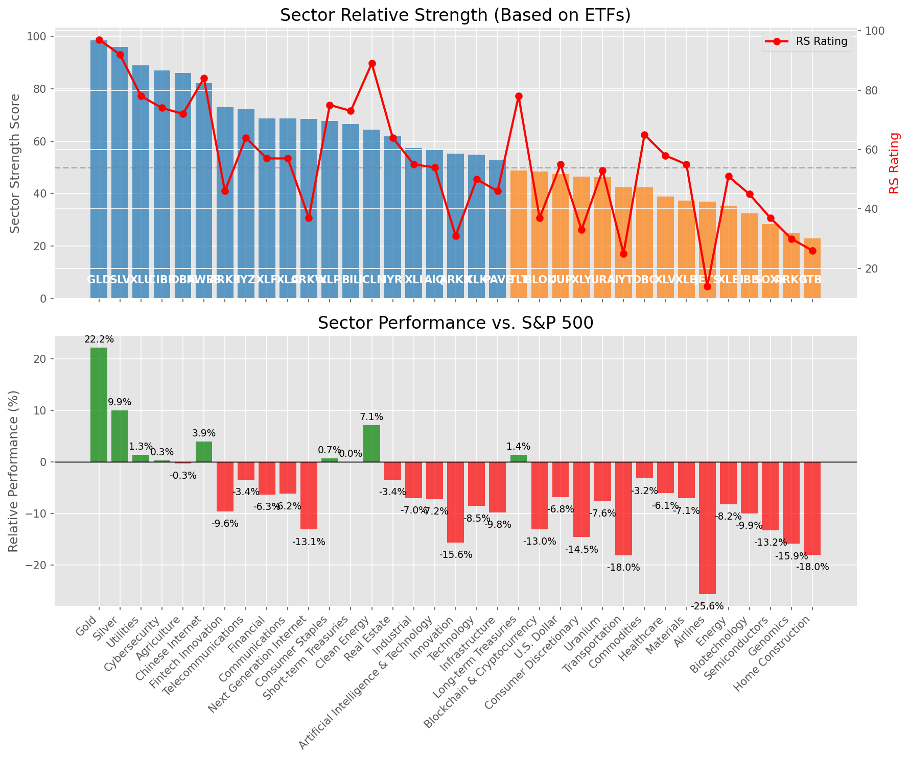

# **Daily Relative Strength Report**

**Date:** 2025-04-28

## **Market Valuation (Buffett Indicator)**

| Metric | Value |
|--------|-------|
| **Market Valuation** | **Fair Valued** |
| **Current Ratio** | 9.12 |
| **Historical Mean** | 9.55 |
| **Standard Deviation** | 0.52 |
| **Z-Score (StdDev from Mean)** | -0.87 |
| **Total Market Cap** | $271.03 trillion |
| **GDP** | $29.72 trillion |

## **Market Insights**

### **Market is Fairly Valued**

The market appears to be trading within a reasonable range of historical valuations. This suggests a balanced approach to equity investing is appropriate. Investors should:

- Focus on individual stock selection based on fundamentals and technicals
- Maintain normal equity allocations aligned with long-term goals
- Pay attention to sector rotation and relative strength
- Watch for changes in market leadership

Fair valuation typically suggests normal market returns can be expected, with stock selection becoming increasingly important.

### **Buffett Indicator Overview**

The Buffett Indicator (Total Market Cap / GDP) is a measure of the stock market's valuation relative to the size of the economy. It is named after Warren Buffett, who described it as "probably the best single measure of where valuations stand at any given moment."

- **Values above +2 standard deviations:** Market significantly overvalued
- **Values above +1 standard deviation:** Market overvalued
- **Values between -1 and +1 standard deviations:** Market fairly valued
- **Values below -1 standard deviation:** Market undervalued
- **Values below -2 standard deviations:** Market significantly undervalued

---

## **Sector Relative Strength**

Based on William O'Neil's Relative Strength Methodology

| ETF | Strength | RS Rating | Performance | Above Key MAs | Trend | Sector |
|-----|----------|-----------|-------------|--------------|-------|--------|
| [GLD](https://www.tradingview.com/chart/?symbol=GLD) | 98.5 | 97.0 | 22.17% | 10d ✓, 50d ✓, 200d ✓ | ↗️ | Gold |
| [SLV](https://www.tradingview.com/chart/?symbol=SLV) | 96.0 | 92.0 | 9.94% | 10d ✓, 50d ✓, 200d ✓ | ↗️ | Silver |
| [XLU](https://www.tradingview.com/chart/?symbol=XLU) | 89.0 | 78.0 | 1.34% | 10d ✓, 50d ✓, 200d ✓ | ↗️ | Utilities |
| [CIBR](https://www.tradingview.com/chart/?symbol=CIBR) | 87.0 | 74.0 | 0.26% | 10d ✓, 50d ✓, 200d ✓ | ↗️ | Cybersecurity |
| [DBA](https://www.tradingview.com/chart/?symbol=DBA) | 86.0 | 72.0 | -0.26% | 10d ✓, 50d ✓, 200d ✓ | ↗️ | Agriculture |
| [KWEB](https://www.tradingview.com/chart/?symbol=KWEB) | 82.1 | 84.0 | 3.93% | 10d ✓, 50d ✗, 200d ✓ | ↗️ | Chinese Internet |
| [ARKF](https://www.tradingview.com/chart/?symbol=ARKF) | 73.0 | 46.0 | -9.57% | 10d ✓, 50d ✓, 200d ✓ | ↗️ | Fintech Innovation |
| [IYZ](https://www.tradingview.com/chart/?symbol=IYZ) | 72.1 | 64.0 | -3.43% | 10d ✓, 50d ✗, 200d ✓ | ↗️ | Telecommunications |
| [XLF](https://www.tradingview.com/chart/?symbol=XLF) | 68.6 | 57.0 | -6.30% | 10d ✓, 50d ✗, 200d ✓ | ↗️ | Financial |
| [XLC](https://www.tradingview.com/chart/?symbol=XLC) | 68.6 | 57.0 | -6.15% | 10d ✓, 50d ✗, 200d ✓ | ↗️ | Communications |
| [ARKW](https://www.tradingview.com/chart/?symbol=ARKW) | 68.5 | 37.0 | -13.09% | 10d ✓, 50d ✓, 200d ✓ | ↗️ | Next Generation Internet |
| [XLP](https://www.tradingview.com/chart/?symbol=XLP) | 67.7 | 75.0 | 0.70% | 10d ✗, 50d ✗, 200d ✓ | ↗️ | Consumer Staples |
| [BIL](https://www.tradingview.com/chart/?symbol=BIL) | 66.5 | 73.0 | 0.01% | 10d ✓, 50d ✓, 200d ✓ | ↘️ | Short-term Treasuries |
| [ICLN](https://www.tradingview.com/chart/?symbol=ICLN) | 64.3 | 89.0 | 7.09% | 10d ✓, 50d ✓, 200d ✗ | ↘️ | Clean Energy |
| [IYR](https://www.tradingview.com/chart/?symbol=IYR) | 61.9 | 64.0 | -3.43% | 10d ✓, 50d ✗, 200d ✗ | ↗️ | Real Estate |
| [XLI](https://www.tradingview.com/chart/?symbol=XLI) | 57.4 | 55.0 | -7.00% | 10d ✓, 50d ✗, 200d ✗ | ↗️ | Industrial |
| [AIQ](https://www.tradingview.com/chart/?symbol=AIQ) | 56.9 | 54.0 | -7.21% | 10d ✓, 50d ✗, 200d ✗ | ↗️ | Artificial Intelligence & Technology |
| [ARKK](https://www.tradingview.com/chart/?symbol=ARKK) | 55.3 | 31.0 | -15.58% | 10d ✓, 50d ✓, 200d ✗ | ↗️ | Innovation |
| [XLK](https://www.tradingview.com/chart/?symbol=XLK) | 54.9 | 50.0 | -8.54% | 10d ✓, 50d ✗, 200d ✗ | ↗️ | Technology |
| [PAVE](https://www.tradingview.com/chart/?symbol=PAVE) | 52.9 | 46.0 | -9.78% | 10d ✓, 50d ✗, 200d ✗ | ↗️ | Infrastructure |
| [TLT](https://www.tradingview.com/chart/?symbol=TLT) | 48.9 | 78.0 | 1.36% | 10d ✓, 50d ✗, 200d ✗ | ↘️ | Long-term Treasuries |
| [BLOK](https://www.tradingview.com/chart/?symbol=BLOK) | 48.4 | 37.0 | -13.04% | 10d ✓, 50d ✗, 200d ✗ | ↗️ | Blockchain & Cryptocurrency |
| [UUP](https://www.tradingview.com/chart/?symbol=UUP) | 47.5 | 55.0 | -6.81% | 10d ✗, 50d ✗, 200d ✗ | ↗️ | U.S. Dollar |
| [XLY](https://www.tradingview.com/chart/?symbol=XLY) | 46.4 | 33.0 | -14.55% | 10d ✓, 50d ✗, 200d ✗ | ↗️ | Consumer Discretionary |
| [URA](https://www.tradingview.com/chart/?symbol=URA) | 46.3 | 53.0 | -7.56% | 10d ✓, 50d ✓, 200d ✗ | ↘️ | Uranium |
| [IYT](https://www.tradingview.com/chart/?symbol=IYT) | 42.4 | 25.0 | -18.04% | 10d ✓, 50d ✗, 200d ✗ | ↗️ | Transportation |
| [DBC](https://www.tradingview.com/chart/?symbol=DBC) | 42.4 | 65.0 | -3.19% | 10d ✓, 50d ✗, 200d ✗ | ↘️ | Commodities |
| [XLV](https://www.tradingview.com/chart/?symbol=XLV) | 38.9 | 58.0 | -6.07% | 10d ✓, 50d ✗, 200d ✗ | ↘️ | Healthcare |
| [XLB](https://www.tradingview.com/chart/?symbol=XLB) | 37.4 | 55.0 | -7.05% | 10d ✓, 50d ✗, 200d ✗ | ↘️ | Materials |
| [JETS](https://www.tradingview.com/chart/?symbol=JETS) | 36.9 | 14.0 | -25.60% | 10d ✓, 50d ✗, 200d ✗ | ↗️ | Airlines |
| [XLE](https://www.tradingview.com/chart/?symbol=XLE) | 35.4 | 51.0 | -8.18% | 10d ✓, 50d ✗, 200d ✗ | ↘️ | Energy |
| [IBB](https://www.tradingview.com/chart/?symbol=IBB) | 32.4 | 45.0 | -9.94% | 10d ✓, 50d ✗, 200d ✗ | ↘️ | Biotechnology |
| [SOXX](https://www.tradingview.com/chart/?symbol=SOXX) | 28.4 | 37.0 | -13.21% | 10d ✓, 50d ✗, 200d ✗ | ↘️ | Semiconductors |
| [ARKG](https://www.tradingview.com/chart/?symbol=ARKG) | 24.9 | 30.0 | -15.85% | 10d ✓, 50d ✗, 200d ✗ | ↘️ | Genomics |
| [ITB](https://www.tradingview.com/chart/?symbol=ITB) | 22.9 | 26.0 | -17.98% | 10d ✓, 50d ✗, 200d ✗ | ↘️ | Home Construction |

### **Sector ETF Performance Interpretation**

This table shows the relative strength metrics for different market sectors based on their representative ETFs:

- **ETF**: The ETF used to measure sector performance (click for chart)
- **Strength**: Overall sector strength score (0-100) combining multiple factors
- **RS Rating**: O'Neil RS rating of the sector ETF
- **Performance**: Performance of the sector ETF relative to SPY
- **Above Key MAs**: Whether the ETF is trading above its 10, 50, and 200-day moving averages
- **Trend**: Whether the sector is in an uptrend (↗️) or downtrend (↘️)

### **Current Sector Leadership**

The current market leadership is coming from the following sectors: **Gold, Silver, Utilities**.

The **Gold** sector (represented by **GLD**) is showing particularly strong relative strength with an RS rating of 97.0 and performance of 22.17% vs. the S&P 500. This sector is trading above its 10-day, 50-day, 200-day moving average(s). Investors should consider focusing on high RS stocks within these leading sectors for potential outperformance.

---

## **Buy Recommendations**

The following 104 stocks show exceptional relative strength:

| RS Rating | Buy Score | Current Price | Chart | Name | Ticker |
|-----------|-----------|---------------|-------|------|--------|
| 100 | 100 | $145.25 | [Chart](https://www.tradingview.com/chart/?symbol=UGL) | ProShares Ultra Gold | UGL |
| 100 | 100 | $114.65 | [Chart](https://www.tradingview.com/chart/?symbol=PLTR) | Palantir Technologies Inc. Class A Common Stock | PLTR |
| 100 | 100 | $112.49 | [Chart](https://www.tradingview.com/chart/?symbol=WGS) | GeneDx Holdings Corp. Class A Common Stock | WGS |
| 99 | 100 | $25.74 | [Chart](https://www.tradingview.com/chart/?symbol=DB) | Deutsche Bank Aktiengesellschaft | DB |
| 99 | 100 | $276.19 | [Chart](https://www.tradingview.com/chart/?symbol=VRSN) | VeriSign Inc | VRSN |
| 99 | 100 | $16.30 | [Chart](https://www.tradingview.com/chart/?symbol=EZPW) | Ezcorp Inc | EZPW |
| 99 | 100 | $68.83 | [Chart](https://www.tradingview.com/chart/?symbol=VRNA) | Verona Pharma plc | VRNA |
| 99 | 100 | $23.64 | [Chart](https://www.tradingview.com/chart/?symbol=OR) | Osisko Gold Royalties Ltd | OR |
| 99 | 100 | $169.17 | [Chart](https://www.tradingview.com/chart/?symbol=PM) | Philip Morris International Inc. | PM |
| 99 | 100 | $25.35 | [Chart](https://www.tradingview.com/chart/?symbol=TGI) | Triumph Group, Inc. | TGI |
| 99 | 100 | $49.55 | [Chart](https://www.tradingview.com/chart/?symbol=SEZL) | Sezzle Inc. Common Stock | SEZL |
| 98 | 100 | $87.75 | [Chart](https://www.tradingview.com/chart/?symbol=SNEX) | StoneX Group Inc. Common Stock | SNEX |
| 98 | 100 | $32.32 | [Chart](https://www.tradingview.com/chart/?symbol=OUNZ) | VanEck Merk Gold ETF | OUNZ |
| 98 | 100 | $31.99 | [Chart](https://www.tradingview.com/chart/?symbol=SGOL) | abrdn Physical Gold Shares ETF | SGOL |
| 98 | 100 | $43.92 | [Chart](https://www.tradingview.com/chart/?symbol=MRX) | Marex Group plc Ordinary Shares | MRX |
| 98 | 100 | $33.07 | [Chart](https://www.tradingview.com/chart/?symbol=BAR) | GraniteShares Gold Shares | BAR |
| 97 | 100 | $115.32 | [Chart](https://www.tradingview.com/chart/?symbol=EHC) | Encompass Health Corporation Common Stock | EHC |
| 97 | 100 | $225.55 | [Chart](https://www.tradingview.com/chart/?symbol=TTWO) | Take-Two Interactive Software Inc | TTWO |
| 97 | 100 | $140.86 | [Chart](https://www.tradingview.com/chart/?symbol=LRN) | Stride, Inc. | LRN |
| 97 | 100 | $63.23 | [Chart](https://www.tradingview.com/chart/?symbol=IAU) | iShares Gold Trust | IAU |
| 97 | 100 | $70.69 | [Chart](https://www.tradingview.com/chart/?symbol=WRB) | W.R. Berkley Corporation | WRB |
| 97 | 100 | $25.56 | [Chart](https://www.tradingview.com/chart/?symbol=PHYS) | Sprott Physical Gold Trust | PHYS |
| 97 | 100 | $309.07 | [Chart](https://www.tradingview.com/chart/?symbol=GLD) | SPDR Gold Trust, SPDR Gold Shares | GLD |
| 97 | 100 | $66.38 | [Chart](https://www.tradingview.com/chart/?symbol=GLDM) | SPDR Gold MiniShares | GLDM |
| 97 | 100 | $33.42 | [Chart](https://www.tradingview.com/chart/?symbol=IAUM) | iShares Gold Trust Micro | IAUM |
| 97 | 100 | $21.45 | [Chart](https://www.tradingview.com/chart/?symbol=GRND) | Grindr Inc. | GRND |
| 96 | 100 | $38.44 | [Chart](https://www.tradingview.com/chart/?symbol=EXEL) | Exelixis Inc | EXEL |
| 96 | 100 | $29.52 | [Chart](https://www.tradingview.com/chart/?symbol=CEF) | Sprott Physical Gold and Silver Trust | CEF |
| 96 | 100 | $70.95 | [Chart](https://www.tradingview.com/chart/?symbol=CORT) | Corcept Therapeutics Inc. | CORT |
| 96 | 100 | $29.95 | [Chart](https://www.tradingview.com/chart/?symbol=EUFN) | iShares MSCI Europe Financials ETF | EUFN |
| 96 | 100 | $597.73 | [Chart](https://www.tradingview.com/chart/?symbol=SPOT) | Spotify Technology S.A. | SPOT |
| 96 | 100 | $38.24 | [Chart](https://www.tradingview.com/chart/?symbol=CNP) | CenterPoint Energy, Inc. | CNP |
| 95 | 100 | $1110.38 | [Chart](https://www.tradingview.com/chart/?symbol=NFLX) | NetFlix Inc | NFLX |
| 95 | 100 | $64.41 | [Chart](https://www.tradingview.com/chart/?symbol=RYTM) | Rhythm Pharmaceuticals, Inc. Common Stock | RYTM |
| 95 | 100 | $246.11 | [Chart](https://www.tradingview.com/chart/?symbol=RSG) | Republic Services Inc. | RSG |
| 95 | 100 | $78.35 | [Chart](https://www.tradingview.com/chart/?symbol=NFG) | National Fuel Gas Co. | NFG |
| 95 | 100 | $39.47 | [Chart](https://www.tradingview.com/chart/?symbol=EWG) | iShares MSCI Germany ETF | EWG |
| 94 | 100 | $16.62 | [Chart](https://www.tradingview.com/chart/?symbol=SPNT) | SiriusPoint Ltd. | SPNT |
| 94 | 100 | $287.75 | [Chart](https://www.tradingview.com/chart/?symbol=COR) | Cencora, Inc. | COR |
| 94 | 100 | $169.76 | [Chart](https://www.tradingview.com/chart/?symbol=SFM) | Sprouts Farmers Market, Inc. | SFM |
| 94 | 100 | $27.26 | [Chart](https://www.tradingview.com/chart/?symbol=T) | AT&T Inc. | T |
| 94 | 100 | $267.92 | [Chart](https://www.tradingview.com/chart/?symbol=CME) | CME Group Inc. | CME |
| 94 | 100 | $370.06 | [Chart](https://www.tradingview.com/chart/?symbol=GEV) | GE Vernova Inc. | GEV |
| 94 | 100 | $530.94 | [Chart](https://www.tradingview.com/chart/?symbol=BRK.B) | BERKSHIRE HATHAWAY Class B | BRK.B |
| 93 | 100 | $68.50 | [Chart](https://www.tradingview.com/chart/?symbol=VTR) | Ventas, Inc. | VTR |
| 93 | 100 | $15.97 | [Chart](https://www.tradingview.com/chart/?symbol=BCS) | Barclays PLC | BCS |
| 93 | 100 | $135.69 | [Chart](https://www.tradingview.com/chart/?symbol=DTE) | DTE Energy Company | DTE |
| 93 | 100 | $176.68 | [Chart](https://www.tradingview.com/chart/?symbol=DGX) | Quest Diagnostics Inc. | DGX |
| 93 | 100 | $77.97 | [Chart](https://www.tradingview.com/chart/?symbol=OGS) | ONE GAS, INC. | OGS |
| 93 | 100 | $151.88 | [Chart](https://www.tradingview.com/chart/?symbol=AGX) | Argan, Inc | AGX |
| 92 | 100 | $59.66 | [Chart](https://www.tradingview.com/chart/?symbol=WMB) | Williams Companies Inc. | WMB |
| 92 | 100 | $50.25 | [Chart](https://www.tradingview.com/chart/?symbol=TRP) | TC Energy Corporation | TRP |
| 92 | 100 | $106.45 | [Chart](https://www.tradingview.com/chart/?symbol=ATGE) | Adtalem Global Education Inc. Common Shares | ATGE |
| 92 | 100 | $39.73 | [Chart](https://www.tradingview.com/chart/?symbol=NI) | NiSource Inc. | NI |
| 91 | 100 | $297.32 | [Chart](https://www.tradingview.com/chart/?symbol=PEN) | Penumbra, Inc. | PEN |
| 91 | 100 | $31.23 | [Chart](https://www.tradingview.com/chart/?symbol=LTH) | Life Time Group Holdings, Inc. | LTH |
| 91 | 100 | $116.18 | [Chart](https://www.tradingview.com/chart/?symbol=CWST) | Casella Waste Systems Inc | CWST |
| 91 | 100 | $36.46 | [Chart](https://www.tradingview.com/chart/?symbol=PPL) | PPL Corporation | PPL |
| 91 | 100 | $53.36 | [Chart](https://www.tradingview.com/chart/?symbol=RELX) | RELX PLC | RELX |
| 91 | 100 | $57.33 | [Chart](https://www.tradingview.com/chart/?symbol=ULS) | UL Solutions Inc. | ULS |
| 91 | 100 | $77.39 | [Chart](https://www.tradingview.com/chart/?symbol=SR) | Spire Inc. | SR |
| 91 | 100 | $34.49 | [Chart](https://www.tradingview.com/chart/?symbol=FDP) | Fresh Del Monte Produce Inc. | FDP |
| 90 | 100 | $94.59 | [Chart](https://www.tradingview.com/chart/?symbol=PNW) | Pinnacle West Capital Corporation | PNW |
| 90 | 100 | $85.09 | [Chart](https://www.tradingview.com/chart/?symbol=ETR) | Entergy Corporation | ETR |
| 90 | 100 | $56.34 | [Chart](https://www.tradingview.com/chart/?symbol=HSBC) | HSBC Holdings PLC | HSBC |
| 90 | 100 | $108.54 | [Chart](https://www.tradingview.com/chart/?symbol=WEC) | WEC Energy Group, Inc. | WEC |
| 89 | 100 | $69.02 | [Chart](https://www.tradingview.com/chart/?symbol=EVRG) | Evergy, Inc. | EVRG |
| 89 | 100 | $115.26 | [Chart](https://www.tradingview.com/chart/?symbol=COOP) | Mr. Cooper Group Inc. Common Stock | COOP |
| 89 | 100 | $42.39 | [Chart](https://www.tradingview.com/chart/?symbol=BTI) | British American Tobacco p.l.c. American Depositary Shares, American Depositary Shares, each representing one Ordinary Share | BTI |
| 89 | 100 | $41.65 | [Chart](https://www.tradingview.com/chart/?symbol=HMN) | Horace Mann Educators Corporation | HMN |
| 89 | 100 | $31.59 | [Chart](https://www.tradingview.com/chart/?symbol=AHR) | American Healthcare REIT, Inc. | AHR |
| 88 | 100 | $45.47 | [Chart](https://www.tradingview.com/chart/?symbol=OGE) | OGE Energy Corp. | OGE |
| 87 | 100 | $237.60 | [Chart](https://www.tradingview.com/chart/?symbol=LNG) | Cheniere Energy Inc | LNG |
| 86 | 100 | $138.24 | [Chart](https://www.tradingview.com/chart/?symbol=CAH) | Cardinal Health, Inc. | CAH |
| 89 | 99 | $32.04 | [Chart](https://www.tradingview.com/chart/?symbol=PAY) | Paymentus Holdings, Inc. | PAY |
| 89 | 99 | $43.76 | [Chart](https://www.tradingview.com/chart/?symbol=NWN) | Northwest Natural Holding Company | NWN |
| 87 | 99 | $32.68 | [Chart](https://www.tradingview.com/chart/?symbol=UGI) | UGI Corporation | UGI |
| 86 | 99 | $160.67 | [Chart](https://www.tradingview.com/chart/?symbol=EAT) | Brinker International, Inc. | EAT |
| 86 | 99 | $37.60 | [Chart](https://www.tradingview.com/chart/?symbol=TDS) | Telephone and Data Systems Inc. | TDS |
| 86 | 99 | $18.98 | [Chart](https://www.tradingview.com/chart/?symbol=KT) | KT Corp. | KT |
| 85 | 99 | $98.89 | [Chart](https://www.tradingview.com/chart/?symbol=AEE) | Ameren Corporation | AEE |
| 87 | 98 | $93.68 | [Chart](https://www.tradingview.com/chart/?symbol=DAVE) | Dave Inc. Class A Common Stock | DAVE |
| 85 | 98 | $79.05 | [Chart](https://www.tradingview.com/chart/?symbol=UNM) | Unum Group | UNM |
| 87 | 97 | $369.25 | [Chart](https://www.tradingview.com/chart/?symbol=MSTR) | MicroStrategy Inc | MSTR |
| 87 | 97 | $56.66 | [Chart](https://www.tradingview.com/chart/?symbol=IGF) | iShares Global Infrastructure ETF | IGF |
| 84 | 97 | $160.43 | [Chart](https://www.tradingview.com/chart/?symbol=TKO) | TKO Group Holdings, Inc. | TKO |
| 87 | 96 | $22.20 | [Chart](https://www.tradingview.com/chart/?symbol=CXW) | CoreCivic, Inc. | CXW |
| 86 | 96 | $51.12 | [Chart](https://www.tradingview.com/chart/?symbol=EQT) | EQT CORP | EQT |
| 86 | 96 | $120.41 | [Chart](https://www.tradingview.com/chart/?symbol=HIG) | The Hartford Insurance Group, Inc. | HIG |
| 85 | 96 | $165.96 | [Chart](https://www.tradingview.com/chart/?symbol=CVLT) | Commault Systems, Inc. | CVLT |
| 84 | 96 | $36.73 | [Chart](https://www.tradingview.com/chart/?symbol=DRS) | Leonardo DRS, Inc. Common Stock | DRS |
| 83 | 96 | $285.35 | [Chart](https://www.tradingview.com/chart/?symbol=SAP) | SAP SE | SAP |
| 85 | 95 | $41.06 | [Chart](https://www.tradingview.com/chart/?symbol=GLNG) | Golar LNG Ltd | GLNG |
| 85 | 95 | $15.39 | [Chart](https://www.tradingview.com/chart/?symbol=MIR) | Mirion Technologies, Inc. | MIR |
| 84 | 95 | $261.61 | [Chart](https://www.tradingview.com/chart/?symbol=TRV) | The Travelers Companies, Inc. | TRV |
| 84 | 94 | $107.06 | [Chart](https://www.tradingview.com/chart/?symbol=AEP) | American Electric Power Company, Inc. | AEP |
| 81 | 94 | $39.20 | [Chart](https://www.tradingview.com/chart/?symbol=VIRT) | Virtu Financial, Inc. Class A | VIRT |
| 83 | 93 | $200.86 | [Chart](https://www.tradingview.com/chart/?symbol=GE) | GE Aerospace | GE |
| 83 | 93 | $124.17 | [Chart](https://www.tradingview.com/chart/?symbol=BECN) | Beacon Roofing Supply, Inc. | BECN |
| 81 | 93 | $48.93 | [Chart](https://www.tradingview.com/chart/?symbol=HOOD) | Robinhood Markets, Inc. Class A Common Stock | HOOD |
| 80 | 93 | $72.70 | [Chart](https://www.tradingview.com/chart/?symbol=LLYVK) | Liberty Media Corporation Series C Liberty Live Common Stock | LLYVK |
| 82 | 92 | $50.13 | [Chart](https://www.tradingview.com/chart/?symbol=VTIP) | Vanguard Short-Term Inflation-Protected Securities Index Fund | VTIP |
| 82 | 92 | $80.73 | [Chart](https://www.tradingview.com/chart/?symbol=SANM) | Sanmina  Corp | SANM |
| 82 | 92 | $39.86 | [Chart](https://www.tradingview.com/chart/?symbol=FHI) | Federated Hermes, Inc. | FHI |

---

## **Sell Recommendations**

The following 144 stocks show deteriorating relative strength:

| RS Rating | Sell Score | Current Price | Chart | Name | Ticker |
|-----------|------------|---------------|-------|------|--------|
| 1 | 100 | $10.05 | [Chart](https://www.tradingview.com/chart/?symbol=FTRE) | Fortrea Holdings Inc. Common Stock | FTRE |
| 1 | 100 | $16.13 | [Chart](https://www.tradingview.com/chart/?symbol=VTLE) | Vital Energy, Inc. | VTLE |
| 1 | 100 | $10.72 | [Chart](https://www.tradingview.com/chart/?symbol=AMRC) | Ameresco, Inc. | AMRC |
| 2 | 100 | $13.37 | [Chart](https://www.tradingview.com/chart/?symbol=ODP) | The ODP Corporation Common Stock | ODP |
| 2 | 100 | $18.44 | [Chart](https://www.tradingview.com/chart/?symbol=DAVA) | Endava plc American Depositary Shares (each representing one Class A Ordinary Share) | DAVA |
| 3 | 100 | $57.25 | [Chart](https://www.tradingview.com/chart/?symbol=LABU) | Direxion Daily S&P Biotech Bull 3X Shares | LABU |
| 3 | 100 | $16.92 | [Chart](https://www.tradingview.com/chart/?symbol=SSTK) | SHUTTERSTOCK, INC. | SSTK |
| 4 | 100 | $104.00 | [Chart](https://www.tradingview.com/chart/?symbol=BOOT) | Boot Barn Holdings, Inc. | BOOT |
| 4 | 100 | $21.07 | [Chart](https://www.tradingview.com/chart/?symbol=SPT) | Sprout Social, Inc Class A Common Stock | SPT |
| 4 | 100 | $24.23 | [Chart](https://www.tradingview.com/chart/?symbol=RPD) | Rapid7, Inc. Common Stock | RPD |
| 4 | 100 | $15.42 | [Chart](https://www.tradingview.com/chart/?symbol=ZVZZT) | SUPER Montage TEST SYMBOL | ZVZZT |
| 5 | 100 | $40.91 | [Chart](https://www.tradingview.com/chart/?symbol=WDC) | Western Digital Corp. | WDC |
| 5 | 100 | $16.69 | [Chart](https://www.tradingview.com/chart/?symbol=IART) | Integra LifeSciences Holdings | IART |
| 5 | 100 | $19.27 | [Chart](https://www.tradingview.com/chart/?symbol=SG) | Sweetgreen, Inc. | SG |
| 5 | 100 | $10.19 | [Chart](https://www.tradingview.com/chart/?symbol=LSPD) | Lightspeed Commerce Inc. | LSPD |
| 5 | 100 | $12.44 | [Chart](https://www.tradingview.com/chart/?symbol=IMXI) | International Money Express, Inc. | IMXI |
| 6 | 100 | $24.41 | [Chart](https://www.tradingview.com/chart/?symbol=AMPH) | Amphastar Pharmaceuticals, Inc. | AMPH |
| 6 | 100 | $13.36 | [Chart](https://www.tradingview.com/chart/?symbol=DV) | DoubleVerify Holdings, Inc. | DV |
| 6 | 100 | $13.52 | [Chart](https://www.tradingview.com/chart/?symbol=ARWR) | Arrowhead Research Corporation | ARWR |
| 6 | 100 | $32.86 | [Chart](https://www.tradingview.com/chart/?symbol=SCSC) | Scansource Inc | SCSC |
| 6 | 100 | $22.78 | [Chart](https://www.tradingview.com/chart/?symbol=NSSC) | Napco Security Technologies, Inc | NSSC |
| 7 | 100 | $13.16 | [Chart](https://www.tradingview.com/chart/?symbol=GCT) | GigaCloud Technology Inc Class A Ordinary Shares | GCT |
| 8 | 100 | $20.60 | [Chart](https://www.tradingview.com/chart/?symbol=FOXF) | Fox Factory Holding Corp. Common Stock | FOXF |
| 8 | 100 | $73.98 | [Chart](https://www.tradingview.com/chart/?symbol=MKSI) | MKS Instruments Inc | MKSI |
| 9 | 100 | $121.50 | [Chart](https://www.tradingview.com/chart/?symbol=BLDR) | Builders FirstSource, Inc. | BLDR |
| 10 | 100 | $19.35 | [Chart](https://www.tradingview.com/chart/?symbol=AMN) | AMN Healthcare Services | AMN |
| 10 | 100 | $13.87 | [Chart](https://www.tradingview.com/chart/?symbol=XRAY) | DENTSPLY SIRONA Inc. | XRAY |
| 12 | 100 | $12.82 | [Chart](https://www.tradingview.com/chart/?symbol=TRIP) | TripAdvisor, Inc. | TRIP |
| 12 | 100 | $28.55 | [Chart](https://www.tradingview.com/chart/?symbol=SRDX) | Surmodics, Inc. Common Stock | SRDX |
| 17 | 100 | $11.67 | [Chart](https://www.tradingview.com/chart/?symbol=JAMF) | Jamf Holding Corp. Common Stock | JAMF |
| 18 | 100 | $12.58 | [Chart](https://www.tradingview.com/chart/?symbol=MED) | Medifast, Inc. | MED |
| 8 | 99 | $56.27 | [Chart](https://www.tradingview.com/chart/?symbol=SYNA) | Synaptics Inc | SYNA |
| 8 | 99 | $10.01 | [Chart](https://www.tradingview.com/chart/?symbol=VYX) | NCR Voyix Corporation | VYX |
| 8 | 99 | $10.92 | [Chart](https://www.tradingview.com/chart/?symbol=AEYE) | AudioEye, Inc. Common Stock | AEYE |
| 12 | 99 | $62.74 | [Chart](https://www.tradingview.com/chart/?symbol=SPB) | Spectrum Brands Holdings, Inc. | SPB |
| 14 | 99 | $21.37 | [Chart](https://www.tradingview.com/chart/?symbol=ST) | Sensata Technologies Holding plc | ST |
| 2 | 98 | $77.22 | [Chart](https://www.tradingview.com/chart/?symbol=ILMN) | Illumina Inc | ILMN |
| 8 | 98 | $15.02 | [Chart](https://www.tradingview.com/chart/?symbol=TEVA) | Teva Pharmaceutical Industries Limited American Depositary Shares | TEVA |
| 11 | 98 | $10.77 | [Chart](https://www.tradingview.com/chart/?symbol=SONO) | Sonos, Inc. Common Stock | SONO |
| 13 | 98 | $28.64 | [Chart](https://www.tradingview.com/chart/?symbol=YETI) | YETI Holdings, Inc. Common Stock | YETI |
| 13 | 98 | $12.82 | [Chart](https://www.tradingview.com/chart/?symbol=ARCT) | Arcturus Therapeutics Holdings Inc. Common Stock | ARCT |
| 16 | 98 | $112.08 | [Chart](https://www.tradingview.com/chart/?symbol=ARM) | Arm Holdings plc American Depositary Shares | ARM |
| 12 | 97 | $12.54 | [Chart](https://www.tradingview.com/chart/?symbol=ADNT) | Adient plc Ordinary Shares | ADNT |
| 20 | 97 | $26.87 | [Chart](https://www.tradingview.com/chart/?symbol=COLL) | Collegium Pharmaceutical, Inc. Common Stock | COLL |
| 9 | 96 | $45.38 | [Chart](https://www.tradingview.com/chart/?symbol=PSTG) | Pure Storage, Inc. Class A | PSTG |
| 9 | 96 | $35.74 | [Chart](https://www.tradingview.com/chart/?symbol=CRC) | California Resources Corporation | CRC |
| 10 | 96 | $31.10 | [Chart](https://www.tradingview.com/chart/?symbol=UWM) | ProShares Ultra Russell2000 | UWM |
| 10 | 96 | $58.13 | [Chart](https://www.tradingview.com/chart/?symbol=AMWD) | American Woodmark Corp | AMWD |
| 16 | 96 | $11.34 | [Chart](https://www.tradingview.com/chart/?symbol=HPK) | HighPeak Energy, Inc. Common Stock | HPK |
| 18 | 96 | $11.47 | [Chart](https://www.tradingview.com/chart/?symbol=KELYA) | Kelly Services Inc | KELYA |
| 7 | 95 | $11.87 | [Chart](https://www.tradingview.com/chart/?symbol=MBC) | MasterBrand, Inc. | MBC |
| 11 | 94 | $25.04 | [Chart](https://www.tradingview.com/chart/?symbol=RNG) | RINGCENTRAL, INC. | RNG |
| 13 | 94 | $88.00 | [Chart](https://www.tradingview.com/chart/?symbol=NTAP) | NetApp, Inc | NTAP |
| 13 | 94 | $15.65 | [Chart](https://www.tradingview.com/chart/?symbol=DXC) | DXC Technology Company | DXC |
| 18 | 94 | $25.87 | [Chart](https://www.tradingview.com/chart/?symbol=GDEN) | Golden Entertainment, Inc. Common Stock | GDEN |
| 18 | 94 | $53.78 | [Chart](https://www.tradingview.com/chart/?symbol=IIPR) | Innovative Industrial Properties, Inc. Common stock | IIPR |
| 12 | 93 | $22.58 | [Chart](https://www.tradingview.com/chart/?symbol=AI) | C3.ai, Inc. | AI |
| 14 | 92 | $28.65 | [Chart](https://www.tradingview.com/chart/?symbol=MBUU) | Malibu Boats, Inc. Class A | MBUU |
| 17 | 92 | $57.44 | [Chart](https://www.tradingview.com/chart/?symbol=TREX) | Trex Company, Inc. | TREX |
| 22 | 92 | $80.18 | [Chart](https://www.tradingview.com/chart/?symbol=AKAM) | Akamai Technologies Inc | AKAM |
| 13 | 91 | $29.31 | [Chart](https://www.tradingview.com/chart/?symbol=CDRE) | Cadre Holdings, Inc. | CDRE |
| 14 | 91 | $95.33 | [Chart](https://www.tradingview.com/chart/?symbol=BCC) | Boise Cascade Company | BCC |
| 16 | 91 | $39.90 | [Chart](https://www.tradingview.com/chart/?symbol=TWST) | Twist Bioscience Corporation Common Stock | TWST |
| 18 | 91 | $36.58 | [Chart](https://www.tradingview.com/chart/?symbol=STNG) | Scorpio Tankers Inc. | STNG |
| 19 | 91 | $68.74 | [Chart](https://www.tradingview.com/chart/?symbol=TTC) | Toro Company (The) | TTC |
| 11 | 90 | $10.31 | [Chart](https://www.tradingview.com/chart/?symbol=VREX) | Varex Imaging Corporation Common Stock | VREX |
| 15 | 90 | $211.50 | [Chart](https://www.tradingview.com/chart/?symbol=FDX) | FedEx Corporation | FDX |
| 12 | 89 | $113.45 | [Chart](https://www.tradingview.com/chart/?symbol=GNRC) | GENERAC HOLDINGS INC | GNRC |
| 12 | 89 | $10.24 | [Chart](https://www.tradingview.com/chart/?symbol=EXPI) | eXp World Holdings, Inc. Common Stock | EXPI |
| 16 | 89 | $11.94 | [Chart](https://www.tradingview.com/chart/?symbol=APLE) | Apple Hospitality REIT, Inc. | APLE |
| 25 | 89 | $45.59 | [Chart](https://www.tradingview.com/chart/?symbol=EXAS) | Exact Sciences Corp | EXAS |
| 25 | 89 | $15.35 | [Chart](https://www.tradingview.com/chart/?symbol=PSFE) | Paysafe Limited | PSFE |
| 28 | 89 | $10.34 | [Chart](https://www.tradingview.com/chart/?symbol=CMRE) | Costamare Inc. | CMRE |
| 32 | 89 | $14.52 | [Chart](https://www.tradingview.com/chart/?symbol=FXN) | First Trust Energy AlphaDEX Fund | FXN |
| 17 | 88 | $12.62 | [Chart](https://www.tradingview.com/chart/?symbol=OSCR) | Oscar Health, Inc. | OSCR |
| 27 | 88 | $41.22 | [Chart](https://www.tradingview.com/chart/?symbol=CYTK) | Cytokinetics Inc. | CYTK |
| 27 | 88 | $12.39 | [Chart](https://www.tradingview.com/chart/?symbol=PR) | Permian Resources Corporation | PR |
| 14 | 87 | $10.20 | [Chart](https://www.tradingview.com/chart/?symbol=SEMR) | SEMrush Holdings, Inc. | SEMR |
| 16 | 87 | $10.15 | [Chart](https://www.tradingview.com/chart/?symbol=HLIT) | Harmonic Inc | HLIT |
| 17 | 87 | $62.88 | [Chart](https://www.tradingview.com/chart/?symbol=PLUS) | ePlus Inc | PLUS |
| 27 | 87 | $34.27 | [Chart](https://www.tradingview.com/chart/?symbol=MGA) | Magna International | MGA |
| 31 | 87 | $16.26 | [Chart](https://www.tradingview.com/chart/?symbol=TRMD) | TORM plc Class A Common Stock | TRMD |
| 16 | 86 | $25.39 | [Chart](https://www.tradingview.com/chart/?symbol=HPQ) | HP Inc. | HPQ |
| 22 | 86 | $49.46 | [Chart](https://www.tradingview.com/chart/?symbol=ERX) | Direxion Daily Energy Bull 2X Shares | ERX |
| 23 | 86 | $94.91 | [Chart](https://www.tradingview.com/chart/?symbol=CHRD) | Chord Energy Corporation Common Stock | CHRD |
| 25 | 86 | $14.47 | [Chart](https://www.tradingview.com/chart/?symbol=ZIM) | ZIM Integrated Shipping Services Ltd. | ZIM |
| 31 | 86 | $11.51 | [Chart](https://www.tradingview.com/chart/?symbol=ABR) | Arbor Realty Trust, Inc. | ABR |
| 27 | 85 | $23.45 | [Chart](https://www.tradingview.com/chart/?symbol=HOG) | Harley-Davidson, Inc. | HOG |
| 20 | 84 | $35.86 | [Chart](https://www.tradingview.com/chart/?symbol=CALF) | Pacer US Small Cap Cash Cows ETF | CALF |
| 20 | 84 | $76.63 | [Chart](https://www.tradingview.com/chart/?symbol=WD) | Walker & Dunlop, Inc. | WD |
| 21 | 83 | $16.01 | [Chart](https://www.tradingview.com/chart/?symbol=CHCT) | Community Healthcare Trust Incorporated Common Stock, $0.01 par value per share | CHCT |
| 22 | 82 | $35.00 | [Chart](https://www.tradingview.com/chart/?symbol=OVV) | Ovintiv Inc. | OVV |
| 24 | 82 | $12.64 | [Chart](https://www.tradingview.com/chart/?symbol=KRP) | Kimbell Royalty Partners, LP Common Units representing Limited Partner Interests | KRP |
| 30 | 82 | $296.65 | [Chart](https://www.tradingview.com/chart/?symbol=BLD) | TopBuild Corp. Common Stock | BLD |
| 35 | 82 | $13.86 | [Chart](https://www.tradingview.com/chart/?symbol=MANU) | MANCHESTER UNITED PLC | MANU |
| 27 | 81 | $51.75 | [Chart](https://www.tradingview.com/chart/?symbol=LW) | Lamb Weston Holdings, Inc. | LW |
| 28 | 81 | $10.16 | [Chart](https://www.tradingview.com/chart/?symbol=MAX) | MediaAlpha, Inc. | MAX |
| 31 | 81 | $13.04 | [Chart](https://www.tradingview.com/chart/?symbol=WDS) | Woodside Energy Group Limited American Depositary Shares, each representing one Ordinary Share | WDS |
| 34 | 81 | $10.88 | [Chart](https://www.tradingview.com/chart/?symbol=GSBD) | Goldman Sachs BDC, Inc. | GSBD |
| 23 | 80 | $16.63 | [Chart](https://www.tradingview.com/chart/?symbol=MLNK) | MeridianLink, Inc. | MLNK |
| 24 | 80 | $13.98 | [Chart](https://www.tradingview.com/chart/?symbol=HST) | Host Hotels & Resorts, Inc. | HST |
| 26 | 80 | $167.84 | [Chart](https://www.tradingview.com/chart/?symbol=IBP) | INSTALLED BUILDING PRODUCTS, INC. | IBP |
| 26 | 80 | $91.41 | [Chart](https://www.tradingview.com/chart/?symbol=ITB) | iShares U.S. Home Construction ETF | ITB |
| 28 | 80 | $12.11 | [Chart](https://www.tradingview.com/chart/?symbol=CIM) | Chimera Investment Corp. | CIM |
| 30 | 80 | $22.35 | [Chart](https://www.tradingview.com/chart/?symbol=ARKG) | ARK Genomic Revolution ETF | ARKG |
| 21 | 79 | $11.31 | [Chart](https://www.tradingview.com/chart/?symbol=EOLS) | Evolus, Inc. Common Stock | EOLS |
| 26 | 79 | $10.71 | [Chart](https://www.tradingview.com/chart/?symbol=DBRG) | DigitalBridge Group, Inc. | DBRG |
| 27 | 79 | $11.26 | [Chart](https://www.tradingview.com/chart/?symbol=SHC) | Sotera Health Company Common Stock | SHC |
| 28 | 79 | $114.70 | [Chart](https://www.tradingview.com/chart/?symbol=XOP) | SPDR S&P Oil & Gas Exploration & Production ETF | XOP |
| 26 | 78 | $73.88 | [Chart](https://www.tradingview.com/chart/?symbol=AGYS) | Agilysys, Inc. Common Stock (DE) | AGYS |
| 29 | 78 | $96.39 | [Chart](https://www.tradingview.com/chart/?symbol=AMD) | Advanced Micro Devices | AMD |
| 34 | 78 | $33.71 | [Chart](https://www.tradingview.com/chart/?symbol=PZZA) | Papa John's International Inc | PZZA |
| 23 | 77 | $51.03 | [Chart](https://www.tradingview.com/chart/?symbol=RDNT) | RadNet, Inc. Common Stock | RDNT |
| 33 | 77 | $10.75 | [Chart](https://www.tradingview.com/chart/?symbol=PBR.A) | Petroleo Brasileiro S.A.-Petrobras | PBR.A |
| 33 | 77 | $68.67 | [Chart](https://www.tradingview.com/chart/?symbol=XRT) | SPDR S&P Retail ETF | XRT |
| 29 | 76 | $93.77 | [Chart](https://www.tradingview.com/chart/?symbol=XHB) | SPDR S&P Homebuilders ETF | XHB |
| 30 | 76 | $79.02 | [Chart](https://www.tradingview.com/chart/?symbol=SPHB) | Invesco S&P 500 High Beta ETF | SPHB |
| 31 | 76 | $12.81 | [Chart](https://www.tradingview.com/chart/?symbol=MTUS) | Metallus Inc. | MTUS |
| 35 | 76 | $67.53 | [Chart](https://www.tradingview.com/chart/?symbol=MMS) | MAXIMUS, Inc. | MMS |
| 28 | 75 | $18.53 | [Chart](https://www.tradingview.com/chart/?symbol=PRAA) | PRA Group, Inc. | PRAA |
| 28 | 75 | $190.59 | [Chart](https://www.tradingview.com/chart/?symbol=RGA) | Reinsurance Group of America, Incorporated | RGA |
| 30 | 75 | $17.53 | [Chart](https://www.tradingview.com/chart/?symbol=STR) | Sitio Royalties Corp. | STR |
| 35 | 75 | $30.17 | [Chart](https://www.tradingview.com/chart/?symbol=MTCH) | Match Group, Inc | MTCH |
| 37 | 75 | $36.61 | [Chart](https://www.tradingview.com/chart/?symbol=LIT) | Global X Lithium & Battery Tech ETF | LIT |
| 26 | 74 | $42.07 | [Chart](https://www.tradingview.com/chart/?symbol=HNI) | HNI Corporation | HNI |
| 29 | 74 | $63.85 | [Chart](https://www.tradingview.com/chart/?symbol=BLKB) | Blackbaud, Inc. | BLKB |
| 30 | 74 | $188.70 | [Chart](https://www.tradingview.com/chart/?symbol=NDSN) | Nordson Corp | NDSN |
| 34 | 74 | $126.25 | [Chart](https://www.tradingview.com/chart/?symbol=QLYS) | Qualys, Inc. Common Stock | QLYS |
| 35 | 74 | $28.30 | [Chart](https://www.tradingview.com/chart/?symbol=BWA) | BorgWarner Inc. | BWA |
| 34 | 72 | $73.22 | [Chart](https://www.tradingview.com/chart/?symbol=GMS) | GMS Inc. | GMS |
| 35 | 72 | $145.30 | [Chart](https://www.tradingview.com/chart/?symbol=IWN) | iShares Russell 2000 Value ETF | IWN |
| 30 | 71 | $43.76 | [Chart](https://www.tradingview.com/chart/?symbol=PRKS) | United Parks & Resorts Inc. | PRKS |
| 32 | 70 | $10.29 | [Chart](https://www.tradingview.com/chart/?symbol=AVO) | Mission Produce, Inc. Common Stock | AVO |
| 37 | 70 | $18.09 | [Chart](https://www.tradingview.com/chart/?symbol=HTGC) | Hercules Capital, Inc. | HTGC |
| 38 | 70 | $76.29 | [Chart](https://www.tradingview.com/chart/?symbol=IFF) | International Flavors & Fragrances Inc. | IFF |
| 39 | 70 | $17.66 | [Chart](https://www.tradingview.com/chart/?symbol=FLO) | Flowers Foods, Inc. | FLO |
| 33 | 69 | $31.74 | [Chart](https://www.tradingview.com/chart/?symbol=AXTA) | Axalta Coating Systems Ltd. | AXTA |
| 36 | 69 | $18.91 | [Chart](https://www.tradingview.com/chart/?symbol=ELVN) | Enliven Therapeutics, Inc. Common Stock | ELVN |
| 39 | 69 | $29.62 | [Chart](https://www.tradingview.com/chart/?symbol=AGIO) | Agios Pharmaceuticals, Inc. | AGIO |
| 36 | 67 | $114.14 | [Chart](https://www.tradingview.com/chart/?symbol=EOG) | EOG Resources, Inc. | EOG |
| 37 | 67 | $21.67 | [Chart](https://www.tradingview.com/chart/?symbol=MGY) | Magnolia Oil & Gas Corporation Class A Common Stock | MGY |
| 35 | 66 | $53.47 | [Chart](https://www.tradingview.com/chart/?symbol=GEF) | Greif, Inc. | GEF |
| 36 | 66 | $14.15 | [Chart](https://www.tradingview.com/chart/?symbol=BMEZ) | BlackRock Health Sciences Term Trust | BMEZ |
| 36 | 65 | $27.40 | [Chart](https://www.tradingview.com/chart/?symbol=BNO) | United States Brent Oil Fund, LP | BNO |

## **Methodology**

This report uses William O'Neil's relative strength methodology from Investors Business Daily:

* **RS Rating**: Percentile rank of stock's performance vs. S&P 500 over the past 63 trading days (1-99 scale)
* **Buy Criteria**: RS Rating >= 80, price above 50-day MA, strong uptrend, increasing volume
* **Sell Criteria**: RS Rating < 40, price below 50-day MA, downtrend, decreasing volume

### **O'Neil's Key Principles**

1. **Focus on relative performance** - stocks outperforming the market
2. **Price trend confirmation** - stock must be in an uptrend
3. **Volume confirmation** - strong volume supports price moves
4. **Moving average validation** - price above key moving averages
5. **Market leaders only** - concentrate on top-performing stocks

*Report generated automatically after market close*