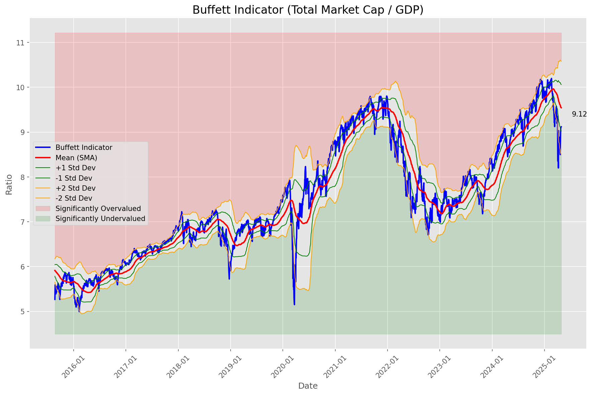
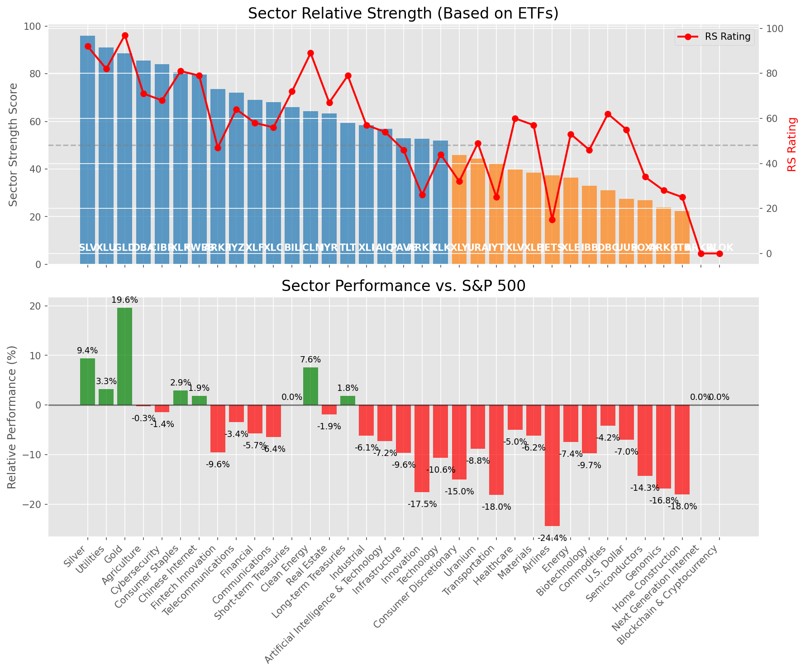

# **Daily Relative Strength Report**

**Date:** 2025-04-29

## **Market Valuation (Buffett Indicator)**

| Metric | Value |
|--------|-------|
| **Market Valuation** | **Fair Valued** |
| **Current Ratio** | 9.17 |
| **Historical Mean** | 9.54 |
| **Standard Deviation** | 0.52 |
| **Z-Score (StdDev from Mean)** | -0.82 |
| **Total Market Cap** | $272.66 trillion |
| **GDP** | $29.72 trillion |

## **Market Insights**

### **Market is Fairly Valued**

The market appears to be trading within a reasonable range of historical valuations. This suggests a balanced approach to equity investing is appropriate. Investors should:

- Focus on individual stock selection based on fundamentals and technicals
- Maintain normal equity allocations aligned with long-term goals
- Pay attention to sector rotation and relative strength
- Watch for changes in market leadership

Fair valuation typically suggests normal market returns can be expected, with stock selection becoming increasingly important.

### **Buffett Indicator Overview**

The Buffett Indicator (Total Market Cap / GDP) is a measure of the stock market's valuation relative to the size of the economy. It is named after Warren Buffett, who described it as "probably the best single measure of where valuations stand at any given moment."

- **Values above +2 standard deviations:** Market significantly overvalued
- **Values above +1 standard deviation:** Market overvalued
- **Values between -1 and +1 standard deviations:** Market fairly valued
- **Values below -1 standard deviation:** Market undervalued
- **Values below -2 standard deviations:** Market significantly undervalued

---

## **Sector Relative Strength**

Based on William O'Neil's Relative Strength Methodology

| ETF | Strength | RS Rating | Performance | Above Key MAs | Trend | Sector |
|-----|----------|-----------|-------------|--------------|-------|--------|
| [XLU](https://www.tradingview.com/chart/?symbol=XLU) | 91.0 | 82.0 | 3.55% | 10d ✓, 50d ✓, 200d ✓ | ↗️ | Utilities |
| [XLP](https://www.tradingview.com/chart/?symbol=XLP) | 90.5 | 81.0 | 3.15% | 10d ✓, 50d ✓, 200d ✓ | ↗️ | Consumer Staples |
| [GLD](https://www.tradingview.com/chart/?symbol=GLD) | 88.6 | 97.0 | 19.94% | 10d ✗, 50d ✓, 200d ✓ | ↗️ | Gold |
| [SLV](https://www.tradingview.com/chart/?symbol=SLV) | 84.6 | 89.0 | 7.96% | 10d ✗, 50d ✓, 200d ✓ | ↗️ | Silver |
| [CIBR](https://www.tradingview.com/chart/?symbol=CIBR) | 84.5 | 69.0 | -0.91% | 10d ✓, 50d ✓, 200d ✓ | ↗️ | Cybersecurity |
| [DBA](https://www.tradingview.com/chart/?symbol=DBA) | 84.0 | 68.0 | -1.24% | 10d ✓, 50d ✓, 200d ✓ | ↗️ | Agriculture |
| [KWEB](https://www.tradingview.com/chart/?symbol=KWEB) | 79.1 | 78.0 | 1.93% | 10d ✓, 50d ✗, 200d ✓ | ↗️ | Chinese Internet |
| [IYZ](https://www.tradingview.com/chart/?symbol=IYZ) | 72.1 | 64.0 | -2.91% | 10d ✓, 50d ✗, 200d ✓ | ↗️ | Telecommunications |
| [ARKW](https://www.tradingview.com/chart/?symbol=ARKW) | 72.0 | 44.0 | -10.10% | 10d ✓, 50d ✓, 200d ✓ | ↗️ | Next Generation Internet |
| [ARKF](https://www.tradingview.com/chart/?symbol=ARKF) | 70.0 | 40.0 | -11.71% | 10d ✓, 50d ✓, 200d ✓ | ↗️ | Fintech Innovation |
| [XLF](https://www.tradingview.com/chart/?symbol=XLF) | 69.6 | 59.0 | -5.16% | 10d ✓, 50d ✗, 200d ✓ | ↗️ | Financial |
| [XLC](https://www.tradingview.com/chart/?symbol=XLC) | 68.1 | 56.0 | -5.93% | 10d ✓, 50d ✗, 200d ✓ | ↗️ | Communications |
| [BIL](https://www.tradingview.com/chart/?symbol=BIL) | 66.0 | 72.0 | 0.01% | 10d ✓, 50d ✓, 200d ✓ | ↘️ | Short-term Treasuries |
| [ICLN](https://www.tradingview.com/chart/?symbol=ICLN) | 63.8 | 88.0 | 7.68% | 10d ✓, 50d ✓, 200d ✗ | ↘️ | Clean Energy |
| [ARKK](https://www.tradingview.com/chart/?symbol=ARKK) | 63.5 | 27.0 | -16.79% | 10d ✓, 50d ✓, 200d ✓ | ↗️ | Innovation |
| [IYR](https://www.tradingview.com/chart/?symbol=IYR) | 63.4 | 67.0 | -1.75% | 10d ✓, 50d ✗, 200d ✗ | ↗️ | Real Estate |
| [PAVE](https://www.tradingview.com/chart/?symbol=PAVE) | 63.3 | 47.0 | -9.26% | 10d ✓, 50d ✓, 200d ✗ | ↗️ | Infrastructure |
| [TLT](https://www.tradingview.com/chart/?symbol=TLT) | 59.3 | 79.0 | 2.28% | 10d ✓, 50d ✓, 200d ✗ | ↘️ | Long-term Treasuries |
| [XLI](https://www.tradingview.com/chart/?symbol=XLI) | 58.4 | 57.0 | -5.77% | 10d ✓, 50d ✗, 200d ✗ | ↗️ | Industrial |
| [UUP](https://www.tradingview.com/chart/?symbol=UUP) | 56.9 | 54.0 | -6.89% | 10d ✓, 50d ✗, 200d ✗ | ↗️ | U.S. Dollar |
| [AIQ](https://www.tradingview.com/chart/?symbol=AIQ) | 54.4 | 49.0 | -8.54% | 10d ✓, 50d ✗, 200d ✗ | ↗️ | Artificial Intelligence & Technology |
| [BLOK](https://www.tradingview.com/chart/?symbol=BLOK) | 48.4 | 37.0 | -13.04% | 10d ✓, 50d ✗, 200d ✗ | ↗️ | Blockchain & Cryptocurrency |
| [XLY](https://www.tradingview.com/chart/?symbol=XLY) | 46.9 | 34.0 | -14.05% | 10d ✓, 50d ✗, 200d ✗ | ↗️ | Consumer Discretionary |
| [IYT](https://www.tradingview.com/chart/?symbol=IYT) | 43.9 | 28.0 | -16.54% | 10d ✓, 50d ✗, 200d ✗ | ↗️ | Transportation |
| [URA](https://www.tradingview.com/chart/?symbol=URA) | 43.8 | 48.0 | -8.88% | 10d ✓, 50d ✓, 200d ✗ | ↘️ | Uranium |
| [XLV](https://www.tradingview.com/chart/?symbol=XLV) | 39.9 | 60.0 | -4.94% | 10d ✓, 50d ✗, 200d ✗ | ↘️ | Healthcare |
| [XLB](https://www.tradingview.com/chart/?symbol=XLB) | 37.9 | 56.0 | -5.97% | 10d ✓, 50d ✗, 200d ✗ | ↘️ | Materials |
| [JETS](https://www.tradingview.com/chart/?symbol=JETS) | 37.4 | 15.0 | -24.10% | 10d ✓, 50d ✗, 200d ✗ | ↗️ | Airlines |
| [XLE](https://www.tradingview.com/chart/?symbol=XLE) | 35.9 | 52.0 | -7.56% | 10d ✓, 50d ✗, 200d ✗ | ↘️ | Energy |
| [IBB](https://www.tradingview.com/chart/?symbol=IBB) | 32.9 | 46.0 | -9.71% | 10d ✓, 50d ✗, 200d ✗ | ↘️ | Biotechnology |
| [XLK](https://www.tradingview.com/chart/?symbol=XLK) | 31.4 | 43.0 | -10.50% | 10d ✓, 50d ✗, 200d ✗ | ↘️ | Technology |
| [DBC](https://www.tradingview.com/chart/?symbol=DBC) | 30.0 | 60.0 | -4.51% | 10d ✗, 50d ✗, 200d ✗ | ↘️ | Commodities |
| [SOXX](https://www.tradingview.com/chart/?symbol=SOXX) | 25.9 | 32.0 | -14.52% | 10d ✓, 50d ✗, 200d ✗ | ↘️ | Semiconductors |
| [ITB](https://www.tradingview.com/chart/?symbol=ITB) | 24.4 | 29.0 | -16.10% | 10d ✓, 50d ✗, 200d ✗ | ↘️ | Home Construction |
| [ARKG](https://www.tradingview.com/chart/?symbol=ARKG) | 23.9 | 28.0 | -16.43% | 10d ✓, 50d ✗, 200d ✗ | ↘️ | Genomics |

### **Sector ETF Performance Interpretation**

This table shows the relative strength metrics for different market sectors based on their representative ETFs:

- **ETF**: The ETF used to measure sector performance (click for chart)
- **Strength**: Overall sector strength score (0-100) combining multiple factors
- **RS Rating**: O'Neil RS rating of the sector ETF
- **Performance**: Performance of the sector ETF relative to SPY
- **Above Key MAs**: Whether the ETF is trading above its 10, 50, and 200-day moving averages
- **Trend**: Whether the sector is in an uptrend (↗️) or downtrend (↘️)

### **Current Sector Leadership**

The current market leadership is coming from the following sectors: **Utilities, Consumer Staples, Gold**.

The **Utilities** sector (represented by **XLU**) is showing particularly strong relative strength with an RS rating of 82.0 and performance of 3.55% vs. the S&P 500. This sector is trading above its 10-day, 50-day, 200-day moving average(s). Investors should consider focusing on high RS stocks within these leading sectors for potential outperformance.

---

## **Buy Recommendations**

The following 107 stocks show exceptional relative strength:

| RS Rating | Buy Score | Current Price | Chart | Name | Ticker |
|-----------|-----------|---------------|-------|------|--------|
| 100 | 100 | $18.49 | [Chart](https://www.tradingview.com/chart/?symbol=SWI) | SolarWinds Corporation Common Stock | SWI |
| 100 | 100 | $116.97 | [Chart](https://www.tradingview.com/chart/?symbol=WGS) | GeneDx Holdings Corp. Class A Common Stock | WGS |
| 100 | 100 | $73.22 | [Chart](https://www.tradingview.com/chart/?symbol=VRNA) | Verona Pharma plc | VRNA |
| 100 | 100 | $116.08 | [Chart](https://www.tradingview.com/chart/?symbol=PLTR) | Palantir Technologies Inc. Class A Common Stock | PLTR |
| 100 | 100 | $23.26 | [Chart](https://www.tradingview.com/chart/?symbol=PRA) | ProAssurance Corporation | PRA |
| 99 | 100 | $51.74 | [Chart](https://www.tradingview.com/chart/?symbol=SEZL) | Sezzle Inc. Common Stock | SEZL |
| 99 | 100 | $26.78 | [Chart](https://www.tradingview.com/chart/?symbol=DB) | Deutsche Bank Aktiengesellschaft | DB |
| 99 | 100 | $278.36 | [Chart](https://www.tradingview.com/chart/?symbol=VRSN) | VeriSign Inc | VRSN |
| 99 | 100 | $170.26 | [Chart](https://www.tradingview.com/chart/?symbol=PM) | Philip Morris International Inc. | PM |
| 99 | 100 | $25.45 | [Chart](https://www.tradingview.com/chart/?symbol=TGI) | Triumph Group, Inc. | TGI |
| 98 | 100 | $89.73 | [Chart](https://www.tradingview.com/chart/?symbol=SNEX) | StoneX Group Inc. Common Stock | SNEX |
| 98 | 100 | $23.63 | [Chart](https://www.tradingview.com/chart/?symbol=OR) | Osisko Gold Royalties Ltd | OR |
| 98 | 100 | $44.69 | [Chart](https://www.tradingview.com/chart/?symbol=MRX) | Marex Group plc Ordinary Shares | MRX |
| 97 | 100 | $115.91 | [Chart](https://www.tradingview.com/chart/?symbol=EHC) | Encompass Health Corporation Common Stock | EHC |
| 97 | 100 | $21.67 | [Chart](https://www.tradingview.com/chart/?symbol=GRND) | Grindr Inc. | GRND |
| 97 | 100 | $71.28 | [Chart](https://www.tradingview.com/chart/?symbol=WRB) | W.R. Berkley Corporation | WRB |
| 97 | 100 | $30.18 | [Chart](https://www.tradingview.com/chart/?symbol=EUFN) | iShares MSCI Europe Financials ETF | EUFN |
| 97 | 100 | $73.23 | [Chart](https://www.tradingview.com/chart/?symbol=CORT) | Corcept Therapeutics Inc. | CORT |
| 96 | 100 | $116.46 | [Chart](https://www.tradingview.com/chart/?symbol=BJ) | BJs Wholesale Club Holdings, Inc. Common Stock | BJ |
| 96 | 100 | $53.98 | [Chart](https://www.tradingview.com/chart/?symbol=PPC) | Pilgrims Pride Corporation | PPC |
| 96 | 100 | $38.55 | [Chart](https://www.tradingview.com/chart/?symbol=EXEL) | Exelixis Inc | EXEL |
| 96 | 100 | $142.59 | [Chart](https://www.tradingview.com/chart/?symbol=LRN) | Stride, Inc. | LRN |
| 96 | 100 | $38.24 | [Chart](https://www.tradingview.com/chart/?symbol=CNP) | CenterPoint Energy, Inc. | CNP |
| 96 | 100 | $71.38 | [Chart](https://www.tradingview.com/chart/?symbol=KR) | The Kroger Co. | KR |
| 95 | 100 | $17.02 | [Chart](https://www.tradingview.com/chart/?symbol=SPNT) | SiriusPoint Ltd. | SPNT |
| 95 | 100 | $65.22 | [Chart](https://www.tradingview.com/chart/?symbol=RYTM) | Rhythm Pharmaceuticals, Inc. Common Stock | RYTM |
| 95 | 100 | $1125.64 | [Chart](https://www.tradingview.com/chart/?symbol=NFLX) | NetFlix Inc | NFLX |
| 95 | 100 | $88.93 | [Chart](https://www.tradingview.com/chart/?symbol=CCEP) | Coca-Cola Europacific Partners plc Ordinary Shares | CCEP |
| 95 | 100 | $247.70 | [Chart](https://www.tradingview.com/chart/?symbol=RSG) | Republic Services Inc. | RSG |
| 95 | 100 | $136.76 | [Chart](https://www.tradingview.com/chart/?symbol=DTE) | DTE Energy Company | DTE |
| 95 | 100 | $39.67 | [Chart](https://www.tradingview.com/chart/?symbol=EWG) | iShares MSCI Germany ETF | EWG |
| 95 | 100 | $272.36 | [Chart](https://www.tradingview.com/chart/?symbol=CME) | CME Group Inc. | CME |
| 94 | 100 | $159.69 | [Chart](https://www.tradingview.com/chart/?symbol=ATO) | Atmos Energy Corporation | ATO |
| 94 | 100 | $178.50 | [Chart](https://www.tradingview.com/chart/?symbol=DGX) | Quest Diagnostics Inc. | DGX |
| 94 | 100 | $69.14 | [Chart](https://www.tradingview.com/chart/?symbol=VTR) | Ventas, Inc. | VTR |
| 94 | 100 | $290.17 | [Chart](https://www.tradingview.com/chart/?symbol=COR) | Cencora, Inc. | COR |
| 94 | 100 | $22.78 | [Chart](https://www.tradingview.com/chart/?symbol=CXW) | CoreCivic, Inc. | CXW |
| 94 | 100 | $119.63 | [Chart](https://www.tradingview.com/chart/?symbol=COOP) | Mr. Cooper Group Inc. Common Stock | COOP |
| 94 | 100 | $172.30 | [Chart](https://www.tradingview.com/chart/?symbol=SFM) | Sprouts Farmers Market, Inc. | SFM |
| 94 | 100 | $153.41 | [Chart](https://www.tradingview.com/chart/?symbol=AGX) | Argan, Inc | AGX |
| 94 | 100 | $381.45 | [Chart](https://www.tradingview.com/chart/?symbol=MSTR) | MicroStrategy Inc | MSTR |
| 94 | 100 | $534.57 | [Chart](https://www.tradingview.com/chart/?symbol=BRK.B) | BERKSHIRE HATHAWAY Class B | BRK.B |
| 93 | 100 | $78.29 | [Chart](https://www.tradingview.com/chart/?symbol=OGS) | ONE GAS, INC. | OGS |
| 93 | 100 | $58.77 | [Chart](https://www.tradingview.com/chart/?symbol=MO) | Altria Group, Inc. | MO |
| 93 | 100 | $73.63 | [Chart](https://www.tradingview.com/chart/?symbol=CMS) | CMS Energy Corporation | CMS |
| 93 | 100 | $463.40 | [Chart](https://www.tradingview.com/chart/?symbol=CASY) | Casey's General Stores Inc | CASY |
| 93 | 100 | $27.30 | [Chart](https://www.tradingview.com/chart/?symbol=T) | AT&T Inc. | T |
| 92 | 100 | $95.29 | [Chart](https://www.tradingview.com/chart/?symbol=PNW) | Pinnacle West Capital Corporation | PNW |
| 92 | 100 | $16.13 | [Chart](https://www.tradingview.com/chart/?symbol=BCS) | Barclays PLC | BCS |
| 92 | 100 | $117.27 | [Chart](https://www.tradingview.com/chart/?symbol=CWST) | Casella Waste Systems Inc | CWST |
| 92 | 100 | $151.48 | [Chart](https://www.tradingview.com/chart/?symbol=WELL) | Welltower Inc. | WELL |
| 92 | 100 | $34.77 | [Chart](https://www.tradingview.com/chart/?symbol=FDP) | Fresh Del Monte Produce Inc. | FDP |
| 92 | 100 | $36.39 | [Chart](https://www.tradingview.com/chart/?symbol=PPL) | PPL Corporation | PPL |
| 92 | 100 | $50.22 | [Chart](https://www.tradingview.com/chart/?symbol=TRP) | TC Energy Corporation | TRP |
| 92 | 100 | $89.00 | [Chart](https://www.tradingview.com/chart/?symbol=LBRDK) | Liberty Broadband Corporation Class C | LBRDK |
| 92 | 100 | $109.15 | [Chart](https://www.tradingview.com/chart/?symbol=WEC) | WEC Energy Group, Inc. | WEC |
| 92 | 100 | $200.17 | [Chart](https://www.tradingview.com/chart/?symbol=BAP) | Credicorp LTD | BAP |
| 91 | 100 | $107.71 | [Chart](https://www.tradingview.com/chart/?symbol=ATGE) | Adtalem Global Education Inc. Common Shares | ATGE |
| 91 | 100 | $1399.23 | [Chart](https://www.tradingview.com/chart/?symbol=ORLY) | O'Reilly Automotive, Inc. | ORLY |
| 91 | 100 | $121.70 | [Chart](https://www.tradingview.com/chart/?symbol=DUK) | Duke Energy Corporation | DUK |
| 91 | 100 | $139.84 | [Chart](https://www.tradingview.com/chart/?symbol=CAH) | Cardinal Health, Inc. | CAH |
| 91 | 100 | $42.38 | [Chart](https://www.tradingview.com/chart/?symbol=HMN) | Horace Mann Educators Corporation | HMN |
| 91 | 100 | $42.86 | [Chart](https://www.tradingview.com/chart/?symbol=BTI) | British American Tobacco p.l.c. American Depositary Shares, American Depositary Shares, each representing one Ordinary Share | BTI |
| 91 | 100 | $296.91 | [Chart](https://www.tradingview.com/chart/?symbol=PEN) | Penumbra, Inc. | PEN |
| 90 | 100 | $68.91 | [Chart](https://www.tradingview.com/chart/?symbol=EVRG) | Evergy, Inc. | EVRG |
| 90 | 100 | $53.79 | [Chart](https://www.tradingview.com/chart/?symbol=RELX) | RELX PLC | RELX |
| 90 | 100 | $39.72 | [Chart](https://www.tradingview.com/chart/?symbol=NI) | NiSource Inc. | NI |
| 89 | 100 | $32.75 | [Chart](https://www.tradingview.com/chart/?symbol=UGI) | UGI Corporation | UGI |
| 89 | 100 | $59.67 | [Chart](https://www.tradingview.com/chart/?symbol=WMB) | Williams Companies Inc. | WMB |
| 89 | 100 | $45.71 | [Chart](https://www.tradingview.com/chart/?symbol=OGE) | OGE Energy Corp. | OGE |
| 89 | 100 | $31.95 | [Chart](https://www.tradingview.com/chart/?symbol=AHR) | American Healthcare REIT, Inc. | AHR |
| 87 | 100 | $99.21 | [Chart](https://www.tradingview.com/chart/?symbol=AEE) | Ameren Corporation | AEE |
| 87 | 100 | $292.55 | [Chart](https://www.tradingview.com/chart/?symbol=SAP) | SAP SE | SAP |
| 87 | 100 | $31.65 | [Chart](https://www.tradingview.com/chart/?symbol=LTH) | Life Time Group Holdings, Inc. | LTH |
| 87 | 100 | $18.90 | [Chart](https://www.tradingview.com/chart/?symbol=KT) | KT Corp. | KT |
| 89 | 99 | $122.22 | [Chart](https://www.tradingview.com/chart/?symbol=HIG) | The Hartford Insurance Group, Inc. | HIG |
| 89 | 99 | $108.50 | [Chart](https://www.tradingview.com/chart/?symbol=AEP) | American Electric Power Company, Inc. | AEP |
| 89 | 99 | $43.78 | [Chart](https://www.tradingview.com/chart/?symbol=NWN) | Northwest Natural Holding Company | NWN |
| 87 | 99 | $137.38 | [Chart](https://www.tradingview.com/chart/?symbol=TW) | Tradeweb Markets Inc. Class A Common Stock | TW |
| 86 | 99 | $70.67 | [Chart](https://www.tradingview.com/chart/?symbol=XEL) | Xcel Energy, Inc. | XEL |
| 88 | 98 | $32.67 | [Chart](https://www.tradingview.com/chart/?symbol=PAY) | Paymentus Holdings, Inc. | PAY |
| 86 | 98 | $165.99 | [Chart](https://www.tradingview.com/chart/?symbol=THG) | The Hanover Insurance Group, Inc. | THG |
| 87 | 97 | $41.50 | [Chart](https://www.tradingview.com/chart/?symbol=GLNG) | Golar LNG Ltd | GLNG |
| 87 | 97 | $217.05 | [Chart](https://www.tradingview.com/chart/?symbol=CBOE) | Cboe Global Markets, Inc. | CBOE |
| 86 | 97 | $264.05 | [Chart](https://www.tradingview.com/chart/?symbol=TRV) | The Travelers Companies, Inc. | TRV |
| 85 | 97 | $111.85 | [Chart](https://www.tradingview.com/chart/?symbol=ALTR) | Altair Engineering Inc. Class A Common Stock | ALTR |
| 84 | 97 | $37.61 | [Chart](https://www.tradingview.com/chart/?symbol=TDS) | Telephone and Data Systems Inc. | TDS |
| 86 | 96 | $51.91 | [Chart](https://www.tradingview.com/chart/?symbol=VICR) | Vicor Corp | VICR |
| 86 | 96 | $56.62 | [Chart](https://www.tradingview.com/chart/?symbol=IGF) | iShares Global Infrastructure ETF | IGF |
| 86 | 96 | $15.62 | [Chart](https://www.tradingview.com/chart/?symbol=MIR) | Mirion Technologies, Inc. | MIR |
| 85 | 96 | $168.73 | [Chart](https://www.tradingview.com/chart/?symbol=CVLT) | Commault Systems, Inc. | CVLT |
| 85 | 96 | $56.85 | [Chart](https://www.tradingview.com/chart/?symbol=ULS) | UL Solutions Inc. | ULS |
| 83 | 96 | $79.24 | [Chart](https://www.tradingview.com/chart/?symbol=UNM) | Unum Group | UNM |
| 83 | 95 | $371.19 | [Chart](https://www.tradingview.com/chart/?symbol=GEV) | GE Vernova Inc. | GEV |
| 84 | 94 | $4909.23 | [Chart](https://www.tradingview.com/chart/?symbol=BKNG) | Booking Holdings Inc. Common Stock | BKNG |
| 83 | 94 | $198.79 | [Chart](https://www.tradingview.com/chart/?symbol=ALL) | The Allstate Corporation | ALL |
| 82 | 94 | $37.15 | [Chart](https://www.tradingview.com/chart/?symbol=DRS) | Leonardo DRS, Inc. Common Stock | DRS |
| 82 | 93 | $292.37 | [Chart](https://www.tradingview.com/chart/?symbol=VRSK) | Verisk Analytics, Inc. Common Stock | VRSK |
| 82 | 93 | $991.70 | [Chart](https://www.tradingview.com/chart/?symbol=COST) | Costco Wholesale Corp | COST |
| 80 | 93 | $162.96 | [Chart](https://www.tradingview.com/chart/?symbol=TKO) | TKO Group Holdings, Inc. | TKO |
| 82 | 92 | $124.17 | [Chart](https://www.tradingview.com/chart/?symbol=BECN) | Beacon Roofing Supply, Inc. | BECN |
| 81 | 92 | $128.03 | [Chart](https://www.tradingview.com/chart/?symbol=TJX) | TJX Companies, Inc. (The) | TJX |
| 81 | 91 | $18.01 | [Chart](https://www.tradingview.com/chart/?symbol=PTVE) | Pactiv Evergreen Inc. Common stock | PTVE |
| 80 | 91 | $51.22 | [Chart](https://www.tradingview.com/chart/?symbol=EQT) | EQT CORP | EQT |
| 80 | 91 | $34.78 | [Chart](https://www.tradingview.com/chart/?symbol=HCP) | HashiCorp, Inc. Class A Common Stock | HCP |
| 80 | 91 | $34.42 | [Chart](https://www.tradingview.com/chart/?symbol=KTOS) | Kratos Defense & Security Solutions, Inc. | KTOS |
| 80 | 90 | $50.14 | [Chart](https://www.tradingview.com/chart/?symbol=VTIP) | Vanguard Short-Term Inflation-Protected Securities Index Fund | VTIP |

---

## **Sell Recommendations**

The following 136 stocks show deteriorating relative strength:

| RS Rating | Sell Score | Current Price | Chart | Name | Ticker |
|-----------|------------|---------------|-------|------|--------|
| 1 | 100 | $15.61 | [Chart](https://www.tradingview.com/chart/?symbol=VTLE) | Vital Energy, Inc. | VTLE |
| 1 | 100 | $10.58 | [Chart](https://www.tradingview.com/chart/?symbol=XNCR) | Xencor, Inc. | XNCR |
| 1 | 100 | $10.86 | [Chart](https://www.tradingview.com/chart/?symbol=AMRC) | Ameresco, Inc. | AMRC |
| 1 | 100 | $10.05 | [Chart](https://www.tradingview.com/chart/?symbol=FTRE) | Fortrea Holdings Inc. Common Stock | FTRE |
| 2 | 100 | $28.84 | [Chart](https://www.tradingview.com/chart/?symbol=CIVI) | Civitas Resources, Inc. | CIVI |
| 3 | 100 | $58.21 | [Chart](https://www.tradingview.com/chart/?symbol=LABU) | Direxion Daily S&P Biotech Bull 3X Shares | LABU |
| 3 | 100 | $13.55 | [Chart](https://www.tradingview.com/chart/?symbol=ODP) | The ODP Corporation Common Stock | ODP |
| 3 | 100 | $16.80 | [Chart](https://www.tradingview.com/chart/?symbol=SSTK) | SHUTTERSTOCK, INC. | SSTK |
| 3 | 100 | $104.41 | [Chart](https://www.tradingview.com/chart/?symbol=BOOT) | Boot Barn Holdings, Inc. | BOOT |
| 3 | 100 | $42.68 | [Chart](https://www.tradingview.com/chart/?symbol=CMPR) | Cimpress PLC Ordinary Shares (Ireland) | CMPR |
| 4 | 100 | $12.94 | [Chart](https://www.tradingview.com/chart/?symbol=GCT) | GigaCloud Technology Inc Class A Ordinary Shares | GCT |
| 4 | 100 | $24.26 | [Chart](https://www.tradingview.com/chart/?symbol=RPD) | Rapid7, Inc. Common Stock | RPD |
| 4 | 100 | $19.09 | [Chart](https://www.tradingview.com/chart/?symbol=SG) | Sweetgreen, Inc. | SG |
| 4 | 100 | $15.42 | [Chart](https://www.tradingview.com/chart/?symbol=ZVZZT) | SUPER Montage TEST SYMBOL | ZVZZT |
| 5 | 100 | $10.02 | [Chart](https://www.tradingview.com/chart/?symbol=LSPD) | Lightspeed Commerce Inc. | LSPD |
| 5 | 100 | $21.38 | [Chart](https://www.tradingview.com/chart/?symbol=SPT) | Sprout Social, Inc Class A Common Stock | SPT |
| 5 | 100 | $22.87 | [Chart](https://www.tradingview.com/chart/?symbol=NSSC) | Napco Security Technologies, Inc | NSSC |
| 6 | 100 | $12.67 | [Chart](https://www.tradingview.com/chart/?symbol=IMXI) | International Money Express, Inc. | IMXI |
| 6 | 100 | $13.47 | [Chart](https://www.tradingview.com/chart/?symbol=DV) | DoubleVerify Holdings, Inc. | DV |
| 6 | 100 | $33.45 | [Chart](https://www.tradingview.com/chart/?symbol=SCSC) | Scansource Inc | SCSC |
| 6 | 100 | $24.50 | [Chart](https://www.tradingview.com/chart/?symbol=AMPH) | Amphastar Pharmaceuticals, Inc. | AMPH |
| 7 | 100 | $13.47 | [Chart](https://www.tradingview.com/chart/?symbol=ARWR) | Arrowhead Research Corporation | ARWR |
| 7 | 100 | $71.44 | [Chart](https://www.tradingview.com/chart/?symbol=MKSI) | MKS Instruments Inc | MKSI |
| 7 | 100 | $38.16 | [Chart](https://www.tradingview.com/chart/?symbol=DIOD) | Diodes Inc | DIOD |
| 10 | 100 | $13.95 | [Chart](https://www.tradingview.com/chart/?symbol=XRAY) | DENTSPLY SIRONA Inc. | XRAY |
| 10 | 100 | $120.24 | [Chart](https://www.tradingview.com/chart/?symbol=BLDR) | Builders FirstSource, Inc. | BLDR |
| 10 | 100 | $12.71 | [Chart](https://www.tradingview.com/chart/?symbol=TRIP) | TripAdvisor, Inc. | TRIP |
| 11 | 100 | $20.59 | [Chart](https://www.tradingview.com/chart/?symbol=FOXF) | Fox Factory Holding Corp. Common Stock | FOXF |
| 11 | 100 | $28.55 | [Chart](https://www.tradingview.com/chart/?symbol=SRDX) | Surmodics, Inc. Common Stock | SRDX |
| 11 | 100 | $59.07 | [Chart](https://www.tradingview.com/chart/?symbol=AMWD) | American Woodmark Corp | AMWD |
| 14 | 100 | $11.72 | [Chart](https://www.tradingview.com/chart/?symbol=JAMF) | Jamf Holding Corp. Common Stock | JAMF |
| 16 | 100 | $21.37 | [Chart](https://www.tradingview.com/chart/?symbol=ST) | Sensata Technologies Holding plc | ST |
| 17 | 100 | $12.50 | [Chart](https://www.tradingview.com/chart/?symbol=MED) | Medifast, Inc. | MED |
| 7 | 99 | $17.35 | [Chart](https://www.tradingview.com/chart/?symbol=IART) | Integra LifeSciences Holdings | IART |
| 11 | 99 | $31.43 | [Chart](https://www.tradingview.com/chart/?symbol=UWM) | ProShares Ultra Russell2000 | UWM |
| 13 | 99 | $20.17 | [Chart](https://www.tradingview.com/chart/?symbol=AMN) | AMN Healthcare Services | AMN |
| 14 | 99 | $111.65 | [Chart](https://www.tradingview.com/chart/?symbol=ARM) | Arm Holdings plc American Depositary Shares | ARM |
| 8 | 98 | $45.58 | [Chart](https://www.tradingview.com/chart/?symbol=PSTG) | Pure Storage, Inc. Class A | PSTG |
| 9 | 98 | $35.22 | [Chart](https://www.tradingview.com/chart/?symbol=CRC) | California Resources Corporation | CRC |
| 10 | 98 | $18.51 | [Chart](https://www.tradingview.com/chart/?symbol=PDFS) | PDF Solutions Inc | PDFS |
| 11 | 98 | $12.92 | [Chart](https://www.tradingview.com/chart/?symbol=ADNT) | Adient plc Ordinary Shares | ADNT |
| 11 | 97 | $10.77 | [Chart](https://www.tradingview.com/chart/?symbol=SONO) | Sonos, Inc. Common Stock | SONO |
| 13 | 97 | $15.73 | [Chart](https://www.tradingview.com/chart/?symbol=DXC) | DXC Technology Company | DXC |
| 15 | 97 | $65.00 | [Chart](https://www.tradingview.com/chart/?symbol=CAMT) | Camtek Ltd | CAMT |
| 8 | 96 | $10.01 | [Chart](https://www.tradingview.com/chart/?symbol=VYX) | NCR Voyix Corporation | VYX |
| 9 | 96 | $25.28 | [Chart](https://www.tradingview.com/chart/?symbol=RNG) | RINGCENTRAL, INC. | RNG |
| 12 | 95 | $16.63 | [Chart](https://www.tradingview.com/chart/?symbol=MLKN) | MillerKnoll, Inc. Common Stock | MLKN |
| 13 | 95 | $87.86 | [Chart](https://www.tradingview.com/chart/?symbol=NTAP) | NetApp, Inc | NTAP |
| 13 | 94 | $94.50 | [Chart](https://www.tradingview.com/chart/?symbol=BCC) | Boise Cascade Company | BCC |
| 17 | 94 | $12.82 | [Chart](https://www.tradingview.com/chart/?symbol=ARCT) | Arcturus Therapeutics Holdings Inc. Common Stock | ARCT |
| 9 | 93 | $12.08 | [Chart](https://www.tradingview.com/chart/?symbol=MBC) | MasterBrand, Inc. | MBC |
| 13 | 91 | $62.66 | [Chart](https://www.tradingview.com/chart/?symbol=SPB) | Spectrum Brands Holdings, Inc. | SPB |
| 15 | 91 | $28.91 | [Chart](https://www.tradingview.com/chart/?symbol=MBUU) | Malibu Boats, Inc. Class A | MBUU |
| 18 | 91 | $52.75 | [Chart](https://www.tradingview.com/chart/?symbol=IIPR) | Innovative Industrial Properties, Inc. Common stock | IIPR |
| 20 | 91 | $26.20 | [Chart](https://www.tradingview.com/chart/?symbol=GDEN) | Golden Entertainment, Inc. Common Stock | GDEN |
| 20 | 91 | $68.54 | [Chart](https://www.tradingview.com/chart/?symbol=TTC) | Toro Company (The) | TTC |
| 23 | 91 | $11.51 | [Chart](https://www.tradingview.com/chart/?symbol=KELYA) | Kelly Services Inc | KELYA |
| 25 | 91 | $12.20 | [Chart](https://www.tradingview.com/chart/?symbol=PR) | Permian Resources Corporation | PR |
| 15 | 90 | $11.85 | [Chart](https://www.tradingview.com/chart/?symbol=APLE) | Apple Hospitality REIT, Inc. | APLE |
| 16 | 90 | $39.68 | [Chart](https://www.tradingview.com/chart/?symbol=TWST) | Twist Bioscience Corporation Common Stock | TWST |
| 16 | 90 | $11.97 | [Chart](https://www.tradingview.com/chart/?symbol=AEYE) | AudioEye, Inc. Common Stock | AEYE |
| 27 | 90 | $10.34 | [Chart](https://www.tradingview.com/chart/?symbol=CMRE) | Costamare Inc. | CMRE |
| 31 | 90 | $14.38 | [Chart](https://www.tradingview.com/chart/?symbol=FXN) | First Trust Energy AlphaDEX Fund | FXN |
| 12 | 89 | $10.24 | [Chart](https://www.tradingview.com/chart/?symbol=EXPI) | eXp World Holdings, Inc. Common Stock | EXPI |
| 15 | 89 | $209.85 | [Chart](https://www.tradingview.com/chart/?symbol=FDX) | FedEx Corporation | FDX |
| 16 | 89 | $11.34 | [Chart](https://www.tradingview.com/chart/?symbol=HPK) | HighPeak Energy, Inc. Common Stock | HPK |
| 18 | 89 | $16.56 | [Chart](https://www.tradingview.com/chart/?symbol=SVOL) | Simplify Volatility Premium ETF | SVOL |
| 13 | 88 | $10.32 | [Chart](https://www.tradingview.com/chart/?symbol=SEMR) | SEMrush Holdings, Inc. | SEMR |
| 21 | 88 | $57.71 | [Chart](https://www.tradingview.com/chart/?symbol=TREX) | Trex Company, Inc. | TREX |
| 22 | 88 | $93.51 | [Chart](https://www.tradingview.com/chart/?symbol=CHRD) | Chord Energy Corporation Common Stock | CHRD |
| 23 | 88 | $44.79 | [Chart](https://www.tradingview.com/chart/?symbol=EXAS) | Exact Sciences Corp | EXAS |
| 26 | 88 | $15.66 | [Chart](https://www.tradingview.com/chart/?symbol=PSFE) | Paysafe Limited | PSFE |
| 30 | 88 | $27.60 | [Chart](https://www.tradingview.com/chart/?symbol=COLL) | Collegium Pharmaceutical, Inc. Common Stock | COLL |
| 16 | 87 | $10.15 | [Chart](https://www.tradingview.com/chart/?symbol=HLIT) | Harmonic Inc | HLIT |
| 17 | 87 | $62.88 | [Chart](https://www.tradingview.com/chart/?symbol=PLUS) | ePlus Inc | PLUS |
| 20 | 87 | $15.43 | [Chart](https://www.tradingview.com/chart/?symbol=AMZY) | YieldMax AMZN Option Income Strategy ETF | AMZY |
| 18 | 86 | $53.25 | [Chart](https://www.tradingview.com/chart/?symbol=KBH) | KB Home | KBH |
| 20 | 86 | $12.34 | [Chart](https://www.tradingview.com/chart/?symbol=KRP) | Kimbell Royalty Partners, LP Common Units representing Limited Partner Interests | KRP |
| 29 | 86 | $10.78 | [Chart](https://www.tradingview.com/chart/?symbol=GSBD) | Goldman Sachs BDC, Inc. | GSBD |
| 18 | 85 | $25.52 | [Chart](https://www.tradingview.com/chart/?symbol=HPQ) | HP Inc. | HPQ |
| 24 | 85 | $49.12 | [Chart](https://www.tradingview.com/chart/?symbol=ERX) | Direxion Daily Energy Bull 2X Shares | ERX |
| 32 | 85 | $35.01 | [Chart](https://www.tradingview.com/chart/?symbol=MGA) | Magna International | MGA |
| 31 | 84 | $41.29 | [Chart](https://www.tradingview.com/chart/?symbol=CYTK) | Cytokinetics Inc. | CYTK |
| 21 | 83 | $16.26 | [Chart](https://www.tradingview.com/chart/?symbol=CHCT) | Community Healthcare Trust Incorporated Common Stock, $0.01 par value per share | CHCT |
| 21 | 83 | $26.28 | [Chart](https://www.tradingview.com/chart/?symbol=PINS) | Pinterest, Inc. Class A Common Stock | PINS |
| 22 | 83 | $36.02 | [Chart](https://www.tradingview.com/chart/?symbol=CALF) | Pacer US Small Cap Cash Cows ETF | CALF |
| 29 | 83 | $96.06 | [Chart](https://www.tradingview.com/chart/?symbol=AMD) | Advanced Micro Devices | AMD |
| 22 | 82 | $77.50 | [Chart](https://www.tradingview.com/chart/?symbol=WD) | Walker & Dunlop, Inc. | WD |
| 28 | 82 | $22.28 | [Chart](https://www.tradingview.com/chart/?symbol=ARKG) | ARK Genomic Revolution ETF | ARKG |
| 36 | 82 | $16.62 | [Chart](https://www.tradingview.com/chart/?symbol=TRMD) | TORM plc Class A Common Stock | TRMD |
| 26 | 81 | $11.52 | [Chart](https://www.tradingview.com/chart/?symbol=PBR) | PETROLEO BRASILEIRO S.A.-PETROBRAS ADS (REP 1 COMMON SHARE) | PBR |
| 27 | 81 | $10.16 | [Chart](https://www.tradingview.com/chart/?symbol=MAX) | MediaAlpha, Inc. | MAX |
| 27 | 81 | $113.91 | [Chart](https://www.tradingview.com/chart/?symbol=XOP) | SPDR S&P Oil & Gas Exploration & Production ETF | XOP |
| 29 | 81 | $29.73 | [Chart](https://www.tradingview.com/chart/?symbol=MTCH) | Match Group, Inc | MTCH |
| 32 | 81 | $10.81 | [Chart](https://www.tradingview.com/chart/?symbol=PBR.A) | Petroleo Brasileiro S.A.-Petrobras | PBR.A |
| 22 | 80 | $16.86 | [Chart](https://www.tradingview.com/chart/?symbol=MLNK) | MeridianLink, Inc. | MLNK |
| 25 | 80 | $10.71 | [Chart](https://www.tradingview.com/chart/?symbol=DBRG) | DigitalBridge Group, Inc. | DBRG |
| 31 | 80 | $168.29 | [Chart](https://www.tradingview.com/chart/?symbol=IBP) | INSTALLED BUILDING PRODUCTS, INC. | IBP |
| 36 | 80 | $11.58 | [Chart](https://www.tradingview.com/chart/?symbol=ABR) | Arbor Realty Trust, Inc. | ABR |
| 36 | 80 | $30.70 | [Chart](https://www.tradingview.com/chart/?symbol=MBIN) | Merchants Bancorp Common Stock | MBIN |
| 23 | 79 | $85.23 | [Chart](https://www.tradingview.com/chart/?symbol=AGCO) | AGCO Corporation | AGCO |
| 28 | 79 | $79.17 | [Chart](https://www.tradingview.com/chart/?symbol=SPHB) | Invesco S&P 500 High Beta ETF | SPHB |
| 29 | 79 | $91.59 | [Chart](https://www.tradingview.com/chart/?symbol=ITB) | iShares U.S. Home Construction ETF | ITB |
| 32 | 79 | $69.00 | [Chart](https://www.tradingview.com/chart/?symbol=XRT) | SPDR S&P Retail ETF | XRT |
| 33 | 79 | $13.07 | [Chart](https://www.tradingview.com/chart/?symbol=WDS) | Woodside Energy Group Limited American Depositary Shares, each representing one Ordinary Share | WDS |
| 28 | 77 | $370.98 | [Chart](https://www.tradingview.com/chart/?symbol=ADBE) | Adobe Inc. | ADBE |
| 30 | 77 | $12.75 | [Chart](https://www.tradingview.com/chart/?symbol=MTUS) | Metallus Inc. | MTUS |
| 31 | 76 | $93.90 | [Chart](https://www.tradingview.com/chart/?symbol=XHB) | SPDR S&P Homebuilders ETF | XHB |
| 32 | 76 | $10.01 | [Chart](https://www.tradingview.com/chart/?symbol=XPRO) | Expro Group Holdings N.V. | XPRO |
| 33 | 76 | $33.72 | [Chart](https://www.tradingview.com/chart/?symbol=PZZA) | Papa John's International Inc | PZZA |
| 33 | 76 | $259.36 | [Chart](https://www.tradingview.com/chart/?symbol=HUM) | Humana Inc. | HUM |
| 37 | 76 | $296.96 | [Chart](https://www.tradingview.com/chart/?symbol=BLD) | TopBuild Corp. Common Stock | BLD |
| 31 | 74 | $12.30 | [Chart](https://www.tradingview.com/chart/?symbol=CIM) | Chimera Investment Corp. | CIM |
| 33 | 74 | $146.88 | [Chart](https://www.tradingview.com/chart/?symbol=QCOM) | Qualcomm Inc | QCOM |
| 35 | 74 | $12.59 | [Chart](https://www.tradingview.com/chart/?symbol=WEN) | The Wendy's Company | WEN |
| 29 | 73 | $42.44 | [Chart](https://www.tradingview.com/chart/?symbol=HNI) | HNI Corporation | HNI |
| 33 | 73 | $188.76 | [Chart](https://www.tradingview.com/chart/?symbol=NDSN) | Nordson Corp | NDSN |
| 36 | 73 | $52.18 | [Chart](https://www.tradingview.com/chart/?symbol=LW) | Lamb Weston Holdings, Inc. | LW |
| 37 | 73 | $14.72 | [Chart](https://www.tradingview.com/chart/?symbol=ZIM) | ZIM Integrated Shipping Services Ltd. | ZIM |
| 33 | 72 | $21.31 | [Chart](https://www.tradingview.com/chart/?symbol=MGY) | Magnolia Oil & Gas Corporation Class A Common Stock | MGY |
| 35 | 72 | $42.48 | [Chart](https://www.tradingview.com/chart/?symbol=JOE) | St. Joe Company | JOE |
| 37 | 71 | $145.89 | [Chart](https://www.tradingview.com/chart/?symbol=IWN) | iShares Russell 2000 Value ETF | IWN |
| 35 | 70 | $73.52 | [Chart](https://www.tradingview.com/chart/?symbol=GMS) | GMS Inc. | GMS |
| 35 | 70 | $18.15 | [Chart](https://www.tradingview.com/chart/?symbol=HTGC) | Hercules Capital, Inc. | HTGC |
| 38 | 70 | $18.65 | [Chart](https://www.tradingview.com/chart/?symbol=ELVN) | Enliven Therapeutics, Inc. Common Stock | ELVN |
| 32 | 69 | $10.42 | [Chart](https://www.tradingview.com/chart/?symbol=AVO) | Mission Produce, Inc. Common Stock | AVO |
| 36 | 69 | $14.29 | [Chart](https://www.tradingview.com/chart/?symbol=BMEZ) | BlackRock Health Sciences Term Trust | BMEZ |
| 38 | 69 | $67.39 | [Chart](https://www.tradingview.com/chart/?symbol=MMS) | MAXIMUS, Inc. | MMS |
| 36 | 68 | $22.33 | [Chart](https://www.tradingview.com/chart/?symbol=SGRY) | Surgery Partners, Inc. Common Stock | SGRY |
| 36 | 68 | $29.10 | [Chart](https://www.tradingview.com/chart/?symbol=AGIO) | Agios Pharmaceuticals, Inc. | AGIO |
| 38 | 68 | $29.81 | [Chart](https://www.tradingview.com/chart/?symbol=IONS) | Ionis Pharmaceuticals, Inc. Common Stock | IONS |
| 34 | 67 | $104.03 | [Chart](https://www.tradingview.com/chart/?symbol=PRU) | Prudential Financial, Inc. | PRU |
| 39 | 67 | $10.10 | [Chart](https://www.tradingview.com/chart/?symbol=CION) | CION Investment Corporation | CION |
| 36 | 66 | $112.93 | [Chart](https://www.tradingview.com/chart/?symbol=EOG) | EOG Resources, Inc. | EOG |
| 38 | 64 | $14.52 | [Chart](https://www.tradingview.com/chart/?symbol=RYLD) | Global X Russell 2000 Covered Call ETF | RYLD |
| 38 | 63 | $76.74 | [Chart](https://www.tradingview.com/chart/?symbol=IXN) | iShares Global Tech ETF | IXN |

## **Methodology**

This report uses William O'Neil's relative strength methodology from Investors Business Daily:

* **RS Rating**: Percentile rank of stock's performance vs. S&P 500 over the past 63 trading days (1-99 scale)
* **Buy Criteria**: RS Rating >= 80, price above 50-day MA, strong uptrend, increasing volume
* **Sell Criteria**: RS Rating < 40, price below 50-day MA, downtrend, decreasing volume

### **O'Neil's Key Principles**

1. **Focus on relative performance** - stocks outperforming the market
2. **Price trend confirmation** - stock must be in an uptrend
3. **Volume confirmation** - strong volume supports price moves
4. **Moving average validation** - price above key moving averages
5. **Market leaders only** - concentrate on top-performing stocks

*Report generated automatically after market close*