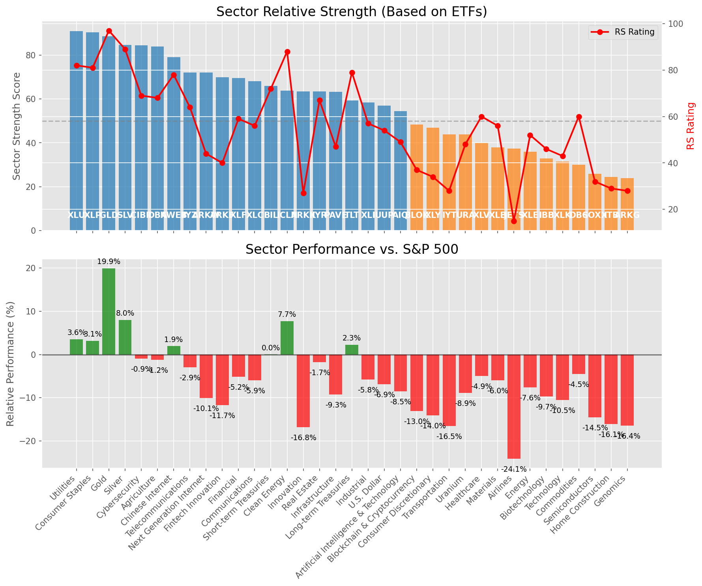

# **Daily Relative Strength Report**

**Date:** 2025-04-29

## **Market Valuation (Buffett Indicator)**

| Metric | Value |
|--------|-------|
| **Market Valuation** | **Fair Valued** |
| **Current Ratio** | 9.18 |
| **Historical Mean** | 9.54 |
| **Standard Deviation** | 0.52 |
| **Z-Score (StdDev from Mean)** | -0.82 |
| **Total Market Cap** | $272.80 trillion |
| **GDP** | $29.72 trillion |

## **Market Insights**

### **Market is Fairly Valued**

The market appears to be trading within a reasonable range of historical valuations. This suggests a balanced approach to equity investing is appropriate. Investors should:

- Focus on individual stock selection based on fundamentals and technicals
- Maintain normal equity allocations aligned with long-term goals
- Pay attention to sector rotation and relative strength
- Watch for changes in market leadership

Fair valuation typically suggests normal market returns can be expected, with stock selection becoming increasingly important.

### **Buffett Indicator Overview**

The Buffett Indicator (Total Market Cap / GDP) is a measure of the stock market's valuation relative to the size of the economy. It is named after Warren Buffett, who described it as "probably the best single measure of where valuations stand at any given moment."

- **Values above +2 standard deviations:** Market significantly overvalued
- **Values above +1 standard deviation:** Market overvalued
- **Values between -1 and +1 standard deviations:** Market fairly valued
- **Values below -1 standard deviation:** Market undervalued
- **Values below -2 standard deviations:** Market significantly undervalued

---

## **Sector Relative Strength**

Based on William O'Neil's Relative Strength Methodology

| ETF | Strength | RS Rating | Performance | Above Key MAs | Trend | Sector |
|-----|----------|-----------|-------------|--------------|-------|--------|
| [SLV](https://www.tradingview.com/chart/?symbol=SLV) | 95.0 | 90.0 | 8.72% | 10d ✓, 50d ✓, 200d ✓ | ↗️ | Silver |
| [XLU](https://www.tradingview.com/chart/?symbol=XLU) | 90.5 | 81.0 | 3.40% | 10d ✓, 50d ✓, 200d ✓ | ↗️ | Utilities |
| [GLD](https://www.tradingview.com/chart/?symbol=GLD) | 88.6 | 97.0 | 20.04% | 10d ✗, 50d ✓, 200d ✓ | ↗️ | Gold |
| [CIBR](https://www.tradingview.com/chart/?symbol=CIBR) | 84.5 | 69.0 | -0.77% | 10d ✓, 50d ✓, 200d ✓ | ↗️ | Cybersecurity |
| [DBA](https://www.tradingview.com/chart/?symbol=DBA) | 84.0 | 68.0 | -1.21% | 10d ✓, 50d ✓, 200d ✓ | ↗️ | Agriculture |
| [XLP](https://www.tradingview.com/chart/?symbol=XLP) | 80.6 | 81.0 | 3.03% | 10d ✗, 50d ✓, 200d ✓ | ↗️ | Consumer Staples |
| [KWEB](https://www.tradingview.com/chart/?symbol=KWEB) | 79.1 | 78.0 | 2.12% | 10d ✓, 50d ✗, 200d ✓ | ↗️ | Chinese Internet |
| [IYZ](https://www.tradingview.com/chart/?symbol=IYZ) | 72.1 | 64.0 | -2.85% | 10d ✓, 50d ✗, 200d ✓ | ↗️ | Telecommunications |
| [ARKW](https://www.tradingview.com/chart/?symbol=ARKW) | 72.0 | 44.0 | -10.10% | 10d ✓, 50d ✓, 200d ✓ | ↗️ | Next Generation Internet |
| [ARKF](https://www.tradingview.com/chart/?symbol=ARKF) | 70.5 | 41.0 | -11.56% | 10d ✓, 50d ✓, 200d ✓ | ↗️ | Fintech Innovation |
| [XLF](https://www.tradingview.com/chart/?symbol=XLF) | 69.1 | 58.0 | -5.20% | 10d ✓, 50d ✗, 200d ✓ | ↗️ | Financial |
| [XLC](https://www.tradingview.com/chart/?symbol=XLC) | 68.1 | 56.0 | -5.94% | 10d ✓, 50d ✗, 200d ✓ | ↗️ | Communications |
| [BIL](https://www.tradingview.com/chart/?symbol=BIL) | 66.0 | 72.0 | 0.02% | 10d ✓, 50d ✓, 200d ✓ | ↘️ | Short-term Treasuries |
| [ICLN](https://www.tradingview.com/chart/?symbol=ICLN) | 64.3 | 89.0 | 7.81% | 10d ✓, 50d ✓, 200d ✗ | ↘️ | Clean Energy |
| [ARKK](https://www.tradingview.com/chart/?symbol=ARKK) | 63.5 | 27.0 | -16.74% | 10d ✓, 50d ✓, 200d ✓ | ↗️ | Innovation |
| [IYR](https://www.tradingview.com/chart/?symbol=IYR) | 63.4 | 67.0 | -1.60% | 10d ✓, 50d ✗, 200d ✗ | ↗️ | Real Estate |
| [PAVE](https://www.tradingview.com/chart/?symbol=PAVE) | 63.3 | 47.0 | -9.11% | 10d ✓, 50d ✓, 200d ✗ | ↗️ | Infrastructure |
| [TLT](https://www.tradingview.com/chart/?symbol=TLT) | 58.8 | 78.0 | 2.09% | 10d ✓, 50d ✓, 200d ✗ | ↘️ | Long-term Treasuries |
| [XLI](https://www.tradingview.com/chart/?symbol=XLI) | 58.4 | 57.0 | -5.73% | 10d ✓, 50d ✗, 200d ✗ | ↗️ | Industrial |
| [UUP](https://www.tradingview.com/chart/?symbol=UUP) | 56.4 | 53.0 | -6.92% | 10d ✓, 50d ✗, 200d ✗ | ↗️ | U.S. Dollar |
| [AIQ](https://www.tradingview.com/chart/?symbol=AIQ) | 54.4 | 49.0 | -8.49% | 10d ✓, 50d ✗, 200d ✗ | ↗️ | Artificial Intelligence & Technology |
| [BLOK](https://www.tradingview.com/chart/?symbol=BLOK) | 47.9 | 36.0 | -13.04% | 10d ✓, 50d ✗, 200d ✗ | ↗️ | Blockchain & Cryptocurrency |
| [XLY](https://www.tradingview.com/chart/?symbol=XLY) | 46.4 | 33.0 | -14.34% | 10d ✓, 50d ✗, 200d ✗ | ↗️ | Consumer Discretionary |
| [IYT](https://www.tradingview.com/chart/?symbol=IYT) | 43.9 | 28.0 | -16.36% | 10d ✓, 50d ✗, 200d ✗ | ↗️ | Transportation |
| [URA](https://www.tradingview.com/chart/?symbol=URA) | 43.8 | 48.0 | -8.83% | 10d ✓, 50d ✓, 200d ✗ | ↘️ | Uranium |
| [XLV](https://www.tradingview.com/chart/?symbol=XLV) | 39.9 | 60.0 | -4.56% | 10d ✓, 50d ✗, 200d ✗ | ↘️ | Healthcare |
| [XLB](https://www.tradingview.com/chart/?symbol=XLB) | 38.4 | 57.0 | -5.78% | 10d ✓, 50d ✗, 200d ✗ | ↘️ | Materials |
| [JETS](https://www.tradingview.com/chart/?symbol=JETS) | 37.4 | 15.0 | -23.90% | 10d ✓, 50d ✗, 200d ✗ | ↗️ | Airlines |
| [XLE](https://www.tradingview.com/chart/?symbol=XLE) | 35.9 | 52.0 | -7.44% | 10d ✓, 50d ✗, 200d ✗ | ↘️ | Energy |
| [IBB](https://www.tradingview.com/chart/?symbol=IBB) | 32.9 | 46.0 | -9.37% | 10d ✓, 50d ✗, 200d ✗ | ↘️ | Biotechnology |
| [XLK](https://www.tradingview.com/chart/?symbol=XLK) | 31.9 | 44.0 | -10.36% | 10d ✓, 50d ✗, 200d ✗ | ↘️ | Technology |
| [DBC](https://www.tradingview.com/chart/?symbol=DBC) | 30.5 | 61.0 | -4.41% | 10d ✗, 50d ✗, 200d ✗ | ↘️ | Commodities |
| [SOXX](https://www.tradingview.com/chart/?symbol=SOXX) | 26.9 | 34.0 | -14.01% | 10d ✓, 50d ✗, 200d ✗ | ↘️ | Semiconductors |
| [ARKG](https://www.tradingview.com/chart/?symbol=ARKG) | 24.9 | 30.0 | -15.68% | 10d ✓, 50d ✗, 200d ✗ | ↘️ | Genomics |
| [ITB](https://www.tradingview.com/chart/?symbol=ITB) | 23.9 | 28.0 | -16.09% | 10d ✓, 50d ✗, 200d ✗ | ↘️ | Home Construction |

### **Sector ETF Performance Interpretation**

This table shows the relative strength metrics for different market sectors based on their representative ETFs:

- **ETF**: The ETF used to measure sector performance (click for chart)
- **Strength**: Overall sector strength score (0-100) combining multiple factors
- **RS Rating**: O'Neil RS rating of the sector ETF
- **Performance**: Performance of the sector ETF relative to SPY
- **Above Key MAs**: Whether the ETF is trading above its 10, 50, and 200-day moving averages
- **Trend**: Whether the sector is in an uptrend (↗️) or downtrend (↘️)

### **Current Sector Leadership**

The current market leadership is coming from the following sectors: **Silver, Utilities, Gold**.

The **Silver** sector (represented by **SLV**) is showing particularly strong relative strength with an RS rating of 90.0 and performance of 8.72% vs. the S&P 500. This sector is trading above its 10-day, 50-day, 200-day moving average(s). Investors should consider focusing on high RS stocks within these leading sectors for potential outperformance.

---

## **Buy Recommendations**

The following 99 stocks show exceptional relative strength:

| RS Rating | Buy Score | Current Price | Chart | Name | Ticker |
|-----------|-----------|---------------|-------|------|--------|
| 100 | 100 | $115.93 | [Chart](https://www.tradingview.com/chart/?symbol=PLTR) | Palantir Technologies Inc. Class A Common Stock | PLTR |
| 100 | 100 | $18.49 | [Chart](https://www.tradingview.com/chart/?symbol=SWI) | SolarWinds Corporation Common Stock | SWI |
| 100 | 100 | $73.72 | [Chart](https://www.tradingview.com/chart/?symbol=VRNA) | Verona Pharma plc | VRNA |
| 100 | 100 | $23.23 | [Chart](https://www.tradingview.com/chart/?symbol=PRA) | ProAssurance Corporation | PRA |
| 100 | 100 | $116.58 | [Chart](https://www.tradingview.com/chart/?symbol=WGS) | GeneDx Holdings Corp. Class A Common Stock | WGS |
| 99 | 100 | $26.86 | [Chart](https://www.tradingview.com/chart/?symbol=DB) | Deutsche Bank Aktiengesellschaft | DB |
| 99 | 100 | $25.43 | [Chart](https://www.tradingview.com/chart/?symbol=TGI) | Triumph Group, Inc. | TGI |
| 99 | 100 | $278.48 | [Chart](https://www.tradingview.com/chart/?symbol=VRSN) | VeriSign Inc | VRSN |
| 99 | 100 | $170.51 | [Chart](https://www.tradingview.com/chart/?symbol=PM) | Philip Morris International Inc. | PM |
| 99 | 100 | $51.35 | [Chart](https://www.tradingview.com/chart/?symbol=SEZL) | Sezzle Inc. Common Stock | SEZL |
| 98 | 100 | $89.70 | [Chart](https://www.tradingview.com/chart/?symbol=SNEX) | StoneX Group Inc. Common Stock | SNEX |
| 98 | 100 | $23.77 | [Chart](https://www.tradingview.com/chart/?symbol=OR) | Osisko Gold Royalties Ltd | OR |
| 98 | 100 | $44.37 | [Chart](https://www.tradingview.com/chart/?symbol=MRX) | Marex Group plc Ordinary Shares | MRX |
| 97 | 100 | $117.22 | [Chart](https://www.tradingview.com/chart/?symbol=EHC) | Encompass Health Corporation Common Stock | EHC |
| 97 | 100 | $71.33 | [Chart](https://www.tradingview.com/chart/?symbol=WRB) | W.R. Berkley Corporation | WRB |
| 97 | 100 | $73.29 | [Chart](https://www.tradingview.com/chart/?symbol=CORT) | Corcept Therapeutics Inc. | CORT |
| 97 | 100 | $30.19 | [Chart](https://www.tradingview.com/chart/?symbol=EUFN) | iShares MSCI Europe Financials ETF | EUFN |
| 97 | 100 | $21.64 | [Chart](https://www.tradingview.com/chart/?symbol=GRND) | Grindr Inc. | GRND |
| 96 | 100 | $116.27 | [Chart](https://www.tradingview.com/chart/?symbol=BJ) | BJs Wholesale Club Holdings, Inc. Common Stock | BJ |
| 96 | 100 | $53.83 | [Chart](https://www.tradingview.com/chart/?symbol=PPC) | Pilgrims Pride Corporation | PPC |
| 96 | 100 | $142.56 | [Chart](https://www.tradingview.com/chart/?symbol=LRN) | Stride, Inc. | LRN |
| 96 | 100 | $38.27 | [Chart](https://www.tradingview.com/chart/?symbol=CNP) | CenterPoint Energy, Inc. | CNP |
| 96 | 100 | $71.37 | [Chart](https://www.tradingview.com/chart/?symbol=KR) | The Kroger Co. | KR |
| 95 | 100 | $16.97 | [Chart](https://www.tradingview.com/chart/?symbol=SPNT) | SiriusPoint Ltd. | SPNT |
| 95 | 100 | $137.42 | [Chart](https://www.tradingview.com/chart/?symbol=DTE) | DTE Energy Company | DTE |
| 95 | 100 | $247.71 | [Chart](https://www.tradingview.com/chart/?symbol=RSG) | Republic Services Inc. | RSG |
| 95 | 100 | $1120.24 | [Chart](https://www.tradingview.com/chart/?symbol=NFLX) | NetFlix Inc | NFLX |
| 95 | 100 | $88.88 | [Chart](https://www.tradingview.com/chart/?symbol=CCEP) | Coca-Cola Europacific Partners plc Ordinary Shares | CCEP |
| 95 | 100 | $65.51 | [Chart](https://www.tradingview.com/chart/?symbol=RYTM) | Rhythm Pharmaceuticals, Inc. Common Stock | RYTM |
| 95 | 100 | $39.65 | [Chart](https://www.tradingview.com/chart/?symbol=EWG) | iShares MSCI Germany ETF | EWG |
| 95 | 100 | $271.59 | [Chart](https://www.tradingview.com/chart/?symbol=CME) | CME Group Inc. | CME |
| 94 | 100 | $120.66 | [Chart](https://www.tradingview.com/chart/?symbol=COOP) | Mr. Cooper Group Inc. Common Stock | COOP |
| 94 | 100 | $22.78 | [Chart](https://www.tradingview.com/chart/?symbol=CXW) | CoreCivic, Inc. | CXW |
| 94 | 100 | $533.93 | [Chart](https://www.tradingview.com/chart/?symbol=BRK.B) | BERKSHIRE HATHAWAY Class B | BRK.B |
| 94 | 100 | $172.05 | [Chart](https://www.tradingview.com/chart/?symbol=SFM) | Sprouts Farmers Market, Inc. | SFM |
| 94 | 100 | $178.37 | [Chart](https://www.tradingview.com/chart/?symbol=DGX) | Quest Diagnostics Inc. | DGX |
| 94 | 100 | $78.73 | [Chart](https://www.tradingview.com/chart/?symbol=OGS) | ONE GAS, INC. | OGS |
| 94 | 100 | $290.39 | [Chart](https://www.tradingview.com/chart/?symbol=COR) | Cencora, Inc. | COR |
| 94 | 100 | $69.39 | [Chart](https://www.tradingview.com/chart/?symbol=VTR) | Ventas, Inc. | VTR |
| 94 | 100 | $379.68 | [Chart](https://www.tradingview.com/chart/?symbol=MSTR) | MicroStrategy Inc | MSTR |
| 94 | 100 | $159.80 | [Chart](https://www.tradingview.com/chart/?symbol=ATO) | Atmos Energy Corporation | ATO |
| 93 | 100 | $73.67 | [Chart](https://www.tradingview.com/chart/?symbol=CMS) | CMS Energy Corporation | CMS |
| 93 | 100 | $27.32 | [Chart](https://www.tradingview.com/chart/?symbol=T) | AT&T Inc. | T |
| 93 | 100 | $50.39 | [Chart](https://www.tradingview.com/chart/?symbol=TRP) | TC Energy Corporation | TRP |
| 93 | 100 | $58.73 | [Chart](https://www.tradingview.com/chart/?symbol=MO) | Altria Group, Inc. | MO |
| 92 | 100 | $587.20 | [Chart](https://www.tradingview.com/chart/?symbol=SPOT) | Spotify Technology S.A. | SPOT |
| 92 | 100 | $200.50 | [Chart](https://www.tradingview.com/chart/?symbol=BAP) | Credicorp LTD | BAP |
| 92 | 100 | $16.16 | [Chart](https://www.tradingview.com/chart/?symbol=BCS) | Barclays PLC | BCS |
| 92 | 100 | $95.34 | [Chart](https://www.tradingview.com/chart/?symbol=PNW) | Pinnacle West Capital Corporation | PNW |
| 92 | 100 | $109.10 | [Chart](https://www.tradingview.com/chart/?symbol=WEC) | WEC Energy Group, Inc. | WEC |
| 92 | 100 | $298.93 | [Chart](https://www.tradingview.com/chart/?symbol=PEN) | Penumbra, Inc. | PEN |
| 92 | 100 | $36.34 | [Chart](https://www.tradingview.com/chart/?symbol=PPL) | PPL Corporation | PPL |
| 92 | 100 | $151.88 | [Chart](https://www.tradingview.com/chart/?symbol=AGX) | Argan, Inc | AGX |
| 91 | 100 | $140.04 | [Chart](https://www.tradingview.com/chart/?symbol=CAH) | Cardinal Health, Inc. | CAH |
| 91 | 100 | $107.49 | [Chart](https://www.tradingview.com/chart/?symbol=ATGE) | Adtalem Global Education Inc. Common Shares | ATGE |
| 91 | 100 | $42.80 | [Chart](https://www.tradingview.com/chart/?symbol=BTI) | British American Tobacco p.l.c. American Depositary Shares, American Depositary Shares, each representing one Ordinary Share | BTI |
| 91 | 100 | $34.66 | [Chart](https://www.tradingview.com/chart/?symbol=FDP) | Fresh Del Monte Produce Inc. | FDP |
| 91 | 100 | $117.17 | [Chart](https://www.tradingview.com/chart/?symbol=CWST) | Casella Waste Systems Inc | CWST |
| 90 | 100 | $68.92 | [Chart](https://www.tradingview.com/chart/?symbol=EVRG) | Evergy, Inc. | EVRG |
| 90 | 100 | $53.81 | [Chart](https://www.tradingview.com/chart/?symbol=RELX) | RELX PLC | RELX |
| 90 | 100 | $1396.39 | [Chart](https://www.tradingview.com/chart/?symbol=ORLY) | O'Reilly Automotive, Inc. | ORLY |
| 90 | 100 | $42.17 | [Chart](https://www.tradingview.com/chart/?symbol=HMN) | Horace Mann Educators Corporation | HMN |
| 90 | 100 | $39.79 | [Chart](https://www.tradingview.com/chart/?symbol=NI) | NiSource Inc. | NI |
| 89 | 100 | $59.76 | [Chart](https://www.tradingview.com/chart/?symbol=WMB) | Williams Companies Inc. | WMB |
| 89 | 100 | $45.72 | [Chart](https://www.tradingview.com/chart/?symbol=OGE) | OGE Energy Corp. | OGE |
| 89 | 100 | $32.16 | [Chart](https://www.tradingview.com/chart/?symbol=AHR) | American Healthcare REIT, Inc. | AHR |
| 89 | 100 | $32.85 | [Chart](https://www.tradingview.com/chart/?symbol=UGI) | UGI Corporation | UGI |
| 88 | 100 | $31.68 | [Chart](https://www.tradingview.com/chart/?symbol=LTH) | Life Time Group Holdings, Inc. | LTH |
| 87 | 100 | $99.36 | [Chart](https://www.tradingview.com/chart/?symbol=AEE) | Ameren Corporation | AEE |
| 87 | 100 | $292.21 | [Chart](https://www.tradingview.com/chart/?symbol=SAP) | SAP SE | SAP |
| 87 | 100 | $18.95 | [Chart](https://www.tradingview.com/chart/?symbol=KT) | KT Corp. | KT |
| 89 | 99 | $107.91 | [Chart](https://www.tradingview.com/chart/?symbol=AEP) | American Electric Power Company, Inc. | AEP |
| 89 | 99 | $43.80 | [Chart](https://www.tradingview.com/chart/?symbol=NWN) | Northwest Natural Holding Company | NWN |
| 88 | 99 | $171.84 | [Chart](https://www.tradingview.com/chart/?symbol=CVLT) | Commault Systems, Inc. | CVLT |
| 86 | 99 | $37.86 | [Chart](https://www.tradingview.com/chart/?symbol=TDS) | Telephone and Data Systems Inc. | TDS |
| 86 | 99 | $70.51 | [Chart](https://www.tradingview.com/chart/?symbol=XEL) | Xcel Energy, Inc. | XEL |
| 88 | 98 | $41.92 | [Chart](https://www.tradingview.com/chart/?symbol=GLNG) | Golar LNG Ltd | GLNG |
| 88 | 98 | $122.05 | [Chart](https://www.tradingview.com/chart/?symbol=HIG) | The Hartford Insurance Group, Inc. | HIG |
| 87 | 97 | $32.46 | [Chart](https://www.tradingview.com/chart/?symbol=PAY) | Paymentus Holdings, Inc. | PAY |
| 87 | 97 | $77.81 | [Chart](https://www.tradingview.com/chart/?symbol=ADC) | Agree Realty Corporation | ADC |
| 86 | 97 | $93.68 | [Chart](https://www.tradingview.com/chart/?symbol=DAVE) | Dave Inc. Class A Common Stock | DAVE |
| 86 | 97 | $263.92 | [Chart](https://www.tradingview.com/chart/?symbol=TRV) | The Travelers Companies, Inc. | TRV |
| 85 | 97 | $111.85 | [Chart](https://www.tradingview.com/chart/?symbol=ALTR) | Altair Engineering Inc. Class A Common Stock | ALTR |
| 85 | 97 | $165.62 | [Chart](https://www.tradingview.com/chart/?symbol=THG) | The Hanover Insurance Group, Inc. | THG |
| 84 | 97 | $79.50 | [Chart](https://www.tradingview.com/chart/?symbol=UNM) | Unum Group | UNM |
| 86 | 96 | $56.63 | [Chart](https://www.tradingview.com/chart/?symbol=IGF) | iShares Global Infrastructure ETF | IGF |
| 86 | 96 | $216.25 | [Chart](https://www.tradingview.com/chart/?symbol=CBOE) | Cboe Global Markets, Inc. | CBOE |
| 84 | 95 | $56.64 | [Chart](https://www.tradingview.com/chart/?symbol=ULS) | UL Solutions Inc. | ULS |
| 83 | 95 | $371.23 | [Chart](https://www.tradingview.com/chart/?symbol=GEV) | GE Vernova Inc. | GEV |
| 84 | 94 | $15.44 | [Chart](https://www.tradingview.com/chart/?symbol=MIR) | Mirion Technologies, Inc. | MIR |
| 83 | 94 | $292.88 | [Chart](https://www.tradingview.com/chart/?symbol=VRSK) | Verisk Analytics, Inc. Common Stock | VRSK |
| 81 | 93 | $36.98 | [Chart](https://www.tradingview.com/chart/?symbol=DRS) | Leonardo DRS, Inc. Common Stock | DRS |
| 82 | 92 | $124.17 | [Chart](https://www.tradingview.com/chart/?symbol=BECN) | Beacon Roofing Supply, Inc. | BECN |
| 81 | 92 | $34.46 | [Chart](https://www.tradingview.com/chart/?symbol=KTOS) | Kratos Defense & Security Solutions, Inc. | KTOS |
| 81 | 92 | $988.85 | [Chart](https://www.tradingview.com/chart/?symbol=COST) | Costco Wholesale Corp | COST |
| 81 | 91 | $18.01 | [Chart](https://www.tradingview.com/chart/?symbol=PTVE) | Pactiv Evergreen Inc. Common stock | PTVE |
| 80 | 91 | $34.78 | [Chart](https://www.tradingview.com/chart/?symbol=HCP) | HashiCorp, Inc. Class A Common Stock | HCP |
| 80 | 90 | $40.55 | [Chart](https://www.tradingview.com/chart/?symbol=FHI) | Federated Hermes, Inc. | FHI |
| 80 | 90 | $50.13 | [Chart](https://www.tradingview.com/chart/?symbol=VTIP) | Vanguard Short-Term Inflation-Protected Securities Index Fund | VTIP |

---

## **Sell Recommendations**

The following 163 stocks show deteriorating relative strength:

| RS Rating | Sell Score | Current Price | Chart | Name | Ticker |
|-----------|------------|---------------|-------|------|--------|
| 1 | 100 | $10.84 | [Chart](https://www.tradingview.com/chart/?symbol=XNCR) | Xencor, Inc. | XNCR |
| 1 | 100 | $15.71 | [Chart](https://www.tradingview.com/chart/?symbol=VTLE) | Vital Energy, Inc. | VTLE |
| 1 | 100 | $16.83 | [Chart](https://www.tradingview.com/chart/?symbol=TNDM) | Tandem Diabetes Care, Inc. | TNDM |
| 1 | 100 | $10.05 | [Chart](https://www.tradingview.com/chart/?symbol=FTRE) | Fortrea Holdings Inc. Common Stock | FTRE |
| 1 | 100 | $10.86 | [Chart](https://www.tradingview.com/chart/?symbol=AMRC) | Ameresco, Inc. | AMRC |
| 2 | 100 | $16.78 | [Chart](https://www.tradingview.com/chart/?symbol=SSTK) | SHUTTERSTOCK, INC. | SSTK |
| 2 | 100 | $28.94 | [Chart](https://www.tradingview.com/chart/?symbol=CIVI) | Civitas Resources, Inc. | CIVI |
| 2 | 100 | $18.46 | [Chart](https://www.tradingview.com/chart/?symbol=DAVA) | Endava plc American Depositary Shares (each representing one Class A Ordinary Share) | DAVA |
| 3 | 100 | $20.95 | [Chart](https://www.tradingview.com/chart/?symbol=SDRL) | Seadrill Limited | SDRL |
| 3 | 100 | $103.76 | [Chart](https://www.tradingview.com/chart/?symbol=BOOT) | Boot Barn Holdings, Inc. | BOOT |
| 3 | 100 | $13.52 | [Chart](https://www.tradingview.com/chart/?symbol=ODP) | The ODP Corporation Common Stock | ODP |
| 3 | 100 | $42.49 | [Chart](https://www.tradingview.com/chart/?symbol=CMPR) | Cimpress PLC Ordinary Shares (Ireland) | CMPR |
| 4 | 100 | $58.84 | [Chart](https://www.tradingview.com/chart/?symbol=LABU) | Direxion Daily S&P Biotech Bull 3X Shares | LABU |
| 4 | 100 | $24.34 | [Chart](https://www.tradingview.com/chart/?symbol=RPD) | Rapid7, Inc. Common Stock | RPD |
| 4 | 100 | $19.20 | [Chart](https://www.tradingview.com/chart/?symbol=SG) | Sweetgreen, Inc. | SG |
| 4 | 100 | $15.42 | [Chart](https://www.tradingview.com/chart/?symbol=ZVZZT) | SUPER Montage TEST SYMBOL | ZVZZT |
| 5 | 100 | $22.88 | [Chart](https://www.tradingview.com/chart/?symbol=NSSC) | Napco Security Technologies, Inc | NSSC |
| 5 | 100 | $10.04 | [Chart](https://www.tradingview.com/chart/?symbol=LSPD) | Lightspeed Commerce Inc. | LSPD |
| 5 | 100 | $21.43 | [Chart](https://www.tradingview.com/chart/?symbol=SPT) | Sprout Social, Inc Class A Common Stock | SPT |
| 5 | 100 | $12.51 | [Chart](https://www.tradingview.com/chart/?symbol=IMXI) | International Money Express, Inc. | IMXI |
| 5 | 100 | $13.04 | [Chart](https://www.tradingview.com/chart/?symbol=GCT) | GigaCloud Technology Inc Class A Ordinary Shares | GCT |
| 6 | 100 | $40.83 | [Chart](https://www.tradingview.com/chart/?symbol=WDC) | Western Digital Corp. | WDC |
| 6 | 100 | $24.50 | [Chart](https://www.tradingview.com/chart/?symbol=AMPH) | Amphastar Pharmaceuticals, Inc. | AMPH |
| 6 | 100 | $12.16 | [Chart](https://www.tradingview.com/chart/?symbol=CARS) | Cars.com Inc. Common Stock | CARS |
| 6 | 100 | $32.86 | [Chart](https://www.tradingview.com/chart/?symbol=SCSC) | Scansource Inc | SCSC |
| 6 | 100 | $13.54 | [Chart](https://www.tradingview.com/chart/?symbol=DV) | DoubleVerify Holdings, Inc. | DV |
| 7 | 100 | $72.33 | [Chart](https://www.tradingview.com/chart/?symbol=MKSI) | MKS Instruments Inc | MKSI |
| 7 | 100 | $38.47 | [Chart](https://www.tradingview.com/chart/?symbol=DIOD) | Diodes Inc | DIOD |
| 7 | 100 | $13.64 | [Chart](https://www.tradingview.com/chart/?symbol=ARWR) | Arrowhead Research Corporation | ARWR |
| 7 | 100 | $17.47 | [Chart](https://www.tradingview.com/chart/?symbol=IART) | Integra LifeSciences Holdings | IART |
| 10 | 100 | $13.94 | [Chart](https://www.tradingview.com/chart/?symbol=XRAY) | DENTSPLY SIRONA Inc. | XRAY |
| 10 | 100 | $18.63 | [Chart](https://www.tradingview.com/chart/?symbol=PDFS) | PDF Solutions Inc | PDFS |
| 10 | 100 | $120.46 | [Chart](https://www.tradingview.com/chart/?symbol=BLDR) | Builders FirstSource, Inc. | BLDR |
| 10 | 100 | $58.13 | [Chart](https://www.tradingview.com/chart/?symbol=AMWD) | American Woodmark Corp | AMWD |
| 11 | 100 | $12.79 | [Chart](https://www.tradingview.com/chart/?symbol=TRIP) | TripAdvisor, Inc. | TRIP |
| 11 | 100 | $12.88 | [Chart](https://www.tradingview.com/chart/?symbol=ADNT) | Adient plc Ordinary Shares | ADNT |
| 11 | 100 | $28.55 | [Chart](https://www.tradingview.com/chart/?symbol=SRDX) | Surmodics, Inc. Common Stock | SRDX |
| 12 | 100 | $20.65 | [Chart](https://www.tradingview.com/chart/?symbol=FOXF) | Fox Factory Holding Corp. Common Stock | FOXF |
| 12 | 100 | $20.04 | [Chart](https://www.tradingview.com/chart/?symbol=AMN) | AMN Healthcare Services | AMN |
| 14 | 100 | $11.81 | [Chart](https://www.tradingview.com/chart/?symbol=JAMF) | Jamf Holding Corp. Common Stock | JAMF |
| 16 | 100 | $21.42 | [Chart](https://www.tradingview.com/chart/?symbol=ST) | Sensata Technologies Holding plc | ST |
| 17 | 100 | $12.47 | [Chart](https://www.tradingview.com/chart/?symbol=MED) | Medifast, Inc. | MED |
| 8 | 99 | $45.83 | [Chart](https://www.tradingview.com/chart/?symbol=PSTG) | Pure Storage, Inc. Class A | PSTG |
| 8 | 99 | $10.92 | [Chart](https://www.tradingview.com/chart/?symbol=AEYE) | AudioEye, Inc. Common Stock | AEYE |
| 9 | 99 | $35.34 | [Chart](https://www.tradingview.com/chart/?symbol=CRC) | California Resources Corporation | CRC |
| 10 | 99 | $15.36 | [Chart](https://www.tradingview.com/chart/?symbol=MEG) | Montrose Environmental Group, Inc. | MEG |
| 11 | 99 | $31.60 | [Chart](https://www.tradingview.com/chart/?symbol=UWM) | ProShares Ultra Russell2000 | UWM |
| 12 | 99 | $15.66 | [Chart](https://www.tradingview.com/chart/?symbol=DXC) | DXC Technology Company | DXC |
| 14 | 99 | $112.48 | [Chart](https://www.tradingview.com/chart/?symbol=ARM) | Arm Holdings plc American Depositary Shares | ARM |
| 7 | 98 | $21.76 | [Chart](https://www.tradingview.com/chart/?symbol=TDC) | TERADATA CORPORATION | TDC |
| 9 | 98 | $25.39 | [Chart](https://www.tradingview.com/chart/?symbol=RNG) | RINGCENTRAL, INC. | RNG |
| 15 | 98 | $65.70 | [Chart](https://www.tradingview.com/chart/?symbol=CAMT) | Camtek Ltd | CAMT |
| 3 | 97 | $77.54 | [Chart](https://www.tradingview.com/chart/?symbol=ILMN) | Illumina Inc | ILMN |
| 11 | 97 | $10.77 | [Chart](https://www.tradingview.com/chart/?symbol=SONO) | Sonos, Inc. Common Stock | SONO |
| 12 | 97 | $16.66 | [Chart](https://www.tradingview.com/chart/?symbol=MLKN) | MillerKnoll, Inc. Common Stock | MLKN |
| 7 | 96 | $15.48 | [Chart](https://www.tradingview.com/chart/?symbol=DLX) | Deluxe Corporation | DLX |
| 8 | 96 | $10.01 | [Chart](https://www.tradingview.com/chart/?symbol=VYX) | NCR Voyix Corporation | VYX |
| 13 | 96 | $88.52 | [Chart](https://www.tradingview.com/chart/?symbol=NTAP) | NetApp, Inc | NTAP |
| 9 | 95 | $12.05 | [Chart](https://www.tradingview.com/chart/?symbol=MBC) | MasterBrand, Inc. | MBC |
| 16 | 95 | $52.40 | [Chart](https://www.tradingview.com/chart/?symbol=IIPR) | Innovative Industrial Properties, Inc. Common stock | IIPR |
| 18 | 95 | $11.47 | [Chart](https://www.tradingview.com/chart/?symbol=KELYA) | Kelly Services Inc | KELYA |
| 9 | 94 | $19.26 | [Chart](https://www.tradingview.com/chart/?symbol=BZH) | Beazer Homes USA, Inc. New | BZH |
| 7 | 93 | $102.23 | [Chart](https://www.tradingview.com/chart/?symbol=DDOG) | Datadog, Inc. Class A Common Stock | DDOG |
| 7 | 93 | $25.10 | [Chart](https://www.tradingview.com/chart/?symbol=TRN) | Trinity Industries, Inc. | TRN |
| 12 | 93 | $51.48 | [Chart](https://www.tradingview.com/chart/?symbol=CNMD) | CONMED Corporation | CNMD |
| 13 | 93 | $62.79 | [Chart](https://www.tradingview.com/chart/?symbol=SPB) | Spectrum Brands Holdings, Inc. | SPB |
| 19 | 93 | $13.03 | [Chart](https://www.tradingview.com/chart/?symbol=ARCT) | Arcturus Therapeutics Holdings Inc. Common Stock | ARCT |
| 11 | 92 | $107.83 | [Chart](https://www.tradingview.com/chart/?symbol=A) | Agilent Technologies Inc. | A |
| 14 | 92 | $95.33 | [Chart](https://www.tradingview.com/chart/?symbol=BCC) | Boise Cascade Company | BCC |
| 14 | 92 | $209.71 | [Chart](https://www.tradingview.com/chart/?symbol=FDX) | FedEx Corporation | FDX |
| 15 | 92 | $29.00 | [Chart](https://www.tradingview.com/chart/?symbol=MBUU) | Malibu Boats, Inc. Class A | MBUU |
| 16 | 92 | $39.74 | [Chart](https://www.tradingview.com/chart/?symbol=TWST) | Twist Bioscience Corporation Common Stock | TWST |
| 18 | 92 | $25.87 | [Chart](https://www.tradingview.com/chart/?symbol=GDEN) | Golden Entertainment, Inc. Common Stock | GDEN |
| 20 | 92 | $68.62 | [Chart](https://www.tradingview.com/chart/?symbol=TTC) | Toro Company (The) | TTC |
| 15 | 91 | $11.88 | [Chart](https://www.tradingview.com/chart/?symbol=APLE) | Apple Hospitality REIT, Inc. | APLE |
| 11 | 90 | $10.24 | [Chart](https://www.tradingview.com/chart/?symbol=EXPI) | eXp World Holdings, Inc. Common Stock | EXPI |
| 17 | 90 | $53.01 | [Chart](https://www.tradingview.com/chart/?symbol=KBH) | KB Home | KBH |
| 25 | 90 | $15.57 | [Chart](https://www.tradingview.com/chart/?symbol=PSFE) | Paysafe Limited | PSFE |
| 26 | 90 | $12.29 | [Chart](https://www.tradingview.com/chart/?symbol=PR) | Permian Resources Corporation | PR |
| 27 | 90 | $10.34 | [Chart](https://www.tradingview.com/chart/?symbol=CMRE) | Costamare Inc. | CMRE |
| 31 | 90 | $14.44 | [Chart](https://www.tradingview.com/chart/?symbol=FXN) | First Trust Energy AlphaDEX Fund | FXN |
| 13 | 89 | $10.29 | [Chart](https://www.tradingview.com/chart/?symbol=SEMR) | SEMrush Holdings, Inc. | SEMR |
| 13 | 89 | $29.16 | [Chart](https://www.tradingview.com/chart/?symbol=CDRE) | Cadre Holdings, Inc. | CDRE |
| 16 | 89 | $11.34 | [Chart](https://www.tradingview.com/chart/?symbol=HPK) | HighPeak Energy, Inc. Common Stock | HPK |
| 16 | 89 | $28.95 | [Chart](https://www.tradingview.com/chart/?symbol=YETI) | YETI Holdings, Inc. Common Stock | YETI |
| 18 | 89 | $16.70 | [Chart](https://www.tradingview.com/chart/?symbol=SVOL) | Simplify Volatility Premium ETF | SVOL |
| 22 | 89 | $58.04 | [Chart](https://www.tradingview.com/chart/?symbol=TREX) | Trex Company, Inc. | TREX |
| 22 | 89 | $93.73 | [Chart](https://www.tradingview.com/chart/?symbol=CHRD) | Chord Energy Corporation Common Stock | CHRD |
| 15 | 88 | $10.15 | [Chart](https://www.tradingview.com/chart/?symbol=HLIT) | Harmonic Inc | HLIT |
| 24 | 88 | $45.26 | [Chart](https://www.tradingview.com/chart/?symbol=EXAS) | Exact Sciences Corp | EXAS |
| 28 | 88 | $10.72 | [Chart](https://www.tradingview.com/chart/?symbol=GSBD) | Goldman Sachs BDC, Inc. | GSBD |
| 30 | 88 | $27.66 | [Chart](https://www.tradingview.com/chart/?symbol=COLL) | Collegium Pharmaceutical, Inc. Common Stock | COLL |
| 17 | 87 | $62.88 | [Chart](https://www.tradingview.com/chart/?symbol=PLUS) | ePlus Inc | PLUS |
| 18 | 87 | $25.61 | [Chart](https://www.tradingview.com/chart/?symbol=HPQ) | HP Inc. | HPQ |
| 20 | 87 | $12.36 | [Chart](https://www.tradingview.com/chart/?symbol=KRP) | Kimbell Royalty Partners, LP Common Units representing Limited Partner Interests | KRP |
| 29 | 87 | $40.97 | [Chart](https://www.tradingview.com/chart/?symbol=CYTK) | Cytokinetics Inc. | CYTK |
| 15 | 86 | $112.76 | [Chart](https://www.tradingview.com/chart/?symbol=GNRC) | GENERAC HOLDINGS INC | GNRC |
| 21 | 86 | $15.44 | [Chart](https://www.tradingview.com/chart/?symbol=AMZY) | YieldMax AMZN Option Income Strategy ETF | AMZY |
| 31 | 86 | $34.86 | [Chart](https://www.tradingview.com/chart/?symbol=MGA) | Magna International | MGA |
| 20 | 85 | $34.76 | [Chart](https://www.tradingview.com/chart/?symbol=OVV) | Ovintiv Inc. | OVV |
| 24 | 85 | $49.34 | [Chart](https://www.tradingview.com/chart/?symbol=ERX) | Direxion Daily Energy Bull 2X Shares | ERX |
| 20 | 84 | $76.63 | [Chart](https://www.tradingview.com/chart/?symbol=WD) | Walker & Dunlop, Inc. | WD |
| 21 | 84 | $26.29 | [Chart](https://www.tradingview.com/chart/?symbol=PINS) | Pinterest, Inc. Class A Common Stock | PINS |
| 22 | 84 | $36.12 | [Chart](https://www.tradingview.com/chart/?symbol=CALF) | Pacer US Small Cap Cash Cows ETF | CALF |
| 29 | 84 | $296.65 | [Chart](https://www.tradingview.com/chart/?symbol=BLD) | TopBuild Corp. Common Stock | BLD |
| 30 | 83 | $96.43 | [Chart](https://www.tradingview.com/chart/?symbol=AMD) | Advanced Micro Devices | AMD |
| 36 | 83 | $16.69 | [Chart](https://www.tradingview.com/chart/?symbol=TRMD) | TORM plc Class A Common Stock | TRMD |
| 27 | 82 | $114.26 | [Chart](https://www.tradingview.com/chart/?symbol=XOP) | SPDR S&P Oil & Gas Exploration & Production ETF | XOP |
| 28 | 82 | $91.60 | [Chart](https://www.tradingview.com/chart/?symbol=ITB) | iShares U.S. Home Construction ETF | ITB |
| 29 | 82 | $29.79 | [Chart](https://www.tradingview.com/chart/?symbol=MTCH) | Match Group, Inc | MTCH |
| 30 | 82 | $167.28 | [Chart](https://www.tradingview.com/chart/?symbol=IBP) | INSTALLED BUILDING PRODUCTS, INC. | IBP |
| 32 | 82 | $10.82 | [Chart](https://www.tradingview.com/chart/?symbol=PBR.A) | Petroleo Brasileiro S.A.-Petrobras | PBR.A |
| 23 | 81 | $85.40 | [Chart](https://www.tradingview.com/chart/?symbol=AGCO) | AGCO Corporation | AGCO |
| 26 | 81 | $11.54 | [Chart](https://www.tradingview.com/chart/?symbol=PBR) | PETROLEO BRASILEIRO S.A.-PETROBRAS ADS (REP 1 COMMON SHARE) | PBR |
| 27 | 81 | $10.16 | [Chart](https://www.tradingview.com/chart/?symbol=MAX) | MediaAlpha, Inc. | MAX |
| 35 | 81 | $11.52 | [Chart](https://www.tradingview.com/chart/?symbol=ABR) | Arbor Realty Trust, Inc. | ABR |
| 36 | 81 | $30.67 | [Chart](https://www.tradingview.com/chart/?symbol=MBIN) | Merchants Bancorp Common Stock | MBIN |
| 37 | 81 | $13.79 | [Chart](https://www.tradingview.com/chart/?symbol=MANU) | MANCHESTER UNITED PLC | MANU |
| 25 | 80 | $10.71 | [Chart](https://www.tradingview.com/chart/?symbol=DBRG) | DigitalBridge Group, Inc. | DBRG |
| 25 | 80 | $73.88 | [Chart](https://www.tradingview.com/chart/?symbol=AGYS) | Agilysys, Inc. Common Stock (DE) | AGYS |
| 28 | 80 | $79.39 | [Chart](https://www.tradingview.com/chart/?symbol=SPHB) | Invesco S&P 500 High Beta ETF | SPHB |
| 30 | 80 | $22.48 | [Chart](https://www.tradingview.com/chart/?symbol=ARKG) | ARK Genomic Revolution ETF | ARKG |
| 25 | 79 | $64.05 | [Chart](https://www.tradingview.com/chart/?symbol=BLKB) | Blackbaud, Inc. | BLKB |
| 26 | 79 | $14.06 | [Chart](https://www.tradingview.com/chart/?symbol=HST) | Host Hotels & Resorts, Inc. | HST |
| 32 | 79 | $69.05 | [Chart](https://www.tradingview.com/chart/?symbol=XRT) | SPDR S&P Retail ETF | XRT |
| 23 | 78 | $16.63 | [Chart](https://www.tradingview.com/chart/?symbol=MLNK) | MeridianLink, Inc. | MLNK |
| 28 | 78 | $371.60 | [Chart](https://www.tradingview.com/chart/?symbol=ADBE) | Adobe Inc. | ADBE |
| 30 | 78 | $49.66 | [Chart](https://www.tradingview.com/chart/?symbol=POWI) | Power Integrations Inc | POWI |
| 31 | 78 | $93.98 | [Chart](https://www.tradingview.com/chart/?symbol=XHB) | SPDR S&P Homebuilders ETF | XHB |
| 34 | 78 | $13.12 | [Chart](https://www.tradingview.com/chart/?symbol=WDS) | Woodside Energy Group Limited American Depositary Shares, each representing one Ordinary Share | WDS |
| 34 | 78 | $261.43 | [Chart](https://www.tradingview.com/chart/?symbol=HUM) | Humana Inc. | HUM |
| 31 | 77 | $12.78 | [Chart](https://www.tradingview.com/chart/?symbol=MTUS) | Metallus Inc. | MTUS |
| 33 | 77 | $33.78 | [Chart](https://www.tradingview.com/chart/?symbol=PZZA) | Papa John's International Inc | PZZA |
| 29 | 76 | $35.88 | [Chart](https://www.tradingview.com/chart/?symbol=IAC) | IAC Inc. Common Stock | IAC |
| 30 | 76 | $12.24 | [Chart](https://www.tradingview.com/chart/?symbol=CIM) | Chimera Investment Corp. | CIM |
| 32 | 76 | $10.01 | [Chart](https://www.tradingview.com/chart/?symbol=XPRO) | Expro Group Holdings N.V. | XPRO |
| 35 | 76 | $12.62 | [Chart](https://www.tradingview.com/chart/?symbol=WEN) | The Wendy's Company | WEN |
| 29 | 75 | $42.54 | [Chart](https://www.tradingview.com/chart/?symbol=HNI) | HNI Corporation | HNI |
| 32 | 75 | $23.38 | [Chart](https://www.tradingview.com/chart/?symbol=HOG) | Harley-Davidson, Inc. | HOG |
| 33 | 75 | $189.46 | [Chart](https://www.tradingview.com/chart/?symbol=NDSN) | Nordson Corp | NDSN |
| 34 | 75 | $147.58 | [Chart](https://www.tradingview.com/chart/?symbol=QCOM) | Qualcomm Inc | QCOM |
| 35 | 75 | $52.19 | [Chart](https://www.tradingview.com/chart/?symbol=LW) | Lamb Weston Holdings, Inc. | LW |
| 34 | 74 | $12.33 | [Chart](https://www.tradingview.com/chart/?symbol=OEC) | Orion S.A. | OEC |
| 37 | 74 | $14.70 | [Chart](https://www.tradingview.com/chart/?symbol=ZIM) | ZIM Integrated Shipping Services Ltd. | ZIM |
| 34 | 73 | $21.43 | [Chart](https://www.tradingview.com/chart/?symbol=MGY) | Magnolia Oil & Gas Corporation Class A Common Stock | MGY |
| 35 | 73 | $42.54 | [Chart](https://www.tradingview.com/chart/?symbol=JOE) | St. Joe Company | JOE |
| 35 | 72 | $18.15 | [Chart](https://www.tradingview.com/chart/?symbol=HTGC) | Hercules Capital, Inc. | HTGC |
| 35 | 72 | $73.72 | [Chart](https://www.tradingview.com/chart/?symbol=GMS) | GMS Inc. | GMS |
| 37 | 72 | $146.16 | [Chart](https://www.tradingview.com/chart/?symbol=IWN) | iShares Russell 2000 Value ETF | IWN |
| 35 | 71 | $22.30 | [Chart](https://www.tradingview.com/chart/?symbol=SGRY) | Surgery Partners, Inc. Common Stock | SGRY |
| 38 | 71 | $67.46 | [Chart](https://www.tradingview.com/chart/?symbol=MMS) | MAXIMUS, Inc. | MMS |
| 31 | 70 | $10.29 | [Chart](https://www.tradingview.com/chart/?symbol=AVO) | Mission Produce, Inc. Common Stock | AVO |
| 36 | 70 | $14.32 | [Chart](https://www.tradingview.com/chart/?symbol=BMEZ) | BlackRock Health Sciences Term Trust | BMEZ |
| 39 | 70 | $18.70 | [Chart](https://www.tradingview.com/chart/?symbol=ELVN) | Enliven Therapeutics, Inc. Common Stock | ELVN |
| 33 | 69 | $104.08 | [Chart](https://www.tradingview.com/chart/?symbol=PRU) | Prudential Financial, Inc. | PRU |
| 37 | 69 | $29.23 | [Chart](https://www.tradingview.com/chart/?symbol=AGIO) | Agios Pharmaceuticals, Inc. | AGIO |
| 38 | 68 | $10.07 | [Chart](https://www.tradingview.com/chart/?symbol=CION) | CION Investment Corporation | CION |
| 34 | 67 | $53.47 | [Chart](https://www.tradingview.com/chart/?symbol=GEF) | Greif, Inc. | GEF |
| 35 | 67 | $53.92 | [Chart](https://www.tradingview.com/chart/?symbol=ALRM) | Alarm.com Holdings, Inc. | ALRM |
| 35 | 67 | $31.91 | [Chart](https://www.tradingview.com/chart/?symbol=AXTA) | Axalta Coating Systems Ltd. | AXTA |
| 38 | 66 | $113.88 | [Chart](https://www.tradingview.com/chart/?symbol=EOG) | EOG Resources, Inc. | EOG |
| 38 | 65 | $14.52 | [Chart](https://www.tradingview.com/chart/?symbol=RYLD) | Global X Russell 2000 Covered Call ETF | RYLD |
| 38 | 63 | $76.84 | [Chart](https://www.tradingview.com/chart/?symbol=IXN) | iShares Global Tech ETF | IXN |

## **Methodology**

This report uses William O'Neil's relative strength methodology from Investors Business Daily:

* **RS Rating**: Percentile rank of stock's performance vs. S&P 500 over the past 63 trading days (1-99 scale)
* **Buy Criteria**: RS Rating >= 80, price above 50-day MA, strong uptrend, increasing volume
* **Sell Criteria**: RS Rating < 40, price below 50-day MA, downtrend, decreasing volume

### **O'Neil's Key Principles**

1. **Focus on relative performance** - stocks outperforming the market
2. **Price trend confirmation** - stock must be in an uptrend
3. **Volume confirmation** - strong volume supports price moves
4. **Moving average validation** - price above key moving averages
5. **Market leaders only** - concentrate on top-performing stocks

*Report generated automatically after market close*