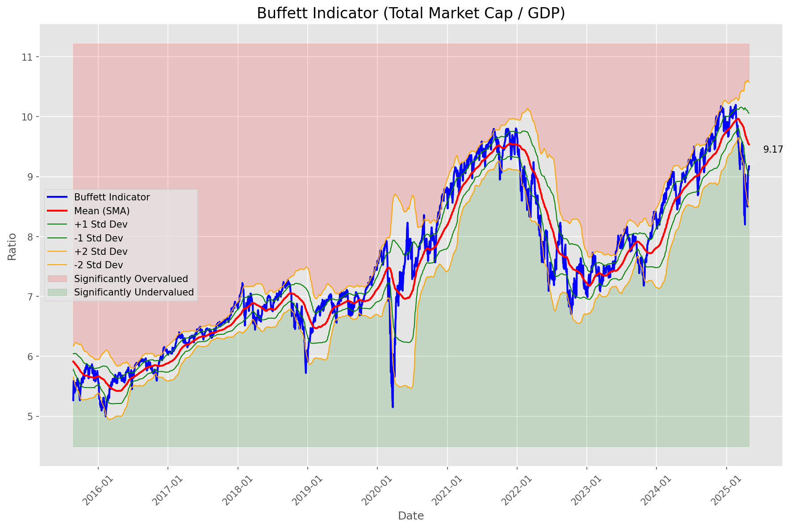
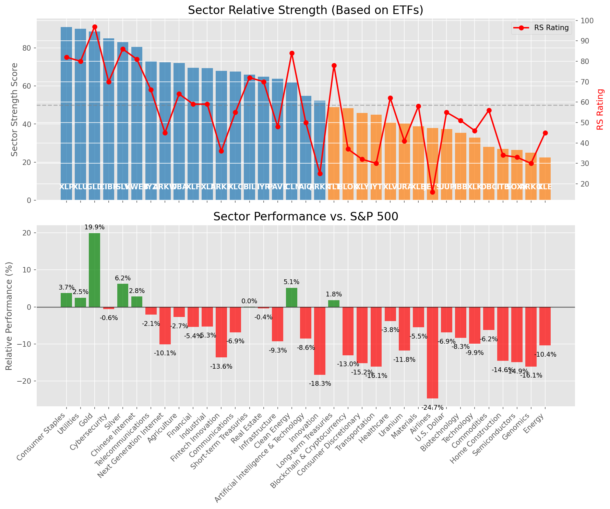

# **Daily Relative Strength Report**

**Date:** 2025-04-30

## **Market Valuation (Buffett Indicator)**

| Metric | Value |
|--------|-------|
| **Market Valuation** | **Fair Valued** |
| **Current Ratio** | 9.01 |
| **Historical Mean** | 9.54 |
| **Standard Deviation** | 0.52 |
| **Z-Score (StdDev from Mean)** | -0.70 |
| **Total Market Cap** | $267.70 trillion |
| **GDP** | $29.72 trillion |

## **Market Insights**

### **Market is Fairly Valued**

The market appears to be trading within a reasonable range of historical valuations. This suggests a balanced approach to equity investing is appropriate. Investors should:

- Focus on individual stock selection based on fundamentals and technicals
- Maintain normal equity allocations aligned with long-term goals
- Pay attention to sector rotation and relative strength
- Watch for changes in market leadership

Fair valuation typically suggests normal market returns can be expected, with stock selection becoming increasingly important.

### **Buffett Indicator Overview**

The Buffett Indicator (Total Market Cap / GDP) is a measure of the stock market's valuation relative to the size of the economy. It is named after Warren Buffett, who described it as "probably the best single measure of where valuations stand at any given moment."

- **Values above +2 standard deviations:** Market significantly overvalued
- **Values above +1 standard deviation:** Market overvalued
- **Values between -1 and +1 standard deviations:** Market fairly valued
- **Values below -1 standard deviation:** Market undervalued
- **Values below -2 standard deviations:** Market significantly undervalued

---

## **Sector Relative Strength**

Based on William O'Neil's Relative Strength Methodology

| ETF | Strength | RS Rating | Performance | Above Key MAs | Trend | Sector |
|-----|----------|-----------|-------------|--------------|-------|--------|
| [GLD](https://www.tradingview.com/chart/?symbol=GLD) | 88.6 | 97.0 | 20.06% | 10d ✗, 50d ✓, 200d ✓ | ↗️ | Gold |
| [CIBR](https://www.tradingview.com/chart/?symbol=CIBR) | 84.0 | 68.0 | -1.77% | 10d ✓, 50d ✓, 200d ✓ | ↗️ | Cybersecurity |
| [KWEB](https://www.tradingview.com/chart/?symbol=KWEB) | 80.6 | 81.0 | 2.53% | 10d ✓, 50d ✗, 200d ✓ | ↗️ | Chinese Internet |
| [ARKW](https://www.tradingview.com/chart/?symbol=ARKW) | 73.5 | 47.0 | -10.10% | 10d ✓, 50d ✓, 200d ✓ | ↗️ | Next Generation Internet |
| [SLV](https://www.tradingview.com/chart/?symbol=SLV) | 73.2 | 86.0 | 5.95% | 10d ✗, 50d ✗, 200d ✓ | ↗️ | Silver |
| [DBA](https://www.tradingview.com/chart/?symbol=DBA) | 73.1 | 66.0 | -2.52% | 10d ✗, 50d ✓, 200d ✓ | ↗️ | Agriculture |
| [IYZ](https://www.tradingview.com/chart/?symbol=IYZ) | 72.1 | 64.0 | -3.21% | 10d ✓, 50d ✗, 200d ✓ | ↗️ | Telecommunications |
| [XLP](https://www.tradingview.com/chart/?symbol=XLP) | 70.2 | 80.0 | 2.32% | 10d ✗, 50d ✗, 200d ✓ | ↗️ | Consumer Staples |
| [XLU](https://www.tradingview.com/chart/?symbol=XLU) | 69.2 | 78.0 | 1.32% | 10d ✗, 50d ✗, 200d ✓ | ↗️ | Utilities |
| [XLF](https://www.tradingview.com/chart/?symbol=XLF) | 68.1 | 56.0 | -6.69% | 10d ✓, 50d ✗, 200d ✓ | ↗️ | Financial |
| [ARKF](https://www.tradingview.com/chart/?symbol=ARKF) | 67.0 | 34.0 | -14.80% | 10d ✓, 50d ✓, 200d ✓ | ↗️ | Fintech Innovation |
| [XLC](https://www.tradingview.com/chart/?symbol=XLC) | 66.6 | 53.0 | -7.82% | 10d ✓, 50d ✗, 200d ✓ | ↗️ | Communications |
| [BIL](https://www.tradingview.com/chart/?symbol=BIL) | 66.5 | 73.0 | 0.01% | 10d ✓, 50d ✓, 200d ✓ | ↘️ | Short-term Treasuries |
| [IYR](https://www.tradingview.com/chart/?symbol=IYR) | 64.9 | 70.0 | -1.30% | 10d ✓, 50d ✗, 200d ✗ | ↗️ | Real Estate |
| [ICLN](https://www.tradingview.com/chart/?symbol=ICLN) | 61.8 | 84.0 | 4.24% | 10d ✓, 50d ✓, 200d ✗ | ↘️ | Clean Energy |
| [XLI](https://www.tradingview.com/chart/?symbol=XLI) | 58.4 | 57.0 | -6.58% | 10d ✓, 50d ✗, 200d ✗ | ↗️ | Industrial |
| [AIQ](https://www.tradingview.com/chart/?symbol=AIQ) | 55.4 | 51.0 | -8.54% | 10d ✓, 50d ✗, 200d ✗ | ↗️ | Artificial Intelligence & Technology |
| [PAVE](https://www.tradingview.com/chart/?symbol=PAVE) | 52.4 | 45.0 | -10.59% | 10d ✓, 50d ✗, 200d ✗ | ↗️ | Infrastructure |
| [TLT](https://www.tradingview.com/chart/?symbol=TLT) | 49.4 | 79.0 | 1.82% | 10d ✓, 50d ✗, 200d ✗ | ↘️ | Long-term Treasuries |
| [BLOK](https://www.tradingview.com/chart/?symbol=BLOK) | 48.9 | 38.0 | -13.04% | 10d ✓, 50d ✗, 200d ✗ | ↗️ | Blockchain & Cryptocurrency |
| [IYT](https://www.tradingview.com/chart/?symbol=IYT) | 44.9 | 30.0 | -16.54% | 10d ✓, 50d ✗, 200d ✗ | ↗️ | Transportation |
| [XLY](https://www.tradingview.com/chart/?symbol=XLY) | 44.9 | 30.0 | -16.39% | 10d ✓, 50d ✗, 200d ✗ | ↗️ | Consumer Discretionary |
| [ARKK](https://www.tradingview.com/chart/?symbol=ARKK) | 41.4 | 23.0 | -19.63% | 10d ✓, 50d ✗, 200d ✗ | ↗️ | Innovation |
| [XLV](https://www.tradingview.com/chart/?symbol=XLV) | 40.4 | 61.0 | -4.78% | 10d ✓, 50d ✗, 200d ✗ | ↘️ | Healthcare |
| [URA](https://www.tradingview.com/chart/?symbol=URA) | 39.3 | 39.0 | -12.59% | 10d ✓, 50d ✓, 200d ✗ | ↘️ | Uranium |
| [UUP](https://www.tradingview.com/chart/?symbol=UUP) | 37.9 | 56.0 | -6.86% | 10d ✓, 50d ✗, 200d ✗ | ↘️ | U.S. Dollar |
| [XLB](https://www.tradingview.com/chart/?symbol=XLB) | 37.9 | 56.0 | -6.74% | 10d ✓, 50d ✗, 200d ✗ | ↘️ | Materials |
| [JETS](https://www.tradingview.com/chart/?symbol=JETS) | 36.9 | 14.0 | -26.01% | 10d ✓, 50d ✗, 200d ✗ | ↗️ | Airlines |
| [IBB](https://www.tradingview.com/chart/?symbol=IBB) | 34.4 | 49.0 | -9.56% | 10d ✓, 50d ✗, 200d ✗ | ↘️ | Biotechnology |
| [XLK](https://www.tradingview.com/chart/?symbol=XLK) | 31.4 | 43.0 | -11.32% | 10d ✓, 50d ✗, 200d ✗ | ↘️ | Technology |
| [DBC](https://www.tradingview.com/chart/?symbol=DBC) | 30.0 | 60.0 | -5.32% | 10d ✗, 50d ✗, 200d ✗ | ↘️ | Commodities |
| [ITB](https://www.tradingview.com/chart/?symbol=ITB) | 25.4 | 31.0 | -15.96% | 10d ✓, 50d ✗, 200d ✗ | ↘️ | Home Construction |
| [SOXX](https://www.tradingview.com/chart/?symbol=SOXX) | 24.9 | 30.0 | -16.45% | 10d ✓, 50d ✗, 200d ✗ | ↘️ | Semiconductors |
| [ARKG](https://www.tradingview.com/chart/?symbol=ARKG) | 23.9 | 28.0 | -17.56% | 10d ✓, 50d ✗, 200d ✗ | ↘️ | Genomics |
| [XLE](https://www.tradingview.com/chart/?symbol=XLE) | 23.0 | 46.0 | -10.38% | 10d ✗, 50d ✗, 200d ✗ | ↘️ | Energy |

### **Sector ETF Performance Interpretation**

This table shows the relative strength metrics for different market sectors based on their representative ETFs:

- **ETF**: The ETF used to measure sector performance (click for chart)
- **Strength**: Overall sector strength score (0-100) combining multiple factors
- **RS Rating**: O'Neil RS rating of the sector ETF
- **Performance**: Performance of the sector ETF relative to SPY
- **Above Key MAs**: Whether the ETF is trading above its 10, 50, and 200-day moving averages
- **Trend**: Whether the sector is in an uptrend (↗️) or downtrend (↘️)

### **Current Sector Leadership**

The current market leadership is coming from the following sectors: **Gold, Cybersecurity, Chinese Internet**.

The **Gold** sector (represented by **GLD**) is showing particularly strong relative strength with an RS rating of 97.0 and performance of 20.06% vs. the S&P 500. This sector is trading above its 50-day, 200-day moving average(s). Investors should consider focusing on high RS stocks within these leading sectors for potential outperformance.

---

## **Buy Recommendations**

The following 77 stocks show exceptional relative strength:

| RS Rating | Buy Score | Current Price | Chart | Name | Ticker |
|-----------|-----------|---------------|-------|------|--------|
| 100 | 100 | $113.57 | [Chart](https://www.tradingview.com/chart/?symbol=PLTR) | Palantir Technologies Inc. Class A Common Stock | PLTR |
| 100 | 100 | $23.26 | [Chart](https://www.tradingview.com/chart/?symbol=PRA) | ProAssurance Corporation | PRA |
| 99 | 100 | $277.58 | [Chart](https://www.tradingview.com/chart/?symbol=VRSN) | VeriSign Inc | VRSN |
| 99 | 100 | $25.84 | [Chart](https://www.tradingview.com/chart/?symbol=DB) | Deutsche Bank Aktiengesellschaft | DB |
| 99 | 100 | $169.21 | [Chart](https://www.tradingview.com/chart/?symbol=PM) | Philip Morris International Inc. | PM |
| 99 | 100 | $44.68 | [Chart](https://www.tradingview.com/chart/?symbol=TGTX) | TG Therapeutics, Inc. | TGTX |
| 99 | 100 | $23.86 | [Chart](https://www.tradingview.com/chart/?symbol=OR) | Osisko Gold Royalties Ltd | OR |
| 99 | 100 | $25.45 | [Chart](https://www.tradingview.com/chart/?symbol=TGI) | Triumph Group, Inc. | TGI |
| 99 | 100 | $73.33 | [Chart](https://www.tradingview.com/chart/?symbol=VRNA) | Verona Pharma plc | VRNA |
| 98 | 100 | $89.73 | [Chart](https://www.tradingview.com/chart/?symbol=SNEX) | StoneX Group Inc. Common Stock | SNEX |
| 98 | 100 | $43.57 | [Chart](https://www.tradingview.com/chart/?symbol=MRX) | Marex Group plc Ordinary Shares | MRX |
| 98 | 100 | $49.00 | [Chart](https://www.tradingview.com/chart/?symbol=SEZL) | Sezzle Inc. Common Stock | SEZL |
| 97 | 100 | $73.23 | [Chart](https://www.tradingview.com/chart/?symbol=CORT) | Corcept Therapeutics Inc. | CORT |
| 97 | 100 | $115.91 | [Chart](https://www.tradingview.com/chart/?symbol=EHC) | Encompass Health Corporation Common Stock | EHC |
| 96 | 100 | $272.31 | [Chart](https://www.tradingview.com/chart/?symbol=CME) | CME Group Inc. | CME |
| 96 | 100 | $37.79 | [Chart](https://www.tradingview.com/chart/?symbol=CNP) | CenterPoint Energy, Inc. | CNP |
| 96 | 100 | $29.65 | [Chart](https://www.tradingview.com/chart/?symbol=EUFN) | iShares MSCI Europe Financials ETF | EUFN |
| 95 | 100 | $17.02 | [Chart](https://www.tradingview.com/chart/?symbol=SPNT) | SiriusPoint Ltd. | SPNT |
| 95 | 100 | $89.12 | [Chart](https://www.tradingview.com/chart/?symbol=CCEP) | Coca-Cola Europacific Partners plc Ordinary Shares | CCEP |
| 95 | 100 | $136.76 | [Chart](https://www.tradingview.com/chart/?symbol=DTE) | DTE Energy Company | DTE |
| 95 | 100 | $69.01 | [Chart](https://www.tradingview.com/chart/?symbol=VTR) | Ventas, Inc. | VTR |
| 95 | 100 | $245.74 | [Chart](https://www.tradingview.com/chart/?symbol=RSG) | Republic Services Inc. | RSG |
| 95 | 100 | $65.22 | [Chart](https://www.tradingview.com/chart/?symbol=RYTM) | Rhythm Pharmaceuticals, Inc. Common Stock | RYTM |
| 95 | 100 | $153.41 | [Chart](https://www.tradingview.com/chart/?symbol=AGX) | Argan, Inc | AGX |
| 94 | 100 | $39.24 | [Chart](https://www.tradingview.com/chart/?symbol=EWG) | iShares MSCI Germany ETF | EWG |
| 94 | 100 | $1109.95 | [Chart](https://www.tradingview.com/chart/?symbol=NFLX) | NetFlix Inc | NFLX |
| 94 | 100 | $290.08 | [Chart](https://www.tradingview.com/chart/?symbol=COR) | Cencora, Inc. | COR |
| 94 | 100 | $143.54 | [Chart](https://www.tradingview.com/chart/?symbol=LRN) | Stride, Inc. | LRN |
| 94 | 100 | $119.63 | [Chart](https://www.tradingview.com/chart/?symbol=COOP) | Mr. Cooper Group Inc. Common Stock | COOP |
| 94 | 100 | $159.69 | [Chart](https://www.tradingview.com/chart/?symbol=ATO) | Atmos Energy Corporation | ATO |
| 94 | 100 | $176.50 | [Chart](https://www.tradingview.com/chart/?symbol=DGX) | Quest Diagnostics Inc. | DGX |
| 94 | 100 | $27.48 | [Chart](https://www.tradingview.com/chart/?symbol=T) | AT&T Inc. | T |
| 93 | 100 | $463.40 | [Chart](https://www.tradingview.com/chart/?symbol=CASY) | Casey's General Stores Inc | CASY |
| 93 | 100 | $43.49 | [Chart](https://www.tradingview.com/chart/?symbol=BTI) | British American Tobacco p.l.c. American Depositary Shares, American Depositary Shares, each representing one Ordinary Share | BTI |
| 93 | 100 | $78.29 | [Chart](https://www.tradingview.com/chart/?symbol=OGS) | ONE GAS, INC. | OGS |
| 93 | 100 | $58.70 | [Chart](https://www.tradingview.com/chart/?symbol=MO) | Altria Group, Inc. | MO |
| 92 | 100 | $49.78 | [Chart](https://www.tradingview.com/chart/?symbol=TRP) | TC Energy Corporation | TRP |
| 92 | 100 | $117.27 | [Chart](https://www.tradingview.com/chart/?symbol=CWST) | Casella Waste Systems Inc | CWST |
| 92 | 100 | $107.71 | [Chart](https://www.tradingview.com/chart/?symbol=ATGE) | Adtalem Global Education Inc. Common Shares | ATGE |
| 92 | 100 | $95.29 | [Chart](https://www.tradingview.com/chart/?symbol=PNW) | Pinnacle West Capital Corporation | PNW |
| 92 | 100 | $200.17 | [Chart](https://www.tradingview.com/chart/?symbol=BAP) | Credicorp LTD | BAP |
| 92 | 100 | $36.09 | [Chart](https://www.tradingview.com/chart/?symbol=PPL) | PPL Corporation | PPL |
| 92 | 100 | $34.77 | [Chart](https://www.tradingview.com/chart/?symbol=FDP) | Fresh Del Monte Produce Inc. | FDP |
| 92 | 100 | $593.50 | [Chart](https://www.tradingview.com/chart/?symbol=SPOT) | Spotify Technology S.A. | SPOT |
| 91 | 100 | $296.91 | [Chart](https://www.tradingview.com/chart/?symbol=PEN) | Penumbra, Inc. | PEN |
| 91 | 100 | $53.79 | [Chart](https://www.tradingview.com/chart/?symbol=RELX) | RELX PLC | RELX |
| 91 | 100 | $42.38 | [Chart](https://www.tradingview.com/chart/?symbol=HMN) | Horace Mann Educators Corporation | HMN |
| 91 | 100 | $1399.23 | [Chart](https://www.tradingview.com/chart/?symbol=ORLY) | O'Reilly Automotive, Inc. | ORLY |
| 90 | 100 | $68.61 | [Chart](https://www.tradingview.com/chart/?symbol=EVRG) | Evergy, Inc. | EVRG |
| 90 | 100 | $167.94 | [Chart](https://www.tradingview.com/chart/?symbol=SFM) | Sprouts Farmers Market, Inc. | SFM |
| 90 | 100 | $43.78 | [Chart](https://www.tradingview.com/chart/?symbol=NWN) | Northwest Natural Holding Company | NWN |
| 89 | 100 | $31.95 | [Chart](https://www.tradingview.com/chart/?symbol=AHR) | American Healthcare REIT, Inc. | AHR |
| 89 | 100 | $15.83 | [Chart](https://www.tradingview.com/chart/?symbol=BCS) | Barclays PLC | BCS |
| 89 | 100 | $19.14 | [Chart](https://www.tradingview.com/chart/?symbol=KT) | KT Corp. | KT |
| 88 | 100 | $96.81 | [Chart](https://www.tradingview.com/chart/?symbol=AXS) | Axis Capital Holders Limited | AXS |
| 87 | 100 | $99.21 | [Chart](https://www.tradingview.com/chart/?symbol=AEE) | Ameren Corporation | AEE |
| 90 | 99 | $22.21 | [Chart](https://www.tradingview.com/chart/?symbol=CXW) | CoreCivic, Inc. | CXW |
| 89 | 99 | $32.67 | [Chart](https://www.tradingview.com/chart/?symbol=PAY) | Paymentus Holdings, Inc. | PAY |
| 87 | 99 | $165.99 | [Chart](https://www.tradingview.com/chart/?symbol=THG) | The Hanover Insurance Group, Inc. | THG |
| 86 | 98 | $57.24 | [Chart](https://www.tradingview.com/chart/?symbol=CHEF) | The Chef's Warehouse Inc | CHEF |
| 85 | 98 | $37.61 | [Chart](https://www.tradingview.com/chart/?symbol=TDS) | Telephone and Data Systems Inc. | TDS |
| 87 | 97 | $56.62 | [Chart](https://www.tradingview.com/chart/?symbol=IGF) | iShares Global Infrastructure ETF | IGF |
| 87 | 97 | $217.05 | [Chart](https://www.tradingview.com/chart/?symbol=CBOE) | Cboe Global Markets, Inc. | CBOE |
| 85 | 97 | $36.46 | [Chart](https://www.tradingview.com/chart/?symbol=DRS) | Leonardo DRS, Inc. Common Stock | DRS |
| 83 | 96 | $287.75 | [Chart](https://www.tradingview.com/chart/?symbol=SAP) | SAP SE | SAP |
| 85 | 95 | $168.73 | [Chart](https://www.tradingview.com/chart/?symbol=CVLT) | Commault Systems, Inc. | CVLT |
| 84 | 95 | $56.39 | [Chart](https://www.tradingview.com/chart/?symbol=ULS) | UL Solutions Inc. | ULS |
| 82 | 95 | $162.96 | [Chart](https://www.tradingview.com/chart/?symbol=TKO) | TKO Group Holdings, Inc. | TKO |
| 84 | 94 | $4909.23 | [Chart](https://www.tradingview.com/chart/?symbol=BKNG) | Booking Holdings Inc. Common Stock | BKNG |
| 83 | 94 | $292.37 | [Chart](https://www.tradingview.com/chart/?symbol=VRSK) | Verisk Analytics, Inc. Common Stock | VRSK |
| 82 | 94 | $363.54 | [Chart](https://www.tradingview.com/chart/?symbol=GEV) | GE Vernova Inc. | GEV |
| 83 | 93 | $124.17 | [Chart](https://www.tradingview.com/chart/?symbol=BECN) | Beacon Roofing Supply, Inc. | BECN |
| 82 | 93 | $50.17 | [Chart](https://www.tradingview.com/chart/?symbol=VTIP) | Vanguard Short-Term Inflation-Protected Securities Index Fund | VTIP |
| 80 | 93 | $103.42 | [Chart](https://www.tradingview.com/chart/?symbol=STIP) | iShares 0-5 Year TIPS Bond ETF | STIP |
| 81 | 91 | $40.41 | [Chart](https://www.tradingview.com/chart/?symbol=FHI) | Federated Hermes, Inc. | FHI |
| 81 | 91 | $40.89 | [Chart](https://www.tradingview.com/chart/?symbol=GLNG) | Golar LNG Ltd | GLNG |
| 80 | 91 | $95.22 | [Chart](https://www.tradingview.com/chart/?symbol=DAVE) | Dave Inc. Class A Common Stock | DAVE |

---

## **Sell Recommendations**

The following 185 stocks show deteriorating relative strength:

| RS Rating | Sell Score | Current Price | Chart | Name | Ticker |
|-----------|------------|---------------|-------|------|--------|
| 1 | 100 | $10.86 | [Chart](https://www.tradingview.com/chart/?symbol=AMRC) | Ameresco, Inc. | AMRC |
| 1 | 100 | $72.21 | [Chart](https://www.tradingview.com/chart/?symbol=FRPT) | Freshpet, Inc. | FRPT |
| 1 | 100 | $16.61 | [Chart](https://www.tradingview.com/chart/?symbol=TNDM) | Tandem Diabetes Care, Inc. | TNDM |
| 1 | 100 | $14.72 | [Chart](https://www.tradingview.com/chart/?symbol=VTLE) | Vital Energy, Inc. | VTLE |
| 1 | 100 | $52.62 | [Chart](https://www.tradingview.com/chart/?symbol=TTD) | The Trade Desk, Inc. | TTD |
| 1 | 100 | $10.05 | [Chart](https://www.tradingview.com/chart/?symbol=FTRE) | Fortrea Holdings Inc. Common Stock | FTRE |
| 1 | 100 | $10.58 | [Chart](https://www.tradingview.com/chart/?symbol=XNCR) | Xencor, Inc. | XNCR |
| 2 | 100 | $27.70 | [Chart](https://www.tradingview.com/chart/?symbol=CIVI) | Civitas Resources, Inc. | CIVI |
| 2 | 100 | $109.38 | [Chart](https://www.tradingview.com/chart/?symbol=DECK) | Deckers Outdoor Corp | DECK |
| 3 | 100 | $76.25 | [Chart](https://www.tradingview.com/chart/?symbol=ILMN) | Illumina Inc | ILMN |
| 3 | 100 | $16.80 | [Chart](https://www.tradingview.com/chart/?symbol=SSTK) | SHUTTERSTOCK, INC. | SSTK |
| 3 | 100 | $18.44 | [Chart](https://www.tradingview.com/chart/?symbol=DAVA) | Endava plc American Depositary Shares (each representing one Class A Ordinary Share) | DAVA |
| 3 | 100 | $21.00 | [Chart](https://www.tradingview.com/chart/?symbol=SDRL) | Seadrill Limited | SDRL |
| 3 | 100 | $42.68 | [Chart](https://www.tradingview.com/chart/?symbol=CMPR) | Cimpress PLC Ordinary Shares (Ireland) | CMPR |
| 3 | 100 | $18.58 | [Chart](https://www.tradingview.com/chart/?symbol=SG) | Sweetgreen, Inc. | SG |
| 4 | 100 | $104.41 | [Chart](https://www.tradingview.com/chart/?symbol=BOOT) | Boot Barn Holdings, Inc. | BOOT |
| 4 | 100 | $57.36 | [Chart](https://www.tradingview.com/chart/?symbol=LABU) | Direxion Daily S&P Biotech Bull 3X Shares | LABU |
| 5 | 100 | $10.02 | [Chart](https://www.tradingview.com/chart/?symbol=LSPD) | Lightspeed Commerce Inc. | LSPD |
| 5 | 100 | $12.94 | [Chart](https://www.tradingview.com/chart/?symbol=GCT) | GigaCloud Technology Inc Class A Ordinary Shares | GCT |
| 5 | 100 | $21.38 | [Chart](https://www.tradingview.com/chart/?symbol=SPT) | Sprout Social, Inc Class A Common Stock | SPT |
| 5 | 100 | $24.26 | [Chart](https://www.tradingview.com/chart/?symbol=RPD) | Rapid7, Inc. Common Stock | RPD |
| 6 | 100 | $44.09 | [Chart](https://www.tradingview.com/chart/?symbol=PSTG) | Pure Storage, Inc. Class A | PSTG |
| 6 | 100 | $13.27 | [Chart](https://www.tradingview.com/chart/?symbol=DV) | DoubleVerify Holdings, Inc. | DV |
| 6 | 100 | $68.81 | [Chart](https://www.tradingview.com/chart/?symbol=MKSI) | MKS Instruments Inc | MKSI |
| 6 | 100 | $12.67 | [Chart](https://www.tradingview.com/chart/?symbol=IMXI) | International Money Express, Inc. | IMXI |
| 6 | 100 | $22.87 | [Chart](https://www.tradingview.com/chart/?symbol=NSSC) | Napco Security Technologies, Inc | NSSC |
| 7 | 100 | $32.27 | [Chart](https://www.tradingview.com/chart/?symbol=AAP) | ADVANCE AUTO PARTS INC | AAP |
| 7 | 100 | $24.50 | [Chart](https://www.tradingview.com/chart/?symbol=AMPH) | Amphastar Pharmaceuticals, Inc. | AMPH |
| 8 | 100 | $13.61 | [Chart](https://www.tradingview.com/chart/?symbol=ARWR) | Arrowhead Research Corporation | ARWR |
| 9 | 100 | $12.26 | [Chart](https://www.tradingview.com/chart/?symbol=TRIP) | TripAdvisor, Inc. | TRIP |
| 9 | 100 | $21.76 | [Chart](https://www.tradingview.com/chart/?symbol=AI) | C3.ai, Inc. | AI |
| 9 | 100 | $26.85 | [Chart](https://www.tradingview.com/chart/?symbol=FORM) | FormFactor Inc. | FORM |
| 10 | 100 | $118.28 | [Chart](https://www.tradingview.com/chart/?symbol=BLDR) | Builders FirstSource, Inc. | BLDR |
| 10 | 100 | $13.79 | [Chart](https://www.tradingview.com/chart/?symbol=XRAY) | DENTSPLY SIRONA Inc. | XRAY |
| 12 | 100 | $21.13 | [Chart](https://www.tradingview.com/chart/?symbol=SYM) | Symbotic Inc. Class A Common Stock | SYM |
| 12 | 100 | $28.55 | [Chart](https://www.tradingview.com/chart/?symbol=SRDX) | Surmodics, Inc. Common Stock | SRDX |
| 14 | 100 | $15.73 | [Chart](https://www.tradingview.com/chart/?symbol=DXC) | DXC Technology Company | DXC |
| 15 | 100 | $11.72 | [Chart](https://www.tradingview.com/chart/?symbol=JAMF) | Jamf Holding Corp. Common Stock | JAMF |
| 19 | 100 | $12.50 | [Chart](https://www.tradingview.com/chart/?symbol=MED) | Medifast, Inc. | MED |
| 4 | 99 | $11.44 | [Chart](https://www.tradingview.com/chart/?symbol=NRIX) | Nurix Therapeutics, Inc. Common stock | NRIX |
| 7 | 99 | $33.45 | [Chart](https://www.tradingview.com/chart/?symbol=SCSC) | Scansource Inc | SCSC |
| 9 | 99 | $36.76 | [Chart](https://www.tradingview.com/chart/?symbol=ASO) | Academy Sports and Outdoors, Inc. | ASO |
| 11 | 99 | $31.43 | [Chart](https://www.tradingview.com/chart/?symbol=UWM) | ProShares Ultra Russell2000 | UWM |
| 12 | 99 | $20.59 | [Chart](https://www.tradingview.com/chart/?symbol=FOXF) | Fox Factory Holding Corp. Common Stock | FOXF |
| 12 | 99 | $59.07 | [Chart](https://www.tradingview.com/chart/?symbol=AMWD) | American Woodmark Corp | AMWD |
| 14 | 99 | $109.22 | [Chart](https://www.tradingview.com/chart/?symbol=ARM) | Arm Holdings plc American Depositary Shares | ARM |
| 17 | 99 | $21.37 | [Chart](https://www.tradingview.com/chart/?symbol=ST) | Sensata Technologies Holding plc | ST |
| 2 | 98 | $24.22 | [Chart](https://www.tradingview.com/chart/?symbol=TNA) | Direxion Daily Small Cap Bull 3x Shares | TNA |
| 7 | 98 | $57.44 | [Chart](https://www.tradingview.com/chart/?symbol=ALB) | Albemarle Corporation | ALB |
| 7 | 98 | $24.52 | [Chart](https://www.tradingview.com/chart/?symbol=WSC) | WillScot Holdings Corporation Class A Common Stock | WSC |
| 9 | 98 | $42.74 | [Chart](https://www.tradingview.com/chart/?symbol=WDC) | Western Digital Corp. | WDC |
| 9 | 98 | $35.22 | [Chart](https://www.tradingview.com/chart/?symbol=CRC) | California Resources Corporation | CRC |
| 10 | 98 | $24.84 | [Chart](https://www.tradingview.com/chart/?symbol=RNG) | RINGCENTRAL, INC. | RNG |
| 13 | 98 | $16.63 | [Chart](https://www.tradingview.com/chart/?symbol=MLKN) | MillerKnoll, Inc. Common Stock | MLKN |
| 13 | 98 | $87.74 | [Chart](https://www.tradingview.com/chart/?symbol=NTAP) | NetApp, Inc | NTAP |
| 4 | 97 | $51.64 | [Chart](https://www.tradingview.com/chart/?symbol=TECL) | Direxion Daily Technology Bull 3x Shares | TECL |
| 7 | 97 | $17.35 | [Chart](https://www.tradingview.com/chart/?symbol=IART) | Integra LifeSciences Holdings | IART |
| 11 | 97 | $18.51 | [Chart](https://www.tradingview.com/chart/?symbol=PDFS) | PDF Solutions Inc | PDFS |
| 12 | 97 | $12.92 | [Chart](https://www.tradingview.com/chart/?symbol=ADNT) | Adient plc Ordinary Shares | ADNT |
| 20 | 97 | $11.80 | [Chart](https://www.tradingview.com/chart/?symbol=PR) | Permian Resources Corporation | PR |
| 7 | 96 | $36.61 | [Chart](https://www.tradingview.com/chart/?symbol=USD) | ProShares Ultra Semiconductors | USD |
| 11 | 96 | $19.86 | [Chart](https://www.tradingview.com/chart/?symbol=UCO) | ProShares Ultra Bloomberg Crude Oil | UCO |
| 12 | 96 | $59.05 | [Chart](https://www.tradingview.com/chart/?symbol=EL) | The Estee Lauder Companies Inc. Class A | EL |
| 16 | 96 | $65.00 | [Chart](https://www.tradingview.com/chart/?symbol=CAMT) | Camtek Ltd | CAMT |
| 16 | 96 | $16.01 | [Chart](https://www.tradingview.com/chart/?symbol=SVOL) | Simplify Volatility Premium ETF | SVOL |
| 18 | 96 | $46.46 | [Chart](https://www.tradingview.com/chart/?symbol=ERX) | Direxion Daily Energy Bull 2X Shares | ERX |
| 22 | 95 | $93.84 | [Chart](https://www.tradingview.com/chart/?symbol=AMD) | Advanced Micro Devices | AMD |
| 9 | 94 | $10.01 | [Chart](https://www.tradingview.com/chart/?symbol=VYX) | NCR Voyix Corporation | VYX |
| 12 | 94 | $10.77 | [Chart](https://www.tradingview.com/chart/?symbol=SONO) | Sonos, Inc. Common Stock | SONO |
| 12 | 94 | $105.91 | [Chart](https://www.tradingview.com/chart/?symbol=A) | Agilent Technologies Inc. | A |
| 9 | 93 | $24.26 | [Chart](https://www.tradingview.com/chart/?symbol=AA) | Alcoa Corporation | AA |
| 9 | 93 | $100.41 | [Chart](https://www.tradingview.com/chart/?symbol=DDOG) | Datadog, Inc. Class A Common Stock | DDOG |
| 13 | 93 | $99.02 | [Chart](https://www.tradingview.com/chart/?symbol=TOL) | Toll Brothers, Inc. | TOL |
| 8 | 92 | $14.31 | [Chart](https://www.tradingview.com/chart/?symbol=ACVA) | ACV Auctions Inc. | ACVA |
| 12 | 92 | $51.17 | [Chart](https://www.tradingview.com/chart/?symbol=CNMD) | CONMED Corporation | CNMD |
| 15 | 92 | $94.50 | [Chart](https://www.tradingview.com/chart/?symbol=BCC) | Boise Cascade Company | BCC |
| 16 | 92 | $205.95 | [Chart](https://www.tradingview.com/chart/?symbol=FDX) | FedEx Corporation | FDX |
| 17 | 91 | $33.57 | [Chart](https://www.tradingview.com/chart/?symbol=OVV) | Ovintiv Inc. | OVV |
| 18 | 91 | $37.98 | [Chart](https://www.tradingview.com/chart/?symbol=TWST) | Twist Bioscience Corporation Common Stock | TWST |
| 21 | 91 | $79.52 | [Chart](https://www.tradingview.com/chart/?symbol=AKAM) | Akamai Technologies Inc | AKAM |
| 12 | 90 | $10.24 | [Chart](https://www.tradingview.com/chart/?symbol=EXPI) | eXp World Holdings, Inc. Common Stock | EXPI |
| 14 | 90 | $10.32 | [Chart](https://www.tradingview.com/chart/?symbol=SEMR) | SEMrush Holdings, Inc. | SEMR |
| 15 | 90 | $24.81 | [Chart](https://www.tradingview.com/chart/?symbol=PINS) | Pinterest, Inc. Class A Common Stock | PINS |
| 17 | 90 | $11.68 | [Chart](https://www.tradingview.com/chart/?symbol=APLE) | Apple Hospitality REIT, Inc. | APLE |
| 19 | 90 | $12.82 | [Chart](https://www.tradingview.com/chart/?symbol=ARCT) | Arcturus Therapeutics Holdings Inc. Common Stock | ARCT |
| 19 | 90 | $52.75 | [Chart](https://www.tradingview.com/chart/?symbol=IIPR) | Innovative Industrial Properties, Inc. Common stock | IIPR |
| 19 | 90 | $56.21 | [Chart](https://www.tradingview.com/chart/?symbol=TREX) | Trex Company, Inc. | TREX |
| 20 | 90 | $35.11 | [Chart](https://www.tradingview.com/chart/?symbol=CALF) | Pacer US Small Cap Cash Cows ETF | CALF |
| 21 | 90 | $26.20 | [Chart](https://www.tradingview.com/chart/?symbol=GDEN) | Golden Entertainment, Inc. Common Stock | GDEN |
| 23 | 90 | $110.65 | [Chart](https://www.tradingview.com/chart/?symbol=XOP) | SPDR S&P Oil & Gas Exploration & Production ETF | XOP |
| 26 | 90 | $40.12 | [Chart](https://www.tradingview.com/chart/?symbol=NXT) | Nextracker Inc. Class A Common Stock | NXT |
| 18 | 89 | $12.08 | [Chart](https://www.tradingview.com/chart/?symbol=KRP) | Kimbell Royalty Partners, LP Common Units representing Limited Partner Interests | KRP |
| 20 | 89 | $37.48 | [Chart](https://www.tradingview.com/chart/?symbol=STNG) | Scorpio Tankers Inc. | STNG |
| 17 | 88 | $28.91 | [Chart](https://www.tradingview.com/chart/?symbol=MBUU) | Malibu Boats, Inc. Class A | MBUU |
| 19 | 88 | $25.19 | [Chart](https://www.tradingview.com/chart/?symbol=HPQ) | HP Inc. | HPQ |
| 19 | 88 | $11.77 | [Chart](https://www.tradingview.com/chart/?symbol=AEYE) | AudioEye, Inc. Common Stock | AEYE |
| 23 | 88 | $93.51 | [Chart](https://www.tradingview.com/chart/?symbol=CHRD) | Chord Energy Corporation Common Stock | CHRD |
| 25 | 88 | $11.51 | [Chart](https://www.tradingview.com/chart/?symbol=KELYA) | Kelly Services Inc | KELYA |
| 33 | 88 | $14.38 | [Chart](https://www.tradingview.com/chart/?symbol=FXN) | First Trust Energy AlphaDEX Fund | FXN |
| 19 | 87 | $53.25 | [Chart](https://www.tradingview.com/chart/?symbol=KBH) | KB Home | KBH |
| 19 | 87 | $62.88 | [Chart](https://www.tradingview.com/chart/?symbol=PLUS) | ePlus Inc | PLUS |
| 21 | 87 | $68.54 | [Chart](https://www.tradingview.com/chart/?symbol=TTC) | Toro Company (The) | TTC |
| 26 | 87 | $11.36 | [Chart](https://www.tradingview.com/chart/?symbol=PBR) | PETROLEO BRASILEIRO S.A.-PETROBRAS ADS (REP 1 COMMON SHARE) | PBR |
| 29 | 87 | $15.66 | [Chart](https://www.tradingview.com/chart/?symbol=PSFE) | Paysafe Limited | PSFE |
| 31 | 87 | $34.41 | [Chart](https://www.tradingview.com/chart/?symbol=MGA) | Magna International | MGA |
| 22 | 86 | $15.43 | [Chart](https://www.tradingview.com/chart/?symbol=AMZY) | YieldMax AMZN Option Income Strategy ETF | AMZY |
| 25 | 86 | $44.58 | [Chart](https://www.tradingview.com/chart/?symbol=EXAS) | Exact Sciences Corp | EXAS |
| 34 | 86 | $16.58 | [Chart](https://www.tradingview.com/chart/?symbol=TRMD) | TORM plc Class A Common Stock | TRMD |
| 17 | 85 | $113.14 | [Chart](https://www.tradingview.com/chart/?symbol=GNRC) | GENERAC HOLDINGS INC | GNRC |
| 17 | 85 | $10.15 | [Chart](https://www.tradingview.com/chart/?symbol=HLIT) | Harmonic Inc | HLIT |
| 28 | 85 | $21.62 | [Chart](https://www.tradingview.com/chart/?symbol=ARKG) | ARK Genomic Revolution ETF | ARKG |
| 29 | 85 | $10.34 | [Chart](https://www.tradingview.com/chart/?symbol=CMRE) | Costamare Inc. | CMRE |
| 33 | 85 | $10.68 | [Chart](https://www.tradingview.com/chart/?symbol=PBR.A) | Petroleo Brasileiro S.A.-Petrobras | PBR.A |
| 18 | 84 | $18.12 | [Chart](https://www.tradingview.com/chart/?symbol=S) | SentinelOne, Inc. | S |
| 24 | 84 | $39.34 | [Chart](https://www.tradingview.com/chart/?symbol=OXY) | Occidental Petroleum Corporation | OXY |
| 26 | 84 | $29.68 | [Chart](https://www.tradingview.com/chart/?symbol=DINO) | HF Sinclair Corporation | DINO |
| 26 | 84 | $14.56 | [Chart](https://www.tradingview.com/chart/?symbol=ZIM) | ZIM Integrated Shipping Services Ltd. | ZIM |
| 32 | 84 | $28.32 | [Chart](https://www.tradingview.com/chart/?symbol=TAN) | Invesco Solar ETF | TAN |
| 22 | 83 | $16.26 | [Chart](https://www.tradingview.com/chart/?symbol=CHCT) | Community Healthcare Trust Incorporated Common Stock, $0.01 par value per share | CHCT |
| 26 | 83 | $113.59 | [Chart](https://www.tradingview.com/chart/?symbol=VLO) | Valero Energy Corporation | VLO |
| 28 | 83 | $29.10 | [Chart](https://www.tradingview.com/chart/?symbol=MTCH) | Match Group, Inc | MTCH |
| 31 | 83 | $67.34 | [Chart](https://www.tradingview.com/chart/?symbol=XRT) | SPDR S&P Retail ETF | XRT |
| 32 | 83 | $10.78 | [Chart](https://www.tradingview.com/chart/?symbol=GSBD) | Goldman Sachs BDC, Inc. | GSBD |
| 32 | 83 | $27.60 | [Chart](https://www.tradingview.com/chart/?symbol=COLL) | Collegium Pharmaceutical, Inc. Common Stock | COLL |
| 28 | 82 | $119.39 | [Chart](https://www.tradingview.com/chart/?symbol=BIIB) | Biogen Inc. Common Stock | BIIB |
| 34 | 82 | $11.38 | [Chart](https://www.tradingview.com/chart/?symbol=ABR) | Arbor Realty Trust, Inc. | ABR |
| 35 | 82 | $41.65 | [Chart](https://www.tradingview.com/chart/?symbol=CYTK) | Cytokinetics Inc. | CYTK |
| 22 | 81 | $182.98 | [Chart](https://www.tradingview.com/chart/?symbol=RGA) | Reinsurance Group of America, Incorporated | RGA |
| 31 | 81 | $51.72 | [Chart](https://www.tradingview.com/chart/?symbol=LW) | Lamb Weston Holdings, Inc. | LW |
| 24 | 80 | $77.50 | [Chart](https://www.tradingview.com/chart/?symbol=WD) | Walker & Dunlop, Inc. | WD |
| 32 | 80 | $13.05 | [Chart](https://www.tradingview.com/chart/?symbol=WDS) | Woodside Energy Group Limited American Depositary Shares, each representing one Ordinary Share | WDS |
| 24 | 79 | $16.86 | [Chart](https://www.tradingview.com/chart/?symbol=MLNK) | MeridianLink, Inc. | MLNK |
| 25 | 79 | $85.23 | [Chart](https://www.tradingview.com/chart/?symbol=AGCO) | AGCO Corporation | AGCO |
| 27 | 79 | $10.71 | [Chart](https://www.tradingview.com/chart/?symbol=DBRG) | DigitalBridge Group, Inc. | DBRG |
| 27 | 79 | $33.97 | [Chart](https://www.tradingview.com/chart/?symbol=GFS) | GlobalFoundries Inc. Ordinary Shares | GFS |
| 27 | 79 | $100.52 | [Chart](https://www.tradingview.com/chart/?symbol=PRU) | Prudential Financial, Inc. | PRU |
| 29 | 79 | $367.44 | [Chart](https://www.tradingview.com/chart/?symbol=ADBE) | Adobe Inc. | ADBE |
| 30 | 79 | $12.35 | [Chart](https://www.tradingview.com/chart/?symbol=WEN) | The Wendy's Company | WEN |
| 31 | 79 | $90.24 | [Chart](https://www.tradingview.com/chart/?symbol=ITB) | iShares U.S. Home Construction ETF | ITB |
| 33 | 79 | $145.55 | [Chart](https://www.tradingview.com/chart/?symbol=QCOM) | Qualcomm Inc | QCOM |
| 23 | 78 | $151.32 | [Chart](https://www.tradingview.com/chart/?symbol=PTC) | PTC, INC | PTC |
| 27 | 78 | $137.24 | [Chart](https://www.tradingview.com/chart/?symbol=MTN) | Vail Resorts, Inc. | MTN |
| 30 | 78 | $20.69 | [Chart](https://www.tradingview.com/chart/?symbol=MGY) | Magnolia Oil & Gas Corporation Class A Common Stock | MGY |
| 30 | 78 | $146.42 | [Chart](https://www.tradingview.com/chart/?symbol=AMAT) | Applied Materials Inc | AMAT |
| 34 | 78 | $168.29 | [Chart](https://www.tradingview.com/chart/?symbol=IBP) | INSTALLED BUILDING PRODUCTS, INC. | IBP |
| 36 | 78 | $88.91 | [Chart](https://www.tradingview.com/chart/?symbol=DELL) | Dell Technologies Inc. | DELL |
| 38 | 78 | $30.70 | [Chart](https://www.tradingview.com/chart/?symbol=MBIN) | Merchants Bancorp Common Stock | MBIN |
| 27 | 77 | $31.08 | [Chart](https://www.tradingview.com/chart/?symbol=VNT) | Vontier Corporation | VNT |
| 33 | 77 | $32.99 | [Chart](https://www.tradingview.com/chart/?symbol=PZZA) | Papa John's International Inc | PZZA |
| 30 | 76 | $13.84 | [Chart](https://www.tradingview.com/chart/?symbol=HST) | Host Hotels & Resorts, Inc. | HST |
| 30 | 76 | $79.17 | [Chart](https://www.tradingview.com/chart/?symbol=SPHB) | Invesco S&P 500 High Beta ETF | SPHB |
| 33 | 76 | $40.87 | [Chart](https://www.tradingview.com/chart/?symbol=SON) | Sonoco Products Company | SON |
| 34 | 76 | $92.70 | [Chart](https://www.tradingview.com/chart/?symbol=XHB) | SPDR S&P Homebuilders ETF | XHB |
| 32 | 75 | $12.08 | [Chart](https://www.tradingview.com/chart/?symbol=CIM) | Chimera Investment Corp. | CIM |
| 32 | 75 | $26.41 | [Chart](https://www.tradingview.com/chart/?symbol=BNO) | United States Brent Oil Fund, LP | BNO |
| 34 | 75 | $10.01 | [Chart](https://www.tradingview.com/chart/?symbol=XPRO) | Expro Group Holdings N.V. | XPRO |
| 35 | 75 | $188.76 | [Chart](https://www.tradingview.com/chart/?symbol=NDSN) | Nordson Corp | NDSN |
| 38 | 75 | $296.96 | [Chart](https://www.tradingview.com/chart/?symbol=BLD) | TopBuild Corp. Common Stock | BLD |
| 29 | 74 | $204.99 | [Chart](https://www.tradingview.com/chart/?symbol=BDX) | Becton, Dickinson and Co. | BDX |
| 31 | 74 | $33.74 | [Chart](https://www.tradingview.com/chart/?symbol=SQM) | Sociedad Quimica y Minera de Chile SA | SQM |
| 31 | 73 | $27.67 | [Chart](https://www.tradingview.com/chart/?symbol=CSX) | CSX Corporation | CSX |
| 31 | 73 | $42.44 | [Chart](https://www.tradingview.com/chart/?symbol=HNI) | HNI Corporation | HNI |
| 33 | 73 | $110.39 | [Chart](https://www.tradingview.com/chart/?symbol=EOG) | EOG Resources, Inc. | EOG |
| 34 | 73 | $21.93 | [Chart](https://www.tradingview.com/chart/?symbol=SGRY) | Surgery Partners, Inc. Common Stock | SGRY |
| 38 | 73 | $30.50 | [Chart](https://www.tradingview.com/chart/?symbol=DVN) | Devon Energy Corporation | DVN |
| 33 | 72 | $191.67 | [Chart](https://www.tradingview.com/chart/?symbol=IWM) | iShares Russell 2000 ETF | IWM |
| 33 | 72 | $100.93 | [Chart](https://www.tradingview.com/chart/?symbol=PLD) | PROLOGIS, INC. | PLD |
| 35 | 72 | $10.04 | [Chart](https://www.tradingview.com/chart/?symbol=BWLP) | BW LPG Limited | BWLP |
| 36 | 72 | $17.81 | [Chart](https://www.tradingview.com/chart/?symbol=HTGC) | Hercules Capital, Inc. | HTGC |
| 37 | 72 | $28.18 | [Chart](https://www.tradingview.com/chart/?symbol=BWA) | BorgWarner Inc. | BWA |
| 39 | 72 | $18.65 | [Chart](https://www.tradingview.com/chart/?symbol=ELVN) | Enliven Therapeutics, Inc. Common Stock | ELVN |
| 37 | 71 | $42.48 | [Chart](https://www.tradingview.com/chart/?symbol=JOE) | St. Joe Company | JOE |
| 37 | 70 | $14.20 | [Chart](https://www.tradingview.com/chart/?symbol=BMEZ) | BlackRock Health Sciences Term Trust | BMEZ |
| 32 | 69 | $28.16 | [Chart](https://www.tradingview.com/chart/?symbol=BOTZ) | Global X Funds Global X Robotics & Artificial Intelligence ETF | BOTZ |
| 36 | 69 | $73.52 | [Chart](https://www.tradingview.com/chart/?symbol=GMS) | GMS Inc. | GMS |
| 33 | 68 | $77.48 | [Chart](https://www.tradingview.com/chart/?symbol=VTWO) | Vanguard Russell 2000 ETF | VTWO |
| 35 | 68 | $31.75 | [Chart](https://www.tradingview.com/chart/?symbol=AXTA) | Axalta Coating Systems Ltd. | AXTA |
| 37 | 68 | $29.10 | [Chart](https://www.tradingview.com/chart/?symbol=AGIO) | Agios Pharmaceuticals, Inc. | AGIO |
| 38 | 68 | $145.89 | [Chart](https://www.tradingview.com/chart/?symbol=IWN) | iShares Russell 2000 Value ETF | IWN |
| 39 | 68 | $67.39 | [Chart](https://www.tradingview.com/chart/?symbol=MMS) | MAXIMUS, Inc. | MMS |
| 34 | 67 | $10.42 | [Chart](https://www.tradingview.com/chart/?symbol=AVO) | Mission Produce, Inc. Common Stock | AVO |
| 38 | 66 | $123.39 | [Chart](https://www.tradingview.com/chart/?symbol=DHI) | D.R. Horton Inc. | DHI |
| 39 | 65 | $14.52 | [Chart](https://www.tradingview.com/chart/?symbol=RYLD) | Global X Russell 2000 Covered Call ETF | RYLD |
| 39 | 63 | $76.74 | [Chart](https://www.tradingview.com/chart/?symbol=IXN) | iShares Global Tech ETF | IXN |
| 38 | 62 | $135.47 | [Chart](https://www.tradingview.com/chart/?symbol=CVX) | Chevron Corporation | CVX |

## **Methodology**

This report uses William O'Neil's relative strength methodology from Investors Business Daily:

* **RS Rating**: Percentile rank of stock's performance vs. S&P 500 over the past 63 trading days (1-99 scale)
* **Buy Criteria**: RS Rating >= 80, price above 50-day MA, strong uptrend, increasing volume
* **Sell Criteria**: RS Rating < 40, price below 50-day MA, downtrend, decreasing volume

### **O'Neil's Key Principles**

1. **Focus on relative performance** - stocks outperforming the market
2. **Price trend confirmation** - stock must be in an uptrend
3. **Volume confirmation** - strong volume supports price moves
4. **Moving average validation** - price above key moving averages
5. **Market leaders only** - concentrate on top-performing stocks

*Report generated automatically after market close*