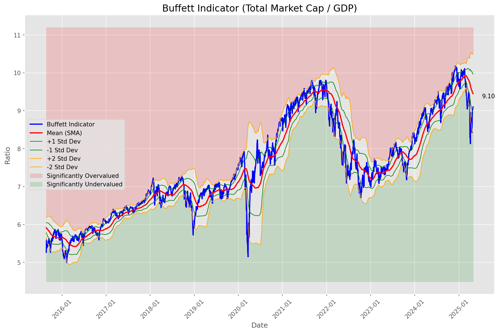
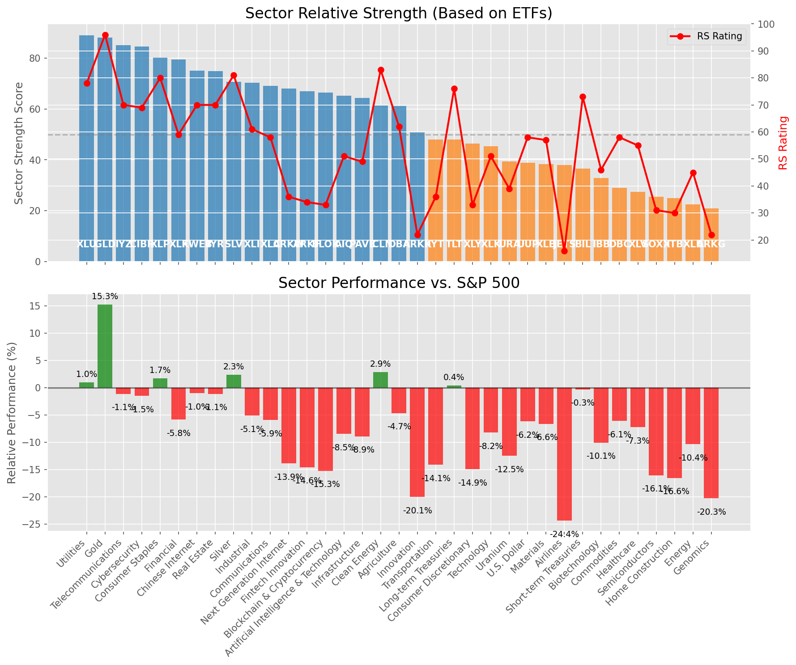

# **Daily Relative Strength Report**

**Date:** 2025-05-01

## **Market Valuation (Buffett Indicator)**

| Metric | Value |
|--------|-------|
| **Market Valuation** | **Fair Valued** |
| **Current Ratio** | 9.21 |
| **Historical Mean** | 9.45 |
| **Standard Deviation** | 0.52 |
| **Z-Score (StdDev from Mean)** | -0.68 |
| **Total Market Cap** | $276.01 trillion |
| **GDP** | $29.98 trillion |

## **Market Insights**

### **Market is Fairly Valued**

The market appears to be trading within a reasonable range of historical valuations. This suggests a balanced approach to equity investing is appropriate. Investors should:

- Focus on individual stock selection based on fundamentals and technicals
- Maintain normal equity allocations aligned with long-term goals
- Pay attention to sector rotation and relative strength
- Watch for changes in market leadership

Fair valuation typically suggests normal market returns can be expected, with stock selection becoming increasingly important.

### **Buffett Indicator Overview**

The Buffett Indicator (Total Market Cap / GDP) is a measure of the stock market's valuation relative to the size of the economy. It is named after Warren Buffett, who described it as "probably the best single measure of where valuations stand at any given moment."

- **Values above +2 standard deviations:** Market significantly overvalued
- **Values above +1 standard deviation:** Market overvalued
- **Values between -1 and +1 standard deviations:** Market fairly valued
- **Values below -1 standard deviation:** Market undervalued
- **Values below -2 standard deviations:** Market significantly undervalued

---

## **Sector Relative Strength**

Based on William O'Neil's Relative Strength Methodology

| ETF | Strength | RS Rating | Performance | Above Key MAs | Trend | Sector |
|-----|----------|-----------|-------------|--------------|-------|--------|
| [XLU](https://www.tradingview.com/chart/?symbol=XLU) | 89.5 | 79.0 | 1.36% | 10d ✓, 50d ✓, 200d ✓ | ↗️ | Utilities |
| [GLD](https://www.tradingview.com/chart/?symbol=GLD) | 88.1 | 96.0 | 15.19% | 10d ✗, 50d ✓, 200d ✓ | ↗️ | Gold |
| [CIBR](https://www.tradingview.com/chart/?symbol=CIBR) | 85.0 | 70.0 | -0.81% | 10d ✓, 50d ✓, 200d ✓ | ↗️ | Cybersecurity |
| [IYZ](https://www.tradingview.com/chart/?symbol=IYZ) | 85.0 | 70.0 | -0.91% | 10d ✓, 50d ✓, 200d ✓ | ↗️ | Telecommunications |
| [XLP](https://www.tradingview.com/chart/?symbol=XLP) | 80.1 | 80.0 | 1.81% | 10d ✗, 50d ✓, 200d ✓ | ↗️ | Consumer Staples |
| [XLF](https://www.tradingview.com/chart/?symbol=XLF) | 79.5 | 59.0 | -5.44% | 10d ✓, 50d ✓, 200d ✓ | ↗️ | Financial |
| [XLC](https://www.tradingview.com/chart/?symbol=XLC) | 79.0 | 58.0 | -5.59% | 10d ✓, 50d ✓, 200d ✓ | ↗️ | Communications |
| [AIQ](https://www.tradingview.com/chart/?symbol=AIQ) | 76.0 | 52.0 | -7.76% | 10d ✓, 50d ✓, 200d ✓ | ↗️ | Artificial Intelligence & Technology |
| [KWEB](https://www.tradingview.com/chart/?symbol=KWEB) | 75.6 | 71.0 | -0.62% | 10d ✓, 50d ✗, 200d ✓ | ↗️ | Chinese Internet |
| [IYR](https://www.tradingview.com/chart/?symbol=IYR) | 74.8 | 70.0 | -0.92% | 10d ✓, 50d ✓, 200d ✗ | ↗️ | Real Estate |
| [SLV](https://www.tradingview.com/chart/?symbol=SLV) | 70.7 | 81.0 | 2.35% | 10d ✗, 50d ✗, 200d ✓ | ↗️ | Silver |
| [XLI](https://www.tradingview.com/chart/?symbol=XLI) | 69.8 | 60.0 | -4.75% | 10d ✓, 50d ✓, 200d ✗ | ↗️ | Industrial |
| [ARKW](https://www.tradingview.com/chart/?symbol=ARKW) | 68.5 | 37.0 | -13.34% | 10d ✓, 50d ✓, 200d ✓ | ↗️ | Next Generation Internet |
| [ARKF](https://www.tradingview.com/chart/?symbol=ARKF) | 67.5 | 35.0 | -13.87% | 10d ✓, 50d ✓, 200d ✓ | ↗️ | Fintech Innovation |
| [BLOK](https://www.tradingview.com/chart/?symbol=BLOK) | 66.5 | 33.0 | -14.91% | 10d ✓, 50d ✓, 200d ✓ | ↗️ | Blockchain & Cryptocurrency |
| [PAVE](https://www.tradingview.com/chart/?symbol=PAVE) | 64.3 | 49.0 | -8.55% | 10d ✓, 50d ✓, 200d ✗ | ↗️ | Infrastructure |
| [ICLN](https://www.tradingview.com/chart/?symbol=ICLN) | 61.3 | 83.0 | 3.37% | 10d ✓, 50d ✓, 200d ✗ | ↘️ | Clean Energy |
| [DBA](https://www.tradingview.com/chart/?symbol=DBA) | 60.7 | 61.0 | -4.60% | 10d ✗, 50d ✗, 200d ✓ | ↗️ | Agriculture |
| [XLY](https://www.tradingview.com/chart/?symbol=XLY) | 56.3 | 33.0 | -14.57% | 10d ✓, 50d ✓, 200d ✗ | ↗️ | Consumer Discretionary |
| [ARKK](https://www.tradingview.com/chart/?symbol=ARKK) | 51.3 | 23.0 | -19.52% | 10d ✓, 50d ✓, 200d ✗ | ↗️ | Innovation |
| [IYT](https://www.tradingview.com/chart/?symbol=IYT) | 47.4 | 35.0 | -13.88% | 10d ✓, 50d ✗, 200d ✗ | ↗️ | Transportation |
| [TLT](https://www.tradingview.com/chart/?symbol=TLT) | 46.9 | 74.0 | 0.12% | 10d ✓, 50d ✗, 200d ✗ | ↘️ | Long-term Treasuries |
| [XLK](https://www.tradingview.com/chart/?symbol=XLK) | 46.3 | 53.0 | -7.39% | 10d ✓, 50d ✓, 200d ✗ | ↘️ | Technology |
| [URA](https://www.tradingview.com/chart/?symbol=URA) | 39.3 | 39.0 | -12.22% | 10d ✓, 50d ✓, 200d ✗ | ↘️ | Uranium |
| [XLB](https://www.tradingview.com/chart/?symbol=XLB) | 38.4 | 57.0 | -6.33% | 10d ✓, 50d ✗, 200d ✗ | ↘️ | Materials |
| [UUP](https://www.tradingview.com/chart/?symbol=UUP) | 38.4 | 57.0 | -6.12% | 10d ✓, 50d ✗, 200d ✗ | ↘️ | U.S. Dollar |
| [JETS](https://www.tradingview.com/chart/?symbol=JETS) | 37.9 | 16.0 | -24.06% | 10d ✓, 50d ✗, 200d ✗ | ↗️ | Airlines |
| [XLV](https://www.tradingview.com/chart/?symbol=XLV) | 37.4 | 55.0 | -6.85% | 10d ✓, 50d ✗, 200d ✗ | ↘️ | Healthcare |
| [BIL](https://www.tradingview.com/chart/?symbol=BIL) | 36.0 | 72.0 | -0.32% | 10d ✗, 50d ✗, 200d ✗ | ↘️ | Short-term Treasuries |
| [IBB](https://www.tradingview.com/chart/?symbol=IBB) | 32.4 | 45.0 | -10.01% | 10d ✓, 50d ✗, 200d ✗ | ↘️ | Biotechnology |
| [DBC](https://www.tradingview.com/chart/?symbol=DBC) | 28.5 | 57.0 | -5.97% | 10d ✗, 50d ✗, 200d ✗ | ↘️ | Commodities |
| [SOXX](https://www.tradingview.com/chart/?symbol=SOXX) | 25.9 | 32.0 | -15.10% | 10d ✓, 50d ✗, 200d ✗ | ↘️ | Semiconductors |
| [ITB](https://www.tradingview.com/chart/?symbol=ITB) | 24.4 | 29.0 | -16.21% | 10d ✓, 50d ✗, 200d ✗ | ↘️ | Home Construction |
| [XLE](https://www.tradingview.com/chart/?symbol=XLE) | 22.5 | 45.0 | -9.81% | 10d ✗, 50d ✗, 200d ✗ | ↘️ | Energy |
| [ARKG](https://www.tradingview.com/chart/?symbol=ARKG) | 20.9 | 22.0 | -19.87% | 10d ✓, 50d ✗, 200d ✗ | ↘️ | Genomics |

### **Sector ETF Performance Interpretation**

This table shows the relative strength metrics for different market sectors based on their representative ETFs:

- **ETF**: The ETF used to measure sector performance (click for chart)
- **Strength**: Overall sector strength score (0-100) combining multiple factors
- **RS Rating**: O'Neil RS rating of the sector ETF
- **Performance**: Performance of the sector ETF relative to SPY
- **Above Key MAs**: Whether the ETF is trading above its 10, 50, and 200-day moving averages
- **Trend**: Whether the sector is in an uptrend (↗️) or downtrend (↘️)

### **Current Sector Leadership**

The current market leadership is coming from the following sectors: **Utilities, Gold, Cybersecurity**.

The **Utilities** sector (represented by **XLU**) is showing particularly strong relative strength with an RS rating of 79.0 and performance of 1.36% vs. the S&P 500. This sector is trading above its 10-day, 50-day, 200-day moving average(s). Investors should consider focusing on high RS stocks within these leading sectors for potential outperformance.

---

## **Buy Recommendations**

The following 99 stocks show exceptional relative strength:

| RS Rating | Buy Score | Current Price | Chart | Name | Ticker |
|-----------|-----------|---------------|-------|------|--------|
| 100 | 100 | $26.53 | [Chart](https://www.tradingview.com/chart/?symbol=DB) | Deutsche Bank Aktiengesellschaft | DB |
| 100 | 100 | $52.10 | [Chart](https://www.tradingview.com/chart/?symbol=SEZL) | Sezzle Inc. Common Stock | SEZL |
| 100 | 100 | $45.67 | [Chart](https://www.tradingview.com/chart/?symbol=TGTX) | TG Therapeutics, Inc. | TGTX |
| 100 | 100 | $118.48 | [Chart](https://www.tradingview.com/chart/?symbol=PLTR) | Palantir Technologies Inc. Class A Common Stock | PLTR |
| 100 | 100 | $25.49 | [Chart](https://www.tradingview.com/chart/?symbol=TGI) | Triumph Group, Inc. | TGI |
| 99 | 100 | $23.58 | [Chart](https://www.tradingview.com/chart/?symbol=OR) | Osisko Gold Royalties Ltd | OR |
| 99 | 100 | $280.08 | [Chart](https://www.tradingview.com/chart/?symbol=VRSN) | VeriSign Inc | VRSN |
| 99 | 100 | $72.27 | [Chart](https://www.tradingview.com/chart/?symbol=VRNA) | Verona Pharma plc | VRNA |
| 99 | 100 | $170.27 | [Chart](https://www.tradingview.com/chart/?symbol=PM) | Philip Morris International Inc. | PM |
| 98 | 100 | $90.95 | [Chart](https://www.tradingview.com/chart/?symbol=SNEX) | StoneX Group Inc. Common Stock | SNEX |
| 98 | 100 | $71.64 | [Chart](https://www.tradingview.com/chart/?symbol=WRB) | W.R. Berkley Corporation | WRB |
| 98 | 100 | $44.16 | [Chart](https://www.tradingview.com/chart/?symbol=MRX) | Marex Group plc Ordinary Shares | MRX |
| 97 | 100 | $149.63 | [Chart](https://www.tradingview.com/chart/?symbol=HWM) | Howmet Aerospace Inc. | HWM |
| 97 | 100 | $38.60 | [Chart](https://www.tradingview.com/chart/?symbol=CNP) | CenterPoint Energy, Inc. | CNP |
| 97 | 100 | $116.39 | [Chart](https://www.tradingview.com/chart/?symbol=EHC) | Encompass Health Corporation Common Stock | EHC |
| 97 | 100 | $277.32 | [Chart](https://www.tradingview.com/chart/?symbol=CME) | CME Group Inc. | CME |
| 97 | 100 | $29.91 | [Chart](https://www.tradingview.com/chart/?symbol=EUFN) | iShares MSCI Europe Financials ETF | EUFN |
| 97 | 100 | $117.48 | [Chart](https://www.tradingview.com/chart/?symbol=BJ) | BJs Wholesale Club Holdings, Inc. Common Stock | BJ |
| 97 | 100 | $72.28 | [Chart](https://www.tradingview.com/chart/?symbol=KR) | The Kroger Co. | KR |
| 96 | 100 | $27.64 | [Chart](https://www.tradingview.com/chart/?symbol=T) | AT&T Inc. | T |
| 96 | 100 | $1137.70 | [Chart](https://www.tradingview.com/chart/?symbol=NFLX) | NetFlix Inc | NFLX |
| 96 | 100 | $59.29 | [Chart](https://www.tradingview.com/chart/?symbol=MO) | Altria Group, Inc. | MO |
| 96 | 100 | $159.58 | [Chart](https://www.tradingview.com/chart/?symbol=AGX) | Argan, Inc | AGX |
| 95 | 100 | $39.62 | [Chart](https://www.tradingview.com/chart/?symbol=EWG) | iShares MSCI Germany ETF | EWG |
| 95 | 100 | $16.97 | [Chart](https://www.tradingview.com/chart/?symbol=SPNT) | SiriusPoint Ltd. | SPNT |
| 95 | 100 | $49.77 | [Chart](https://www.tradingview.com/chart/?symbol=GFL) | GFL Environmental Inc. Subordinate Voting Shares | GFL |
| 95 | 100 | $136.15 | [Chart](https://www.tradingview.com/chart/?symbol=DTE) | DTE Energy Company | DTE |
| 95 | 100 | $249.75 | [Chart](https://www.tradingview.com/chart/?symbol=RSG) | Republic Services Inc. | RSG |
| 95 | 100 | $145.30 | [Chart](https://www.tradingview.com/chart/?symbol=CAH) | Cardinal Health, Inc. | CAH |
| 95 | 100 | $40.16 | [Chart](https://www.tradingview.com/chart/?symbol=DRS) | Leonardo DRS, Inc. Common Stock | DRS |
| 94 | 100 | $160.56 | [Chart](https://www.tradingview.com/chart/?symbol=ATO) | Atmos Energy Corporation | ATO |
| 94 | 100 | $89.56 | [Chart](https://www.tradingview.com/chart/?symbol=CCEP) | Coca-Cola Europacific Partners plc Ordinary Shares | CCEP |
| 94 | 100 | $291.17 | [Chart](https://www.tradingview.com/chart/?symbol=COR) | Cencora, Inc. | COR |
| 94 | 100 | $151.00 | [Chart](https://www.tradingview.com/chart/?symbol=LRN) | Stride, Inc. | LRN |
| 94 | 100 | $79.28 | [Chart](https://www.tradingview.com/chart/?symbol=NFG) | National Fuel Gas Co. | NFG |
| 94 | 100 | $138.33 | [Chart](https://www.tradingview.com/chart/?symbol=SE) | Sea Limited American Depositary Shares, each representing one Class A Ordinary Share | SE |
| 94 | 100 | $531.26 | [Chart](https://www.tradingview.com/chart/?symbol=BRK.B) | BERKSHIRE HATHAWAY Class B | BRK.B |
| 93 | 100 | $50.51 | [Chart](https://www.tradingview.com/chart/?symbol=TRP) | TC Energy Corporation | TRP |
| 93 | 100 | $119.59 | [Chart](https://www.tradingview.com/chart/?symbol=COOP) | Mr. Cooper Group Inc. Common Stock | COOP |
| 93 | 100 | $22.97 | [Chart](https://www.tradingview.com/chart/?symbol=CXW) | CoreCivic, Inc. | CXW |
| 93 | 100 | $31.87 | [Chart](https://www.tradingview.com/chart/?symbol=AHR) | American Healthcare REIT, Inc. | AHR |
| 93 | 100 | $202.19 | [Chart](https://www.tradingview.com/chart/?symbol=BAP) | Credicorp LTD | BAP |
| 93 | 100 | $100.47 | [Chart](https://www.tradingview.com/chart/?symbol=RBA) | RB Global, Inc. | RBA |
| 92 | 100 | $604.31 | [Chart](https://www.tradingview.com/chart/?symbol=SPOT) | Spotify Technology S.A. | SPOT |
| 92 | 100 | $107.67 | [Chart](https://www.tradingview.com/chart/?symbol=AEP) | American Electric Power Company, Inc. | AEP |
| 92 | 100 | $294.45 | [Chart](https://www.tradingview.com/chart/?symbol=PEN) | Penumbra, Inc. | PEN |
| 92 | 100 | $172.15 | [Chart](https://www.tradingview.com/chart/?symbol=SFM) | Sprouts Farmers Market, Inc. | SFM |
| 92 | 100 | $23.51 | [Chart](https://www.tradingview.com/chart/?symbol=SRAD) | Sportradar Group AG Class A Ordinary Shares | SRAD |
| 92 | 100 | $19.34 | [Chart](https://www.tradingview.com/chart/?symbol=KT) | KT Corp. | KT |
| 92 | 100 | $150.39 | [Chart](https://www.tradingview.com/chart/?symbol=WELL) | Welltower Inc. | WELL |
| 92 | 100 | $400.33 | [Chart](https://www.tradingview.com/chart/?symbol=DUOL) | Duolingo, Inc. Class A Common Stock | DUOL |
| 91 | 100 | $138.93 | [Chart](https://www.tradingview.com/chart/?symbol=TW) | Tradeweb Markets Inc. Class A Common Stock | TW |
| 91 | 100 | $43.28 | [Chart](https://www.tradingview.com/chart/?symbol=BTI) | British American Tobacco p.l.c. American Depositary Shares, American Depositary Shares, each representing one Ordinary Share | BTI |
| 91 | 100 | $108.85 | [Chart](https://www.tradingview.com/chart/?symbol=WEC) | WEC Energy Group, Inc. | WEC |
| 90 | 100 | $177.50 | [Chart](https://www.tradingview.com/chart/?symbol=DGX) | Quest Diagnostics Inc. | DGX |
| 90 | 100 | $24.45 | [Chart](https://www.tradingview.com/chart/?symbol=EWS) | iShares MSCI Singapore ETF | EWS |
| 90 | 100 | $117.42 | [Chart](https://www.tradingview.com/chart/?symbol=CWST) | Casella Waste Systems Inc | CWST |
| 90 | 100 | $15.90 | [Chart](https://www.tradingview.com/chart/?symbol=BCS) | Barclays PLC | BCS |
| 90 | 100 | $168.06 | [Chart](https://www.tradingview.com/chart/?symbol=THG) | The Hanover Insurance Group, Inc. | THG |
| 90 | 100 | $456.94 | [Chart](https://www.tradingview.com/chart/?symbol=CASY) | Casey's General Stores Inc | CASY |
| 90 | 100 | $54.19 | [Chart](https://www.tradingview.com/chart/?symbol=RELX) | RELX PLC | RELX |
| 90 | 100 | $36.13 | [Chart](https://www.tradingview.com/chart/?symbol=PPL) | PPL Corporation | PPL |
| 89 | 100 | $68.61 | [Chart](https://www.tradingview.com/chart/?symbol=EVRG) | Evergy, Inc. | EVRG |
| 89 | 100 | $58.37 | [Chart](https://www.tradingview.com/chart/?symbol=CHEF) | The Chef's Warehouse Inc | CHEF |
| 89 | 100 | $33.12 | [Chart](https://www.tradingview.com/chart/?symbol=UGI) | UGI Corporation | UGI |
| 89 | 100 | $58.73 | [Chart](https://www.tradingview.com/chart/?symbol=ULS) | UL Solutions Inc. | ULS |
| 88 | 100 | $41.55 | [Chart](https://www.tradingview.com/chart/?symbol=HMN) | Horace Mann Educators Corporation | HMN |
| 87 | 100 | $98.08 | [Chart](https://www.tradingview.com/chart/?symbol=AXS) | Axis Capital Holders Limited | AXS |
| 87 | 100 | $108.32 | [Chart](https://www.tradingview.com/chart/?symbol=ATGE) | Adtalem Global Education Inc. Common Shares | ATGE |
| 87 | 100 | $70.72 | [Chart](https://www.tradingview.com/chart/?symbol=XEL) | Xcel Energy, Inc. | XEL |
| 90 | 99 | $81.02 | [Chart](https://www.tradingview.com/chart/?symbol=FAST) | Fastenal Co | FAST |
| 89 | 99 | $220.68 | [Chart](https://www.tradingview.com/chart/?symbol=CBOE) | Cboe Global Markets, Inc. | CBOE |
| 89 | 99 | $5118.59 | [Chart](https://www.tradingview.com/chart/?symbol=BKNG) | Booking Holdings Inc. Common Stock | BKNG |
| 89 | 99 | $171.25 | [Chart](https://www.tradingview.com/chart/?symbol=ICE) | Intercontinental Exchange  Inc. | ICE |
| 88 | 98 | $161.81 | [Chart](https://www.tradingview.com/chart/?symbol=MAA) | Mid-America Apartment Communities, Inc. | MAA |
| 86 | 98 | $204.28 | [Chart](https://www.tradingview.com/chart/?symbol=CRS) | Carpenter Technology Corp | CRS |
| 85 | 98 | $31.19 | [Chart](https://www.tradingview.com/chart/?symbol=LTH) | Life Time Group Holdings, Inc. | LTH |
| 85 | 98 | $59.18 | [Chart](https://www.tradingview.com/chart/?symbol=WMB) | Williams Companies Inc. | WMB |
| 87 | 97 | $167.30 | [Chart](https://www.tradingview.com/chart/?symbol=CVLT) | Commault Systems, Inc. | CVLT |
| 85 | 97 | $17.02 | [Chart](https://www.tradingview.com/chart/?symbol=AM) | Antero Midstream Corporation Common Stock | AM |
| 85 | 97 | $30.14 | [Chart](https://www.tradingview.com/chart/?symbol=SLM) | SLM Corporation | SLM |
| 84 | 97 | $37.49 | [Chart](https://www.tradingview.com/chart/?symbol=TDS) | Telephone and Data Systems Inc. | TDS |
| 84 | 97 | $163.73 | [Chart](https://www.tradingview.com/chart/?symbol=TKO) | TKO Group Holdings, Inc. | TKO |
| 84 | 97 | $291.05 | [Chart](https://www.tradingview.com/chart/?symbol=SAP) | SAP SE | SAP |
| 86 | 96 | $56.67 | [Chart](https://www.tradingview.com/chart/?symbol=IGF) | iShares Global Infrastructure ETF | IGF |
| 86 | 96 | $42.72 | [Chart](https://www.tradingview.com/chart/?symbol=GLNG) | Golar LNG Ltd | GLNG |
| 86 | 96 | $196.32 | [Chart](https://www.tradingview.com/chart/?symbol=WCN) | Waste Connections, Inc. | WCN |
| 84 | 95 | $34.97 | [Chart](https://www.tradingview.com/chart/?symbol=KTOS) | Kratos Defense & Security Solutions, Inc. | KTOS |
| 84 | 95 | $178.37 | [Chart](https://www.tradingview.com/chart/?symbol=LOPE) | Grand Canyon Education, Inc | LOPE |
| 84 | 94 | $124.17 | [Chart](https://www.tradingview.com/chart/?symbol=BECN) | Beacon Roofing Supply, Inc. | BECN |
| 84 | 94 | $33.41 | [Chart](https://www.tradingview.com/chart/?symbol=PAY) | Paymentus Holdings, Inc. | PAY |
| 81 | 94 | $71.56 | [Chart](https://www.tradingview.com/chart/?symbol=CORT) | Corcept Therapeutics Inc. | CORT |
| 82 | 93 | $41.07 | [Chart](https://www.tradingview.com/chart/?symbol=AB) | AllianceBernstein Holding, L.P. | AB |
| 82 | 93 | $50.11 | [Chart](https://www.tradingview.com/chart/?symbol=VTIP) | Vanguard Short-Term Inflation-Protected Securities Index Fund | VTIP |
| 82 | 92 | $40.84 | [Chart](https://www.tradingview.com/chart/?symbol=FHI) | Federated Hermes, Inc. | FHI |
| 81 | 92 | $1001.59 | [Chart](https://www.tradingview.com/chart/?symbol=COST) | Costco Wholesale Corp | COST |
| 81 | 92 | $295.54 | [Chart](https://www.tradingview.com/chart/?symbol=VRSK) | Verisk Analytics, Inc. Common Stock | VRSK |
| 80 | 92 | $28.27 | [Chart](https://www.tradingview.com/chart/?symbol=NTGR) | NETGEAR, Inc. | NTGR |
| 80 | 90 | $80.55 | [Chart](https://www.tradingview.com/chart/?symbol=CASH) | Pathward Financial, Inc. Common Stock | CASH |

---

## **Sell Recommendations**

The following 149 stocks show deteriorating relative strength:

| RS Rating | Sell Score | Current Price | Chart | Name | Ticker |
|-----------|------------|---------------|-------|------|--------|
| 1 | 100 | $14.60 | [Chart](https://www.tradingview.com/chart/?symbol=VTLE) | Vital Energy, Inc. | VTLE |
| 1 | 100 | $54.02 | [Chart](https://www.tradingview.com/chart/?symbol=TTD) | The Trade Desk, Inc. | TTD |
| 1 | 100 | $11.25 | [Chart](https://www.tradingview.com/chart/?symbol=AMRC) | Ameresco, Inc. | AMRC |
| 1 | 100 | $10.77 | [Chart](https://www.tradingview.com/chart/?symbol=XNCR) | Xencor, Inc. | XNCR |
| 2 | 100 | $11.26 | [Chart](https://www.tradingview.com/chart/?symbol=NRIX) | Nurix Therapeutics, Inc. Common stock | NRIX |
| 2 | 100 | $28.57 | [Chart](https://www.tradingview.com/chart/?symbol=CIVI) | Civitas Resources, Inc. | CIVI |
| 2 | 100 | $18.32 | [Chart](https://www.tradingview.com/chart/?symbol=DAVA) | Endava plc American Depositary Shares (each representing one Class A Ordinary Share) | DAVA |
| 2 | 100 | $39.06 | [Chart](https://www.tradingview.com/chart/?symbol=CMPR) | Cimpress PLC Ordinary Shares (Ireland) | CMPR |
| 3 | 100 | $12.83 | [Chart](https://www.tradingview.com/chart/?symbol=GCT) | GigaCloud Technology Inc Class A Ordinary Shares | GCT |
| 3 | 100 | $16.43 | [Chart](https://www.tradingview.com/chart/?symbol=SSTK) | SHUTTERSTOCK, INC. | SSTK |
| 3 | 100 | $77.00 | [Chart](https://www.tradingview.com/chart/?symbol=ILMN) | Illumina Inc | ILMN |
| 3 | 100 | $13.78 | [Chart](https://www.tradingview.com/chart/?symbol=ODP) | The ODP Corporation Common Stock | ODP |
| 3 | 100 | $118.41 | [Chart](https://www.tradingview.com/chart/?symbol=GLOB) | GLOBANT S.A. | GLOB |
| 4 | 100 | $23.10 | [Chart](https://www.tradingview.com/chart/?symbol=NSSC) | Napco Security Technologies, Inc | NSSC |
| 4 | 100 | $59.63 | [Chart](https://www.tradingview.com/chart/?symbol=LABU) | Direxion Daily S&P Biotech Bull 3X Shares | LABU |
| 4 | 100 | $16.30 | [Chart](https://www.tradingview.com/chart/?symbol=IART) | Integra LifeSciences Holdings | IART |
| 4 | 100 | $23.68 | [Chart](https://www.tradingview.com/chart/?symbol=RPD) | Rapid7, Inc. Common Stock | RPD |
| 5 | 100 | $21.28 | [Chart](https://www.tradingview.com/chart/?symbol=SPT) | Sprout Social, Inc Class A Common Stock | SPT |
| 5 | 100 | $11.95 | [Chart](https://www.tradingview.com/chart/?symbol=IMXI) | International Money Express, Inc. | IMXI |
| 5 | 100 | $10.02 | [Chart](https://www.tradingview.com/chart/?symbol=LSPD) | Lightspeed Commerce Inc. | LSPD |
| 6 | 100 | $72.82 | [Chart](https://www.tradingview.com/chart/?symbol=MKSI) | MKS Instruments Inc | MKSI |
| 6 | 100 | $13.35 | [Chart](https://www.tradingview.com/chart/?symbol=DV) | DoubleVerify Holdings, Inc. | DV |
| 6 | 100 | $113.39 | [Chart](https://www.tradingview.com/chart/?symbol=BLDR) | Builders FirstSource, Inc. | BLDR |
| 6 | 100 | $26.11 | [Chart](https://www.tradingview.com/chart/?symbol=JACK) | Jack in the Box Inc. | JACK |
| 6 | 100 | $32.99 | [Chart](https://www.tradingview.com/chart/?symbol=SCSC) | Scansource Inc | SCSC |
| 6 | 100 | $23.96 | [Chart](https://www.tradingview.com/chart/?symbol=AMPH) | Amphastar Pharmaceuticals, Inc. | AMPH |
| 7 | 100 | $32.93 | [Chart](https://www.tradingview.com/chart/?symbol=AAP) | ADVANCE AUTO PARTS INC | AAP |
| 8 | 100 | $47.20 | [Chart](https://www.tradingview.com/chart/?symbol=PSTG) | Pure Storage, Inc. Class A | PSTG |
| 9 | 100 | $18.81 | [Chart](https://www.tradingview.com/chart/?symbol=PLAY) | Dave & Buster's Entertainment, Inc. | PLAY |
| 10 | 100 | $12.80 | [Chart](https://www.tradingview.com/chart/?symbol=ADNT) | Adient plc Ordinary Shares | ADNT |
| 10 | 100 | $18.50 | [Chart](https://www.tradingview.com/chart/?symbol=PDFS) | PDF Solutions Inc | PDFS |
| 10 | 100 | $28.01 | [Chart](https://www.tradingview.com/chart/?symbol=SRDX) | Surmodics, Inc. Common Stock | SRDX |
| 11 | 100 | $16.27 | [Chart](https://www.tradingview.com/chart/?symbol=MLKN) | MillerKnoll, Inc. Common Stock | MLKN |
| 11 | 100 | $31.66 | [Chart](https://www.tradingview.com/chart/?symbol=UWM) | ProShares Ultra Russell2000 | UWM |
| 13 | 100 | $15.79 | [Chart](https://www.tradingview.com/chart/?symbol=DXC) | DXC Technology Company | DXC |
| 16 | 100 | $11.68 | [Chart](https://www.tradingview.com/chart/?symbol=JAMF) | Jamf Holding Corp. Common Stock | JAMF |
| 1 | 99 | $111.55 | [Chart](https://www.tradingview.com/chart/?symbol=DECK) | Deckers Outdoor Corp | DECK |
| 7 | 99 | $56.94 | [Chart](https://www.tradingview.com/chart/?symbol=SYNA) | Synaptics Inc | SYNA |
| 8 | 99 | $21.98 | [Chart](https://www.tradingview.com/chart/?symbol=AI) | C3.ai, Inc. | AI |
| 13 | 99 | $12.47 | [Chart](https://www.tradingview.com/chart/?symbol=ARCT) | Arcturus Therapeutics Holdings Inc. Common Stock | ARCT |
| 13 | 99 | $20.72 | [Chart](https://www.tradingview.com/chart/?symbol=FOXF) | Fox Factory Holding Corp. Common Stock | FOXF |
| 9 | 98 | $13.95 | [Chart](https://www.tradingview.com/chart/?symbol=ARWR) | Arrowhead Research Corporation | ARWR |
| 7 | 97 | $21.73 | [Chart](https://www.tradingview.com/chart/?symbol=TDC) | TERADATA CORPORATION | TDC |
| 9 | 97 | $37.92 | [Chart](https://www.tradingview.com/chart/?symbol=ASO) | Academy Sports and Outdoors, Inc. | ASO |
| 9 | 97 | $35.43 | [Chart](https://www.tradingview.com/chart/?symbol=CRC) | California Resources Corporation | CRC |
| 12 | 97 | $92.94 | [Chart](https://www.tradingview.com/chart/?symbol=BCC) | Boise Cascade Company | BCC |
| 13 | 97 | $12.84 | [Chart](https://www.tradingview.com/chart/?symbol=TRIP) | TripAdvisor, Inc. | TRIP |
| 14 | 97 | $59.00 | [Chart](https://www.tradingview.com/chart/?symbol=AMWD) | American Woodmark Corp | AMWD |
| 19 | 97 | $21.50 | [Chart](https://www.tradingview.com/chart/?symbol=ST) | Sensata Technologies Holding plc | ST |
| 11 | 96 | $11.13 | [Chart](https://www.tradingview.com/chart/?symbol=AEYE) | AudioEye, Inc. Common Stock | AEYE |
| 15 | 96 | $19.02 | [Chart](https://www.tradingview.com/chart/?symbol=VECO) | Veeco Instruments Inc | VECO |
| 8 | 95 | $29.17 | [Chart](https://www.tradingview.com/chart/?symbol=XPEL) | XPEL, Inc. Common Stock | XPEL |
| 14 | 95 | $90.53 | [Chart](https://www.tradingview.com/chart/?symbol=NTAP) | NetApp, Inc | NTAP |
| 21 | 95 | $15.23 | [Chart](https://www.tradingview.com/chart/?symbol=PSFE) | Paysafe Limited | PSFE |
| 8 | 94 | $10.01 | [Chart](https://www.tradingview.com/chart/?symbol=VYX) | NCR Voyix Corporation | VYX |
| 10 | 94 | $106.80 | [Chart](https://www.tradingview.com/chart/?symbol=A) | Agilent Technologies Inc. | A |
| 11 | 94 | $10.77 | [Chart](https://www.tradingview.com/chart/?symbol=SONO) | Sonos, Inc. Common Stock | SONO |
| 11 | 94 | $101.25 | [Chart](https://www.tradingview.com/chart/?symbol=TOL) | Toll Brothers, Inc. | TOL |
| 17 | 94 | $25.70 | [Chart](https://www.tradingview.com/chart/?symbol=GDEN) | Golden Entertainment, Inc. Common Stock | GDEN |
| 12 | 93 | $25.75 | [Chart](https://www.tradingview.com/chart/?symbol=RNG) | RINGCENTRAL, INC. | RNG |
| 16 | 93 | $10.47 | [Chart](https://www.tradingview.com/chart/?symbol=SEMR) | SEMrush Holdings, Inc. | SEMR |
| 20 | 93 | $62.36 | [Chart](https://www.tradingview.com/chart/?symbol=PLUS) | ePlus Inc | PLUS |
| 28 | 93 | $14.21 | [Chart](https://www.tradingview.com/chart/?symbol=FXN) | First Trust Energy AlphaDEX Fund | FXN |
| 11 | 92 | $19.66 | [Chart](https://www.tradingview.com/chart/?symbol=BZH) | Beazer Homes USA, Inc. New | BZH |
| 11 | 92 | $40.89 | [Chart](https://www.tradingview.com/chart/?symbol=USD) | ProShares Ultra Semiconductors | USD |
| 13 | 92 | $63.14 | [Chart](https://www.tradingview.com/chart/?symbol=SPB) | Spectrum Brands Holdings, Inc. | SPB |
| 15 | 92 | $54.80 | [Chart](https://www.tradingview.com/chart/?symbol=IIPR) | Innovative Industrial Properties, Inc. Common stock | IIPR |
| 16 | 92 | $15.59 | [Chart](https://www.tradingview.com/chart/?symbol=PENN) | PENN Entertainment, Inc. Common Stock | PENN |
| 18 | 92 | $47.55 | [Chart](https://www.tradingview.com/chart/?symbol=ERX) | Direxion Daily Energy Bull 2X Shares | ERX |
| 27 | 92 | $16.47 | [Chart](https://www.tradingview.com/chart/?symbol=TRMD) | TORM plc Class A Common Stock | TRMD |
| 12 | 91 | $14.01 | [Chart](https://www.tradingview.com/chart/?symbol=IVZ) | Invesco LTD | IVZ |
| 21 | 91 | $92.40 | [Chart](https://www.tradingview.com/chart/?symbol=CHRD) | Chord Energy Corporation Common Stock | CHRD |
| 23 | 91 | $11.41 | [Chart](https://www.tradingview.com/chart/?symbol=PBR) | PETROLEO BRASILEIRO S.A.-PETROBRAS ADS (REP 1 COMMON SHARE) | PBR |
| 26 | 91 | $97.89 | [Chart](https://www.tradingview.com/chart/?symbol=AMD) | Advanced Micro Devices | AMD |
| 18 | 90 | $12.16 | [Chart](https://www.tradingview.com/chart/?symbol=KRP) | Kimbell Royalty Partners, LP Common Units representing Limited Partner Interests | KRP |
| 23 | 90 | $12.16 | [Chart](https://www.tradingview.com/chart/?symbol=PR) | Permian Resources Corporation | PR |
| 27 | 90 | $13.02 | [Chart](https://www.tradingview.com/chart/?symbol=MED) | Medifast, Inc. | MED |
| 11 | 89 | $10.31 | [Chart](https://www.tradingview.com/chart/?symbol=VREX) | Varex Imaging Corporation Common Stock | VREX |
| 14 | 89 | $38.01 | [Chart](https://www.tradingview.com/chart/?symbol=TWST) | Twist Bioscience Corporation Common Stock | TWST |
| 16 | 89 | $11.78 | [Chart](https://www.tradingview.com/chart/?symbol=APLE) | Apple Hospitality REIT, Inc. | APLE |
| 22 | 89 | $21.86 | [Chart](https://www.tradingview.com/chart/?symbol=ARKG) | ARK Genomic Revolution ETF | ARKG |
| 23 | 89 | $166.54 | [Chart](https://www.tradingview.com/chart/?symbol=IBP) | INSTALLED BUILDING PRODUCTS, INC. | IBP |
| 27 | 89 | $26.98 | [Chart](https://www.tradingview.com/chart/?symbol=COLL) | Collegium Pharmaceutical, Inc. Common Stock | COLL |
| 18 | 88 | $25.52 | [Chart](https://www.tradingview.com/chart/?symbol=HPQ) | HP Inc. | HPQ |
| 19 | 88 | $53.95 | [Chart](https://www.tradingview.com/chart/?symbol=KBH) | KB Home | KBH |
| 22 | 88 | $15.60 | [Chart](https://www.tradingview.com/chart/?symbol=AMZY) | YieldMax AMZN Option Income Strategy ETF | AMZY |
| 23 | 88 | $11.15 | [Chart](https://www.tradingview.com/chart/?symbol=GES) | Guess?, Inc. | GES |
| 16 | 87 | $29.11 | [Chart](https://www.tradingview.com/chart/?symbol=MBUU) | Malibu Boats, Inc. Class A | MBUU |
| 16 | 87 | $10.15 | [Chart](https://www.tradingview.com/chart/?symbol=HLIT) | Harmonic Inc | HLIT |
| 23 | 87 | $74.22 | [Chart](https://www.tradingview.com/chart/?symbol=AGYS) | Agilysys, Inc. Common Stock (DE) | AGYS |
| 24 | 87 | $11.55 | [Chart](https://www.tradingview.com/chart/?symbol=KELYA) | Kelly Services Inc | KELYA |
| 26 | 87 | $11.04 | [Chart](https://www.tradingview.com/chart/?symbol=ABR) | Arbor Realty Trust, Inc. | ABR |
| 28 | 87 | $10.48 | [Chart](https://www.tradingview.com/chart/?symbol=GSBD) | Goldman Sachs BDC, Inc. | GSBD |
| 28 | 87 | $42.15 | [Chart](https://www.tradingview.com/chart/?symbol=NXT) | Nextracker Inc. Class A Common Stock | NXT |
| 29 | 87 | $10.69 | [Chart](https://www.tradingview.com/chart/?symbol=PBR.A) | Petroleo Brasileiro S.A.-Petrobras | PBR.A |
| 14 | 86 | $10.86 | [Chart](https://www.tradingview.com/chart/?symbol=XHR) | Xenia Hotels & Resorts, Inc. | XHR |
| 17 | 86 | $36.97 | [Chart](https://www.tradingview.com/chart/?symbol=LVS) | Las Vegas Sands Corp. | LVS |
| 28 | 86 | $10.34 | [Chart](https://www.tradingview.com/chart/?symbol=CMRE) | Costamare Inc. | CMRE |
| 19 | 85 | $209.83 | [Chart](https://www.tradingview.com/chart/?symbol=FDX) | FedEx Corporation | FDX |
| 20 | 85 | $34.46 | [Chart](https://www.tradingview.com/chart/?symbol=OVV) | Ovintiv Inc. | OVV |
| 20 | 85 | $10.26 | [Chart](https://www.tradingview.com/chart/?symbol=PACS) | PACS Group, Inc. | PACS |
| 26 | 84 | $69.39 | [Chart](https://www.tradingview.com/chart/?symbol=TTC) | Toro Company (The) | TTC |
| 27 | 84 | $30.93 | [Chart](https://www.tradingview.com/chart/?symbol=MBIN) | Merchants Bancorp Common Stock | MBIN |
| 18 | 83 | $18.72 | [Chart](https://www.tradingview.com/chart/?symbol=S) | SentinelOne, Inc. | S |
| 22 | 83 | $36.09 | [Chart](https://www.tradingview.com/chart/?symbol=CALF) | Pacer US Small Cap Cash Cows ETF | CALF |
| 27 | 82 | $12.02 | [Chart](https://www.tradingview.com/chart/?symbol=OEC) | Orion S.A. | OEC |
| 31 | 82 | $28.86 | [Chart](https://www.tradingview.com/chart/?symbol=TAN) | Invesco Solar ETF | TAN |
| 36 | 82 | $13.74 | [Chart](https://www.tradingview.com/chart/?symbol=MANU) | MANCHESTER UNITED PLC | MANU |
| 29 | 81 | $92.26 | [Chart](https://www.tradingview.com/chart/?symbol=ITB) | iShares U.S. Home Construction ETF | ITB |
| 24 | 80 | $16.91 | [Chart](https://www.tradingview.com/chart/?symbol=MLNK) | MeridianLink, Inc. | MLNK |
| 25 | 80 | $140.22 | [Chart](https://www.tradingview.com/chart/?symbol=MTN) | Vail Resorts, Inc. | MTN |
| 26 | 80 | $10.71 | [Chart](https://www.tradingview.com/chart/?symbol=DBRG) | DigitalBridge Group, Inc. | DBRG |
| 26 | 80 | $34.29 | [Chart](https://www.tradingview.com/chart/?symbol=TECK) | Teck Resources Limited | TECK |
| 27 | 80 | $12.58 | [Chart](https://www.tradingview.com/chart/?symbol=MTUS) | Metallus Inc. | MTUS |
| 32 | 79 | $69.23 | [Chart](https://www.tradingview.com/chart/?symbol=XRT) | SPDR S&P Retail ETF | XRT |
| 33 | 79 | $10.01 | [Chart](https://www.tradingview.com/chart/?symbol=XPRO) | Expro Group Holdings N.V. | XPRO |
| 27 | 78 | $107.31 | [Chart](https://www.tradingview.com/chart/?symbol=MHO) | M/I Homes, Inc. | MHO |
| 29 | 78 | $15.12 | [Chart](https://www.tradingview.com/chart/?symbol=ZIM) | ZIM Integrated Shipping Services Ltd. | ZIM |
| 32 | 77 | $115.12 | [Chart](https://www.tradingview.com/chart/?symbol=VLO) | Valero Energy Corporation | VLO |
| 32 | 77 | $52.26 | [Chart](https://www.tradingview.com/chart/?symbol=LW) | Lamb Weston Holdings, Inc. | LW |
| 28 | 76 | $21.31 | [Chart](https://www.tradingview.com/chart/?symbol=FCG) | First Trust Natural Gas ETF | FCG |
| 30 | 76 | $35.51 | [Chart](https://www.tradingview.com/chart/?symbol=IAC) | IAC Inc. Common Stock | IAC |
| 32 | 74 | $378.48 | [Chart](https://www.tradingview.com/chart/?symbol=ADBE) | Adobe Inc. | ADBE |
| 36 | 74 | $146.16 | [Chart](https://www.tradingview.com/chart/?symbol=IWN) | iShares Russell 2000 Value ETF | IWN |
| 29 | 73 | $74.23 | [Chart](https://www.tradingview.com/chart/?symbol=SLYV) | SPDR S&P 600 Small Cap Value ETF (based on S&P SmallCap 600 Value Index symbol--CVK) | SLYV |
| 31 | 73 | $42.30 | [Chart](https://www.tradingview.com/chart/?symbol=HNI) | HNI Corporation | HNI |
| 36 | 73 | $95.57 | [Chart](https://www.tradingview.com/chart/?symbol=XHB) | SPDR S&P Homebuilders ETF | XHB |
| 38 | 73 | $17.21 | [Chart](https://www.tradingview.com/chart/?symbol=FLO) | Flowers Foods, Inc. | FLO |
| 28 | 72 | $12.22 | [Chart](https://www.tradingview.com/chart/?symbol=CIM) | Chimera Investment Corp. | CIM |
| 32 | 72 | $73.07 | [Chart](https://www.tradingview.com/chart/?symbol=GMS) | GMS Inc. | GMS |
| 36 | 72 | $190.78 | [Chart](https://www.tradingview.com/chart/?symbol=NDSN) | Nordson Corp | NDSN |
| 38 | 72 | $25.01 | [Chart](https://www.tradingview.com/chart/?symbol=HASI) | HA Sustainable Infrastructure Capital, Inc. | HASI |
| 38 | 72 | $42.32 | [Chart](https://www.tradingview.com/chart/?symbol=JOE) | St. Joe Company | JOE |
| 31 | 71 | $44.64 | [Chart](https://www.tradingview.com/chart/?symbol=PRKS) | United Parks & Resorts Inc. | PRKS |
| 39 | 71 | $10.12 | [Chart](https://www.tradingview.com/chart/?symbol=ARLO) | Arlo Technologies, Inc. | ARLO |
| 33 | 70 | $17.93 | [Chart](https://www.tradingview.com/chart/?symbol=HTGC) | Hercules Capital, Inc. | HTGC |
| 37 | 70 | $30.52 | [Chart](https://www.tradingview.com/chart/?symbol=MTCH) | Match Group, Inc | MTCH |
| 37 | 69 | $19.16 | [Chart](https://www.tradingview.com/chart/?symbol=COLD) | Americold Realty Trust, Inc. | COLD |
| 37 | 69 | $21.21 | [Chart](https://www.tradingview.com/chart/?symbol=MGY) | Magnolia Oil & Gas Corporation Class A Common Stock | MGY |
| 38 | 69 | $14.54 | [Chart](https://www.tradingview.com/chart/?symbol=RYLD) | Global X Russell 2000 Covered Call ETF | RYLD |
| 32 | 68 | $10.47 | [Chart](https://www.tradingview.com/chart/?symbol=AVO) | Mission Produce, Inc. Common Stock | AVO |
| 34 | 67 | $17.97 | [Chart](https://www.tradingview.com/chart/?symbol=JKS) | JINKOSOLAR HOLDINGS CO | JKS |
| 35 | 67 | $196.77 | [Chart](https://www.tradingview.com/chart/?symbol=IWM) | iShares Russell 2000 ETF | IWM |
| 39 | 66 | $10.10 | [Chart](https://www.tradingview.com/chart/?symbol=CION) | CION Investment Corporation | CION |
| 35 | 65 | $103.52 | [Chart](https://www.tradingview.com/chart/?symbol=PLD) | PROLOGIS, INC. | PLD |
| 36 | 64 | $28.89 | [Chart](https://www.tradingview.com/chart/?symbol=BOTZ) | Global X Funds Global X Robotics & Artificial Intelligence ETF | BOTZ |
| 38 | 64 | $22.47 | [Chart](https://www.tradingview.com/chart/?symbol=SGRY) | Surgery Partners, Inc. Common Stock | SGRY |
| 37 | 63 | $15.12 | [Chart](https://www.tradingview.com/chart/?symbol=BIZD) | VanEck BDC Income ETF | BIZD |
| 39 | 63 | $214.83 | [Chart](https://www.tradingview.com/chart/?symbol=SMH) | VanEck Semiconductor ETF | SMH |

## **Methodology**

This report uses William O'Neil's relative strength methodology from Investors Business Daily:

* **RS Rating**: Percentile rank of stock's performance vs. S&P 500 over the past 63 trading days (1-99 scale)
* **Buy Criteria**: RS Rating >= 80, price above 50-day MA, strong uptrend, increasing volume
* **Sell Criteria**: RS Rating < 40, price below 50-day MA, downtrend, decreasing volume

### **O'Neil's Key Principles**

1. **Focus on relative performance** - stocks outperforming the market
2. **Price trend confirmation** - stock must be in an uptrend
3. **Volume confirmation** - strong volume supports price moves
4. **Moving average validation** - price above key moving averages
5. **Market leaders only** - concentrate on top-performing stocks

*Report generated automatically after market close*