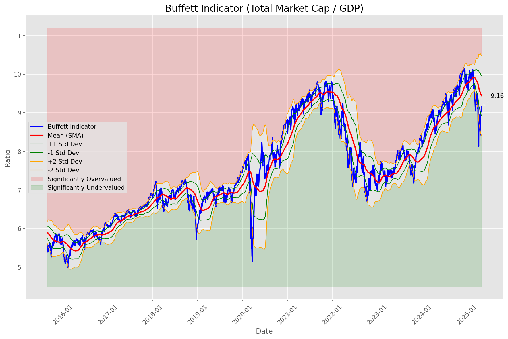
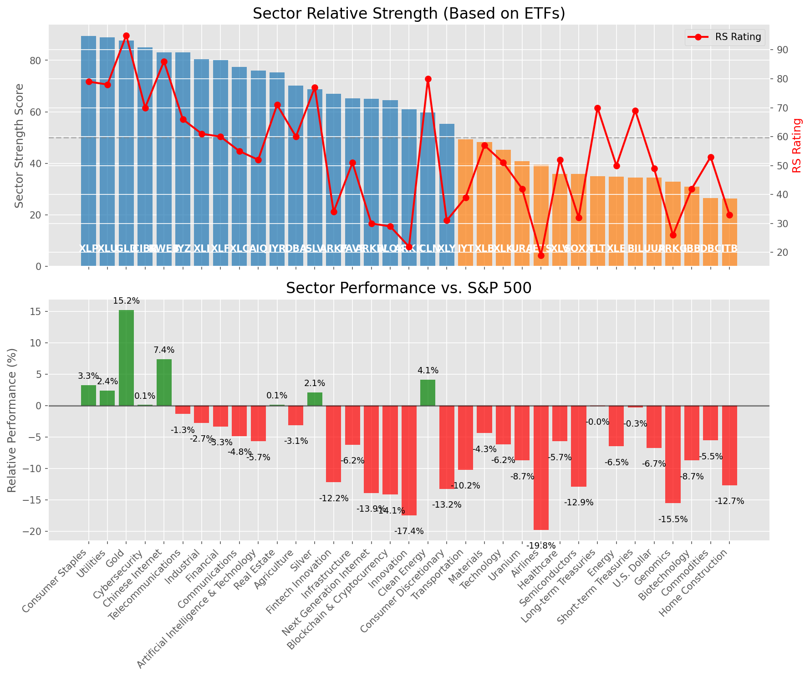

# **Daily Relative Strength Report**

**Date:** 2025-05-02

## **Market Valuation (Buffett Indicator)**

| Metric | Value |
|--------|-------|
| **Market Valuation** | **Fair Valued** |
| **Current Ratio** | 9.30 |
| **Historical Mean** | 9.44 |
| **Standard Deviation** | 0.52 |
| **Z-Score (StdDev from Mean)** | -0.55 |
| **Total Market Cap** | $278.79 trillion |
| **GDP** | $29.98 trillion |

## **Market Insights**

### **Market is Fairly Valued**

The market appears to be trading within a reasonable range of historical valuations. This suggests a balanced approach to equity investing is appropriate. Investors should:

- Focus on individual stock selection based on fundamentals and technicals
- Maintain normal equity allocations aligned with long-term goals
- Pay attention to sector rotation and relative strength
- Watch for changes in market leadership

Fair valuation typically suggests normal market returns can be expected, with stock selection becoming increasingly important.

### **Buffett Indicator Overview**

The Buffett Indicator (Total Market Cap / GDP) is a measure of the stock market's valuation relative to the size of the economy. It is named after Warren Buffett, who described it as "probably the best single measure of where valuations stand at any given moment."

- **Values above +2 standard deviations:** Market significantly overvalued
- **Values above +1 standard deviation:** Market overvalued
- **Values between -1 and +1 standard deviations:** Market fairly valued
- **Values below -1 standard deviation:** Market undervalued
- **Values below -2 standard deviations:** Market significantly undervalued

---

## **Sector Relative Strength**

Based on William O'Neil's Relative Strength Methodology

| ETF | Strength | RS Rating | Performance | Above Key MAs | Trend | Sector |
|-----|----------|-----------|-------------|--------------|-------|--------|
| [XLP](https://www.tradingview.com/chart/?symbol=XLP) | 89.5 | 79.0 | 3.04% | 10d ✓, 50d ✓, 200d ✓ | ↗️ | Consumer Staples |
| [XLU](https://www.tradingview.com/chart/?symbol=XLU) | 88.5 | 77.0 | 2.06% | 10d ✓, 50d ✓, 200d ✓ | ↗️ | Utilities |
| [GLD](https://www.tradingview.com/chart/?symbol=GLD) | 87.6 | 95.0 | 15.21% | 10d ✗, 50d ✓, 200d ✓ | ↗️ | Gold |
| [CIBR](https://www.tradingview.com/chart/?symbol=CIBR) | 86.0 | 72.0 | 0.27% | 10d ✓, 50d ✓, 200d ✓ | ↗️ | Cybersecurity |
| [KWEB](https://www.tradingview.com/chart/?symbol=KWEB) | 83.1 | 86.0 | 7.34% | 10d ✓, 50d ✗, 200d ✓ | ↗️ | Chinese Internet |
| [IYZ](https://www.tradingview.com/chart/?symbol=IYZ) | 83.0 | 66.0 | -1.31% | 10d ✓, 50d ✓, 200d ✓ | ↗️ | Telecommunications |
| [XLI](https://www.tradingview.com/chart/?symbol=XLI) | 81.0 | 62.0 | -2.52% | 10d ✓, 50d ✓, 200d ✓ | ↗️ | Industrial |
| [XLF](https://www.tradingview.com/chart/?symbol=XLF) | 80.0 | 60.0 | -3.35% | 10d ✓, 50d ✓, 200d ✓ | ↗️ | Financial |
| [XLC](https://www.tradingview.com/chart/?symbol=XLC) | 78.0 | 56.0 | -4.83% | 10d ✓, 50d ✓, 200d ✓ | ↗️ | Communications |
| [AIQ](https://www.tradingview.com/chart/?symbol=AIQ) | 76.5 | 53.0 | -5.59% | 10d ✓, 50d ✓, 200d ✓ | ↗️ | Artificial Intelligence & Technology |
| [IYR](https://www.tradingview.com/chart/?symbol=IYR) | 75.3 | 71.0 | 0.11% | 10d ✓, 50d ✓, 200d ✗ | ↗️ | Real Estate |
| [DBA](https://www.tradingview.com/chart/?symbol=DBA) | 70.6 | 61.0 | -2.94% | 10d ✗, 50d ✓, 200d ✓ | ↗️ | Agriculture |
| [SLV](https://www.tradingview.com/chart/?symbol=SLV) | 68.7 | 77.0 | 2.12% | 10d ✗, 50d ✗, 200d ✓ | ↗️ | Silver |
| [ARKF](https://www.tradingview.com/chart/?symbol=ARKF) | 68.0 | 36.0 | -11.98% | 10d ✓, 50d ✓, 200d ✓ | ↗️ | Fintech Innovation |
| [PAVE](https://www.tradingview.com/chart/?symbol=PAVE) | 65.8 | 52.0 | -5.96% | 10d ✓, 50d ✓, 200d ✗ | ↗️ | Infrastructure |
| [ARKW](https://www.tradingview.com/chart/?symbol=ARKW) | 65.5 | 31.0 | -13.66% | 10d ✓, 50d ✓, 200d ✓ | ↗️ | Next Generation Internet |
| [BLOK](https://www.tradingview.com/chart/?symbol=BLOK) | 63.5 | 27.0 | -15.26% | 10d ✓, 50d ✓, 200d ✓ | ↗️ | Blockchain & Cryptocurrency |
| [ARKK](https://www.tradingview.com/chart/?symbol=ARKK) | 62.0 | 24.0 | -16.79% | 10d ✓, 50d ✓, 200d ✓ | ↗️ | Innovation |
| [ICLN](https://www.tradingview.com/chart/?symbol=ICLN) | 60.8 | 82.0 | 4.35% | 10d ✓, 50d ✓, 200d ✗ | ↘️ | Clean Energy |
| [XLY](https://www.tradingview.com/chart/?symbol=XLY) | 56.3 | 33.0 | -13.01% | 10d ✓, 50d ✓, 200d ✗ | ↗️ | Consumer Discretionary |
| [IYT](https://www.tradingview.com/chart/?symbol=IYT) | 50.4 | 41.0 | -9.88% | 10d ✓, 50d ✗, 200d ✗ | ↗️ | Transportation |
| [XLB](https://www.tradingview.com/chart/?symbol=XLB) | 48.8 | 58.0 | -4.12% | 10d ✓, 50d ✓, 200d ✗ | ↘️ | Materials |
| [XLK](https://www.tradingview.com/chart/?symbol=XLK) | 45.8 | 52.0 | -6.07% | 10d ✓, 50d ✓, 200d ✗ | ↘️ | Technology |
| [URA](https://www.tradingview.com/chart/?symbol=URA) | 41.8 | 44.0 | -8.66% | 10d ✓, 50d ✓, 200d ✗ | ↘️ | Uranium |
| [JETS](https://www.tradingview.com/chart/?symbol=JETS) | 39.4 | 19.0 | -20.09% | 10d ✓, 50d ✗, 200d ✗ | ↗️ | Airlines |
| [SOXX](https://www.tradingview.com/chart/?symbol=SOXX) | 36.8 | 34.0 | -12.56% | 10d ✓, 50d ✓, 200d ✗ | ↘️ | Semiconductors |
| [XLV](https://www.tradingview.com/chart/?symbol=XLV) | 35.9 | 52.0 | -5.90% | 10d ✓, 50d ✗, 200d ✗ | ↘️ | Healthcare |
| [TLT](https://www.tradingview.com/chart/?symbol=TLT) | 35.0 | 70.0 | -0.18% | 10d ✗, 50d ✗, 200d ✗ | ↘️ | Long-term Treasuries |
| [UUP](https://www.tradingview.com/chart/?symbol=UUP) | 34.9 | 50.0 | -6.76% | 10d ✓, 50d ✗, 200d ✗ | ↘️ | U.S. Dollar |
| [ARKG](https://www.tradingview.com/chart/?symbol=ARKG) | 34.8 | 30.0 | -14.29% | 10d ✓, 50d ✓, 200d ✗ | ↘️ | Genomics |
| [BIL](https://www.tradingview.com/chart/?symbol=BIL) | 34.5 | 69.0 | -0.32% | 10d ✗, 50d ✗, 200d ✗ | ↘️ | Short-term Treasuries |
| [IBB](https://www.tradingview.com/chart/?symbol=IBB) | 31.4 | 43.0 | -8.81% | 10d ✓, 50d ✗, 200d ✗ | ↘️ | Biotechnology |
| [ITB](https://www.tradingview.com/chart/?symbol=ITB) | 26.9 | 34.0 | -12.73% | 10d ✓, 50d ✗, 200d ✗ | ↘️ | Home Construction |
| [DBC](https://www.tradingview.com/chart/?symbol=DBC) | 26.5 | 53.0 | -5.74% | 10d ✗, 50d ✗, 200d ✗ | ↘️ | Commodities |
| [XLE](https://www.tradingview.com/chart/?symbol=XLE) | 24.0 | 48.0 | -7.21% | 10d ✗, 50d ✗, 200d ✗ | ↘️ | Energy |

### **Sector ETF Performance Interpretation**

This table shows the relative strength metrics for different market sectors based on their representative ETFs:

- **ETF**: The ETF used to measure sector performance (click for chart)
- **Strength**: Overall sector strength score (0-100) combining multiple factors
- **RS Rating**: O'Neil RS rating of the sector ETF
- **Performance**: Performance of the sector ETF relative to SPY
- **Above Key MAs**: Whether the ETF is trading above its 10, 50, and 200-day moving averages
- **Trend**: Whether the sector is in an uptrend (↗️) or downtrend (↘️)

### **Current Sector Leadership**

The current market leadership is coming from the following sectors: **Consumer Staples, Utilities, Gold**.

The **Consumer Staples** sector (represented by **XLP**) is showing particularly strong relative strength with an RS rating of 79.0 and performance of 3.04% vs. the S&P 500. This sector is trading above its 10-day, 50-day, 200-day moving average(s). Investors should consider focusing on high RS stocks within these leading sectors for potential outperformance.

---

## **Buy Recommendations**

The following 102 stocks show exceptional relative strength:

| RS Rating | Buy Score | Current Price | Chart | Name | Ticker |
|-----------|-----------|---------------|-------|------|--------|
| 100 | 100 | $142.46 | [Chart](https://www.tradingview.com/chart/?symbol=ROOT) | Root, Inc. Class A Common Stock | ROOT |
| 100 | 100 | $123.38 | [Chart](https://www.tradingview.com/chart/?symbol=PLTR) | Palantir Technologies Inc. Class A Common Stock | PLTR |
| 100 | 100 | $150.60 | [Chart](https://www.tradingview.com/chart/?symbol=PLMR) | Palomar Holdings, Inc. Common stock | PLMR |
| 100 | 100 | $26.71 | [Chart](https://www.tradingview.com/chart/?symbol=DB) | Deutsche Bank Aktiengesellschaft | DB |
| 100 | 100 | $55.67 | [Chart](https://www.tradingview.com/chart/?symbol=SEZL) | Sezzle Inc. Common Stock | SEZL |
| 100 | 100 | $23.09 | [Chart](https://www.tradingview.com/chart/?symbol=PRA) | ProAssurance Corporation | PRA |
| 100 | 100 | $25.48 | [Chart](https://www.tradingview.com/chart/?symbol=TGI) | Triumph Group, Inc. | TGI |
| 99 | 100 | $170.16 | [Chart](https://www.tradingview.com/chart/?symbol=PM) | Philip Morris International Inc. | PM |
| 99 | 100 | $45.33 | [Chart](https://www.tradingview.com/chart/?symbol=MRX) | Marex Group plc Ordinary Shares | MRX |
| 99 | 100 | $92.63 | [Chart](https://www.tradingview.com/chart/?symbol=SNEX) | StoneX Group Inc. Common Stock | SNEX |
| 99 | 100 | $73.16 | [Chart](https://www.tradingview.com/chart/?symbol=VRNA) | Verona Pharma plc | VRNA |
| 99 | 100 | $57.52 | [Chart](https://www.tradingview.com/chart/?symbol=SKWD) | Skyward Specialty Insurance Group, Inc. Common Stock | SKWD |
| 99 | 100 | $474.49 | [Chart](https://www.tradingview.com/chart/?symbol=DUOL) | Duolingo, Inc. Class A Common Stock | DUOL |
| 99 | 100 | $282.24 | [Chart](https://www.tradingview.com/chart/?symbol=VRSN) | VeriSign Inc | VRSN |
| 98 | 100 | $166.77 | [Chart](https://www.tradingview.com/chart/?symbol=AGX) | Argan, Inc | AGX |
| 98 | 100 | $72.28 | [Chart](https://www.tradingview.com/chart/?symbol=WRB) | W.R. Berkley Corporation | WRB |
| 98 | 100 | $17.77 | [Chart](https://www.tradingview.com/chart/?symbol=SPNT) | SiriusPoint Ltd. | SPNT |
| 98 | 100 | $153.81 | [Chart](https://www.tradingview.com/chart/?symbol=HWM) | Howmet Aerospace Inc. | HWM |
| 97 | 100 | $280.68 | [Chart](https://www.tradingview.com/chart/?symbol=CME) | CME Group Inc. | CME |
| 97 | 100 | $41.82 | [Chart](https://www.tradingview.com/chart/?symbol=DRS) | Leonardo DRS, Inc. Common Stock | DRS |
| 97 | 100 | $149.25 | [Chart](https://www.tradingview.com/chart/?symbol=CAH) | Cardinal Health, Inc. | CAH |
| 97 | 100 | $30.29 | [Chart](https://www.tradingview.com/chart/?symbol=EUFN) | iShares MSCI Europe Financials ETF | EUFN |
| 97 | 100 | $77.58 | [Chart](https://www.tradingview.com/chart/?symbol=LB) | LandBridge Company LLC | LB |
| 96 | 100 | $143.13 | [Chart](https://www.tradingview.com/chart/?symbol=SE) | Sea Limited American Depositary Shares, each representing one Class A Ordinary Share | SE |
| 96 | 100 | $50.80 | [Chart](https://www.tradingview.com/chart/?symbol=GFL) | GFL Environmental Inc. Subordinate Voting Shares | GFL |
| 96 | 100 | $39.16 | [Chart](https://www.tradingview.com/chart/?symbol=EXEL) | Exelixis Inc | EXEL |
| 96 | 100 | $646.65 | [Chart](https://www.tradingview.com/chart/?symbol=SPOT) | Spotify Technology S.A. | SPOT |
| 96 | 100 | $157.54 | [Chart](https://www.tradingview.com/chart/?symbol=LRN) | Stride, Inc. | LRN |
| 96 | 100 | $116.70 | [Chart](https://www.tradingview.com/chart/?symbol=EHC) | Encompass Health Corporation Common Stock | EHC |
| 96 | 100 | $1154.50 | [Chart](https://www.tradingview.com/chart/?symbol=NFLX) | NetFlix Inc | NFLX |
| 96 | 100 | $22.14 | [Chart](https://www.tradingview.com/chart/?symbol=LAUR) | Laureate Education, Inc. Common Stock | LAUR |
| 95 | 100 | $40.31 | [Chart](https://www.tradingview.com/chart/?symbol=EWG) | iShares MSCI Germany ETF | EWG |
| 95 | 100 | $27.41 | [Chart](https://www.tradingview.com/chart/?symbol=T) | AT&T Inc. | T |
| 95 | 100 | $119.81 | [Chart](https://www.tradingview.com/chart/?symbol=COOP) | Mr. Cooper Group Inc. Common Stock | COOP |
| 95 | 100 | $212.13 | [Chart](https://www.tradingview.com/chart/?symbol=IDCC) | InterDigital, Inc. | IDCC |
| 95 | 100 | $81.40 | [Chart](https://www.tradingview.com/chart/?symbol=NFG) | National Fuel Gas Co. | NFG |
| 95 | 100 | $25.25 | [Chart](https://www.tradingview.com/chart/?symbol=SONY) | Sony Group Corporation American Depositary Shares (Each Representing One Share of Dollar Validated Common Stock) | SONY |
| 95 | 100 | $249.88 | [Chart](https://www.tradingview.com/chart/?symbol=RSG) | Republic Services Inc. | RSG |
| 95 | 100 | $538.24 | [Chart](https://www.tradingview.com/chart/?symbol=BRK.B) | BERKSHIRE HATHAWAY Class B | BRK.B |
| 94 | 100 | $89.80 | [Chart](https://www.tradingview.com/chart/?symbol=CCEP) | Coca-Cola Europacific Partners plc Ordinary Shares | CCEP |
| 94 | 100 | $291.21 | [Chart](https://www.tradingview.com/chart/?symbol=COR) | Cencora, Inc. | COR |
| 94 | 100 | $25.18 | [Chart](https://www.tradingview.com/chart/?symbol=MP) | MP Materials Corp. | MP |
| 94 | 100 | $19.80 | [Chart](https://www.tradingview.com/chart/?symbol=KT) | KT Corp. | KT |
| 94 | 100 | $32.30 | [Chart](https://www.tradingview.com/chart/?symbol=AHR) | American Healthcare REIT, Inc. | AHR |
| 94 | 100 | $102.18 | [Chart](https://www.tradingview.com/chart/?symbol=RBA) | RB Global, Inc. | RBA |
| 94 | 100 | $59.28 | [Chart](https://www.tradingview.com/chart/?symbol=MO) | Altria Group, Inc. | MO |
| 93 | 100 | $23.00 | [Chart](https://www.tradingview.com/chart/?symbol=CXW) | CoreCivic, Inc. | CXW |
| 93 | 100 | $160.31 | [Chart](https://www.tradingview.com/chart/?symbol=ATO) | Atmos Energy Corporation | ATO |
| 93 | 100 | $82.14 | [Chart](https://www.tradingview.com/chart/?symbol=FAST) | Fastenal Co | FAST |
| 93 | 100 | $23.67 | [Chart](https://www.tradingview.com/chart/?symbol=SRAD) | Sportradar Group AG Class A Ordinary Shares | SRAD |
| 92 | 100 | $227.72 | [Chart](https://www.tradingview.com/chart/?symbol=CBOE) | Cboe Global Markets, Inc. | CBOE |
| 92 | 100 | $50.30 | [Chart](https://www.tradingview.com/chart/?symbol=TRP) | TC Energy Corporation | TRP |
| 92 | 100 | $64.88 | [Chart](https://www.tradingview.com/chart/?symbol=FNF) | Fidelity National Financial, Inc. | FNF |
| 92 | 100 | $215.18 | [Chart](https://www.tradingview.com/chart/?symbol=CRS) | Carpenter Technology Corp | CRS |
| 92 | 100 | $16.27 | [Chart](https://www.tradingview.com/chart/?symbol=BCS) | Barclays PLC | BCS |
| 92 | 100 | $32.28 | [Chart](https://www.tradingview.com/chart/?symbol=LTH) | Life Time Group Holdings, Inc. | LTH |
| 92 | 100 | $140.90 | [Chart](https://www.tradingview.com/chart/?symbol=TW) | Tradeweb Markets Inc. Class A Common Stock | TW |
| 91 | 100 | $150.47 | [Chart](https://www.tradingview.com/chart/?symbol=WELL) | Welltower Inc. | WELL |
| 91 | 100 | $78.12 | [Chart](https://www.tradingview.com/chart/?symbol=OGS) | ONE GAS, INC. | OGS |
| 91 | 100 | $295.57 | [Chart](https://www.tradingview.com/chart/?symbol=PEN) | Penumbra, Inc. | PEN |
| 91 | 100 | $30.87 | [Chart](https://www.tradingview.com/chart/?symbol=SLM) | SLM Corporation | SLM |
| 91 | 100 | $54.95 | [Chart](https://www.tradingview.com/chart/?symbol=RELX) | RELX PLC | RELX |
| 91 | 100 | $168.37 | [Chart](https://www.tradingview.com/chart/?symbol=MAA) | Mid-America Apartment Communities, Inc. | MAA |
| 91 | 100 | $59.28 | [Chart](https://www.tradingview.com/chart/?symbol=CHEF) | The Chef's Warehouse Inc | CHEF |
| 90 | 100 | $73.17 | [Chart](https://www.tradingview.com/chart/?symbol=CORT) | Corcept Therapeutics Inc. | CORT |
| 90 | 100 | $25.86 | [Chart](https://www.tradingview.com/chart/?symbol=CAE) | CAE INC | CAE |
| 90 | 100 | $24.80 | [Chart](https://www.tradingview.com/chart/?symbol=EWS) | iShares MSCI Singapore ETF | EWS |
| 90 | 100 | $107.32 | [Chart](https://www.tradingview.com/chart/?symbol=AEP) | American Electric Power Company, Inc. | AEP |
| 90 | 100 | $59.22 | [Chart](https://www.tradingview.com/chart/?symbol=ULS) | UL Solutions Inc. | ULS |
| 90 | 100 | $301.44 | [Chart](https://www.tradingview.com/chart/?symbol=SAP) | SAP SE | SAP |
| 89 | 100 | $172.21 | [Chart](https://www.tradingview.com/chart/?symbol=SFM) | Sprouts Farmers Market, Inc. | SFM |
| 89 | 100 | $177.19 | [Chart](https://www.tradingview.com/chart/?symbol=DGX) | Quest Diagnostics Inc. | DGX |
| 89 | 100 | $43.04 | [Chart](https://www.tradingview.com/chart/?symbol=BTI) | British American Tobacco p.l.c. American Depositary Shares, American Depositary Shares, each representing one Ordinary Share | BTI |
| 89 | 100 | $36.22 | [Chart](https://www.tradingview.com/chart/?symbol=KTOS) | Kratos Defense & Security Solutions, Inc. | KTOS |
| 89 | 100 | $117.17 | [Chart](https://www.tradingview.com/chart/?symbol=CWST) | Casella Waste Systems Inc | CWST |
| 88 | 100 | $17.34 | [Chart](https://www.tradingview.com/chart/?symbol=AM) | Antero Midstream Corporation Common Stock | AM |
| 88 | 100 | $33.28 | [Chart](https://www.tradingview.com/chart/?symbol=UGI) | UGI Corporation | UGI |
| 87 | 100 | $59.53 | [Chart](https://www.tradingview.com/chart/?symbol=WMB) | Williams Companies Inc. | WMB |
| 87 | 100 | $68.95 | [Chart](https://www.tradingview.com/chart/?symbol=EVRG) | Evergy, Inc. | EVRG |
| 89 | 99 | $173.86 | [Chart](https://www.tradingview.com/chart/?symbol=ICE) | Intercontinental Exchange  Inc. | ICE |
| 89 | 99 | $5155.78 | [Chart](https://www.tradingview.com/chart/?symbol=BKNG) | Booking Holdings Inc. Common Stock | BKNG |
| 89 | 99 | $172.69 | [Chart](https://www.tradingview.com/chart/?symbol=CVLT) | Commault Systems, Inc. | CVLT |
| 87 | 99 | $401.83 | [Chart](https://www.tradingview.com/chart/?symbol=GEV) | GE Vernova Inc. | GEV |
| 87 | 98 | $199.01 | [Chart](https://www.tradingview.com/chart/?symbol=BAP) | Credicorp LTD | BAP |
| 86 | 98 | $117.47 | [Chart](https://www.tradingview.com/chart/?symbol=IDA) | IDACORP, Inc. | IDA |
| 85 | 98 | $113.74 | [Chart](https://www.tradingview.com/chart/?symbol=ATGE) | Adtalem Global Education Inc. Common Shares | ATGE |
| 85 | 98 | $165.25 | [Chart](https://www.tradingview.com/chart/?symbol=TKO) | TKO Group Holdings, Inc. | TKO |
| 85 | 97 | $165.59 | [Chart](https://www.tradingview.com/chart/?symbol=THG) | The Hanover Insurance Group, Inc. | THG |
| 85 | 97 | $41.38 | [Chart](https://www.tradingview.com/chart/?symbol=HMN) | Horace Mann Educators Corporation | HMN |
| 86 | 96 | $196.86 | [Chart](https://www.tradingview.com/chart/?symbol=WCN) | Waste Connections, Inc. | WCN |
| 86 | 96 | $56.93 | [Chart](https://www.tradingview.com/chart/?symbol=IGF) | iShares Global Infrastructure ETF | IGF |
| 85 | 96 | $102.15 | [Chart](https://www.tradingview.com/chart/?symbol=DAVE) | Dave Inc. Class A Common Stock | DAVE |
| 85 | 95 | $33.98 | [Chart](https://www.tradingview.com/chart/?symbol=PAY) | Paymentus Holdings, Inc. | PAY |
| 83 | 95 | $24.77 | [Chart](https://www.tradingview.com/chart/?symbol=IMAX) | Imax Corp | IMAX |
| 82 | 95 | $79.57 | [Chart](https://www.tradingview.com/chart/?symbol=UNM) | Unum Group | UNM |
| 82 | 95 | $233.87 | [Chart](https://www.tradingview.com/chart/?symbol=LNG) | Cheniere Energy Inc | LNG |
| 80 | 94 | $83.87 | [Chart](https://www.tradingview.com/chart/?symbol=ETR) | Entergy Corporation | ETR |
| 83 | 93 | $31.43 | [Chart](https://www.tradingview.com/chart/?symbol=MFC) | Manulife Financial Corp. | MFC |
| 82 | 93 | $178.97 | [Chart](https://www.tradingview.com/chart/?symbol=LOPE) | Grand Canyon Education, Inc | LOPE |
| 82 | 92 | $41.66 | [Chart](https://www.tradingview.com/chart/?symbol=FHI) | Federated Hermes, Inc. | FHI |
| 81 | 92 | $257.38 | [Chart](https://www.tradingview.com/chart/?symbol=CVNA) | Carvana Co. | CVNA |
| 80 | 91 | $41.46 | [Chart](https://www.tradingview.com/chart/?symbol=AB) | AllianceBernstein Holding, L.P. | AB |

---

## **Sell Recommendations**

The following 125 stocks show deteriorating relative strength:

| RS Rating | Sell Score | Current Price | Chart | Name | Ticker |
|-----------|------------|---------------|-------|------|--------|
| 1 | 100 | $11.86 | [Chart](https://www.tradingview.com/chart/?symbol=AMRC) | Ameresco, Inc. | AMRC |
| 1 | 100 | $12.00 | [Chart](https://www.tradingview.com/chart/?symbol=DYN) | Dyne Therapeutics, Inc. Common Stock | DYN |
| 2 | 100 | $28.72 | [Chart](https://www.tradingview.com/chart/?symbol=CIVI) | Civitas Resources, Inc. | CIVI |
| 2 | 100 | $119.76 | [Chart](https://www.tradingview.com/chart/?symbol=GLOB) | GLOBANT S.A. | GLOB |
| 2 | 100 | $18.63 | [Chart](https://www.tradingview.com/chart/?symbol=DAVA) | Endava plc American Depositary Shares (each representing one Class A Ordinary Share) | DAVA |
| 2 | 100 | $10.88 | [Chart](https://www.tradingview.com/chart/?symbol=XNCR) | Xencor, Inc. | XNCR |
| 2 | 100 | $11.33 | [Chart](https://www.tradingview.com/chart/?symbol=NRIX) | Nurix Therapeutics, Inc. Common stock | NRIX |
| 2 | 100 | $17.09 | [Chart](https://www.tradingview.com/chart/?symbol=SSTK) | SHUTTERSTOCK, INC. | SSTK |
| 2 | 100 | $77.86 | [Chart](https://www.tradingview.com/chart/?symbol=ILMN) | Illumina Inc | ILMN |
| 3 | 100 | $23.80 | [Chart](https://www.tradingview.com/chart/?symbol=RPD) | Rapid7, Inc. Common Stock | RPD |
| 4 | 100 | $14.18 | [Chart](https://www.tradingview.com/chart/?symbol=ODP) | The ODP Corporation Common Stock | ODP |
| 4 | 100 | $16.85 | [Chart](https://www.tradingview.com/chart/?symbol=IART) | Integra LifeSciences Holdings | IART |
| 4 | 100 | $13.54 | [Chart](https://www.tradingview.com/chart/?symbol=GCT) | GigaCloud Technology Inc Class A Ordinary Shares | GCT |
| 4 | 100 | $10.02 | [Chart](https://www.tradingview.com/chart/?symbol=LSPD) | Lightspeed Commerce Inc. | LSPD |
| 5 | 100 | $21.62 | [Chart](https://www.tradingview.com/chart/?symbol=SPT) | Sprout Social, Inc Class A Common Stock | SPT |
| 5 | 100 | $62.45 | [Chart](https://www.tradingview.com/chart/?symbol=LABU) | Direxion Daily S&P Biotech Bull 3X Shares | LABU |
| 5 | 100 | $13.49 | [Chart](https://www.tradingview.com/chart/?symbol=DV) | DoubleVerify Holdings, Inc. | DV |
| 7 | 100 | $33.43 | [Chart](https://www.tradingview.com/chart/?symbol=AAP) | ADVANCE AUTO PARTS INC | AAP |
| 7 | 100 | $58.48 | [Chart](https://www.tradingview.com/chart/?symbol=SYNA) | Synaptics Inc | SYNA |
| 7 | 100 | $27.07 | [Chart](https://www.tradingview.com/chart/?symbol=JACK) | Jack in the Box Inc. | JACK |
| 9 | 100 | $28.01 | [Chart](https://www.tradingview.com/chart/?symbol=SRDX) | Surmodics, Inc. Common Stock | SRDX |
| 12 | 100 | $16.15 | [Chart](https://www.tradingview.com/chart/?symbol=DXC) | DXC Technology Company | DXC |
| 12 | 100 | $16.68 | [Chart](https://www.tradingview.com/chart/?symbol=MLKN) | MillerKnoll, Inc. Common Stock | MLKN |
| 15 | 100 | $11.63 | [Chart](https://www.tradingview.com/chart/?symbol=JAMF) | Jamf Holding Corp. Common Stock | JAMF |
| 9 | 99 | $11.08 | [Chart](https://www.tradingview.com/chart/?symbol=AEYE) | AudioEye, Inc. Common Stock | AEYE |
| 10 | 99 | $12.75 | [Chart](https://www.tradingview.com/chart/?symbol=TRIP) | TripAdvisor, Inc. | TRIP |
| 13 | 99 | $59.26 | [Chart](https://www.tradingview.com/chart/?symbol=AMWD) | American Woodmark Corp | AMWD |
| 13 | 99 | $32.90 | [Chart](https://www.tradingview.com/chart/?symbol=UWM) | ProShares Ultra Russell2000 | UWM |
| 11 | 98 | $12.87 | [Chart](https://www.tradingview.com/chart/?symbol=ADNT) | Adient plc Ordinary Shares | ADNT |
| 14 | 98 | $64.79 | [Chart](https://www.tradingview.com/chart/?symbol=SPB) | Spectrum Brands Holdings, Inc. | SPB |
| 16 | 98 | $15.37 | [Chart](https://www.tradingview.com/chart/?symbol=PSFE) | Paysafe Limited | PSFE |
| 7 | 97 | $114.39 | [Chart](https://www.tradingview.com/chart/?symbol=BLDR) | Builders FirstSource, Inc. | BLDR |
| 13 | 97 | $91.82 | [Chart](https://www.tradingview.com/chart/?symbol=NTAP) | NetApp, Inc | NTAP |
| 17 | 97 | $62.36 | [Chart](https://www.tradingview.com/chart/?symbol=PLUS) | ePlus Inc | PLUS |
| 5 | 96 | $116.89 | [Chart](https://www.tradingview.com/chart/?symbol=DECK) | Deckers Outdoor Corp | DECK |
| 11 | 96 | $36.04 | [Chart](https://www.tradingview.com/chart/?symbol=CRC) | California Resources Corporation | CRC |
| 9 | 95 | $12.54 | [Chart](https://www.tradingview.com/chart/?symbol=BAND) | Bandwidth Inc. Class A Common Stock | BAND |
| 10 | 95 | $10.77 | [Chart](https://www.tradingview.com/chart/?symbol=SONO) | Sonos, Inc. Common Stock | SONO |
| 14 | 95 | $96.08 | [Chart](https://www.tradingview.com/chart/?symbol=BCC) | Boise Cascade Company | BCC |
| 16 | 95 | $19.82 | [Chart](https://www.tradingview.com/chart/?symbol=VECO) | Veeco Instruments Inc | VECO |
| 16 | 95 | $21.36 | [Chart](https://www.tradingview.com/chart/?symbol=FOXF) | Fox Factory Holding Corp. Common Stock | FOXF |
| 14 | 94 | $11.90 | [Chart](https://www.tradingview.com/chart/?symbol=M) | Macy's Inc. | M |
| 15 | 94 | $16.00 | [Chart](https://www.tradingview.com/chart/?symbol=PENN) | PENN Entertainment, Inc. Common Stock | PENN |
| 16 | 94 | $25.80 | [Chart](https://www.tradingview.com/chart/?symbol=GDEN) | Golden Entertainment, Inc. Common Stock | GDEN |
| 20 | 94 | $11.54 | [Chart](https://www.tradingview.com/chart/?symbol=PBR) | PETROLEO BRASILEIRO S.A.-PETROBRAS ADS (REP 1 COMMON SHARE) | PBR |
| 21 | 94 | $22.18 | [Chart](https://www.tradingview.com/chart/?symbol=ST) | Sensata Technologies Holding plc | ST |
| 7 | 93 | $29.03 | [Chart](https://www.tradingview.com/chart/?symbol=XPEL) | XPEL, Inc. Common Stock | XPEL |
| 7 | 93 | $10.01 | [Chart](https://www.tradingview.com/chart/?symbol=VYX) | NCR Voyix Corporation | VYX |
| 9 | 93 | $10.31 | [Chart](https://www.tradingview.com/chart/?symbol=VREX) | Varex Imaging Corporation Common Stock | VREX |
| 10 | 93 | $25.60 | [Chart](https://www.tradingview.com/chart/?symbol=AA) | Alcoa Corporation | AA |
| 13 | 93 | $39.33 | [Chart](https://www.tradingview.com/chart/?symbol=ASO) | Academy Sports and Outdoors, Inc. | ASO |
| 16 | 93 | $10.42 | [Chart](https://www.tradingview.com/chart/?symbol=SEMR) | SEMrush Holdings, Inc. | SEMR |
| 20 | 93 | $11.50 | [Chart](https://www.tradingview.com/chart/?symbol=KELYA) | Kelly Services Inc | KELYA |
| 20 | 93 | $12.04 | [Chart](https://www.tradingview.com/chart/?symbol=DBO) | Invesco DB Oil Fund | DBO |
| 26 | 93 | $16.73 | [Chart](https://www.tradingview.com/chart/?symbol=TRMD) | TORM plc Class A Common Stock | TRMD |
| 8 | 92 | $32.37 | [Chart](https://www.tradingview.com/chart/?symbol=BRZE) | Braze, Inc. Class A Common Stock | BRZE |
| 10 | 92 | $108.72 | [Chart](https://www.tradingview.com/chart/?symbol=A) | Agilent Technologies Inc. | A |
| 17 | 91 | $12.73 | [Chart](https://www.tradingview.com/chart/?symbol=NVGS) | NAVIGATOR HOLDINGS LTD. | NVGS |
| 24 | 91 | $10.34 | [Chart](https://www.tradingview.com/chart/?symbol=CMRE) | Costamare Inc. | CMRE |
| 25 | 91 | $10.78 | [Chart](https://www.tradingview.com/chart/?symbol=PBR.A) | Petroleo Brasileiro S.A.-Petrobras | PBR.A |
| 16 | 90 | $33.39 | [Chart](https://www.tradingview.com/chart/?symbol=SCSC) | Scansource Inc | SCSC |
| 17 | 90 | $12.91 | [Chart](https://www.tradingview.com/chart/?symbol=ARCT) | Arcturus Therapeutics Holdings Inc. Common Stock | ARCT |
| 18 | 90 | $12.28 | [Chart](https://www.tradingview.com/chart/?symbol=KRP) | Kimbell Royalty Partners, LP Common Units representing Limited Partner Interests | KRP |
| 24 | 90 | $27.06 | [Chart](https://www.tradingview.com/chart/?symbol=COLL) | Collegium Pharmaceutical, Inc. Common Stock | COLL |
| 25 | 90 | $10.60 | [Chart](https://www.tradingview.com/chart/?symbol=GSBD) | Goldman Sachs BDC, Inc. | GSBD |
| 29 | 90 | $13.77 | [Chart](https://www.tradingview.com/chart/?symbol=MANU) | MANCHESTER UNITED PLC | MANU |
| 12 | 89 | $11.56 | [Chart](https://www.tradingview.com/chart/?symbol=APLE) | Apple Hospitality REIT, Inc. | APLE |
| 27 | 89 | $11.43 | [Chart](https://www.tradingview.com/chart/?symbol=GES) | Guess?, Inc. | GES |
| 29 | 89 | $10.01 | [Chart](https://www.tradingview.com/chart/?symbol=LBTYK) | Liberty Global Ltd. Class C Common Shares | LBTYK |
| 30 | 89 | $14.32 | [Chart](https://www.tradingview.com/chart/?symbol=FXN) | First Trust Energy AlphaDEX Fund | FXN |
| 13 | 88 | $29.05 | [Chart](https://www.tradingview.com/chart/?symbol=MBUU) | Malibu Boats, Inc. Class A | MBUU |
| 14 | 88 | $10.15 | [Chart](https://www.tradingview.com/chart/?symbol=HLIT) | Harmonic Inc | HLIT |
| 17 | 88 | $10.05 | [Chart](https://www.tradingview.com/chart/?symbol=PACS) | PACS Group, Inc. | PACS |
| 18 | 88 | $25.89 | [Chart](https://www.tradingview.com/chart/?symbol=HPQ) | HP Inc. | HPQ |
| 21 | 88 | $54.95 | [Chart](https://www.tradingview.com/chart/?symbol=KBH) | KB Home | KBH |
| 21 | 88 | $15.86 | [Chart](https://www.tradingview.com/chart/?symbol=AMZY) | YieldMax AMZN Option Income Strategy ETF | AMZY |
| 22 | 88 | $47.58 | [Chart](https://www.tradingview.com/chart/?symbol=ERX) | Direxion Daily Energy Bull 2X Shares | ERX |
| 22 | 88 | $92.64 | [Chart](https://www.tradingview.com/chart/?symbol=CHRD) | Chord Energy Corporation Common Stock | CHRD |
| 26 | 88 | $42.43 | [Chart](https://www.tradingview.com/chart/?symbol=NXT) | Nextracker Inc. Class A Common Stock | NXT |
| 13 | 87 | $14.46 | [Chart](https://www.tradingview.com/chart/?symbol=IVZ) | Invesco LTD | IVZ |
| 17 | 87 | $32.72 | [Chart](https://www.tradingview.com/chart/?symbol=DOCN) | DigitalOcean Holdings, Inc. | DOCN |
| 20 | 87 | $74.30 | [Chart](https://www.tradingview.com/chart/?symbol=AGYS) | Agilysys, Inc. Common Stock (DE) | AGYS |
| 28 | 87 | $24.00 | [Chart](https://www.tradingview.com/chart/?symbol=AMRK) | A-Mark Precious Metals, Inc. | AMRK |
| 22 | 86 | $31.12 | [Chart](https://www.tradingview.com/chart/?symbol=MBIN) | Merchants Bancorp Common Stock | MBIN |
| 23 | 86 | $12.13 | [Chart](https://www.tradingview.com/chart/?symbol=PR) | Permian Resources Corporation | PR |
| 27 | 86 | $298.59 | [Chart](https://www.tradingview.com/chart/?symbol=BLD) | TopBuild Corp. Common Stock | BLD |
| 30 | 86 | $13.45 | [Chart](https://www.tradingview.com/chart/?symbol=MED) | Medifast, Inc. | MED |
| 27 | 85 | $70.38 | [Chart](https://www.tradingview.com/chart/?symbol=TTC) | Toro Company (The) | TTC |
| 28 | 84 | $10.01 | [Chart](https://www.tradingview.com/chart/?symbol=XPRO) | Expro Group Holdings N.V. | XPRO |
| 30 | 83 | $33.95 | [Chart](https://www.tradingview.com/chart/?symbol=MGA) | Magna International | MGA |
| 22 | 82 | $10.71 | [Chart](https://www.tradingview.com/chart/?symbol=DBRG) | DigitalBridge Group, Inc. | DBRG |
| 23 | 82 | $140.96 | [Chart](https://www.tradingview.com/chart/?symbol=MTN) | Vail Resorts, Inc. | MTN |
| 26 | 81 | $35.54 | [Chart](https://www.tradingview.com/chart/?symbol=IAC) | IAC Inc. Common Stock | IAC |
| 21 | 80 | $17.91 | [Chart](https://www.tradingview.com/chart/?symbol=INFY) | Infosys Limited American Depositary Shares | INFY |
| 24 | 80 | $35.00 | [Chart](https://www.tradingview.com/chart/?symbol=OVV) | Ovintiv Inc. | OVV |
| 26 | 80 | $16.59 | [Chart](https://www.tradingview.com/chart/?symbol=MLNK) | MeridianLink, Inc. | MLNK |
| 33 | 80 | $29.39 | [Chart](https://www.tradingview.com/chart/?symbol=TAN) | Invesco Solar ETF | TAN |
| 25 | 79 | $36.76 | [Chart](https://www.tradingview.com/chart/?symbol=CALF) | Pacer US Small Cap Cash Cows ETF | CALF |
| 25 | 79 | $109.88 | [Chart](https://www.tradingview.com/chart/?symbol=LEN) | Lennar Corporation Class A | LEN |
| 23 | 78 | $107.32 | [Chart](https://www.tradingview.com/chart/?symbol=MHO) | M/I Homes, Inc. | MHO |
| 24 | 78 | $38.05 | [Chart](https://www.tradingview.com/chart/?symbol=LVS) | Las Vegas Sands Corp. | LVS |
| 26 | 78 | $10.40 | [Chart](https://www.tradingview.com/chart/?symbol=AVO) | Mission Produce, Inc. Common Stock | AVO |
| 31 | 78 | $51.74 | [Chart](https://www.tradingview.com/chart/?symbol=LW) | Lamb Weston Holdings, Inc. | LW |
| 24 | 77 | $42.19 | [Chart](https://www.tradingview.com/chart/?symbol=HNI) | HNI Corporation | HNI |
| 26 | 76 | $17.73 | [Chart](https://www.tradingview.com/chart/?symbol=HTGC) | Hercules Capital, Inc. | HTGC |
| 32 | 76 | $35.45 | [Chart](https://www.tradingview.com/chart/?symbol=TECK) | Teck Resources Limited | TECK |
| 34 | 76 | $15.54 | [Chart](https://www.tradingview.com/chart/?symbol=ZIM) | ZIM Integrated Shipping Services Ltd. | ZIM |
| 35 | 76 | $10.34 | [Chart](https://www.tradingview.com/chart/?symbol=ARLO) | Arlo Technologies, Inc. | ARLO |
| 26 | 75 | $195.65 | [Chart](https://www.tradingview.com/chart/?symbol=NVMI) | Nova Ltd. Ordinary Shares | NVMI |
| 34 | 75 | $93.60 | [Chart](https://www.tradingview.com/chart/?symbol=ITB) | iShares U.S. Home Construction ETF | ITB |
| 35 | 75 | $193.40 | [Chart](https://www.tradingview.com/chart/?symbol=NDSN) | Nordson Corp | NDSN |
| 36 | 73 | $117.09 | [Chart](https://www.tradingview.com/chart/?symbol=VLO) | Valero Energy Corporation | VLO |
| 38 | 72 | $36.64 | [Chart](https://www.tradingview.com/chart/?symbol=LIT) | Global X Lithium & Battery Tech ETF | LIT |
| 32 | 71 | $18.00 | [Chart](https://www.tradingview.com/chart/?symbol=JKS) | JINKOSOLAR HOLDINGS CO | JKS |
| 34 | 71 | $33.34 | [Chart](https://www.tradingview.com/chart/?symbol=LEGN) | Legend Biotech Corporation American Depositary Shares | LEGN |
| 38 | 71 | $148.62 | [Chart](https://www.tradingview.com/chart/?symbol=IWN) | iShares Russell 2000 Value ETF | IWN |
| 39 | 71 | $14.72 | [Chart](https://www.tradingview.com/chart/?symbol=BMEZ) | BlackRock Health Sciences Term Trust | BMEZ |
| 39 | 70 | $17.45 | [Chart](https://www.tradingview.com/chart/?symbol=FLO) | Flowers Foods, Inc. | FLO |
| 35 | 69 | $10.10 | [Chart](https://www.tradingview.com/chart/?symbol=CION) | CION Investment Corporation | CION |
| 36 | 69 | $14.59 | [Chart](https://www.tradingview.com/chart/?symbol=RYLD) | Global X Russell 2000 Covered Call ETF | RYLD |
| 34 | 68 | $45.96 | [Chart](https://www.tradingview.com/chart/?symbol=PRKS) | United Parks & Resorts Inc. | PRKS |
| 38 | 68 | $81.10 | [Chart](https://www.tradingview.com/chart/?symbol=MU) | Micron Technology, Inc. | MU |
| 36 | 67 | $57.58 | [Chart](https://www.tradingview.com/chart/?symbol=TRNO) | Terreno Realty Corporation | TRNO |
| 39 | 67 | $19.48 | [Chart](https://www.tradingview.com/chart/?symbol=COLD) | Americold Realty Trust, Inc. | COLD |
| 38 | 66 | $21.09 | [Chart](https://www.tradingview.com/chart/?symbol=MGY) | Magnolia Oil & Gas Corporation Class A Common Stock | MGY |

## **Methodology**

This report uses William O'Neil's relative strength methodology from Investors Business Daily:

* **RS Rating**: Percentile rank of stock's performance vs. S&P 500 over the past 63 trading days (1-99 scale)
* **Buy Criteria**: RS Rating >= 80, price above 50-day MA, strong uptrend, increasing volume
* **Sell Criteria**: RS Rating < 40, price below 50-day MA, downtrend, decreasing volume

### **O'Neil's Key Principles**

1. **Focus on relative performance** - stocks outperforming the market
2. **Price trend confirmation** - stock must be in an uptrend
3. **Volume confirmation** - strong volume supports price moves
4. **Moving average validation** - price above key moving averages
5. **Market leaders only** - concentrate on top-performing stocks

*Report generated automatically after market close*