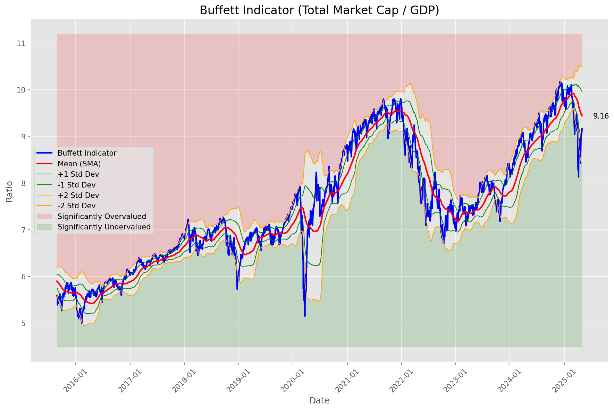
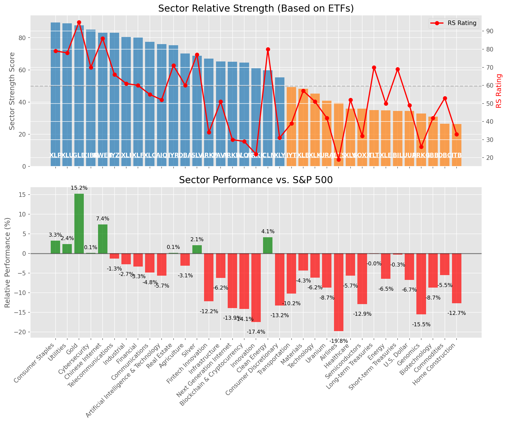

# **Daily Relative Strength Report**

**Date:** 2025-05-04

## **Market Valuation (Buffett Indicator)**

| Metric | Value |
|--------|-------|
| **Market Valuation** | **Fair Valued** |
| **Current Ratio** | 9.30 |
| **Historical Mean** | 9.44 |
| **Standard Deviation** | 0.52 |
| **Z-Score (StdDev from Mean)** | -0.55 |
| **Total Market Cap** | $278.80 trillion |
| **GDP** | $29.98 trillion |

## **Market Insights**

### **Market is Fairly Valued**

The market appears to be trading within a reasonable range of historical valuations. This suggests a balanced approach to equity investing is appropriate. Investors should:

- Focus on individual stock selection based on fundamentals and technicals
- Maintain normal equity allocations aligned with long-term goals
- Pay attention to sector rotation and relative strength
- Watch for changes in market leadership

Fair valuation typically suggests normal market returns can be expected, with stock selection becoming increasingly important.

### **Buffett Indicator Overview**

The Buffett Indicator (Total Market Cap / GDP) is a measure of the stock market's valuation relative to the size of the economy. It is named after Warren Buffett, who described it as "probably the best single measure of where valuations stand at any given moment."

- **Values above +2 standard deviations:** Market significantly overvalued
- **Values above +1 standard deviation:** Market overvalued
- **Values between -1 and +1 standard deviations:** Market fairly valued
- **Values below -1 standard deviation:** Market undervalued
- **Values below -2 standard deviations:** Market significantly undervalued

---

## **Sector Relative Strength**

Based on William O'Neil's Relative Strength Methodology

| ETF | Strength | RS Rating | Performance | Above Key MAs | Trend | Sector |
|-----|----------|-----------|-------------|--------------|-------|--------|
| [XLP](https://www.tradingview.com/chart/?symbol=XLP) | 89.5 | 79.0 | 3.27% | 10d ✓, 50d ✓, 200d ✓ | ↗️ | Consumer Staples |
| [XLU](https://www.tradingview.com/chart/?symbol=XLU) | 89.0 | 78.0 | 2.40% | 10d ✓, 50d ✓, 200d ✓ | ↗️ | Utilities |
| [GLD](https://www.tradingview.com/chart/?symbol=GLD) | 87.6 | 95.0 | 15.25% | 10d ✗, 50d ✓, 200d ✓ | ↗️ | Gold |
| [CIBR](https://www.tradingview.com/chart/?symbol=CIBR) | 85.0 | 70.0 | 0.12% | 10d ✓, 50d ✓, 200d ✓ | ↗️ | Cybersecurity |
| [KWEB](https://www.tradingview.com/chart/?symbol=KWEB) | 83.1 | 86.0 | 7.42% | 10d ✓, 50d ✗, 200d ✓ | ↗️ | Chinese Internet |
| [IYZ](https://www.tradingview.com/chart/?symbol=IYZ) | 83.0 | 66.0 | -1.31% | 10d ✓, 50d ✓, 200d ✓ | ↗️ | Telecommunications |
| [XLI](https://www.tradingview.com/chart/?symbol=XLI) | 80.5 | 61.0 | -2.72% | 10d ✓, 50d ✓, 200d ✓ | ↗️ | Industrial |
| [XLF](https://www.tradingview.com/chart/?symbol=XLF) | 80.0 | 60.0 | -3.32% | 10d ✓, 50d ✓, 200d ✓ | ↗️ | Financial |
| [XLC](https://www.tradingview.com/chart/?symbol=XLC) | 77.5 | 55.0 | -4.84% | 10d ✓, 50d ✓, 200d ✓ | ↗️ | Communications |
| [AIQ](https://www.tradingview.com/chart/?symbol=AIQ) | 76.0 | 52.0 | -5.66% | 10d ✓, 50d ✓, 200d ✓ | ↗️ | Artificial Intelligence & Technology |
| [IYR](https://www.tradingview.com/chart/?symbol=IYR) | 75.3 | 71.0 | 0.15% | 10d ✓, 50d ✓, 200d ✗ | ↗️ | Real Estate |
| [DBA](https://www.tradingview.com/chart/?symbol=DBA) | 70.1 | 60.0 | -3.10% | 10d ✗, 50d ✓, 200d ✓ | ↗️ | Agriculture |
| [SLV](https://www.tradingview.com/chart/?symbol=SLV) | 68.7 | 77.0 | 2.14% | 10d ✗, 50d ✗, 200d ✓ | ↗️ | Silver |
| [ARKF](https://www.tradingview.com/chart/?symbol=ARKF) | 67.0 | 34.0 | -12.21% | 10d ✓, 50d ✓, 200d ✓ | ↗️ | Fintech Innovation |
| [PAVE](https://www.tradingview.com/chart/?symbol=PAVE) | 65.3 | 51.0 | -6.22% | 10d ✓, 50d ✓, 200d ✗ | ↗️ | Infrastructure |
| [ARKW](https://www.tradingview.com/chart/?symbol=ARKW) | 65.0 | 30.0 | -13.90% | 10d ✓, 50d ✓, 200d ✓ | ↗️ | Next Generation Internet |
| [BLOK](https://www.tradingview.com/chart/?symbol=BLOK) | 64.5 | 29.0 | -14.14% | 10d ✓, 50d ✓, 200d ✓ | ↗️ | Blockchain & Cryptocurrency |
| [ARKK](https://www.tradingview.com/chart/?symbol=ARKK) | 61.0 | 22.0 | -17.45% | 10d ✓, 50d ✓, 200d ✓ | ↗️ | Innovation |
| [ICLN](https://www.tradingview.com/chart/?symbol=ICLN) | 59.8 | 80.0 | 4.13% | 10d ✓, 50d ✓, 200d ✗ | ↘️ | Clean Energy |
| [XLY](https://www.tradingview.com/chart/?symbol=XLY) | 55.3 | 31.0 | -13.24% | 10d ✓, 50d ✓, 200d ✗ | ↗️ | Consumer Discretionary |
| [IYT](https://www.tradingview.com/chart/?symbol=IYT) | 49.4 | 39.0 | -10.20% | 10d ✓, 50d ✗, 200d ✗ | ↗️ | Transportation |
| [XLB](https://www.tradingview.com/chart/?symbol=XLB) | 48.3 | 57.0 | -4.35% | 10d ✓, 50d ✓, 200d ✗ | ↘️ | Materials |
| [XLK](https://www.tradingview.com/chart/?symbol=XLK) | 45.3 | 51.0 | -6.15% | 10d ✓, 50d ✓, 200d ✗ | ↘️ | Technology |
| [URA](https://www.tradingview.com/chart/?symbol=URA) | 40.8 | 42.0 | -8.72% | 10d ✓, 50d ✓, 200d ✗ | ↘️ | Uranium |
| [JETS](https://www.tradingview.com/chart/?symbol=JETS) | 39.4 | 19.0 | -19.78% | 10d ✓, 50d ✗, 200d ✗ | ↗️ | Airlines |
| [XLV](https://www.tradingview.com/chart/?symbol=XLV) | 35.9 | 52.0 | -5.68% | 10d ✓, 50d ✗, 200d ✗ | ↘️ | Healthcare |
| [SOXX](https://www.tradingview.com/chart/?symbol=SOXX) | 35.8 | 32.0 | -12.88% | 10d ✓, 50d ✓, 200d ✗ | ↘️ | Semiconductors |
| [TLT](https://www.tradingview.com/chart/?symbol=TLT) | 35.0 | 70.0 | -0.03% | 10d ✗, 50d ✗, 200d ✗ | ↘️ | Long-term Treasuries |
| [XLE](https://www.tradingview.com/chart/?symbol=XLE) | 34.9 | 50.0 | -6.46% | 10d ✓, 50d ✗, 200d ✗ | ↘️ | Energy |
| [BIL](https://www.tradingview.com/chart/?symbol=BIL) | 34.5 | 69.0 | -0.32% | 10d ✗, 50d ✗, 200d ✗ | ↘️ | Short-term Treasuries |
| [UUP](https://www.tradingview.com/chart/?symbol=UUP) | 34.4 | 49.0 | -6.71% | 10d ✓, 50d ✗, 200d ✗ | ↘️ | U.S. Dollar |
| [ARKG](https://www.tradingview.com/chart/?symbol=ARKG) | 32.8 | 26.0 | -15.54% | 10d ✓, 50d ✓, 200d ✗ | ↘️ | Genomics |
| [IBB](https://www.tradingview.com/chart/?symbol=IBB) | 30.9 | 42.0 | -8.70% | 10d ✓, 50d ✗, 200d ✗ | ↘️ | Biotechnology |
| [DBC](https://www.tradingview.com/chart/?symbol=DBC) | 26.5 | 53.0 | -5.51% | 10d ✗, 50d ✗, 200d ✗ | ↘️ | Commodities |
| [ITB](https://www.tradingview.com/chart/?symbol=ITB) | 26.4 | 33.0 | -12.67% | 10d ✓, 50d ✗, 200d ✗ | ↘️ | Home Construction |

### **Sector ETF Performance Interpretation**

This table shows the relative strength metrics for different market sectors based on their representative ETFs:

- **ETF**: The ETF used to measure sector performance (click for chart)
- **Strength**: Overall sector strength score (0-100) combining multiple factors
- **RS Rating**: O'Neil RS rating of the sector ETF
- **Performance**: Performance of the sector ETF relative to SPY
- **Above Key MAs**: Whether the ETF is trading above its 10, 50, and 200-day moving averages
- **Trend**: Whether the sector is in an uptrend (↗️) or downtrend (↘️)

### **Current Sector Leadership**

The current market leadership is coming from the following sectors: **Consumer Staples, Utilities, Gold**.

The **Consumer Staples** sector (represented by **XLP**) is showing particularly strong relative strength with an RS rating of 79.0 and performance of 3.27% vs. the S&P 500. This sector is trading above its 10-day, 50-day, 200-day moving average(s). Investors should consider focusing on high RS stocks within these leading sectors for potential outperformance.

---

## **Buy Recommendations**

The following 122 stocks show exceptional relative strength:

| RS Rating | Buy Score | Current Price | Chart | Name | Ticker |
|-----------|-----------|---------------|-------|------|--------|
| 100 | 100 | $26.80 | [Chart](https://www.tradingview.com/chart/?symbol=DB) | Deutsche Bank Aktiengesellschaft | DB |
| 100 | 100 | $43.44 | [Chart](https://www.tradingview.com/chart/?symbol=TGTX) | TG Therapeutics, Inc. | TGTX |
| 100 | 100 | $143.09 | [Chart](https://www.tradingview.com/chart/?symbol=ROOT) | Root, Inc. Class A Common Stock | ROOT |
| 100 | 100 | $486.42 | [Chart](https://www.tradingview.com/chart/?symbol=DUOL) | Duolingo, Inc. Class A Common Stock | DUOL |
| 100 | 100 | $55.73 | [Chart](https://www.tradingview.com/chart/?symbol=SEZL) | Sezzle Inc. Common Stock | SEZL |
| 100 | 100 | $124.28 | [Chart](https://www.tradingview.com/chart/?symbol=PLTR) | Palantir Technologies Inc. Class A Common Stock | PLTR |
| 100 | 100 | $151.81 | [Chart](https://www.tradingview.com/chart/?symbol=PLMR) | Palomar Holdings, Inc. Common stock | PLMR |
| 100 | 100 | $25.47 | [Chart](https://www.tradingview.com/chart/?symbol=TGI) | Triumph Group, Inc. | TGI |
| 99 | 100 | $45.13 | [Chart](https://www.tradingview.com/chart/?symbol=MRX) | Marex Group plc Ordinary Shares | MRX |
| 99 | 100 | $92.81 | [Chart](https://www.tradingview.com/chart/?symbol=SNEX) | StoneX Group Inc. Common Stock | SNEX |
| 99 | 100 | $58.63 | [Chart](https://www.tradingview.com/chart/?symbol=SKWD) | Skyward Specialty Insurance Group, Inc. Common Stock | SKWD |
| 99 | 100 | $284.09 | [Chart](https://www.tradingview.com/chart/?symbol=VRSN) | VeriSign Inc | VRSN |
| 99 | 100 | $170.86 | [Chart](https://www.tradingview.com/chart/?symbol=PM) | Philip Morris International Inc. | PM |
| 99 | 100 | $72.73 | [Chart](https://www.tradingview.com/chart/?symbol=VRNA) | Verona Pharma plc | VRNA |
| 98 | 100 | $17.95 | [Chart](https://www.tradingview.com/chart/?symbol=SPNT) | SiriusPoint Ltd. | SPNT |
| 98 | 100 | $72.61 | [Chart](https://www.tradingview.com/chart/?symbol=WRB) | W.R. Berkley Corporation | WRB |
| 98 | 100 | $154.07 | [Chart](https://www.tradingview.com/chart/?symbol=HWM) | Howmet Aerospace Inc. | HWM |
| 97 | 100 | $30.30 | [Chart](https://www.tradingview.com/chart/?symbol=EUFN) | iShares MSCI Europe Financials ETF | EUFN |
| 97 | 100 | $149.53 | [Chart](https://www.tradingview.com/chart/?symbol=CAH) | Cardinal Health, Inc. | CAH |
| 97 | 100 | $42.00 | [Chart](https://www.tradingview.com/chart/?symbol=DRS) | Leonardo DRS, Inc. Common Stock | DRS |
| 97 | 100 | $163.77 | [Chart](https://www.tradingview.com/chart/?symbol=AGX) | Argan, Inc | AGX |
| 97 | 100 | $39.60 | [Chart](https://www.tradingview.com/chart/?symbol=EXEL) | Exelixis Inc | EXEL |
| 97 | 100 | $78.44 | [Chart](https://www.tradingview.com/chart/?symbol=LB) | LandBridge Company LLC | LB |
| 96 | 100 | $159.55 | [Chart](https://www.tradingview.com/chart/?symbol=LRN) | Stride, Inc. | LRN |
| 96 | 100 | $116.64 | [Chart](https://www.tradingview.com/chart/?symbol=EHC) | Encompass Health Corporation Common Stock | EHC |
| 96 | 100 | $117.39 | [Chart](https://www.tradingview.com/chart/?symbol=BJ) | BJs Wholesale Club Holdings, Inc. Common Stock | BJ |
| 96 | 100 | $1156.49 | [Chart](https://www.tradingview.com/chart/?symbol=NFLX) | NetFlix Inc | NFLX |
| 96 | 100 | $22.29 | [Chart](https://www.tradingview.com/chart/?symbol=LAUR) | Laureate Education, Inc. Common Stock | LAUR |
| 96 | 100 | $280.45 | [Chart](https://www.tradingview.com/chart/?symbol=CME) | CME Group Inc. | CME |
| 96 | 100 | $82.44 | [Chart](https://www.tradingview.com/chart/?symbol=NFG) | National Fuel Gas Co. | NFG |
| 96 | 100 | $72.02 | [Chart](https://www.tradingview.com/chart/?symbol=KR) | The Kroger Co. | KR |
| 96 | 100 | $50.40 | [Chart](https://www.tradingview.com/chart/?symbol=GFL) | GFL Environmental Inc. Subordinate Voting Shares | GFL |
| 96 | 100 | $644.00 | [Chart](https://www.tradingview.com/chart/?symbol=SPOT) | Spotify Technology S.A. | SPOT |
| 95 | 100 | $120.58 | [Chart](https://www.tradingview.com/chart/?symbol=COOP) | Mr. Cooper Group Inc. Common Stock | COOP |
| 95 | 100 | $20.03 | [Chart](https://www.tradingview.com/chart/?symbol=KT) | KT Corp. | KT |
| 95 | 100 | $210.97 | [Chart](https://www.tradingview.com/chart/?symbol=IDCC) | InterDigital, Inc. | IDCC |
| 95 | 100 | $40.34 | [Chart](https://www.tradingview.com/chart/?symbol=EWG) | iShares MSCI Germany ETF | EWG |
| 95 | 100 | $27.61 | [Chart](https://www.tradingview.com/chart/?symbol=T) | AT&T Inc. | T |
| 95 | 100 | $25.33 | [Chart](https://www.tradingview.com/chart/?symbol=SONY) | Sony Group Corporation American Depositary Shares (Each Representing One Share of Dollar Validated Common Stock) | SONY |
| 95 | 100 | $539.80 | [Chart](https://www.tradingview.com/chart/?symbol=BRK.B) | BERKSHIRE HATHAWAY Class B | BRK.B |
| 95 | 100 | $141.78 | [Chart](https://www.tradingview.com/chart/?symbol=SE) | Sea Limited American Depositary Shares, each representing one Class A Ordinary Share | SE |
| 95 | 100 | $250.52 | [Chart](https://www.tradingview.com/chart/?symbol=RSG) | Republic Services Inc. | RSG |
| 95 | 100 | $32.55 | [Chart](https://www.tradingview.com/chart/?symbol=AHR) | American Healthcare REIT, Inc. | AHR |
| 94 | 100 | $292.12 | [Chart](https://www.tradingview.com/chart/?symbol=COR) | Cencora, Inc. | COR |
| 94 | 100 | $59.61 | [Chart](https://www.tradingview.com/chart/?symbol=MO) | Altria Group, Inc. | MO |
| 94 | 100 | $89.71 | [Chart](https://www.tradingview.com/chart/?symbol=CCEP) | Coca-Cola Europacific Partners plc Ordinary Shares | CCEP |
| 94 | 100 | $102.51 | [Chart](https://www.tradingview.com/chart/?symbol=RBA) | RB Global, Inc. | RBA |
| 94 | 100 | $25.01 | [Chart](https://www.tradingview.com/chart/?symbol=MP) | MP Materials Corp. | MP |
| 93 | 100 | $136.36 | [Chart](https://www.tradingview.com/chart/?symbol=DTE) | DTE Energy Company | DTE |
| 93 | 100 | $82.12 | [Chart](https://www.tradingview.com/chart/?symbol=FAST) | Fastenal Co | FAST |
| 93 | 100 | $161.50 | [Chart](https://www.tradingview.com/chart/?symbol=ATO) | Atmos Energy Corporation | ATO |
| 93 | 100 | $50.98 | [Chart](https://www.tradingview.com/chart/?symbol=TRP) | TC Energy Corporation | TRP |
| 93 | 100 | $23.70 | [Chart](https://www.tradingview.com/chart/?symbol=SRAD) | Sportradar Group AG Class A Ordinary Shares | SRAD |
| 93 | 100 | $22.89 | [Chart](https://www.tradingview.com/chart/?symbol=CXW) | CoreCivic, Inc. | CXW |
| 92 | 100 | $31.19 | [Chart](https://www.tradingview.com/chart/?symbol=SLM) | SLM Corporation | SLM |
| 92 | 100 | $65.01 | [Chart](https://www.tradingview.com/chart/?symbol=FNF) | Fidelity National Financial, Inc. | FNF |
| 92 | 100 | $170.34 | [Chart](https://www.tradingview.com/chart/?symbol=THG) | The Hanover Insurance Group, Inc. | THG |
| 92 | 100 | $141.86 | [Chart](https://www.tradingview.com/chart/?symbol=TW) | Tradeweb Markets Inc. Class A Common Stock | TW |
| 92 | 100 | $59.94 | [Chart](https://www.tradingview.com/chart/?symbol=CHEF) | The Chef's Warehouse Inc | CHEF |
| 92 | 100 | $78.44 | [Chart](https://www.tradingview.com/chart/?symbol=OGS) | ONE GAS, INC. | OGS |
| 92 | 100 | $59.85 | [Chart](https://www.tradingview.com/chart/?symbol=ULS) | UL Solutions Inc. | ULS |
| 92 | 100 | $296.00 | [Chart](https://www.tradingview.com/chart/?symbol=PEN) | Penumbra, Inc. | PEN |
| 92 | 100 | $32.32 | [Chart](https://www.tradingview.com/chart/?symbol=LTH) | Life Time Group Holdings, Inc. | LTH |
| 91 | 100 | $213.01 | [Chart](https://www.tradingview.com/chart/?symbol=CRS) | Carpenter Technology Corp | CRS |
| 91 | 100 | $24.89 | [Chart](https://www.tradingview.com/chart/?symbol=EWS) | iShares MSCI Singapore ETF | EWS |
| 91 | 100 | $16.25 | [Chart](https://www.tradingview.com/chart/?symbol=BCS) | Barclays PLC | BCS |
| 91 | 100 | $150.72 | [Chart](https://www.tradingview.com/chart/?symbol=WELL) | Welltower Inc. | WELL |
| 91 | 100 | $226.39 | [Chart](https://www.tradingview.com/chart/?symbol=CBOE) | Cboe Global Markets, Inc. | CBOE |
| 91 | 100 | $55.02 | [Chart](https://www.tradingview.com/chart/?symbol=RELX) | RELX PLC | RELX |
| 90 | 100 | $5202.80 | [Chart](https://www.tradingview.com/chart/?symbol=BKNG) | Booking Holdings Inc. Common Stock | BKNG |
| 90 | 100 | $99.88 | [Chart](https://www.tradingview.com/chart/?symbol=AXS) | Axis Capital Holders Limited | AXS |
| 90 | 100 | $25.89 | [Chart](https://www.tradingview.com/chart/?symbol=CAE) | CAE INC | CAE |
| 90 | 100 | $173.93 | [Chart](https://www.tradingview.com/chart/?symbol=SFM) | Sprouts Farmers Market, Inc. | SFM |
| 90 | 100 | $331.08 | [Chart](https://www.tradingview.com/chart/?symbol=AJG) | Arthur J. Gallagher & Co. | AJG |
| 90 | 100 | $167.77 | [Chart](https://www.tradingview.com/chart/?symbol=MAA) | Mid-America Apartment Communities, Inc. | MAA |
| 90 | 100 | $108.62 | [Chart](https://www.tradingview.com/chart/?symbol=WEC) | WEC Energy Group, Inc. | WEC |
| 90 | 100 | $107.69 | [Chart](https://www.tradingview.com/chart/?symbol=AEP) | American Electric Power Company, Inc. | AEP |
| 89 | 100 | $177.95 | [Chart](https://www.tradingview.com/chart/?symbol=DGX) | Quest Diagnostics Inc. | DGX |
| 89 | 100 | $17.53 | [Chart](https://www.tradingview.com/chart/?symbol=AM) | Antero Midstream Corporation Common Stock | AM |
| 89 | 100 | $104.72 | [Chart](https://www.tradingview.com/chart/?symbol=DAVE) | Dave Inc. Class A Common Stock | DAVE |
| 89 | 100 | $186.25 | [Chart](https://www.tradingview.com/chart/?symbol=LOPE) | Grand Canyon Education, Inc | LOPE |
| 89 | 100 | $43.17 | [Chart](https://www.tradingview.com/chart/?symbol=BTI) | British American Tobacco p.l.c. American Depositary Shares, American Depositary Shares, each representing one Ordinary Share | BTI |
| 89 | 100 | $301.72 | [Chart](https://www.tradingview.com/chart/?symbol=SAP) | SAP SE | SAP |
| 89 | 100 | $42.25 | [Chart](https://www.tradingview.com/chart/?symbol=HMN) | Horace Mann Educators Corporation | HMN |
| 88 | 100 | $72.77 | [Chart](https://www.tradingview.com/chart/?symbol=CORT) | Corcept Therapeutics Inc. | CORT |
| 88 | 100 | $33.45 | [Chart](https://www.tradingview.com/chart/?symbol=UGI) | UGI Corporation | UGI |
| 88 | 100 | $458.65 | [Chart](https://www.tradingview.com/chart/?symbol=CASY) | Casey's General Stores Inc | CASY |
| 88 | 100 | $1406.36 | [Chart](https://www.tradingview.com/chart/?symbol=ORLY) | O'Reilly Automotive, Inc. | ORLY |
| 87 | 100 | $69.25 | [Chart](https://www.tradingview.com/chart/?symbol=EVRG) | Evergy, Inc. | EVRG |
| 87 | 100 | $60.00 | [Chart](https://www.tradingview.com/chart/?symbol=WMB) | Williams Companies Inc. | WMB |
| 88 | 99 | $116.75 | [Chart](https://www.tradingview.com/chart/?symbol=CWST) | Casella Waste Systems Inc | CWST |
| 88 | 99 | $201.21 | [Chart](https://www.tradingview.com/chart/?symbol=BAP) | Credicorp LTD | BAP |
| 88 | 99 | $36.29 | [Chart](https://www.tradingview.com/chart/?symbol=KTOS) | Kratos Defense & Security Solutions, Inc. | KTOS |
| 87 | 99 | $56.51 | [Chart](https://www.tradingview.com/chart/?symbol=HSBC) | HSBC Holdings PLC | HSBC |
| 86 | 99 | $36.17 | [Chart](https://www.tradingview.com/chart/?symbol=PPL) | PPL Corporation | PPL |
| 86 | 99 | $166.43 | [Chart](https://www.tradingview.com/chart/?symbol=TKO) | TKO Group Holdings, Inc. | TKO |
| 88 | 98 | $172.55 | [Chart](https://www.tradingview.com/chart/?symbol=CVLT) | Commault Systems, Inc. | CVLT |
| 88 | 98 | $173.45 | [Chart](https://www.tradingview.com/chart/?symbol=ICE) | Intercontinental Exchange  Inc. | ICE |
| 85 | 98 | $45.11 | [Chart](https://www.tradingview.com/chart/?symbol=OGE) | OGE Energy Corp. | OGE |
| 85 | 98 | $114.40 | [Chart](https://www.tradingview.com/chart/?symbol=ATGE) | Adtalem Global Education Inc. Common Shares | ATGE |
| 84 | 98 | $99.48 | [Chart](https://www.tradingview.com/chart/?symbol=AEE) | Ameren Corporation | AEE |
| 83 | 98 | $39.30 | [Chart](https://www.tradingview.com/chart/?symbol=NI) | NiSource Inc. | NI |
| 87 | 97 | $34.56 | [Chart](https://www.tradingview.com/chart/?symbol=PAY) | Paymentus Holdings, Inc. | PAY |
| 85 | 97 | $117.54 | [Chart](https://www.tradingview.com/chart/?symbol=IDA) | IDACORP, Inc. | IDA |
| 85 | 97 | $396.32 | [Chart](https://www.tradingview.com/chart/?symbol=GEV) | GE Vernova Inc. | GEV |
| 86 | 96 | $64.01 | [Chart](https://www.tradingview.com/chart/?symbol=RYTM) | Rhythm Pharmaceuticals, Inc. Common Stock | RYTM |
| 86 | 96 | $57.13 | [Chart](https://www.tradingview.com/chart/?symbol=IGF) | iShares Global Infrastructure ETF | IGF |
| 86 | 96 | $197.80 | [Chart](https://www.tradingview.com/chart/?symbol=WCN) | Waste Connections, Inc. | WCN |
| 84 | 96 | $24.86 | [Chart](https://www.tradingview.com/chart/?symbol=IMAX) | Imax Corp | IMAX |
| 83 | 96 | $235.79 | [Chart](https://www.tradingview.com/chart/?symbol=LNG) | Cheniere Energy Inc | LNG |
| 83 | 96 | $70.77 | [Chart](https://www.tradingview.com/chart/?symbol=XEL) | Xcel Energy, Inc. | XEL |
| 83 | 96 | $106.18 | [Chart](https://www.tradingview.com/chart/?symbol=FTNT) | Fortinet, Inc. | FTNT |
| 81 | 95 | $84.47 | [Chart](https://www.tradingview.com/chart/?symbol=ETR) | Entergy Corporation | ETR |
| 81 | 95 | $74.09 | [Chart](https://www.tradingview.com/chart/?symbol=RBLX) | Roblox Corporation | RBLX |
| 84 | 94 | $31.57 | [Chart](https://www.tradingview.com/chart/?symbol=MFC) | Manulife Financial Corp. | MFC |
| 81 | 94 | $79.61 | [Chart](https://www.tradingview.com/chart/?symbol=UNM) | Unum Group | UNM |
| 81 | 93 | $38.14 | [Chart](https://www.tradingview.com/chart/?symbol=ORI) | Old Republic International Corporation | ORI |
| 80 | 93 | $132.82 | [Chart](https://www.tradingview.com/chart/?symbol=ABT) | Abbott Laboratories | ABT |
| 82 | 92 | $41.71 | [Chart](https://www.tradingview.com/chart/?symbol=FHI) | Federated Hermes, Inc. | FHI |
| 81 | 92 | $41.77 | [Chart](https://www.tradingview.com/chart/?symbol=AB) | AllianceBernstein Holding, L.P. | AB |
| 80 | 91 | $257.10 | [Chart](https://www.tradingview.com/chart/?symbol=CVNA) | Carvana Co. | CVNA |
| 80 | 91 | $199.30 | [Chart](https://www.tradingview.com/chart/?symbol=ALL) | The Allstate Corporation | ALL |

---

## **Sell Recommendations**

The following 97 stocks show deteriorating relative strength:

| RS Rating | Sell Score | Current Price | Chart | Name | Ticker |
|-----------|------------|---------------|-------|------|--------|
| 1 | 100 | $12.00 | [Chart](https://www.tradingview.com/chart/?symbol=AMRC) | Ameresco, Inc. | AMRC |
| 1 | 100 | $15.36 | [Chart](https://www.tradingview.com/chart/?symbol=ZVZZT) | SUPER Montage TEST SYMBOL | ZVZZT |
| 2 | 100 | $11.27 | [Chart](https://www.tradingview.com/chart/?symbol=NRIX) | Nurix Therapeutics, Inc. Common stock | NRIX |
| 2 | 100 | $16.76 | [Chart](https://www.tradingview.com/chart/?symbol=SSTK) | SHUTTERSTOCK, INC. | SSTK |
| 2 | 100 | $119.49 | [Chart](https://www.tradingview.com/chart/?symbol=GLOB) | GLOBANT S.A. | GLOB |
| 2 | 100 | $11.26 | [Chart](https://www.tradingview.com/chart/?symbol=XNCR) | Xencor, Inc. | XNCR |
| 2 | 100 | $28.87 | [Chart](https://www.tradingview.com/chart/?symbol=CIVI) | Civitas Resources, Inc. | CIVI |
| 2 | 100 | $77.88 | [Chart](https://www.tradingview.com/chart/?symbol=ILMN) | Illumina Inc | ILMN |
| 2 | 100 | $18.93 | [Chart](https://www.tradingview.com/chart/?symbol=DAVA) | Endava plc American Depositary Shares (each representing one Class A Ordinary Share) | DAVA |
| 3 | 100 | $23.83 | [Chart](https://www.tradingview.com/chart/?symbol=RPD) | Rapid7, Inc. Common Stock | RPD |
| 4 | 100 | $14.15 | [Chart](https://www.tradingview.com/chart/?symbol=ODP) | The ODP Corporation Common Stock | ODP |
| 4 | 100 | $13.64 | [Chart](https://www.tradingview.com/chart/?symbol=GCT) | GigaCloud Technology Inc Class A Ordinary Shares | GCT |
| 4 | 100 | $10.02 | [Chart](https://www.tradingview.com/chart/?symbol=LSPD) | Lightspeed Commerce Inc. | LSPD |
| 5 | 100 | $61.64 | [Chart](https://www.tradingview.com/chart/?symbol=LABU) | Direxion Daily S&P Biotech Bull 3X Shares | LABU |
| 5 | 100 | $21.44 | [Chart](https://www.tradingview.com/chart/?symbol=SPT) | Sprout Social, Inc Class A Common Stock | SPT |
| 5 | 100 | $16.85 | [Chart](https://www.tradingview.com/chart/?symbol=IART) | Integra LifeSciences Holdings | IART |
| 5 | 100 | $13.43 | [Chart](https://www.tradingview.com/chart/?symbol=DV) | DoubleVerify Holdings, Inc. | DV |
| 9 | 100 | $28.01 | [Chart](https://www.tradingview.com/chart/?symbol=SRDX) | Surmodics, Inc. Common Stock | SRDX |
| 11 | 100 | $16.07 | [Chart](https://www.tradingview.com/chart/?symbol=DXC) | DXC Technology Company | DXC |
| 12 | 100 | $32.81 | [Chart](https://www.tradingview.com/chart/?symbol=UWM) | ProShares Ultra Russell2000 | UWM |
| 13 | 100 | $11.48 | [Chart](https://www.tradingview.com/chart/?symbol=JAMF) | Jamf Holding Corp. Common Stock | JAMF |
| 7 | 99 | $58.62 | [Chart](https://www.tradingview.com/chart/?symbol=SYNA) | Synaptics Inc | SYNA |
| 12 | 99 | $16.72 | [Chart](https://www.tradingview.com/chart/?symbol=MLKN) | MillerKnoll, Inc. Common Stock | MLKN |
| 13 | 99 | $59.26 | [Chart](https://www.tradingview.com/chart/?symbol=AMWD) | American Woodmark Corp | AMWD |
| 6 | 96 | $114.13 | [Chart](https://www.tradingview.com/chart/?symbol=BLDR) | Builders FirstSource, Inc. | BLDR |
| 11 | 96 | $12.87 | [Chart](https://www.tradingview.com/chart/?symbol=TRIP) | TripAdvisor, Inc. | TRIP |
| 14 | 96 | $64.42 | [Chart](https://www.tradingview.com/chart/?symbol=SPB) | Spectrum Brands Holdings, Inc. | SPB |
| 10 | 95 | $10.77 | [Chart](https://www.tradingview.com/chart/?symbol=SONO) | Sonos, Inc. Common Stock | SONO |
| 6 | 94 | $29.87 | [Chart](https://www.tradingview.com/chart/?symbol=XPEL) | XPEL, Inc. Common Stock | XPEL |
| 6 | 94 | $10.01 | [Chart](https://www.tradingview.com/chart/?symbol=VYX) | NCR Voyix Corporation | VYX |
| 11 | 94 | $36.22 | [Chart](https://www.tradingview.com/chart/?symbol=CRC) | California Resources Corporation | CRC |
| 16 | 94 | $25.80 | [Chart](https://www.tradingview.com/chart/?symbol=GDEN) | Golden Entertainment, Inc. Common Stock | GDEN |
| 19 | 94 | $15.55 | [Chart](https://www.tradingview.com/chart/?symbol=PSFE) | Paysafe Limited | PSFE |
| 14 | 93 | $11.95 | [Chart](https://www.tradingview.com/chart/?symbol=M) | Macy's Inc. | M |
| 14 | 93 | $11.90 | [Chart](https://www.tradingview.com/chart/?symbol=AEYE) | AudioEye, Inc. Common Stock | AEYE |
| 15 | 93 | $19.67 | [Chart](https://www.tradingview.com/chart/?symbol=VECO) | Veeco Instruments Inc | VECO |
| 15 | 93 | $15.97 | [Chart](https://www.tradingview.com/chart/?symbol=PENN) | PENN Entertainment, Inc. Common Stock | PENN |
| 20 | 93 | $22.07 | [Chart](https://www.tradingview.com/chart/?symbol=ST) | Sensata Technologies Holding plc | ST |
| 20 | 93 | $12.16 | [Chart](https://www.tradingview.com/chart/?symbol=DBO) | Invesco DB Oil Fund | DBO |
| 25 | 93 | $16.72 | [Chart](https://www.tradingview.com/chart/?symbol=TRMD) | TORM plc Class A Common Stock | TRMD |
| 10 | 92 | $10.31 | [Chart](https://www.tradingview.com/chart/?symbol=VREX) | Varex Imaging Corporation Common Stock | VREX |
| 12 | 92 | $39.09 | [Chart](https://www.tradingview.com/chart/?symbol=ASO) | Academy Sports and Outdoors, Inc. | ASO |
| 14 | 92 | $96.15 | [Chart](https://www.tradingview.com/chart/?symbol=BCC) | Boise Cascade Company | BCC |
| 18 | 92 | $13.07 | [Chart](https://www.tradingview.com/chart/?symbol=NVGS) | NAVIGATOR HOLDINGS LTD. | NVGS |
| 21 | 92 | $11.61 | [Chart](https://www.tradingview.com/chart/?symbol=PBR) | PETROLEO BRASILEIRO S.A.-PETROBRAS ADS (REP 1 COMMON SHARE) | PBR |
| 10 | 91 | $25.53 | [Chart](https://www.tradingview.com/chart/?symbol=AA) | Alcoa Corporation | AA |
| 12 | 91 | $25.82 | [Chart](https://www.tradingview.com/chart/?symbol=RNG) | RINGCENTRAL, INC. | RNG |
| 16 | 91 | $10.40 | [Chart](https://www.tradingview.com/chart/?symbol=SEMR) | SEMrush Holdings, Inc. | SEMR |
| 24 | 91 | $11.73 | [Chart](https://www.tradingview.com/chart/?symbol=KELYA) | Kelly Services Inc | KELYA |
| 24 | 91 | $10.34 | [Chart](https://www.tradingview.com/chart/?symbol=CMRE) | Costamare Inc. | CMRE |
| 13 | 89 | $10.15 | [Chart](https://www.tradingview.com/chart/?symbol=HLIT) | Harmonic Inc | HLIT |
| 25 | 89 | $10.63 | [Chart](https://www.tradingview.com/chart/?symbol=GSBD) | Goldman Sachs BDC, Inc. | GSBD |
| 26 | 89 | $13.25 | [Chart](https://www.tradingview.com/chart/?symbol=MED) | Medifast, Inc. | MED |
| 30 | 89 | $14.41 | [Chart](https://www.tradingview.com/chart/?symbol=FXN) | First Trust Energy AlphaDEX Fund | FXN |
| 20 | 88 | $15.75 | [Chart](https://www.tradingview.com/chart/?symbol=AMZY) | YieldMax AMZN Option Income Strategy ETF | AMZY |
| 25 | 88 | $42.20 | [Chart](https://www.tradingview.com/chart/?symbol=NXT) | Nextracker Inc. Class A Common Stock | NXT |
| 26 | 88 | $11.36 | [Chart](https://www.tradingview.com/chart/?symbol=GES) | Guess?, Inc. | GES |
| 27 | 88 | $10.90 | [Chart](https://www.tradingview.com/chart/?symbol=PBR.A) | Petroleo Brasileiro S.A.-Petrobras | PBR.A |
| 24 | 87 | $33.06 | [Chart](https://www.tradingview.com/chart/?symbol=MGA) | Magna International | MGA |
| 18 | 86 | $25.95 | [Chart](https://www.tradingview.com/chart/?symbol=HPQ) | HP Inc. | HPQ |
| 20 | 86 | $12.46 | [Chart](https://www.tradingview.com/chart/?symbol=KRP) | Kimbell Royalty Partners, LP Common Units representing Limited Partner Interests | KRP |
| 21 | 86 | $54.93 | [Chart](https://www.tradingview.com/chart/?symbol=KBH) | KB Home | KBH |
| 16 | 85 | $29.92 | [Chart](https://www.tradingview.com/chart/?symbol=MBUU) | Malibu Boats, Inc. Class A | MBUU |
| 24 | 85 | $48.30 | [Chart](https://www.tradingview.com/chart/?symbol=ERX) | Direxion Daily Energy Bull 2X Shares | ERX |
| 29 | 85 | $24.23 | [Chart](https://www.tradingview.com/chart/?symbol=AMRK) | A-Mark Precious Metals, Inc. | AMRK |
| 22 | 84 | $31.31 | [Chart](https://www.tradingview.com/chart/?symbol=MBIN) | Merchants Bancorp Common Stock | MBIN |
| 24 | 84 | $12.20 | [Chart](https://www.tradingview.com/chart/?symbol=PR) | Permian Resources Corporation | PR |
| 28 | 84 | $10.01 | [Chart](https://www.tradingview.com/chart/?symbol=XPRO) | Expro Group Holdings N.V. | XPRO |
| 30 | 84 | $27.65 | [Chart](https://www.tradingview.com/chart/?symbol=COLL) | Collegium Pharmaceutical, Inc. Common Stock | COLL |
| 17 | 83 | $32.56 | [Chart](https://www.tradingview.com/chart/?symbol=DOCN) | DigitalOcean Holdings, Inc. | DOCN |
| 21 | 83 | $10.71 | [Chart](https://www.tradingview.com/chart/?symbol=DBRG) | DigitalBridge Group, Inc. | DBRG |
| 27 | 83 | $70.67 | [Chart](https://www.tradingview.com/chart/?symbol=TTC) | Toro Company (The) | TTC |
| 26 | 80 | $10.53 | [Chart](https://www.tradingview.com/chart/?symbol=AVO) | Mission Produce, Inc. Common Stock | AVO |
| 27 | 80 | $42.46 | [Chart](https://www.tradingview.com/chart/?symbol=FEPI) | REX FANG & Innovation Equity Premium Income ETF | FEPI |
| 32 | 79 | $29.35 | [Chart](https://www.tradingview.com/chart/?symbol=TAN) | Invesco Solar ETF | TAN |
| 31 | 78 | $15.41 | [Chart](https://www.tradingview.com/chart/?symbol=ZIM) | ZIM Integrated Shipping Services Ltd. | ZIM |
| 23 | 77 | $38.07 | [Chart](https://www.tradingview.com/chart/?symbol=LVS) | Las Vegas Sands Corp. | LVS |
| 29 | 77 | $51.50 | [Chart](https://www.tradingview.com/chart/?symbol=LW) | Lamb Weston Holdings, Inc. | LW |
| 25 | 76 | $202.19 | [Chart](https://www.tradingview.com/chart/?symbol=NVMI) | Nova Ltd. Ordinary Shares | NVMI |
| 31 | 75 | $35.47 | [Chart](https://www.tradingview.com/chart/?symbol=TECK) | Teck Resources Limited | TECK |
| 31 | 75 | $16.70 | [Chart](https://www.tradingview.com/chart/?symbol=MLNK) | MeridianLink, Inc. | MLNK |
| 33 | 75 | $192.84 | [Chart](https://www.tradingview.com/chart/?symbol=NDSN) | Nordson Corp | NDSN |
| 34 | 75 | $10.35 | [Chart](https://www.tradingview.com/chart/?symbol=ARLO) | Arlo Technologies, Inc. | ARLO |
| 26 | 74 | $75.40 | [Chart](https://www.tradingview.com/chart/?symbol=SLYV) | SPDR S&P 600 Small Cap Value ETF (based on S&P SmallCap 600 Value Index symbol--CVK) | SLYV |
| 33 | 74 | $93.66 | [Chart](https://www.tradingview.com/chart/?symbol=ITB) | iShares U.S. Home Construction ETF | ITB |
| 34 | 74 | $13.12 | [Chart](https://www.tradingview.com/chart/?symbol=MTUS) | Metallus Inc. | MTUS |
| 36 | 73 | $14.61 | [Chart](https://www.tradingview.com/chart/?symbol=BMEZ) | BlackRock Health Sciences Term Trust | BMEZ |
| 31 | 71 | $17.94 | [Chart](https://www.tradingview.com/chart/?symbol=JKS) | JINKOSOLAR HOLDINGS CO | JKS |
| 34 | 70 | $10.10 | [Chart](https://www.tradingview.com/chart/?symbol=CION) | CION Investment Corporation | CION |
| 33 | 69 | $30.10 | [Chart](https://www.tradingview.com/chart/?symbol=AGIO) | Agios Pharmaceuticals, Inc. | AGIO |
| 35 | 69 | $14.57 | [Chart](https://www.tradingview.com/chart/?symbol=RYLD) | Global X Russell 2000 Covered Call ETF | RYLD |
| 37 | 69 | $148.65 | [Chart](https://www.tradingview.com/chart/?symbol=IWN) | iShares Russell 2000 Value ETF | IWN |
| 38 | 69 | $118.93 | [Chart](https://www.tradingview.com/chart/?symbol=VLO) | Valero Energy Corporation | VLO |
| 39 | 68 | $17.53 | [Chart](https://www.tradingview.com/chart/?symbol=FLO) | Flowers Foods, Inc. | FLO |
| 35 | 66 | $57.63 | [Chart](https://www.tradingview.com/chart/?symbol=TRNO) | Terreno Realty Corporation | TRNO |
| 39 | 63 | $54.47 | [Chart](https://www.tradingview.com/chart/?symbol=ALRM) | Alarm.com Holdings, Inc. | ALRM |
| 39 | 63 | $21.29 | [Chart](https://www.tradingview.com/chart/?symbol=MGY) | Magnolia Oil & Gas Corporation Class A Common Stock | MGY |

## **Methodology**

This report uses William O'Neil's relative strength methodology from Investors Business Daily:

* **RS Rating**: Percentile rank of stock's performance vs. S&P 500 over the past 63 trading days (1-99 scale)
* **Buy Criteria**: RS Rating >= 80, price above 50-day MA, strong uptrend, increasing volume
* **Sell Criteria**: RS Rating < 40, price below 50-day MA, downtrend, decreasing volume

### **O'Neil's Key Principles**

1. **Focus on relative performance** - stocks outperforming the market
2. **Price trend confirmation** - stock must be in an uptrend
3. **Volume confirmation** - strong volume supports price moves
4. **Moving average validation** - price above key moving averages
5. **Market leaders only** - concentrate on top-performing stocks

*Report generated automatically after market close*