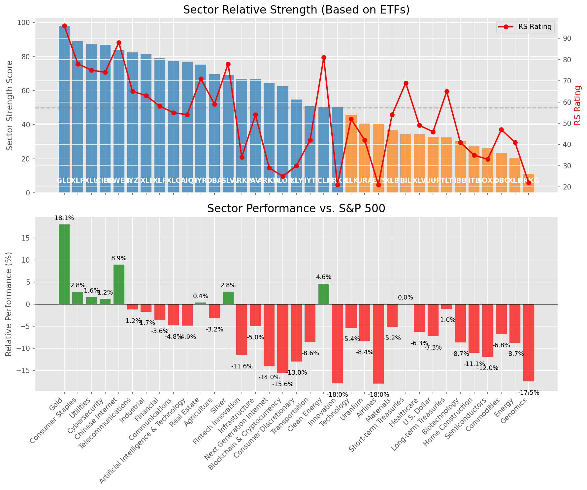

# **Daily Relative Strength Report**

**Date:** 2025-05-05

## **Market Valuation (Buffett Indicator)**

| Metric | Value |
|--------|-------|
| **Market Valuation** | **Fair Valued** |
| **Current Ratio** | 9.27 |
| **Historical Mean** | 9.44 |
| **Standard Deviation** | 0.51 |
| **Z-Score (StdDev from Mean)** | -0.26 |
| **Total Market Cap** | $277.97 trillion |
| **GDP** | $29.98 trillion |

## **Market Insights**

### **Market is Fairly Valued**

The market appears to be trading within a reasonable range of historical valuations. This suggests a balanced approach to equity investing is appropriate. Investors should:

- Focus on individual stock selection based on fundamentals and technicals
- Maintain normal equity allocations aligned with long-term goals
- Pay attention to sector rotation and relative strength
- Watch for changes in market leadership

Fair valuation typically suggests normal market returns can be expected, with stock selection becoming increasingly important.

### **Buffett Indicator Overview**

The Buffett Indicator (Total Market Cap / GDP) is a measure of the stock market's valuation relative to the size of the economy. It is named after Warren Buffett, who described it as "probably the best single measure of where valuations stand at any given moment."

- **Values above +2 standard deviations:** Market significantly overvalued
- **Values above +1 standard deviation:** Market overvalued
- **Values between -1 and +1 standard deviations:** Market fairly valued
- **Values below -1 standard deviation:** Market undervalued
- **Values below -2 standard deviations:** Market significantly undervalued

---

## **Sector Relative Strength**

Based on William O'Neil's Relative Strength Methodology

| ETF | Strength | RS Rating | Performance | Above Key MAs | Trend | Sector |
|-----|----------|-----------|-------------|--------------|-------|--------|
| [GLD](https://www.tradingview.com/chart/?symbol=GLD) | 98.0 | 96.0 | 17.42% | 10d ✓, 50d ✓, 200d ✓ | ↗️ | Gold |
| [XLP](https://www.tradingview.com/chart/?symbol=XLP) | 89.0 | 78.0 | 2.84% | 10d ✓, 50d ✓, 200d ✓ | ↗️ | Consumer Staples |
| [CIBR](https://www.tradingview.com/chart/?symbol=CIBR) | 88.0 | 76.0 | 1.76% | 10d ✓, 50d ✓, 200d ✓ | ↗️ | Cybersecurity |
| [XLU](https://www.tradingview.com/chart/?symbol=XLU) | 87.5 | 75.0 | 1.53% | 10d ✓, 50d ✓, 200d ✓ | ↗️ | Utilities |
| [KWEB](https://www.tradingview.com/chart/?symbol=KWEB) | 84.1 | 88.0 | 8.76% | 10d ✓, 50d ✗, 200d ✓ | ↗️ | Chinese Internet |
| [XLI](https://www.tradingview.com/chart/?symbol=XLI) | 82.5 | 65.0 | -1.31% | 10d ✓, 50d ✓, 200d ✓ | ↗️ | Industrial |
| [IYZ](https://www.tradingview.com/chart/?symbol=IYZ) | 82.5 | 65.0 | -1.38% | 10d ✓, 50d ✓, 200d ✓ | ↗️ | Telecommunications |
| [XLF](https://www.tradingview.com/chart/?symbol=XLF) | 80.0 | 60.0 | -3.08% | 10d ✓, 50d ✓, 200d ✓ | ↗️ | Financial |
| [XLC](https://www.tradingview.com/chart/?symbol=XLC) | 77.0 | 54.0 | -4.96% | 10d ✓, 50d ✓, 200d ✓ | ↗️ | Communications |
| [IYR](https://www.tradingview.com/chart/?symbol=IYR) | 76.3 | 73.0 | 0.67% | 10d ✓, 50d ✓, 200d ✗ | ↗️ | Real Estate |
| [AIQ](https://www.tradingview.com/chart/?symbol=AIQ) | 75.5 | 51.0 | -5.66% | 10d ✓, 50d ✓, 200d ✓ | ↗️ | Artificial Intelligence & Technology |
| [DBA](https://www.tradingview.com/chart/?symbol=DBA) | 69.6 | 59.0 | -3.10% | 10d ✗, 50d ✓, 200d ✓ | ↗️ | Agriculture |
| [SLV](https://www.tradingview.com/chart/?symbol=SLV) | 68.7 | 77.0 | 2.27% | 10d ✗, 50d ✗, 200d ✓ | ↗️ | Silver |
| [PAVE](https://www.tradingview.com/chart/?symbol=PAVE) | 67.8 | 56.0 | -4.49% | 10d ✓, 50d ✓, 200d ✗ | ↗️ | Infrastructure |
| [ARKF](https://www.tradingview.com/chart/?symbol=ARKF) | 66.0 | 32.0 | -12.21% | 10d ✓, 50d ✓, 200d ✓ | ↗️ | Fintech Innovation |
| [ARKW](https://www.tradingview.com/chart/?symbol=ARKW) | 64.0 | 28.0 | -13.90% | 10d ✓, 50d ✓, 200d ✓ | ↗️ | Next Generation Internet |
| [BLOK](https://www.tradingview.com/chart/?symbol=BLOK) | 62.0 | 24.0 | -15.88% | 10d ✓, 50d ✓, 200d ✓ | ↗️ | Blockchain & Cryptocurrency |
| [IYT](https://www.tradingview.com/chart/?symbol=IYT) | 61.8 | 44.0 | -7.90% | 10d ✓, 50d ✓, 200d ✗ | ↗️ | Transportation |
| [XLY](https://www.tradingview.com/chart/?symbol=XLY) | 54.8 | 30.0 | -12.89% | 10d ✓, 50d ✓, 200d ✗ | ↗️ | Consumer Discretionary |
| [ICLN](https://www.tradingview.com/chart/?symbol=ICLN) | 50.9 | 82.0 | 4.76% | 10d ✗, 50d ✓, 200d ✗ | ↘️ | Clean Energy |
| [JETS](https://www.tradingview.com/chart/?symbol=JETS) | 50.8 | 22.0 | -17.48% | 10d ✓, 50d ✓, 200d ✗ | ↗️ | Airlines |
| [ARKK](https://www.tradingview.com/chart/?symbol=ARKK) | 50.3 | 21.0 | -17.69% | 10d ✓, 50d ✓, 200d ✗ | ↗️ | Innovation |
| [XLB](https://www.tradingview.com/chart/?symbol=XLB) | 47.3 | 55.0 | -4.68% | 10d ✓, 50d ✓, 200d ✗ | ↘️ | Materials |
| [XLK](https://www.tradingview.com/chart/?symbol=XLK) | 46.3 | 53.0 | -5.16% | 10d ✓, 50d ✓, 200d ✗ | ↘️ | Technology |
| [URA](https://www.tradingview.com/chart/?symbol=URA) | 40.3 | 41.0 | -8.72% | 10d ✓, 50d ✓, 200d ✗ | ↘️ | Uranium |
| [BIL](https://www.tradingview.com/chart/?symbol=BIL) | 34.5 | 69.0 | 0.02% | 10d ✗, 50d ✗, 200d ✗ | ↘️ | Short-term Treasuries |
| [XLV](https://www.tradingview.com/chart/?symbol=XLV) | 34.4 | 49.0 | -6.25% | 10d ✓, 50d ✗, 200d ✗ | ↘️ | Healthcare |
| [TLT](https://www.tradingview.com/chart/?symbol=TLT) | 33.0 | 66.0 | -0.92% | 10d ✗, 50d ✗, 200d ✗ | ↘️ | Long-term Treasuries |
| [UUP](https://www.tradingview.com/chart/?symbol=UUP) | 32.9 | 46.0 | -7.42% | 10d ✓, 50d ✗, 200d ✗ | ↘️ | U.S. Dollar |
| [IBB](https://www.tradingview.com/chart/?symbol=IBB) | 30.9 | 42.0 | -8.47% | 10d ✓, 50d ✗, 200d ✗ | ↘️ | Biotechnology |
| [ITB](https://www.tradingview.com/chart/?symbol=ITB) | 28.4 | 37.0 | -10.31% | 10d ✓, 50d ✗, 200d ✗ | ↘️ | Home Construction |
| [SOXX](https://www.tradingview.com/chart/?symbol=SOXX) | 26.4 | 33.0 | -11.71% | 10d ✓, 50d ✗, 200d ✗ | ↘️ | Semiconductors |
| [DBC](https://www.tradingview.com/chart/?symbol=DBC) | 23.5 | 47.0 | -7.05% | 10d ✗, 50d ✗, 200d ✗ | ↘️ | Commodities |
| [XLE](https://www.tradingview.com/chart/?symbol=XLE) | 21.0 | 42.0 | -8.54% | 10d ✗, 50d ✗, 200d ✗ | ↘️ | Energy |
| [ARKG](https://www.tradingview.com/chart/?symbol=ARKG) | 11.5 | 23.0 | -16.86% | 10d ✗, 50d ✗, 200d ✗ | ↘️ | Genomics |

### **Sector ETF Performance Interpretation**

This table shows the relative strength metrics for different market sectors based on their representative ETFs:

- **ETF**: The ETF used to measure sector performance (click for chart)
- **Strength**: Overall sector strength score (0-100) combining multiple factors
- **RS Rating**: O'Neil RS rating of the sector ETF
- **Performance**: Performance of the sector ETF relative to SPY
- **Above Key MAs**: Whether the ETF is trading above its 10, 50, and 200-day moving averages
- **Trend**: Whether the sector is in an uptrend (↗️) or downtrend (↘️)

### **Current Sector Leadership**

The current market leadership is coming from the following sectors: **Gold, Consumer Staples, Cybersecurity**.

The **Gold** sector (represented by **GLD**) is showing particularly strong relative strength with an RS rating of 96.0 and performance of 17.42% vs. the S&P 500. This sector is trading above its 10-day, 50-day, 200-day moving average(s). Investors should consider focusing on high RS stocks within these leading sectors for potential outperformance.

---

## **Buy Recommendations**

The following 107 stocks show exceptional relative strength:

| RS Rating | Buy Score | Current Price | Chart | Name | Ticker |
|-----------|-----------|---------------|-------|------|--------|
| 100 | 100 | $56.48 | [Chart](https://www.tradingview.com/chart/?symbol=SEZL) | Sezzle Inc. Common Stock | SEZL |
| 100 | 100 | $496.70 | [Chart](https://www.tradingview.com/chart/?symbol=DUOL) | Duolingo, Inc. Class A Common Stock | DUOL |
| 100 | 100 | $151.81 | [Chart](https://www.tradingview.com/chart/?symbol=PLMR) | Palomar Holdings, Inc. Common stock | PLMR |
| 100 | 100 | $123.78 | [Chart](https://www.tradingview.com/chart/?symbol=PLTR) | Palantir Technologies Inc. Class A Common Stock | PLTR |
| 100 | 100 | $27.14 | [Chart](https://www.tradingview.com/chart/?symbol=DB) | Deutsche Bank Aktiengesellschaft | DB |
| 100 | 100 | $143.09 | [Chart](https://www.tradingview.com/chart/?symbol=ROOT) | Root, Inc. Class A Common Stock | ROOT |
| 99 | 100 | $46.21 | [Chart](https://www.tradingview.com/chart/?symbol=MRX) | Marex Group plc Ordinary Shares | MRX |
| 99 | 100 | $59.59 | [Chart](https://www.tradingview.com/chart/?symbol=SKWD) | Skyward Specialty Insurance Group, Inc. Common Stock | SKWD |
| 99 | 100 | $82.96 | [Chart](https://www.tradingview.com/chart/?symbol=WPM) | Wheaton Precious Metals Corp. Common Stock | WPM |
| 99 | 100 | $284.89 | [Chart](https://www.tradingview.com/chart/?symbol=VRSN) | VeriSign Inc | VRSN |
| 99 | 100 | $93.23 | [Chart](https://www.tradingview.com/chart/?symbol=SNEX) | StoneX Group Inc. Common Stock | SNEX |
| 99 | 100 | $171.81 | [Chart](https://www.tradingview.com/chart/?symbol=PM) | Philip Morris International Inc. | PM |
| 99 | 100 | $141.35 | [Chart](https://www.tradingview.com/chart/?symbol=UGL) | ProShares Ultra Gold | UGL |
| 98 | 100 | $154.72 | [Chart](https://www.tradingview.com/chart/?symbol=HWM) | Howmet Aerospace Inc. | HWM |
| 98 | 100 | $30.61 | [Chart](https://www.tradingview.com/chart/?symbol=EUFN) | iShares MSCI Europe Financials ETF | EUFN |
| 98 | 100 | $72.58 | [Chart](https://www.tradingview.com/chart/?symbol=VRNA) | Verona Pharma plc | VRNA |
| 98 | 100 | $23.46 | [Chart](https://www.tradingview.com/chart/?symbol=OR) | Osisko Gold Royalties Ltd | OR |
| 98 | 100 | $17.95 | [Chart](https://www.tradingview.com/chart/?symbol=SPNT) | SiriusPoint Ltd. | SPNT |
| 97 | 100 | $42.52 | [Chart](https://www.tradingview.com/chart/?symbol=DRS) | Leonardo DRS, Inc. Common Stock | DRS |
| 97 | 100 | $39.80 | [Chart](https://www.tradingview.com/chart/?symbol=EXEL) | Exelixis Inc | EXEL |
| 97 | 100 | $40.77 | [Chart](https://www.tradingview.com/chart/?symbol=EWG) | iShares MSCI Germany ETF | EWG |
| 97 | 100 | $163.77 | [Chart](https://www.tradingview.com/chart/?symbol=AGX) | Argan, Inc | AGX |
| 97 | 100 | $72.43 | [Chart](https://www.tradingview.com/chart/?symbol=WRB) | W.R. Berkley Corporation | WRB |
| 97 | 100 | $22.77 | [Chart](https://www.tradingview.com/chart/?symbol=LAUR) | Laureate Education, Inc. Common Stock | LAUR |
| 97 | 100 | $152.12 | [Chart](https://www.tradingview.com/chart/?symbol=CAH) | Cardinal Health, Inc. | CAH |
| 96 | 100 | $161.44 | [Chart](https://www.tradingview.com/chart/?symbol=LRN) | Stride, Inc. | LRN |
| 96 | 100 | $305.22 | [Chart](https://www.tradingview.com/chart/?symbol=GLD) | SPDR Gold Trust, SPDR Gold Shares | GLD |
| 96 | 100 | $106.94 | [Chart](https://www.tradingview.com/chart/?symbol=DAVE) | Dave Inc. Class A Common Stock | DAVE |
| 96 | 100 | $122.52 | [Chart](https://www.tradingview.com/chart/?symbol=VSEC) | VSE Corp | VSEC |
| 96 | 100 | $51.63 | [Chart](https://www.tradingview.com/chart/?symbol=GFL) | GFL Environmental Inc. Subordinate Voting Shares | GFL |
| 96 | 100 | $62.44 | [Chart](https://www.tradingview.com/chart/?symbol=IAU) | iShares Gold Trust | IAU |
| 96 | 100 | $33.02 | [Chart](https://www.tradingview.com/chart/?symbol=IAUM) | iShares Gold Trust Micro | IAUM |
| 95 | 100 | $281.43 | [Chart](https://www.tradingview.com/chart/?symbol=CME) | CME Group Inc. | CME |
| 95 | 100 | $638.57 | [Chart](https://www.tradingview.com/chart/?symbol=SPOT) | Spotify Technology S.A. | SPOT |
| 95 | 100 | $117.33 | [Chart](https://www.tradingview.com/chart/?symbol=EHC) | Encompass Health Corporation Common Stock | EHC |
| 95 | 100 | $1134.00 | [Chart](https://www.tradingview.com/chart/?symbol=NFLX) | NetFlix Inc | NFLX |
| 95 | 100 | $210.97 | [Chart](https://www.tradingview.com/chart/?symbol=IDCC) | InterDigital, Inc. | IDCC |
| 95 | 100 | $25.24 | [Chart](https://www.tradingview.com/chart/?symbol=SONY) | Sony Group Corporation American Depositary Shares (Each Representing One Share of Dollar Validated Common Stock) | SONY |
| 95 | 100 | $25.23 | [Chart](https://www.tradingview.com/chart/?symbol=PHYS) | Sprott Physical Gold Trust | PHYS |
| 95 | 100 | $20.01 | [Chart](https://www.tradingview.com/chart/?symbol=KT) | KT Corp. | KT |
| 95 | 100 | $102.13 | [Chart](https://www.tradingview.com/chart/?symbol=RBA) | RB Global, Inc. | RBA |
| 95 | 100 | $142.78 | [Chart](https://www.tradingview.com/chart/?symbol=SE) | Sea Limited American Depositary Shares, each representing one Class A Ordinary Share | SE |
| 94 | 100 | $89.64 | [Chart](https://www.tradingview.com/chart/?symbol=CCEP) | Coca-Cola Europacific Partners plc Ordinary Shares | CCEP |
| 94 | 100 | $16.50 | [Chart](https://www.tradingview.com/chart/?symbol=BCS) | Barclays PLC | BCS |
| 94 | 100 | $23.79 | [Chart](https://www.tradingview.com/chart/?symbol=SRAD) | Sportradar Group AG Class A Ordinary Shares | SRAD |
| 94 | 100 | $117.20 | [Chart](https://www.tradingview.com/chart/?symbol=COOP) | Mr. Cooper Group Inc. Common Stock | COOP |
| 94 | 100 | $25.40 | [Chart](https://www.tradingview.com/chart/?symbol=MP) | MP Materials Corp. | MP |
| 94 | 100 | $22.91 | [Chart](https://www.tradingview.com/chart/?symbol=CXW) | CoreCivic, Inc. | CXW |
| 94 | 100 | $81.78 | [Chart](https://www.tradingview.com/chart/?symbol=NFG) | National Fuel Gas Co. | NFG |
| 93 | 100 | $27.36 | [Chart](https://www.tradingview.com/chart/?symbol=T) | AT&T Inc. | T |
| 93 | 100 | $136.79 | [Chart](https://www.tradingview.com/chart/?symbol=DTE) | DTE Energy Company | DTE |
| 93 | 100 | $64.93 | [Chart](https://www.tradingview.com/chart/?symbol=FNF) | Fidelity National Financial, Inc. | FNF |
| 93 | 100 | $31.59 | [Chart](https://www.tradingview.com/chart/?symbol=SLM) | SLM Corporation | SLM |
| 93 | 100 | $59.70 | [Chart](https://www.tradingview.com/chart/?symbol=MO) | Altria Group, Inc. | MO |
| 93 | 100 | $250.79 | [Chart](https://www.tradingview.com/chart/?symbol=RSG) | Republic Services Inc. | RSG |
| 93 | 100 | $60.31 | [Chart](https://www.tradingview.com/chart/?symbol=ULS) | UL Solutions Inc. | ULS |
| 92 | 100 | $214.25 | [Chart](https://www.tradingview.com/chart/?symbol=CRS) | Carpenter Technology Corp | CRS |
| 92 | 100 | $50.49 | [Chart](https://www.tradingview.com/chart/?symbol=TRP) | TC Energy Corporation | TRP |
| 92 | 100 | $161.06 | [Chart](https://www.tradingview.com/chart/?symbol=ATO) | Atmos Energy Corporation | ATO |
| 92 | 100 | $143.56 | [Chart](https://www.tradingview.com/chart/?symbol=TW) | Tradeweb Markets Inc. Class A Common Stock | TW |
| 92 | 100 | $82.97 | [Chart](https://www.tradingview.com/chart/?symbol=FAST) | Fastenal Co | FAST |
| 92 | 100 | $32.32 | [Chart](https://www.tradingview.com/chart/?symbol=AHR) | American Healthcare REIT, Inc. | AHR |
| 91 | 100 | $25.04 | [Chart](https://www.tradingview.com/chart/?symbol=EWS) | iShares MSCI Singapore ETF | EWS |
| 91 | 100 | $170.34 | [Chart](https://www.tradingview.com/chart/?symbol=THG) | The Hanover Insurance Group, Inc. | THG |
| 91 | 100 | $78.44 | [Chart](https://www.tradingview.com/chart/?symbol=OGS) | ONE GAS, INC. | OGS |
| 91 | 100 | $296.00 | [Chart](https://www.tradingview.com/chart/?symbol=PEN) | Penumbra, Inc. | PEN |
| 91 | 100 | $55.12 | [Chart](https://www.tradingview.com/chart/?symbol=RELX) | RELX PLC | RELX |
| 91 | 100 | $302.63 | [Chart](https://www.tradingview.com/chart/?symbol=SAP) | SAP SE | SAP |
| 91 | 100 | $59.94 | [Chart](https://www.tradingview.com/chart/?symbol=CHEF) | The Chef's Warehouse Inc | CHEF |
| 91 | 100 | $401.56 | [Chart](https://www.tradingview.com/chart/?symbol=GEV) | GE Vernova Inc. | GEV |
| 90 | 100 | $230.35 | [Chart](https://www.tradingview.com/chart/?symbol=CBOE) | Cboe Global Markets, Inc. | CBOE |
| 90 | 100 | $115.43 | [Chart](https://www.tradingview.com/chart/?symbol=ATGE) | Adtalem Global Education Inc. Common Shares | ATGE |
| 90 | 100 | $32.78 | [Chart](https://www.tradingview.com/chart/?symbol=LTH) | Life Time Group Holdings, Inc. | LTH |
| 89 | 100 | $99.88 | [Chart](https://www.tradingview.com/chart/?symbol=AXS) | Axis Capital Holders Limited | AXS |
| 89 | 100 | $43.55 | [Chart](https://www.tradingview.com/chart/?symbol=BTI) | British American Tobacco p.l.c. American Depositary Shares, American Depositary Shares, each representing one Ordinary Share | BTI |
| 89 | 100 | $72.80 | [Chart](https://www.tradingview.com/chart/?symbol=CORT) | Corcept Therapeutics Inc. | CORT |
| 89 | 100 | $117.59 | [Chart](https://www.tradingview.com/chart/?symbol=AXSM) | Axsome Therapeutics, Inc | AXSM |
| 89 | 100 | $42.25 | [Chart](https://www.tradingview.com/chart/?symbol=HMN) | Horace Mann Educators Corporation | HMN |
| 88 | 100 | $17.55 | [Chart](https://www.tradingview.com/chart/?symbol=AM) | Antero Midstream Corporation Common Stock | AM |
| 88 | 100 | $1406.36 | [Chart](https://www.tradingview.com/chart/?symbol=ORLY) | O'Reilly Automotive, Inc. | ORLY |
| 88 | 100 | $458.65 | [Chart](https://www.tradingview.com/chart/?symbol=CASY) | Casey's General Stores Inc | CASY |
| 87 | 100 | $172.51 | [Chart](https://www.tradingview.com/chart/?symbol=SFM) | Sprouts Farmers Market, Inc. | SFM |
| 89 | 99 | $174.22 | [Chart](https://www.tradingview.com/chart/?symbol=CVLT) | Commault Systems, Inc. | CVLT |
| 89 | 99 | $5202.80 | [Chart](https://www.tradingview.com/chart/?symbol=BKNG) | Booking Holdings Inc. Common Stock | BKNG |
| 88 | 99 | $186.25 | [Chart](https://www.tradingview.com/chart/?symbol=LOPE) | Grand Canyon Education, Inc | LOPE |
| 88 | 99 | $201.21 | [Chart](https://www.tradingview.com/chart/?symbol=BAP) | Credicorp LTD | BAP |
| 87 | 99 | $333.60 | [Chart](https://www.tradingview.com/chart/?symbol=AJG) | Arthur J. Gallagher & Co. | AJG |
| 87 | 99 | $35.89 | [Chart](https://www.tradingview.com/chart/?symbol=KTOS) | Kratos Defense & Security Solutions, Inc. | KTOS |
| 86 | 99 | $150.96 | [Chart](https://www.tradingview.com/chart/?symbol=WELL) | Welltower Inc. | WELL |
| 88 | 98 | $174.65 | [Chart](https://www.tradingview.com/chart/?symbol=ICE) | Intercontinental Exchange  Inc. | ICE |
| 88 | 98 | $34.60 | [Chart](https://www.tradingview.com/chart/?symbol=PAY) | Paymentus Holdings, Inc. | PAY |
| 87 | 98 | $116.75 | [Chart](https://www.tradingview.com/chart/?symbol=CWST) | Casella Waste Systems Inc | CWST |
| 85 | 98 | $45.11 | [Chart](https://www.tradingview.com/chart/?symbol=OGE) | OGE Energy Corp. | OGE |
| 85 | 98 | $69.39 | [Chart](https://www.tradingview.com/chart/?symbol=EVRG) | Evergy, Inc. | EVRG |
| 87 | 97 | $165.40 | [Chart](https://www.tradingview.com/chart/?symbol=MAA) | Mid-America Apartment Communities, Inc. | MAA |
| 84 | 97 | $59.95 | [Chart](https://www.tradingview.com/chart/?symbol=WMB) | Williams Companies Inc. | WMB |
| 86 | 96 | $57.13 | [Chart](https://www.tradingview.com/chart/?symbol=IGF) | iShares Global Infrastructure ETF | IGF |
| 86 | 96 | $31.43 | [Chart](https://www.tradingview.com/chart/?symbol=MFC) | Manulife Financial Corp. | MFC |
| 86 | 96 | $64.01 | [Chart](https://www.tradingview.com/chart/?symbol=RYTM) | Rhythm Pharmaceuticals, Inc. Common Stock | RYTM |
| 85 | 96 | $117.54 | [Chart](https://www.tradingview.com/chart/?symbol=IDA) | IDACORP, Inc. | IDA |
| 83 | 96 | $165.74 | [Chart](https://www.tradingview.com/chart/?symbol=TKO) | TKO Group Holdings, Inc. | TKO |
| 84 | 95 | $41.22 | [Chart](https://www.tradingview.com/chart/?symbol=AB) | AllianceBernstein Holding, L.P. | AB |
| 83 | 95 | $74.72 | [Chart](https://www.tradingview.com/chart/?symbol=RBRK) | Rubrik, Inc. | RBRK |
| 82 | 94 | $70.30 | [Chart](https://www.tradingview.com/chart/?symbol=EBAY) | eBay Inc | EBAY |
| 83 | 93 | $198.23 | [Chart](https://www.tradingview.com/chart/?symbol=WCN) | Waste Connections, Inc. | WCN |
| 82 | 92 | $41.71 | [Chart](https://www.tradingview.com/chart/?symbol=FHI) | Federated Hermes, Inc. | FHI |
| 81 | 92 | $200.52 | [Chart](https://www.tradingview.com/chart/?symbol=ALL) | The Allstate Corporation | ALL |

---

## **Sell Recommendations**

The following 122 stocks show deteriorating relative strength:

| RS Rating | Sell Score | Current Price | Chart | Name | Ticker |
|-----------|------------|---------------|-------|------|--------|
| 1 | 100 | $10.54 | [Chart](https://www.tradingview.com/chart/?symbol=XNCR) | Xencor, Inc. | XNCR |
| 1 | 100 | $11.69 | [Chart](https://www.tradingview.com/chart/?symbol=DYN) | Dyne Therapeutics, Inc. Common Stock | DYN |
| 1 | 100 | $15.36 | [Chart](https://www.tradingview.com/chart/?symbol=ZVZZT) | SUPER Montage TEST SYMBOL | ZVZZT |
| 2 | 100 | $10.98 | [Chart](https://www.tradingview.com/chart/?symbol=NRIX) | Nurix Therapeutics, Inc. Common stock | NRIX |
| 2 | 100 | $16.76 | [Chart](https://www.tradingview.com/chart/?symbol=SSTK) | SHUTTERSTOCK, INC. | SSTK |
| 2 | 100 | $27.59 | [Chart](https://www.tradingview.com/chart/?symbol=CIVI) | Civitas Resources, Inc. | CIVI |
| 2 | 100 | $18.93 | [Chart](https://www.tradingview.com/chart/?symbol=DAVA) | Endava plc American Depositary Shares (each representing one Class A Ordinary Share) | DAVA |
| 2 | 100 | $10.40 | [Chart](https://www.tradingview.com/chart/?symbol=BCYC) | Bicycle Therapeutics plc American Depositary Shares | BCYC |
| 2 | 100 | $120.31 | [Chart](https://www.tradingview.com/chart/?symbol=GLOB) | GLOBANT S.A. | GLOB |
| 3 | 100 | $14.15 | [Chart](https://www.tradingview.com/chart/?symbol=ODP) | The ODP Corporation Common Stock | ODP |
| 3 | 100 | $78.54 | [Chart](https://www.tradingview.com/chart/?symbol=ILMN) | Illumina Inc | ILMN |
| 4 | 100 | $10.02 | [Chart](https://www.tradingview.com/chart/?symbol=LSPD) | Lightspeed Commerce Inc. | LSPD |
| 4 | 100 | $13.52 | [Chart](https://www.tradingview.com/chart/?symbol=DV) | DoubleVerify Holdings, Inc. | DV |
| 4 | 100 | $24.54 | [Chart](https://www.tradingview.com/chart/?symbol=RPD) | Rapid7, Inc. Common Stock | RPD |
| 4 | 100 | $21.51 | [Chart](https://www.tradingview.com/chart/?symbol=SPT) | Sprout Social, Inc Class A Common Stock | SPT |
| 5 | 100 | $60.29 | [Chart](https://www.tradingview.com/chart/?symbol=LABU) | Direxion Daily S&P Biotech Bull 3X Shares | LABU |
| 6 | 100 | $27.21 | [Chart](https://www.tradingview.com/chart/?symbol=JACK) | Jack in the Box Inc. | JACK |
| 6 | 100 | $32.58 | [Chart](https://www.tradingview.com/chart/?symbol=AAP) | ADVANCE AUTO PARTS INC | AAP |
| 6 | 100 | $13.53 | [Chart](https://www.tradingview.com/chart/?symbol=GCT) | GigaCloud Technology Inc Class A Ordinary Shares | GCT |
| 7 | 100 | $58.62 | [Chart](https://www.tradingview.com/chart/?symbol=SYNA) | Synaptics Inc | SYNA |
| 8 | 100 | $28.01 | [Chart](https://www.tradingview.com/chart/?symbol=SRDX) | Surmodics, Inc. Common Stock | SRDX |
| 8 | 100 | $95.75 | [Chart](https://www.tradingview.com/chart/?symbol=TGT) | Target Corporation | TGT |
| 10 | 100 | $16.07 | [Chart](https://www.tradingview.com/chart/?symbol=DXC) | DXC Technology Company | DXC |
| 11 | 100 | $16.72 | [Chart](https://www.tradingview.com/chart/?symbol=MLKN) | MillerKnoll, Inc. Common Stock | MLKN |
| 12 | 100 | $59.26 | [Chart](https://www.tradingview.com/chart/?symbol=AMWD) | American Woodmark Corp | AMWD |
| 13 | 100 | $32.69 | [Chart](https://www.tradingview.com/chart/?symbol=UWM) | ProShares Ultra Russell2000 | UWM |
| 14 | 100 | $11.56 | [Chart](https://www.tradingview.com/chart/?symbol=JAMF) | Jamf Holding Corp. Common Stock | JAMF |
| 13 | 98 | $64.42 | [Chart](https://www.tradingview.com/chart/?symbol=SPB) | Spectrum Brands Holdings, Inc. | SPB |
| 7 | 97 | $113.77 | [Chart](https://www.tradingview.com/chart/?symbol=BLDR) | Builders FirstSource, Inc. | BLDR |
| 9 | 96 | $10.77 | [Chart](https://www.tradingview.com/chart/?symbol=SONO) | Sonos, Inc. Common Stock | SONO |
| 11 | 96 | $25.16 | [Chart](https://www.tradingview.com/chart/?symbol=AA) | Alcoa Corporation | AA |
| 12 | 96 | $12.94 | [Chart](https://www.tradingview.com/chart/?symbol=TRIP) | TripAdvisor, Inc. | TRIP |
| 13 | 96 | $11.90 | [Chart](https://www.tradingview.com/chart/?symbol=AEYE) | AudioEye, Inc. Common Stock | AEYE |
| 16 | 96 | $11.91 | [Chart](https://www.tradingview.com/chart/?symbol=M) | Macy's Inc. | M |
| 15 | 95 | $25.80 | [Chart](https://www.tradingview.com/chart/?symbol=GDEN) | Golden Entertainment, Inc. Common Stock | GDEN |
| 9 | 94 | $12.91 | [Chart](https://www.tradingview.com/chart/?symbol=MARA) | MARA Holdings, Inc. Common Stock | MARA |
| 9 | 94 | $10.31 | [Chart](https://www.tradingview.com/chart/?symbol=VREX) | Varex Imaging Corporation Common Stock | VREX |
| 10 | 94 | $108.77 | [Chart](https://www.tradingview.com/chart/?symbol=A) | Agilent Technologies Inc. | A |
| 10 | 94 | $36.22 | [Chart](https://www.tradingview.com/chart/?symbol=CRC) | California Resources Corporation | CRC |
| 15 | 94 | $12.83 | [Chart](https://www.tradingview.com/chart/?symbol=ARCT) | Arcturus Therapeutics Holdings Inc. Common Stock | ARCT |
| 17 | 94 | $13.07 | [Chart](https://www.tradingview.com/chart/?symbol=NVGS) | NAVIGATOR HOLDINGS LTD. | NVGS |
| 18 | 94 | $15.55 | [Chart](https://www.tradingview.com/chart/?symbol=PSFE) | Paysafe Limited | PSFE |
| 25 | 94 | $14.14 | [Chart](https://www.tradingview.com/chart/?symbol=FXN) | First Trust Energy AlphaDEX Fund | FXN |
| 9 | 93 | $12.61 | [Chart](https://www.tradingview.com/chart/?symbol=DQ) | Daqo New Energy Corp. American Depositary Shares (each representing 5 Ordinary Shares) | DQ |
| 13 | 93 | $38.69 | [Chart](https://www.tradingview.com/chart/?symbol=ASO) | Academy Sports and Outdoors, Inc. | ASO |
| 15 | 93 | $19.54 | [Chart](https://www.tradingview.com/chart/?symbol=VECO) | Veeco Instruments Inc | VECO |
| 17 | 93 | $11.29 | [Chart](https://www.tradingview.com/chart/?symbol=PBR) | PETROLEO BRASILEIRO S.A.-PETROBRAS ADS (REP 1 COMMON SHARE) | PBR |
| 21 | 93 | $10.54 | [Chart](https://www.tradingview.com/chart/?symbol=GSBD) | Goldman Sachs BDC, Inc. | GSBD |
| 13 | 92 | $96.15 | [Chart](https://www.tradingview.com/chart/?symbol=BCC) | Boise Cascade Company | BCC |
| 14 | 92 | $27.54 | [Chart](https://www.tradingview.com/chart/?symbol=WSC) | WillScot Holdings Corporation Class A Common Stock | WSC |
| 23 | 92 | $11.73 | [Chart](https://www.tradingview.com/chart/?symbol=KELYA) | Kelly Services Inc | KELYA |
| 23 | 92 | $10.34 | [Chart](https://www.tradingview.com/chart/?symbol=CMRE) | Costamare Inc. | CMRE |
| 27 | 92 | $10.05 | [Chart](https://www.tradingview.com/chart/?symbol=LBTYK) | Liberty Global Ltd. Class C Common Shares | LBTYK |
| 15 | 91 | $10.40 | [Chart](https://www.tradingview.com/chart/?symbol=SEMR) | SEMrush Holdings, Inc. | SEMR |
| 17 | 91 | $46.73 | [Chart](https://www.tradingview.com/chart/?symbol=ERX) | Direxion Daily Energy Bull 2X Shares | ERX |
| 20 | 91 | $12.16 | [Chart](https://www.tradingview.com/chart/?symbol=DBO) | Invesco DB Oil Fund | DBO |
| 24 | 91 | $11.36 | [Chart](https://www.tradingview.com/chart/?symbol=GES) | Guess?, Inc. | GES |
| 21 | 90 | $10.59 | [Chart](https://www.tradingview.com/chart/?symbol=PBR.A) | Petroleo Brasileiro S.A.-Petrobras | PBR.A |
| 16 | 89 | $10.03 | [Chart](https://www.tradingview.com/chart/?symbol=MTAL) | MAC Copper Limited | MTAL |
| 17 | 89 | $16.84 | [Chart](https://www.tradingview.com/chart/?symbol=SVOL) | Simplify Volatility Premium ETF | SVOL |
| 19 | 89 | $15.75 | [Chart](https://www.tradingview.com/chart/?symbol=AMZY) | YieldMax AMZN Option Income Strategy ETF | AMZY |
| 19 | 89 | $16.32 | [Chart](https://www.tradingview.com/chart/?symbol=PENN) | PENN Entertainment, Inc. Common Stock | PENN |
| 21 | 89 | $91.43 | [Chart](https://www.tradingview.com/chart/?symbol=CHRD) | Chord Energy Corporation Common Stock | CHRD |
| 13 | 88 | $10.15 | [Chart](https://www.tradingview.com/chart/?symbol=HLIT) | Harmonic Inc | HLIT |
| 20 | 88 | $26.11 | [Chart](https://www.tradingview.com/chart/?symbol=HPQ) | HP Inc. | HPQ |
| 25 | 88 | $13.25 | [Chart](https://www.tradingview.com/chart/?symbol=MED) | Medifast, Inc. | MED |
| 29 | 88 | $28.76 | [Chart](https://www.tradingview.com/chart/?symbol=TAN) | Invesco Solar ETF | TAN |
| 20 | 87 | $15.98 | [Chart](https://www.tradingview.com/chart/?symbol=PBW) | Invesco WilderHill Clean Energy ETF | PBW |
| 22 | 87 | $21.50 | [Chart](https://www.tradingview.com/chart/?symbol=FOXF) | Fox Factory Holding Corp. Common Stock | FOXF |
| 24 | 87 | $55.09 | [Chart](https://www.tradingview.com/chart/?symbol=KBH) | KB Home | KBH |
| 26 | 87 | $41.23 | [Chart](https://www.tradingview.com/chart/?symbol=NXT) | Nextracker Inc. Class A Common Stock | NXT |
| 26 | 87 | $10.01 | [Chart](https://www.tradingview.com/chart/?symbol=XPRO) | Expro Group Holdings N.V. | XPRO |
| 15 | 86 | $77.50 | [Chart](https://www.tradingview.com/chart/?symbol=WHR) | Whirlpool Corp. | WHR |
| 15 | 86 | $29.92 | [Chart](https://www.tradingview.com/chart/?symbol=MBUU) | Malibu Boats, Inc. Class A | MBUU |
| 29 | 86 | $22.11 | [Chart](https://www.tradingview.com/chart/?symbol=ST) | Sensata Technologies Holding plc | ST |
| 15 | 85 | $32.45 | [Chart](https://www.tradingview.com/chart/?symbol=BRZE) | Braze, Inc. Class A Common Stock | BRZE |
| 26 | 85 | $51.42 | [Chart](https://www.tradingview.com/chart/?symbol=LW) | Lamb Weston Holdings, Inc. | LW |
| 19 | 84 | $192.47 | [Chart](https://www.tradingview.com/chart/?symbol=DKS) | Dick's Sporting Goods, Inc. | DKS |
| 20 | 84 | $17.95 | [Chart](https://www.tradingview.com/chart/?symbol=INFY) | Infosys Limited American Depositary Shares | INFY |
| 22 | 84 | $11.95 | [Chart](https://www.tradingview.com/chart/?symbol=PR) | Permian Resources Corporation | PR |
| 28 | 84 | $24.23 | [Chart](https://www.tradingview.com/chart/?symbol=AMRK) | A-Mark Precious Metals, Inc. | AMRK |
| 24 | 83 | $10.53 | [Chart](https://www.tradingview.com/chart/?symbol=AVO) | Mission Produce, Inc. Common Stock | AVO |
| 20 | 82 | $68.31 | [Chart](https://www.tradingview.com/chart/?symbol=BBY) | Best Buy Company, Inc. | BBY |
| 22 | 82 | $31.31 | [Chart](https://www.tradingview.com/chart/?symbol=MBIN) | Merchants Bancorp Common Stock | MBIN |
| 23 | 82 | $22.09 | [Chart](https://www.tradingview.com/chart/?symbol=ARKG) | ARK Genomic Revolution ETF | ARKG |
| 24 | 82 | $141.12 | [Chart](https://www.tradingview.com/chart/?symbol=MTN) | Vail Resorts, Inc. | MTN |
| 28 | 82 | $27.65 | [Chart](https://www.tradingview.com/chart/?symbol=COLL) | Collegium Pharmaceutical, Inc. Common Stock | COLL |
| 26 | 81 | $42.46 | [Chart](https://www.tradingview.com/chart/?symbol=FEPI) | REX FANG & Innovation Equity Premium Income ETF | FEPI |
| 27 | 81 | $19.14 | [Chart](https://www.tradingview.com/chart/?symbol=PLAB) | Photronics Inc | PLAB |
| 31 | 80 | $35.12 | [Chart](https://www.tradingview.com/chart/?symbol=TECK) | Teck Resources Limited | TECK |
| 23 | 79 | $202.19 | [Chart](https://www.tradingview.com/chart/?symbol=NVMI) | Nova Ltd. Ordinary Shares | NVMI |
| 29 | 79 | $35.95 | [Chart](https://www.tradingview.com/chart/?symbol=IAC) | IAC Inc. Common Stock | IAC |
| 34 | 79 | $71.35 | [Chart](https://www.tradingview.com/chart/?symbol=TTC) | Toro Company (The) | TTC |
| 22 | 78 | $33.16 | [Chart](https://www.tradingview.com/chart/?symbol=DOCN) | DigitalOcean Holdings, Inc. | DOCN |
| 22 | 78 | $12.34 | [Chart](https://www.tradingview.com/chart/?symbol=CIM) | Chimera Investment Corp. | CIM |
| 31 | 78 | $192.84 | [Chart](https://www.tradingview.com/chart/?symbol=NDSN) | Nordson Corp | NDSN |
| 30 | 77 | $16.70 | [Chart](https://www.tradingview.com/chart/?symbol=MLNK) | MeridianLink, Inc. | MLNK |
| 26 | 76 | $26.11 | [Chart](https://www.tradingview.com/chart/?symbol=WY) | Weyerhaeuser Company | WY |
| 32 | 76 | $13.12 | [Chart](https://www.tradingview.com/chart/?symbol=MTUS) | Metallus Inc. | MTUS |
| 34 | 76 | $15.19 | [Chart](https://www.tradingview.com/chart/?symbol=ZIM) | ZIM Integrated Shipping Services Ltd. | ZIM |
| 33 | 75 | $120.05 | [Chart](https://www.tradingview.com/chart/?symbol=VLO) | Valero Energy Corporation | VLO |
| 34 | 75 | $14.61 | [Chart](https://www.tradingview.com/chart/?symbol=BMEZ) | BlackRock Health Sciences Term Trust | BMEZ |
| 31 | 74 | $110.26 | [Chart](https://www.tradingview.com/chart/?symbol=LEN) | Lennar Corporation Class A | LEN |
| 27 | 73 | $38.38 | [Chart](https://www.tradingview.com/chart/?symbol=LVS) | Las Vegas Sands Corp. | LVS |
| 37 | 73 | $93.67 | [Chart](https://www.tradingview.com/chart/?symbol=ITB) | iShares U.S. Home Construction ETF | ITB |
| 30 | 72 | $158.12 | [Chart](https://www.tradingview.com/chart/?symbol=ODFL) | Old Dominion Freight Line | ODFL |
| 30 | 72 | $54.32 | [Chart](https://www.tradingview.com/chart/?symbol=GEF) | Greif, Inc. | GEF |
| 36 | 72 | $10.77 | [Chart](https://www.tradingview.com/chart/?symbol=ELAN) | Elanco Animal Health Incorporated Common Stock | ELAN |
| 36 | 72 | $17.43 | [Chart](https://www.tradingview.com/chart/?symbol=FLO) | Flowers Foods, Inc. | FLO |
| 39 | 72 | $17.79 | [Chart](https://www.tradingview.com/chart/?symbol=JKS) | JINKOSOLAR HOLDINGS CO | JKS |
| 31 | 71 | $33.96 | [Chart](https://www.tradingview.com/chart/?symbol=SQM) | Sociedad Quimica y Minera de Chile SA | SQM |
| 34 | 71 | $28.71 | [Chart](https://www.tradingview.com/chart/?symbol=CSX) | CSX Corporation | CSX |
| 35 | 71 | $14.60 | [Chart](https://www.tradingview.com/chart/?symbol=RYLD) | Global X Russell 2000 Covered Call ETF | RYLD |
| 39 | 71 | $37.47 | [Chart](https://www.tradingview.com/chart/?symbol=LIT) | Global X Lithium & Battery Tech ETF | LIT |
| 31 | 70 | $45.91 | [Chart](https://www.tradingview.com/chart/?symbol=PRKS) | United Parks & Resorts Inc. | PRKS |
| 36 | 70 | $30.00 | [Chart](https://www.tradingview.com/chart/?symbol=AGIO) | Agios Pharmaceuticals, Inc. | AGIO |
| 32 | 69 | $57.41 | [Chart](https://www.tradingview.com/chart/?symbol=TRNO) | Terreno Realty Corporation | TRNO |
| 38 | 69 | $19.30 | [Chart](https://www.tradingview.com/chart/?symbol=COLD) | Americold Realty Trust, Inc. | COLD |
| 38 | 69 | $296.13 | [Chart](https://www.tradingview.com/chart/?symbol=BLD) | TopBuild Corp. Common Stock | BLD |
| 37 | 68 | $148.25 | [Chart](https://www.tradingview.com/chart/?symbol=IWN) | iShares Russell 2000 Value ETF | IWN |
| 37 | 65 | $54.47 | [Chart](https://www.tradingview.com/chart/?symbol=ALRM) | Alarm.com Holdings, Inc. | ALRM |
| 39 | 65 | $163.48 | [Chart](https://www.tradingview.com/chart/?symbol=TXN) | Texas Instruments Incorporated | TXN |

## **Methodology**

This report uses William O'Neil's relative strength methodology from Investors Business Daily:

* **RS Rating**: Percentile rank of stock's performance vs. S&P 500 over the past 63 trading days (1-99 scale)
* **Buy Criteria**: RS Rating >= 80, price above 50-day MA, strong uptrend, increasing volume
* **Sell Criteria**: RS Rating < 40, price below 50-day MA, downtrend, decreasing volume

### **O'Neil's Key Principles**

1. **Focus on relative performance** - stocks outperforming the market
2. **Price trend confirmation** - stock must be in an uptrend
3. **Volume confirmation** - strong volume supports price moves
4. **Moving average validation** - price above key moving averages
5. **Market leaders only** - concentrate on top-performing stocks

*Report generated automatically after market close*