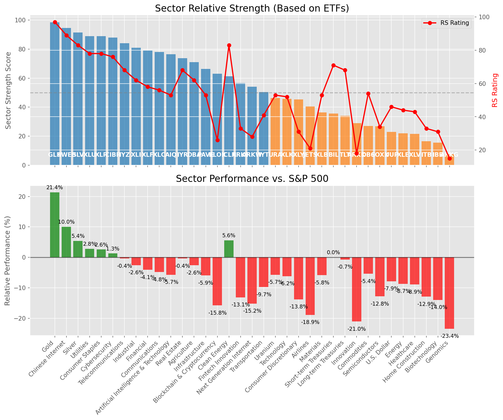

# **Daily Relative Strength Report**

**Date:** 2025-05-06

## **Market Valuation (Buffett Indicator)**

| Metric | Value |
|--------|-------|
| **Market Valuation** | **Fair Valued** |
| **Current Ratio** | 9.18 |
| **Historical Mean** | 9.43 |
| **Standard Deviation** | 0.51 |
| **Z-Score (StdDev from Mean)** | -0.36 |
| **Total Market Cap** | $275.13 trillion |
| **GDP** | $29.98 trillion |

## **Market Insights**

### **Market is Fairly Valued**

The market appears to be trading within a reasonable range of historical valuations. This suggests a balanced approach to equity investing is appropriate. Investors should:

- Focus on individual stock selection based on fundamentals and technicals
- Maintain normal equity allocations aligned with long-term goals
- Pay attention to sector rotation and relative strength
- Watch for changes in market leadership

Fair valuation typically suggests normal market returns can be expected, with stock selection becoming increasingly important.

### **Buffett Indicator Overview**

The Buffett Indicator (Total Market Cap / GDP) is a measure of the stock market's valuation relative to the size of the economy. It is named after Warren Buffett, who described it as "probably the best single measure of where valuations stand at any given moment."

- **Values above +2 standard deviations:** Market significantly overvalued
- **Values above +1 standard deviation:** Market overvalued
- **Values between -1 and +1 standard deviations:** Market fairly valued
- **Values below -1 standard deviation:** Market undervalued
- **Values below -2 standard deviations:** Market significantly undervalued

---

## **Sector Relative Strength**

Based on William O'Neil's Relative Strength Methodology

| ETF | Strength | RS Rating | Performance | Above Key MAs | Trend | Sector |
|-----|----------|-----------|-------------|--------------|-------|--------|
| [GLD](https://www.tradingview.com/chart/?symbol=GLD) | 98.5 | 97.0 | 19.83% | 10d ✓, 50d ✓, 200d ✓ | ↗️ | Gold |
| [KWEB](https://www.tradingview.com/chart/?symbol=KWEB) | 93.0 | 86.0 | 6.61% | 10d ✓, 50d ✓, 200d ✓ | ↗️ | Chinese Internet |
| [XLU](https://www.tradingview.com/chart/?symbol=XLU) | 91.0 | 82.0 | 4.03% | 10d ✓, 50d ✓, 200d ✓ | ↗️ | Utilities |
| [XLP](https://www.tradingview.com/chart/?symbol=XLP) | 90.5 | 81.0 | 3.48% | 10d ✓, 50d ✓, 200d ✓ | ↗️ | Consumer Staples |
| [SLV](https://www.tradingview.com/chart/?symbol=SLV) | 90.0 | 80.0 | 3.11% | 10d ✓, 50d ✓, 200d ✓ | ↗️ | Silver |
| [CIBR](https://www.tradingview.com/chart/?symbol=CIBR) | 85.0 | 70.0 | -0.22% | 10d ✓, 50d ✓, 200d ✓ | ↗️ | Cybersecurity |
| [IYZ](https://www.tradingview.com/chart/?symbol=IYZ) | 83.5 | 67.0 | -1.16% | 10d ✓, 50d ✓, 200d ✓ | ↗️ | Telecommunications |
| [XLI](https://www.tradingview.com/chart/?symbol=XLI) | 81.5 | 63.0 | -2.77% | 10d ✓, 50d ✓, 200d ✓ | ↗️ | Industrial |
| [XLF](https://www.tradingview.com/chart/?symbol=XLF) | 80.5 | 61.0 | -3.63% | 10d ✓, 50d ✓, 200d ✓ | ↗️ | Financial |
| [XLC](https://www.tradingview.com/chart/?symbol=XLC) | 77.0 | 54.0 | -5.85% | 10d ✓, 50d ✓, 200d ✓ | ↗️ | Communications |
| [IYR](https://www.tradingview.com/chart/?symbol=IYR) | 74.3 | 69.0 | -0.53% | 10d ✓, 50d ✓, 200d ✗ | ↗️ | Real Estate |
| [AIQ](https://www.tradingview.com/chart/?symbol=AIQ) | 74.0 | 48.0 | -7.77% | 10d ✓, 50d ✓, 200d ✓ | ↗️ | Artificial Intelligence & Technology |
| [DBA](https://www.tradingview.com/chart/?symbol=DBA) | 71.6 | 63.0 | -2.73% | 10d ✗, 50d ✓, 200d ✓ | ↗️ | Agriculture |
| [PAVE](https://www.tradingview.com/chart/?symbol=PAVE) | 66.3 | 53.0 | -6.07% | 10d ✓, 50d ✓, 200d ✗ | ↗️ | Infrastructure |
| [ICLN](https://www.tradingview.com/chart/?symbol=ICLN) | 60.8 | 82.0 | 4.31% | 10d ✓, 50d ✓, 200d ✗ | ↘️ | Clean Energy |
| [ARKW](https://www.tradingview.com/chart/?symbol=ARKW) | 55.6 | 31.0 | -14.57% | 10d ✗, 50d ✓, 200d ✓ | ↗️ | Next Generation Internet |
| [ARKF](https://www.tradingview.com/chart/?symbol=ARKF) | 55.1 | 30.0 | -14.77% | 10d ✗, 50d ✓, 200d ✓ | ↗️ | Fintech Innovation |
| [BLOK](https://www.tradingview.com/chart/?symbol=BLOK) | 52.8 | 26.0 | -16.67% | 10d ✓, 50d ✓, 200d ✗ | ↗️ | Blockchain & Cryptocurrency |
| [IYT](https://www.tradingview.com/chart/?symbol=IYT) | 49.4 | 39.0 | -11.29% | 10d ✓, 50d ✗, 200d ✗ | ↗️ | Transportation |
| [XLY](https://www.tradingview.com/chart/?symbol=XLY) | 44.9 | 30.0 | -14.87% | 10d ✓, 50d ✗, 200d ✗ | ↗️ | Consumer Discretionary |
| [XLK](https://www.tradingview.com/chart/?symbol=XLK) | 44.3 | 49.0 | -7.47% | 10d ✓, 50d ✓, 200d ✗ | ↘️ | Technology |
| [JETS](https://www.tradingview.com/chart/?symbol=JETS) | 39.9 | 20.0 | -20.06% | 10d ✓, 50d ✗, 200d ✗ | ↗️ | Airlines |
| [URA](https://www.tradingview.com/chart/?symbol=URA) | 38.8 | 38.0 | -11.57% | 10d ✓, 50d ✓, 200d ✗ | ↘️ | Uranium |
| [DBC](https://www.tradingview.com/chart/?symbol=DBC) | 37.4 | 55.0 | -5.56% | 10d ✓, 50d ✗, 200d ✗ | ↘️ | Commodities |
| [XLB](https://www.tradingview.com/chart/?symbol=XLB) | 36.4 | 53.0 | -6.19% | 10d ✓, 50d ✗, 200d ✗ | ↘️ | Materials |
| [BIL](https://www.tradingview.com/chart/?symbol=BIL) | 36.0 | 72.0 | 0.03% | 10d ✗, 50d ✗, 200d ✗ | ↘️ | Short-term Treasuries |
| [TLT](https://www.tradingview.com/chart/?symbol=TLT) | 33.5 | 67.0 | -1.30% | 10d ✗, 50d ✗, 200d ✗ | ↘️ | Long-term Treasuries |
| [ARKK](https://www.tradingview.com/chart/?symbol=ARKK) | 28.0 | 16.0 | -22.84% | 10d ✗, 50d ✗, 200d ✗ | ↗️ | Innovation |
| [SOXX](https://www.tradingview.com/chart/?symbol=SOXX) | 25.9 | 32.0 | -13.90% | 10d ✓, 50d ✗, 200d ✗ | ↘️ | Semiconductors |
| [UUP](https://www.tradingview.com/chart/?symbol=UUP) | 25.5 | 51.0 | -6.89% | 10d ✗, 50d ✗, 200d ✗ | ↘️ | U.S. Dollar |
| [XLV](https://www.tradingview.com/chart/?symbol=XLV) | 22.5 | 45.0 | -8.71% | 10d ✗, 50d ✗, 200d ✗ | ↘️ | Healthcare |
| [XLE](https://www.tradingview.com/chart/?symbol=XLE) | 20.0 | 40.0 | -10.57% | 10d ✗, 50d ✗, 200d ✗ | ↘️ | Energy |
| [ITB](https://www.tradingview.com/chart/?symbol=ITB) | 16.5 | 33.0 | -13.53% | 10d ✗, 50d ✗, 200d ✗ | ↘️ | Home Construction |
| [IBB](https://www.tradingview.com/chart/?symbol=IBB) | 15.5 | 31.0 | -14.55% | 10d ✗, 50d ✗, 200d ✗ | ↘️ | Biotechnology |
| [ARKG](https://www.tradingview.com/chart/?symbol=ARKG) | 7.5 | 15.0 | -23.73% | 10d ✗, 50d ✗, 200d ✗ | ↘️ | Genomics |

### **Sector ETF Performance Interpretation**

This table shows the relative strength metrics for different market sectors based on their representative ETFs:

- **ETF**: The ETF used to measure sector performance (click for chart)
- **Strength**: Overall sector strength score (0-100) combining multiple factors
- **RS Rating**: O'Neil RS rating of the sector ETF
- **Performance**: Performance of the sector ETF relative to SPY
- **Above Key MAs**: Whether the ETF is trading above its 10, 50, and 200-day moving averages
- **Trend**: Whether the sector is in an uptrend (↗️) or downtrend (↘️)

### **Current Sector Leadership**

The current market leadership is coming from the following sectors: **Gold, Chinese Internet, Utilities**.

The **Gold** sector (represented by **GLD**) is showing particularly strong relative strength with an RS rating of 97.0 and performance of 19.83% vs. the S&P 500. This sector is trading above its 10-day, 50-day, 200-day moving average(s). Investors should consider focusing on high RS stocks within these leading sectors for potential outperformance.

---

## **Buy Recommendations**

The following 109 stocks show exceptional relative strength:

| RS Rating | Buy Score | Current Price | Chart | Name | Ticker |
|-----------|-----------|---------------|-------|------|--------|
| 100 | 100 | $54.60 | [Chart](https://www.tradingview.com/chart/?symbol=SEZL) | Sezzle Inc. Common Stock | SEZL |
| 100 | 100 | $19.57 | [Chart](https://www.tradingview.com/chart/?symbol=SPNT) | SiriusPoint Ltd. | SPNT |
| 100 | 100 | $154.01 | [Chart](https://www.tradingview.com/chart/?symbol=PLMR) | Palomar Holdings, Inc. Common stock | PLMR |
| 100 | 100 | $149.95 | [Chart](https://www.tradingview.com/chart/?symbol=UGL) | ProShares Ultra Gold | UGL |
| 100 | 100 | $26.82 | [Chart](https://www.tradingview.com/chart/?symbol=DB) | Deutsche Bank Aktiengesellschaft | DB |
| 99 | 100 | $182.91 | [Chart](https://www.tradingview.com/chart/?symbol=RGLD) | Royal Gold Inc | RGLD |
| 99 | 100 | $92.62 | [Chart](https://www.tradingview.com/chart/?symbol=SNEX) | StoneX Group Inc. Common Stock | SNEX |
| 99 | 100 | $84.67 | [Chart](https://www.tradingview.com/chart/?symbol=WPM) | Wheaton Precious Metals Corp. Common Stock | WPM |
| 99 | 100 | $490.13 | [Chart](https://www.tradingview.com/chart/?symbol=DUOL) | Duolingo, Inc. Class A Common Stock | DUOL |
| 99 | 100 | $282.45 | [Chart](https://www.tradingview.com/chart/?symbol=VRSN) | VeriSign Inc | VRSN |
| 99 | 100 | $173.81 | [Chart](https://www.tradingview.com/chart/?symbol=PM) | Philip Morris International Inc. | PM |
| 99 | 100 | $68.06 | [Chart](https://www.tradingview.com/chart/?symbol=ULS) | UL Solutions Inc. | ULS |
| 99 | 100 | $46.06 | [Chart](https://www.tradingview.com/chart/?symbol=MRX) | Marex Group plc Ordinary Shares | MRX |
| 99 | 100 | $166.75 | [Chart](https://www.tradingview.com/chart/?symbol=AGX) | Argan, Inc | AGX |
| 98 | 100 | $170.50 | [Chart](https://www.tradingview.com/chart/?symbol=FNV) | Franco-Nevada Corporation | FNV |
| 98 | 100 | $118.62 | [Chart](https://www.tradingview.com/chart/?symbol=AEM) | Agnico Eagle Mines Ltd. | AEM |
| 98 | 100 | $41.09 | [Chart](https://www.tradingview.com/chart/?symbol=EWP) | iShares MSCI Spain ETF | EWP |
| 98 | 100 | $58.63 | [Chart](https://www.tradingview.com/chart/?symbol=SKWD) | Skyward Specialty Insurance Group, Inc. Common Stock | SKWD |
| 98 | 100 | $229.76 | [Chart](https://www.tradingview.com/chart/?symbol=TTWO) | Take-Two Interactive Software Inc | TTWO |
| 98 | 100 | $23.99 | [Chart](https://www.tradingview.com/chart/?symbol=OR) | Osisko Gold Royalties Ltd | OR |
| 98 | 100 | $155.60 | [Chart](https://www.tradingview.com/chart/?symbol=HWM) | Howmet Aerospace Inc. | HWM |
| 98 | 100 | $23.06 | [Chart](https://www.tradingview.com/chart/?symbol=CXW) | CoreCivic, Inc. | CXW |
| 97 | 100 | $314.56 | [Chart](https://www.tradingview.com/chart/?symbol=GLD) | SPDR Gold Trust, SPDR Gold Shares | GLD |
| 97 | 100 | $34.02 | [Chart](https://www.tradingview.com/chart/?symbol=IAUM) | iShares Gold Trust Micro | IAUM |
| 97 | 100 | $151.35 | [Chart](https://www.tradingview.com/chart/?symbol=CAH) | Cardinal Health, Inc. | CAH |
| 97 | 100 | $64.37 | [Chart](https://www.tradingview.com/chart/?symbol=IAU) | iShares Gold Trust | IAU |
| 97 | 100 | $72.61 | [Chart](https://www.tradingview.com/chart/?symbol=WRB) | W.R. Berkley Corporation | WRB |
| 97 | 100 | $30.55 | [Chart](https://www.tradingview.com/chart/?symbol=EUFN) | iShares MSCI Europe Financials ETF | EUFN |
| 96 | 100 | $20.09 | [Chart](https://www.tradingview.com/chart/?symbol=KT) | KT Corp. | KT |
| 96 | 100 | $285.14 | [Chart](https://www.tradingview.com/chart/?symbol=CME) | CME Group Inc. | CME |
| 96 | 100 | $41.36 | [Chart](https://www.tradingview.com/chart/?symbol=DRS) | Leonardo DRS, Inc. Common Stock | DRS |
| 96 | 100 | $22.54 | [Chart](https://www.tradingview.com/chart/?symbol=LAUR) | Laureate Education, Inc. Common Stock | LAUR |
| 96 | 100 | $26.07 | [Chart](https://www.tradingview.com/chart/?symbol=PHYS) | Sprott Physical Gold Trust | PHYS |
| 96 | 100 | $70.13 | [Chart](https://www.tradingview.com/chart/?symbol=VRNA) | Verona Pharma plc | VRNA |
| 96 | 100 | $40.62 | [Chart](https://www.tradingview.com/chart/?symbol=EWG) | iShares MSCI Germany ETF | EWG |
| 95 | 100 | $116.38 | [Chart](https://www.tradingview.com/chart/?symbol=EHC) | Encompass Health Corporation Common Stock | EHC |
| 95 | 100 | $156.75 | [Chart](https://www.tradingview.com/chart/?symbol=LRN) | Stride, Inc. | LRN |
| 95 | 100 | $1140.46 | [Chart](https://www.tradingview.com/chart/?symbol=NFLX) | NetFlix Inc | NFLX |
| 95 | 100 | $90.47 | [Chart](https://www.tradingview.com/chart/?symbol=CCEP) | Coca-Cola Europacific Partners plc Ordinary Shares | CCEP |
| 95 | 100 | $60.51 | [Chart](https://www.tradingview.com/chart/?symbol=MO) | Altria Group, Inc. | MO |
| 95 | 100 | $80.58 | [Chart](https://www.tradingview.com/chart/?symbol=OGS) | ONE GAS, INC. | OGS |
| 95 | 100 | $212.91 | [Chart](https://www.tradingview.com/chart/?symbol=IDCC) | InterDigital, Inc. | IDCC |
| 95 | 100 | $28.13 | [Chart](https://www.tradingview.com/chart/?symbol=T) | AT&T Inc. | T |
| 95 | 100 | $101.48 | [Chart](https://www.tradingview.com/chart/?symbol=RBA) | RB Global, Inc. | RBA |
| 95 | 100 | $50.78 | [Chart](https://www.tradingview.com/chart/?symbol=GFL) | GFL Environmental Inc. Subordinate Voting Shares | GFL |
| 95 | 100 | $142.58 | [Chart](https://www.tradingview.com/chart/?symbol=SE) | Sea Limited American Depositary Shares, each representing one Class A Ordinary Share | SE |
| 94 | 100 | $161.76 | [Chart](https://www.tradingview.com/chart/?symbol=ATO) | Atmos Energy Corporation | ATO |
| 94 | 100 | $117.67 | [Chart](https://www.tradingview.com/chart/?symbol=COOP) | Mr. Cooper Group Inc. Common Stock | COOP |
| 94 | 100 | $116.66 | [Chart](https://www.tradingview.com/chart/?symbol=VSEC) | VSE Corp | VSEC |
| 94 | 100 | $137.95 | [Chart](https://www.tradingview.com/chart/?symbol=DTE) | DTE Energy Company | DTE |
| 94 | 100 | $143.55 | [Chart](https://www.tradingview.com/chart/?symbol=TW) | Tradeweb Markets Inc. Class A Common Stock | TW |
| 94 | 100 | $72.80 | [Chart](https://www.tradingview.com/chart/?symbol=KR) | The Kroger Co. | KR |
| 94 | 100 | $250.49 | [Chart](https://www.tradingview.com/chart/?symbol=RSG) | Republic Services Inc. | RSG |
| 94 | 100 | $32.49 | [Chart](https://www.tradingview.com/chart/?symbol=AHR) | American Healthcare REIT, Inc. | AHR |
| 93 | 100 | $81.95 | [Chart](https://www.tradingview.com/chart/?symbol=NFG) | National Fuel Gas Co. | NFG |
| 92 | 100 | $64.22 | [Chart](https://www.tradingview.com/chart/?symbol=FNF) | Fidelity National Financial, Inc. | FNF |
| 92 | 100 | $27.43 | [Chart](https://www.tradingview.com/chart/?symbol=FMS) | Fresenius Medical Care AG | FMS |
| 92 | 100 | $119.67 | [Chart](https://www.tradingview.com/chart/?symbol=CWST) | Casella Waste Systems Inc | CWST |
| 92 | 100 | $397.86 | [Chart](https://www.tradingview.com/chart/?symbol=GEV) | GE Vernova Inc. | GEV |
| 92 | 100 | $466.38 | [Chart](https://www.tradingview.com/chart/?symbol=CASY) | Casey's General Stores Inc | CASY |
| 92 | 100 | $73.78 | [Chart](https://www.tradingview.com/chart/?symbol=CMS) | CMS Energy Corporation | CMS |
| 92 | 100 | $233.21 | [Chart](https://www.tradingview.com/chart/?symbol=CBOE) | Cboe Global Markets, Inc. | CBOE |
| 92 | 100 | $42.22 | [Chart](https://www.tradingview.com/chart/?symbol=HMN) | Horace Mann Educators Corporation | HMN |
| 91 | 100 | $25.05 | [Chart](https://www.tradingview.com/chart/?symbol=EWS) | iShares MSCI Singapore ETF | EWS |
| 91 | 100 | $16.14 | [Chart](https://www.tradingview.com/chart/?symbol=BCS) | Barclays PLC | BCS |
| 91 | 100 | $108.20 | [Chart](https://www.tradingview.com/chart/?symbol=AEP) | American Electric Power Company, Inc. | AEP |
| 91 | 100 | $123.76 | [Chart](https://www.tradingview.com/chart/?symbol=DUK) | Duke Energy Corporation | DUK |
| 91 | 100 | $99.92 | [Chart](https://www.tradingview.com/chart/?symbol=AXS) | Axis Capital Holders Limited | AXS |
| 91 | 100 | $54.90 | [Chart](https://www.tradingview.com/chart/?symbol=RELX) | RELX PLC | RELX |
| 91 | 100 | $5191.12 | [Chart](https://www.tradingview.com/chart/?symbol=BKNG) | Booking Holdings Inc. Common Stock | BKNG |
| 91 | 100 | $175.44 | [Chart](https://www.tradingview.com/chart/?symbol=ICE) | Intercontinental Exchange  Inc. | ICE |
| 91 | 100 | $44.63 | [Chart](https://www.tradingview.com/chart/?symbol=BTI) | British American Tobacco p.l.c. American Depositary Shares, American Depositary Shares, each representing one Ordinary Share | BTI |
| 90 | 100 | $168.36 | [Chart](https://www.tradingview.com/chart/?symbol=THG) | The Hanover Insurance Group, Inc. | THG |
| 90 | 100 | $56.75 | [Chart](https://www.tradingview.com/chart/?symbol=HSBC) | HSBC Holdings PLC | HSBC |
| 90 | 100 | $200.71 | [Chart](https://www.tradingview.com/chart/?symbol=BAP) | Credicorp LTD | BAP |
| 90 | 100 | $267.56 | [Chart](https://www.tradingview.com/chart/?symbol=TRV) | The Travelers Companies, Inc. | TRV |
| 90 | 100 | $60.60 | [Chart](https://www.tradingview.com/chart/?symbol=CHEF) | The Chef's Warehouse Inc | CHEF |
| 89 | 100 | $209.03 | [Chart](https://www.tradingview.com/chart/?symbol=CRS) | Carpenter Technology Corp | CRS |
| 89 | 100 | $107.00 | [Chart](https://www.tradingview.com/chart/?symbol=DAVE) | Dave Inc. Class A Common Stock | DAVE |
| 89 | 100 | $17.43 | [Chart](https://www.tradingview.com/chart/?symbol=AM) | Antero Midstream Corporation Common Stock | AM |
| 89 | 100 | $50.64 | [Chart](https://www.tradingview.com/chart/?symbol=TRP) | TC Energy Corporation | TRP |
| 88 | 100 | $31.27 | [Chart](https://www.tradingview.com/chart/?symbol=SLM) | SLM Corporation | SLM |
| 88 | 100 | $150.39 | [Chart](https://www.tradingview.com/chart/?symbol=WELL) | Welltower Inc. | WELL |
| 88 | 100 | $337.88 | [Chart](https://www.tradingview.com/chart/?symbol=AJG) | Arthur J. Gallagher & Co. | AJG |
| 88 | 100 | $69.47 | [Chart](https://www.tradingview.com/chart/?symbol=EVRG) | Evergy, Inc. | EVRG |
| 88 | 100 | $36.26 | [Chart](https://www.tradingview.com/chart/?symbol=PPL) | PPL Corporation | PPL |
| 87 | 100 | $45.30 | [Chart](https://www.tradingview.com/chart/?symbol=OGE) | OGE Energy Corp. | OGE |
| 86 | 99 | $168.00 | [Chart](https://www.tradingview.com/chart/?symbol=TKO) | TKO Group Holdings, Inc. | TKO |
| 86 | 99 | $297.16 | [Chart](https://www.tradingview.com/chart/?symbol=SAP) | SAP SE | SAP |
| 88 | 98 | $35.04 | [Chart](https://www.tradingview.com/chart/?symbol=PAY) | Paymentus Holdings, Inc. | PAY |
| 88 | 98 | $57.55 | [Chart](https://www.tradingview.com/chart/?symbol=IGF) | iShares Global Infrastructure ETF | IGF |
| 84 | 97 | $71.10 | [Chart](https://www.tradingview.com/chart/?symbol=XEL) | Xcel Energy, Inc. | XEL |
| 86 | 96 | $164.27 | [Chart](https://www.tradingview.com/chart/?symbol=MAA) | Mid-America Apartment Communities, Inc. | MAA |
| 83 | 96 | $31.97 | [Chart](https://www.tradingview.com/chart/?symbol=LTH) | Life Time Group Holdings, Inc. | LTH |
| 83 | 96 | $79.44 | [Chart](https://www.tradingview.com/chart/?symbol=UNM) | Unum Group | UNM |
| 82 | 96 | $99.63 | [Chart](https://www.tradingview.com/chart/?symbol=AEE) | Ameren Corporation | AEE |
| 85 | 95 | $76.72 | [Chart](https://www.tradingview.com/chart/?symbol=ADC) | Agree Realty Corporation | ADC |
| 84 | 95 | $201.63 | [Chart](https://www.tradingview.com/chart/?symbol=ALL) | The Allstate Corporation | ALL |
| 82 | 95 | $112.01 | [Chart](https://www.tradingview.com/chart/?symbol=ATGE) | Adtalem Global Education Inc. Common Shares | ATGE |
| 82 | 95 | $107.36 | [Chart](https://www.tradingview.com/chart/?symbol=FTNT) | Fortinet, Inc. | FTNT |
| 84 | 94 | $197.86 | [Chart](https://www.tradingview.com/chart/?symbol=WCN) | Waste Connections, Inc. | WCN |
| 84 | 94 | $41.93 | [Chart](https://www.tradingview.com/chart/?symbol=FHI) | Federated Hermes, Inc. | FHI |
| 82 | 94 | $35.83 | [Chart](https://www.tradingview.com/chart/?symbol=KTOS) | Kratos Defense & Security Solutions, Inc. | KTOS |
| 82 | 94 | $69.91 | [Chart](https://www.tradingview.com/chart/?symbol=EBAY) | eBay Inc | EBAY |
| 83 | 93 | $31.19 | [Chart](https://www.tradingview.com/chart/?symbol=MFC) | Manulife Financial Corp. | MFC |
| 82 | 93 | $184.82 | [Chart](https://www.tradingview.com/chart/?symbol=LOPE) | Grand Canyon Education, Inc | LOPE |
| 80 | 93 | $234.68 | [Chart](https://www.tradingview.com/chart/?symbol=LNG) | Cheniere Energy Inc | LNG |
| 81 | 91 | $109.17 | [Chart](https://www.tradingview.com/chart/?symbol=OLLI) | Ollie's Bargain Outlet Holdings, Inc. Common Stock | OLLI |
| 80 | 91 | $40.42 | [Chart](https://www.tradingview.com/chart/?symbol=AB) | AllianceBernstein Holding, L.P. | AB |

---

## **Sell Recommendations**

The following 131 stocks show deteriorating relative strength:

| RS Rating | Sell Score | Current Price | Chart | Name | Ticker |
|-----------|------------|---------------|-------|------|--------|
| 1 | 100 | $10.00 | [Chart](https://www.tradingview.com/chart/?symbol=NRIX) | Nurix Therapeutics, Inc. Common stock | NRIX |
| 1 | 100 | $15.36 | [Chart](https://www.tradingview.com/chart/?symbol=ZVZZT) | SUPER Montage TEST SYMBOL | ZVZZT |
| 2 | 100 | $48.71 | [Chart](https://www.tradingview.com/chart/?symbol=LABU) | Direxion Daily S&P Biotech Bull 3X Shares | LABU |
| 2 | 100 | $27.42 | [Chart](https://www.tradingview.com/chart/?symbol=CIVI) | Civitas Resources, Inc. | CIVI |
| 2 | 100 | $117.95 | [Chart](https://www.tradingview.com/chart/?symbol=GLOB) | GLOBANT S.A. | GLOB |
| 2 | 100 | $20.23 | [Chart](https://www.tradingview.com/chart/?symbol=GCO) | Genesco Inc. | GCO |
| 3 | 100 | $18.61 | [Chart](https://www.tradingview.com/chart/?symbol=DAVA) | Endava plc American Depositary Shares (each representing one Class A Ordinary Share) | DAVA |
| 3 | 100 | $17.48 | [Chart](https://www.tradingview.com/chart/?symbol=SSTK) | SHUTTERSTOCK, INC. | SSTK |
| 3 | 100 | $68.75 | [Chart](https://www.tradingview.com/chart/?symbol=ANF) | Abercrombie & Fitch Co. | ANF |
| 4 | 100 | $24.04 | [Chart](https://www.tradingview.com/chart/?symbol=RPD) | Rapid7, Inc. Common Stock | RPD |
| 4 | 100 | $20.86 | [Chart](https://www.tradingview.com/chart/?symbol=SPT) | Sprout Social, Inc Class A Common Stock | SPT |
| 4 | 100 | $13.43 | [Chart](https://www.tradingview.com/chart/?symbol=DV) | DoubleVerify Holdings, Inc. | DV |
| 4 | 100 | $74.86 | [Chart](https://www.tradingview.com/chart/?symbol=ILMN) | Illumina Inc | ILMN |
| 5 | 100 | $13.63 | [Chart](https://www.tradingview.com/chart/?symbol=ODP) | The ODP Corporation Common Stock | ODP |
| 5 | 100 | $26.32 | [Chart](https://www.tradingview.com/chart/?symbol=JACK) | Jack in the Box Inc. | JACK |
| 5 | 100 | $28.50 | [Chart](https://www.tradingview.com/chart/?symbol=SPHR) | Sphere Entertainment Co. | SPHR |
| 5 | 100 | $21.57 | [Chart](https://www.tradingview.com/chart/?symbol=AI) | C3.ai, Inc. | AI |
| 5 | 100 | $11.19 | [Chart](https://www.tradingview.com/chart/?symbol=ARCT) | Arcturus Therapeutics Holdings Inc. Common Stock | ARCT |
| 6 | 100 | $13.55 | [Chart](https://www.tradingview.com/chart/?symbol=GCT) | GigaCloud Technology Inc Class A Ordinary Shares | GCT |
| 7 | 100 | $10.64 | [Chart](https://www.tradingview.com/chart/?symbol=DYN) | Dyne Therapeutics, Inc. Common Stock | DYN |
| 8 | 100 | $15.55 | [Chart](https://www.tradingview.com/chart/?symbol=DXC) | DXC Technology Company | DXC |
| 8 | 100 | $93.12 | [Chart](https://www.tradingview.com/chart/?symbol=TGT) | Target Corporation | TGT |
| 9 | 100 | $13.08 | [Chart](https://www.tradingview.com/chart/?symbol=DQ) | Daqo New Energy Corp. American Depositary Shares (each representing 5 Ordinary Shares) | DQ |
| 9 | 100 | $34.47 | [Chart](https://www.tradingview.com/chart/?symbol=CYTK) | Cytokinetics Inc. | CYTK |
| 10 | 100 | $13.45 | [Chart](https://www.tradingview.com/chart/?symbol=MNRO) | Monro, Inc. Common Stock | MNRO |
| 10 | 100 | $28.01 | [Chart](https://www.tradingview.com/chart/?symbol=SRDX) | Surmodics, Inc. Common Stock | SRDX |
| 11 | 100 | $31.53 | [Chart](https://www.tradingview.com/chart/?symbol=UWM) | ProShares Ultra Russell2000 | UWM |
| 12 | 100 | $11.25 | [Chart](https://www.tradingview.com/chart/?symbol=JAMF) | Jamf Holding Corp. Common Stock | JAMF |
| 8 | 99 | $24.74 | [Chart](https://www.tradingview.com/chart/?symbol=AA) | Alcoa Corporation | AA |
| 14 | 99 | $59.26 | [Chart](https://www.tradingview.com/chart/?symbol=AMWD) | American Woodmark Corp | AMWD |
| 13 | 98 | $16.06 | [Chart](https://www.tradingview.com/chart/?symbol=MLKN) | MillerKnoll, Inc. Common Stock | MLKN |
| 15 | 97 | $62.50 | [Chart](https://www.tradingview.com/chart/?symbol=SPB) | Spectrum Brands Holdings, Inc. | SPB |
| 15 | 97 | $11.49 | [Chart](https://www.tradingview.com/chart/?symbol=M) | Macy's Inc. | M |
| 7 | 96 | $12.20 | [Chart](https://www.tradingview.com/chart/?symbol=BAND) | Bandwidth Inc. Class A Common Stock | BAND |
| 10 | 96 | $10.31 | [Chart](https://www.tradingview.com/chart/?symbol=VREX) | Varex Imaging Corporation Common Stock | VREX |
| 13 | 96 | $15.53 | [Chart](https://www.tradingview.com/chart/?symbol=PENN) | PENN Entertainment, Inc. Common Stock | PENN |
| 5 | 95 | $10.02 | [Chart](https://www.tradingview.com/chart/?symbol=LSPD) | Lightspeed Commerce Inc. | LSPD |
| 7 | 95 | $57.90 | [Chart](https://www.tradingview.com/chart/?symbol=TECL) | Direxion Daily Technology Bull 3x Shares | TECL |
| 8 | 95 | $43.39 | [Chart](https://www.tradingview.com/chart/?symbol=RHI) | Robert Half Inc. | RHI |
| 14 | 95 | $12.95 | [Chart](https://www.tradingview.com/chart/?symbol=NVGS) | NAVIGATOR HOLDINGS LTD. | NVGS |
| 14 | 95 | $20.09 | [Chart](https://www.tradingview.com/chart/?symbol=FOXF) | Fox Factory Holding Corp. Common Stock | FOXF |
| 15 | 95 | $101.92 | [Chart](https://www.tradingview.com/chart/?symbol=TOL) | Toll Brothers, Inc. | TOL |
| 16 | 95 | $31.18 | [Chart](https://www.tradingview.com/chart/?symbol=CRNX) | Crinetics Pharmaceuticals, Inc. | CRNX |
| 24 | 95 | $14.05 | [Chart](https://www.tradingview.com/chart/?symbol=FXN) | First Trust Energy AlphaDEX Fund | FXN |
| 10 | 94 | $10.77 | [Chart](https://www.tradingview.com/chart/?symbol=SONO) | Sonos, Inc. Common Stock | SONO |
| 11 | 94 | $12.63 | [Chart](https://www.tradingview.com/chart/?symbol=TRIP) | TripAdvisor, Inc. | TRIP |
| 16 | 94 | $57.33 | [Chart](https://www.tradingview.com/chart/?symbol=SYNA) | Synaptics Inc | SYNA |
| 17 | 94 | $25.80 | [Chart](https://www.tradingview.com/chart/?symbol=GDEN) | Golden Entertainment, Inc. Common Stock | GDEN |
| 24 | 94 | $10.74 | [Chart](https://www.tradingview.com/chart/?symbol=GES) | Guess?, Inc. | GES |
| 8 | 93 | $116.75 | [Chart](https://www.tradingview.com/chart/?symbol=DECK) | Deckers Outdoor Corp | DECK |
| 12 | 93 | $35.56 | [Chart](https://www.tradingview.com/chart/?symbol=CRC) | California Resources Corporation | CRC |
| 12 | 93 | $18.61 | [Chart](https://www.tradingview.com/chart/?symbol=OII) | Oceaneering International Inc. | OII |
| 14 | 93 | $40.82 | [Chart](https://www.tradingview.com/chart/?symbol=USD) | ProShares Ultra Semiconductors | USD |
| 17 | 93 | $12.01 | [Chart](https://www.tradingview.com/chart/?symbol=AEYE) | AudioEye, Inc. Common Stock | AEYE |
| 24 | 93 | $11.44 | [Chart](https://www.tradingview.com/chart/?symbol=KELYA) | Kelly Services Inc | KELYA |
| 14 | 92 | $29.00 | [Chart](https://www.tradingview.com/chart/?symbol=MBUU) | Malibu Boats, Inc. Class A | MBUU |
| 15 | 92 | $10.07 | [Chart](https://www.tradingview.com/chart/?symbol=SEMR) | SEMrush Holdings, Inc. | SEMR |
| 15 | 92 | $46.43 | [Chart](https://www.tradingview.com/chart/?symbol=ERX) | Direxion Daily Energy Bull 2X Shares | ERX |
| 19 | 92 | $15.27 | [Chart](https://www.tradingview.com/chart/?symbol=PSFE) | Paysafe Limited | PSFE |
| 12 | 91 | $37.32 | [Chart](https://www.tradingview.com/chart/?symbol=ASO) | Academy Sports and Outdoors, Inc. | ASO |
| 13 | 91 | $13.09 | [Chart](https://www.tradingview.com/chart/?symbol=MARA) | MARA Holdings, Inc. Common Stock | MARA |
| 14 | 91 | $26.45 | [Chart](https://www.tradingview.com/chart/?symbol=WSC) | WillScot Holdings Corporation Class A Common Stock | WSC |
| 16 | 91 | $16.32 | [Chart](https://www.tradingview.com/chart/?symbol=SVOL) | Simplify Volatility Premium ETF | SVOL |
| 20 | 91 | $53.12 | [Chart](https://www.tradingview.com/chart/?symbol=KBH) | KB Home | KBH |
| 14 | 90 | $75.87 | [Chart](https://www.tradingview.com/chart/?symbol=WHR) | Whirlpool Corp. | WHR |
| 16 | 90 | $10.08 | [Chart](https://www.tradingview.com/chart/?symbol=PACS) | PACS Group, Inc. | PACS |
| 19 | 90 | $12.01 | [Chart](https://www.tradingview.com/chart/?symbol=CIM) | Chimera Investment Corp. | CIM |
| 23 | 90 | $10.47 | [Chart](https://www.tradingview.com/chart/?symbol=GSBD) | Goldman Sachs BDC, Inc. | GSBD |
| 18 | 89 | $13.86 | [Chart](https://www.tradingview.com/chart/?symbol=ZIM) | ZIM Integrated Shipping Services Ltd. | ZIM |
| 18 | 88 | $10.03 | [Chart](https://www.tradingview.com/chart/?symbol=MTAL) | MAC Copper Limited | MTAL |
| 20 | 88 | $25.64 | [Chart](https://www.tradingview.com/chart/?symbol=HPQ) | HP Inc. | HPQ |
| 26 | 88 | $10.34 | [Chart](https://www.tradingview.com/chart/?symbol=CMRE) | Costamare Inc. | CMRE |
| 15 | 87 | $20.48 | [Chart](https://www.tradingview.com/chart/?symbol=ARKG) | ARK Genomic Revolution ETF | ARKG |
| 14 | 86 | $10.15 | [Chart](https://www.tradingview.com/chart/?symbol=HLIT) | Harmonic Inc | HLIT |
| 18 | 86 | $37.65 | [Chart](https://www.tradingview.com/chart/?symbol=NVDL) | GraniteShares ETF Trust GraniteShares 2x Long NVDA Daily ETF | NVDL |
| 24 | 86 | $12.30 | [Chart](https://www.tradingview.com/chart/?symbol=DBO) | Invesco DB Oil Fund | DBO |
| 30 | 86 | $34.61 | [Chart](https://www.tradingview.com/chart/?symbol=GFS) | GlobalFoundries Inc. Ordinary Shares | GFS |
| 18 | 85 | $186.50 | [Chart](https://www.tradingview.com/chart/?symbol=DKS) | Dick's Sporting Goods, Inc. | DKS |
| 17 | 84 | $66.32 | [Chart](https://www.tradingview.com/chart/?symbol=BBY) | Best Buy Company, Inc. | BBY |
| 20 | 84 | $193.29 | [Chart](https://www.tradingview.com/chart/?symbol=NVMI) | Nova Ltd. Ordinary Shares | NVMI |
| 26 | 84 | $34.88 | [Chart](https://www.tradingview.com/chart/?symbol=TECK) | Teck Resources Limited | TECK |
| 32 | 84 | $29.29 | [Chart](https://www.tradingview.com/chart/?symbol=TAN) | Invesco Solar ETF | TAN |
| 19 | 83 | $17.75 | [Chart](https://www.tradingview.com/chart/?symbol=INFY) | Infosys Limited American Depositary Shares | INFY |
| 23 | 83 | $10.56 | [Chart](https://www.tradingview.com/chart/?symbol=PBR.A) | Petroleo Brasileiro S.A.-Petrobras | PBR.A |
| 26 | 83 | $18.74 | [Chart](https://www.tradingview.com/chart/?symbol=PLAB) | Photronics Inc | PLAB |
| 28 | 83 | $21.61 | [Chart](https://www.tradingview.com/chart/?symbol=ST) | Sensata Technologies Holding plc | ST |
| 28 | 83 | $10.24 | [Chart](https://www.tradingview.com/chart/?symbol=BWLP) | BW LPG Limited | BWLP |
| 30 | 83 | $10.01 | [Chart](https://www.tradingview.com/chart/?symbol=XPRO) | Expro Group Holdings N.V. | XPRO |
| 31 | 83 | $13.10 | [Chart](https://www.tradingview.com/chart/?symbol=MED) | Medifast, Inc. | MED |
| 24 | 82 | $137.69 | [Chart](https://www.tradingview.com/chart/?symbol=MTN) | Vail Resorts, Inc. | MTN |
| 33 | 82 | $70.29 | [Chart](https://www.tradingview.com/chart/?symbol=TTC) | Toro Company (The) | TTC |
| 25 | 81 | $28.14 | [Chart](https://www.tradingview.com/chart/?symbol=AGIO) | Agios Pharmaceuticals, Inc. | AGIO |
| 27 | 81 | $10.41 | [Chart](https://www.tradingview.com/chart/?symbol=AVO) | Mission Produce, Inc. Common Stock | AVO |
| 20 | 80 | $113.80 | [Chart](https://www.tradingview.com/chart/?symbol=GNRC) | GENERAC HOLDINGS INC | GNRC |
| 29 | 78 | $33.85 | [Chart](https://www.tradingview.com/chart/?symbol=SQM) | Sociedad Quimica y Minera de Chile SA | SQM |
| 32 | 78 | $50.92 | [Chart](https://www.tradingview.com/chart/?symbol=LW) | Lamb Weston Holdings, Inc. | LW |
| 34 | 78 | $34.32 | [Chart](https://www.tradingview.com/chart/?symbol=PZZA) | Papa John's International Inc | PZZA |
| 26 | 77 | $152.95 | [Chart](https://www.tradingview.com/chart/?symbol=ODFL) | Old Dominion Freight Line | ODFL |
| 28 | 77 | $64.80 | [Chart](https://www.tradingview.com/chart/?symbol=DD) | DuPont de Nemours, Inc. Common Stock | DD |
| 30 | 77 | $42.46 | [Chart](https://www.tradingview.com/chart/?symbol=FEPI) | REX FANG & Innovation Equity Premium Income ETF | FEPI |
| 32 | 77 | $17.90 | [Chart](https://www.tradingview.com/chart/?symbol=JKS) | JINKOSOLAR HOLDINGS CO | JKS |
| 35 | 77 | $24.11 | [Chart](https://www.tradingview.com/chart/?symbol=AMRK) | A-Mark Precious Metals, Inc. | AMRK |
| 27 | 76 | $44.14 | [Chart](https://www.tradingview.com/chart/?symbol=PRKS) | United Parks & Resorts Inc. | PRKS |
| 32 | 76 | $16.51 | [Chart](https://www.tradingview.com/chart/?symbol=MLNK) | MeridianLink, Inc. | MLNK |
| 37 | 76 | $24.40 | [Chart](https://www.tradingview.com/chart/?symbol=NVDS) | Investment Managers Series Trust II Tradr 1.5X Short NVDA Daily ETF | NVDS |
| 38 | 76 | $20.08 | [Chart](https://www.tradingview.com/chart/?symbol=CSWC) | Capital Southwest Corp | CSWC |
| 28 | 75 | $19.70 | [Chart](https://www.tradingview.com/chart/?symbol=KMT) | Kennametal Inc. | KMT |
| 29 | 75 | $52.78 | [Chart](https://www.tradingview.com/chart/?symbol=ALRM) | Alarm.com Holdings, Inc. | ALRM |
| 29 | 75 | $18.07 | [Chart](https://www.tradingview.com/chart/?symbol=BSTZ) | BlackRock Science and Technology Term Trust | BSTZ |
| 33 | 75 | $91.17 | [Chart](https://www.tradingview.com/chart/?symbol=ITB) | iShares U.S. Home Construction ETF | ITB |
| 33 | 75 | $166.78 | [Chart](https://www.tradingview.com/chart/?symbol=IBP) | INSTALLED BUILDING PRODUCTS, INC. | IBP |
| 34 | 75 | $188.31 | [Chart](https://www.tradingview.com/chart/?symbol=NDSN) | Nordson Corp | NDSN |
| 34 | 75 | $14.16 | [Chart](https://www.tradingview.com/chart/?symbol=BMEZ) | BlackRock Health Sciences Term Trust | BMEZ |
| 28 | 74 | $25.29 | [Chart](https://www.tradingview.com/chart/?symbol=WY) | Weyerhaeuser Company | WY |
| 31 | 74 | $28.11 | [Chart](https://www.tradingview.com/chart/?symbol=CSX) | CSX Corporation | CSX |
| 36 | 74 | $26.99 | [Chart](https://www.tradingview.com/chart/?symbol=COLL) | Collegium Pharmaceutical, Inc. Common Stock | COLL |
| 28 | 73 | $28.12 | [Chart](https://www.tradingview.com/chart/?symbol=RNA) | Avidity Biosciences, Inc. Common Stock | RNA |
| 33 | 73 | $79.43 | [Chart](https://www.tradingview.com/chart/?symbol=VTWO) | Vanguard Russell 2000 ETF | VTWO |
| 37 | 73 | $19.21 | [Chart](https://www.tradingview.com/chart/?symbol=ELVN) | Enliven Therapeutics, Inc. Common Stock | ELVN |
| 30 | 72 | $213.15 | [Chart](https://www.tradingview.com/chart/?symbol=FDX) | FedEx Corporation | FDX |
| 37 | 72 | $12.98 | [Chart](https://www.tradingview.com/chart/?symbol=MTUS) | Metallus Inc. | MTUS |
| 30 | 71 | $74.03 | [Chart](https://www.tradingview.com/chart/?symbol=SLYV) | SPDR S&P 600 Small Cap Value ETF (based on S&P SmallCap 600 Value Index symbol--CVK) | SLYV |
| 34 | 71 | $15.56 | [Chart](https://www.tradingview.com/chart/?symbol=HQH) | abrdn Healthcare Investors | HQH |
| 31 | 70 | $74.24 | [Chart](https://www.tradingview.com/chart/?symbol=WFG) | West Fraser Timber Co. Ltd | WFG |
| 36 | 69 | $14.56 | [Chart](https://www.tradingview.com/chart/?symbol=RYLD) | Global X Russell 2000 Covered Call ETF | RYLD |
| 38 | 69 | $80.39 | [Chart](https://www.tradingview.com/chart/?symbol=MU) | Micron Technology, Inc. | MU |
| 38 | 69 | $66.35 | [Chart](https://www.tradingview.com/chart/?symbol=MMS) | MAXIMUS, Inc. | MMS |
| 35 | 68 | $53.70 | [Chart](https://www.tradingview.com/chart/?symbol=GEF) | Greif, Inc. | GEF |
| 39 | 68 | $160.55 | [Chart](https://www.tradingview.com/chart/?symbol=TXN) | Texas Instruments Incorporated | TXN |
| 36 | 67 | $72.67 | [Chart](https://www.tradingview.com/chart/?symbol=GMS) | GMS Inc. | GMS |
| 36 | 64 | $146.23 | [Chart](https://www.tradingview.com/chart/?symbol=IWN) | iShares Russell 2000 Value ETF | IWN |

## **Methodology**

This report uses William O'Neil's relative strength methodology from Investors Business Daily:

* **RS Rating**: Percentile rank of stock's performance vs. S&P 500 over the past 63 trading days (1-99 scale)
* **Buy Criteria**: RS Rating >= 80, price above 50-day MA, strong uptrend, increasing volume
* **Sell Criteria**: RS Rating < 40, price below 50-day MA, downtrend, decreasing volume

### **O'Neil's Key Principles**

1. **Focus on relative performance** - stocks outperforming the market
2. **Price trend confirmation** - stock must be in an uptrend
3. **Volume confirmation** - strong volume supports price moves
4. **Moving average validation** - price above key moving averages
5. **Market leaders only** - concentrate on top-performing stocks

*Report generated automatically after market close*