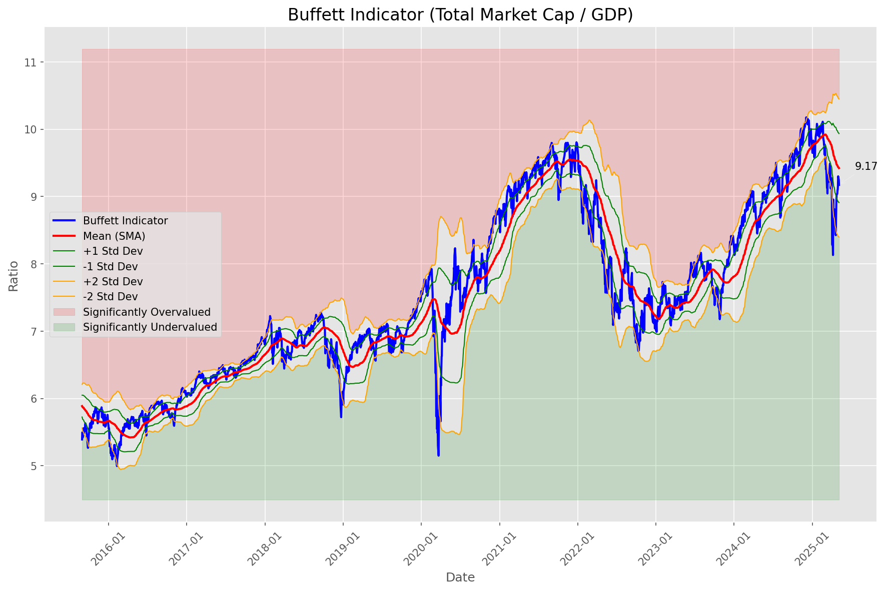
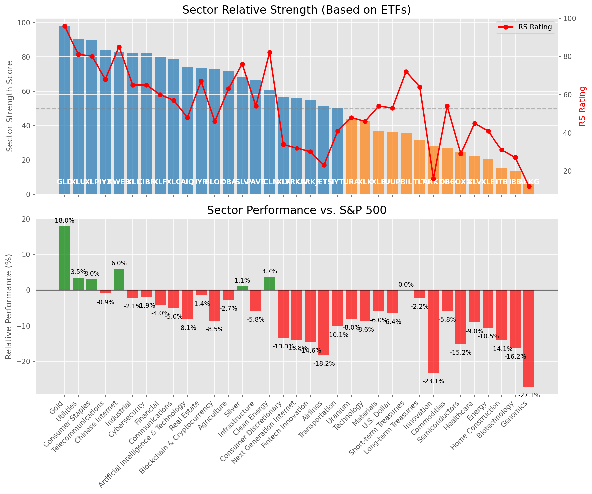

# **Daily Relative Strength Report**

**Date:** 2025-05-07

## **Market Valuation (Buffett Indicator)**

| Metric | Value |
|--------|-------|
| **Market Valuation** | **Fair Valued** |
| **Current Ratio** | 9.19 |
| **Historical Mean** | 9.42 |
| **Standard Deviation** | 0.51 |
| **Z-Score (StdDev from Mean)** | -0.49 |
| **Total Market Cap** | $275.39 trillion |
| **GDP** | $29.98 trillion |

## **Market Insights**

### **Market is Fairly Valued**

The market appears to be trading within a reasonable range of historical valuations. This suggests a balanced approach to equity investing is appropriate. Investors should:

- Focus on individual stock selection based on fundamentals and technicals
- Maintain normal equity allocations aligned with long-term goals
- Pay attention to sector rotation and relative strength
- Watch for changes in market leadership

Fair valuation typically suggests normal market returns can be expected, with stock selection becoming increasingly important.

### **Buffett Indicator Overview**

The Buffett Indicator (Total Market Cap / GDP) is a measure of the stock market's valuation relative to the size of the economy. It is named after Warren Buffett, who described it as "probably the best single measure of where valuations stand at any given moment."

- **Values above +2 standard deviations:** Market significantly overvalued
- **Values above +1 standard deviation:** Market overvalued
- **Values between -1 and +1 standard deviations:** Market fairly valued
- **Values below -1 standard deviation:** Market undervalued
- **Values below -2 standard deviations:** Market significantly undervalued

---

## **Sector Relative Strength**

Based on William O'Neil's Relative Strength Methodology

| ETF | Strength | RS Rating | Performance | Above Key MAs | Trend | Sector |
|-----|----------|-----------|-------------|--------------|-------|--------|
| [GLD](https://www.tradingview.com/chart/?symbol=GLD) | 98.0 | 96.0 | 17.42% | 10d ✓, 50d ✓, 200d ✓ | ↗️ | Gold |
| [XLU](https://www.tradingview.com/chart/?symbol=XLU) | 90.5 | 81.0 | 3.19% | 10d ✓, 50d ✓, 200d ✓ | ↗️ | Utilities |
| [XLP](https://www.tradingview.com/chart/?symbol=XLP) | 90.5 | 81.0 | 3.31% | 10d ✓, 50d ✓, 200d ✓ | ↗️ | Consumer Staples |
| [CIBR](https://www.tradingview.com/chart/?symbol=CIBR) | 83.0 | 66.0 | -1.88% | 10d ✓, 50d ✓, 200d ✓ | ↗️ | Cybersecurity |
| [KWEB](https://www.tradingview.com/chart/?symbol=KWEB) | 82.6 | 85.0 | 5.84% | 10d ✓, 50d ✗, 200d ✓ | ↗️ | Chinese Internet |
| [XLI](https://www.tradingview.com/chart/?symbol=XLI) | 82.5 | 65.0 | -2.10% | 10d ✓, 50d ✓, 200d ✓ | ↗️ | Industrial |
| [IYZ](https://www.tradingview.com/chart/?symbol=IYZ) | 82.0 | 64.0 | -2.62% | 10d ✓, 50d ✓, 200d ✓ | ↗️ | Telecommunications |
| [XLF](https://www.tradingview.com/chart/?symbol=XLF) | 80.0 | 60.0 | -4.08% | 10d ✓, 50d ✓, 200d ✓ | ↗️ | Financial |
| [XLC](https://www.tradingview.com/chart/?symbol=XLC) | 78.5 | 57.0 | -5.02% | 10d ✓, 50d ✓, 200d ✓ | ↗️ | Communications |
| [AIQ](https://www.tradingview.com/chart/?symbol=AIQ) | 74.0 | 48.0 | -8.04% | 10d ✓, 50d ✓, 200d ✓ | ↗️ | Artificial Intelligence & Technology |
| [BLOK](https://www.tradingview.com/chart/?symbol=BLOK) | 73.0 | 46.0 | -8.74% | 10d ✓, 50d ✓, 200d ✓ | ↗️ | Blockchain & Cryptocurrency |
| [IYR](https://www.tradingview.com/chart/?symbol=IYR) | 72.8 | 66.0 | -1.64% | 10d ✓, 50d ✓, 200d ✗ | ↗️ | Real Estate |
| [DBA](https://www.tradingview.com/chart/?symbol=DBA) | 71.1 | 62.0 | -3.08% | 10d ✗, 50d ✓, 200d ✓ | ↗️ | Agriculture |
| [PAVE](https://www.tradingview.com/chart/?symbol=PAVE) | 66.8 | 54.0 | -5.95% | 10d ✓, 50d ✓, 200d ✗ | ↗️ | Infrastructure |
| [SLV](https://www.tradingview.com/chart/?symbol=SLV) | 66.7 | 73.0 | 0.19% | 10d ✗, 50d ✗, 200d ✓ | ↗️ | Silver |
| [ARKF](https://www.tradingview.com/chart/?symbol=ARKF) | 65.5 | 31.0 | -14.55% | 10d ✓, 50d ✓, 200d ✓ | ↗️ | Fintech Innovation |
| [XLY](https://www.tradingview.com/chart/?symbol=XLY) | 57.3 | 35.0 | -13.22% | 10d ✓, 50d ✓, 200d ✗ | ↗️ | Consumer Discretionary |
| [ARKW](https://www.tradingview.com/chart/?symbol=ARKW) | 54.1 | 28.0 | -15.74% | 10d ✗, 50d ✓, 200d ✓ | ↗️ | Next Generation Internet |
| [JETS](https://www.tradingview.com/chart/?symbol=JETS) | 51.8 | 24.0 | -18.20% | 10d ✓, 50d ✓, 200d ✗ | ↗️ | Airlines |
| [IYT](https://www.tradingview.com/chart/?symbol=IYT) | 50.9 | 42.0 | -9.98% | 10d ✓, 50d ✗, 200d ✗ | ↗️ | Transportation |
| [ICLN](https://www.tradingview.com/chart/?symbol=ICLN) | 50.4 | 81.0 | 3.46% | 10d ✗, 50d ✓, 200d ✗ | ↘️ | Clean Energy |
| [URA](https://www.tradingview.com/chart/?symbol=URA) | 43.8 | 48.0 | -8.07% | 10d ✓, 50d ✓, 200d ✗ | ↘️ | Uranium |
| [XLK](https://www.tradingview.com/chart/?symbol=XLK) | 42.8 | 46.0 | -8.53% | 10d ✓, 50d ✓, 200d ✗ | ↘️ | Technology |
| [ARKK](https://www.tradingview.com/chart/?symbol=ARKK) | 38.4 | 17.0 | -22.69% | 10d ✗, 50d ✓, 200d ✗ | ↗️ | Innovation |
| [UUP](https://www.tradingview.com/chart/?symbol=UUP) | 36.9 | 54.0 | -6.21% | 10d ✓, 50d ✗, 200d ✗ | ↘️ | U.S. Dollar |
| [BIL](https://www.tradingview.com/chart/?symbol=BIL) | 36.0 | 72.0 | 0.02% | 10d ✗, 50d ✗, 200d ✗ | ↘️ | Short-term Treasuries |
| [TLT](https://www.tradingview.com/chart/?symbol=TLT) | 32.5 | 65.0 | -2.17% | 10d ✗, 50d ✗, 200d ✗ | ↘️ | Long-term Treasuries |
| [DBC](https://www.tradingview.com/chart/?symbol=DBC) | 26.5 | 53.0 | -6.26% | 10d ✗, 50d ✗, 200d ✗ | ↘️ | Commodities |
| [XLB](https://www.tradingview.com/chart/?symbol=XLB) | 26.5 | 53.0 | -6.42% | 10d ✗, 50d ✗, 200d ✗ | ↘️ | Materials |
| [SOXX](https://www.tradingview.com/chart/?symbol=SOXX) | 24.4 | 29.0 | -15.20% | 10d ✓, 50d ✗, 200d ✗ | ↘️ | Semiconductors |
| [XLV](https://www.tradingview.com/chart/?symbol=XLV) | 23.0 | 46.0 | -8.76% | 10d ✗, 50d ✗, 200d ✗ | ↘️ | Healthcare |
| [XLE](https://www.tradingview.com/chart/?symbol=XLE) | 20.0 | 40.0 | -10.86% | 10d ✗, 50d ✗, 200d ✗ | ↘️ | Energy |
| [ITB](https://www.tradingview.com/chart/?symbol=ITB) | 15.5 | 31.0 | -14.42% | 10d ✗, 50d ✗, 200d ✗ | ↘️ | Home Construction |
| [IBB](https://www.tradingview.com/chart/?symbol=IBB) | 14.0 | 28.0 | -16.11% | 10d ✗, 50d ✗, 200d ✗ | ↘️ | Biotechnology |
| [ARKG](https://www.tradingview.com/chart/?symbol=ARKG) | 6.5 | 13.0 | -26.42% | 10d ✗, 50d ✗, 200d ✗ | ↘️ | Genomics |

### **Sector ETF Performance Interpretation**

This table shows the relative strength metrics for different market sectors based on their representative ETFs:

- **ETF**: The ETF used to measure sector performance (click for chart)
- **Strength**: Overall sector strength score (0-100) combining multiple factors
- **RS Rating**: O'Neil RS rating of the sector ETF
- **Performance**: Performance of the sector ETF relative to SPY
- **Above Key MAs**: Whether the ETF is trading above its 10, 50, and 200-day moving averages
- **Trend**: Whether the sector is in an uptrend (↗️) or downtrend (↘️)

### **Current Sector Leadership**

The current market leadership is coming from the following sectors: **Gold, Utilities, Consumer Staples**.

The **Gold** sector (represented by **GLD**) is showing particularly strong relative strength with an RS rating of 96.0 and performance of 17.42% vs. the S&P 500. This sector is trading above its 10-day, 50-day, 200-day moving average(s). Investors should consider focusing on high RS stocks within these leading sectors for potential outperformance.

---

## **Buy Recommendations**

The following 122 stocks show exceptional relative strength:

| RS Rating | Buy Score | Current Price | Chart | Name | Ticker |
|-----------|-----------|---------------|-------|------|--------|
| 100 | 100 | $19.27 | [Chart](https://www.tradingview.com/chart/?symbol=SPNT) | SiriusPoint Ltd. | SPNT |
| 100 | 100 | $26.66 | [Chart](https://www.tradingview.com/chart/?symbol=DB) | Deutsche Bank Aktiengesellschaft | DB |
| 100 | 100 | $175.91 | [Chart](https://www.tradingview.com/chart/?symbol=PM) | Philip Morris International Inc. | PM |
| 100 | 100 | $156.39 | [Chart](https://www.tradingview.com/chart/?symbol=PLMR) | Palomar Holdings, Inc. Common stock | PLMR |
| 99 | 100 | $70.00 | [Chart](https://www.tradingview.com/chart/?symbol=ULS) | UL Solutions Inc. | ULS |
| 99 | 100 | $84.29 | [Chart](https://www.tradingview.com/chart/?symbol=WPM) | Wheaton Precious Metals Corp. Common Stock | WPM |
| 99 | 100 | $287.17 | [Chart](https://www.tradingview.com/chart/?symbol=VRSN) | VeriSign Inc | VRSN |
| 99 | 100 | $94.77 | [Chart](https://www.tradingview.com/chart/?symbol=SNEX) | StoneX Group Inc. Common Stock | SNEX |
| 99 | 100 | $496.13 | [Chart](https://www.tradingview.com/chart/?symbol=DUOL) | Duolingo, Inc. Class A Common Stock | DUOL |
| 99 | 100 | $145.80 | [Chart](https://www.tradingview.com/chart/?symbol=UGL) | ProShares Ultra Gold | UGL |
| 99 | 100 | $182.24 | [Chart](https://www.tradingview.com/chart/?symbol=RGLD) | Royal Gold Inc | RGLD |
| 99 | 100 | $47.71 | [Chart](https://www.tradingview.com/chart/?symbol=MRX) | Marex Group plc Ordinary Shares | MRX |
| 99 | 100 | $52.98 | [Chart](https://www.tradingview.com/chart/?symbol=SEZL) | Sezzle Inc. Common Stock | SEZL |
| 98 | 100 | $156.64 | [Chart](https://www.tradingview.com/chart/?symbol=HWM) | Howmet Aerospace Inc. | HWM |
| 98 | 100 | $22.27 | [Chart](https://www.tradingview.com/chart/?symbol=CRK) | Comstock Resources, Inc. | CRK |
| 98 | 100 | $126.78 | [Chart](https://www.tradingview.com/chart/?symbol=VSEC) | VSE Corp | VSEC |
| 98 | 100 | $59.55 | [Chart](https://www.tradingview.com/chart/?symbol=SKWD) | Skyward Specialty Insurance Group, Inc. Common Stock | SKWD |
| 98 | 100 | $23.77 | [Chart](https://www.tradingview.com/chart/?symbol=OR) | Osisko Gold Royalties Ltd | OR |
| 98 | 100 | $41.12 | [Chart](https://www.tradingview.com/chart/?symbol=EWP) | iShares MSCI Spain ETF | EWP |
| 97 | 100 | $22.90 | [Chart](https://www.tradingview.com/chart/?symbol=LAUR) | Laureate Education, Inc. Common Stock | LAUR |
| 97 | 100 | $286.00 | [Chart](https://www.tradingview.com/chart/?symbol=CME) | CME Group Inc. | CME |
| 97 | 100 | $116.66 | [Chart](https://www.tradingview.com/chart/?symbol=AEM) | Agnico Eagle Mines Ltd. | AEM |
| 97 | 100 | $169.39 | [Chart](https://www.tradingview.com/chart/?symbol=FNV) | Franco-Nevada Corporation | FNV |
| 97 | 100 | $22.68 | [Chart](https://www.tradingview.com/chart/?symbol=CXW) | CoreCivic, Inc. | CXW |
| 97 | 100 | $30.48 | [Chart](https://www.tradingview.com/chart/?symbol=EUFN) | iShares MSCI Europe Financials ETF | EUFN |
| 97 | 100 | $153.11 | [Chart](https://www.tradingview.com/chart/?symbol=CAH) | Cardinal Health, Inc. | CAH |
| 97 | 100 | $73.14 | [Chart](https://www.tradingview.com/chart/?symbol=WRB) | W.R. Berkley Corporation | WRB |
| 97 | 100 | $305.00 | [Chart](https://www.tradingview.com/chart/?symbol=COR) | Cencora, Inc. | COR |
| 96 | 100 | $40.39 | [Chart](https://www.tradingview.com/chart/?symbol=EWG) | iShares MSCI Germany ETF | EWG |
| 96 | 100 | $211.79 | [Chart](https://www.tradingview.com/chart/?symbol=IDCC) | InterDigital, Inc. | IDCC |
| 96 | 100 | $63.47 | [Chart](https://www.tradingview.com/chart/?symbol=IAU) | iShares Gold Trust | IAU |
| 96 | 100 | $25.70 | [Chart](https://www.tradingview.com/chart/?symbol=PHYS) | Sprott Physical Gold Trust | PHYS |
| 96 | 100 | $28.49 | [Chart](https://www.tradingview.com/chart/?symbol=FMS) | Fresenius Medical Care AG | FMS |
| 96 | 100 | $33.55 | [Chart](https://www.tradingview.com/chart/?symbol=IAUM) | iShares Gold Trust Micro | IAUM |
| 96 | 100 | $310.13 | [Chart](https://www.tradingview.com/chart/?symbol=GLD) | SPDR Gold Trust, SPDR Gold Shares | GLD |
| 96 | 100 | $391.48 | [Chart](https://www.tradingview.com/chart/?symbol=MSTR) | MicroStrategy Inc | MSTR |
| 96 | 100 | $61.10 | [Chart](https://www.tradingview.com/chart/?symbol=MO) | Altria Group, Inc. | MO |
| 96 | 100 | $166.90 | [Chart](https://www.tradingview.com/chart/?symbol=AGX) | Argan, Inc | AGX |
| 95 | 100 | $1158.17 | [Chart](https://www.tradingview.com/chart/?symbol=NFLX) | NetFlix Inc | NFLX |
| 95 | 100 | $91.18 | [Chart](https://www.tradingview.com/chart/?symbol=CCEP) | Coca-Cola Europacific Partners plc Ordinary Shares | CCEP |
| 95 | 100 | $49.84 | [Chart](https://www.tradingview.com/chart/?symbol=FTS) | Fortis Inc. Common Shares | FTS |
| 95 | 100 | $117.70 | [Chart](https://www.tradingview.com/chart/?symbol=EHC) | Encompass Health Corporation Common Stock | EHC |
| 95 | 100 | $158.75 | [Chart](https://www.tradingview.com/chart/?symbol=LRN) | Stride, Inc. | LRN |
| 95 | 100 | $81.83 | [Chart](https://www.tradingview.com/chart/?symbol=OGS) | ONE GAS, INC. | OGS |
| 95 | 100 | $19.48 | [Chart](https://www.tradingview.com/chart/?symbol=KT) | KT Corp. | KT |
| 95 | 100 | $28.16 | [Chart](https://www.tradingview.com/chart/?symbol=T) | AT&T Inc. | T |
| 95 | 100 | $102.23 | [Chart](https://www.tradingview.com/chart/?symbol=RBA) | RB Global, Inc. | RBA |
| 95 | 100 | $142.14 | [Chart](https://www.tradingview.com/chart/?symbol=SE) | Sea Limited American Depositary Shares, each representing one Class A Ordinary Share | SE |
| 95 | 100 | $144.29 | [Chart](https://www.tradingview.com/chart/?symbol=TW) | Tradeweb Markets Inc. Class A Common Stock | TW |
| 95 | 100 | $41.53 | [Chart](https://www.tradingview.com/chart/?symbol=DRS) | Leonardo DRS, Inc. Common Stock | DRS |
| 94 | 100 | $235.53 | [Chart](https://www.tradingview.com/chart/?symbol=CBOE) | Cboe Global Markets, Inc. | CBOE |
| 94 | 100 | $139.19 | [Chart](https://www.tradingview.com/chart/?symbol=DTE) | DTE Energy Company | DTE |
| 94 | 100 | $118.58 | [Chart](https://www.tradingview.com/chart/?symbol=COOP) | Mr. Cooper Group Inc. Common Stock | COOP |
| 94 | 100 | $82.60 | [Chart](https://www.tradingview.com/chart/?symbol=NFG) | National Fuel Gas Co. | NFG |
| 94 | 100 | $251.97 | [Chart](https://www.tradingview.com/chart/?symbol=RSG) | Republic Services Inc. | RSG |
| 93 | 100 | $32.83 | [Chart](https://www.tradingview.com/chart/?symbol=AHR) | American Healthcare REIT, Inc. | AHR |
| 93 | 100 | $128.01 | [Chart](https://www.tradingview.com/chart/?symbol=HIG) | The Hartford Insurance Group, Inc. | HIG |
| 93 | 100 | $162.96 | [Chart](https://www.tradingview.com/chart/?symbol=ATO) | Atmos Energy Corporation | ATO |
| 93 | 100 | $61.91 | [Chart](https://www.tradingview.com/chart/?symbol=CHEF) | The Chef's Warehouse Inc | CHEF |
| 93 | 100 | $50.90 | [Chart](https://www.tradingview.com/chart/?symbol=GFL) | GFL Environmental Inc. Subordinate Voting Shares | GFL |
| 93 | 100 | $78.28 | [Chart](https://www.tradingview.com/chart/?symbol=LB) | LandBridge Company LLC | LB |
| 92 | 100 | $5162.37 | [Chart](https://www.tradingview.com/chart/?symbol=BKNG) | Booking Holdings Inc. Common Stock | BKNG |
| 92 | 100 | $74.31 | [Chart](https://www.tradingview.com/chart/?symbol=CMS) | CMS Energy Corporation | CMS |
| 92 | 100 | $64.53 | [Chart](https://www.tradingview.com/chart/?symbol=FNF) | Fidelity National Financial, Inc. | FNF |
| 92 | 100 | $318.72 | [Chart](https://www.tradingview.com/chart/?symbol=MCD) | McDonald's Corporation | MCD |
| 91 | 100 | $24.94 | [Chart](https://www.tradingview.com/chart/?symbol=EWS) | iShares MSCI Singapore ETF | EWS |
| 91 | 100 | $120.15 | [Chart](https://www.tradingview.com/chart/?symbol=CWST) | Casella Waste Systems Inc | CWST |
| 91 | 100 | $176.72 | [Chart](https://www.tradingview.com/chart/?symbol=ICE) | Intercontinental Exchange  Inc. | ICE |
| 91 | 100 | $269.26 | [Chart](https://www.tradingview.com/chart/?symbol=TRV) | The Travelers Companies, Inc. | TRV |
| 91 | 100 | $196.35 | [Chart](https://www.tradingview.com/chart/?symbol=LOPE) | Grand Canyon Education, Inc | LOPE |
| 90 | 100 | $468.54 | [Chart](https://www.tradingview.com/chart/?symbol=CASY) | Casey's General Stores Inc | CASY |
| 90 | 100 | $17.77 | [Chart](https://www.tradingview.com/chart/?symbol=AM) | Antero Midstream Corporation Common Stock | AM |
| 90 | 100 | $23.26 | [Chart](https://www.tradingview.com/chart/?symbol=SRAD) | Sportradar Group AG Class A Ordinary Shares | SRAD |
| 90 | 100 | $43.97 | [Chart](https://www.tradingview.com/chart/?symbol=NWN) | Northwest Natural Holding Company | NWN |
| 90 | 100 | $25.73 | [Chart](https://www.tradingview.com/chart/?symbol=CAE) | CAE INC | CAE |
| 90 | 100 | $107.99 | [Chart](https://www.tradingview.com/chart/?symbol=AEP) | American Electric Power Company, Inc. | AEP |
| 90 | 100 | $35.03 | [Chart](https://www.tradingview.com/chart/?symbol=PAY) | Paymentus Holdings, Inc. | PAY |
| 89 | 100 | $56.38 | [Chart](https://www.tradingview.com/chart/?symbol=HSBC) | HSBC Holdings PLC | HSBC |
| 89 | 100 | $208.03 | [Chart](https://www.tradingview.com/chart/?symbol=CRS) | Carpenter Technology Corp | CRS |
| 89 | 100 | $44.55 | [Chart](https://www.tradingview.com/chart/?symbol=BTI) | British American Tobacco p.l.c. American Depositary Shares, American Depositary Shares, each representing one Ordinary Share | BTI |
| 89 | 100 | $50.96 | [Chart](https://www.tradingview.com/chart/?symbol=TRP) | TC Energy Corporation | TRP |
| 89 | 100 | $100.09 | [Chart](https://www.tradingview.com/chart/?symbol=AXS) | Axis Capital Holders Limited | AXS |
| 89 | 100 | $32.98 | [Chart](https://www.tradingview.com/chart/?symbol=LTH) | Life Time Group Holdings, Inc. | LTH |
| 89 | 100 | $54.79 | [Chart](https://www.tradingview.com/chart/?symbol=RELX) | RELX PLC | RELX |
| 88 | 100 | $69.93 | [Chart](https://www.tradingview.com/chart/?symbol=EVRG) | Evergy, Inc. | EVRG |
| 88 | 100 | $340.15 | [Chart](https://www.tradingview.com/chart/?symbol=AJG) | Arthur J. Gallagher & Co. | AJG |
| 88 | 100 | $36.48 | [Chart](https://www.tradingview.com/chart/?symbol=PPL) | PPL Corporation | PPL |
| 88 | 100 | $41.74 | [Chart](https://www.tradingview.com/chart/?symbol=HMN) | Horace Mann Educators Corporation | HMN |
| 87 | 100 | $151.81 | [Chart](https://www.tradingview.com/chart/?symbol=WELL) | Welltower Inc. | WELL |
| 87 | 100 | $45.47 | [Chart](https://www.tradingview.com/chart/?symbol=OGE) | OGE Energy Corp. | OGE |
| 87 | 100 | $40.65 | [Chart](https://www.tradingview.com/chart/?symbol=NI) | NiSource Inc. | NI |
| 89 | 99 | $42.50 | [Chart](https://www.tradingview.com/chart/?symbol=FHI) | Federated Hermes, Inc. | FHI |
| 89 | 99 | $122.94 | [Chart](https://www.tradingview.com/chart/?symbol=DUK) | Duke Energy Corporation | DUK |
| 86 | 99 | $117.45 | [Chart](https://www.tradingview.com/chart/?symbol=IDA) | IDACORP, Inc. | IDA |
| 88 | 98 | $57.84 | [Chart](https://www.tradingview.com/chart/?symbol=IGF) | iShares Global Infrastructure ETF | IGF |
| 85 | 98 | $169.63 | [Chart](https://www.tradingview.com/chart/?symbol=TKO) | TKO Group Holdings, Inc. | TKO |
| 85 | 98 | $71.73 | [Chart](https://www.tradingview.com/chart/?symbol=XEL) | Xcel Energy, Inc. | XEL |
| 86 | 97 | $308.91 | [Chart](https://www.tradingview.com/chart/?symbol=VRSK) | Verisk Analytics, Inc. Common Stock | VRSK |
| 85 | 97 | $31.63 | [Chart](https://www.tradingview.com/chart/?symbol=SLM) | SLM Corporation | SLM |
| 85 | 97 | $36.12 | [Chart](https://www.tradingview.com/chart/?symbol=KTOS) | Kratos Defense & Security Solutions, Inc. | KTOS |
| 84 | 97 | $296.53 | [Chart](https://www.tradingview.com/chart/?symbol=SAP) | SAP SE | SAP |
| 86 | 96 | $50.50 | [Chart](https://www.tradingview.com/chart/?symbol=EPR) | EPR Properties | EPR |
| 86 | 96 | $64.94 | [Chart](https://www.tradingview.com/chart/?symbol=RYTM) | Rhythm Pharmaceuticals, Inc. Common Stock | RYTM |
| 85 | 96 | $203.97 | [Chart](https://www.tradingview.com/chart/?symbol=ALL) | The Allstate Corporation | ALL |
| 83 | 96 | $115.11 | [Chart](https://www.tradingview.com/chart/?symbol=ATGE) | Adtalem Global Education Inc. Common Shares | ATGE |
| 83 | 96 | $652.43 | [Chart](https://www.tradingview.com/chart/?symbol=SPOT) | Spotify Technology S.A. | SPOT |
| 85 | 95 | $26.50 | [Chart](https://www.tradingview.com/chart/?symbol=IIIV) | i3 Verticals, Inc. Class A Common Stock | IIIV |
| 85 | 95 | $165.31 | [Chart](https://www.tradingview.com/chart/?symbol=MAA) | Mid-America Apartment Communities, Inc. | MAA |
| 82 | 95 | $80.62 | [Chart](https://www.tradingview.com/chart/?symbol=UNM) | Unum Group | UNM |
| 82 | 95 | $166.11 | [Chart](https://www.tradingview.com/chart/?symbol=THG) | The Hanover Insurance Group, Inc. | THG |
| 81 | 95 | $99.94 | [Chart](https://www.tradingview.com/chart/?symbol=AEE) | Ameren Corporation | AEE |
| 84 | 94 | $31.30 | [Chart](https://www.tradingview.com/chart/?symbol=MFC) | Manulife Financial Corp. | MFC |
| 84 | 94 | $76.67 | [Chart](https://www.tradingview.com/chart/?symbol=ADC) | Agree Realty Corporation | ADC |
| 84 | 94 | $198.14 | [Chart](https://www.tradingview.com/chart/?symbol=WCN) | Waste Connections, Inc. | WCN |
| 82 | 94 | $70.03 | [Chart](https://www.tradingview.com/chart/?symbol=EBAY) | eBay Inc | EBAY |
| 82 | 94 | $107.43 | [Chart](https://www.tradingview.com/chart/?symbol=DAVE) | Dave Inc. Class A Common Stock | DAVE |
| 81 | 94 | $238.55 | [Chart](https://www.tradingview.com/chart/?symbol=LNG) | Cheniere Energy Inc | LNG |
| 83 | 93 | $111.58 | [Chart](https://www.tradingview.com/chart/?symbol=OLLI) | Ollie's Bargain Outlet Holdings, Inc. Common Stock | OLLI |
| 80 | 92 | $25.71 | [Chart](https://www.tradingview.com/chart/?symbol=IMAX) | Imax Corp | IMAX |
| 81 | 91 | $71.00 | [Chart](https://www.tradingview.com/chart/?symbol=RYAN) | Ryan Specialty Holdings, Inc. | RYAN |
| 80 | 91 | $41.11 | [Chart](https://www.tradingview.com/chart/?symbol=AB) | AllianceBernstein Holding, L.P. | AB |
| 80 | 90 | $81.35 | [Chart](https://www.tradingview.com/chart/?symbol=CASH) | Pathward Financial, Inc. Common Stock | CASH |

---

## **Sell Recommendations**

The following 118 stocks show deteriorating relative strength:

| RS Rating | Sell Score | Current Price | Chart | Name | Ticker |
|-----------|------------|---------------|-------|------|--------|
| 2 | 100 | $17.16 | [Chart](https://www.tradingview.com/chart/?symbol=FWRD) | Forward Air Corp | FWRD |
| 2 | 100 | $10.94 | [Chart](https://www.tradingview.com/chart/?symbol=NRIX) | Nurix Therapeutics, Inc. Common stock | NRIX |
| 2 | 100 | $19.84 | [Chart](https://www.tradingview.com/chart/?symbol=GCO) | Genesco Inc. | GCO |
| 3 | 100 | $17.23 | [Chart](https://www.tradingview.com/chart/?symbol=SSTK) | SHUTTERSTOCK, INC. | SSTK |
| 3 | 100 | $19.23 | [Chart](https://www.tradingview.com/chart/?symbol=DAVA) | Endava plc American Depositary Shares (each representing one Class A Ordinary Share) | DAVA |
| 4 | 100 | $76.23 | [Chart](https://www.tradingview.com/chart/?symbol=ILMN) | Illumina Inc | ILMN |
| 4 | 100 | $13.52 | [Chart](https://www.tradingview.com/chart/?symbol=DV) | DoubleVerify Holdings, Inc. | DV |
| 4 | 100 | $69.36 | [Chart](https://www.tradingview.com/chart/?symbol=ANF) | Abercrombie & Fitch Co. | ANF |
| 4 | 100 | $20.47 | [Chart](https://www.tradingview.com/chart/?symbol=SPT) | Sprout Social, Inc Class A Common Stock | SPT |
| 5 | 100 | $10.02 | [Chart](https://www.tradingview.com/chart/?symbol=DYN) | Dyne Therapeutics, Inc. Common Stock | DYN |
| 5 | 100 | $26.53 | [Chart](https://www.tradingview.com/chart/?symbol=JACK) | Jack in the Box Inc. | JACK |
| 5 | 100 | $10.98 | [Chart](https://www.tradingview.com/chart/?symbol=ARCT) | Arcturus Therapeutics Holdings Inc. Common Stock | ARCT |
| 7 | 100 | $12.91 | [Chart](https://www.tradingview.com/chart/?symbol=MNRO) | Monro, Inc. Common Stock | MNRO |
| 7 | 100 | $33.50 | [Chart](https://www.tradingview.com/chart/?symbol=CYTK) | Cytokinetics Inc. | CYTK |
| 7 | 100 | $43.55 | [Chart](https://www.tradingview.com/chart/?symbol=ENPH) | Enphase Energy, Inc. | ENPH |
| 8 | 100 | $13.83 | [Chart](https://www.tradingview.com/chart/?symbol=GCT) | GigaCloud Technology Inc Class A Ordinary Shares | GCT |
| 9 | 100 | $15.36 | [Chart](https://www.tradingview.com/chart/?symbol=DXC) | DXC Technology Company | DXC |
| 10 | 100 | $12.94 | [Chart](https://www.tradingview.com/chart/?symbol=DQ) | Daqo New Energy Corp. American Depositary Shares (each representing 5 Ordinary Shares) | DQ |
| 10 | 100 | $31.82 | [Chart](https://www.tradingview.com/chart/?symbol=UWM) | ProShares Ultra Russell2000 | UWM |
| 10 | 100 | $10.93 | [Chart](https://www.tradingview.com/chart/?symbol=JAMF) | Jamf Holding Corp. Common Stock | JAMF |
| 10 | 100 | $95.75 | [Chart](https://www.tradingview.com/chart/?symbol=TGT) | Target Corporation | TGT |
| 10 | 100 | $28.01 | [Chart](https://www.tradingview.com/chart/?symbol=SRDX) | Surmodics, Inc. Common Stock | SRDX |
| 12 | 100 | $57.01 | [Chart](https://www.tradingview.com/chart/?symbol=AMWD) | American Woodmark Corp | AMWD |
| 5 | 99 | $24.45 | [Chart](https://www.tradingview.com/chart/?symbol=RPD) | Rapid7, Inc. Common Stock | RPD |
| 7 | 99 | $74.29 | [Chart](https://www.tradingview.com/chart/?symbol=TER) | Teradyne, Inc. Common Stock | TER |
| 9 | 99 | $43.28 | [Chart](https://www.tradingview.com/chart/?symbol=RHI) | Robert Half Inc. | RHI |
| 12 | 99 | $15.91 | [Chart](https://www.tradingview.com/chart/?symbol=MLKN) | MillerKnoll, Inc. Common Stock | MLKN |
| 19 | 99 | $128.41 | [Chart](https://www.tradingview.com/chart/?symbol=FSLR) | First Solar, Inc. | FSLR |
| 6 | 98 | $11.65 | [Chart](https://www.tradingview.com/chart/?symbol=CLB) | Core Laboratories Inc. | CLB |
| 8 | 98 | $24.35 | [Chart](https://www.tradingview.com/chart/?symbol=AA) | Alcoa Corporation | AA |
| 5 | 97 | $29.81 | [Chart](https://www.tradingview.com/chart/?symbol=SPHR) | Sphere Entertainment Co. | SPHR |
| 10 | 97 | $41.36 | [Chart](https://www.tradingview.com/chart/?symbol=USD) | ProShares Ultra Semiconductors | USD |
| 14 | 97 | $14.87 | [Chart](https://www.tradingview.com/chart/?symbol=PSFE) | Paysafe Limited | PSFE |
| 15 | 97 | $102.11 | [Chart](https://www.tradingview.com/chart/?symbol=TOL) | Toll Brothers, Inc. | TOL |
| 5 | 96 | $10.02 | [Chart](https://www.tradingview.com/chart/?symbol=LSPD) | Lightspeed Commerce Inc. | LSPD |
| 14 | 96 | $61.85 | [Chart](https://www.tradingview.com/chart/?symbol=SPB) | Spectrum Brands Holdings, Inc. | SPB |
| 17 | 96 | $11.57 | [Chart](https://www.tradingview.com/chart/?symbol=M) | Macy's Inc. | M |
| 20 | 96 | $16.55 | [Chart](https://www.tradingview.com/chart/?symbol=TRMD) | TORM plc Class A Common Stock | TRMD |
| 11 | 95 | $37.86 | [Chart](https://www.tradingview.com/chart/?symbol=NVDL) | GraniteShares ETF Trust GraniteShares 2x Long NVDA Daily ETF | NVDL |
| 12 | 95 | $18.42 | [Chart](https://www.tradingview.com/chart/?symbol=OII) | Oceaneering International Inc. | OII |
| 24 | 95 | $14.00 | [Chart](https://www.tradingview.com/chart/?symbol=FXN) | First Trust Energy AlphaDEX Fund | FXN |
| 14 | 94 | $13.51 | [Chart](https://www.tradingview.com/chart/?symbol=ZIM) | ZIM Integrated Shipping Services Ltd. | ZIM |
| 17 | 94 | $25.80 | [Chart](https://www.tradingview.com/chart/?symbol=GDEN) | Golden Entertainment, Inc. Common Stock | GDEN |
| 18 | 94 | $13.03 | [Chart](https://www.tradingview.com/chart/?symbol=NVGS) | NAVIGATOR HOLDINGS LTD. | NVGS |
| 11 | 93 | $10.77 | [Chart](https://www.tradingview.com/chart/?symbol=SONO) | Sonos, Inc. Common Stock | SONO |
| 11 | 93 | $10.31 | [Chart](https://www.tradingview.com/chart/?symbol=VREX) | Varex Imaging Corporation Common Stock | VREX |
| 12 | 93 | $11.60 | [Chart](https://www.tradingview.com/chart/?symbol=ZUMZ) | Zumiez Inc. | ZUMZ |
| 15 | 93 | $15.79 | [Chart](https://www.tradingview.com/chart/?symbol=PENN) | PENN Entertainment, Inc. Common Stock | PENN |
| 16 | 93 | $57.77 | [Chart](https://www.tradingview.com/chart/?symbol=SYNA) | Synaptics Inc | SYNA |
| 15 | 92 | $46.45 | [Chart](https://www.tradingview.com/chart/?symbol=ERX) | Direxion Daily Energy Bull 2X Shares | ERX |
| 15 | 92 | $16.09 | [Chart](https://www.tradingview.com/chart/?symbol=SVOL) | Simplify Volatility Premium ETF | SVOL |
| 20 | 92 | $33.78 | [Chart](https://www.tradingview.com/chart/?symbol=TECK) | Teck Resources Limited | TECK |
| 20 | 92 | $12.09 | [Chart](https://www.tradingview.com/chart/?symbol=CIM) | Chimera Investment Corp. | CIM |
| 14 | 91 | $76.62 | [Chart](https://www.tradingview.com/chart/?symbol=WHR) | Whirlpool Corp. | WHR |
| 16 | 91 | $14.46 | [Chart](https://www.tradingview.com/chart/?symbol=MOV) | Movado Group, Inc. | MOV |
| 18 | 91 | $25.62 | [Chart](https://www.tradingview.com/chart/?symbol=HPQ) | HP Inc. | HPQ |
| 20 | 90 | $31.30 | [Chart](https://www.tradingview.com/chart/?symbol=CRNX) | Crinetics Pharmaceuticals, Inc. | CRNX |
| 21 | 90 | $53.77 | [Chart](https://www.tradingview.com/chart/?symbol=KBH) | KB Home | KBH |
| 24 | 90 | $11.60 | [Chart](https://www.tradingview.com/chart/?symbol=AEYE) | AudioEye, Inc. Common Stock | AEYE |
| 29 | 90 | $11.06 | [Chart](https://www.tradingview.com/chart/?symbol=GES) | Guess?, Inc. | GES |
| 14 | 89 | $27.12 | [Chart](https://www.tradingview.com/chart/?symbol=CZR) | Caesars Entertainment, Inc. Common Stock | CZR |
| 23 | 89 | $10.52 | [Chart](https://www.tradingview.com/chart/?symbol=GSBD) | Goldman Sachs BDC, Inc. | GSBD |
| 26 | 89 | $10.34 | [Chart](https://www.tradingview.com/chart/?symbol=CMRE) | Costamare Inc. | CMRE |
| 16 | 88 | $30.12 | [Chart](https://www.tradingview.com/chart/?symbol=MBIN) | Merchants Bancorp Common Stock | MBIN |
| 22 | 88 | $10.09 | [Chart](https://www.tradingview.com/chart/?symbol=BWLP) | BW LPG Limited | BWLP |
| 27 | 88 | $11.40 | [Chart](https://www.tradingview.com/chart/?symbol=KELYA) | Kelly Services Inc | KELYA |
| 28 | 88 | $13.01 | [Chart](https://www.tradingview.com/chart/?symbol=MED) | Medifast, Inc. | MED |
| 18 | 87 | $10.03 | [Chart](https://www.tradingview.com/chart/?symbol=MTAL) | MAC Copper Limited | MTAL |
| 20 | 87 | $10.29 | [Chart](https://www.tradingview.com/chart/?symbol=PACS) | PACS Group, Inc. | PACS |
| 24 | 87 | $18.79 | [Chart](https://www.tradingview.com/chart/?symbol=PLAB) | Photronics Inc | PLAB |
| 20 | 86 | $15.25 | [Chart](https://www.tradingview.com/chart/?symbol=PD) | PagerDuty, Inc. | PD |
| 19 | 85 | $68.21 | [Chart](https://www.tradingview.com/chart/?symbol=BBY) | Best Buy Company, Inc. | BBY |
| 19 | 85 | $189.38 | [Chart](https://www.tradingview.com/chart/?symbol=DKS) | Dick's Sporting Goods, Inc. | DKS |
| 21 | 85 | $155.54 | [Chart](https://www.tradingview.com/chart/?symbol=ODFL) | Old Dominion Freight Line | ODFL |
| 22 | 85 | $142.76 | [Chart](https://www.tradingview.com/chart/?symbol=QCOM) | Qualcomm Inc | QCOM |
| 19 | 84 | $17.70 | [Chart](https://www.tradingview.com/chart/?symbol=INFY) | Infosys Limited American Depositary Shares | INFY |
| 24 | 84 | $12.29 | [Chart](https://www.tradingview.com/chart/?symbol=DBO) | Invesco DB Oil Fund | DBO |
| 32 | 84 | $34.89 | [Chart](https://www.tradingview.com/chart/?symbol=GFS) | GlobalFoundries Inc. Ordinary Shares | GFS |
| 27 | 83 | $64.58 | [Chart](https://www.tradingview.com/chart/?symbol=DD) | DuPont de Nemours, Inc. Common Stock | DD |
| 30 | 83 | $10.01 | [Chart](https://www.tradingview.com/chart/?symbol=XPRO) | Expro Group Holdings N.V. | XPRO |
| 34 | 83 | $69.63 | [Chart](https://www.tradingview.com/chart/?symbol=TTC) | Toro Company (The) | TTC |
| 19 | 82 | $196.48 | [Chart](https://www.tradingview.com/chart/?symbol=NVMI) | Nova Ltd. Ordinary Shares | NVMI |
| 25 | 82 | $29.71 | [Chart](https://www.tradingview.com/chart/?symbol=MBUU) | Malibu Boats, Inc. Class A | MBUU |
| 28 | 82 | $21.59 | [Chart](https://www.tradingview.com/chart/?symbol=ST) | Sensata Technologies Holding plc | ST |
| 37 | 82 | $29.54 | [Chart](https://www.tradingview.com/chart/?symbol=TAN) | Invesco Solar ETF | TAN |
| 25 | 81 | $28.34 | [Chart](https://www.tradingview.com/chart/?symbol=AGIO) | Agios Pharmaceuticals, Inc. | AGIO |
| 22 | 80 | $37.73 | [Chart](https://www.tradingview.com/chart/?symbol=MLTX) | MoonLake Immunotherapeutics Class A Ordinary Shares | MLTX |
| 23 | 80 | $115.63 | [Chart](https://www.tradingview.com/chart/?symbol=GNRC) | GENERAC HOLDINGS INC | GNRC |
| 27 | 80 | $18.07 | [Chart](https://www.tradingview.com/chart/?symbol=BSTZ) | BlackRock Science and Technology Term Trust | BSTZ |
| 28 | 80 | $139.81 | [Chart](https://www.tradingview.com/chart/?symbol=MTN) | Vail Resorts, Inc. | MTN |
| 32 | 80 | $33.62 | [Chart](https://www.tradingview.com/chart/?symbol=PZZA) | Papa John's International Inc | PZZA |
| 25 | 79 | $10.21 | [Chart](https://www.tradingview.com/chart/?symbol=SEMR) | SEMrush Holdings, Inc. | SEMR |
| 31 | 78 | $23.65 | [Chart](https://www.tradingview.com/chart/?symbol=AMRK) | A-Mark Precious Metals, Inc. | AMRK |
| 28 | 77 | $74.25 | [Chart](https://www.tradingview.com/chart/?symbol=SLYV) | SPDR S&P 600 Small Cap Value ETF (based on S&P SmallCap 600 Value Index symbol--CVK) | SLYV |
| 30 | 77 | $42.46 | [Chart](https://www.tradingview.com/chart/?symbol=FEPI) | REX FANG & Innovation Equity Premium Income ETF | FEPI |
| 31 | 77 | $91.15 | [Chart](https://www.tradingview.com/chart/?symbol=ITB) | iShares U.S. Home Construction ETF | ITB |
| 33 | 77 | $50.94 | [Chart](https://www.tradingview.com/chart/?symbol=LW) | Lamb Weston Holdings, Inc. | LW |
| 33 | 77 | $14.23 | [Chart](https://www.tradingview.com/chart/?symbol=BMEZ) | BlackRock Health Sciences Term Trust | BMEZ |
| 34 | 77 | $17.93 | [Chart](https://www.tradingview.com/chart/?symbol=JKS) | JINKOSOLAR HOLDINGS CO | JKS |
| 30 | 76 | $33.09 | [Chart](https://www.tradingview.com/chart/?symbol=MGA) | Magna International | MGA |
| 38 | 76 | $20.06 | [Chart](https://www.tradingview.com/chart/?symbol=CSWC) | Capital Southwest Corp | CSWC |
| 32 | 75 | $16.46 | [Chart](https://www.tradingview.com/chart/?symbol=MLNK) | MeridianLink, Inc. | MLNK |
| 34 | 74 | $81.08 | [Chart](https://www.tradingview.com/chart/?symbol=MU) | Micron Technology, Inc. | MU |
| 39 | 73 | $25.36 | [Chart](https://www.tradingview.com/chart/?symbol=RCI) | Rogers Communications, Inc. | RCI |
| 34 | 72 | $28.41 | [Chart](https://www.tradingview.com/chart/?symbol=CSX) | CSX Corporation | CSX |
| 35 | 72 | $10.37 | [Chart](https://www.tradingview.com/chart/?symbol=AVO) | Mission Produce, Inc. Common Stock | AVO |
| 36 | 72 | $253.72 | [Chart](https://www.tradingview.com/chart/?symbol=HUM) | Humana Inc. | HUM |
| 30 | 71 | $19.11 | [Chart](https://www.tradingview.com/chart/?symbol=AAT) | AMERICAN ASSETS TRUST, INC. | AAT |
| 32 | 71 | $79.75 | [Chart](https://www.tradingview.com/chart/?symbol=VTWO) | Vanguard Russell 2000 ETF | VTWO |
| 33 | 71 | $15.44 | [Chart](https://www.tradingview.com/chart/?symbol=HQH) | abrdn Healthcare Investors | HQH |
| 37 | 71 | $189.47 | [Chart](https://www.tradingview.com/chart/?symbol=NDSN) | Nordson Corp | NDSN |
| 38 | 70 | $95.07 | [Chart](https://www.tradingview.com/chart/?symbol=XHB) | SPDR S&P Homebuilders ETF | XHB |
| 38 | 70 | $27.07 | [Chart](https://www.tradingview.com/chart/?symbol=COLL) | Collegium Pharmaceutical, Inc. Common Stock | COLL |
| 35 | 68 | $53.70 | [Chart](https://www.tradingview.com/chart/?symbol=GEF) | Greif, Inc. | GEF |
| 34 | 67 | $29.04 | [Chart](https://www.tradingview.com/chart/?symbol=BOTZ) | Global X Funds Global X Robotics & Artificial Intelligence ETF | BOTZ |
| 35 | 66 | $45.66 | [Chart](https://www.tradingview.com/chart/?symbol=PRKS) | United Parks & Resorts Inc. | PRKS |
| 37 | 64 | $74.10 | [Chart](https://www.tradingview.com/chart/?symbol=WFG) | West Fraser Timber Co. Ltd | WFG |
| 39 | 64 | $112.37 | [Chart](https://www.tradingview.com/chart/?symbol=VDE) | Vanguard Energy ETF | VDE |

## **Methodology**

This report uses William O'Neil's relative strength methodology from Investors Business Daily:

* **RS Rating**: Percentile rank of stock's performance vs. S&P 500 over the past 63 trading days (1-99 scale)
* **Buy Criteria**: RS Rating >= 80, price above 50-day MA, strong uptrend, increasing volume
* **Sell Criteria**: RS Rating < 40, price below 50-day MA, downtrend, decreasing volume

### **O'Neil's Key Principles**

1. **Focus on relative performance** - stocks outperforming the market
2. **Price trend confirmation** - stock must be in an uptrend
3. **Volume confirmation** - strong volume supports price moves
4. **Moving average validation** - price above key moving averages
5. **Market leaders only** - concentrate on top-performing stocks

*Report generated automatically after market close*