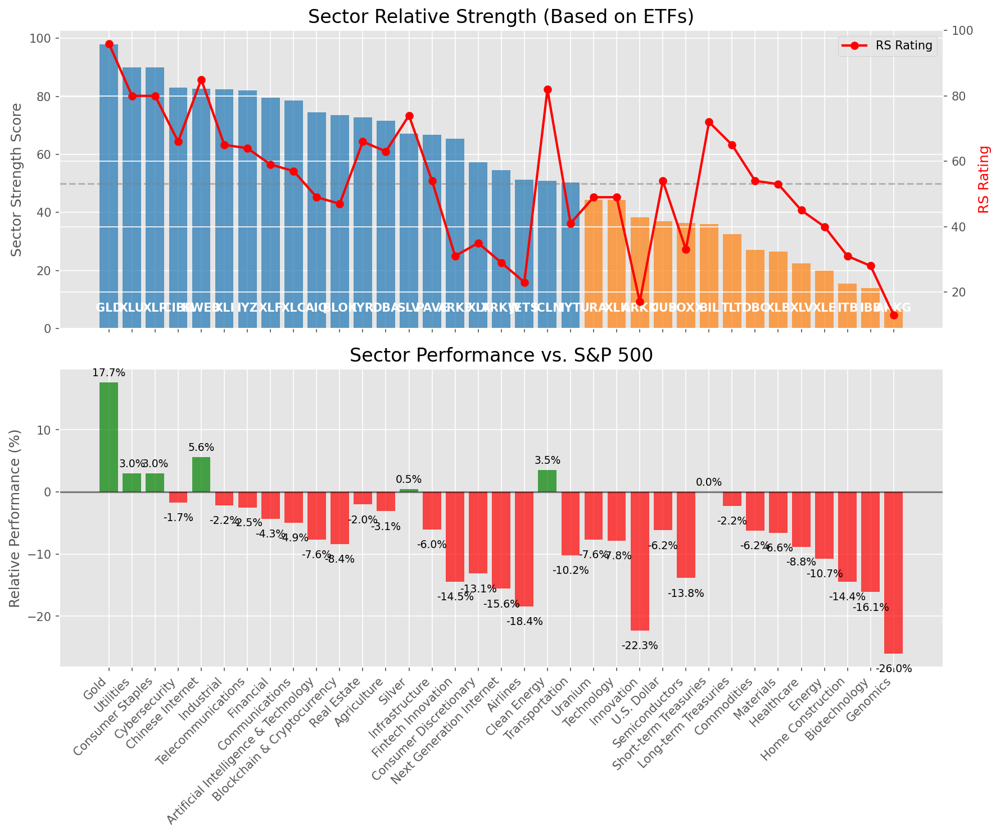

# **Daily Relative Strength Report**

**Date:** 2025-05-07

## **Market Valuation (Buffett Indicator)**

| Metric | Value |
|--------|-------|
| **Market Valuation** | **Fair Valued** |
| **Current Ratio** | 9.19 |
| **Historical Mean** | 9.42 |
| **Standard Deviation** | 0.51 |
| **Z-Score (StdDev from Mean)** | -0.49 |
| **Total Market Cap** | $275.51 trillion |
| **GDP** | $29.98 trillion |

## **Market Insights**

### **Market is Fairly Valued**

The market appears to be trading within a reasonable range of historical valuations. This suggests a balanced approach to equity investing is appropriate. Investors should:

- Focus on individual stock selection based on fundamentals and technicals
- Maintain normal equity allocations aligned with long-term goals
- Pay attention to sector rotation and relative strength
- Watch for changes in market leadership

Fair valuation typically suggests normal market returns can be expected, with stock selection becoming increasingly important.

### **Buffett Indicator Overview**

The Buffett Indicator (Total Market Cap / GDP) is a measure of the stock market's valuation relative to the size of the economy. It is named after Warren Buffett, who described it as "probably the best single measure of where valuations stand at any given moment."

- **Values above +2 standard deviations:** Market significantly overvalued
- **Values above +1 standard deviation:** Market overvalued
- **Values between -1 and +1 standard deviations:** Market fairly valued
- **Values below -1 standard deviation:** Market undervalued
- **Values below -2 standard deviations:** Market significantly undervalued

---

## **Sector Relative Strength**

Based on William O'Neil's Relative Strength Methodology

| ETF | Strength | RS Rating | Performance | Above Key MAs | Trend | Sector |
|-----|----------|-----------|-------------|--------------|-------|--------|
| [GLD](https://www.tradingview.com/chart/?symbol=GLD) | 98.0 | 96.0 | 17.95% | 10d ✓, 50d ✓, 200d ✓ | ↗️ | Gold |
| [XLU](https://www.tradingview.com/chart/?symbol=XLU) | 90.5 | 81.0 | 3.48% | 10d ✓, 50d ✓, 200d ✓ | ↗️ | Utilities |
| [XLP](https://www.tradingview.com/chart/?symbol=XLP) | 90.0 | 80.0 | 3.04% | 10d ✓, 50d ✓, 200d ✓ | ↗️ | Consumer Staples |
| [IYZ](https://www.tradingview.com/chart/?symbol=IYZ) | 84.0 | 68.0 | -0.94% | 10d ✓, 50d ✓, 200d ✓ | ↗️ | Telecommunications |
| [KWEB](https://www.tradingview.com/chart/?symbol=KWEB) | 82.6 | 85.0 | 5.95% | 10d ✓, 50d ✗, 200d ✓ | ↗️ | Chinese Internet |
| [XLI](https://www.tradingview.com/chart/?symbol=XLI) | 82.5 | 65.0 | -2.10% | 10d ✓, 50d ✓, 200d ✓ | ↗️ | Industrial |
| [CIBR](https://www.tradingview.com/chart/?symbol=CIBR) | 82.5 | 65.0 | -1.86% | 10d ✓, 50d ✓, 200d ✓ | ↗️ | Cybersecurity |
| [XLF](https://www.tradingview.com/chart/?symbol=XLF) | 80.0 | 60.0 | -4.04% | 10d ✓, 50d ✓, 200d ✓ | ↗️ | Financial |
| [XLC](https://www.tradingview.com/chart/?symbol=XLC) | 78.5 | 57.0 | -4.99% | 10d ✓, 50d ✓, 200d ✓ | ↗️ | Communications |
| [AIQ](https://www.tradingview.com/chart/?symbol=AIQ) | 74.0 | 48.0 | -8.11% | 10d ✓, 50d ✓, 200d ✓ | ↗️ | Artificial Intelligence & Technology |
| [IYR](https://www.tradingview.com/chart/?symbol=IYR) | 73.3 | 67.0 | -1.38% | 10d ✓, 50d ✓, 200d ✗ | ↗️ | Real Estate |
| [BLOK](https://www.tradingview.com/chart/?symbol=BLOK) | 73.0 | 46.0 | -8.52% | 10d ✓, 50d ✓, 200d ✓ | ↗️ | Blockchain & Cryptocurrency |
| [DBA](https://www.tradingview.com/chart/?symbol=DBA) | 71.6 | 63.0 | -2.75% | 10d ✗, 50d ✓, 200d ✓ | ↗️ | Agriculture |
| [SLV](https://www.tradingview.com/chart/?symbol=SLV) | 68.2 | 76.0 | 1.09% | 10d ✗, 50d ✗, 200d ✓ | ↗️ | Silver |
| [PAVE](https://www.tradingview.com/chart/?symbol=PAVE) | 66.8 | 54.0 | -5.77% | 10d ✓, 50d ✓, 200d ✗ | ↗️ | Infrastructure |
| [ICLN](https://www.tradingview.com/chart/?symbol=ICLN) | 60.8 | 82.0 | 3.72% | 10d ✓, 50d ✓, 200d ✗ | ↘️ | Clean Energy |
| [XLY](https://www.tradingview.com/chart/?symbol=XLY) | 56.8 | 34.0 | -13.34% | 10d ✓, 50d ✓, 200d ✗ | ↗️ | Consumer Discretionary |
| [ARKW](https://www.tradingview.com/chart/?symbol=ARKW) | 56.1 | 32.0 | -13.84% | 10d ✗, 50d ✓, 200d ✓ | ↗️ | Next Generation Internet |
| [ARKF](https://www.tradingview.com/chart/?symbol=ARKF) | 55.1 | 30.0 | -14.62% | 10d ✗, 50d ✓, 200d ✓ | ↗️ | Fintech Innovation |
| [JETS](https://www.tradingview.com/chart/?symbol=JETS) | 51.3 | 23.0 | -18.24% | 10d ✓, 50d ✓, 200d ✗ | ↗️ | Airlines |
| [IYT](https://www.tradingview.com/chart/?symbol=IYT) | 50.4 | 41.0 | -10.14% | 10d ✓, 50d ✗, 200d ✗ | ↗️ | Transportation |
| [URA](https://www.tradingview.com/chart/?symbol=URA) | 43.8 | 48.0 | -8.01% | 10d ✓, 50d ✓, 200d ✗ | ↘️ | Uranium |
| [XLK](https://www.tradingview.com/chart/?symbol=XLK) | 42.8 | 46.0 | -8.63% | 10d ✓, 50d ✓, 200d ✗ | ↘️ | Technology |
| [XLB](https://www.tradingview.com/chart/?symbol=XLB) | 36.9 | 54.0 | -5.97% | 10d ✓, 50d ✗, 200d ✗ | ↘️ | Materials |
| [UUP](https://www.tradingview.com/chart/?symbol=UUP) | 36.4 | 53.0 | -6.45% | 10d ✓, 50d ✗, 200d ✗ | ↘️ | U.S. Dollar |
| [BIL](https://www.tradingview.com/chart/?symbol=BIL) | 36.0 | 72.0 | 0.02% | 10d ✗, 50d ✗, 200d ✗ | ↘️ | Short-term Treasuries |
| [TLT](https://www.tradingview.com/chart/?symbol=TLT) | 32.0 | 64.0 | -2.17% | 10d ✗, 50d ✗, 200d ✗ | ↘️ | Long-term Treasuries |
| [ARKK](https://www.tradingview.com/chart/?symbol=ARKK) | 28.0 | 16.0 | -23.15% | 10d ✗, 50d ✗, 200d ✗ | ↗️ | Innovation |
| [DBC](https://www.tradingview.com/chart/?symbol=DBC) | 27.0 | 54.0 | -5.83% | 10d ✗, 50d ✗, 200d ✗ | ↘️ | Commodities |
| [SOXX](https://www.tradingview.com/chart/?symbol=SOXX) | 24.4 | 29.0 | -15.16% | 10d ✓, 50d ✗, 200d ✗ | ↘️ | Semiconductors |
| [XLV](https://www.tradingview.com/chart/?symbol=XLV) | 22.5 | 45.0 | -9.03% | 10d ✗, 50d ✗, 200d ✗ | ↘️ | Healthcare |
| [XLE](https://www.tradingview.com/chart/?symbol=XLE) | 20.5 | 41.0 | -10.50% | 10d ✗, 50d ✗, 200d ✗ | ↘️ | Energy |
| [ITB](https://www.tradingview.com/chart/?symbol=ITB) | 15.5 | 31.0 | -14.08% | 10d ✗, 50d ✗, 200d ✗ | ↘️ | Home Construction |
| [IBB](https://www.tradingview.com/chart/?symbol=IBB) | 13.5 | 27.0 | -16.23% | 10d ✗, 50d ✗, 200d ✗ | ↘️ | Biotechnology |
| [ARKG](https://www.tradingview.com/chart/?symbol=ARKG) | 6.0 | 12.0 | -27.10% | 10d ✗, 50d ✗, 200d ✗ | ↘️ | Genomics |

### **Sector ETF Performance Interpretation**

This table shows the relative strength metrics for different market sectors based on their representative ETFs:

- **ETF**: The ETF used to measure sector performance (click for chart)
- **Strength**: Overall sector strength score (0-100) combining multiple factors
- **RS Rating**: O'Neil RS rating of the sector ETF
- **Performance**: Performance of the sector ETF relative to SPY
- **Above Key MAs**: Whether the ETF is trading above its 10, 50, and 200-day moving averages
- **Trend**: Whether the sector is in an uptrend (↗️) or downtrend (↘️)

### **Current Sector Leadership**

The current market leadership is coming from the following sectors: **Gold, Utilities, Consumer Staples**.

The **Gold** sector (represented by **GLD**) is showing particularly strong relative strength with an RS rating of 96.0 and performance of 17.95% vs. the S&P 500. This sector is trading above its 10-day, 50-day, 200-day moving average(s). Investors should consider focusing on high RS stocks within these leading sectors for potential outperformance.

---

## **Buy Recommendations**

The following 117 stocks show exceptional relative strength:

| RS Rating | Buy Score | Current Price | Chart | Name | Ticker |
|-----------|-----------|---------------|-------|------|--------|
| 100 | 100 | $176.19 | [Chart](https://www.tradingview.com/chart/?symbol=PM) | Philip Morris International Inc. | PM |
| 100 | 100 | $147.40 | [Chart](https://www.tradingview.com/chart/?symbol=UGL) | ProShares Ultra Gold | UGL |
| 100 | 100 | $26.77 | [Chart](https://www.tradingview.com/chart/?symbol=DB) | Deutsche Bank Aktiengesellschaft | DB |
| 100 | 100 | $157.74 | [Chart](https://www.tradingview.com/chart/?symbol=PLMR) | Palomar Holdings, Inc. Common stock | PLMR |
| 99 | 100 | $93.89 | [Chart](https://www.tradingview.com/chart/?symbol=SNEX) | StoneX Group Inc. Common Stock | SNEX |
| 99 | 100 | $495.51 | [Chart](https://www.tradingview.com/chart/?symbol=DUOL) | Duolingo, Inc. Class A Common Stock | DUOL |
| 99 | 100 | $52.80 | [Chart](https://www.tradingview.com/chart/?symbol=SEZL) | Sezzle Inc. Common Stock | SEZL |
| 99 | 100 | $47.31 | [Chart](https://www.tradingview.com/chart/?symbol=MRX) | Marex Group plc Ordinary Shares | MRX |
| 99 | 100 | $85.19 | [Chart](https://www.tradingview.com/chart/?symbol=WPM) | Wheaton Precious Metals Corp. Common Stock | WPM |
| 99 | 100 | $183.77 | [Chart](https://www.tradingview.com/chart/?symbol=RGLD) | Royal Gold Inc | RGLD |
| 99 | 100 | $71.20 | [Chart](https://www.tradingview.com/chart/?symbol=ULS) | UL Solutions Inc. | ULS |
| 99 | 100 | $285.58 | [Chart](https://www.tradingview.com/chart/?symbol=VRSN) | VeriSign Inc | VRSN |
| 98 | 100 | $126.06 | [Chart](https://www.tradingview.com/chart/?symbol=VSEC) | VSE Corp | VSEC |
| 98 | 100 | $59.76 | [Chart](https://www.tradingview.com/chart/?symbol=SKWD) | Skyward Specialty Insurance Group, Inc. Common Stock | SKWD |
| 98 | 100 | $229.60 | [Chart](https://www.tradingview.com/chart/?symbol=TTWO) | Take-Two Interactive Software Inc | TTWO |
| 98 | 100 | $23.98 | [Chart](https://www.tradingview.com/chart/?symbol=OR) | Osisko Gold Royalties Ltd | OR |
| 98 | 100 | $156.71 | [Chart](https://www.tradingview.com/chart/?symbol=HWM) | Howmet Aerospace Inc. | HWM |
| 98 | 100 | $170.62 | [Chart](https://www.tradingview.com/chart/?symbol=FNV) | Franco-Nevada Corporation | FNV |
| 98 | 100 | $73.21 | [Chart](https://www.tradingview.com/chart/?symbol=WRB) | W.R. Berkley Corporation | WRB |
| 98 | 100 | $41.15 | [Chart](https://www.tradingview.com/chart/?symbol=EWP) | iShares MSCI Spain ETF | EWP |
| 97 | 100 | $117.97 | [Chart](https://www.tradingview.com/chart/?symbol=AEM) | Agnico Eagle Mines Ltd. | AEM |
| 97 | 100 | $152.39 | [Chart](https://www.tradingview.com/chart/?symbol=CAH) | Cardinal Health, Inc. | CAH |
| 97 | 100 | $301.39 | [Chart](https://www.tradingview.com/chart/?symbol=COR) | Cencora, Inc. | COR |
| 97 | 100 | $22.75 | [Chart](https://www.tradingview.com/chart/?symbol=CXW) | CoreCivic, Inc. | CXW |
| 97 | 100 | $30.58 | [Chart](https://www.tradingview.com/chart/?symbol=EUFN) | iShares MSCI Europe Financials ETF | EUFN |
| 96 | 100 | $40.48 | [Chart](https://www.tradingview.com/chart/?symbol=EWG) | iShares MSCI Germany ETF | EWG |
| 96 | 100 | $63.77 | [Chart](https://www.tradingview.com/chart/?symbol=IAU) | iShares Gold Trust | IAU |
| 96 | 100 | $284.47 | [Chart](https://www.tradingview.com/chart/?symbol=CME) | CME Group Inc. | CME |
| 96 | 100 | $311.55 | [Chart](https://www.tradingview.com/chart/?symbol=GLD) | SPDR Gold Trust, SPDR Gold Shares | GLD |
| 96 | 100 | $214.33 | [Chart](https://www.tradingview.com/chart/?symbol=IDCC) | InterDigital, Inc. | IDCC |
| 96 | 100 | $25.84 | [Chart](https://www.tradingview.com/chart/?symbol=PHYS) | Sprott Physical Gold Trust | PHYS |
| 96 | 100 | $167.41 | [Chart](https://www.tradingview.com/chart/?symbol=AGX) | Argan, Inc | AGX |
| 96 | 100 | $28.52 | [Chart](https://www.tradingview.com/chart/?symbol=FMS) | Fresenius Medical Care AG | FMS |
| 96 | 100 | $33.71 | [Chart](https://www.tradingview.com/chart/?symbol=IAUM) | iShares Gold Trust Micro | IAUM |
| 96 | 100 | $22.94 | [Chart](https://www.tradingview.com/chart/?symbol=LAUR) | Laureate Education, Inc. Common Stock | LAUR |
| 96 | 100 | $41.80 | [Chart](https://www.tradingview.com/chart/?symbol=DRS) | Leonardo DRS, Inc. Common Stock | DRS |
| 95 | 100 | $158.71 | [Chart](https://www.tradingview.com/chart/?symbol=LRN) | Stride, Inc. | LRN |
| 95 | 100 | $102.89 | [Chart](https://www.tradingview.com/chart/?symbol=RBA) | RB Global, Inc. | RBA |
| 95 | 100 | $117.69 | [Chart](https://www.tradingview.com/chart/?symbol=EHC) | Encompass Health Corporation Common Stock | EHC |
| 95 | 100 | $82.06 | [Chart](https://www.tradingview.com/chart/?symbol=OGS) | ONE GAS, INC. | OGS |
| 95 | 100 | $50.06 | [Chart](https://www.tradingview.com/chart/?symbol=FTS) | Fortis Inc. Common Shares | FTS |
| 95 | 100 | $143.85 | [Chart](https://www.tradingview.com/chart/?symbol=TW) | Tradeweb Markets Inc. Class A Common Stock | TW |
| 95 | 100 | $142.29 | [Chart](https://www.tradingview.com/chart/?symbol=SE) | Sea Limited American Depositary Shares, each representing one Class A Ordinary Share | SE |
| 95 | 100 | $28.33 | [Chart](https://www.tradingview.com/chart/?symbol=T) | AT&T Inc. | T |
| 95 | 100 | $19.66 | [Chart](https://www.tradingview.com/chart/?symbol=KT) | KT Corp. | KT |
| 95 | 100 | $60.81 | [Chart](https://www.tradingview.com/chart/?symbol=MO) | Altria Group, Inc. | MO |
| 95 | 100 | $90.86 | [Chart](https://www.tradingview.com/chart/?symbol=CCEP) | Coca-Cola Europacific Partners plc Ordinary Shares | CCEP |
| 94 | 100 | $139.14 | [Chart](https://www.tradingview.com/chart/?symbol=DTE) | DTE Energy Company | DTE |
| 94 | 100 | $1153.39 | [Chart](https://www.tradingview.com/chart/?symbol=NFLX) | NetFlix Inc | NFLX |
| 94 | 100 | $82.46 | [Chart](https://www.tradingview.com/chart/?symbol=NFG) | National Fuel Gas Co. | NFG |
| 94 | 100 | $251.96 | [Chart](https://www.tradingview.com/chart/?symbol=RSG) | Republic Services Inc. | RSG |
| 93 | 100 | $234.04 | [Chart](https://www.tradingview.com/chart/?symbol=CBOE) | Cboe Global Markets, Inc. | CBOE |
| 93 | 100 | $120.37 | [Chart](https://www.tradingview.com/chart/?symbol=CWST) | Casella Waste Systems Inc | CWST |
| 93 | 100 | $163.31 | [Chart](https://www.tradingview.com/chart/?symbol=ATO) | Atmos Energy Corporation | ATO |
| 93 | 100 | $50.87 | [Chart](https://www.tradingview.com/chart/?symbol=GFL) | GFL Environmental Inc. Subordinate Voting Shares | GFL |
| 93 | 100 | $61.84 | [Chart](https://www.tradingview.com/chart/?symbol=CHEF) | The Chef's Warehouse Inc | CHEF |
| 93 | 100 | $32.97 | [Chart](https://www.tradingview.com/chart/?symbol=AHR) | American Healthcare REIT, Inc. | AHR |
| 92 | 100 | $74.29 | [Chart](https://www.tradingview.com/chart/?symbol=CMS) | CMS Energy Corporation | CMS |
| 92 | 100 | $64.83 | [Chart](https://www.tradingview.com/chart/?symbol=FNF) | Fidelity National Financial, Inc. | FNF |
| 92 | 100 | $199.50 | [Chart](https://www.tradingview.com/chart/?symbol=LOPE) | Grand Canyon Education, Inc | LOPE |
| 92 | 100 | $5162.37 | [Chart](https://www.tradingview.com/chart/?symbol=BKNG) | Booking Holdings Inc. Common Stock | BKNG |
| 92 | 100 | $467.20 | [Chart](https://www.tradingview.com/chart/?symbol=CASY) | Casey's General Stores Inc | CASY |
| 91 | 100 | $25.00 | [Chart](https://www.tradingview.com/chart/?symbol=EWS) | iShares MSCI Singapore ETF | EWS |
| 91 | 100 | $269.52 | [Chart](https://www.tradingview.com/chart/?symbol=TRV) | The Travelers Companies, Inc. | TRV |
| 91 | 100 | $176.38 | [Chart](https://www.tradingview.com/chart/?symbol=ICE) | Intercontinental Exchange  Inc. | ICE |
| 91 | 100 | $317.58 | [Chart](https://www.tradingview.com/chart/?symbol=MCD) | McDonald's Corporation | MCD |
| 90 | 100 | $51.17 | [Chart](https://www.tradingview.com/chart/?symbol=TRP) | TC Energy Corporation | TRP |
| 90 | 100 | $17.73 | [Chart](https://www.tradingview.com/chart/?symbol=AM) | Antero Midstream Corporation Common Stock | AM |
| 90 | 100 | $167.24 | [Chart](https://www.tradingview.com/chart/?symbol=THG) | The Hanover Insurance Group, Inc. | THG |
| 90 | 100 | $100.69 | [Chart](https://www.tradingview.com/chart/?symbol=AXS) | Axis Capital Holders Limited | AXS |
| 90 | 100 | $41.61 | [Chart](https://www.tradingview.com/chart/?symbol=HMN) | Horace Mann Educators Corporation | HMN |
| 90 | 100 | $34.97 | [Chart](https://www.tradingview.com/chart/?symbol=PAY) | Paymentus Holdings, Inc. | PAY |
| 90 | 100 | $43.63 | [Chart](https://www.tradingview.com/chart/?symbol=NWN) | Northwest Natural Holding Company | NWN |
| 89 | 100 | $208.44 | [Chart](https://www.tradingview.com/chart/?symbol=CRS) | Carpenter Technology Corp | CRS |
| 89 | 100 | $23.18 | [Chart](https://www.tradingview.com/chart/?symbol=SRAD) | Sportradar Group AG Class A Ordinary Shares | SRAD |
| 89 | 100 | $56.50 | [Chart](https://www.tradingview.com/chart/?symbol=HSBC) | HSBC Holdings PLC | HSBC |
| 89 | 100 | $33.10 | [Chart](https://www.tradingview.com/chart/?symbol=LTH) | Life Time Group Holdings, Inc. | LTH |
| 88 | 100 | $70.23 | [Chart](https://www.tradingview.com/chart/?symbol=EVRG) | Evergy, Inc. | EVRG |
| 88 | 100 | $44.37 | [Chart](https://www.tradingview.com/chart/?symbol=BTI) | British American Tobacco p.l.c. American Depositary Shares, American Depositary Shares, each representing one Ordinary Share | BTI |
| 88 | 100 | $36.52 | [Chart](https://www.tradingview.com/chart/?symbol=PPL) | PPL Corporation | PPL |
| 87 | 100 | $45.57 | [Chart](https://www.tradingview.com/chart/?symbol=OGE) | OGE Energy Corp. | OGE |
| 87 | 100 | $151.75 | [Chart](https://www.tradingview.com/chart/?symbol=WELL) | Welltower Inc. | WELL |
| 86 | 100 | $40.60 | [Chart](https://www.tradingview.com/chart/?symbol=NI) | NiSource Inc. | NI |
| 89 | 99 | $107.84 | [Chart](https://www.tradingview.com/chart/?symbol=AEP) | American Electric Power Company, Inc. | AEP |
| 88 | 99 | $54.84 | [Chart](https://www.tradingview.com/chart/?symbol=RELX) | RELX PLC | RELX |
| 88 | 99 | $201.10 | [Chart](https://www.tradingview.com/chart/?symbol=BAP) | Credicorp LTD | BAP |
| 87 | 99 | $339.72 | [Chart](https://www.tradingview.com/chart/?symbol=AJG) | Arthur J. Gallagher & Co. | AJG |
| 88 | 98 | $42.54 | [Chart](https://www.tradingview.com/chart/?symbol=FHI) | Federated Hermes, Inc. | FHI |
| 88 | 98 | $122.64 | [Chart](https://www.tradingview.com/chart/?symbol=DUK) | Duke Energy Corporation | DUK |
| 88 | 98 | $57.91 | [Chart](https://www.tradingview.com/chart/?symbol=IGF) | iShares Global Infrastructure ETF | IGF |
| 85 | 98 | $71.85 | [Chart](https://www.tradingview.com/chart/?symbol=XEL) | Xcel Energy, Inc. | XEL |
| 85 | 97 | $36.16 | [Chart](https://www.tradingview.com/chart/?symbol=KTOS) | Kratos Defense & Security Solutions, Inc. | KTOS |
| 84 | 97 | $115.88 | [Chart](https://www.tradingview.com/chart/?symbol=ATGE) | Adtalem Global Education Inc. Common Shares | ATGE |
| 84 | 97 | $168.95 | [Chart](https://www.tradingview.com/chart/?symbol=TKO) | TKO Group Holdings, Inc. | TKO |
| 86 | 96 | $50.47 | [Chart](https://www.tradingview.com/chart/?symbol=EPR) | EPR Properties | EPR |
| 86 | 96 | $164.65 | [Chart](https://www.tradingview.com/chart/?symbol=MAA) | Mid-America Apartment Communities, Inc. | MAA |
| 86 | 96 | $64.87 | [Chart](https://www.tradingview.com/chart/?symbol=RYTM) | Rhythm Pharmaceuticals, Inc. Common Stock | RYTM |
| 85 | 96 | $204.22 | [Chart](https://www.tradingview.com/chart/?symbol=ALL) | The Allstate Corporation | ALL |
| 85 | 96 | $309.66 | [Chart](https://www.tradingview.com/chart/?symbol=VRSK) | Verisk Analytics, Inc. Common Stock | VRSK |
| 84 | 96 | $31.50 | [Chart](https://www.tradingview.com/chart/?symbol=SLM) | SLM Corporation | SLM |
| 83 | 96 | $296.42 | [Chart](https://www.tradingview.com/chart/?symbol=SAP) | SAP SE | SAP |
| 83 | 96 | $652.26 | [Chart](https://www.tradingview.com/chart/?symbol=SPOT) | Spotify Technology S.A. | SPOT |
| 83 | 95 | $70.40 | [Chart](https://www.tradingview.com/chart/?symbol=EBAY) | eBay Inc | EBAY |
| 82 | 95 | $80.80 | [Chart](https://www.tradingview.com/chart/?symbol=UNM) | Unum Group | UNM |
| 81 | 95 | $99.80 | [Chart](https://www.tradingview.com/chart/?symbol=AEE) | Ameren Corporation | AEE |
| 84 | 94 | $31.41 | [Chart](https://www.tradingview.com/chart/?symbol=MFC) | Manulife Financial Corp. | MFC |
| 84 | 94 | $76.82 | [Chart](https://www.tradingview.com/chart/?symbol=ADC) | Agree Realty Corporation | ADC |
| 84 | 94 | $197.85 | [Chart](https://www.tradingview.com/chart/?symbol=WCN) | Waste Connections, Inc. | WCN |
| 80 | 94 | $84.94 | [Chart](https://www.tradingview.com/chart/?symbol=ETR) | Entergy Corporation | ETR |
| 80 | 93 | $237.92 | [Chart](https://www.tradingview.com/chart/?symbol=LNG) | Cheniere Energy Inc | LNG |
| 82 | 92 | $111.38 | [Chart](https://www.tradingview.com/chart/?symbol=OLLI) | Ollie's Bargain Outlet Holdings, Inc. Common Stock | OLLI |
| 80 | 92 | $25.70 | [Chart](https://www.tradingview.com/chart/?symbol=IMAX) | Imax Corp | IMAX |
| 80 | 92 | $106.70 | [Chart](https://www.tradingview.com/chart/?symbol=DAVE) | Dave Inc. Class A Common Stock | DAVE |
| 81 | 91 | $71.27 | [Chart](https://www.tradingview.com/chart/?symbol=RYAN) | Ryan Specialty Holdings, Inc. | RYAN |
| 80 | 91 | $41.08 | [Chart](https://www.tradingview.com/chart/?symbol=AB) | AllianceBernstein Holding, L.P. | AB |
| 80 | 90 | $26.31 | [Chart](https://www.tradingview.com/chart/?symbol=IIIV) | i3 Verticals, Inc. Class A Common Stock | IIIV |
| 80 | 90 | $172.24 | [Chart](https://www.tradingview.com/chart/?symbol=CVLT) | Commault Systems, Inc. | CVLT |

---

## **Sell Recommendations**

The following 128 stocks show deteriorating relative strength:

| RS Rating | Sell Score | Current Price | Chart | Name | Ticker |
|-----------|------------|---------------|-------|------|--------|
| 2 | 100 | $10.94 | [Chart](https://www.tradingview.com/chart/?symbol=NRIX) | Nurix Therapeutics, Inc. Common stock | NRIX |
| 2 | 100 | $17.14 | [Chart](https://www.tradingview.com/chart/?symbol=FWRD) | Forward Air Corp | FWRD |
| 2 | 100 | $19.84 | [Chart](https://www.tradingview.com/chart/?symbol=GCO) | Genesco Inc. | GCO |
| 3 | 100 | $18.77 | [Chart](https://www.tradingview.com/chart/?symbol=DAVA) | Endava plc American Depositary Shares (each representing one Class A Ordinary Share) | DAVA |
| 3 | 100 | $17.54 | [Chart](https://www.tradingview.com/chart/?symbol=SSTK) | SHUTTERSTOCK, INC. | SSTK |
| 4 | 100 | $20.66 | [Chart](https://www.tradingview.com/chart/?symbol=SPT) | Sprout Social, Inc Class A Common Stock | SPT |
| 4 | 100 | $13.48 | [Chart](https://www.tradingview.com/chart/?symbol=DV) | DoubleVerify Holdings, Inc. | DV |
| 4 | 100 | $74.58 | [Chart](https://www.tradingview.com/chart/?symbol=ILMN) | Illumina Inc | ILMN |
| 4 | 100 | $69.88 | [Chart](https://www.tradingview.com/chart/?symbol=ANF) | Abercrombie & Fitch Co. | ANF |
| 5 | 100 | $24.41 | [Chart](https://www.tradingview.com/chart/?symbol=RPD) | Rapid7, Inc. Common Stock | RPD |
| 5 | 100 | $26.27 | [Chart](https://www.tradingview.com/chart/?symbol=JACK) | Jack in the Box Inc. | JACK |
| 5 | 100 | $10.02 | [Chart](https://www.tradingview.com/chart/?symbol=DYN) | Dyne Therapeutics, Inc. Common Stock | DYN |
| 6 | 100 | $74.25 | [Chart](https://www.tradingview.com/chart/?symbol=TER) | Teradyne, Inc. Common Stock | TER |
| 6 | 100 | $14.23 | [Chart](https://www.tradingview.com/chart/?symbol=ODP) | The ODP Corporation Common Stock | ODP |
| 6 | 100 | $11.11 | [Chart](https://www.tradingview.com/chart/?symbol=ARCT) | Arcturus Therapeutics Holdings Inc. Common Stock | ARCT |
| 6 | 100 | $33.23 | [Chart](https://www.tradingview.com/chart/?symbol=CYTK) | Cytokinetics Inc. | CYTK |
| 7 | 100 | $43.66 | [Chart](https://www.tradingview.com/chart/?symbol=ENPH) | Enphase Energy, Inc. | ENPH |
| 7 | 100 | $17.88 | [Chart](https://www.tradingview.com/chart/?symbol=SCVL) | Shoe Carnival Inc | SCVL |
| 8 | 100 | $13.12 | [Chart](https://www.tradingview.com/chart/?symbol=MNRO) | Monro, Inc. Common Stock | MNRO |
| 8 | 100 | $13.82 | [Chart](https://www.tradingview.com/chart/?symbol=GCT) | GigaCloud Technology Inc Class A Ordinary Shares | GCT |
| 9 | 100 | $10.79 | [Chart](https://www.tradingview.com/chart/?symbol=JAMF) | Jamf Holding Corp. Common Stock | JAMF |
| 9 | 100 | $15.37 | [Chart](https://www.tradingview.com/chart/?symbol=DXC) | DXC Technology Company | DXC |
| 9 | 100 | $43.00 | [Chart](https://www.tradingview.com/chart/?symbol=RHI) | Robert Half Inc. | RHI |
| 10 | 100 | $28.01 | [Chart](https://www.tradingview.com/chart/?symbol=SRDX) | Surmodics, Inc. Common Stock | SRDX |
| 10 | 100 | $12.99 | [Chart](https://www.tradingview.com/chart/?symbol=DQ) | Daqo New Energy Corp. American Depositary Shares (each representing 5 Ordinary Shares) | DQ |
| 10 | 100 | $95.45 | [Chart](https://www.tradingview.com/chart/?symbol=TGT) | Target Corporation | TGT |
| 11 | 100 | $31.60 | [Chart](https://www.tradingview.com/chart/?symbol=UWM) | ProShares Ultra Russell2000 | UWM |
| 5 | 99 | $30.01 | [Chart](https://www.tradingview.com/chart/?symbol=SPHR) | Sphere Entertainment Co. | SPHR |
| 5 | 99 | $209.71 | [Chart](https://www.tradingview.com/chart/?symbol=WST) | West Pharmaceutical Services, Inc. | WST |
| 8 | 99 | $24.53 | [Chart](https://www.tradingview.com/chart/?symbol=AA) | Alcoa Corporation | AA |
| 14 | 99 | $59.26 | [Chart](https://www.tradingview.com/chart/?symbol=AMWD) | American Woodmark Corp | AMWD |
| 6 | 98 | $58.17 | [Chart](https://www.tradingview.com/chart/?symbol=TECL) | Direxion Daily Technology Bull 3x Shares | TECL |
| 10 | 98 | $41.47 | [Chart](https://www.tradingview.com/chart/?symbol=USD) | ProShares Ultra Semiconductors | USD |
| 14 | 98 | $62.09 | [Chart](https://www.tradingview.com/chart/?symbol=SPB) | Spectrum Brands Holdings, Inc. | SPB |
| 20 | 98 | $129.22 | [Chart](https://www.tradingview.com/chart/?symbol=FSLR) | First Solar, Inc. | FSLR |
| 15 | 97 | $102.72 | [Chart](https://www.tradingview.com/chart/?symbol=TOL) | Toll Brothers, Inc. | TOL |
| 16 | 97 | $11.92 | [Chart](https://www.tradingview.com/chart/?symbol=AEYE) | AudioEye, Inc. Common Stock | AEYE |
| 5 | 96 | $10.02 | [Chart](https://www.tradingview.com/chart/?symbol=LSPD) | Lightspeed Commerce Inc. | LSPD |
| 11 | 96 | $37.94 | [Chart](https://www.tradingview.com/chart/?symbol=NVDL) | GraniteShares ETF Trust GraniteShares 2x Long NVDA Daily ETF | NVDL |
| 12 | 96 | $18.54 | [Chart](https://www.tradingview.com/chart/?symbol=OII) | Oceaneering International Inc. | OII |
| 13 | 96 | $12.61 | [Chart](https://www.tradingview.com/chart/?symbol=ADNT) | Adient plc Ordinary Shares | ADNT |
| 18 | 96 | $11.66 | [Chart](https://www.tradingview.com/chart/?symbol=M) | Macy's Inc. | M |
| 21 | 96 | $16.70 | [Chart](https://www.tradingview.com/chart/?symbol=TRMD) | TORM plc Class A Common Stock | TRMD |
| 15 | 95 | $14.94 | [Chart](https://www.tradingview.com/chart/?symbol=PSFE) | Paysafe Limited | PSFE |
| 24 | 95 | $14.05 | [Chart](https://www.tradingview.com/chart/?symbol=FXN) | First Trust Energy AlphaDEX Fund | FXN |
| 10 | 94 | $10.31 | [Chart](https://www.tradingview.com/chart/?symbol=VREX) | Varex Imaging Corporation Common Stock | VREX |
| 10 | 94 | $10.77 | [Chart](https://www.tradingview.com/chart/?symbol=SONO) | Sonos, Inc. Common Stock | SONO |
| 15 | 94 | $13.70 | [Chart](https://www.tradingview.com/chart/?symbol=ZIM) | ZIM Integrated Shipping Services Ltd. | ZIM |
| 16 | 94 | $20.48 | [Chart](https://www.tradingview.com/chart/?symbol=FOXF) | Fox Factory Holding Corp. Common Stock | FOXF |
| 14 | 93 | $16.10 | [Chart](https://www.tradingview.com/chart/?symbol=MLKN) | MillerKnoll, Inc. Common Stock | MLKN |
| 15 | 93 | $15.88 | [Chart](https://www.tradingview.com/chart/?symbol=PENN) | PENN Entertainment, Inc. Common Stock | PENN |
| 15 | 93 | $16.26 | [Chart](https://www.tradingview.com/chart/?symbol=SVOL) | Simplify Volatility Premium ETF | SVOL |
| 18 | 93 | $25.80 | [Chart](https://www.tradingview.com/chart/?symbol=GDEN) | Golden Entertainment, Inc. Common Stock | GDEN |
| 26 | 93 | $10.89 | [Chart](https://www.tradingview.com/chart/?symbol=GES) | Guess?, Inc. | GES |
| 13 | 92 | $76.36 | [Chart](https://www.tradingview.com/chart/?symbol=WHR) | Whirlpool Corp. | WHR |
| 13 | 92 | $26.43 | [Chart](https://www.tradingview.com/chart/?symbol=WSC) | WillScot Holdings Corporation Class A Common Stock | WSC |
| 16 | 92 | $46.77 | [Chart](https://www.tradingview.com/chart/?symbol=ERX) | Direxion Daily Energy Bull 2X Shares | ERX |
| 18 | 92 | $12.98 | [Chart](https://www.tradingview.com/chart/?symbol=NVGS) | NAVIGATOR HOLDINGS LTD. | NVGS |
| 20 | 92 | $12.10 | [Chart](https://www.tradingview.com/chart/?symbol=CIM) | Chimera Investment Corp. | CIM |
| 19 | 91 | $25.70 | [Chart](https://www.tradingview.com/chart/?symbol=HPQ) | HP Inc. | HPQ |
| 20 | 91 | $31.46 | [Chart](https://www.tradingview.com/chart/?symbol=CRNX) | Crinetics Pharmaceuticals, Inc. | CRNX |
| 21 | 91 | $53.99 | [Chart](https://www.tradingview.com/chart/?symbol=KBH) | KB Home | KBH |
| 14 | 90 | $27.04 | [Chart](https://www.tradingview.com/chart/?symbol=CZR) | Caesars Entertainment, Inc. Common Stock | CZR |
| 15 | 90 | $29.11 | [Chart](https://www.tradingview.com/chart/?symbol=MBUU) | Malibu Boats, Inc. Class A | MBUU |
| 16 | 90 | $10.08 | [Chart](https://www.tradingview.com/chart/?symbol=PACS) | PACS Group, Inc. | PACS |
| 17 | 90 | $57.64 | [Chart](https://www.tradingview.com/chart/?symbol=SYNA) | Synaptics Inc | SYNA |
| 22 | 90 | $34.32 | [Chart](https://www.tradingview.com/chart/?symbol=TECK) | Teck Resources Limited | TECK |
| 23 | 90 | $10.52 | [Chart](https://www.tradingview.com/chart/?symbol=GSBD) | Goldman Sachs BDC, Inc. | GSBD |
| 24 | 90 | $11.46 | [Chart](https://www.tradingview.com/chart/?symbol=KELYA) | Kelly Services Inc | KELYA |
| 17 | 89 | $11.99 | [Chart](https://www.tradingview.com/chart/?symbol=KRP) | Kimbell Royalty Partners, LP Common Units representing Limited Partner Interests | KRP |
| 26 | 89 | $10.34 | [Chart](https://www.tradingview.com/chart/?symbol=CMRE) | Costamare Inc. | CMRE |
| 19 | 88 | $15.15 | [Chart](https://www.tradingview.com/chart/?symbol=PD) | PagerDuty, Inc. | PD |
| 23 | 88 | $10.11 | [Chart](https://www.tradingview.com/chart/?symbol=BWLP) | BW LPG Limited | BWLP |
| 28 | 88 | $13.01 | [Chart](https://www.tradingview.com/chart/?symbol=MED) | Medifast, Inc. | MED |
| 36 | 88 | $28.06 | [Chart](https://www.tradingview.com/chart/?symbol=IMCR) | Immunocore Holdings plc American Depositary Shares | IMCR |
| 13 | 87 | $90.94 | [Chart](https://www.tradingview.com/chart/?symbol=RVTY) | Revvity, Inc. | RVTY |
| 18 | 87 | $10.03 | [Chart](https://www.tradingview.com/chart/?symbol=MTAL) | MAC Copper Limited | MTAL |
| 25 | 87 | $18.89 | [Chart](https://www.tradingview.com/chart/?symbol=PLAB) | Photronics Inc | PLAB |
| 17 | 86 | $37.37 | [Chart](https://www.tradingview.com/chart/?symbol=CRC) | California Resources Corporation | CRC |
| 19 | 86 | $189.68 | [Chart](https://www.tradingview.com/chart/?symbol=DKS) | Dick's Sporting Goods, Inc. | DKS |
| 19 | 86 | $68.58 | [Chart](https://www.tradingview.com/chart/?symbol=BBY) | Best Buy Company, Inc. | BBY |
| 21 | 86 | $155.34 | [Chart](https://www.tradingview.com/chart/?symbol=ODFL) | Old Dominion Freight Line | ODFL |
| 22 | 86 | $142.87 | [Chart](https://www.tradingview.com/chart/?symbol=QCOM) | Qualcomm Inc | QCOM |
| 19 | 84 | $17.66 | [Chart](https://www.tradingview.com/chart/?symbol=INFY) | Infosys Limited American Depositary Shares | INFY |
| 24 | 84 | $12.29 | [Chart](https://www.tradingview.com/chart/?symbol=DBO) | Invesco DB Oil Fund | DBO |
| 34 | 84 | $69.94 | [Chart](https://www.tradingview.com/chart/?symbol=TTC) | Toro Company (The) | TTC |
| 30 | 83 | $10.01 | [Chart](https://www.tradingview.com/chart/?symbol=XPRO) | Expro Group Holdings N.V. | XPRO |
| 34 | 83 | $35.19 | [Chart](https://www.tradingview.com/chart/?symbol=GFS) | GlobalFoundries Inc. Ordinary Shares | GFS |
| 23 | 82 | $10.09 | [Chart](https://www.tradingview.com/chart/?symbol=SEMR) | SEMrush Holdings, Inc. | SEMR |
| 28 | 82 | $64.92 | [Chart](https://www.tradingview.com/chart/?symbol=DD) | DuPont de Nemours, Inc. Common Stock | DD |
| 21 | 81 | $193.88 | [Chart](https://www.tradingview.com/chart/?symbol=NVMI) | Nova Ltd. Ordinary Shares | NVMI |
| 23 | 81 | $116.28 | [Chart](https://www.tradingview.com/chart/?symbol=GNRC) | GENERAC HOLDINGS INC | GNRC |
| 24 | 81 | $137.44 | [Chart](https://www.tradingview.com/chart/?symbol=MTN) | Vail Resorts, Inc. | MTN |
| 26 | 81 | $28.59 | [Chart](https://www.tradingview.com/chart/?symbol=AGIO) | Agios Pharmaceuticals, Inc. | AGIO |
| 30 | 81 | $21.83 | [Chart](https://www.tradingview.com/chart/?symbol=ST) | Sensata Technologies Holding plc | ST |
| 30 | 81 | $17.68 | [Chart](https://www.tradingview.com/chart/?symbol=JKS) | JINKOSOLAR HOLDINGS CO | JKS |
| 38 | 81 | $29.59 | [Chart](https://www.tradingview.com/chart/?symbol=TAN) | Invesco Solar ETF | TAN |
| 23 | 80 | $38.10 | [Chart](https://www.tradingview.com/chart/?symbol=MLTX) | MoonLake Immunotherapeutics Class A Ordinary Shares | MLTX |
| 31 | 80 | $14.20 | [Chart](https://www.tradingview.com/chart/?symbol=BMEZ) | BlackRock Health Sciences Term Trust | BMEZ |
| 33 | 80 | $33.83 | [Chart](https://www.tradingview.com/chart/?symbol=PZZA) | Papa John's International Inc | PZZA |
| 32 | 79 | $50.83 | [Chart](https://www.tradingview.com/chart/?symbol=LW) | Lamb Weston Holdings, Inc. | LW |
| 31 | 78 | $91.51 | [Chart](https://www.tradingview.com/chart/?symbol=ITB) | iShares U.S. Home Construction ETF | ITB |
| 26 | 77 | $26.01 | [Chart](https://www.tradingview.com/chart/?symbol=BNO) | United States Brent Oil Fund, LP | BNO |
| 29 | 77 | $74.20 | [Chart](https://www.tradingview.com/chart/?symbol=SLYV) | SPDR S&P 600 Small Cap Value ETF (based on S&P SmallCap 600 Value Index symbol--CVK) | SLYV |
| 30 | 77 | $33.19 | [Chart](https://www.tradingview.com/chart/?symbol=MGA) | Magna International | MGA |
| 30 | 77 | $42.46 | [Chart](https://www.tradingview.com/chart/?symbol=FEPI) | REX FANG & Innovation Equity Premium Income ETF | FEPI |
| 29 | 76 | $18.10 | [Chart](https://www.tradingview.com/chart/?symbol=BSTZ) | BlackRock Science and Technology Term Trust | BSTZ |
| 31 | 76 | $16.46 | [Chart](https://www.tradingview.com/chart/?symbol=MLNK) | MeridianLink, Inc. | MLNK |
| 27 | 75 | $77.55 | [Chart](https://www.tradingview.com/chart/?symbol=IR) | Ingersoll Rand Inc. Common Stock | IR |
| 33 | 75 | $250.85 | [Chart](https://www.tradingview.com/chart/?symbol=HUM) | Humana Inc. | HUM |
| 38 | 75 | $20.15 | [Chart](https://www.tradingview.com/chart/?symbol=CSWC) | Capital Southwest Corp | CSWC |
| 32 | 74 | $15.44 | [Chart](https://www.tradingview.com/chart/?symbol=HQH) | abrdn Healthcare Investors | HQH |
| 33 | 74 | $28.41 | [Chart](https://www.tradingview.com/chart/?symbol=CSX) | CSX Corporation | CSX |
| 35 | 74 | $81.63 | [Chart](https://www.tradingview.com/chart/?symbol=MU) | Micron Technology, Inc. | MU |
| 35 | 74 | $24.15 | [Chart](https://www.tradingview.com/chart/?symbol=AMRK) | A-Mark Precious Metals, Inc. | AMRK |
| 36 | 73 | $26.92 | [Chart](https://www.tradingview.com/chart/?symbol=COLL) | Collegium Pharmaceutical, Inc. Common Stock | COLL |
| 28 | 72 | $172.29 | [Chart](https://www.tradingview.com/chart/?symbol=DOV) | Dover Corporation | DOV |
| 30 | 72 | $215.16 | [Chart](https://www.tradingview.com/chart/?symbol=FDX) | FedEx Corporation | FDX |
| 35 | 72 | $10.37 | [Chart](https://www.tradingview.com/chart/?symbol=AVO) | Mission Produce, Inc. Common Stock | AVO |
| 38 | 72 | $95.48 | [Chart](https://www.tradingview.com/chart/?symbol=XHB) | SPDR S&P Homebuilders ETF | XHB |
| 39 | 71 | $14.32 | [Chart](https://www.tradingview.com/chart/?symbol=MBLY) | Mobileye Global Inc. Class A Common Stock | MBLY |
| 33 | 69 | $29.02 | [Chart](https://www.tradingview.com/chart/?symbol=BOTZ) | Global X Funds Global X Robotics & Artificial Intelligence ETF | BOTZ |
| 35 | 68 | $53.70 | [Chart](https://www.tradingview.com/chart/?symbol=GEF) | Greif, Inc. | GEF |
| 37 | 68 | $383.99 | [Chart](https://www.tradingview.com/chart/?symbol=ADBE) | Adobe Inc. | ADBE |
| 35 | 67 | $45.73 | [Chart](https://www.tradingview.com/chart/?symbol=PRKS) | United Parks & Resorts Inc. | PRKS |
| 36 | 65 | $14.58 | [Chart](https://www.tradingview.com/chart/?symbol=RYLD) | Global X Russell 2000 Covered Call ETF | RYLD |
| 37 | 64 | $74.10 | [Chart](https://www.tradingview.com/chart/?symbol=WFG) | West Fraser Timber Co. Ltd | WFG |
| 37 | 63 | $16.38 | [Chart](https://www.tradingview.com/chart/?symbol=QYLD) | Global X Funds Global X NASDAQ-100 Covered Call ETF | QYLD |

## **Methodology**

This report uses William O'Neil's relative strength methodology from Investors Business Daily:

* **RS Rating**: Percentile rank of stock's performance vs. S&P 500 over the past 63 trading days (1-99 scale)
* **Buy Criteria**: RS Rating >= 80, price above 50-day MA, strong uptrend, increasing volume
* **Sell Criteria**: RS Rating < 40, price below 50-day MA, downtrend, decreasing volume

### **O'Neil's Key Principles**

1. **Focus on relative performance** - stocks outperforming the market
2. **Price trend confirmation** - stock must be in an uptrend
3. **Volume confirmation** - strong volume supports price moves
4. **Moving average validation** - price above key moving averages
5. **Market leaders only** - concentrate on top-performing stocks

*Report generated automatically after market close*