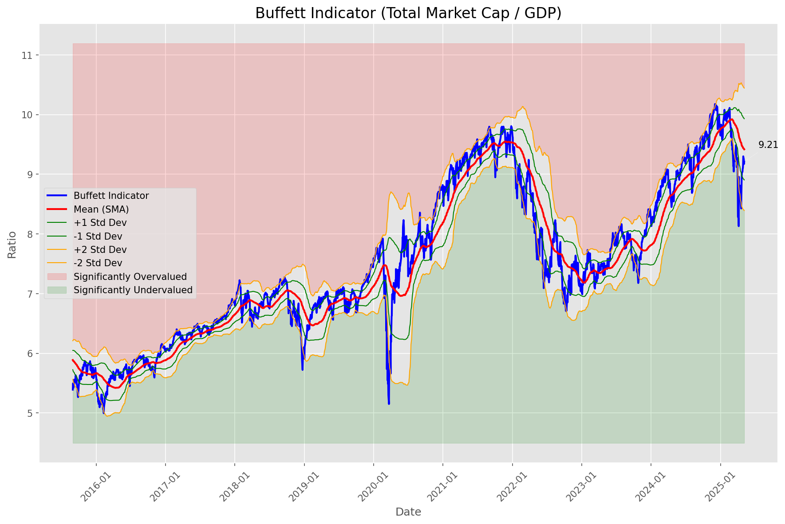
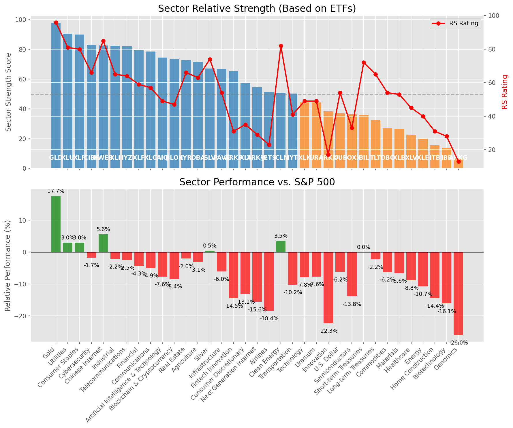

# **Daily Relative Strength Report**

**Date:** 2025-05-08

## **Market Valuation (Buffett Indicator)**

| Metric | Value |
|--------|-------|
| **Market Valuation** | **Fair Valued** |
| **Current Ratio** | 9.25 |
| **Historical Mean** | 9.42 |
| **Standard Deviation** | 0.51 |
| **Z-Score (StdDev from Mean)** | -0.41 |
| **Total Market Cap** | $277.36 trillion |
| **GDP** | $29.98 trillion |

## **Market Insights**

### **Market is Fairly Valued**

The market appears to be trading within a reasonable range of historical valuations. This suggests a balanced approach to equity investing is appropriate. Investors should:

- Focus on individual stock selection based on fundamentals and technicals
- Maintain normal equity allocations aligned with long-term goals
- Pay attention to sector rotation and relative strength
- Watch for changes in market leadership

Fair valuation typically suggests normal market returns can be expected, with stock selection becoming increasingly important.

### **Buffett Indicator Overview**

The Buffett Indicator (Total Market Cap / GDP) is a measure of the stock market's valuation relative to the size of the economy. It is named after Warren Buffett, who described it as "probably the best single measure of where valuations stand at any given moment."

- **Values above +2 standard deviations:** Market significantly overvalued
- **Values above +1 standard deviation:** Market overvalued
- **Values between -1 and +1 standard deviations:** Market fairly valued
- **Values below -1 standard deviation:** Market undervalued
- **Values below -2 standard deviations:** Market significantly undervalued

---

## **Sector Relative Strength**

Based on William O'Neil's Relative Strength Methodology

| ETF | Strength | RS Rating | Performance | Above Key MAs | Trend | Sector |
|-----|----------|-----------|-------------|--------------|-------|--------|
| [GLD](https://www.tradingview.com/chart/?symbol=GLD) | 98.0 | 96.0 | 17.48% | 10d ✓, 50d ✓, 200d ✓ | ↗️ | Gold |
| [XLU](https://www.tradingview.com/chart/?symbol=XLU) | 90.0 | 80.0 | 3.12% | 10d ✓, 50d ✓, 200d ✓ | ↗️ | Utilities |
| [XLP](https://www.tradingview.com/chart/?symbol=XLP) | 89.5 | 79.0 | 2.46% | 10d ✓, 50d ✓, 200d ✓ | ↗️ | Consumer Staples |
| [SLV](https://www.tradingview.com/chart/?symbol=SLV) | 88.0 | 76.0 | 1.16% | 10d ✓, 50d ✓, 200d ✓ | ↗️ | Silver |
| [CIBR](https://www.tradingview.com/chart/?symbol=CIBR) | 84.0 | 68.0 | -1.16% | 10d ✓, 50d ✓, 200d ✓ | ↗️ | Cybersecurity |
| [XLI](https://www.tradingview.com/chart/?symbol=XLI) | 83.0 | 66.0 | -1.87% | 10d ✓, 50d ✓, 200d ✓ | ↗️ | Industrial |
| [IYZ](https://www.tradingview.com/chart/?symbol=IYZ) | 82.0 | 64.0 | -2.49% | 10d ✓, 50d ✓, 200d ✓ | ↗️ | Telecommunications |
| [KWEB](https://www.tradingview.com/chart/?symbol=KWEB) | 81.6 | 83.0 | 4.26% | 10d ✓, 50d ✗, 200d ✓ | ↗️ | Chinese Internet |
| [XLF](https://www.tradingview.com/chart/?symbol=XLF) | 79.0 | 58.0 | -4.48% | 10d ✓, 50d ✓, 200d ✓ | ↗️ | Financial |
| [XLC](https://www.tradingview.com/chart/?symbol=XLC) | 78.5 | 57.0 | -4.96% | 10d ✓, 50d ✓, 200d ✓ | ↗️ | Communications |
| [BLOK](https://www.tradingview.com/chart/?symbol=BLOK) | 75.5 | 51.0 | -6.93% | 10d ✓, 50d ✓, 200d ✓ | ↗️ | Blockchain & Cryptocurrency |
| [AIQ](https://www.tradingview.com/chart/?symbol=AIQ) | 74.0 | 48.0 | -7.63% | 10d ✓, 50d ✓, 200d ✓ | ↗️ | Artificial Intelligence & Technology |
| [DBA](https://www.tradingview.com/chart/?symbol=DBA) | 71.1 | 62.0 | -3.10% | 10d ✗, 50d ✓, 200d ✓ | ↗️ | Agriculture |
| [PAVE](https://www.tradingview.com/chart/?symbol=PAVE) | 66.3 | 53.0 | -6.00% | 10d ✓, 50d ✓, 200d ✗ | ↗️ | Infrastructure |
| [ARKF](https://www.tradingview.com/chart/?symbol=ARKF) | 65.0 | 30.0 | -14.45% | 10d ✓, 50d ✓, 200d ✓ | ↗️ | Fintech Innovation |
| [ICLN](https://www.tradingview.com/chart/?symbol=ICLN) | 60.3 | 81.0 | 3.54% | 10d ✓, 50d ✓, 200d ✗ | ↘️ | Clean Energy |
| [XLY](https://www.tradingview.com/chart/?symbol=XLY) | 56.8 | 34.0 | -13.00% | 10d ✓, 50d ✓, 200d ✗ | ↗️ | Consumer Discretionary |
| [ARKW](https://www.tradingview.com/chart/?symbol=ARKW) | 54.1 | 28.0 | -15.55% | 10d ✗, 50d ✓, 200d ✓ | ↗️ | Next Generation Internet |
| [JETS](https://www.tradingview.com/chart/?symbol=JETS) | 51.8 | 24.0 | -17.62% | 10d ✓, 50d ✓, 200d ✗ | ↗️ | Airlines |
| [IYR](https://www.tradingview.com/chart/?symbol=IYR) | 51.5 | 63.0 | -2.73% | 10d ✗, 50d ✗, 200d ✗ | ↗️ | Real Estate |
| [IYT](https://www.tradingview.com/chart/?symbol=IYT) | 49.9 | 40.0 | -10.17% | 10d ✓, 50d ✗, 200d ✗ | ↗️ | Transportation |
| [URA](https://www.tradingview.com/chart/?symbol=URA) | 47.8 | 56.0 | -5.25% | 10d ✓, 50d ✓, 200d ✗ | ↘️ | Uranium |
| [XLK](https://www.tradingview.com/chart/?symbol=XLK) | 43.8 | 48.0 | -7.69% | 10d ✓, 50d ✓, 200d ✗ | ↘️ | Technology |
| [ARKK](https://www.tradingview.com/chart/?symbol=ARKK) | 40.4 | 21.0 | -19.38% | 10d ✗, 50d ✓, 200d ✗ | ↗️ | Innovation |
| [SOXX](https://www.tradingview.com/chart/?symbol=SOXX) | 36.8 | 34.0 | -13.03% | 10d ✓, 50d ✓, 200d ✗ | ↘️ | Semiconductors |
| [UUP](https://www.tradingview.com/chart/?symbol=UUP) | 36.4 | 53.0 | -6.08% | 10d ✓, 50d ✗, 200d ✗ | ↘️ | U.S. Dollar |
| [BIL](https://www.tradingview.com/chart/?symbol=BIL) | 36.0 | 72.0 | 0.02% | 10d ✗, 50d ✗, 200d ✗ | ↘️ | Short-term Treasuries |
| [XLB](https://www.tradingview.com/chart/?symbol=XLB) | 35.9 | 52.0 | -6.34% | 10d ✓, 50d ✗, 200d ✗ | ↘️ | Materials |
| [XLE](https://www.tradingview.com/chart/?symbol=XLE) | 33.9 | 48.0 | -7.88% | 10d ✓, 50d ✗, 200d ✗ | ↘️ | Energy |
| [TLT](https://www.tradingview.com/chart/?symbol=TLT) | 32.0 | 64.0 | -2.26% | 10d ✗, 50d ✗, 200d ✗ | ↘️ | Long-term Treasuries |
| [DBC](https://www.tradingview.com/chart/?symbol=DBC) | 26.5 | 53.0 | -6.21% | 10d ✗, 50d ✗, 200d ✗ | ↘️ | Commodities |
| [XLV](https://www.tradingview.com/chart/?symbol=XLV) | 22.0 | 44.0 | -8.95% | 10d ✗, 50d ✗, 200d ✗ | ↘️ | Healthcare |
| [ITB](https://www.tradingview.com/chart/?symbol=ITB) | 15.0 | 30.0 | -14.44% | 10d ✗, 50d ✗, 200d ✗ | ↘️ | Home Construction |
| [IBB](https://www.tradingview.com/chart/?symbol=IBB) | 12.5 | 25.0 | -16.84% | 10d ✗, 50d ✗, 200d ✗ | ↘️ | Biotechnology |
| [ARKG](https://www.tradingview.com/chart/?symbol=ARKG) | 7.5 | 15.0 | -23.27% | 10d ✗, 50d ✗, 200d ✗ | ↘️ | Genomics |

### **Sector ETF Performance Interpretation**

This table shows the relative strength metrics for different market sectors based on their representative ETFs:

- **ETF**: The ETF used to measure sector performance (click for chart)
- **Strength**: Overall sector strength score (0-100) combining multiple factors
- **RS Rating**: O'Neil RS rating of the sector ETF
- **Performance**: Performance of the sector ETF relative to SPY
- **Above Key MAs**: Whether the ETF is trading above its 10, 50, and 200-day moving averages
- **Trend**: Whether the sector is in an uptrend (↗️) or downtrend (↘️)

### **Current Sector Leadership**

The current market leadership is coming from the following sectors: **Gold, Utilities, Consumer Staples**.

The **Gold** sector (represented by **GLD**) is showing particularly strong relative strength with an RS rating of 96.0 and performance of 17.48% vs. the S&P 500. This sector is trading above its 10-day, 50-day, 200-day moving average(s). Investors should consider focusing on high RS stocks within these leading sectors for potential outperformance.

---

## **Buy Recommendations**

The following 110 stocks show exceptional relative strength:

| RS Rating | Buy Score | Current Price | Chart | Name | Ticker |
|-----------|-----------|---------------|-------|------|--------|
| 100 | 100 | $156.82 | [Chart](https://www.tradingview.com/chart/?symbol=PLMR) | Palomar Holdings, Inc. Common stock | PLMR |
| 100 | 100 | $26.68 | [Chart](https://www.tradingview.com/chart/?symbol=DB) | Deutsche Bank Aktiengesellschaft | DB |
| 100 | 100 | $76.12 | [Chart](https://www.tradingview.com/chart/?symbol=SEZL) | Sezzle Inc. Common Stock | SEZL |
| 100 | 100 | $148.94 | [Chart](https://www.tradingview.com/chart/?symbol=DAVE) | Dave Inc. Class A Common Stock | DAVE |
| 99 | 100 | $94.15 | [Chart](https://www.tradingview.com/chart/?symbol=SNEX) | StoneX Group Inc. Common Stock | SNEX |
| 99 | 100 | $286.19 | [Chart](https://www.tradingview.com/chart/?symbol=VRSN) | VeriSign Inc | VRSN |
| 99 | 100 | $19.28 | [Chart](https://www.tradingview.com/chart/?symbol=SPNT) | SiriusPoint Ltd. | SPNT |
| 99 | 100 | $182.65 | [Chart](https://www.tradingview.com/chart/?symbol=RGLD) | Royal Gold Inc | RGLD |
| 99 | 100 | $499.35 | [Chart](https://www.tradingview.com/chart/?symbol=DUOL) | Duolingo, Inc. Class A Common Stock | DUOL |
| 99 | 100 | $145.19 | [Chart](https://www.tradingview.com/chart/?symbol=UGL) | ProShares Ultra Gold | UGL |
| 99 | 100 | $22.66 | [Chart](https://www.tradingview.com/chart/?symbol=CRK) | Comstock Resources, Inc. | CRK |
| 99 | 100 | $48.18 | [Chart](https://www.tradingview.com/chart/?symbol=MRX) | Marex Group plc Ordinary Shares | MRX |
| 99 | 100 | $84.26 | [Chart](https://www.tradingview.com/chart/?symbol=WPM) | Wheaton Precious Metals Corp. Common Stock | WPM |
| 99 | 100 | $69.60 | [Chart](https://www.tradingview.com/chart/?symbol=ULS) | UL Solutions Inc. | ULS |
| 98 | 100 | $22.86 | [Chart](https://www.tradingview.com/chart/?symbol=CXW) | CoreCivic, Inc. | CXW |
| 98 | 100 | $58.86 | [Chart](https://www.tradingview.com/chart/?symbol=SKWD) | Skyward Specialty Insurance Group, Inc. Common Stock | SKWD |
| 98 | 100 | $157.68 | [Chart](https://www.tradingview.com/chart/?symbol=HWM) | Howmet Aerospace Inc. | HWM |
| 98 | 100 | $127.99 | [Chart](https://www.tradingview.com/chart/?symbol=VSEC) | VSE Corp | VSEC |
| 97 | 100 | $172.56 | [Chart](https://www.tradingview.com/chart/?symbol=PM) | Philip Morris International Inc. | PM |
| 97 | 100 | $30.47 | [Chart](https://www.tradingview.com/chart/?symbol=EUFN) | iShares MSCI Europe Financials ETF | EUFN |
| 97 | 100 | $72.98 | [Chart](https://www.tradingview.com/chart/?symbol=WRB) | W.R. Berkley Corporation | WRB |
| 97 | 100 | $294.94 | [Chart](https://www.tradingview.com/chart/?symbol=COR) | Cencora, Inc. | COR |
| 97 | 100 | $145.56 | [Chart](https://www.tradingview.com/chart/?symbol=SE) | Sea Limited American Depositary Shares, each representing one Class A Ordinary Share | SE |
| 97 | 100 | $170.22 | [Chart](https://www.tradingview.com/chart/?symbol=FNV) | Franco-Nevada Corporation | FNV |
| 97 | 100 | $150.16 | [Chart](https://www.tradingview.com/chart/?symbol=CAH) | Cardinal Health, Inc. | CAH |
| 96 | 100 | $63.34 | [Chart](https://www.tradingview.com/chart/?symbol=IAU) | iShares Gold Trust | IAU |
| 96 | 100 | $28.15 | [Chart](https://www.tradingview.com/chart/?symbol=FMS) | Fresenius Medical Care AG | FMS |
| 96 | 100 | $212.53 | [Chart](https://www.tradingview.com/chart/?symbol=IDCC) | InterDigital, Inc. | IDCC |
| 96 | 100 | $283.80 | [Chart](https://www.tradingview.com/chart/?symbol=CME) | CME Group Inc. | CME |
| 96 | 100 | $309.47 | [Chart](https://www.tradingview.com/chart/?symbol=GLD) | SPDR Gold Trust, SPDR Gold Shares | GLD |
| 96 | 100 | $144.88 | [Chart](https://www.tradingview.com/chart/?symbol=TW) | Tradeweb Markets Inc. Class A Common Stock | TW |
| 96 | 100 | $167.90 | [Chart](https://www.tradingview.com/chart/?symbol=AGX) | Argan, Inc | AGX |
| 96 | 100 | $22.87 | [Chart](https://www.tradingview.com/chart/?symbol=LAUR) | Laureate Education, Inc. Common Stock | LAUR |
| 95 | 100 | $41.56 | [Chart](https://www.tradingview.com/chart/?symbol=DRS) | Leonardo DRS, Inc. Common Stock | DRS |
| 95 | 100 | $117.48 | [Chart](https://www.tradingview.com/chart/?symbol=EHC) | Encompass Health Corporation Common Stock | EHC |
| 95 | 100 | $25.61 | [Chart](https://www.tradingview.com/chart/?symbol=PHYS) | Sprott Physical Gold Trust | PHYS |
| 95 | 100 | $49.76 | [Chart](https://www.tradingview.com/chart/?symbol=FTS) | Fortis Inc. Common Shares | FTS |
| 95 | 100 | $165.27 | [Chart](https://www.tradingview.com/chart/?symbol=ATO) | Atmos Energy Corporation | ATO |
| 95 | 100 | $40.57 | [Chart](https://www.tradingview.com/chart/?symbol=EWG) | iShares MSCI Germany ETF | EWG |
| 95 | 100 | $158.83 | [Chart](https://www.tradingview.com/chart/?symbol=LRN) | Stride, Inc. | LRN |
| 95 | 100 | $81.38 | [Chart](https://www.tradingview.com/chart/?symbol=OGS) | ONE GAS, INC. | OGS |
| 95 | 100 | $27.82 | [Chart](https://www.tradingview.com/chart/?symbol=T) | AT&T Inc. | T |
| 95 | 100 | $60.63 | [Chart](https://www.tradingview.com/chart/?symbol=MO) | Altria Group, Inc. | MO |
| 94 | 100 | $90.42 | [Chart](https://www.tradingview.com/chart/?symbol=CCEP) | Coca-Cola Europacific Partners plc Ordinary Shares | CCEP |
| 94 | 100 | $118.14 | [Chart](https://www.tradingview.com/chart/?symbol=COOP) | Mr. Cooper Group Inc. Common Stock | COOP |
| 94 | 100 | $138.61 | [Chart](https://www.tradingview.com/chart/?symbol=DTE) | DTE Energy Company | DTE |
| 94 | 100 | $1144.84 | [Chart](https://www.tradingview.com/chart/?symbol=NFLX) | NetFlix Inc | NFLX |
| 94 | 100 | $61.99 | [Chart](https://www.tradingview.com/chart/?symbol=CHEF) | The Chef's Warehouse Inc | CHEF |
| 94 | 100 | $127.78 | [Chart](https://www.tradingview.com/chart/?symbol=HIG) | The Hartford Insurance Group, Inc. | HIG |
| 94 | 100 | $82.48 | [Chart](https://www.tradingview.com/chart/?symbol=NFG) | National Fuel Gas Co. | NFG |
| 94 | 100 | $251.34 | [Chart](https://www.tradingview.com/chart/?symbol=RSG) | Republic Services Inc. | RSG |
| 93 | 100 | $232.02 | [Chart](https://www.tradingview.com/chart/?symbol=CBOE) | Cboe Global Markets, Inc. | CBOE |
| 93 | 100 | $33.03 | [Chart](https://www.tradingview.com/chart/?symbol=UTI) | Universal Technical Institute, Inc. | UTI |
| 93 | 100 | $102.09 | [Chart](https://www.tradingview.com/chart/?symbol=RBA) | RB Global, Inc. | RBA |
| 92 | 100 | $5196.24 | [Chart](https://www.tradingview.com/chart/?symbol=BKNG) | Booking Holdings Inc. Common Stock | BKNG |
| 92 | 100 | $50.81 | [Chart](https://www.tradingview.com/chart/?symbol=GFL) | GFL Environmental Inc. Subordinate Voting Shares | GFL |
| 92 | 100 | $73.95 | [Chart](https://www.tradingview.com/chart/?symbol=CMS) | CMS Energy Corporation | CMS |
| 92 | 100 | $29.40 | [Chart](https://www.tradingview.com/chart/?symbol=CEF) | Sprott Physical Gold and Silver Trust | CEF |
| 92 | 100 | $241.15 | [Chart](https://www.tradingview.com/chart/?symbol=LNG) | Cheniere Energy Inc | LNG |
| 91 | 100 | $24.80 | [Chart](https://www.tradingview.com/chart/?symbol=EWS) | iShares MSCI Singapore ETF | EWS |
| 91 | 100 | $48.77 | [Chart](https://www.tradingview.com/chart/?symbol=ERJ) | Embraer S.A. | ERJ |
| 91 | 100 | $120.25 | [Chart](https://www.tradingview.com/chart/?symbol=CWST) | Casella Waste Systems Inc | CWST |
| 91 | 100 | $35.32 | [Chart](https://www.tradingview.com/chart/?symbol=PAY) | Paymentus Holdings, Inc. | PAY |
| 90 | 100 | $465.96 | [Chart](https://www.tradingview.com/chart/?symbol=CASY) | Casey's General Stores Inc | CASY |
| 90 | 100 | $209.07 | [Chart](https://www.tradingview.com/chart/?symbol=CRS) | Carpenter Technology Corp | CRS |
| 90 | 100 | $43.95 | [Chart](https://www.tradingview.com/chart/?symbol=NWN) | Northwest Natural Holding Company | NWN |
| 90 | 100 | $25.81 | [Chart](https://www.tradingview.com/chart/?symbol=CAE) | CAE INC | CAE |
| 89 | 100 | $54.87 | [Chart](https://www.tradingview.com/chart/?symbol=RELX) | RELX PLC | RELX |
| 89 | 100 | $100.04 | [Chart](https://www.tradingview.com/chart/?symbol=AXS) | Axis Capital Holders Limited | AXS |
| 89 | 100 | $194.01 | [Chart](https://www.tradingview.com/chart/?symbol=LOPE) | Grand Canyon Education, Inc | LOPE |
| 89 | 100 | $200.27 | [Chart](https://www.tradingview.com/chart/?symbol=BAP) | Credicorp LTD | BAP |
| 89 | 100 | $284.51 | [Chart](https://www.tradingview.com/chart/?symbol=CVNA) | Carvana Co. | CVNA |
| 88 | 100 | $41.71 | [Chart](https://www.tradingview.com/chart/?symbol=HMN) | Horace Mann Educators Corporation | HMN |
| 85 | 100 | $40.22 | [Chart](https://www.tradingview.com/chart/?symbol=NI) | NiSource Inc. | NI |
| 89 | 99 | $51.55 | [Chart](https://www.tradingview.com/chart/?symbol=EPR) | EPR Properties | EPR |
| 88 | 99 | $50.47 | [Chart](https://www.tradingview.com/chart/?symbol=TRP) | TC Energy Corporation | TRP |
| 86 | 99 | $71.11 | [Chart](https://www.tradingview.com/chart/?symbol=XEL) | Xcel Energy, Inc. | XEL |
| 85 | 99 | $70.95 | [Chart](https://www.tradingview.com/chart/?symbol=RBLX) | Roblox Corporation | RBLX |
| 88 | 98 | $42.30 | [Chart](https://www.tradingview.com/chart/?symbol=FHI) | Federated Hermes, Inc. | FHI |
| 88 | 98 | $57.66 | [Chart](https://www.tradingview.com/chart/?symbol=IGF) | iShares Global Infrastructure ETF | IGF |
| 86 | 98 | $339.75 | [Chart](https://www.tradingview.com/chart/?symbol=AJG) | Arthur J. Gallagher & Co. | AJG |
| 86 | 98 | $31.91 | [Chart](https://www.tradingview.com/chart/?symbol=SLM) | SLM Corporation | SLM |
| 85 | 98 | $169.68 | [Chart](https://www.tradingview.com/chart/?symbol=TKO) | TKO Group Holdings, Inc. | TKO |
| 85 | 97 | $43.85 | [Chart](https://www.tradingview.com/chart/?symbol=BTI) | British American Tobacco p.l.c. American Depositary Shares, American Depositary Shares, each representing one Ordinary Share | BTI |
| 86 | 96 | $64.63 | [Chart](https://www.tradingview.com/chart/?symbol=RYTM) | Rhythm Pharmaceuticals, Inc. Common Stock | RYTM |
| 86 | 96 | $121.50 | [Chart](https://www.tradingview.com/chart/?symbol=DUK) | Duke Energy Corporation | DUK |
| 86 | 96 | $178.00 | [Chart](https://www.tradingview.com/chart/?symbol=ICE) | Intercontinental Exchange  Inc. | ICE |
| 85 | 96 | $204.07 | [Chart](https://www.tradingview.com/chart/?symbol=ALL) | The Allstate Corporation | ALL |
| 84 | 96 | $38.09 | [Chart](https://www.tradingview.com/chart/?symbol=ORI) | Old Republic International Corporation | ORI |
| 83 | 96 | $116.20 | [Chart](https://www.tradingview.com/chart/?symbol=PLTR) | Palantir Technologies Inc. Class A Common Stock | PLTR |
| 83 | 96 | $114.74 | [Chart](https://www.tradingview.com/chart/?symbol=ATGE) | Adtalem Global Education Inc. Common Shares | ATGE |
| 83 | 96 | $134.08 | [Chart](https://www.tradingview.com/chart/?symbol=ABT) | Abbott Laboratories | ABT |
| 83 | 96 | $166.99 | [Chart](https://www.tradingview.com/chart/?symbol=THG) | The Hanover Insurance Group, Inc. | THG |
| 83 | 96 | $295.76 | [Chart](https://www.tradingview.com/chart/?symbol=SAP) | SAP SE | SAP |
| 85 | 95 | $26.57 | [Chart](https://www.tradingview.com/chart/?symbol=IIIV) | i3 Verticals, Inc. Class A Common Stock | IIIV |
| 84 | 94 | $164.82 | [Chart](https://www.tradingview.com/chart/?symbol=MAA) | Mid-America Apartment Communities, Inc. | MAA |
| 83 | 94 | $308.15 | [Chart](https://www.tradingview.com/chart/?symbol=VRSK) | Verisk Analytics, Inc. Common Stock | VRSK |
| 81 | 94 | $80.51 | [Chart](https://www.tradingview.com/chart/?symbol=UNM) | Unum Group | UNM |
| 81 | 94 | $648.08 | [Chart](https://www.tradingview.com/chart/?symbol=SPOT) | Spotify Technology S.A. | SPOT |
| 81 | 93 | $69.69 | [Chart](https://www.tradingview.com/chart/?symbol=EBAY) | eBay Inc | EBAY |
| 82 | 92 | $197.07 | [Chart](https://www.tradingview.com/chart/?symbol=WCN) | Waste Connections, Inc. | WCN |
| 80 | 92 | $25.65 | [Chart](https://www.tradingview.com/chart/?symbol=IMAX) | Imax Corp | IMAX |
| 80 | 92 | $27.55 | [Chart](https://www.tradingview.com/chart/?symbol=KMI) | Kinder Morgan, Inc. | KMI |
| 81 | 91 | $31.02 | [Chart](https://www.tradingview.com/chart/?symbol=MFC) | Manulife Financial Corp. | MFC |
| 80 | 91 | $41.07 | [Chart](https://www.tradingview.com/chart/?symbol=AB) | AllianceBernstein Holding, L.P. | AB |
| 80 | 90 | $212.41 | [Chart](https://www.tradingview.com/chart/?symbol=GE) | GE Aerospace | GE |
| 80 | 90 | $110.43 | [Chart](https://www.tradingview.com/chart/?symbol=OLLI) | Ollie's Bargain Outlet Holdings, Inc. Common Stock | OLLI |
| 80 | 90 | $70.93 | [Chart](https://www.tradingview.com/chart/?symbol=RYAN) | Ryan Specialty Holdings, Inc. | RYAN |
| 80 | 90 | $82.00 | [Chart](https://www.tradingview.com/chart/?symbol=CASH) | Pathward Financial, Inc. Common Stock | CASH |
| 80 | 90 | $27.70 | [Chart](https://www.tradingview.com/chart/?symbol=ATAT) | Atour Lifestyle Holdings Limited American Depositary Shares | ATAT |

---

## **Sell Recommendations**

The following 110 stocks show deteriorating relative strength:

| RS Rating | Sell Score | Current Price | Chart | Name | Ticker |
|-----------|------------|---------------|-------|------|--------|
| 1 | 100 | $20.07 | [Chart](https://www.tradingview.com/chart/?symbol=GCO) | Genesco Inc. | GCO |
| 2 | 100 | $10.94 | [Chart](https://www.tradingview.com/chart/?symbol=NRIX) | Nurix Therapeutics, Inc. Common stock | NRIX |
| 3 | 100 | $26.92 | [Chart](https://www.tradingview.com/chart/?symbol=TNA) | Direxion Daily Small Cap Bull 3x Shares | TNA |
| 3 | 100 | $17.34 | [Chart](https://www.tradingview.com/chart/?symbol=SSTK) | SHUTTERSTOCK, INC. | SSTK |
| 3 | 100 | $19.12 | [Chart](https://www.tradingview.com/chart/?symbol=DAVA) | Endava plc American Depositary Shares (each representing one Class A Ordinary Share) | DAVA |
| 4 | 100 | $20.64 | [Chart](https://www.tradingview.com/chart/?symbol=SPT) | Sprout Social, Inc Class A Common Stock | SPT |
| 4 | 100 | $71.44 | [Chart](https://www.tradingview.com/chart/?symbol=ANF) | Abercrombie & Fitch Co. | ANF |
| 5 | 100 | $12.78 | [Chart](https://www.tradingview.com/chart/?symbol=DQ) | Daqo New Energy Corp. American Depositary Shares (each representing 5 Ordinary Shares) | DQ |
| 5 | 100 | $31.41 | [Chart](https://www.tradingview.com/chart/?symbol=AAP) | ADVANCE AUTO PARTS INC | AAP |
| 5 | 100 | $10.39 | [Chart](https://www.tradingview.com/chart/?symbol=PUBM) | PubMatic, Inc. Class A Common Stock | PUBM |
| 5 | 100 | $10.95 | [Chart](https://www.tradingview.com/chart/?symbol=ARCT) | Arcturus Therapeutics Holdings Inc. Common Stock | ARCT |
| 6 | 100 | $12.76 | [Chart](https://www.tradingview.com/chart/?symbol=MNRO) | Monro, Inc. Common Stock | MNRO |
| 6 | 100 | $43.91 | [Chart](https://www.tradingview.com/chart/?symbol=ENPH) | Enphase Energy, Inc. | ENPH |
| 6 | 100 | $10.00 | [Chart](https://www.tradingview.com/chart/?symbol=DYN) | Dyne Therapeutics, Inc. Common Stock | DYN |
| 7 | 100 | $24.50 | [Chart](https://www.tradingview.com/chart/?symbol=AA) | Alcoa Corporation | AA |
| 8 | 100 | $31.98 | [Chart](https://www.tradingview.com/chart/?symbol=CYTK) | Cytokinetics Inc. | CYTK |
| 8 | 100 | $13.84 | [Chart](https://www.tradingview.com/chart/?symbol=GCT) | GigaCloud Technology Inc Class A Ordinary Shares | GCT |
| 9 | 100 | $10.92 | [Chart](https://www.tradingview.com/chart/?symbol=JAMF) | Jamf Holding Corp. Common Stock | JAMF |
| 9 | 100 | $31.80 | [Chart](https://www.tradingview.com/chart/?symbol=UWM) | ProShares Ultra Russell2000 | UWM |
| 9 | 100 | $15.46 | [Chart](https://www.tradingview.com/chart/?symbol=DXC) | DXC Technology Company | DXC |
| 9 | 100 | $28.01 | [Chart](https://www.tradingview.com/chart/?symbol=SRDX) | Surmodics, Inc. Common Stock | SRDX |
| 10 | 100 | $11.33 | [Chart](https://www.tradingview.com/chart/?symbol=AEO) | American Eagle Outfitters | AEO |
| 10 | 100 | $96.67 | [Chart](https://www.tradingview.com/chart/?symbol=TGT) | Target Corporation | TGT |
| 11 | 100 | $56.75 | [Chart](https://www.tradingview.com/chart/?symbol=AMWD) | American Woodmark Corp | AMWD |
| 15 | 100 | $127.64 | [Chart](https://www.tradingview.com/chart/?symbol=FSLR) | First Solar, Inc. | FSLR |
| 5 | 99 | $30.50 | [Chart](https://www.tradingview.com/chart/?symbol=SPHR) | Sphere Entertainment Co. | SPHR |
| 5 | 98 | $78.56 | [Chart](https://www.tradingview.com/chart/?symbol=ILMN) | Illumina Inc | ILMN |
| 9 | 98 | $43.39 | [Chart](https://www.tradingview.com/chart/?symbol=RHI) | Robert Half Inc. | RHI |
| 15 | 98 | $16.33 | [Chart](https://www.tradingview.com/chart/?symbol=SVOL) | Simplify Volatility Premium ETF | SVOL |
| 4 | 97 | $10.02 | [Chart](https://www.tradingview.com/chart/?symbol=LSPD) | Lightspeed Commerce Inc. | LSPD |
| 5 | 97 | $176.95 | [Chart](https://www.tradingview.com/chart/?symbol=MDB) | MongoDB, Inc. Class A | MDB |
| 13 | 97 | $17.87 | [Chart](https://www.tradingview.com/chart/?symbol=IDYA) | IDEAYA Biosciences, Inc. Common Stock | IDYA |
| 7 | 96 | $107.90 | [Chart](https://www.tradingview.com/chart/?symbol=BLDR) | Builders FirstSource, Inc. | BLDR |
| 13 | 96 | $15.58 | [Chart](https://www.tradingview.com/chart/?symbol=PENN) | PENN Entertainment, Inc. Common Stock | PENN |
| 10 | 95 | $10.31 | [Chart](https://www.tradingview.com/chart/?symbol=VREX) | Varex Imaging Corporation Common Stock | VREX |
| 10 | 95 | $10.77 | [Chart](https://www.tradingview.com/chart/?symbol=SONO) | Sonos, Inc. Common Stock | SONO |
| 14 | 95 | $14.93 | [Chart](https://www.tradingview.com/chart/?symbol=PSFE) | Paysafe Limited | PSFE |
| 18 | 95 | $25.86 | [Chart](https://www.tradingview.com/chart/?symbol=GDEN) | Golden Entertainment, Inc. Common Stock | GDEN |
| 11 | 94 | $18.38 | [Chart](https://www.tradingview.com/chart/?symbol=OII) | Oceaneering International Inc. | OII |
| 13 | 94 | $27.07 | [Chart](https://www.tradingview.com/chart/?symbol=CZR) | Caesars Entertainment, Inc. Common Stock | CZR |
| 14 | 94 | $77.98 | [Chart](https://www.tradingview.com/chart/?symbol=WHR) | Whirlpool Corp. | WHR |
| 15 | 94 | $13.83 | [Chart](https://www.tradingview.com/chart/?symbol=ZIM) | ZIM Integrated Shipping Services Ltd. | ZIM |
| 21 | 94 | $11.80 | [Chart](https://www.tradingview.com/chart/?symbol=M) | Macy's Inc. | M |
| 19 | 93 | $16.22 | [Chart](https://www.tradingview.com/chart/?symbol=TRMD) | TORM plc Class A Common Stock | TRMD |
| 19 | 93 | $11.22 | [Chart](https://www.tradingview.com/chart/?symbol=AEYE) | AudioEye, Inc. Common Stock | AEYE |
| 26 | 93 | $12.95 | [Chart](https://www.tradingview.com/chart/?symbol=MED) | Medifast, Inc. | MED |
| 15 | 92 | $16.81 | [Chart](https://www.tradingview.com/chart/?symbol=COLD) | Americold Realty Trust, Inc. | COLD |
| 22 | 92 | $10.12 | [Chart](https://www.tradingview.com/chart/?symbol=BWLP) | BW LPG Limited | BWLP |
| 15 | 91 | $58.23 | [Chart](https://www.tradingview.com/chart/?symbol=SYNA) | Synaptics Inc | SYNA |
| 19 | 91 | $13.21 | [Chart](https://www.tradingview.com/chart/?symbol=NVGS) | NAVIGATOR HOLDINGS LTD. | NVGS |
| 20 | 91 | $34.06 | [Chart](https://www.tradingview.com/chart/?symbol=TECK) | Teck Resources Limited | TECK |
| 21 | 91 | $26.23 | [Chart](https://www.tradingview.com/chart/?symbol=HPQ) | HP Inc. | HPQ |
| 23 | 91 | $28.22 | [Chart](https://www.tradingview.com/chart/?symbol=AGIO) | Agios Pharmaceuticals, Inc. | AGIO |
| 17 | 90 | $22.12 | [Chart](https://www.tradingview.com/chart/?symbol=AMRK) | A-Mark Precious Metals, Inc. | AMRK |
| 18 | 90 | $10.03 | [Chart](https://www.tradingview.com/chart/?symbol=MTAL) | MAC Copper Limited | MTAL |
| 19 | 90 | $31.39 | [Chart](https://www.tradingview.com/chart/?symbol=CRNX) | Crinetics Pharmaceuticals, Inc. | CRNX |
| 19 | 90 | $53.71 | [Chart](https://www.tradingview.com/chart/?symbol=KBH) | KB Home | KBH |
| 25 | 90 | $10.34 | [Chart](https://www.tradingview.com/chart/?symbol=CMRE) | Costamare Inc. | CMRE |
| 30 | 90 | $14.29 | [Chart](https://www.tradingview.com/chart/?symbol=FXN) | First Trust Energy AlphaDEX Fund | FXN |
| 17 | 89 | $188.37 | [Chart](https://www.tradingview.com/chart/?symbol=DKS) | Dick's Sporting Goods, Inc. | DKS |
| 29 | 89 | $11.15 | [Chart](https://www.tradingview.com/chart/?symbol=GES) | Guess?, Inc. | GES |
| 19 | 88 | $17.71 | [Chart](https://www.tradingview.com/chart/?symbol=INFY) | Infosys Limited American Depositary Shares | INFY |
| 22 | 88 | $47.72 | [Chart](https://www.tradingview.com/chart/?symbol=ERX) | Direxion Daily Energy Bull 2X Shares | ERX |
| 20 | 87 | $68.89 | [Chart](https://www.tradingview.com/chart/?symbol=BBY) | Best Buy Company, Inc. | BBY |
| 20 | 87 | $155.59 | [Chart](https://www.tradingview.com/chart/?symbol=ODFL) | Old Dominion Freight Line | ODFL |
| 24 | 87 | $12.08 | [Chart](https://www.tradingview.com/chart/?symbol=DBO) | Invesco DB Oil Fund | DBO |
| 26 | 87 | $11.39 | [Chart](https://www.tradingview.com/chart/?symbol=KELYA) | Kelly Services Inc | KELYA |
| 14 | 86 | $59.23 | [Chart](https://www.tradingview.com/chart/?symbol=SLVM) | Sylvamo Corporation | SLVM |
| 22 | 86 | $62.20 | [Chart](https://www.tradingview.com/chart/?symbol=SPB) | Spectrum Brands Holdings, Inc. | SPB |
| 18 | 85 | $14.45 | [Chart](https://www.tradingview.com/chart/?symbol=INMD) | InMode Ltd. Ordinary Shares | INMD |
| 19 | 85 | $15.31 | [Chart](https://www.tradingview.com/chart/?symbol=PD) | PagerDuty, Inc. | PD |
| 25 | 85 | $18.99 | [Chart](https://www.tradingview.com/chart/?symbol=PLAB) | Photronics Inc | PLAB |
| 28 | 85 | $65.82 | [Chart](https://www.tradingview.com/chart/?symbol=DD) | DuPont de Nemours, Inc. Common Stock | DD |
| 31 | 85 | $69.42 | [Chart](https://www.tradingview.com/chart/?symbol=TTC) | Toro Company (The) | TTC |
| 29 | 84 | $144.59 | [Chart](https://www.tradingview.com/chart/?symbol=QCOM) | Qualcomm Inc | QCOM |
| 36 | 84 | $29.60 | [Chart](https://www.tradingview.com/chart/?symbol=TAN) | Invesco Solar ETF | TAN |
| 29 | 83 | $10.01 | [Chart](https://www.tradingview.com/chart/?symbol=XPRO) | Expro Group Holdings N.V. | XPRO |
| 29 | 82 | $92.08 | [Chart](https://www.tradingview.com/chart/?symbol=CHRD) | Chord Energy Corporation Common Stock | CHRD |
| 34 | 82 | $35.29 | [Chart](https://www.tradingview.com/chart/?symbol=GFS) | GlobalFoundries Inc. Ordinary Shares | GFS |
| 25 | 81 | $29.76 | [Chart](https://www.tradingview.com/chart/?symbol=MBUU) | Malibu Boats, Inc. Class A | MBUU |
| 26 | 80 | $139.44 | [Chart](https://www.tradingview.com/chart/?symbol=MTN) | Vail Resorts, Inc. | MTN |
| 29 | 79 | $10.25 | [Chart](https://www.tradingview.com/chart/?symbol=AVO) | Mission Produce, Inc. Common Stock | AVO |
| 31 | 79 | $50.84 | [Chart](https://www.tradingview.com/chart/?symbol=LW) | Lamb Weston Holdings, Inc. | LW |
| 35 | 79 | $19.96 | [Chart](https://www.tradingview.com/chart/?symbol=CSWC) | Capital Southwest Corp | CSWC |
| 23 | 78 | $116.05 | [Chart](https://www.tradingview.com/chart/?symbol=GNRC) | GENERAC HOLDINGS INC | GNRC |
| 29 | 78 | $42.46 | [Chart](https://www.tradingview.com/chart/?symbol=FEPI) | REX FANG & Innovation Equity Premium Income ETF | FEPI |
| 30 | 78 | $91.13 | [Chart](https://www.tradingview.com/chart/?symbol=ITB) | iShares U.S. Home Construction ETF | ITB |
| 33 | 78 | $22.12 | [Chart](https://www.tradingview.com/chart/?symbol=ST) | Sensata Technologies Holding plc | ST |
| 27 | 77 | $216.89 | [Chart](https://www.tradingview.com/chart/?symbol=FDX) | FedEx Corporation | FDX |
| 33 | 77 | $17.96 | [Chart](https://www.tradingview.com/chart/?symbol=JKS) | JINKOSOLAR HOLDINGS CO | JKS |
| 24 | 76 | $10.22 | [Chart](https://www.tradingview.com/chart/?symbol=SEMR) | SEMrush Holdings, Inc. | SEMR |
| 25 | 76 | $18.27 | [Chart](https://www.tradingview.com/chart/?symbol=ELVN) | Enliven Therapeutics, Inc. Common Stock | ELVN |
| 31 | 76 | $14.24 | [Chart](https://www.tradingview.com/chart/?symbol=BMEZ) | BlackRock Health Sciences Term Trust | BMEZ |
| 26 | 75 | $28.89 | [Chart](https://www.tradingview.com/chart/?symbol=MTCH) | Match Group, Inc | MTCH |
| 34 | 75 | $28.46 | [Chart](https://www.tradingview.com/chart/?symbol=CSX) | CSX Corporation | CSX |
| 29 | 74 | $53.38 | [Chart](https://www.tradingview.com/chart/?symbol=ALRM) | Alarm.com Holdings, Inc. | ALRM |
| 33 | 73 | $26.54 | [Chart](https://www.tradingview.com/chart/?symbol=BNO) | United States Brent Oil Fund, LP | BNO |
| 37 | 73 | $33.89 | [Chart](https://www.tradingview.com/chart/?symbol=MGA) | Magna International | MGA |
| 32 | 72 | $33.05 | [Chart](https://www.tradingview.com/chart/?symbol=ALLY) | Ally Financial Inc. | ALLY |
| 32 | 72 | $53.53 | [Chart](https://www.tradingview.com/chart/?symbol=GEF) | Greif, Inc. | GEF |
| 37 | 72 | $95.10 | [Chart](https://www.tradingview.com/chart/?symbol=XHB) | SPDR S&P Homebuilders ETF | XHB |
| 38 | 71 | $33.57 | [Chart](https://www.tradingview.com/chart/?symbol=SQM) | Sociedad Quimica y Minera de Chile SA | SQM |
| 35 | 70 | $16.83 | [Chart](https://www.tradingview.com/chart/?symbol=MLNK) | MeridianLink, Inc. | MLNK |
| 39 | 70 | $25.47 | [Chart](https://www.tradingview.com/chart/?symbol=RCI) | Rogers Communications, Inc. | RCI |
| 36 | 69 | $189.29 | [Chart](https://www.tradingview.com/chart/?symbol=NDSN) | Nordson Corp | NDSN |
| 36 | 69 | $27.05 | [Chart](https://www.tradingview.com/chart/?symbol=COLL) | Collegium Pharmaceutical, Inc. Common Stock | COLL |
| 35 | 67 | $74.15 | [Chart](https://www.tradingview.com/chart/?symbol=WFG) | West Fraser Timber Co. Ltd | WFG |
| 36 | 66 | $16.39 | [Chart](https://www.tradingview.com/chart/?symbol=QYLD) | Global X Funds Global X NASDAQ-100 Covered Call ETF | QYLD |
| 37 | 66 | $215.02 | [Chart](https://www.tradingview.com/chart/?symbol=UNP) | Union Pacific Corp. | UNP |
| 38 | 66 | $112.56 | [Chart](https://www.tradingview.com/chart/?symbol=VDE) | Vanguard Energy ETF | VDE |

## **Methodology**

This report uses William O'Neil's relative strength methodology from Investors Business Daily:

* **RS Rating**: Percentile rank of stock's performance vs. S&P 500 over the past 63 trading days (1-99 scale)
* **Buy Criteria**: RS Rating >= 80, price above 50-day MA, strong uptrend, increasing volume
* **Sell Criteria**: RS Rating < 40, price below 50-day MA, downtrend, decreasing volume

### **O'Neil's Key Principles**

1. **Focus on relative performance** - stocks outperforming the market
2. **Price trend confirmation** - stock must be in an uptrend
3. **Volume confirmation** - strong volume supports price moves
4. **Moving average validation** - price above key moving averages
5. **Market leaders only** - concentrate on top-performing stocks

*Report generated automatically after market close*