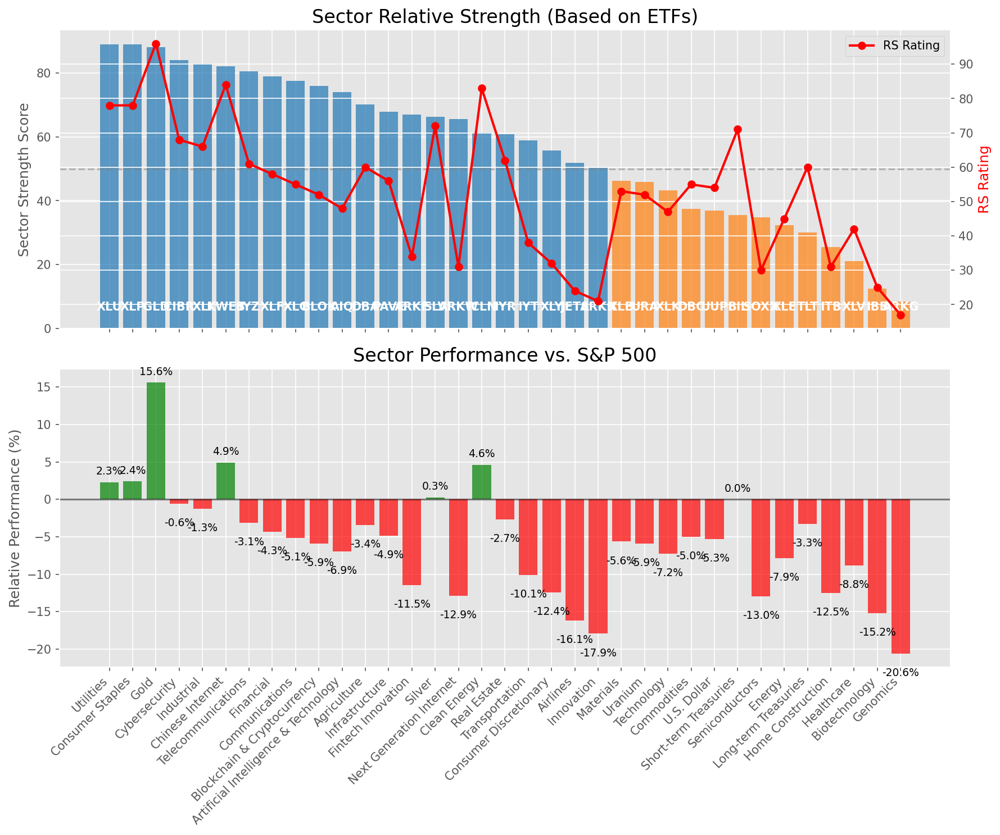

# **Daily Relative Strength Report**

**Date:** 2025-05-08

## **Market Valuation (Buffett Indicator)**

| Metric | Value |
|--------|-------|
| **Market Valuation** | **Fair Valued** |
| **Current Ratio** | 9.35 |
| **Historical Mean** | 9.42 |
| **Standard Deviation** | 0.51 |
| **Z-Score (StdDev from Mean)** | -0.41 |
| **Total Market Cap** | $280.40 trillion |
| **GDP** | $29.98 trillion |

## **Market Insights**

### **Market is Fairly Valued**

The market appears to be trading within a reasonable range of historical valuations. This suggests a balanced approach to equity investing is appropriate. Investors should:

- Focus on individual stock selection based on fundamentals and technicals
- Maintain normal equity allocations aligned with long-term goals
- Pay attention to sector rotation and relative strength
- Watch for changes in market leadership

Fair valuation typically suggests normal market returns can be expected, with stock selection becoming increasingly important.

### **Buffett Indicator Overview**

The Buffett Indicator (Total Market Cap / GDP) is a measure of the stock market's valuation relative to the size of the economy. It is named after Warren Buffett, who described it as "probably the best single measure of where valuations stand at any given moment."

- **Values above +2 standard deviations:** Market significantly overvalued
- **Values above +1 standard deviation:** Market overvalued
- **Values between -1 and +1 standard deviations:** Market fairly valued
- **Values below -1 standard deviation:** Market undervalued
- **Values below -2 standard deviations:** Market significantly undervalued

---

## **Sector Relative Strength**

Based on William O'Neil's Relative Strength Methodology

| ETF | Strength | RS Rating | Performance | Above Key MAs | Trend | Sector |
|-----|----------|-----------|-------------|--------------|-------|--------|
| [XLP](https://www.tradingview.com/chart/?symbol=XLP) | 89.5 | 79.0 | 2.98% | 10d ✓, 50d ✓, 200d ✓ | ↗️ | Consumer Staples |
| [XLU](https://www.tradingview.com/chart/?symbol=XLU) | 89.5 | 79.0 | 3.21% | 10d ✓, 50d ✓, 200d ✓ | ↗️ | Utilities |
| [GLD](https://www.tradingview.com/chart/?symbol=GLD) | 88.1 | 96.0 | 15.95% | 10d ✗, 50d ✓, 200d ✓ | ↗️ | Gold |
| [CIBR](https://www.tradingview.com/chart/?symbol=CIBR) | 84.5 | 69.0 | -0.11% | 10d ✓, 50d ✓, 200d ✓ | ↗️ | Cybersecurity |
| [XLI](https://www.tradingview.com/chart/?symbol=XLI) | 84.0 | 68.0 | -0.46% | 10d ✓, 50d ✓, 200d ✓ | ↗️ | Industrial |
| [KWEB](https://www.tradingview.com/chart/?symbol=KWEB) | 81.1 | 82.0 | 4.84% | 10d ✓, 50d ✗, 200d ✓ | ↗️ | Chinese Internet |
| [IYZ](https://www.tradingview.com/chart/?symbol=IYZ) | 81.0 | 62.0 | -2.43% | 10d ✓, 50d ✓, 200d ✓ | ↗️ | Telecommunications |
| [XLF](https://www.tradingview.com/chart/?symbol=XLF) | 79.5 | 59.0 | -3.54% | 10d ✓, 50d ✓, 200d ✓ | ↗️ | Financial |
| [XLC](https://www.tradingview.com/chart/?symbol=XLC) | 78.0 | 56.0 | -4.35% | 10d ✓, 50d ✓, 200d ✓ | ↗️ | Communications |
| [BLOK](https://www.tradingview.com/chart/?symbol=BLOK) | 76.0 | 52.0 | -5.45% | 10d ✓, 50d ✓, 200d ✓ | ↗️ | Blockchain & Cryptocurrency |
| [AIQ](https://www.tradingview.com/chart/?symbol=AIQ) | 74.5 | 49.0 | -6.41% | 10d ✓, 50d ✓, 200d ✓ | ↗️ | Artificial Intelligence & Technology |
| [IYR](https://www.tradingview.com/chart/?symbol=IYR) | 71.8 | 64.0 | -1.70% | 10d ✓, 50d ✓, 200d ✗ | ↗️ | Real Estate |
| [DBA](https://www.tradingview.com/chart/?symbol=DBA) | 69.6 | 59.0 | -3.68% | 10d ✗, 50d ✓, 200d ✓ | ↗️ | Agriculture |
| [PAVE](https://www.tradingview.com/chart/?symbol=PAVE) | 68.3 | 57.0 | -4.28% | 10d ✓, 50d ✓, 200d ✗ | ↗️ | Infrastructure |
| [ARKF](https://www.tradingview.com/chart/?symbol=ARKF) | 68.0 | 36.0 | -11.05% | 10d ✓, 50d ✓, 200d ✓ | ↗️ | Fintech Innovation |
| [SLV](https://www.tradingview.com/chart/?symbol=SLV) | 66.2 | 72.0 | 0.43% | 10d ✗, 50d ✗, 200d ✓ | ↗️ | Silver |
| [ICLN](https://www.tradingview.com/chart/?symbol=ICLN) | 60.8 | 82.0 | 4.42% | 10d ✓, 50d ✓, 200d ✗ | ↘️ | Clean Energy |
| [ARKK](https://www.tradingview.com/chart/?symbol=ARKK) | 60.5 | 21.0 | -17.50% | 10d ✓, 50d ✓, 200d ✓ | ↗️ | Innovation |
| [IYT](https://www.tradingview.com/chart/?symbol=IYT) | 59.3 | 39.0 | -9.53% | 10d ✓, 50d ✓, 200d ✗ | ↗️ | Transportation |
| [XLY](https://www.tradingview.com/chart/?symbol=XLY) | 56.8 | 34.0 | -11.77% | 10d ✓, 50d ✓, 200d ✗ | ↗️ | Consumer Discretionary |
| [ARKW](https://www.tradingview.com/chart/?symbol=ARKW) | 52.6 | 25.0 | -15.55% | 10d ✗, 50d ✓, 200d ✓ | ↗️ | Next Generation Internet |
| [JETS](https://www.tradingview.com/chart/?symbol=JETS) | 52.3 | 25.0 | -15.72% | 10d ✓, 50d ✓, 200d ✗ | ↗️ | Airlines |
| [URA](https://www.tradingview.com/chart/?symbol=URA) | 46.8 | 54.0 | -5.22% | 10d ✓, 50d ✓, 200d ✗ | ↘️ | Uranium |
| [XLB](https://www.tradingview.com/chart/?symbol=XLB) | 46.8 | 54.0 | -5.03% | 10d ✓, 50d ✓, 200d ✗ | ↘️ | Materials |
| [XLK](https://www.tradingview.com/chart/?symbol=XLK) | 44.3 | 49.0 | -6.48% | 10d ✓, 50d ✓, 200d ✗ | ↘️ | Technology |
| [SOXX](https://www.tradingview.com/chart/?symbol=SOXX) | 36.8 | 34.0 | -11.82% | 10d ✓, 50d ✓, 200d ✗ | ↘️ | Semiconductors |
| [DBC](https://www.tradingview.com/chart/?symbol=DBC) | 36.4 | 53.0 | -5.30% | 10d ✓, 50d ✗, 200d ✗ | ↘️ | Commodities |
| [UUP](https://www.tradingview.com/chart/?symbol=UUP) | 36.4 | 53.0 | -5.40% | 10d ✓, 50d ✗, 200d ✗ | ↘️ | U.S. Dollar |
| [BIL](https://www.tradingview.com/chart/?symbol=BIL) | 35.0 | 70.0 | 0.01% | 10d ✗, 50d ✗, 200d ✗ | ↘️ | Short-term Treasuries |
| [XLE](https://www.tradingview.com/chart/?symbol=XLE) | 33.9 | 48.0 | -6.79% | 10d ✓, 50d ✗, 200d ✗ | ↘️ | Energy |
| [TLT](https://www.tradingview.com/chart/?symbol=TLT) | 31.0 | 62.0 | -2.49% | 10d ✗, 50d ✗, 200d ✗ | ↘️ | Long-term Treasuries |
| [ITB](https://www.tradingview.com/chart/?symbol=ITB) | 26.4 | 33.0 | -11.99% | 10d ✓, 50d ✗, 200d ✗ | ↘️ | Home Construction |
| [XLV](https://www.tradingview.com/chart/?symbol=XLV) | 21.5 | 43.0 | -8.32% | 10d ✗, 50d ✗, 200d ✗ | ↘️ | Healthcare |
| [IBB](https://www.tradingview.com/chart/?symbol=IBB) | 13.0 | 26.0 | -15.02% | 10d ✗, 50d ✗, 200d ✗ | ↘️ | Biotechnology |
| [ARKG](https://www.tradingview.com/chart/?symbol=ARKG) | 8.5 | 17.0 | -20.37% | 10d ✗, 50d ✗, 200d ✗ | ↘️ | Genomics |

### **Sector ETF Performance Interpretation**

This table shows the relative strength metrics for different market sectors based on their representative ETFs:

- **ETF**: The ETF used to measure sector performance (click for chart)
- **Strength**: Overall sector strength score (0-100) combining multiple factors
- **RS Rating**: O'Neil RS rating of the sector ETF
- **Performance**: Performance of the sector ETF relative to SPY
- **Above Key MAs**: Whether the ETF is trading above its 10, 50, and 200-day moving averages
- **Trend**: Whether the sector is in an uptrend (↗️) or downtrend (↘️)

### **Current Sector Leadership**

The current market leadership is coming from the following sectors: **Consumer Staples, Utilities, Gold**.

The **Consumer Staples** sector (represented by **XLP**) is showing particularly strong relative strength with an RS rating of 79.0 and performance of 2.98% vs. the S&P 500. This sector is trading above its 10-day, 50-day, 200-day moving average(s). Investors should consider focusing on high RS stocks within these leading sectors for potential outperformance.

---

## **Buy Recommendations**

The following 100 stocks show exceptional relative strength:

| RS Rating | Buy Score | Current Price | Chart | Name | Ticker |
|-----------|-----------|---------------|-------|------|--------|
| 100 | 100 | $80.27 | [Chart](https://www.tradingview.com/chart/?symbol=SEZL) | Sezzle Inc. Common Stock | SEZL |
| 100 | 100 | $161.83 | [Chart](https://www.tradingview.com/chart/?symbol=PLMR) | Palomar Holdings, Inc. Common stock | PLMR |
| 100 | 100 | $19.56 | [Chart](https://www.tradingview.com/chart/?symbol=SPNT) | SiriusPoint Ltd. | SPNT |
| 100 | 100 | $26.73 | [Chart](https://www.tradingview.com/chart/?symbol=DB) | Deutsche Bank Aktiengesellschaft | DB |
| 100 | 100 | $148.38 | [Chart](https://www.tradingview.com/chart/?symbol=DAVE) | Dave Inc. Class A Common Stock | DAVE |
| 99 | 100 | $420.15 | [Chart](https://www.tradingview.com/chart/?symbol=MSTR) | MicroStrategy Inc | MSTR |
| 99 | 100 | $22.95 | [Chart](https://www.tradingview.com/chart/?symbol=CRK) | Comstock Resources, Inc. | CRK |
| 99 | 100 | $146.85 | [Chart](https://www.tradingview.com/chart/?symbol=ROOT) | Root, Inc. Class A Common Stock | ROOT |
| 99 | 100 | $286.34 | [Chart](https://www.tradingview.com/chart/?symbol=VRSN) | VeriSign Inc | VRSN |
| 99 | 100 | $504.53 | [Chart](https://www.tradingview.com/chart/?symbol=DUOL) | Duolingo, Inc. Class A Common Stock | DUOL |
| 99 | 100 | $46.73 | [Chart](https://www.tradingview.com/chart/?symbol=MRX) | Marex Group plc Ordinary Shares | MRX |
| 99 | 100 | $70.69 | [Chart](https://www.tradingview.com/chart/?symbol=ULS) | UL Solutions Inc. | ULS |
| 98 | 100 | $58.86 | [Chart](https://www.tradingview.com/chart/?symbol=SKWD) | Skyward Specialty Insurance Group, Inc. Common Stock | SKWD |
| 98 | 100 | $23.02 | [Chart](https://www.tradingview.com/chart/?symbol=CXW) | CoreCivic, Inc. | CXW |
| 98 | 100 | $129.11 | [Chart](https://www.tradingview.com/chart/?symbol=VSEC) | VSE Corp | VSEC |
| 98 | 100 | $23.93 | [Chart](https://www.tradingview.com/chart/?symbol=OR) | Osisko Gold Royalties Ltd | OR |
| 98 | 100 | $41.99 | [Chart](https://www.tradingview.com/chart/?symbol=DRS) | Leonardo DRS, Inc. Common Stock | DRS |
| 98 | 100 | $157.64 | [Chart](https://www.tradingview.com/chart/?symbol=HWM) | Howmet Aerospace Inc. | HWM |
| 98 | 100 | $83.22 | [Chart](https://www.tradingview.com/chart/?symbol=WPM) | Wheaton Precious Metals Corp. Common Stock | WPM |
| 97 | 100 | $117.60 | [Chart](https://www.tradingview.com/chart/?symbol=EHC) | Encompass Health Corporation Common Stock | EHC |
| 97 | 100 | $149.67 | [Chart](https://www.tradingview.com/chart/?symbol=CAH) | Cardinal Health, Inc. | CAH |
| 97 | 100 | $145.70 | [Chart](https://www.tradingview.com/chart/?symbol=TW) | Tradeweb Markets Inc. Class A Common Stock | TW |
| 97 | 100 | $73.27 | [Chart](https://www.tradingview.com/chart/?symbol=WRB) | W.R. Berkley Corporation | WRB |
| 97 | 100 | $30.59 | [Chart](https://www.tradingview.com/chart/?symbol=EUFN) | iShares MSCI Europe Financials ETF | EUFN |
| 97 | 100 | $146.50 | [Chart](https://www.tradingview.com/chart/?symbol=SE) | Sea Limited American Depositary Shares, each representing one Class A Ordinary Share | SE |
| 97 | 100 | $172.54 | [Chart](https://www.tradingview.com/chart/?symbol=PM) | Philip Morris International Inc. | PM |
| 96 | 100 | $22.89 | [Chart](https://www.tradingview.com/chart/?symbol=LAUR) | Laureate Education, Inc. Common Stock | LAUR |
| 96 | 100 | $212.53 | [Chart](https://www.tradingview.com/chart/?symbol=IDCC) | InterDigital, Inc. | IDCC |
| 95 | 100 | $41.15 | [Chart](https://www.tradingview.com/chart/?symbol=AB) | AllianceBernstein Holding, L.P. | AB |
| 95 | 100 | $92.53 | [Chart](https://www.tradingview.com/chart/?symbol=SNEX) | StoneX Group Inc. Common Stock | SNEX |
| 95 | 100 | $28.14 | [Chart](https://www.tradingview.com/chart/?symbol=FMS) | Fresenius Medical Care AG | FMS |
| 95 | 100 | $40.51 | [Chart](https://www.tradingview.com/chart/?symbol=EWG) | iShares MSCI Germany ETF | EWG |
| 95 | 100 | $81.38 | [Chart](https://www.tradingview.com/chart/?symbol=OGS) | ONE GAS, INC. | OGS |
| 95 | 100 | $60.50 | [Chart](https://www.tradingview.com/chart/?symbol=MO) | Altria Group, Inc. | MO |
| 95 | 100 | $282.92 | [Chart](https://www.tradingview.com/chart/?symbol=CME) | CME Group Inc. | CME |
| 94 | 100 | $120.35 | [Chart](https://www.tradingview.com/chart/?symbol=COOP) | Mr. Cooper Group Inc. Common Stock | COOP |
| 94 | 100 | $157.88 | [Chart](https://www.tradingview.com/chart/?symbol=LRN) | Stride, Inc. | LRN |
| 94 | 100 | $1148.28 | [Chart](https://www.tradingview.com/chart/?symbol=NFLX) | NetFlix Inc | NFLX |
| 94 | 100 | $163.13 | [Chart](https://www.tradingview.com/chart/?symbol=ATO) | Atmos Energy Corporation | ATO |
| 94 | 100 | $49.23 | [Chart](https://www.tradingview.com/chart/?symbol=FTS) | Fortis Inc. Common Shares | FTS |
| 94 | 100 | $129.32 | [Chart](https://www.tradingview.com/chart/?symbol=HIG) | The Hartford Insurance Group, Inc. | HIG |
| 94 | 100 | $103.86 | [Chart](https://www.tradingview.com/chart/?symbol=RBA) | RB Global, Inc. | RBA |
| 94 | 100 | $90.68 | [Chart](https://www.tradingview.com/chart/?symbol=CCEP) | Coca-Cola Europacific Partners plc Ordinary Shares | CCEP |
| 94 | 100 | $82.03 | [Chart](https://www.tradingview.com/chart/?symbol=NFG) | National Fuel Gas Co. | NFG |
| 94 | 100 | $27.82 | [Chart](https://www.tradingview.com/chart/?symbol=T) | AT&T Inc. | T |
| 94 | 100 | $252.11 | [Chart](https://www.tradingview.com/chart/?symbol=RSG) | Republic Services Inc. | RSG |
| 93 | 100 | $61.99 | [Chart](https://www.tradingview.com/chart/?symbol=CHEF) | The Chef's Warehouse Inc | CHEF |
| 93 | 100 | $232.51 | [Chart](https://www.tradingview.com/chart/?symbol=CBOE) | Cboe Global Markets, Inc. | CBOE |
| 93 | 100 | $213.86 | [Chart](https://www.tradingview.com/chart/?symbol=CRS) | Carpenter Technology Corp | CRS |
| 93 | 100 | $17.92 | [Chart](https://www.tradingview.com/chart/?symbol=AM) | Antero Midstream Corporation Common Stock | AM |
| 93 | 100 | $137.07 | [Chart](https://www.tradingview.com/chart/?symbol=DTE) | DTE Energy Company | DTE |
| 93 | 100 | $32.95 | [Chart](https://www.tradingview.com/chart/?symbol=UTI) | Universal Technical Institute, Inc. | UTI |
| 93 | 100 | $36.31 | [Chart](https://www.tradingview.com/chart/?symbol=PAY) | Paymentus Holdings, Inc. | PAY |
| 92 | 100 | $5196.24 | [Chart](https://www.tradingview.com/chart/?symbol=BKNG) | Booking Holdings Inc. Common Stock | BKNG |
| 92 | 100 | $50.91 | [Chart](https://www.tradingview.com/chart/?symbol=GFL) | GFL Environmental Inc. Subordinate Voting Shares | GFL |
| 92 | 100 | $49.36 | [Chart](https://www.tradingview.com/chart/?symbol=ERJ) | Embraer S.A. | ERJ |
| 92 | 100 | $291.64 | [Chart](https://www.tradingview.com/chart/?symbol=CVNA) | Carvana Co. | CVNA |
| 91 | 100 | $178.12 | [Chart](https://www.tradingview.com/chart/?symbol=DGX) | Quest Diagnostics Inc. | DGX |
| 91 | 100 | $241.41 | [Chart](https://www.tradingview.com/chart/?symbol=LNG) | Cheniere Energy Inc | LNG |
| 91 | 100 | $120.25 | [Chart](https://www.tradingview.com/chart/?symbol=CWST) | Casella Waste Systems Inc | CWST |
| 91 | 100 | $272.41 | [Chart](https://www.tradingview.com/chart/?symbol=TRV) | The Travelers Companies, Inc. | TRV |
| 90 | 100 | $52.09 | [Chart](https://www.tradingview.com/chart/?symbol=EPR) | EPR Properties | EPR |
| 90 | 100 | $25.94 | [Chart](https://www.tradingview.com/chart/?symbol=CAE) | CAE INC | CAE |
| 90 | 100 | $27.09 | [Chart](https://www.tradingview.com/chart/?symbol=IIIV) | i3 Verticals, Inc. Class A Common Stock | IIIV |
| 90 | 100 | $24.82 | [Chart](https://www.tradingview.com/chart/?symbol=EWS) | iShares MSCI Singapore ETF | EWS |
| 89 | 100 | $194.01 | [Chart](https://www.tradingview.com/chart/?symbol=LOPE) | Grand Canyon Education, Inc | LOPE |
| 88 | 100 | $35.10 | [Chart](https://www.tradingview.com/chart/?symbol=KTOS) | Kratos Defense & Security Solutions, Inc. | KTOS |
| 88 | 100 | $32.29 | [Chart](https://www.tradingview.com/chart/?symbol=SLM) | SLM Corporation | SLM |
| 88 | 100 | $119.67 | [Chart](https://www.tradingview.com/chart/?symbol=PLTR) | Palantir Technologies Inc. Class A Common Stock | PLTR |
| 88 | 100 | $41.71 | [Chart](https://www.tradingview.com/chart/?symbol=HMN) | Horace Mann Educators Corporation | HMN |
| 87 | 100 | $116.79 | [Chart](https://www.tradingview.com/chart/?symbol=ATGE) | Adtalem Global Education Inc. Common Shares | ATGE |
| 87 | 100 | $16.36 | [Chart](https://www.tradingview.com/chart/?symbol=BCS) | Barclays PLC | BCS |
| 86 | 100 | $100.33 | [Chart](https://www.tradingview.com/chart/?symbol=AXS) | Axis Capital Holders Limited | AXS |
| 89 | 99 | $43.95 | [Chart](https://www.tradingview.com/chart/?symbol=NWN) | Northwest Natural Holding Company | NWN |
| 88 | 99 | $200.27 | [Chart](https://www.tradingview.com/chart/?symbol=BAP) | Credicorp LTD | BAP |
| 87 | 99 | $342.78 | [Chart](https://www.tradingview.com/chart/?symbol=AJG) | Arthur J. Gallagher & Co. | AJG |
| 85 | 99 | $71.20 | [Chart](https://www.tradingview.com/chart/?symbol=RBLX) | Roblox Corporation | RBLX |
| 88 | 98 | $57.57 | [Chart](https://www.tradingview.com/chart/?symbol=IGF) | iShares Global Infrastructure ETF | IGF |
| 85 | 98 | $81.45 | [Chart](https://www.tradingview.com/chart/?symbol=UNM) | Unum Group | UNM |
| 84 | 97 | $170.35 | [Chart](https://www.tradingview.com/chart/?symbol=TKO) | TKO Group Holdings, Inc. | TKO |
| 84 | 97 | $70.90 | [Chart](https://www.tradingview.com/chart/?symbol=XEL) | Xcel Energy, Inc. | XEL |
| 82 | 97 | $39.92 | [Chart](https://www.tradingview.com/chart/?symbol=NI) | NiSource Inc. | NI |
| 85 | 96 | $312.80 | [Chart](https://www.tradingview.com/chart/?symbol=VRSK) | Verisk Analytics, Inc. Common Stock | VRSK |
| 83 | 96 | $134.76 | [Chart](https://www.tradingview.com/chart/?symbol=ABT) | Abbott Laboratories | ABT |
| 85 | 95 | $178.21 | [Chart](https://www.tradingview.com/chart/?symbol=ICE) | Intercontinental Exchange  Inc. | ICE |
| 82 | 95 | $656.08 | [Chart](https://www.tradingview.com/chart/?symbol=SPOT) | Spotify Technology S.A. | SPOT |
| 82 | 95 | $296.43 | [Chart](https://www.tradingview.com/chart/?symbol=SAP) | SAP SE | SAP |
| 84 | 94 | $28.39 | [Chart](https://www.tradingview.com/chart/?symbol=ATAT) | Atour Lifestyle Holdings Limited American Depositary Shares | ATAT |
| 83 | 94 | $165.00 | [Chart](https://www.tradingview.com/chart/?symbol=ITA) | iShares U.S. Aerospace & Defense ETF | ITA |
| 82 | 94 | $221.62 | [Chart](https://www.tradingview.com/chart/?symbol=CHKP) | Check Point Software Technologies Ltd | CHKP |
| 82 | 94 | $70.72 | [Chart](https://www.tradingview.com/chart/?symbol=EBAY) | eBay Inc | EBAY |
| 82 | 94 | $43.45 | [Chart](https://www.tradingview.com/chart/?symbol=BTI) | British American Tobacco p.l.c. American Depositary Shares, American Depositary Shares, each representing one Ordinary Share | BTI |
| 81 | 94 | $166.99 | [Chart](https://www.tradingview.com/chart/?symbol=THG) | The Hanover Insurance Group, Inc. | THG |
| 83 | 93 | $216.66 | [Chart](https://www.tradingview.com/chart/?symbol=GE) | GE Aerospace | GE |
| 82 | 92 | $198.03 | [Chart](https://www.tradingview.com/chart/?symbol=WCN) | Waste Connections, Inc. | WCN |
| 80 | 92 | $26.11 | [Chart](https://www.tradingview.com/chart/?symbol=IMAX) | Imax Corp | IMAX |
| 81 | 91 | $12.68 | [Chart](https://www.tradingview.com/chart/?symbol=CNH) | CNH INDUSTRIAL N.V. | CNH |
| 81 | 91 | $71.29 | [Chart](https://www.tradingview.com/chart/?symbol=RYAN) | Ryan Specialty Holdings, Inc. | RYAN |
| 81 | 91 | $31.17 | [Chart](https://www.tradingview.com/chart/?symbol=MFC) | Manulife Financial Corp. | MFC |
| 81 | 90 | $57.46 | [Chart](https://www.tradingview.com/chart/?symbol=IBIT) | iShares Bitcoin Trust ETF | IBIT |

---

## **Sell Recommendations**

The following 94 stocks show deteriorating relative strength:

| RS Rating | Sell Score | Current Price | Chart | Name | Ticker |
|-----------|------------|---------------|-------|------|--------|
| 1 | 100 | $20.07 | [Chart](https://www.tradingview.com/chart/?symbol=GCO) | Genesco Inc. | GCO |
| 2 | 100 | $10.94 | [Chart](https://www.tradingview.com/chart/?symbol=NRIX) | Nurix Therapeutics, Inc. Common stock | NRIX |
| 2 | 100 | $17.34 | [Chart](https://www.tradingview.com/chart/?symbol=SSTK) | SHUTTERSTOCK, INC. | SSTK |
| 4 | 100 | $31.83 | [Chart](https://www.tradingview.com/chart/?symbol=AAP) | ADVANCE AUTO PARTS INC | AAP |
| 4 | 100 | $72.85 | [Chart](https://www.tradingview.com/chart/?symbol=ANF) | Abercrombie & Fitch Co. | ANF |
| 4 | 100 | $12.83 | [Chart](https://www.tradingview.com/chart/?symbol=MNRO) | Monro, Inc. Common Stock | MNRO |
| 4 | 100 | $27.17 | [Chart](https://www.tradingview.com/chart/?symbol=JACK) | Jack in the Box Inc. | JACK |
| 5 | 100 | $25.33 | [Chart](https://www.tradingview.com/chart/?symbol=RPD) | Rapid7, Inc. Common Stock | RPD |
| 5 | 100 | $21.70 | [Chart](https://www.tradingview.com/chart/?symbol=SPT) | Sprout Social, Inc Class A Common Stock | SPT |
| 5 | 100 | $15.40 | [Chart](https://www.tradingview.com/chart/?symbol=PSFE) | Paysafe Limited | PSFE |
| 6 | 100 | $13.22 | [Chart](https://www.tradingview.com/chart/?symbol=DQ) | Daqo New Energy Corp. American Depositary Shares (each representing 5 Ordinary Shares) | DQ |
| 6 | 100 | $11.34 | [Chart](https://www.tradingview.com/chart/?symbol=ARCT) | Arcturus Therapeutics Holdings Inc. Common Stock | ARCT |
| 7 | 100 | $11.10 | [Chart](https://www.tradingview.com/chart/?symbol=JAMF) | Jamf Holding Corp. Common Stock | JAMF |
| 8 | 100 | $32.63 | [Chart](https://www.tradingview.com/chart/?symbol=CYTK) | Cytokinetics Inc. | CYTK |
| 8 | 100 | $28.01 | [Chart](https://www.tradingview.com/chart/?symbol=SRDX) | Surmodics, Inc. Common Stock | SRDX |
| 8 | 100 | $47.05 | [Chart](https://www.tradingview.com/chart/?symbol=ENPH) | Enphase Energy, Inc. | ENPH |
| 9 | 100 | $11.49 | [Chart](https://www.tradingview.com/chart/?symbol=AEO) | American Eagle Outfitters | AEO |
| 9 | 100 | $16.03 | [Chart](https://www.tradingview.com/chart/?symbol=DXC) | DXC Technology Company | DXC |
| 9 | 100 | $97.87 | [Chart](https://www.tradingview.com/chart/?symbol=TGT) | Target Corporation | TGT |
| 9 | 100 | $56.75 | [Chart](https://www.tradingview.com/chart/?symbol=AMWD) | American Woodmark Corp | AMWD |
| 11 | 99 | $45.31 | [Chart](https://www.tradingview.com/chart/?symbol=RHI) | Robert Half Inc. | RHI |
| 18 | 99 | $10.36 | [Chart](https://www.tradingview.com/chart/?symbol=BWLP) | BW LPG Limited | BWLP |
| 4 | 98 | $30.77 | [Chart](https://www.tradingview.com/chart/?symbol=SPHR) | Sphere Entertainment Co. | SPHR |
| 4 | 97 | $10.02 | [Chart](https://www.tradingview.com/chart/?symbol=LSPD) | Lightspeed Commerce Inc. | LSPD |
| 8 | 97 | $10.31 | [Chart](https://www.tradingview.com/chart/?symbol=VREX) | Varex Imaging Corporation Common Stock | VREX |
| 8 | 97 | $10.77 | [Chart](https://www.tradingview.com/chart/?symbol=SONO) | Sonos, Inc. Common Stock | SONO |
| 9 | 97 | $25.84 | [Chart](https://www.tradingview.com/chart/?symbol=AA) | Alcoa Corporation | AA |
| 15 | 97 | $16.84 | [Chart](https://www.tradingview.com/chart/?symbol=SVOL) | Simplify Volatility Premium ETF | SVOL |
| 16 | 97 | $25.86 | [Chart](https://www.tradingview.com/chart/?symbol=GDEN) | Golden Entertainment, Inc. Common Stock | GDEN |
| 6 | 96 | $110.00 | [Chart](https://www.tradingview.com/chart/?symbol=BLDR) | Builders FirstSource, Inc. | BLDR |
| 13 | 96 | $16.78 | [Chart](https://www.tradingview.com/chart/?symbol=MLKN) | MillerKnoll, Inc. Common Stock | MLKN |
| 13 | 95 | $15.93 | [Chart](https://www.tradingview.com/chart/?symbol=PENN) | PENN Entertainment, Inc. Common Stock | PENN |
| 14 | 95 | $11.74 | [Chart](https://www.tradingview.com/chart/?symbol=DYN) | Dyne Therapeutics, Inc. Common Stock | DYN |
| 17 | 95 | $11.22 | [Chart](https://www.tradingview.com/chart/?symbol=AEYE) | AudioEye, Inc. Common Stock | AEYE |
| 26 | 95 | $13.14 | [Chart](https://www.tradingview.com/chart/?symbol=MED) | Medifast, Inc. | MED |
| 15 | 94 | $19.18 | [Chart](https://www.tradingview.com/chart/?symbol=OII) | Oceaneering International Inc. | OII |
| 18 | 94 | $16.35 | [Chart](https://www.tradingview.com/chart/?symbol=TRMD) | TORM plc Class A Common Stock | TRMD |
| 21 | 94 | $11.96 | [Chart](https://www.tradingview.com/chart/?symbol=M) | Macy's Inc. | M |
| 11 | 93 | $75.56 | [Chart](https://www.tradingview.com/chart/?symbol=THO) | Thor Industries, Inc. | THO |
| 14 | 93 | $79.42 | [Chart](https://www.tradingview.com/chart/?symbol=WHR) | Whirlpool Corp. | WHR |
| 16 | 93 | $14.27 | [Chart](https://www.tradingview.com/chart/?symbol=ZIM) | ZIM Integrated Shipping Services Ltd. | ZIM |
| 22 | 93 | $28.50 | [Chart](https://www.tradingview.com/chart/?symbol=AGIO) | Agios Pharmaceuticals, Inc. | AGIO |
| 16 | 92 | $10.03 | [Chart](https://www.tradingview.com/chart/?symbol=MTAL) | MAC Copper Limited | MTAL |
| 23 | 92 | $10.34 | [Chart](https://www.tradingview.com/chart/?symbol=CMRE) | Costamare Inc. | CMRE |
| 17 | 91 | $192.00 | [Chart](https://www.tradingview.com/chart/?symbol=DKS) | Dick's Sporting Goods, Inc. | DKS |
| 20 | 91 | $26.50 | [Chart](https://www.tradingview.com/chart/?symbol=HPQ) | HP Inc. | HPQ |
| 16 | 90 | $17.62 | [Chart](https://www.tradingview.com/chart/?symbol=INFY) | Infosys Limited American Depositary Shares | INFY |
| 20 | 90 | $34.75 | [Chart](https://www.tradingview.com/chart/?symbol=TECK) | Teck Resources Limited | TECK |
| 21 | 90 | $12.08 | [Chart](https://www.tradingview.com/chart/?symbol=DBO) | Invesco DB Oil Fund | DBO |
| 21 | 90 | $54.84 | [Chart](https://www.tradingview.com/chart/?symbol=KBH) | KB Home | KBH |
| 16 | 89 | $93.91 | [Chart](https://www.tradingview.com/chart/?symbol=RVTY) | Revvity, Inc. | RVTY |
| 21 | 89 | $160.48 | [Chart](https://www.tradingview.com/chart/?symbol=ODFL) | Old Dominion Freight Line | ODFL |
| 30 | 89 | $14.53 | [Chart](https://www.tradingview.com/chart/?symbol=FXN) | First Trust Energy AlphaDEX Fund | FXN |
| 12 | 88 | $59.23 | [Chart](https://www.tradingview.com/chart/?symbol=SLVM) | Sylvamo Corporation | SLVM |
| 21 | 88 | $10.63 | [Chart](https://www.tradingview.com/chart/?symbol=GSBD) | Goldman Sachs BDC, Inc. | GSBD |
| 22 | 88 | $18.99 | [Chart](https://www.tradingview.com/chart/?symbol=PLAB) | Photronics Inc | PLAB |
| 13 | 87 | $54.09 | [Chart](https://www.tradingview.com/chart/?symbol=PRCT) | PROCEPT BioRobotics Corporation Common Stock | PRCT |
| 20 | 87 | $70.08 | [Chart](https://www.tradingview.com/chart/?symbol=BBY) | Best Buy Company, Inc. | BBY |
| 22 | 87 | $15.76 | [Chart](https://www.tradingview.com/chart/?symbol=PD) | PagerDuty, Inc. | PD |
| 25 | 87 | $18.05 | [Chart](https://www.tradingview.com/chart/?symbol=JKS) | JINKOSOLAR HOLDINGS CO | JKS |
| 16 | 86 | $14.40 | [Chart](https://www.tradingview.com/chart/?symbol=INMD) | InMode Ltd. Ordinary Shares | INMD |
| 23 | 86 | $48.90 | [Chart](https://www.tradingview.com/chart/?symbol=ERX) | Direxion Daily Energy Bull 2X Shares | ERX |
| 26 | 86 | $10.01 | [Chart](https://www.tradingview.com/chart/?symbol=XPRO) | Expro Group Holdings N.V. | XPRO |
| 29 | 84 | $146.46 | [Chart](https://www.tradingview.com/chart/?symbol=QCOM) | Qualcomm Inc | QCOM |
| 29 | 84 | $66.96 | [Chart](https://www.tradingview.com/chart/?symbol=DD) | DuPont de Nemours, Inc. Common Stock | DD |
| 24 | 83 | $64.22 | [Chart](https://www.tradingview.com/chart/?symbol=SPB) | Spectrum Brands Holdings, Inc. | SPB |
| 29 | 83 | $51.53 | [Chart](https://www.tradingview.com/chart/?symbol=LW) | Lamb Weston Holdings, Inc. | LW |
| 26 | 82 | $10.25 | [Chart](https://www.tradingview.com/chart/?symbol=AVO) | Mission Produce, Inc. Common Stock | AVO |
| 27 | 82 | $144.63 | [Chart](https://www.tradingview.com/chart/?symbol=MTN) | Vail Resorts, Inc. | MTN |
| 32 | 82 | $19.96 | [Chart](https://www.tradingview.com/chart/?symbol=CSWC) | Capital Southwest Corp | CSWC |
| 26 | 81 | $42.46 | [Chart](https://www.tradingview.com/chart/?symbol=FEPI) | REX FANG & Innovation Equity Premium Income ETF | FEPI |
| 29 | 81 | $93.65 | [Chart](https://www.tradingview.com/chart/?symbol=CHRD) | Chord Energy Corporation Common Stock | CHRD |
| 21 | 79 | $10.22 | [Chart](https://www.tradingview.com/chart/?symbol=SEMR) | SEMrush Holdings, Inc. | SEMR |
| 23 | 79 | $18.98 | [Chart](https://www.tradingview.com/chart/?symbol=ELVN) | Enliven Therapeutics, Inc. Common Stock | ELVN |
| 26 | 79 | $121.31 | [Chart](https://www.tradingview.com/chart/?symbol=GNRC) | GENERAC HOLDINGS INC | GNRC |
| 31 | 79 | $14.29 | [Chart](https://www.tradingview.com/chart/?symbol=BMEZ) | BlackRock Health Sciences Term Trust | BMEZ |
| 27 | 78 | $45.78 | [Chart](https://www.tradingview.com/chart/?symbol=PRKS) | United Parks & Resorts Inc. | PRKS |
| 27 | 77 | $220.47 | [Chart](https://www.tradingview.com/chart/?symbol=FDX) | FedEx Corporation | FDX |
| 33 | 77 | $93.28 | [Chart](https://www.tradingview.com/chart/?symbol=ITB) | iShares U.S. Home Construction ETF | ITB |
| 33 | 76 | $22.42 | [Chart](https://www.tradingview.com/chart/?symbol=ST) | Sensata Technologies Holding plc | ST |
| 29 | 75 | $53.53 | [Chart](https://www.tradingview.com/chart/?symbol=GEF) | Greif, Inc. | GEF |
| 30 | 74 | $26.57 | [Chart](https://www.tradingview.com/chart/?symbol=BNO) | United States Brent Oil Fund, LP | BNO |
| 31 | 74 | $16.83 | [Chart](https://www.tradingview.com/chart/?symbol=MLNK) | MeridianLink, Inc. | MLNK |
| 34 | 74 | $28.93 | [Chart](https://www.tradingview.com/chart/?symbol=CSX) | CSX Corporation | CSX |
| 28 | 73 | $32.35 | [Chart](https://www.tradingview.com/chart/?symbol=VITL) | Vital Farms, Inc. Common Stock | VITL |
| 32 | 73 | $189.29 | [Chart](https://www.tradingview.com/chart/?symbol=NDSN) | Nordson Corp | NDSN |
| 37 | 73 | $34.38 | [Chart](https://www.tradingview.com/chart/?symbol=SQM) | Sociedad Quimica y Minera de Chile SA | SQM |
| 33 | 72 | $27.05 | [Chart](https://www.tradingview.com/chart/?symbol=COLL) | Collegium Pharmaceutical, Inc. Common Stock | COLL |
| 32 | 70 | $74.15 | [Chart](https://www.tradingview.com/chart/?symbol=WFG) | West Fraser Timber Co. Ltd | WFG |
| 32 | 69 | $14.62 | [Chart](https://www.tradingview.com/chart/?symbol=RYLD) | Global X Russell 2000 Covered Call ETF | RYLD |
| 33 | 68 | $16.39 | [Chart](https://www.tradingview.com/chart/?symbol=QYLD) | Global X Funds Global X NASDAQ-100 Covered Call ETF | QYLD |
| 37 | 67 | $14.38 | [Chart](https://www.tradingview.com/chart/?symbol=EIC) | Eagle Point Income Company Inc. | EIC |
| 37 | 65 | $218.30 | [Chart](https://www.tradingview.com/chart/?symbol=UNP) | Union Pacific Corp. | UNP |
| 39 | 61 | $97.52 | [Chart](https://www.tradingview.com/chart/?symbol=SPGP) | Invesco S&P 500 GARP ETF | SPGP |

## **Methodology**

This report uses William O'Neil's relative strength methodology from Investors Business Daily:

* **RS Rating**: Percentile rank of stock's performance vs. S&P 500 over the past 63 trading days (1-99 scale)
* **Buy Criteria**: RS Rating >= 80, price above 50-day MA, strong uptrend, increasing volume
* **Sell Criteria**: RS Rating < 40, price below 50-day MA, downtrend, decreasing volume

### **O'Neil's Key Principles**

1. **Focus on relative performance** - stocks outperforming the market
2. **Price trend confirmation** - stock must be in an uptrend
3. **Volume confirmation** - strong volume supports price moves
4. **Moving average validation** - price above key moving averages
5. **Market leaders only** - concentrate on top-performing stocks

*Report generated automatically after market close*