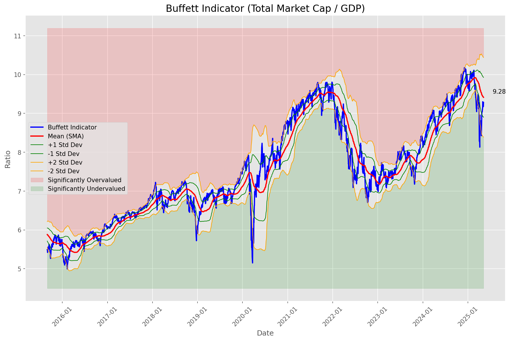
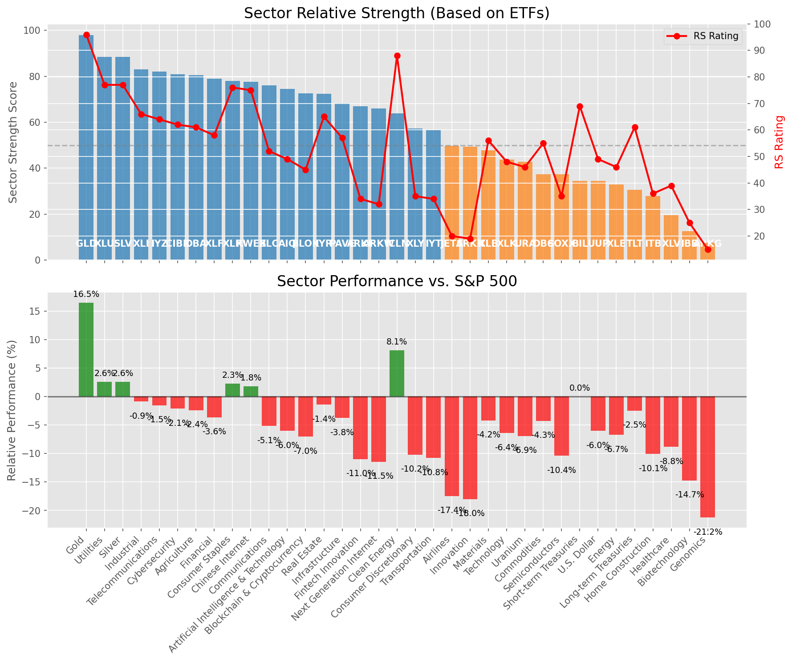

# **Daily Relative Strength Report**

**Date:** 2025-05-09

## **Market Valuation (Buffett Indicator)**

| Metric | Value |
|--------|-------|
| **Market Valuation** | **Fair Valued** |
| **Current Ratio** | 9.28 |
| **Historical Mean** | 9.41 |
| **Standard Deviation** | 0.51 |
| **Z-Score (StdDev from Mean)** | -0.26 |
| **Total Market Cap** | $278.28 trillion |
| **GDP** | $29.98 trillion |

## **Market Insights**

### **Market is Fairly Valued**

The market appears to be trading within a reasonable range of historical valuations. This suggests a balanced approach to equity investing is appropriate. Investors should:

- Focus on individual stock selection based on fundamentals and technicals
- Maintain normal equity allocations aligned with long-term goals
- Pay attention to sector rotation and relative strength
- Watch for changes in market leadership

Fair valuation typically suggests normal market returns can be expected, with stock selection becoming increasingly important.

### **Buffett Indicator Overview**

The Buffett Indicator (Total Market Cap / GDP) is a measure of the stock market's valuation relative to the size of the economy. It is named after Warren Buffett, who described it as "probably the best single measure of where valuations stand at any given moment."

- **Values above +2 standard deviations:** Market significantly overvalued
- **Values above +1 standard deviation:** Market overvalued
- **Values between -1 and +1 standard deviations:** Market fairly valued
- **Values below -1 standard deviation:** Market undervalued
- **Values below -2 standard deviations:** Market significantly undervalued

---

## **Sector Relative Strength**

Based on William O'Neil's Relative Strength Methodology

| ETF | Strength | RS Rating | Performance | Above Key MAs | Trend | Sector |
|-----|----------|-----------|-------------|--------------|-------|--------|
| [GLD](https://www.tradingview.com/chart/?symbol=GLD) | 98.0 | 96.0 | 16.71% | 10d ✓, 50d ✓, 200d ✓ | ↗️ | Gold |
| [SLV](https://www.tradingview.com/chart/?symbol=SLV) | 89.0 | 78.0 | 2.47% | 10d ✓, 50d ✓, 200d ✓ | ↗️ | Silver |
| [XLU](https://www.tradingview.com/chart/?symbol=XLU) | 88.5 | 77.0 | 2.15% | 10d ✓, 50d ✓, 200d ✓ | ↗️ | Utilities |
| [XLI](https://www.tradingview.com/chart/?symbol=XLI) | 83.0 | 66.0 | -1.34% | 10d ✓, 50d ✓, 200d ✓ | ↗️ | Industrial |
| [CIBR](https://www.tradingview.com/chart/?symbol=CIBR) | 81.5 | 63.0 | -2.28% | 10d ✓, 50d ✓, 200d ✓ | ↗️ | Cybersecurity |
| [IYZ](https://www.tradingview.com/chart/?symbol=IYZ) | 80.0 | 60.0 | -3.12% | 10d ✓, 50d ✓, 200d ✓ | ↗️ | Telecommunications |
| [XLF](https://www.tradingview.com/chart/?symbol=XLF) | 79.0 | 58.0 | -3.95% | 10d ✓, 50d ✓, 200d ✓ | ↗️ | Financial |
| [KWEB](https://www.tradingview.com/chart/?symbol=KWEB) | 78.6 | 77.0 | 1.87% | 10d ✓, 50d ✗, 200d ✓ | ↗️ | Chinese Internet |
| [XLP](https://www.tradingview.com/chart/?symbol=XLP) | 78.6 | 77.0 | 2.21% | 10d ✗, 50d ✓, 200d ✓ | ↗️ | Consumer Staples |
| [XLC](https://www.tradingview.com/chart/?symbol=XLC) | 76.5 | 53.0 | -5.12% | 10d ✓, 50d ✓, 200d ✓ | ↗️ | Communications |
| [AIQ](https://www.tradingview.com/chart/?symbol=AIQ) | 75.0 | 50.0 | -6.03% | 10d ✓, 50d ✓, 200d ✓ | ↗️ | Artificial Intelligence & Technology |
| [BLOK](https://www.tradingview.com/chart/?symbol=BLOK) | 74.5 | 49.0 | -6.53% | 10d ✓, 50d ✓, 200d ✓ | ↗️ | Blockchain & Cryptocurrency |
| [IYR](https://www.tradingview.com/chart/?symbol=IYR) | 71.8 | 64.0 | -1.82% | 10d ✓, 50d ✓, 200d ✗ | ↗️ | Real Estate |
| [DBA](https://www.tradingview.com/chart/?symbol=DBA) | 69.6 | 59.0 | -3.44% | 10d ✗, 50d ✓, 200d ✓ | ↗️ | Agriculture |
| [PAVE](https://www.tradingview.com/chart/?symbol=PAVE) | 68.3 | 57.0 | -4.24% | 10d ✓, 50d ✓, 200d ✗ | ↗️ | Infrastructure |
| [ARKF](https://www.tradingview.com/chart/?symbol=ARKF) | 67.5 | 35.0 | -10.71% | 10d ✓, 50d ✓, 200d ✓ | ↗️ | Fintech Innovation |
| [ARKW](https://www.tradingview.com/chart/?symbol=ARKW) | 64.5 | 29.0 | -12.86% | 10d ✓, 50d ✓, 200d ✓ | ↗️ | Next Generation Internet |
| [ICLN](https://www.tradingview.com/chart/?symbol=ICLN) | 63.8 | 88.0 | 7.69% | 10d ✓, 50d ✓, 200d ✗ | ↘️ | Clean Energy |
| [ARKK](https://www.tradingview.com/chart/?symbol=ARKK) | 60.0 | 20.0 | -17.50% | 10d ✓, 50d ✓, 200d ✓ | ↗️ | Innovation |
| [IYT](https://www.tradingview.com/chart/?symbol=IYT) | 58.3 | 37.0 | -10.10% | 10d ✓, 50d ✓, 200d ✗ | ↗️ | Transportation |
| [XLY](https://www.tradingview.com/chart/?symbol=XLY) | 57.8 | 36.0 | -10.26% | 10d ✓, 50d ✓, 200d ✗ | ↗️ | Consumer Discretionary |
| [JETS](https://www.tradingview.com/chart/?symbol=JETS) | 50.3 | 21.0 | -17.34% | 10d ✓, 50d ✓, 200d ✗ | ↗️ | Airlines |
| [XLB](https://www.tradingview.com/chart/?symbol=XLB) | 47.3 | 55.0 | -4.68% | 10d ✓, 50d ✓, 200d ✗ | ↘️ | Materials |
| [XLK](https://www.tradingview.com/chart/?symbol=XLK) | 43.8 | 48.0 | -6.55% | 10d ✓, 50d ✓, 200d ✗ | ↘️ | Technology |
| [URA](https://www.tradingview.com/chart/?symbol=URA) | 41.8 | 44.0 | -7.84% | 10d ✓, 50d ✓, 200d ✗ | ↘️ | Uranium |
| [DBC](https://www.tradingview.com/chart/?symbol=DBC) | 37.9 | 56.0 | -4.55% | 10d ✓, 50d ✗, 200d ✗ | ↘️ | Commodities |
| [SOXX](https://www.tradingview.com/chart/?symbol=SOXX) | 37.3 | 35.0 | -10.65% | 10d ✓, 50d ✓, 200d ✗ | ↘️ | Semiconductors |
| [BIL](https://www.tradingview.com/chart/?symbol=BIL) | 35.0 | 70.0 | 0.03% | 10d ✗, 50d ✗, 200d ✗ | ↘️ | Short-term Treasuries |
| [UUP](https://www.tradingview.com/chart/?symbol=UUP) | 34.9 | 50.0 | -6.08% | 10d ✓, 50d ✗, 200d ✗ | ↘️ | U.S. Dollar |
| [XLE](https://www.tradingview.com/chart/?symbol=XLE) | 32.4 | 45.0 | -7.34% | 10d ✓, 50d ✗, 200d ✗ | ↘️ | Energy |
| [TLT](https://www.tradingview.com/chart/?symbol=TLT) | 31.5 | 63.0 | -2.30% | 10d ✗, 50d ✗, 200d ✗ | ↘️ | Long-term Treasuries |
| [ITB](https://www.tradingview.com/chart/?symbol=ITB) | 28.4 | 37.0 | -10.18% | 10d ✓, 50d ✗, 200d ✗ | ↘️ | Home Construction |
| [XLV](https://www.tradingview.com/chart/?symbol=XLV) | 20.5 | 41.0 | -8.50% | 10d ✗, 50d ✗, 200d ✗ | ↘️ | Healthcare |
| [IBB](https://www.tradingview.com/chart/?symbol=IBB) | 13.5 | 27.0 | -14.04% | 10d ✗, 50d ✗, 200d ✗ | ↘️ | Biotechnology |
| [ARKG](https://www.tradingview.com/chart/?symbol=ARKG) | 8.0 | 16.0 | -20.67% | 10d ✗, 50d ✗, 200d ✗ | ↘️ | Genomics |

### **Sector ETF Performance Interpretation**

This table shows the relative strength metrics for different market sectors based on their representative ETFs:

- **ETF**: The ETF used to measure sector performance (click for chart)
- **Strength**: Overall sector strength score (0-100) combining multiple factors
- **RS Rating**: O'Neil RS rating of the sector ETF
- **Performance**: Performance of the sector ETF relative to SPY
- **Above Key MAs**: Whether the ETF is trading above its 10, 50, and 200-day moving averages
- **Trend**: Whether the sector is in an uptrend (↗️) or downtrend (↘️)

### **Current Sector Leadership**

The current market leadership is coming from the following sectors: **Gold, Silver, Utilities**.

The **Gold** sector (represented by **GLD**) is showing particularly strong relative strength with an RS rating of 96.0 and performance of 16.71% vs. the S&P 500. This sector is trading above its 10-day, 50-day, 200-day moving average(s). Investors should consider focusing on high RS stocks within these leading sectors for potential outperformance.

---

## **Buy Recommendations**

The following 78 stocks show exceptional relative strength:

| RS Rating | Buy Score | Current Price | Chart | Name | Ticker |
|-----------|-----------|---------------|-------|------|--------|
| 100 | 100 | $27.23 | [Chart](https://www.tradingview.com/chart/?symbol=DB) | Deutsche Bank Aktiengesellschaft | DB |
| 100 | 100 | $160.01 | [Chart](https://www.tradingview.com/chart/?symbol=PLMR) | Palomar Holdings, Inc. Common stock | PLMR |
| 100 | 100 | $83.10 | [Chart](https://www.tradingview.com/chart/?symbol=SEZL) | Sezzle Inc. Common Stock | SEZL |
| 100 | 100 | $157.71 | [Chart](https://www.tradingview.com/chart/?symbol=DAVE) | Dave Inc. Class A Common Stock | DAVE |
| 99 | 100 | $150.81 | [Chart](https://www.tradingview.com/chart/?symbol=ROOT) | Root, Inc. Class A Common Stock | ROOT |
| 99 | 100 | $143.50 | [Chart](https://www.tradingview.com/chart/?symbol=UGL) | ProShares Ultra Gold | UGL |
| 99 | 100 | $19.30 | [Chart](https://www.tradingview.com/chart/?symbol=SPNT) | SiriusPoint Ltd. | SPNT |
| 99 | 100 | $84.80 | [Chart](https://www.tradingview.com/chart/?symbol=WPM) | Wheaton Precious Metals Corp. Common Stock | WPM |
| 99 | 100 | $282.89 | [Chart](https://www.tradingview.com/chart/?symbol=VRSN) | VeriSign Inc | VRSN |
| 99 | 100 | $47.37 | [Chart](https://www.tradingview.com/chart/?symbol=MRX) | Marex Group plc Ordinary Shares | MRX |
| 99 | 100 | $70.45 | [Chart](https://www.tradingview.com/chart/?symbol=ULS) | UL Solutions Inc. | ULS |
| 99 | 100 | $508.52 | [Chart](https://www.tradingview.com/chart/?symbol=DUOL) | Duolingo, Inc. Class A Common Stock | DUOL |
| 99 | 100 | $23.02 | [Chart](https://www.tradingview.com/chart/?symbol=GRND) | Grindr Inc. | GRND |
| 98 | 100 | $131.42 | [Chart](https://www.tradingview.com/chart/?symbol=VSEC) | VSE Corp | VSEC |
| 98 | 100 | $131.59 | [Chart](https://www.tradingview.com/chart/?symbol=ATGE) | Adtalem Global Education Inc. Common Shares | ATGE |
| 98 | 100 | $59.61 | [Chart](https://www.tradingview.com/chart/?symbol=SKWD) | Skyward Specialty Insurance Group, Inc. Common Stock | SKWD |
| 98 | 100 | $156.04 | [Chart](https://www.tradingview.com/chart/?symbol=HWM) | Howmet Aerospace Inc. | HWM |
| 98 | 100 | $24.18 | [Chart](https://www.tradingview.com/chart/?symbol=OR) | Osisko Gold Royalties Ltd | OR |
| 98 | 100 | $411.72 | [Chart](https://www.tradingview.com/chart/?symbol=MSTR) | MicroStrategy Inc | MSTR |
| 97 | 100 | $116.25 | [Chart](https://www.tradingview.com/chart/?symbol=AEM) | Agnico Eagle Mines Ltd. | AEM |
| 97 | 100 | $30.77 | [Chart](https://www.tradingview.com/chart/?symbol=EUFN) | iShares MSCI Europe Financials ETF | EUFN |
| 97 | 100 | $145.85 | [Chart](https://www.tradingview.com/chart/?symbol=TW) | Tradeweb Markets Inc. Class A Common Stock | TW |
| 97 | 100 | $72.35 | [Chart](https://www.tradingview.com/chart/?symbol=WRB) | W.R. Berkley Corporation | WRB |
| 97 | 100 | $40.76 | [Chart](https://www.tradingview.com/chart/?symbol=EWG) | iShares MSCI Germany ETF | EWG |
| 97 | 100 | $41.11 | [Chart](https://www.tradingview.com/chart/?symbol=DRS) | Leonardo DRS, Inc. Common Stock | DRS |
| 96 | 100 | $22.74 | [Chart](https://www.tradingview.com/chart/?symbol=LAUR) | Laureate Education, Inc. Common Stock | LAUR |
| 96 | 100 | $33.33 | [Chart](https://www.tradingview.com/chart/?symbol=IAUM) | iShares Gold Trust Micro | IAUM |
| 96 | 100 | $308.01 | [Chart](https://www.tradingview.com/chart/?symbol=GLD) | SPDR Gold Trust, SPDR Gold Shares | GLD |
| 96 | 100 | $301.93 | [Chart](https://www.tradingview.com/chart/?symbol=PEN) | Penumbra, Inc. | PEN |
| 96 | 100 | $63.03 | [Chart](https://www.tradingview.com/chart/?symbol=IAU) | iShares Gold Trust | IAU |
| 96 | 100 | $28.40 | [Chart](https://www.tradingview.com/chart/?symbol=FMS) | Fresenius Medical Care AG | FMS |
| 96 | 100 | $148.46 | [Chart](https://www.tradingview.com/chart/?symbol=CAH) | Cardinal Health, Inc. | CAH |
| 96 | 100 | $34.31 | [Chart](https://www.tradingview.com/chart/?symbol=AHR) | American Healthcare REIT, Inc. | AHR |
| 95 | 100 | $141.06 | [Chart](https://www.tradingview.com/chart/?symbol=SE) | Sea Limited American Depositary Shares, each representing one Class A Ordinary Share | SE |
| 95 | 100 | $25.52 | [Chart](https://www.tradingview.com/chart/?symbol=PHYS) | Sprott Physical Gold Trust | PHYS |
| 95 | 100 | $36.96 | [Chart](https://www.tradingview.com/chart/?symbol=PAY) | Paymentus Holdings, Inc. | PAY |
| 95 | 100 | $282.66 | [Chart](https://www.tradingview.com/chart/?symbol=CME) | CME Group Inc. | CME |
| 95 | 100 | $33.95 | [Chart](https://www.tradingview.com/chart/?symbol=UTI) | Universal Technical Institute, Inc. | UTI |
| 94 | 100 | $40.90 | [Chart](https://www.tradingview.com/chart/?symbol=AB) | AllianceBernstein Holding, L.P. | AB |
| 94 | 100 | $105.61 | [Chart](https://www.tradingview.com/chart/?symbol=RBA) | RB Global, Inc. | RBA |
| 94 | 100 | $27.93 | [Chart](https://www.tradingview.com/chart/?symbol=T) | AT&T Inc. | T |
| 94 | 100 | $81.43 | [Chart](https://www.tradingview.com/chart/?symbol=NFG) | National Fuel Gas Co. | NFG |
| 93 | 100 | $1138.98 | [Chart](https://www.tradingview.com/chart/?symbol=NFLX) | NetFlix Inc | NFLX |
| 93 | 100 | $47.82 | [Chart](https://www.tradingview.com/chart/?symbol=ERJ) | Embraer S.A. | ERJ |
| 93 | 100 | $62.41 | [Chart](https://www.tradingview.com/chart/?symbol=CHEF) | The Chef's Warehouse Inc | CHEF |
| 92 | 100 | $207.16 | [Chart](https://www.tradingview.com/chart/?symbol=CRS) | Carpenter Technology Corp | CRS |
| 92 | 100 | $52.77 | [Chart](https://www.tradingview.com/chart/?symbol=EPR) | EPR Properties | EPR |
| 92 | 100 | $29.30 | [Chart](https://www.tradingview.com/chart/?symbol=CEF) | Sprott Physical Gold and Silver Trust | CEF |
| 91 | 100 | $16.47 | [Chart](https://www.tradingview.com/chart/?symbol=BCS) | Barclays PLC | BCS |
| 90 | 100 | $24.74 | [Chart](https://www.tradingview.com/chart/?symbol=EWS) | iShares MSCI Singapore ETF | EWS |
| 90 | 100 | $155.36 | [Chart](https://www.tradingview.com/chart/?symbol=LRN) | Stride, Inc. | LRN |
| 90 | 100 | $203.92 | [Chart](https://www.tradingview.com/chart/?symbol=BAP) | Credicorp LTD | BAP |
| 90 | 100 | $118.47 | [Chart](https://www.tradingview.com/chart/?symbol=CWST) | Casella Waste Systems Inc | CWST |
| 90 | 100 | $72.08 | [Chart](https://www.tradingview.com/chart/?symbol=RBLX) | Roblox Corporation | RBLX |
| 88 | 100 | $304.56 | [Chart](https://www.tradingview.com/chart/?symbol=PODD) | Insulet Corporation | PODD |
| 87 | 100 | $100.75 | [Chart](https://www.tradingview.com/chart/?symbol=AXS) | Axis Capital Holders Limited | AXS |
| 89 | 99 | $228.46 | [Chart](https://www.tradingview.com/chart/?symbol=CBOE) | Cboe Global Markets, Inc. | CBOE |
| 89 | 99 | $5165.27 | [Chart](https://www.tradingview.com/chart/?symbol=BKNG) | Booking Holdings Inc. Common Stock | BKNG |
| 88 | 99 | $67.19 | [Chart](https://www.tradingview.com/chart/?symbol=CTVA) | Corteva, Inc. Common Stock | CTVA |
| 88 | 99 | $43.57 | [Chart](https://www.tradingview.com/chart/?symbol=NWN) | Northwest Natural Holding Company | NWN |
| 86 | 98 | $31.86 | [Chart](https://www.tradingview.com/chart/?symbol=SLM) | SLM Corporation | SLM |
| 85 | 98 | $117.66 | [Chart](https://www.tradingview.com/chart/?symbol=PLTR) | Palantir Technologies Inc. Class A Common Stock | PLTR |
| 88 | 97 | $58.60 | [Chart](https://www.tradingview.com/chart/?symbol=IBIT) | iShares Bitcoin Trust ETF | IBIT |
| 87 | 97 | $57.28 | [Chart](https://www.tradingview.com/chart/?symbol=IGF) | iShares Global Infrastructure ETF | IGF |
| 86 | 97 | $192.84 | [Chart](https://www.tradingview.com/chart/?symbol=LOPE) | Grand Canyon Education, Inc | LOPE |
| 84 | 97 | $294.92 | [Chart](https://www.tradingview.com/chart/?symbol=SAP) | SAP SE | SAP |
| 86 | 96 | $177.80 | [Chart](https://www.tradingview.com/chart/?symbol=ICE) | Intercontinental Exchange  Inc. | ICE |
| 85 | 96 | $29.10 | [Chart](https://www.tradingview.com/chart/?symbol=ATAT) | Atour Lifestyle Holdings Limited American Depositary Shares | ATAT |
| 84 | 95 | $171.11 | [Chart](https://www.tradingview.com/chart/?symbol=AGX) | Argan, Inc | AGX |
| 83 | 95 | $78.01 | [Chart](https://www.tradingview.com/chart/?symbol=RBRK) | Rubrik, Inc. | RBRK |
| 82 | 95 | $80.33 | [Chart](https://www.tradingview.com/chart/?symbol=UNM) | Unum Group | UNM |
| 83 | 94 | $307.85 | [Chart](https://www.tradingview.com/chart/?symbol=VRSK) | Verisk Analytics, Inc. Common Stock | VRSK |
| 82 | 94 | $336.70 | [Chart](https://www.tradingview.com/chart/?symbol=AJG) | Arthur J. Gallagher & Co. | AJG |
| 84 | 93 | $81.86 | [Chart](https://www.tradingview.com/chart/?symbol=TGLS) | Tecnoglass Inc. | TGLS |
| 80 | 93 | $645.42 | [Chart](https://www.tradingview.com/chart/?symbol=SPOT) | Spotify Technology S.A. | SPOT |
| 81 | 92 | $163.44 | [Chart](https://www.tradingview.com/chart/?symbol=ITA) | iShares U.S. Aerospace & Defense ETF | ITA |
| 81 | 92 | $213.57 | [Chart](https://www.tradingview.com/chart/?symbol=GE) | GE Aerospace | GE |
| 81 | 92 | $273.99 | [Chart](https://www.tradingview.com/chart/?symbol=CVNA) | Carvana Co. | CVNA |

---

## **Sell Recommendations**

The following 102 stocks show deteriorating relative strength:

| RS Rating | Sell Score | Current Price | Chart | Name | Ticker |
|-----------|------------|---------------|-------|------|--------|
| 1 | 100 | $17.38 | [Chart](https://www.tradingview.com/chart/?symbol=FWRD) | Forward Air Corp | FWRD |
| 1 | 100 | $264.18 | [Chart](https://www.tradingview.com/chart/?symbol=SAIA) | Saia, Inc. | SAIA |
| 1 | 100 | $21.60 | [Chart](https://www.tradingview.com/chart/?symbol=GCO) | Genesco Inc. | GCO |
| 1 | 100 | $20.47 | [Chart](https://www.tradingview.com/chart/?symbol=BHVN) | Biohaven Ltd. | BHVN |
| 2 | 100 | $10.94 | [Chart](https://www.tradingview.com/chart/?symbol=NRIX) | Nurix Therapeutics, Inc. Common stock | NRIX |
| 3 | 100 | $13.06 | [Chart](https://www.tradingview.com/chart/?symbol=DQ) | Daqo New Energy Corp. American Depositary Shares (each representing 5 Ordinary Shares) | DQ |
| 3 | 100 | $27.73 | [Chart](https://www.tradingview.com/chart/?symbol=TNA) | Direxion Daily Small Cap Bull 3x Shares | TNA |
| 4 | 100 | $27.22 | [Chart](https://www.tradingview.com/chart/?symbol=JACK) | Jack in the Box Inc. | JACK |
| 4 | 100 | $10.04 | [Chart](https://www.tradingview.com/chart/?symbol=LSPD) | Lightspeed Commerce Inc. | LSPD |
| 4 | 100 | $73.24 | [Chart](https://www.tradingview.com/chart/?symbol=ANF) | Abercrombie & Fitch Co. | ANF |
| 5 | 100 | $25.20 | [Chart](https://www.tradingview.com/chart/?symbol=RPD) | Rapid7, Inc. Common Stock | RPD |
| 5 | 100 | $12.21 | [Chart](https://www.tradingview.com/chart/?symbol=FL) | Foot Locker, Inc. | FL |
| 5 | 100 | $12.36 | [Chart](https://www.tradingview.com/chart/?symbol=MNRO) | Monro, Inc. Common Stock | MNRO |
| 6 | 100 | $31.37 | [Chart](https://www.tradingview.com/chart/?symbol=AAP) | ADVANCE AUTO PARTS INC | AAP |
| 6 | 100 | $11.38 | [Chart](https://www.tradingview.com/chart/?symbol=ARCT) | Arcturus Therapeutics Holdings Inc. Common Stock | ARCT |
| 7 | 100 | $28.01 | [Chart](https://www.tradingview.com/chart/?symbol=SRDX) | Surmodics, Inc. Common Stock | SRDX |
| 7 | 100 | $18.04 | [Chart](https://www.tradingview.com/chart/?symbol=VRNT) | Verint Systems Inc | VRNT |
| 7 | 100 | $11.22 | [Chart](https://www.tradingview.com/chart/?symbol=AEO) | American Eagle Outfitters | AEO |
| 8 | 100 | $14.54 | [Chart](https://www.tradingview.com/chart/?symbol=IMVT) | Immunovant, Inc. Common Stock | IMVT |
| 9 | 100 | $11.24 | [Chart](https://www.tradingview.com/chart/?symbol=JAMF) | Jamf Holding Corp. Common Stock | JAMF |
| 10 | 100 | $96.39 | [Chart](https://www.tradingview.com/chart/?symbol=TGT) | Target Corporation | TGT |
| 10 | 100 | $125.65 | [Chart](https://www.tradingview.com/chart/?symbol=TFX) | Teleflex Incorporated | TFX |
| 12 | 100 | $32.52 | [Chart](https://www.tradingview.com/chart/?symbol=CYTK) | Cytokinetics Inc. | CYTK |
| 12 | 100 | $15.93 | [Chart](https://www.tradingview.com/chart/?symbol=DXC) | DXC Technology Company | DXC |
| 13 | 100 | $16.35 | [Chart](https://www.tradingview.com/chart/?symbol=SVOL) | Simplify Volatility Premium ETF | SVOL |
| 8 | 99 | $15.37 | [Chart](https://www.tradingview.com/chart/?symbol=PENN) | PENN Entertainment, Inc. Common Stock | PENN |
| 11 | 98 | $45.33 | [Chart](https://www.tradingview.com/chart/?symbol=RHI) | Robert Half Inc. | RHI |
| 16 | 98 | $11.92 | [Chart](https://www.tradingview.com/chart/?symbol=AEYE) | AudioEye, Inc. Common Stock | AEYE |
| 18 | 98 | $10.38 | [Chart](https://www.tradingview.com/chart/?symbol=BWLP) | BW LPG Limited | BWLP |
| 22 | 98 | $12.91 | [Chart](https://www.tradingview.com/chart/?symbol=MED) | Medifast, Inc. | MED |
| 5 | 97 | $181.00 | [Chart](https://www.tradingview.com/chart/?symbol=MDB) | MongoDB, Inc. Class A | MDB |
| 8 | 97 | $10.77 | [Chart](https://www.tradingview.com/chart/?symbol=SONO) | Sonos, Inc. Common Stock | SONO |
| 11 | 97 | $15.33 | [Chart](https://www.tradingview.com/chart/?symbol=NVDY) | YieldMax NVDA Option Income Strategy ETF | NVDY |
| 14 | 96 | $17.95 | [Chart](https://www.tradingview.com/chart/?symbol=IDYA) | IDEAYA Biosciences, Inc. Common Stock | IDYA |
| 14 | 96 | $58.76 | [Chart](https://www.tradingview.com/chart/?symbol=AMWD) | American Woodmark Corp | AMWD |
| 8 | 95 | $10.31 | [Chart](https://www.tradingview.com/chart/?symbol=VREX) | Varex Imaging Corporation Common Stock | VREX |
| 18 | 95 | $25.94 | [Chart](https://www.tradingview.com/chart/?symbol=GDEN) | Golden Entertainment, Inc. Common Stock | GDEN |
| 19 | 95 | $28.04 | [Chart](https://www.tradingview.com/chart/?symbol=AGIO) | Agios Pharmaceuticals, Inc. | AGIO |
| 8 | 94 | $25.87 | [Chart](https://www.tradingview.com/chart/?symbol=AA) | Alcoa Corporation | AA |
| 14 | 94 | $49.55 | [Chart](https://www.tradingview.com/chart/?symbol=ENPH) | Enphase Energy, Inc. | ENPH |
| 15 | 94 | $80.00 | [Chart](https://www.tradingview.com/chart/?symbol=WHR) | Whirlpool Corp. | WHR |
| 18 | 94 | $189.89 | [Chart](https://www.tradingview.com/chart/?symbol=DKS) | Dick's Sporting Goods, Inc. | DKS |
| 18 | 93 | $158.51 | [Chart](https://www.tradingview.com/chart/?symbol=ODFL) | Old Dominion Freight Line | ODFL |
| 22 | 93 | $10.34 | [Chart](https://www.tradingview.com/chart/?symbol=CMRE) | Costamare Inc. | CMRE |
| 13 | 92 | $10.49 | [Chart](https://www.tradingview.com/chart/?symbol=PEB) | Pebblebrook Hotel Trust | PEB |
| 15 | 92 | $14.24 | [Chart](https://www.tradingview.com/chart/?symbol=ZIM) | ZIM Integrated Shipping Services Ltd. | ZIM |
| 15 | 92 | $10.03 | [Chart](https://www.tradingview.com/chart/?symbol=MTAL) | MAC Copper Limited | MTAL |
| 22 | 92 | $12.41 | [Chart](https://www.tradingview.com/chart/?symbol=DBO) | Invesco DB Oil Fund | DBO |
| 26 | 92 | $11.45 | [Chart](https://www.tradingview.com/chart/?symbol=GES) | Guess?, Inc. | GES |
| 12 | 91 | $76.26 | [Chart](https://www.tradingview.com/chart/?symbol=THO) | Thor Industries, Inc. | THO |
| 13 | 91 | $11.34 | [Chart](https://www.tradingview.com/chart/?symbol=HPK) | HighPeak Energy, Inc. Common Stock | HPK |
| 13 | 91 | $18.98 | [Chart](https://www.tradingview.com/chart/?symbol=OII) | Oceaneering International Inc. | OII |
| 19 | 91 | $68.97 | [Chart](https://www.tradingview.com/chart/?symbol=BBY) | Best Buy Company, Inc. | BBY |
| 14 | 90 | $92.33 | [Chart](https://www.tradingview.com/chart/?symbol=RVTY) | Revvity, Inc. | RVTY |
| 18 | 90 | $16.22 | [Chart](https://www.tradingview.com/chart/?symbol=TRMD) | TORM plc Class A Common Stock | TRMD |
| 19 | 90 | $35.11 | [Chart](https://www.tradingview.com/chart/?symbol=TECK) | Teck Resources Limited | TECK |
| 20 | 90 | $11.74 | [Chart](https://www.tradingview.com/chart/?symbol=M) | Macy's Inc. | M |
| 20 | 90 | $48.31 | [Chart](https://www.tradingview.com/chart/?symbol=ERX) | Direxion Daily Energy Bull 2X Shares | ERX |
| 20 | 90 | $15.71 | [Chart](https://www.tradingview.com/chart/?symbol=PD) | PagerDuty, Inc. | PD |
| 28 | 90 | $14.46 | [Chart](https://www.tradingview.com/chart/?symbol=FXN) | First Trust Energy AlphaDEX Fund | FXN |
| 14 | 89 | $31.47 | [Chart](https://www.tradingview.com/chart/?symbol=MBIN) | Merchants Bancorp Common Stock | MBIN |
| 15 | 89 | $39.82 | [Chart](https://www.tradingview.com/chart/?symbol=ASO) | Academy Sports and Outdoors, Inc. | ASO |
| 17 | 89 | $17.50 | [Chart](https://www.tradingview.com/chart/?symbol=INFY) | Infosys Limited American Depositary Shares | INFY |
| 28 | 87 | $145.22 | [Chart](https://www.tradingview.com/chart/?symbol=QCOM) | Qualcomm Inc | QCOM |
| 26 | 86 | $19.54 | [Chart](https://www.tradingview.com/chart/?symbol=PLAB) | Photronics Inc | PLAB |
| 23 | 85 | $18.86 | [Chart](https://www.tradingview.com/chart/?symbol=CLDX) | Celldex Therapeutics, Inc | CLDX |
| 26 | 85 | $93.32 | [Chart](https://www.tradingview.com/chart/?symbol=CHRD) | Chord Energy Corporation Common Stock | CHRD |
| 24 | 84 | $10.89 | [Chart](https://www.tradingview.com/chart/?symbol=GSBD) | Goldman Sachs BDC, Inc. | GSBD |
| 24 | 84 | $143.40 | [Chart](https://www.tradingview.com/chart/?symbol=MTN) | Vail Resorts, Inc. | MTN |
| 24 | 84 | $120.28 | [Chart](https://www.tradingview.com/chart/?symbol=GNRC) | GENERAC HOLDINGS INC | GNRC |
| 25 | 84 | $54.05 | [Chart](https://www.tradingview.com/chart/?symbol=KBH) | KB Home | KBH |
| 27 | 84 | $18.78 | [Chart](https://www.tradingview.com/chart/?symbol=JKS) | JINKOSOLAR HOLDINGS CO | JKS |
| 31 | 84 | $20.06 | [Chart](https://www.tradingview.com/chart/?symbol=CSWC) | Capital Southwest Corp | CSWC |
| 18 | 83 | $14.54 | [Chart](https://www.tradingview.com/chart/?symbol=INMD) | InMode Ltd. Ordinary Shares | INMD |
| 21 | 83 | $55.42 | [Chart](https://www.tradingview.com/chart/?symbol=SLG) | SL Green Realty Corp. | SLG |
| 25 | 83 | $10.01 | [Chart](https://www.tradingview.com/chart/?symbol=XPRO) | Expro Group Holdings N.V. | XPRO |
| 32 | 83 | $66.77 | [Chart](https://www.tradingview.com/chart/?symbol=DD) | DuPont de Nemours, Inc. Common Stock | DD |
| 29 | 82 | $51.36 | [Chart](https://www.tradingview.com/chart/?symbol=LW) | Lamb Weston Holdings, Inc. | LW |
| 24 | 81 | $37.13 | [Chart](https://www.tradingview.com/chart/?symbol=NBHC) | NATIONAL BANK HOLDINGS CORP. | NBHC |
| 26 | 81 | $219.30 | [Chart](https://www.tradingview.com/chart/?symbol=FDX) | FedEx Corporation | FDX |
| 27 | 81 | $42.79 | [Chart](https://www.tradingview.com/chart/?symbol=FEPI) | REX FANG & Innovation Equity Premium Income ETF | FEPI |
| 33 | 81 | $32.06 | [Chart](https://www.tradingview.com/chart/?symbol=SMCI) | Super Micro Computer, Inc. Common Stock | SMCI |
| 23 | 80 | $16.78 | [Chart](https://www.tradingview.com/chart/?symbol=CHCT) | Community Healthcare Trust Incorporated Common Stock, $0.01 par value per share | CHCT |
| 26 | 80 | $10.36 | [Chart](https://www.tradingview.com/chart/?symbol=AVO) | Mission Produce, Inc. Common Stock | AVO |
| 32 | 79 | $20.55 | [Chart](https://www.tradingview.com/chart/?symbol=BITI) | ProShares Short Bitcoin ETF | BITI |
| 29 | 77 | $49.70 | [Chart](https://www.tradingview.com/chart/?symbol=CMG) | Chipotle Mexican Grill, Inc. | CMG |
| 30 | 77 | $14.27 | [Chart](https://www.tradingview.com/chart/?symbol=BMEZ) | BlackRock Health Sciences Term Trust | BMEZ |
| 29 | 76 | $26.67 | [Chart](https://www.tradingview.com/chart/?symbol=BNO) | United States Brent Oil Fund, LP | BNO |
| 32 | 76 | $28.73 | [Chart](https://www.tradingview.com/chart/?symbol=CSX) | CSX Corporation | CSX |
| 37 | 74 | $34.78 | [Chart](https://www.tradingview.com/chart/?symbol=SQM) | Sociedad Quimica y Minera de Chile SA | SQM |
| 27 | 73 | $91.12 | [Chart](https://www.tradingview.com/chart/?symbol=PCAR) | Paccar Inc | PCAR |
| 31 | 73 | $14.62 | [Chart](https://www.tradingview.com/chart/?symbol=RYLD) | Global X Russell 2000 Covered Call ETF | RYLD |
| 32 | 73 | $22.76 | [Chart](https://www.tradingview.com/chart/?symbol=SGRY) | Surgery Partners, Inc. Common Stock | SGRY |
| 37 | 73 | $92.26 | [Chart](https://www.tradingview.com/chart/?symbol=ITB) | iShares U.S. Home Construction ETF | ITB |
| 33 | 72 | $118.00 | [Chart](https://www.tradingview.com/chart/?symbol=XOP) | SPDR S&P Oil & Gas Exploration & Production ETF | XOP |
| 34 | 72 | $384.74 | [Chart](https://www.tradingview.com/chart/?symbol=ADBE) | Adobe Inc. | ADBE |
| 32 | 71 | $16.40 | [Chart](https://www.tradingview.com/chart/?symbol=QYLD) | Global X Funds Global X NASDAQ-100 Covered Call ETF | QYLD |
| 33 | 69 | $74.70 | [Chart](https://www.tradingview.com/chart/?symbol=WFG) | West Fraser Timber Co. Ltd | WFG |
| 35 | 68 | $216.04 | [Chart](https://www.tradingview.com/chart/?symbol=UNP) | Union Pacific Corp. | UNP |
| 39 | 68 | $10.15 | [Chart](https://www.tradingview.com/chart/?symbol=SGML) | Sigma Lithium Corporation Common Shares | SGML |
| 36 | 67 | $17.23 | [Chart](https://www.tradingview.com/chart/?symbol=MLNK) | MeridianLink, Inc. | MLNK |
| 39 | 66 | $56.96 | [Chart](https://www.tradingview.com/chart/?symbol=UHAL.B) | U-Haul Holding Company | UHAL.B |

## **Methodology**

This report uses William O'Neil's relative strength methodology from Investors Business Daily:

* **RS Rating**: Percentile rank of stock's performance vs. S&P 500 over the past 63 trading days (1-99 scale)
* **Buy Criteria**: RS Rating >= 80, price above 50-day MA, strong uptrend, increasing volume
* **Sell Criteria**: RS Rating < 40, price below 50-day MA, downtrend, decreasing volume

### **O'Neil's Key Principles**

1. **Focus on relative performance** - stocks outperforming the market
2. **Price trend confirmation** - stock must be in an uptrend
3. **Volume confirmation** - strong volume supports price moves
4. **Moving average validation** - price above key moving averages
5. **Market leaders only** - concentrate on top-performing stocks

*Report generated automatically after market close*