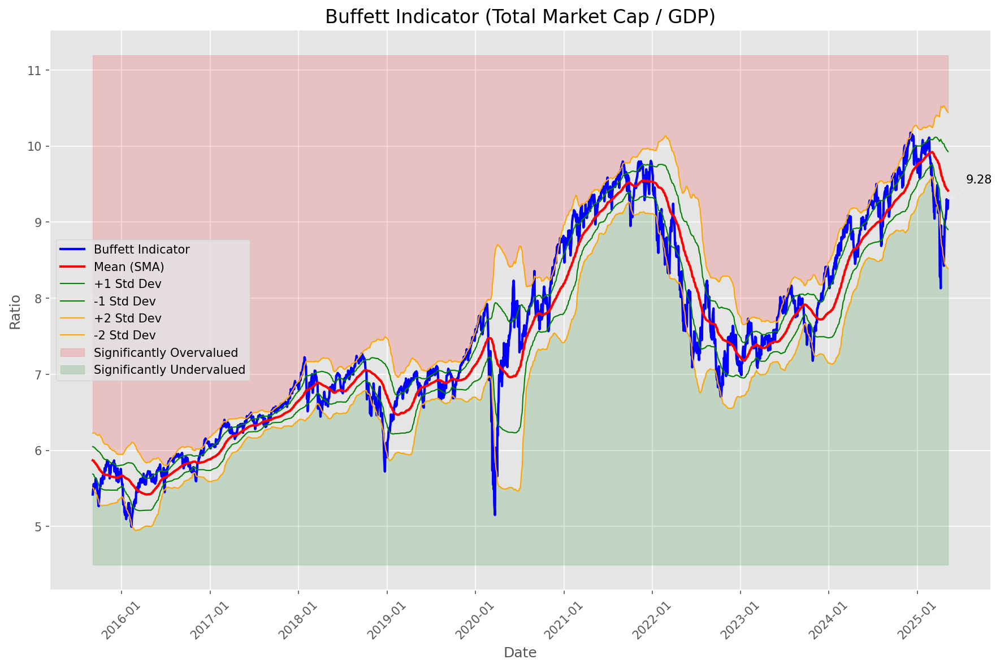
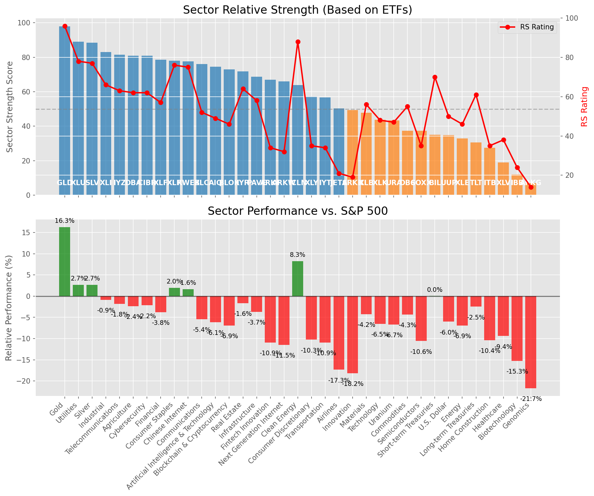

# **Daily Relative Strength Report**

**Date:** 2025-05-11

## **Market Valuation (Buffett Indicator)**

| Metric | Value |
|--------|-------|
| **Market Valuation** | **Fair Valued** |
| **Current Ratio** | 9.27 |
| **Historical Mean** | 9.41 |
| **Standard Deviation** | 0.51 |
| **Z-Score (StdDev from Mean)** | -0.26 |
| **Total Market Cap** | $277.97 trillion |
| **GDP** | $29.98 trillion |

## **Market Insights**

### **Market is Fairly Valued**

The market appears to be trading within a reasonable range of historical valuations. This suggests a balanced approach to equity investing is appropriate. Investors should:

- Focus on individual stock selection based on fundamentals and technicals
- Maintain normal equity allocations aligned with long-term goals
- Pay attention to sector rotation and relative strength
- Watch for changes in market leadership

Fair valuation typically suggests normal market returns can be expected, with stock selection becoming increasingly important.

### **Buffett Indicator Overview**

The Buffett Indicator (Total Market Cap / GDP) is a measure of the stock market's valuation relative to the size of the economy. It is named after Warren Buffett, who described it as "probably the best single measure of where valuations stand at any given moment."

- **Values above +2 standard deviations:** Market significantly overvalued
- **Values above +1 standard deviation:** Market overvalued
- **Values between -1 and +1 standard deviations:** Market fairly valued
- **Values below -1 standard deviation:** Market undervalued
- **Values below -2 standard deviations:** Market significantly undervalued

---

## **Sector Relative Strength**

Based on William O'Neil's Relative Strength Methodology

| ETF | Strength | RS Rating | Performance | Above Key MAs | Trend | Sector |
|-----|----------|-----------|-------------|--------------|-------|--------|
| [GLD](https://www.tradingview.com/chart/?symbol=GLD) | 98.0 | 96.0 | 16.27% | 10d ✓, 50d ✓, 200d ✓ | ↗️ | Gold |
| [XLU](https://www.tradingview.com/chart/?symbol=XLU) | 89.0 | 78.0 | 2.69% | 10d ✓, 50d ✓, 200d ✓ | ↗️ | Utilities |
| [SLV](https://www.tradingview.com/chart/?symbol=SLV) | 88.5 | 77.0 | 2.65% | 10d ✓, 50d ✓, 200d ✓ | ↗️ | Silver |
| [XLI](https://www.tradingview.com/chart/?symbol=XLI) | 83.0 | 66.0 | -0.89% | 10d ✓, 50d ✓, 200d ✓ | ↗️ | Industrial |
| [IYZ](https://www.tradingview.com/chart/?symbol=IYZ) | 81.5 | 63.0 | -1.79% | 10d ✓, 50d ✓, 200d ✓ | ↗️ | Telecommunications |
| [CIBR](https://www.tradingview.com/chart/?symbol=CIBR) | 81.0 | 62.0 | -2.18% | 10d ✓, 50d ✓, 200d ✓ | ↗️ | Cybersecurity |
| [DBA](https://www.tradingview.com/chart/?symbol=DBA) | 81.0 | 62.0 | -2.38% | 10d ✓, 50d ✓, 200d ✓ | ↗️ | Agriculture |
| [XLF](https://www.tradingview.com/chart/?symbol=XLF) | 78.5 | 57.0 | -3.78% | 10d ✓, 50d ✓, 200d ✓ | ↗️ | Financial |
| [XLP](https://www.tradingview.com/chart/?symbol=XLP) | 78.1 | 76.0 | 1.97% | 10d ✗, 50d ✓, 200d ✓ | ↗️ | Consumer Staples |
| [KWEB](https://www.tradingview.com/chart/?symbol=KWEB) | 77.6 | 75.0 | 1.64% | 10d ✓, 50d ✗, 200d ✓ | ↗️ | Chinese Internet |
| [XLC](https://www.tradingview.com/chart/?symbol=XLC) | 76.0 | 52.0 | -5.41% | 10d ✓, 50d ✓, 200d ✓ | ↗️ | Communications |
| [AIQ](https://www.tradingview.com/chart/?symbol=AIQ) | 74.5 | 49.0 | -6.12% | 10d ✓, 50d ✓, 200d ✓ | ↗️ | Artificial Intelligence & Technology |
| [BLOK](https://www.tradingview.com/chart/?symbol=BLOK) | 73.0 | 46.0 | -6.89% | 10d ✓, 50d ✓, 200d ✓ | ↗️ | Blockchain & Cryptocurrency |
| [IYR](https://www.tradingview.com/chart/?symbol=IYR) | 71.8 | 64.0 | -1.64% | 10d ✓, 50d ✓, 200d ✗ | ↗️ | Real Estate |
| [PAVE](https://www.tradingview.com/chart/?symbol=PAVE) | 68.8 | 58.0 | -3.72% | 10d ✓, 50d ✓, 200d ✗ | ↗️ | Infrastructure |
| [ARKF](https://www.tradingview.com/chart/?symbol=ARKF) | 67.0 | 34.0 | -10.94% | 10d ✓, 50d ✓, 200d ✓ | ↗️ | Fintech Innovation |
| [ARKW](https://www.tradingview.com/chart/?symbol=ARKW) | 66.0 | 32.0 | -11.46% | 10d ✓, 50d ✓, 200d ✓ | ↗️ | Next Generation Internet |
| [ICLN](https://www.tradingview.com/chart/?symbol=ICLN) | 63.8 | 88.0 | 8.27% | 10d ✓, 50d ✓, 200d ✗ | ↘️ | Clean Energy |
| [XLY](https://www.tradingview.com/chart/?symbol=XLY) | 57.3 | 35.0 | -10.27% | 10d ✓, 50d ✓, 200d ✗ | ↗️ | Consumer Discretionary |
| [IYT](https://www.tradingview.com/chart/?symbol=IYT) | 56.8 | 34.0 | -10.93% | 10d ✓, 50d ✓, 200d ✗ | ↗️ | Transportation |
| [JETS](https://www.tradingview.com/chart/?symbol=JETS) | 50.3 | 21.0 | -17.34% | 10d ✓, 50d ✓, 200d ✗ | ↗️ | Airlines |
| [ARKK](https://www.tradingview.com/chart/?symbol=ARKK) | 49.3 | 19.0 | -18.18% | 10d ✓, 50d ✓, 200d ✗ | ↗️ | Innovation |
| [XLB](https://www.tradingview.com/chart/?symbol=XLB) | 47.8 | 56.0 | -4.22% | 10d ✓, 50d ✓, 200d ✗ | ↘️ | Materials |
| [XLK](https://www.tradingview.com/chart/?symbol=XLK) | 43.8 | 48.0 | -6.54% | 10d ✓, 50d ✓, 200d ✗ | ↘️ | Technology |
| [URA](https://www.tradingview.com/chart/?symbol=URA) | 43.3 | 47.0 | -6.67% | 10d ✓, 50d ✓, 200d ✗ | ↘️ | Uranium |
| [DBC](https://www.tradingview.com/chart/?symbol=DBC) | 37.4 | 55.0 | -4.35% | 10d ✓, 50d ✗, 200d ✗ | ↘️ | Commodities |
| [SOXX](https://www.tradingview.com/chart/?symbol=SOXX) | 37.3 | 35.0 | -10.57% | 10d ✓, 50d ✓, 200d ✗ | ↘️ | Semiconductors |
| [BIL](https://www.tradingview.com/chart/?symbol=BIL) | 35.0 | 70.0 | 0.03% | 10d ✗, 50d ✗, 200d ✗ | ↘️ | Short-term Treasuries |
| [UUP](https://www.tradingview.com/chart/?symbol=UUP) | 34.9 | 50.0 | -6.01% | 10d ✓, 50d ✗, 200d ✗ | ↘️ | U.S. Dollar |
| [XLE](https://www.tradingview.com/chart/?symbol=XLE) | 32.9 | 46.0 | -6.92% | 10d ✓, 50d ✗, 200d ✗ | ↘️ | Energy |
| [TLT](https://www.tradingview.com/chart/?symbol=TLT) | 30.5 | 61.0 | -2.49% | 10d ✗, 50d ✗, 200d ✗ | ↘️ | Long-term Treasuries |
| [ITB](https://www.tradingview.com/chart/?symbol=ITB) | 27.4 | 35.0 | -10.39% | 10d ✓, 50d ✗, 200d ✗ | ↘️ | Home Construction |
| [XLV](https://www.tradingview.com/chart/?symbol=XLV) | 19.0 | 38.0 | -9.39% | 10d ✗, 50d ✗, 200d ✗ | ↘️ | Healthcare |
| [IBB](https://www.tradingview.com/chart/?symbol=IBB) | 12.0 | 24.0 | -15.28% | 10d ✗, 50d ✗, 200d ✗ | ↘️ | Biotechnology |
| [ARKG](https://www.tradingview.com/chart/?symbol=ARKG) | 7.0 | 14.0 | -21.71% | 10d ✗, 50d ✗, 200d ✗ | ↘️ | Genomics |

### **Sector ETF Performance Interpretation**

This table shows the relative strength metrics for different market sectors based on their representative ETFs:

- **ETF**: The ETF used to measure sector performance (click for chart)
- **Strength**: Overall sector strength score (0-100) combining multiple factors
- **RS Rating**: O'Neil RS rating of the sector ETF
- **Performance**: Performance of the sector ETF relative to SPY
- **Above Key MAs**: Whether the ETF is trading above its 10, 50, and 200-day moving averages
- **Trend**: Whether the sector is in an uptrend (↗️) or downtrend (↘️)

### **Current Sector Leadership**

The current market leadership is coming from the following sectors: **Gold, Utilities, Silver**.

The **Gold** sector (represented by **GLD**) is showing particularly strong relative strength with an RS rating of 96.0 and performance of 16.27% vs. the S&P 500. This sector is trading above its 10-day, 50-day, 200-day moving average(s). Investors should consider focusing on high RS stocks within these leading sectors for potential outperformance.

---

## **Buy Recommendations**

The following 85 stocks show exceptional relative strength:

| RS Rating | Buy Score | Current Price | Chart | Name | Ticker |
|-----------|-----------|---------------|-------|------|--------|
| 100 | 100 | $87.10 | [Chart](https://www.tradingview.com/chart/?symbol=SEZL) | Sezzle Inc. Common Stock | SEZL |
| 100 | 100 | $27.38 | [Chart](https://www.tradingview.com/chart/?symbol=DB) | Deutsche Bank Aktiengesellschaft | DB |
| 100 | 100 | $167.22 | [Chart](https://www.tradingview.com/chart/?symbol=DAVE) | Dave Inc. Class A Common Stock | DAVE |
| 100 | 100 | $159.93 | [Chart](https://www.tradingview.com/chart/?symbol=PLMR) | Palomar Holdings, Inc. Common stock | PLMR |
| 99 | 100 | $70.17 | [Chart](https://www.tradingview.com/chart/?symbol=ULS) | UL Solutions Inc. | ULS |
| 99 | 100 | $19.27 | [Chart](https://www.tradingview.com/chart/?symbol=SPNT) | SiriusPoint Ltd. | SPNT |
| 99 | 100 | $85.77 | [Chart](https://www.tradingview.com/chart/?symbol=WPM) | Wheaton Precious Metals Corp. Common Stock | WPM |
| 99 | 100 | $142.39 | [Chart](https://www.tradingview.com/chart/?symbol=UGL) | ProShares Ultra Gold | UGL |
| 99 | 100 | $136.25 | [Chart](https://www.tradingview.com/chart/?symbol=ATGE) | Adtalem Global Education Inc. Common Shares | ATGE |
| 99 | 100 | $512.75 | [Chart](https://www.tradingview.com/chart/?symbol=DUOL) | Duolingo, Inc. Class A Common Stock | DUOL |
| 99 | 100 | $416.03 | [Chart](https://www.tradingview.com/chart/?symbol=MSTR) | MicroStrategy Inc | MSTR |
| 99 | 100 | $47.38 | [Chart](https://www.tradingview.com/chart/?symbol=MRX) | Marex Group plc Ordinary Shares | MRX |
| 99 | 100 | $147.42 | [Chart](https://www.tradingview.com/chart/?symbol=ROOT) | Root, Inc. Class A Common Stock | ROOT |
| 99 | 100 | $184.41 | [Chart](https://www.tradingview.com/chart/?symbol=RGLD) | Royal Gold Inc | RGLD |
| 99 | 100 | $24.00 | [Chart](https://www.tradingview.com/chart/?symbol=GRND) | Grindr Inc. | GRND |
| 98 | 100 | $41.04 | [Chart](https://www.tradingview.com/chart/?symbol=EWP) | iShares MSCI Spain ETF | EWP |
| 98 | 100 | $252.70 | [Chart](https://www.tradingview.com/chart/?symbol=PAYC) | PAYCOM SOFTWARE, INC. | PAYC |
| 98 | 100 | $27.05 | [Chart](https://www.tradingview.com/chart/?symbol=AGI) | Alamos Gold Inc. Class A Common Shares | AGI |
| 98 | 100 | $64.33 | [Chart](https://www.tradingview.com/chart/?symbol=GDXJ) | VanEck Junior Gold Miners ETF | GDXJ |
| 98 | 100 | $24.36 | [Chart](https://www.tradingview.com/chart/?symbol=OR) | Osisko Gold Royalties Ltd | OR |
| 98 | 100 | $157.41 | [Chart](https://www.tradingview.com/chart/?symbol=HWM) | Howmet Aerospace Inc. | HWM |
| 98 | 100 | $59.87 | [Chart](https://www.tradingview.com/chart/?symbol=SKWD) | Skyward Specialty Insurance Group, Inc. Common Stock | SKWD |
| 98 | 100 | $129.14 | [Chart](https://www.tradingview.com/chart/?symbol=VSEC) | VSE Corp | VSEC |
| 97 | 100 | $40.77 | [Chart](https://www.tradingview.com/chart/?symbol=EWG) | iShares MSCI Germany ETF | EWG |
| 97 | 100 | $72.49 | [Chart](https://www.tradingview.com/chart/?symbol=WRB) | W.R. Berkley Corporation | WRB |
| 97 | 100 | $117.32 | [Chart](https://www.tradingview.com/chart/?symbol=AEM) | Agnico Eagle Mines Ltd. | AEM |
| 97 | 100 | $169.23 | [Chart](https://www.tradingview.com/chart/?symbol=FNV) | Franco-Nevada Corporation | FNV |
| 97 | 100 | $41.77 | [Chart](https://www.tradingview.com/chart/?symbol=DRS) | Leonardo DRS, Inc. Common Stock | DRS |
| 97 | 100 | $34.93 | [Chart](https://www.tradingview.com/chart/?symbol=AHR) | American Healthcare REIT, Inc. | AHR |
| 97 | 100 | $30.77 | [Chart](https://www.tradingview.com/chart/?symbol=EUFN) | iShares MSCI Europe Financials ETF | EUFN |
| 97 | 100 | $147.46 | [Chart](https://www.tradingview.com/chart/?symbol=TW) | Tradeweb Markets Inc. Class A Common Stock | TW |
| 96 | 100 | $22.88 | [Chart](https://www.tradingview.com/chart/?symbol=LAUR) | Laureate Education, Inc. Common Stock | LAUR |
| 96 | 100 | $306.84 | [Chart](https://www.tradingview.com/chart/?symbol=GLD) | SPDR Gold Trust, SPDR Gold Shares | GLD |
| 96 | 100 | $28.39 | [Chart](https://www.tradingview.com/chart/?symbol=FMS) | Fresenius Medical Care AG | FMS |
| 96 | 100 | $62.77 | [Chart](https://www.tradingview.com/chart/?symbol=IAU) | iShares Gold Trust | IAU |
| 96 | 100 | $116.41 | [Chart](https://www.tradingview.com/chart/?symbol=EHC) | Encompass Health Corporation Common Stock | EHC |
| 96 | 100 | $148.22 | [Chart](https://www.tradingview.com/chart/?symbol=CAH) | Cardinal Health, Inc. | CAH |
| 96 | 100 | $33.20 | [Chart](https://www.tradingview.com/chart/?symbol=IAUM) | iShares Gold Trust Micro | IAUM |
| 95 | 100 | $34.33 | [Chart](https://www.tradingview.com/chart/?symbol=UTI) | Universal Technical Institute, Inc. | UTI |
| 95 | 100 | $25.41 | [Chart](https://www.tradingview.com/chart/?symbol=PHYS) | Sprott Physical Gold Trust | PHYS |
| 95 | 100 | $36.85 | [Chart](https://www.tradingview.com/chart/?symbol=PAY) | Paymentus Holdings, Inc. | PAY |
| 95 | 100 | $284.35 | [Chart](https://www.tradingview.com/chart/?symbol=CME) | CME Group Inc. | CME |
| 94 | 100 | $297.32 | [Chart](https://www.tradingview.com/chart/?symbol=PEN) | Penumbra, Inc. | PEN |
| 94 | 100 | $27.84 | [Chart](https://www.tradingview.com/chart/?symbol=T) | AT&T Inc. | T |
| 94 | 100 | $139.17 | [Chart](https://www.tradingview.com/chart/?symbol=SE) | Sea Limited American Depositary Shares, each representing one Class A Ordinary Share | SE |
| 94 | 100 | $82.02 | [Chart](https://www.tradingview.com/chart/?symbol=NFG) | National Fuel Gas Co. | NFG |
| 94 | 100 | $212.33 | [Chart](https://www.tradingview.com/chart/?symbol=CRS) | Carpenter Technology Corp | CRS |
| 94 | 100 | $105.94 | [Chart](https://www.tradingview.com/chart/?symbol=RBA) | RB Global, Inc. | RBA |
| 94 | 100 | $61.81 | [Chart](https://www.tradingview.com/chart/?symbol=CHEF) | The Chef's Warehouse Inc | CHEF |
| 93 | 100 | $18.07 | [Chart](https://www.tradingview.com/chart/?symbol=AM) | Antero Midstream Corporation Common Stock | AM |
| 93 | 100 | $48.21 | [Chart](https://www.tradingview.com/chart/?symbol=ERJ) | Embraer S.A. | ERJ |
| 93 | 100 | $1140.22 | [Chart](https://www.tradingview.com/chart/?symbol=NFLX) | NetFlix Inc | NFLX |
| 92 | 100 | $52.91 | [Chart](https://www.tradingview.com/chart/?symbol=EPR) | EPR Properties | EPR |
| 92 | 100 | $29.22 | [Chart](https://www.tradingview.com/chart/?symbol=CEF) | Sprott Physical Gold and Silver Trust | CEF |
| 92 | 100 | $40.76 | [Chart](https://www.tradingview.com/chart/?symbol=AB) | AllianceBernstein Holding, L.P. | AB |
| 92 | 100 | $43.15 | [Chart](https://www.tradingview.com/chart/?symbol=VIRT) | Virtu Financial, Inc. Class A | VIRT |
| 91 | 100 | $42.79 | [Chart](https://www.tradingview.com/chart/?symbol=FHI) | Federated Hermes, Inc. | FHI |
| 91 | 100 | $156.51 | [Chart](https://www.tradingview.com/chart/?symbol=LRN) | Stride, Inc. | LRN |
| 90 | 100 | $16.53 | [Chart](https://www.tradingview.com/chart/?symbol=BCS) | Barclays PLC | BCS |
| 90 | 100 | $231.71 | [Chart](https://www.tradingview.com/chart/?symbol=CBOE) | Cboe Global Markets, Inc. | CBOE |
| 90 | 100 | $310.67 | [Chart](https://www.tradingview.com/chart/?symbol=PODD) | Insulet Corporation | PODD |
| 90 | 100 | $118.50 | [Chart](https://www.tradingview.com/chart/?symbol=CWST) | Casella Waste Systems Inc | CWST |
| 89 | 100 | $55.62 | [Chart](https://www.tradingview.com/chart/?symbol=EQT) | EQT CORP | EQT |
| 89 | 100 | $24.94 | [Chart](https://www.tradingview.com/chart/?symbol=EWS) | iShares MSCI Singapore ETF | EWS |
| 89 | 100 | $67.79 | [Chart](https://www.tradingview.com/chart/?symbol=CTVA) | Corteva, Inc. Common Stock | CTVA |
| 88 | 100 | $101.22 | [Chart](https://www.tradingview.com/chart/?symbol=AXS) | Axis Capital Holders Limited | AXS |
| 88 | 100 | $196.10 | [Chart](https://www.tradingview.com/chart/?symbol=LOPE) | Grand Canyon Education, Inc | LOPE |
| 88 | 100 | $71.88 | [Chart](https://www.tradingview.com/chart/?symbol=RBLX) | Roblox Corporation | RBLX |
| 87 | 99 | $32.18 | [Chart](https://www.tradingview.com/chart/?symbol=SLM) | SLM Corporation | SLM |
| 86 | 98 | $56.76 | [Chart](https://www.tradingview.com/chart/?symbol=HSBC) | HSBC Holdings PLC | HSBC |
| 87 | 97 | $57.34 | [Chart](https://www.tradingview.com/chart/?symbol=IGF) | iShares Global Infrastructure ETF | IGF |
| 84 | 97 | $117.30 | [Chart](https://www.tradingview.com/chart/?symbol=PLTR) | Palantir Technologies Inc. Class A Common Stock | PLTR |
| 87 | 96 | $58.66 | [Chart](https://www.tradingview.com/chart/?symbol=IBIT) | iShares Bitcoin Trust ETF | IBIT |
| 86 | 96 | $178.33 | [Chart](https://www.tradingview.com/chart/?symbol=ICE) | Intercontinental Exchange  Inc. | ICE |
| 85 | 96 | $205.37 | [Chart](https://www.tradingview.com/chart/?symbol=BAP) | Credicorp LTD | BAP |
| 81 | 96 | $39.58 | [Chart](https://www.tradingview.com/chart/?symbol=NI) | NiSource Inc. | NI |
| 85 | 94 | $82.53 | [Chart](https://www.tradingview.com/chart/?symbol=TGLS) | Tecnoglass Inc. | TGLS |
| 83 | 94 | $309.50 | [Chart](https://www.tradingview.com/chart/?symbol=VRSK) | Verisk Analytics, Inc. Common Stock | VRSK |
| 82 | 94 | $338.18 | [Chart](https://www.tradingview.com/chart/?symbol=AJG) | Arthur J. Gallagher & Co. | AJG |
| 81 | 94 | $80.47 | [Chart](https://www.tradingview.com/chart/?symbol=UNM) | Unum Group | UNM |
| 82 | 93 | $214.96 | [Chart](https://www.tradingview.com/chart/?symbol=GE) | GE Aerospace | GE |
| 80 | 93 | $648.25 | [Chart](https://www.tradingview.com/chart/?symbol=SPOT) | Spotify Technology S.A. | SPOT |
| 80 | 93 | $211.96 | [Chart](https://www.tradingview.com/chart/?symbol=IDCC) | InterDigital, Inc. | IDCC |
| 81 | 92 | $163.33 | [Chart](https://www.tradingview.com/chart/?symbol=ITA) | iShares U.S. Aerospace & Defense ETF | ITA |
| 80 | 91 | $28.46 | [Chart](https://www.tradingview.com/chart/?symbol=ATAT) | Atour Lifestyle Holdings Limited American Depositary Shares | ATAT |

---

## **Sell Recommendations**

The following 87 stocks show deteriorating relative strength:

| RS Rating | Sell Score | Current Price | Chart | Name | Ticker |
|-----------|------------|---------------|-------|------|--------|
| 1 | 100 | $20.24 | [Chart](https://www.tradingview.com/chart/?symbol=BHVN) | Biohaven Ltd. | BHVN |
| 1 | 100 | $21.13 | [Chart](https://www.tradingview.com/chart/?symbol=GCO) | Genesco Inc. | GCO |
| 1 | 100 | $16.32 | [Chart](https://www.tradingview.com/chart/?symbol=FWRD) | Forward Air Corp | FWRD |
| 1 | 100 | $260.62 | [Chart](https://www.tradingview.com/chart/?symbol=SAIA) | Saia, Inc. | SAIA |
| 2 | 100 | $10.94 | [Chart](https://www.tradingview.com/chart/?symbol=NRIX) | Nurix Therapeutics, Inc. Common stock | NRIX |
| 3 | 100 | $13.10 | [Chart](https://www.tradingview.com/chart/?symbol=DQ) | Daqo New Energy Corp. American Depositary Shares (each representing 5 Ordinary Shares) | DQ |
| 4 | 100 | $10.04 | [Chart](https://www.tradingview.com/chart/?symbol=LSPD) | Lightspeed Commerce Inc. | LSPD |
| 4 | 100 | $12.22 | [Chart](https://www.tradingview.com/chart/?symbol=MNRO) | Monro, Inc. Common Stock | MNRO |
| 4 | 100 | $73.16 | [Chart](https://www.tradingview.com/chart/?symbol=ANF) | Abercrombie & Fitch Co. | ANF |
| 5 | 100 | $30.88 | [Chart](https://www.tradingview.com/chart/?symbol=AAP) | ADVANCE AUTO PARTS INC | AAP |
| 5 | 100 | $26.92 | [Chart](https://www.tradingview.com/chart/?symbol=JACK) | Jack in the Box Inc. | JACK |
| 5 | 100 | $10.98 | [Chart](https://www.tradingview.com/chart/?symbol=ARCT) | Arcturus Therapeutics Holdings Inc. Common Stock | ARCT |
| 7 | 100 | $11.14 | [Chart](https://www.tradingview.com/chart/?symbol=AEO) | American Eagle Outfitters | AEO |
| 7 | 100 | $28.01 | [Chart](https://www.tradingview.com/chart/?symbol=SRDX) | Surmodics, Inc. Common Stock | SRDX |
| 10 | 100 | $31.70 | [Chart](https://www.tradingview.com/chart/?symbol=CYTK) | Cytokinetics Inc. | CYTK |
| 10 | 100 | $96.40 | [Chart](https://www.tradingview.com/chart/?symbol=TGT) | Target Corporation | TGT |
| 13 | 100 | $16.32 | [Chart](https://www.tradingview.com/chart/?symbol=SVOL) | Simplify Volatility Premium ETF | SVOL |
| 17 | 100 | $10.50 | [Chart](https://www.tradingview.com/chart/?symbol=BWLP) | BW LPG Limited | BWLP |
| 9 | 99 | $125.11 | [Chart](https://www.tradingview.com/chart/?symbol=TFX) | Teleflex Incorporated | TFX |
| 11 | 99 | $44.82 | [Chart](https://www.tradingview.com/chart/?symbol=RHI) | Robert Half Inc. | RHI |
| 14 | 99 | $16.25 | [Chart](https://www.tradingview.com/chart/?symbol=DXC) | DXC Technology Company | DXC |
| 5 | 98 | $15.47 | [Chart](https://www.tradingview.com/chart/?symbol=PSFE) | Paysafe Limited | PSFE |
| 8 | 98 | $11.15 | [Chart](https://www.tradingview.com/chart/?symbol=JAMF) | Jamf Holding Corp. Common Stock | JAMF |
| 4 | 97 | $27.70 | [Chart](https://www.tradingview.com/chart/?symbol=TNA) | Direxion Daily Small Cap Bull 3x Shares | TNA |
| 24 | 97 | $12.75 | [Chart](https://www.tradingview.com/chart/?symbol=MED) | Medifast, Inc. | MED |
| 9 | 96 | $15.64 | [Chart](https://www.tradingview.com/chart/?symbol=PENN) | PENN Entertainment, Inc. Common Stock | PENN |
| 14 | 96 | $58.62 | [Chart](https://www.tradingview.com/chart/?symbol=AMWD) | American Woodmark Corp | AMWD |
| 8 | 95 | $10.31 | [Chart](https://www.tradingview.com/chart/?symbol=VREX) | Varex Imaging Corporation Common Stock | VREX |
| 19 | 95 | $27.32 | [Chart](https://www.tradingview.com/chart/?symbol=AGIO) | Agios Pharmaceuticals, Inc. | AGIO |
| 12 | 94 | $29.35 | [Chart](https://www.tradingview.com/chart/?symbol=MBUU) | Malibu Boats, Inc. Class A | MBUU |
| 17 | 93 | $158.28 | [Chart](https://www.tradingview.com/chart/?symbol=ODFL) | Old Dominion Freight Line | ODFL |
| 22 | 93 | $10.34 | [Chart](https://www.tradingview.com/chart/?symbol=CMRE) | Costamare Inc. | CMRE |
| 12 | 92 | $12.05 | [Chart](https://www.tradingview.com/chart/?symbol=ZUMZ) | Zumiez Inc. | ZUMZ |
| 13 | 92 | $10.49 | [Chart](https://www.tradingview.com/chart/?symbol=PEB) | Pebblebrook Hotel Trust | PEB |
| 15 | 92 | $10.03 | [Chart](https://www.tradingview.com/chart/?symbol=MTAL) | MAC Copper Limited | MTAL |
| 19 | 92 | $190.88 | [Chart](https://www.tradingview.com/chart/?symbol=DKS) | Dick's Sporting Goods, Inc. | DKS |
| 22 | 92 | $12.41 | [Chart](https://www.tradingview.com/chart/?symbol=DBO) | Invesco DB Oil Fund | DBO |
| 23 | 92 | $12.46 | [Chart](https://www.tradingview.com/chart/?symbol=AEYE) | AudioEye, Inc. Common Stock | AEYE |
| 13 | 91 | $19.06 | [Chart](https://www.tradingview.com/chart/?symbol=OII) | Oceaneering International Inc. | OII |
| 13 | 91 | $76.57 | [Chart](https://www.tradingview.com/chart/?symbol=THO) | Thor Industries, Inc. | THO |
| 13 | 91 | $11.34 | [Chart](https://www.tradingview.com/chart/?symbol=HPK) | HighPeak Energy, Inc. Common Stock | HPK |
| 15 | 91 | $80.03 | [Chart](https://www.tradingview.com/chart/?symbol=WHR) | Whirlpool Corp. | WHR |
| 15 | 91 | $14.27 | [Chart](https://www.tradingview.com/chart/?symbol=ZIM) | ZIM Integrated Shipping Services Ltd. | ZIM |
| 18 | 91 | $68.85 | [Chart](https://www.tradingview.com/chart/?symbol=BBY) | Best Buy Company, Inc. | BBY |
| 12 | 89 | $53.12 | [Chart](https://www.tradingview.com/chart/?symbol=PRCT) | PROCEPT BioRobotics Corporation Common Stock | PRCT |
| 16 | 89 | $31.47 | [Chart](https://www.tradingview.com/chart/?symbol=MBIN) | Merchants Bancorp Common Stock | MBIN |
| 19 | 89 | $11.62 | [Chart](https://www.tradingview.com/chart/?symbol=M) | Macy's Inc. | M |
| 20 | 89 | $26.46 | [Chart](https://www.tradingview.com/chart/?symbol=HPQ) | HP Inc. | HPQ |
| 21 | 89 | $48.75 | [Chart](https://www.tradingview.com/chart/?symbol=ERX) | Direxion Daily Energy Bull 2X Shares | ERX |
| 30 | 89 | $14.63 | [Chart](https://www.tradingview.com/chart/?symbol=FXN) | First Trust Energy AlphaDEX Fund | FXN |
| 17 | 86 | $17.49 | [Chart](https://www.tradingview.com/chart/?symbol=INFY) | Infosys Limited American Depositary Shares | INFY |
| 27 | 86 | $145.18 | [Chart](https://www.tradingview.com/chart/?symbol=QCOM) | Qualcomm Inc | QCOM |
| 21 | 85 | $30.68 | [Chart](https://www.tradingview.com/chart/?symbol=CRNX) | Crinetics Pharmaceuticals, Inc. | CRNX |
| 27 | 85 | $19.45 | [Chart](https://www.tradingview.com/chart/?symbol=PLAB) | Photronics Inc | PLAB |
| 29 | 85 | $20.01 | [Chart](https://www.tradingview.com/chart/?symbol=CSWC) | Capital Southwest Corp | CSWC |
| 22 | 84 | $10.38 | [Chart](https://www.tradingview.com/chart/?symbol=AVO) | Mission Produce, Inc. Common Stock | AVO |
| 22 | 83 | $15.91 | [Chart](https://www.tradingview.com/chart/?symbol=PD) | PagerDuty, Inc. | PD |
| 25 | 83 | $10.01 | [Chart](https://www.tradingview.com/chart/?symbol=XPRO) | Expro Group Holdings N.V. | XPRO |
| 31 | 83 | $66.77 | [Chart](https://www.tradingview.com/chart/?symbol=DD) | DuPont de Nemours, Inc. Common Stock | DD |
| 39 | 83 | $28.40 | [Chart](https://www.tradingview.com/chart/?symbol=IMCR) | Immunocore Holdings plc American Depositary Shares | IMCR |
| 25 | 82 | $53.96 | [Chart](https://www.tradingview.com/chart/?symbol=KBH) | KB Home | KBH |
| 27 | 82 | $50.83 | [Chart](https://www.tradingview.com/chart/?symbol=LW) | Lamb Weston Holdings, Inc. | LW |
| 28 | 82 | $18.84 | [Chart](https://www.tradingview.com/chart/?symbol=JKS) | JINKOSOLAR HOLDINGS CO | JKS |
| 31 | 82 | $31.99 | [Chart](https://www.tradingview.com/chart/?symbol=SMCI) | Super Micro Computer, Inc. Common Stock | SMCI |
| 25 | 81 | $37.00 | [Chart](https://www.tradingview.com/chart/?symbol=NBHC) | NATIONAL BANK HOLDINGS CORP. | NBHC |
| 25 | 81 | $121.09 | [Chart](https://www.tradingview.com/chart/?symbol=GNRC) | GENERAC HOLDINGS INC | GNRC |
| 27 | 81 | $144.33 | [Chart](https://www.tradingview.com/chart/?symbol=MTN) | Vail Resorts, Inc. | MTN |
| 27 | 81 | $42.79 | [Chart](https://www.tradingview.com/chart/?symbol=FEPI) | REX FANG & Innovation Equity Premium Income ETF | FEPI |
| 25 | 79 | $217.83 | [Chart](https://www.tradingview.com/chart/?symbol=FDX) | FedEx Corporation | FDX |
| 29 | 79 | $14.14 | [Chart](https://www.tradingview.com/chart/?symbol=BMEZ) | BlackRock Health Sciences Term Trust | BMEZ |
| 31 | 79 | $20.51 | [Chart](https://www.tradingview.com/chart/?symbol=BITI) | ProShares Short Bitcoin ETF | BITI |
| 23 | 78 | $15.13 | [Chart](https://www.tradingview.com/chart/?symbol=BCSF) | Bain Capital Specialty Finance, Inc. | BCSF |
| 25 | 77 | $19.25 | [Chart](https://www.tradingview.com/chart/?symbol=AAT) | AMERICAN ASSETS TRUST, INC. | AAT |
| 28 | 74 | $74.54 | [Chart](https://www.tradingview.com/chart/?symbol=WFG) | West Fraser Timber Co. Ltd | WFG |
| 31 | 74 | $28.74 | [Chart](https://www.tradingview.com/chart/?symbol=CSX) | CSX Corporation | CSX |
| 33 | 74 | $27.04 | [Chart](https://www.tradingview.com/chart/?symbol=BNO) | United States Brent Oil Fund, LP | BNO |
| 34 | 74 | $19.18 | [Chart](https://www.tradingview.com/chart/?symbol=HVT) | Haverty Furniture Companies, Inc. | HVT |
| 35 | 74 | $92.05 | [Chart](https://www.tradingview.com/chart/?symbol=ITB) | iShares U.S. Home Construction ETF | ITB |
| 37 | 73 | $34.86 | [Chart](https://www.tradingview.com/chart/?symbol=SQM) | Sociedad Quimica y Minera de Chile SA | SQM |
| 39 | 73 | $249.53 | [Chart](https://www.tradingview.com/chart/?symbol=HUM) | Humana Inc. | HUM |
| 30 | 72 | $14.62 | [Chart](https://www.tradingview.com/chart/?symbol=RYLD) | Global X Russell 2000 Covered Call ETF | RYLD |
| 33 | 70 | $13.59 | [Chart](https://www.tradingview.com/chart/?symbol=KBWD) | Invesco KBW High Dividend Yield Financial ETF | KBWD |
| 32 | 68 | $16.41 | [Chart](https://www.tradingview.com/chart/?symbol=QYLD) | Global X Funds Global X NASDAQ-100 Covered Call ETF | QYLD |
| 36 | 68 | $192.62 | [Chart](https://www.tradingview.com/chart/?symbol=NDSN) | Nordson Corp | NDSN |
| 39 | 68 | $10.15 | [Chart](https://www.tradingview.com/chart/?symbol=SGML) | Sigma Lithium Corporation Common Shares | SGML |
| 38 | 67 | $57.05 | [Chart](https://www.tradingview.com/chart/?symbol=UHAL.B) | U-Haul Holding Company | UHAL.B |
| 35 | 65 | $216.32 | [Chart](https://www.tradingview.com/chart/?symbol=UNP) | Union Pacific Corp. | UNP |

## **Methodology**

This report uses William O'Neil's relative strength methodology from Investors Business Daily:

* **RS Rating**: Percentile rank of stock's performance vs. S&P 500 over the past 63 trading days (1-99 scale)
* **Buy Criteria**: RS Rating >= 80, price above 50-day MA, strong uptrend, increasing volume
* **Sell Criteria**: RS Rating < 40, price below 50-day MA, downtrend, decreasing volume

### **O'Neil's Key Principles**

1. **Focus on relative performance** - stocks outperforming the market
2. **Price trend confirmation** - stock must be in an uptrend
3. **Volume confirmation** - strong volume supports price moves
4. **Moving average validation** - price above key moving averages
5. **Market leaders only** - concentrate on top-performing stocks

*Report generated automatically after market close*