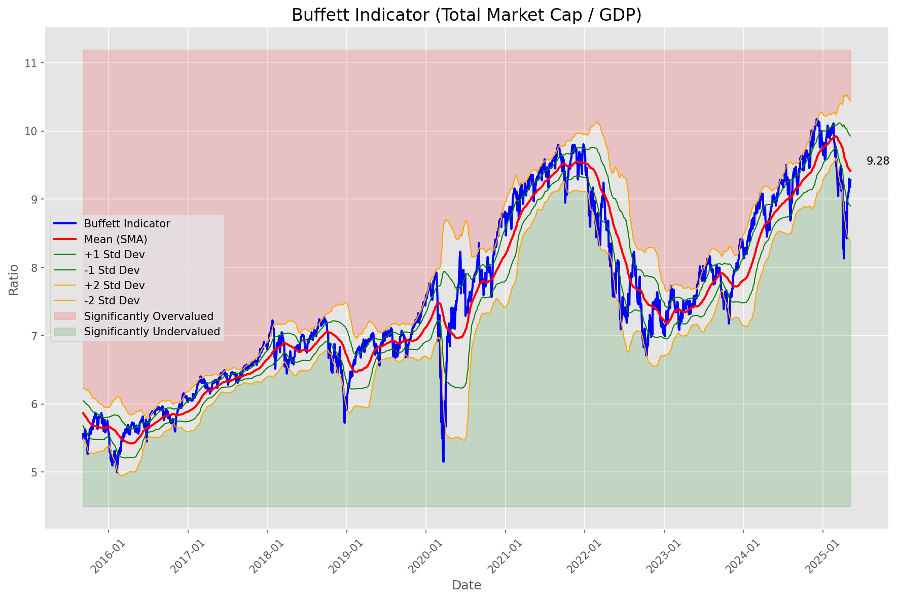
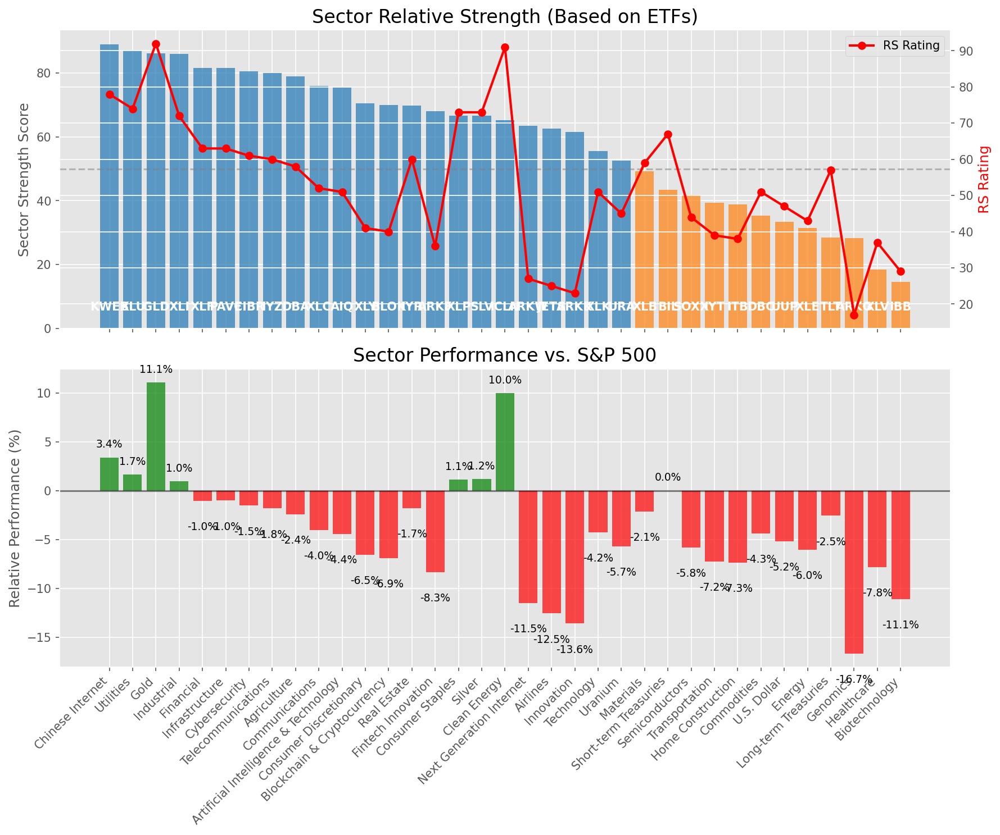

# **Daily Relative Strength Report**

**Date:** 2025-05-12

## **Market Valuation (Buffett Indicator)**

| Metric | Value |
|--------|-------|
| **Market Valuation** | **Fair Valued** |
| **Current Ratio** | 9.58 |
| **Historical Mean** | 9.41 |
| **Standard Deviation** | 0.51 |
| **Z-Score (StdDev from Mean)** | -0.27 |
| **Total Market Cap** | $287.27 trillion |
| **GDP** | $29.98 trillion |

## **Market Insights**

### **Market is Fairly Valued**

The market appears to be trading within a reasonable range of historical valuations. This suggests a balanced approach to equity investing is appropriate. Investors should:

- Focus on individual stock selection based on fundamentals and technicals
- Maintain normal equity allocations aligned with long-term goals
- Pay attention to sector rotation and relative strength
- Watch for changes in market leadership

Fair valuation typically suggests normal market returns can be expected, with stock selection becoming increasingly important.

### **Buffett Indicator Overview**

The Buffett Indicator (Total Market Cap / GDP) is a measure of the stock market's valuation relative to the size of the economy. It is named after Warren Buffett, who described it as "probably the best single measure of where valuations stand at any given moment."

- **Values above +2 standard deviations:** Market significantly overvalued
- **Values above +1 standard deviation:** Market overvalued
- **Values between -1 and +1 standard deviations:** Market fairly valued
- **Values below -1 standard deviation:** Market undervalued
- **Values below -2 standard deviations:** Market significantly undervalued

---

## **Sector Relative Strength**

Based on William O'Neil's Relative Strength Methodology

| ETF | Strength | RS Rating | Performance | Above Key MAs | Trend | Sector |
|-----|----------|-----------|-------------|--------------|-------|--------|
| [KWEB](https://www.tradingview.com/chart/?symbol=KWEB) | 89.0 | 78.0 | 3.89% | 10d ✓, 50d ✓, 200d ✓ | ↗️ | Chinese Internet |
| [GLD](https://www.tradingview.com/chart/?symbol=GLD) | 86.1 | 92.0 | 11.11% | 10d ✗, 50d ✓, 200d ✓ | ↗️ | Gold |
| [XLI](https://www.tradingview.com/chart/?symbol=XLI) | 86.0 | 72.0 | 1.26% | 10d ✓, 50d ✓, 200d ✓ | ↗️ | Industrial |
| [IYZ](https://www.tradingview.com/chart/?symbol=IYZ) | 82.0 | 64.0 | -0.29% | 10d ✓, 50d ✓, 200d ✓ | ↗️ | Telecommunications |
| [CIBR](https://www.tradingview.com/chart/?symbol=CIBR) | 80.5 | 61.0 | -0.86% | 10d ✓, 50d ✓, 200d ✓ | ↗️ | Cybersecurity |
| [XLF](https://www.tradingview.com/chart/?symbol=XLF) | 80.5 | 61.0 | -1.05% | 10d ✓, 50d ✓, 200d ✓ | ↗️ | Financial |
| [PAVE](https://www.tradingview.com/chart/?symbol=PAVE) | 80.0 | 60.0 | -1.33% | 10d ✓, 50d ✓, 200d ✓ | ↗️ | Infrastructure |
| [DBA](https://www.tradingview.com/chart/?symbol=DBA) | 78.5 | 57.0 | -2.10% | 10d ✓, 50d ✓, 200d ✓ | ↗️ | Agriculture |
| [SLV](https://www.tradingview.com/chart/?symbol=SLV) | 76.1 | 72.0 | 1.47% | 10d ✓, 50d ✗, 200d ✓ | ↗️ | Silver |
| [XLP](https://www.tradingview.com/chart/?symbol=XLP) | 76.1 | 72.0 | 1.49% | 10d ✗, 50d ✓, 200d ✓ | ↗️ | Consumer Staples |
| [XLU](https://www.tradingview.com/chart/?symbol=XLU) | 75.1 | 70.0 | 0.97% | 10d ✗, 50d ✓, 200d ✓ | ↗️ | Utilities |
| [XLC](https://www.tradingview.com/chart/?symbol=XLC) | 74.5 | 49.0 | -3.88% | 10d ✓, 50d ✓, 200d ✓ | ↗️ | Communications |
| [AIQ](https://www.tradingview.com/chart/?symbol=AIQ) | 74.0 | 48.0 | -4.06% | 10d ✓, 50d ✓, 200d ✓ | ↗️ | Artificial Intelligence & Technology |
| [XLY](https://www.tradingview.com/chart/?symbol=XLY) | 69.5 | 39.0 | -6.13% | 10d ✓, 50d ✓, 200d ✓ | ↗️ | Consumer Discretionary |
| [IYR](https://www.tradingview.com/chart/?symbol=IYR) | 69.3 | 59.0 | -1.47% | 10d ✓, 50d ✓, 200d ✗ | ↗️ | Real Estate |
| [ARKW](https://www.tradingview.com/chart/?symbol=ARKW) | 67.5 | 35.0 | -7.39% | 10d ✓, 50d ✓, 200d ✓ | ↗️ | Next Generation Internet |
| [BLOK](https://www.tradingview.com/chart/?symbol=BLOK) | 67.0 | 34.0 | -7.72% | 10d ✓, 50d ✓, 200d ✓ | ↗️ | Blockchain & Cryptocurrency |
| [ARKF](https://www.tradingview.com/chart/?symbol=ARKF) | 66.5 | 33.0 | -8.05% | 10d ✓, 50d ✓, 200d ✓ | ↗️ | Fintech Innovation |
| [ICLN](https://www.tradingview.com/chart/?symbol=ICLN) | 65.3 | 91.0 | 9.97% | 10d ✓, 50d ✓, 200d ✗ | ↘️ | Clean Energy |
| [ARKK](https://www.tradingview.com/chart/?symbol=ARKK) | 60.5 | 21.0 | -13.14% | 10d ✓, 50d ✓, 200d ✓ | ↗️ | Innovation |
| [JETS](https://www.tradingview.com/chart/?symbol=JETS) | 60.0 | 20.0 | -13.60% | 10d ✓, 50d ✓, 200d ✓ | ↗️ | Airlines |
| [IYT](https://www.tradingview.com/chart/?symbol=IYT) | 58.8 | 38.0 | -6.35% | 10d ✓, 50d ✓, 200d ✗ | ↗️ | Transportation |
| [XLK](https://www.tradingview.com/chart/?symbol=XLK) | 55.0 | 50.0 | -3.61% | 10d ✓, 50d ✓, 200d ✓ | ↘️ | Technology |
| [XLB](https://www.tradingview.com/chart/?symbol=XLB) | 47.3 | 55.0 | -2.50% | 10d ✓, 50d ✓, 200d ✗ | ↘️ | Materials |
| [UUP](https://www.tradingview.com/chart/?symbol=UUP) | 41.8 | 44.0 | -4.98% | 10d ✓, 50d ✓, 200d ✗ | ↘️ | U.S. Dollar |
| [SOXX](https://www.tradingview.com/chart/?symbol=SOXX) | 40.8 | 42.0 | -5.38% | 10d ✓, 50d ✓, 200d ✗ | ↘️ | Semiconductors |
| [URA](https://www.tradingview.com/chart/?symbol=URA) | 39.3 | 39.0 | -6.22% | 10d ✓, 50d ✓, 200d ✗ | ↘️ | Uranium |
| [ITB](https://www.tradingview.com/chart/?symbol=ITB) | 37.8 | 36.0 | -6.93% | 10d ✓, 50d ✓, 200d ✗ | ↘️ | Home Construction |
| [BIL](https://www.tradingview.com/chart/?symbol=BIL) | 33.0 | 66.0 | 0.02% | 10d ✗, 50d ✗, 200d ✗ | ↘️ | Short-term Treasuries |
| [DBC](https://www.tradingview.com/chart/?symbol=DBC) | 31.4 | 43.0 | -5.09% | 10d ✓, 50d ✗, 200d ✗ | ↘️ | Commodities |
| [XLE](https://www.tradingview.com/chart/?symbol=XLE) | 28.4 | 37.0 | -6.55% | 10d ✓, 50d ✗, 200d ✗ | ↘️ | Energy |
| [ARKG](https://www.tradingview.com/chart/?symbol=ARKG) | 27.8 | 16.0 | -16.65% | 10d ✓, 50d ✓, 200d ✗ | ↘️ | Genomics |
| [TLT](https://www.tradingview.com/chart/?symbol=TLT) | 26.0 | 52.0 | -3.10% | 10d ✗, 50d ✗, 200d ✗ | ↘️ | Long-term Treasuries |
| [XLV](https://www.tradingview.com/chart/?symbol=XLV) | 18.0 | 36.0 | -7.07% | 10d ✗, 50d ✗, 200d ✗ | ↘️ | Healthcare |
| [IBB](https://www.tradingview.com/chart/?symbol=IBB) | 14.0 | 28.0 | -10.36% | 10d ✗, 50d ✗, 200d ✗ | ↘️ | Biotechnology |

### **Sector ETF Performance Interpretation**

This table shows the relative strength metrics for different market sectors based on their representative ETFs:

- **ETF**: The ETF used to measure sector performance (click for chart)
- **Strength**: Overall sector strength score (0-100) combining multiple factors
- **RS Rating**: O'Neil RS rating of the sector ETF
- **Performance**: Performance of the sector ETF relative to SPY
- **Above Key MAs**: Whether the ETF is trading above its 10, 50, and 200-day moving averages
- **Trend**: Whether the sector is in an uptrend (↗️) or downtrend (↘️)

### **Current Sector Leadership**

The current market leadership is coming from the following sectors: **Chinese Internet, Gold, Industrial**.

The **Chinese Internet** sector (represented by **KWEB**) is showing particularly strong relative strength with an RS rating of 78.0 and performance of 3.89% vs. the S&P 500. This sector is trading above its 10-day, 50-day, 200-day moving average(s). Investors should consider focusing on high RS stocks within these leading sectors for potential outperformance.

---

## **Buy Recommendations**

The following 64 stocks show exceptional relative strength:

| RS Rating | Buy Score | Current Price | Chart | Name | Ticker |
|-----------|-----------|---------------|-------|------|--------|
| 100 | 100 | $19.60 | [Chart](https://www.tradingview.com/chart/?symbol=SPNT) | SiriusPoint Ltd. | SPNT |
| 100 | 100 | $27.49 | [Chart](https://www.tradingview.com/chart/?symbol=DB) | Deutsche Bank Aktiengesellschaft | DB |
| 100 | 100 | $171.92 | [Chart](https://www.tradingview.com/chart/?symbol=DAVE) | Dave Inc. Class A Common Stock | DAVE |
| 100 | 100 | $86.50 | [Chart](https://www.tradingview.com/chart/?symbol=SEZL) | Sezzle Inc. Common Stock | SEZL |
| 100 | 100 | $150.61 | [Chart](https://www.tradingview.com/chart/?symbol=NRG) | NRG Energy, Inc. | NRG |
| 100 | 100 | $155.30 | [Chart](https://www.tradingview.com/chart/?symbol=PLMR) | Palomar Holdings, Inc. Common stock | PLMR |
| 100 | 100 | $23.99 | [Chart](https://www.tradingview.com/chart/?symbol=GRND) | Grindr Inc. | GRND |
| 99 | 100 | $70.35 | [Chart](https://www.tradingview.com/chart/?symbol=ULS) | UL Solutions Inc. | ULS |
| 99 | 100 | $517.83 | [Chart](https://www.tradingview.com/chart/?symbol=DUOL) | Duolingo, Inc. Class A Common Stock | DUOL |
| 99 | 100 | $47.42 | [Chart](https://www.tradingview.com/chart/?symbol=MRX) | Marex Group plc Ordinary Shares | MRX |
| 99 | 100 | $152.05 | [Chart](https://www.tradingview.com/chart/?symbol=ROOT) | Root, Inc. Class A Common Stock | ROOT |
| 98 | 100 | $156.96 | [Chart](https://www.tradingview.com/chart/?symbol=HWM) | Howmet Aerospace Inc. | HWM |
| 98 | 100 | $131.44 | [Chart](https://www.tradingview.com/chart/?symbol=VSEC) | VSE Corp | VSEC |
| 98 | 100 | $404.90 | [Chart](https://www.tradingview.com/chart/?symbol=MSTR) | MicroStrategy Inc | MSTR |
| 98 | 100 | $131.89 | [Chart](https://www.tradingview.com/chart/?symbol=ATGE) | Adtalem Global Education Inc. Common Shares | ATGE |
| 98 | 100 | $34.75 | [Chart](https://www.tradingview.com/chart/?symbol=AHR) | American Healthcare REIT, Inc. | AHR |
| 97 | 100 | $40.84 | [Chart](https://www.tradingview.com/chart/?symbol=DRS) | Leonardo DRS, Inc. Common Stock | DRS |
| 97 | 100 | $116.93 | [Chart](https://www.tradingview.com/chart/?symbol=EHC) | Encompass Health Corporation Common Stock | EHC |
| 97 | 100 | $30.74 | [Chart](https://www.tradingview.com/chart/?symbol=EUFN) | iShares MSCI Europe Financials ETF | EUFN |
| 97 | 100 | $34.14 | [Chart](https://www.tradingview.com/chart/?symbol=UTI) | Universal Technical Institute, Inc. | UTI |
| 97 | 100 | $148.62 | [Chart](https://www.tradingview.com/chart/?symbol=CAH) | Cardinal Health, Inc. | CAH |
| 97 | 100 | $38.20 | [Chart](https://www.tradingview.com/chart/?symbol=PAY) | Paymentus Holdings, Inc. | PAY |
| 96 | 100 | $28.11 | [Chart](https://www.tradingview.com/chart/?symbol=FMS) | Fresenius Medical Care AG | FMS |
| 96 | 100 | $40.38 | [Chart](https://www.tradingview.com/chart/?symbol=EWG) | iShares MSCI Germany ETF | EWG |
| 96 | 100 | $128.64 | [Chart](https://www.tradingview.com/chart/?symbol=HIG) | The Hartford Insurance Group, Inc. | HIG |
| 95 | 100 | $216.71 | [Chart](https://www.tradingview.com/chart/?symbol=CRS) | Carpenter Technology Corp | CRS |
| 95 | 100 | $40.87 | [Chart](https://www.tradingview.com/chart/?symbol=AB) | AllianceBernstein Holding, L.P. | AB |
| 95 | 100 | $33.31 | [Chart](https://www.tradingview.com/chart/?symbol=SLM) | SLM Corporation | SLM |
| 95 | 100 | $61.79 | [Chart](https://www.tradingview.com/chart/?symbol=CHEF) | The Chef's Warehouse Inc | CHEF |
| 95 | 100 | $297.55 | [Chart](https://www.tradingview.com/chart/?symbol=PEN) | Penumbra, Inc. | PEN |
| 95 | 100 | $142.45 | [Chart](https://www.tradingview.com/chart/?symbol=SE) | Sea Limited American Depositary Shares, each representing one Class A Ordinary Share | SE |
| 95 | 100 | $22.51 | [Chart](https://www.tradingview.com/chart/?symbol=LAUR) | Laureate Education, Inc. Common Stock | LAUR |
| 95 | 100 | $48.05 | [Chart](https://www.tradingview.com/chart/?symbol=ERJ) | Embraer S.A. | ERJ |
| 94 | 100 | $73.49 | [Chart](https://www.tradingview.com/chart/?symbol=RBLX) | Roblox Corporation | RBLX |
| 93 | 100 | $16.70 | [Chart](https://www.tradingview.com/chart/?symbol=BCS) | Barclays PLC | BCS |
| 93 | 100 | $53.18 | [Chart](https://www.tradingview.com/chart/?symbol=EPR) | EPR Properties | EPR |
| 93 | 100 | $119.20 | [Chart](https://www.tradingview.com/chart/?symbol=COOP) | Mr. Cooper Group Inc. Common Stock | COOP |
| 93 | 100 | $104.17 | [Chart](https://www.tradingview.com/chart/?symbol=RBA) | RB Global, Inc. | RBA |
| 92 | 100 | $86.76 | [Chart](https://www.tradingview.com/chart/?symbol=TGLS) | Tecnoglass Inc. | TGLS |
| 92 | 100 | $316.67 | [Chart](https://www.tradingview.com/chart/?symbol=PODD) | Insulet Corporation | PODD |
| 91 | 100 | $113.91 | [Chart](https://www.tradingview.com/chart/?symbol=OLLI) | Ollie's Bargain Outlet Holdings, Inc. Common Stock | OLLI |
| 90 | 100 | $100.54 | [Chart](https://www.tradingview.com/chart/?symbol=AXS) | Axis Capital Holders Limited | AXS |
| 89 | 100 | $25.12 | [Chart](https://www.tradingview.com/chart/?symbol=EWS) | iShares MSCI Singapore ETF | EWS |
| 89 | 100 | $94.85 | [Chart](https://www.tradingview.com/chart/?symbol=HEES) | H&E Equipment Services, Inc. | HEES |
| 89 | 100 | $67.96 | [Chart](https://www.tradingview.com/chart/?symbol=CTVA) | Corteva, Inc. Common Stock | CTVA |
| 88 | 100 | $195.73 | [Chart](https://www.tradingview.com/chart/?symbol=LOPE) | Grand Canyon Education, Inc | LOPE |
| 89 | 99 | $31.08 | [Chart](https://www.tradingview.com/chart/?symbol=PRDO) | Perdoceo Education Corporation | PRDO |
| 87 | 99 | $58.24 | [Chart](https://www.tradingview.com/chart/?symbol=HSBC) | HSBC Holdings PLC | HSBC |
| 87 | 97 | $13.30 | [Chart](https://www.tradingview.com/chart/?symbol=CNH) | CNH INDUSTRIAL N.V. | CNH |
| 86 | 96 | $36.04 | [Chart](https://www.tradingview.com/chart/?symbol=FXI) | iShares China Large-Cap ETF | FXI |
| 85 | 96 | $203.25 | [Chart](https://www.tradingview.com/chart/?symbol=BAP) | Credicorp LTD | BAP |
| 84 | 95 | $29.67 | [Chart](https://www.tradingview.com/chart/?symbol=ATAT) | Atour Lifestyle Holdings Limited American Depositary Shares | ATAT |
| 84 | 94 | $95.28 | [Chart](https://www.tradingview.com/chart/?symbol=JCI) | Johnson Controls International plc | JCI |
| 81 | 94 | $217.54 | [Chart](https://www.tradingview.com/chart/?symbol=IDCC) | InterDigital, Inc. | IDCC |
| 81 | 94 | $45.45 | [Chart](https://www.tradingview.com/chart/?symbol=QFIN) | Qifu Technology, Inc. American Depositary Shares | QFIN |
| 82 | 93 | $165.64 | [Chart](https://www.tradingview.com/chart/?symbol=ITA) | iShares U.S. Aerospace & Defense ETF | ITA |
| 81 | 92 | $25.06 | [Chart](https://www.tradingview.com/chart/?symbol=PRVA) | Privia Health Group, Inc. Common Stock | PRVA |
| 80 | 92 | $82.66 | [Chart](https://www.tradingview.com/chart/?symbol=TPR) | Tapestry, Inc. Common Stock | TPR |
| 81 | 91 | $69.86 | [Chart](https://www.tradingview.com/chart/?symbol=BROS) | Dutch Bros Inc. | BROS |
| 80 | 91 | $73.54 | [Chart](https://www.tradingview.com/chart/?symbol=USFD) | US Foods Holding Corp. | USFD |
| 81 | 90 | $28.95 | [Chart](https://www.tradingview.com/chart/?symbol=TGS) | Transportadora de Gas del Sur S.A. ADS | TGS |
| 80 | 90 | $12.94 | [Chart](https://www.tradingview.com/chart/?symbol=MUFG) | Mitsubishi UFJ Financial Group, Inc. | MUFG |
| 80 | 89 | $57.88 | [Chart](https://www.tradingview.com/chart/?symbol=IBIT) | iShares Bitcoin Trust ETF | IBIT |
| 80 | 89 | $28.82 | [Chart](https://www.tradingview.com/chart/?symbol=HODL) | VanEck Bitcoin ETF | HODL |

---

## **Sell Recommendations**

The following 57 stocks show deteriorating relative strength:

| RS Rating | Sell Score | Current Price | Chart | Name | Ticker |
|-----------|------------|---------------|-------|------|--------|
| 1 | 100 | $10.18 | [Chart](https://www.tradingview.com/chart/?symbol=NRIX) | Nurix Therapeutics, Inc. Common stock | NRIX |
| 1 | 100 | $20.56 | [Chart](https://www.tradingview.com/chart/?symbol=BHVN) | Biohaven Ltd. | BHVN |
| 2 | 100 | $14.01 | [Chart](https://www.tradingview.com/chart/?symbol=DQ) | Daqo New Energy Corp. American Depositary Shares (each representing 5 Ordinary Shares) | DQ |
| 3 | 100 | $29.56 | [Chart](https://www.tradingview.com/chart/?symbol=CRTO) | Criteo S.A. | CRTO |
| 3 | 100 | $10.49 | [Chart](https://www.tradingview.com/chart/?symbol=LSPD) | Lightspeed Commerce Inc. | LSPD |
| 4 | 100 | $13.07 | [Chart](https://www.tradingview.com/chart/?symbol=MNRO) | Monro, Inc. Common Stock | MNRO |
| 4 | 100 | $11.59 | [Chart](https://www.tradingview.com/chart/?symbol=ARCT) | Arcturus Therapeutics Holdings Inc. Common Stock | ARCT |
| 5 | 100 | $28.01 | [Chart](https://www.tradingview.com/chart/?symbol=SRDX) | Surmodics, Inc. Common Stock | SRDX |
| 5 | 100 | $13.28 | [Chart](https://www.tradingview.com/chart/?symbol=FL) | Foot Locker, Inc. | FL |
| 6 | 100 | $15.97 | [Chart](https://www.tradingview.com/chart/?symbol=PENN) | PENN Entertainment, Inc. Common Stock | PENN |
| 7 | 100 | $33.38 | [Chart](https://www.tradingview.com/chart/?symbol=AAP) | ADVANCE AUTO PARTS INC | AAP |
| 8 | 100 | $14.55 | [Chart](https://www.tradingview.com/chart/?symbol=IMVT) | Immunovant, Inc. Common Stock | IMVT |
| 8 | 100 | $129.24 | [Chart](https://www.tradingview.com/chart/?symbol=TFX) | Teleflex Incorporated | TFX |
| 9 | 100 | $11.34 | [Chart](https://www.tradingview.com/chart/?symbol=HPK) | HighPeak Energy, Inc. Common Stock | HPK |
| 9 | 100 | $32.13 | [Chart](https://www.tradingview.com/chart/?symbol=CYTK) | Cytokinetics Inc. | CYTK |
| 11 | 100 | $33.52 | [Chart](https://www.tradingview.com/chart/?symbol=SMCI) | Super Micro Computer, Inc. Common Stock | SMCI |
| 13 | 100 | $48.19 | [Chart](https://www.tradingview.com/chart/?symbol=RHI) | Robert Half Inc. | RHI |
| 16 | 100 | $10.34 | [Chart](https://www.tradingview.com/chart/?symbol=CMRE) | Costamare Inc. | CMRE |
| 20 | 100 | $13.12 | [Chart](https://www.tradingview.com/chart/?symbol=MED) | Medifast, Inc. | MED |
| 17 | 98 | $12.46 | [Chart](https://www.tradingview.com/chart/?symbol=AEYE) | AudioEye, Inc. Common Stock | AEYE |
| 20 | 98 | $97.63 | [Chart](https://www.tradingview.com/chart/?symbol=CHRD) | Chord Energy Corporation Common Stock | CHRD |
| 6 | 96 | $10.31 | [Chart](https://www.tradingview.com/chart/?symbol=VREX) | Varex Imaging Corporation Common Stock | VREX |
| 11 | 96 | $10.03 | [Chart](https://www.tradingview.com/chart/?symbol=MTAL) | MAC Copper Limited | MTAL |
| 19 | 96 | $11.01 | [Chart](https://www.tradingview.com/chart/?symbol=BWLP) | BW LPG Limited | BWLP |
| 9 | 95 | $32.55 | [Chart](https://www.tradingview.com/chart/?symbol=MBIN) | Merchants Bancorp Common Stock | MBIN |
| 19 | 95 | $29.14 | [Chart](https://www.tradingview.com/chart/?symbol=AGIO) | Agios Pharmaceuticals, Inc. | AGIO |
| 16 | 92 | $51.23 | [Chart](https://www.tradingview.com/chart/?symbol=ERX) | Direxion Daily Energy Bull 2X Shares | ERX |
| 10 | 91 | $54.44 | [Chart](https://www.tradingview.com/chart/?symbol=PRCT) | PROCEPT BioRobotics Corporation Common Stock | PRCT |
| 17 | 91 | $13.31 | [Chart](https://www.tradingview.com/chart/?symbol=ZUMZ) | Zumiez Inc. | ZUMZ |
| 15 | 90 | $83.57 | [Chart](https://www.tradingview.com/chart/?symbol=WHR) | Whirlpool Corp. | WHR |
| 21 | 89 | $35.85 | [Chart](https://www.tradingview.com/chart/?symbol=SLB) | Schlumberger Limited | SLB |
| 28 | 89 | $148.80 | [Chart](https://www.tradingview.com/chart/?symbol=MTN) | Vail Resorts, Inc. | MTN |
| 16 | 87 | $37.15 | [Chart](https://www.tradingview.com/chart/?symbol=TECS) | Direxion Daily Technology Bear 3x Shares | TECS |
| 23 | 87 | $51.24 | [Chart](https://www.tradingview.com/chart/?symbol=LW) | Lamb Weston Holdings, Inc. | LW |
| 21 | 86 | $12.76 | [Chart](https://www.tradingview.com/chart/?symbol=DBO) | Invesco DB Oil Fund | DBO |
| 21 | 85 | $19.55 | [Chart](https://www.tradingview.com/chart/?symbol=AAT) | AMERICAN ASSETS TRUST, INC. | AAT |
| 35 | 84 | $21.39 | [Chart](https://www.tradingview.com/chart/?symbol=NVDS) | Investment Managers Series Trust II Tradr 1.5X Short NVDA Daily ETF | NVDS |
| 22 | 82 | $10.54 | [Chart](https://www.tradingview.com/chart/?symbol=AVO) | Mission Produce, Inc. Common Stock | AVO |
| 22 | 81 | $36.54 | [Chart](https://www.tradingview.com/chart/?symbol=BHE) | Benchmark Electronics | BHE |
| 35 | 81 | $65.24 | [Chart](https://www.tradingview.com/chart/?symbol=ZROZ) | PIMCO 25+ Year Zero Coupon U.S. Treasury Index Exchange-Traded Fund | ZROZ |
| 29 | 79 | $27.48 | [Chart](https://www.tradingview.com/chart/?symbol=BNO) | United States Brent Oil Fund, LP | BNO |
| 28 | 78 | $43.67 | [Chart](https://www.tradingview.com/chart/?symbol=FEPI) | REX FANG & Innovation Equity Premium Income ETF | FEPI |
| 31 | 78 | $20.84 | [Chart](https://www.tradingview.com/chart/?symbol=BITI) | ProShares Short Bitcoin ETF | BITI |
| 24 | 77 | $16.42 | [Chart](https://www.tradingview.com/chart/?symbol=QYLD) | Global X Funds Global X NASDAQ-100 Covered Call ETF | QYLD |
| 30 | 77 | $32.38 | [Chart](https://www.tradingview.com/chart/?symbol=LEGN) | Legend Biotech Corporation American Depositary Shares | LEGN |
| 29 | 76 | $14.56 | [Chart](https://www.tradingview.com/chart/?symbol=BMEZ) | BlackRock Health Sciences Term Trust | BMEZ |
| 33 | 75 | $12.35 | [Chart](https://www.tradingview.com/chart/?symbol=KELYA) | Kelly Services Inc | KELYA |
| 35 | 75 | $135.21 | [Chart](https://www.tradingview.com/chart/?symbol=HES) | Hess Corporation | HES |
| 33 | 73 | $13.90 | [Chart](https://www.tradingview.com/chart/?symbol=BSM) | Black Stone Minerals, L.P. | BSM |
| 35 | 69 | $17.80 | [Chart](https://www.tradingview.com/chart/?symbol=MLNK) | MeridianLink, Inc. | MLNK |
| 36 | 69 | $17.72 | [Chart](https://www.tradingview.com/chart/?symbol=JPMpM) | JPMorgan Chase & Co. Depositary Shares, each representing a 1/400th interest in a share of 4.20% Non-Cumulative Preferred Stock, Series MM | JPMpM |
| 39 | 69 | $36.03 | [Chart](https://www.tradingview.com/chart/?symbol=SQM) | Sociedad Quimica y Minera de Chile SA | SQM |
| 33 | 68 | $14.94 | [Chart](https://www.tradingview.com/chart/?symbol=HR) | Healthcare Realty Trust Incorporated | HR |
| 36 | 68 | $26.56 | [Chart](https://www.tradingview.com/chart/?symbol=HASI) | HA Sustainable Infrastructure Capital, Inc. | HASI |
| 36 | 68 | $118.17 | [Chart](https://www.tradingview.com/chart/?symbol=VDE) | Vanguard Energy ETF | VDE |
| 38 | 67 | $11.27 | [Chart](https://www.tradingview.com/chart/?symbol=MQY) | Blackrock Muni Yield Quality Fund, Inc | MQY |
| 37 | 65 | $84.58 | [Chart](https://www.tradingview.com/chart/?symbol=XLE) | Energy Select Sector SPDR Fund | XLE |

## **Methodology**

This report uses William O'Neil's relative strength methodology from Investors Business Daily:

* **RS Rating**: Percentile rank of stock's performance vs. S&P 500 over the past 63 trading days (1-99 scale)
* **Buy Criteria**: RS Rating >= 80, price above 50-day MA, strong uptrend, increasing volume
* **Sell Criteria**: RS Rating < 40, price below 50-day MA, downtrend, decreasing volume

### **O'Neil's Key Principles**

1. **Focus on relative performance** - stocks outperforming the market
2. **Price trend confirmation** - stock must be in an uptrend
3. **Volume confirmation** - strong volume supports price moves
4. **Moving average validation** - price above key moving averages
5. **Market leaders only** - concentrate on top-performing stocks

*Report generated automatically after market close*