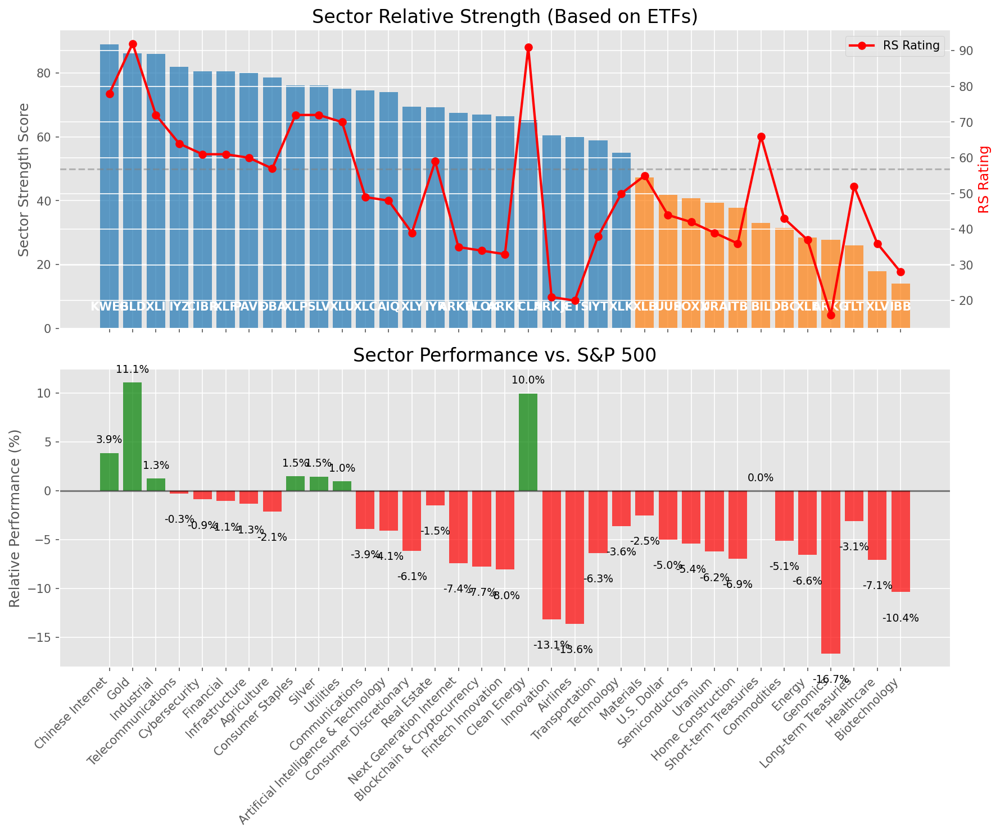

# **Daily Relative Strength Report**

**Date:** 2025-05-12

## **Market Valuation (Buffett Indicator)**

| Metric | Value |
|--------|-------|
| **Market Valuation** | **Fair Valued** |
| **Current Ratio** | 9.57 |
| **Historical Mean** | 9.41 |
| **Standard Deviation** | 0.51 |
| **Z-Score (StdDev from Mean)** | -0.27 |
| **Total Market Cap** | $286.82 trillion |
| **GDP** | $29.98 trillion |

## **Market Insights**

### **Market is Fairly Valued**

The market appears to be trading within a reasonable range of historical valuations. This suggests a balanced approach to equity investing is appropriate. Investors should:

- Focus on individual stock selection based on fundamentals and technicals
- Maintain normal equity allocations aligned with long-term goals
- Pay attention to sector rotation and relative strength
- Watch for changes in market leadership

Fair valuation typically suggests normal market returns can be expected, with stock selection becoming increasingly important.

### **Buffett Indicator Overview**

The Buffett Indicator (Total Market Cap / GDP) is a measure of the stock market's valuation relative to the size of the economy. It is named after Warren Buffett, who described it as "probably the best single measure of where valuations stand at any given moment."

- **Values above +2 standard deviations:** Market significantly overvalued
- **Values above +1 standard deviation:** Market overvalued
- **Values between -1 and +1 standard deviations:** Market fairly valued
- **Values below -1 standard deviation:** Market undervalued
- **Values below -2 standard deviations:** Market significantly undervalued

---

## **Sector Relative Strength**

Based on William O'Neil's Relative Strength Methodology

| ETF | Strength | RS Rating | Performance | Above Key MAs | Trend | Sector |
|-----|----------|-----------|-------------|--------------|-------|--------|
| [KWEB](https://www.tradingview.com/chart/?symbol=KWEB) | 89.5 | 79.0 | 4.11% | 10d ✓, 50d ✓, 200d ✓ | ↗️ | Chinese Internet |
| [GLD](https://www.tradingview.com/chart/?symbol=GLD) | 86.1 | 92.0 | 10.70% | 10d ✗, 50d ✓, 200d ✓ | ↗️ | Gold |
| [XLU](https://www.tradingview.com/chart/?symbol=XLU) | 86.0 | 72.0 | 1.19% | 10d ✓, 50d ✓, 200d ✓ | ↗️ | Utilities |
| [XLI](https://www.tradingview.com/chart/?symbol=XLI) | 85.5 | 71.0 | 0.98% | 10d ✓, 50d ✓, 200d ✓ | ↗️ | Industrial |
| [IYZ](https://www.tradingview.com/chart/?symbol=IYZ) | 82.0 | 64.0 | -0.50% | 10d ✓, 50d ✓, 200d ✓ | ↗️ | Telecommunications |
| [CIBR](https://www.tradingview.com/chart/?symbol=CIBR) | 80.0 | 60.0 | -1.24% | 10d ✓, 50d ✓, 200d ✓ | ↗️ | Cybersecurity |
| [PAVE](https://www.tradingview.com/chart/?symbol=PAVE) | 80.0 | 60.0 | -1.24% | 10d ✓, 50d ✓, 200d ✓ | ↗️ | Infrastructure |
| [XLF](https://www.tradingview.com/chart/?symbol=XLF) | 80.0 | 60.0 | -1.23% | 10d ✓, 50d ✓, 200d ✓ | ↗️ | Financial |
| [DBA](https://www.tradingview.com/chart/?symbol=DBA) | 78.5 | 57.0 | -2.16% | 10d ✓, 50d ✓, 200d ✓ | ↗️ | Agriculture |
| [XLC](https://www.tradingview.com/chart/?symbol=XLC) | 75.0 | 50.0 | -3.96% | 10d ✓, 50d ✓, 200d ✓ | ↗️ | Communications |
| [AIQ](https://www.tradingview.com/chart/?symbol=AIQ) | 74.5 | 49.0 | -4.01% | 10d ✓, 50d ✓, 200d ✓ | ↗️ | Artificial Intelligence & Technology |
| [IYR](https://www.tradingview.com/chart/?symbol=IYR) | 70.3 | 61.0 | -1.18% | 10d ✓, 50d ✓, 200d ✗ | ↗️ | Real Estate |
| [XLY](https://www.tradingview.com/chart/?symbol=XLY) | 69.5 | 39.0 | -6.31% | 10d ✓, 50d ✓, 200d ✓ | ↗️ | Consumer Discretionary |
| [ARKW](https://www.tradingview.com/chart/?symbol=ARKW) | 68.5 | 37.0 | -6.99% | 10d ✓, 50d ✓, 200d ✓ | ↗️ | Next Generation Internet |
| [BLOK](https://www.tradingview.com/chart/?symbol=BLOK) | 68.0 | 36.0 | -7.14% | 10d ✓, 50d ✓, 200d ✓ | ↗️ | Blockchain & Cryptocurrency |
| [ARKF](https://www.tradingview.com/chart/?symbol=ARKF) | 67.0 | 34.0 | -7.86% | 10d ✓, 50d ✓, 200d ✓ | ↗️ | Fintech Innovation |
| [SLV](https://www.tradingview.com/chart/?symbol=SLV) | 65.7 | 71.0 | 0.98% | 10d ✗, 50d ✗, 200d ✓ | ↗️ | Silver |
| [XLP](https://www.tradingview.com/chart/?symbol=XLP) | 65.7 | 71.0 | 1.10% | 10d ✗, 50d ✗, 200d ✓ | ↗️ | Consumer Staples |
| [ICLN](https://www.tradingview.com/chart/?symbol=ICLN) | 65.3 | 91.0 | 10.15% | 10d ✓, 50d ✓, 200d ✗ | ↘️ | Clean Energy |
| [ARKK](https://www.tradingview.com/chart/?symbol=ARKK) | 61.0 | 22.0 | -12.83% | 10d ✓, 50d ✓, 200d ✓ | ↗️ | Innovation |
| [JETS](https://www.tradingview.com/chart/?symbol=JETS) | 60.0 | 20.0 | -13.89% | 10d ✓, 50d ✓, 200d ✓ | ↗️ | Airlines |
| [XLK](https://www.tradingview.com/chart/?symbol=XLK) | 55.5 | 51.0 | -3.81% | 10d ✓, 50d ✓, 200d ✓ | ↘️ | Technology |
| [URA](https://www.tradingview.com/chart/?symbol=URA) | 50.0 | 40.0 | -5.96% | 10d ✓, 50d ✓, 200d ✓ | ↘️ | Uranium |
| [XLB](https://www.tradingview.com/chart/?symbol=XLB) | 47.8 | 56.0 | -2.55% | 10d ✓, 50d ✓, 200d ✗ | ↘️ | Materials |
| [BIL](https://www.tradingview.com/chart/?symbol=BIL) | 42.9 | 66.0 | 0.03% | 10d ✓, 50d ✗, 200d ✗ | ↘️ | Short-term Treasuries |
| [SOXX](https://www.tradingview.com/chart/?symbol=SOXX) | 42.3 | 45.0 | -4.84% | 10d ✓, 50d ✓, 200d ✗ | ↘️ | Semiconductors |
| [UUP](https://www.tradingview.com/chart/?symbol=UUP) | 42.3 | 45.0 | -4.89% | 10d ✓, 50d ✓, 200d ✗ | ↘️ | U.S. Dollar |
| [IYT](https://www.tradingview.com/chart/?symbol=IYT) | 38.8 | 38.0 | -6.76% | 10d ✓, 50d ✓, 200d ✗ | ↘️ | Transportation |
| [ITB](https://www.tradingview.com/chart/?symbol=ITB) | 37.3 | 35.0 | -7.44% | 10d ✓, 50d ✓, 200d ✗ | ↘️ | Home Construction |
| [DBC](https://www.tradingview.com/chart/?symbol=DBC) | 32.4 | 45.0 | -4.98% | 10d ✓, 50d ✗, 200d ✗ | ↘️ | Commodities |
| [XLE](https://www.tradingview.com/chart/?symbol=XLE) | 28.4 | 37.0 | -6.83% | 10d ✓, 50d ✗, 200d ✗ | ↘️ | Energy |
| [ARKG](https://www.tradingview.com/chart/?symbol=ARKG) | 28.3 | 17.0 | -16.20% | 10d ✓, 50d ✓, 200d ✗ | ↘️ | Genomics |
| [TLT](https://www.tradingview.com/chart/?symbol=TLT) | 27.0 | 54.0 | -2.86% | 10d ✗, 50d ✗, 200d ✗ | ↘️ | Long-term Treasuries |
| [XLV](https://www.tradingview.com/chart/?symbol=XLV) | 18.0 | 36.0 | -7.07% | 10d ✗, 50d ✗, 200d ✗ | ↘️ | Healthcare |
| [IBB](https://www.tradingview.com/chart/?symbol=IBB) | 14.0 | 28.0 | -10.19% | 10d ✗, 50d ✗, 200d ✗ | ↘️ | Biotechnology |

### **Sector ETF Performance Interpretation**

This table shows the relative strength metrics for different market sectors based on their representative ETFs:

- **ETF**: The ETF used to measure sector performance (click for chart)
- **Strength**: Overall sector strength score (0-100) combining multiple factors
- **RS Rating**: O'Neil RS rating of the sector ETF
- **Performance**: Performance of the sector ETF relative to SPY
- **Above Key MAs**: Whether the ETF is trading above its 10, 50, and 200-day moving averages
- **Trend**: Whether the sector is in an uptrend (↗️) or downtrend (↘️)

### **Current Sector Leadership**

The current market leadership is coming from the following sectors: **Chinese Internet, Gold, Utilities**.

The **Chinese Internet** sector (represented by **KWEB**) is showing particularly strong relative strength with an RS rating of 79.0 and performance of 4.11% vs. the S&P 500. This sector is trading above its 10-day, 50-day, 200-day moving average(s). Investors should consider focusing on high RS stocks within these leading sectors for potential outperformance.

---

## **Buy Recommendations**

The following 53 stocks show exceptional relative strength:

| RS Rating | Buy Score | Current Price | Chart | Name | Ticker |
|-----------|-----------|---------------|-------|------|--------|
| 100 | 100 | $172.42 | [Chart](https://www.tradingview.com/chart/?symbol=DAVE) | Dave Inc. Class A Common Stock | DAVE |
| 100 | 100 | $19.28 | [Chart](https://www.tradingview.com/chart/?symbol=SPNT) | SiriusPoint Ltd. | SPNT |
| 100 | 100 | $27.45 | [Chart](https://www.tradingview.com/chart/?symbol=DB) | Deutsche Bank Aktiengesellschaft | DB |
| 100 | 100 | $88.42 | [Chart](https://www.tradingview.com/chart/?symbol=SEZL) | Sezzle Inc. Common Stock | SEZL |
| 100 | 100 | $23.95 | [Chart](https://www.tradingview.com/chart/?symbol=GRND) | Grindr Inc. | GRND |
| 99 | 100 | $47.73 | [Chart](https://www.tradingview.com/chart/?symbol=MRX) | Marex Group plc Ordinary Shares | MRX |
| 99 | 100 | $150.08 | [Chart](https://www.tradingview.com/chart/?symbol=ROOT) | Root, Inc. Class A Common Stock | ROOT |
| 99 | 100 | $69.70 | [Chart](https://www.tradingview.com/chart/?symbol=ULS) | UL Solutions Inc. | ULS |
| 98 | 100 | $22.80 | [Chart](https://www.tradingview.com/chart/?symbol=CRK) | Comstock Resources, Inc. | CRK |
| 98 | 100 | $157.54 | [Chart](https://www.tradingview.com/chart/?symbol=HWM) | Howmet Aerospace Inc. | HWM |
| 98 | 100 | $34.82 | [Chart](https://www.tradingview.com/chart/?symbol=AHR) | American Healthcare REIT, Inc. | AHR |
| 98 | 100 | $408.37 | [Chart](https://www.tradingview.com/chart/?symbol=MSTR) | MicroStrategy Inc | MSTR |
| 98 | 100 | $130.81 | [Chart](https://www.tradingview.com/chart/?symbol=ATGE) | Adtalem Global Education Inc. Common Shares | ATGE |
| 98 | 100 | $129.14 | [Chart](https://www.tradingview.com/chart/?symbol=VSEC) | VSE Corp | VSEC |
| 97 | 100 | $28.13 | [Chart](https://www.tradingview.com/chart/?symbol=FMS) | Fresenius Medical Care AG | FMS |
| 97 | 100 | $40.58 | [Chart](https://www.tradingview.com/chart/?symbol=DRS) | Leonardo DRS, Inc. Common Stock | DRS |
| 97 | 100 | $38.38 | [Chart](https://www.tradingview.com/chart/?symbol=PAY) | Paymentus Holdings, Inc. | PAY |
| 97 | 100 | $30.70 | [Chart](https://www.tradingview.com/chart/?symbol=EUFN) | iShares MSCI Europe Financials ETF | EUFN |
| 96 | 100 | $143.30 | [Chart](https://www.tradingview.com/chart/?symbol=SE) | Sea Limited American Depositary Shares, each representing one Class A Ordinary Share | SE |
| 96 | 100 | $33.65 | [Chart](https://www.tradingview.com/chart/?symbol=UTI) | Universal Technical Institute, Inc. | UTI |
| 96 | 100 | $62.12 | [Chart](https://www.tradingview.com/chart/?symbol=CHEF) | The Chef's Warehouse Inc | CHEF |
| 96 | 100 | $299.62 | [Chart](https://www.tradingview.com/chart/?symbol=PEN) | Penumbra, Inc. | PEN |
| 96 | 100 | $40.28 | [Chart](https://www.tradingview.com/chart/?symbol=EWG) | iShares MSCI Germany ETF | EWG |
| 95 | 100 | $41.00 | [Chart](https://www.tradingview.com/chart/?symbol=AB) | AllianceBernstein Holding, L.P. | AB |
| 95 | 100 | $74.19 | [Chart](https://www.tradingview.com/chart/?symbol=RBLX) | Roblox Corporation | RBLX |
| 95 | 100 | $217.06 | [Chart](https://www.tradingview.com/chart/?symbol=CRS) | Carpenter Technology Corp | CRS |
| 95 | 100 | $33.18 | [Chart](https://www.tradingview.com/chart/?symbol=SLM) | SLM Corporation | SLM |
| 95 | 100 | $47.82 | [Chart](https://www.tradingview.com/chart/?symbol=ERJ) | Embraer S.A. | ERJ |
| 94 | 100 | $105.03 | [Chart](https://www.tradingview.com/chart/?symbol=RBA) | RB Global, Inc. | RBA |
| 93 | 100 | $87.22 | [Chart](https://www.tradingview.com/chart/?symbol=TGLS) | Tecnoglass Inc. | TGLS |
| 93 | 100 | $16.75 | [Chart](https://www.tradingview.com/chart/?symbol=BCS) | Barclays PLC | BCS |
| 93 | 100 | $53.20 | [Chart](https://www.tradingview.com/chart/?symbol=EPR) | EPR Properties | EPR |
| 93 | 100 | $317.74 | [Chart](https://www.tradingview.com/chart/?symbol=PODD) | Insulet Corporation | PODD |
| 93 | 100 | $118.47 | [Chart](https://www.tradingview.com/chart/?symbol=COOP) | Mr. Cooper Group Inc. Common Stock | COOP |
| 89 | 100 | $25.12 | [Chart](https://www.tradingview.com/chart/?symbol=EWS) | iShares MSCI Singapore ETF | EWS |
| 89 | 100 | $94.55 | [Chart](https://www.tradingview.com/chart/?symbol=HEES) | H&E Equipment Services, Inc. | HEES |
| 89 | 100 | $67.76 | [Chart](https://www.tradingview.com/chart/?symbol=CTVA) | Corteva, Inc. Common Stock | CTVA |
| 88 | 100 | $58.34 | [Chart](https://www.tradingview.com/chart/?symbol=HSBC) | HSBC Holdings PLC | HSBC |
| 87 | 99 | $196.10 | [Chart](https://www.tradingview.com/chart/?symbol=LOPE) | Grand Canyon Education, Inc | LOPE |
| 88 | 98 | $13.34 | [Chart](https://www.tradingview.com/chart/?symbol=CNH) | CNH INDUSTRIAL N.V. | CNH |
| 86 | 96 | $30.51 | [Chart](https://www.tradingview.com/chart/?symbol=PRDO) | Perdoceo Education Corporation | PRDO |
| 83 | 96 | $45.81 | [Chart](https://www.tradingview.com/chart/?symbol=QFIN) | Qifu Technology, Inc. American Depositary Shares | QFIN |
| 84 | 95 | $29.59 | [Chart](https://www.tradingview.com/chart/?symbol=ATAT) | Atour Lifestyle Holdings Limited American Depositary Shares | ATAT |
| 84 | 95 | $205.37 | [Chart](https://www.tradingview.com/chart/?symbol=BAP) | Credicorp LTD | BAP |
| 82 | 95 | $218.75 | [Chart](https://www.tradingview.com/chart/?symbol=IDCC) | InterDigital, Inc. | IDCC |
| 82 | 93 | $23.99 | [Chart](https://www.tradingview.com/chart/?symbol=CPRX) | Catalyst Pharmaceutical  Inc. | CPRX |
| 81 | 93 | $204.74 | [Chart](https://www.tradingview.com/chart/?symbol=DRI) | Darden Restaurants, Inc. | DRI |
| 83 | 92 | $58.52 | [Chart](https://www.tradingview.com/chart/?symbol=IBIT) | iShares Bitcoin Trust ETF | IBIT |
| 81 | 92 | $165.23 | [Chart](https://www.tradingview.com/chart/?symbol=ITA) | iShares U.S. Aerospace & Defense ETF | ITA |
| 81 | 92 | $204.75 | [Chart](https://www.tradingview.com/chart/?symbol=DFS) | Discover Financial Services | DFS |
| 81 | 91 | $17.08 | [Chart](https://www.tradingview.com/chart/?symbol=MIR) | Mirion Technologies, Inc. | MIR |
| 80 | 91 | $24.93 | [Chart](https://www.tradingview.com/chart/?symbol=PRVA) | Privia Health Group, Inc. Common Stock | PRVA |
| 80 | 90 | $69.51 | [Chart](https://www.tradingview.com/chart/?symbol=BROS) | Dutch Bros Inc. | BROS |

---

## **Sell Recommendations**

The following 84 stocks show deteriorating relative strength:

| RS Rating | Sell Score | Current Price | Chart | Name | Ticker |
|-----------|------------|---------------|-------|------|--------|
| 1 | 100 | $10.19 | [Chart](https://www.tradingview.com/chart/?symbol=NRIX) | Nurix Therapeutics, Inc. Common stock | NRIX |
| 1 | 100 | $20.45 | [Chart](https://www.tradingview.com/chart/?symbol=BHVN) | Biohaven Ltd. | BHVN |
| 2 | 100 | $14.02 | [Chart](https://www.tradingview.com/chart/?symbol=DQ) | Daqo New Energy Corp. American Depositary Shares (each representing 5 Ordinary Shares) | DQ |
| 3 | 100 | $10.36 | [Chart](https://www.tradingview.com/chart/?symbol=LSPD) | Lightspeed Commerce Inc. | LSPD |
| 3 | 100 | $29.57 | [Chart](https://www.tradingview.com/chart/?symbol=CRTO) | Criteo S.A. | CRTO |
| 3 | 100 | $13.12 | [Chart](https://www.tradingview.com/chart/?symbol=MNRO) | Monro, Inc. Common Stock | MNRO |
| 5 | 100 | $11.76 | [Chart](https://www.tradingview.com/chart/?symbol=ARCT) | Arcturus Therapeutics Holdings Inc. Common Stock | ARCT |
| 5 | 100 | $13.22 | [Chart](https://www.tradingview.com/chart/?symbol=FL) | Foot Locker, Inc. | FL |
| 5 | 100 | $28.01 | [Chart](https://www.tradingview.com/chart/?symbol=SRDX) | Surmodics, Inc. Common Stock | SRDX |
| 6 | 100 | $26.53 | [Chart](https://www.tradingview.com/chart/?symbol=TRN) | Trinity Industries, Inc. | TRN |
| 7 | 100 | $33.31 | [Chart](https://www.tradingview.com/chart/?symbol=AAP) | ADVANCE AUTO PARTS INC | AAP |
| 7 | 100 | $16.05 | [Chart](https://www.tradingview.com/chart/?symbol=PENN) | PENN Entertainment, Inc. Common Stock | PENN |
| 8 | 100 | $129.21 | [Chart](https://www.tradingview.com/chart/?symbol=TFX) | Teleflex Incorporated | TFX |
| 8 | 100 | $14.58 | [Chart](https://www.tradingview.com/chart/?symbol=IMVT) | Immunovant, Inc. Common Stock | IMVT |
| 9 | 100 | $11.34 | [Chart](https://www.tradingview.com/chart/?symbol=HPK) | HighPeak Energy, Inc. Common Stock | HPK |
| 10 | 100 | $32.72 | [Chart](https://www.tradingview.com/chart/?symbol=CYTK) | Cytokinetics Inc. | CYTK |
| 11 | 100 | $33.58 | [Chart](https://www.tradingview.com/chart/?symbol=SMCI) | Super Micro Computer, Inc. Common Stock | SMCI |
| 12 | 100 | $47.73 | [Chart](https://www.tradingview.com/chart/?symbol=RHI) | Robert Half Inc. | RHI |
| 16 | 100 | $10.34 | [Chart](https://www.tradingview.com/chart/?symbol=CMRE) | Costamare Inc. | CMRE |
| 20 | 100 | $97.68 | [Chart](https://www.tradingview.com/chart/?symbol=CHRD) | Chord Energy Corporation Common Stock | CHRD |
| 6 | 99 | $10.31 | [Chart](https://www.tradingview.com/chart/?symbol=VREX) | Varex Imaging Corporation Common Stock | VREX |
| 7 | 99 | $12.78 | [Chart](https://www.tradingview.com/chart/?symbol=LBRT) | Liberty Energy Inc. | LBRT |
| 9 | 99 | $12.05 | [Chart](https://www.tradingview.com/chart/?symbol=ZUMZ) | Zumiez Inc. | ZUMZ |
| 22 | 99 | $13.23 | [Chart](https://www.tradingview.com/chart/?symbol=MED) | Medifast, Inc. | MED |
| 4 | 98 | $32.90 | [Chart](https://www.tradingview.com/chart/?symbol=TWST) | Twist Bioscience Corporation Common Stock | TWST |
| 11 | 98 | $10.03 | [Chart](https://www.tradingview.com/chart/?symbol=MTAL) | MAC Copper Limited | MTAL |
| 19 | 98 | $10.96 | [Chart](https://www.tradingview.com/chart/?symbol=BWLP) | BW LPG Limited | BWLP |
| 8 | 97 | $56.08 | [Chart](https://www.tradingview.com/chart/?symbol=CCS) | CENTURY COMMUNITIES, INC. | CCS |
| 20 | 97 | $29.25 | [Chart](https://www.tradingview.com/chart/?symbol=AGIO) | Agios Pharmaceuticals, Inc. | AGIO |
| 8 | 95 | $116.33 | [Chart](https://www.tradingview.com/chart/?symbol=BLDR) | Builders FirstSource, Inc. | BLDR |
| 11 | 95 | $31.47 | [Chart](https://www.tradingview.com/chart/?symbol=MBIN) | Merchants Bancorp Common Stock | MBIN |
| 13 | 95 | $17.86 | [Chart](https://www.tradingview.com/chart/?symbol=MLKN) | MillerKnoll, Inc. Common Stock | MLKN |
| 15 | 95 | $50.96 | [Chart](https://www.tradingview.com/chart/?symbol=ERX) | Direxion Daily Energy Bull 2X Shares | ERX |
| 11 | 94 | $10.60 | [Chart](https://www.tradingview.com/chart/?symbol=PEB) | Pebblebrook Hotel Trust | PEB |
| 15 | 93 | $16.51 | [Chart](https://www.tradingview.com/chart/?symbol=CHCT) | Community Healthcare Trust Incorporated Common Stock, $0.01 par value per share | CHCT |
| 8 | 92 | $10.15 | [Chart](https://www.tradingview.com/chart/?symbol=HLIT) | Harmonic Inc | HLIT |
| 11 | 92 | $12.14 | [Chart](https://www.tradingview.com/chart/?symbol=APLE) | Apple Hospitality REIT, Inc. | APLE |
| 11 | 92 | $55.22 | [Chart](https://www.tradingview.com/chart/?symbol=PRCT) | PROCEPT BioRobotics Corporation Common Stock | PRCT |
| 16 | 91 | $84.04 | [Chart](https://www.tradingview.com/chart/?symbol=WHR) | Whirlpool Corp. | WHR |
| 22 | 91 | $35.87 | [Chart](https://www.tradingview.com/chart/?symbol=SLB) | Schlumberger Limited | SLB |
| 22 | 91 | $16.65 | [Chart](https://www.tradingview.com/chart/?symbol=PD) | PagerDuty, Inc. | PD |
| 16 | 90 | $10.38 | [Chart](https://www.tradingview.com/chart/?symbol=AVO) | Mission Produce, Inc. Common Stock | AVO |
| 17 | 90 | $12.26 | [Chart](https://www.tradingview.com/chart/?symbol=M) | Macy's Inc. | M |
| 28 | 90 | $148.78 | [Chart](https://www.tradingview.com/chart/?symbol=MTN) | Vail Resorts, Inc. | MTN |
| 18 | 89 | $10.15 | [Chart](https://www.tradingview.com/chart/?symbol=CELC) | Celcuity Inc. Common Stock | CELC |
| 22 | 89 | $51.00 | [Chart](https://www.tradingview.com/chart/?symbol=LW) | Lamb Weston Holdings, Inc. | LW |
| 12 | 88 | $14.92 | [Chart](https://www.tradingview.com/chart/?symbol=INMD) | InMode Ltd. Ordinary Shares | INMD |
| 17 | 88 | $37.41 | [Chart](https://www.tradingview.com/chart/?symbol=TECS) | Direxion Daily Technology Bear 3x Shares | TECS |
| 18 | 88 | $37.00 | [Chart](https://www.tradingview.com/chart/?symbol=NBHC) | NATIONAL BANK HOLDINGS CORP. | NBHC |
| 16 | 86 | $12.30 | [Chart](https://www.tradingview.com/chart/?symbol=XHR) | Xenia Hotels & Resorts, Inc. | XHR |
| 23 | 86 | $12.81 | [Chart](https://www.tradingview.com/chart/?symbol=DBO) | Invesco DB Oil Fund | DBO |
| 22 | 84 | $10.44 | [Chart](https://www.tradingview.com/chart/?symbol=SD) | SandRidge Energy, Inc. | SD |
| 36 | 84 | $21.47 | [Chart](https://www.tradingview.com/chart/?symbol=NVDS) | Investment Managers Series Trust II Tradr 1.5X Short NVDA Daily ETF | NVDS |
| 19 | 83 | $98.05 | [Chart](https://www.tradingview.com/chart/?symbol=RVTY) | Revvity, Inc. | RVTY |
| 24 | 83 | $36.86 | [Chart](https://www.tradingview.com/chart/?symbol=BHE) | Benchmark Electronics | BHE |
| 22 | 82 | $55.89 | [Chart](https://www.tradingview.com/chart/?symbol=KBH) | KB Home | KBH |
| 26 | 82 | $19.18 | [Chart](https://www.tradingview.com/chart/?symbol=HVT) | Haverty Furniture Companies, Inc. | HVT |
| 31 | 82 | $20.97 | [Chart](https://www.tradingview.com/chart/?symbol=CSWC) | Capital Southwest Corp | CSWC |
| 29 | 81 | $27.60 | [Chart](https://www.tradingview.com/chart/?symbol=BNO) | United States Brent Oil Fund, LP | BNO |
| 37 | 81 | $65.50 | [Chart](https://www.tradingview.com/chart/?symbol=ZROZ) | PIMCO 25+ Year Zero Coupon U.S. Treasury Index Exchange-Traded Fund | ZROZ |
| 20 | 80 | $15.45 | [Chart](https://www.tradingview.com/chart/?symbol=BCSF) | Bain Capital Specialty Finance, Inc. | BCSF |
| 24 | 80 | $16.41 | [Chart](https://www.tradingview.com/chart/?symbol=QYLD) | Global X Funds Global X NASDAQ-100 Covered Call ETF | QYLD |
| 29 | 80 | $20.58 | [Chart](https://www.tradingview.com/chart/?symbol=BITI) | ProShares Short Bitcoin ETF | BITI |
| 21 | 79 | $74.54 | [Chart](https://www.tradingview.com/chart/?symbol=WFG) | West Fraser Timber Co. Ltd | WFG |
| 24 | 78 | $14.65 | [Chart](https://www.tradingview.com/chart/?symbol=RYLD) | Global X Russell 2000 Covered Call ETF | RYLD |
| 32 | 78 | $12.29 | [Chart](https://www.tradingview.com/chart/?symbol=KELYA) | Kelly Services Inc | KELYA |
| 31 | 77 | $57.05 | [Chart](https://www.tradingview.com/chart/?symbol=UHAL.B) | U-Haul Holding Company | UHAL.B |
| 35 | 77 | $134.87 | [Chart](https://www.tradingview.com/chart/?symbol=HES) | Hess Corporation | HES |
| 29 | 76 | $14.56 | [Chart](https://www.tradingview.com/chart/?symbol=BMEZ) | BlackRock Health Sciences Term Trust | BMEZ |
| 31 | 76 | $131.19 | [Chart](https://www.tradingview.com/chart/?symbol=PEP) | PepsiCo, Inc. | PEP |
| 31 | 76 | $111.44 | [Chart](https://www.tradingview.com/chart/?symbol=LEN) | Lennar Corporation Class A | LEN |
| 35 | 76 | $33.08 | [Chart](https://www.tradingview.com/chart/?symbol=LEGN) | Legend Biotech Corporation American Depositary Shares | LEGN |
| 28 | 75 | $14.27 | [Chart](https://www.tradingview.com/chart/?symbol=EIC) | Eagle Point Income Company Inc. | EIC |
| 32 | 75 | $14.15 | [Chart](https://www.tradingview.com/chart/?symbol=OCSL) | Oaktree Specialty Lending Corporation | OCSL |
| 31 | 73 | $17.41 | [Chart](https://www.tradingview.com/chart/?symbol=MLNK) | MeridianLink, Inc. | MLNK |
| 34 | 73 | $13.93 | [Chart](https://www.tradingview.com/chart/?symbol=BSM) | Black Stone Minerals, L.P. | BSM |
| 31 | 72 | $10.66 | [Chart](https://www.tradingview.com/chart/?symbol=LADR) | LADDER CAPITAL CORP | LADR |
| 36 | 71 | $15.07 | [Chart](https://www.tradingview.com/chart/?symbol=HR) | Healthcare Realty Trust Incorporated | HR |
| 38 | 71 | $44.79 | [Chart](https://www.tradingview.com/chart/?symbol=IYE) | iShares U.S. Energy ETF | IYE |
| 39 | 71 | $54.41 | [Chart](https://www.tradingview.com/chart/?symbol=GIS) | General Mills, Inc. | GIS |
| 31 | 69 | $141.42 | [Chart](https://www.tradingview.com/chart/?symbol=CVX) | Chevron Corporation | CVX |
| 36 | 69 | $117.94 | [Chart](https://www.tradingview.com/chart/?symbol=VDE) | Vanguard Energy ETF | VDE |
| 37 | 69 | $84.33 | [Chart](https://www.tradingview.com/chart/?symbol=XLE) | Energy Select Sector SPDR Fund | XLE |
| 38 | 69 | $17.76 | [Chart](https://www.tradingview.com/chart/?symbol=JPMpM) | JPMorgan Chase & Co. Depositary Shares, each representing a 1/400th interest in a share of 4.20% Non-Cumulative Preferred Stock, Series MM | JPMpM |

## **Methodology**

This report uses William O'Neil's relative strength methodology from Investors Business Daily:

* **RS Rating**: Percentile rank of stock's performance vs. S&P 500 over the past 63 trading days (1-99 scale)
* **Buy Criteria**: RS Rating >= 80, price above 50-day MA, strong uptrend, increasing volume
* **Sell Criteria**: RS Rating < 40, price below 50-day MA, downtrend, decreasing volume

### **O'Neil's Key Principles**

1. **Focus on relative performance** - stocks outperforming the market
2. **Price trend confirmation** - stock must be in an uptrend
3. **Volume confirmation** - strong volume supports price moves
4. **Moving average validation** - price above key moving averages
5. **Market leaders only** - concentrate on top-performing stocks

*Report generated automatically after market close*