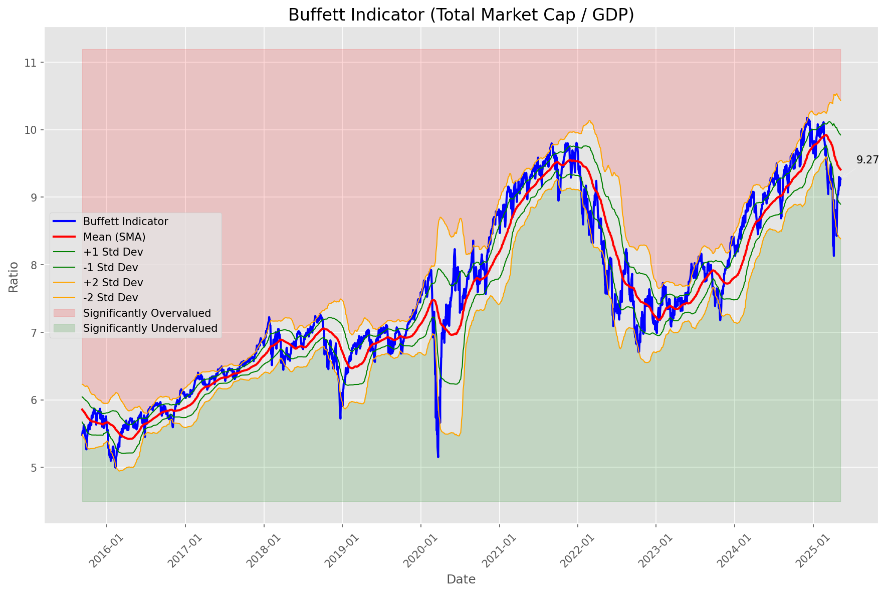
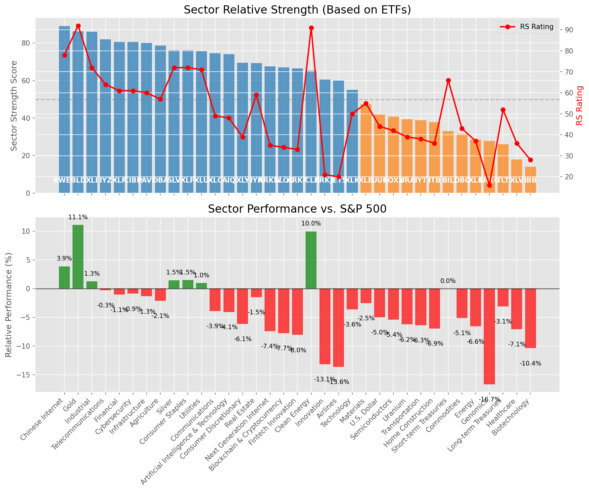

# **Daily Relative Strength Report**

**Date:** 2025-05-13

## **Market Valuation (Buffett Indicator)**

| Metric | Value |
|--------|-------|
| **Market Valuation** | **Fair Valued** |
| **Current Ratio** | 9.65 |
| **Historical Mean** | 9.41 |
| **Standard Deviation** | 0.51 |
| **Z-Score (StdDev from Mean)** | 0.34 |
| **Total Market Cap** | $289.22 trillion |
| **GDP** | $29.98 trillion |

## **Market Insights**

### **Market is Fairly Valued**

The market appears to be trading within a reasonable range of historical valuations. This suggests a balanced approach to equity investing is appropriate. Investors should:

- Focus on individual stock selection based on fundamentals and technicals
- Maintain normal equity allocations aligned with long-term goals
- Pay attention to sector rotation and relative strength
- Watch for changes in market leadership

Fair valuation typically suggests normal market returns can be expected, with stock selection becoming increasingly important.

### **Buffett Indicator Overview**

The Buffett Indicator (Total Market Cap / GDP) is a measure of the stock market's valuation relative to the size of the economy. It is named after Warren Buffett, who described it as "probably the best single measure of where valuations stand at any given moment."

- **Values above +2 standard deviations:** Market significantly overvalued
- **Values above +1 standard deviation:** Market overvalued
- **Values between -1 and +1 standard deviations:** Market fairly valued
- **Values below -1 standard deviation:** Market undervalued
- **Values below -2 standard deviations:** Market significantly undervalued

---

## **Sector Relative Strength**

Based on William O'Neil's Relative Strength Methodology

| ETF | Strength | RS Rating | Performance | Above Key MAs | Trend | Sector |
|-----|----------|-----------|-------------|--------------|-------|--------|
| [KWEB](https://www.tradingview.com/chart/?symbol=KWEB) | 91.0 | 82.0 | 5.67% | 10d ✓, 50d ✓, 200d ✓ | ↗️ | Chinese Internet |
| [SLV](https://www.tradingview.com/chart/?symbol=SLV) | 88.0 | 76.0 | 3.21% | 10d ✓, 50d ✓, 200d ✓ | ↗️ | Silver |
| [XLI](https://www.tradingview.com/chart/?symbol=XLI) | 86.5 | 73.0 | 1.93% | 10d ✓, 50d ✓, 200d ✓ | ↗️ | Industrial |
| [GLD](https://www.tradingview.com/chart/?symbol=GLD) | 86.1 | 92.0 | 11.99% | 10d ✗, 50d ✓, 200d ✓ | ↗️ | Gold |
| [CIBR](https://www.tradingview.com/chart/?symbol=CIBR) | 84.0 | 68.0 | 0.60% | 10d ✓, 50d ✓, 200d ✓ | ↗️ | Cybersecurity |
| [IYZ](https://www.tradingview.com/chart/?symbol=IYZ) | 83.0 | 66.0 | 0.32% | 10d ✓, 50d ✓, 200d ✓ | ↗️ | Telecommunications |
| [PAVE](https://www.tradingview.com/chart/?symbol=PAVE) | 81.0 | 62.0 | -0.43% | 10d ✓, 50d ✓, 200d ✓ | ↗️ | Infrastructure |
| [XLF](https://www.tradingview.com/chart/?symbol=XLF) | 80.0 | 60.0 | -0.89% | 10d ✓, 50d ✓, 200d ✓ | ↗️ | Financial |
| [AIQ](https://www.tradingview.com/chart/?symbol=AIQ) | 78.5 | 57.0 | -1.67% | 10d ✓, 50d ✓, 200d ✓ | ↗️ | Artificial Intelligence & Technology |
| [DBA](https://www.tradingview.com/chart/?symbol=DBA) | 78.0 | 56.0 | -1.83% | 10d ✓, 50d ✓, 200d ✓ | ↗️ | Agriculture |
| [ICLN](https://www.tradingview.com/chart/?symbol=ICLN) | 77.5 | 95.0 | 15.20% | 10d ✓, 50d ✓, 200d ✓ | ↘️ | Clean Energy |
| [BLOK](https://www.tradingview.com/chart/?symbol=BLOK) | 77.5 | 55.0 | -2.11% | 10d ✓, 50d ✓, 200d ✓ | ↗️ | Blockchain & Cryptocurrency |
| [ARKF](https://www.tradingview.com/chart/?symbol=ARKF) | 77.0 | 54.0 | -2.40% | 10d ✓, 50d ✓, 200d ✓ | ↗️ | Fintech Innovation |
| [XLC](https://www.tradingview.com/chart/?symbol=XLC) | 75.0 | 50.0 | -3.10% | 10d ✓, 50d ✓, 200d ✓ | ↗️ | Communications |
| [ARKW](https://www.tradingview.com/chart/?symbol=ARKW) | 74.0 | 48.0 | -3.42% | 10d ✓, 50d ✓, 200d ✓ | ↗️ | Next Generation Internet |
| [XLU](https://www.tradingview.com/chart/?symbol=XLU) | 73.6 | 67.0 | 0.33% | 10d ✗, 50d ✓, 200d ✓ | ↗️ | Utilities |
| [XLY](https://www.tradingview.com/chart/?symbol=XLY) | 73.0 | 46.0 | -3.80% | 10d ✓, 50d ✓, 200d ✓ | ↗️ | Consumer Discretionary |
| [IYT](https://www.tradingview.com/chart/?symbol=IYT) | 70.5 | 41.0 | -5.09% | 10d ✓, 50d ✓, 200d ✓ | ↗️ | Transportation |
| [ARKK](https://www.tradingview.com/chart/?symbol=ARKK) | 68.5 | 37.0 | -6.42% | 10d ✓, 50d ✓, 200d ✓ | ↗️ | Innovation |
| [JETS](https://www.tradingview.com/chart/?symbol=JETS) | 63.5 | 27.0 | -10.08% | 10d ✓, 50d ✓, 200d ✓ | ↗️ | Airlines |
| [XLK](https://www.tradingview.com/chart/?symbol=XLK) | 59.0 | 58.0 | -1.57% | 10d ✓, 50d ✓, 200d ✓ | ↘️ | Technology |
| [URA](https://www.tradingview.com/chart/?symbol=URA) | 56.5 | 53.0 | -2.66% | 10d ✓, 50d ✓, 200d ✓ | ↘️ | Uranium |
| [SOXX](https://www.tradingview.com/chart/?symbol=SOXX) | 56.0 | 52.0 | -2.79% | 10d ✓, 50d ✓, 200d ✓ | ↘️ | Semiconductors |
| [IYR](https://www.tradingview.com/chart/?symbol=IYR) | 54.9 | 50.0 | -3.08% | 10d ✗, 50d ✓, 200d ✗ | ↗️ | Real Estate |
| [XLP](https://www.tradingview.com/chart/?symbol=XLP) | 50.0 | 60.0 | -0.83% | 10d ✗, 50d ✗, 200d ✗ | ↗️ | Consumer Staples |
| [XLB](https://www.tradingview.com/chart/?symbol=XLB) | 43.8 | 48.0 | -3.55% | 10d ✓, 50d ✓, 200d ✗ | ↘️ | Materials |
| [BIL](https://www.tradingview.com/chart/?symbol=BIL) | 42.4 | 65.0 | 0.03% | 10d ✓, 50d ✗, 200d ✗ | ↘️ | Short-term Treasuries |
| [DBC](https://www.tradingview.com/chart/?symbol=DBC) | 41.8 | 44.0 | -4.34% | 10d ✓, 50d ✓, 200d ✗ | ↘️ | Commodities |
| [XLE](https://www.tradingview.com/chart/?symbol=XLE) | 38.8 | 38.0 | -6.00% | 10d ✓, 50d ✓, 200d ✗ | ↘️ | Energy |
| [ITB](https://www.tradingview.com/chart/?symbol=ITB) | 37.3 | 35.0 | -7.25% | 10d ✓, 50d ✓, 200d ✗ | ↘️ | Home Construction |
| [UUP](https://www.tradingview.com/chart/?symbol=UUP) | 29.9 | 40.0 | -5.47% | 10d ✓, 50d ✗, 200d ✗ | ↘️ | U.S. Dollar |
| [ARKG](https://www.tradingview.com/chart/?symbol=ARKG) | 27.3 | 15.0 | -16.06% | 10d ✓, 50d ✓, 200d ✗ | ↘️ | Genomics |
| [TLT](https://www.tradingview.com/chart/?symbol=TLT) | 25.5 | 51.0 | -2.87% | 10d ✗, 50d ✗, 200d ✗ | ↘️ | Long-term Treasuries |
| [XLV](https://www.tradingview.com/chart/?symbol=XLV) | 14.0 | 28.0 | -9.70% | 10d ✗, 50d ✗, 200d ✗ | ↘️ | Healthcare |
| [IBB](https://www.tradingview.com/chart/?symbol=IBB) | 12.5 | 25.0 | -10.96% | 10d ✗, 50d ✗, 200d ✗ | ↘️ | Biotechnology |

### **Sector ETF Performance Interpretation**

This table shows the relative strength metrics for different market sectors based on their representative ETFs:

- **ETF**: The ETF used to measure sector performance (click for chart)
- **Strength**: Overall sector strength score (0-100) combining multiple factors
- **RS Rating**: O'Neil RS rating of the sector ETF
- **Performance**: Performance of the sector ETF relative to SPY
- **Above Key MAs**: Whether the ETF is trading above its 10, 50, and 200-day moving averages
- **Trend**: Whether the sector is in an uptrend (↗️) or downtrend (↘️)

### **Current Sector Leadership**

The current market leadership is coming from the following sectors: **Chinese Internet, Silver, Industrial**.

The **Chinese Internet** sector (represented by **KWEB**) is showing particularly strong relative strength with an RS rating of 82.0 and performance of 5.67% vs. the S&P 500. This sector is trading above its 10-day, 50-day, 200-day moving average(s). Investors should consider focusing on high RS stocks within these leading sectors for potential outperformance.

---

## **Buy Recommendations**

The following 80 stocks show exceptional relative strength:

| RS Rating | Buy Score | Current Price | Chart | Name | Ticker |
|-----------|-----------|---------------|-------|------|--------|
| 100 | 100 | $156.71 | [Chart](https://www.tradingview.com/chart/?symbol=NRG) | NRG Energy, Inc. | NRG |
| 100 | 100 | $23.00 | [Chart](https://www.tradingview.com/chart/?symbol=PRA) | ProAssurance Corporation | PRA |
| 100 | 100 | $19.54 | [Chart](https://www.tradingview.com/chart/?symbol=SPNT) | SiriusPoint Ltd. | SPNT |
| 100 | 100 | $90.54 | [Chart](https://www.tradingview.com/chart/?symbol=SEZL) | Sezzle Inc. Common Stock | SEZL |
| 100 | 100 | $27.51 | [Chart](https://www.tradingview.com/chart/?symbol=DB) | Deutsche Bank Aktiengesellschaft | DB |
| 100 | 100 | $48.33 | [Chart](https://www.tradingview.com/chart/?symbol=MRX) | Marex Group plc Ordinary Shares | MRX |
| 100 | 100 | $181.76 | [Chart](https://www.tradingview.com/chart/?symbol=DAVE) | Dave Inc. Class A Common Stock | DAVE |
| 100 | 100 | $155.68 | [Chart](https://www.tradingview.com/chart/?symbol=PLMR) | Palomar Holdings, Inc. Common stock | PLMR |
| 99 | 100 | $23.65 | [Chart](https://www.tradingview.com/chart/?symbol=CRK) | Comstock Resources, Inc. | CRK |
| 99 | 100 | $71.14 | [Chart](https://www.tradingview.com/chart/?symbol=ULS) | UL Solutions Inc. | ULS |
| 99 | 100 | $421.61 | [Chart](https://www.tradingview.com/chart/?symbol=MSTR) | MicroStrategy Inc | MSTR |
| 99 | 100 | $150.24 | [Chart](https://www.tradingview.com/chart/?symbol=ROOT) | Root, Inc. Class A Common Stock | ROOT |
| 99 | 100 | $34.63 | [Chart](https://www.tradingview.com/chart/?symbol=AHR) | American Healthcare REIT, Inc. | AHR |
| 99 | 100 | $23.83 | [Chart](https://www.tradingview.com/chart/?symbol=GRND) | Grindr Inc. | GRND |
| 98 | 100 | $41.15 | [Chart](https://www.tradingview.com/chart/?symbol=EWP) | iShares MSCI Spain ETF | EWP |
| 98 | 100 | $224.52 | [Chart](https://www.tradingview.com/chart/?symbol=CRS) | Carpenter Technology Corp | CRS |
| 98 | 100 | $38.17 | [Chart](https://www.tradingview.com/chart/?symbol=PAY) | Paymentus Holdings, Inc. | PAY |
| 98 | 100 | $158.30 | [Chart](https://www.tradingview.com/chart/?symbol=HWM) | Howmet Aerospace Inc. | HWM |
| 98 | 100 | $132.54 | [Chart](https://www.tradingview.com/chart/?symbol=VSEC) | VSE Corp | VSEC |
| 97 | 100 | $127.55 | [Chart](https://www.tradingview.com/chart/?symbol=ATGE) | Adtalem Global Education Inc. Common Shares | ATGE |
| 97 | 100 | $128.35 | [Chart](https://www.tradingview.com/chart/?symbol=COOP) | Mr. Cooper Group Inc. Common Stock | COOP |
| 97 | 100 | $154.13 | [Chart](https://www.tradingview.com/chart/?symbol=SE) | Sea Limited American Depositary Shares, each representing one Class A Ordinary Share | SE |
| 96 | 100 | $62.57 | [Chart](https://www.tradingview.com/chart/?symbol=HOOD) | Robinhood Markets, Inc. Class A Common Stock | HOOD |
| 96 | 100 | $49.40 | [Chart](https://www.tradingview.com/chart/?symbol=ERJ) | Embraer S.A. | ERJ |
| 96 | 100 | $117.61 | [Chart](https://www.tradingview.com/chart/?symbol=EHC) | Encompass Health Corporation Common Stock | EHC |
| 96 | 100 | $77.02 | [Chart](https://www.tradingview.com/chart/?symbol=RBLX) | Roblox Corporation | RBLX |
| 96 | 100 | $30.81 | [Chart](https://www.tradingview.com/chart/?symbol=EUFN) | iShares MSCI Europe Financials ETF | EUFN |
| 95 | 100 | $28.00 | [Chart](https://www.tradingview.com/chart/?symbol=FMS) | Fresenius Medical Care AG | FMS |
| 95 | 100 | $33.70 | [Chart](https://www.tradingview.com/chart/?symbol=SLM) | SLM Corporation | SLM |
| 94 | 100 | $18.43 | [Chart](https://www.tradingview.com/chart/?symbol=AM) | Antero Midstream Corporation Common Stock | AM |
| 94 | 100 | $128.10 | [Chart](https://www.tradingview.com/chart/?symbol=PLTR) | Palantir Technologies Inc. Class A Common Stock | PLTR |
| 94 | 100 | $40.59 | [Chart](https://www.tradingview.com/chart/?symbol=EWG) | iShares MSCI Germany ETF | EWG |
| 94 | 100 | $40.91 | [Chart](https://www.tradingview.com/chart/?symbol=AB) | AllianceBernstein Holding, L.P. | AB |
| 94 | 100 | $87.50 | [Chart](https://www.tradingview.com/chart/?symbol=TGLS) | Tecnoglass Inc. | TGLS |
| 94 | 100 | $83.10 | [Chart](https://www.tradingview.com/chart/?symbol=RBRK) | Rubrik, Inc. | RBRK |
| 93 | 100 | $31.67 | [Chart](https://www.tradingview.com/chart/?symbol=UTI) | Universal Technical Institute, Inc. | UTI |
| 93 | 100 | $22.47 | [Chart](https://www.tradingview.com/chart/?symbol=LAUR) | Laureate Education, Inc. Common Stock | LAUR |
| 93 | 100 | $1138.44 | [Chart](https://www.tradingview.com/chart/?symbol=NFLX) | NetFlix Inc | NFLX |
| 93 | 100 | $61.28 | [Chart](https://www.tradingview.com/chart/?symbol=CHEF) | The Chef's Warehouse Inc | CHEF |
| 92 | 100 | $46.05 | [Chart](https://www.tradingview.com/chart/?symbol=QFIN) | Qifu Technology, Inc. American Depositary Shares | QFIN |
| 92 | 100 | $17.00 | [Chart](https://www.tradingview.com/chart/?symbol=BCS) | Barclays PLC | BCS |
| 92 | 100 | $104.72 | [Chart](https://www.tradingview.com/chart/?symbol=RBA) | RB Global, Inc. | RBA |
| 91 | 100 | $314.46 | [Chart](https://www.tradingview.com/chart/?symbol=PODD) | Insulet Corporation | PODD |
| 91 | 100 | $78.95 | [Chart](https://www.tradingview.com/chart/?symbol=LB) | LandBridge Company LLC | LB |
| 90 | 100 | $296.05 | [Chart](https://www.tradingview.com/chart/?symbol=PEN) | Penumbra, Inc. | PEN |
| 90 | 100 | $52.36 | [Chart](https://www.tradingview.com/chart/?symbol=EPR) | EPR Properties | EPR |
| 90 | 100 | $31.31 | [Chart](https://www.tradingview.com/chart/?symbol=PRDO) | Perdoceo Education Corporation | PRDO |
| 89 | 100 | $43.96 | [Chart](https://www.tradingview.com/chart/?symbol=TOST) | Toast, Inc. | TOST |
| 89 | 100 | $23.33 | [Chart](https://www.tradingview.com/chart/?symbol=SRAD) | Sportradar Group AG Class A Ordinary Shares | SRAD |
| 89 | 100 | $95.18 | [Chart](https://www.tradingview.com/chart/?symbol=HEES) | H&E Equipment Services, Inc. | HEES |
| 88 | 100 | $25.21 | [Chart](https://www.tradingview.com/chart/?symbol=EWS) | iShares MSCI Singapore ETF | EWS |
| 90 | 99 | $29.67 | [Chart](https://www.tradingview.com/chart/?symbol=HODL) | VanEck Bitcoin ETF | HODL |
| 90 | 99 | $59.62 | [Chart](https://www.tradingview.com/chart/?symbol=IBIT) | iShares Bitcoin Trust ETF | IBIT |
| 89 | 99 | $70.23 | [Chart](https://www.tradingview.com/chart/?symbol=BROS) | Dutch Bros Inc. | BROS |
| 87 | 99 | $724.77 | [Chart](https://www.tradingview.com/chart/?symbol=AXON) | Axon Enterprise, Inc. Common Stock | AXON |
| 86 | 99 | $80.92 | [Chart](https://www.tradingview.com/chart/?symbol=UNM) | Unum Group | UNM |
| 88 | 98 | $13.37 | [Chart](https://www.tradingview.com/chart/?symbol=CNH) | CNH INDUSTRIAL N.V. | CNH |
| 87 | 98 | $206.47 | [Chart](https://www.tradingview.com/chart/?symbol=BAP) | Credicorp LTD | BAP |
| 87 | 98 | $293.06 | [Chart](https://www.tradingview.com/chart/?symbol=CVNA) | Carvana Co. | CVNA |
| 85 | 98 | $222.40 | [Chart](https://www.tradingview.com/chart/?symbol=IDCC) | InterDigital, Inc. | IDCC |
| 86 | 97 | $67.90 | [Chart](https://www.tradingview.com/chart/?symbol=CTVA) | Corteva, Inc. Common Stock | CTVA |
| 85 | 97 | $195.09 | [Chart](https://www.tradingview.com/chart/?symbol=LOPE) | Grand Canyon Education, Inc | LOPE |
| 87 | 96 | $54.70 | [Chart](https://www.tradingview.com/chart/?symbol=MCHI) | iShares MSCI China ETF | MCHI |
| 86 | 96 | $5262.42 | [Chart](https://www.tradingview.com/chart/?symbol=BKNG) | Booking Holdings Inc. Common Stock | BKNG |
| 86 | 96 | $17.43 | [Chart](https://www.tradingview.com/chart/?symbol=MIR) | Mirion Technologies, Inc. | MIR |
| 86 | 96 | $96.06 | [Chart](https://www.tradingview.com/chart/?symbol=JCI) | Johnson Controls International plc | JCI |
| 84 | 96 | $58.34 | [Chart](https://www.tradingview.com/chart/?symbol=HSBC) | HSBC Holdings PLC | HSBC |
| 85 | 95 | $35.74 | [Chart](https://www.tradingview.com/chart/?symbol=FXI) | iShares China Large-Cap ETF | FXI |
| 84 | 94 | $62.47 | [Chart](https://www.tradingview.com/chart/?symbol=GGAL) | Grupo Financiero Galicia SA | GGAL |
| 83 | 94 | $166.94 | [Chart](https://www.tradingview.com/chart/?symbol=ITA) | iShares U.S. Aerospace & Defense ETF | ITA |
| 83 | 94 | $73.84 | [Chart](https://www.tradingview.com/chart/?symbol=USFD) | US Foods Holding Corp. | USFD |
| 83 | 94 | $221.58 | [Chart](https://www.tradingview.com/chart/?symbol=GE) | GE Aerospace | GE |
| 82 | 94 | $205.00 | [Chart](https://www.tradingview.com/chart/?symbol=DRI) | Darden Restaurants, Inc. | DRI |
| 82 | 93 | $23.24 | [Chart](https://www.tradingview.com/chart/?symbol=BTSG) | BrightSpring Health Services, Inc. Common Stock | BTSG |
| 82 | 93 | $31.20 | [Chart](https://www.tradingview.com/chart/?symbol=AS) | Amer Sports, Inc. | AS |
| 82 | 92 | $57.13 | [Chart](https://www.tradingview.com/chart/?symbol=IGF) | iShares Global Infrastructure ETF | IGF |
| 82 | 91 | $22.33 | [Chart](https://www.tradingview.com/chart/?symbol=KAR) | OPENLANE, Inc | KAR |
| 82 | 91 | $29.70 | [Chart](https://www.tradingview.com/chart/?symbol=TGS) | Transportadora de Gas del Sur S.A. ADS | TGS |
| 80 | 90 | $13.02 | [Chart](https://www.tradingview.com/chart/?symbol=MUFG) | Mitsubishi UFJ Financial Group, Inc. | MUFG |
| 80 | 90 | $58.32 | [Chart](https://www.tradingview.com/chart/?symbol=BAM) | Brookfield Asset Management Ltd. | BAM |

---

## **Sell Recommendations**

The following 56 stocks show deteriorating relative strength:

| RS Rating | Sell Score | Current Price | Chart | Name | Ticker |
|-----------|------------|---------------|-------|------|--------|
| 1 | 100 | $10.18 | [Chart](https://www.tradingview.com/chart/?symbol=NRIX) | Nurix Therapeutics, Inc. Common stock | NRIX |
| 1 | 100 | $19.51 | [Chart](https://www.tradingview.com/chart/?symbol=BHVN) | Biohaven Ltd. | BHVN |
| 2 | 100 | $12.78 | [Chart](https://www.tradingview.com/chart/?symbol=MNRO) | Monro, Inc. Common Stock | MNRO |
| 3 | 100 | $29.93 | [Chart](https://www.tradingview.com/chart/?symbol=CRTO) | Criteo S.A. | CRTO |
| 3 | 100 | $11.86 | [Chart](https://www.tradingview.com/chart/?symbol=ARCT) | Arcturus Therapeutics Holdings Inc. Common Stock | ARCT |
| 4 | 100 | $10.78 | [Chart](https://www.tradingview.com/chart/?symbol=LSPD) | Lightspeed Commerce Inc. | LSPD |
| 4 | 100 | $10.30 | [Chart](https://www.tradingview.com/chart/?symbol=HPK) | HighPeak Energy, Inc. Common Stock | HPK |
| 4 | 100 | $13.31 | [Chart](https://www.tradingview.com/chart/?symbol=FL) | Foot Locker, Inc. | FL |
| 5 | 100 | $33.23 | [Chart](https://www.tradingview.com/chart/?symbol=AAP) | ADVANCE AUTO PARTS INC | AAP |
| 5 | 100 | $27.82 | [Chart](https://www.tradingview.com/chart/?symbol=SRDX) | Surmodics, Inc. Common Stock | SRDX |
| 6 | 100 | $126.80 | [Chart](https://www.tradingview.com/chart/?symbol=TFX) | Teleflex Incorporated | TFX |
| 6 | 100 | $14.02 | [Chart](https://www.tradingview.com/chart/?symbol=IMVT) | Immunovant, Inc. Common Stock | IMVT |
| 6 | 100 | $30.61 | [Chart](https://www.tradingview.com/chart/?symbol=CYTK) | Cytokinetics Inc. | CYTK |
| 11 | 100 | $47.69 | [Chart](https://www.tradingview.com/chart/?symbol=RHI) | Robert Half Inc. | RHI |
| 15 | 100 | $10.34 | [Chart](https://www.tradingview.com/chart/?symbol=CMRE) | Costamare Inc. | CMRE |
| 16 | 100 | $12.72 | [Chart](https://www.tradingview.com/chart/?symbol=MED) | Medifast, Inc. | MED |
| 16 | 100 | $19.61 | [Chart](https://www.tradingview.com/chart/?symbol=NVDS) | Investment Managers Series Trust II Tradr 1.5X Short NVDA Daily ETF | NVDS |
| 5 | 99 | $26.79 | [Chart](https://www.tradingview.com/chart/?symbol=TRN) | Trinity Industries, Inc. | TRN |
| 4 | 98 | $32.29 | [Chart](https://www.tradingview.com/chart/?symbol=TWST) | Twist Bioscience Corporation Common Stock | TWST |
| 5 | 98 | $10.31 | [Chart](https://www.tradingview.com/chart/?symbol=VREX) | Varex Imaging Corporation Common Stock | VREX |
| 8 | 97 | $32.92 | [Chart](https://www.tradingview.com/chart/?symbol=MBIN) | Merchants Bancorp Common Stock | MBIN |
| 13 | 97 | $17.45 | [Chart](https://www.tradingview.com/chart/?symbol=IDYA) | IDEAYA Biosciences, Inc. Common Stock | IDYA |
| 19 | 94 | $36.11 | [Chart](https://www.tradingview.com/chart/?symbol=SLB) | Schlumberger Limited | SLB |
| 23 | 94 | $28.74 | [Chart](https://www.tradingview.com/chart/?symbol=AGIO) | Agios Pharmaceuticals, Inc. | AGIO |
| 16 | 93 | $52.63 | [Chart](https://www.tradingview.com/chart/?symbol=ERX) | Direxion Daily Energy Bull 2X Shares | ERX |
| 12 | 92 | $16.25 | [Chart](https://www.tradingview.com/chart/?symbol=CHCT) | Community Healthcare Trust Incorporated Common Stock, $0.01 par value per share | CHCT |
| 14 | 92 | $10.06 | [Chart](https://www.tradingview.com/chart/?symbol=MTAL) | MAC Copper Limited | MTAL |
| 11 | 90 | $12.29 | [Chart](https://www.tradingview.com/chart/?symbol=APLE) | Apple Hospitality REIT, Inc. | APLE |
| 27 | 90 | $149.34 | [Chart](https://www.tradingview.com/chart/?symbol=MTN) | Vail Resorts, Inc. | MTN |
| 18 | 89 | $20.17 | [Chart](https://www.tradingview.com/chart/?symbol=BITI) | ProShares Short Bitcoin ETF | BITI |
| 19 | 88 | $19.50 | [Chart](https://www.tradingview.com/chart/?symbol=AAT) | AMERICAN ASSETS TRUST, INC. | AAT |
| 16 | 87 | $84.05 | [Chart](https://www.tradingview.com/chart/?symbol=WHR) | Whirlpool Corp. | WHR |
| 21 | 87 | $51.21 | [Chart](https://www.tradingview.com/chart/?symbol=LW) | Lamb Weston Holdings, Inc. | LW |
| 31 | 83 | $31.15 | [Chart](https://www.tradingview.com/chart/?symbol=ZSL) | ProShares UltraShort Silver | ZSL |
| 22 | 82 | $10.58 | [Chart](https://www.tradingview.com/chart/?symbol=AVO) | Mission Produce, Inc. Common Stock | AVO |
| 25 | 82 | $13.06 | [Chart](https://www.tradingview.com/chart/?symbol=DBO) | Invesco DB Oil Fund | DBO |
| 25 | 81 | $228.89 | [Chart](https://www.tradingview.com/chart/?symbol=HUM) | Humana Inc. | HUM |
| 26 | 80 | $31.08 | [Chart](https://www.tradingview.com/chart/?symbol=LEGN) | Legend Biotech Corporation American Depositary Shares | LEGN |
| 34 | 80 | $64.68 | [Chart](https://www.tradingview.com/chart/?symbol=ZROZ) | PIMCO 25+ Year Zero Coupon U.S. Treasury Index Exchange-Traded Fund | ZROZ |
| 22 | 78 | $16.42 | [Chart](https://www.tradingview.com/chart/?symbol=QYLD) | Global X Funds Global X NASDAQ-100 Covered Call ETF | QYLD |
| 27 | 78 | $112.37 | [Chart](https://www.tradingview.com/chart/?symbol=LEN) | Lennar Corporation Class A | LEN |
| 28 | 77 | $28.20 | [Chart](https://www.tradingview.com/chart/?symbol=BNO) | United States Brent Oil Fund, LP | BNO |
| 33 | 77 | $135.70 | [Chart](https://www.tradingview.com/chart/?symbol=HES) | Hess Corporation | HES |
| 35 | 77 | $25.43 | [Chart](https://www.tradingview.com/chart/?symbol=RCI) | Rogers Communications, Inc. | RCI |
| 24 | 76 | $31.74 | [Chart](https://www.tradingview.com/chart/?symbol=KRC) | Kilroy Realty Corp. | KRC |
| 32 | 76 | $13.94 | [Chart](https://www.tradingview.com/chart/?symbol=BSM) | Black Stone Minerals, L.P. | BSM |
| 39 | 76 | $10.88 | [Chart](https://www.tradingview.com/chart/?symbol=LBTYA) | Liberty Global Ltd. Class A Common Shares | LBTYA |
| 29 | 74 | $14.42 | [Chart](https://www.tradingview.com/chart/?symbol=BMEZ) | BlackRock Health Sciences Term Trust | BMEZ |
| 39 | 74 | $59.78 | [Chart](https://www.tradingview.com/chart/?symbol=BMRN) | BioMarin Pharmaceuticals Inc | BMRN |
| 30 | 73 | $14.71 | [Chart](https://www.tradingview.com/chart/?symbol=HR) | Healthcare Realty Trust Incorporated | HR |
| 35 | 71 | $35.18 | [Chart](https://www.tradingview.com/chart/?symbol=CPB) | The Campbell's Company Common Stock | CPB |
| 36 | 69 | $17.72 | [Chart](https://www.tradingview.com/chart/?symbol=JPMpM) | JPMorgan Chase & Co. Depositary Shares, each representing a 1/400th interest in a share of 4.20% Non-Cumulative Preferred Stock, Series MM | JPMpM |
| 37 | 68 | $35.40 | [Chart](https://www.tradingview.com/chart/?symbol=NSA) | National Storage Affiliates Trust | NSA |
| 38 | 67 | $11.24 | [Chart](https://www.tradingview.com/chart/?symbol=MQY) | Blackrock Muni Yield Quality Fund, Inc | MQY |
| 38 | 66 | $10.55 | [Chart](https://www.tradingview.com/chart/?symbol=NMZ) | Nuveen Municipal High Income Opportunity Fund | NMZ |
| 38 | 62 | $11.99 | [Chart](https://www.tradingview.com/chart/?symbol=NVG) | Nuveen AMT-Free Municipal Credit Income Fund | NVG |

## **Methodology**

This report uses William O'Neil's relative strength methodology from Investors Business Daily:

* **RS Rating**: Percentile rank of stock's performance vs. S&P 500 over the past 63 trading days (1-99 scale)
* **Buy Criteria**: RS Rating >= 80, price above 50-day MA, strong uptrend, increasing volume
* **Sell Criteria**: RS Rating < 40, price below 50-day MA, downtrend, decreasing volume

### **O'Neil's Key Principles**

1. **Focus on relative performance** - stocks outperforming the market
2. **Price trend confirmation** - stock must be in an uptrend
3. **Volume confirmation** - strong volume supports price moves
4. **Moving average validation** - price above key moving averages
5. **Market leaders only** - concentrate on top-performing stocks

*Report generated automatically after market close*