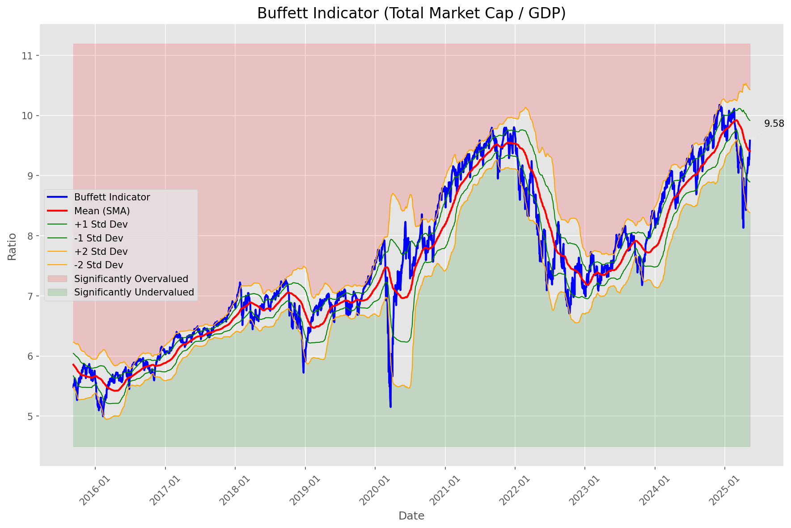
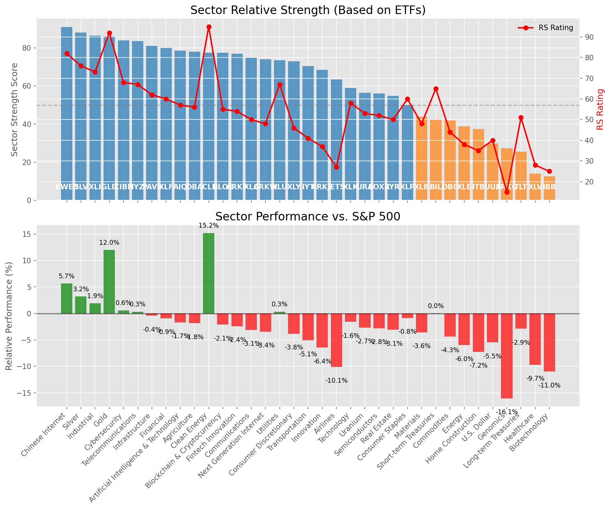

# **Daily Relative Strength Report**

**Date:** 2025-05-14

## **Market Valuation (Buffett Indicator)**

| Metric | Value |
|--------|-------|
| **Market Valuation** | **Fair Valued** |
| **Current Ratio** | 9.65 |
| **Historical Mean** | 9.41 |
| **Standard Deviation** | 0.51 |
| **Z-Score (StdDev from Mean)** | 0.48 |
| **Total Market Cap** | $289.32 trillion |
| **GDP** | $29.98 trillion |

## **Market Insights**

### **Market is Fairly Valued**

The market appears to be trading within a reasonable range of historical valuations. This suggests a balanced approach to equity investing is appropriate. Investors should:

- Focus on individual stock selection based on fundamentals and technicals
- Maintain normal equity allocations aligned with long-term goals
- Pay attention to sector rotation and relative strength
- Watch for changes in market leadership

Fair valuation typically suggests normal market returns can be expected, with stock selection becoming increasingly important.

### **Buffett Indicator Overview**

The Buffett Indicator (Total Market Cap / GDP) is a measure of the stock market's valuation relative to the size of the economy. It is named after Warren Buffett, who described it as "probably the best single measure of where valuations stand at any given moment."

- **Values above +2 standard deviations:** Market significantly overvalued
- **Values above +1 standard deviation:** Market overvalued
- **Values between -1 and +1 standard deviations:** Market fairly valued
- **Values below -1 standard deviation:** Market undervalued
- **Values below -2 standard deviations:** Market significantly undervalued

---

## **Sector Relative Strength**

Based on William O'Neil's Relative Strength Methodology

| ETF | Strength | RS Rating | Performance | Above Key MAs | Trend | Sector |
|-----|----------|-----------|-------------|--------------|-------|--------|
| [KWEB](https://www.tradingview.com/chart/?symbol=KWEB) | 89.5 | 79.0 | 4.28% | 10d ✓, 50d ✓, 200d ✓ | ↗️ | Chinese Internet |
| [XLI](https://www.tradingview.com/chart/?symbol=XLI) | 86.5 | 73.0 | 2.06% | 10d ✓, 50d ✓, 200d ✓ | ↗️ | Industrial |
| [GLD](https://www.tradingview.com/chart/?symbol=GLD) | 84.6 | 89.0 | 9.39% | 10d ✗, 50d ✓, 200d ✓ | ↗️ | Gold |
| [PAVE](https://www.tradingview.com/chart/?symbol=PAVE) | 84.0 | 68.0 | 0.60% | 10d ✓, 50d ✓, 200d ✓ | ↗️ | Infrastructure |
| [IYZ](https://www.tradingview.com/chart/?symbol=IYZ) | 83.0 | 66.0 | 0.14% | 10d ✓, 50d ✓, 200d ✓ | ↗️ | Telecommunications |
| [CIBR](https://www.tradingview.com/chart/?symbol=CIBR) | 82.0 | 64.0 | -0.23% | 10d ✓, 50d ✓, 200d ✓ | ↗️ | Cybersecurity |
| [ARKW](https://www.tradingview.com/chart/?symbol=ARKW) | 81.0 | 62.0 | -0.45% | 10d ✓, 50d ✓, 200d ✓ | ↗️ | Next Generation Internet |
| [XLF](https://www.tradingview.com/chart/?symbol=XLF) | 80.0 | 60.0 | -0.84% | 10d ✓, 50d ✓, 200d ✓ | ↗️ | Financial |
| [BLOK](https://www.tradingview.com/chart/?symbol=BLOK) | 78.5 | 57.0 | -1.58% | 10d ✓, 50d ✓, 200d ✓ | ↗️ | Blockchain & Cryptocurrency |
| [AIQ](https://www.tradingview.com/chart/?symbol=AIQ) | 78.5 | 57.0 | -1.59% | 10d ✓, 50d ✓, 200d ✓ | ↗️ | Artificial Intelligence & Technology |
| [ICLN](https://www.tradingview.com/chart/?symbol=ICLN) | 77.5 | 95.0 | 16.17% | 10d ✓, 50d ✓, 200d ✓ | ↘️ | Clean Energy |
| [DBA](https://www.tradingview.com/chart/?symbol=DBA) | 76.5 | 53.0 | -2.42% | 10d ✓, 50d ✓, 200d ✓ | ↗️ | Agriculture |
| [ARKF](https://www.tradingview.com/chart/?symbol=ARKF) | 75.0 | 50.0 | -2.93% | 10d ✓, 50d ✓, 200d ✓ | ↗️ | Fintech Innovation |
| [XLC](https://www.tradingview.com/chart/?symbol=XLC) | 75.0 | 50.0 | -2.87% | 10d ✓, 50d ✓, 200d ✓ | ↗️ | Communications |
| [XLY](https://www.tradingview.com/chart/?symbol=XLY) | 74.5 | 49.0 | -3.21% | 10d ✓, 50d ✓, 200d ✓ | ↗️ | Consumer Discretionary |
| [XLU](https://www.tradingview.com/chart/?symbol=XLU) | 72.1 | 64.0 | -0.18% | 10d ✗, 50d ✓, 200d ✓ | ↗️ | Utilities |
| [ARKK](https://www.tradingview.com/chart/?symbol=ARKK) | 65.5 | 31.0 | -8.56% | 10d ✓, 50d ✓, 200d ✓ | ↗️ | Innovation |
| [SLV](https://www.tradingview.com/chart/?symbol=SLV) | 61.7 | 63.0 | -0.32% | 10d ✗, 50d ✗, 200d ✓ | ↗️ | Silver |
| [JETS](https://www.tradingview.com/chart/?symbol=JETS) | 60.5 | 21.0 | -12.24% | 10d ✓, 50d ✓, 200d ✓ | ↗️ | Airlines |
| [XLK](https://www.tradingview.com/chart/?symbol=XLK) | 60.0 | 60.0 | -0.90% | 10d ✓, 50d ✓, 200d ✓ | ↘️ | Technology |
| [IYT](https://www.tradingview.com/chart/?symbol=IYT) | 58.8 | 38.0 | -6.18% | 10d ✓, 50d ✓, 200d ✗ | ↗️ | Transportation |
| [URA](https://www.tradingview.com/chart/?symbol=URA) | 55.5 | 51.0 | -2.78% | 10d ✓, 50d ✓, 200d ✓ | ↘️ | Uranium |
| [SOXX](https://www.tradingview.com/chart/?symbol=SOXX) | 55.5 | 51.0 | -2.73% | 10d ✓, 50d ✓, 200d ✓ | ↘️ | Semiconductors |
| [XLP](https://www.tradingview.com/chart/?symbol=XLP) | 49.5 | 59.0 | -1.02% | 10d ✗, 50d ✗, 200d ✗ | ↗️ | Consumer Staples |
| [IYR](https://www.tradingview.com/chart/?symbol=IYR) | 45.0 | 50.0 | -2.91% | 10d ✗, 50d ✗, 200d ✗ | ↗️ | Real Estate |
| [DBC](https://www.tradingview.com/chart/?symbol=DBC) | 43.3 | 47.0 | -3.54% | 10d ✓, 50d ✓, 200d ✗ | ↘️ | Commodities |
| [XLB](https://www.tradingview.com/chart/?symbol=XLB) | 42.8 | 46.0 | -3.81% | 10d ✓, 50d ✓, 200d ✗ | ↘️ | Materials |
| [BIL](https://www.tradingview.com/chart/?symbol=BIL) | 42.4 | 65.0 | 0.03% | 10d ✓, 50d ✗, 200d ✗ | ↘️ | Short-term Treasuries |
| [ITB](https://www.tradingview.com/chart/?symbol=ITB) | 36.8 | 34.0 | -7.63% | 10d ✓, 50d ✓, 200d ✗ | ↘️ | Home Construction |
| [XLE](https://www.tradingview.com/chart/?symbol=XLE) | 31.9 | 44.0 | -4.39% | 10d ✓, 50d ✗, 200d ✗ | ↘️ | Energy |
| [UUP](https://www.tradingview.com/chart/?symbol=UUP) | 29.9 | 40.0 | -5.40% | 10d ✓, 50d ✗, 200d ✗ | ↘️ | U.S. Dollar |
| [TLT](https://www.tradingview.com/chart/?symbol=TLT) | 27.0 | 54.0 | -2.11% | 10d ✗, 50d ✗, 200d ✗ | ↘️ | Long-term Treasuries |
| [XLV](https://www.tradingview.com/chart/?symbol=XLV) | 12.0 | 24.0 | -11.37% | 10d ✗, 50d ✗, 200d ✗ | ↘️ | Healthcare |
| [IBB](https://www.tradingview.com/chart/?symbol=IBB) | 9.5 | 19.0 | -13.56% | 10d ✗, 50d ✗, 200d ✗ | ↘️ | Biotechnology |
| [ARKG](https://www.tradingview.com/chart/?symbol=ARKG) | 5.0 | 10.0 | -20.95% | 10d ✗, 50d ✗, 200d ✗ | ↘️ | Genomics |

### **Sector ETF Performance Interpretation**

This table shows the relative strength metrics for different market sectors based on their representative ETFs:

- **ETF**: The ETF used to measure sector performance (click for chart)
- **Strength**: Overall sector strength score (0-100) combining multiple factors
- **RS Rating**: O'Neil RS rating of the sector ETF
- **Performance**: Performance of the sector ETF relative to SPY
- **Above Key MAs**: Whether the ETF is trading above its 10, 50, and 200-day moving averages
- **Trend**: Whether the sector is in an uptrend (↗️) or downtrend (↘️)

### **Current Sector Leadership**

The current market leadership is coming from the following sectors: **Chinese Internet, Industrial, Gold**.

The **Chinese Internet** sector (represented by **KWEB**) is showing particularly strong relative strength with an RS rating of 79.0 and performance of 4.28% vs. the S&P 500. This sector is trading above its 10-day, 50-day, 200-day moving average(s). Investors should consider focusing on high RS stocks within these leading sectors for potential outperformance.

---

## **Buy Recommendations**

The following 72 stocks show exceptional relative strength:

| RS Rating | Buy Score | Current Price | Chart | Name | Ticker |
|-----------|-----------|---------------|-------|------|--------|
| 100 | 100 | $27.74 | [Chart](https://www.tradingview.com/chart/?symbol=DB) | Deutsche Bank Aktiengesellschaft | DB |
| 100 | 100 | $44.33 | [Chart](https://www.tradingview.com/chart/?symbol=EXEL) | Exelixis Inc | EXEL |
| 100 | 100 | $89.52 | [Chart](https://www.tradingview.com/chart/?symbol=SEZL) | Sezzle Inc. Common Stock | SEZL |
| 100 | 100 | $186.70 | [Chart](https://www.tradingview.com/chart/?symbol=DAVE) | Dave Inc. Class A Common Stock | DAVE |
| 100 | 100 | $153.41 | [Chart](https://www.tradingview.com/chart/?symbol=NRG) | NRG Energy, Inc. | NRG |
| 100 | 100 | $22.98 | [Chart](https://www.tradingview.com/chart/?symbol=PRA) | ProAssurance Corporation | PRA |
| 100 | 100 | $48.60 | [Chart](https://www.tradingview.com/chart/?symbol=MRX) | Marex Group plc Ordinary Shares | MRX |
| 99 | 100 | $131.93 | [Chart](https://www.tradingview.com/chart/?symbol=VSEC) | VSE Corp | VSEC |
| 99 | 100 | $414.00 | [Chart](https://www.tradingview.com/chart/?symbol=MSTR) | MicroStrategy Inc | MSTR |
| 99 | 100 | $23.59 | [Chart](https://www.tradingview.com/chart/?symbol=CRK) | Comstock Resources, Inc. | CRK |
| 99 | 100 | $38.23 | [Chart](https://www.tradingview.com/chart/?symbol=PAY) | Paymentus Holdings, Inc. | PAY |
| 99 | 100 | $24.04 | [Chart](https://www.tradingview.com/chart/?symbol=GRND) | Grindr Inc. | GRND |
| 98 | 100 | $129.97 | [Chart](https://www.tradingview.com/chart/?symbol=COOP) | Mr. Cooper Group Inc. Common Stock | COOP |
| 98 | 100 | $144.62 | [Chart](https://www.tradingview.com/chart/?symbol=ROOT) | Root, Inc. Class A Common Stock | ROOT |
| 98 | 100 | $159.57 | [Chart](https://www.tradingview.com/chart/?symbol=HWM) | Howmet Aerospace Inc. | HWM |
| 98 | 100 | $227.84 | [Chart](https://www.tradingview.com/chart/?symbol=CRS) | Carpenter Technology Corp | CRS |
| 98 | 100 | $79.33 | [Chart](https://www.tradingview.com/chart/?symbol=RBLX) | Roblox Corporation | RBLX |
| 98 | 100 | $129.15 | [Chart](https://www.tradingview.com/chart/?symbol=ATGE) | Adtalem Global Education Inc. Common Shares | ATGE |
| 98 | 100 | $162.24 | [Chart](https://www.tradingview.com/chart/?symbol=SE) | Sea Limited American Depositary Shares, each representing one Class A Ordinary Share | SE |
| 98 | 100 | $69.82 | [Chart](https://www.tradingview.com/chart/?symbol=ULS) | UL Solutions Inc. | ULS |
| 98 | 100 | $34.14 | [Chart](https://www.tradingview.com/chart/?symbol=AHR) | American Healthcare REIT, Inc. | AHR |
| 97 | 100 | $32.85 | [Chart](https://www.tradingview.com/chart/?symbol=UTI) | Universal Technical Institute, Inc. | UTI |
| 97 | 100 | $41.46 | [Chart](https://www.tradingview.com/chart/?symbol=EWP) | iShares MSCI Spain ETF | EWP |
| 96 | 100 | $31.01 | [Chart](https://www.tradingview.com/chart/?symbol=EUFN) | iShares MSCI Europe Financials ETF | EUFN |
| 95 | 100 | $308.94 | [Chart](https://www.tradingview.com/chart/?symbol=CVNA) | Carvana Co. | CVNA |
| 94 | 100 | $33.55 | [Chart](https://www.tradingview.com/chart/?symbol=SLM) | SLM Corporation | SLM |
| 94 | 100 | $27.80 | [Chart](https://www.tradingview.com/chart/?symbol=FMS) | Fresenius Medical Care AG | FMS |
| 94 | 100 | $319.44 | [Chart](https://www.tradingview.com/chart/?symbol=PODD) | Insulet Corporation | PODD |
| 94 | 100 | $84.58 | [Chart](https://www.tradingview.com/chart/?symbol=TGLS) | Tecnoglass Inc. | TGLS |
| 94 | 100 | $79.15 | [Chart](https://www.tradingview.com/chart/?symbol=LB) | LandBridge Company LLC | LB |
| 93 | 100 | $44.88 | [Chart](https://www.tradingview.com/chart/?symbol=TOST) | Toast, Inc. | TOST |
| 93 | 100 | $29.86 | [Chart](https://www.tradingview.com/chart/?symbol=TGS) | Transportadora de Gas del Sur S.A. ADS | TGS |
| 93 | 100 | $25.02 | [Chart](https://www.tradingview.com/chart/?symbol=BSAC) | Banco Santander-Chile | BSAC |
| 93 | 100 | $105.37 | [Chart](https://www.tradingview.com/chart/?symbol=RBA) | RB Global, Inc. | RBA |
| 92 | 100 | $298.55 | [Chart](https://www.tradingview.com/chart/?symbol=PEN) | Penumbra, Inc. | PEN |
| 92 | 100 | $1148.26 | [Chart](https://www.tradingview.com/chart/?symbol=NFLX) | NetFlix Inc | NFLX |
| 92 | 100 | $17.21 | [Chart](https://www.tradingview.com/chart/?symbol=BCS) | Barclays PLC | BCS |
| 91 | 100 | $31.21 | [Chart](https://www.tradingview.com/chart/?symbol=PRDO) | Perdoceo Education Corporation | PRDO |
| 91 | 100 | $130.18 | [Chart](https://www.tradingview.com/chart/?symbol=PLTR) | Palantir Technologies Inc. Class A Common Stock | PLTR |
| 91 | 100 | $71.39 | [Chart](https://www.tradingview.com/chart/?symbol=BROS) | Dutch Bros Inc. | BROS |
| 90 | 100 | $61.22 | [Chart](https://www.tradingview.com/chart/?symbol=HOOD) | Robinhood Markets, Inc. Class A Common Stock | HOOD |
| 90 | 100 | $229.50 | [Chart](https://www.tradingview.com/chart/?symbol=TTWO) | Take-Two Interactive Software Inc | TTWO |
| 90 | 100 | $728.93 | [Chart](https://www.tradingview.com/chart/?symbol=AXON) | Axon Enterprise, Inc. Common Stock | AXON |
| 90 | 100 | $206.92 | [Chart](https://www.tradingview.com/chart/?symbol=BAP) | Credicorp LTD | BAP |
| 90 | 100 | $52.02 | [Chart](https://www.tradingview.com/chart/?symbol=EPR) | EPR Properties | EPR |
| 89 | 100 | $23.57 | [Chart](https://www.tradingview.com/chart/?symbol=SRAD) | Sportradar Group AG Class A Ordinary Shares | SRAD |
| 89 | 100 | $23.60 | [Chart](https://www.tradingview.com/chart/?symbol=BTSG) | BrightSpring Health Services, Inc. Common Stock | BTSG |
| 88 | 100 | $25.20 | [Chart](https://www.tradingview.com/chart/?symbol=EWS) | iShares MSCI Singapore ETF | EWS |
| 89 | 99 | $84.15 | [Chart](https://www.tradingview.com/chart/?symbol=PAM) | PAMPA ENERGIA S.A. | PAM |
| 88 | 99 | $95.05 | [Chart](https://www.tradingview.com/chart/?symbol=HEES) | H&E Equipment Services, Inc. | HEES |
| 88 | 99 | $67.47 | [Chart](https://www.tradingview.com/chart/?symbol=CTVA) | Corteva, Inc. Common Stock | CTVA |
| 87 | 99 | $83.92 | [Chart](https://www.tradingview.com/chart/?symbol=RBRK) | Rubrik, Inc. | RBRK |
| 89 | 98 | $22.34 | [Chart](https://www.tradingview.com/chart/?symbol=KAR) | OPENLANE, Inc | KAR |
| 87 | 98 | $62.67 | [Chart](https://www.tradingview.com/chart/?symbol=GGAL) | Grupo Financiero Galicia SA | GGAL |
| 86 | 98 | $195.09 | [Chart](https://www.tradingview.com/chart/?symbol=LOPE) | Grand Canyon Education, Inc | LOPE |
| 86 | 97 | $56.11 | [Chart](https://www.tradingview.com/chart/?symbol=EQT) | EQT CORP | EQT |
| 85 | 97 | $207.57 | [Chart](https://www.tradingview.com/chart/?symbol=DRI) | Darden Restaurants, Inc. | DRI |
| 84 | 97 | $45.71 | [Chart](https://www.tradingview.com/chart/?symbol=QFIN) | Qifu Technology, Inc. American Depositary Shares | QFIN |
| 85 | 96 | $74.58 | [Chart](https://www.tradingview.com/chart/?symbol=USFD) | US Foods Holding Corp. | USFD |
| 85 | 95 | $58.88 | [Chart](https://www.tradingview.com/chart/?symbol=BAM) | Brookfield Asset Management Ltd. | BAM |
| 85 | 95 | $167.08 | [Chart](https://www.tradingview.com/chart/?symbol=ITA) | iShares U.S. Aerospace & Defense ETF | ITA |
| 85 | 95 | $17.48 | [Chart](https://www.tradingview.com/chart/?symbol=MIR) | Mirion Technologies, Inc. | MIR |
| 85 | 95 | $13.19 | [Chart](https://www.tradingview.com/chart/?symbol=MUFG) | Mitsubishi UFJ Financial Group, Inc. | MUFG |
| 84 | 95 | $200.53 | [Chart](https://www.tradingview.com/chart/?symbol=DFS) | Discover Financial Services | DFS |
| 83 | 95 | $63.28 | [Chart](https://www.tradingview.com/chart/?symbol=CHEF) | The Chef's Warehouse Inc | CHEF |
| 82 | 95 | $87.76 | [Chart](https://www.tradingview.com/chart/?symbol=L) | Loews Corporation | L |
| 84 | 94 | $13.34 | [Chart](https://www.tradingview.com/chart/?symbol=CNH) | CNH INDUSTRIAL N.V. | CNH |
| 82 | 94 | $58.20 | [Chart](https://www.tradingview.com/chart/?symbol=HSBC) | HSBC Holdings PLC | HSBC |
| 84 | 93 | $58.63 | [Chart](https://www.tradingview.com/chart/?symbol=IBIT) | iShares Bitcoin Trust ETF | IBIT |
| 83 | 93 | $36.24 | [Chart](https://www.tradingview.com/chart/?symbol=FXI) | iShares China Large-Cap ETF | FXI |
| 80 | 92 | $53.94 | [Chart](https://www.tradingview.com/chart/?symbol=CAKE) | Cheesecake Factory (The) | CAKE |
| 80 | 90 | $384.91 | [Chart](https://www.tradingview.com/chart/?symbol=LPLA) | LPL Financial Holdings Inc. | LPLA |

---

## **Sell Recommendations**

The following 92 stocks show deteriorating relative strength:

| RS Rating | Sell Score | Current Price | Chart | Name | Ticker |
|-----------|------------|---------------|-------|------|--------|
| 1 | 100 | $10.18 | [Chart](https://www.tradingview.com/chart/?symbol=NRIX) | Nurix Therapeutics, Inc. Common stock | NRIX |
| 1 | 100 | $19.14 | [Chart](https://www.tradingview.com/chart/?symbol=BHVN) | Biohaven Ltd. | BHVN |
| 2 | 100 | $10.83 | [Chart](https://www.tradingview.com/chart/?symbol=ARCT) | Arcturus Therapeutics Holdings Inc. Common Stock | ARCT |
| 2 | 100 | $23.15 | [Chart](https://www.tradingview.com/chart/?symbol=JANX) | Janux Therapeutics, Inc. Common Stock | JANX |
| 3 | 100 | $29.75 | [Chart](https://www.tradingview.com/chart/?symbol=TWST) | Twist Bioscience Corporation Common Stock | TWST |
| 3 | 100 | $207.67 | [Chart](https://www.tradingview.com/chart/?symbol=WST) | West Pharmaceutical Services, Inc. | WST |
| 3 | 100 | $13.01 | [Chart](https://www.tradingview.com/chart/?symbol=FL) | Foot Locker, Inc. | FL |
| 4 | 100 | $10.29 | [Chart](https://www.tradingview.com/chart/?symbol=HPK) | HighPeak Energy, Inc. Common Stock | HPK |
| 4 | 100 | $32.69 | [Chart](https://www.tradingview.com/chart/?symbol=AAP) | ADVANCE AUTO PARTS INC | AAP |
| 4 | 100 | $27.82 | [Chart](https://www.tradingview.com/chart/?symbol=SRDX) | Surmodics, Inc. Common Stock | SRDX |
| 4 | 100 | $10.31 | [Chart](https://www.tradingview.com/chart/?symbol=VREX) | Varex Imaging Corporation Common Stock | VREX |
| 4 | 100 | $29.92 | [Chart](https://www.tradingview.com/chart/?symbol=CRTO) | Criteo S.A. | CRTO |
| 4 | 100 | $10.66 | [Chart](https://www.tradingview.com/chart/?symbol=LSPD) | Lightspeed Commerce Inc. | LSPD |
| 4 | 100 | $13.00 | [Chart](https://www.tradingview.com/chart/?symbol=MNRO) | Monro, Inc. Common Stock | MNRO |
| 5 | 100 | $18.54 | [Chart](https://www.tradingview.com/chart/?symbol=VRNT) | Verint Systems Inc | VRNT |
| 5 | 100 | $13.57 | [Chart](https://www.tradingview.com/chart/?symbol=IMVT) | Immunovant, Inc. Common Stock | IMVT |
| 5 | 100 | $30.12 | [Chart](https://www.tradingview.com/chart/?symbol=CYTK) | Cytokinetics Inc. | CYTK |
| 6 | 100 | $12.49 | [Chart](https://www.tradingview.com/chart/?symbol=LBRT) | Liberty Energy Inc. | LBRT |
| 7 | 100 | $26.81 | [Chart](https://www.tradingview.com/chart/?symbol=TRN) | Trinity Industries, Inc. | TRN |
| 7 | 100 | $125.84 | [Chart](https://www.tradingview.com/chart/?symbol=TFX) | Teleflex Incorporated | TFX |
| 9 | 100 | $17.18 | [Chart](https://www.tradingview.com/chart/?symbol=IDYA) | IDEAYA Biosciences, Inc. Common Stock | IDYA |
| 9 | 100 | $18.49 | [Chart](https://www.tradingview.com/chart/?symbol=NVDS) | Investment Managers Series Trust II Tradr 1.5X Short NVDA Daily ETF | NVDS |
| 13 | 100 | $47.39 | [Chart](https://www.tradingview.com/chart/?symbol=RHI) | Robert Half Inc. | RHI |
| 14 | 100 | $10.34 | [Chart](https://www.tradingview.com/chart/?symbol=CMRE) | Costamare Inc. | CMRE |
| 17 | 100 | $12.76 | [Chart](https://www.tradingview.com/chart/?symbol=MED) | Medifast, Inc. | MED |
| 18 | 100 | $27.96 | [Chart](https://www.tradingview.com/chart/?symbol=AGIO) | Agios Pharmaceuticals, Inc. | AGIO |
| 23 | 100 | $97.12 | [Chart](https://www.tradingview.com/chart/?symbol=CHRD) | Chord Energy Corporation Common Stock | CHRD |
| 9 | 99 | $17.54 | [Chart](https://www.tradingview.com/chart/?symbol=MLKN) | MillerKnoll, Inc. Common Stock | MLKN |
| 9 | 97 | $32.92 | [Chart](https://www.tradingview.com/chart/?symbol=MBIN) | Merchants Bancorp Common Stock | MBIN |
| 9 | 96 | $15.75 | [Chart](https://www.tradingview.com/chart/?symbol=CHCT) | Community Healthcare Trust Incorporated Common Stock, $0.01 par value per share | CHCT |
| 10 | 96 | $10.06 | [Chart](https://www.tradingview.com/chart/?symbol=MTAL) | MAC Copper Limited | MTAL |
| 12 | 96 | $111.58 | [Chart](https://www.tradingview.com/chart/?symbol=A) | Agilent Technologies Inc. | A |
| 10 | 95 | $28.26 | [Chart](https://www.tradingview.com/chart/?symbol=LEGN) | Legend Biotech Corporation American Depositary Shares | LEGN |
| 20 | 95 | $36.02 | [Chart](https://www.tradingview.com/chart/?symbol=SLB) | Schlumberger Limited | SLB |
| 8 | 94 | $34.26 | [Chart](https://www.tradingview.com/chart/?symbol=TECS) | Direxion Daily Technology Bear 3x Shares | TECS |
| 11 | 94 | $22.09 | [Chart](https://www.tradingview.com/chart/?symbol=UCO) | ProShares Ultra Bloomberg Crude Oil | UCO |
| 15 | 94 | $18.64 | [Chart](https://www.tradingview.com/chart/?symbol=CLDX) | Celldex Therapeutics, Inc | CLDX |
| 10 | 93 | $119.88 | [Chart](https://www.tradingview.com/chart/?symbol=BLDR) | Builders FirstSource, Inc. | BLDR |
| 8 | 92 | $14.55 | [Chart](https://www.tradingview.com/chart/?symbol=INMD) | InMode Ltd. Ordinary Shares | INMD |
| 8 | 92 | $10.15 | [Chart](https://www.tradingview.com/chart/?symbol=HLIT) | Harmonic Inc | HLIT |
| 11 | 92 | $12.19 | [Chart](https://www.tradingview.com/chart/?symbol=APLE) | Apple Hospitality REIT, Inc. | APLE |
| 15 | 91 | $68.45 | [Chart](https://www.tradingview.com/chart/?symbol=DD) | DuPont de Nemours, Inc. Common Stock | DD |
| 26 | 91 | $58.95 | [Chart](https://www.tradingview.com/chart/?symbol=BMRN) | BioMarin Pharmaceuticals Inc | BMRN |
| 27 | 91 | $148.73 | [Chart](https://www.tradingview.com/chart/?symbol=MTN) | Vail Resorts, Inc. | MTN |
| 15 | 90 | $11.84 | [Chart](https://www.tradingview.com/chart/?symbol=WEN) | The Wendy's Company | WEN |
| 32 | 90 | $27.57 | [Chart](https://www.tradingview.com/chart/?symbol=IMCR) | Immunocore Holdings plc American Depositary Shares | IMCR |
| 21 | 89 | $51.92 | [Chart](https://www.tradingview.com/chart/?symbol=ERX) | Direxion Daily Energy Bull 2X Shares | ERX |
| 15 | 88 | $82.51 | [Chart](https://www.tradingview.com/chart/?symbol=WHR) | Whirlpool Corp. | WHR |
| 26 | 88 | $24.82 | [Chart](https://www.tradingview.com/chart/?symbol=RCI) | Rogers Communications, Inc. | RCI |
| 20 | 85 | $79.91 | [Chart](https://www.tradingview.com/chart/?symbol=COO) | The Cooper Companies, Inc. Common Stock | COO |
| 23 | 85 | $13.00 | [Chart](https://www.tradingview.com/chart/?symbol=DBO) | Invesco DB Oil Fund | DBO |
| 20 | 84 | $10.49 | [Chart](https://www.tradingview.com/chart/?symbol=AVO) | Mission Produce, Inc. Common Stock | AVO |
| 23 | 84 | $19.43 | [Chart](https://www.tradingview.com/chart/?symbol=AAT) | AMERICAN ASSETS TRUST, INC. | AAT |
| 23 | 84 | $74.85 | [Chart](https://www.tradingview.com/chart/?symbol=IFF) | International Flavors & Fragrances Inc. | IFF |
| 24 | 84 | $10.49 | [Chart](https://www.tradingview.com/chart/?symbol=SCS) | Steelcase, Inc. | SCS |
| 18 | 83 | $29.94 | [Chart](https://www.tradingview.com/chart/?symbol=KYMR) | Kymera Therapeutics, Inc. Common Stock | KYMR |
| 21 | 83 | $30.82 | [Chart](https://www.tradingview.com/chart/?symbol=CRNX) | Crinetics Pharmaceuticals, Inc. | CRNX |
| 25 | 83 | $20.84 | [Chart](https://www.tradingview.com/chart/?symbol=CSWC) | Capital Southwest Corp | CSWC |
| 25 | 83 | $20.52 | [Chart](https://www.tradingview.com/chart/?symbol=BITI) | ProShares Short Bitcoin ETF | BITI |
| 26 | 83 | $18.75 | [Chart](https://www.tradingview.com/chart/?symbol=SPTN) | SpartanNash Company | SPTN |
| 18 | 82 | $15.43 | [Chart](https://www.tradingview.com/chart/?symbol=BCSF) | Bain Capital Specialty Finance, Inc. | BCSF |
| 22 | 82 | $16.42 | [Chart](https://www.tradingview.com/chart/?symbol=QYLD) | Global X Funds Global X NASDAQ-100 Covered Call ETF | QYLD |
| 23 | 82 | $10.10 | [Chart](https://www.tradingview.com/chart/?symbol=CION) | CION Investment Corporation | CION |
| 24 | 82 | $28.06 | [Chart](https://www.tradingview.com/chart/?symbol=BNO) | United States Brent Oil Fund, LP | BNO |
| 27 | 82 | $50.73 | [Chart](https://www.tradingview.com/chart/?symbol=LW) | Lamb Weston Holdings, Inc. | LW |
| 22 | 81 | $14.64 | [Chart](https://www.tradingview.com/chart/?symbol=RYLD) | Global X Russell 2000 Covered Call ETF | RYLD |
| 27 | 81 | $109.06 | [Chart](https://www.tradingview.com/chart/?symbol=LEN) | Lennar Corporation Class A | LEN |
| 34 | 81 | $10.88 | [Chart](https://www.tradingview.com/chart/?symbol=LBTYA) | Liberty Global Ltd. Class A Common Shares | LBTYA |
| 29 | 80 | $34.49 | [Chart](https://www.tradingview.com/chart/?symbol=CPB) | The Campbell's Company Common Stock | CPB |
| 32 | 80 | $34.56 | [Chart](https://www.tradingview.com/chart/?symbol=NSA) | National Storage Affiliates Trust | NSA |
| 23 | 79 | $60.66 | [Chart](https://www.tradingview.com/chart/?symbol=BOIL) | ProShares Ultra Bloomberg Natural Gas | BOIL |
| 27 | 78 | $14.55 | [Chart](https://www.tradingview.com/chart/?symbol=HR) | Healthcare Realty Trust Incorporated | HR |
| 33 | 78 | $13.80 | [Chart](https://www.tradingview.com/chart/?symbol=BSM) | Black Stone Minerals, L.P. | BSM |
| 34 | 77 | $64.06 | [Chart](https://www.tradingview.com/chart/?symbol=ZROZ) | PIMCO 25+ Year Zero Coupon U.S. Treasury Index Exchange-Traded Fund | ZROZ |
| 27 | 76 | $31.50 | [Chart](https://www.tradingview.com/chart/?symbol=KRC) | Kilroy Realty Corp. | KRC |
| 35 | 76 | $134.34 | [Chart](https://www.tradingview.com/chart/?symbol=HES) | Hess Corporation | HES |
| 26 | 75 | $115.25 | [Chart](https://www.tradingview.com/chart/?symbol=EOG) | EOG Resources, Inc. | EOG |
| 28 | 75 | $10.63 | [Chart](https://www.tradingview.com/chart/?symbol=LADR) | LADDER CAPITAL CORP | LADR |
| 31 | 74 | $53.28 | [Chart](https://www.tradingview.com/chart/?symbol=GIS) | General Mills, Inc. | GIS |
| 28 | 73 | $14.47 | [Chart](https://www.tradingview.com/chart/?symbol=BMEZ) | BlackRock Health Sciences Term Trust | BMEZ |
| 30 | 72 | $140.97 | [Chart](https://www.tradingview.com/chart/?symbol=CVX) | Chevron Corporation | CVX |
| 30 | 72 | $25.25 | [Chart](https://www.tradingview.com/chart/?symbol=IRDM) | Iridium Communications Inc. | IRDM |
| 36 | 71 | $11.21 | [Chart](https://www.tradingview.com/chart/?symbol=MQY) | Blackrock Muni Yield Quality Fund, Inc | MQY |
| 36 | 71 | $10.49 | [Chart](https://www.tradingview.com/chart/?symbol=NMZ) | Nuveen Municipal High Income Opportunity Fund | NMZ |
| 38 | 71 | $25.13 | [Chart](https://www.tradingview.com/chart/?symbol=DBMF) | iMGP DBi Managed Futures Strategy ETF | DBMF |
| 39 | 69 | $92.56 | [Chart](https://www.tradingview.com/chart/?symbol=COP) | ConocoPhillips | COP |
| 34 | 68 | $51.68 | [Chart](https://www.tradingview.com/chart/?symbol=TSCO) | Tractor Supply Co | TSCO |
| 38 | 68 | $28.83 | [Chart](https://www.tradingview.com/chart/?symbol=QID) | ProShares UltraShort QQQ | QID |
| 39 | 68 | $12.85 | [Chart](https://www.tradingview.com/chart/?symbol=PMT) | PennyMac Mortgage Investment Trust | PMT |
| 37 | 63 | $158.49 | [Chart](https://www.tradingview.com/chart/?symbol=PG) | Procter & Gamble Company | PG |
| 38 | 63 | $62.21 | [Chart](https://www.tradingview.com/chart/?symbol=ELS) | Equity Lifestyle Properties, Inc. | ELS |
| 39 | 61 | $168.78 | [Chart](https://www.tradingview.com/chart/?symbol=EGP) | EastGroup Properties Inc. | EGP |

## **Methodology**

This report uses William O'Neil's relative strength methodology from Investors Business Daily:

* **RS Rating**: Percentile rank of stock's performance vs. S&P 500 over the past 63 trading days (1-99 scale)
* **Buy Criteria**: RS Rating >= 80, price above 50-day MA, strong uptrend, increasing volume
* **Sell Criteria**: RS Rating < 40, price below 50-day MA, downtrend, decreasing volume

### **O'Neil's Key Principles**

1. **Focus on relative performance** - stocks outperforming the market
2. **Price trend confirmation** - stock must be in an uptrend
3. **Volume confirmation** - strong volume supports price moves
4. **Moving average validation** - price above key moving averages
5. **Market leaders only** - concentrate on top-performing stocks

*Report generated automatically after market close*