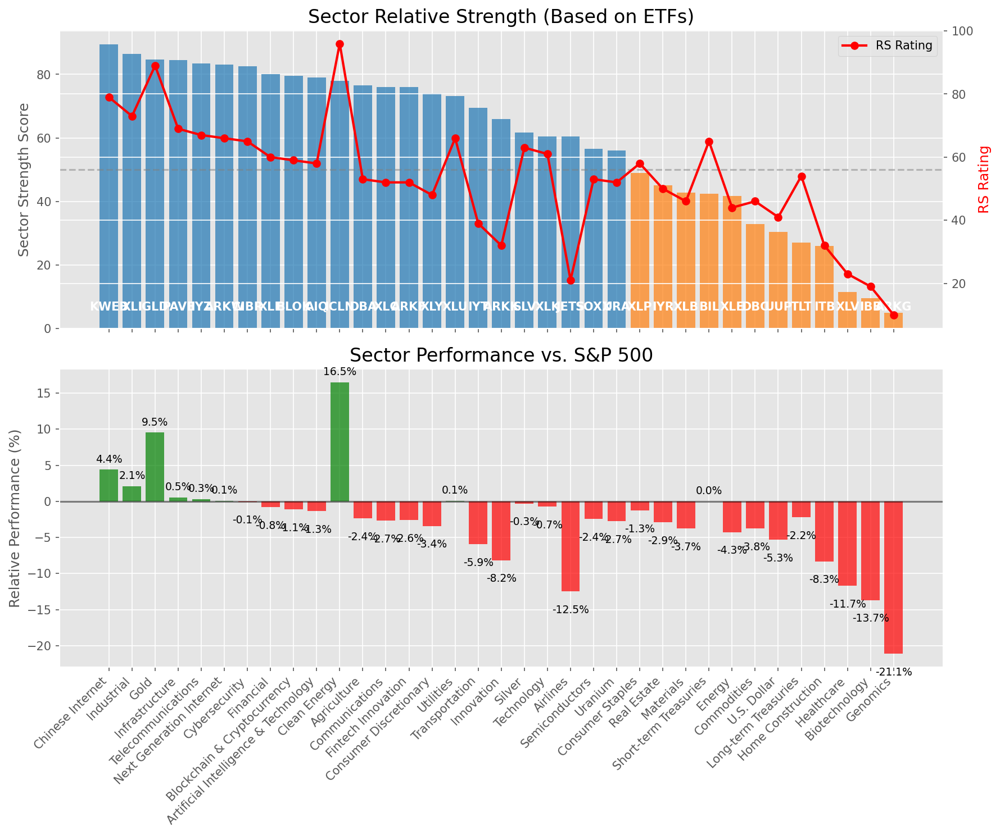

# **Daily Relative Strength Report**

**Date:** 2025-05-14

## **Market Valuation (Buffett Indicator)**

| Metric | Value |
|--------|-------|
| **Market Valuation** | **Fair Valued** |
| **Current Ratio** | 9.65 |
| **Historical Mean** | 9.41 |
| **Standard Deviation** | 0.51 |
| **Z-Score (StdDev from Mean)** | 0.48 |
| **Total Market Cap** | $289.41 trillion |
| **GDP** | $29.98 trillion |

## **Market Insights**

### **Market is Fairly Valued**

The market appears to be trading within a reasonable range of historical valuations. This suggests a balanced approach to equity investing is appropriate. Investors should:

- Focus on individual stock selection based on fundamentals and technicals
- Maintain normal equity allocations aligned with long-term goals
- Pay attention to sector rotation and relative strength
- Watch for changes in market leadership

Fair valuation typically suggests normal market returns can be expected, with stock selection becoming increasingly important.

### **Buffett Indicator Overview**

The Buffett Indicator (Total Market Cap / GDP) is a measure of the stock market's valuation relative to the size of the economy. It is named after Warren Buffett, who described it as "probably the best single measure of where valuations stand at any given moment."

- **Values above +2 standard deviations:** Market significantly overvalued
- **Values above +1 standard deviation:** Market overvalued
- **Values between -1 and +1 standard deviations:** Market fairly valued
- **Values below -1 standard deviation:** Market undervalued
- **Values below -2 standard deviations:** Market significantly undervalued

---

## **Sector Relative Strength**

Based on William O'Neil's Relative Strength Methodology

| ETF | Strength | RS Rating | Performance | Above Key MAs | Trend | Sector |
|-----|----------|-----------|-------------|--------------|-------|--------|
| [KWEB](https://www.tradingview.com/chart/?symbol=KWEB) | 89.5 | 79.0 | 4.39% | 10d ✓, 50d ✓, 200d ✓ | ↗️ | Chinese Internet |
| [XLI](https://www.tradingview.com/chart/?symbol=XLI) | 86.5 | 73.0 | 2.07% | 10d ✓, 50d ✓, 200d ✓ | ↗️ | Industrial |
| [GLD](https://www.tradingview.com/chart/?symbol=GLD) | 84.6 | 89.0 | 9.52% | 10d ✗, 50d ✓, 200d ✓ | ↗️ | Gold |
| [PAVE](https://www.tradingview.com/chart/?symbol=PAVE) | 84.5 | 69.0 | 0.53% | 10d ✓, 50d ✓, 200d ✓ | ↗️ | Infrastructure |
| [IYZ](https://www.tradingview.com/chart/?symbol=IYZ) | 83.5 | 67.0 | 0.32% | 10d ✓, 50d ✓, 200d ✓ | ↗️ | Telecommunications |
| [ARKW](https://www.tradingview.com/chart/?symbol=ARKW) | 83.0 | 66.0 | 0.05% | 10d ✓, 50d ✓, 200d ✓ | ↗️ | Next Generation Internet |
| [CIBR](https://www.tradingview.com/chart/?symbol=CIBR) | 82.5 | 65.0 | -0.07% | 10d ✓, 50d ✓, 200d ✓ | ↗️ | Cybersecurity |
| [XLF](https://www.tradingview.com/chart/?symbol=XLF) | 80.0 | 60.0 | -0.82% | 10d ✓, 50d ✓, 200d ✓ | ↗️ | Financial |
| [BLOK](https://www.tradingview.com/chart/?symbol=BLOK) | 79.5 | 59.0 | -1.10% | 10d ✓, 50d ✓, 200d ✓ | ↗️ | Blockchain & Cryptocurrency |
| [AIQ](https://www.tradingview.com/chart/?symbol=AIQ) | 79.0 | 58.0 | -1.35% | 10d ✓, 50d ✓, 200d ✓ | ↗️ | Artificial Intelligence & Technology |
| [ICLN](https://www.tradingview.com/chart/?symbol=ICLN) | 78.0 | 96.0 | 16.49% | 10d ✓, 50d ✓, 200d ✓ | ↘️ | Clean Energy |
| [DBA](https://www.tradingview.com/chart/?symbol=DBA) | 76.5 | 53.0 | -2.37% | 10d ✓, 50d ✓, 200d ✓ | ↗️ | Agriculture |
| [XLC](https://www.tradingview.com/chart/?symbol=XLC) | 76.0 | 52.0 | -2.70% | 10d ✓, 50d ✓, 200d ✓ | ↗️ | Communications |
| [ARKF](https://www.tradingview.com/chart/?symbol=ARKF) | 76.0 | 52.0 | -2.57% | 10d ✓, 50d ✓, 200d ✓ | ↗️ | Fintech Innovation |
| [XLY](https://www.tradingview.com/chart/?symbol=XLY) | 74.0 | 48.0 | -3.41% | 10d ✓, 50d ✓, 200d ✓ | ↗️ | Consumer Discretionary |
| [XLU](https://www.tradingview.com/chart/?symbol=XLU) | 73.1 | 66.0 | 0.06% | 10d ✗, 50d ✓, 200d ✓ | ↗️ | Utilities |
| [IYT](https://www.tradingview.com/chart/?symbol=IYT) | 69.5 | 39.0 | -5.92% | 10d ✓, 50d ✓, 200d ✓ | ↗️ | Transportation |
| [ARKK](https://www.tradingview.com/chart/?symbol=ARKK) | 66.0 | 32.0 | -8.17% | 10d ✓, 50d ✓, 200d ✓ | ↗️ | Innovation |
| [SLV](https://www.tradingview.com/chart/?symbol=SLV) | 61.7 | 63.0 | -0.31% | 10d ✗, 50d ✗, 200d ✓ | ↗️ | Silver |
| [JETS](https://www.tradingview.com/chart/?symbol=JETS) | 60.5 | 21.0 | -12.50% | 10d ✓, 50d ✓, 200d ✓ | ↗️ | Airlines |
| [XLK](https://www.tradingview.com/chart/?symbol=XLK) | 60.5 | 61.0 | -0.72% | 10d ✓, 50d ✓, 200d ✓ | ↘️ | Technology |
| [SOXX](https://www.tradingview.com/chart/?symbol=SOXX) | 56.5 | 53.0 | -2.43% | 10d ✓, 50d ✓, 200d ✓ | ↘️ | Semiconductors |
| [URA](https://www.tradingview.com/chart/?symbol=URA) | 56.0 | 52.0 | -2.73% | 10d ✓, 50d ✓, 200d ✓ | ↘️ | Uranium |
| [XLP](https://www.tradingview.com/chart/?symbol=XLP) | 49.0 | 58.0 | -1.29% | 10d ✗, 50d ✗, 200d ✗ | ↗️ | Consumer Staples |
| [IYR](https://www.tradingview.com/chart/?symbol=IYR) | 45.0 | 50.0 | -2.93% | 10d ✗, 50d ✗, 200d ✗ | ↗️ | Real Estate |
| [XLB](https://www.tradingview.com/chart/?symbol=XLB) | 42.8 | 46.0 | -3.75% | 10d ✓, 50d ✓, 200d ✗ | ↘️ | Materials |
| [BIL](https://www.tradingview.com/chart/?symbol=BIL) | 42.4 | 65.0 | 0.02% | 10d ✓, 50d ✗, 200d ✗ | ↘️ | Short-term Treasuries |
| [XLE](https://www.tradingview.com/chart/?symbol=XLE) | 41.8 | 44.0 | -4.26% | 10d ✓, 50d ✓, 200d ✗ | ↘️ | Energy |
| [DBC](https://www.tradingview.com/chart/?symbol=DBC) | 32.9 | 46.0 | -3.76% | 10d ✓, 50d ✗, 200d ✗ | ↘️ | Commodities |
| [UUP](https://www.tradingview.com/chart/?symbol=UUP) | 30.4 | 41.0 | -5.33% | 10d ✓, 50d ✗, 200d ✗ | ↘️ | U.S. Dollar |
| [TLT](https://www.tradingview.com/chart/?symbol=TLT) | 27.0 | 54.0 | -2.19% | 10d ✗, 50d ✗, 200d ✗ | ↘️ | Long-term Treasuries |
| [ITB](https://www.tradingview.com/chart/?symbol=ITB) | 25.9 | 32.0 | -8.31% | 10d ✓, 50d ✗, 200d ✗ | ↘️ | Home Construction |
| [XLV](https://www.tradingview.com/chart/?symbol=XLV) | 11.5 | 23.0 | -11.69% | 10d ✗, 50d ✗, 200d ✗ | ↘️ | Healthcare |
| [IBB](https://www.tradingview.com/chart/?symbol=IBB) | 9.5 | 19.0 | -13.69% | 10d ✗, 50d ✗, 200d ✗ | ↘️ | Biotechnology |
| [ARKG](https://www.tradingview.com/chart/?symbol=ARKG) | 5.0 | 10.0 | -21.10% | 10d ✗, 50d ✗, 200d ✗ | ↘️ | Genomics |

### **Sector ETF Performance Interpretation**

This table shows the relative strength metrics for different market sectors based on their representative ETFs:

- **ETF**: The ETF used to measure sector performance (click for chart)
- **Strength**: Overall sector strength score (0-100) combining multiple factors
- **RS Rating**: O'Neil RS rating of the sector ETF
- **Performance**: Performance of the sector ETF relative to SPY
- **Above Key MAs**: Whether the ETF is trading above its 10, 50, and 200-day moving averages
- **Trend**: Whether the sector is in an uptrend (↗️) or downtrend (↘️)

### **Current Sector Leadership**

The current market leadership is coming from the following sectors: **Chinese Internet, Industrial, Gold**.

The **Chinese Internet** sector (represented by **KWEB**) is showing particularly strong relative strength with an RS rating of 79.0 and performance of 4.39% vs. the S&P 500. This sector is trading above its 10-day, 50-day, 200-day moving average(s). Investors should consider focusing on high RS stocks within these leading sectors for potential outperformance.

---

## **Buy Recommendations**

The following 78 stocks show exceptional relative strength:

| RS Rating | Buy Score | Current Price | Chart | Name | Ticker |
|-----------|-----------|---------------|-------|------|--------|
| 100 | 100 | $44.65 | [Chart](https://www.tradingview.com/chart/?symbol=EXEL) | Exelixis Inc | EXEL |
| 100 | 100 | $27.78 | [Chart](https://www.tradingview.com/chart/?symbol=DB) | Deutsche Bank Aktiengesellschaft | DB |
| 100 | 100 | $156.12 | [Chart](https://www.tradingview.com/chart/?symbol=PLMR) | Palomar Holdings, Inc. Common stock | PLMR |
| 100 | 100 | $91.01 | [Chart](https://www.tradingview.com/chart/?symbol=SEZL) | Sezzle Inc. Common Stock | SEZL |
| 100 | 100 | $48.10 | [Chart](https://www.tradingview.com/chart/?symbol=MRX) | Marex Group plc Ordinary Shares | MRX |
| 100 | 100 | $22.99 | [Chart](https://www.tradingview.com/chart/?symbol=PRA) | ProAssurance Corporation | PRA |
| 100 | 100 | $153.81 | [Chart](https://www.tradingview.com/chart/?symbol=NRG) | NRG Energy, Inc. | NRG |
| 100 | 100 | $183.32 | [Chart](https://www.tradingview.com/chart/?symbol=DAVE) | Dave Inc. Class A Common Stock | DAVE |
| 100 | 100 | $42.27 | [Chart](https://www.tradingview.com/chart/?symbol=FARO) | Faro Technologies Inc | FARO |
| 99 | 100 | $130.70 | [Chart](https://www.tradingview.com/chart/?symbol=VSEC) | VSE Corp | VSEC |
| 99 | 100 | $23.82 | [Chart](https://www.tradingview.com/chart/?symbol=CRK) | Comstock Resources, Inc. | CRK |
| 99 | 100 | $416.75 | [Chart](https://www.tradingview.com/chart/?symbol=MSTR) | MicroStrategy Inc | MSTR |
| 99 | 100 | $38.29 | [Chart](https://www.tradingview.com/chart/?symbol=PAY) | Paymentus Holdings, Inc. | PAY |
| 99 | 100 | $24.10 | [Chart](https://www.tradingview.com/chart/?symbol=GRND) | Grindr Inc. | GRND |
| 98 | 100 | $230.00 | [Chart](https://www.tradingview.com/chart/?symbol=CRS) | Carpenter Technology Corp | CRS |
| 98 | 100 | $163.18 | [Chart](https://www.tradingview.com/chart/?symbol=SE) | Sea Limited American Depositary Shares, each representing one Class A Ordinary Share | SE |
| 98 | 100 | $119.27 | [Chart](https://www.tradingview.com/chart/?symbol=EHC) | Encompass Health Corporation Common Stock | EHC |
| 98 | 100 | $129.72 | [Chart](https://www.tradingview.com/chart/?symbol=ATGE) | Adtalem Global Education Inc. Common Shares | ATGE |
| 98 | 100 | $159.46 | [Chart](https://www.tradingview.com/chart/?symbol=HWM) | Howmet Aerospace Inc. | HWM |
| 98 | 100 | $79.45 | [Chart](https://www.tradingview.com/chart/?symbol=RBLX) | Roblox Corporation | RBLX |
| 98 | 100 | $69.86 | [Chart](https://www.tradingview.com/chart/?symbol=ULS) | UL Solutions Inc. | ULS |
| 98 | 100 | $34.19 | [Chart](https://www.tradingview.com/chart/?symbol=AHR) | American Healthcare REIT, Inc. | AHR |
| 98 | 100 | $41.54 | [Chart](https://www.tradingview.com/chart/?symbol=EWP) | iShares MSCI Spain ETF | EWP |
| 97 | 100 | $49.68 | [Chart](https://www.tradingview.com/chart/?symbol=ERJ) | Embraer S.A. | ERJ |
| 97 | 100 | $128.78 | [Chart](https://www.tradingview.com/chart/?symbol=COOP) | Mr. Cooper Group Inc. Common Stock | COOP |
| 97 | 100 | $33.10 | [Chart](https://www.tradingview.com/chart/?symbol=UTI) | Universal Technical Institute, Inc. | UTI |
| 96 | 100 | $31.01 | [Chart](https://www.tradingview.com/chart/?symbol=EUFN) | iShares MSCI Europe Financials ETF | EUFN |
| 95 | 100 | $321.41 | [Chart](https://www.tradingview.com/chart/?symbol=PODD) | Insulet Corporation | PODD |
| 94 | 100 | $84.39 | [Chart](https://www.tradingview.com/chart/?symbol=TGLS) | Tecnoglass Inc. | TGLS |
| 94 | 100 | $33.63 | [Chart](https://www.tradingview.com/chart/?symbol=SLM) | SLM Corporation | SLM |
| 94 | 100 | $27.85 | [Chart](https://www.tradingview.com/chart/?symbol=FMS) | Fresenius Medical Care AG | FMS |
| 94 | 100 | $45.09 | [Chart](https://www.tradingview.com/chart/?symbol=TOST) | Toast, Inc. | TOST |
| 94 | 100 | $305.52 | [Chart](https://www.tradingview.com/chart/?symbol=CVNA) | Carvana Co. | CVNA |
| 94 | 100 | $30.24 | [Chart](https://www.tradingview.com/chart/?symbol=TGS) | Transportadora de Gas del Sur S.A. ADS | TGS |
| 93 | 100 | $22.48 | [Chart](https://www.tradingview.com/chart/?symbol=LAUR) | Laureate Education, Inc. Common Stock | LAUR |
| 93 | 100 | $105.51 | [Chart](https://www.tradingview.com/chart/?symbol=RBA) | RB Global, Inc. | RBA |
| 93 | 100 | $24.99 | [Chart](https://www.tradingview.com/chart/?symbol=BSAC) | Banco Santander-Chile | BSAC |
| 93 | 100 | $78.44 | [Chart](https://www.tradingview.com/chart/?symbol=LB) | LandBridge Company LLC | LB |
| 92 | 100 | $71.92 | [Chart](https://www.tradingview.com/chart/?symbol=BROS) | Dutch Bros Inc. | BROS |
| 92 | 100 | $1150.99 | [Chart](https://www.tradingview.com/chart/?symbol=NFLX) | NetFlix Inc | NFLX |
| 92 | 100 | $42.45 | [Chart](https://www.tradingview.com/chart/?symbol=FHI) | Federated Hermes, Inc. | FHI |
| 92 | 100 | $17.23 | [Chart](https://www.tradingview.com/chart/?symbol=BCS) | Barclays PLC | BCS |
| 91 | 100 | $207.91 | [Chart](https://www.tradingview.com/chart/?symbol=BAP) | Credicorp LTD | BAP |
| 91 | 100 | $130.18 | [Chart](https://www.tradingview.com/chart/?symbol=PLTR) | Palantir Technologies Inc. Class A Common Stock | PLTR |
| 90 | 100 | $61.39 | [Chart](https://www.tradingview.com/chart/?symbol=HOOD) | Robinhood Markets, Inc. Class A Common Stock | HOOD |
| 90 | 100 | $30.91 | [Chart](https://www.tradingview.com/chart/?symbol=PRDO) | Perdoceo Education Corporation | PRDO |
| 90 | 100 | $52.17 | [Chart](https://www.tradingview.com/chart/?symbol=EPR) | EPR Properties | EPR |
| 90 | 100 | $229.50 | [Chart](https://www.tradingview.com/chart/?symbol=TTWO) | Take-Two Interactive Software Inc | TTWO |
| 90 | 100 | $728.53 | [Chart](https://www.tradingview.com/chart/?symbol=AXON) | Axon Enterprise, Inc. Common Stock | AXON |
| 89 | 100 | $84.61 | [Chart](https://www.tradingview.com/chart/?symbol=RBRK) | Rubrik, Inc. | RBRK |
| 88 | 100 | $25.25 | [Chart](https://www.tradingview.com/chart/?symbol=EWS) | iShares MSCI Singapore ETF | EWS |
| 88 | 100 | $23.43 | [Chart](https://www.tradingview.com/chart/?symbol=SRAD) | Sportradar Group AG Class A Ordinary Shares | SRAD |
| 88 | 99 | $95.02 | [Chart](https://www.tradingview.com/chart/?symbol=HEES) | H&E Equipment Services, Inc. | HEES |
| 88 | 99 | $67.59 | [Chart](https://www.tradingview.com/chart/?symbol=CTVA) | Corteva, Inc. Common Stock | CTVA |
| 88 | 99 | $23.49 | [Chart](https://www.tradingview.com/chart/?symbol=BTSG) | BrightSpring Health Services, Inc. Common Stock | BTSG |
| 89 | 98 | $22.34 | [Chart](https://www.tradingview.com/chart/?symbol=KAR) | OPENLANE, Inc | KAR |
| 88 | 98 | $84.10 | [Chart](https://www.tradingview.com/chart/?symbol=PAM) | PAMPA ENERGIA S.A. | PAM |
| 88 | 98 | $96.35 | [Chart](https://www.tradingview.com/chart/?symbol=JCI) | Johnson Controls International plc | JCI |
| 87 | 97 | $62.71 | [Chart](https://www.tradingview.com/chart/?symbol=GGAL) | Grupo Financiero Galicia SA | GGAL |
| 86 | 97 | $56.36 | [Chart](https://www.tradingview.com/chart/?symbol=EQT) | EQT CORP | EQT |
| 86 | 97 | $74.91 | [Chart](https://www.tradingview.com/chart/?symbol=USFD) | US Foods Holding Corp. | USFD |
| 85 | 97 | $194.25 | [Chart](https://www.tradingview.com/chart/?symbol=LOPE) | Grand Canyon Education, Inc | LOPE |
| 86 | 96 | $17.55 | [Chart](https://www.tradingview.com/chart/?symbol=MIR) | Mirion Technologies, Inc. | MIR |
| 84 | 96 | $207.42 | [Chart](https://www.tradingview.com/chart/?symbol=DRI) | Darden Restaurants, Inc. | DRI |
| 84 | 96 | $63.53 | [Chart](https://www.tradingview.com/chart/?symbol=CHEF) | The Chef's Warehouse Inc | CHEF |
| 85 | 95 | $13.20 | [Chart](https://www.tradingview.com/chart/?symbol=MUFG) | Mitsubishi UFJ Financial Group, Inc. | MUFG |
| 85 | 95 | $167.12 | [Chart](https://www.tradingview.com/chart/?symbol=ITA) | iShares U.S. Aerospace & Defense ETF | ITA |
| 85 | 95 | $58.92 | [Chart](https://www.tradingview.com/chart/?symbol=BAM) | Brookfield Asset Management Ltd. | BAM |
| 84 | 95 | $223.24 | [Chart](https://www.tradingview.com/chart/?symbol=GE) | GE Aerospace | GE |
| 84 | 94 | $13.33 | [Chart](https://www.tradingview.com/chart/?symbol=CNH) | CNH INDUSTRIAL N.V. | CNH |
| 83 | 94 | $200.11 | [Chart](https://www.tradingview.com/chart/?symbol=DFS) | Discover Financial Services | DFS |
| 82 | 94 | $58.26 | [Chart](https://www.tradingview.com/chart/?symbol=HSBC) | HSBC Holdings PLC | HSBC |
| 84 | 93 | $29.23 | [Chart](https://www.tradingview.com/chart/?symbol=HODL) | VanEck Bitcoin ETF | HODL |
| 84 | 93 | $58.74 | [Chart](https://www.tradingview.com/chart/?symbol=IBIT) | iShares Bitcoin Trust ETF | IBIT |
| 83 | 93 | $36.31 | [Chart](https://www.tradingview.com/chart/?symbol=FXI) | iShares China Large-Cap ETF | FXI |
| 81 | 93 | $54.25 | [Chart](https://www.tradingview.com/chart/?symbol=CAKE) | Cheesecake Factory (The) | CAKE |
| 80 | 93 | $45.08 | [Chart](https://www.tradingview.com/chart/?symbol=QFIN) | Qifu Technology, Inc. American Depositary Shares | QFIN |
| 80 | 90 | $385.05 | [Chart](https://www.tradingview.com/chart/?symbol=LPLA) | LPL Financial Holdings Inc. | LPLA |

---

## **Sell Recommendations**

The following 76 stocks show deteriorating relative strength:

| RS Rating | Sell Score | Current Price | Chart | Name | Ticker |
|-----------|------------|---------------|-------|------|--------|
| 1 | 100 | $10.18 | [Chart](https://www.tradingview.com/chart/?symbol=NRIX) | Nurix Therapeutics, Inc. Common stock | NRIX |
| 1 | 100 | $19.66 | [Chart](https://www.tradingview.com/chart/?symbol=BHVN) | Biohaven Ltd. | BHVN |
| 2 | 100 | $10.84 | [Chart](https://www.tradingview.com/chart/?symbol=ARCT) | Arcturus Therapeutics Holdings Inc. Common Stock | ARCT |
| 3 | 100 | $29.52 | [Chart](https://www.tradingview.com/chart/?symbol=TWST) | Twist Bioscience Corporation Common Stock | TWST |
| 3 | 100 | $12.87 | [Chart](https://www.tradingview.com/chart/?symbol=FL) | Foot Locker, Inc. | FL |
| 3 | 100 | $10.22 | [Chart](https://www.tradingview.com/chart/?symbol=HPK) | HighPeak Energy, Inc. Common Stock | HPK |
| 4 | 100 | $32.72 | [Chart](https://www.tradingview.com/chart/?symbol=AAP) | ADVANCE AUTO PARTS INC | AAP |
| 5 | 100 | $30.00 | [Chart](https://www.tradingview.com/chart/?symbol=CYTK) | Cytokinetics Inc. | CYTK |
| 5 | 100 | $27.82 | [Chart](https://www.tradingview.com/chart/?symbol=SRDX) | Surmodics, Inc. Common Stock | SRDX |
| 5 | 100 | $18.54 | [Chart](https://www.tradingview.com/chart/?symbol=VRNT) | Verint Systems Inc | VRNT |
| 6 | 100 | $13.78 | [Chart](https://www.tradingview.com/chart/?symbol=IMVT) | Immunovant, Inc. Common Stock | IMVT |
| 6 | 100 | $12.50 | [Chart](https://www.tradingview.com/chart/?symbol=LBRT) | Liberty Energy Inc. | LBRT |
| 7 | 100 | $125.26 | [Chart](https://www.tradingview.com/chart/?symbol=TFX) | Teleflex Incorporated | TFX |
| 8 | 100 | $18.38 | [Chart](https://www.tradingview.com/chart/?symbol=NVDS) | Investment Managers Series Trust II Tradr 1.5X Short NVDA Daily ETF | NVDS |
| 13 | 100 | $47.33 | [Chart](https://www.tradingview.com/chart/?symbol=RHI) | Robert Half Inc. | RHI |
| 14 | 100 | $10.34 | [Chart](https://www.tradingview.com/chart/?symbol=CMRE) | Costamare Inc. | CMRE |
| 17 | 100 | $12.75 | [Chart](https://www.tradingview.com/chart/?symbol=MED) | Medifast, Inc. | MED |
| 18 | 100 | $10.06 | [Chart](https://www.tradingview.com/chart/?symbol=LBTYK) | Liberty Global Ltd. Class C Common Shares | LBTYK |
| 5 | 99 | $10.83 | [Chart](https://www.tradingview.com/chart/?symbol=LSPD) | Lightspeed Commerce Inc. | LSPD |
| 5 | 99 | $10.31 | [Chart](https://www.tradingview.com/chart/?symbol=VREX) | Varex Imaging Corporation Common Stock | VREX |
| 7 | 99 | $26.63 | [Chart](https://www.tradingview.com/chart/?symbol=TRN) | Trinity Industries, Inc. | TRN |
| 18 | 99 | $28.03 | [Chart](https://www.tradingview.com/chart/?symbol=AGIO) | Agios Pharmaceuticals, Inc. | AGIO |
| 4 | 98 | $29.71 | [Chart](https://www.tradingview.com/chart/?symbol=CRTO) | Criteo S.A. | CRTO |
| 8 | 97 | $90.74 | [Chart](https://www.tradingview.com/chart/?symbol=BCC) | Boise Cascade Company | BCC |
| 26 | 97 | $97.98 | [Chart](https://www.tradingview.com/chart/?symbol=CHRD) | Chord Energy Corporation Common Stock | CHRD |
| 9 | 96 | $32.71 | [Chart](https://www.tradingview.com/chart/?symbol=MBIN) | Merchants Bancorp Common Stock | MBIN |
| 15 | 95 | $13.12 | [Chart](https://www.tradingview.com/chart/?symbol=ZUMZ) | Zumiez Inc. | ZUMZ |
| 20 | 94 | $36.01 | [Chart](https://www.tradingview.com/chart/?symbol=SLB) | Schlumberger Limited | SLB |
| 8 | 93 | $34.01 | [Chart](https://www.tradingview.com/chart/?symbol=TECS) | Direxion Daily Technology Bear 3x Shares | TECS |
| 10 | 93 | $15.91 | [Chart](https://www.tradingview.com/chart/?symbol=CHCT) | Community Healthcare Trust Incorporated Common Stock, $0.01 par value per share | CHCT |
| 12 | 93 | $111.52 | [Chart](https://www.tradingview.com/chart/?symbol=A) | Agilent Technologies Inc. | A |
| 8 | 92 | $10.15 | [Chart](https://www.tradingview.com/chart/?symbol=HLIT) | Harmonic Inc | HLIT |
| 14 | 92 | $10.06 | [Chart](https://www.tradingview.com/chart/?symbol=MTAL) | MAC Copper Limited | MTAL |
| 11 | 90 | $12.14 | [Chart](https://www.tradingview.com/chart/?symbol=APLE) | Apple Hospitality REIT, Inc. | APLE |
| 25 | 90 | $58.70 | [Chart](https://www.tradingview.com/chart/?symbol=BMRN) | BioMarin Pharmaceuticals Inc | BMRN |
| 15 | 89 | $11.88 | [Chart](https://www.tradingview.com/chart/?symbol=WEN) | The Wendy's Company | WEN |
| 21 | 89 | $52.05 | [Chart](https://www.tradingview.com/chart/?symbol=ERX) | Direxion Daily Energy Bull 2X Shares | ERX |
| 15 | 88 | $68.23 | [Chart](https://www.tradingview.com/chart/?symbol=DD) | DuPont de Nemours, Inc. Common Stock | DD |
| 33 | 88 | $27.69 | [Chart](https://www.tradingview.com/chart/?symbol=IMCR) | Immunocore Holdings plc American Depositary Shares | IMCR |
| 27 | 86 | $24.98 | [Chart](https://www.tradingview.com/chart/?symbol=RCI) | Rogers Communications, Inc. | RCI |
| 17 | 84 | $83.63 | [Chart](https://www.tradingview.com/chart/?symbol=WHR) | Whirlpool Corp. | WHR |
| 22 | 84 | $19.40 | [Chart](https://www.tradingview.com/chart/?symbol=AAT) | AMERICAN ASSETS TRUST, INC. | AAT |
| 22 | 83 | $10.10 | [Chart](https://www.tradingview.com/chart/?symbol=CION) | CION Investment Corporation | CION |
| 23 | 83 | $27.87 | [Chart](https://www.tradingview.com/chart/?symbol=BNO) | United States Brent Oil Fund, LP | BNO |
| 21 | 82 | $16.41 | [Chart](https://www.tradingview.com/chart/?symbol=QYLD) | Global X Funds Global X NASDAQ-100 Covered Call ETF | QYLD |
| 21 | 82 | $80.47 | [Chart](https://www.tradingview.com/chart/?symbol=COO) | The Cooper Companies, Inc. Common Stock | COO |
| 25 | 82 | $20.47 | [Chart](https://www.tradingview.com/chart/?symbol=BITI) | ProShares Short Bitcoin ETF | BITI |
| 20 | 81 | $59.81 | [Chart](https://www.tradingview.com/chart/?symbol=BOIL) | ProShares Ultra Bloomberg Natural Gas | BOIL |
| 21 | 81 | $10.47 | [Chart](https://www.tradingview.com/chart/?symbol=AVO) | Mission Produce, Inc. Common Stock | AVO |
| 26 | 81 | $18.74 | [Chart](https://www.tradingview.com/chart/?symbol=SPTN) | SpartanNash Company | SPTN |
| 25 | 80 | $108.37 | [Chart](https://www.tradingview.com/chart/?symbol=LEN) | Lennar Corporation Class A | LEN |
| 26 | 78 | $14.55 | [Chart](https://www.tradingview.com/chart/?symbol=HR) | Healthcare Realty Trust Incorporated | HR |
| 28 | 78 | $34.31 | [Chart](https://www.tradingview.com/chart/?symbol=CPB) | The Campbell's Company Common Stock | CPB |
| 32 | 78 | $34.61 | [Chart](https://www.tradingview.com/chart/?symbol=NSA) | National Storage Affiliates Trust | NSA |
| 33 | 77 | $13.81 | [Chart](https://www.tradingview.com/chart/?symbol=BSM) | Black Stone Minerals, L.P. | BSM |
| 30 | 76 | $51.41 | [Chart](https://www.tradingview.com/chart/?symbol=LW) | Lamb Weston Holdings, Inc. | LW |
| 30 | 76 | $10.54 | [Chart](https://www.tradingview.com/chart/?symbol=SCS) | Steelcase, Inc. | SCS |
| 34 | 76 | $64.03 | [Chart](https://www.tradingview.com/chart/?symbol=ZROZ) | PIMCO 25+ Year Zero Coupon U.S. Treasury Index Exchange-Traded Fund | ZROZ |
| 39 | 76 | $10.88 | [Chart](https://www.tradingview.com/chart/?symbol=LBTYA) | Liberty Global Ltd. Class A Common Shares | LBTYA |
| 27 | 74 | $10.63 | [Chart](https://www.tradingview.com/chart/?symbol=LADR) | LADDER CAPITAL CORP | LADR |
| 34 | 74 | $28.27 | [Chart](https://www.tradingview.com/chart/?symbol=TX) | Ternium S.A. American Depositary Shares | TX |
| 36 | 74 | $134.79 | [Chart](https://www.tradingview.com/chart/?symbol=HES) | Hess Corporation | HES |
| 27 | 73 | $31.53 | [Chart](https://www.tradingview.com/chart/?symbol=KRC) | Kilroy Realty Corp. | KRC |
| 35 | 71 | $10.46 | [Chart](https://www.tradingview.com/chart/?symbol=NMZ) | Nuveen Municipal High Income Opportunity Fund | NMZ |
| 32 | 70 | $93.26 | [Chart](https://www.tradingview.com/chart/?symbol=ITB) | iShares U.S. Home Construction ETF | ITB |
| 36 | 70 | $11.18 | [Chart](https://www.tradingview.com/chart/?symbol=MQY) | Blackrock Muni Yield Quality Fund, Inc | MQY |
| 38 | 70 | $10.59 | [Chart](https://www.tradingview.com/chart/?symbol=MYI) | BLACKROCK MUNIYIELD QUALITY FUND III, INC. | MYI |
| 31 | 69 | $25.33 | [Chart](https://www.tradingview.com/chart/?symbol=IRDM) | Iridium Communications Inc. | IRDM |
| 31 | 69 | $141.67 | [Chart](https://www.tradingview.com/chart/?symbol=CVX) | Chevron Corporation | CVX |
| 32 | 69 | $94.65 | [Chart](https://www.tradingview.com/chart/?symbol=PCAR) | Paccar Inc | PCAR |
| 39 | 68 | $10.71 | [Chart](https://www.tradingview.com/chart/?symbol=NMFC) | NEW MOUNTAIN FINANCE CORPORATION | NMFC |
| 33 | 67 | $51.38 | [Chart](https://www.tradingview.com/chart/?symbol=TSCO) | Tractor Supply Co | TSCO |
| 37 | 67 | $109.73 | [Chart](https://www.tradingview.com/chart/?symbol=MHO) | M/I Homes, Inc. | MHO |
| 38 | 67 | $28.76 | [Chart](https://www.tradingview.com/chart/?symbol=QID) | ProShares UltraShort QQQ | QID |
| 39 | 66 | $12.83 | [Chart](https://www.tradingview.com/chart/?symbol=PMT) | PennyMac Mortgage Investment Trust | PMT |
| 39 | 65 | $13.96 | [Chart](https://www.tradingview.com/chart/?symbol=PGF) | Invesco Financial Preferred ETF | PGF |

## **Methodology**

This report uses William O'Neil's relative strength methodology from Investors Business Daily:

* **RS Rating**: Percentile rank of stock's performance vs. S&P 500 over the past 63 trading days (1-99 scale)
* **Buy Criteria**: RS Rating >= 80, price above 50-day MA, strong uptrend, increasing volume
* **Sell Criteria**: RS Rating < 40, price below 50-day MA, downtrend, decreasing volume

### **O'Neil's Key Principles**

1. **Focus on relative performance** - stocks outperforming the market
2. **Price trend confirmation** - stock must be in an uptrend
3. **Volume confirmation** - strong volume supports price moves
4. **Moving average validation** - price above key moving averages
5. **Market leaders only** - concentrate on top-performing stocks

*Report generated automatically after market close*