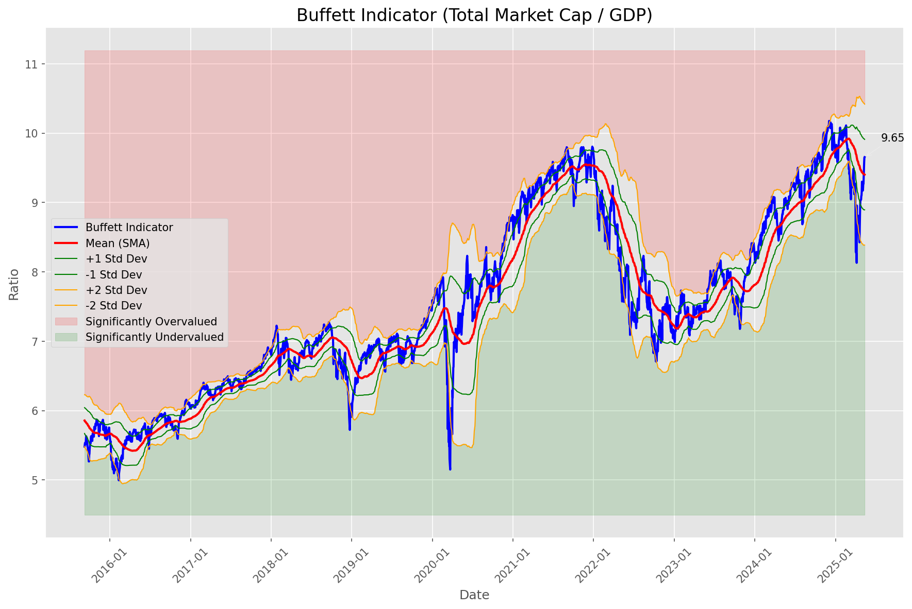
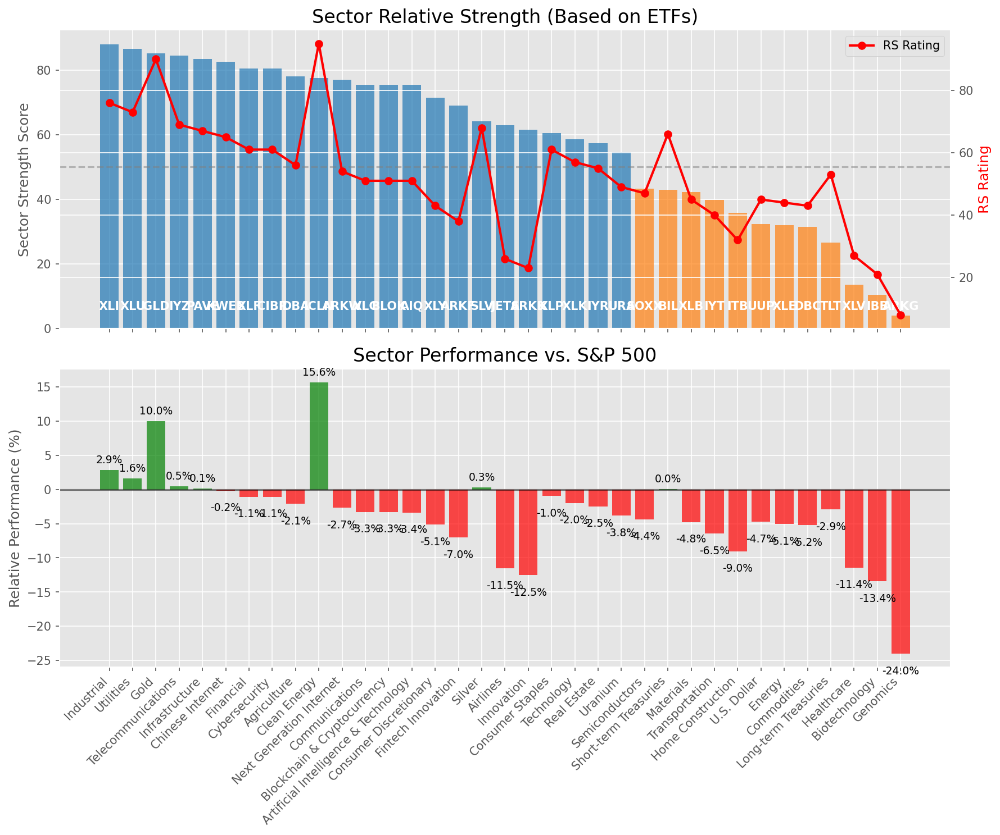

# **Daily Relative Strength Report**

**Date:** 2025-05-15

## **Market Valuation (Buffett Indicator)**

| Metric | Value |
|--------|-------|
| **Market Valuation** | **Fair Valued** |
| **Current Ratio** | 9.69 |
| **Historical Mean** | 9.40 |
| **Standard Deviation** | 0.51 |
| **Z-Score (StdDev from Mean)** | 0.50 |
| **Total Market Cap** | $290.36 trillion |
| **GDP** | $29.98 trillion |

## **Market Insights**

### **Market is Fairly Valued**

The market appears to be trading within a reasonable range of historical valuations. This suggests a balanced approach to equity investing is appropriate. Investors should:

- Focus on individual stock selection based on fundamentals and technicals
- Maintain normal equity allocations aligned with long-term goals
- Pay attention to sector rotation and relative strength
- Watch for changes in market leadership

Fair valuation typically suggests normal market returns can be expected, with stock selection becoming increasingly important.

### **Buffett Indicator Overview**

The Buffett Indicator (Total Market Cap / GDP) is a measure of the stock market's valuation relative to the size of the economy. It is named after Warren Buffett, who described it as "probably the best single measure of where valuations stand at any given moment."

- **Values above +2 standard deviations:** Market significantly overvalued
- **Values above +1 standard deviation:** Market overvalued
- **Values between -1 and +1 standard deviations:** Market fairly valued
- **Values below -1 standard deviation:** Market undervalued
- **Values below -2 standard deviations:** Market significantly undervalued

---

## **Sector Relative Strength**

Based on William O'Neil's Relative Strength Methodology

| ETF | Strength | RS Rating | Performance | Above Key MAs | Trend | Sector |
|-----|----------|-----------|-------------|--------------|-------|--------|
| [XLI](https://www.tradingview.com/chart/?symbol=XLI) | 88.5 | 77.0 | 3.13% | 10d ✓, 50d ✓, 200d ✓ | ↗️ | Industrial |
| [XLU](https://www.tradingview.com/chart/?symbol=XLU) | 87.0 | 74.0 | 2.14% | 10d ✓, 50d ✓, 200d ✓ | ↗️ | Utilities |
| [GLD](https://www.tradingview.com/chart/?symbol=GLD) | 85.1 | 90.0 | 9.95% | 10d ✗, 50d ✓, 200d ✓ | ↗️ | Gold |
| [IYZ](https://www.tradingview.com/chart/?symbol=IYZ) | 84.5 | 69.0 | 0.56% | 10d ✓, 50d ✓, 200d ✓ | ↗️ | Telecommunications |
| [PAVE](https://www.tradingview.com/chart/?symbol=PAVE) | 84.0 | 68.0 | 0.38% | 10d ✓, 50d ✓, 200d ✓ | ↗️ | Infrastructure |
| [KWEB](https://www.tradingview.com/chart/?symbol=KWEB) | 82.0 | 64.0 | -0.16% | 10d ✓, 50d ✓, 200d ✓ | ↗️ | Chinese Internet |
| [XLF](https://www.tradingview.com/chart/?symbol=XLF) | 80.5 | 61.0 | -0.77% | 10d ✓, 50d ✓, 200d ✓ | ↗️ | Financial |
| [CIBR](https://www.tradingview.com/chart/?symbol=CIBR) | 80.0 | 60.0 | -1.08% | 10d ✓, 50d ✓, 200d ✓ | ↗️ | Cybersecurity |
| [DBA](https://www.tradingview.com/chart/?symbol=DBA) | 78.0 | 56.0 | -2.02% | 10d ✓, 50d ✓, 200d ✓ | ↗️ | Agriculture |
| [ICLN](https://www.tradingview.com/chart/?symbol=ICLN) | 77.5 | 95.0 | 15.64% | 10d ✓, 50d ✓, 200d ✓ | ↘️ | Clean Energy |
| [ARKW](https://www.tradingview.com/chart/?symbol=ARKW) | 76.5 | 53.0 | -2.91% | 10d ✓, 50d ✓, 200d ✓ | ↗️ | Next Generation Internet |
| [XLC](https://www.tradingview.com/chart/?symbol=XLC) | 75.5 | 51.0 | -3.33% | 10d ✓, 50d ✓, 200d ✓ | ↗️ | Communications |
| [BLOK](https://www.tradingview.com/chart/?symbol=BLOK) | 75.0 | 50.0 | -3.41% | 10d ✓, 50d ✓, 200d ✓ | ↗️ | Blockchain & Cryptocurrency |
| [AIQ](https://www.tradingview.com/chart/?symbol=AIQ) | 75.0 | 50.0 | -3.40% | 10d ✓, 50d ✓, 200d ✓ | ↗️ | Artificial Intelligence & Technology |
| [XLY](https://www.tradingview.com/chart/?symbol=XLY) | 71.5 | 43.0 | -5.15% | 10d ✓, 50d ✓, 200d ✓ | ↗️ | Consumer Discretionary |
| [XLP](https://www.tradingview.com/chart/?symbol=XLP) | 71.1 | 62.0 | -0.56% | 10d ✗, 50d ✓, 200d ✓ | ↗️ | Consumer Staples |
| [ARKF](https://www.tradingview.com/chart/?symbol=ARKF) | 68.5 | 37.0 | -7.22% | 10d ✓, 50d ✓, 200d ✓ | ↗️ | Fintech Innovation |
| [SLV](https://www.tradingview.com/chart/?symbol=SLV) | 63.7 | 67.0 | 0.17% | 10d ✗, 50d ✗, 200d ✓ | ↗️ | Silver |
| [JETS](https://www.tradingview.com/chart/?symbol=JETS) | 62.5 | 25.0 | -11.64% | 10d ✓, 50d ✓, 200d ✓ | ↗️ | Airlines |
| [ARKK](https://www.tradingview.com/chart/?symbol=ARKK) | 61.5 | 23.0 | -12.57% | 10d ✓, 50d ✓, 200d ✓ | ↗️ | Innovation |
| [XLK](https://www.tradingview.com/chart/?symbol=XLK) | 58.0 | 56.0 | -2.09% | 10d ✓, 50d ✓, 200d ✓ | ↘️ | Technology |
| [IYR](https://www.tradingview.com/chart/?symbol=IYR) | 57.4 | 55.0 | -2.36% | 10d ✗, 50d ✓, 200d ✗ | ↗️ | Real Estate |
| [URA](https://www.tradingview.com/chart/?symbol=URA) | 55.0 | 50.0 | -3.57% | 10d ✓, 50d ✓, 200d ✓ | ↘️ | Uranium |
| [IYT](https://www.tradingview.com/chart/?symbol=IYT) | 50.0 | 40.0 | -6.32% | 10d ✓, 50d ✓, 200d ✓ | ↘️ | Transportation |
| [BIL](https://www.tradingview.com/chart/?symbol=BIL) | 42.9 | 66.0 | 0.01% | 10d ✓, 50d ✗, 200d ✗ | ↘️ | Short-term Treasuries |
| [XLB](https://www.tradingview.com/chart/?symbol=XLB) | 42.8 | 46.0 | -4.53% | 10d ✓, 50d ✓, 200d ✗ | ↘️ | Materials |
| [SOXX](https://www.tradingview.com/chart/?symbol=SOXX) | 42.3 | 45.0 | -4.56% | 10d ✓, 50d ✓, 200d ✗ | ↘️ | Semiconductors |
| [XLE](https://www.tradingview.com/chart/?symbol=XLE) | 41.8 | 44.0 | -4.85% | 10d ✓, 50d ✓, 200d ✗ | ↘️ | Energy |
| [ITB](https://www.tradingview.com/chart/?symbol=ITB) | 36.3 | 33.0 | -8.82% | 10d ✓, 50d ✓, 200d ✗ | ↘️ | Home Construction |
| [UUP](https://www.tradingview.com/chart/?symbol=UUP) | 32.4 | 45.0 | -4.73% | 10d ✓, 50d ✗, 200d ✗ | ↘️ | U.S. Dollar |
| [DBC](https://www.tradingview.com/chart/?symbol=DBC) | 31.4 | 43.0 | -5.14% | 10d ✓, 50d ✗, 200d ✗ | ↘️ | Commodities |
| [TLT](https://www.tradingview.com/chart/?symbol=TLT) | 26.0 | 52.0 | -2.98% | 10d ✗, 50d ✗, 200d ✗ | ↘️ | Long-term Treasuries |
| [XLV](https://www.tradingview.com/chart/?symbol=XLV) | 13.5 | 27.0 | -11.11% | 10d ✗, 50d ✗, 200d ✗ | ↘️ | Healthcare |
| [IBB](https://www.tradingview.com/chart/?symbol=IBB) | 10.5 | 21.0 | -13.41% | 10d ✗, 50d ✗, 200d ✗ | ↘️ | Biotechnology |
| [ARKG](https://www.tradingview.com/chart/?symbol=ARKG) | 4.0 | 8.0 | -23.86% | 10d ✗, 50d ✗, 200d ✗ | ↘️ | Genomics |

### **Sector ETF Performance Interpretation**

This table shows the relative strength metrics for different market sectors based on their representative ETFs:

- **ETF**: The ETF used to measure sector performance (click for chart)
- **Strength**: Overall sector strength score (0-100) combining multiple factors
- **RS Rating**: O'Neil RS rating of the sector ETF
- **Performance**: Performance of the sector ETF relative to SPY
- **Above Key MAs**: Whether the ETF is trading above its 10, 50, and 200-day moving averages
- **Trend**: Whether the sector is in an uptrend (↗️) or downtrend (↘️)

### **Current Sector Leadership**

The current market leadership is coming from the following sectors: **Industrial, Utilities, Gold**.

The **Industrial** sector (represented by **XLI**) is showing particularly strong relative strength with an RS rating of 77.0 and performance of 3.13% vs. the S&P 500. This sector is trading above its 10-day, 50-day, 200-day moving average(s). Investors should consider focusing on high RS stocks within these leading sectors for potential outperformance.

---

## **Buy Recommendations**

The following 73 stocks show exceptional relative strength:

| RS Rating | Buy Score | Current Price | Chart | Name | Ticker |
|-----------|-----------|---------------|-------|------|--------|
| 100 | 100 | $28.27 | [Chart](https://www.tradingview.com/chart/?symbol=DB) | Deutsche Bank Aktiengesellschaft | DB |
| 100 | 100 | $92.11 | [Chart](https://www.tradingview.com/chart/?symbol=SEZL) | Sezzle Inc. Common Stock | SEZL |
| 100 | 100 | $24.27 | [Chart](https://www.tradingview.com/chart/?symbol=CRK) | Comstock Resources, Inc. | CRK |
| 100 | 100 | $186.45 | [Chart](https://www.tradingview.com/chart/?symbol=DAVE) | Dave Inc. Class A Common Stock | DAVE |
| 100 | 100 | $157.25 | [Chart](https://www.tradingview.com/chart/?symbol=NRG) | NRG Energy, Inc. | NRG |
| 100 | 100 | $46.62 | [Chart](https://www.tradingview.com/chart/?symbol=EXEL) | Exelixis Inc | EXEL |
| 100 | 100 | $23.11 | [Chart](https://www.tradingview.com/chart/?symbol=PRA) | ProAssurance Corporation | PRA |
| 100 | 100 | $42.28 | [Chart](https://www.tradingview.com/chart/?symbol=FARO) | Faro Technologies Inc | FARO |
| 99 | 100 | $130.70 | [Chart](https://www.tradingview.com/chart/?symbol=VSEC) | VSE Corp | VSEC |
| 99 | 100 | $233.74 | [Chart](https://www.tradingview.com/chart/?symbol=CRS) | Carpenter Technology Corp | CRS |
| 99 | 100 | $161.65 | [Chart](https://www.tradingview.com/chart/?symbol=HWM) | Howmet Aerospace Inc. | HWM |
| 99 | 100 | $157.94 | [Chart](https://www.tradingview.com/chart/?symbol=PLMR) | Palomar Holdings, Inc. Common stock | PLMR |
| 98 | 100 | $130.23 | [Chart](https://www.tradingview.com/chart/?symbol=ATGE) | Adtalem Global Education Inc. Common Shares | ATGE |
| 98 | 100 | $533.25 | [Chart](https://www.tradingview.com/chart/?symbol=DUOL) | Duolingo, Inc. Class A Common Stock | DUOL |
| 98 | 100 | $163.79 | [Chart](https://www.tradingview.com/chart/?symbol=SE) | Sea Limited American Depositary Shares, each representing one Class A Ordinary Share | SE |
| 98 | 100 | $38.24 | [Chart](https://www.tradingview.com/chart/?symbol=PAY) | Paymentus Holdings, Inc. | PAY |
| 98 | 100 | $70.50 | [Chart](https://www.tradingview.com/chart/?symbol=ULS) | UL Solutions Inc. | ULS |
| 98 | 100 | $80.30 | [Chart](https://www.tradingview.com/chart/?symbol=RBLX) | Roblox Corporation | RBLX |
| 98 | 100 | $33.66 | [Chart](https://www.tradingview.com/chart/?symbol=UTI) | Universal Technical Institute, Inc. | UTI |
| 98 | 100 | $35.24 | [Chart](https://www.tradingview.com/chart/?symbol=AHR) | American Healthcare REIT, Inc. | AHR |
| 97 | 100 | $41.77 | [Chart](https://www.tradingview.com/chart/?symbol=EWP) | iShares MSCI Spain ETF | EWP |
| 97 | 100 | $119.58 | [Chart](https://www.tradingview.com/chart/?symbol=EHC) | Encompass Health Corporation Common Stock | EHC |
| 97 | 100 | $130.11 | [Chart](https://www.tradingview.com/chart/?symbol=COOP) | Mr. Cooper Group Inc. Common Stock | COOP |
| 97 | 100 | $17.32 | [Chart](https://www.tradingview.com/chart/?symbol=BCS) | Barclays PLC | BCS |
| 97 | 100 | $151.74 | [Chart](https://www.tradingview.com/chart/?symbol=CAH) | Cardinal Health, Inc. | CAH |
| 96 | 100 | $28.39 | [Chart](https://www.tradingview.com/chart/?symbol=FMS) | Fresenius Medical Care AG | FMS |
| 96 | 100 | $72.59 | [Chart](https://www.tradingview.com/chart/?symbol=WRB) | W.R. Berkley Corporation | WRB |
| 96 | 100 | $31.21 | [Chart](https://www.tradingview.com/chart/?symbol=EUFN) | iShares MSCI Europe Financials ETF | EUFN |
| 96 | 100 | $31.02 | [Chart](https://www.tradingview.com/chart/?symbol=TGS) | Transportadora de Gas del Sur S.A. ADS | TGS |
| 94 | 100 | $322.06 | [Chart](https://www.tradingview.com/chart/?symbol=PODD) | Insulet Corporation | PODD |
| 94 | 100 | $84.37 | [Chart](https://www.tradingview.com/chart/?symbol=TGLS) | Tecnoglass Inc. | TGLS |
| 94 | 100 | $63.08 | [Chart](https://www.tradingview.com/chart/?symbol=SLF) | Sun Life Financial Inc. | SLF |
| 93 | 100 | $208.94 | [Chart](https://www.tradingview.com/chart/?symbol=BAP) | Credicorp LTD | BAP |
| 93 | 100 | $1177.59 | [Chart](https://www.tradingview.com/chart/?symbol=NFLX) | NetFlix Inc | NFLX |
| 93 | 100 | $45.08 | [Chart](https://www.tradingview.com/chart/?symbol=TOST) | Toast, Inc. | TOST |
| 92 | 100 | $40.80 | [Chart](https://www.tradingview.com/chart/?symbol=EWG) | iShares MSCI Germany ETF | EWG |
| 92 | 100 | $25.05 | [Chart](https://www.tradingview.com/chart/?symbol=BSAC) | Banco Santander-Chile | BSAC |
| 92 | 100 | $106.79 | [Chart](https://www.tradingview.com/chart/?symbol=RBA) | RB Global, Inc. | RBA |
| 91 | 100 | $31.24 | [Chart](https://www.tradingview.com/chart/?symbol=PRDO) | Perdoceo Education Corporation | PRDO |
| 91 | 100 | $33.33 | [Chart](https://www.tradingview.com/chart/?symbol=SLM) | SLM Corporation | SLM |
| 91 | 100 | $232.20 | [Chart](https://www.tradingview.com/chart/?symbol=TTWO) | Take-Two Interactive Software Inc | TTWO |
| 90 | 100 | $170.35 | [Chart](https://www.tradingview.com/chart/?symbol=ITA) | iShares U.S. Aerospace & Defense ETF | ITA |
| 90 | 100 | $229.50 | [Chart](https://www.tradingview.com/chart/?symbol=GE) | GE Aerospace | GE |
| 89 | 100 | $298.51 | [Chart](https://www.tradingview.com/chart/?symbol=CVNA) | Carvana Co. | CVNA |
| 89 | 100 | $95.98 | [Chart](https://www.tradingview.com/chart/?symbol=HEES) | H&E Equipment Services, Inc. | HEES |
| 89 | 100 | $727.52 | [Chart](https://www.tradingview.com/chart/?symbol=AXON) | Axon Enterprise, Inc. Common Stock | AXON |
| 88 | 100 | $209.66 | [Chart](https://www.tradingview.com/chart/?symbol=DRI) | Darden Restaurants, Inc. | DRI |
| 88 | 100 | $128.29 | [Chart](https://www.tradingview.com/chart/?symbol=PLTR) | Palantir Technologies Inc. Class A Common Stock | PLTR |
| 88 | 100 | $25.54 | [Chart](https://www.tradingview.com/chart/?symbol=EWS) | iShares MSCI Singapore ETF | EWS |
| 89 | 99 | $53.45 | [Chart](https://www.tradingview.com/chart/?symbol=EPR) | EPR Properties | EPR |
| 88 | 99 | $68.32 | [Chart](https://www.tradingview.com/chart/?symbol=CTVA) | Corteva, Inc. Common Stock | CTVA |
| 86 | 99 | $24.96 | [Chart](https://www.tradingview.com/chart/?symbol=SONY) | Sony Group Corporation American Depositary Shares (Each Representing One Share of Dollar Validated Common Stock) | SONY |
| 89 | 98 | $197.25 | [Chart](https://www.tradingview.com/chart/?symbol=GPOR) | Gulfport Energy Corporation | GPOR |
| 87 | 98 | $23.91 | [Chart](https://www.tradingview.com/chart/?symbol=BTSG) | BrightSpring Health Services, Inc. Common Stock | BTSG |
| 86 | 98 | $85.00 | [Chart](https://www.tradingview.com/chart/?symbol=RBRK) | Rubrik, Inc. | RBRK |
| 85 | 98 | $80.89 | [Chart](https://www.tradingview.com/chart/?symbol=UNM) | Unum Group | UNM |
| 87 | 97 | $13.46 | [Chart](https://www.tradingview.com/chart/?symbol=CNH) | CNH INDUSTRIAL N.V. | CNH |
| 83 | 97 | $23.55 | [Chart](https://www.tradingview.com/chart/?symbol=SRAD) | Sportradar Group AG Class A Ordinary Shares | SRAD |
| 87 | 96 | $22.26 | [Chart](https://www.tradingview.com/chart/?symbol=KAR) | OPENLANE, Inc | KAR |
| 84 | 96 | $58.90 | [Chart](https://www.tradingview.com/chart/?symbol=HSBC) | HSBC Holdings PLC | HSBC |
| 84 | 96 | $56.33 | [Chart](https://www.tradingview.com/chart/?symbol=EQT) | EQT CORP | EQT |
| 84 | 96 | $194.25 | [Chart](https://www.tradingview.com/chart/?symbol=LOPE) | Grand Canyon Education, Inc | LOPE |
| 85 | 95 | $13.46 | [Chart](https://www.tradingview.com/chart/?symbol=MUFG) | Mitsubishi UFJ Financial Group, Inc. | MUFG |
| 85 | 95 | $58.08 | [Chart](https://www.tradingview.com/chart/?symbol=IGF) | iShares Global Infrastructure ETF | IGF |
| 84 | 95 | $136.45 | [Chart](https://www.tradingview.com/chart/?symbol=DTE) | DTE Energy Company | DTE |
| 82 | 95 | $88.79 | [Chart](https://www.tradingview.com/chart/?symbol=L) | Loews Corporation | L |
| 85 | 94 | $58.59 | [Chart](https://www.tradingview.com/chart/?symbol=IBIT) | iShares Bitcoin Trust ETF | IBIT |
| 83 | 93 | $17.22 | [Chart](https://www.tradingview.com/chart/?symbol=MIR) | Mirion Technologies, Inc. | MIR |
| 81 | 92 | $200.10 | [Chart](https://www.tradingview.com/chart/?symbol=DFS) | Discover Financial Services | DFS |
| 81 | 92 | $49.76 | [Chart](https://www.tradingview.com/chart/?symbol=TRP) | TC Energy Corporation | TRP |
| 80 | 92 | $176.72 | [Chart](https://www.tradingview.com/chart/?symbol=DGX) | Quest Diagnostics Inc. | DGX |
| 80 | 90 | $35.74 | [Chart](https://www.tradingview.com/chart/?symbol=FXI) | iShares China Large-Cap ETF | FXI |
| 80 | 90 | $61.87 | [Chart](https://www.tradingview.com/chart/?symbol=GGAL) | Grupo Financiero Galicia SA | GGAL |

---

## **Sell Recommendations**

The following 88 stocks show deteriorating relative strength:

| RS Rating | Sell Score | Current Price | Chart | Name | Ticker |
|-----------|------------|---------------|-------|------|--------|
| 1 | 100 | $10.18 | [Chart](https://www.tradingview.com/chart/?symbol=NRIX) | Nurix Therapeutics, Inc. Common stock | NRIX |
| 1 | 100 | $15.46 | [Chart](https://www.tradingview.com/chart/?symbol=BHVN) | Biohaven Ltd. | BHVN |
| 2 | 100 | $21.18 | [Chart](https://www.tradingview.com/chart/?symbol=VERA) | Vera Therapeutics, Inc. Class A Common Stock | VERA |
| 2 | 100 | $23.32 | [Chart](https://www.tradingview.com/chart/?symbol=JANX) | Janux Therapeutics, Inc. Common Stock | JANX |
| 3 | 100 | $14.06 | [Chart](https://www.tradingview.com/chart/?symbol=DNLI) | Denali Therapeutics Inc. Common Stock | DNLI |
| 3 | 100 | $29.77 | [Chart](https://www.tradingview.com/chart/?symbol=TWST) | Twist Bioscience Corporation Common Stock | TWST |
| 3 | 100 | $10.22 | [Chart](https://www.tradingview.com/chart/?symbol=HPK) | HighPeak Energy, Inc. Common Stock | HPK |
| 3 | 100 | $28.98 | [Chart](https://www.tradingview.com/chart/?symbol=CRTO) | Criteo S.A. | CRTO |
| 4 | 100 | $18.07 | [Chart](https://www.tradingview.com/chart/?symbol=VRNT) | Verint Systems Inc | VRNT |
| 4 | 100 | $12.13 | [Chart](https://www.tradingview.com/chart/?symbol=LBRT) | Liberty Energy Inc. | LBRT |
| 5 | 100 | $27.82 | [Chart](https://www.tradingview.com/chart/?symbol=SRDX) | Surmodics, Inc. Common Stock | SRDX |
| 5 | 100 | $15.77 | [Chart](https://www.tradingview.com/chart/?symbol=PENN) | PENN Entertainment, Inc. Common Stock | PENN |
| 5 | 100 | $13.89 | [Chart](https://www.tradingview.com/chart/?symbol=IMVT) | Immunovant, Inc. Common Stock | IMVT |
| 5 | 100 | $34.09 | [Chart](https://www.tradingview.com/chart/?symbol=AAP) | ADVANCE AUTO PARTS INC | AAP |
| 6 | 100 | $11.38 | [Chart](https://www.tradingview.com/chart/?symbol=ARCT) | Arcturus Therapeutics Holdings Inc. Common Stock | ARCT |
| 6 | 100 | $29.71 | [Chart](https://www.tradingview.com/chart/?symbol=CYTK) | Cytokinetics Inc. | CYTK |
| 8 | 100 | $126.28 | [Chart](https://www.tradingview.com/chart/?symbol=TFX) | Teleflex Incorporated | TFX |
| 13 | 100 | $47.07 | [Chart](https://www.tradingview.com/chart/?symbol=RHI) | Robert Half Inc. | RHI |
| 14 | 100 | $18.51 | [Chart](https://www.tradingview.com/chart/?symbol=NVDS) | Investment Managers Series Trust II Tradr 1.5X Short NVDA Daily ETF | NVDS |
| 16 | 100 | $10.34 | [Chart](https://www.tradingview.com/chart/?symbol=CMRE) | Costamare Inc. | CMRE |
| 17 | 100 | $46.88 | [Chart](https://www.tradingview.com/chart/?symbol=LINE) | Lineage, Inc. Common Stock | LINE |
| 18 | 100 | $12.75 | [Chart](https://www.tradingview.com/chart/?symbol=MED) | Medifast, Inc. | MED |
| 21 | 100 | $95.50 | [Chart](https://www.tradingview.com/chart/?symbol=CHRD) | Chord Energy Corporation Common Stock | CHRD |
| 5 | 99 | $10.70 | [Chart](https://www.tradingview.com/chart/?symbol=LSPD) | Lightspeed Commerce Inc. | LSPD |
| 8 | 99 | $91.03 | [Chart](https://www.tradingview.com/chart/?symbol=BCC) | Boise Cascade Company | BCC |
| 10 | 99 | $17.62 | [Chart](https://www.tradingview.com/chart/?symbol=MLKN) | MillerKnoll, Inc. Common Stock | MLKN |
| 18 | 99 | $28.07 | [Chart](https://www.tradingview.com/chart/?symbol=AGIO) | Agios Pharmaceuticals, Inc. | AGIO |
| 6 | 98 | $10.31 | [Chart](https://www.tradingview.com/chart/?symbol=VREX) | Varex Imaging Corporation Common Stock | VREX |
| 8 | 98 | $21.14 | [Chart](https://www.tradingview.com/chart/?symbol=UCO) | ProShares Ultra Bloomberg Crude Oil | UCO |
| 9 | 98 | $15.86 | [Chart](https://www.tradingview.com/chart/?symbol=DXC) | DXC Technology Company | DXC |
| 18 | 98 | $35.60 | [Chart](https://www.tradingview.com/chart/?symbol=SLB) | Schlumberger Limited | SLB |
| 8 | 97 | $21.06 | [Chart](https://www.tradingview.com/chart/?symbol=ARKG) | ARK Genomic Revolution ETF | ARKG |
| 4 | 96 | $14.77 | [Chart](https://www.tradingview.com/chart/?symbol=DQ) | Daqo New Energy Corp. American Depositary Shares (each representing 5 Ordinary Shares) | DQ |
| 9 | 95 | $44.38 | [Chart](https://www.tradingview.com/chart/?symbol=MTDR) | MATADOR RESOURCES COMPANY | MTDR |
| 9 | 94 | $117.41 | [Chart](https://www.tradingview.com/chart/?symbol=BLDR) | Builders FirstSource, Inc. | BLDR |
| 13 | 94 | $228.00 | [Chart](https://www.tradingview.com/chart/?symbol=OIH) | VanEck Oil Services ETF | OIH |
| 14 | 94 | $111.85 | [Chart](https://www.tradingview.com/chart/?symbol=A) | Agilent Technologies Inc. | A |
| 16 | 94 | $17.26 | [Chart](https://www.tradingview.com/chart/?symbol=IDYA) | IDEAYA Biosciences, Inc. Common Stock | IDYA |
| 14 | 93 | $15.80 | [Chart](https://www.tradingview.com/chart/?symbol=AMZY) | YieldMax AMZN Option Income Strategy ETF | AMZY |
| 17 | 93 | $13.12 | [Chart](https://www.tradingview.com/chart/?symbol=ZUMZ) | Zumiez Inc. | ZUMZ |
| 23 | 93 | $10.05 | [Chart](https://www.tradingview.com/chart/?symbol=LBTYA) | Liberty Global Ltd. Class A Common Shares | LBTYA |
| 28 | 93 | $10.31 | [Chart](https://www.tradingview.com/chart/?symbol=LBTYK) | Liberty Global Ltd. Class C Common Shares | LBTYK |
| 8 | 92 | $10.15 | [Chart](https://www.tradingview.com/chart/?symbol=HLIT) | Harmonic Inc | HLIT |
| 10 | 92 | $12.02 | [Chart](https://www.tradingview.com/chart/?symbol=APLE) | Apple Hospitality REIT, Inc. | APLE |
| 12 | 92 | $11.88 | [Chart](https://www.tradingview.com/chart/?symbol=WEN) | The Wendy's Company | WEN |
| 13 | 92 | $33.08 | [Chart](https://www.tradingview.com/chart/?symbol=MBIN) | Merchants Bancorp Common Stock | MBIN |
| 11 | 91 | $34.62 | [Chart](https://www.tradingview.com/chart/?symbol=RARE) | Ultragenyx Pharmaceutical Inc. | RARE |
| 20 | 91 | $52.18 | [Chart](https://www.tradingview.com/chart/?symbol=ERX) | Direxion Daily Energy Bull 2X Shares | ERX |
| 11 | 90 | $34.07 | [Chart](https://www.tradingview.com/chart/?symbol=TECS) | Direxion Daily Technology Bear 3x Shares | TECS |
| 13 | 90 | $29.64 | [Chart](https://www.tradingview.com/chart/?symbol=KYMR) | Kymera Therapeutics, Inc. Common Stock | KYMR |
| 12 | 89 | $25.59 | [Chart](https://www.tradingview.com/chart/?symbol=IRDM) | Iridium Communications Inc. | IRDM |
| 13 | 89 | $57.12 | [Chart](https://www.tradingview.com/chart/?symbol=BOIL) | ProShares Ultra Bloomberg Natural Gas | BOIL |
| 15 | 89 | $16.27 | [Chart](https://www.tradingview.com/chart/?symbol=CHCT) | Community Healthcare Trust Incorporated Common Stock, $0.01 par value per share | CHCT |
| 17 | 88 | $10.24 | [Chart](https://www.tradingview.com/chart/?symbol=SD) | SandRidge Energy, Inc. | SD |
| 17 | 87 | $36.68 | [Chart](https://www.tradingview.com/chart/?symbol=MLTX) | MoonLake Immunotherapeutics Class A Ordinary Shares | MLTX |
| 21 | 86 | $11.22 | [Chart](https://www.tradingview.com/chart/?symbol=NEWT) | NewtekOne, Inc. Common Stock | NEWT |
| 26 | 86 | $20.55 | [Chart](https://www.tradingview.com/chart/?symbol=BITI) | ProShares Short Bitcoin ETF | BITI |
| 28 | 86 | $25.29 | [Chart](https://www.tradingview.com/chart/?symbol=RCI) | Rogers Communications, Inc. | RCI |
| 15 | 85 | $83.61 | [Chart](https://www.tradingview.com/chart/?symbol=WHR) | Whirlpool Corp. | WHR |
| 20 | 85 | $69.90 | [Chart](https://www.tradingview.com/chart/?symbol=NUVL) | Nuvalent, Inc. Class A Common Stock | NUVL |
| 22 | 83 | $34.91 | [Chart](https://www.tradingview.com/chart/?symbol=SQM) | Sociedad Quimica y Minera de Chile SA | SQM |
| 25 | 83 | $76.03 | [Chart](https://www.tradingview.com/chart/?symbol=IFF) | International Flavors & Fragrances Inc. | IFF |
| 31 | 82 | $58.51 | [Chart](https://www.tradingview.com/chart/?symbol=BMRN) | BioMarin Pharmaceuticals Inc | BMRN |
| 19 | 81 | $15.51 | [Chart](https://www.tradingview.com/chart/?symbol=BCSF) | Bain Capital Specialty Finance, Inc. | BCSF |
| 24 | 81 | $10.10 | [Chart](https://www.tradingview.com/chart/?symbol=CION) | CION Investment Corporation | CION |
| 24 | 81 | $31.02 | [Chart](https://www.tradingview.com/chart/?symbol=CRNX) | Crinetics Pharmaceuticals, Inc. | CRNX |
| 23 | 80 | $16.42 | [Chart](https://www.tradingview.com/chart/?symbol=QYLD) | Global X Funds Global X NASDAQ-100 Covered Call ETF | QYLD |
| 29 | 80 | $10.44 | [Chart](https://www.tradingview.com/chart/?symbol=SCS) | Steelcase, Inc. | SCS |
| 31 | 80 | $34.94 | [Chart](https://www.tradingview.com/chart/?symbol=CPB) | The Campbell's Company Common Stock | CPB |
| 27 | 79 | $27.40 | [Chart](https://www.tradingview.com/chart/?symbol=BNO) | United States Brent Oil Fund, LP | BNO |
| 27 | 78 | $14.71 | [Chart](https://www.tradingview.com/chart/?symbol=HR) | Healthcare Realty Trust Incorporated | HR |
| 27 | 78 | $109.89 | [Chart](https://www.tradingview.com/chart/?symbol=LEN) | Lennar Corporation Class A | LEN |
| 31 | 78 | $141.32 | [Chart](https://www.tradingview.com/chart/?symbol=FANG) | Diamondback Energy, Inc. | FANG |
| 30 | 76 | $51.69 | [Chart](https://www.tradingview.com/chart/?symbol=LW) | Lamb Weston Holdings, Inc. | LW |
| 32 | 76 | $13.76 | [Chart](https://www.tradingview.com/chart/?symbol=BSM) | Black Stone Minerals, L.P. | BSM |
| 28 | 74 | $115.33 | [Chart](https://www.tradingview.com/chart/?symbol=EOG) | EOG Resources, Inc. | EOG |
| 29 | 74 | $10.67 | [Chart](https://www.tradingview.com/chart/?symbol=AVO) | Mission Produce, Inc. Common Stock | AVO |
| 39 | 74 | $35.30 | [Chart](https://www.tradingview.com/chart/?symbol=NSA) | National Storage Affiliates Trust | NSA |
| 32 | 73 | $18.11 | [Chart](https://www.tradingview.com/chart/?symbol=ZTO) | ZTO Express (Cayman) Inc. American Depositary Shares, each representing one Class A ordinary share | ZTO |
| 37 | 72 | $134.97 | [Chart](https://www.tradingview.com/chart/?symbol=HES) | Hess Corporation | HES |
| 37 | 71 | $19.32 | [Chart](https://www.tradingview.com/chart/?symbol=SPTN) | SpartanNash Company | SPTN |
| 32 | 70 | $10.69 | [Chart](https://www.tradingview.com/chart/?symbol=LADR) | LADDER CAPITAL CORP | LADR |
| 32 | 70 | $142.02 | [Chart](https://www.tradingview.com/chart/?symbol=CVX) | Chevron Corporation | CVX |
| 37 | 70 | $10.45 | [Chart](https://www.tradingview.com/chart/?symbol=CELC) | Celcuity Inc. Common Stock | CELC |
| 39 | 70 | $10.69 | [Chart](https://www.tradingview.com/chart/?symbol=NMFC) | NEW MOUNTAIN FINANCE CORPORATION | NMFC |
| 38 | 68 | $10.51 | [Chart](https://www.tradingview.com/chart/?symbol=NMZ) | Nuveen Municipal High Income Opportunity Fund | NMZ |
| 38 | 66 | $109.80 | [Chart](https://www.tradingview.com/chart/?symbol=MHO) | M/I Homes, Inc. | MHO |
| 38 | 64 | $12.82 | [Chart](https://www.tradingview.com/chart/?symbol=PCN) | PIMCO Corporate & Income Strategy Fund | PCN |

## **Methodology**

This report uses William O'Neil's relative strength methodology from Investors Business Daily:

* **RS Rating**: Percentile rank of stock's performance vs. S&P 500 over the past 63 trading days (1-99 scale)
* **Buy Criteria**: RS Rating >= 80, price above 50-day MA, strong uptrend, increasing volume
* **Sell Criteria**: RS Rating < 40, price below 50-day MA, downtrend, decreasing volume

### **O'Neil's Key Principles**

1. **Focus on relative performance** - stocks outperforming the market
2. **Price trend confirmation** - stock must be in an uptrend
3. **Volume confirmation** - strong volume supports price moves
4. **Moving average validation** - price above key moving averages
5. **Market leaders only** - concentrate on top-performing stocks

*Report generated automatically after market close*