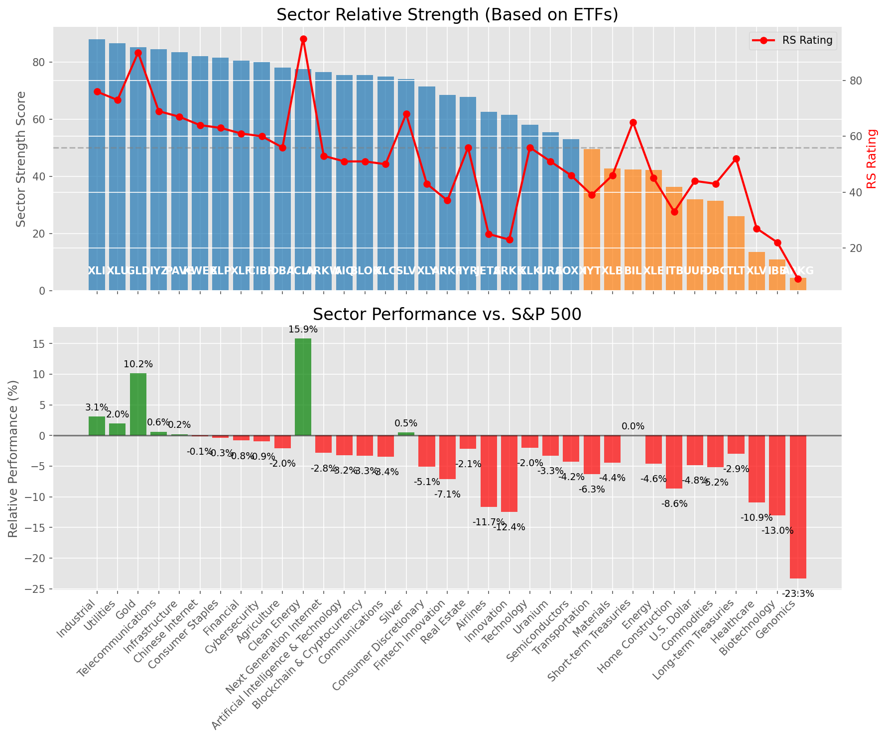

# **Daily Relative Strength Report**

**Date:** 2025-05-15

## **Market Valuation (Buffett Indicator)**

| Metric | Value |
|--------|-------|
| **Market Valuation** | **Fair Valued** |
| **Current Ratio** | 9.62 |
| **Historical Mean** | 9.40 |
| **Standard Deviation** | 0.51 |
| **Z-Score (StdDev from Mean)** | 0.50 |
| **Total Market Cap** | $288.30 trillion |
| **GDP** | $29.98 trillion |

## **Market Insights**

### **Market is Fairly Valued**

The market appears to be trading within a reasonable range of historical valuations. This suggests a balanced approach to equity investing is appropriate. Investors should:

- Focus on individual stock selection based on fundamentals and technicals
- Maintain normal equity allocations aligned with long-term goals
- Pay attention to sector rotation and relative strength
- Watch for changes in market leadership

Fair valuation typically suggests normal market returns can be expected, with stock selection becoming increasingly important.

### **Buffett Indicator Overview**

The Buffett Indicator (Total Market Cap / GDP) is a measure of the stock market's valuation relative to the size of the economy. It is named after Warren Buffett, who described it as "probably the best single measure of where valuations stand at any given moment."

- **Values above +2 standard deviations:** Market significantly overvalued
- **Values above +1 standard deviation:** Market overvalued
- **Values between -1 and +1 standard deviations:** Market fairly valued
- **Values below -1 standard deviation:** Market undervalued
- **Values below -2 standard deviations:** Market significantly undervalued

---

## **Sector Relative Strength**

Based on William O'Neil's Relative Strength Methodology

| ETF | Strength | RS Rating | Performance | Above Key MAs | Trend | Sector |
|-----|----------|-----------|-------------|--------------|-------|--------|
| [XLI](https://www.tradingview.com/chart/?symbol=XLI) | 87.5 | 75.0 | 2.54% | 10d ✓, 50d ✓, 200d ✓ | ↗️ | Industrial |
| [XLU](https://www.tradingview.com/chart/?symbol=XLU) | 86.0 | 72.0 | 1.30% | 10d ✓, 50d ✓, 200d ✓ | ↗️ | Utilities |
| [GLD](https://www.tradingview.com/chart/?symbol=GLD) | 84.6 | 89.0 | 9.19% | 10d ✗, 50d ✓, 200d ✓ | ↗️ | Gold |
| [IYZ](https://www.tradingview.com/chart/?symbol=IYZ) | 84.0 | 68.0 | 0.32% | 10d ✓, 50d ✓, 200d ✓ | ↗️ | Telecommunications |
| [ARKW](https://www.tradingview.com/chart/?symbol=ARKW) | 83.5 | 67.0 | 0.05% | 10d ✓, 50d ✓, 200d ✓ | ↗️ | Next Generation Internet |
| [PAVE](https://www.tradingview.com/chart/?symbol=PAVE) | 82.5 | 65.0 | -0.28% | 10d ✓, 50d ✓, 200d ✓ | ↗️ | Infrastructure |
| [KWEB](https://www.tradingview.com/chart/?symbol=KWEB) | 81.0 | 62.0 | -0.83% | 10d ✓, 50d ✓, 200d ✓ | ↗️ | Chinese Internet |
| [XLF](https://www.tradingview.com/chart/?symbol=XLF) | 80.0 | 60.0 | -1.25% | 10d ✓, 50d ✓, 200d ✓ | ↗️ | Financial |
| [CIBR](https://www.tradingview.com/chart/?symbol=CIBR) | 79.0 | 58.0 | -1.66% | 10d ✓, 50d ✓, 200d ✓ | ↗️ | Cybersecurity |
| [DBA](https://www.tradingview.com/chart/?symbol=DBA) | 78.0 | 56.0 | -2.37% | 10d ✓, 50d ✓, 200d ✓ | ↗️ | Agriculture |
| [ARKF](https://www.tradingview.com/chart/?symbol=ARKF) | 77.5 | 55.0 | -2.57% | 10d ✓, 50d ✓, 200d ✓ | ↗️ | Fintech Innovation |
| [ICLN](https://www.tradingview.com/chart/?symbol=ICLN) | 77.5 | 95.0 | 15.20% | 10d ✓, 50d ✓, 200d ✓ | ↘️ | Clean Energy |
| [AIQ](https://www.tradingview.com/chart/?symbol=AIQ) | 75.0 | 50.0 | -3.70% | 10d ✓, 50d ✓, 200d ✓ | ↗️ | Artificial Intelligence & Technology |
| [XLC](https://www.tradingview.com/chart/?symbol=XLC) | 75.0 | 50.0 | -3.59% | 10d ✓, 50d ✓, 200d ✓ | ↗️ | Communications |
| [BLOK](https://www.tradingview.com/chart/?symbol=BLOK) | 73.0 | 46.0 | -4.43% | 10d ✓, 50d ✓, 200d ✓ | ↗️ | Blockchain & Cryptocurrency |
| [XLY](https://www.tradingview.com/chart/?symbol=XLY) | 71.0 | 42.0 | -5.62% | 10d ✓, 50d ✓, 200d ✓ | ↗️ | Consumer Discretionary |
| [JETS](https://www.tradingview.com/chart/?symbol=JETS) | 62.0 | 24.0 | -12.13% | 10d ✓, 50d ✓, 200d ✓ | ↗️ | Airlines |
| [SLV](https://www.tradingview.com/chart/?symbol=SLV) | 61.7 | 63.0 | -0.56% | 10d ✗, 50d ✗, 200d ✓ | ↗️ | Silver |
| [ARKK](https://www.tradingview.com/chart/?symbol=ARKK) | 60.5 | 21.0 | -13.38% | 10d ✓, 50d ✓, 200d ✓ | ↗️ | Innovation |
| [XLK](https://www.tradingview.com/chart/?symbol=XLK) | 57.5 | 55.0 | -2.53% | 10d ✓, 50d ✓, 200d ✓ | ↘️ | Technology |
| [IYR](https://www.tradingview.com/chart/?symbol=IYR) | 55.9 | 52.0 | -3.03% | 10d ✗, 50d ✓, 200d ✗ | ↗️ | Real Estate |
| [URA](https://www.tradingview.com/chart/?symbol=URA) | 53.0 | 46.0 | -4.56% | 10d ✓, 50d ✓, 200d ✓ | ↘️ | Uranium |
| [IYT](https://www.tradingview.com/chart/?symbol=IYT) | 50.5 | 41.0 | -5.92% | 10d ✓, 50d ✓, 200d ✓ | ↘️ | Transportation |
| [XLP](https://www.tradingview.com/chart/?symbol=XLP) | 49.5 | 59.0 | -1.47% | 10d ✗, 50d ✗, 200d ✗ | ↗️ | Consumer Staples |
| [BIL](https://www.tradingview.com/chart/?symbol=BIL) | 43.4 | 67.0 | 0.02% | 10d ✓, 50d ✗, 200d ✗ | ↘️ | Short-term Treasuries |
| [SOXX](https://www.tradingview.com/chart/?symbol=SOXX) | 42.3 | 45.0 | -4.94% | 10d ✓, 50d ✓, 200d ✗ | ↘️ | Semiconductors |
| [XLB](https://www.tradingview.com/chart/?symbol=XLB) | 41.3 | 43.0 | -5.39% | 10d ✓, 50d ✓, 200d ✗ | ↘️ | Materials |
| [UUP](https://www.tradingview.com/chart/?symbol=UUP) | 32.4 | 45.0 | -4.88% | 10d ✓, 50d ✗, 200d ✗ | ↘️ | U.S. Dollar |
| [DBC](https://www.tradingview.com/chart/?symbol=DBC) | 31.4 | 43.0 | -5.35% | 10d ✓, 50d ✗, 200d ✗ | ↘️ | Commodities |
| [XLE](https://www.tradingview.com/chart/?symbol=XLE) | 29.9 | 40.0 | -6.10% | 10d ✓, 50d ✗, 200d ✗ | ↘️ | Energy |
| [TLT](https://www.tradingview.com/chart/?symbol=TLT) | 25.5 | 51.0 | -3.43% | 10d ✗, 50d ✗, 200d ✗ | ↘️ | Long-term Treasuries |
| [ITB](https://www.tradingview.com/chart/?symbol=ITB) | 15.0 | 30.0 | -9.69% | 10d ✗, 50d ✗, 200d ✗ | ↘️ | Home Construction |
| [XLV](https://www.tradingview.com/chart/?symbol=XLV) | 11.5 | 23.0 | -12.58% | 10d ✗, 50d ✗, 200d ✗ | ↘️ | Healthcare |
| [IBB](https://www.tradingview.com/chart/?symbol=IBB) | 9.5 | 19.0 | -14.79% | 10d ✗, 50d ✗, 200d ✗ | ↘️ | Biotechnology |
| [ARKG](https://www.tradingview.com/chart/?symbol=ARKG) | 4.0 | 8.0 | -25.13% | 10d ✗, 50d ✗, 200d ✗ | ↘️ | Genomics |

### **Sector ETF Performance Interpretation**

This table shows the relative strength metrics for different market sectors based on their representative ETFs:

- **ETF**: The ETF used to measure sector performance (click for chart)
- **Strength**: Overall sector strength score (0-100) combining multiple factors
- **RS Rating**: O'Neil RS rating of the sector ETF
- **Performance**: Performance of the sector ETF relative to SPY
- **Above Key MAs**: Whether the ETF is trading above its 10, 50, and 200-day moving averages
- **Trend**: Whether the sector is in an uptrend (↗️) or downtrend (↘️)

### **Current Sector Leadership**

The current market leadership is coming from the following sectors: **Industrial, Utilities, Gold**.

The **Industrial** sector (represented by **XLI**) is showing particularly strong relative strength with an RS rating of 75.0 and performance of 2.54% vs. the S&P 500. This sector is trading above its 10-day, 50-day, 200-day moving average(s). Investors should consider focusing on high RS stocks within these leading sectors for potential outperformance.

---

## **Buy Recommendations**

The following 69 stocks show exceptional relative strength:

| RS Rating | Buy Score | Current Price | Chart | Name | Ticker |
|-----------|-----------|---------------|-------|------|--------|
| 100 | 100 | $28.15 | [Chart](https://www.tradingview.com/chart/?symbol=DB) | Deutsche Bank Aktiengesellschaft | DB |
| 100 | 100 | $156.12 | [Chart](https://www.tradingview.com/chart/?symbol=PLMR) | Palomar Holdings, Inc. Common stock | PLMR |
| 100 | 100 | $183.32 | [Chart](https://www.tradingview.com/chart/?symbol=DAVE) | Dave Inc. Class A Common Stock | DAVE |
| 100 | 100 | $155.00 | [Chart](https://www.tradingview.com/chart/?symbol=NRG) | NRG Energy, Inc. | NRG |
| 100 | 100 | $89.55 | [Chart](https://www.tradingview.com/chart/?symbol=SEZL) | Sezzle Inc. Common Stock | SEZL |
| 100 | 100 | $540.68 | [Chart](https://www.tradingview.com/chart/?symbol=DUOL) | Duolingo, Inc. Class A Common Stock | DUOL |
| 100 | 100 | $42.29 | [Chart](https://www.tradingview.com/chart/?symbol=FARO) | Faro Technologies Inc | FARO |
| 100 | 100 | $22.99 | [Chart](https://www.tradingview.com/chart/?symbol=PRA) | ProAssurance Corporation | PRA |
| 100 | 100 | $19.30 | [Chart](https://www.tradingview.com/chart/?symbol=SPNT) | SiriusPoint Ltd. | SPNT |
| 100 | 100 | $23.75 | [Chart](https://www.tradingview.com/chart/?symbol=CRK) | Comstock Resources, Inc. | CRK |
| 99 | 100 | $130.70 | [Chart](https://www.tradingview.com/chart/?symbol=VSEC) | VSE Corp | VSEC |
| 99 | 100 | $69.86 | [Chart](https://www.tradingview.com/chart/?symbol=ULS) | UL Solutions Inc. | ULS |
| 99 | 100 | $44.88 | [Chart](https://www.tradingview.com/chart/?symbol=EXEL) | Exelixis Inc | EXEL |
| 99 | 100 | $38.29 | [Chart](https://www.tradingview.com/chart/?symbol=PAY) | Paymentus Holdings, Inc. | PAY |
| 99 | 100 | $24.10 | [Chart](https://www.tradingview.com/chart/?symbol=GRND) | Grindr Inc. | GRND |
| 98 | 100 | $230.00 | [Chart](https://www.tradingview.com/chart/?symbol=CRS) | Carpenter Technology Corp | CRS |
| 98 | 100 | $41.54 | [Chart](https://www.tradingview.com/chart/?symbol=EWP) | iShares MSCI Spain ETF | EWP |
| 98 | 100 | $79.44 | [Chart](https://www.tradingview.com/chart/?symbol=RBLX) | Roblox Corporation | RBLX |
| 98 | 100 | $119.27 | [Chart](https://www.tradingview.com/chart/?symbol=EHC) | Encompass Health Corporation Common Stock | EHC |
| 98 | 100 | $129.72 | [Chart](https://www.tradingview.com/chart/?symbol=ATGE) | Adtalem Global Education Inc. Common Shares | ATGE |
| 98 | 100 | $160.04 | [Chart](https://www.tradingview.com/chart/?symbol=HWM) | Howmet Aerospace Inc. | HWM |
| 98 | 100 | $162.66 | [Chart](https://www.tradingview.com/chart/?symbol=SE) | Sea Limited American Depositary Shares, each representing one Class A Ordinary Share | SE |
| 98 | 100 | $35.06 | [Chart](https://www.tradingview.com/chart/?symbol=AHR) | American Healthcare REIT, Inc. | AHR |
| 97 | 100 | $128.78 | [Chart](https://www.tradingview.com/chart/?symbol=COOP) | Mr. Cooper Group Inc. Common Stock | COOP |
| 97 | 100 | $32.75 | [Chart](https://www.tradingview.com/chart/?symbol=UTI) | Universal Technical Institute, Inc. | UTI |
| 97 | 100 | $17.28 | [Chart](https://www.tradingview.com/chart/?symbol=BCS) | Barclays PLC | BCS |
| 96 | 100 | $31.18 | [Chart](https://www.tradingview.com/chart/?symbol=EUFN) | iShares MSCI Europe Financials ETF | EUFN |
| 96 | 100 | $28.13 | [Chart](https://www.tradingview.com/chart/?symbol=FMS) | Fresenius Medical Care AG | FMS |
| 95 | 100 | $84.39 | [Chart](https://www.tradingview.com/chart/?symbol=TGLS) | Tecnoglass Inc. | TGLS |
| 95 | 100 | $321.41 | [Chart](https://www.tradingview.com/chart/?symbol=PODD) | Insulet Corporation | PODD |
| 94 | 100 | $30.24 | [Chart](https://www.tradingview.com/chart/?symbol=TGS) | Transportadora de Gas del Sur S.A. ADS | TGS |
| 93 | 100 | $24.99 | [Chart](https://www.tradingview.com/chart/?symbol=BSAC) | Banco Santander-Chile | BSAC |
| 93 | 100 | $105.51 | [Chart](https://www.tradingview.com/chart/?symbol=RBA) | RB Global, Inc. | RBA |
| 93 | 100 | $78.44 | [Chart](https://www.tradingview.com/chart/?symbol=LB) | LandBridge Company LLC | LB |
| 92 | 100 | $1159.70 | [Chart](https://www.tradingview.com/chart/?symbol=NFLX) | NetFlix Inc | NFLX |
| 92 | 100 | $40.70 | [Chart](https://www.tradingview.com/chart/?symbol=EWG) | iShares MSCI Germany ETF | EWG |
| 91 | 100 | $231.43 | [Chart](https://www.tradingview.com/chart/?symbol=TTWO) | Take-Two Interactive Software Inc | TTWO |
| 91 | 100 | $207.91 | [Chart](https://www.tradingview.com/chart/?symbol=BAP) | Credicorp LTD | BAP |
| 91 | 100 | $44.52 | [Chart](https://www.tradingview.com/chart/?symbol=TOST) | Toast, Inc. | TOST |
| 90 | 100 | $30.91 | [Chart](https://www.tradingview.com/chart/?symbol=PRDO) | Perdoceo Education Corporation | PRDO |
| 90 | 100 | $728.53 | [Chart](https://www.tradingview.com/chart/?symbol=AXON) | Axon Enterprise, Inc. Common Stock | AXON |
| 90 | 100 | $52.17 | [Chart](https://www.tradingview.com/chart/?symbol=EPR) | EPR Properties | EPR |
| 89 | 100 | $226.46 | [Chart](https://www.tradingview.com/chart/?symbol=GE) | GE Aerospace | GE |
| 89 | 100 | $95.62 | [Chart](https://www.tradingview.com/chart/?symbol=HEES) | H&E Equipment Services, Inc. | HEES |
| 89 | 100 | $296.35 | [Chart](https://www.tradingview.com/chart/?symbol=CVNA) | Carvana Co. | CVNA |
| 89 | 100 | $210.47 | [Chart](https://www.tradingview.com/chart/?symbol=DRI) | Darden Restaurants, Inc. | DRI |
| 88 | 100 | $25.25 | [Chart](https://www.tradingview.com/chart/?symbol=EWS) | iShares MSCI Singapore ETF | EWS |
| 87 | 100 | $25.02 | [Chart](https://www.tradingview.com/chart/?symbol=SONY) | Sony Group Corporation American Depositary Shares (Each Representing One Share of Dollar Validated Common Stock) | SONY |
| 89 | 99 | $168.88 | [Chart](https://www.tradingview.com/chart/?symbol=ITA) | iShares U.S. Aerospace & Defense ETF | ITA |
| 86 | 99 | $126.69 | [Chart](https://www.tradingview.com/chart/?symbol=PLTR) | Palantir Technologies Inc. Class A Common Stock | PLTR |
| 89 | 98 | $22.34 | [Chart](https://www.tradingview.com/chart/?symbol=KAR) | OPENLANE, Inc | KAR |
| 87 | 98 | $67.70 | [Chart](https://www.tradingview.com/chart/?symbol=CTVA) | Corteva, Inc. Common Stock | CTVA |
| 86 | 98 | $56.64 | [Chart](https://www.tradingview.com/chart/?symbol=EQT) | EQT CORP | EQT |
| 87 | 97 | $13.44 | [Chart](https://www.tradingview.com/chart/?symbol=CNH) | CNH INDUSTRIAL N.V. | CNH |
| 85 | 97 | $194.25 | [Chart](https://www.tradingview.com/chart/?symbol=LOPE) | Grand Canyon Education, Inc | LOPE |
| 85 | 97 | $63.53 | [Chart](https://www.tradingview.com/chart/?symbol=CHEF) | The Chef's Warehouse Inc | CHEF |
| 85 | 97 | $58.83 | [Chart](https://www.tradingview.com/chart/?symbol=HSBC) | HSBC Holdings PLC | HSBC |
| 82 | 96 | $23.32 | [Chart](https://www.tradingview.com/chart/?symbol=SRAD) | Sportradar Group AG Class A Ordinary Shares | SRAD |
| 83 | 95 | $54.25 | [Chart](https://www.tradingview.com/chart/?symbol=CAKE) | Cheesecake Factory (The) | CAKE |
| 85 | 94 | $196.85 | [Chart](https://www.tradingview.com/chart/?symbol=GPOR) | Gulfport Energy Corporation | GPOR |
| 84 | 94 | $17.21 | [Chart](https://www.tradingview.com/chart/?symbol=MIR) | Mirion Technologies, Inc. | MIR |
| 84 | 93 | $57.99 | [Chart](https://www.tradingview.com/chart/?symbol=IBIT) | iShares Bitcoin Trust ETF | IBIT |
| 83 | 93 | $13.29 | [Chart](https://www.tradingview.com/chart/?symbol=MUFG) | Mitsubishi UFJ Financial Group, Inc. | MUFG |
| 81 | 93 | $82.43 | [Chart](https://www.tradingview.com/chart/?symbol=RBRK) | Rubrik, Inc. | RBRK |
| 80 | 93 | $65.00 | [Chart](https://www.tradingview.com/chart/?symbol=CSGS) | CSG Systems International | CSGS |
| 81 | 92 | $23.14 | [Chart](https://www.tradingview.com/chart/?symbol=BTSG) | BrightSpring Health Services, Inc. Common Stock | BTSG |
| 81 | 91 | $385.05 | [Chart](https://www.tradingview.com/chart/?symbol=LPLA) | LPL Financial Holdings Inc. | LPLA |
| 80 | 91 | $198.74 | [Chart](https://www.tradingview.com/chart/?symbol=DFS) | Discover Financial Services | DFS |
| 80 | 90 | $35.62 | [Chart](https://www.tradingview.com/chart/?symbol=FXI) | iShares China Large-Cap ETF | FXI |

---

## **Sell Recommendations**

The following 92 stocks show deteriorating relative strength:

| RS Rating | Sell Score | Current Price | Chart | Name | Ticker |
|-----------|------------|---------------|-------|------|--------|
| 1 | 100 | $10.18 | [Chart](https://www.tradingview.com/chart/?symbol=NRIX) | Nurix Therapeutics, Inc. Common stock | NRIX |
| 1 | 100 | $16.54 | [Chart](https://www.tradingview.com/chart/?symbol=BHVN) | Biohaven Ltd. | BHVN |
| 2 | 100 | $28.63 | [Chart](https://www.tradingview.com/chart/?symbol=TWST) | Twist Bioscience Corporation Common Stock | TWST |
| 2 | 100 | $23.12 | [Chart](https://www.tradingview.com/chart/?symbol=JANX) | Janux Therapeutics, Inc. Common Stock | JANX |
| 3 | 100 | $10.84 | [Chart](https://www.tradingview.com/chart/?symbol=ARCT) | Arcturus Therapeutics Holdings Inc. Common Stock | ARCT |
| 4 | 100 | $10.22 | [Chart](https://www.tradingview.com/chart/?symbol=HPK) | HighPeak Energy, Inc. Common Stock | HPK |
| 4 | 100 | $11.92 | [Chart](https://www.tradingview.com/chart/?symbol=LBRT) | Liberty Energy Inc. | LBRT |
| 5 | 100 | $18.54 | [Chart](https://www.tradingview.com/chart/?symbol=VRNT) | Verint Systems Inc | VRNT |
| 5 | 100 | $15.79 | [Chart](https://www.tradingview.com/chart/?symbol=PENN) | PENN Entertainment, Inc. Common Stock | PENN |
| 5 | 100 | $27.82 | [Chart](https://www.tradingview.com/chart/?symbol=SRDX) | Surmodics, Inc. Common Stock | SRDX |
| 5 | 100 | $33.85 | [Chart](https://www.tradingview.com/chart/?symbol=AAP) | ADVANCE AUTO PARTS INC | AAP |
| 6 | 100 | $29.75 | [Chart](https://www.tradingview.com/chart/?symbol=CYTK) | Cytokinetics Inc. | CYTK |
| 6 | 100 | $14.79 | [Chart](https://www.tradingview.com/chart/?symbol=DXC) | DXC Technology Company | DXC |
| 6 | 100 | $13.78 | [Chart](https://www.tradingview.com/chart/?symbol=IMVT) | Immunovant, Inc. Common Stock | IMVT |
| 7 | 100 | $125.26 | [Chart](https://www.tradingview.com/chart/?symbol=TFX) | Teleflex Incorporated | TFX |
| 8 | 100 | $21.06 | [Chart](https://www.tradingview.com/chart/?symbol=UCO) | ProShares Ultra Bloomberg Crude Oil | UCO |
| 14 | 100 | $47.33 | [Chart](https://www.tradingview.com/chart/?symbol=RHI) | Robert Half Inc. | RHI |
| 16 | 100 | $18.80 | [Chart](https://www.tradingview.com/chart/?symbol=NVDS) | Investment Managers Series Trust II Tradr 1.5X Short NVDA Daily ETF | NVDS |
| 16 | 100 | $10.34 | [Chart](https://www.tradingview.com/chart/?symbol=CMRE) | Costamare Inc. | CMRE |
| 16 | 100 | $35.05 | [Chart](https://www.tradingview.com/chart/?symbol=SLB) | Schlumberger Limited | SLB |
| 18 | 100 | $12.75 | [Chart](https://www.tradingview.com/chart/?symbol=MED) | Medifast, Inc. | MED |
| 4 | 99 | $13.96 | [Chart](https://www.tradingview.com/chart/?symbol=DNLI) | Denali Therapeutics Inc. Common Stock | DNLI |
| 8 | 99 | $20.71 | [Chart](https://www.tradingview.com/chart/?symbol=ARKG) | ARK Genomic Revolution ETF | ARKG |
| 5 | 98 | $10.83 | [Chart](https://www.tradingview.com/chart/?symbol=LSPD) | Lightspeed Commerce Inc. | LSPD |
| 6 | 98 | $10.31 | [Chart](https://www.tradingview.com/chart/?symbol=VREX) | Varex Imaging Corporation Common Stock | VREX |
| 19 | 98 | $28.03 | [Chart](https://www.tradingview.com/chart/?symbol=AGIO) | Agios Pharmaceuticals, Inc. | AGIO |
| 6 | 97 | $176.10 | [Chart](https://www.tradingview.com/chart/?symbol=DKS) | Dick's Sporting Goods, Inc. | DKS |
| 8 | 97 | $26.63 | [Chart](https://www.tradingview.com/chart/?symbol=TRN) | Trinity Industries, Inc. | TRN |
| 9 | 97 | $28.25 | [Chart](https://www.tradingview.com/chart/?symbol=LEGN) | Legend Biotech Corporation American Depositary Shares | LEGN |
| 11 | 97 | $223.92 | [Chart](https://www.tradingview.com/chart/?symbol=OIH) | VanEck Oil Services ETF | OIH |
| 11 | 97 | $11.93 | [Chart](https://www.tradingview.com/chart/?symbol=M) | Macy's Inc. | M |
| 9 | 96 | $43.87 | [Chart](https://www.tradingview.com/chart/?symbol=MTDR) | MATADOR RESOURCES COMPANY | MTDR |
| 13 | 96 | $110.04 | [Chart](https://www.tradingview.com/chart/?symbol=A) | Agilent Technologies Inc. | A |
| 27 | 96 | $97.98 | [Chart](https://www.tradingview.com/chart/?symbol=CHRD) | Chord Energy Corporation Common Stock | CHRD |
| 9 | 95 | $117.55 | [Chart](https://www.tradingview.com/chart/?symbol=BLDR) | Builders FirstSource, Inc. | BLDR |
| 22 | 95 | $10.04 | [Chart](https://www.tradingview.com/chart/?symbol=LBTYA) | Liberty Global Ltd. Class A Common Shares | LBTYA |
| 18 | 94 | $50.93 | [Chart](https://www.tradingview.com/chart/?symbol=ERX) | Direxion Daily Energy Bull 2X Shares | ERX |
| 28 | 94 | $10.30 | [Chart](https://www.tradingview.com/chart/?symbol=LBTYK) | Liberty Global Ltd. Class C Common Shares | LBTYK |
| 10 | 93 | $12.03 | [Chart](https://www.tradingview.com/chart/?symbol=APLE) | Apple Hospitality REIT, Inc. | APLE |
| 17 | 93 | $13.12 | [Chart](https://www.tradingview.com/chart/?symbol=ZUMZ) | Zumiez Inc. | ZUMZ |
| 8 | 92 | $10.15 | [Chart](https://www.tradingview.com/chart/?symbol=HLIT) | Harmonic Inc | HLIT |
| 9 | 92 | $14.48 | [Chart](https://www.tradingview.com/chart/?symbol=INMD) | InMode Ltd. Ordinary Shares | INMD |
| 11 | 92 | $10.79 | [Chart](https://www.tradingview.com/chart/?symbol=ABR) | Arbor Realty Trust, Inc. | ABR |
| 11 | 92 | $82.62 | [Chart](https://www.tradingview.com/chart/?symbol=GPN) | Global Payments, Inc. | GPN |
| 13 | 92 | $11.90 | [Chart](https://www.tradingview.com/chart/?symbol=WEN) | The Wendy's Company | WEN |
| 13 | 91 | $34.54 | [Chart](https://www.tradingview.com/chart/?symbol=TECS) | Direxion Daily Technology Bear 3x Shares | TECS |
| 12 | 90 | $25.54 | [Chart](https://www.tradingview.com/chart/?symbol=IRDM) | Iridium Communications Inc. | IRDM |
| 18 | 89 | $114.86 | [Chart](https://www.tradingview.com/chart/?symbol=NUE) | Nucor Corporation | NUE |
| 14 | 88 | $83.22 | [Chart](https://www.tradingview.com/chart/?symbol=WHR) | Whirlpool Corp. | WHR |
| 27 | 87 | $35.58 | [Chart](https://www.tradingview.com/chart/?symbol=SU) | Suncor Energy, Inc. | SU |
| 29 | 87 | $58.02 | [Chart](https://www.tradingview.com/chart/?symbol=BMRN) | BioMarin Pharmaceuticals Inc | BMRN |
| 19 | 86 | $60.35 | [Chart](https://www.tradingview.com/chart/?symbol=BOIL) | ProShares Ultra Bloomberg Natural Gas | BOIL |
| 20 | 86 | $37.11 | [Chart](https://www.tradingview.com/chart/?symbol=OVV) | Ovintiv Inc. | OVV |
| 28 | 86 | $26.45 | [Chart](https://www.tradingview.com/chart/?symbol=VKTX) | Viking Therapeutics, Inc | VKTX |
| 35 | 86 | $27.69 | [Chart](https://www.tradingview.com/chart/?symbol=IMCR) | Immunocore Holdings plc American Depositary Shares | IMCR |
| 20 | 85 | $80.24 | [Chart](https://www.tradingview.com/chart/?symbol=COO) | The Cooper Companies, Inc. Common Stock | COO |
| 24 | 85 | $75.52 | [Chart](https://www.tradingview.com/chart/?symbol=IFF) | International Flavors & Fragrances Inc. | IFF |
| 26 | 85 | $138.63 | [Chart](https://www.tradingview.com/chart/?symbol=FANG) | Diamondback Energy, Inc. | FANG |
| 28 | 85 | $20.74 | [Chart](https://www.tradingview.com/chart/?symbol=BITI) | ProShares Short Bitcoin ETF | BITI |
| 18 | 84 | $11.19 | [Chart](https://www.tradingview.com/chart/?symbol=NEWT) | NewtekOne, Inc. Common Stock | NEWT |
| 23 | 84 | $108.42 | [Chart](https://www.tradingview.com/chart/?symbol=LEN) | Lennar Corporation Class A | LEN |
| 29 | 83 | $34.72 | [Chart](https://www.tradingview.com/chart/?symbol=CPB) | The Campbell's Company Common Stock | CPB |
| 29 | 83 | $24.98 | [Chart](https://www.tradingview.com/chart/?symbol=RCI) | Rogers Communications, Inc. | RCI |
| 24 | 82 | $19.40 | [Chart](https://www.tradingview.com/chart/?symbol=AAT) | AMERICAN ASSETS TRUST, INC. | AAT |
| 26 | 82 | $27.32 | [Chart](https://www.tradingview.com/chart/?symbol=BNO) | United States Brent Oil Fund, LP | BNO |
| 23 | 81 | $16.42 | [Chart](https://www.tradingview.com/chart/?symbol=QYLD) | Global X Funds Global X NASDAQ-100 Covered Call ETF | QYLD |
| 24 | 81 | $10.10 | [Chart](https://www.tradingview.com/chart/?symbol=CION) | CION Investment Corporation | CION |
| 26 | 80 | $14.70 | [Chart](https://www.tradingview.com/chart/?symbol=HR) | Healthcare Realty Trust Incorporated | HR |
| 23 | 79 | $10.47 | [Chart](https://www.tradingview.com/chart/?symbol=AVO) | Mission Produce, Inc. Common Stock | AVO |
| 24 | 79 | $113.53 | [Chart](https://www.tradingview.com/chart/?symbol=EOG) | EOG Resources, Inc. | EOG |
| 28 | 79 | $18.74 | [Chart](https://www.tradingview.com/chart/?symbol=SPTN) | SpartanNash Company | SPTN |
| 24 | 78 | $14.64 | [Chart](https://www.tradingview.com/chart/?symbol=RYLD) | Global X Russell 2000 Covered Call ETF | RYLD |
| 28 | 78 | $11.30 | [Chart](https://www.tradingview.com/chart/?symbol=PBR.A) | Petroleo Brasileiro S.A.-Petrobras | PBR.A |
| 34 | 78 | $34.61 | [Chart](https://www.tradingview.com/chart/?symbol=NSA) | National Storage Affiliates Trust | NSA |
| 32 | 77 | $52.02 | [Chart](https://www.tradingview.com/chart/?symbol=LW) | Lamb Weston Holdings, Inc. | LW |
| 33 | 77 | $132.99 | [Chart](https://www.tradingview.com/chart/?symbol=HES) | Hess Corporation | HES |
| 25 | 76 | $26.19 | [Chart](https://www.tradingview.com/chart/?symbol=WY) | Weyerhaeuser Company | WY |
| 29 | 75 | $140.07 | [Chart](https://www.tradingview.com/chart/?symbol=CVX) | Chevron Corporation | CVX |
| 30 | 75 | $92.96 | [Chart](https://www.tradingview.com/chart/?symbol=ITB) | iShares U.S. Home Construction ETF | ITB |
| 32 | 75 | $10.54 | [Chart](https://www.tradingview.com/chart/?symbol=SCS) | Steelcase, Inc. | SCS |
| 36 | 74 | $64.03 | [Chart](https://www.tradingview.com/chart/?symbol=ZROZ) | PIMCO 25+ Year Zero Coupon U.S. Treasury Index Exchange-Traded Fund | ZROZ |
| 33 | 73 | $18.17 | [Chart](https://www.tradingview.com/chart/?symbol=ZTO) | ZTO Express (Cayman) Inc. American Depositary Shares, each representing one Class A ordinary share | ZTO |
| 35 | 73 | $28.27 | [Chart](https://www.tradingview.com/chart/?symbol=TX) | Ternium S.A. American Depositary Shares | TX |
| 28 | 72 | $10.71 | [Chart](https://www.tradingview.com/chart/?symbol=SEMR) | SEMrush Holdings, Inc. | SEMR |
| 29 | 72 | $10.63 | [Chart](https://www.tradingview.com/chart/?symbol=LADR) | LADDER CAPITAL CORP | LADR |
| 31 | 72 | $51.65 | [Chart](https://www.tradingview.com/chart/?symbol=TSCO) | Tractor Supply Co | TSCO |
| 35 | 72 | $13.81 | [Chart](https://www.tradingview.com/chart/?symbol=BSM) | Black Stone Minerals, L.P. | BSM |
| 29 | 71 | $31.53 | [Chart](https://www.tradingview.com/chart/?symbol=KRC) | Kilroy Realty Corp. | KRC |
| 37 | 68 | $10.46 | [Chart](https://www.tradingview.com/chart/?symbol=NMZ) | Nuveen Municipal High Income Opportunity Fund | NMZ |
| 37 | 68 | $11.18 | [Chart](https://www.tradingview.com/chart/?symbol=MQY) | Blackrock Muni Yield Quality Fund, Inc | MQY |
| 34 | 67 | $88.53 | [Chart](https://www.tradingview.com/chart/?symbol=BIDU) | Baidu, Inc. | BIDU |
| 39 | 64 | $109.73 | [Chart](https://www.tradingview.com/chart/?symbol=MHO) | M/I Homes, Inc. | MHO |

## **Methodology**

This report uses William O'Neil's relative strength methodology from Investors Business Daily:

* **RS Rating**: Percentile rank of stock's performance vs. S&P 500 over the past 63 trading days (1-99 scale)
* **Buy Criteria**: RS Rating >= 80, price above 50-day MA, strong uptrend, increasing volume
* **Sell Criteria**: RS Rating < 40, price below 50-day MA, downtrend, decreasing volume

### **O'Neil's Key Principles**

1. **Focus on relative performance** - stocks outperforming the market
2. **Price trend confirmation** - stock must be in an uptrend
3. **Volume confirmation** - strong volume supports price moves
4. **Moving average validation** - price above key moving averages
5. **Market leaders only** - concentrate on top-performing stocks

*Report generated automatically after market close*