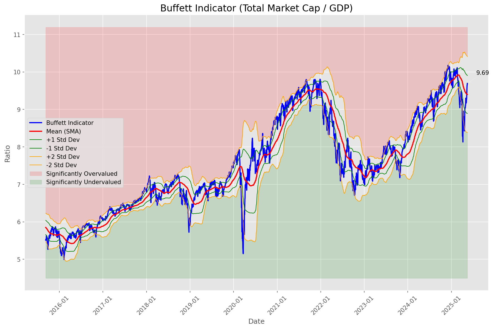
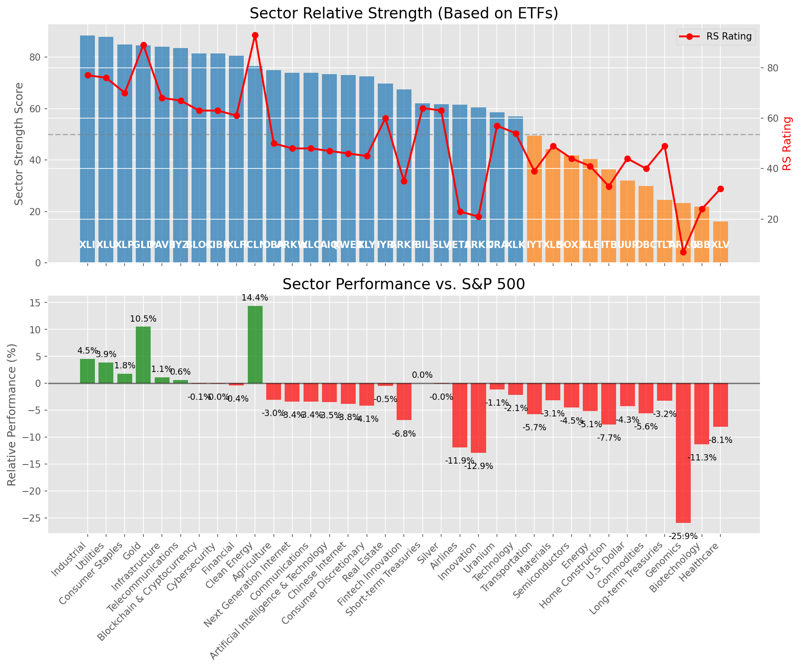

# **Daily Relative Strength Report**

**Date:** 2025-05-16

## **Market Valuation (Buffett Indicator)**

| Metric | Value |
|--------|-------|
| **Market Valuation** | **Fair Valued** |
| **Current Ratio** | 9.71 |
| **Historical Mean** | 9.40 |
| **Standard Deviation** | 0.50 |
| **Z-Score (StdDev from Mean)** | 0.58 |
| **Total Market Cap** | $291.10 trillion |
| **GDP** | $29.98 trillion |

## **Market Insights**

### **Market is Fairly Valued**

The market appears to be trading within a reasonable range of historical valuations. This suggests a balanced approach to equity investing is appropriate. Investors should:

- Focus on individual stock selection based on fundamentals and technicals
- Maintain normal equity allocations aligned with long-term goals
- Pay attention to sector rotation and relative strength
- Watch for changes in market leadership

Fair valuation typically suggests normal market returns can be expected, with stock selection becoming increasingly important.

### **Buffett Indicator Overview**

The Buffett Indicator (Total Market Cap / GDP) is a measure of the stock market's valuation relative to the size of the economy. It is named after Warren Buffett, who described it as "probably the best single measure of where valuations stand at any given moment."

- **Values above +2 standard deviations:** Market significantly overvalued
- **Values above +1 standard deviation:** Market overvalued
- **Values between -1 and +1 standard deviations:** Market fairly valued
- **Values below -1 standard deviation:** Market undervalued
- **Values below -2 standard deviations:** Market significantly undervalued

---

## **Sector Relative Strength**

Based on William O'Neil's Relative Strength Methodology

| ETF | Strength | RS Rating | Performance | Above Key MAs | Trend | Sector |
|-----|----------|-----------|-------------|--------------|-------|--------|
| [XLI](https://www.tradingview.com/chart/?symbol=XLI) | 88.5 | 77.0 | 3.48% | 10d ✓, 50d ✓, 200d ✓ | ↗️ | Industrial |
| [XLU](https://www.tradingview.com/chart/?symbol=XLU) | 87.0 | 74.0 | 2.49% | 10d ✓, 50d ✓, 200d ✓ | ↗️ | Utilities |
| [GLD](https://www.tradingview.com/chart/?symbol=GLD) | 85.1 | 90.0 | 10.22% | 10d ✗, 50d ✓, 200d ✓ | ↗️ | Gold |
| [XLP](https://www.tradingview.com/chart/?symbol=XLP) | 85.0 | 70.0 | 0.99% | 10d ✓, 50d ✓, 200d ✓ | ↗️ | Consumer Staples |
| [IYZ](https://www.tradingview.com/chart/?symbol=IYZ) | 84.0 | 68.0 | 0.64% | 10d ✓, 50d ✓, 200d ✓ | ↗️ | Telecommunications |
| [PAVE](https://www.tradingview.com/chart/?symbol=PAVE) | 83.5 | 67.0 | 0.24% | 10d ✓, 50d ✓, 200d ✓ | ↗️ | Infrastructure |
| [CIBR](https://www.tradingview.com/chart/?symbol=CIBR) | 81.0 | 62.0 | -0.43% | 10d ✓, 50d ✓, 200d ✓ | ↗️ | Cybersecurity |
| [XLF](https://www.tradingview.com/chart/?symbol=XLF) | 80.0 | 60.0 | -0.98% | 10d ✓, 50d ✓, 200d ✓ | ↗️ | Financial |
| [DBA](https://www.tradingview.com/chart/?symbol=DBA) | 78.0 | 56.0 | -2.04% | 10d ✓, 50d ✓, 200d ✓ | ↗️ | Agriculture |
| [ICLN](https://www.tradingview.com/chart/?symbol=ICLN) | 77.0 | 94.0 | 14.91% | 10d ✓, 50d ✓, 200d ✓ | ↘️ | Clean Energy |
| [ARKW](https://www.tradingview.com/chart/?symbol=ARKW) | 76.0 | 52.0 | -2.84% | 10d ✓, 50d ✓, 200d ✓ | ↗️ | Next Generation Internet |
| [AIQ](https://www.tradingview.com/chart/?symbol=AIQ) | 75.5 | 51.0 | -3.23% | 10d ✓, 50d ✓, 200d ✓ | ↗️ | Artificial Intelligence & Technology |
| [KWEB](https://www.tradingview.com/chart/?symbol=KWEB) | 75.5 | 51.0 | -3.20% | 10d ✓, 50d ✓, 200d ✓ | ↗️ | Chinese Internet |
| [BLOK](https://www.tradingview.com/chart/?symbol=BLOK) | 75.0 | 50.0 | -3.29% | 10d ✓, 50d ✓, 200d ✓ | ↗️ | Blockchain & Cryptocurrency |
| [XLC](https://www.tradingview.com/chart/?symbol=XLC) | 74.5 | 49.0 | -3.64% | 10d ✓, 50d ✓, 200d ✓ | ↗️ | Communications |
| [XLY](https://www.tradingview.com/chart/?symbol=XLY) | 72.0 | 44.0 | -4.80% | 10d ✓, 50d ✓, 200d ✓ | ↗️ | Consumer Discretionary |
| [IYR](https://www.tradingview.com/chart/?symbol=IYR) | 68.8 | 58.0 | -1.54% | 10d ✓, 50d ✓, 200d ✗ | ↗️ | Real Estate |
| [ARKF](https://www.tradingview.com/chart/?symbol=ARKF) | 68.5 | 37.0 | -7.13% | 10d ✓, 50d ✓, 200d ✓ | ↗️ | Fintech Innovation |
| [URA](https://www.tradingview.com/chart/?symbol=URA) | 63.5 | 67.0 | 0.29% | 10d ✓, 50d ✓, 200d ✓ | ↘️ | Uranium |
| [BIL](https://www.tradingview.com/chart/?symbol=BIL) | 63.0 | 66.0 | 0.02% | 10d ✓, 50d ✓, 200d ✓ | ↘️ | Short-term Treasuries |
| [SLV](https://www.tradingview.com/chart/?symbol=SLV) | 62.7 | 65.0 | -0.03% | 10d ✗, 50d ✗, 200d ✓ | ↗️ | Silver |
| [JETS](https://www.tradingview.com/chart/?symbol=JETS) | 61.0 | 22.0 | -12.48% | 10d ✓, 50d ✓, 200d ✓ | ↗️ | Airlines |
| [ARKK](https://www.tradingview.com/chart/?symbol=ARKK) | 60.0 | 20.0 | -13.91% | 10d ✓, 50d ✓, 200d ✓ | ↗️ | Innovation |
| [XLK](https://www.tradingview.com/chart/?symbol=XLK) | 57.5 | 55.0 | -2.37% | 10d ✓, 50d ✓, 200d ✓ | ↘️ | Technology |
| [IYT](https://www.tradingview.com/chart/?symbol=IYT) | 49.5 | 39.0 | -6.30% | 10d ✓, 50d ✓, 200d ✓ | ↘️ | Transportation |
| [XLB](https://www.tradingview.com/chart/?symbol=XLB) | 42.8 | 46.0 | -4.21% | 10d ✓, 50d ✓, 200d ✗ | ↘️ | Materials |
| [SOXX](https://www.tradingview.com/chart/?symbol=SOXX) | 42.3 | 45.0 | -4.72% | 10d ✓, 50d ✓, 200d ✗ | ↘️ | Semiconductors |
| [ITB](https://www.tradingview.com/chart/?symbol=ITB) | 35.8 | 32.0 | -8.76% | 10d ✓, 50d ✓, 200d ✗ | ↘️ | Home Construction |
| [UUP](https://www.tradingview.com/chart/?symbol=UUP) | 32.4 | 45.0 | -4.46% | 10d ✓, 50d ✗, 200d ✗ | ↘️ | U.S. Dollar |
| [DBC](https://www.tradingview.com/chart/?symbol=DBC) | 31.4 | 43.0 | -5.17% | 10d ✓, 50d ✗, 200d ✗ | ↘️ | Commodities |
| [XLE](https://www.tradingview.com/chart/?symbol=XLE) | 30.4 | 41.0 | -5.72% | 10d ✓, 50d ✗, 200d ✗ | ↘️ | Energy |
| [TLT](https://www.tradingview.com/chart/?symbol=TLT) | 26.5 | 53.0 | -2.78% | 10d ✗, 50d ✗, 200d ✗ | ↘️ | Long-term Treasuries |
| [XLV](https://www.tradingview.com/chart/?symbol=XLV) | 15.5 | 31.0 | -9.33% | 10d ✗, 50d ✗, 200d ✗ | ↘️ | Healthcare |
| [ARKG](https://www.tradingview.com/chart/?symbol=ARKG) | 12.9 | 6.0 | -27.36% | 10d ✓, 50d ✗, 200d ✗ | ↘️ | Genomics |
| [IBB](https://www.tradingview.com/chart/?symbol=IBB) | 11.5 | 23.0 | -12.34% | 10d ✗, 50d ✗, 200d ✗ | ↘️ | Biotechnology |

### **Sector ETF Performance Interpretation**

This table shows the relative strength metrics for different market sectors based on their representative ETFs:

- **ETF**: The ETF used to measure sector performance (click for chart)
- **Strength**: Overall sector strength score (0-100) combining multiple factors
- **RS Rating**: O'Neil RS rating of the sector ETF
- **Performance**: Performance of the sector ETF relative to SPY
- **Above Key MAs**: Whether the ETF is trading above its 10, 50, and 200-day moving averages
- **Trend**: Whether the sector is in an uptrend (↗️) or downtrend (↘️)

### **Current Sector Leadership**

The current market leadership is coming from the following sectors: **Industrial, Utilities, Gold**.

The **Industrial** sector (represented by **XLI**) is showing particularly strong relative strength with an RS rating of 77.0 and performance of 3.48% vs. the S&P 500. This sector is trading above its 10-day, 50-day, 200-day moving average(s). Investors should consider focusing on high RS stocks within these leading sectors for potential outperformance.

---

## **Buy Recommendations**

The following 73 stocks show exceptional relative strength:

| RS Rating | Buy Score | Current Price | Chart | Name | Ticker |
|-----------|-----------|---------------|-------|------|--------|
| 100 | 100 | $93.51 | [Chart](https://www.tradingview.com/chart/?symbol=SEZL) | Sezzle Inc. Common Stock | SEZL |
| 100 | 100 | $19.58 | [Chart](https://www.tradingview.com/chart/?symbol=SPNT) | SiriusPoint Ltd. | SPNT |
| 100 | 100 | $131.21 | [Chart](https://www.tradingview.com/chart/?symbol=VSEC) | VSE Corp | VSEC |
| 100 | 100 | $27.90 | [Chart](https://www.tradingview.com/chart/?symbol=DB) | Deutsche Bank Aktiengesellschaft | DB |
| 100 | 100 | $42.31 | [Chart](https://www.tradingview.com/chart/?symbol=FARO) | Faro Technologies Inc | FARO |
| 100 | 100 | $183.85 | [Chart](https://www.tradingview.com/chart/?symbol=DAVE) | Dave Inc. Class A Common Stock | DAVE |
| 100 | 100 | $46.34 | [Chart](https://www.tradingview.com/chart/?symbol=EXEL) | Exelixis Inc | EXEL |
| 100 | 100 | $154.73 | [Chart](https://www.tradingview.com/chart/?symbol=NRG) | NRG Energy, Inc. | NRG |
| 100 | 100 | $23.14 | [Chart](https://www.tradingview.com/chart/?symbol=PRA) | ProAssurance Corporation | PRA |
| 99 | 100 | $136.58 | [Chart](https://www.tradingview.com/chart/?symbol=COOP) | Mr. Cooper Group Inc. Common Stock | COOP |
| 99 | 100 | $24.20 | [Chart](https://www.tradingview.com/chart/?symbol=CRK) | Comstock Resources, Inc. | CRK |
| 99 | 100 | $39.89 | [Chart](https://www.tradingview.com/chart/?symbol=PAY) | Paymentus Holdings, Inc. | PAY |
| 98 | 100 | $156.89 | [Chart](https://www.tradingview.com/chart/?symbol=PLMR) | Palomar Holdings, Inc. Common stock | PLMR |
| 98 | 100 | $130.40 | [Chart](https://www.tradingview.com/chart/?symbol=ATGE) | Adtalem Global Education Inc. Common Shares | ATGE |
| 98 | 100 | $81.84 | [Chart](https://www.tradingview.com/chart/?symbol=RBLX) | Roblox Corporation | RBLX |
| 98 | 100 | $281.88 | [Chart](https://www.tradingview.com/chart/?symbol=VRSN) | VeriSign Inc | VRSN |
| 98 | 100 | $530.42 | [Chart](https://www.tradingview.com/chart/?symbol=DUOL) | Duolingo, Inc. Class A Common Stock | DUOL |
| 98 | 100 | $33.73 | [Chart](https://www.tradingview.com/chart/?symbol=UTI) | Universal Technical Institute, Inc. | UTI |
| 98 | 100 | $34.85 | [Chart](https://www.tradingview.com/chart/?symbol=AHR) | American Healthcare REIT, Inc. | AHR |
| 98 | 100 | $71.05 | [Chart](https://www.tradingview.com/chart/?symbol=ULS) | UL Solutions Inc. | ULS |
| 97 | 100 | $41.76 | [Chart](https://www.tradingview.com/chart/?symbol=EWP) | iShares MSCI Spain ETF | EWP |
| 97 | 100 | $228.44 | [Chart](https://www.tradingview.com/chart/?symbol=CRS) | Carpenter Technology Corp | CRS |
| 97 | 100 | $119.77 | [Chart](https://www.tradingview.com/chart/?symbol=EHC) | Encompass Health Corporation Common Stock | EHC |
| 97 | 100 | $152.14 | [Chart](https://www.tradingview.com/chart/?symbol=CAH) | Cardinal Health, Inc. | CAH |
| 97 | 100 | $163.31 | [Chart](https://www.tradingview.com/chart/?symbol=SE) | Sea Limited American Depositary Shares, each representing one Class A Ordinary Share | SE |
| 97 | 100 | $161.09 | [Chart](https://www.tradingview.com/chart/?symbol=HWM) | Howmet Aerospace Inc. | HWM |
| 96 | 100 | $28.40 | [Chart](https://www.tradingview.com/chart/?symbol=FMS) | Fresenius Medical Care AG | FMS |
| 96 | 100 | $17.48 | [Chart](https://www.tradingview.com/chart/?symbol=BCS) | Barclays PLC | BCS |
| 96 | 100 | $31.18 | [Chart](https://www.tradingview.com/chart/?symbol=EUFN) | iShares MSCI Europe Financials ETF | EUFN |
| 96 | 100 | $31.34 | [Chart](https://www.tradingview.com/chart/?symbol=TGS) | Transportadora de Gas del Sur S.A. ADS | TGS |
| 95 | 100 | $129.47 | [Chart](https://www.tradingview.com/chart/?symbol=HIG) | The Hartford Insurance Group, Inc. | HIG |
| 94 | 100 | $319.85 | [Chart](https://www.tradingview.com/chart/?symbol=PODD) | Insulet Corporation | PODD |
| 94 | 100 | $144.94 | [Chart](https://www.tradingview.com/chart/?symbol=TW) | Tradeweb Markets Inc. Class A Common Stock | TW |
| 93 | 100 | $85.47 | [Chart](https://www.tradingview.com/chart/?symbol=TGLS) | Tecnoglass Inc. | TGLS |
| 93 | 100 | $208.52 | [Chart](https://www.tradingview.com/chart/?symbol=BAP) | Credicorp LTD | BAP |
| 93 | 100 | $1193.54 | [Chart](https://www.tradingview.com/chart/?symbol=NFLX) | NetFlix Inc | NFLX |
| 92 | 100 | $40.85 | [Chart](https://www.tradingview.com/chart/?symbol=EWG) | iShares MSCI Germany ETF | EWG |
| 92 | 100 | $45.20 | [Chart](https://www.tradingview.com/chart/?symbol=TOST) | Toast, Inc. | TOST |
| 92 | 100 | $42.96 | [Chart](https://www.tradingview.com/chart/?symbol=FHI) | Federated Hermes, Inc. | FHI |
| 92 | 100 | $25.19 | [Chart](https://www.tradingview.com/chart/?symbol=BSAC) | Banco Santander-Chile | BSAC |
| 92 | 100 | $86.36 | [Chart](https://www.tradingview.com/chart/?symbol=RBRK) | Rubrik, Inc. | RBRK |
| 91 | 100 | $33.40 | [Chart](https://www.tradingview.com/chart/?symbol=SLM) | SLM Corporation | SLM |
| 91 | 100 | $231.25 | [Chart](https://www.tradingview.com/chart/?symbol=TTWO) | Take-Two Interactive Software Inc | TTWO |
| 91 | 100 | $106.96 | [Chart](https://www.tradingview.com/chart/?symbol=RBA) | RB Global, Inc. | RBA |
| 90 | 100 | $24.29 | [Chart](https://www.tradingview.com/chart/?symbol=BTSG) | BrightSpring Health Services, Inc. Common Stock | BTSG |
| 90 | 100 | $31.22 | [Chart](https://www.tradingview.com/chart/?symbol=PRDO) | Perdoceo Education Corporation | PRDO |
| 90 | 100 | $53.70 | [Chart](https://www.tradingview.com/chart/?symbol=EPR) | EPR Properties | EPR |
| 90 | 100 | $229.27 | [Chart](https://www.tradingview.com/chart/?symbol=GE) | GE Aerospace | GE |
| 89 | 100 | $209.95 | [Chart](https://www.tradingview.com/chart/?symbol=DRI) | Darden Restaurants, Inc. | DRI |
| 89 | 100 | $95.98 | [Chart](https://www.tradingview.com/chart/?symbol=HEES) | H&E Equipment Services, Inc. | HEES |
| 89 | 100 | $526.96 | [Chart](https://www.tradingview.com/chart/?symbol=DE) | Deere & Company | DE |
| 89 | 100 | $728.39 | [Chart](https://www.tradingview.com/chart/?symbol=AXON) | Axon Enterprise, Inc. Common Stock | AXON |
| 88 | 100 | $42.44 | [Chart](https://www.tradingview.com/chart/?symbol=BTI) | British American Tobacco p.l.c. American Depositary Shares, American Depositary Shares, each representing one Ordinary Share | BTI |
| 88 | 100 | $24.21 | [Chart](https://www.tradingview.com/chart/?symbol=SRAD) | Sportradar Group AG Class A Ordinary Shares | SRAD |
| 87 | 100 | $25.59 | [Chart](https://www.tradingview.com/chart/?symbol=EWS) | iShares MSCI Singapore ETF | EWS |
| 89 | 99 | $170.67 | [Chart](https://www.tradingview.com/chart/?symbol=ITA) | iShares U.S. Aerospace & Defense ETF | ITA |
| 85 | 98 | $128.14 | [Chart](https://www.tradingview.com/chart/?symbol=PLTR) | Palantir Technologies Inc. Class A Common Stock | PLTR |
| 88 | 97 | $196.83 | [Chart](https://www.tradingview.com/chart/?symbol=GPOR) | Gulfport Energy Corporation | GPOR |
| 85 | 97 | $195.74 | [Chart](https://www.tradingview.com/chart/?symbol=LOPE) | Grand Canyon Education, Inc | LOPE |
| 82 | 97 | $27.41 | [Chart](https://www.tradingview.com/chart/?symbol=T) | AT&T Inc. | T |
| 87 | 96 | $22.29 | [Chart](https://www.tradingview.com/chart/?symbol=KAR) | OPENLANE, Inc | KAR |
| 84 | 96 | $58.72 | [Chart](https://www.tradingview.com/chart/?symbol=HSBC) | HSBC Holdings PLC | HSBC |
| 84 | 95 | $68.16 | [Chart](https://www.tradingview.com/chart/?symbol=CTVA) | Corteva, Inc. Common Stock | CTVA |
| 84 | 94 | $58.11 | [Chart](https://www.tradingview.com/chart/?symbol=IGF) | iShares Global Infrastructure ETF | IGF |
| 81 | 94 | $88.81 | [Chart](https://www.tradingview.com/chart/?symbol=L) | Loews Corporation | L |
| 84 | 93 | $59.01 | [Chart](https://www.tradingview.com/chart/?symbol=IBIT) | iShares Bitcoin Trust ETF | IBIT |
| 81 | 93 | $30.05 | [Chart](https://www.tradingview.com/chart/?symbol=NTGR) | NETGEAR, Inc. | NTGR |
| 82 | 92 | $13.58 | [Chart](https://www.tradingview.com/chart/?symbol=CNH) | CNH INDUSTRIAL N.V. | CNH |
| 81 | 92 | $136.10 | [Chart](https://www.tradingview.com/chart/?symbol=DTE) | DTE Energy Company | DTE |
| 81 | 91 | $13.50 | [Chart](https://www.tradingview.com/chart/?symbol=MUFG) | Mitsubishi UFJ Financial Group, Inc. | MUFG |
| 80 | 91 | $49.89 | [Chart](https://www.tradingview.com/chart/?symbol=TRP) | TC Energy Corporation | TRP |
| 80 | 90 | $33.92 | [Chart](https://www.tradingview.com/chart/?symbol=RPRX) | Royalty Pharma plc Class A Ordinary Shares | RPRX |
| 80 | 90 | $175.22 | [Chart](https://www.tradingview.com/chart/?symbol=ICE) | Intercontinental Exchange  Inc. | ICE |

---

## **Sell Recommendations**

The following 78 stocks show deteriorating relative strength:

| RS Rating | Sell Score | Current Price | Chart | Name | Ticker |
|-----------|------------|---------------|-------|------|--------|
| 1 | 100 | $10.18 | [Chart](https://www.tradingview.com/chart/?symbol=NRIX) | Nurix Therapeutics, Inc. Common stock | NRIX |
| 2 | 100 | $10.05 | [Chart](https://www.tradingview.com/chart/?symbol=WNC) | Wabash National Corp. | WNC |
| 2 | 100 | $23.27 | [Chart](https://www.tradingview.com/chart/?symbol=JANX) | Janux Therapeutics, Inc. Common Stock | JANX |
| 3 | 100 | $12.02 | [Chart](https://www.tradingview.com/chart/?symbol=LBRT) | Liberty Energy Inc. | LBRT |
| 3 | 100 | $14.16 | [Chart](https://www.tradingview.com/chart/?symbol=DNLI) | Denali Therapeutics Inc. Common Stock | DNLI |
| 3 | 100 | $30.10 | [Chart](https://www.tradingview.com/chart/?symbol=TWST) | Twist Bioscience Corporation Common Stock | TWST |
| 3 | 100 | $30.34 | [Chart](https://www.tradingview.com/chart/?symbol=CYTK) | Cytokinetics Inc. | CYTK |
| 3 | 100 | $10.22 | [Chart](https://www.tradingview.com/chart/?symbol=HPK) | HighPeak Energy, Inc. Common Stock | HPK |
| 4 | 100 | $18.09 | [Chart](https://www.tradingview.com/chart/?symbol=VRNT) | Verint Systems Inc | VRNT |
| 5 | 100 | $27.82 | [Chart](https://www.tradingview.com/chart/?symbol=SRDX) | Surmodics, Inc. Common Stock | SRDX |
| 5 | 100 | $13.92 | [Chart](https://www.tradingview.com/chart/?symbol=IMVT) | Immunovant, Inc. Common Stock | IMVT |
| 8 | 100 | $126.49 | [Chart](https://www.tradingview.com/chart/?symbol=TFX) | Teleflex Incorporated | TFX |
| 9 | 100 | $21.11 | [Chart](https://www.tradingview.com/chart/?symbol=UCO) | ProShares Ultra Bloomberg Crude Oil | UCO |
| 10 | 100 | $21.52 | [Chart](https://www.tradingview.com/chart/?symbol=VERA) | Vera Therapeutics, Inc. Class A Common Stock | VERA |
| 13 | 100 | $47.19 | [Chart](https://www.tradingview.com/chart/?symbol=RHI) | Robert Half Inc. | RHI |
| 16 | 100 | $10.34 | [Chart](https://www.tradingview.com/chart/?symbol=CMRE) | Costamare Inc. | CMRE |
| 17 | 100 | $47.30 | [Chart](https://www.tradingview.com/chart/?symbol=LINE) | Lineage, Inc. Common Stock | LINE |
| 18 | 100 | $18.35 | [Chart](https://www.tradingview.com/chart/?symbol=NVDS) | Investment Managers Series Trust II Tradr 1.5X Short NVDA Daily ETF | NVDS |
| 21 | 100 | $95.88 | [Chart](https://www.tradingview.com/chart/?symbol=CHRD) | Chord Energy Corporation Common Stock | CHRD |
| 6 | 99 | $10.31 | [Chart](https://www.tradingview.com/chart/?symbol=VREX) | Varex Imaging Corporation Common Stock | VREX |
| 6 | 99 | $21.37 | [Chart](https://www.tradingview.com/chart/?symbol=ARKG) | ARK Genomic Revolution ETF | ARKG |
| 8 | 99 | $27.71 | [Chart](https://www.tradingview.com/chart/?symbol=LEGN) | Legend Biotech Corporation American Depositary Shares | LEGN |
| 7 | 98 | $12.62 | [Chart](https://www.tradingview.com/chart/?symbol=VRDN) | Viridian Therapeutics, Inc. Common Stock | VRDN |
| 7 | 98 | $21.18 | [Chart](https://www.tradingview.com/chart/?symbol=AMRK) | A-Mark Precious Metals, Inc. | AMRK |
| 18 | 98 | $35.30 | [Chart](https://www.tradingview.com/chart/?symbol=SLB) | Schlumberger Limited | SLB |
| 19 | 98 | $28.41 | [Chart](https://www.tradingview.com/chart/?symbol=AGIO) | Agios Pharmaceuticals, Inc. | AGIO |
| 5 | 97 | $10.67 | [Chart](https://www.tradingview.com/chart/?symbol=LSPD) | Lightspeed Commerce Inc. | LSPD |
| 8 | 97 | $15.43 | [Chart](https://www.tradingview.com/chart/?symbol=DXC) | DXC Technology Company | DXC |
| 16 | 97 | $13.27 | [Chart](https://www.tradingview.com/chart/?symbol=ZUMZ) | Zumiez Inc. | ZUMZ |
| 13 | 95 | $229.05 | [Chart](https://www.tradingview.com/chart/?symbol=OIH) | VanEck Oil Services ETF | OIH |
| 9 | 94 | $119.12 | [Chart](https://www.tradingview.com/chart/?symbol=BLDR) | Builders FirstSource, Inc. | BLDR |
| 10 | 94 | $58.18 | [Chart](https://www.tradingview.com/chart/?symbol=BOIL) | ProShares Ultra Bloomberg Natural Gas | BOIL |
| 10 | 94 | $14.68 | [Chart](https://www.tradingview.com/chart/?symbol=INMD) | InMode Ltd. Ordinary Shares | INMD |
| 14 | 94 | $15.85 | [Chart](https://www.tradingview.com/chart/?symbol=AMZY) | YieldMax AMZN Option Income Strategy ETF | AMZY |
| 27 | 94 | $10.26 | [Chart](https://www.tradingview.com/chart/?symbol=LBTYK) | Liberty Global Ltd. Class C Common Shares | LBTYK |
| 8 | 93 | $10.15 | [Chart](https://www.tradingview.com/chart/?symbol=HLIT) | Harmonic Inc | HLIT |
| 10 | 91 | $12.02 | [Chart](https://www.tradingview.com/chart/?symbol=APLE) | Apple Hospitality REIT, Inc. | APLE |
| 12 | 91 | $34.84 | [Chart](https://www.tradingview.com/chart/?symbol=RARE) | Ultragenyx Pharmaceutical Inc. | RARE |
| 15 | 91 | $10.06 | [Chart](https://www.tradingview.com/chart/?symbol=MTAL) | MAC Copper Limited | MTAL |
| 12 | 89 | $34.07 | [Chart](https://www.tradingview.com/chart/?symbol=TECS) | Direxion Daily Technology Bear 3x Shares | TECS |
| 15 | 89 | $16.40 | [Chart](https://www.tradingview.com/chart/?symbol=CHCT) | Community Healthcare Trust Incorporated Common Stock, $0.01 par value per share | CHCT |
| 18 | 89 | $11.19 | [Chart](https://www.tradingview.com/chart/?symbol=PBR.A) | Petroleo Brasileiro S.A.-Petrobras | PBR.A |
| 21 | 88 | $52.45 | [Chart](https://www.tradingview.com/chart/?symbol=ERX) | Direxion Daily Energy Bull 2X Shares | ERX |
| 17 | 87 | $36.98 | [Chart](https://www.tradingview.com/chart/?symbol=OVV) | Ovintiv Inc. | OVV |
| 27 | 87 | $20.40 | [Chart](https://www.tradingview.com/chart/?symbol=BITI) | ProShares Short Bitcoin ETF | BITI |
| 28 | 87 | $25.36 | [Chart](https://www.tradingview.com/chart/?symbol=RCI) | Rogers Communications, Inc. | RCI |
| 21 | 85 | $11.22 | [Chart](https://www.tradingview.com/chart/?symbol=NEWT) | NewtekOne, Inc. Common Stock | NEWT |
| 30 | 85 | $35.75 | [Chart](https://www.tradingview.com/chart/?symbol=SU) | Suncor Energy, Inc. | SU |
| 23 | 84 | $71.00 | [Chart](https://www.tradingview.com/chart/?symbol=NUVL) | Nuvalent, Inc. Class A Common Stock | NUVL |
| 20 | 83 | $37.66 | [Chart](https://www.tradingview.com/chart/?symbol=MLTX) | MoonLake Immunotherapeutics Class A Ordinary Shares | MLTX |
| 24 | 82 | $10.10 | [Chart](https://www.tradingview.com/chart/?symbol=CION) | CION Investment Corporation | CION |
| 27 | 81 | $76.39 | [Chart](https://www.tradingview.com/chart/?symbol=IFF) | International Flavors & Fragrances Inc. | IFF |
| 28 | 81 | $140.31 | [Chart](https://www.tradingview.com/chart/?symbol=FANG) | Diamondback Energy, Inc. | FANG |
| 31 | 81 | $58.73 | [Chart](https://www.tradingview.com/chart/?symbol=BMRN) | BioMarin Pharmaceuticals Inc | BMRN |
| 22 | 80 | $35.08 | [Chart](https://www.tradingview.com/chart/?symbol=SQM) | Sociedad Quimica y Minera de Chile SA | SQM |
| 25 | 80 | $31.21 | [Chart](https://www.tradingview.com/chart/?symbol=CRNX) | Crinetics Pharmaceuticals, Inc. | CRNX |
| 26 | 80 | $52.00 | [Chart](https://www.tradingview.com/chart/?symbol=LW) | Lamb Weston Holdings, Inc. | LW |
| 32 | 79 | $35.15 | [Chart](https://www.tradingview.com/chart/?symbol=CPB) | The Campbell's Company Common Stock | CPB |
| 27 | 78 | $26.38 | [Chart](https://www.tradingview.com/chart/?symbol=WY) | Weyerhaeuser Company | WY |
| 27 | 78 | $14.79 | [Chart](https://www.tradingview.com/chart/?symbol=HR) | Healthcare Realty Trust Incorporated | HR |
| 29 | 78 | $14.14 | [Chart](https://www.tradingview.com/chart/?symbol=OCSL) | Oaktree Specialty Lending Corporation | OCSL |
| 30 | 78 | $13.70 | [Chart](https://www.tradingview.com/chart/?symbol=BSM) | Black Stone Minerals, L.P. | BSM |
| 27 | 77 | $27.42 | [Chart](https://www.tradingview.com/chart/?symbol=BNO) | United States Brent Oil Fund, LP | BNO |
| 28 | 77 | $110.73 | [Chart](https://www.tradingview.com/chart/?symbol=LEN) | Lennar Corporation Class A | LEN |
| 37 | 77 | $89.64 | [Chart](https://www.tradingview.com/chart/?symbol=SCCO) | Southern Copper Corporation | SCCO |
| 27 | 76 | $115.25 | [Chart](https://www.tradingview.com/chart/?symbol=EOG) | EOG Resources, Inc. | EOG |
| 30 | 76 | $10.50 | [Chart](https://www.tradingview.com/chart/?symbol=SCS) | Steelcase, Inc. | SCS |
| 33 | 75 | $134.18 | [Chart](https://www.tradingview.com/chart/?symbol=HES) | Hess Corporation | HES |
| 35 | 73 | $67.70 | [Chart](https://www.tradingview.com/chart/?symbol=MTH) | Meritage Homes Corporation | MTH |
| 30 | 72 | $10.75 | [Chart](https://www.tradingview.com/chart/?symbol=AVO) | Mission Produce, Inc. Common Stock | AVO |
| 32 | 71 | $141.32 | [Chart](https://www.tradingview.com/chart/?symbol=CVX) | Chevron Corporation | CVX |
| 39 | 71 | $10.68 | [Chart](https://www.tradingview.com/chart/?symbol=NMFC) | NEW MOUNTAIN FINANCE CORPORATION | NMFC |
| 37 | 67 | $10.51 | [Chart](https://www.tradingview.com/chart/?symbol=NMZ) | Nuveen Municipal High Income Opportunity Fund | NMZ |
| 39 | 67 | $19.44 | [Chart](https://www.tradingview.com/chart/?symbol=SPTN) | SpartanNash Company | SPTN |
| 39 | 66 | $12.74 | [Chart](https://www.tradingview.com/chart/?symbol=PDBC) | Invesco Actively Managed Exch-Traded Commodity Fd Tr Invesco Optimum Yield Diversified Commodity Strategy No K-1 ETF | PDBC |
| 37 | 65 | $12.79 | [Chart](https://www.tradingview.com/chart/?symbol=PCN) | PIMCO Corporate & Income Strategy Fund | PCN |
| 39 | 65 | $18.77 | [Chart](https://www.tradingview.com/chart/?symbol=ZTO) | ZTO Express (Cayman) Inc. American Depositary Shares, each representing one Class A ordinary share | ZTO |
| 39 | 63 | $110.39 | [Chart](https://www.tradingview.com/chart/?symbol=MHO) | M/I Homes, Inc. | MHO |

## **Methodology**

This report uses William O'Neil's relative strength methodology from Investors Business Daily:

* **RS Rating**: Percentile rank of stock's performance vs. S&P 500 over the past 63 trading days (1-99 scale)
* **Buy Criteria**: RS Rating >= 80, price above 50-day MA, strong uptrend, increasing volume
* **Sell Criteria**: RS Rating < 40, price below 50-day MA, downtrend, decreasing volume

### **O'Neil's Key Principles**

1. **Focus on relative performance** - stocks outperforming the market
2. **Price trend confirmation** - stock must be in an uptrend
3. **Volume confirmation** - strong volume supports price moves
4. **Moving average validation** - price above key moving averages
5. **Market leaders only** - concentrate on top-performing stocks

*Report generated automatically after market close*