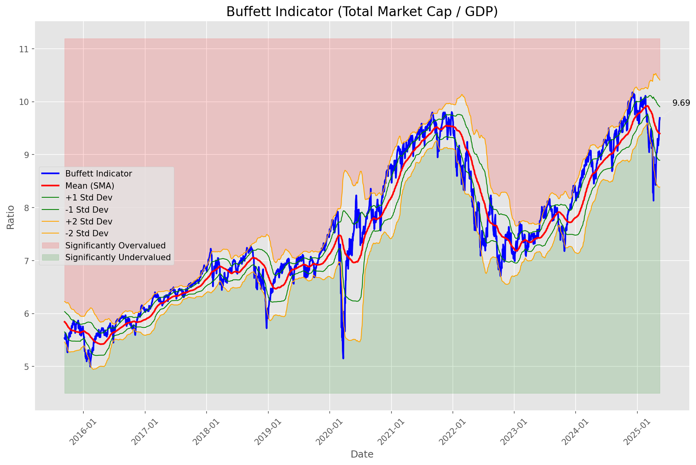
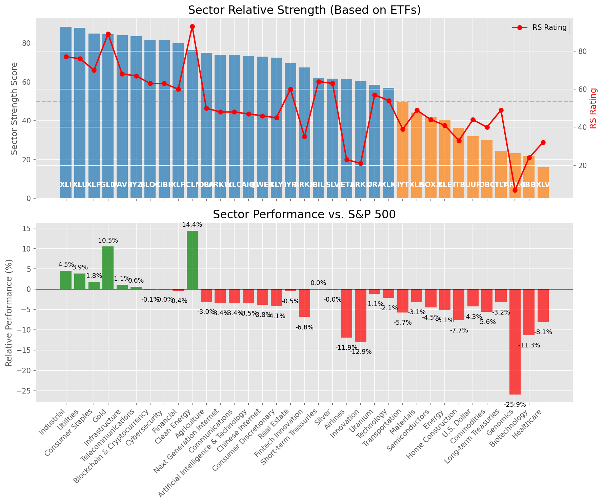

# **Daily Relative Strength Report**

**Date:** 2025-05-17

## **Market Valuation (Buffett Indicator)**

| Metric | Value |
|--------|-------|
| **Market Valuation** | **Fair Valued** |
| **Current Ratio** | 9.76 |
| **Historical Mean** | 9.40 |
| **Standard Deviation** | 0.50 |
| **Z-Score (StdDev from Mean)** | 0.58 |
| **Total Market Cap** | $292.58 trillion |
| **GDP** | $29.98 trillion |

## **Market Insights**

### **Market is Fairly Valued**

The market appears to be trading within a reasonable range of historical valuations. This suggests a balanced approach to equity investing is appropriate. Investors should:

- Focus on individual stock selection based on fundamentals and technicals
- Maintain normal equity allocations aligned with long-term goals
- Pay attention to sector rotation and relative strength
- Watch for changes in market leadership

Fair valuation typically suggests normal market returns can be expected, with stock selection becoming increasingly important.

### **Buffett Indicator Overview**

The Buffett Indicator (Total Market Cap / GDP) is a measure of the stock market's valuation relative to the size of the economy. It is named after Warren Buffett, who described it as "probably the best single measure of where valuations stand at any given moment."

- **Values above +2 standard deviations:** Market significantly overvalued
- **Values above +1 standard deviation:** Market overvalued
- **Values between -1 and +1 standard deviations:** Market fairly valued
- **Values below -1 standard deviation:** Market undervalued
- **Values below -2 standard deviations:** Market significantly undervalued

---

## **Sector Relative Strength**

Based on William O'Neil's Relative Strength Methodology

| ETF | Strength | RS Rating | Performance | Above Key MAs | Trend | Sector |
|-----|----------|-----------|-------------|--------------|-------|--------|
| [XLI](https://www.tradingview.com/chart/?symbol=XLI) | 88.5 | 77.0 | 4.53% | 10d ✓, 50d ✓, 200d ✓ | ↗️ | Industrial |
| [XLU](https://www.tradingview.com/chart/?symbol=XLU) | 88.0 | 76.0 | 3.89% | 10d ✓, 50d ✓, 200d ✓ | ↗️ | Utilities |
| [XLP](https://www.tradingview.com/chart/?symbol=XLP) | 85.0 | 70.0 | 1.81% | 10d ✓, 50d ✓, 200d ✓ | ↗️ | Consumer Staples |
| [GLD](https://www.tradingview.com/chart/?symbol=GLD) | 84.6 | 89.0 | 10.50% | 10d ✗, 50d ✓, 200d ✓ | ↗️ | Gold |
| [PAVE](https://www.tradingview.com/chart/?symbol=PAVE) | 84.0 | 68.0 | 1.15% | 10d ✓, 50d ✓, 200d ✓ | ↗️ | Infrastructure |
| [IYZ](https://www.tradingview.com/chart/?symbol=IYZ) | 83.5 | 67.0 | 0.63% | 10d ✓, 50d ✓, 200d ✓ | ↗️ | Telecommunications |
| [BLOK](https://www.tradingview.com/chart/?symbol=BLOK) | 81.5 | 63.0 | -0.08% | 10d ✓, 50d ✓, 200d ✓ | ↗️ | Blockchain & Cryptocurrency |
| [CIBR](https://www.tradingview.com/chart/?symbol=CIBR) | 81.5 | 63.0 | -0.04% | 10d ✓, 50d ✓, 200d ✓ | ↗️ | Cybersecurity |
| [XLF](https://www.tradingview.com/chart/?symbol=XLF) | 80.0 | 60.0 | -0.41% | 10d ✓, 50d ✓, 200d ✓ | ↗️ | Financial |
| [ICLN](https://www.tradingview.com/chart/?symbol=ICLN) | 76.5 | 93.0 | 14.39% | 10d ✓, 50d ✓, 200d ✓ | ↘️ | Clean Energy |
| [DBA](https://www.tradingview.com/chart/?symbol=DBA) | 75.0 | 50.0 | -3.02% | 10d ✓, 50d ✓, 200d ✓ | ↗️ | Agriculture |
| [XLC](https://www.tradingview.com/chart/?symbol=XLC) | 74.0 | 48.0 | -3.35% | 10d ✓, 50d ✓, 200d ✓ | ↗️ | Communications |
| [ARKW](https://www.tradingview.com/chart/?symbol=ARKW) | 74.0 | 48.0 | -3.35% | 10d ✓, 50d ✓, 200d ✓ | ↗️ | Next Generation Internet |
| [AIQ](https://www.tradingview.com/chart/?symbol=AIQ) | 73.5 | 47.0 | -3.49% | 10d ✓, 50d ✓, 200d ✓ | ↗️ | Artificial Intelligence & Technology |
| [KWEB](https://www.tradingview.com/chart/?symbol=KWEB) | 73.0 | 46.0 | -3.79% | 10d ✓, 50d ✓, 200d ✓ | ↗️ | Chinese Internet |
| [XLY](https://www.tradingview.com/chart/?symbol=XLY) | 72.5 | 45.0 | -4.11% | 10d ✓, 50d ✓, 200d ✓ | ↗️ | Consumer Discretionary |
| [IYR](https://www.tradingview.com/chart/?symbol=IYR) | 69.8 | 60.0 | -0.46% | 10d ✓, 50d ✓, 200d ✗ | ↗️ | Real Estate |
| [ARKF](https://www.tradingview.com/chart/?symbol=ARKF) | 67.5 | 35.0 | -6.84% | 10d ✓, 50d ✓, 200d ✓ | ↗️ | Fintech Innovation |
| [BIL](https://www.tradingview.com/chart/?symbol=BIL) | 62.0 | 64.0 | 0.02% | 10d ✓, 50d ✓, 200d ✓ | ↘️ | Short-term Treasuries |
| [SLV](https://www.tradingview.com/chart/?symbol=SLV) | 61.7 | 63.0 | -0.03% | 10d ✗, 50d ✗, 200d ✓ | ↗️ | Silver |
| [JETS](https://www.tradingview.com/chart/?symbol=JETS) | 61.5 | 23.0 | -11.89% | 10d ✓, 50d ✓, 200d ✓ | ↗️ | Airlines |
| [ARKK](https://www.tradingview.com/chart/?symbol=ARKK) | 60.5 | 21.0 | -12.91% | 10d ✓, 50d ✓, 200d ✓ | ↗️ | Innovation |
| [URA](https://www.tradingview.com/chart/?symbol=URA) | 58.5 | 57.0 | -1.14% | 10d ✓, 50d ✓, 200d ✓ | ↘️ | Uranium |
| [XLK](https://www.tradingview.com/chart/?symbol=XLK) | 57.0 | 54.0 | -2.12% | 10d ✓, 50d ✓, 200d ✓ | ↘️ | Technology |
| [IYT](https://www.tradingview.com/chart/?symbol=IYT) | 49.5 | 39.0 | -5.72% | 10d ✓, 50d ✓, 200d ✓ | ↘️ | Transportation |
| [XLB](https://www.tradingview.com/chart/?symbol=XLB) | 44.3 | 49.0 | -3.12% | 10d ✓, 50d ✓, 200d ✗ | ↘️ | Materials |
| [SOXX](https://www.tradingview.com/chart/?symbol=SOXX) | 41.8 | 44.0 | -4.46% | 10d ✓, 50d ✓, 200d ✗ | ↘️ | Semiconductors |
| [XLE](https://www.tradingview.com/chart/?symbol=XLE) | 40.3 | 41.0 | -5.10% | 10d ✓, 50d ✓, 200d ✗ | ↘️ | Energy |
| [ITB](https://www.tradingview.com/chart/?symbol=ITB) | 36.3 | 33.0 | -7.66% | 10d ✓, 50d ✓, 200d ✗ | ↘️ | Home Construction |
| [UUP](https://www.tradingview.com/chart/?symbol=UUP) | 31.9 | 44.0 | -4.26% | 10d ✓, 50d ✗, 200d ✗ | ↘️ | U.S. Dollar |
| [DBC](https://www.tradingview.com/chart/?symbol=DBC) | 29.9 | 40.0 | -5.57% | 10d ✓, 50d ✗, 200d ✗ | ↘️ | Commodities |
| [TLT](https://www.tradingview.com/chart/?symbol=TLT) | 24.5 | 49.0 | -3.20% | 10d ✗, 50d ✗, 200d ✗ | ↘️ | Long-term Treasuries |
| [ARKG](https://www.tradingview.com/chart/?symbol=ARKG) | 23.3 | 7.0 | -25.90% | 10d ✓, 50d ✓, 200d ✗ | ↘️ | Genomics |
| [IBB](https://www.tradingview.com/chart/?symbol=IBB) | 21.9 | 24.0 | -11.27% | 10d ✓, 50d ✗, 200d ✗ | ↘️ | Biotechnology |
| [XLV](https://www.tradingview.com/chart/?symbol=XLV) | 16.0 | 32.0 | -8.09% | 10d ✗, 50d ✗, 200d ✗ | ↘️ | Healthcare |

### **Sector ETF Performance Interpretation**

This table shows the relative strength metrics for different market sectors based on their representative ETFs:

- **ETF**: The ETF used to measure sector performance (click for chart)
- **Strength**: Overall sector strength score (0-100) combining multiple factors
- **RS Rating**: O'Neil RS rating of the sector ETF
- **Performance**: Performance of the sector ETF relative to SPY
- **Above Key MAs**: Whether the ETF is trading above its 10, 50, and 200-day moving averages
- **Trend**: Whether the sector is in an uptrend (↗️) or downtrend (↘️)

### **Current Sector Leadership**

The current market leadership is coming from the following sectors: **Industrial, Utilities, Consumer Staples**.

The **Industrial** sector (represented by **XLI**) is showing particularly strong relative strength with an RS rating of 77.0 and performance of 4.53% vs. the S&P 500. This sector is trading above its 10-day, 50-day, 200-day moving average(s). Investors should consider focusing on high RS stocks within these leading sectors for potential outperformance.

---

## **Buy Recommendations**

The following 92 stocks show exceptional relative strength:

| RS Rating | Buy Score | Current Price | Chart | Name | Ticker |
|-----------|-----------|---------------|-------|------|--------|
| 100 | 100 | $27.87 | [Chart](https://www.tradingview.com/chart/?symbol=DB) | Deutsche Bank Aktiengesellschaft | DB |
| 100 | 100 | $185.45 | [Chart](https://www.tradingview.com/chart/?symbol=DAVE) | Dave Inc. Class A Common Stock | DAVE |
| 100 | 100 | $133.44 | [Chart](https://www.tradingview.com/chart/?symbol=VSEC) | VSE Corp | VSEC |
| 100 | 100 | $159.20 | [Chart](https://www.tradingview.com/chart/?symbol=NRG) | NRG Energy, Inc. | NRG |
| 100 | 100 | $42.28 | [Chart](https://www.tradingview.com/chart/?symbol=FARO) | Faro Technologies Inc | FARO |
| 100 | 100 | $93.78 | [Chart](https://www.tradingview.com/chart/?symbol=SEZL) | Sezzle Inc. Common Stock | SEZL |
| 100 | 100 | $23.24 | [Chart](https://www.tradingview.com/chart/?symbol=PRA) | ProAssurance Corporation | PRA |
| 100 | 100 | $41.67 | [Chart](https://www.tradingview.com/chart/?symbol=DRS) | Leonardo DRS, Inc. Common Stock | DRS |
| 99 | 100 | $72.76 | [Chart](https://www.tradingview.com/chart/?symbol=ULS) | UL Solutions Inc. | ULS |
| 99 | 100 | $26.44 | [Chart](https://www.tradingview.com/chart/?symbol=UVE) | UNIVERSAL INSURANCE HLDG, INC. | UVE |
| 99 | 100 | $63.61 | [Chart](https://www.tradingview.com/chart/?symbol=SKWD) | Skyward Specialty Insurance Group, Inc. Common Stock | SKWD |
| 99 | 100 | $24.25 | [Chart](https://www.tradingview.com/chart/?symbol=CRK) | Comstock Resources, Inc. | CRK |
| 99 | 100 | $45.40 | [Chart](https://www.tradingview.com/chart/?symbol=EXEL) | Exelixis Inc | EXEL |
| 99 | 100 | $134.74 | [Chart](https://www.tradingview.com/chart/?symbol=ATGE) | Adtalem Global Education Inc. Common Shares | ATGE |
| 99 | 100 | $35.21 | [Chart](https://www.tradingview.com/chart/?symbol=KTOS) | Kratos Defense & Security Solutions, Inc. | KTOS |
| 98 | 100 | $231.88 | [Chart](https://www.tradingview.com/chart/?symbol=CRS) | Carpenter Technology Corp | CRS |
| 98 | 100 | $283.14 | [Chart](https://www.tradingview.com/chart/?symbol=VRSN) | VeriSign Inc | VRSN |
| 98 | 100 | $188.50 | [Chart](https://www.tradingview.com/chart/?symbol=AGX) | Argan, Inc | AGX |
| 98 | 100 | $38.93 | [Chart](https://www.tradingview.com/chart/?symbol=PAY) | Paymentus Holdings, Inc. | PAY |
| 98 | 100 | $159.22 | [Chart](https://www.tradingview.com/chart/?symbol=PLMR) | Palomar Holdings, Inc. Common stock | PLMR |
| 98 | 100 | $35.51 | [Chart](https://www.tradingview.com/chart/?symbol=AHR) | American Healthcare REIT, Inc. | AHR |
| 97 | 100 | $28.78 | [Chart](https://www.tradingview.com/chart/?symbol=FMS) | Fresenius Medical Care AG | FMS |
| 97 | 100 | $42.21 | [Chart](https://www.tradingview.com/chart/?symbol=EWP) | iShares MSCI Spain ETF | EWP |
| 97 | 100 | $162.80 | [Chart](https://www.tradingview.com/chart/?symbol=HWM) | Howmet Aerospace Inc. | HWM |
| 97 | 100 | $131.81 | [Chart](https://www.tradingview.com/chart/?symbol=COOP) | Mr. Cooper Group Inc. Common Stock | COOP |
| 97 | 100 | $81.27 | [Chart](https://www.tradingview.com/chart/?symbol=RBLX) | Roblox Corporation | RBLX |
| 97 | 100 | $154.25 | [Chart](https://www.tradingview.com/chart/?symbol=CAH) | Cardinal Health, Inc. | CAH |
| 97 | 100 | $73.28 | [Chart](https://www.tradingview.com/chart/?symbol=WRB) | W.R. Berkley Corporation | WRB |
| 97 | 100 | $529.05 | [Chart](https://www.tradingview.com/chart/?symbol=DUOL) | Duolingo, Inc. Class A Common Stock | DUOL |
| 97 | 100 | $34.62 | [Chart](https://www.tradingview.com/chart/?symbol=UTI) | Universal Technical Institute, Inc. | UTI |
| 96 | 100 | $120.87 | [Chart](https://www.tradingview.com/chart/?symbol=EHC) | Encompass Health Corporation Common Stock | EHC |
| 96 | 100 | $161.51 | [Chart](https://www.tradingview.com/chart/?symbol=SE) | Sea Limited American Depositary Shares, each representing one Class A Ordinary Share | SE |
| 96 | 100 | $30.71 | [Chart](https://www.tradingview.com/chart/?symbol=TGS) | Transportadora de Gas del Sur S.A. ADS | TGS |
| 95 | 100 | $17.42 | [Chart](https://www.tradingview.com/chart/?symbol=BCS) | Barclays PLC | BCS |
| 95 | 100 | $31.26 | [Chart](https://www.tradingview.com/chart/?symbol=EUFN) | iShares MSCI Europe Financials ETF | EUFN |
| 95 | 100 | $131.12 | [Chart](https://www.tradingview.com/chart/?symbol=HIG) | The Hartford Insurance Group, Inc. | HIG |
| 94 | 100 | $23.06 | [Chart](https://www.tradingview.com/chart/?symbol=LAUR) | Laureate Education, Inc. Common Stock | LAUR |
| 94 | 100 | $324.75 | [Chart](https://www.tradingview.com/chart/?symbol=PODD) | Insulet Corporation | PODD |
| 93 | 100 | $170.44 | [Chart](https://www.tradingview.com/chart/?symbol=PM) | Philip Morris International Inc. | PM |
| 93 | 100 | $86.19 | [Chart](https://www.tradingview.com/chart/?symbol=TGLS) | Tecnoglass Inc. | TGLS |
| 93 | 100 | $102.50 | [Chart](https://www.tradingview.com/chart/?symbol=AXS) | Axis Capital Holders Limited | AXS |
| 93 | 100 | $62.92 | [Chart](https://www.tradingview.com/chart/?symbol=SLF) | Sun Life Financial Inc. | SLF |
| 93 | 100 | $145.17 | [Chart](https://www.tradingview.com/chart/?symbol=TW) | Tradeweb Markets Inc. Class A Common Stock | TW |
| 92 | 100 | $43.34 | [Chart](https://www.tradingview.com/chart/?symbol=FHI) | Federated Hermes, Inc. | FHI |
| 92 | 100 | $206.54 | [Chart](https://www.tradingview.com/chart/?symbol=BAP) | Credicorp LTD | BAP |
| 92 | 100 | $1191.53 | [Chart](https://www.tradingview.com/chart/?symbol=NFLX) | NetFlix Inc | NFLX |
| 92 | 100 | $81.22 | [Chart](https://www.tradingview.com/chart/?symbol=NFG) | National Fuel Gas Co. | NFG |
| 92 | 100 | $108.19 | [Chart](https://www.tradingview.com/chart/?symbol=RBA) | RB Global, Inc. | RBA |
| 91 | 100 | $171.94 | [Chart](https://www.tradingview.com/chart/?symbol=ITA) | iShares U.S. Aerospace & Defense ETF | ITA |
| 91 | 100 | $40.85 | [Chart](https://www.tradingview.com/chart/?symbol=EWG) | iShares MSCI Germany ETF | EWG |
| 91 | 100 | $54.16 | [Chart](https://www.tradingview.com/chart/?symbol=EPR) | EPR Properties | EPR |
| 91 | 100 | $231.78 | [Chart](https://www.tradingview.com/chart/?symbol=GE) | GE Aerospace | GE |
| 90 | 100 | $24.43 | [Chart](https://www.tradingview.com/chart/?symbol=BTSG) | BrightSpring Health Services, Inc. Common Stock | BTSG |
| 90 | 100 | $531.48 | [Chart](https://www.tradingview.com/chart/?symbol=DE) | Deere & Company | DE |
| 90 | 100 | $211.65 | [Chart](https://www.tradingview.com/chart/?symbol=DRI) | Darden Restaurants, Inc. | DRI |
| 89 | 100 | $44.72 | [Chart](https://www.tradingview.com/chart/?symbol=TOST) | Toast, Inc. | TOST |
| 89 | 100 | $82.15 | [Chart](https://www.tradingview.com/chart/?symbol=UNM) | Unum Group | UNM |
| 89 | 100 | $58.89 | [Chart](https://www.tradingview.com/chart/?symbol=MO) | Altria Group, Inc. | MO |
| 88 | 100 | $85.31 | [Chart](https://www.tradingview.com/chart/?symbol=RBRK) | Rubrik, Inc. | RBRK |
| 88 | 100 | $42.64 | [Chart](https://www.tradingview.com/chart/?symbol=BTI) | British American Tobacco p.l.c. American Depositary Shares, American Depositary Shares, each representing one Ordinary Share | BTI |
| 87 | 100 | $25.67 | [Chart](https://www.tradingview.com/chart/?symbol=EWS) | iShares MSCI Singapore ETF | EWS |
| 88 | 99 | $40.73 | [Chart](https://www.tradingview.com/chart/?symbol=AB) | AllianceBernstein Holding, L.P. | AB |
| 88 | 99 | $96.29 | [Chart](https://www.tradingview.com/chart/?symbol=HEES) | H&E Equipment Services, Inc. | HEES |
| 88 | 99 | $116.38 | [Chart](https://www.tradingview.com/chart/?symbol=BJ) | BJs Wholesale Club Holdings, Inc. Common Stock | BJ |
| 86 | 99 | $129.52 | [Chart](https://www.tradingview.com/chart/?symbol=PLTR) | Palantir Technologies Inc. Class A Common Stock | PLTR |
| 85 | 99 | $23.98 | [Chart](https://www.tradingview.com/chart/?symbol=SRAD) | Sportradar Group AG Class A Ordinary Shares | SRAD |
| 89 | 98 | $25.08 | [Chart](https://www.tradingview.com/chart/?symbol=BSAC) | Banco Santander-Chile | BSAC |
| 86 | 98 | $286.03 | [Chart](https://www.tradingview.com/chart/?symbol=PGR) | Progressive Corporation | PGR |
| 83 | 98 | $27.72 | [Chart](https://www.tradingview.com/chart/?symbol=T) | AT&T Inc. | T |
| 86 | 97 | $49.84 | [Chart](https://www.tradingview.com/chart/?symbol=TRP) | TC Energy Corporation | TRP |
| 84 | 97 | $89.39 | [Chart](https://www.tradingview.com/chart/?symbol=L) | Loews Corporation | L |
| 85 | 96 | $58.43 | [Chart](https://www.tradingview.com/chart/?symbol=IGF) | iShares Global Infrastructure ETF | IGF |
| 84 | 96 | $197.44 | [Chart](https://www.tradingview.com/chart/?symbol=LOPE) | Grand Canyon Education, Inc | LOPE |
| 83 | 96 | $247.79 | [Chart](https://www.tradingview.com/chart/?symbol=RSG) | Republic Services Inc. | RSG |
| 84 | 95 | $76.63 | [Chart](https://www.tradingview.com/chart/?symbol=USFD) | US Foods Holding Corp. | USFD |
| 83 | 95 | $33.69 | [Chart](https://www.tradingview.com/chart/?symbol=SLM) | SLM Corporation | SLM |
| 83 | 95 | $733.18 | [Chart](https://www.tradingview.com/chart/?symbol=AXON) | Axon Enterprise, Inc. Common Stock | AXON |
| 83 | 94 | $138.07 | [Chart](https://www.tradingview.com/chart/?symbol=DTE) | DTE Energy Company | DTE |
| 83 | 94 | $68.61 | [Chart](https://www.tradingview.com/chart/?symbol=CTVA) | Corteva, Inc. Common Stock | CTVA |
| 82 | 94 | $342.24 | [Chart](https://www.tradingview.com/chart/?symbol=AJG) | Arthur J. Gallagher & Co. | AJG |
| 82 | 94 | $30.38 | [Chart](https://www.tradingview.com/chart/?symbol=NTGR) | NETGEAR, Inc. | NTGR |
| 82 | 94 | $58.87 | [Chart](https://www.tradingview.com/chart/?symbol=HSBC) | HSBC Holdings PLC | HSBC |
| 82 | 93 | $54.57 | [Chart](https://www.tradingview.com/chart/?symbol=RELX) | RELX PLC | RELX |
| 83 | 92 | $59.20 | [Chart](https://www.tradingview.com/chart/?symbol=IBIT) | iShares Bitcoin Trust ETF | IBIT |
| 82 | 92 | $13.67 | [Chart](https://www.tradingview.com/chart/?symbol=CNH) | CNH INDUSTRIAL N.V. | CNH |
| 80 | 92 | $43.54 | [Chart](https://www.tradingview.com/chart/?symbol=HMN) | Horace Mann Educators Corporation | HMN |
| 80 | 92 | $456.15 | [Chart](https://www.tradingview.com/chart/?symbol=CASY) | Casey's General Stores Inc | CASY |
| 80 | 92 | $72.38 | [Chart](https://www.tradingview.com/chart/?symbol=XEL) | Xcel Energy, Inc. | XEL |
| 82 | 91 | $196.30 | [Chart](https://www.tradingview.com/chart/?symbol=GPOR) | Gulfport Energy Corporation | GPOR |
| 80 | 90 | $13.54 | [Chart](https://www.tradingview.com/chart/?symbol=MUFG) | Mitsubishi UFJ Financial Group, Inc. | MUFG |
| 80 | 90 | $176.25 | [Chart](https://www.tradingview.com/chart/?symbol=ICE) | Intercontinental Exchange  Inc. | ICE |
| 80 | 90 | $17.23 | [Chart](https://www.tradingview.com/chart/?symbol=MIR) | Mirion Technologies, Inc. | MIR |

---

## **Sell Recommendations**

The following 62 stocks show deteriorating relative strength:

| RS Rating | Sell Score | Current Price | Chart | Name | Ticker |
|-----------|------------|---------------|-------|------|--------|
| 1 | 100 | $10.18 | [Chart](https://www.tradingview.com/chart/?symbol=NRIX) | Nurix Therapeutics, Inc. Common stock | NRIX |
| 2 | 100 | $10.05 | [Chart](https://www.tradingview.com/chart/?symbol=WNC) | Wabash National Corp. | WNC |
| 3 | 100 | $11.85 | [Chart](https://www.tradingview.com/chart/?symbol=CLB) | Core Laboratories Inc. | CLB |
| 3 | 100 | $13.78 | [Chart](https://www.tradingview.com/chart/?symbol=DNLI) | Denali Therapeutics Inc. Common Stock | DNLI |
| 3 | 100 | $28.42 | [Chart](https://www.tradingview.com/chart/?symbol=CRTO) | Criteo S.A. | CRTO |
| 3 | 100 | $10.22 | [Chart](https://www.tradingview.com/chart/?symbol=HPK) | HighPeak Energy, Inc. Common Stock | HPK |
| 3 | 100 | $30.93 | [Chart](https://www.tradingview.com/chart/?symbol=TWST) | Twist Bioscience Corporation Common Stock | TWST |
| 3 | 100 | $31.00 | [Chart](https://www.tradingview.com/chart/?symbol=CYTK) | Cytokinetics Inc. | CYTK |
| 3 | 100 | $24.28 | [Chart](https://www.tradingview.com/chart/?symbol=JANX) | Janux Therapeutics, Inc. Common Stock | JANX |
| 4 | 100 | $10.84 | [Chart](https://www.tradingview.com/chart/?symbol=LSPD) | Lightspeed Commerce Inc. | LSPD |
| 5 | 100 | $18.19 | [Chart](https://www.tradingview.com/chart/?symbol=VRNT) | Verint Systems Inc | VRNT |
| 5 | 100 | $14.46 | [Chart](https://www.tradingview.com/chart/?symbol=IMVT) | Immunovant, Inc. Common Stock | IMVT |
| 5 | 100 | $10.31 | [Chart](https://www.tradingview.com/chart/?symbol=VREX) | Varex Imaging Corporation Common Stock | VREX |
| 6 | 100 | $28.58 | [Chart](https://www.tradingview.com/chart/?symbol=SRDX) | Surmodics, Inc. Common Stock | SRDX |
| 8 | 100 | $129.29 | [Chart](https://www.tradingview.com/chart/?symbol=TFX) | Teleflex Incorporated | TFX |
| 9 | 100 | $21.25 | [Chart](https://www.tradingview.com/chart/?symbol=VERA) | Vera Therapeutics, Inc. Class A Common Stock | VERA |
| 9 | 100 | $21.43 | [Chart](https://www.tradingview.com/chart/?symbol=AMRK) | A-Mark Precious Metals, Inc. | AMRK |
| 11 | 100 | $47.99 | [Chart](https://www.tradingview.com/chart/?symbol=RHI) | Robert Half Inc. | RHI |
| 15 | 100 | $10.34 | [Chart](https://www.tradingview.com/chart/?symbol=CMRE) | Costamare Inc. | CMRE |
| 17 | 100 | $18.36 | [Chart](https://www.tradingview.com/chart/?symbol=NVDS) | Investment Managers Series Trust II Tradr 1.5X Short NVDA Daily ETF | NVDS |
| 17 | 100 | $47.63 | [Chart](https://www.tradingview.com/chart/?symbol=LINE) | Lineage, Inc. Common Stock | LINE |
| 20 | 100 | $10.03 | [Chart](https://www.tradingview.com/chart/?symbol=LBTYK) | Liberty Global Ltd. Class C Common Shares | LBTYK |
| 21 | 100 | $96.67 | [Chart](https://www.tradingview.com/chart/?symbol=CHRD) | Chord Energy Corporation Common Stock | CHRD |
| 9 | 99 | $21.30 | [Chart](https://www.tradingview.com/chart/?symbol=UCO) | ProShares Ultra Bloomberg Crude Oil | UCO |
| 7 | 97 | $91.91 | [Chart](https://www.tradingview.com/chart/?symbol=BCC) | Boise Cascade Company | BCC |
| 10 | 95 | $12.94 | [Chart](https://www.tradingview.com/chart/?symbol=VRDN) | Viridian Therapeutics, Inc. Common Stock | VRDN |
| 18 | 95 | $35.77 | [Chart](https://www.tradingview.com/chart/?symbol=SLB) | Schlumberger Limited | SLB |
| 7 | 94 | $55.96 | [Chart](https://www.tradingview.com/chart/?symbol=BOIL) | ProShares Ultra Bloomberg Natural Gas | BOIL |
| 7 | 94 | $15.27 | [Chart](https://www.tradingview.com/chart/?symbol=DXC) | DXC Technology Company | DXC |
| 13 | 94 | $228.26 | [Chart](https://www.tradingview.com/chart/?symbol=OIH) | VanEck Oil Services ETF | OIH |
| 8 | 93 | $10.15 | [Chart](https://www.tradingview.com/chart/?symbol=HLIT) | Harmonic Inc | HLIT |
| 14 | 92 | $10.06 | [Chart](https://www.tradingview.com/chart/?symbol=MTAL) | MAC Copper Limited | MTAL |
| 9 | 91 | $14.67 | [Chart](https://www.tradingview.com/chart/?symbol=INMD) | InMode Ltd. Ordinary Shares | INMD |
| 19 | 91 | $52.21 | [Chart](https://www.tradingview.com/chart/?symbol=ERX) | Direxion Daily Energy Bull 2X Shares | ERX |
| 16 | 89 | $35.61 | [Chart](https://www.tradingview.com/chart/?symbol=RARE) | Ultragenyx Pharmaceutical Inc. | RARE |
| 16 | 89 | $10.25 | [Chart](https://www.tradingview.com/chart/?symbol=SD) | SandRidge Energy, Inc. | SD |
| 19 | 88 | $11.20 | [Chart](https://www.tradingview.com/chart/?symbol=NEWT) | NewtekOne, Inc. Common Stock | NEWT |
| 25 | 88 | $20.35 | [Chart](https://www.tradingview.com/chart/?symbol=BITI) | ProShares Short Bitcoin ETF | BITI |
| 17 | 87 | $16.80 | [Chart](https://www.tradingview.com/chart/?symbol=CHCT) | Community Healthcare Trust Incorporated Common Stock, $0.01 par value per share | CHCT |
| 28 | 86 | $35.65 | [Chart](https://www.tradingview.com/chart/?symbol=SU) | Suncor Energy, Inc. | SU |
| 30 | 85 | $25.56 | [Chart](https://www.tradingview.com/chart/?symbol=RCI) | Rogers Communications, Inc. | RCI |
| 22 | 84 | $10.10 | [Chart](https://www.tradingview.com/chart/?symbol=CION) | CION Investment Corporation | CION |
| 24 | 83 | $31.24 | [Chart](https://www.tradingview.com/chart/?symbol=CRNX) | Crinetics Pharmaceuticals, Inc. | CRNX |
| 21 | 81 | $37.62 | [Chart](https://www.tradingview.com/chart/?symbol=MLTX) | MoonLake Immunotherapeutics Class A Ordinary Shares | MLTX |
| 28 | 78 | $13.64 | [Chart](https://www.tradingview.com/chart/?symbol=BSM) | Black Stone Minerals, L.P. | BSM |
| 32 | 78 | $35.52 | [Chart](https://www.tradingview.com/chart/?symbol=CPB) | The Campbell's Company Common Stock | CPB |
| 39 | 78 | $10.88 | [Chart](https://www.tradingview.com/chart/?symbol=LBTYA) | Liberty Global Ltd. Class A Common Shares | LBTYA |
| 30 | 77 | $10.50 | [Chart](https://www.tradingview.com/chart/?symbol=SCS) | Steelcase, Inc. | SCS |
| 31 | 76 | $59.27 | [Chart](https://www.tradingview.com/chart/?symbol=BMRN) | BioMarin Pharmaceuticals Inc | BMRN |
| 38 | 76 | $28.07 | [Chart](https://www.tradingview.com/chart/?symbol=TX) | Ternium S.A. American Depositary Shares | TX |
| 27 | 75 | $27.67 | [Chart](https://www.tradingview.com/chart/?symbol=BNO) | United States Brent Oil Fund, LP | BNO |
| 28 | 75 | $26.72 | [Chart](https://www.tradingview.com/chart/?symbol=WY) | Weyerhaeuser Company | WY |
| 26 | 74 | $115.50 | [Chart](https://www.tradingview.com/chart/?symbol=EOG) | EOG Resources, Inc. | EOG |
| 28 | 74 | $34.83 | [Chart](https://www.tradingview.com/chart/?symbol=SQM) | Sociedad Quimica y Minera de Chile SA | SQM |
| 30 | 74 | $15.01 | [Chart](https://www.tradingview.com/chart/?symbol=HR) | Healthcare Realty Trust Incorporated | HR |
| 32 | 73 | $134.93 | [Chart](https://www.tradingview.com/chart/?symbol=HES) | Hess Corporation | HES |
| 30 | 72 | $10.78 | [Chart](https://www.tradingview.com/chart/?symbol=SEMR) | SEMrush Holdings, Inc. | SEMR |
| 38 | 72 | $10.75 | [Chart](https://www.tradingview.com/chart/?symbol=NMFC) | NEW MOUNTAIN FINANCE CORPORATION | NMFC |
| 35 | 70 | $10.48 | [Chart](https://www.tradingview.com/chart/?symbol=NMZ) | Nuveen Municipal High Income Opportunity Fund | NMZ |
| 33 | 68 | $10.65 | [Chart](https://www.tradingview.com/chart/?symbol=LADR) | LADDER CAPITAL CORP | LADR |
| 37 | 67 | $12.85 | [Chart](https://www.tradingview.com/chart/?symbol=PCN) | PIMCO Corporate & Income Strategy Fund | PCN |
| 38 | 65 | $11.92 | [Chart](https://www.tradingview.com/chart/?symbol=NZF) | Nuveen Municipal Credit Income Fund | NZF |

## **Methodology**

This report uses William O'Neil's relative strength methodology from Investors Business Daily:

* **RS Rating**: Percentile rank of stock's performance vs. S&P 500 over the past 63 trading days (1-99 scale)
* **Buy Criteria**: RS Rating >= 80, price above 50-day MA, strong uptrend, increasing volume
* **Sell Criteria**: RS Rating < 40, price below 50-day MA, downtrend, decreasing volume

### **O'Neil's Key Principles**

1. **Focus on relative performance** - stocks outperforming the market
2. **Price trend confirmation** - stock must be in an uptrend
3. **Volume confirmation** - strong volume supports price moves
4. **Moving average validation** - price above key moving averages
5. **Market leaders only** - concentrate on top-performing stocks

*Report generated automatically after market close*