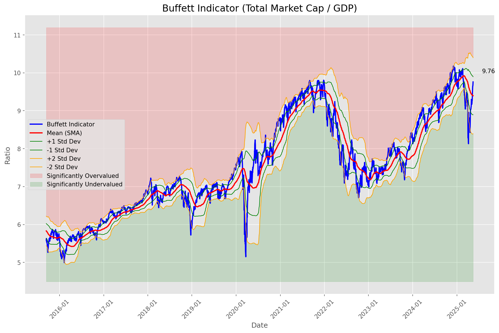
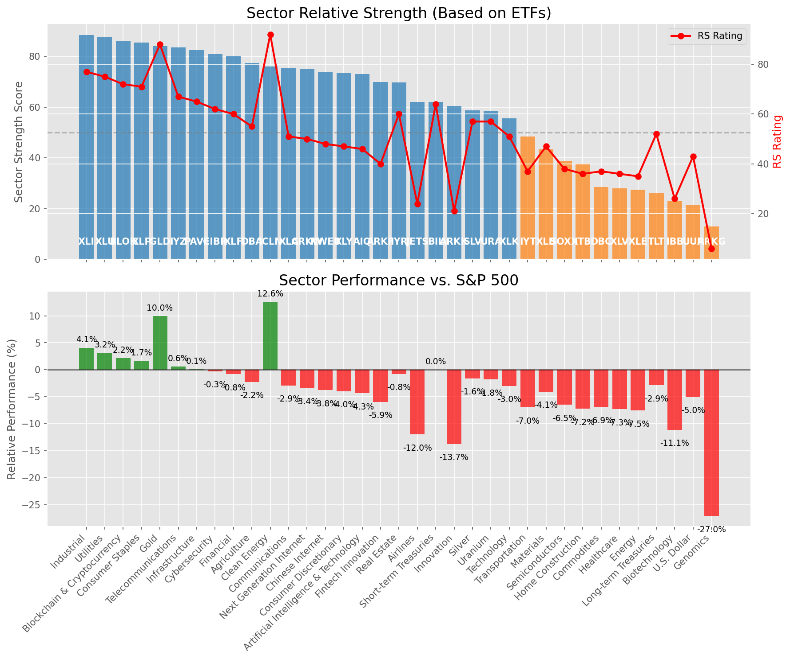

# **Daily Relative Strength Report**

**Date:** 2025-05-19

## **Market Valuation (Buffett Indicator)**

| Metric | Value |
|--------|-------|
| **Market Valuation** | **Fair Valued** |
| **Current Ratio** | 9.75 |
| **Historical Mean** | 9.40 |
| **Standard Deviation** | 0.50 |
| **Z-Score (StdDev from Mean)** | 0.73 |
| **Total Market Cap** | $292.22 trillion |
| **GDP** | $29.98 trillion |

## **Market Insights**

### **Market is Fairly Valued**

The market appears to be trading within a reasonable range of historical valuations. This suggests a balanced approach to equity investing is appropriate. Investors should:

- Focus on individual stock selection based on fundamentals and technicals
- Maintain normal equity allocations aligned with long-term goals
- Pay attention to sector rotation and relative strength
- Watch for changes in market leadership

Fair valuation typically suggests normal market returns can be expected, with stock selection becoming increasingly important.

### **Buffett Indicator Overview**

The Buffett Indicator (Total Market Cap / GDP) is a measure of the stock market's valuation relative to the size of the economy. It is named after Warren Buffett, who described it as "probably the best single measure of where valuations stand at any given moment."

- **Values above +2 standard deviations:** Market significantly overvalued
- **Values above +1 standard deviation:** Market overvalued
- **Values between -1 and +1 standard deviations:** Market fairly valued
- **Values below -1 standard deviation:** Market undervalued
- **Values below -2 standard deviations:** Market significantly undervalued

---

## **Sector Relative Strength**

Based on William O'Neil's Relative Strength Methodology

| ETF | Strength | RS Rating | Performance | Above Key MAs | Trend | Sector |
|-----|----------|-----------|-------------|--------------|-------|--------|
| [XLI](https://www.tradingview.com/chart/?symbol=XLI) | 88.5 | 77.0 | 3.91% | 10d ✓, 50d ✓, 200d ✓ | ↗️ | Industrial |
| [XLU](https://www.tradingview.com/chart/?symbol=XLU) | 87.5 | 75.0 | 3.03% | 10d ✓, 50d ✓, 200d ✓ | ↗️ | Utilities |
| [XLP](https://www.tradingview.com/chart/?symbol=XLP) | 85.5 | 71.0 | 1.48% | 10d ✓, 50d ✓, 200d ✓ | ↗️ | Consumer Staples |
| [BLOK](https://www.tradingview.com/chart/?symbol=BLOK) | 85.5 | 71.0 | 1.47% | 10d ✓, 50d ✓, 200d ✓ | ↗️ | Blockchain & Cryptocurrency |
| [GLD](https://www.tradingview.com/chart/?symbol=GLD) | 84.6 | 89.0 | 10.17% | 10d ✗, 50d ✓, 200d ✓ | ↗️ | Gold |
| [IYZ](https://www.tradingview.com/chart/?symbol=IYZ) | 83.0 | 66.0 | 0.32% | 10d ✓, 50d ✓, 200d ✓ | ↗️ | Telecommunications |
| [PAVE](https://www.tradingview.com/chart/?symbol=PAVE) | 81.5 | 63.0 | -0.19% | 10d ✓, 50d ✓, 200d ✓ | ↗️ | Infrastructure |
| [CIBR](https://www.tradingview.com/chart/?symbol=CIBR) | 80.5 | 61.0 | -0.60% | 10d ✓, 50d ✓, 200d ✓ | ↗️ | Cybersecurity |
| [XLF](https://www.tradingview.com/chart/?symbol=XLF) | 79.5 | 59.0 | -1.12% | 10d ✓, 50d ✓, 200d ✓ | ↗️ | Financial |
| [DBA](https://www.tradingview.com/chart/?symbol=DBA) | 78.0 | 56.0 | -2.15% | 10d ✓, 50d ✓, 200d ✓ | ↗️ | Agriculture |
| [XLC](https://www.tradingview.com/chart/?symbol=XLC) | 76.0 | 52.0 | -3.12% | 10d ✓, 50d ✓, 200d ✓ | ↗️ | Communications |
| [ICLN](https://www.tradingview.com/chart/?symbol=ICLN) | 76.0 | 92.0 | 12.82% | 10d ✓, 50d ✓, 200d ✓ | ↘️ | Clean Energy |
| [KWEB](https://www.tradingview.com/chart/?symbol=KWEB) | 74.5 | 49.0 | -3.80% | 10d ✓, 50d ✓, 200d ✓ | ↗️ | Chinese Internet |
| [XLY](https://www.tradingview.com/chart/?symbol=XLY) | 73.5 | 47.0 | -4.24% | 10d ✓, 50d ✓, 200d ✓ | ↗️ | Consumer Discretionary |
| [AIQ](https://www.tradingview.com/chart/?symbol=AIQ) | 73.0 | 46.0 | -4.56% | 10d ✓, 50d ✓, 200d ✓ | ↗️ | Artificial Intelligence & Technology |
| [ARKW](https://www.tradingview.com/chart/?symbol=ARKW) | 72.5 | 45.0 | -4.85% | 10d ✓, 50d ✓, 200d ✓ | ↗️ | Next Generation Internet |
| [ARKF](https://www.tradingview.com/chart/?symbol=ARKF) | 70.0 | 40.0 | -6.02% | 10d ✓, 50d ✓, 200d ✓ | ↗️ | Fintech Innovation |
| [IYR](https://www.tradingview.com/chart/?symbol=IYR) | 69.8 | 60.0 | -0.83% | 10d ✓, 50d ✓, 200d ✗ | ↗️ | Real Estate |
| [BIL](https://www.tradingview.com/chart/?symbol=BIL) | 62.0 | 64.0 | 0.01% | 10d ✓, 50d ✓, 200d ✓ | ↘️ | Short-term Treasuries |
| [JETS](https://www.tradingview.com/chart/?symbol=JETS) | 62.0 | 24.0 | -12.31% | 10d ✓, 50d ✓, 200d ✓ | ↗️ | Airlines |
| [ARKK](https://www.tradingview.com/chart/?symbol=ARKK) | 60.5 | 21.0 | -13.90% | 10d ✓, 50d ✓, 200d ✓ | ↗️ | Innovation |
| [SLV](https://www.tradingview.com/chart/?symbol=SLV) | 59.2 | 58.0 | -1.55% | 10d ✗, 50d ✗, 200d ✓ | ↗️ | Silver |
| [URA](https://www.tradingview.com/chart/?symbol=URA) | 59.0 | 58.0 | -1.45% | 10d ✓, 50d ✓, 200d ✓ | ↘️ | Uranium |
| [XLK](https://www.tradingview.com/chart/?symbol=XLK) | 55.5 | 51.0 | -3.29% | 10d ✓, 50d ✓, 200d ✓ | ↘️ | Technology |
| [IYT](https://www.tradingview.com/chart/?symbol=IYT) | 48.5 | 37.0 | -7.26% | 10d ✓, 50d ✓, 200d ✓ | ↘️ | Transportation |
| [XLB](https://www.tradingview.com/chart/?symbol=XLB) | 43.3 | 47.0 | -4.23% | 10d ✓, 50d ✓, 200d ✗ | ↘️ | Materials |
| [SOXX](https://www.tradingview.com/chart/?symbol=SOXX) | 38.8 | 38.0 | -6.91% | 10d ✓, 50d ✓, 200d ✗ | ↘️ | Semiconductors |
| [ITB](https://www.tradingview.com/chart/?symbol=ITB) | 37.8 | 36.0 | -7.50% | 10d ✓, 50d ✓, 200d ✗ | ↘️ | Home Construction |
| [XLV](https://www.tradingview.com/chart/?symbol=XLV) | 27.9 | 36.0 | -7.38% | 10d ✓, 50d ✗, 200d ✗ | ↘️ | Healthcare |
| [TLT](https://www.tradingview.com/chart/?symbol=TLT) | 27.5 | 55.0 | -2.40% | 10d ✗, 50d ✗, 200d ✗ | ↘️ | Long-term Treasuries |
| [XLE](https://www.tradingview.com/chart/?symbol=XLE) | 27.4 | 35.0 | -7.82% | 10d ✓, 50d ✗, 200d ✗ | ↘️ | Energy |
| [IBB](https://www.tradingview.com/chart/?symbol=IBB) | 23.4 | 27.0 | -11.09% | 10d ✓, 50d ✗, 200d ✗ | ↘️ | Biotechnology |
| [UUP](https://www.tradingview.com/chart/?symbol=UUP) | 22.0 | 44.0 | -5.10% | 10d ✗, 50d ✗, 200d ✗ | ↘️ | U.S. Dollar |
| [DBC](https://www.tradingview.com/chart/?symbol=DBC) | 18.5 | 37.0 | -7.18% | 10d ✗, 50d ✗, 200d ✗ | ↘️ | Commodities |
| [ARKG](https://www.tradingview.com/chart/?symbol=ARKG) | 12.9 | 6.0 | -27.01% | 10d ✓, 50d ✗, 200d ✗ | ↘️ | Genomics |

### **Sector ETF Performance Interpretation**

This table shows the relative strength metrics for different market sectors based on their representative ETFs:

- **ETF**: The ETF used to measure sector performance (click for chart)
- **Strength**: Overall sector strength score (0-100) combining multiple factors
- **RS Rating**: O'Neil RS rating of the sector ETF
- **Performance**: Performance of the sector ETF relative to SPY
- **Above Key MAs**: Whether the ETF is trading above its 10, 50, and 200-day moving averages
- **Trend**: Whether the sector is in an uptrend (↗️) or downtrend (↘️)

### **Current Sector Leadership**

The current market leadership is coming from the following sectors: **Industrial, Utilities, Consumer Staples**.

The **Industrial** sector (represented by **XLI**) is showing particularly strong relative strength with an RS rating of 77.0 and performance of 3.91% vs. the S&P 500. This sector is trading above its 10-day, 50-day, 200-day moving average(s). Investors should consider focusing on high RS stocks within these leading sectors for potential outperformance.

---

## **Buy Recommendations**

The following 90 stocks show exceptional relative strength:

| RS Rating | Buy Score | Current Price | Chart | Name | Ticker |
|-----------|-----------|---------------|-------|------|--------|
| 100 | 100 | $99.94 | [Chart](https://www.tradingview.com/chart/?symbol=SEZL) | Sezzle Inc. Common Stock | SEZL |
| 100 | 100 | $19.69 | [Chart](https://www.tradingview.com/chart/?symbol=SPNT) | SiriusPoint Ltd. | SPNT |
| 100 | 100 | $26.59 | [Chart](https://www.tradingview.com/chart/?symbol=UVE) | UNIVERSAL INSURANCE HLDG, INC. | UVE |
| 100 | 100 | $133.44 | [Chart](https://www.tradingview.com/chart/?symbol=VSEC) | VSE Corp | VSEC |
| 100 | 100 | $28.59 | [Chart](https://www.tradingview.com/chart/?symbol=DB) | Deutsche Bank Aktiengesellschaft | DB |
| 100 | 100 | $182.09 | [Chart](https://www.tradingview.com/chart/?symbol=DAVE) | Dave Inc. Class A Common Stock | DAVE |
| 100 | 100 | $42.06 | [Chart](https://www.tradingview.com/chart/?symbol=DRS) | Leonardo DRS, Inc. Common Stock | DRS |
| 100 | 100 | $160.81 | [Chart](https://www.tradingview.com/chart/?symbol=NRG) | NRG Energy, Inc. | NRG |
| 100 | 100 | $23.25 | [Chart](https://www.tradingview.com/chart/?symbol=PRA) | ProAssurance Corporation | PRA |
| 99 | 100 | $35.04 | [Chart](https://www.tradingview.com/chart/?symbol=KTOS) | Kratos Defense & Security Solutions, Inc. | KTOS |
| 99 | 100 | $160.82 | [Chart](https://www.tradingview.com/chart/?symbol=PLMR) | Palomar Holdings, Inc. Common stock | PLMR |
| 99 | 100 | $133.94 | [Chart](https://www.tradingview.com/chart/?symbol=ATGE) | Adtalem Global Education Inc. Common Shares | ATGE |
| 99 | 100 | $44.64 | [Chart](https://www.tradingview.com/chart/?symbol=EXEL) | Exelixis Inc | EXEL |
| 99 | 100 | $72.47 | [Chart](https://www.tradingview.com/chart/?symbol=ULS) | UL Solutions Inc. | ULS |
| 98 | 100 | $410.31 | [Chart](https://www.tradingview.com/chart/?symbol=MSTR) | MicroStrategy Inc | MSTR |
| 98 | 100 | $29.04 | [Chart](https://www.tradingview.com/chart/?symbol=FMS) | Fresenius Medical Care AG | FMS |
| 98 | 100 | $35.22 | [Chart](https://www.tradingview.com/chart/?symbol=AHR) | American Healthcare REIT, Inc. | AHR |
| 98 | 100 | $39.47 | [Chart](https://www.tradingview.com/chart/?symbol=PAY) | Paymentus Holdings, Inc. | PAY |
| 97 | 100 | $42.62 | [Chart](https://www.tradingview.com/chart/?symbol=EWP) | iShares MSCI Spain ETF | EWP |
| 97 | 100 | $98.83 | [Chart](https://www.tradingview.com/chart/?symbol=LBRDK) | Liberty Broadband Corporation Class C | LBRDK |
| 97 | 100 | $129.19 | [Chart](https://www.tradingview.com/chart/?symbol=COOP) | Mr. Cooper Group Inc. Common Stock | COOP |
| 97 | 100 | $80.71 | [Chart](https://www.tradingview.com/chart/?symbol=RBLX) | Roblox Corporation | RBLX |
| 97 | 100 | $282.03 | [Chart](https://www.tradingview.com/chart/?symbol=VRSN) | VeriSign Inc | VRSN |
| 97 | 100 | $23.73 | [Chart](https://www.tradingview.com/chart/?symbol=OR) | OR Royalties Inc. | OR |
| 97 | 100 | $153.55 | [Chart](https://www.tradingview.com/chart/?symbol=CAH) | Cardinal Health, Inc. | CAH |
| 97 | 100 | $34.61 | [Chart](https://www.tradingview.com/chart/?symbol=UTI) | Universal Technical Institute, Inc. | UTI |
| 97 | 100 | $165.62 | [Chart](https://www.tradingview.com/chart/?symbol=HWM) | Howmet Aerospace Inc. | HWM |
| 97 | 100 | $31.77 | [Chart](https://www.tradingview.com/chart/?symbol=TGS) | Transportadora de Gas del Sur S.A. ADS | TGS |
| 96 | 100 | $120.92 | [Chart](https://www.tradingview.com/chart/?symbol=EHC) | Encompass Health Corporation Common Stock | EHC |
| 96 | 100 | $22.57 | [Chart](https://www.tradingview.com/chart/?symbol=CXW) | CoreCivic, Inc. | CXW |
| 96 | 100 | $524.82 | [Chart](https://www.tradingview.com/chart/?symbol=DUOL) | Duolingo, Inc. Class A Common Stock | DUOL |
| 96 | 100 | $31.70 | [Chart](https://www.tradingview.com/chart/?symbol=EUFN) | iShares MSCI Europe Financials ETF | EUFN |
| 95 | 100 | $324.94 | [Chart](https://www.tradingview.com/chart/?symbol=PODD) | Insulet Corporation | PODD |
| 95 | 100 | $162.00 | [Chart](https://www.tradingview.com/chart/?symbol=SE) | Sea Limited American Depositary Shares, each representing one Class A Ordinary Share | SE |
| 95 | 100 | $131.59 | [Chart](https://www.tradingview.com/chart/?symbol=HIG) | The Hartford Insurance Group, Inc. | HIG |
| 95 | 100 | $172.93 | [Chart](https://www.tradingview.com/chart/?symbol=PM) | Philip Morris International Inc. | PM |
| 95 | 100 | $84.07 | [Chart](https://www.tradingview.com/chart/?symbol=LB) | LandBridge Company LLC | LB |
| 94 | 100 | $86.36 | [Chart](https://www.tradingview.com/chart/?symbol=TGLS) | Tecnoglass Inc. | TGLS |
| 94 | 100 | $235.81 | [Chart](https://www.tradingview.com/chart/?symbol=CRS) | Carpenter Technology Corp | CRS |
| 93 | 100 | $1186.17 | [Chart](https://www.tradingview.com/chart/?symbol=NFLX) | NetFlix Inc | NFLX |
| 93 | 100 | $43.44 | [Chart](https://www.tradingview.com/chart/?symbol=BTI) | British American Tobacco p.l.c. American Depositary Shares, American Depositary Shares, each representing one Ordinary Share | BTI |
| 93 | 100 | $30.86 | [Chart](https://www.tradingview.com/chart/?symbol=NTGR) | NETGEAR, Inc. | NTGR |
| 93 | 100 | $25.19 | [Chart](https://www.tradingview.com/chart/?symbol=BSAC) | Banco Santander-Chile | BSAC |
| 93 | 100 | $62.92 | [Chart](https://www.tradingview.com/chart/?symbol=SLF) | Sun Life Financial Inc. | SLF |
| 92 | 100 | $40.81 | [Chart](https://www.tradingview.com/chart/?symbol=AB) | AllianceBernstein Holding, L.P. | AB |
| 92 | 100 | $41.48 | [Chart](https://www.tradingview.com/chart/?symbol=EWG) | iShares MSCI Germany ETF | EWG |
| 92 | 100 | $17.66 | [Chart](https://www.tradingview.com/chart/?symbol=BCS) | Barclays PLC | BCS |
| 92 | 100 | $102.78 | [Chart](https://www.tradingview.com/chart/?symbol=AXS) | Axis Capital Holders Limited | AXS |
| 92 | 100 | $278.32 | [Chart](https://www.tradingview.com/chart/?symbol=CME) | CME Group Inc. | CME |
| 91 | 100 | $59.69 | [Chart](https://www.tradingview.com/chart/?symbol=IBIT) | iShares Bitcoin Trust ETF | IBIT |
| 91 | 100 | $117.69 | [Chart](https://www.tradingview.com/chart/?symbol=BJ) | BJs Wholesale Club Holdings, Inc. Common Stock | BJ |
| 91 | 100 | $234.97 | [Chart](https://www.tradingview.com/chart/?symbol=GE) | GE Aerospace | GE |
| 91 | 100 | $173.02 | [Chart](https://www.tradingview.com/chart/?symbol=ITA) | iShares U.S. Aerospace & Defense ETF | ITA |
| 91 | 100 | $108.06 | [Chart](https://www.tradingview.com/chart/?symbol=RBA) | RB Global, Inc. | RBA |
| 90 | 100 | $82.00 | [Chart](https://www.tradingview.com/chart/?symbol=UNM) | Unum Group | UNM |
| 89 | 100 | $156.84 | [Chart](https://www.tradingview.com/chart/?symbol=LRN) | Stride, Inc. | LRN |
| 88 | 100 | $85.93 | [Chart](https://www.tradingview.com/chart/?symbol=RBRK) | Rubrik, Inc. | RBRK |
| 88 | 100 | $288.44 | [Chart](https://www.tradingview.com/chart/?symbol=PGR) | Progressive Corporation | PGR |
| 87 | 100 | $249.59 | [Chart](https://www.tradingview.com/chart/?symbol=RSG) | Republic Services Inc. | RSG |
| 86 | 99 | $233.53 | [Chart](https://www.tradingview.com/chart/?symbol=TTWO) | Take-Two Interactive Software Inc | TTWO |
| 84 | 99 | $27.96 | [Chart](https://www.tradingview.com/chart/?symbol=T) | AT&T Inc. | T |
| 88 | 98 | $53.83 | [Chart](https://www.tradingview.com/chart/?symbol=EPR) | EPR Properties | EPR |
| 85 | 98 | $159.33 | [Chart](https://www.tradingview.com/chart/?symbol=ATO) | Atmos Energy Corporation | ATO |
| 85 | 98 | $25.66 | [Chart](https://www.tradingview.com/chart/?symbol=EWS) | iShares MSCI Singapore ETF | EWS |
| 84 | 98 | $1391.07 | [Chart](https://www.tradingview.com/chart/?symbol=ORLY) | O'Reilly Automotive, Inc. | ORLY |
| 86 | 97 | $24.06 | [Chart](https://www.tradingview.com/chart/?symbol=BTSG) | BrightSpring Health Services, Inc. Common Stock | BTSG |
| 86 | 97 | $54.92 | [Chart](https://www.tradingview.com/chart/?symbol=RELX) | RELX PLC | RELX |
| 85 | 97 | $197.44 | [Chart](https://www.tradingview.com/chart/?symbol=LOPE) | Grand Canyon Education, Inc | LOPE |
| 84 | 97 | $89.34 | [Chart](https://www.tradingview.com/chart/?symbol=L) | Loews Corporation | L |
| 85 | 96 | $58.69 | [Chart](https://www.tradingview.com/chart/?symbol=IGF) | iShares Global Infrastructure ETF | IGF |
| 84 | 95 | $24.52 | [Chart](https://www.tradingview.com/chart/?symbol=CPRX) | Catalyst Pharmaceutical  Inc. | CPRX |
| 83 | 95 | $455.16 | [Chart](https://www.tradingview.com/chart/?symbol=CASY) | Casey's General Stores Inc | CASY |
| 81 | 95 | $23.79 | [Chart](https://www.tradingview.com/chart/?symbol=SRAD) | Sportradar Group AG Class A Ordinary Shares | SRAD |
| 83 | 94 | $138.00 | [Chart](https://www.tradingview.com/chart/?symbol=DTE) | DTE Energy Company | DTE |
| 83 | 94 | $68.60 | [Chart](https://www.tradingview.com/chart/?symbol=CTVA) | Corteva, Inc. Common Stock | CTVA |
| 83 | 94 | $96.97 | [Chart](https://www.tradingview.com/chart/?symbol=CALM) | Cal-Maine Foods Inc | CALM |
| 82 | 93 | $44.60 | [Chart](https://www.tradingview.com/chart/?symbol=TOST) | Toast, Inc. | TOST |
| 82 | 93 | $302.23 | [Chart](https://www.tradingview.com/chart/?symbol=CVNA) | Carvana Co. | CVNA |
| 81 | 93 | $32.67 | [Chart](https://www.tradingview.com/chart/?symbol=ZLAB) | Zai Lab Limited American Depositary Shares | ZLAB |
| 81 | 93 | $116.73 | [Chart](https://www.tradingview.com/chart/?symbol=IDA) | IDACORP, Inc. | IDA |
| 80 | 93 | $529.35 | [Chart](https://www.tradingview.com/chart/?symbol=DE) | Deere & Company | DE |
| 82 | 92 | $61.07 | [Chart](https://www.tradingview.com/chart/?symbol=RYTM) | Rhythm Pharmaceuticals, Inc. Common Stock | RYTM |
| 82 | 92 | $176.65 | [Chart](https://www.tradingview.com/chart/?symbol=ICE) | Intercontinental Exchange  Inc. | ICE |
| 82 | 92 | $17.38 | [Chart](https://www.tradingview.com/chart/?symbol=MIR) | Mirion Technologies, Inc. | MIR |
| 80 | 92 | $343.19 | [Chart](https://www.tradingview.com/chart/?symbol=AJG) | Arthur J. Gallagher & Co. | AJG |
| 80 | 92 | $63.61 | [Chart](https://www.tradingview.com/chart/?symbol=HOOD) | Robinhood Markets, Inc. Class A Common Stock | HOOD |
| 80 | 92 | $43.66 | [Chart](https://www.tradingview.com/chart/?symbol=HMN) | Horace Mann Educators Corporation | HMN |
| 81 | 91 | $61.88 | [Chart](https://www.tradingview.com/chart/?symbol=HIMS) | Hims & Hers Health, Inc. | HIMS |
| 80 | 90 | $5317.07 | [Chart](https://www.tradingview.com/chart/?symbol=BKNG) | Booking Holdings Inc. Common Stock | BKNG |
| 80 | 89 | $193.91 | [Chart](https://www.tradingview.com/chart/?symbol=GPOR) | Gulfport Energy Corporation | GPOR |

---

## **Sell Recommendations**

The following 76 stocks show deteriorating relative strength:

| RS Rating | Sell Score | Current Price | Chart | Name | Ticker |
|-----------|------------|---------------|-------|------|--------|
| 1 | 100 | $281.57 | [Chart](https://www.tradingview.com/chart/?symbol=SAIA) | Saia, Inc. | SAIA |
| 2 | 100 | $10.05 | [Chart](https://www.tradingview.com/chart/?symbol=WNC) | Wabash National Corp. | WNC |
| 2 | 100 | $13.51 | [Chart](https://www.tradingview.com/chart/?symbol=IART) | Integra LifeSciences Holdings | IART |
| 3 | 100 | $11.59 | [Chart](https://www.tradingview.com/chart/?symbol=CLB) | Core Laboratories Inc. | CLB |
| 3 | 100 | $47.26 | [Chart](https://www.tradingview.com/chart/?symbol=WFRD) | Weatherford International plc Ordinary Shares | WFRD |
| 3 | 100 | $13.95 | [Chart](https://www.tradingview.com/chart/?symbol=DNLI) | Denali Therapeutics Inc. Common Stock | DNLI |
| 3 | 100 | $29.90 | [Chart](https://www.tradingview.com/chart/?symbol=TWST) | Twist Bioscience Corporation Common Stock | TWST |
| 3 | 100 | $28.14 | [Chart](https://www.tradingview.com/chart/?symbol=CRTO) | Criteo S.A. | CRTO |
| 3 | 100 | $23.88 | [Chart](https://www.tradingview.com/chart/?symbol=JANX) | Janux Therapeutics, Inc. Common Stock | JANX |
| 4 | 100 | $17.89 | [Chart](https://www.tradingview.com/chart/?symbol=VRNT) | Verint Systems Inc | VRNT |
| 4 | 100 | $30.58 | [Chart](https://www.tradingview.com/chart/?symbol=CYTK) | Cytokinetics Inc. | CYTK |
| 4 | 100 | $11.96 | [Chart](https://www.tradingview.com/chart/?symbol=ARCT) | Arcturus Therapeutics Holdings Inc. Common Stock | ARCT |
| 4 | 100 | $10.22 | [Chart](https://www.tradingview.com/chart/?symbol=HPK) | HighPeak Energy, Inc. Common Stock | HPK |
| 5 | 100 | $10.87 | [Chart](https://www.tradingview.com/chart/?symbol=LSPD) | Lightspeed Commerce Inc. | LSPD |
| 5 | 100 | $15.45 | [Chart](https://www.tradingview.com/chart/?symbol=PENN) | PENN Entertainment, Inc. Common Stock | PENN |
| 5 | 100 | $14.74 | [Chart](https://www.tradingview.com/chart/?symbol=IMVT) | Immunovant, Inc. Common Stock | IMVT |
| 6 | 100 | $28.58 | [Chart](https://www.tradingview.com/chart/?symbol=SRDX) | Surmodics, Inc. Common Stock | SRDX |
| 6 | 100 | $20.94 | [Chart](https://www.tradingview.com/chart/?symbol=VERA) | Vera Therapeutics, Inc. Class A Common Stock | VERA |
| 8 | 100 | $21.22 | [Chart](https://www.tradingview.com/chart/?symbol=UCO) | ProShares Ultra Bloomberg Crude Oil | UCO |
| 8 | 100 | $50.56 | [Chart](https://www.tradingview.com/chart/?symbol=LSCC) | Lattice Semiconductor Corp | LSCC |
| 8 | 100 | $127.31 | [Chart](https://www.tradingview.com/chart/?symbol=TFX) | Teleflex Incorporated | TFX |
| 10 | 100 | $21.43 | [Chart](https://www.tradingview.com/chart/?symbol=AMRK) | A-Mark Precious Metals, Inc. | AMRK |
| 17 | 100 | $10.34 | [Chart](https://www.tradingview.com/chart/?symbol=CMRE) | Costamare Inc. | CMRE |
| 18 | 100 | $94.54 | [Chart](https://www.tradingview.com/chart/?symbol=CHRD) | Chord Energy Corporation Common Stock | CHRD |
| 22 | 100 | $47.92 | [Chart](https://www.tradingview.com/chart/?symbol=LINE) | Lineage, Inc. Common Stock | LINE |
| 6 | 99 | $10.31 | [Chart](https://www.tradingview.com/chart/?symbol=VREX) | Varex Imaging Corporation Common Stock | VREX |
| 8 | 99 | $90.84 | [Chart](https://www.tradingview.com/chart/?symbol=BCC) | Boise Cascade Company | BCC |
| 5 | 98 | $15.14 | [Chart](https://www.tradingview.com/chart/?symbol=DXC) | DXC Technology Company | DXC |
| 13 | 98 | $48.01 | [Chart](https://www.tradingview.com/chart/?symbol=RHI) | Robert Half Inc. | RHI |
| 20 | 98 | $18.43 | [Chart](https://www.tradingview.com/chart/?symbol=NVDS) | Investment Managers Series Trust II Tradr 1.5X Short NVDA Daily ETF | NVDS |
| 8 | 97 | $14.49 | [Chart](https://www.tradingview.com/chart/?symbol=INMD) | InMode Ltd. Ordinary Shares | INMD |
| 11 | 97 | $223.82 | [Chart](https://www.tradingview.com/chart/?symbol=OIH) | VanEck Oil Services ETF | OIH |
| 11 | 96 | $12.04 | [Chart](https://www.tradingview.com/chart/?symbol=M) | Macy's Inc. | M |
| 12 | 96 | $33.37 | [Chart](https://www.tradingview.com/chart/?symbol=MBIN) | Merchants Bancorp Common Stock | MBIN |
| 14 | 96 | $50.62 | [Chart](https://www.tradingview.com/chart/?symbol=ERX) | Direxion Daily Energy Bull 2X Shares | ERX |
| 9 | 95 | $44.03 | [Chart](https://www.tradingview.com/chart/?symbol=MTDR) | MATADOR RESOURCES COMPANY | MTDR |
| 13 | 95 | $12.76 | [Chart](https://www.tradingview.com/chart/?symbol=VRDN) | Viridian Therapeutics, Inc. Common Stock | VRDN |
| 15 | 95 | $34.97 | [Chart](https://www.tradingview.com/chart/?symbol=SLB) | Schlumberger Limited | SLB |
| 20 | 95 | $20.20 | [Chart](https://www.tradingview.com/chart/?symbol=BITI) | ProShares Short Bitcoin ETF | BITI |
| 10 | 93 | $26.68 | [Chart](https://www.tradingview.com/chart/?symbol=TRN) | Trinity Industries, Inc. | TRN |
| 13 | 93 | $63.54 | [Chart](https://www.tradingview.com/chart/?symbol=SPB) | Spectrum Brands Holdings, Inc. | SPB |
| 22 | 93 | $10.03 | [Chart](https://www.tradingview.com/chart/?symbol=LBTYK) | Liberty Global Ltd. Class C Common Shares | LBTYK |
| 18 | 92 | $11.32 | [Chart](https://www.tradingview.com/chart/?symbol=PBR.A) | Petroleo Brasileiro S.A.-Petrobras | PBR.A |
| 10 | 91 | $12.03 | [Chart](https://www.tradingview.com/chart/?symbol=APLE) | Apple Hospitality REIT, Inc. | APLE |
| 16 | 90 | $35.97 | [Chart](https://www.tradingview.com/chart/?symbol=RARE) | Ultragenyx Pharmaceutical Inc. | RARE |
| 17 | 90 | $35.86 | [Chart](https://www.tradingview.com/chart/?symbol=TECK) | Teck Resources Limited | TECK |
| 16 | 89 | $10.06 | [Chart](https://www.tradingview.com/chart/?symbol=MTAL) | MAC Copper Limited | MTAL |
| 19 | 88 | $53.91 | [Chart](https://www.tradingview.com/chart/?symbol=KBH) | KB Home | KBH |
| 21 | 88 | $11.22 | [Chart](https://www.tradingview.com/chart/?symbol=NEWT) | NewtekOne, Inc. Common Stock | NEWT |
| 21 | 87 | $16.32 | [Chart](https://www.tradingview.com/chart/?symbol=PD) | PagerDuty, Inc. | PD |
| 27 | 86 | $35.42 | [Chart](https://www.tradingview.com/chart/?symbol=SU) | Suncor Energy, Inc. | SU |
| 19 | 85 | $16.80 | [Chart](https://www.tradingview.com/chart/?symbol=CHCT) | Community Healthcare Trust Incorporated Common Stock, $0.01 par value per share | CHCT |
| 22 | 85 | $10.47 | [Chart](https://www.tradingview.com/chart/?symbol=HOPE) | Hope Bancorp, Inc. | HOPE |
| 23 | 85 | $31.01 | [Chart](https://www.tradingview.com/chart/?symbol=CRNX) | Crinetics Pharmaceuticals, Inc. | CRNX |
| 34 | 83 | $25.55 | [Chart](https://www.tradingview.com/chart/?symbol=RCI) | Rogers Communications, Inc. | RCI |
| 26 | 82 | $10.33 | [Chart](https://www.tradingview.com/chart/?symbol=SCS) | Steelcase, Inc. | SCS |
| 25 | 80 | $10.10 | [Chart](https://www.tradingview.com/chart/?symbol=CION) | CION Investment Corporation | CION |
| 27 | 79 | $15.12 | [Chart](https://www.tradingview.com/chart/?symbol=HR) | Healthcare Realty Trust Incorporated | HR |
| 33 | 79 | $67.77 | [Chart](https://www.tradingview.com/chart/?symbol=MTH) | Meritage Homes Corporation | MTH |
| 27 | 78 | $34.46 | [Chart](https://www.tradingview.com/chart/?symbol=SQM) | Sociedad Quimica y Minera de Chile SA | SQM |
| 23 | 77 | $113.48 | [Chart](https://www.tradingview.com/chart/?symbol=EOG) | EOG Resources, Inc. | EOG |
| 37 | 77 | $21.14 | [Chart](https://www.tradingview.com/chart/?symbol=DBC) | Invesco DB Commodity Index Tracking Fund | DBC |
| 28 | 75 | $26.51 | [Chart](https://www.tradingview.com/chart/?symbol=WY) | Weyerhaeuser Company | WY |
| 29 | 75 | $132.65 | [Chart](https://www.tradingview.com/chart/?symbol=HES) | Hess Corporation | HES |
| 36 | 75 | $35.37 | [Chart](https://www.tradingview.com/chart/?symbol=CPB) | The Campbell's Company Common Stock | CPB |
| 32 | 74 | $59.05 | [Chart](https://www.tradingview.com/chart/?symbol=BMRN) | BioMarin Pharmaceuticals Inc | BMRN |
| 34 | 74 | $12.69 | [Chart](https://www.tradingview.com/chart/?symbol=PDBC) | Invesco Actively Managed Exch-Traded Commodity Fd Tr Invesco Optimum Yield Diversified Commodity Strategy No K-1 ETF | PDBC |
| 39 | 74 | $10.80 | [Chart](https://www.tradingview.com/chart/?symbol=NMFC) | NEW MOUNTAIN FINANCE CORPORATION | NMFC |
| 30 | 72 | $10.71 | [Chart](https://www.tradingview.com/chart/?symbol=SEMR) | SEMrush Holdings, Inc. | SEMR |
| 36 | 72 | $44.70 | [Chart](https://www.tradingview.com/chart/?symbol=IYE) | iShares U.S. Energy ETF | IYE |
| 39 | 70 | $32.62 | [Chart](https://www.tradingview.com/chart/?symbol=DVN) | Devon Energy Corporation | DVN |
| 34 | 69 | $10.62 | [Chart](https://www.tradingview.com/chart/?symbol=LADR) | LADDER CAPITAL CORP | LADR |
| 35 | 69 | $84.16 | [Chart](https://www.tradingview.com/chart/?symbol=XLE) | Energy Select Sector SPDR Fund | XLE |
| 37 | 69 | $10.65 | [Chart](https://www.tradingview.com/chart/?symbol=AVO) | Mission Produce, Inc. Common Stock | AVO |
| 38 | 68 | $161.91 | [Chart](https://www.tradingview.com/chart/?symbol=IBP) | INSTALLED BUILDING PRODUCTS, INC. | IBP |
| 39 | 65 | $12.85 | [Chart](https://www.tradingview.com/chart/?symbol=PCN) | PIMCO Corporate & Income Strategy Fund | PCN |

## **Methodology**

This report uses William O'Neil's relative strength methodology from Investors Business Daily:

* **RS Rating**: Percentile rank of stock's performance vs. S&P 500 over the past 63 trading days (1-99 scale)
* **Buy Criteria**: RS Rating >= 80, price above 50-day MA, strong uptrend, increasing volume
* **Sell Criteria**: RS Rating < 40, price below 50-day MA, downtrend, decreasing volume

### **O'Neil's Key Principles**

1. **Focus on relative performance** - stocks outperforming the market
2. **Price trend confirmation** - stock must be in an uptrend
3. **Volume confirmation** - strong volume supports price moves
4. **Moving average validation** - price above key moving averages
5. **Market leaders only** - concentrate on top-performing stocks

*Report generated automatically after market close*