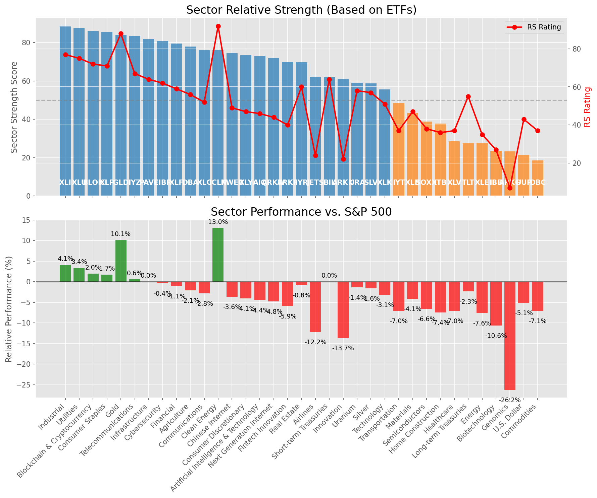

# **Daily Relative Strength Report**

**Date:** 2025-05-19

## **Market Valuation (Buffett Indicator)**

| Metric | Value |
|--------|-------|
| **Market Valuation** | **Fair Valued** |
| **Current Ratio** | 9.77 |
| **Historical Mean** | 9.40 |
| **Standard Deviation** | 0.50 |
| **Z-Score (StdDev from Mean)** | 0.73 |
| **Total Market Cap** | $292.81 trillion |
| **GDP** | $29.98 trillion |

## **Market Insights**

### **Market is Fairly Valued**

The market appears to be trading within a reasonable range of historical valuations. This suggests a balanced approach to equity investing is appropriate. Investors should:

- Focus on individual stock selection based on fundamentals and technicals
- Maintain normal equity allocations aligned with long-term goals
- Pay attention to sector rotation and relative strength
- Watch for changes in market leadership

Fair valuation typically suggests normal market returns can be expected, with stock selection becoming increasingly important.

### **Buffett Indicator Overview**

The Buffett Indicator (Total Market Cap / GDP) is a measure of the stock market's valuation relative to the size of the economy. It is named after Warren Buffett, who described it as "probably the best single measure of where valuations stand at any given moment."

- **Values above +2 standard deviations:** Market significantly overvalued
- **Values above +1 standard deviation:** Market overvalued
- **Values between -1 and +1 standard deviations:** Market fairly valued
- **Values below -1 standard deviation:** Market undervalued
- **Values below -2 standard deviations:** Market significantly undervalued

---

## **Sector Relative Strength**

Based on William O'Neil's Relative Strength Methodology

| ETF | Strength | RS Rating | Performance | Above Key MAs | Trend | Sector |
|-----|----------|-----------|-------------|--------------|-------|--------|
| [XLI](https://www.tradingview.com/chart/?symbol=XLI) | 88.5 | 77.0 | 4.07% | 10d ✓, 50d ✓, 200d ✓ | ↗️ | Industrial |
| [XLU](https://www.tradingview.com/chart/?symbol=XLU) | 87.5 | 75.0 | 3.37% | 10d ✓, 50d ✓, 200d ✓ | ↗️ | Utilities |
| [BLOK](https://www.tradingview.com/chart/?symbol=BLOK) | 86.0 | 72.0 | 1.99% | 10d ✓, 50d ✓, 200d ✓ | ↗️ | Blockchain & Cryptocurrency |
| [XLP](https://www.tradingview.com/chart/?symbol=XLP) | 85.5 | 71.0 | 1.74% | 10d ✓, 50d ✓, 200d ✓ | ↗️ | Consumer Staples |
| [GLD](https://www.tradingview.com/chart/?symbol=GLD) | 84.1 | 88.0 | 10.10% | 10d ✗, 50d ✓, 200d ✓ | ↗️ | Gold |
| [IYZ](https://www.tradingview.com/chart/?symbol=IYZ) | 83.5 | 67.0 | 0.56% | 10d ✓, 50d ✓, 200d ✓ | ↗️ | Telecommunications |
| [PAVE](https://www.tradingview.com/chart/?symbol=PAVE) | 82.0 | 64.0 | 0.02% | 10d ✓, 50d ✓, 200d ✓ | ↗️ | Infrastructure |
| [CIBR](https://www.tradingview.com/chart/?symbol=CIBR) | 81.0 | 62.0 | -0.38% | 10d ✓, 50d ✓, 200d ✓ | ↗️ | Cybersecurity |
| [XLF](https://www.tradingview.com/chart/?symbol=XLF) | 79.5 | 59.0 | -1.05% | 10d ✓, 50d ✓, 200d ✓ | ↗️ | Financial |
| [DBA](https://www.tradingview.com/chart/?symbol=DBA) | 78.0 | 56.0 | -2.09% | 10d ✓, 50d ✓, 200d ✓ | ↗️ | Agriculture |
| [XLC](https://www.tradingview.com/chart/?symbol=XLC) | 76.0 | 52.0 | -2.80% | 10d ✓, 50d ✓, 200d ✓ | ↗️ | Communications |
| [ICLN](https://www.tradingview.com/chart/?symbol=ICLN) | 76.0 | 92.0 | 13.04% | 10d ✓, 50d ✓, 200d ✓ | ↘️ | Clean Energy |
| [KWEB](https://www.tradingview.com/chart/?symbol=KWEB) | 74.5 | 49.0 | -3.62% | 10d ✓, 50d ✓, 200d ✓ | ↗️ | Chinese Internet |
| [XLY](https://www.tradingview.com/chart/?symbol=XLY) | 73.5 | 47.0 | -4.07% | 10d ✓, 50d ✓, 200d ✓ | ↗️ | Consumer Discretionary |
| [AIQ](https://www.tradingview.com/chart/?symbol=AIQ) | 73.0 | 46.0 | -4.42% | 10d ✓, 50d ✓, 200d ✓ | ↗️ | Artificial Intelligence & Technology |
| [ARKW](https://www.tradingview.com/chart/?symbol=ARKW) | 72.0 | 44.0 | -4.76% | 10d ✓, 50d ✓, 200d ✓ | ↗️ | Next Generation Internet |
| [ARKF](https://www.tradingview.com/chart/?symbol=ARKF) | 70.0 | 40.0 | -5.89% | 10d ✓, 50d ✓, 200d ✓ | ↗️ | Fintech Innovation |
| [IYR](https://www.tradingview.com/chart/?symbol=IYR) | 69.8 | 60.0 | -0.76% | 10d ✓, 50d ✓, 200d ✗ | ↗️ | Real Estate |
| [BIL](https://www.tradingview.com/chart/?symbol=BIL) | 62.0 | 64.0 | 0.00% | 10d ✓, 50d ✓, 200d ✓ | ↘️ | Short-term Treasuries |
| [JETS](https://www.tradingview.com/chart/?symbol=JETS) | 62.0 | 24.0 | -12.15% | 10d ✓, 50d ✓, 200d ✓ | ↗️ | Airlines |
| [ARKK](https://www.tradingview.com/chart/?symbol=ARKK) | 61.0 | 22.0 | -13.66% | 10d ✓, 50d ✓, 200d ✓ | ↗️ | Innovation |
| [URA](https://www.tradingview.com/chart/?symbol=URA) | 59.0 | 58.0 | -1.38% | 10d ✓, 50d ✓, 200d ✓ | ↘️ | Uranium |
| [SLV](https://www.tradingview.com/chart/?symbol=SLV) | 58.7 | 57.0 | -1.64% | 10d ✗, 50d ✗, 200d ✓ | ↗️ | Silver |
| [XLK](https://www.tradingview.com/chart/?symbol=XLK) | 55.5 | 51.0 | -3.14% | 10d ✓, 50d ✓, 200d ✓ | ↘️ | Technology |
| [IYT](https://www.tradingview.com/chart/?symbol=IYT) | 48.5 | 37.0 | -7.03% | 10d ✓, 50d ✓, 200d ✓ | ↘️ | Transportation |
| [XLB](https://www.tradingview.com/chart/?symbol=XLB) | 43.3 | 47.0 | -4.09% | 10d ✓, 50d ✓, 200d ✗ | ↘️ | Materials |
| [SOXX](https://www.tradingview.com/chart/?symbol=SOXX) | 38.8 | 38.0 | -6.58% | 10d ✓, 50d ✓, 200d ✗ | ↘️ | Semiconductors |
| [ITB](https://www.tradingview.com/chart/?symbol=ITB) | 37.8 | 36.0 | -7.42% | 10d ✓, 50d ✓, 200d ✗ | ↘️ | Home Construction |
| [XLV](https://www.tradingview.com/chart/?symbol=XLV) | 28.4 | 37.0 | -7.02% | 10d ✓, 50d ✗, 200d ✗ | ↘️ | Healthcare |
| [TLT](https://www.tradingview.com/chart/?symbol=TLT) | 27.5 | 55.0 | -2.33% | 10d ✗, 50d ✗, 200d ✗ | ↘️ | Long-term Treasuries |
| [XLE](https://www.tradingview.com/chart/?symbol=XLE) | 27.4 | 35.0 | -7.59% | 10d ✓, 50d ✗, 200d ✗ | ↘️ | Energy |
| [IBB](https://www.tradingview.com/chart/?symbol=IBB) | 23.4 | 27.0 | -10.65% | 10d ✓, 50d ✗, 200d ✗ | ↘️ | Biotechnology |
| [ARKG](https://www.tradingview.com/chart/?symbol=ARKG) | 23.3 | 7.0 | -26.23% | 10d ✓, 50d ✓, 200d ✗ | ↘️ | Genomics |
| [UUP](https://www.tradingview.com/chart/?symbol=UUP) | 21.5 | 43.0 | -5.11% | 10d ✗, 50d ✗, 200d ✗ | ↘️ | U.S. Dollar |
| [DBC](https://www.tradingview.com/chart/?symbol=DBC) | 18.5 | 37.0 | -7.07% | 10d ✗, 50d ✗, 200d ✗ | ↘️ | Commodities |

### **Sector ETF Performance Interpretation**

This table shows the relative strength metrics for different market sectors based on their representative ETFs:

- **ETF**: The ETF used to measure sector performance (click for chart)
- **Strength**: Overall sector strength score (0-100) combining multiple factors
- **RS Rating**: O'Neil RS rating of the sector ETF
- **Performance**: Performance of the sector ETF relative to SPY
- **Above Key MAs**: Whether the ETF is trading above its 10, 50, and 200-day moving averages
- **Trend**: Whether the sector is in an uptrend (↗️) or downtrend (↘️)

### **Current Sector Leadership**

The current market leadership is coming from the following sectors: **Industrial, Utilities, Blockchain & Cryptocurrency**.

The **Industrial** sector (represented by **XLI**) is showing particularly strong relative strength with an RS rating of 77.0 and performance of 4.07% vs. the S&P 500. This sector is trading above its 10-day, 50-day, 200-day moving average(s). Investors should consider focusing on high RS stocks within these leading sectors for potential outperformance.

---

## **Buy Recommendations**

The following 104 stocks show exceptional relative strength:

| RS Rating | Buy Score | Current Price | Chart | Name | Ticker |
|-----------|-----------|---------------|-------|------|--------|
| 100 | 100 | $19.65 | [Chart](https://www.tradingview.com/chart/?symbol=SPNT) | SiriusPoint Ltd. | SPNT |
| 100 | 100 | $42.00 | [Chart](https://www.tradingview.com/chart/?symbol=DRS) | Leonardo DRS, Inc. Common Stock | DRS |
| 100 | 100 | $133.69 | [Chart](https://www.tradingview.com/chart/?symbol=VSEC) | VSE Corp | VSEC |
| 100 | 100 | $28.56 | [Chart](https://www.tradingview.com/chart/?symbol=DB) | Deutsche Bank Aktiengesellschaft | DB |
| 100 | 100 | $98.75 | [Chart](https://www.tradingview.com/chart/?symbol=SEZL) | Sezzle Inc. Common Stock | SEZL |
| 100 | 100 | $182.97 | [Chart](https://www.tradingview.com/chart/?symbol=DAVE) | Dave Inc. Class A Common Stock | DAVE |
| 100 | 100 | $26.70 | [Chart](https://www.tradingview.com/chart/?symbol=UVE) | UNIVERSAL INSURANCE HLDG, INC. | UVE |
| 100 | 100 | $161.24 | [Chart](https://www.tradingview.com/chart/?symbol=NRG) | NRG Energy, Inc. | NRG |
| 100 | 100 | $23.27 | [Chart](https://www.tradingview.com/chart/?symbol=PRA) | ProAssurance Corporation | PRA |
| 99 | 100 | $134.91 | [Chart](https://www.tradingview.com/chart/?symbol=ATGE) | Adtalem Global Education Inc. Common Shares | ATGE |
| 99 | 100 | $188.98 | [Chart](https://www.tradingview.com/chart/?symbol=AGX) | Argan, Inc | AGX |
| 99 | 100 | $44.69 | [Chart](https://www.tradingview.com/chart/?symbol=EXEL) | Exelixis Inc | EXEL |
| 99 | 100 | $35.13 | [Chart](https://www.tradingview.com/chart/?symbol=KTOS) | Kratos Defense & Security Solutions, Inc. | KTOS |
| 99 | 100 | $72.79 | [Chart](https://www.tradingview.com/chart/?symbol=ULS) | UL Solutions Inc. | ULS |
| 99 | 100 | $161.17 | [Chart](https://www.tradingview.com/chart/?symbol=PLMR) | Palomar Holdings, Inc. Common stock | PLMR |
| 98 | 100 | $413.42 | [Chart](https://www.tradingview.com/chart/?symbol=MSTR) | MicroStrategy Inc | MSTR |
| 98 | 100 | $29.15 | [Chart](https://www.tradingview.com/chart/?symbol=FMS) | Fresenius Medical Care AG | FMS |
| 98 | 100 | $39.84 | [Chart](https://www.tradingview.com/chart/?symbol=PAY) | Paymentus Holdings, Inc. | PAY |
| 98 | 100 | $81.21 | [Chart](https://www.tradingview.com/chart/?symbol=RBLX) | Roblox Corporation | RBLX |
| 98 | 100 | $35.25 | [Chart](https://www.tradingview.com/chart/?symbol=AHR) | American Healthcare REIT, Inc. | AHR |
| 97 | 100 | $42.70 | [Chart](https://www.tradingview.com/chart/?symbol=EWP) | iShares MSCI Spain ETF | EWP |
| 97 | 100 | $166.24 | [Chart](https://www.tradingview.com/chart/?symbol=HWM) | Howmet Aerospace Inc. | HWM |
| 97 | 100 | $282.49 | [Chart](https://www.tradingview.com/chart/?symbol=VRSN) | VeriSign Inc | VRSN |
| 97 | 100 | $73.82 | [Chart](https://www.tradingview.com/chart/?symbol=WRB) | W.R. Berkley Corporation | WRB |
| 97 | 100 | $153.86 | [Chart](https://www.tradingview.com/chart/?symbol=CAH) | Cardinal Health, Inc. | CAH |
| 97 | 100 | $99.08 | [Chart](https://www.tradingview.com/chart/?symbol=LBRDK) | Liberty Broadband Corporation Class C | LBRDK |
| 97 | 100 | $31.88 | [Chart](https://www.tradingview.com/chart/?symbol=TGS) | Transportadora de Gas del Sur S.A. ADS | TGS |
| 97 | 100 | $34.80 | [Chart](https://www.tradingview.com/chart/?symbol=UTI) | Universal Technical Institute, Inc. | UTI |
| 96 | 100 | $23.81 | [Chart](https://www.tradingview.com/chart/?symbol=OR) | OR Royalties Inc. | OR |
| 96 | 100 | $121.18 | [Chart](https://www.tradingview.com/chart/?symbol=EHC) | Encompass Health Corporation Common Stock | EHC |
| 96 | 100 | $129.37 | [Chart](https://www.tradingview.com/chart/?symbol=COOP) | Mr. Cooper Group Inc. Common Stock | COOP |
| 96 | 100 | $520.23 | [Chart](https://www.tradingview.com/chart/?symbol=DUOL) | Duolingo, Inc. Class A Common Stock | DUOL |
| 96 | 100 | $162.72 | [Chart](https://www.tradingview.com/chart/?symbol=SE) | Sea Limited American Depositary Shares, each representing one Class A Ordinary Share | SE |
| 96 | 100 | $31.75 | [Chart](https://www.tradingview.com/chart/?symbol=EUFN) | iShares MSCI Europe Financials ETF | EUFN |
| 96 | 100 | $22.71 | [Chart](https://www.tradingview.com/chart/?symbol=CXW) | CoreCivic, Inc. | CXW |
| 95 | 100 | $173.17 | [Chart](https://www.tradingview.com/chart/?symbol=PM) | Philip Morris International Inc. | PM |
| 95 | 100 | $325.84 | [Chart](https://www.tradingview.com/chart/?symbol=PODD) | Insulet Corporation | PODD |
| 95 | 100 | $131.67 | [Chart](https://www.tradingview.com/chart/?symbol=HIG) | The Hartford Insurance Group, Inc. | HIG |
| 95 | 100 | $84.39 | [Chart](https://www.tradingview.com/chart/?symbol=LB) | LandBridge Company LLC | LB |
| 94 | 100 | $86.64 | [Chart](https://www.tradingview.com/chart/?symbol=TGLS) | Tecnoglass Inc. | TGLS |
| 94 | 100 | $31.25 | [Chart](https://www.tradingview.com/chart/?symbol=NTGR) | NETGEAR, Inc. | NTGR |
| 94 | 100 | $1191.64 | [Chart](https://www.tradingview.com/chart/?symbol=NFLX) | NetFlix Inc | NFLX |
| 93 | 100 | $235.71 | [Chart](https://www.tradingview.com/chart/?symbol=CRS) | Carpenter Technology Corp | CRS |
| 93 | 100 | $63.20 | [Chart](https://www.tradingview.com/chart/?symbol=SLF) | Sun Life Financial Inc. | SLF |
| 93 | 100 | $145.45 | [Chart](https://www.tradingview.com/chart/?symbol=TW) | Tradeweb Markets Inc. Class A Common Stock | TW |
| 93 | 100 | $43.58 | [Chart](https://www.tradingview.com/chart/?symbol=BTI) | British American Tobacco p.l.c. American Depositary Shares, American Depositary Shares, each representing one Ordinary Share | BTI |
| 93 | 100 | $25.27 | [Chart](https://www.tradingview.com/chart/?symbol=BSAC) | Banco Santander-Chile | BSAC |
| 92 | 100 | $41.56 | [Chart](https://www.tradingview.com/chart/?symbol=EWG) | iShares MSCI Germany ETF | EWG |
| 92 | 100 | $118.32 | [Chart](https://www.tradingview.com/chart/?symbol=BJ) | BJs Wholesale Club Holdings, Inc. Common Stock | BJ |
| 92 | 100 | $40.85 | [Chart](https://www.tradingview.com/chart/?symbol=AB) | AllianceBernstein Holding, L.P. | AB |
| 92 | 100 | $17.73 | [Chart](https://www.tradingview.com/chart/?symbol=BCS) | Barclays PLC | BCS |
| 92 | 100 | $108.62 | [Chart](https://www.tradingview.com/chart/?symbol=RBA) | RB Global, Inc. | RBA |
| 92 | 100 | $59.47 | [Chart](https://www.tradingview.com/chart/?symbol=MO) | Altria Group, Inc. | MO |
| 91 | 100 | $102.85 | [Chart](https://www.tradingview.com/chart/?symbol=AXS) | Axis Capital Holders Limited | AXS |
| 91 | 100 | $173.30 | [Chart](https://www.tradingview.com/chart/?symbol=ITA) | iShares U.S. Aerospace & Defense ETF | ITA |
| 91 | 100 | $59.99 | [Chart](https://www.tradingview.com/chart/?symbol=IBIT) | iShares Bitcoin Trust ETF | IBIT |
| 91 | 100 | $277.94 | [Chart](https://www.tradingview.com/chart/?symbol=CME) | CME Group Inc. | CME |
| 91 | 100 | $33.80 | [Chart](https://www.tradingview.com/chart/?symbol=FDP) | Fresh Del Monte Produce Inc. | FDP |
| 91 | 100 | $235.29 | [Chart](https://www.tradingview.com/chart/?symbol=GE) | GE Aerospace | GE |
| 91 | 100 | $19.38 | [Chart](https://www.tradingview.com/chart/?symbol=KT) | KT Corp. | KT |
| 90 | 100 | $37.66 | [Chart](https://www.tradingview.com/chart/?symbol=CNP) | CenterPoint Energy, Inc. | CNP |
| 90 | 100 | $86.72 | [Chart](https://www.tradingview.com/chart/?symbol=RBRK) | Rubrik, Inc. | RBRK |
| 90 | 100 | $81.40 | [Chart](https://www.tradingview.com/chart/?symbol=NFG) | National Fuel Gas Co. | NFG |
| 90 | 100 | $82.16 | [Chart](https://www.tradingview.com/chart/?symbol=UNM) | Unum Group | UNM |
| 90 | 100 | $137.20 | [Chart](https://www.tradingview.com/chart/?symbol=RTX) | RTX Corporation | RTX |
| 89 | 100 | $156.95 | [Chart](https://www.tradingview.com/chart/?symbol=LRN) | Stride, Inc. | LRN |
| 87 | 100 | $250.37 | [Chart](https://www.tradingview.com/chart/?symbol=RSG) | Republic Services Inc. | RSG |
| 89 | 99 | $54.05 | [Chart](https://www.tradingview.com/chart/?symbol=EPR) | EPR Properties | EPR |
| 87 | 99 | $288.24 | [Chart](https://www.tradingview.com/chart/?symbol=PGR) | Progressive Corporation | PGR |
| 86 | 99 | $234.66 | [Chart](https://www.tradingview.com/chart/?symbol=TTWO) | Take-Two Interactive Software Inc | TTWO |
| 84 | 99 | $28.02 | [Chart](https://www.tradingview.com/chart/?symbol=T) | AT&T Inc. | T |
| 87 | 98 | $24.11 | [Chart](https://www.tradingview.com/chart/?symbol=BTSG) | BrightSpring Health Services, Inc. Common Stock | BTSG |
| 87 | 98 | $77.23 | [Chart](https://www.tradingview.com/chart/?symbol=USFD) | US Foods Holding Corp. | USFD |
| 85 | 98 | $159.98 | [Chart](https://www.tradingview.com/chart/?symbol=ATO) | Atmos Energy Corporation | ATO |
| 84 | 98 | $1393.90 | [Chart](https://www.tradingview.com/chart/?symbol=ORLY) | O'Reilly Automotive, Inc. | ORLY |
| 88 | 97 | $58.00 | [Chart](https://www.tradingview.com/chart/?symbol=UVV) | Universal Corporation | UVV |
| 87 | 97 | $31.36 | [Chart](https://www.tradingview.com/chart/?symbol=PRDO) | Perdoceo Education Corporation | PRDO |
| 86 | 97 | $55.03 | [Chart](https://www.tradingview.com/chart/?symbol=RELX) | RELX PLC | RELX |
| 84 | 97 | $25.68 | [Chart](https://www.tradingview.com/chart/?symbol=EWS) | iShares MSCI Singapore ETF | EWS |
| 84 | 97 | $89.42 | [Chart](https://www.tradingview.com/chart/?symbol=L) | Loews Corporation | L |
| 85 | 96 | $58.76 | [Chart](https://www.tradingview.com/chart/?symbol=IGF) | iShares Global Infrastructure ETF | IGF |
| 84 | 95 | $305.21 | [Chart](https://www.tradingview.com/chart/?symbol=CVNA) | Carvana Co. | CVNA |
| 84 | 95 | $314.35 | [Chart](https://www.tradingview.com/chart/?symbol=VRSK) | Verisk Analytics, Inc. Common Stock | VRSK |
| 84 | 95 | $24.63 | [Chart](https://www.tradingview.com/chart/?symbol=CPRX) | Catalyst Pharmaceutical  Inc. | CPRX |
| 83 | 95 | $32.99 | [Chart](https://www.tradingview.com/chart/?symbol=ZLAB) | Zai Lab Limited American Depositary Shares | ZLAB |
| 83 | 95 | $456.09 | [Chart](https://www.tradingview.com/chart/?symbol=CASY) | Casey's General Stores Inc | CASY |
| 83 | 95 | $197.98 | [Chart](https://www.tradingview.com/chart/?symbol=LOPE) | Grand Canyon Education, Inc | LOPE |
| 81 | 95 | $23.89 | [Chart](https://www.tradingview.com/chart/?symbol=SRAD) | Sportradar Group AG Class A Ordinary Shares | SRAD |
| 84 | 94 | $17.54 | [Chart](https://www.tradingview.com/chart/?symbol=MIR) | Mirion Technologies, Inc. | MIR |
| 83 | 94 | $138.57 | [Chart](https://www.tradingview.com/chart/?symbol=DTE) | DTE Energy Company | DTE |
| 83 | 94 | $97.17 | [Chart](https://www.tradingview.com/chart/?symbol=CALM) | Cal-Maine Foods Inc | CALM |
| 83 | 94 | $68.81 | [Chart](https://www.tradingview.com/chart/?symbol=CTVA) | Corteva, Inc. Common Stock | CTVA |
| 82 | 94 | $64.27 | [Chart](https://www.tradingview.com/chart/?symbol=HOOD) | Robinhood Markets, Inc. Class A Common Stock | HOOD |
| 82 | 94 | $158.19 | [Chart](https://www.tradingview.com/chart/?symbol=PAYX) | Paychex Inc | PAYX |
| 82 | 93 | $44.67 | [Chart](https://www.tradingview.com/chart/?symbol=TOST) | Toast, Inc. | TOST |
| 81 | 93 | $117.31 | [Chart](https://www.tradingview.com/chart/?symbol=IDA) | IDACORP, Inc. | IDA |
| 81 | 93 | $43.96 | [Chart](https://www.tradingview.com/chart/?symbol=HMN) | Horace Mann Educators Corporation | HMN |
| 80 | 93 | $529.83 | [Chart](https://www.tradingview.com/chart/?symbol=DE) | Deere & Company | DE |
| 82 | 92 | $61.25 | [Chart](https://www.tradingview.com/chart/?symbol=RYTM) | Rhythm Pharmaceuticals, Inc. Common Stock | RYTM |
| 82 | 92 | $62.34 | [Chart](https://www.tradingview.com/chart/?symbol=HIMS) | Hims & Hers Health, Inc. | HIMS |
| 80 | 92 | $72.21 | [Chart](https://www.tradingview.com/chart/?symbol=XEL) | Xcel Energy, Inc. | XEL |
| 80 | 92 | $343.82 | [Chart](https://www.tradingview.com/chart/?symbol=AJG) | Arthur J. Gallagher & Co. | AJG |
| 81 | 91 | $176.75 | [Chart](https://www.tradingview.com/chart/?symbol=ICE) | Intercontinental Exchange  Inc. | ICE |
| 81 | 90 | $194.55 | [Chart](https://www.tradingview.com/chart/?symbol=GPOR) | Gulfport Energy Corporation | GPOR |

---

## **Sell Recommendations**

The following 72 stocks show deteriorating relative strength:

| RS Rating | Sell Score | Current Price | Chart | Name | Ticker |
|-----------|------------|---------------|-------|------|--------|
| 1 | 100 | $281.49 | [Chart](https://www.tradingview.com/chart/?symbol=SAIA) | Saia, Inc. | SAIA |
| 2 | 100 | $10.05 | [Chart](https://www.tradingview.com/chart/?symbol=WNC) | Wabash National Corp. | WNC |
| 2 | 100 | $13.55 | [Chart](https://www.tradingview.com/chart/?symbol=IART) | Integra LifeSciences Holdings | IART |
| 3 | 100 | $13.91 | [Chart](https://www.tradingview.com/chart/?symbol=DNLI) | Denali Therapeutics Inc. Common Stock | DNLI |
| 3 | 100 | $30.39 | [Chart](https://www.tradingview.com/chart/?symbol=TWST) | Twist Bioscience Corporation Common Stock | TWST |
| 3 | 100 | $11.61 | [Chart](https://www.tradingview.com/chart/?symbol=CLB) | Core Laboratories Inc. | CLB |
| 3 | 100 | $24.17 | [Chart](https://www.tradingview.com/chart/?symbol=JANX) | Janux Therapeutics, Inc. Common Stock | JANX |
| 4 | 100 | $17.93 | [Chart](https://www.tradingview.com/chart/?symbol=VRNT) | Verint Systems Inc | VRNT |
| 4 | 100 | $10.22 | [Chart](https://www.tradingview.com/chart/?symbol=HPK) | HighPeak Energy, Inc. Common Stock | HPK |
| 4 | 100 | $11.99 | [Chart](https://www.tradingview.com/chart/?symbol=ARCT) | Arcturus Therapeutics Holdings Inc. Common Stock | ARCT |
| 4 | 100 | $30.75 | [Chart](https://www.tradingview.com/chart/?symbol=CYTK) | Cytokinetics Inc. | CYTK |
| 5 | 100 | $15.45 | [Chart](https://www.tradingview.com/chart/?symbol=PENN) | PENN Entertainment, Inc. Common Stock | PENN |
| 5 | 100 | $10.88 | [Chart](https://www.tradingview.com/chart/?symbol=LSPD) | Lightspeed Commerce Inc. | LSPD |
| 5 | 100 | $14.70 | [Chart](https://www.tradingview.com/chart/?symbol=IMVT) | Immunovant, Inc. Common Stock | IMVT |
| 6 | 100 | $28.58 | [Chart](https://www.tradingview.com/chart/?symbol=SRDX) | Surmodics, Inc. Common Stock | SRDX |
| 6 | 100 | $21.01 | [Chart](https://www.tradingview.com/chart/?symbol=VERA) | Vera Therapeutics, Inc. Class A Common Stock | VERA |
| 8 | 100 | $21.38 | [Chart](https://www.tradingview.com/chart/?symbol=UCO) | ProShares Ultra Bloomberg Crude Oil | UCO |
| 8 | 100 | $128.13 | [Chart](https://www.tradingview.com/chart/?symbol=TFX) | Teleflex Incorporated | TFX |
| 9 | 100 | $32.87 | [Chart](https://www.tradingview.com/chart/?symbol=MBIN) | Merchants Bancorp Common Stock | MBIN |
| 9 | 100 | $21.07 | [Chart](https://www.tradingview.com/chart/?symbol=AMRK) | A-Mark Precious Metals, Inc. | AMRK |
| 16 | 100 | $10.34 | [Chart](https://www.tradingview.com/chart/?symbol=CMRE) | Costamare Inc. | CMRE |
| 19 | 100 | $95.03 | [Chart](https://www.tradingview.com/chart/?symbol=CHRD) | Chord Energy Corporation Common Stock | CHRD |
| 21 | 100 | $47.89 | [Chart](https://www.tradingview.com/chart/?symbol=LINE) | Lineage, Inc. Common Stock | LINE |
| 6 | 99 | $10.31 | [Chart](https://www.tradingview.com/chart/?symbol=VREX) | Varex Imaging Corporation Common Stock | VREX |
| 8 | 99 | $50.46 | [Chart](https://www.tradingview.com/chart/?symbol=LSCC) | Lattice Semiconductor Corp | LSCC |
| 9 | 99 | $17.33 | [Chart](https://www.tradingview.com/chart/?symbol=MLKN) | MillerKnoll, Inc. Common Stock | MLKN |
| 19 | 99 | $18.35 | [Chart](https://www.tradingview.com/chart/?symbol=NVDS) | Investment Managers Series Trust II Tradr 1.5X Short NVDA Daily ETF | NVDS |
| 8 | 97 | $91.19 | [Chart](https://www.tradingview.com/chart/?symbol=BCC) | Boise Cascade Company | BCC |
| 8 | 96 | $14.53 | [Chart](https://www.tradingview.com/chart/?symbol=INMD) | InMode Ltd. Ordinary Shares | INMD |
| 11 | 96 | $224.90 | [Chart](https://www.tradingview.com/chart/?symbol=OIH) | VanEck Oil Services ETF | OIH |
| 13 | 96 | $48.16 | [Chart](https://www.tradingview.com/chart/?symbol=RHI) | Robert Half Inc. | RHI |
| 14 | 96 | $50.96 | [Chart](https://www.tradingview.com/chart/?symbol=ERX) | Direxion Daily Energy Bull 2X Shares | ERX |
| 6 | 95 | $15.29 | [Chart](https://www.tradingview.com/chart/?symbol=DXC) | DXC Technology Company | DXC |
| 19 | 95 | $20.06 | [Chart](https://www.tradingview.com/chart/?symbol=BITI) | ProShares Short Bitcoin ETF | BITI |
| 9 | 94 | $44.29 | [Chart](https://www.tradingview.com/chart/?symbol=MTDR) | MATADOR RESOURCES COMPANY | MTDR |
| 13 | 94 | $12.82 | [Chart](https://www.tradingview.com/chart/?symbol=VRDN) | Viridian Therapeutics, Inc. Common Stock | VRDN |
| 15 | 94 | $35.11 | [Chart](https://www.tradingview.com/chart/?symbol=SLB) | Schlumberger Limited | SLB |
| 22 | 93 | $10.02 | [Chart](https://www.tradingview.com/chart/?symbol=LBTYK) | Liberty Global Ltd. Class C Common Shares | LBTYK |
| 13 | 92 | $63.65 | [Chart](https://www.tradingview.com/chart/?symbol=SPB) | Spectrum Brands Holdings, Inc. | SPB |
| 17 | 92 | $11.29 | [Chart](https://www.tradingview.com/chart/?symbol=PBR.A) | Petroleo Brasileiro S.A.-Petrobras | PBR.A |
| 10 | 90 | $26.69 | [Chart](https://www.tradingview.com/chart/?symbol=TRN) | Trinity Industries, Inc. | TRN |
| 24 | 90 | $13.22 | [Chart](https://www.tradingview.com/chart/?symbol=ZUMZ) | Zumiez Inc. | ZUMZ |
| 16 | 89 | $10.06 | [Chart](https://www.tradingview.com/chart/?symbol=MTAL) | MAC Copper Limited | MTAL |
| 16 | 88 | $36.19 | [Chart](https://www.tradingview.com/chart/?symbol=RARE) | Ultragenyx Pharmaceutical Inc. | RARE |
| 18 | 88 | $16.75 | [Chart](https://www.tradingview.com/chart/?symbol=CHCT) | Community Healthcare Trust Incorporated Common Stock, $0.01 par value per share | CHCT |
| 19 | 88 | $16.13 | [Chart](https://www.tradingview.com/chart/?symbol=PD) | PagerDuty, Inc. | PD |
| 21 | 88 | $11.27 | [Chart](https://www.tradingview.com/chart/?symbol=NEWT) | NewtekOne, Inc. Common Stock | NEWT |
| 26 | 87 | $35.39 | [Chart](https://www.tradingview.com/chart/?symbol=SU) | Suncor Energy, Inc. | SU |
| 19 | 86 | $53.96 | [Chart](https://www.tradingview.com/chart/?symbol=KBH) | KB Home | KBH |
| 23 | 84 | $30.95 | [Chart](https://www.tradingview.com/chart/?symbol=CRNX) | Crinetics Pharmaceuticals, Inc. | CRNX |
| 23 | 83 | $10.53 | [Chart](https://www.tradingview.com/chart/?symbol=HOPE) | Hope Bancorp, Inc. | HOPE |
| 25 | 83 | $19.88 | [Chart](https://www.tradingview.com/chart/?symbol=FOR) | Forestar Group Inc. | FOR |
| 34 | 82 | $25.65 | [Chart](https://www.tradingview.com/chart/?symbol=RCI) | Rogers Communications, Inc. | RCI |
| 24 | 81 | $10.10 | [Chart](https://www.tradingview.com/chart/?symbol=CION) | CION Investment Corporation | CION |
| 26 | 80 | $10.35 | [Chart](https://www.tradingview.com/chart/?symbol=SCS) | Steelcase, Inc. | SCS |
| 27 | 78 | $15.13 | [Chart](https://www.tradingview.com/chart/?symbol=HR) | Healthcare Realty Trust Incorporated | HR |
| 33 | 78 | $67.87 | [Chart](https://www.tradingview.com/chart/?symbol=MTH) | Meritage Homes Corporation | MTH |
| 37 | 77 | $21.16 | [Chart](https://www.tradingview.com/chart/?symbol=DBC) | Invesco DB Commodity Index Tracking Fund | DBC |
| 27 | 76 | $34.57 | [Chart](https://www.tradingview.com/chart/?symbol=SQM) | Sociedad Quimica y Minera de Chile SA | SQM |
| 34 | 75 | $295.50 | [Chart](https://www.tradingview.com/chart/?symbol=BLD) | TopBuild Corp. Common Stock | BLD |
| 27 | 74 | $26.50 | [Chart](https://www.tradingview.com/chart/?symbol=WY) | Weyerhaeuser Company | WY |
| 28 | 74 | $132.79 | [Chart](https://www.tradingview.com/chart/?symbol=HES) | Hess Corporation | HES |
| 34 | 74 | $12.70 | [Chart](https://www.tradingview.com/chart/?symbol=PDBC) | Invesco Actively Managed Exch-Traded Commodity Fd Tr Invesco Optimum Yield Diversified Commodity Strategy No K-1 ETF | PDBC |
| 37 | 73 | $35.48 | [Chart](https://www.tradingview.com/chart/?symbol=CPB) | The Campbell's Company Common Stock | CPB |
| 29 | 72 | $10.70 | [Chart](https://www.tradingview.com/chart/?symbol=SEMR) | SEMrush Holdings, Inc. | SEMR |
| 36 | 72 | $44.83 | [Chart](https://www.tradingview.com/chart/?symbol=IYE) | iShares U.S. Energy ETF | IYE |
| 39 | 70 | $39.91 | [Chart](https://www.tradingview.com/chart/?symbol=KSA) | iShares MSCI Saudi Arabia ETF | KSA |
| 36 | 69 | $161.63 | [Chart](https://www.tradingview.com/chart/?symbol=IBP) | INSTALLED BUILDING PRODUCTS, INC. | IBP |
| 35 | 68 | $84.37 | [Chart](https://www.tradingview.com/chart/?symbol=XLE) | Energy Select Sector SPDR Fund | XLE |
| 37 | 68 | $10.68 | [Chart](https://www.tradingview.com/chart/?symbol=AVO) | Mission Produce, Inc. Common Stock | AVO |
| 34 | 67 | $10.62 | [Chart](https://www.tradingview.com/chart/?symbol=LADR) | LADDER CAPITAL CORP | LADR |
| 39 | 64 | $12.86 | [Chart](https://www.tradingview.com/chart/?symbol=PCN) | PIMCO Corporate & Income Strategy Fund | PCN |

## **Methodology**

This report uses William O'Neil's relative strength methodology from Investors Business Daily:

* **RS Rating**: Percentile rank of stock's performance vs. S&P 500 over the past 63 trading days (1-99 scale)
* **Buy Criteria**: RS Rating >= 80, price above 50-day MA, strong uptrend, increasing volume
* **Sell Criteria**: RS Rating < 40, price below 50-day MA, downtrend, decreasing volume

### **O'Neil's Key Principles**

1. **Focus on relative performance** - stocks outperforming the market
2. **Price trend confirmation** - stock must be in an uptrend
3. **Volume confirmation** - strong volume supports price moves
4. **Moving average validation** - price above key moving averages
5. **Market leaders only** - concentrate on top-performing stocks

*Report generated automatically after market close*