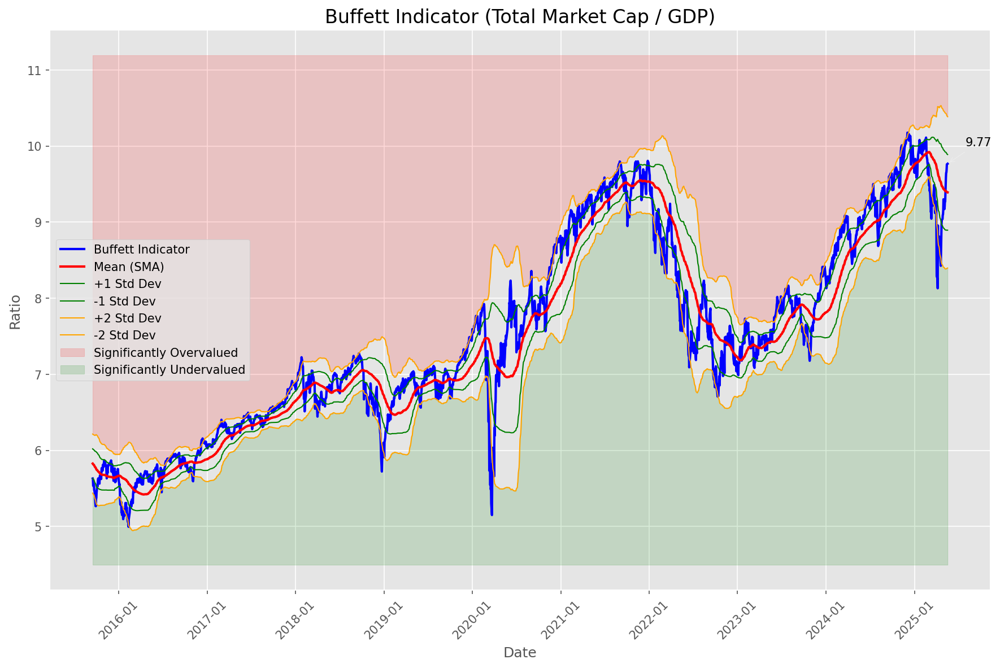

# **Daily Relative Strength Report**

**Date:** 2025-05-20

## **Market Valuation (Buffett Indicator)**

| Metric | Value |
|--------|-------|
| **Market Valuation** | **Fair Valued** |
| **Current Ratio** | 9.70 |
| **Historical Mean** | 9.39 |
| **Standard Deviation** | 0.50 |
| **Z-Score (StdDev from Mean)** | 0.76 |
| **Total Market Cap** | $290.91 trillion |
| **GDP** | $29.98 trillion |

## **Market Insights**

### **Market is Fairly Valued**

The market appears to be trading within a reasonable range of historical valuations. This suggests a balanced approach to equity investing is appropriate. Investors should:

- Focus on individual stock selection based on fundamentals and technicals
- Maintain normal equity allocations aligned with long-term goals
- Pay attention to sector rotation and relative strength
- Watch for changes in market leadership

Fair valuation typically suggests normal market returns can be expected, with stock selection becoming increasingly important.

### **Buffett Indicator Overview**

The Buffett Indicator (Total Market Cap / GDP) is a measure of the stock market's valuation relative to the size of the economy. It is named after Warren Buffett, who described it as "probably the best single measure of where valuations stand at any given moment."

- **Values above +2 standard deviations:** Market significantly overvalued
- **Values above +1 standard deviation:** Market overvalued
- **Values between -1 and +1 standard deviations:** Market fairly valued
- **Values below -1 standard deviation:** Market undervalued
- **Values below -2 standard deviations:** Market significantly undervalued

---

## **Sector Relative Strength**

Based on William O'Neil's Relative Strength Methodology

| ETF | Strength | RS Rating | Performance | Above Key MAs | Trend | Sector |
|-----|----------|-----------|-------------|--------------|-------|--------|
| [GLD](https://www.tradingview.com/chart/?symbol=GLD) | 95.0 | 90.0 | 11.88% | 10d ✓, 50d ✓, 200d ✓ | ↗️ | Gold |
| [XLI](https://www.tradingview.com/chart/?symbol=XLI) | 87.5 | 75.0 | 3.27% | 10d ✓, 50d ✓, 200d ✓ | ↗️ | Industrial |
| [XLU](https://www.tradingview.com/chart/?symbol=XLU) | 87.5 | 75.0 | 3.15% | 10d ✓, 50d ✓, 200d ✓ | ↗️ | Utilities |
| [BLOK](https://www.tradingview.com/chart/?symbol=BLOK) | 86.5 | 73.0 | 2.40% | 10d ✓, 50d ✓, 200d ✓ | ↗️ | Blockchain & Cryptocurrency |
| [XLP](https://www.tradingview.com/chart/?symbol=XLP) | 85.0 | 70.0 | 1.16% | 10d ✓, 50d ✓, 200d ✓ | ↗️ | Consumer Staples |
| [SLV](https://www.tradingview.com/chart/?symbol=SLV) | 84.5 | 69.0 | 0.81% | 10d ✓, 50d ✓, 200d ✓ | ↗️ | Silver |
| [CIBR](https://www.tradingview.com/chart/?symbol=CIBR) | 83.0 | 66.0 | 0.18% | 10d ✓, 50d ✓, 200d ✓ | ↗️ | Cybersecurity |
| [PAVE](https://www.tradingview.com/chart/?symbol=PAVE) | 82.0 | 64.0 | -0.11% | 10d ✓, 50d ✓, 200d ✓ | ↗️ | Infrastructure |
| [IYZ](https://www.tradingview.com/chart/?symbol=IYZ) | 82.0 | 64.0 | -0.07% | 10d ✓, 50d ✓, 200d ✓ | ↗️ | Telecommunications |
| [XLF](https://www.tradingview.com/chart/?symbol=XLF) | 78.5 | 57.0 | -1.91% | 10d ✓, 50d ✓, 200d ✓ | ↗️ | Financial |
| [KWEB](https://www.tradingview.com/chart/?symbol=KWEB) | 78.5 | 57.0 | -2.03% | 10d ✓, 50d ✓, 200d ✓ | ↗️ | Chinese Internet |
| [DBA](https://www.tradingview.com/chart/?symbol=DBA) | 77.0 | 54.0 | -2.66% | 10d ✓, 50d ✓, 200d ✓ | ↗️ | Agriculture |
| [ICLN](https://www.tradingview.com/chart/?symbol=ICLN) | 76.5 | 93.0 | 13.92% | 10d ✓, 50d ✓, 200d ✓ | ↘️ | Clean Energy |
| [XLC](https://www.tradingview.com/chart/?symbol=XLC) | 75.5 | 51.0 | -3.44% | 10d ✓, 50d ✓, 200d ✓ | ↗️ | Communications |
| [ARKW](https://www.tradingview.com/chart/?symbol=ARKW) | 74.5 | 49.0 | -3.83% | 10d ✓, 50d ✓, 200d ✓ | ↗️ | Next Generation Internet |
| [AIQ](https://www.tradingview.com/chart/?symbol=AIQ) | 73.5 | 47.0 | -4.27% | 10d ✓, 50d ✓, 200d ✓ | ↗️ | Artificial Intelligence & Technology |
| [XLY](https://www.tradingview.com/chart/?symbol=XLY) | 72.5 | 45.0 | -4.76% | 10d ✓, 50d ✓, 200d ✓ | ↗️ | Consumer Discretionary |
| [ARKF](https://www.tradingview.com/chart/?symbol=ARKF) | 71.5 | 43.0 | -5.29% | 10d ✓, 50d ✓, 200d ✓ | ↗️ | Fintech Innovation |
| [IYR](https://www.tradingview.com/chart/?symbol=IYR) | 68.8 | 58.0 | -1.49% | 10d ✓, 50d ✓, 200d ✗ | ↗️ | Real Estate |
| [URA](https://www.tradingview.com/chart/?symbol=URA) | 66.5 | 73.0 | 2.34% | 10d ✓, 50d ✓, 200d ✓ | ↘️ | Uranium |
| [BIL](https://www.tradingview.com/chart/?symbol=BIL) | 62.5 | 65.0 | 0.01% | 10d ✓, 50d ✓, 200d ✓ | ↘️ | Short-term Treasuries |
| [JETS](https://www.tradingview.com/chart/?symbol=JETS) | 61.5 | 23.0 | -13.03% | 10d ✓, 50d ✓, 200d ✓ | ↗️ | Airlines |
| [ARKK](https://www.tradingview.com/chart/?symbol=ARKK) | 61.5 | 23.0 | -13.06% | 10d ✓, 50d ✓, 200d ✓ | ↗️ | Innovation |
| [XLK](https://www.tradingview.com/chart/?symbol=XLK) | 54.0 | 48.0 | -4.00% | 10d ✓, 50d ✓, 200d ✓ | ↘️ | Technology |
| [XLB](https://www.tradingview.com/chart/?symbol=XLB) | 45.3 | 51.0 | -3.48% | 10d ✓, 50d ✓, 200d ✗ | ↘️ | Materials |
| [IYT](https://www.tradingview.com/chart/?symbol=IYT) | 38.3 | 37.0 | -6.96% | 10d ✓, 50d ✓, 200d ✗ | ↘️ | Transportation |
| [SOXX](https://www.tradingview.com/chart/?symbol=SOXX) | 35.8 | 32.0 | -8.93% | 10d ✓, 50d ✓, 200d ✗ | ↘️ | Semiconductors |
| [DBC](https://www.tradingview.com/chart/?symbol=DBC) | 28.9 | 38.0 | -6.75% | 10d ✓, 50d ✗, 200d ✗ | ↘️ | Commodities |
| [ITB](https://www.tradingview.com/chart/?symbol=ITB) | 27.9 | 36.0 | -7.51% | 10d ✗, 50d ✓, 200d ✗ | ↘️ | Home Construction |
| [XLV](https://www.tradingview.com/chart/?symbol=XLV) | 26.9 | 34.0 | -8.18% | 10d ✓, 50d ✗, 200d ✗ | ↘️ | Healthcare |
| [TLT](https://www.tradingview.com/chart/?symbol=TLT) | 26.5 | 53.0 | -3.06% | 10d ✗, 50d ✗, 200d ✗ | ↘️ | Long-term Treasuries |
| [IBB](https://www.tradingview.com/chart/?symbol=IBB) | 23.9 | 28.0 | -10.40% | 10d ✓, 50d ✗, 200d ✗ | ↘️ | Biotechnology |
| [ARKG](https://www.tradingview.com/chart/?symbol=ARKG) | 22.8 | 6.0 | -27.22% | 10d ✓, 50d ✓, 200d ✗ | ↘️ | Genomics |
| [UUP](https://www.tradingview.com/chart/?symbol=UUP) | 21.0 | 42.0 | -5.48% | 10d ✗, 50d ✗, 200d ✗ | ↘️ | U.S. Dollar |
| [XLE](https://www.tradingview.com/chart/?symbol=XLE) | 16.0 | 32.0 | -9.10% | 10d ✗, 50d ✗, 200d ✗ | ↘️ | Energy |

### **Sector ETF Performance Interpretation**

This table shows the relative strength metrics for different market sectors based on their representative ETFs:

- **ETF**: The ETF used to measure sector performance (click for chart)
- **Strength**: Overall sector strength score (0-100) combining multiple factors
- **RS Rating**: O'Neil RS rating of the sector ETF
- **Performance**: Performance of the sector ETF relative to SPY
- **Above Key MAs**: Whether the ETF is trading above its 10, 50, and 200-day moving averages
- **Trend**: Whether the sector is in an uptrend (↗️) or downtrend (↘️)

### **Current Sector Leadership**

The current market leadership is coming from the following sectors: **Gold, Industrial, Utilities**.

The **Gold** sector (represented by **GLD**) is showing particularly strong relative strength with an RS rating of 90.0 and performance of 11.88% vs. the S&P 500. This sector is trading above its 10-day, 50-day, 200-day moving average(s). Investors should consider focusing on high RS stocks within these leading sectors for potential outperformance.

---

## **Buy Recommendations**

The following 108 stocks show exceptional relative strength:

| RS Rating | Buy Score | Current Price | Chart | Name | Ticker |
|-----------|-----------|---------------|-------|------|--------|
| 100 | 100 | $19.50 | [Chart](https://www.tradingview.com/chart/?symbol=SPNT) | SiriusPoint Ltd. | SPNT |
| 100 | 100 | $41.35 | [Chart](https://www.tradingview.com/chart/?symbol=DRS) | Leonardo DRS, Inc. Common Stock | DRS |
| 100 | 100 | $133.69 | [Chart](https://www.tradingview.com/chart/?symbol=VSEC) | VSE Corp | VSEC |
| 100 | 100 | $28.39 | [Chart](https://www.tradingview.com/chart/?symbol=DB) | Deutsche Bank Aktiengesellschaft | DB |
| 100 | 100 | $98.14 | [Chart](https://www.tradingview.com/chart/?symbol=SEZL) | Sezzle Inc. Common Stock | SEZL |
| 100 | 100 | $194.05 | [Chart](https://www.tradingview.com/chart/?symbol=DAVE) | Dave Inc. Class A Common Stock | DAVE |
| 100 | 100 | $159.28 | [Chart](https://www.tradingview.com/chart/?symbol=NRG) | NRG Energy, Inc. | NRG |
| 100 | 100 | $23.23 | [Chart](https://www.tradingview.com/chart/?symbol=PRA) | ProAssurance Corporation | PRA |
| 99 | 100 | $409.06 | [Chart](https://www.tradingview.com/chart/?symbol=MSTR) | MicroStrategy Inc | MSTR |
| 99 | 100 | $29.95 | [Chart](https://www.tradingview.com/chart/?symbol=FMS) | Fresenius Medical Care AG | FMS |
| 99 | 100 | $26.70 | [Chart](https://www.tradingview.com/chart/?symbol=UVE) | UNIVERSAL INSURANCE HLDG, INC. | UVE |
| 99 | 100 | $35.75 | [Chart](https://www.tradingview.com/chart/?symbol=KTOS) | Kratos Defense & Security Solutions, Inc. | KTOS |
| 99 | 100 | $71.70 | [Chart](https://www.tradingview.com/chart/?symbol=ULS) | UL Solutions Inc. | ULS |
| 99 | 100 | $35.52 | [Chart](https://www.tradingview.com/chart/?symbol=AHR) | American Healthcare REIT, Inc. | AHR |
| 99 | 100 | $161.17 | [Chart](https://www.tradingview.com/chart/?symbol=PLMR) | Palomar Holdings, Inc. Common stock | PLMR |
| 99 | 100 | $24.16 | [Chart](https://www.tradingview.com/chart/?symbol=GRND) | Grindr Inc. | GRND |
| 98 | 100 | $24.39 | [Chart](https://www.tradingview.com/chart/?symbol=OR) | OR Royalties Inc. | OR |
| 98 | 100 | $132.87 | [Chart](https://www.tradingview.com/chart/?symbol=ATGE) | Adtalem Global Education Inc. Common Shares | ATGE |
| 98 | 100 | $43.38 | [Chart](https://www.tradingview.com/chart/?symbol=EWP) | iShares MSCI Spain ETF | EWP |
| 98 | 100 | $737.68 | [Chart](https://www.tradingview.com/chart/?symbol=AXON) | Axon Enterprise, Inc. Common Stock | AXON |
| 98 | 100 | $100.11 | [Chart](https://www.tradingview.com/chart/?symbol=LBRDK) | Liberty Broadband Corporation Class C | LBRDK |
| 98 | 100 | $44.55 | [Chart](https://www.tradingview.com/chart/?symbol=EXEL) | Exelixis Inc | EXEL |
| 98 | 100 | $81.01 | [Chart](https://www.tradingview.com/chart/?symbol=RBLX) | Roblox Corporation | RBLX |
| 98 | 100 | $35.74 | [Chart](https://www.tradingview.com/chart/?symbol=UTI) | Universal Technical Institute, Inc. | UTI |
| 97 | 100 | $138.60 | [Chart](https://www.tradingview.com/chart/?symbol=UGL) | ProShares Ultra Gold | UGL |
| 97 | 100 | $73.41 | [Chart](https://www.tradingview.com/chart/?symbol=WRB) | W.R. Berkley Corporation | WRB |
| 97 | 100 | $131.18 | [Chart](https://www.tradingview.com/chart/?symbol=COOP) | Mr. Cooper Group Inc. Common Stock | COOP |
| 97 | 100 | $154.58 | [Chart](https://www.tradingview.com/chart/?symbol=CAH) | Cardinal Health, Inc. | CAH |
| 97 | 100 | $31.84 | [Chart](https://www.tradingview.com/chart/?symbol=EUFN) | iShares MSCI Europe Financials ETF | EUFN |
| 96 | 100 | $164.42 | [Chart](https://www.tradingview.com/chart/?symbol=HWM) | Howmet Aerospace Inc. | HWM |
| 96 | 100 | $121.38 | [Chart](https://www.tradingview.com/chart/?symbol=EHC) | Encompass Health Corporation Common Stock | EHC |
| 96 | 100 | $88.24 | [Chart](https://www.tradingview.com/chart/?symbol=RBRK) | Rubrik, Inc. | RBRK |
| 96 | 100 | $161.89 | [Chart](https://www.tradingview.com/chart/?symbol=SE) | Sea Limited American Depositary Shares, each representing one Class A Ordinary Share | SE |
| 96 | 100 | $82.54 | [Chart](https://www.tradingview.com/chart/?symbol=WPM) | Wheaton Precious Metals Corp. Common Stock | WPM |
| 96 | 100 | $38.72 | [Chart](https://www.tradingview.com/chart/?symbol=PAY) | Paymentus Holdings, Inc. | PAY |
| 96 | 100 | $177.31 | [Chart](https://www.tradingview.com/chart/?symbol=RGLD) | Royal Gold Inc | RGLD |
| 96 | 100 | $20.70 | [Chart](https://www.tradingview.com/chart/?symbol=TFPM) | Triple Flag Precious Metals Corp. | TFPM |
| 96 | 100 | $36.63 | [Chart](https://www.tradingview.com/chart/?symbol=AS) | Amer Sports, Inc. | AS |
| 95 | 100 | $47.74 | [Chart](https://www.tradingview.com/chart/?symbol=EWI) | iShares MSCI Italy ETF | EWI |
| 95 | 100 | $30.98 | [Chart](https://www.tradingview.com/chart/?symbol=BCH) | Banco de ChileAmerican Depositary Shares (Each representing 200 shares of Common Stock) | BCH |
| 95 | 100 | $164.00 | [Chart](https://www.tradingview.com/chart/?symbol=FNV) | Franco-Nevada Corporation | FNV |
| 94 | 100 | $173.85 | [Chart](https://www.tradingview.com/chart/?symbol=PM) | Philip Morris International Inc. | PM |
| 94 | 100 | $31.29 | [Chart](https://www.tradingview.com/chart/?symbol=PRDO) | Perdoceo Education Corporation | PRDO |
| 94 | 100 | $41.69 | [Chart](https://www.tradingview.com/chart/?symbol=EWG) | iShares MSCI Germany ETF | EWG |
| 94 | 100 | $44.37 | [Chart](https://www.tradingview.com/chart/?symbol=BTI) | British American Tobacco p.l.c. American Depositary Shares, American Depositary Shares, each representing one Ordinary Share | BTI |
| 94 | 100 | $130.99 | [Chart](https://www.tradingview.com/chart/?symbol=HIG) | The Hartford Insurance Group, Inc. | HIG |
| 94 | 100 | $17.80 | [Chart](https://www.tradingview.com/chart/?symbol=BCS) | Barclays PLC | BCS |
| 94 | 100 | $74.08 | [Chart](https://www.tradingview.com/chart/?symbol=VRNA) | Verona Pharma plc | VRNA |
| 93 | 100 | $23.80 | [Chart](https://www.tradingview.com/chart/?symbol=BTSG) | BrightSpring Health Services, Inc. Common Stock | BTSG |
| 93 | 100 | $325.82 | [Chart](https://www.tradingview.com/chart/?symbol=PODD) | Insulet Corporation | PODD |
| 93 | 100 | $112.36 | [Chart](https://www.tradingview.com/chart/?symbol=AEM) | Agnico Eagle Mines Ltd. | AEM |
| 93 | 100 | $30.99 | [Chart](https://www.tradingview.com/chart/?symbol=NTGR) | NETGEAR, Inc. | NTGR |
| 93 | 100 | $25.18 | [Chart](https://www.tradingview.com/chart/?symbol=BSAC) | Banco Santander-Chile | BSAC |
| 92 | 100 | $1185.54 | [Chart](https://www.tradingview.com/chart/?symbol=NFLX) | NetFlix Inc | NFLX |
| 92 | 100 | $31.54 | [Chart](https://www.tradingview.com/chart/?symbol=TGS) | Transportadora de Gas del Sur S.A. ADS | TGS |
| 92 | 100 | $19.56 | [Chart](https://www.tradingview.com/chart/?symbol=KT) | KT Corp. | KT |
| 91 | 100 | $31.37 | [Chart](https://www.tradingview.com/chart/?symbol=SGOL) | abrdn Physical Gold Shares ETF | SGOL |
| 91 | 100 | $125.83 | [Chart](https://www.tradingview.com/chart/?symbol=PLTR) | Palantir Technologies Inc. Class A Common Stock | PLTR |
| 91 | 100 | $118.17 | [Chart](https://www.tradingview.com/chart/?symbol=BJ) | BJs Wholesale Club Holdings, Inc. Common Stock | BJ |
| 91 | 100 | $102.81 | [Chart](https://www.tradingview.com/chart/?symbol=AXS) | Axis Capital Holders Limited | AXS |
| 91 | 100 | $172.83 | [Chart](https://www.tradingview.com/chart/?symbol=ITA) | iShares U.S. Aerospace & Defense ETF | ITA |
| 91 | 100 | $65.11 | [Chart](https://www.tradingview.com/chart/?symbol=GLDM) | SPDR Gold MiniShares | GLDM |
| 90 | 100 | $62.00 | [Chart](https://www.tradingview.com/chart/?symbol=IAU) | iShares Gold Trust | IAU |
| 90 | 100 | $303.03 | [Chart](https://www.tradingview.com/chart/?symbol=GLD) | SPDR Gold Trust, SPDR Gold Shares | GLD |
| 90 | 100 | $32.48 | [Chart](https://www.tradingview.com/chart/?symbol=AAAU) | Goldman Sachs Physical Gold ETF Shares | AAAU |
| 90 | 100 | $33.97 | [Chart](https://www.tradingview.com/chart/?symbol=FDP) | Fresh Del Monte Produce Inc. | FDP |
| 90 | 100 | $32.78 | [Chart](https://www.tradingview.com/chart/?symbol=IAUM) | iShares Gold Trust Micro | IAUM |
| 90 | 100 | $234.36 | [Chart](https://www.tradingview.com/chart/?symbol=GE) | GE Aerospace | GE |
| 90 | 100 | $42.90 | [Chart](https://www.tradingview.com/chart/?symbol=FHI) | Federated Hermes, Inc. | FHI |
| 89 | 100 | $25.08 | [Chart](https://www.tradingview.com/chart/?symbol=PHYS) | Sprott Physical Gold Trust | PHYS |
| 89 | 100 | $233.41 | [Chart](https://www.tradingview.com/chart/?symbol=CRS) | Carpenter Technology Corp | CRS |
| 89 | 100 | $277.59 | [Chart](https://www.tradingview.com/chart/?symbol=CME) | CME Group Inc. | CME |
| 89 | 100 | $81.50 | [Chart](https://www.tradingview.com/chart/?symbol=NFG) | National Fuel Gas Co. | NFG |
| 88 | 100 | $37.59 | [Chart](https://www.tradingview.com/chart/?symbol=CNP) | CenterPoint Energy, Inc. | CNP |
| 87 | 100 | $82.08 | [Chart](https://www.tradingview.com/chart/?symbol=UNM) | Unum Group | UNM |
| 87 | 100 | $251.58 | [Chart](https://www.tradingview.com/chart/?symbol=RSG) | Republic Services Inc. | RSG |
| 87 | 100 | $236.11 | [Chart](https://www.tradingview.com/chart/?symbol=TTWO) | Take-Two Interactive Software Inc | TTWO |
| 88 | 97 | $58.00 | [Chart](https://www.tradingview.com/chart/?symbol=UVV) | Universal Corporation | UVV |
| 88 | 97 | $60.20 | [Chart](https://www.tradingview.com/chart/?symbol=IBIT) | iShares Bitcoin Trust ETF | IBIT |
| 86 | 97 | $136.79 | [Chart](https://www.tradingview.com/chart/?symbol=RTX) | RTX Corporation | RTX |
| 85 | 97 | $47.69 | [Chart](https://www.tradingview.com/chart/?symbol=MRCY) | Mercury Systems Inc. | MRCY |
| 84 | 97 | $25.64 | [Chart](https://www.tradingview.com/chart/?symbol=EWS) | iShares MSCI Singapore ETF | EWS |
| 83 | 97 | $1387.32 | [Chart](https://www.tradingview.com/chart/?symbol=ORLY) | O'Reilly Automotive, Inc. | ORLY |
| 87 | 96 | $63.73 | [Chart](https://www.tradingview.com/chart/?symbol=RYTM) | Rhythm Pharmaceuticals, Inc. Common Stock | RYTM |
| 86 | 96 | $53.55 | [Chart](https://www.tradingview.com/chart/?symbol=EPR) | EPR Properties | EPR |
| 86 | 96 | $47.84 | [Chart](https://www.tradingview.com/chart/?symbol=FTS) | Fortis Inc. Common Shares | FTS |
| 86 | 96 | $50.09 | [Chart](https://www.tradingview.com/chart/?symbol=TRP) | TC Energy Corporation | TRP |
| 85 | 96 | $54.91 | [Chart](https://www.tradingview.com/chart/?symbol=RELX) | RELX PLC | RELX |
| 85 | 96 | $68.92 | [Chart](https://www.tradingview.com/chart/?symbol=CTVA) | Corteva, Inc. Common Stock | CTVA |
| 84 | 96 | $63.95 | [Chart](https://www.tradingview.com/chart/?symbol=HOOD) | Robinhood Markets, Inc. Class A Common Stock | HOOD |
| 83 | 96 | $29.00 | [Chart](https://www.tradingview.com/chart/?symbol=CEF) | Sprott Physical Gold and Silver Trust | CEF |
| 83 | 96 | $159.34 | [Chart](https://www.tradingview.com/chart/?symbol=ATO) | Atmos Energy Corporation | ATO |
| 83 | 96 | $89.05 | [Chart](https://www.tradingview.com/chart/?symbol=L) | Loews Corporation | L |
| 82 | 96 | $69.62 | [Chart](https://www.tradingview.com/chart/?symbol=KR) | The Kroger Co. | KR |
| 81 | 96 | $27.89 | [Chart](https://www.tradingview.com/chart/?symbol=T) | AT&T Inc. | T |
| 85 | 95 | $59.04 | [Chart](https://www.tradingview.com/chart/?symbol=IGF) | iShares Global Infrastructure ETF | IGF |
| 82 | 94 | $43.97 | [Chart](https://www.tradingview.com/chart/?symbol=HMN) | Horace Mann Educators Corporation | HMN |
| 82 | 94 | $197.98 | [Chart](https://www.tradingview.com/chart/?symbol=LOPE) | Grand Canyon Education, Inc | LOPE |
| 83 | 93 | $224.91 | [Chart](https://www.tradingview.com/chart/?symbol=CBOE) | Cboe Global Markets, Inc. | CBOE |
| 82 | 93 | $299.74 | [Chart](https://www.tradingview.com/chart/?symbol=CVNA) | Carvana Co. | CVNA |
| 81 | 93 | $286.26 | [Chart](https://www.tradingview.com/chart/?symbol=PGR) | Progressive Corporation | PGR |
| 82 | 92 | $188.11 | [Chart](https://www.tradingview.com/chart/?symbol=GDDY) | GoDaddy Inc | GDDY |
| 81 | 92 | $138.32 | [Chart](https://www.tradingview.com/chart/?symbol=DTE) | DTE Energy Company | DTE |
| 80 | 92 | $59.89 | [Chart](https://www.tradingview.com/chart/?symbol=HSBC) | HSBC Holdings PLC | HSBC |
| 80 | 92 | $207.45 | [Chart](https://www.tradingview.com/chart/?symbol=DRI) | Darden Restaurants, Inc. | DRI |
| 81 | 90 | $194.55 | [Chart](https://www.tradingview.com/chart/?symbol=GPOR) | Gulfport Energy Corporation | GPOR |
| 80 | 90 | $76.51 | [Chart](https://www.tradingview.com/chart/?symbol=OGS) | ONE GAS, INC. | OGS |
| 80 | 90 | $176.14 | [Chart](https://www.tradingview.com/chart/?symbol=ICE) | Intercontinental Exchange  Inc. | ICE |

---

## **Sell Recommendations**

The following 93 stocks show deteriorating relative strength:

| RS Rating | Sell Score | Current Price | Chart | Name | Ticker |
|-----------|------------|---------------|-------|------|--------|
| 1 | 100 | $17.71 | [Chart](https://www.tradingview.com/chart/?symbol=ICHR) | Ichor Holdings | ICHR |
| 2 | 100 | $13.19 | [Chart](https://www.tradingview.com/chart/?symbol=IART) | Integra LifeSciences Holdings | IART |
| 2 | 100 | $277.98 | [Chart](https://www.tradingview.com/chart/?symbol=SAIA) | Saia, Inc. | SAIA |
| 3 | 100 | $17.51 | [Chart](https://www.tradingview.com/chart/?symbol=VRNT) | Verint Systems Inc | VRNT |
| 3 | 100 | $30.64 | [Chart](https://www.tradingview.com/chart/?symbol=TWST) | Twist Bioscience Corporation Common Stock | TWST |
| 3 | 100 | $14.36 | [Chart](https://www.tradingview.com/chart/?symbol=DQ) | Daqo New Energy Corp. American Depositary Shares (each representing 5 Ordinary Shares) | DQ |
| 3 | 100 | $46.99 | [Chart](https://www.tradingview.com/chart/?symbol=WFRD) | Weatherford International plc Ordinary Shares | WFRD |
| 3 | 100 | $10.22 | [Chart](https://www.tradingview.com/chart/?symbol=HPK) | HighPeak Energy, Inc. Common Stock | HPK |
| 4 | 100 | $11.49 | [Chart](https://www.tradingview.com/chart/?symbol=CLB) | Core Laboratories Inc. | CLB |
| 4 | 100 | $10.85 | [Chart](https://www.tradingview.com/chart/?symbol=LSPD) | Lightspeed Commerce Inc. | LSPD |
| 4 | 100 | $23.18 | [Chart](https://www.tradingview.com/chart/?symbol=RPD) | Rapid7, Inc. Common Stock | RPD |
| 5 | 100 | $15.15 | [Chart](https://www.tradingview.com/chart/?symbol=PENN) | PENN Entertainment, Inc. Common Stock | PENN |
| 5 | 100 | $32.87 | [Chart](https://www.tradingview.com/chart/?symbol=CYTK) | Cytokinetics Inc. | CYTK |
| 6 | 100 | $126.16 | [Chart](https://www.tradingview.com/chart/?symbol=TFX) | Teleflex Incorporated | TFX |
| 6 | 100 | $21.12 | [Chart](https://www.tradingview.com/chart/?symbol=VERA) | Vera Therapeutics, Inc. Class A Common Stock | VERA |
| 6 | 100 | $14.90 | [Chart](https://www.tradingview.com/chart/?symbol=IMVT) | Immunovant, Inc. Common Stock | IMVT |
| 6 | 100 | $12.61 | [Chart](https://www.tradingview.com/chart/?symbol=ARCT) | Arcturus Therapeutics Holdings Inc. Common Stock | ARCT |
| 6 | 100 | $65.81 | [Chart](https://www.tradingview.com/chart/?symbol=ARCB) | ArcBest Corporation | ARCB |
| 7 | 100 | $29.52 | [Chart](https://www.tradingview.com/chart/?symbol=SRDX) | Surmodics, Inc. Common Stock | SRDX |
| 8 | 100 | $21.52 | [Chart](https://www.tradingview.com/chart/?symbol=UCO) | ProShares Ultra Bloomberg Crude Oil | UCO |
| 8 | 100 | $89.74 | [Chart](https://www.tradingview.com/chart/?symbol=BCC) | Boise Cascade Company | BCC |
| 8 | 100 | $17.23 | [Chart](https://www.tradingview.com/chart/?symbol=MLKN) | MillerKnoll, Inc. Common Stock | MLKN |
| 8 | 100 | $15.31 | [Chart](https://www.tradingview.com/chart/?symbol=DXC) | DXC Technology Company | DXC |
| 9 | 100 | $32.87 | [Chart](https://www.tradingview.com/chart/?symbol=MBIN) | Merchants Bancorp Common Stock | MBIN |
| 9 | 100 | $21.03 | [Chart](https://www.tradingview.com/chart/?symbol=AMRK) | A-Mark Precious Metals, Inc. | AMRK |
| 11 | 100 | $47.59 | [Chart](https://www.tradingview.com/chart/?symbol=RHI) | Robert Half Inc. | RHI |
| 13 | 100 | $15.73 | [Chart](https://www.tradingview.com/chart/?symbol=AMZY) | YieldMax AMZN Option Income Strategy ETF | AMZY |
| 16 | 100 | $94.73 | [Chart](https://www.tradingview.com/chart/?symbol=CHRD) | Chord Energy Corporation Common Stock | CHRD |
| 17 | 100 | $10.34 | [Chart](https://www.tradingview.com/chart/?symbol=CMRE) | Costamare Inc. | CMRE |
| 22 | 100 | $47.45 | [Chart](https://www.tradingview.com/chart/?symbol=LINE) | Lineage, Inc. Common Stock | LINE |
| 21 | 99 | $18.73 | [Chart](https://www.tradingview.com/chart/?symbol=NVDS) | Investment Managers Series Trust II Tradr 1.5X Short NVDA Daily ETF | NVDS |
| 2 | 98 | $50.01 | [Chart](https://www.tradingview.com/chart/?symbol=CCOI) | Cogent Communications Holdings, Inc. | CCOI |
| 5 | 98 | $10.31 | [Chart](https://www.tradingview.com/chart/?symbol=VREX) | Varex Imaging Corporation Common Stock | VREX |
| 8 | 98 | $14.69 | [Chart](https://www.tradingview.com/chart/?symbol=INMD) | InMode Ltd. Ordinary Shares | INMD |
| 11 | 98 | $222.40 | [Chart](https://www.tradingview.com/chart/?symbol=OIH) | VanEck Oil Services ETF | OIH |
| 6 | 97 | $49.80 | [Chart](https://www.tradingview.com/chart/?symbol=LSCC) | Lattice Semiconductor Corp | LSCC |
| 11 | 97 | $50.08 | [Chart](https://www.tradingview.com/chart/?symbol=ERX) | Direxion Daily Energy Bull 2X Shares | ERX |
| 12 | 97 | $63.92 | [Chart](https://www.tradingview.com/chart/?symbol=SPB) | Spectrum Brands Holdings, Inc. | SPB |
| 7 | 96 | $131.45 | [Chart](https://www.tradingview.com/chart/?symbol=KRYS) | Krystal Biotech, Inc. Common Stock | KRYS |
| 9 | 95 | $11.81 | [Chart](https://www.tradingview.com/chart/?symbol=APLE) | Apple Hospitality REIT, Inc. | APLE |
| 10 | 95 | $44.24 | [Chart](https://www.tradingview.com/chart/?symbol=MTDR) | MATADOR RESOURCES COMPANY | MTDR |
| 17 | 95 | $11.27 | [Chart](https://www.tradingview.com/chart/?symbol=PBR.A) | Petroleo Brasileiro S.A.-Petrobras | PBR.A |
| 11 | 94 | $12.19 | [Chart](https://www.tradingview.com/chart/?symbol=WEN) | The Wendy's Company | WEN |
| 15 | 94 | $34.52 | [Chart](https://www.tradingview.com/chart/?symbol=SLB) | Schlumberger Limited | SLB |
| 11 | 93 | $114.45 | [Chart](https://www.tradingview.com/chart/?symbol=BLDR) | Builders FirstSource, Inc. | BLDR |
| 13 | 93 | $11.99 | [Chart](https://www.tradingview.com/chart/?symbol=PBR) | PETROLEO BRASILEIRO S.A.-PETROBRAS ADS (REP 1 COMMON SHARE) | PBR |
| 17 | 92 | $35.77 | [Chart](https://www.tradingview.com/chart/?symbol=TECK) | Teck Resources Limited | TECK |
| 20 | 92 | $53.02 | [Chart](https://www.tradingview.com/chart/?symbol=KBH) | KB Home | KBH |
| 22 | 92 | $20.02 | [Chart](https://www.tradingview.com/chart/?symbol=BITI) | ProShares Short Bitcoin ETF | BITI |
| 22 | 92 | $10.11 | [Chart](https://www.tradingview.com/chart/?symbol=LBTYK) | Liberty Global Ltd. Class C Common Shares | LBTYK |
| 19 | 91 | $19.77 | [Chart](https://www.tradingview.com/chart/?symbol=FOR) | Forestar Group Inc. | FOR |
| 24 | 91 | $13.22 | [Chart](https://www.tradingview.com/chart/?symbol=ZUMZ) | Zumiez Inc. | ZUMZ |
| 15 | 90 | $32.75 | [Chart](https://www.tradingview.com/chart/?symbol=TENB) | Tenable Holdings, Inc. | TENB |
| 18 | 89 | $16.75 | [Chart](https://www.tradingview.com/chart/?symbol=CHCT) | Community Healthcare Trust Incorporated Common Stock, $0.01 par value per share | CHCT |
| 20 | 89 | $32.19 | [Chart](https://www.tradingview.com/chart/?symbol=DVN) | Devon Energy Corporation | DVN |
| 25 | 88 | $35.12 | [Chart](https://www.tradingview.com/chart/?symbol=SU) | Suncor Energy, Inc. | SU |
| 18 | 87 | $29.16 | [Chart](https://www.tradingview.com/chart/?symbol=BP) | BP p.l.c. | BP |
| 19 | 87 | $31.18 | [Chart](https://www.tradingview.com/chart/?symbol=CRNX) | Crinetics Pharmaceuticals, Inc. | CRNX |
| 22 | 85 | $10.48 | [Chart](https://www.tradingview.com/chart/?symbol=HOPE) | Hope Bancorp, Inc. | HOPE |
| 25 | 85 | $10.22 | [Chart](https://www.tradingview.com/chart/?symbol=SCS) | Steelcase, Inc. | SCS |
| 17 | 84 | $112.71 | [Chart](https://www.tradingview.com/chart/?symbol=EOG) | EOG Resources, Inc. | EOG |
| 31 | 84 | $66.37 | [Chart](https://www.tradingview.com/chart/?symbol=MTH) | Meritage Homes Corporation | MTH |
| 24 | 83 | $17.59 | [Chart](https://www.tradingview.com/chart/?symbol=STR) | Sitio Royalties Corp. | STR |
| 27 | 83 | $16.68 | [Chart](https://www.tradingview.com/chart/?symbol=MLNK) | MeridianLink, Inc. | MLNK |
| 24 | 82 | $16.14 | [Chart](https://www.tradingview.com/chart/?symbol=PD) | PagerDuty, Inc. | PD |
| 21 | 81 | $14.55 | [Chart](https://www.tradingview.com/chart/?symbol=RYLD) | Global X Russell 2000 Covered Call ETF | RYLD |
| 24 | 81 | $10.10 | [Chart](https://www.tradingview.com/chart/?symbol=CION) | CION Investment Corporation | CION |
| 28 | 81 | $14.43 | [Chart](https://www.tradingview.com/chart/?symbol=OCSL) | Oaktree Specialty Lending Corporation | OCSL |
| 20 | 80 | $31.70 | [Chart](https://www.tradingview.com/chart/?symbol=AXTA) | Axalta Coating Systems Ltd. | AXTA |
| 24 | 80 | $11.25 | [Chart](https://www.tradingview.com/chart/?symbol=NEWT) | NewtekOne, Inc. Common Stock | NEWT |
| 24 | 79 | $11.89 | [Chart](https://www.tradingview.com/chart/?symbol=TWO) | Two Harbors Investment Corp. | TWO |
| 34 | 79 | $25.79 | [Chart](https://www.tradingview.com/chart/?symbol=RCI) | Rogers Communications, Inc. | RCI |
| 26 | 78 | $34.32 | [Chart](https://www.tradingview.com/chart/?symbol=SQM) | Sociedad Quimica y Minera de Chile SA | SQM |
| 28 | 78 | $15.01 | [Chart](https://www.tradingview.com/chart/?symbol=HR) | Healthcare Realty Trust Incorporated | HR |
| 29 | 78 | $26.24 | [Chart](https://www.tradingview.com/chart/?symbol=WY) | Weyerhaeuser Company | WY |
| 33 | 78 | $59.92 | [Chart](https://www.tradingview.com/chart/?symbol=BMRN) | BioMarin Pharmaceuticals Inc | BMRN |
| 26 | 77 | $132.04 | [Chart](https://www.tradingview.com/chart/?symbol=HES) | Hess Corporation | HES |
| 35 | 76 | $35.66 | [Chart](https://www.tradingview.com/chart/?symbol=CPB) | The Campbell's Company Common Stock | CPB |
| 34 | 75 | $295.50 | [Chart](https://www.tradingview.com/chart/?symbol=BLD) | TopBuild Corp. Common Stock | BLD |
| 37 | 75 | $38.21 | [Chart](https://www.tradingview.com/chart/?symbol=LIT) | Global X Lithium & Battery Tech ETF | LIT |
| 29 | 74 | $106.60 | [Chart](https://www.tradingview.com/chart/?symbol=MHK) | Mohawk Industries, Inc. | MHK |
| 38 | 72 | $21.40 | [Chart](https://www.tradingview.com/chart/?symbol=DBC) | Invesco DB Commodity Index Tracking Fund | DBC |
| 30 | 71 | $18.32 | [Chart](https://www.tradingview.com/chart/?symbol=UE) | UBRAN EDGE PROPERTIES | UE |
| 32 | 70 | $83.64 | [Chart](https://www.tradingview.com/chart/?symbol=XLE) | Energy Select Sector SPDR Fund | XLE |
| 35 | 70 | $15.44 | [Chart](https://www.tradingview.com/chart/?symbol=SAFE) | Safehold Inc. | SAFE |
| 39 | 70 | $11.14 | [Chart](https://www.tradingview.com/chart/?symbol=MQY) | Blackrock Muni Yield Quality Fund, Inc | MQY |
| 37 | 69 | $10.68 | [Chart](https://www.tradingview.com/chart/?symbol=AVO) | Mission Produce, Inc. Common Stock | AVO |
| 34 | 68 | $22.30 | [Chart](https://www.tradingview.com/chart/?symbol=MGY) | Magnolia Oil & Gas Corporation Class A Common Stock | MGY |
| 36 | 68 | $12.87 | [Chart](https://www.tradingview.com/chart/?symbol=PDBC) | Invesco Actively Managed Exch-Traded Commodity Fd Tr Invesco Optimum Yield Diversified Commodity Strategy No K-1 ETF | PDBC |
| 39 | 68 | $27.88 | [Chart](https://www.tradingview.com/chart/?symbol=KHC) | The Kraft Heinz Company Common Stock | KHC |
| 35 | 67 | $10.81 | [Chart](https://www.tradingview.com/chart/?symbol=SEMR) | SEMrush Holdings, Inc. | SEMR |
| 39 | 66 | $10.44 | [Chart](https://www.tradingview.com/chart/?symbol=NMZ) | Nuveen Municipal High Income Opportunity Fund | NMZ |
| 38 | 62 | $12.84 | [Chart](https://www.tradingview.com/chart/?symbol=PCN) | PIMCO Corporate & Income Strategy Fund | PCN |

## **Methodology**

This report uses William O'Neil's relative strength methodology from Investors Business Daily:

* **RS Rating**: Percentile rank of stock's performance vs. S&P 500 over the past 63 trading days (1-99 scale)
* **Buy Criteria**: RS Rating >= 80, price above 50-day MA, strong uptrend, increasing volume
* **Sell Criteria**: RS Rating < 40, price below 50-day MA, downtrend, decreasing volume

### **O'Neil's Key Principles**

1. **Focus on relative performance** - stocks outperforming the market
2. **Price trend confirmation** - stock must be in an uptrend
3. **Volume confirmation** - strong volume supports price moves
4. **Moving average validation** - price above key moving averages
5. **Market leaders only** - concentrate on top-performing stocks

*Report generated automatically after market close*